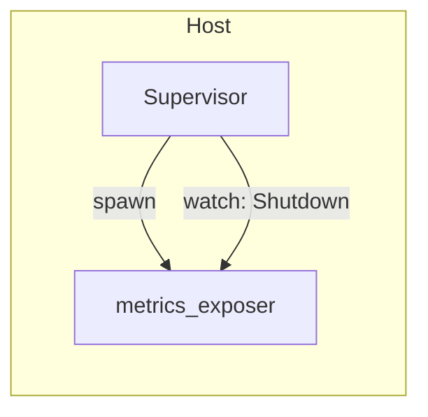
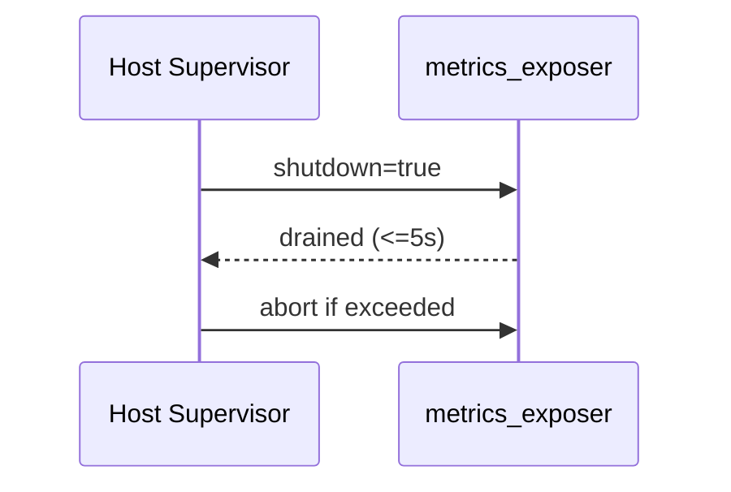

---

````markdown
---
title: Concurrency Model — ron-metrics
crate: ron-metrics
owner: Stevan White
last-reviewed: 2025-10-05
status: draft
template_version: 1.1
msrv: 1.80.0
tokio: "1.x (pinned at workspace root)"
loom: "0.7+ (dev-only)"
lite_mode: "For small library crates: fill §§1,3,4,5,10,11 and mark others N/A"
---

# Concurrency Model — ron-metrics

This document makes the concurrency rules **explicit**: tasks, channels, locks, shutdown, timeouts,
and validation (property/loom/TLA+). It complements `docs/SECURITY.md`, `docs/CONFIG.md`,
and the crate’s `README.md` and `IDB.md`.

> **Golden rule:** never hold a lock across `.await` in supervisory or hot paths.

---

## 0) Lite Mode (for tiny lib crates)

**This crate qualifies as “small library with a tiny exposer.”**  
We document a minimal runtime topology for the Axum exposer task, but there are **no background workers**
beyond the HTTP server. Sections are completed where applicable; others are N/A.

---

## 1) Invariants (MUST)

- **[I-1] No lock across `.await`.** If unavoidable, split the critical section; guards are **always** dropped before awaiting.
- **[I-2] Single registration / single writer.** Metric families are registered once (`OnceCell`/`OnceLock`); handles are cloned; no re-registration.
- **[I-3] Bounded channels only.** Any queue used by embedding bins is **bounded** with explicit overflow policy.
- **[I-4] Explicit timeouts.** Exposer I/O uses read/write/idle timeouts from `CONFIG.md`; no unbounded waits.
- **[I-5] Cooperative cancellation.** All `.await` points are cancel-safe or guarded by `tokio::select!`.
- **[I-6] Graceful shutdown.** On shutdown: stop intake, drain within 1–5s, then abort stragglers; increment `tasks_aborted_total` on abort.
- **[I-7] No blocking syscalls on the async runtime.** If blocking is unavoidable, use `spawn_blocking` (rare here).
- **[I-8] No task leaks.** Spawned tasks are tracked; joins are awaited during teardown. Detachment requires explicit rationale.
- **[I-9] Backpressure over buffering.** Prefer `try_send` + typed `Busy` error over growing queues; increment `busy_rejections_total`.
- **[I-10] Framing & shutdown.** If any stream protocol is later added, use length-delimited framing and call `.shutdown().await` on close.
- **[I-11] Async Drop discipline.** `Drop` never blocks; provide async `close()/shutdown()` and require callers to invoke it.
- **[I-12] PQ/ZK counters are atomic & wait-free.** Recording `pq_*_failures_total`, `zk_*_failures_total`, and `zk_proof_latency_seconds.observe()` performs **no allocations** and acquires **no locks** on hot paths (pre-registered buckets, atomics only).
- **[I-13] Bias toward shutdown in selects.** Use `tokio::select! { biased; ... }` in long-lived loops so shutdown cannot be starved by steady traffic.
- **[I-14] Time-source injection.** All long waits and deadlines use `tokio::time` and allow a test clock (e.g., `pause()/advance()`) under Loom or deterministic tests.
- **[I-15] No cross-thread single-threaded cells.** `Rc/RefCell` remain local to a single task; cross-task sharing uses `Arc` + channels only.

---

## 2) Runtime Topology

**Scope:** Only the optional HTTP exposer (`/metrics`, `/healthz`, `/readyz`) inside services that embed this crate.

- **Runtime:** Tokio **multi-threaded** (inherited from host service).
- **Primary task(s):**
  - `metrics_exposer` — Axum server serving `/metrics`, `/healthz`, `/readyz`.
- **Supervision:** The host supervises task lifecycles. On panic/restart, `service_restarts_total{service}` increments.

```mermaid
flowchart TB
  subgraph Host Service Runtime
    SUP[Supervisor (host)] -->|spawn| EXPOSE[metrics_exposer (Axum)]
    SUP -->|watch: Shutdown| EXPOSE
  end
  style SUP fill:#0ea5e9,stroke:#0c4a6e,color:#fff
  style EXPOSE fill:#10b981,stroke:#065f46,color:#002
````

**Text (accessibility):** The host’s Supervisor spawns a single `metrics_exposer` task and issues a watch-based shutdown signal. No internal worker pools exist in this crate.

---

## 3) Channels & Backpressure

**Inventory (bounded unless noted):**

| Name             | Kind        | Capacity | Producers → Consumers | Backpressure Policy       | Drop Semantics                        |
| ---------------- | ----------- | -------: | --------------------- | ------------------------- | ------------------------------------- |
| `shutdown_watch` | `watch`     |        1 | host → exposer        | last-write wins           | N/A                                   |
| `bus_broadcast`* | `broadcast` |     1024 | kernel → subscribers  | lag counter + drop oldest | `bus_lagged_total` increments on drop |

* Observed by this crate’s metrics (lag counters) but **owned by kernel/host**, not by `ron-metrics`.

**Guidelines:**

* Prefer `try_send` and return `Error::Busy` (e.g., 429 in HTTP services) rather than enqueue unbounded work.
* Expose `queue_depth{queue}` gauge and `queue_dropped_total{queue}` counter **in host services** that add queues.
* `broadcast` subscribers MUST drain or drop fast — **never** block the exposer’s thread.

---

## 4) Locks & Shared State

**Allowed**

* Short-lived `Mutex`/`RwLock` for local metadata or `HealthState` snapshots **without** `.await` under lock.
* Read-mostly snapshots as `Arc<StateSnapshot>`; refresh via replace-on-write.

**Forbidden**

* Holding any lock across `.await`.
* Nested locks without a documented order.

**Hierarchy (if ever needed for this crate)**

1. `metrics_registry_meta`
2. `health_state_meta`
3. `label_cache`

---

## 5) Timeouts, Retries, Deadlines

* **Exposer I/O timeouts (from `CONFIG.md`):** `read=2s`, `write=2s`, `idle=15s` (configurable).
* **No internal RPCs** in this crate; host services apply their own RPC deadlines/retries.
* **Tests:** Use `tokio::time::pause()` + `advance()` to avoid flakiness.

```mermaid
sequenceDiagram
  autonumber
  participant P as Prometheus
  participant E as ron-metrics exposer
  P->>E: GET /metrics (deadline=2s)
  E-->>P: 200 text/plain; version=00
  Note over E: On overload → upstream shedding happens earlier.<br/>Exposer stays responsive.
```

---

## 6) Cancellation & Shutdown

* **Signal source:** host emits `KernelEvent::Shutdown` or uses `wait_for_ctrl_c()`.
* **Propagation pattern (biased):**

  ```rust
  tokio::select! {
    biased;
    _ = shutdown.changed() => { /* begin graceful close */ }
    res = axum::serve(listener, app) => { /* normal server exit */ }
  }
  ```
* **Drain window:** 1–5s for inflight scrapes; then `handle.abort()` if necessary.
* **Metrics:** increment `tasks_aborted_total{kind="exposer"}` on abort; flip `/readyz` to 503 before exit.

---

## 7) I/O & Framing

**N/A** — HTTP exposition only; no custom wire protocols in this crate.
(Host services handling OAP/QUIC/etc. document framing separately.)

---

## 8) Error Taxonomy (Concurrency-Relevant)

| Error      | When                        | Retry? | Metric                            | Notes                           |                               |
| ---------- | --------------------------- | ------ | --------------------------------- | ------------------------------- | ----------------------------- |
| `Busy`     | Host work queue full        | maybe  | `busy_rejections_total{endpoint}` | Host concern (ingress shedding) |                               |
| `Timeout`  | Exposer I/O deadline        | yes    | `io_timeouts_total{op="read       | write"}`                        | Rare; indicates overload path |
| `Canceled` | Shutdown during wait        | no     | `tasks_canceled_total`            | Cooperative                     |                               |
| `Lagging`  | Broadcast overflow observed | no     | `bus_lagged_total`                | Slow consumer downstream        |                               |

---

## 9) Metrics (Concurrency Health)

Exposed or incremented by host + this crate:

* `queue_depth{queue}` (gauge) — host queues only
* `queue_dropped_total{queue}` (counter) — host queues only
* `tasks_spawned_total{kind}` / `tasks_aborted_total{kind}`
* `io_timeouts_total{op}`
* `busy_rejections_total{endpoint}` (host)
* `service_restarts_total{service}`
* `bus_lagged_total`

---

## 10) Validation Strategy

**Unit / Property**

* **Lock discipline:** assert no `.await` occurs under `Mutex/RwLock` (review + targeted tests).
* **Single registration:** re-registration attempts must fail test.
* **Timeouts:** `timeout(cfg.read_timeout, handler)` returns within bound.

**Loom (dev-only)**

* Model: `watch shutdown` + “accept → serve → shutdown”.
* Assert: no deadlocks, no missed shutdown, no double-close.

Example (skeleton `tests/loom_shutdown.rs`):

```rust
#![cfg(loom)]
use std::sync::Arc;
use loom::sync::atomic::{AtomicBool, Ordering};
use loom::thread;

#[test]
fn shutdown_not_missed() {
  loom::model(|| {
    let flag = Arc::new(AtomicBool::new(false));
    let f2 = flag.clone();

    let t = thread::spawn(move || {
      // worker loop sketch; in real code use watch::Receiver
      if f2.load(Ordering::SeqCst) { return; }
      // small unit of work
      assert!(!f2.load(Ordering::SeqCst));
    });

    flag.store(true, Ordering::SeqCst);
    t.join().unwrap();
  });
}
```

**Property-based backpressure** (example `tests/prop_backpressure.rs`):

```rust
use proptest::prelude::*;
use tokio::sync::mpsc;

proptest! {
  #[test]
  fn queue_never_unbounded(n in 1usize..10_000) {
    let (tx, mut rx) = mpsc::channel::<usize>(512);
    for i in 0..n {
      let _ = tx.try_send(i)
        .map_err(|e| assert!(matches!(e, mpsc::error::TrySendError::Full(_))));
    }
    let mut seen = 0;
    while let Ok(Some(_)) = rx.try_recv() { seen += 1; }
    prop_assert!(seen <= 512);
  }
}
```

**Fuzz**

* N/A for HTTP exposition (host protocols fuzz separately).

**Chaos**

* Kill/restart host under scrape load (1–5 rps); `/readyz` flips before exit; `service_restarts_total` increments on restart.

**TLA+**

* N/A for this crate (order/liveness proofs live with host’s health DAG).

---

## 11) Code Patterns (Copy-Paste)

**Spawn + cooperative shutdown (exposer, biased)**

```rust
use std::time::Duration;
use tokio::{task::JoinHandle, sync::watch, net::TcpListener};

let (shutdown_tx, mut shutdown_rx) = watch::channel(false);
let listener = TcpListener::bind(cfg.metrics_addr.unwrap()).await?;
let app = build_router(metrics.clone(), health.clone());

let exposer: JoinHandle<()> = tokio::spawn(async move {
  tokio::select! {
    biased;

    _ = shutdown_rx.changed() => {
      // graceful: stop accepting; allow inflight to finish
    }
    res = axum::serve(listener, app) => {
      tracing::info!("exposer exited: {:?}", res);
    }
  }
});

// later during shutdown
shutdown_tx.send(true).ok();
if tokio::time::timeout(Duration::from_secs(5), exposer).await.is_err() {
  tracing::warn!("exposer abort after drain deadline");
}
```

**No lock across `.await`**

```rust
let snapshot = {
  let g = state.read();              // quick, no await
  g.render_snapshot()                // produce owned data
}; // guard dropped here
respond(snapshot).await;             // await happens without the lock
```

**Bounded mpsc with `try_send` (host pattern)**

```rust
if let Err(tokio::sync::mpsc::error::TrySendError::Full(_)) = work_tx.try_send(job) {
  metrics.busy_rejections_total.with_label_values(&[endpoint]).inc();
  return Err(Error::Busy);
}
```

**Timeout wrapper**

```rust
let res = tokio::time::timeout(cfg.metrics.read_timeout, handle_req(req)).await;
```

**Async Drop pattern**

```rust
pub struct Exposer { handle: Option<tokio::task::JoinHandle<()>> }
impl Exposer {
  pub async fn shutdown(&mut self) {
    if let Some(h) = self.handle.take() {
      let _ = h.await;
    }
  }
}
impl Drop for Exposer {
  fn drop(&mut self) {
    if self.handle.is_some() {
      tracing::debug!("Exposer dropped without shutdown(); background task may be aborted");
    }
  }
}
```

**PQ/ZK hot path (atomic, wait-free)**

```rust
pub fn record_pq_failure(metrics: &Metrics, algo: &str, role: &str, labels: &Labels) {
  metrics.pq_kex_failures_total
    .with_label_values(&[
      algo, role,
      &labels.service, &labels.instance, &labels.amnesia, &labels.build_version
    ])
    .inc();
}

pub fn observe_zk_latency(metrics: &Metrics, secs: f64, scheme: &str) {
  metrics.zk_proof_latency_seconds
    .with_label_values(&[scheme])
    .observe(secs);
}
```

---

## 12) Configuration Hooks (Quick Reference)

From `docs/CONFIG.md` (authoritative):

* `metrics_addr` **or** `uds_path` (mutually exclusive; disruptive on reload)
* `read_timeout`, `write_timeout`, `idle_timeout`
* `drain_deadline` (host-provided)
* Host channel capacities & backpressure policy

---

## 13) Known Trade-offs / Nonstrict Areas

* The exposer prioritizes **responsiveness**; ingress shedding should occur **earlier** in host services.
* PQ/ZK metrics families may remain zero for long periods by design; this is expected when features are disabled or paths are idle.

---

## 14) Mermaid Diagrams

### 14.1 Minimal Topology



**Text:** Host spawns a single exposer task; shutdown propagates via `watch`.

### 14.2 Shutdown Sequence



---

## 15) CI & Lints (Enforcement)

**Clippy (crate or workspace):**

* `-D warnings`
* `-W clippy::await_holding_lock`
* `-W clippy::useless_async`
* `-W clippy::needless_collect`

**GitHub Actions (suggested jobs):**

```yaml
name: concurrency-guardrails
on: [push, pull_request]
jobs:
  clippy:
    runs-on: ubuntu-latest
    steps:
      - uses: actions/checkout@v4
      - uses: dtolnay/rust-toolchain@stable
      - run: cargo clippy -p ron-metrics -- -D warnings -W clippy::await_holding_lock

  loom:
    if: github.event_name == 'pull_request'
    runs-on: ubuntu-latest
    steps:
      - uses: actions/checkout@v4
      - uses: dtolnay/rust-toolchain@stable
      - run: RUSTFLAGS="--cfg loom" cargo test -p ron-metrics --tests -- --ignored

  tsan:
    runs-on: ubuntu-latest
    steps:
      - uses: actions/checkout@v4
      - uses: dtolnay/rust-toolchain@nightly
      - name: ThreadSanitizer
        env:
          RUSTFLAGS: "-Zsanitizer=thread"
        run: |
          cargo +nightly test -p ron-metrics -Z sanitizer=thread

  miri:
    runs-on: ubuntu-latest
    steps:
      - uses: actions/checkout@v4
      - uses: dtolnay/rust-toolchain@nightly
        with:
          components: miri
      - name: Miri
        run: |
          cargo +nightly miri setup
          cargo +nightly miri test -p ron-metrics
```

> Notes: TSan needs nightly and `-Z sanitizer=thread`. Miri should target logic that avoids socket syscalls.

---

## 16) Schema Generation (Optional, Nice-to-Have)

Not typically needed for this crate. If host services add queues, consider documenting their channel inventory and generating the table from a small registry module or build script.

---

## 17) Review & Maintenance

* **Review cadence:** every 90 days or with any change to Axum server wiring/shutdown.
* Keep `owner`, `msrv`, and `last-reviewed` current.
* Any PR that touches concurrency/shutdown/metrics recording **must** update this file and related tests.

```
```
