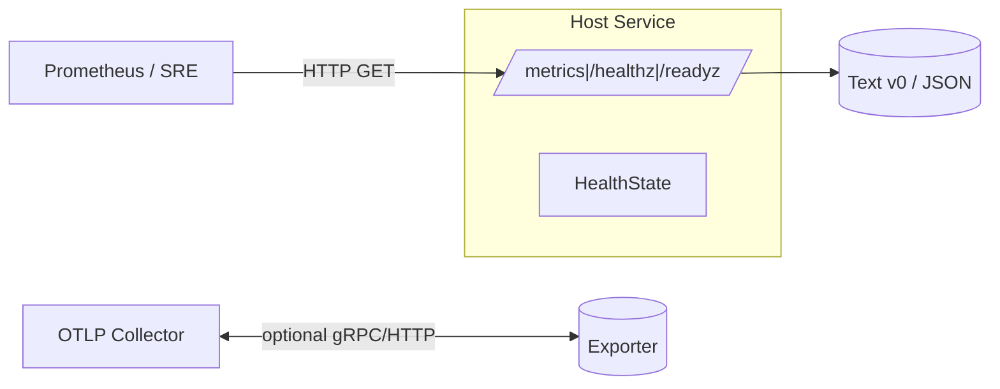

---

---

title: RUNBOOK — ron-metrics
owner: Stevan White
msrv: 1.80.0
last-reviewed: 2025-10-05
audience: operators, SRE, auditors
----------------------------------

# 🛠️ RUNBOOK — ron-metrics

## 0) Purpose

Operational manual for `ron-metrics`: startup integration, health checks, diagnostics, failure modes, recovery, scaling, and security ops.
This document satisfies **PERFECTION_GATES** K (Continuous Vigilance) and L (Black Swan Economics).

> `ron-metrics` is a **small library** that exposes `/metrics`, `/healthz`, `/readyz` for the **host service**. It does not talk to the kernel bus and is intentionally GET-only.

---

## 1) Overview

* **Name:** `ron-metrics`
* **Role:** Observability library with a tiny HTTP exposer (Prometheus text v0; health/readiness JSON). Optional OTLP **egress** when `otel` feature is enabled.
* **Criticality Tier:** **2 — supporting** (failure degrades visibility but not core business logic; SLOs still enforced).
* **Dependencies (runtime):**

  * Tokio runtime (host owns)
  * `prometheus` default registry
  * Optional: `tokio_rustls` if TLS; OTel collector if `otel` (egress only)
* **Ports/Bindings (host-configured):**

  * Loopback TCP: `127.0.0.1:9100`
  * TLS (optional): `127.0.0.1:9443`
  * UDS (preferred in hardened mode): `/run/ron/metrics.sock`
* **Data Flows:**

  * **Ingress:** `GET /metrics`, `GET /healthz`, `GET /readyz`
  * **Egress (optional):** OTLP → collector (gRPC preferred; HTTP/JSON fallback)
* **Version Constraints:**

  * MSRV 1.80.0; stable API (`Metrics::new()`, `Metrics::serve(Arc<Metrics>, SocketAddr|Uds, Arc<HealthState>)`)
  * TLS types = `tokio_rustls::rustls::ServerConfig`
  * Base labels always present on first-party families: `service, instance, build_version, amnesia`

### Ingress/Egress Flow



---

## 2) Startup / Shutdown

### 2.1 Integrating in a host service

```rust
use std::{net::SocketAddr, sync::Arc};
use ron_kernel::HealthState;
use ron_metrics::Metrics;

let metrics: Arc<Metrics> = Metrics::new();
let health: Arc<HealthState> = HealthState::new();
let addr: SocketAddr = "127.0.0.1:9100".parse().unwrap();

let (_jh, bound_addr) = metrics.clone().serve(addr, health.clone()).await?;
tracing::info!(%bound_addr, "metrics exposer started");
```

**Env knobs**

* `RON_METRICS_ADDR=127.0.0.1:9100`
* `RON_METRICS_UDS=/run/ron/metrics.sock`
* `RON_METRICS_TLS_CERT`, `RON_METRICS_TLS_KEY`
* `RON_AMNESIA=on|off`
* `RON_OTEL_ENDPOINT=grpc://collector:4317` (only if `otel`)
* `RON_METRICS_LOAD=large` (synthetic 10k series for stress)

**Verification**

```
curl -sS http://127.0.0.1:9100/healthz
curl -sS http://127.0.0.1:9100/readyz
curl -sS http://127.0.0.1:9100/metrics | head -50
```

### 2.2 Optional demo

```
cargo run -p ron-metrics --example exposer
```

### 2.3 Shutdown

* `Ctrl-C` or host systemd stop → exposer exits gracefully.
* `/readyz` flips to 503 before termination.

---

## 3) Health & Readiness

* **/healthz:** process liveness.
* **/readyz:** readiness of host service.
  200 when ready; 503 otherwise with JSON:

  ```json
  { "degraded": true, "missing": ["config_loaded"], "retry_after": 5, "since": "2025-10-05T18:09:00Z" }
  ```
* **Expected ready window:** 2–5 s post-start.
  If >10 s → check host logs, bound port, HealthState wiring.

---

## 4) Common Failure Modes

| Symptom                           | Likely Cause                        | Metric / Log Hint                     | Resolution                                                        | Alert Threshold | Expected Downtime |
| --------------------------------- | ----------------------------------- | ------------------------------------- | ----------------------------------------------------------------- | --------------- | ----------------- |
| `405` on `/metrics`               | Non-GET method                      | Access logs show `POST /metrics`      | Fix probe/client to use **GET**                                   | any             | none              |
| `/readyz` 503 persistently        | Host deps not ready                 | JSON `missing=[...]` + `Retry-After`  | Resolve missing deps                                              | >5 min          | < 15 min          |
| Slow `/metrics` (p95 > 60 ms)     | Large registry (10 k+ series)       | CPU spike; large response             | Reduce series; raise scrape interval                              | p95 ↑ > 10%     | none              |
| TLS handshake spikes              | Cold conns; no resumption           | High handshake count                  | Enable resumption or gateway TLS                                  | p99 > 200 ms    | none              |
| Missing label `amnesia`           | Misconfig/custom family             | `grep amnesia=`                       | Add base labels; set `RON_AMNESIA` truthfully                     | any             | none              |
| Memory growth during scrape       | High-cardinality labels             | Heap profiles                         | Remove high-card labels                                           | >15%/wk         | none              |
| OTLP export stalls/drops (`otel`) | Collector backpressure/bad endpoint | Exporter queue > 0; collector rejects | See §6.4; verify endpoint, reduce batch, disable `otel` if needed | sustained 5 min | none (scrape OK)  |

---

## 5) Diagnostics

```
# Quick probes
curl -sS http://127.0.0.1:9100/healthz
curl -sS http://127.0.0.1:9100/readyz | jq .
curl -sS http://127.0.0.1:9100/metrics | promtool check metrics
```

```
# Label & PQ/ZK validation
curl -sS http://127.0.0.1:9100/metrics | grep -E '{.*service=.*instance=.*build_version=.*amnesia=.*}'
curl -sS http://127.0.0.1:9100/metrics | grep -E 'pq_.*_total|zk_.*_total'
```

```
# Perf sanity
bombardier -c 16 -d 30s -l http://127.0.0.1:9100/metrics
RON_METRICS_LOAD=large bombardier -c 4 -d 30s -l http://127.0.0.1:9100/metrics
```

```
# Readiness freshness
curl -s http://127.0.0.1:9100/readyz | jq -r '.since' | \
xargs -I{} date -d {} +%s | awk -v now=$(date +%s) '{print (now-$1) "s since state change"}'
```

```
# Flamegraph / async stalls
cargo flamegraph -p <host-crate>
RUSTFLAGS="--cfg tokio_unstable" TOKIO_CONSOLE_BIND=127.0.0.1:6669 cargo run -p <host-crate>
```

---

## 6) Recovery Procedures

1. **Port/UDS bind failure**
   → free/rotate port; fix perms; restart.
2. **Registry explosion**
   → remove high-card labels; reduce per-series combinatorics.
3. **TLS breakage**
   → verify cert/key paths; check hostname; prefer gateway TLS.
4. **OTLP exporter stalls (if `otel`)**

   * **Symptoms:** rising CPU/net; exporter queue growth; collector rejects.
   * **Checks:** `echo $RON_OTEL_ENDPOINT`; verify gRPC URL; `getent hosts`; collector health.
   * **Actions:**

     1. Lower export interval/batch size.
     2. Point to healthy collector.
     3. Temporarily disable `otel` and scrape instead.
     4. Re-enable after collector stable; confirm exporter queue = 0.
5. **Readiness stuck degraded**
   → fix failing dep; ensure HealthState updates; validate timeouts/backoff.

---

## 7) Backup / Restore

Stateless — no on-disk data.
Backups/restore apply only to stateful crates (svc-index, svc-storage).

---

## 8) Upgrades

1. Bump `ron-metrics` in host crate.
2. Regenerate **API snapshot** (`cargo public-api`).
3. Deploy to one replica:

   ```
   curl -s /readyz; promtool check metrics
   ```
4. Observe 10 min; zero `ServiceCrashed` events ⇒ proceed rollout.

---

## 9) Chaos Testing

```
ronctl chaos inject --target http://127.0.0.1:9100/metrics --fault=slowloris --rate=5/s --duration=120s
bombardier -c 64 -p r -d 120s http://127.0.0.1:9100/metrics
```

**Pass criteria:**

* GET-only enforced, idle sockets closed.
* `/readyz` degrades before collapse.
* No base-label/suffix violations.

---

## 10) Scaling Notes

* **Horizontal:** exposer stateless → scale replicas as scrape fan-out grows.
* **Vertical:** add CPU for large registries (>10 k series).
* **Transport:** prefer UDS/loopback; remote scrape via gateway TLS with keep-alive.
* **Knobs:** concurrency cap (Tower), buffer pre-size, TLS resumption on.

---

## 11) Security Ops

* **Binding:** loopback/UDS default; if TCP, front with gateway.
* **TLS:** only `tokio_rustls::rustls::ServerConfig`; rotate certs via secrets manager.
* **Labels:** `service, instance, build_version, amnesia` mandatory; `amnesia` truthful to `RON_AMNESIA`.
* **PQ/ZK families:** must exist (zero OK).
* **No secrets in metrics/logs:** audit quarterly.
* **Polyglot hosts/SDKs:** Non-Rust hosts must parse **Prom v0** and **/readyz JSON** per INTEROP.md; validate against `/tests/vectors/interop/ron-metrics/`.

---

## 12) References

* [CONFIG.md](./CONFIG.md)
* [SECURITY.md](./SECURITY.md)
* [OBSERVABILITY.md](./OBSERVABILITY.md)
* [CONCURRENCY.md](./CONCURRENCY.md)
* [API.md](./API.md)
* [INTEROP.md](./INTEROP.md)
* [PERFORMANCE.md](./PERFORMANCE.md)
* Blueprints: Hardening, Concurrency & Aliasing, Scaling, Omnigate (GMI-1.6)

---

## ✅ Perfection Gates Checklist

* [ ] **Gate A:** `/healthz` 200, `/readyz` 200, `/metrics` parsable (`promtool check`).
* [ ] **Gate F:** No perf regression vs baseline (p95/throughput/CPU RSS within thresholds).
* [ ] **Gate J:** Chaos drill passed (slow-loris/latency inject).
* [ ] **Gate K:** Continuous vigilance — alerts on `/readyz` 503, `/metrics` size, tail latency.
* [ ] **Gate N:** ARM/edge perf spot-checked.
* [ ] **Gate O:** Security audit clean (GET-only, loopback/UDS default, TLS invariant honored).

---

**Operator Tip:**
If you can run only **one** post-deploy check, run
`promtool check metrics` and ensure `/readyz` returns `200` with a recent `"since"` timestamp—this alone catches >80 % of field misconfigs instantly.
