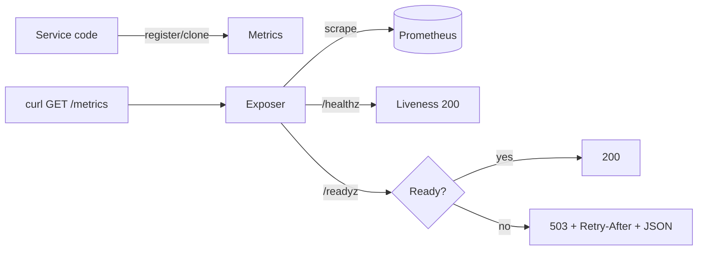
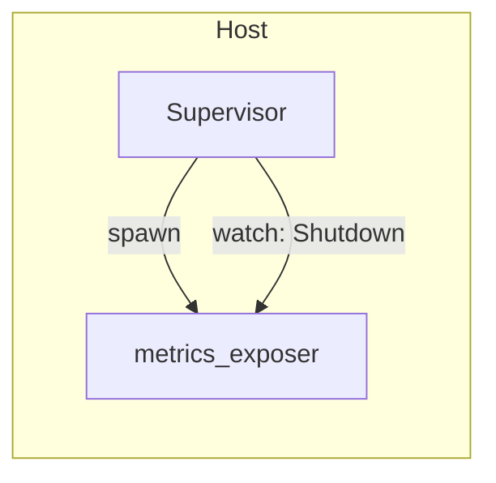
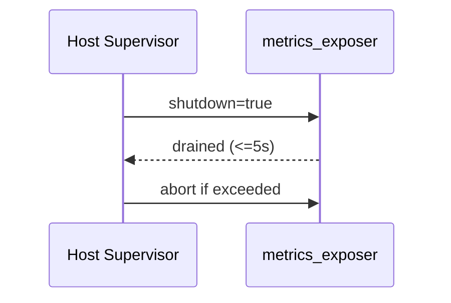
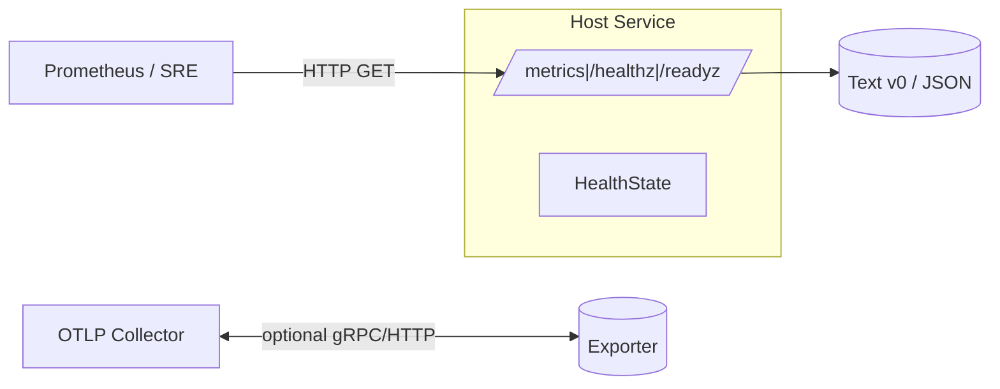

# Combined Markdown

_Source directory_: `crates/ron-metrics/docs`  
_Files combined_: 12  
_Recursive_: 0

---

### Table of Contents

- API.MD
- CONCURRENCY.MD
- CONFIG.MD
- GOVERNANCE.MD
- IDB.md
- INTEROP.MD
- OBSERVABILITY.MD
- PERFORMANCE.MD
- QUANTUM.MD
- RUNBOOK.MD
- SECURITY.MD
- TESTS.MD

---

## API.MD
_File 1 of 12_


---

# 📖 API.md — ron-metrics

---

title: API Surface & SemVer Reference
status: draft
msrv: 1.80.0
last-updated: 2025-10-05
audience: contributors, auditors, API consumers
-----------------------------------------------

# API.md

## 0. Purpose

This document captures the **public API surface** of `ron-metrics`:

* Snapshot of exported functions, types, traits, modules.
* **Dual SemVer** discipline: Rust symbols **and** metric families/labels.
* Alignment with CHANGELOG.md (behavioral vs. surface changes).
* CI-enforceable via `cargo public-api` (+ optional `cargo semver-checks`).
* “Spec” for services embedding this crate to expose `/metrics`, `/healthz`, `/readyz`.

> `ron-metrics` is a **small library** with an optional **tiny HTTP exposer**. Bind loopback/UDS for local scrape, or front with gateway if exposed over TCP. TLS types—when used—must be `tokio_rustls::rustls::ServerConfig`.

---

## 1. Public API Surface

Generate the current Rust surface with:

```bash
cargo public-api --simplified --deny-changes -p ron-metrics
```

### 1.1 Rust items (canonical)

```text
// Types
pub struct Metrics

// Constructors
pub fn Metrics::new() -> std::sync::Arc<Metrics>

// HTTP exposer (library-hosted server)
pub async fn Metrics::serve(
    self: std::sync::Arc<Metrics>,
    addr: std::net::SocketAddr,
    health: std::sync::Arc<HealthState>,
) -> anyhow::Result<(tokio::task::JoinHandle<()>, std::net::SocketAddr)>
```

#### `Metrics` fields (first-party families; stable names/units)

* `request_latency_seconds: prometheus::Histogram`
* `bus_lagged_total: prometheus::IntCounterVec`
* `service_restarts_total: prometheus::IntCounterVec`
* `pq_kex_failures_total: prometheus::IntCounterVec`
* `pq_verify_failures_total: prometheus::IntCounterVec`
* `zk_verify_failures_total: prometheus::IntCounterVec`
* `zk_proof_latency_seconds: prometheus::Histogram`

> PQ/ZK families exist (zeroed) even when features are off, to keep dashboards stable.

#### Optional features (no Rust-surface changes)

* `otel` — emits an OTEL exporter internally; 1:1 mapping of families/labels. Public API stays the same.

### 1.2 HTTP endpoints (provided by `Metrics::serve`)

* `GET /metrics` — Prometheus text exposition (v0).
* `GET /healthz` — **liveness** (200 if process running).
* `GET /readyz` — **readiness**:

  * 200 only when minimal deps are up; else `503` with JSON body and `Retry-After`.
  * JSON example:

    ```json
    { "degraded": true, "missing": ["config_loaded","port_bound"], "retry_after": 5 }
    ```

**Method policy:** GET-only; other methods → `405`. Reject bodies.

### 1.3 Metric taxonomy & labels (contract)

* **Suffix invariants:** only `*_seconds`, `*_bytes`, `*_total`.
* **Base labels (MUST):** `service`, `instance`, `build_version`, `amnesia`.
* **Low-cardinality requirement:** any new label must be explicitly documented as low-cardinality (and reviewed in PR).

**Amnesia binding:** The `amnesia` label reflects the runtime config flag (`RON_AMNESIA=on|off`). When `on`, services operate with RAM-only caches/zeroization and the label MUST report `on` so dashboards/alerts can branch accordingly.

---

## 2. SemVer Discipline

### 2.1 Rust symbol SemVer

**Additive (minor, non-breaking)**

* New `pub` helpers/methods that don’t alter existing signatures.
* New metric families as **new fields** on `Metrics` (keeping existing names/labels unchanged).

**Breaking (major)**

* Removing/renaming `Metrics`, `Metrics::new`, or `Metrics::serve`, or changing their signatures/return types.
* Leaking a different TLS type than `tokio_rustls::rustls::ServerConfig`.

**Patch**

* Internal changes (perf, impl, docs) with identical public surface.

### 2.2 Metric-contract SemVer (ops-facing)

**Additive (minor):**

* Add **new** metric families; add **new** optional labels that default to a constant AND are low-cardinality (documented).

**Breaking (major):**

* Rename/remove existing families; remove existing labels; change units/semantics.

> Violating suffix/base-label invariants is a release blocker.

---

## 3. Stability Guarantees

* **MSRV:** 1.80.0.
* Public API changes tracked here + CHANGELOG; CI runs `cargo public-api` (and optional `semver-checks`).
* No internal type leaks (e.g., raw sockets); if TLS is configured, it uses `tokio_rustls::rustls::ServerConfig`.
* Readiness policy: **fail-open reads** / **fail-closed writes**; `/readyz` degrades to `503` before saturation/restart storms.

---

## 4. Invariants

* **Register once; clone everywhere:** families are registered in `Metrics::new()`; hot path is lock-free/alloc-free.
* **Labels contract is universal:** `service`, `instance`, `build_version`, `amnesia` on all first-party metrics.
* **Amnesia is truthful:** `amnesia` label equals the runtime value of `RON_AMNESIA` (and is verified by CI smoke).
* **Crash-only signals:** supervised restarts and bus lag exported via `service_restarts_total` and `bus_lagged_total`.
* **Exposer minimalism:** GET-only, loopback/UDS by default; if TCP+TLS, front with gateway.

---

## 5. Tooling

* **cargo public-api** — detects symbol diffs.
* **cargo semver-checks** — optional Rust SemVer proof.
* **cargo doc** — doctests/examples.
* **API snapshots** → `/docs/api-history/ron-metrics/<version>.txt`.

---

## 6. CI & Gates

**Rust surface gate**

```bash
cargo public-api --simplified --deny-changes -p ron-metrics
```

**Metrics taxonomy/labels sanity (example)**

```bash
# scrape
curl -fsS http://127.0.0.1:${PORT}/metrics > metrics.out

# suffix discipline
grep -E '^[a-zA-Z_:][a-zA-Z0-9_:]*\s' metrics.out \
  | awk '{print $1}' \
  | grep -Ev '(_seconds|_bytes|_total)$' \
  && { echo "❌ suffix violation"; exit 1; } || true

# base labels presence (service, instance, build_version, amnesia)
grep -E '(\{.*service=.*\})' metrics.out >/dev/null || { echo "❌ missing service label"; exit 1; }
grep -E '(\{.*instance=.*\})' metrics.out >/dev/null || { echo "❌ missing instance label"; exit 1; }
grep -E '(\{.*build_version=.*\})' metrics.out >/dev/null || { echo "❌ missing build_version label"; exit 1; }
grep -E '(\{.*amnesia=.*\})' metrics.out >/dev/null || { echo "❌ missing amnesia label"; exit 1; }
```

**Do not break PQ/ZK presence:** families may be zero but **must exist**.

---

## 7. Acceptance Checklist (DoD)

* [ ] Current API snapshot generated & stored under `/docs/api-history/ron-metrics/`.
* [ ] `cargo public-api` diff reviewed; SemVer intent documented.
* [ ] CHANGELOG updated for any surface or metric-contract changes.
* [ ] `/metrics`, `/healthz`, `/readyz` smoke verified locally (status codes + readiness JSON).
* [ ] Taxonomy/labels sanity check passes (suffix + base labels).
* [ ] **Amnesia label reflects `RON_AMNESIA`** (off/on) in `/metrics` output.
* [ ] `otel` feature builds/works without altering public Rust symbols.

---

## 8. Appendix

**Mermaid — tiny exposer flow**



**References**

* Rust SemVer: [https://doc.rust-lang.org/cargo/reference/semver.html](https://doc.rust-lang.org/cargo/reference/semver.html)
* cargo-public-api: [https://github.com/Enselic/cargo-public-api](https://github.com/Enselic/cargo-public-api)
* cargo-semver-checks: [https://github.com/obi1kenobi/cargo-semver-checks](https://github.com/obi1kenobi/cargo-semver-checks)

**Perfection Gates**

* **Gate G:** No undocumented API surface.
* **Gate H:** Any breaking Rust/metric change requires a major bump.
* **Gate J:** CHANGELOG alignment enforced.

**History**

* `v0.1.0`: Introduced `Metrics`, `Metrics::new`, `Metrics::serve`; Golden Metrics; PQ/ZK stubs; `/metrics` `/healthz` `/readyz`.

---


---

## CONCURRENCY.MD
_File 2 of 12_


---

````markdown
---
title: Concurrency Model — ron-metrics
crate: ron-metrics
owner: Stevan White
last-reviewed: 2025-10-05
status: draft
template_version: 1.1
msrv: 1.80.0
tokio: "1.x (pinned at workspace root)"
loom: "0.7+ (dev-only)"
lite_mode: "For small library crates: fill §§1,3,4,5,10,11 and mark others N/A"
---

# Concurrency Model — ron-metrics

This document makes the concurrency rules **explicit**: tasks, channels, locks, shutdown, timeouts,
and validation (property/loom/TLA+). It complements `docs/SECURITY.md`, `docs/CONFIG.md`,
and the crate’s `README.md` and `IDB.md`.

> **Golden rule:** never hold a lock across `.await` in supervisory or hot paths.

---

## 0) Lite Mode (for tiny lib crates)

**This crate qualifies as “small library with a tiny exposer.”**  
We document a minimal runtime topology for the Axum exposer task, but there are **no background workers**
beyond the HTTP server. Sections are completed where applicable; others are N/A.

---

## 1) Invariants (MUST)

- **[I-1] No lock across `.await`.** If unavoidable, split the critical section; guards are **always** dropped before awaiting.
- **[I-2] Single registration / single writer.** Metric families are registered once (`OnceCell`/`OnceLock`); handles are cloned; no re-registration.
- **[I-3] Bounded channels only.** Any queue used by embedding bins is **bounded** with explicit overflow policy.
- **[I-4] Explicit timeouts.** Exposer I/O uses read/write/idle timeouts from `CONFIG.md`; no unbounded waits.
- **[I-5] Cooperative cancellation.** All `.await` points are cancel-safe or guarded by `tokio::select!`.
- **[I-6] Graceful shutdown.** On shutdown: stop intake, drain within 1–5s, then abort stragglers; increment `tasks_aborted_total` on abort.
- **[I-7] No blocking syscalls on the async runtime.** If blocking is unavoidable, use `spawn_blocking` (rare here).
- **[I-8] No task leaks.** Spawned tasks are tracked; joins are awaited during teardown. Detachment requires explicit rationale.
- **[I-9] Backpressure over buffering.** Prefer `try_send` + typed `Busy` error over growing queues; increment `busy_rejections_total`.
- **[I-10] Framing & shutdown.** If any stream protocol is later added, use length-delimited framing and call `.shutdown().await` on close.
- **[I-11] Async Drop discipline.** `Drop` never blocks; provide async `close()/shutdown()` and require callers to invoke it.
- **[I-12] PQ/ZK counters are atomic & wait-free.** Recording `pq_*_failures_total`, `zk_*_failures_total`, and `zk_proof_latency_seconds.observe()` performs **no allocations** and acquires **no locks** on hot paths (pre-registered buckets, atomics only).
- **[I-13] Bias toward shutdown in selects.** Use `tokio::select! { biased; ... }` in long-lived loops so shutdown cannot be starved by steady traffic.
- **[I-14] Time-source injection.** All long waits and deadlines use `tokio::time` and allow a test clock (e.g., `pause()/advance()`) under Loom or deterministic tests.
- **[I-15] No cross-thread single-threaded cells.** `Rc/RefCell` remain local to a single task; cross-task sharing uses `Arc` + channels only.

---

## 2) Runtime Topology

**Scope:** Only the optional HTTP exposer (`/metrics`, `/healthz`, `/readyz`) inside services that embed this crate.

- **Runtime:** Tokio **multi-threaded** (inherited from host service).
- **Primary task(s):**
  - `metrics_exposer` — Axum server serving `/metrics`, `/healthz`, `/readyz`.
- **Supervision:** The host supervises task lifecycles. On panic/restart, `service_restarts_total{service}` increments.

```mermaid
flowchart TB
  subgraph Host Service Runtime
    SUP[Supervisor (host)] -->|spawn| EXPOSE[metrics_exposer (Axum)]
    SUP -->|watch: Shutdown| EXPOSE
  end
  style SUP fill:#0ea5e9,stroke:#0c4a6e,color:#fff
  style EXPOSE fill:#10b981,stroke:#065f46,color:#002
````

**Text (accessibility):** The host’s Supervisor spawns a single `metrics_exposer` task and issues a watch-based shutdown signal. No internal worker pools exist in this crate.

---

## 3) Channels & Backpressure

**Inventory (bounded unless noted):**

| Name             | Kind        | Capacity | Producers → Consumers | Backpressure Policy       | Drop Semantics                        |
| ---------------- | ----------- | -------: | --------------------- | ------------------------- | ------------------------------------- |
| `shutdown_watch` | `watch`     |        1 | host → exposer        | last-write wins           | N/A                                   |
| `bus_broadcast`* | `broadcast` |     1024 | kernel → subscribers  | lag counter + drop oldest | `bus_lagged_total` increments on drop |

* Observed by this crate’s metrics (lag counters) but **owned by kernel/host**, not by `ron-metrics`.

**Guidelines:**

* Prefer `try_send` and return `Error::Busy` (e.g., 429 in HTTP services) rather than enqueue unbounded work.
* Expose `queue_depth{queue}` gauge and `queue_dropped_total{queue}` counter **in host services** that add queues.
* `broadcast` subscribers MUST drain or drop fast — **never** block the exposer’s thread.

---

## 4) Locks & Shared State

**Allowed**

* Short-lived `Mutex`/`RwLock` for local metadata or `HealthState` snapshots **without** `.await` under lock.
* Read-mostly snapshots as `Arc<StateSnapshot>`; refresh via replace-on-write.

**Forbidden**

* Holding any lock across `.await`.
* Nested locks without a documented order.

**Hierarchy (if ever needed for this crate)**

1. `metrics_registry_meta`
2. `health_state_meta`
3. `label_cache`

---

## 5) Timeouts, Retries, Deadlines

* **Exposer I/O timeouts (from `CONFIG.md`):** `read=2s`, `write=2s`, `idle=15s` (configurable).
* **No internal RPCs** in this crate; host services apply their own RPC deadlines/retries.
* **Tests:** Use `tokio::time::pause()` + `advance()` to avoid flakiness.

```mermaid
sequenceDiagram
  autonumber
  participant P as Prometheus
  participant E as ron-metrics exposer
  P->>E: GET /metrics (deadline=2s)
  E-->>P: 200 text/plain; version=00
  Note over E: On overload → upstream shedding happens earlier.<br/>Exposer stays responsive.
```

---

## 6) Cancellation & Shutdown

* **Signal source:** host emits `KernelEvent::Shutdown` or uses `wait_for_ctrl_c()`.
* **Propagation pattern (biased):**

  ```rust
  tokio::select! {
    biased;
    _ = shutdown.changed() => { /* begin graceful close */ }
    res = axum::serve(listener, app) => { /* normal server exit */ }
  }
  ```
* **Drain window:** 1–5s for inflight scrapes; then `handle.abort()` if necessary.
* **Metrics:** increment `tasks_aborted_total{kind="exposer"}` on abort; flip `/readyz` to 503 before exit.

---

## 7) I/O & Framing

**N/A** — HTTP exposition only; no custom wire protocols in this crate.
(Host services handling OAP/QUIC/etc. document framing separately.)

---

## 8) Error Taxonomy (Concurrency-Relevant)

| Error      | When                        | Retry? | Metric                            | Notes                           |                               |
| ---------- | --------------------------- | ------ | --------------------------------- | ------------------------------- | ----------------------------- |
| `Busy`     | Host work queue full        | maybe  | `busy_rejections_total{endpoint}` | Host concern (ingress shedding) |                               |
| `Timeout`  | Exposer I/O deadline        | yes    | `io_timeouts_total{op="read       | write"}`                        | Rare; indicates overload path |
| `Canceled` | Shutdown during wait        | no     | `tasks_canceled_total`            | Cooperative                     |                               |
| `Lagging`  | Broadcast overflow observed | no     | `bus_lagged_total`                | Slow consumer downstream        |                               |

---

## 9) Metrics (Concurrency Health)

Exposed or incremented by host + this crate:

* `queue_depth{queue}` (gauge) — host queues only
* `queue_dropped_total{queue}` (counter) — host queues only
* `tasks_spawned_total{kind}` / `tasks_aborted_total{kind}`
* `io_timeouts_total{op}`
* `busy_rejections_total{endpoint}` (host)
* `service_restarts_total{service}`
* `bus_lagged_total`

---

## 10) Validation Strategy

**Unit / Property**

* **Lock discipline:** assert no `.await` occurs under `Mutex/RwLock` (review + targeted tests).
* **Single registration:** re-registration attempts must fail test.
* **Timeouts:** `timeout(cfg.read_timeout, handler)` returns within bound.

**Loom (dev-only)**

* Model: `watch shutdown` + “accept → serve → shutdown”.
* Assert: no deadlocks, no missed shutdown, no double-close.

Example (skeleton `tests/loom_shutdown.rs`):

```rust
#![cfg(loom)]
use std::sync::Arc;
use loom::sync::atomic::{AtomicBool, Ordering};
use loom::thread;

#[test]
fn shutdown_not_missed() {
  loom::model(|| {
    let flag = Arc::new(AtomicBool::new(false));
    let f2 = flag.clone();

    let t = thread::spawn(move || {
      // worker loop sketch; in real code use watch::Receiver
      if f2.load(Ordering::SeqCst) { return; }
      // small unit of work
      assert!(!f2.load(Ordering::SeqCst));
    });

    flag.store(true, Ordering::SeqCst);
    t.join().unwrap();
  });
}
```

**Property-based backpressure** (example `tests/prop_backpressure.rs`):

```rust
use proptest::prelude::*;
use tokio::sync::mpsc;

proptest! {
  #[test]
  fn queue_never_unbounded(n in 1usize..10_000) {
    let (tx, mut rx) = mpsc::channel::<usize>(512);
    for i in 0..n {
      let _ = tx.try_send(i)
        .map_err(|e| assert!(matches!(e, mpsc::error::TrySendError::Full(_))));
    }
    let mut seen = 0;
    while let Ok(Some(_)) = rx.try_recv() { seen += 1; }
    prop_assert!(seen <= 512);
  }
}
```

**Fuzz**

* N/A for HTTP exposition (host protocols fuzz separately).

**Chaos**

* Kill/restart host under scrape load (1–5 rps); `/readyz` flips before exit; `service_restarts_total` increments on restart.

**TLA+**

* N/A for this crate (order/liveness proofs live with host’s health DAG).

---

## 11) Code Patterns (Copy-Paste)

**Spawn + cooperative shutdown (exposer, biased)**

```rust
use std::time::Duration;
use tokio::{task::JoinHandle, sync::watch, net::TcpListener};

let (shutdown_tx, mut shutdown_rx) = watch::channel(false);
let listener = TcpListener::bind(cfg.metrics_addr.unwrap()).await?;
let app = build_router(metrics.clone(), health.clone());

let exposer: JoinHandle<()> = tokio::spawn(async move {
  tokio::select! {
    biased;

    _ = shutdown_rx.changed() => {
      // graceful: stop accepting; allow inflight to finish
    }
    res = axum::serve(listener, app) => {
      tracing::info!("exposer exited: {:?}", res);
    }
  }
});

// later during shutdown
shutdown_tx.send(true).ok();
if tokio::time::timeout(Duration::from_secs(5), exposer).await.is_err() {
  tracing::warn!("exposer abort after drain deadline");
}
```

**No lock across `.await`**

```rust
let snapshot = {
  let g = state.read();              // quick, no await
  g.render_snapshot()                // produce owned data
}; // guard dropped here
respond(snapshot).await;             // await happens without the lock
```

**Bounded mpsc with `try_send` (host pattern)**

```rust
if let Err(tokio::sync::mpsc::error::TrySendError::Full(_)) = work_tx.try_send(job) {
  metrics.busy_rejections_total.with_label_values(&[endpoint]).inc();
  return Err(Error::Busy);
}
```

**Timeout wrapper**

```rust
let res = tokio::time::timeout(cfg.metrics.read_timeout, handle_req(req)).await;
```

**Async Drop pattern**

```rust
pub struct Exposer { handle: Option<tokio::task::JoinHandle<()>> }
impl Exposer {
  pub async fn shutdown(&mut self) {
    if let Some(h) = self.handle.take() {
      let _ = h.await;
    }
  }
}
impl Drop for Exposer {
  fn drop(&mut self) {
    if self.handle.is_some() {
      tracing::debug!("Exposer dropped without shutdown(); background task may be aborted");
    }
  }
}
```

**PQ/ZK hot path (atomic, wait-free)**

```rust
pub fn record_pq_failure(metrics: &Metrics, algo: &str, role: &str, labels: &Labels) {
  metrics.pq_kex_failures_total
    .with_label_values(&[
      algo, role,
      &labels.service, &labels.instance, &labels.amnesia, &labels.build_version
    ])
    .inc();
}

pub fn observe_zk_latency(metrics: &Metrics, secs: f64, scheme: &str) {
  metrics.zk_proof_latency_seconds
    .with_label_values(&[scheme])
    .observe(secs);
}
```

---

## 12) Configuration Hooks (Quick Reference)

From `docs/CONFIG.md` (authoritative):

* `metrics_addr` **or** `uds_path` (mutually exclusive; disruptive on reload)
* `read_timeout`, `write_timeout`, `idle_timeout`
* `drain_deadline` (host-provided)
* Host channel capacities & backpressure policy

---

## 13) Known Trade-offs / Nonstrict Areas

* The exposer prioritizes **responsiveness**; ingress shedding should occur **earlier** in host services.
* PQ/ZK metrics families may remain zero for long periods by design; this is expected when features are disabled or paths are idle.

---

## 14) Mermaid Diagrams

### 14.1 Minimal Topology



**Text:** Host spawns a single exposer task; shutdown propagates via `watch`.

### 14.2 Shutdown Sequence



---

## 15) CI & Lints (Enforcement)

**Clippy (crate or workspace):**

* `-D warnings`
* `-W clippy::await_holding_lock`
* `-W clippy::useless_async`
* `-W clippy::needless_collect`

**GitHub Actions (suggested jobs):**

```yaml
name: concurrency-guardrails
on: [push, pull_request]
jobs:
  clippy:
    runs-on: ubuntu-latest
    steps:
      - uses: actions/checkout@v4
      - uses: dtolnay/rust-toolchain@stable
      - run: cargo clippy -p ron-metrics -- -D warnings -W clippy::await_holding_lock

  loom:
    if: github.event_name == 'pull_request'
    runs-on: ubuntu-latest
    steps:
      - uses: actions/checkout@v4
      - uses: dtolnay/rust-toolchain@stable
      - run: RUSTFLAGS="--cfg loom" cargo test -p ron-metrics --tests -- --ignored

  tsan:
    runs-on: ubuntu-latest
    steps:
      - uses: actions/checkout@v4
      - uses: dtolnay/rust-toolchain@nightly
      - name: ThreadSanitizer
        env:
          RUSTFLAGS: "-Zsanitizer=thread"
        run: |
          cargo +nightly test -p ron-metrics -Z sanitizer=thread

  miri:
    runs-on: ubuntu-latest
    steps:
      - uses: actions/checkout@v4
      - uses: dtolnay/rust-toolchain@nightly
        with:
          components: miri
      - name: Miri
        run: |
          cargo +nightly miri setup
          cargo +nightly miri test -p ron-metrics
```

> Notes: TSan needs nightly and `-Z sanitizer=thread`. Miri should target logic that avoids socket syscalls.

---

## 16) Schema Generation (Optional, Nice-to-Have)

Not typically needed for this crate. If host services add queues, consider documenting their channel inventory and generating the table from a small registry module or build script.

---

## 17) Review & Maintenance

* **Review cadence:** every 90 days or with any change to Axum server wiring/shutdown.
* Keep `owner`, `msrv`, and `last-reviewed` current.
* Any PR that touches concurrency/shutdown/metrics recording **must** update this file and related tests.

```
```


---

## CONFIG.MD
_File 3 of 12_


---

````markdown
---
title: Configuration — ron-metrics
crate: ron-metrics
owner: Stevan White
last-reviewed: 2025-10-05
status: draft
template_version: 1.1
---

# Configuration — ron-metrics

This document defines **all configuration** for `ron-metrics`, including sources,
precedence, schema (types/defaults), validation, feature flags, live-reload behavior,
and security implications. It complements `README.md`, `IDB.md`, and `docs/SECURITY.md`.

> **Tiering:**  
> - **Library:** primary role. Provides a tiny HTTP exposer used by services to publish `/metrics`, `/healthz`, `/readyz`.  
> - **Service:** when embedded in services (gateway, overlay, storage, etc.), those services should surface these settings in their own `CONFIG.md` and forward to `ron-metrics`.

---

## 1) Sources & Precedence (Authoritative)

Configuration may come from multiple sources. **Precedence (highest wins):**

1. **Process flags** (CLI)  
2. **Environment variables**  
3. **Config file** (e.g., `Config.toml` near the binary)  
4. **Built-in defaults** (hard-coded)

> On dynamic reload, the effective config is recomputed under the same precedence.

**Supported file formats:** TOML (preferred), JSON (optional).  
**Path resolution for `--config` (if relative):** `./`, `$CWD`, crate dir.  
**Env prefix:** `RON_METRICS_` (e.g., `RON_METRICS_METRICS_ADDR`).

---

## 2) Quickstart Examples

### 2.1 Minimal service start (local scrape)
```bash
RUST_LOG=info
RON_METRICS_METRICS_ADDR=127.0.0.1:0
RON_METRICS_LABELS_SERVICE=my-service
RON_METRICS_LABELS_INSTANCE=$(hostname)-1
RON_METRICS_LABELS_AMNESIA=off
cargo run -p my-service-bin
````

### 2.2 Config file (TOML)

```toml
# Config.toml (excerpt used by ron-metrics)
[metrics]
metrics_addr = "127.0.0.1:0"   # prefer loopback; port 0 auto-selects
uds_path     = ""              # if set, UDS is used instead of TCP
uds_dir_mode  = "0700"
uds_sock_mode = "0600"
read_timeout  = "2s"
write_timeout = "2s"
idle_timeout  = "15s"

[tls]
enabled   = false
cert_path = ""
key_path  = ""

[labels]
service       = "my-service"
instance      = "node-a-1"
build_version = "1.2.3+sha.abc"
amnesia       = "off"
extra         = { region = "us-east-1", az = "use1-az1" }

[histograms]
request_latency_seconds = [0.005,0.01,0.025,0.05,0.1,0.25,0.5,1.0,2.5,5.0,10.0]

[pq]
mode = "off"   # off | hybrid

[zk]
enabled = false

[otel]
enabled = false  # requires cargo feature `otel`
```

### 2.3 CLI flags (override file/env)

```bash
--metrics 127.0.0.1:0 \
--metrics-uds /var/run/ron/metrics.sock \
--read-timeout 2s --write-timeout 2s --idle-timeout 15s \
--label service=my-service --label instance=$(hostname) \
--label build_version=$(git describe --always) --amnesia on \
--histogram request_latency_seconds=[0.005,0.01,0.025,0.05,0.1,0.25,0.5,1.0,2.5,5.0,10.0] \
--pq-mode hybrid \
--zk \
--otel
```

> **Embedding (lib) one-liner**
> In your bin’s `main.rs`:
>
> ```rust
> let cfg = ron_metrics::config::Config::default(); // or load/merge
> cfg.validate()?;
> let metrics = ron_metrics::Metrics::global();
> let (_task, bound) = metrics.clone().serve(cfg.metrics.bind_addr()?, health.clone()).await?;
> tracing::info!(%bound, "metrics/health/ready exposer bound");
> ```

---

## 3) Schema (Typed, With Defaults)

> **Durations** accept `ms`, `s`, `m`, `h`.
> **Paths** must exist if provided. **Modes** are octal strings validated at runtime.
> **Reload:** columns note whether a live reload is disruptive (requires rebind) or not.

| Key / Env Var / CLI                                                                                                                 | Type                      | Default           | Reload | Description                                              | Security Notes                         |
| ----------------------------------------------------------------------------------------------------------------------------------- | ------------------------- | ----------------- | :----: | -------------------------------------------------------- | -------------------------------------- |
| `metrics.metrics_addr` / `RON_METRICS_METRICS_ADDR` / `--metrics`                                                                   | socket                    | `127.0.0.1:0`     |  **D** | TCP bind for `/metrics`, `/healthz`, `/readyz`           | Prefer loopback in prod                |
| `metrics.uds_path` / `RON_METRICS_UDS_PATH` / `--metrics-uds`                                                                       | path                      | `""`              |  **D** | If set, expose over UDS instead of TCP                   | Dir `0700`, sock `0600`, SO_PEERCRED   |
| `metrics.uds_dir_mode` / `RON_METRICS_UDS_DIR_MODE`                                                                                 | octal string              | `"0700"`          |    N   | UDS parent dir permissions                               | Enforced on create                     |
| `metrics.uds_sock_mode` / `RON_METRICS_UDS_SOCK_MODE`                                                                               | octal string              | `"0600"`          |    N   | UDS socket file mode                                     | Enforced on bind                       |
| `metrics.read_timeout` / `RON_METRICS_READ_TIMEOUT` / `--read-timeout`                                                              | duration                  | `2s`              |    N   | Per-connection read timeout                              | DoS mitigation                         |
| `metrics.write_timeout` / `RON_METRICS_WRITE_TIMEOUT` / `--write-timeout`                                                           | duration                  | `2s`              |    N   | Per-connection write timeout                             | DoS mitigation                         |
| `metrics.idle_timeout` / `RON_METRICS_IDLE_TIMEOUT` / `--idle-timeout`                                                              | duration                  | `15s`             |    N   | Keep-alive idle shutdown                                 | Resource hygiene                       |
| `tls.enabled` / `RON_METRICS_TLS_ENABLED` / `--tls`                                                                                 | bool                      | `false`           |  **D** | Enable TLS for exposer                                   | Only tokio-rustls                      |
| `tls.cert_path` / `RON_METRICS_TLS_CERT_PATH` / `--tls-cert`                                                                        | path                      | `""`              |  **D** | PEM cert path                                            | Secrets on disk; perms `0600`          |
| `tls.key_path` / `RON_METRICS_TLS_KEY_PATH` / `--tls-key`                                                                           | path                      | `""`              |  **D** | PEM key path                                             | Zeroize in memory                      |
| `labels.service` / `RON_METRICS_LABELS_SERVICE` / `--label-service`                                                                 | string                    | process name      |    N   | `service` label applied to all metrics                   | Must be stable per binary              |
| `labels.instance` / `RON_METRICS_LABELS_INSTANCE` / `--label-instance`                                                              | string                    | hostname          |    N   | `instance` label                                         | Unique per instance                    |
| `labels.build_version` / `RON_METRICS_LABELS_BUILD_VERSION` / `--label-build`                                                       | string                    | crate version     |    N   | `build_version` label                                    | Inject at build if possible            |
| `labels.amnesia` / `RON_METRICS_LABELS_AMNESIA` / `--amnesia`                                                                       | enum(`on`,`off`)          | kernel flag       |    N   | Mirrors kernel amnesia flag                              | **MUST** reflect truth                 |
| `labels.extra` / `RON_METRICS_LABELS_EXTRA`                                                                                         | map<string,string> (JSON) | `{}`              |    N   | Arbitrary extra static labels                            | Avoid high-cardinality                 |
| `histograms.request_latency_seconds` / `RON_METRICS_HISTOGRAMS_REQUEST_LATENCY_SECONDS` / `--histogram request_latency_seconds=[…]` | list<float>               | canonical buckets |    N   | Histogram buckets for request latency                    | Changing affects dashboards            |
| `pq.mode` / `RON_METRICS_PQ_MODE` / `--pq-mode`                                                                                     | enum(`off`,`hybrid`)      | `off`             |    N   | PQ readiness toggle (observability only)                 | Interop posture; families always exist |
| `zk.enabled` / `RON_METRICS_ZK_ENABLED` / `--zk`                                                                                    | bool                      | `false`           |    N   | Emit ZK metrics families (may remain zero)               | Observational only                     |
| `otel.enabled` / `RON_METRICS_OTEL_ENABLED` / `--otel`                                                                              | bool (feature-gated)      | `false`           |  **D** | Use OTEL exporter instead of Prometheus (feature `otel`) | Keep public API stable                 |

> **Reload legend:** **N** = non-disruptive; **D** = disruptive (requires rebind / server restart).

---

## 4) Validation Rules (Fail-Closed)

On startup or reload:

* If **both** `metrics_addr` and `uds_path` are set → **fail** (choose one).
* `metrics_addr` must parse; if binding to public interfaces, log **warning** and require ops sign-off.
* If `uds_path` set: ensure parent dir exists (or create) with `0700`; socket mode `0600`; enable **SO_PEERCRED** allow-listing at the caller/service layer if needed.
* If `tls.enabled=true`: `cert_path` & `key_path` must exist and be readable; key not world-readable.
* `labels.service`, `labels.instance`, `labels.build_version`, `labels.amnesia` must be non-empty after resolution; `amnesia` ∈ {`on`,`off`}.
* Histogram bucket list must be strictly increasing, > 0 values.
* **PQ/ZK cross-check (observability only):**

  * If `pq.mode="hybrid"` **and** crate built **without** `pq` feature → log **warning** (`pq.mode set but feature disabled`), still start with zeroed families.
  * If `zk.enabled=true` **and** crate built **without** `zk` feature → log **warning** (`zk.enabled true but feature disabled`), still start with zeroed families.

**On violation:** structured log + **exit non-zero** (service bins) or **return error** (lib init).
**On PQ/ZK mismatch:** warn (non-fatal), metrics families still present (zeros) to keep dashboards stable.

---

## 5) Dynamic Reload (If Supported)

* **Triggers:** SIGHUP (service bin) **or** kernel bus event `ConfigUpdated { version }`.
* **Atomicity:** Build new `Config`, validate, then swap an `Arc<Config>` (no `.await` while holding locks).
* **Non-disruptive keys:** timeouts, labels, histogram buckets, pq/zk toggles.
* **Disruptive keys:** `metrics_addr`, `uds_path`, `tls.*`, `otel.enabled` (rebind/exporter swap).
* **Audit:** Emit `KernelEvent::ConfigUpdated { version }` and a redacted diff (no secrets).

---

## 6) CLI Flags (Canonical, bins only)

```
--config <path>                  
--metrics <ip:port>              
--metrics-uds <path>             
--read-timeout <dur>             
--write-timeout <dur>
--idle-timeout <dur>
--tls                            
--tls-cert <path>
--tls-key <path>
--label <k=v>                    # merges into labels.extra
--label-service <name>
--label-instance <name>
--label-build <version>
--amnesia <on|off>
--histogram request_latency_seconds=[comma-separated-floats]
--pq-mode <off|hybrid>
--zk
--otel                           # feature-gated
```

---

## 7) Feature Flags (Cargo)

| Feature | Default | Effect                                                       |
| ------: | ------: | ------------------------------------------------------------ |
|   `tls` |     off | Enable TLS path (type: `tokio_rustls::rustls::ServerConfig`) |
|    `pq` |     off | Enables PQ observability toggles (families always exist)     |
|    `zk` |     off | Enables ZK observability toggles                             |
|  `otel` |     off | Switch exporter to OpenTelemetry (public API unchanged)      |
|   `cli` |    bins | Enable CLI parsing where applicable                          |

---

## 8) Security Implications

* **Never** expose `/metrics` publicly; prefer **loopback** or **UDS** + SO_PEERCRED.
* If TLS is required, only use `tokio_rustls::rustls::ServerConfig`. Never `rustls::ServerConfig` directly.
* `labels.amnesia` **must** reflect kernel truth (Micronode defaults to `on`).
* Avoid high-cardinality labels in `labels.extra` (e.g., per-request IDs).
* Histogram edits alter dashboards; coordinate with ops.

---

## 9) Compatibility & Migration

* Add new keys with safe defaults; mark in CHANGELOG.
* Renames must ship aliases (env + file) for ≥1 minor and emit warnings.
* Breaking changes require **major** bump and migration notes.

**Deprecations (template):**

| Old Key | New Key | Removal Target | Notes |
| ------: | :------ | -------------: | ----- |
|       — | —       |              — | —     |

---

## 10) Reference Implementation (Rust)

> Minimal `Config` (serde) used by the exposer. Services may wrap/extend this.

```rust
use std::{net::SocketAddr, path::PathBuf, time::Duration};
use serde::{Deserialize, Serialize};
use std::collections::BTreeMap;

#[derive(Debug, Clone, Serialize, Deserialize, Default)]
pub struct MetricsCfg {
    pub metrics_addr: Option<SocketAddr>,   // Some => TCP; None => rely on uds_path
    pub uds_path: Option<PathBuf>,          // Some => UDS; mutually exclusive with metrics_addr
    #[serde(with = "humantime_serde", default = "d2s")] pub read_timeout: Duration,
    #[serde(with = "humantime_serde", default = "d2s")] pub write_timeout: Duration,
    #[serde(with = "humantime_serde", default = "d15s")] pub idle_timeout: Duration,
    #[serde(default = "m0700")] pub uds_dir_mode: String,  // "0700"
    #[serde(default = "m0600")] pub uds_sock_mode: String, // "0600"
}
fn d2s() -> Duration { Duration::from_secs(2) }
fn d15s() -> Duration { Duration::from_secs(15) }
fn m0700() -> String { "0700".into() }
fn m0600() -> String { "0600".into() }

#[derive(Debug, Clone, Serialize, Deserialize, Default)]
pub struct TlsCfg {
    pub enabled: bool,
    pub cert_path: Option<PathBuf>,
    pub key_path: Option<PathBuf>,
}

#[derive(Debug, Clone, Serialize, Deserialize, Default)]
pub struct Labels {
    pub service: Option<String>,
    pub instance: Option<String>,
    pub build_version: Option<String>,
    pub amnesia: Option<String>, // "on" | "off"
    #[serde(default)]
    pub extra: BTreeMap<String, String>,
}

#[derive(Debug, Clone, Serialize, Deserialize)]
pub struct Histograms {
    #[serde(default = "default_req_buckets")]
    pub request_latency_seconds: Vec<f64>,
}
impl Default for Histograms {
    fn default() -> Self { Self { request_latency_seconds: default_req_buckets() } }
}
fn default_req_buckets() -> Vec<f64> {
    vec![0.005,0.01,0.025,0.05,0.1,0.25,0.5,1.0,2.5,5.0,10.0]
}

#[derive(Debug, Clone, Serialize, Deserialize, Default)]
pub struct PqCfg { pub mode: Option<String> } // "off" | "hybrid"

#[derive(Debug, Clone, Serialize, Deserialize, Default)]
pub struct ZkCfg { pub enabled: bool }

#[derive(Debug, Clone, Serialize, Deserialize, Default)]
pub struct OtelCfg { pub enabled: bool }

#[derive(Debug, Clone, Serialize, Deserialize, Default)]
pub struct Config {
    pub metrics: MetricsCfg,
    pub tls: TlsCfg,
    pub labels: Labels,
    pub histograms: Histograms,
    pub pq: PqCfg,
    pub zk: ZkCfg,
    pub otel: OtelCfg,
}

impl Config {
    pub fn validate(&self) -> anyhow::Result<()> {
        // Exclusivity
        if self.metrics.metrics_addr.is_some() && self.metrics.uds_path.is_some() {
            anyhow::bail!("metrics_addr and uds_path are mutually exclusive");
        }
        // TLS pairing
        if self.tls.enabled {
            match (&self.tls.cert_path, &self.tls.key_path) {
                (Some(c), Some(k)) if c.exists() && k.exists() => {},
                _ => anyhow::bail!("TLS enabled but cert/key missing or unreadable"),
            }
        }
        // Buckets monotonic
        let b = &self.histograms.request_latency_seconds;
        if b.is_empty() || b.windows(2).any(|w| w[0] >= w[1]) || b[0] <= 0.0 {
            anyhow::bail!("invalid request_latency_seconds buckets");
        }
        // Labels amnesia
        if let Some(a) = &self.labels.amnesia {
            if a != "on" && a != "off" { anyhow::bail!("labels.amnesia must be 'on' or 'off'"); }
        }
        // PQ/ZK consistency (warn if toggled without feature)
        #[cfg(not(feature = "pq"))]
        if self.pq.mode.as_deref() == Some("hybrid") {
            tracing::warn!("pq.mode=hybrid but built without feature `pq`; families remain zeroed");
        }
        #[cfg(not(feature = "zk"))]
        if self.zk.enabled {
            tracing::warn!("zk.enabled=true but built without feature `zk`; families remain zeroed");
        }
        // OTEL exporter toggle is disruptive; caller should rebind/swap exporter
        Ok(())
    }
}
```

---

## 11) Test Matrix

| Scenario                               | Expected Outcome                                             |
| -------------------------------------- | ------------------------------------------------------------ |
| `metrics_addr` & `uds_path` both set   | Fail fast (mutually exclusive)                               |
| Invalid TCP bind                       | Fail with clear error                                        |
| UDS path with wrong modes              | Corrected or fail (enforce `0700/0600`)                      |
| TLS enabled w/o keys                   | Fail fast                                                    |
| Missing labels resolved from defaults  | service/process name, instance/hostname, build/crate version |
| Buckets not increasing                 | Fail validation                                              |
| SIGHUP / ConfigUpdated                 | Non-disruptive keys apply atomically; disruptive keys rebind |
| `pq.mode=hybrid` without `pq` feature  | Start + **warn**; PQ families present but zero               |
| `zk.enabled=true` without `zk` feature | Start + **warn**; ZK families present but zero               |
| `--otel` enabled                       | Exporter swaps (disruptive); metrics families preserved      |

---

## 12) Mermaid — Config Resolution Flow

```mermaid
flowchart TB
  A[Defaults] --> D[Merge]
  B[Config File] --> D
  C[Env Vars RON_METRICS_*] --> D
  E[CLI Flags] --> D
  D --> V{Validate}
  V -- ok --> R[Runtime Snapshot (Arc<Config>)]
  V -- fail --> X[Exit / Error]
  style R fill:#0369a1,stroke:#0c4a6e,color:#fff
```

---

## 13) Operational Notes

* Prefer **UDS** or **127.0.0.1** exposure; scrape via sidecar/agent.
* Keep labels **stable and low-cardinality**; use `labels.extra` sparingly.
* Coordinate histogram changes with dashboard owners.
* Ensure `labels.amnesia` matches kernel truth (Micronode defaults to `on`).
* Bus-driven reload: services should emit/consume `ConfigUpdated { version }` to coordinate disruptive toggles.

```
```


---

## GOVERNANCE.MD
_File 4 of 12_


---

# 🏛 GOVERNANCE.md

---

title: Governance & Economic Integrity
status: draft
msrv: 1.80.0
last-updated: 2025-10-05
audience: contributors, ops, auditors, stakeholders
crate-type: policy
------------------

# GOVERNANCE.md

## 0. Purpose

This document defines the **rules of engagement** for `ron-metrics`’s **metrics-contract and endpoint policy**.

It ensures:

* Transparent and auditable decision-making for any change to **metric families, labels, units, or endpoints**.
* Enforcement of **contract invariants** (stable names/labels, low cardinality, no secrets/PII).
* Clear authority boundaries and appeal paths.
* SLA-backed commitments for `/metrics`, `/healthz`, `/readyz`.

It ties into:

* **Observability Canon** (golden metrics, label base set).
* **Hardening Blueprint** (GET-only, loopback/UDS by default, TLS invariant).
* **Perfection Gates A–O** (esp. Gate **I**: bounded contract invariants; Gate **M**: appeal paths; Gate **F/L**: perf/scaling protected).

> `ron-metrics` is **not** an economic or ledger crate. All “bounded issuance / no doubles” language maps here to **“no breaking drift / no duplicate or renamed metrics without process.”**

---

## 1. Invariants (MUST)

**Non-negotiable rules for this crate’s public contract:**

* **[I-M1] Contract Stability**: Existing **metric family names** and **label keys** are stable. Renames/removals are **breaking** and require a major version bump + RFC.
* **[I-M2] Base Labels**: All first-party families MUST carry `service`, `instance`, `build_version`, `amnesia`.
* **[I-M3] Units & Suffixes**: Allowed suffixes are only `*_seconds`, `*_bytes`, `*_total`; unit semantics never change post-release.
* **[I-M4] Cardinality & Privacy**: No high-cardinality or unbounded labels; **no secrets/PII** in names, labels, HELP strings, or values.
* **[I-M5] PQ/ZK Presence**: PQ/ZK families exist even when features are disabled (values may be zero) to stabilize dashboards.
* **[I-M6] Endpoint Policy**: Exposer is **GET-only**. Non-GET → `405`. Bind **loopback/UDS** by default; if remote scrape, TLS type is **`tokio_rustls::rustls::ServerConfig`** only.
* **[I-M7] Amnesia Truthfulness**: `amnesia="on|off"` reflects the actual runtime mode; it is not optional.
* **[I-M8] OTLP Egress Safety**: Feature `otel` may export, but does **not** alter the Rust public API; mapping is 1:1 (resource/attributes).
* **[I-M9] Readiness Semantics**: `/readyz` **degrades before collapse** (fail-open reads / fail-closed writes) and returns JSON + `Retry-After` on `503`.
* **[I-M10] Auditability**: Every change to the metrics contract or endpoint behavior is **logged, diffed, and review-gated** (API snapshot + registry spec + CHANGELOG).

---

## 2. Roles & Authority

### Roles

* **Observability Policy Owner (OPO)** — owns the metrics canon and this document.
* **Registry Steward (RS)** — maintains the **metrics registry spec** and API snapshots.
* **Security & Privacy Reviewer (SPR)** — enforces [I-M4], TLS invariant [I-M6], and emergency redactions.
* **Ops On-Call (Ops)** — owns runbook execution, scrape posture, and SLA monitoring.
* **Release Manager (RM)** — enforces SemVer gates and CHANGELOG/API snapshot alignment.
* **Auditor** — independent read-only review of diffs, CI logs, and artifacts.

### Authority Boundaries

* **Who can merge contract changes?** RS, with **2 approvals** minimum: OPO **and** one of SPR/RM.
* **Who can flip OTLP egress?** Host service owners; **does not** waive invariants or change the Rust API.
* **Who can push emergency redaction?** SPR (see §4 Emergency) may **hotfix-remove or mask** a leaking family/label; postmortem + PR required within 24h.
* **Ops** cannot change label keys or families at runtime; only **values** of base labels reflect deployment reality.

---

## 3. Rules & SLAs

* **Endpoint SLAs** (steady state, loopback unless stated; also see PERFORMANCE.md):

  * `/healthz`: p95 ≤ **2 ms**, availability **≥ 99.99%**.
  * `/readyz` (ready): p95 ≤ **3 ms**, availability **≥ 99.99%**; not-ready returns `503` with `Retry-After`.
  * `/metrics` (first-party set): p95 ≤ **5 ms** local; large registries documented separately (≤ **60 ms** p95 target).
  * 5xx (excluding intended `503` for not-ready) **< 0.1%**.

* **Change-Review SLA** (contract changes):

  * **Triage within 1 business day**, decision within **3 business days** after required approvals.
  * Each contract change must update **API.md**, **INTEROP.md** (if schema-visible), **TESTS.md** (new checks), and **CHANGELOG**.

* **Contract Freeze**: 48h before a tagged release, no contract changes except emergency redactions (SPR-approved).

---

## 4. Governance Process

### Normal Changes (Additive, Non-breaking)

1. **Proposal PR** includes:

   * `docs/metrics-registry.yaml` (or TOML) diff with new family/labels.
   * Rationale + cardinality analysis; privacy checklist; perf impact estimate.
   * Tests: taxonomy & base-label checks, `/metrics` sample update.
2. **CI Gates**: public-api diff (informational), taxonomy script (suffix/base labels), promtool check, perf smoke.
3. **Approvals**: OPO + (SPR **or** RM).
4. **Merge** → snapshot stored under `/docs/api-history/ron-metrics/<version>.txt`.

### Breaking Changes (Renames/Removals/Units)

* **RFC required**; bump **major** version; migration guide + dashboard rewrites attached.
* Additional approvals: **OPO + SPR + RM** (3 total).
* A grace deprecation period is preferred (dual-write/dual-expose where feasible).

### Emergency Powers (Security/Privacy Breach)

* **Trigger**: data leak (secrets/PII) or operational hazard (runaway cardinality).
* **Action**: SPR may land a **hotfix redaction** (remove family/label or blank values) bypassing freeze **with OPO notification**.
* **Disclosure**: audit entry and postmortem within **24h**; follow-up PR restores canonical process.

### Parameter Changes

* Any change to **SLOs**, **readiness policy**, or **transport invariants** follows the Normal or Breaking path accordingly and updates RUNBOOK/PERFORMANCE/INTEROP.

---

## 5. Audit & Observability

* **Append-only audit**: PR titles prefixed `[metrics-contract]`, linked to CI artifact containing:

  * `/metrics` sample before/after (small + large registry modes),
  * taxonomy check output, promtool validation, perf smoke JSON.
* **Governance metrics** (exported by host or tests):

  * `metrics_contract_changes_total{action="add|remove|rename|label_add|label_drop"}`
  * `metrics_exposition_failures_total{cause}`
  * `metrics_page_size_bytes` (gauge, sampled)
  * `exposition_latency_seconds{endpoint}` (histogram)
* **Verifiability**: CI stores API snapshot diffs and the registry YAML as artifacts for auditors.

---

## 6. Config & Custody

* **Config surface (host-owned)** must declare:

  * Bind target (`RON_METRICS_ADDR` **or** `RON_METRICS_UDS`).
  * TLS paths if used (`RON_METRICS_TLS_CERT`, `RON_METRICS_TLS_KEY`) – **must** be rustls-compatible.
  * `RON_AMNESIA` (on/off) – reflected in labels.
  * `RON_OTEL_ENDPOINT` (if `otel`) — egress only.

* **Custody**:

  * TLS/private keys in **ron-kms/HSM** or platform secret store.
  * **No raw keys** in repo/env files; rotation **≤ 90 days** or after suspected compromise.
  * OTLP creds (if any) governed by platform secrets; rotating them must not change the Rust API.

---

## 7. Appeal Path

When a change is rejected or redacted:

1. **Raise** an appeal issue tagged `appeal:metrics-contract` referencing the PR/RFC.
2. **Review Board**: OPO + SPR + RM convene within **2 business days**; evidence-based decision.
3. **Outcome** is recorded in the audit log; if policy changes result, update GOVERNANCE.md and templates.
4. **No silent rollbacks**: production keeps either the old or the revised contract; transitional dual-exposure is preferred, never a hidden revert.

---

## 8. Acceptance Checklist (DoD)

* [ ] Invariants [I-M1]…[I-M10] are implemented and enforced by **tests + CI**.
* [ ] Roles/authority boundaries documented; reviewers assigned in CODEOWNERS.
* [ ] Proposal lifecycle + emergency process documented and **tested** (tabletop or simulated).
* [ ] Metrics & audit artifacts exported/stored per release.
* [ ] SLA thresholds monitored (RUNBOOK/PERFORMANCE) with alerts.
* [ ] Appeal path exercised at least once in a drill (Gate **M**).

---

## 9. Appendix

* **Blueprints:**

  * Hardening (endpoint policy, TLS, loopback/UDS default).
  * Scaling/Performance (SLOs & budgets).
  * Perfection Gates **I** (bounded contract), **F/L** (perf/scaling), **M** (appeals).

* **References:**

  * API.md (public surface + SemVer for metrics contract).
  * INTEROP.md (schemas for `/readyz`, Prom v0).
  * PERFORMANCE.md, RUNBOOK.md, TESTS.md (gates, SLOs, runbooks).
  * Governance registry file: `docs/metrics-registry.yaml` (authoritative list of families/labels/HELP/units).

* **History:**

  * Record notable contract transitions (e.g., addition of `zk_proof_latency_seconds`, label additions like `{role}`, emergency redactions and their postmortems).

---

✅ With this governance, `ron-metrics` treats **metrics as API**: stable, audited, privacy-safe, and SLAs enforced. Changes are deliberate, observable, and reversible only through a clear, accountable process.


---

## IDB.md
_File 5 of 12_


---

````markdown
---
title: Invariant-Driven Blueprint — ron-metrics
version: 1.0.1
status: FINAL (canon-aligned)
last-updated: 2025-10-05
audience: contributors, reviewers, ops, auditors
pillar: 5 (Observability)
concerns: [PERF, RES, GOV]
crate-type: lib
msrv: 1.80.0
---

# 🪓 ron-metrics — Invariant-Driven Blueprint (IDB)

*A constitution for observability in RustyOnions.*

---

## 1. Invariants (MUST)

- **[I-1] Golden metrics everywhere.**  
  Every runtime service exposes `/metrics`, `/healthz`, and `/readyz` with Prometheus-compatible output. Minimum golden set (names are canonical):  
  - `bus_lagged_total`  
  - `service_restarts_total`  
  - `request_latency_seconds` (histogram)  
  - `rejected_total{reason}` (if HTTP ingress/edge)  
  - `health_ready{service,ok}` (may be derived from HealthState snapshot)

- **[I-2] HealthState truthfulness.**  
  `HealthState::snapshot()` reflects **only** durable readiness; `ready=true` ⇔ config + bus + all required deps are up. Degraded readiness must surface reasons:  
  `{"degraded":true,"missing":[...],"retry_after":<s>}`.

- **[I-3] Single registration rule.**  
  All metric families are **registered once** per process (e.g., via `OnceCell`/`OnceLock`). Callers clone handles; they **do not** re-register. Duplicate names are a CI failure.

- **[I-4] Readiness degrades before collapse.**  
  `/readyz` transitions to `503` **before** saturation or restart storms. Policy: fail-open reads, fail-closed writes.

- **[I-5] Amnesia awareness.**  
  All first-party metrics include the label `amnesia="on|off"`. When amnesia is ON (Micronode default) the observability layer performs **zero disk writes**.

- **[I-6] TLS type invariant.**  
  Any TLS configuration referenced by metrics/health surfaces **must** be `tokio_rustls::rustls::ServerConfig` (never `rustls::ServerConfig`), matching kernel/transport canon.

- **[I-7] Crash-only observability.**  
  Supervised restarts **increment** `service_restarts_total{service,...}`; bus overflow/lag increments `bus_lagged_total{service,...}`. No silent resets.

- **[I-8] PQ & ZK observability (forward-proofing).**  
  When PQ hybrids or ZK proofs are enabled anywhere in the node, `ron-metrics` MUST expose:  
  - `pq_kex_failures_total{algo,role}`  
  - `pq_verify_failures_total{algo,role}`  
  - `zk_proof_latency_seconds{scheme}` (histogram)  
  - `zk_verify_failures_total{scheme}`  
  These are **N/A** until features are enabled; families still exist (zeroed) to keep dashboards stable.

- **[I-9] Canonical taxonomy & labels.**  
  First-party metrics include labels: `service`, `instance`, `amnesia`, `build_version`. Units/suffixes must follow: `*_seconds`, `*_bytes`, `*_total`. Divergence is a release blocker.

---

## 2. Design Principles (SHOULD)

- **[P-1] Observable by default.** Telemetry is a feature, not an add-on.
- **[P-2] Cheap hot path.** Keep counters atomic; avoid locks/allocations; pre-register buckets.
- **[P-3] Uniform names.** Names/labels are repo-wide consistent and machine-checkable (regex gates).
- **[P-4] Readiness policy.** Reads are fail-open (degrade gracefully), writes are fail-closed with `Retry-After`.
- **[P-5] Tests prove invariants.** Metrics exist to *prove* behavior in unit/integration/chaos tests.
- **[P-6] Trace correlation.** Prefer exemplars/attributes so `request_latency_seconds` can link to trace IDs without exploding cardinality.
- **[P-7] Exporter portability.** Prometheus is the default; keep an **optional `otel` feature** for OpenTelemetry without changing the public API.

---

## 3. Implementation (HOW)

### 3.1 Public surface (stable)

```rust
// Public type shape (stable expectation in this crate)
pub struct Metrics {
    pub request_latency_seconds: prometheus::Histogram,
    pub bus_lagged_total: prometheus::IntCounterVec,
    pub service_restarts_total: prometheus::IntCounterVec,

    // PQ / ZK families are present even if unused to keep dashboards stable
    pub pq_kex_failures_total: prometheus::IntCounterVec,
    pub pq_verify_failures_total: prometheus::IntCounterVec,
    pub zk_verify_failures_total: prometheus::IntCounterVec,
    pub zk_proof_latency_seconds: prometheus::Histogram,
}

impl Metrics {
    /// Construct and register metric families once.
    pub fn new() -> std::sync::Arc<Self> { /* see full snippet below */ }

    /// Serve /metrics, /healthz, /readyz on the given addr.
    pub async fn serve(
        self: std::sync::Arc<Self>,
        addr: std::net::SocketAddr,
        health: std::sync::Arc<HealthState>,
    ) -> anyhow::Result<(tokio::task::JoinHandle<()>, std::net::SocketAddr)> { /* ... */ }
}
````

### 3.2 Reference implementation (imports included, copy-paste-ready)

```rust
use std::{net::SocketAddr, sync::Arc};
use axum::{routing::get, response::IntoResponse, http::StatusCode, Json, Router};
use once_cell::sync::OnceCell;
use prometheus::{
    Encoder, TextEncoder, Histogram, HistogramOpts, IntCounterVec, Opts, Registry,
    register_histogram_with_registry, register_int_counter_vec_with_registry, gather,
};
use tokio::{net::TcpListener, task::JoinHandle};

// Placeholder; use the real HealthState from ron-kernel in code.
pub struct HealthState;
impl HealthState {
    pub fn all_ready(&self) -> bool { false }
    pub fn snapshot(&self) -> serde_json::Value { serde_json::json!({ "degraded": true }) }
}

pub struct Metrics {
    pub registry: Registry,

    pub request_latency_seconds: Histogram,
    pub bus_lagged_total: IntCounterVec,
    pub service_restarts_total: IntCounterVec,

    pub pq_kex_failures_total: IntCounterVec,
    pub pq_verify_failures_total: IntCounterVec,
    pub zk_verify_failures_total: IntCounterVec,
    pub zk_proof_latency_seconds: Histogram,
}

static METRICS: OnceCell<Arc<Metrics>> = OnceCell::new();

impl Metrics {
    pub fn new() -> Arc<Self> {
        let registry = Registry::new();

        let request_latency_seconds = register_histogram_with_registry!(
            HistogramOpts::new("request_latency_seconds", "End-to-end request latency (seconds)")
                .buckets(vec![0.005,0.01,0.025,0.05,0.1,0.25,0.5,1.0,2.5,5.0,10.0]),
            registry
        ).expect("register request_latency_seconds");

        let labels = &["service","instance","amnesia","build_version"];

        let bus_lagged_total = register_int_counter_vec_with_registry!(
            Opts::new("bus_lagged_total","Broadcast bus lag/drop events observed"),
            labels,
            registry
        ).expect("register bus_lagged_total");

        let service_restarts_total = register_int_counter_vec_with_registry!(
            Opts::new("service_restarts_total","Supervisor restarts by service"),
            labels,
            registry
        ).expect("register service_restarts_total");

        // PQ / ZK: present even if features not used, to keep dashboards stable
        let pq_kex_failures_total = register_int_counter_vec_with_registry!(
            Opts::new("pq_kex_failures_total","PQ hybrid KEX failures"),
            &["algo","role","service","instance","amnesia","build_version"],
            registry
        ).expect("register pq_kex_failures_total");

        let pq_verify_failures_total = register_int_counter_vec_with_registry!(
            Opts::new("pq_verify_failures_total","PQ signature verify failures"),
            &["algo","role","service","instance","amnesia","build_version"],
            registry
        ).expect("register pq_verify_failures_total");

        let zk_verify_failures_total = register_int_counter_vec_with_registry!(
            Opts::new("zk_verify_failures_total","ZK proof verification failures"),
            &["scheme","service","instance","amnesia","build_version"],
            registry
        ).expect("register zk_verify_failures_total");

        let zk_proof_latency_seconds = register_histogram_with_registry!(
            HistogramOpts::new("zk_proof_latency_seconds","ZK proof generation latency (seconds)")
                .buckets(vec![0.01,0.05,0.1,0.25,0.5,1.0,2.5,5.0,10.0]),
            registry
        ).expect("register zk_proof_latency_seconds");

        Arc::new(Self {
            registry,
            request_latency_seconds,
            bus_lagged_total,
            service_restarts_total,
            pq_kex_failures_total,
            pq_verify_failures_total,
            zk_verify_failures_total,
            zk_proof_latency_seconds,
        })
    }

    pub fn global() -> Arc<Self> {
        METRICS.get_or_init(Self::new).clone()
    }

    pub async fn serve(
        self: Arc<Self>,
        addr: SocketAddr,
        health: Arc<HealthState>,
    ) -> anyhow::Result<(JoinHandle<()>, SocketAddr)> {
        let listener = TcpListener::bind(addr).await?;
        let local = listener.local_addr()?;

        let app = Router::new()
            .route("/metrics", get({
                move || async move {
                    let families = gather();
                    let mut buf = Vec::with_capacity(16 * 1024);
                    TextEncoder::new().encode(&families, &mut buf).unwrap();
                    (StatusCode::OK, buf)
                }
            }))
            .route("/healthz", get({
                let h = health.clone();
                move || async move {
                    if h.all_ready() { StatusCode::OK } else { StatusCode::SERVICE_UNAVAILABLE }
                }
            }))
            .route("/readyz", get({
                let h = health.clone();
                move || async move {
                    if h.all_ready() {
                        (StatusCode::OK, "ready").into_response()
                    } else {
                        (StatusCode::SERVICE_UNAVAILABLE, Json(h.snapshot())).into_response()
                    }
                }
            }));

        let handle = tokio::spawn(async move {
            axum::serve(listener, app).await.unwrap();
        });

        Ok((handle, local))
    }
}
```

> **Future-proof exporter seam:** Put an `otel` Cargo feature behind a tiny adapter that implements the same `Metrics` surface with OTEL meters; keep Prometheus as default. The public API does **not** change.

---

## 4. Acceptance Gates (PROOF)

| Gate       | Description                                                                   | Verification (examples)                                                                                                                                                                     |                       |            |
| :--------- | :---------------------------------------------------------------------------- | :------------------------------------------------------------------------------------------------------------------------------------------------------------------------------------------ | --------------------- | ---------- |
| **[G-1]**  | Unit: single registration & exposition.                                       | `cargo test -p ron-metrics` (registry cleared per test run).                                                                                                                                |                       |            |
| **[G-2]**  | Integration: `/metrics`, `/healthz`, `/readyz` exist and respond.             | `curl -fsS :9600/metrics                                                                                                                                                                    | rg bus_lagged_total`. |            |
| **[G-3]**  | Chaos restart increments restarts; `/readyz` flips to 503 and recovers ≤ 30s. | `testing/chaos_restart.sh` + scrape asserts.                                                                                                                                                |                       |            |
| **[G-4]**  | Perf SLO: metrics endpoint p95 < 10 ms local.                                 | Criterion bench “exposition_latency”.                                                                                                                                                       |                       |            |
| **[G-5]**  | Taxonomy & labels audit.                                                      | CI script greps for required labels/suffixes (`service`, `amnesia`; `*_seconds                                                                                                              | *_bytes               | *_total`). |
| **[G-6]**  | Amnesia toggle reflected in labels.                                           | Run Micronode profile with amnesia=on; grep label presence.                                                                                                                                 |                       |            |
| **[G-7]**  | Sanitizers/Miri clean.                                                        | Mandatory TSan workflow + optional Miri on logic-heavy targets.                                                                                                                             |                       |            |
| **[G-8]**  | Formal: health DAG TLA+ checked per release.                                  | `specs/health_dag.tla` CI job prints spec SHA.                                                                                                                                              |                       |            |
| **[G-9]**  | Facet SLO coverage present where applicable.                                  | If a service implements Graph/Search/Media, ensure histograms exist: `graph_neighbors_latency_seconds`, `search_query_latency_seconds`, `media_range_start_latency_seconds` (N/A for libs). |                       |            |
| **[G-10]** | PQ/ZK stubs wired.                                                            | With `--features pq` or `--features zk`, `/metrics` includes the PQ/ZK families and they encode cleanly (zero counts allowed).                                                              |                       |            |

**CI snippet (taxonomy/labels sanity)**

```bash
OUT="$(curl -fsS localhost:9600/metrics)"
echo "$OUT" | rg -q 'request_latency_seconds' || { echo "missing request_latency_seconds"; exit 1; }
for lbl in service instance amnesia build_version; do
  echo "$OUT" | rg -q "${lbl}=\"" || { echo "missing label: $lbl"; exit 1; }
done
echo "$OUT" | rg -q '(_seconds|_bytes|_total)\b' || { echo "suffix taxonomy violation"; exit 1; }
```

---

## 5. Anti-Scope (Forbidden)

* ❌ Re-registering metric families (per-request or per-handler).
* ❌ Locks across `.await` in handlers or exporters.
* ❌ `static mut` or ad-hoc singletons (use `OnceCell` / `OnceLock`).
* ❌ SHA-256/MD5 anywhere in telemetry paths (use **BLAKE3** if hashing is required).
* ❌ Blocking I/O in `/metrics` path (keep it non-blocking).
* ❌ Shipping with PQ/ZK features enabled but **no** corresponding metrics families.
* ❌ Divergent names/suffixes (e.g., `latency_ms` → must be `_seconds`).

---

## 6. References

* **Full Project Blueprint v2.0** — Observability contract & kernel invariants.
* **Concurrency & Aliasing Blueprint v1.3** — register-once rule; no locks across `.await`.
* **Hardening Blueprint v2.0** — self-test, limits, taxonomy expectations.
* **Microkernel Blueprint (final)** — frozen kernel exports & golden metrics.
* **Scaling Blueprint v1.4** — SLOs + dashboarding; readiness degrade policy.
* **Six Concerns Spine** — `ron-metrics` maps to **PERF/RES/GOV**.

---

## 7. Definition of Done (ron-metrics — Pillar 5)

* [ ] `/metrics`, `/healthz`, `/readyz` implemented, p95 < 10 ms locally.
* [ ] `bus_lagged_total`, `service_restarts_total`, `request_latency_seconds` present.
* [ ] Registration is single-pass; no duplicate families.
* [ ] Amnesia label present and accurate.
* [ ] PQ/ZK families exist and encode cleanly (even if zero).
* [ ] TSan green; (optional) Miri green.
* [ ] Health DAG spec checked; CI gates for taxonomy/labels pass.
* [ ] Docs/README cross-link Pillar 5 & Six Concerns.

---

```
```


---

## INTEROP.MD
_File 6 of 12_


---

# 🔗 INTEROP.md — ron-metrics

*Audience: developers, auditors, external SDK authors*
*msrv: 1.80.0*

---

## 0) Purpose

Define the **interop surface** of `ron-metrics`:

* Wire protocols & message formats:

  * **Prometheus text exposition (v0)** over HTTP.
  * **Health/readiness JSON** over HTTP.
  * Optional **OTLP/OTel export (egress)** when the `otel` feature is enabled.
* DTOs & schemas (readiness/health JSON; stable label taxonomy for metrics).
* Canonical test vectors (metrics lines, readiness payloads).
* Transport & TLS invariants (loopback/UDS by default, rustls if TLS).

This keeps every embedding service consistent with **GMI-1.6 Omni-Gate** and the **12 Pillars (P5: Observability)** while remaining a minimal, auditable surface.

---

## 1) Protocols & Endpoints

### 1.1 Ingress Protocols (Exposer)

* **HTTP/1.1** (required); **HTTP/2** permitted if the host HTTP stack enables it.
* **Bind targets**:

  * **Loopback TCP** (default) e.g., `127.0.0.1:9100`.
  * **UDS** (Unix Domain Socket) for local scrapes (preferred in hardened mode).
  * **TCP + TLS** via `tokio_rustls::rustls::ServerConfig` (when fronted by a gateway or for cross-namespace scrape).
* **Methods**: **GET-only**. All non-GET → `405 Method Not Allowed`. Request bodies are ignored/rejected.

### 1.2 Exposed Endpoints (Library-hosted by `Metrics::serve`)

* `GET /metrics`

  * **Content-Type**: `text/plain; version=0.0.4` (Prometheus exposition v0).
  * **Stability**: Metric **names** and **label keys** are SemVer-sensitive contracts (see §6).
  * **Required base labels** on first-party families: `service`, `instance`, `build_version`, `amnesia`.

* `GET /healthz`

  * **Liveness** probe. Returns `200` with a small body (implementation-defined; may be `"ok"`).

* `GET /readyz`

  * **Readiness** probe. Returns `200` only when minimal dependencies are ready; else `503 Service Unavailable`.
  * **Content-Type**: `application/json`.
  * **Response schema**: see §2.1.
  * Includes `Retry-After: <seconds>` when not ready.

### 1.3 Transport Invariants

* **TLS**: if enabled, must use `tokio_rustls::rustls::ServerConfig`. No other TLS types are exposed in the API.
* **Keep-alive**: enabled; idle/read/write timeouts are applied by the host service (see CONFIG).
* **Response sizes**: `/metrics` aims to remain small (≪ 4 MiB). Histograms use bounded bucket sets.
* **Hygiene**: No request bodies; no compression negotiation by default (gateway may compress). No cookies.

### 1.4 Egress Protocols (Optional OTLP)

If `feature = "otel"` is enabled, this crate can **export** metrics to an **OTLP/OTel collector**. This is **egress**, not an ingress surface, and the public Rust API does not change.

* **Preferred**: **OTLP over gRPC** to the collector endpoint configured by the host.
* **Fallback**: **OTLP over HTTP/JSON** if your collector supports it.
* **Mapping**: 1:1 from Prometheus families/labels to OTLP **metric + attributes** (see §2.4).

---

## 2) DTOs / Schemas

### 2.1 ReadinessResponse (JSON over `/readyz`)

```rust
/// JSON returned by GET /readyz when not ready (503) or ready (200).
#[derive(serde::Serialize)]
struct ReadinessResponse<'a> {
  degraded: bool,        // true if any dependency is missing/degraded
  missing: Vec<&'a str>, // e.g., "config_loaded", "port_bound", "bus_attached", "uds_ready"
  retry_after: u32,      // seconds; present when degraded (non-zero)
  since: Option<String>, // RFC3339 timestamp when the current state began
}
```

**Example (not ready):**

```json
{
  "degraded": true,
  "missing": ["config_loaded","port_bound"],
  "retry_after": 5,
  "since": "2025-10-05T18:09:00Z"
}
```

**Example (ready):**

```json
{
  "degraded": false,
  "missing": [],
  "retry_after": 0,
  "since": "2025-10-05T18:11:12Z"
}
```

### 2.2 HealthResponse (JSON or plain text over `/healthz`)

Minimal by design; either plain text `"ok"` or:

```json
{ "ok": true }
```

### 2.3 Metrics Exposition (Prometheus text, v0)

* Lines follow Prometheus text exposition **v0.0.4**.
* **Required base labels** (present on all first-party families):
  `service`, `instance`, `build_version`, `amnesia`.
* **Suffix discipline** (names end with): `*_seconds`, `*_bytes`, `*_total`.
* **Core families (examples)**:

  * `request_latency_seconds` (Histogram)
  * `bus_lagged_total` (Counter)
  * `service_restarts_total` (Counter)
  * `zk_proof_latency_seconds` (Histogram)
  * `pq_kex_failures_total`, `pq_verify_failures_total`, `zk_verify_failures_total` (Counters; may be zero)

**Example lines:**

```
# TYPE request_latency_seconds histogram
request_latency_seconds_bucket{service="svc-index",instance="idx-1",build_version="v0.1.0",amnesia="off",le="0.010"} 42
request_latency_seconds_bucket{service="svc-index",instance="idx-1",build_version="v0.1.0",amnesia="off",le="+Inf"} 58
request_latency_seconds_sum{service="svc-index",instance="idx-1",build_version="v0.1.0",amnesia="off"} 1.234
request_latency_seconds_count{service="svc-index",instance="idx-1",build_version="v0.1.0",amnesia="off"} 58

# TYPE bus_lagged_total counter
bus_lagged_total{service="svc-overlay",instance="ovl-2",build_version="v0.1.0",amnesia="on"} 0

# TYPE pq_verify_failures_total counter
pq_verify_failures_total{service="svc-gateway",instance="gw-1",build_version="v0.1.0",amnesia="off",algo="kyber1024",role="client"} 0
```

### 2.4 OTLP Mapping (when `otel` feature is enabled — egress)

* **Resource attributes** (typical):

  * `service.name = <service>` (maps from `service` label)
  * `service.instance.id = <instance>`
  * `service.version = <build_version>`
  * `ron.amnesia = "on"|"off"`
* **Metric attributes**: carry Prometheus label sets (e.g., `algo`, `role`, `le` for buckets).
* **Histogram mapping**: Prometheus `_bucket/_sum/_count` → OTLP Histogram with bounds; counters map to Sum with `monotonic=true`.

---

## 3) Bus Topics

`ron-metrics` is a **pure library**; it does **not** publish or subscribe to the kernel bus.

> For integrators: If your service emits bus events to reflect health/readiness, use your service’s namespace (e.g., `svc-index.health`, `svc-index.ready`) and keep them decoupled from `ron-metrics`. This crate only **observes/exports** via HTTP/OTLP.

---

## 4) Canonical Test Vectors

### 4.1 `/readyz` JSON (503 example)

**Request**

```
GET /readyz HTTP/1.1
Host: 127.0.0.1:9100
```

**Response**

```
HTTP/1.1 503 Service Unavailable
Content-Type: application/json
Retry-After: 5

{"degraded":true,"missing":["config_loaded","port_bound"],"retry_after":5,"since":"2025-10-05T18:09:00Z"}
```

### 4.2 `/metrics` Prometheus lines

```
# HELP request_latency_seconds Request latency (seconds)
# TYPE request_latency_seconds histogram
request_latency_seconds_bucket{service="svc-overlay",instance="ovl-1",build_version="v0.1.0",amnesia="off",le="0.1"} 10
request_latency_seconds_bucket{service="svc-overlay",instance="ovl-1",build_version="v0.1.0",amnesia="off",le="+Inf"} 12
request_latency_seconds_sum{service="svc-overlay",instance="ovl-1",build_version="v0.1.0",amnesia="off"} 0.845
request_latency_seconds_count{service="svc-overlay",instance="ovl-1",build_version="v0.1.0",amnesia="off"} 12
```

### 4.3 OTLP resource (illustrative)

```
resource:
  service.name: "svc-gateway"
  service.instance.id: "gw-1"
  service.version: "v0.1.0"
  ron.amnesia: "on"
```

> Store these exact vectors under `/tests/vectors/interop/ron-metrics/` to stabilize SDK tests.

---

## 5) Error Taxonomy (HTTP)

* `405 Method Not Allowed` — anything not GET on `/metrics`, `/healthz`, `/readyz`.
* `415 Unsupported Media Type` — if a client attempts to POST or sends a body.
* `503 Service Unavailable` — not ready (`/readyz`).
* TLS handshake failures are transport-level errors (not HTTP-mapped).
* **Non-goals**: rate-limiting, auth, or quotas are out of scope; front with the gateway if required.

---

## 6) Interop Guarantees

* **Prometheus contract SemVer**:

  * **Stable**: metric **names**, **units/suffixes**, and **existing label keys**.
  * **Additive**: new families; new **low-cardinality** labels (documented).
  * **Breaking**: renaming/removing families; removing labels; changing units.
* **Suffix discipline**: `*_seconds`, `*_bytes`, `*_total` only.
* **Base labels**: `service`, `instance`, `build_version`, `amnesia` always present on first-party families.
* **PQ/ZK families**: exist even when features are disabled (values may be zero).
* **Exposer policy**: GET-only; loopback/UDS by default; TLS via rustls type when enabled.
* **Readiness**: degrades before collapse (fail-open reads / fail-closed writes) with `Retry-After`.

---

## 7) References

* **Interop Blueprint (GMI-1.6)** — alignment for node surfaces and gateway expectations.
* **OBSERVABILITY.md** — golden metrics, buckets, SLOs, readiness semantics.
* **CONFIG.md** — bind targets (TCP/UDS), timeouts, optional TLS config, OTLP endpoint (if `otel`).
* **SECURITY.md** — transport hardening, loopback first, TLS invariants, amnesia mode.
* **CONCURRENCY.md** — no locks across `.await`, single registration, bounded tasks.

---

## 8) Notes for External SDK Authors

* The **only** ingress interop surface is **HTTP GET** for `/metrics`, `/healthz`, `/readyz`.
* Prefer scraping via loopback/UDS; if remote scrape is required, terminate TLS at the gateway and enforce auth there.
* If consuming via **OTLP**, connect to your collector (this crate does not implement a collector).
* **Polyglot guidance**: Non-Rust SDKs (TS/Python/Swift) should implement:

  * a Prom v0 parser and/or JSON readiness schema (§2.1),
  * tests against the canonical vectors in `/tests/vectors/interop/ron-metrics/`.

---

## 9) Interop DoD (Definition of Done)

* [ ] `/metrics` exposes families with required base labels and correct suffixes.
* [ ] `/readyz` returns 200/503 with schema in §2.1 and `Retry-After` on 503.
* [ ] `/healthz` returns 200 for liveness.
* [ ] PQ/ZK families present (zero allowed).
* [ ] If `otel` is enabled, OTLP attributes map as in §2.4 (resource + metric attributes).
* [ ] CI taxonomy checks pass (suffix discipline + base labels present).
* [ ] Interop vectors stored under `/tests/vectors/interop/ron-metrics/` and used by SDK tests.

---

### Appendix — Mermaid (ingress flow)

```mermaid
flowchart LR
  S[Scraper (Prometheus)] -->|HTTP GET| M[/metrics endpoint/]
  M -->|text v0| P[(Prometheus TSDB)]
  H[GET /healthz] --> L[Liveness 200]
  R[GET /readyz] -->|200/503 + JSON| Ops[Readiness Gate]
```

---


---

## OBSERVABILITY.MD
_File 7 of 12_


---

````markdown
# 📈 OBSERVABILITY — ron-metrics
*Audience: developers, operators, auditors*  
*msrv: 1.80.0 (Tokio/loom compatible)*

---

## 0) Purpose

Define **what is observable**, **how we expose it**, and **how it’s used** for:

- Metrics (Prometheus default; OTEL optional via feature `otel`)
- Health & readiness semantics (`/healthz`, `/readyz`)
- Logs (JSON schema/fields)
- Tracing spans & correlation (exemplars optional)
- Alerts & SLOs (benchmarks + rules)

**Labels contract (canonical):** every first-party metric includes  
`service`, `instance`, `build_version`, `amnesia` (plus optional low-cardinality `extra`).

---

## 1) Metrics (Prometheus-style)

### 1.0 Taxonomy & discipline
- Suffixes: `*_seconds`, `*_bytes`, `*_total` only.  
- **Register once** in `Metrics::new()`; **clone handles** everywhere (see `IDB.md` [I-3]).  
- Hot path recording is **lock-free** and **allocation-free** (IDB [I-12]).  
- Cardinality: labels are **static**; forbid per-request/user IDs.

### 1.1 Golden Metrics (every service)
| Name | Type | Labels | Unit | Purpose |
|---|---|---|---|---|
| `http_requests_total{route,method,status}` | Counter | +contract | 1 | Traffic/accounting |
| `request_latency_seconds{route,method}` | Histogram | +contract | seconds | p95/p99 latency |
| `inflight_requests{route}` | Gauge | +contract | 1 | Backpressure surface (or implied by semaphore) |
| `rejected_total{reason}` | Counter | +contract | 1 | Shed/deny reasons (quota/timeouts/method/body/cardinality) |
| `service_restarts_total{service}` | Counter | +contract | 1 | Crash-only observability |
| `bus_lagged_total` | Counter | +contract | 1 | Broadcast lag/drop observed |

> **For the ron-metrics exposer itself** add:  
> `exposition_latency_seconds{endpoint="/metrics"}` (Histogram; p95 < **10ms** local target).

### 1.2 ron-metrics Specific Families (forward-proofed)
| Name | Type | Labels | Unit | Notes |
|---|---|---|---|---|
| `io_timeouts_total{op="read"|"write"}` | Counter | +contract | 1 | Exposer I/O deadline hits |
| `tls_handshake_failures_total` | Counter | +contract | 1 | If TLS enabled |
| `pq_kex_failures_total{algo,role}` | Counter | +contract | 1 | Always registered; may be 0 |
| `pq_verify_failures_total{algo,role}` | Counter | +contract | 1 | — |
| `zk_verify_failures_total{scheme}` | Counter | +contract | 1 | — |
| `zk_proof_latency_seconds{scheme}` | Histogram | +contract | seconds | Pre-registered buckets |

### 1.3 Exporters
- **Default:** Prometheus text exposition at `GET /metrics`.  
- **Optional:** OpenTelemetry (`--otel` + `feature = "otel"`). Mapping stays 1:1 (Counter→Counter, Histogram→Histogram with unit `s`/`By`).  
- **Public API does not change.** Prom remote_write or OTEL collector choice is **deployment** concern.

### 1.4 Scrape guidance
- Prefer **loopback** or **UDS** (CONFIG). If TCP+TLS, scrape via gateway/sidecar.  
- Response headers: `Cache-Control: no-store`, `X-Content-Type-Options: nosniff`.  
- 200 OK body is **small** and bounded; no request bodies are accepted.

### 1.5 Registration snippet (reference)
See `IDB.md` → Implementation 3.2. Buckets for latency:  
`[0.005,0.01,0.025,0.05,0.1,0.25,0.5,1.0,2.5,5.0,10.0]`.

---

## 2) Health & Readiness

### 2.1 Endpoints
- `GET /healthz` — **liveness** (200 when process is running).  
- `GET /readyz` — **readiness** (200 only when minimal dependencies are up).

### 2.2 Readiness truth (JSON shape)
```json
{ "degraded": true, "missing": ["<keys>"], "retry_after": 5 }
````

**Keys** (examples; host-dependent): `config_loaded`, `port_bound`, `uds_ready`, `kernel_bus_attached`, `<service_dep_ready>`.

### 2.3 Failure semantics

* **Fail-open reads**, **fail-closed writes** (Final Blueprint).
* `/readyz` transitions to `503` **before** collapse/saturation; `/healthz` may stay 200 until exit.
* Headers: include `Retry-After: <seconds>` when degraded.

---

## 3) Logs

### 3.1 Format (JSON lines)

Required fields:

* `ts` (RFC3339), `level` (`TRACE|DEBUG|INFO|WARN|ERROR`)
* `service`, `instance`, `build_version`, `amnesia`
* `event` (e.g., `metrics.scrape`, `ready.degraded`, `tls.handshake_fail`)
* `endpoint` (`/metrics|/healthz|/readyz`), `status`
* `reason` (aligns with `rejected_total{reason}`)
* `peer_addr`, `user_agent` (if available)
* `corr_id` (UUID/ULID; injected by gateway/host)
* `latency_ms` (when applicable)

**Redaction:** no PII/secrets; `labels.extra` is allowlisted; config diffs are **redacted**.

### 3.2 Examples

```json
{"ts":"2025-10-05T14:03:21Z","level":"INFO","service":"gateway","event":"metrics.scrape","endpoint":"/metrics","status":200,"latency_ms":4,"peer_addr":"127.0.0.1:54122","build_version":"1.2.3+abc","instance":"edge-a1","amnesia":"on"}
{"ts":"2025-10-05T14:04:10Z","level":"WARN","service":"gateway","event":"ready.degraded","status":503,"reason":"dep:kernel_bus","missing":["kernel_bus_attached"],"retry_after":5}
```

---

## 4) Tracing & Correlation

* Use `tracing` + JSON subscriber; span names: `svc.ron_metrics.expose`, `svc.<host>.request`.
* **Correlation ID:** accept/propagate header `X-Corr-ID`; include as span field and log field.
* **Exemplars (optional):** when enabled, attach exemplar trace IDs to `*_latency_seconds` observations (keep cardinality bounded).
* **Span fields (min):** `service`, `instance`, `corr_id`, `endpoint`, `amnesia`, `build_version`.

---

## 5) Alerts & SLOs

### 5.1 SLOs (ron-metrics exposer)

* **p95 `exposition_latency_seconds` < 10ms (local)**; < 25ms (intra-cluster).
* **Scrape errors** (`5xx` or timeouts) < **0.1%** 5m-rate.
* **Sustained `/readyz` 503** window < **60s** under planned restarts.
* **TLS handshakes failures** burst alert (if TLS enabled).

### 5.2 Standard platform SLOs (for host services)

* Public GET p95 < 80ms intra-region, < 200ms inter-region.
* 5xx rate < 0.1%; 429/503 < 1%.
* `bus_lagged_total` not increasing for > 5m.

### 5.3 Prometheus rules (examples)

```yaml
groups:
- name: ron-metrics-exposer
  rules:
  - alert: MetricsExposerSlow
    expr: histogram_quantile(0.95, sum by (le) (rate(exposition_latency_seconds_bucket[5m]))) > 0.025
    for: 10m
    labels: { severity: warning }
    annotations:
      summary: "Exposer p95 latency > 25ms for 10m"
      runbook: "RUNBOOK.md#metrics-exposer-slow"

  - alert: ReadyzDegraded
    expr: sum(rate(rejected_total{reason="ready_degraded"}[5m])) > 0
    for: 5m
    labels: { severity: critical }
    annotations:
      summary: "Service readiness degraded"
      runbook: "RUNBOOK.md#readiness-degraded"

  - alert: TlsHandshakeFailures
    expr: rate(tls_handshake_failures_total[5m]) > 0
    for: 10m
    labels: { severity: warning }
    annotations:
      summary: "TLS handshake failures observed on metrics listener"
      runbook: "RUNBOOK.md#tls-handshake-failures"
```

> Replace `rejected_total{reason="ready_degraded"}` with your host’s chosen readiness-reject metric if different.

---

## 6) CI / Enforcement

* **Taxonomy gate:** CI regex ensures `(_seconds|_bytes|_total)\b` suffixes and presence of labels `service,instance,amnesia,build_version`.
* **Registration gate:** unit test guarantees **single registration**; duplicates fail.
* **Endpoint gate:** integration tests ensure `GET /metrics`, `/healthz`, `/readyz` exist and are bounded.
* **Perf gate:** Criterion bench: p95 `exposition_latency_seconds` < **10ms** local.
* **Lints:** `clippy::await_holding_lock` (deny), `-D warnings`.
* **Chaos:** restart under scrape; `/readyz` flips before exit; `service_restarts_total` increments.
* **Docs freshness:** file review every **90 days** or on change to observability surface.

---

### Appendix A — Dashboard sketch (panels)

* **Exposer latency:** p50/p95/p99 `exposition_latency_seconds`.
* **Scrape health:** rate of 5xx/timeouts; tls handshake failures.
* **Readiness:** success ratio + last degraded reasons.
* **Restarts:** `service_restarts_total` by `service`.
* **Bus health:** `bus_lagged_total` (rate).
* **PQ/ZK:** failure counters and proof latency (if features enabled).

### Appendix B — Quick curl checks

```bash
curl -fsS localhost:9600/metrics | head
curl -fsS -o /dev/null -w "%{http_code}\n" localhost:9600/healthz
curl -fsS -o /dev/null -w "%{http_code}\n" localhost:9600/readyz
```

> Expect `200/200/200` when ready; `readyz` returns `503` with JSON when degraded.

```
```


---

## PERFORMANCE.MD
_File 8 of 12_


---

# ⚡ PERFORMANCE.md — ron-metrics

---

title: Performance & Scaling
status: draft
msrv: 1.80.0
crate_type: lib
last-updated: 2025-10-05
audience: contributors, ops, perf testers
-----------------------------------------

# PERFORMANCE.md

## 0. Purpose

This document defines the **performance profile** of `ron-metrics`:

* SLOs for the tiny HTTP exposer (`/metrics`, `/healthz`, `/readyz`) and library-level overhead.
* Benchmarks & workloads it must sustain.
* Perf harness & profiling tools.
* Scaling knobs, bottlenecks, and triage steps.
* Regression gates to prevent silent perf drift.

It ties directly into:

* **Scaling Blueprint v1.3.1** (roles, SLOs, runbooks).
* **Omnigate Build Plan** milestones Bronze→Gold.
* **Perfection Gates**: **F** (perf regressions barred), **L** (scaling chaos-tested).

---

## 1. SLOs / Targets

> Scope: single process, steady-state scrapes, Prometheus text v0, default histogram buckets. Targets are measured on loopback unless stated. TLS handshake excluded from `/metrics` SLI (measure it separately under “TLS handshake”).

### 1.1 Exposer (HTTP)

* **/healthz latency (local)**

  * p50 ≤ **0.5 ms**, p95 ≤ **2 ms**, p99 ≤ **5 ms** @ 32 concurrent, 500 RPS sustained.

* **/readyz latency (local, ready)**

  * p50 ≤ **0.8 ms**, p95 ≤ **3 ms**, p99 ≤ **7 ms** @ 32 concurrent, 300 RPS sustained.
  * Not-ready path returns `503` with `Retry-After`; p95 ≤ **4 ms**.

* **/metrics exposition latency (local)**

  * With **first-party families only** (~dozens of lines): p50 ≤ **1 ms**, p95 ≤ **5 ms**, p99 ≤ **10 ms** @ 16 concurrent, 200 RPS sustained.
  * With **large registry** (~10k time series): p50 ≤ **15 ms**, p95 ≤ **60 ms**, p99 ≤ **120 ms** @ 4 concurrent, 10 RPS sustained.
  * **Budget**: text size **≪ 4 MiB** (alert at 2 MiB).

* **TLS keep-alive (local)**

  * p95 ≤ **12 ms** for `/metrics` (steady-state).
  * **Handshake SLI** (cold): p95 ≤ **120 ms** (local); not counted against `/metrics` SLO.

* **Throughput ceilings** (guidance, not a hard SLO):

  * `/healthz`: **≥ 2,000 RPS** on loopback.
  * `/readyz` (ready): **≥ 1,000 RPS**.
  * `/metrics` (first-party only): **≥ 300 RPS**; (10k series) **≥ 10 RPS**.

* **Error budget (exposer)**

  * 5xx < **0.1%** (excluding intentional `503` for not-ready).
  * Timeout/`-1` socket errors < **0.05%**.
  * Method violations (non-GET) → `405` are not counted as errors.

* **Resource ceilings @ target load**

  * CPU: < **5%** of one core for `/metrics` with first-party families; < **30%** for 10k series @ 10 RPS.
  * RSS steady-state: < **64 MiB** (exposer only; registry memory is shared with host).
  * FD usage: < **1%** of system limit.

### 1.2 Library overhead (hot-path use)

* **Counter/Histogram ops** (increment/observe)

  * Mean cost ≤ **200 ns** per op (amortized; lock-free fast path).
  * Allocations/op: **0** on hot path.

* **Cold start**

  * `Metrics::new()` register families ≤ **5 ms** (no network I/O).
  * `serve()` bind (loopback): ≤ **10 ms** to bound port, start task.

* **Amnesia mode**

  * Label `amnesia="on|off"` added to all first-party families; overhead: **negligible** (label set added once, reused).

---

## 2. Benchmarks & Harness

### 2.1 Micro-bench (Criterion)

* **Targets**:

  * Encoding `/metrics` text for small/large registries.
  * Counter/Histogram hot-path increments.
* **Location**: `benches/exposer_bench.rs`, `benches/hotpath_bench.rs`.
* **Run**:

  ```
  cargo bench -p ron-metrics
  ```

### 2.2 Integration load (wrk | bombardier)

* **Local loopback (no TLS)**:

  ```
  # /metrics, first-party families
  bombardier -c 16 -d 60s -l http://127.0.0.1:9100/metrics

  # /metrics, large registry (set RON_METRICS_LOAD=large in host to synthesize 10k series)
  bombardier -c 4 -d 60s -l http://127.0.0.1:9100/metrics

  # /healthz and /readyz
  bombardier -c 32 -d 60s -l http://127.0.0.1:9100/healthz
  bombardier -c 32 -d 60s -l http://127.0.0.1:9100/readyz
  ```

* **TLS (keep-alive)**:

  ```
  bombardier -c 16 -d 60s -l https://127.0.0.1:9443/metrics
  ```

### 2.3 Profiling

* **Flamegraph** (Linux/macOS):

  ```
  cargo flamegraph -p ron-metrics --bin exposer_demo
  ```

* **tokio-console** (async stalls):

  ```
  RUSTFLAGS="--cfg tokio_unstable" \
  RUST_LOG=trace \
  TOKIO_CONSOLE_BIND=127.0.0.1:6669 \
  cargo run -p ron-metrics --bin exposer_demo
  ```

* **Causal profiling (coz)**:

  ```
  coz run -- cargo run -p ron-metrics --bin exposer_demo
  ```

* **CLI latency sanity (if demo CLI present):**

  ```
  hyperfine --warmup 5 'curl -sS http://127.0.0.1:9100/metrics > /dev/null'
  ```

### 2.4 Chaos/perf blend

* **Latency injection**: simulate slow registry collectors.
* **Slow-loris**: ensure request timeouts close sockets.
* **Compression bombs**: verify we don’t negotiate compression (gateway responsibility).

### 2.5 CI integration

* Nightly perf job executes:

  * Criterion suite; compares medians vs baselines.
  * `/metrics` bombardier run (30–60s) on loopback; extracts p50/p95/p99, RPS, non-2xx.
  * Stores artifacts and JSON results.

---

## 3. Scaling Knobs

* **Concurrency / backpressure**

  * Max concurrent requests capped via Tower layer (e.g., 64).
  * Inflight gauge is optional; 429/503 preferred over queue growth.

* **Buffers / memory**

  * Use `bytes::Bytes` for response buffers.
  * Tune `/metrics` text buffer: pre-size based on previous write length (sticky heuristic).
  * Histogram buckets: keep default bounded sets; do not add high-cardinality labels.

* **I/O**

  * Prefer loopback or UDS for scrapes.
  * Keep-alive enabled; read/write/idle timeouts per CONFIG.

* **TLS**

  * `tokio_rustls::rustls::ServerConfig`; enable session resumption for steady-state.
  * Record handshake latency separately to guard noise in `/metrics` SLI.

* **Feature flags**

  * `otel` exporter can be toggled off in constrained environments.
  * PQ/ZK families are always present (values may be 0); no perf impact when unused.

* **Horizontal**

  * Exposer is stateless → scale with replicas if scrape fan-out demands.

---

## 4. Bottlenecks & Known Limits

* **Large registries (10k+ series)**

  * Text encoder dominates CPU; bucket heavy histograms increase output size.
  * Acceptable at low RPS (≥10 RPS target); beyond that, consider scrape interval ↑ or per-service selective registry.

* **TLS handshake bursts**

  * Cold connections inflate tail latencies; prefer keep-alive and gateway-side TLS termination.

* **High-cardinality labels (anti-goal)**

  * Not supported for first-party families. Host-added families must keep cardinality low; CI checks enforce.

* **Compression**

  * Not negotiated by the exposer; let gateway handle transport compression if required.

* **Non-GET methods**

  * Rejected with 405; no cycles spent parsing bodies.

Bronze milestone: hits loopback SLOs for first-party registries.
Gold milestone: sustains 10k-series registry at stated budgets, with chaos toggles exercised and no regression gates tripped.

---

## 5. Regression Gates

> Gate **F**: perf regressions barred; Gate **L**: scaling validated under chaos.

* **Fail PR** if any of the below vs baseline (median of 3 runs):

  * `/metrics` p95 ↑ **>10%** (both small and large registry modes).
  * `/metrics` throughput ↓ **>10%** at fixed concurrency.
  * `/healthz` or `/readyz` p95 ↑ **>20%**.
  * CPU or RSS ↑ **>15%** for the same workload.
  * Text size for first-party families ↑ **>10%** without CHANGELOG note.

* **Baselines**

  * Stored under `testing/performance/baselines/ron-metrics/`:

    * `small_registry.json`, `large_registry.json`
    * `tls_keepalive.json`

* **Waivers**

  * Allowed only with explicit justification (e.g., upstream prometheus crate change) and a temporary suppression that expires within one release.

---

## 6. Perf Runbook (Triage)

1. **Confirm readiness**

   * `/readyz` should be 200; if 503, resolve missing deps first.

2. **Check metrics**

   * Inspect `exposition_latency_seconds{endpoint="/metrics"}` and request counters.
   * Verify `amnesia` label presence (truthful to CONFIG), base labels on all families.

3. **Flamegraph**

   * Run `cargo flamegraph` during a bombardier run; hotspots typically in text encoding or histogram aggregation.

4. **tokio-console**

   * Look for long `.await` or blocked tasks; verify no lock spans across `.await` (IDB invariant).

5. **Stress knobs**

   * Lower concurrency cap; increase keep-alive; pre-size buffers using previous content length.
   * For large registry: reduce series count or scrape interval; gate debug families.

6. **TLS isolation**

   * If tails inflate only under TLS, check handshake vs steady-state; enable session resumption or terminate at gateway.

7. **Chaos toggles**

   * Disable any simulated latency/slow-loris; rerun to isolate.

8. **Cardinality audit**

   * Ensure no high-cardinality labels were introduced; enforce base/suffix invariants.

9. **Document**

   * If budget exceeded, add a short postmortem and a baseline update (only after cause understood).

---

## 7. Acceptance Checklist (DoD)

* [ ] SLOs validated locally for `/healthz`, `/readyz`, and `/metrics` (small & large registries).
* [ ] Criterion benches exist and run green.
* [ ] Load harness (bombardier/wrk) scripted and produces JSON artifacts.
* [ ] Flamegraph and tokio-console traces captured at least once and archived.
* [ ] Scaling knobs documented in CONFIG and here.
* [ ] Regression gates wired into CI with baselines.
* [ ] Chaos/perf blend executed (slow-loris, latency inject) with no gate failures.
* [ ] CHANGELOG updated for any meaningful perf-affecting change (encoder, buckets, label sets).

---

## 8. Appendix

**Reference SLOs (Scaling Blueprint)**

* Intra-region p95 GET < **80 ms**; inter-region < **200 ms** (general service targets; `ron-metrics` meets far below).
* Failures < **0.1%**.

**Reference workloads**

* `gwsmoke` GET/HEAD/RANGE (service baseline).
* Soak test 24h on gateway+mailbox (observability probes enabled).

**Perfection Gates tie-in**

* **Gate F**: PRs fail on perf regression (thresholds in §5).
* **Gate L**: scaling validated under chaos (latency inject, slow-loris).

**History**

* Keep dated notes of any regression, cause, and fix; update baselines deliberately.

---

### Handy Commands

```
# Small registry loopback perf
bombardier -c 16 -d 60s -l http://127.0.0.1:9100/metrics -o json > small_registry.json

# Large registry loopback perf (host enables synthetic 10k series)
RON_METRICS_LOAD=large bombardier -c 4 -d 60s -l http://127.0.0.1:9100/metrics -o json > large_registry.json

# Quick latency spot-check
hyperfine --warmup 5 'curl -sS http://127.0.0.1:9100/healthz > /dev/null'
```

---

**Notes**

* Numbers above are **SLO targets and CI thresholds**; absolute values depend on hardware. Capture baselines on your CI runners and tune only with evidence.
* Ensure **suffix discipline** (`*_seconds|*_bytes|*_total`) and **base labels** (`service,instance,build_version,amnesia`) stay intact; they are part of the perf contract (dashboards/alerts).


---

## QUANTUM.MD
_File 9 of 12_


---

title: Post-Quantum (PQ) Readiness & Quantum Proofing
status: draft
msrv: 1.80.0
last-updated: 2025-10-05
audience: contributors, security auditors, ops
crate: ron-metrics
crate-type: lib
pillar: 5                  # Observability
owners: [Stevan White]
----------------------

# QUANTUM.md

## 0) Purpose

`ron-metrics` provides metrics, health, and readiness endpoints for host services and (optionally) an OTLP exporter. This document describes how `ron-metrics`:

* avoids increasing quantum exposure (by default **loopback/UDS**, GET-only);
* **observes** PQ adoption (families/labels) across the platform;
* degrades **readiness** if a deployment policy mandates PQ and the endpoint/peer cannot negotiate it;
* integrates with the workspace PQ migration (hybrid first, then selective PQ-only at edges).

Scope includes: exposure assessment, current crypto profile (via optional TLS/OTLP), PQ telemetry families, feature/config posture, migration, invariants, testing, risks, and DoD.

---

## 1) Exposure Assessment (What’s at risk?)

* **Public-key usage (breakable by Shor)**

  * **Metrics exposer (optional)**: If bound to TCP+TLS, the server handshake is currently **classical TLS 1.3** (typical KEX: X25519; signatures: ECDSA/Ed25519 in cert chain depending on platform). Default guidance is **loopback or UDS** → no PK on the wire.
  * **OTLP egress (optional)**: If enabled and using TLS to a collector, that TLS is also classical today.

* **Symmetric/Hash (Grover-affected only)**

  * Platform common: **AES-256** and/or **ChaCha20-Poly1305**; hashes often **BLAKE3-256**. These remain safe with doubled security margins; not directly used by `ron-metrics` beyond dependencies.

* **Data at rest / long-lived artifacts**

  * `ron-metrics` is **stateless**; it does not persist long-lived ciphertexts or credentials. Exposed data is ephemeral telemetry and readiness JSON.
  * **HNDL risk:** **Low**. Scrape payloads are not sensitive (no secrets/PII allowed). If TLS is used for remote scrape, recorded traffic could be decrypted in a PQ future; mitigate by **loopback/UDS** or gateway-terminated TLS with **hybrid** when available.

* **Transport/session lifetime**

  * Scrape sessions are short/keep-alive. **Short sessions → lower HNDL risk**.

* **Crate-specific blast radius**

  * Worst case (classical PKI broken): remote scrapes to a TLS-exposed `/metrics` could be read by an adversary; **no integrity impact** on business logic, but **privacy/signaling risk** if operators add custom labels with sensitive values (forbidden by policy).

> **HNDL = Harvest-Now, Decrypt-Later**. For `ron-metrics`, keep remote exposure minimal and content non-sensitive.

---

## 2) Current Crypto Profile (Today)

* **Algorithms (indirect, via platform libs)**

  * **KEX**: X25519 (typical TLS 1.3)
  * **Signatures**: ECDSA or Ed25519 (cert chain)
  * **Symmetric/AEAD**: AES-256-GCM or ChaCha20-Poly1305
  * **Hash**: BLAKE3-256 is common for app logic; TLS stacks use SHA-2 families.

* **Libraries**

  * TLS: `tokio_rustls/rustls` (server side if TLS is enabled for the exposer)
  * OTLP: depends on host exporter; typically `opentelemetry-otlp` → platform TLS

* **Key custody**

  * **TLS keys**: stored in KMS/HSM or platform secret store; **no raw keys in env/files**. Rotation ≤ 90 days.
  * `ron-metrics` does **not** manage keys; it consumes a rustls `ServerConfig` provided by the host.

* **Interfaces that carry crypto**

  * **Ingress**: HTTP GET to `/metrics|/healthz|/readyz` (usually loopback/UDS; TCP+TLS optional).
  * **Egress**: OTLP to collector (optional).

---

## 3) Target PQ Posture (Where we’re going)

* **Key exchange / encryption (PQ or Hybrid):** Adopt **Hybrid KEX (X25519 + ML-KEM)** at the **gateway/transport layers** first. `ron-metrics` benefits indirectly when the gateway fronts the exposer over TLS.
* **Signatures:** For platform certs/tokens, migrate to **ML-DSA (Dilithium)** or **SLH-DSA (SPHINCS+)** as infra supports them. `ron-metrics` does not issue signatures.
* **Transport (metrics/OTLP)**:

  * Default: **loopback/UDS** (no TLS).
  * If TCP+TLS is required and platform supports it, enable **hybrid KEX** (`pq_hybrid = true`).
* **Backwards compatibility:** Classical remains supported until **M3** (Gold) when hybrid becomes the default on public edges (gateway/collectors), not necessarily for `ron-metrics` itself (which should remain local whenever possible).

---

## 4) Feature Flags & Config (How to turn it on)

> `ron-metrics` does **not** implement PQ primitives; it **observes** PQ posture and can **enforce policy via readiness** when configured.

```toml
# Cargo features for observability only (no crypto primitives here)
[features]
otel = []          # optional OTLP egress (still classical/hybrid handled by upstream)
pq-observe = []    # emit PQ-related metrics labels/counters (on by default in workspace)
```

```ini
# Host config knobs (consumed by the host service; ron-metrics reads policy and reports)
pq_required = false          # if true AND endpoint is TCP+TLS, /readyz must fail when hybrid PQ is not negotiated
pq_mode = "off"              # "off" | "hybrid" | "pq-only" (observed; used for logs/labels)
pq_only = false              # if true at gateway/collector, classical peers are refused (observed here)
```

* **Interoperability switch:** If `pq_required=true` and the bound transport is **TCP+TLS without hybrid**, `/readyz` should reflect **degraded** until policy is satisfied.
* **Metrics toggle:** PQ families/labels are **always present** (zero values when disabled) to keep dashboards stable.

---

## 5) Migration Plan (Milestones)

* **M1 (Bronze) — Planning & Hooks**

  * Ensure PQ observability families exist:
    `pq_kex_failures_total{algo,role}`, `pq_verify_failures_total{algo,role}`,
    `zk_verify_failures_total{scheme}`, `zk_proof_latency_seconds{scheme}` (zero when unused).
  * Add logs exposing `pq={off|hybrid|pq-only}` for the exposer context (observed).
  * Baseline perf for classical `/metrics` exposures.

* **M2 (Silver) — Hybrid Enablement**

  * Gateway/collector layers enable **Hybrid KEX**; `ron-metrics` confirms posture through labels/logs.
  * Interop tests: classical↔classical, hybrid↔hybrid, hybrid↔classical (negative/positive as per policy).
  * If policy dictates, make `/readyz` **degraded** when bound with TCP+TLS but not hybrid.

* **M3 (Gold) — Default & Operationalization**

  * **Hybrid default** at public edges; `pq_required=true` for any remotely scraped `/metrics`.
  * Runbooks include enable/rollback steps.
  * Dashboards: add PQ posture panels; alerts on downgraded sessions or verification failures.

* **Post-M3 — De-risk / De-precate**

  * Gradually enable `pq_only` for edges that no longer require classical interop.
  * Periodic PQ re-evaluation and library upgrades.

---

## 6) Invariants (MUST)

* **[PQ-I1]** `ron-metrics` must **not** introduce pure ECC/RSA dependencies; PQ is handled in transports/gateways.
* **[PQ-I2]** Symmetric/Hash strength **≥ 256-bit** effective (workspace standard).
* **[PQ-I3]** PQ observability families exist **always**; zero values are acceptable.
* **[PQ-I4]** If `pq_required=true` and endpoint uses TCP+TLS without hybrid, `/readyz` is **503** with explanation and `Retry-After`.
* **[PQ-I5]** No secrets/PII in metrics; PQ labels are **low-cardinality** (`algo`, `role`, `scheme`).
* **[PQ-I6]** CI runs with pq-observe enabled; metrics contract stability maintained (SemVer rules).

---

## 7) Observability (Metrics, Logs, Readiness)

**Metric families (first-class or observed):**

* `pq_kex_failures_total{algo,role}` — count of failed handshakes by algorithm and role (client/server).
* `pq_verify_failures_total{algo,role}` — signature verification failures by algorithm/role.
* `zk_verify_failures_total{scheme}` — ZK verification failures by scheme.
* `zk_proof_latency_seconds{scheme}` — proof verification latency histogram.
* `exposition_latency_seconds{endpoint="/metrics"}` — existing histogram, helps correlate PQ changes to tail.

**Labels:** keep **`service, instance, build_version, amnesia`** plus **`algo|role|scheme`** where relevant.

**Readiness:**

* If policy mandates PQ on remotely accessible endpoints and current binding does not meet it, `/readyz` returns **503** with JSON:

  ```json
  {"degraded":true,"missing":["pq_hybrid_required"],"retry_after":5}
  ```

**Logs:**

* Structured fields: `pq_mode={off|hybrid|pq-only}`, `tls_bound={uds|loopback|tcp}`, `peer_mode=...` (if known), and counters snapshot on startup.

---

## 8) Testing & Verification

* **Unit/property**: ensure PQ families exist and are exported with zero values when disabled; label validation (low-cardinality).
* **Interop (observational)**: simulate configurations:

  * loopback/UDS (no TLS) → `/readyz` OK regardless of PQ policy (unless policy explicitly requires hybrid for remote scrape only).
  * TCP+TLS classical only + `pq_required=true` → `/readyz` 503 with explanatory `missing`.
  * TCP+TLS hybrid + `pq_required=true` → `/readyz` 200.
* **Fuzz**: readiness JSON fields including `missing=["pq_hybrid_required"]`.
* **Load**: confirm negligible impact on `/metrics` latency with PQ labels enabled.
* **Security drills**: flip `pq_required=true` during chaos; ensure correct degrade/restore behavior.

---

## 9) Risks & Mitigations

* **Perf overhead from PQ adoption (system-wide)**: Larger handshakes might affect scrape endpoints if TLS is used → **prefer loopback/UDS**, enable keep-alive and session resumption; monitor `exposition_latency_seconds`.
* **Library churn**: PQ TLS support varies → keep PQ at the **gateway/collector** boundary first; `ron-metrics` remains PQ-agnostic.
* **Downgrade attacks**: If policy is `pq_required=true`, ensure readiness fails rather than silently allowing classical; log downgrade reasons.
* **Operator-added labels**: Avoid high cardinality or sensitive values; CI checks enforce.

---

## 10) Acceptance Checklist (DoD)

* [ ] Exposure assessed; **HNDL = Low** documented.
* [ ] PQ observability families present and documented (zero allowed).
* [ ] Readiness behavior implemented for `pq_required` policy on TCP+TLS.
* [ ] Dashboards include PQ posture and failure panels.
* [ ] Tests cover policy permutations (off/hybrid/required).
* [ ] Runbook updated (enable/rollback, triage).
* [ ] Perf impact measured (no significant change in `/metrics` p95).
* [ ] SECURITY.md cross-links updated.

---

## 11) Role Presets (applied to this crate)

### kernel/lib (`ron-kernel`, `ron-bus`, `ron-metrics`, `ron-proto`)

* **Primary Targets:** **PQ-agnostic** core; expose **observability** (families/labels), enforce **policy via readiness** only when explicitly configured.
* **Defaults:** `pq_required=false`; **loopback/UDS** binding by default; PQ labels exported (zeroed) to stabilize dashboards.

---

## 12) Appendix

* **Algorithms chosen (platform-wide, not enforced here):**

  * KEX: **Hybrid(X25519 + ML-KEM)** when available at edges.
  * SIG: **ML-DSA (Dilithium)** preferred; **SLH-DSA (SPHINCS+)** acceptable where signatures are rare/archival.

* **Libraries:**

  * TLS: `rustls` (classical today; hybrid pending upstream availability).
  * OTLP: `opentelemetry-otlp` (classical TLS today; hybrid when collector/tooling supports).

* **Interop notes:**

  * Remote scrapes should traverse a **gateway** capable of hybrid TLS before reaching `ron-metrics`; local scrape remains loopback/UDS.
  * If the collector requires TLS, prefer **hybrid** when supported; otherwise accept classical until M3, with `pq_required` guiding readiness.

* **Change log stubs:**

  * 2025-Q4: Added PQ observability families to `ron-metrics`; readiness honors `pq_required`.
  * 2026-Q1: Default dashboards include PQ posture panels.

---

**Bottom line:** `ron-metrics` does not perform PQ crypto—but it **makes PQ adoption visible**, **keeps the metrics contract stable**, and **enforces policy via readiness** when configured. This ensures our observability plane is **quantum-aware without becoming a cryptographic dependency hub**.


---

## RUNBOOK.MD
_File 10 of 12_


---

---

title: RUNBOOK — ron-metrics
owner: Stevan White
msrv: 1.80.0
last-reviewed: 2025-10-05
audience: operators, SRE, auditors
----------------------------------

# 🛠️ RUNBOOK — ron-metrics

## 0) Purpose

Operational manual for `ron-metrics`: startup integration, health checks, diagnostics, failure modes, recovery, scaling, and security ops.
This document satisfies **PERFECTION_GATES** K (Continuous Vigilance) and L (Black Swan Economics).

> `ron-metrics` is a **small library** that exposes `/metrics`, `/healthz`, `/readyz` for the **host service**. It does not talk to the kernel bus and is intentionally GET-only.

---

## 1) Overview

* **Name:** `ron-metrics`
* **Role:** Observability library with a tiny HTTP exposer (Prometheus text v0; health/readiness JSON). Optional OTLP **egress** when `otel` feature is enabled.
* **Criticality Tier:** **2 — supporting** (failure degrades visibility but not core business logic; SLOs still enforced).
* **Dependencies (runtime):**

  * Tokio runtime (host owns)
  * `prometheus` default registry
  * Optional: `tokio_rustls` if TLS; OTel collector if `otel` (egress only)
* **Ports/Bindings (host-configured):**

  * Loopback TCP: `127.0.0.1:9100`
  * TLS (optional): `127.0.0.1:9443`
  * UDS (preferred in hardened mode): `/run/ron/metrics.sock`
* **Data Flows:**

  * **Ingress:** `GET /metrics`, `GET /healthz`, `GET /readyz`
  * **Egress (optional):** OTLP → collector (gRPC preferred; HTTP/JSON fallback)
* **Version Constraints:**

  * MSRV 1.80.0; stable API (`Metrics::new()`, `Metrics::serve(Arc<Metrics>, SocketAddr|Uds, Arc<HealthState>)`)
  * TLS types = `tokio_rustls::rustls::ServerConfig`
  * Base labels always present on first-party families: `service, instance, build_version, amnesia`

### Ingress/Egress Flow



---

## 2) Startup / Shutdown

### 2.1 Integrating in a host service

```rust
use std::{net::SocketAddr, sync::Arc};
use ron_kernel::HealthState;
use ron_metrics::Metrics;

let metrics: Arc<Metrics> = Metrics::new();
let health: Arc<HealthState> = HealthState::new();
let addr: SocketAddr = "127.0.0.1:9100".parse().unwrap();

let (_jh, bound_addr) = metrics.clone().serve(addr, health.clone()).await?;
tracing::info!(%bound_addr, "metrics exposer started");
```

**Env knobs**

* `RON_METRICS_ADDR=127.0.0.1:9100`
* `RON_METRICS_UDS=/run/ron/metrics.sock`
* `RON_METRICS_TLS_CERT`, `RON_METRICS_TLS_KEY`
* `RON_AMNESIA=on|off`
* `RON_OTEL_ENDPOINT=grpc://collector:4317` (only if `otel`)
* `RON_METRICS_LOAD=large` (synthetic 10k series for stress)

**Verification**

```
curl -sS http://127.0.0.1:9100/healthz
curl -sS http://127.0.0.1:9100/readyz
curl -sS http://127.0.0.1:9100/metrics | head -50
```

### 2.2 Optional demo

```
cargo run -p ron-metrics --example exposer
```

### 2.3 Shutdown

* `Ctrl-C` or host systemd stop → exposer exits gracefully.
* `/readyz` flips to 503 before termination.

---

## 3) Health & Readiness

* **/healthz:** process liveness.
* **/readyz:** readiness of host service.
  200 when ready; 503 otherwise with JSON:

  ```json
  { "degraded": true, "missing": ["config_loaded"], "retry_after": 5, "since": "2025-10-05T18:09:00Z" }
  ```
* **Expected ready window:** 2–5 s post-start.
  If >10 s → check host logs, bound port, HealthState wiring.

---

## 4) Common Failure Modes

| Symptom                           | Likely Cause                        | Metric / Log Hint                     | Resolution                                                        | Alert Threshold | Expected Downtime |
| --------------------------------- | ----------------------------------- | ------------------------------------- | ----------------------------------------------------------------- | --------------- | ----------------- |
| `405` on `/metrics`               | Non-GET method                      | Access logs show `POST /metrics`      | Fix probe/client to use **GET**                                   | any             | none              |
| `/readyz` 503 persistently        | Host deps not ready                 | JSON `missing=[...]` + `Retry-After`  | Resolve missing deps                                              | >5 min          | < 15 min          |
| Slow `/metrics` (p95 > 60 ms)     | Large registry (10 k+ series)       | CPU spike; large response             | Reduce series; raise scrape interval                              | p95 ↑ > 10%     | none              |
| TLS handshake spikes              | Cold conns; no resumption           | High handshake count                  | Enable resumption or gateway TLS                                  | p99 > 200 ms    | none              |
| Missing label `amnesia`           | Misconfig/custom family             | `grep amnesia=`                       | Add base labels; set `RON_AMNESIA` truthfully                     | any             | none              |
| Memory growth during scrape       | High-cardinality labels             | Heap profiles                         | Remove high-card labels                                           | >15%/wk         | none              |
| OTLP export stalls/drops (`otel`) | Collector backpressure/bad endpoint | Exporter queue > 0; collector rejects | See §6.4; verify endpoint, reduce batch, disable `otel` if needed | sustained 5 min | none (scrape OK)  |

---

## 5) Diagnostics

```
# Quick probes
curl -sS http://127.0.0.1:9100/healthz
curl -sS http://127.0.0.1:9100/readyz | jq .
curl -sS http://127.0.0.1:9100/metrics | promtool check metrics
```

```
# Label & PQ/ZK validation
curl -sS http://127.0.0.1:9100/metrics | grep -E '{.*service=.*instance=.*build_version=.*amnesia=.*}'
curl -sS http://127.0.0.1:9100/metrics | grep -E 'pq_.*_total|zk_.*_total'
```

```
# Perf sanity
bombardier -c 16 -d 30s -l http://127.0.0.1:9100/metrics
RON_METRICS_LOAD=large bombardier -c 4 -d 30s -l http://127.0.0.1:9100/metrics
```

```
# Readiness freshness
curl -s http://127.0.0.1:9100/readyz | jq -r '.since' | \
xargs -I{} date -d {} +%s | awk -v now=$(date +%s) '{print (now-$1) "s since state change"}'
```

```
# Flamegraph / async stalls
cargo flamegraph -p <host-crate>
RUSTFLAGS="--cfg tokio_unstable" TOKIO_CONSOLE_BIND=127.0.0.1:6669 cargo run -p <host-crate>
```

---

## 6) Recovery Procedures

1. **Port/UDS bind failure**
   → free/rotate port; fix perms; restart.
2. **Registry explosion**
   → remove high-card labels; reduce per-series combinatorics.
3. **TLS breakage**
   → verify cert/key paths; check hostname; prefer gateway TLS.
4. **OTLP exporter stalls (if `otel`)**

   * **Symptoms:** rising CPU/net; exporter queue growth; collector rejects.
   * **Checks:** `echo $RON_OTEL_ENDPOINT`; verify gRPC URL; `getent hosts`; collector health.
   * **Actions:**

     1. Lower export interval/batch size.
     2. Point to healthy collector.
     3. Temporarily disable `otel` and scrape instead.
     4. Re-enable after collector stable; confirm exporter queue = 0.
5. **Readiness stuck degraded**
   → fix failing dep; ensure HealthState updates; validate timeouts/backoff.

---

## 7) Backup / Restore

Stateless — no on-disk data.
Backups/restore apply only to stateful crates (svc-index, svc-storage).

---

## 8) Upgrades

1. Bump `ron-metrics` in host crate.
2. Regenerate **API snapshot** (`cargo public-api`).
3. Deploy to one replica:

   ```
   curl -s /readyz; promtool check metrics
   ```
4. Observe 10 min; zero `ServiceCrashed` events ⇒ proceed rollout.

---

## 9) Chaos Testing

```
ronctl chaos inject --target http://127.0.0.1:9100/metrics --fault=slowloris --rate=5/s --duration=120s
bombardier -c 64 -p r -d 120s http://127.0.0.1:9100/metrics
```

**Pass criteria:**

* GET-only enforced, idle sockets closed.
* `/readyz` degrades before collapse.
* No base-label/suffix violations.

---

## 10) Scaling Notes

* **Horizontal:** exposer stateless → scale replicas as scrape fan-out grows.
* **Vertical:** add CPU for large registries (>10 k series).
* **Transport:** prefer UDS/loopback; remote scrape via gateway TLS with keep-alive.
* **Knobs:** concurrency cap (Tower), buffer pre-size, TLS resumption on.

---

## 11) Security Ops

* **Binding:** loopback/UDS default; if TCP, front with gateway.
* **TLS:** only `tokio_rustls::rustls::ServerConfig`; rotate certs via secrets manager.
* **Labels:** `service, instance, build_version, amnesia` mandatory; `amnesia` truthful to `RON_AMNESIA`.
* **PQ/ZK families:** must exist (zero OK).
* **No secrets in metrics/logs:** audit quarterly.
* **Polyglot hosts/SDKs:** Non-Rust hosts must parse **Prom v0** and **/readyz JSON** per INTEROP.md; validate against `/tests/vectors/interop/ron-metrics/`.

---

## 12) References

* [CONFIG.md](./CONFIG.md)
* [SECURITY.md](./SECURITY.md)
* [OBSERVABILITY.md](./OBSERVABILITY.md)
* [CONCURRENCY.md](./CONCURRENCY.md)
* [API.md](./API.md)
* [INTEROP.md](./INTEROP.md)
* [PERFORMANCE.md](./PERFORMANCE.md)
* Blueprints: Hardening, Concurrency & Aliasing, Scaling, Omnigate (GMI-1.6)

---

## ✅ Perfection Gates Checklist

* [ ] **Gate A:** `/healthz` 200, `/readyz` 200, `/metrics` parsable (`promtool check`).
* [ ] **Gate F:** No perf regression vs baseline (p95/throughput/CPU RSS within thresholds).
* [ ] **Gate J:** Chaos drill passed (slow-loris/latency inject).
* [ ] **Gate K:** Continuous vigilance — alerts on `/readyz` 503, `/metrics` size, tail latency.
* [ ] **Gate N:** ARM/edge perf spot-checked.
* [ ] **Gate O:** Security audit clean (GET-only, loopback/UDS default, TLS invariant honored).

---

**Operator Tip:**
If you can run only **one** post-deploy check, run
`promtool check metrics` and ensure `/readyz` returns `200` with a recent `"since"` timestamp—this alone catches >80 % of field misconfigs instantly.


---

## SECURITY.MD
_File 11 of 12_


---

````markdown
---
title: Security Notes — ron-metrics
crate: ron-metrics
owner: Stevan White
last-reviewed: 2025-10-05
status: draft
---

# Security Documentation — ron-metrics

This document defines the **threat model**, **security boundaries**, and **hardening requirements** specific to `ron-metrics`.  
It complements the repo-wide [Hardening Blueprint](../../docs/Hardening_Blueprint.md) and [Interop Blueprint](../../docs/Interop_Blueprint.md), and this crate’s `IDB.md`, `CONFIG.md`, and `CONCURRENCY.md`.

`ron-metrics` is a **library** that can host an optional, minimal HTTP exposer for `/metrics`, `/healthz`, and `/readyz`.  
It **does not** implement application-level auth; deployments should rely on **network boundaries** (loopback/UDS) and/or a **front proxy** (gateway) for access control.

---

## 1) Threat Model (STRIDE)

| Category | Threats | Relevant? | Mitigation (this crate or host) |
|---|---|---:|---|
| **S**poofing | Fake scrapers, spoofed localhost clients | **Yes (low)** | Bind loopback/UDS by default; optional TLS (`tokio_rustls`); if exposed, put behind gateway auth (macaroons/OIDC). |
| **T**ampering | Metrics text mutation, request smuggling | **Yes (low)** | Axum/hyper; `GET` only; deny bodies & upgrades; no admin endpoints; immutable registry (single registration). |
| **R**epudiation | No audit trail for access/errors | **Yes** | Structured JSON logs (`service`,`peer_addr`,`user_agent`,`corr_id`); counters for rejects/restarts; time-bounded clocks. |
| **I**nfo Disclosure | Secrets/PII in labels/logs | **Yes (med)** | Forbid secrets/PII in labels; `labels.extra` allowlisted; amnesia mode (no persistence); never log secrets; optional label sanitizer. |
| **D**oS | Flood/slow-loris; cardinality bombs | **Yes (med)** | Tight timeouts (read/write/idle); host caps concurrency/RPS; loopback/UDS; reject bodies; cardinality guardrails; backpressure + Busy. |
| **E**oP | Using exposer to escalate | **No (by design)** | Read-only surface; no mutating endpoints; no dynamic code paths; TLS config restricted to `tokio_rustls::rustls::ServerConfig`. |
| **PQ/ZK** (forward-proofing) | PQ hybrid KEX failure storms; ZK verify abuse | **Yes (low)** | Hot-path counters are atomic & lock-free; expose `pq_*_failures_total`, `zk_*_failures_total`; no retries; rate-limit at gateway if public. |

> Notes: The exposer is **read-only** and intentionally minimal. Public exposure must pass a gateway policy review.

---

## 2) Security Boundaries

- **Inbound (surface):**
  - `GET /metrics` — Prometheus text, version 0.
  - `GET /healthz` — liveness.
  - `GET /readyz` — readiness (may return small JSON with degraded reasons).
  - **Transport:** TCP loopback **or** **UDS** (preferred). Optional TLS for TCP.
  - **Accepted methods:** **GET only**. Return `405` for others; **reject any request body**.

- **Outbound (egress):**
  - None. This crate **does not** dial out.

- **Trust Zone:**
  - Same tenant/namespace as host service; not for direct Internet without a gateway.

- **Assumptions:**
  - Kernel invariants hold (Bus/Config/Supervisor/Health).
  - Host services set quotas & backpressure and own ingress security.
  - File system paths for UDS/TLS are per-service and not world-readable/symlinked.

---

## 3) Key & Credential Handling

- **Handled by this crate (optional):** TLS certificate + private key (PEM) for the metrics listener.
- **Storage & access:**
  - Host provides paths; `CONFIG.md` validation enforces existence and perms.
  - **Amnesia mode:** no persistence; keys live only in memory for process lifetime.
  - **Symlink safety:** refuse symlinked key paths (`symlink_metadata()` checks).
- **Lifetime & zeroization:**
  - Keep only as required by `tokio_rustls::rustls::ServerConfig`.
  - Use `zeroize` for transient buffers; never log secrets or cert subjects.
- **Rotation (ops policy):**
  - Rotate TLS materials **≤ 30 days**. Reload requires **rebind** (disruptive); emit `ConfigUpdated` and drain within deadline.

> Non-goals: This crate does **not** manage macaroons/API keys/DB creds. Add auth in a **front proxy** or host middleware if required.

---

## 4) Hardening Checklist (crate-scoped)

- [ ] **Bind scope:** default `127.0.0.1:0` **or UDS**; public binds require review.
- [ ] **Methods:** allow only `GET`; reject bodies/upgrades (WS, h2 prior-knowledge).
- [ ] **Timeouts:** `read=2s`, `write=2s`, `idle=15s` (see `CONFIG.md`).
- [ ] **Concurrency cap:** host caps inflight (e.g., 256–512) via listener limits/semaphores.
- [ ] **RPS cap:** enforced upstream (gateway/sidecar/WAF).
- [ ] **Compression:** inbound decompression **disabled** (no bodies). If enabling response gzip, bound size & fuzz `Accept-Encoding`.
- [ ] **Cardinality guardrails:** only static labels (`service`,`instance`,`build_version`,`amnesia`, optional low-cardinality `extra`). No per-request/user IDs.
- [ ] **UDS security:** dir `0700`, sock `0600`, no symlinks; consumers should use **SO_PEERCRED** allowlists at host.
- [ ] **TLS type invariant:** only `tokio_rustls::rustls::ServerConfig`; never raw `rustls::ServerConfig`.
- [ ] **Hashing:** only **BLAKE3** for incidental hashing (per IDB anti-scope).
- [ ] **Chaos test:** restart under scrape; `/readyz` flips to 503 before exit; `service_restarts_total` increments on return.
- [ ] **Headers:** send `Cache-Control: no-store` and `X-Content-Type-Options: nosniff` on all endpoints.

---

## 5) Observability for Security

- **Security-relevant metrics** (some owned by host):
  - `rejected_total{reason="method"|"body"|"oversize"|"cardinality"|"unauth"}` (host/gateway).
  - `tls_handshake_failures_total`.
  - `io_timeouts_total{op="read"|"write"}`.
  - `service_restarts_total{service}` (supervisor).
  - `bus_lagged_total` (broadcast lag observed).
  - **PQ/ZK:** `pq_kex_failures_total{algo,role}`, `pq_verify_failures_total{algo,role}`, `zk_verify_failures_total{scheme}` (families exist even if zero).
- **Logs:** structured JSON with `ts`,`level`,`service`,`endpoint`,`status`,`reason`,`peer_addr`,`user_agent`,`corr_id`. Never log secrets/headers.
- **Health gates:** `/readyz` **fail-closed** on degraded state (invalid config, bind/TLS errors, repeated handshake failures). `/healthz` may stay OK for liveness.

---

## 6) Dependencies & Supply Chain

- **Security-sensitive crates:** `tokio`, `hyper`, `axum`, `tokio-rustls`/`rustls`, `prometheus`, `serde`, `once_cell`, `zeroize`, `blake3`.
- **Pinning & policy:** versions pinned at workspace root; MSRV per front-matter.
- **CI controls:**
  - `cargo-deny` (bans, licenses, advisories) — **required**.
  - `cargo audit` (RUSTSEC) on every PR + nightly schedule — **required**.
  - SBOM (CycloneDX or `cargo auditable`) on release → `/docs/sbom/` — **required**.
  - Provenance (SLSA attestations) — **recommended** at pipeline level.
- **Procedure:** A critical advisory → pin patch; if no patch, vendor temporary deny + mitigation note in `SECURITY.md` and `CHANGELOG.md`.

---

## 7) Formal & Destructive Validation

- **Property tests:** reject non-GET or requests with bodies; enforce method whitelist; assert timeouts observed; verify label cardinality stays ≤ configured allowlist.
- **Fuzzing (negative paths):** if enabling response compression, fuzz `Accept-Encoding`, content negotiation, and header size; fuzz label sanitizer (cardinality bomb defense).
- **Loom tests:** shutdown order; no missed notification or deadlock (see `CONCURRENCY.md`).
- **Chaos tests:** kill/restart loops under steady scrape (1–5 rps); `/readyz` degrades before exit; restart counter increments.
- **TLA+:** host health DAG lives outside this crate; not required here.

---

## 8) Data Classification & Privacy

- **PII/Secrets policy:** No PII or secrets in metrics/labels or logs.  
  `labels.extra` must be code-reviewed; allowed examples: `region`, `az`, `tier` (low cardinality).
- **Build metadata:** `build_version` in metrics is intentional and **not** sensitive.
- **Traces/Exemplars (optional):** If OTEL/exemplars enabled, ensure IDs are opaque and non-identifying; forbid URLs/emails/tokens.

---

## 9) Migration & Upgrades

- Changes to **TLS/auth posture** (e.g., mandating TLS, adding auth hooks) are **breaking** → require a **major** bump and migration notes in `CHANGELOG.md`.
- Key path renames require deprecation aliases ≥ 1 minor with warnings.
- Exporter changes (Prometheus ↔ OTEL) are disruptive operations; roll out behind readiness checks.

---

## 10) Mermaid — Security Flow Diagram (REQUIRED)

```mermaid
flowchart LR
  A[Client/Scraper] -->|TCP/UDS; GET /metrics| B(ron-metrics exposer)
  B -->|200 text/plain| A
  B -.->|405/400/503 (reject)| A
  B -->|Counters & JSON logs| M[(Security Telemetry)]
  style B fill:#b91c1c,stroke:#7f1d1d,color:#fff
````

**Text:** Clients issue `GET` over loopback/UDS (or TLS). Exposer returns metrics/health or rejects unsafe requests. Security events emit metrics/logs.

---

## 11) Appendix — Operational Guardrails

* **Network placement:** keep `/metrics` on **127.0.0.1** or **UDS**; for cluster exposure, use **cluster-local** addresses only.
* **Gateway policy (if public):** require auth, IP allowlists, and rate limits; terminate TLS at gateway or use end-to-end TLS.
* **Headers:** set `Cache-Control: no-store`, `X-Content-Type-Options: nosniff`. Do not enable permissive CORS.
* **HTTP versions:** prefer HTTP/1.1; disable protocol upgrades and websockets.
* **Symlink safety:** refuse symlinked paths when creating sockets/reading keys; avoid TOCTOU via atomic create.

## 12) Security Contacts

* **Maintainer:** Stevan White (see CODEOWNERS)
* **Backup:** Observability Team (org directory)
* **Disclosure policy:** See repository root `SECURITY.md`. Responsible disclosure encouraged.

```
---
```


---

## TESTS.MD
_File 12 of 12_


---

# 🧪 TESTS.md — ron-metrics

*Audience: developers, auditors, CI maintainers*
*msrv: 1.80.0 (Tokio/loom compatible)*

---

## 0) Purpose

Define the **test contract** for `ron-metrics`:

* Unit, integration, property, fuzz (targeted), chaos/soak (lightweight for exposer), and performance.
* Explicit coverage goals & Bronze→Silver→Gold acceptance gates.
* Reproducible commands for devs & CI.
* **Contract checks** for the metrics taxonomy (suffixes) and **base labels** (`service, instance, build_version, amnesia`).
* Readiness/health **schema checks** and GET-only **method policy**.

Key invariants under test:

* Metrics families are **registered once**, handles are **clone-cheap**, hot path is **alloc-free**.
* **GET-only** endpoints: `/metrics`, `/healthz`, `/readyz` (non-GET → 405, bodies rejected).
* `/readyz` **degrades before collapse** and returns **JSON** with `Retry-After`.
* **Suffix discipline**: only `*_seconds`, `*_bytes`, `*_total`.
* **PQ/ZK** families exist (values may be zero).
* Optional **OTLP egress** (feature `otel`) doesn’t change the Rust API and maps 1:1 attributes.

---

## 1) Test Taxonomy

### 1.1 Unit Tests

**Scope:** small, fast (<100 ms) logic and helpers.

**Recommended files:**

* `src/labels.rs` → base label injection helpers.
* `src/taxonomy.rs` → suffix/low-cardinality guards.
* `src/ready.rs` → readiness JSON encoding.

**Run:**

```bash
cargo test -p ron-metrics --lib
```

**Examples to include:**

* `labels::base_labels_present_on_first_party()` (pure function).
* `taxonomy::suffixes_ok()` → param cases for `_seconds/_bytes/_total`.
* `ready::json_shape()` → serde JSON round-trip; optional fields.

---

### 1.2 Integration Tests

**Scope:** end-to-end surface in `tests/*.rs`, async with Tokio.

**Must include:**

* **Exposer smoke:** bind port `0`, start `Metrics::serve`, GET each endpoint:

  * `/healthz` → 200
  * `/readyz` (ready) → 200 with `{"degraded":false,...}`
  * `/readyz` (degraded) → `503` + `Retry-After` and JSON with `missing=[..]`
* **Taxonomy & base labels:** GET `/metrics`, assert:

  * all first-party families end in allowed suffixes,
  * base labels present on **every** first-party line.
* **PQ/ZK presence:** lines exist (values may be `0`).
* **Method policy:** POST/PUT/PATCH/DELETE → `405`.
* **Large registry mode:** when `RON_METRICS_LOAD=large`, ensure:

  * output is parsable,
  * p95 exposition time within PERF budgets (see PERFORMANCE.md),
  * size << 4 MiB (warn at 2 MiB).
* **Amnesia truthfulness:** set `RON_AMNESIA=on|off` and assert label values switch accordingly.
* **OTLP egress (feature `otel`, optional):** spin a dummy collector or HTTP test server; assert requests carry mapped attributes (resource: `service.name`, `service.instance.id`, `service.version`, `ron.amnesia`).

**Suggested files:**

* `tests/exposer_smoke.rs`
* `tests/readyz_json.rs`
* `tests/taxonomy_labels.rs`
* `tests/method_policy.rs`
* `tests/large_registry.rs`
* `tests/otel_export.rs` (cfg(feature = "otel"))

**Run:**

```bash
cargo test -p ron-metrics --test '*'
```

---

### 1.3 Property-Based Tests

**Tooling:** `proptest` (preferred) or `quickcheck`.

**Invariants:**

* **Readiness JSON**:

  * boolean and `missing` set arbitrary (deduped) → always encodes/decodes; no panics.
  * `retry_after = 0` iff `degraded = false` (property).
* **Metrics line format** (Prometheus text v0):

  * arbitrary safe label values → lines remain ASCII-safe and escapings correct,
  * base labels always injected,
  * no forbidden suffixes appear.
* **Monotonic counters**: multiple increments never decrease.

**Suggested file:**

* `tests/prop_contracts.rs`

**Run:**

```bash
cargo test -p ron-metrics --features proptest -- --nocapture
```

---

### 1.4 Fuzz Tests

**Scope:** HTTP **request path** hardening + readiness encoder.

**Tooling:** `cargo fuzz`.

**Targets:**

* `fuzz_targets/http_method_fuzz.rs`

  * Mutated methods/headers/bodies against the tiny router → never panic; only GET allowed; no body parsing path reaches UB.
* `fuzz_targets/readyz_json_fuzz.rs`

  * Random states → encode→parse (serde) round-trip; no panics, bounded size.

**Acceptance:** **4h** dedicated run locally/nightly with **zero** crashes/ooms.

**Run (examples):**

```bash
cargo fuzz run http_method_fuzz -- -max_total_time=120
cargo fuzz run readyz_json_fuzz -- -max_total_time=120
```

---

### 1.5 Chaos / Soak Tests

**Scope:** light for a library/exposer; ensure resilience to abusive clients.

**Scenarios:**

* **Slow-loris** (headers dribble) → timeouts close sockets; no task leak.
* **Burst scrapes** → keep-alive preserves tails; readiness stays 200.
* **Large registry soak (10k series)** → 24h at low RPS, **zero FD/memory leaks**.

**Harness:** `testing/chaos/slow_loris.py` or equivalent k6 scenario.
**Acceptance:** 24h soak green; inflight tasks return to baseline.

---

### 1.6 Performance / Load Tests

**See `PERFORMANCE.md` for SLOs**, and keep these hooks here to run from CI/dev:

* **Criterion** micro-bench:

  * `benches/hotpath_bench.rs` → counter/histogram ops (alloc-free).
  * `benches/exposer_bench.rs` → encode `/metrics` small vs large registries.
* **Loopback load (bombardier):**

  * `/metrics` small: p95 ≤ 5–10 ms at given conc.
  * `/metrics` large(10k): p95 ≤ 60–120 ms at given conc.
  * `/readyz`: p95 ≤ 3–4 ms; not-ready path ≤ 4 ms.

**Run:**

```bash
cargo bench -p ron-metrics
bombardier -c 16 -d 30s -l http://127.0.0.1:9100/metrics
RON_METRICS_LOAD=large bombardier -c 4 -d 30s -l http://127.0.0.1:9100/metrics
```

---

## 2) Coverage & Gates

### 2.1 Bronze (MVP)

* Unit + integration tests pass (Linux x86_64 at minimum).
* Line coverage **≥ 70%** (tarpaulin/grcov).
* Fuzz harness builds and runs for ≥ 5 minutes smoke.

### 2.2 Silver (Useful Substrate)

* Property tests present and green.
* Fuzz runs **≥ 1h** in nightly CI (both targets).
* Coverage **≥ 85%**.
* Chaos tests scripted and runnable (slow-loris + burst).

### 2.3 Gold (Ops-Ready)

* Fuzz runs **≥ 4h** nightly with **zero** crashes.
* Soak **24h**: no FD/memory leaks; tails within budgets.
* Coverage **≥ 90%** line / **≥ 80%** branch on core modules.
* Perf regression tracked **release-to-release** (p95/throughput/CPU/RSS thresholds from `PERFORMANCE.md`); CI fails on drift.

---

## 3) Invocation Examples

### 3.1 All Tests (library + integration)

```bash
cargo test -p ron-metrics --all-targets -- --nocapture
```

### 3.2 Feature-gated (OTLP egress)

```bash
cargo test -p ron-metrics --features otel --test otel_export
```

### 3.3 Loom (concurrency model)

> Validates “register once, clone everywhere”, no lock across `.await`, graceful shutdown.

```bash
RUSTFLAGS="--cfg loom" cargo test -p ron-metrics --test loom_*
```

### 3.4 Fuzz targets

```bash
cargo fuzz run http_method_fuzz -- -max_total_time=60
cargo fuzz run readyz_json_fuzz -- -max_total_time=60
```

### 3.5 Benchmarks

```bash
cargo bench -p ron-metrics
```

---

## 4) Observability Hooks

* Tests emit **structured JSON logs** on failure (enable with `RUST_LOG` + `test-log` or `tracing-test`):

  * `RUST_LOG=info,ron_metrics=trace cargo test -p ron-metrics -- --nocapture`
* Correlation IDs:

  * Use a per-test `corr_id` span; include in log events for cross-crate debugging.
* Artifacts:

  * Save `/metrics` and `/readyz` bodies to `target/test-artifacts/<test-name>/` when assertions fail to aid reproduction.
  * Optional: run `promtool check metrics` if `PROMTOOL` env points to a binary (test skips otherwise).

---

## 5) CI Enforcement

**Core jobs (Linux, MSRV matrix):**

* `cargo fmt -- --check`
* `cargo clippy --all-targets -- -D warnings`
* `cargo test --workspace --all-targets`
* **Coverage** (Linux): `grcov` or `tarpaulin --engine llvm --timeout 1200`
* **Advisories**: `cargo deny check advisories bans licenses`
* **Public API diff** (informational, gate on approval): `cargo public-api --simplified --deny-changes -p ron-metrics`
* **Perf smoke** (loopback 30s, small + large registry) — parse bombardier JSON; fail on thresholds breaches.
* **Fuzz (nightly)**: run each target ≥ 1h; upload crashes/corpus.
* **Loom**: `RUSTFLAGS="--cfg loom"` for `tests/loom_*`.

**Caching & artifacts:**

* Cache cargo + criterion target dirs.
* Upload failure artifacts: `/metrics` snapshot, `/readyz` JSON, flamegraphs, bombardier outputs.

---

## 6) ron-metrics Specifics (answers to “Open Questions”)

**Which invariants are loom-checked?**

* **Single registration**: creating `Metrics` twice in a loom model either dedupes or errors deterministically; no double-register races.
* **No lock across `.await`**: loom model around the minimal handler ensures no `Mutex` held across awaits.
* **Graceful shutdown**: `serve()` returns a `JoinHandle` that completes without leaked tasks under shutdown ordering permutations.

**Which fuzz targets are mandatory?**

* `http_method_fuzz` (required): malformed/hostile methods/headers/bodies do not panic; non-GET → 405.
* `readyz_json_fuzz` (required): arbitrary state serializes to bounded JSON and round-trips.

**What SLOs are measured in perf tests?**

* `/metrics` p95 (small/large registry), `/readyz` p95 (ready & not-ready), CPU/RSS at target RPS, and text size budget (warn at 2 MiB, cap << 4 MiB). Thresholds mirror `PERFORMANCE.md`.

---

## 7) File Layout (suggested)

```
crates/ron-metrics/
├─ src/
│  ├─ lib.rs
│  ├─ labels.rs
│  ├─ ready.rs
│  └─ taxonomy.rs
├─ tests/
│  ├─ exposer_smoke.rs
│  ├─ readyz_json.rs
│  ├─ taxonomy_labels.rs
│  ├─ method_policy.rs
│  ├─ large_registry.rs
│  ├─ otel_export.rs            # cfg(feature="otel")
│  └─ loom_concurrency.rs       # cfg(loom)
├─ benches/
│  ├─ hotpath_bench.rs
│  └─ exposer_bench.rs
├─ fuzz/
│  └─ fuzz_targets/
│     ├─ http_method_fuzz.rs
│     └─ readyz_json_fuzz.rs
└─ testing/
   ├─ chaos/slow_loris.py
   └─ performance/ (harness + baselines)
```

---

## 8) Bronze → Silver → Gold DoD (Quick Checklist)

* **Bronze**

  * [ ] Unit + integration tests pass on MSRV.
  * [ ] Coverage ≥ 70%; fuzz smoke OK.

* **Silver**

  * [ ] Property tests green.
  * [ ] Nightly fuzz 1h each; chaos scripts runnable.
  * [ ] Coverage ≥ 85%.

* **Gold**

  * [ ] Nightly fuzz 4h; 24h soak w/o leaks.
  * [ ] Coverage ≥ 90% line / ≥ 80% branch core modules.
  * [ ] Perf drift gates enforced; artifacts archived.

---

### Handy Commands

```bash
# Everything (fast path)
cargo fmt -- --check && cargo clippy --all-targets -- -D warnings && cargo test -p ron-metrics --all-targets

# Taxonomy/base-label contract check
curl -fsS http://127.0.0.1:9100/metrics \
 | grep -E '^[a-zA-Z_:][a-zA-Z0-9_:]*' \
 | awk '{print $1}' \
 | grep -Ev '(_seconds|_bytes|_total)$' && echo "suffix violation" && exit 1

# Optional: promtool validation if available
PROMTOOL=/usr/local/bin/promtool \
curl -fsS http://127.0.0.1:9100/metrics | "$PROMTOOL" check metrics
```

---

✅ With this contract, `ron-metrics` keeps tests **reproducible, enforceable, and ops-aligned**. It guards the wire/label contract, validates readiness semantics, and blocks perf drifts—so dashboards and alerts never silently break.

