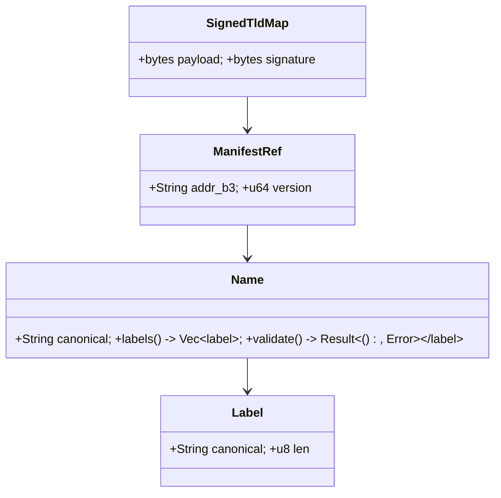
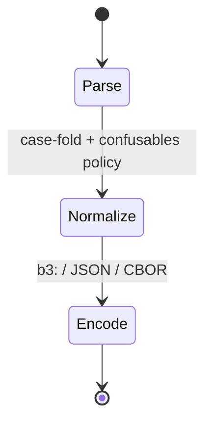

---

# ron-naming

> **Role:** library + offline CLI (`tldctl`)
> **Owner:** Stevan White
> **Status:** draft
> **MSRV:** 1.80.0
> **Last-updated:** 2025-10-06
> **Audience:** contributors, auditors, API/CLI consumers

Badges (optional):
[]() []() []() []() []() []()

---

## 1) Overview

**What it is (one paragraph):**
`ron-naming` is the **constitutional library** for RustyOnions naming: canonical **schemas, normalization, validation, and encodings** (e.g., `b3:<hex>` for BLAKE3 content IDs). It is **pure** (no network/DB) and ships a first-class, **offline** CLI named **`tldctl`** for linting/packing/signing/verifying governance artifacts and name manifests—deterministic, script-friendly, CI-ready. Runtime resolution/indexing is owned by `svc-index`.

**How it fits (RustyOnions topology):**

* **Pillar:** 9 — Content Addressing & Naming
* **Upstream callers:** `svc-index`, `ron-app-sdk`, `omnigate`, CI/ops tools
* **Downstream deps:** none at runtime (lib-pure); DTO/wire via `ron-proto`
* **Data it touches:** in-memory only (serde DTOs; canonical vectors)
* **Security boundary:** no secrets/PII; strict input hygiene; deterministic errors
* **Facets:** normalization invariants underpin **Graph/Search** developer-suite schemas

### 1.1 High-Level Architecture (Mermaid)

```mermaid
flowchart LR
  subgraph Client/Node
    A[svc-index / SDK / omnigate / CI] -->|normalize/encode| B(ron-naming)
    A -->|offline ops| E[tldctl (CLI)]
  end

  B -->|DTO schemas| C[ron-proto]
  A -->|runtime lookups| D[svc-index]

  style B fill:#0b7285,stroke:#083344,color:#fff
  style E fill:#334155,stroke:#111827,color:#fff
```

---

## 2) Responsibilities & Boundaries

**MUST do (core responsibilities):**

* [ ] Canonical **types**: `Name`, `Label`, `ManifestRef`, `AddrB3`, `SignedTldMap`
* [ ] **Normalization & validation**: Unicode case-fold, confusables policy, label/total length limits
* [ ] **Encodings**: `b3:<hex>`, JSON/CBOR round-trip with `#[serde(deny_unknown_fields)]`
* [ ] **CLI (`tldctl`)**: offline `lint|pack|sign|verify|show` with deterministic outputs/exit codes
* [ ] Canonical **test vectors** and reproducible benches

**MUST NOT do (anti-scope / boundaries):**

* [ ] No network/DB/DHT/resolution (that’s `svc-index` / `svc-dht`)
* [ ] No policy/quota/auth decisions (gateway/policy/auth crates)
* [ ] No runtime config surface in the library (CLI only)

**Acceptance Gates (PROOF):**

* [ ] **Coverage ≥ 85%**; doc-tests compile
* [ ] **Property tests**: normalization (ASCII/Unicode edges, confusables)
* [ ] **Fuzz**: `normalize_fuzz` ≥ **1h nightly**, zero crashes/OOMs
* [ ] **Vectors**: JSON/CBOR round-trip; `deny_unknown_fields` enforced
* [ ] **Perf gate**: normalize p95 < **50 µs**, encode/parse p95 < **30 µs**; **±5%** variance CI threshold
* [ ] **CLI soak**: 24h batch via stdin (≥10M items) → **no RSS growth/throughput collapse**
* [ ] **SemVer guard**: public API checked (CI `cargo-public-api`), breaking changes documented

---

## 3) Public Interfaces

### 3.1 Rust API (library)

Key modules/types:

* `pub mod model` — `Name`, `Label`, `ManifestRef`, `SignedTldMap`, error taxonomy
* `pub mod normalize` — Unicode fold, confusables policy, length/bounds checks
* `pub mod encode` — stable encoders/decoders (`b3:<hex>`, JSON/CBOR canonical bytes)

Example:

```rust
use ron_naming::{normalize::NameRules, model::Name};

fn main() -> anyhow::Result<()> {
    let n: Name = NameRules::default().normalize("Example.App")?;
    assert_eq!(n.to_string(), "example.app");
    Ok(())
}
```

### 3.2 CLI — **`tldctl` (offline only; build with feature `cli`)**

> **Note:** The CLI is integral but **explicitly feature-gated** to keep the library dependency-light.
> Build it with: `cargo build -p ron-naming --features cli --release` (MSRV unchanged).

**Subcommands (stable contract):**

* `lint <in>` — validate names/schemas
* `pack <in> [--out <out>]` — canonicalize & pack (deterministic bytes)
* `sign <in> [--out <out>]` — sign governance artifacts (detached / multi-sig / PQ-hybrid via host KMS)
* `verify <in>` — verify signatures/integrity
* `show <in>` — pretty or machine-readable inspect
* `selftest` — quick in-repo smoke tests of vectors/policies

**Global & domain flags:**

* `--config <path>`
* `--format json|cbor` (I/O format)
* `--pretty` (human output)
* `--in <path>` / `--out <path>` (`-` = stdin/stdout)
* `--stdin` (streaming) / `--parallel` (batch; Rayon)
* `--strict` (hardened validation)
* `--allow-mixed-scripts` (bool; default policy may disallow)
* Signing knobs: `--sign-profile`, `--pq-mode off|hybrid`, multi-sig aggregation
* Logging: `--log-format`, `--log-level`

**Exit codes:** `0=ok, 2=usage, 3=validation, 4=signature_invalid, 64+=unexpected`

**Precedence:** `flags` > `TLDCTL_*` > `RON_NAMING_*` > `--config` > built-ins

**Usage examples:**

```bash
# Lint a manifest (JSON in, pretty out)
tldctl lint ./manifests/name.json --format json --pretty --strict

# Canonical pack → CBOR file
tldctl pack ./manifests/tldmap.json --format cbor --out ./out/tldmap.cbor

# Sign with PQ-hybrid (detached multi-sig), then verify
tldctl sign ./out/tldmap.cbor --sign-profile ops --pq-mode hybrid --out ./out/signed.cbor
tldctl verify ./out/signed.cbor
```

---

## 4) Configuration

**Library:** none (pure).
**CLI (`tldctl`) env (optional):**

| Variable        | Type   | Default | Description                         |
| --------------- | ------ | ------: | ----------------------------------- |
| `TLDCTL_CONFIG` | path   |       — | CLI config path (toml/json)         |
| `TLDCTL_FORMAT` | enum   |  `json` | default I/O format                  |
| `RON_NAMING_*`  | var    |       — | shared fallbacks (lower precedence) |
| `LOG_LEVEL`     | string |  `info` | CLI logging level                   |

---

## 5) Build, Run, Test

**Build (library):**

```bash
cargo build -p ron-naming
```

**Build (CLI):**

```bash
cargo build -p ron-naming --features cli --release
```

**Run CLI:**

```bash
RUST_LOG=info ./target/release/tldctl lint ./examples/names.toml --strict
```

**Tests:**

```bash
cargo test -p ron-naming --all-features
cargo test -p ron-naming --doc
```

**Fuzz / soak:**

```bash
cargo fuzz run normalize_fuzz -- -max_total_time=3600
```

**Lint & format:**

```bash
cargo fmt --all
cargo clippy -p ron-naming -- -D warnings
```

**Security & deps:**

```bash
cargo deny check
```

**Bench (Criterion) & CLI microbench (hyperfine):**

```bash
cargo bench -p ron-naming
hyperfine --warmup 3 'tldctl lint ./manifests/name.json --format json --strict'
hyperfine --warmup 3 "cat corpora/100k.txt | tldctl normalize --stdin --parallel"
```

---

## 6) Observability

Library exposes no endpoints. Host services SHOULD export:

* `naming_policy_loaded` (Gauge bool)
* `naming_manifest_parse_errors_total{reason}` (Counter)
* Golden metrics: `request_latency_seconds`, `errors_total`, `service_restarts_total`, `bus_lagged_total`

**CLI structured logs:** include `err_kind`, `duration_ms`, `input_len`, `normalized_len` on failure/warn paths.

---

## 7) Performance & SLOs

| Metric                 |        Target | Variance (CI) | Notes                                           |
| ---------------------- | ------------: | :-----------: | ----------------------------------------------- |
| Normalize p95 (lib)    |       < 50 µs |      ±5%      | ASCII + mixed Unicode; confusables off          |
| Encode/parse p95 (lib) |       < 30 µs |      ±5%      | `b3:<hex>`, JSON/CBOR stable                    |
| `tldctl normalize` p95 | < 2 ms (warm) |      ±10%     | single op latency                               |
| `tldctl` batch (stdin) |   ≥ 450k/s CI |       —       | single-thread; ≥ 1.2M/s local with `--parallel` |

> Repro: Criterion benches + hyperfine scripts (see `testing/performance`), pinned datasets, and machine profile. CI fails when drift exceeds variance gates.

---

## 8) Data & Schema

**No DB**. Types + canonical vectors only; persistence/resolution live in services.



*Wire formats:* JSON/CBOR stable; `to_canonical_bytes()` for deterministic packing.
*Migrations:* versioned DTOs; round-trip compatibility tests; deterministic rejects for older-than-min.

---

## 9) Security & Privacy

* **Threat model (STRIDE):** Tampering/DoS via hostile inputs; spoofing via confusables (mitigate via policy flags).
* **Key handling:** none in library; CLI delegates signing to host KMS/local keystore (no secrets stored here).
* **PII:** none.
* **AuthN/Z:** n/a (callers enforce).
* **Input hygiene:** Unicode normalization, confusable policy surface, strict length limits, `deny_unknown_fields`.
* **Code policy:** `#![forbid(unsafe_code)]`; clippy forbids `unwrap/expect` on non-test paths.
* **Version pins:** Unicode/IDNA/confusables **surfaced via `version_info()`** for auditors.
* **Amnesia note:** CLI performs only explicit file I/O; no hidden caches/temp artifacts.

---

## 10) Error Taxonomy

| Code/Variant                   | When it happens            | User hint                              | Retries |    |
| ------------------------------ | -------------------------- | -------------------------------------- | ------- | -- |
| `Error::InvalidRune`           | disallowed Unicode rune    | restrict to allowed characters         | no      |    |
| `Error::LabelTooLong`          | label length > max         | shorten label                          | no      |    |
| `Error::TotalTooLong`          | name length > max          | shorten name                           | no      |    |
| `Error::DecodeFailure`         | malformed encoded string   | verify `b3:<hex>` or wire bytes        | no      |    |
| `Error::VectorVersion`         | vector too old/new         | upgrade/downgrade via migrators        | no      |    |
| `ValidationError::LabelOctets` | >63 octets in a label      | reduce label size                      | no      |    |
| `WireError` (CLI)              | format mismatch            | set `--format json                     | cbor`   | no |
| `SignError` / `VerifyError`    | sign/verify failures (CLI) | check profile/keys, PQ mode, integrity | no      |    |

---

## 11) Concurrency Model

* **Runtime:** none (lib-pure).
* **CLI:** one-shot; streaming I/O; optional Rayon `--parallel` for batch only.
* **Golden rule (repo-wide):** never hold a lock across `.await`—this crate avoids async entirely.



---

## 12) Compatibility & Requirements

* **Rust:** MSRV 1.80.0
* **OS:** any (no OS-specific code)
* **DTOs:** via `ron-proto` (stable; `deny_unknown_fields`)
* **Unicode/IDNA pins:** exposed via `version_info()`
* **No network/DB/DHT:** enforced for both lib and CLI
* **Enabling `cli` does not raise MSRV** (policy: no unexpected toolchain bumps)

---

## 13) Examples

**Library:**

```rust
use ron_naming::{normalize::NameRules, model::Name};
fn main() -> anyhow::Result<()> {
    let n: Name = NameRules::default().normalize("App.EXAMPLE")?;
    println!("{}", n); // "app.example"
    Ok(())
}
```

**CLI basics:**

```bash
tldctl lint ./examples/names.toml --format json --strict
tldctl pack ./manifests/tldmap.json --format cbor --out ./out/tldmap.cbor
tldctl sign ./out/tldmap.cbor --sign-profile ops --pq-mode hybrid --out ./out/signed.cbor
tldctl verify ./out/signed.cbor
tldctl selftest
printf "Ｅxample.ｏrg\n" | tldctl normalize --stdin --pretty
```

---

## 14) Troubleshooting

* **Unexpected characters rejected** → violates allowed rune set or confusable policy.
* **Vector mismatch** → DTO/version drift; sync with current `ron-proto`.
* **CLI precedence confusion** → `flags > TLDCTL_* > RON_NAMING_* > --config > defaults`.
* **High p95** → use `--release`; reduce logging; verify dataset; consider `--parallel` for batch.
* **Signature invalid** → confirm sign profile, key provenance, and PQ mode (`off|hybrid`).
* **Amnesia expectation** → CLI writes **only** to paths you pass via `--out`; no hidden state.

---

## 15) Development Notes

* Keep `ron-naming` strictly **types/normalization/encodings**; resolution belongs to `svc-index`.
* Public API SemVer discipline enforced via CI.
* `#![forbid(unsafe_code)]` at crate root.

**Pre-commit quickcheck**

```bash
cargo fmt --all
cargo clippy -- -D warnings
cargo test
cargo deny check
```

---

## 16) Mermaid Diagrams — Policy & Tooling

This README includes:

1. **Architecture** — §1.1
2. **Sequence** — below
3. **State** — §11

**Sequence (CLI normalize → encode → sign/verify):**

```mermaid
sequenceDiagram
  actor CI as CI/Operator
  participant T as tldctl
  participant L as ron-naming (lib)
  CI->>T: tldctl lint/pack --format cbor --strict
  T->>L: normalize(manifest) / encode(b3:<hex>)
  L-->>T: canonical bytes + diagnostics
  CI->>T: tldctl sign --pq-mode hybrid
  T-->>CI: signed.cbor (deterministic); exit 0
```

**Local rendering (SVG)**

```bash
npm i -g @mermaid-js/mermaid-cli
mmdc -i docs/arch.mmd -o docs/arch.svg
```

**Docker**

```bash
docker run --rm -v "$PWD":/data minlag/mermaid-cli mmdc -i docs/arch.mmd -o docs/arch.svg
```

**CI (GitHub Actions snippet)**

```yaml
name: render-mermaid
on: [push, pull_request]
jobs:
  mmdc:
    runs-on: ubuntu-latest
    steps:
      - uses: actions/checkout@v4
      - run: npm i -g @mermaid-js/mermaid-cli
      - run: |
          mkdir -p docs
          for f in $(git ls-files '*.mmd'); do
            out="${f%.mmd}.svg"
            mmdc -i "$f" -o "$out"
```

---

## 17) Roadmap & TODO

* [ ] **M1 — Canonical rule set & vectors** (ASCII + common Unicode), confusables policy surface
* [ ] **M2 — `tldctl` parity** for `lint|pack|sign|verify|show`, signed vectors, deterministic outputs
* [ ] **Hardening** — fuzz/property (extreme rune/length), regression benches, public-API guards
* [ ] **PQ-adjacent** — keep `b3:<hex>` (Grover-resilient at chosen width); CLI supports **PQ-hybrid sign** via host KMS; future verify hooks optional

---

## 18) Changelog

See [CHANGELOG.md](./CHANGELOG.md). Follow SemVer; document schema/encoding/CLI changes with migration notes and updated vectors.

---

## 19) License

Dual-licensed under **MIT** or **Apache-2.0**. See [LICENSE-MIT](../LICENSE-MIT) and [LICENSE-APACHE](../LICENSE-APACHE).

---

## 20) Contributing

PRs welcome! Include:

* Updated canonical vectors & docs
* Compile-checked examples (doc-tests)
* Bench impact if algorithms change
* **CLI contract** notes (subcommands/flags/exit codes) if modified

> Also see `docs/IDB.md` and Pillar 9 in `12_PILLARS.md`.

---
