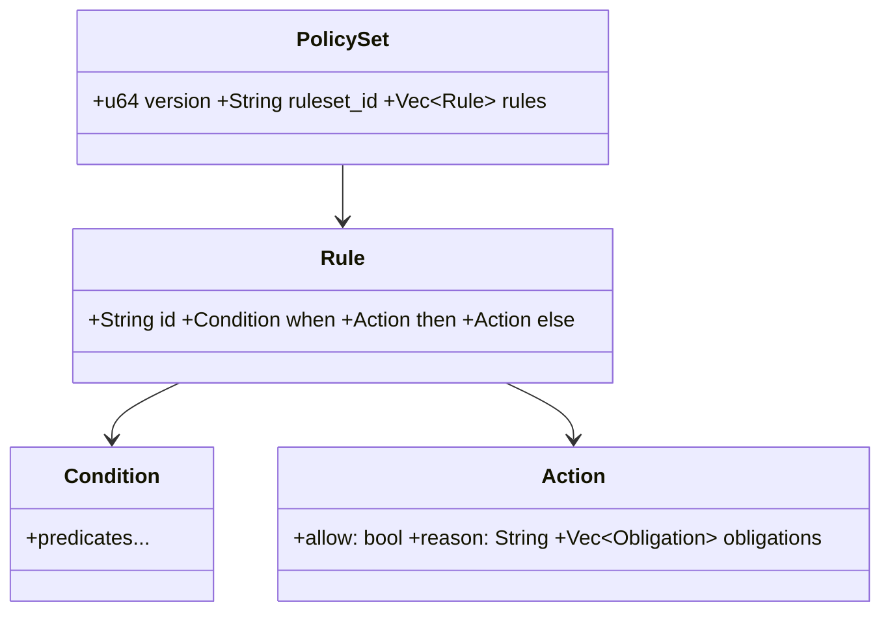
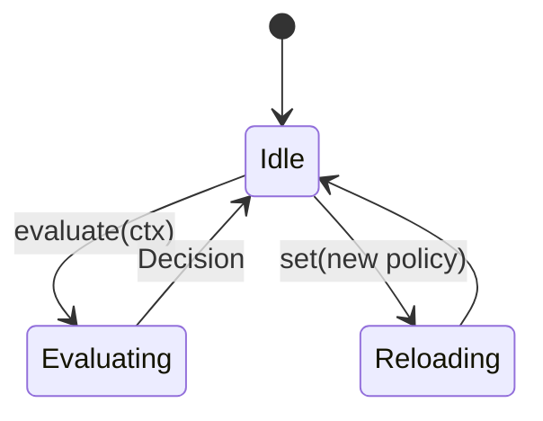
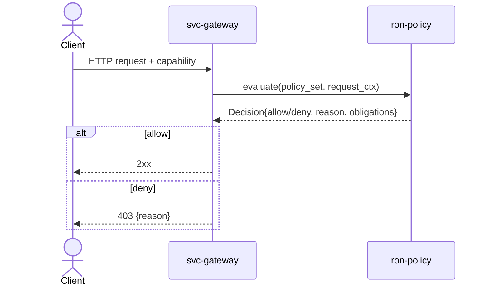

---

# ron-policy

> **Role:** library
> **Owner:** Stevan White
> **Status:** draft
> **MSRV:** 1.80.0
> **Last reviewed:** 2025-10-06

Badges:
[]()
[]()
[]()


[]()

---

## 1) Overview

**What it is:**
`ron-policy` is the **declarative policy engine** for RustyOnions. It defines a typed **policy model** (rules, conditions, obligations), a **pure in-memory evaluator** returning a `Decision { allow, reason, obligations }`, and **zero-I/O parsers** for JSON/TOML policy bundles. It is **amnesia-safe**—no files, sockets, or threads—and can be embedded into Micronode or any service (gateway, overlay, storage).

**How it fits (RustyOnions topology):**

* **Pillar:** 2 — Policy & Governance
* **Upstream callers:** `svc-gateway`, `omnigate`, `svc-index`, `svc-storage`, `svc-mailbox`, `svc-overlay`
* **Downstream deps:** none (pure lib; may consume `ron-proto` DTOs)
* **Data it touches:** in-memory only
* **Security boundary:** no key custody; no PII persistence; **Micronode amnesia mode safe by default**

### 1.1 High-Level Architecture

```mermaid
flowchart LR
  subgraph Service
    A[svc-gateway / omnigate / …] -->|evaluate(policy, ctx)| B(ron-policy)
  end
  B -->|Decision {allow, reason, obligations}| A
  A -->|Metrics/Tracing| E[[Prometheus / Spans]]
  style B fill:#0b7285,stroke:#083344,color:#fff
```

---

## 2) Responsibilities & Boundaries

**MUST do**

* [ ] Parse versioned policy bundles → typed `PolicySet` (deny unknown fields in strict mode).
* [ ] Evaluate → `Decision` with explainable path.
* [ ] Emit stable denial reasons (ops contracts).
* [ ] Expose metric name/label traits for host export.

**MUST NOT do**

* [ ] No I/O (network/fs); hosts fetch/cache.
* [ ] No globals or side effects.
* [ ] No ECON actions (debits/quotas) — return obligations only.
* [ ] No new crates (binds to 33-crate canon).

**Acceptance Gates**

* [ ] Prop + fuzz tests (monotonicity/idempotency).
* [ ] Canonical metrics implemented via traits.
* [ ] Denial reasons stable under golden tests.
* [ ] Bench p99 ≤ 100 µs; CI fails on > 10 % regression.

---

## 3) Public Interfaces

### 3.1 Rust API (library)

```rust
//! Minimal allow/deny example (doc-tested)
use ron_policy::{engine::Evaluator, parse::from_toml_str, ctx::RequestCtx};

fn main() -> anyhow::Result<()> {
  let pol = r#"
    version = 1
    ruleset_id = "default"
    [[rules]]
    id = "write-quota"
    when.method = ["POST","PUT"]
    when.bytes_out_per_min <= 1048576
    then.allow = true
    else.allow = false
    else.reason = "quota_exceeded"
  "#;

  let set = from_toml_str(pol)?;
  let ev = Evaluator::new(&set);

  // Allowed
  let ok = RequestCtx::builder().method("POST").bytes_out_per_min(512 * 1024).build();
  assert!(ev.evaluate(&ok).allow);

  // Denied
  let deny = RequestCtx::builder().method("PUT").bytes_out_per_min(2 * 1024 * 1024).build();
  let d = ev.evaluate(&deny);
  assert!(!d.allow);
  assert_eq!(d.reason.as_str(), "quota_exceeded");
  Ok(())
}
```

Modules: `model`, `engine`, `parse`, `ctx`, `explain`.
*No Bus/HTTP/CLI interfaces — pure lib.*

---

## 4) Configuration

| Variable             | Type | Default | Description                      |
| -------------------- | ---- | ------: | -------------------------------- |
| `RON_POLICY_STRICT`  | bool |  `true` | Deny unknown fields during parse |
| `RON_POLICY_EXPLAIN` | bool |  `true` | Attach explain data to Decision  |

**Host wire-up example (in svc-gateway):**

```rust
let (strict, explain) = (
  std::env::var("RON_POLICY_STRICT").unwrap_or("true".into())=="true",
  std::env::var("RON_POLICY_EXPLAIN").unwrap_or("true".into())=="true",
);
let set = ron_policy::parse::from_json_str(bundle)?;
let mut ev = ron_policy::engine::Evaluator::new(Box::leak(Box::new(set)));
ev.set_explain(explain);
```

**Cargo features:** `json`, `toml`, `geo`, `quota`, `explain`.

---

## 5) Build / Test / Lint / Bench / Fuzz

```bash
cargo build -p ron-policy
cargo test -p ron-policy --all-features
cargo test -p ron-policy --doc
PROPTEST_CASES=1024 cargo test -p ron-policy
cargo fmt --all
cargo clippy -p ron-policy -- -D warnings
cargo deny check
cargo bench -p ron-policy
cargo fuzz run fuzz_bundle_parse -- -max_total_time=120
```

Fuzz targets live in `fuzz/fuzz_targets/{fuzz_bundle_parse,fuzz_eval}.rs`.

---

## 6) Observability

Library has no endpoints; hosts export metrics via traits:

* `policy_decisions_total{service,decision,rule}`
* `policy_denials_total{service,reason}`
* `policy_parse_errors_total{format}`
* `policy_version_info{service,version}`

**Tracing:** span `policy.evaluate` → `request_id?`, `rule_count`, `matched_rule`, `decision`, `reason`.

---

## 7) Performance & SLOs

| Metric              |   Target | Notes                         |
| ------------------- | -------: | ----------------------------- |
| P50 evaluate (100r) |  ≤ 10 µs | simple predicates             |
| P99 evaluate (100r) | ≤ 100 µs | CI fails on > 10 % regression |
| Parse 50 KiB bundle |  ≤ 50 ms | release mode                  |

---

## 8) Data & Schema



* `#[serde(deny_unknown_fields)]` enforced in strict mode.
* Version monotonic; breaking changes bump semver.

---

## 9) Security & Privacy

* **Threats:** spoofed ctx, tampered bundles, ambiguous rules.
  **Mitigation:** normalize inputs, signed bundles, deny-by-default.
* **Key handling:** none.
* **PII:** none stored.
* **AuthN/Z:** Decision is advisory; host enforces.
* **Input validation:** strict schema, bounded arrays.
* **Supply chain:** workspace pins, `cargo deny` clean.
* **Amnesia gate:** no disk writes allowed → verified by `amnesia_zero_disk_side_effects` test.

---

## 10) Error Taxonomy

| Variant                    | When                | Hint                  | Retries             |
| -------------------------- | ------------------- | --------------------- | ------------------- |
| `ParseError::Format`       | invalid JSON/TOML   | fix syntax            | no                  |
| `ParseError::UnknownField` | schema drift        | remove unknown fields | no                  |
| `EvalError::MissingCtx`    | ctx missing         | populate field X      | no                  |
| `EvalError::Overflow`      | quota math overflow | verify ranges         | yes (if idempotent) |

---

## 11) Concurrency Model

* Sync lib (`Send+Sync` types).
* No I/O.
* Async-safe for awaiters; **Loom not required** (but hosts may wrap integration tests).



---

## 12) Compatibility & Requirements

* Rust MSRV 1.80.0 (bump = breaking)
* Any OS
* No tokio/axum deps
* TLS/DB: N/A

---

## 13) Examples

Host integration snippet (includes a `b3:` path nod):

```rust
use ron_policy::{engine::Evaluator, parse::from_json_str, ctx::RequestCtx};

fn check(req: HttpReq, bundle: &str) -> bool {
  let set = from_json_str(bundle).expect("policy parse");
  let ev = Evaluator::new(&set);
  let ctx = RequestCtx::builder()
    .tenant(req.tenant)
    .region(req.region)
    .method(req.method)
    .path("/o/b3:abcdef123456") // BLAKE3 address nod
    .build();
  ev.evaluate(&ctx).allow
}
```

---

## 14) Troubleshooting

* **Spiking denials:** check `policy_version_info` + `reason`.
* **Parse failures:** set `RON_POLICY_STRICT=false` → inspect → fix.
* **Perf regressions:** `cargo bench`; CI guards > 10 %.
* **Inconsistent enforcement:** ensure host deny-by-default.

---

## 15) Development Notes

* Libs pure; services run/observe.
* Serde `deny_unknown_fields`.
* Doc examples must compile (`cargo test --doc`).
* No new crates; governance shared with `svc-registry`.

**Pre-commit**

```bash
cargo fmt --all
cargo clippy -- -D warnings
cargo test
cargo deny check
```

---

## 16) Mermaid Diagrams — Authoring & CI

**Architecture:** (above)
**Sequence:**



**Rule Flow:**

```mermaid
flowchart TD
  C[RequestCtx] --> M[Method/Path predicates]
  M --> R[Region/Residency predicates]
  R --> Q[Quota/Rate predicates (OAP/1 frame ≤ 1 MiB)]
  Q --> D{Matched?}
  D -- yes --> A[Action.then]
  D -- no --> E[Action.else]
```

*Render via Docker:*

```bash
docker run --rm -v "$PWD":/data minlag/mermaid-cli mmdc -i docs/arch.mmd -o docs/arch.svg
```

---

## 17) Roadmap & TODO

* [ ] **M1 — Stable model/parsers** (JSON/TOML, strict, basic predicates).
* [ ] **M2 — Explainability & fuzzing** (afl/libFuzzer corpora).
* [ ] **M3 — Perf suite & regression gate** (Criterion benches).
* [ ] **M4 — PQ/Proof hooks:** obligations to require PQ-hybrid channels (Kyber + X25519) or PQ signatures (Dilithium); optional **ZK commitments** for quota proofs.
* [ ] **M5 — Residency sets:** integrate with `svc-registry` signed region catalogs → compact bitmaps + golden tests.
* [ ] **Hardening:** denial reason ABI doc; schema evolution guide.

---

## 18) Changelog

See [CHANGELOG.md](./CHANGELOG.md) — SemVer and MSRV bump rules apply.

---

## 19) License

Dual-licensed under **MIT** or **Apache-2.0**.

---

## 20) Contributing

PRs welcome — include bench diffs + doc examples that compile.
See `docs/IDB.md` for invariants and acceptance gates.

---

**Amnesia Proof Test Example**

```rust
#[test]
fn amnesia_zero_disk_side_effects() {
  use ron_policy::{parse::from_toml_str, engine::Evaluator, ctx::RequestCtx};
  let pol = r#"version=1; ruleset_id="t"; [[rules]] id="x"; then.allow=true"#;
  let set
```
