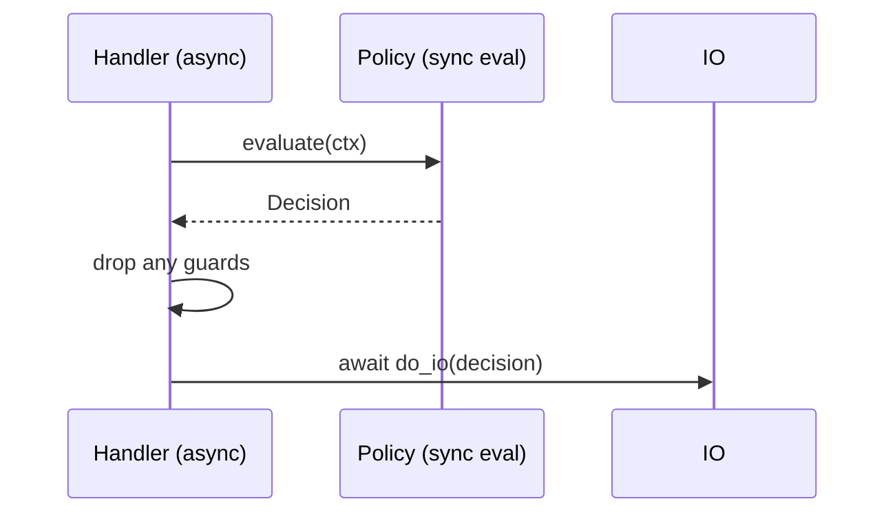

---

title: Concurrency Model — ron-policy
crate: ron-policy
owner: Stevan White
last-reviewed: 2025-10-06
status: draft
template_version: 1.1
msrv: 1.80.0
tokio: "1.x (workspace-pinned; dev/examples only)"
loom: "0.7+ (dev-only)"
lite_mode: "This is a pure library crate: §§2,6,7 are N/A. Others completed."
-----------------------------------------------------------------------------

# Concurrency Model — ron-policy

This document makes the concurrency rules **explicit**: tasks, channels, locks, shutdown, timeouts,
and validation (property/loom/TLA+). It complements `docs/SECURITY.md`, `docs/CONFIG.md`,
and the crate’s `README.md` and `IDB.md`.

> **Golden rule:** never hold a lock across `.await` in supervisory or hot paths.

---

## 0) Lite Mode (this crate)

`ron-policy` is a **pure library**: it starts no runtimes, opens no sockets, and spawns no background tasks.
We fill **§1 Invariants**, **§3 Channels**, **§4 Locks**, **§5 Timeouts**, **§10 Validation**, **§11 Code Patterns**, **§12-15**;
mark **§2 Runtime**, **§6 Shutdown**, **§7 I/O** as **N/A** and provide *consumer guidance* where helpful.

---

## 1) Invariants (MUST)

* **[C-1] No async in core paths.** Public evaluation/validation APIs are synchronous, re-entrant, `Send + Sync`, and **do not `.await`**.
* **[C-2] No lock across `.await`.** This crate does not hold locks across `.await` (there is no `.await` in core); examples for consumers must drop guards before awaiting.
* **[C-3] Pure & deterministic.** `(bundle, ctx, clock)` → `Decision` is pure, free of I/O, and deterministic. No global mutable state, no singletons.
* **[C-4] Bounded work.** Evaluation is **O(m)** in the number of matching rules; any indexing must be immutable snapshots swapped atomically.
* **[C-5] Snapshot semantics.** If helpers expose a `Snapshot<T>`, updates must be **atomic swap** (readers never block on writers; no partial states).
* **[C-6] Backpressure by rejection (not buffering).** Any helper that might enqueue work (e.g., optional schema generator) must use **bounded** queues and return `Busy` rather than grow unbounded.
* **[C-7] Cancel-safety (examples).** All example code for consumers uses `select!`-style cancel paths and timeouts; no blocking syscalls on the async runtime.
* **[C-8] No blocking in `Drop`.** If a helper owns a resource that may need teardown, it exposes `async close()`; `Drop` is best-effort and **non-blocking**.

---

## 2) Runtime Topology — **N/A (library)**

This crate runs **no** Tokio runtime and spawns **no** tasks.

**Consumer guidance:** Services that consume `ron-policy` typically:

* Subscribe to `PolicyChanged{version,id_b3}` on a bus,
* Validate bundle with `ron_policy::Validation`,
* Atomically swap an `Arc<PolicyBundle>` snapshot used by hot-path evaluation.

A reference topology is documented in consumer crates (e.g., `svc-gateway`).

---

## 3) Channels & Backpressure

**Internal to `ron-policy`:** none. The library does not own channels.

**Consumer guidance (recommended patterns):**

| Channel          | Kind    | Capacity | Producers → Consumers | Backpressure Policy          | Notes                                                   |
| ---------------- | ------- | -------: | --------------------- | ---------------------------- | ------------------------------------------------------- |
| `policy_updates` | `watch` |        1 | 1 → N                 | last-write-wins              | Broadcast current snapshot version/ptr.                 |
| `bundle_loader`  | `mpsc`  |      128 | 1 → 1 (or small pool) | `try_send` or bounded `send` | Load/verify off hot path; reject on full (log + metric) |
| `audit_events`   | `mpsc`  |      512 | N → 1                 | drop-oldest + counter        | If used by service for audit side-channel.              |

**Principles:**

* Prefer **rejection** (`Busy`) over hidden buffering when queues fill.
* Keep **queue_depth** and **queue_dropped_total** metrics in consumer services.

---

## 4) Locks & Shared State

**Inside `ron-policy`:**

* Core types are **immutable** once constructed; evaluation reads borrowed data.
* No `Mutex`/`RwLock` needed in core. Any optional helper struct that caches indices must:

  * Build a new immutable index off-thread (in consumers), then
  * **Atomically swap** the `Arc<Index>` (no partial visibility).

**Allowed (in examples/helpers):**

* `Arc<T>` snapshots for bundles/indices.
* `RwLock` for **short**, sync-only reads/writes (drop guard before `.await` in consumers).
* `OnceCell`/`LazyLock` for static, immutable tables.

**Forbidden:**

* Holding `Mutex/RwLock` guards across `.await`.
* Nested locks without a documented order (none required here).
* Global mutable state.

**Suggested hierarchy (if a consumer really needs locks):**

1. `policy_meta` → 2. `route_index` → 3. `counters` (acquire in this order only).

---

## 5) Timeouts, Retries, Deadlines

**Inside `ron-policy`:** N/A (no timers, no I/O).
**Consumer expectations:**

* Apply **explicit timeouts** to I/O before/after policy evaluation (e.g., fetching bundles).
* If evaluation is wrapped in an async flow, bound it by a caller-supplied **deadline**; the evaluation itself remains sync and fast.
* Retries are a **service** decision; do not retry non-idempotent operations.

---

## 6) Cancellation & Shutdown — **N/A (library)**

No background tasks to cancel.

**Consumer guidance:** On shutdown, stop intake, swap to a *frozen* snapshot, drain in-flight, then drop snapshots. Never block in `Drop`.

---

## 7) I/O & Framing — **N/A (library)**

`ron-policy` reads/writes no sockets or files. Canonical wire for bundles is JSON; parsing is invoked by consumers.

---

## 8) Error Taxonomy (Concurrency-Relevant)

Library error kinds that intersect with concurrency in **consumers**:

| Error                           | When                                      | Retry? | Notes                                |
| ------------------------------- | ----------------------------------------- | ------ | ------------------------------------ |
| `ValidationError::TightenOnly`  | Bundle relaxes hardening caps             | no     | Fail fast; operator action required. |
| `ValidationError::Churn`        | Residency/limits widen w/o `break_change` | no     | Requires runbook & flagged rollout.  |
| `ValidationError::UnknownField` | Extra fields when strict enabled          | no     | Prevents config smuggling.           |
| `Error::Busy` (helper)          | Bounded queue full (consumer example)     | maybe  | Prefer reject over buffering.        |

---

## 9) Metrics (Concurrency Health — for consumers)

Recommended **service-side** metrics around policy use:

* `policy_eval_latency_seconds` (Histogram) — p50/p95/p99 on hot paths.
* `policy_changes_total{result}` (Counter: `applied|rejected`) — bundle reload outcomes.
* `policy_rejects_total{reason}` (Counter) — `tighten_only, churn, schema, other`.
* `queue_depth{queue}` / `queue_dropped_total{queue}` — for loader/audit channels (if present).

---

## 10) Validation Strategy

**Unit / Property (library):**

* **Determinism:** same `(bundle,ctx,clock)` ⇒ byte-identical `Decision`.
* **Schema strictness:** unknown fields rejected when strict enabled.
* **Tighten-only checks:** upper-bound invariants enforced.
* **Churn safety:** widening requires `break_change=true` + runbook.

**Loom (dev-only; small models):**

* Model **atomic snapshot swap** pattern used by consumers:

  * Thread A reads `Arc<Policy>` while Thread B swaps to `Arc<Policy'>`.
  * Assert: no torn reads; readers never observe partial state; post-swap reads see either old or new pointer.
* Model **bounded queue** with producer/consumer to validate rejection on full (no unbounded growth).

**Fuzz:**

* Fuzz bundle JSON/TOML parsers against upper bounds and schema denial.

**Chaos (in consumers):**

* Kill/restart loader task mid-swap; ensure readers continue with last-good snapshot.

**TLA+ (optional, small spec):**

* Safety: **no relaxed cap** ever passes validation.
* Liveness: **eventual application** of a valid bundle under repeated PolicyChanged events.

---

## 11) Code Patterns (Copy-Paste)

### 11.1 Atomic snapshot (no locks across `.await`)

```rust
use std::sync::Arc;
use ron_policy::{PolicyBundle, Validation, Config};

#[derive(Clone)]
struct PolicySnapshot(Arc<PolicyBundle>);

impl PolicySnapshot {
    fn current(&self) -> Arc<PolicyBundle> { self.0.clone() }
    fn swap(&mut self, next: Arc<PolicyBundle>) { self.0 = next; } // atomic pointer swap
}

// hot path (sync eval inside async handler)
async fn handle_request(ps: &PolicySnapshot, ctx: &RequestCtx) -> Result<Response, Error> {
    let policy = ps.current();                 // clone Arc (no lock)
    let decision = ron_policy::evaluate(&policy, ctx, ctx.now_ms);
    // ... drop policy before any await-heavy work
    do_io_based_on(decision).await
}
```

### 11.2 Guard drop before `.await` (if a lock is unavoidable)

```rust
// BAD: holding a guard across await
// let g = STATE.read();
// do_async(&*g).await;

// GOOD:
let value = {
    let g = STATE.read();
    g.derive_value()
}; // guard dropped here
do_async(value).await;
```

### 11.3 Bounded queue with `try_send` (consumer)

```rust
use tokio::sync::mpsc::{channel, error::TrySendError};

let (tx, mut rx) = channel::<Bundle>(128);
if let Err(TrySendError::Full(_)) = tx.try_send(bundle) {
    metrics::policy_rejects_total("queue_full").inc();
    return Err(Error::Busy);
}
```

### 11.4 Cancel-safe reload (consumer)

```rust
tokio::select! {
  _ = shutdown.changed() => { return Ok(()); }
  maybe_evt = bus.recv() => {
    if let Some(PolicyChanged{ version, id_b3 }) = maybe_evt {
       // fetch on a separate task; apply timeout outside the lock
       let new = fetch_bundle(version, id_b3).await?;
       Validation::new(&cfg).validate_bundle(&new)?;
       snapshot.swap(Arc::new(new));
    }
  }
}
```

### 11.5 Async Drop pattern (if a helper ever owns teardown)

```rust
pub struct Helper { /* ... */ }
impl Helper {
  pub async fn close(&mut self) -> anyhow::Result<()> { /* non-blocking teardown */ Ok(()) }
}
impl Drop for Helper {
  fn drop(&mut self) { tracing::debug!("Drop without close(); resources are trivial"); }
}
```

---

## 12) Configuration Hooks (Quick Reference)

Hooks defined in `docs/CONFIG.md` that influence concurrency **indirectly**:

* `perf.max_rules_hot_path` (caps worst-case eval set size).
* `schema.canonical_wire` (JSON canonical; TOML for authoring).
* Strict flags: `strict_tighten_only`, `require_break_change` (cause **early rejection** vs. queuing).

---

## 13) Known Trade-offs / Nonstrict Areas

* **Index vs. latency:** Precomputing route indices speeds evaluation but increases memory; keep them immutable and swap atomically.
* **Drop-oldest vs. reject:** For audit/loader channels, prefer **reject** on full for correctness; use drop-oldest only for non-critical telemetry.
* **Granularity:** Overly granular quotas/residency rules can inflate rule counts; use route scoping to stay within perf budgets.

---

## 14) Mermaid Diagrams

> Library is lite-mode; diagrams below illustrate **consumer** patterns.

### 14.1 Atomic snapshot & reload (consumer)

```mermaid
flowchart LR
  U[Bus: PolicyChanged] --> L[Loader Task]
  L --> V[Validate (ron-policy)]
  V -->|ok| S[Arc<PolicyBundle> swap]
  H[Hot Path] -->|clone Arc| S
```

**Text:** A loader receives `PolicyChanged`, validates with `ron-policy`, then atomically swaps the `Arc<PolicyBundle>`. Hot paths clone the `Arc` (no locks).

### 14.2 Guard discipline around `.await` (consumer)



**Text:** Evaluate synchronously, drop any guards, only then perform I/O awaits.

---

## 15) CI & Lints (Enforcement)

**Clippy (crate-level):**

* `-D warnings`
* `-W clippy::await_holding_lock` (defensive; examples/tests)
* `-W clippy::useless_async`
* `-W clippy::needless_collect`
* `-W clippy::redundant_clone`

**Loom (dev profile):**

* Feature-gate tiny loom models for `Arc` snapshot swap and queue rejection.

**Tests to gate merges:**

* Determinism property test (multiple seeds).
* Tighten-only & churn safety unit tests.
* (If helpers added) loom model passes on snapshot swap (no deadlock/torn state).

---

## 16) Schema Generation (Optional)

If we add helper macros later, auto-generate a channels table for consumer examples to avoid drift. Otherwise, keep this doc curated.

---

## 17) Review & Maintenance

* **Cadence:** review every 90 days or when adding any helper that introduces state/caching.
* **Responsibility:** PRs that touch evaluation, validation, or any helper cache **must** update this file and add/adjust tests.
* **MSRV/Tokio/Loom:** Keep in sync with workspace pins; runtime usage remains **dev/examples only** for this crate.

```
```
