---

title: Governance & Economic Integrity — ron-policy
status: draft
msrv: 1.80.0
last-updated: 2025-10-06
audience: contributors, ops, auditors, stakeholders
crate-type: policy

---

# 🏛 GOVERNANCE.md — ron-policy

## 0. Purpose

`ron-policy` defines the **rules of engagement** for allow/deny decisions used by services (gateway/index/storage/overlay) that precede economic actions (e.g., ledger settlement, reward distribution). This document establishes:

* Transparent, auditable **policy change control** (bundles as signed artifacts).
* Enforcement of **policy invariants** (determinism, fail-closed, tighten-only).
* Clear **authority boundaries** (no unbounded admin override; no issuance authority).
* SLA-backed commitments for bundle distribution and observability.

Ties into: **Economic Integrity Blueprint** (no doubles → ensured downstream by ledger), **Hardening Blueprint** (bounded authority, custody), **Perfection Gates A–O** (esp. **Gate I:** bounded economic invariants, **Gate M:** appeal paths).

---

## 1. Invariants (MUST)

Non-negotiable rules enforced by design/tests/CI:

* **[I-P1 Determinism]** Identical `(bundle, ctx, clock)` → identical `Decision{allow|deny, reason, obligations}`.
* **[I-P2 Fail-closed]** On malformed/expired/unsigned bundles or parse errors, evaluation **denies** or the consumer rejects the bundle; never “allow by default.”
* **[I-P3 Tighten-only]** Caps and constraints may be tightened by governance; they MUST NOT be relaxed implicitly (1 MiB body cap, ≤10× decompress, etc.).
* **[I-P4 No I/O / No Side Effects]** ron-policy is pure; all I/O, clocks, and secrets are provided by the caller.
* **[I-P5 Bound Candidate Set]** Route-class indices keep per-request matching bounded; pathological rule sets are rejected at validation.
* **[I-P6 Signed & Versioned]** A bundle is valid only if **signed by quorum** (see §4) and versioned (`semver`, `nonce`, `created_at`, `nbf/exp`).
* **[I-P7 Authority Separation]** ron-policy can **authorize** operations but can’t **execute** ledger mints/spends or reward emissions; those remain with ron-ledger/svc-rewarder.
* **[I-P8 Full Auditability]** Every accepted bundle and decision outcome is auditable via fingerprints/metrics/logs in consumers; bundle provenance is pinned.

> Economic alignment: “No double issuance/spend” is enforced in **ron-ledger**; ron-policy contributes by **denying** operations that would violate configured preconditions (e.g., missing capability scope, replay window exceeded, audience mismatch).

---

## 2. Roles & Authority

### Roles

* **Policy Owner (maintainers):** curates the schema and invariants for ron-policy.
* **Bundle Author(s):** drafts policy rules.
* **Governance Approvers (multi-sig):** cryptographically sign bundle headers; K-of-N quorum required.
* **Service Owners (gateway/index/storage/overlay):** deploy and enforce bundles; own SLOs/rollouts.
* **Ledger Keeper (ron-ledger):** executes settlements within ledger invariants.
* **Rewarder (svc-rewarder):** distributes incentives within ledger caps.
* **Auditor:** read-only verification, red-team drills, public disclosures.

### Authority Boundaries

* Policy **proposes/authorizes**; **never executes** ledger/reward actions.
* Ledger/rewarder may **reject** authorized actions if they violate ledger caps/conservation.
* No single actor may override decisions; **multi-sig only** for bundle acceptance and emergency freezes.
* All roles authenticate via **capability tokens** (macaroons v1) with scoped caveats.

---

## 3. Rules & SLAs

* **Bundle Pipeline SLAs**

  * Validation + signature check ≤ **1s** on standard hardware.
  * Propagation to >95% of fleet ≤ **10m** from “Approved.”
  * `/readyz` must reflect **last-good** snapshot within **5s** after load.

* **Decision Path SLAs (informative, enforced by consumers)**

  * Policy eval p95 **< 1 ms** for ≤1k candidate rules (maintains overall GET budgets).

* **Audit Timeliness**

  * New bundle fingerprint + signer set exported to metrics/logs **immediately** on load; searchable within **1m**.

* **Appeals & Overrides**

  * Disputed outcomes marked in ledger as **disputed** (no silent rollback).
  * Overrides require **quorum multi-sig** with explicit scope & duration; all overrides are time-boxed.

---

## 4. Governance Process

### 4.1 Proposal Lifecycle

```mermaid
flowchart LR
  D[Draft Bundle] --> V[Validate & Lint]
  V -->|pass| S[Signatures K-of-N]
  S -->|quorum| A[Approve]
  A --> C[Canary 1–5%]
  C -->|stable| R[Rollout 100%]
  C -->|regress| RB[Rollback to Last-Good]
```

* **Draft → Validate/Lint:** schema + semantic lint (tighten-only checks, bounded candidate sets).
* **Signatures:** K-of-N hardware-backed keys (HSM/KMS) sign the bundle header: `{fingerprint, semver, nbf, exp, rationale}`.
* **Approve:** governance record appended.
* **Canary:** 1–5% of traffic; watch deny rate and eval p95 for 10–30 min.
* **Rollout:** staged 25% → 50% → 100% with automated rollback guardrails.

### 4.2 Quorum Rules

* Default **K=2, N=3** for routine updates; **K=3, N=5** for schema-affecting or scope-widening changes.
* **Timeout:** default reject if quorum not reached in **24h**.

### 4.3 Emergency Powers

* **Freeze** (block rule set activation) only via quorum multi-sig; publish rationale within **24h**.
* **Unfreeze** follows the same quorum and disclosure requirements.

### 4.4 Parameter Changes

* Any relaxation of caps (body size, decompression, replay window) is **forbidden**; only tightenings permitted.
* Scope additions (new caveats, new route-class attributes) require **enhanced quorum** (K=3, N=5) and extended canary (≥24h).

---

## 5. Audit & Observability

* **Append-Only Audit Log** (in consumers):

  * `policy_bundle_loaded{fingerprint, semver, signers, nbf, exp, rationale}`
  * `policy_bundle_rejected{reason}`
  * `policy_override{scope, not_after}`

* **Metrics (Prometheus)**

  * `policy_bundle_versions{semver}` gauge (labels include fingerprint prefix)
  * `governance_proposals_total{status="draft|approved|rejected|frozen"}`
  * `policy_validation_errors_total{kind}`
  * `policy_decisions_total{decision,reason}` (from consumers)
  * `policy_eval_latency_seconds{decision}` histogram (from consumers)

* **Verifiability**

  * Bundle **fingerprint = BLAKE3(bundle bytes)**; signatures attached.
  * Consumers include `bundle_fingerprint` as a log field on each reload.
  * Optional public **transparency log** (Merkle append) for all approved fingerprints.

* **Red-Team Drills**

  * Simulate rogue admin (single key compromise): confirm **no unilateral override**; require quorum.

---

## 6. Config & Custody

* **Config Declares**

  * Bundle source (path/URI), **trust anchors** (signer keys), reload cadence/debounce.
  * Strict caps (body, decompress, replay windows) and **tighten-only** flag.
  * SLA targets used by alerts.

* **Key Custody**

  * Signer keys in **ron-kms/HSM**; no raw private keys on disk/env.
  * **Rotation every 90 days** or upon suspicion; publish new **trust anchors** to fleet first.
  * Dual-control for key usage (two human approvals).

* **Developer Mode**

  * Only allowed in non-prod; signed by **dev CA**; consumers must refuse dev-signed bundles in prod.

---

## 7. Appeal Path

1. **Raise Dispute:** open governance ticket; attach corr_id, bundle fingerprint, affected route/rule.
2. **Mark Disputed:** downstream ledger marks affected entries `disputed=true` (no silent rollback).
3. **Propose Override:** limited-scope, time-boxed override with K-of-N signatures.
4. **Review & Disclosure:** auditor review; publish post-mortem within **7 days**.
5. **Remediate & Re-canary:** deliver tightened bundle; remove override at or before `not_after`.

**Escalation Bus Topics:** `governance.policy.dispute`, `governance.policy.override`, `governance.policy.freeze`.

---

## 8. Acceptance Checklist (DoD)

* [ ] Invariants [I-P1..I-P8] encoded in code + tests; CI gates active.
* [ ] Multi-sig signer set configured; trust anchors distributed.
* [ ] Proposal lifecycle tooling (lint, sign, canary, rollout, rollback) documented & rehearsed.
* [ ] Metrics/logs export bundle fingerprint, signers, rationale.
* [ ] SLA alerts wired for propagation lag, deny-rate spikes, validation errors.
* [ ] Appeal path exercised in a quarterly chaos drill; reports archived.

---

## 9. Appendix

**Blueprints**

* Economic Integrity (no doubles, bounded emission — enforced in ledger; policy denies on precondition failures).
* Hardening (bounded authority, custody & rotation).
* Perfection Gates **I** (bounded economics), **M** (appeals), **K** (continuous vigilance).

**References**

* Capability tokens (macaroons v1) and scoped caveats (aud, nbf/exp, path/method prefix).
* Governance schema: `docs/spec/governance.md` (bundle header, signature set, quorum).
* TLA+ sketches (optional): policy approval state machine; override time-box safety.

**History**

* Record disputes, overrides, freezes with fingerprints, signers, and outcomes.

---

### Operator Quick-Refs

**Approve a bundle (conceptual flow)**

1. Lint/validate → 2) Sign K-of-N via KMS/HSM → 3) Canary 1–5% (10–30 min) → 4) Rollout 25→50→100% → 5) Publish fingerprint & rationale

**Emergency Freeze**
Submit multi-sig freeze for fingerprint `X`; consumers hold last-good; disclose within 24h; schedule remedial bundle.

**Rotate Signer Keys**
Publish new trust anchors → rotate keys in KMS → require new quorum on next bundle → retire old anchors.
