# Combined Markdown

_Source directory_: `crates/ron-policy/docs`  
_Files combined_: 12  
_Recursive_: 0

---

### Table of Contents

- API.MD
- CONCURRENCY.MD
- CONFIG.MD
- GOVERNANCE.MD
- IDB.md
- INTEROP.MD
- OBSERVABILITY.MD
- PERFORMANCE.MD
- QUANTUM.MD
- RUNBOOK.MD
- SECURITY.MD
- TESTS.MD

---

## API.MD
_File 1 of 12_

---

title: API Surface & SemVer Reference — ron-policy
status: draft
msrv: 1.80.0
last-updated: 2025-10-06
audience: contributors, auditors, API consumers
-----------------------------------------------

# API.md — ron-policy (v0.1.3)

## 0. Purpose

This document captures the **public API surface** of `ron-policy`:

* Snapshot of exported functions, types, traits, and modules.
* SemVer discipline: what changes are **additive** vs **breaking**.
* Alignment with `CHANGELOG.md` (behavioral vs surface changes).
* CI-enforceable via `cargo public-api` and `cargo semver-checks`.
* Serves as the **spec** for external consumers (services, SDKs).

`ron-policy` is a **pure library**: it validates **policy bundles** and performs **deterministic evaluation**. No I/O, no crypto, no background tasks.

---

## 1. Public API Surface

> Generate a fresh snapshot on each release:
>
> ```bash
> VERSION=$(cargo pkgid -p ron-policy | sed 's/.*#//')
> cargo public-api -p ron-policy --simplified > docs/api-history/ron-policy/${VERSION}.txt
> cargo public-api -p ron-policy --simplified --deny-changes
> ```

### 1.1 Current Surface (intended, stable)

```text
# Crate root
pub mod model

// --- Core DTOs (serde; JSON canonical) ---
pub use model::PolicyBundle;
pub use model::Residency;
pub use model::PlacementPrefs;
pub use model::QuotaRule;
pub use model::RouteRule;
pub use model::Features;
pub use model::Meta;
pub use model::Decision;
pub use model::Obligation;   // (non_exhaustive in code)
pub use model::Scope;
pub use model::AppliesTo;
pub use model::Limit;        // (non_exhaustive in code)

// --- Evaluation ---
pub struct RequestCtx<'a> {
    pub route: &'a str,
    pub body_len: u64,
    pub target_region: &'a str,
    pub has_cap: bool,
    pub peer_id: &'a str,
    pub cap_audience: Option<&'a str>,
}
pub fn evaluate(bundle: &PolicyBundle, ctx: &RequestCtx<'_>, now_ms: u64) -> Decision;

// --- Config & Validation ---
pub struct Config;
pub struct LimitsCfg;
pub struct PerfCfg;
pub enum  CanonicalWire { Json, Toml }
pub struct SchemaCfg;

pub struct Validation<'a> { /* new(&'a Config) */ }
impl<'a> Validation<'a> {
    pub fn new(cfg: &'a Config) -> Self;
    pub fn validate_config(&self) -> anyhow::Result<()>;
    pub fn validate_bundle(&self, bundle: &PolicyBundle) -> Result<(), ValidationError>;
}

pub fn validate_bundle_diff(old: &PolicyBundle, new: &PolicyBundle) -> Result<(), ValidationError>;

// --- Errors (non_exhaustive) ---
#[non_exhaustive]
pub enum ValidationError {
    TightenOnly,     // relaxes global caps
    Churn,           // widening without break_change
    UnknownField,    // schema strictness
    Schema(String),  // detailed message
    PerfBudget,      // violates local perf intent
    Other(String),
}

// --- Helpers ---
pub fn parse_bundle_json(src: &str) -> Result<PolicyBundle, serde_json::Error>;
pub fn parse_bundle_toml(src: &str) -> Result<PolicyBundle, toml::de::Error>;
pub fn recompute_b3(canonical_json: &str) -> String;

// --- Reason codes (stable strings) ---
pub const REASON_OK: &str;
pub const REASON_REGION_DENIED: &str;
pub const REASON_REGION_NOT_ALLOWED: &str;
pub const REASON_CAP_REQUIRED: &str;
pub const REASON_BODY_TOO_LARGE: &str;
pub const REASON_DECOMPRESS_GUARD: &str;
// validation-only causes:
pub const REASON_TIGHTEN_ONLY: &str;
pub const REASON_CHURN: &str;
pub const REASON_SCHEMA: &str;
pub const REASON_PERF: &str;
pub const REASON_OTHER: &str;

// --- Feature-gated (additive) ---
#[cfg(feature = "schema")]
pub fn emit_json_schema() -> String;

// --- Optional prelude (DX; additive) ---
pub mod prelude {
    pub use crate::{PolicyBundle, RequestCtx, Decision, evaluate};
}
```

**Notes**

* DTOs derive: `Serialize + Deserialize + Clone + Debug + PartialEq` and use `#[serde(deny_unknown_fields)]`.
* Growth-prone enums are **`#[non_exhaustive]`** in code: `ValidationError`, `Obligation`, `Limit`.
* `evaluate` is **pure** and **sync**; callers supply `now_ms`.

### 1.2 Module Structure

```text
ron_policy
├── model        // DTOs & enums (serde)
├── eval         // evaluate() & RequestCtx
├── config       // Config, LimitsCfg, PerfCfg, SchemaCfg, CanonicalWire
└── validate     // Validation, validate_bundle_diff, ValidationError
```

---

## 2. SemVer Discipline

### 2.1 Additive (Minor / Non-Breaking)

* Adding new free functions (no signature changes).
* Adding new **enum variants** to `#[non_exhaustive]` enums (e.g., `Obligation`, `Limit`, `ValidationError`).
* Adding **feature-gated** APIs (e.g., `emit_json_schema`).
* Adding new **reason code constants** (existing literals remain unchanged).

### 2.2 Breaking (Major)

* Removing/renaming any public symbol listed in §1.1.
* Changing function signatures or argument/return types.
* Making previously `#[non_exhaustive]` enums **exhaustive**.
* Changing JSON DTO shapes in a non–backward-compatible way.
* Renaming/removing **reason code string literals**.
* Bumping **MSRV** below `1.80.0`.

### 2.3 Patch-Level

* Docs, internal refactors, perf improvements with **identical** results & error taxonomy.
* New validations that are opt-in or only affect **invalid** inputs.

### 2.4 Deprecation Policy

* Use `#[deprecated(since = "x.y.z", note = "...")]` for ≥1 minor before removal.
* CHANGELOG must include **Deprecated** and later **Removed** sections.

---

## 3. Stability Guarantees

* **MSRV:** `1.80.0` across the 0.x series (MSRV bumps are **breaking**).
* **Determinism:** `evaluate` yields identical `Decision` for identical `(bundle, ctx, now_ms)` across patch/minor versions.
* **No I/O / No crypto:** Public APIs perform no network/filesystem or crypto operations.
* **No panics on valid inputs:** Public functions return typed errors; panics are considered bugs.
* **Serde compatibility:** Field names/types remain stable; DTO additivity is handled by **bundle versioning**, not by accepting unknown fields (those are rejected by design).

---

## 4. Invariants (API-Level)

* **Pure boundary:** No secrets; only declarative **obligations** (e.g., proof hints).
* **Tighten-only:** Validators enforce global upper bounds (1 MiB body, 10× decompress).
* **Churn safety:** Widening residency/limits requires `metadata.break_change = true` + runbook link; otherwise `ValidationError::Churn`.
* **Reason codes:** String literals in Appendix A are **stable identifiers**.

---

## 5. Tooling

* **cargo-public-api** — detect surface diffs and generate snapshots.
* **cargo-semver-checks** — verify SemVer compliance.
* **cargo-doc (rustdoc JSON)** — optional snapshot for richer diffs:

  ```bash
  RUSTDOCFLAGS="--output-format json" cargo doc -p ron-policy
  ```
* **cargo-fuzz** — fuzz parsers (`parse_bundle_json`, `parse_bundle_toml`).

---

## 6. CI & Gates

```yaml
name: api-surface
on: [pull_request]
jobs:
  public_api:
    runs-on: ubuntu-latest
    steps:
      - uses: actions/checkout@v4
      - uses: dtolnay/rust-toolchain@stable
      - run: cargo install cargo-public-api
      - run: cargo public-api -p ron-policy --simplified --deny-changes

  semver_checks:
    runs-on: ubuntu-latest
    steps:
      - uses: actions/checkout@v4
      - uses: dtolnay/rust-toolchain@stable
      - run: cargo install cargo-semver-checks
      - run: cargo semver-checks check-release -p ron-policy

  rustdoc_json:
    runs-on: ubuntu-latest
    steps:
      - uses: actions/checkout@v4
      - uses: dtolnay/rust-toolchain@stable
      - run: RUSTDOCFLAGS="--output-format json" cargo doc -p ron-policy

  fuzz_smoke:
    runs-on: ubuntu-latest
    steps:
      - uses: actions/checkout@v4
      - uses: dtolnay/rust-toolchain@stable
      - run: cargo install cargo-fuzz
      - run: cargo fuzz run parse_bundle -- -max_total_time=30
```

**Policy:** Fail PR if public API diff exists **without** a matching `CHANGELOG.md` entry and reviewer approval.

---

## 7. Acceptance Checklist (DoD)

* [ ] API snapshot generated → `docs/api-history/ron-policy/<version>.txt`.
* [ ] CI `cargo public-api` and `cargo semver-checks` green.
* [ ] `CHANGELOG.md` updated for any surface/behavior change.
* [ ] All public items documented (`#![deny(missing_docs)]` satisfied).
* [ ] **Reason code literals** verified by test (see below).
* [ ] Fuzz target exists for parsers; smoke-run wired in CI.
* [ ] Deprecations annotated with `#[deprecated]` (if any).

**Reason literal stability test (paste-ready):**

```rust
#[test]
fn reason_literals_are_stable() {
    assert_eq!(ron_policy::REASON_OK, "ok");
    assert_eq!(ron_policy::REASON_REGION_DENIED, "region.denied");
    assert_eq!(ron_policy::REASON_REGION_NOT_ALLOWED, "region.not_allowed");
    assert_eq!(ron_policy::REASON_CAP_REQUIRED, "cap.required");
    assert_eq!(ron_policy::REASON_BODY_TOO_LARGE, "body.too_large");
    assert_eq!(ron_policy::REASON_DECOMPRESS_GUARD, "decompress.guard");
    assert_eq!(ron_policy::REASON_TIGHTEN_ONLY, "tighten_only");
    assert_eq!(ron_policy::REASON_CHURN, "churn");
    assert_eq!(ron_policy::REASON_SCHEMA, "schema");
    assert_eq!(ron_policy::REASON_PERF, "perf");
    assert_eq!(ron_policy::REASON_OTHER, "other");
}
```

---

## 8. Appendix A — Reason Code Set (stable literals)

```rust
pub const REASON_OK: &str                 = "ok";
pub const REASON_REGION_DENIED: &str      = "region.denied";
pub const REASON_REGION_NOT_ALLOWED: &str = "region.not_allowed";
pub const REASON_CAP_REQUIRED: &str       = "cap.required";
pub const REASON_BODY_TOO_LARGE: &str     = "body.too_large";
pub const REASON_DECOMPRESS_GUARD: &str   = "decompress.guard";

// Validation-only causes:
pub const REASON_TIGHTEN_ONLY: &str       = "tighten_only";
pub const REASON_CHURN: &str              = "churn";
pub const REASON_SCHEMA: &str             = "schema";
pub const REASON_PERF: &str               = "perf";
pub const REASON_OTHER: &str              = "other";
```

Adding new reasons is **minor**; renaming/removing existing ones is **major**.

---

## 9. Appendix B — Minimal Usage Examples

### 9.1 Validation & Snapshot Swap

```rust
use ron_policy::{Config, Validation, PolicyBundle};

let cfg = Config::default();
Validation::new(&cfg).validate_config()?;

// Load from registry (service I/O, not in this crate)
let new_bundle: PolicyBundle = load_bundle_from_registry()?;

// Tighten-only + churn checks happen here:
Validation::new(&cfg).validate_bundle(&new_bundle)?;

// Atomically swap Arc<PolicyBundle> snapshot in the service.
```

### 9.2 Deterministic Evaluation

```rust
use ron_policy::{evaluate, model::Decision, PolicyBundle, RequestCtx};

let decision: Decision = evaluate(&bundle, &RequestCtx {
    route: "GET /o/*",
    body_len: 512,
    target_region: "us-east-1",
    has_cap: true,
    peer_id: "p1",
    cap_audience: Some("u1"),
}, 1_764_950_400_000);

assert!(decision.allow);
```

---

## 10. Appendix C — API Evolution Guardrails (DTOs)

* DTOs are **wire contracts**. Any incompatible change to shape/semantics is **major**.
* Keep `serde(deny_unknown_fields)` enabled; evolve via **bundle versioning** and rollouts, not by ignoring fields.
* Growth-friendly enums:

  ```rust
  #[non_exhaustive] pub enum Obligation { /* … */ }
  #[non_exhaustive] pub enum Limit      { /* … */ }
  #[non_exhaustive] pub enum ValidationError { /* … */ }
  ```
* MSRV adherence: dependencies pinned so the crate builds on `1.80.0`.

---

## 11. History (human-curated)

* **0.1.0** — Baseline: DTOs, `evaluate`, `Validation`, `validate_bundle_diff`, reason codes.
* **0.1.1** — Added `Obligation::RequireProof { proof_kind, scope }` (additive). Added perf budget config (`PerfCfg`).
* **0.1.2** — Introduced `metadata.break_change` gating, `CanonicalWire`, and `emit_json_schema` (feature `schema`). Expanded `ValidationError`.
* **0.1.3** — Marked `Obligation`/`Limit`/`ValidationError` as `#[non_exhaustive]`; added `prelude` module; added **no-panic** guarantee; added parser fuzz & rustdoc JSON gates; locked **reason literal** stability test.

---

### References

* Rust SemVer: [https://doc.rust-lang.org/cargo/reference/semver.html](https://doc.rust-lang.org/cargo/reference/semver.html)
* cargo-public-api: [https://github.com/Enselic/cargo-public-api](https://github.com/Enselic/cargo-public-api)
* cargo-semver-checks: [https://github.com/obi1kenobi/cargo-semver-checks](https://github.com/obi1kenobi/cargo-semver-checks)

---

**Perfection Gates tie-in**

* **Gate G:** No undocumented API surface (public-api snapshot).
* **Gate H:** Breaking changes require a major bump (+ migration notes).
* **Gate J:** CHANGELOG entry required for any surface or behavior change.

---


---

## CONCURRENCY.MD
_File 2 of 12_

---

title: Concurrency Model — ron-policy
crate: ron-policy
owner: Stevan White
last-reviewed: 2025-10-06
status: draft
template_version: 1.1
msrv: 1.80.0
tokio: "1.x (workspace-pinned; dev/examples only)"
loom: "0.7+ (dev-only)"
lite_mode: "This is a pure library crate: §§2,6,7 are N/A. Others completed."
-----------------------------------------------------------------------------

# Concurrency Model — ron-policy

This document makes the concurrency rules **explicit**: tasks, channels, locks, shutdown, timeouts,
and validation (property/loom/TLA+). It complements `docs/SECURITY.md`, `docs/CONFIG.md`,
and the crate’s `README.md` and `IDB.md`.

> **Golden rule:** never hold a lock across `.await` in supervisory or hot paths.

---

## 0) Lite Mode (this crate)

`ron-policy` is a **pure library**: it starts no runtimes, opens no sockets, and spawns no background tasks.
We fill **§1 Invariants**, **§3 Channels**, **§4 Locks**, **§5 Timeouts**, **§10 Validation**, **§11 Code Patterns**, **§12-15**;
mark **§2 Runtime**, **§6 Shutdown**, **§7 I/O** as **N/A** and provide *consumer guidance* where helpful.

---

## 1) Invariants (MUST)

* **[C-1] No async in core paths.** Public evaluation/validation APIs are synchronous, re-entrant, `Send + Sync`, and **do not `.await`**.
* **[C-2] No lock across `.await`.** This crate does not hold locks across `.await` (there is no `.await` in core); examples for consumers must drop guards before awaiting.
* **[C-3] Pure & deterministic.** `(bundle, ctx, clock)` → `Decision` is pure, free of I/O, and deterministic. No global mutable state, no singletons.
* **[C-4] Bounded work.** Evaluation is **O(m)** in the number of matching rules; any indexing must be immutable snapshots swapped atomically.
* **[C-5] Snapshot semantics.** If helpers expose a `Snapshot<T>`, updates must be **atomic swap** (readers never block on writers; no partial states).
* **[C-6] Backpressure by rejection (not buffering).** Any helper that might enqueue work (e.g., optional schema generator) must use **bounded** queues and return `Busy` rather than grow unbounded.
* **[C-7] Cancel-safety (examples).** All example code for consumers uses `select!`-style cancel paths and timeouts; no blocking syscalls on the async runtime.
* **[C-8] No blocking in `Drop`.** If a helper owns a resource that may need teardown, it exposes `async close()`; `Drop` is best-effort and **non-blocking**.

---

## 2) Runtime Topology — **N/A (library)**

This crate runs **no** Tokio runtime and spawns **no** tasks.

**Consumer guidance:** Services that consume `ron-policy` typically:

* Subscribe to `PolicyChanged{version,id_b3}` on a bus,
* Validate bundle with `ron_policy::Validation`,
* Atomically swap an `Arc<PolicyBundle>` snapshot used by hot-path evaluation.

A reference topology is documented in consumer crates (e.g., `svc-gateway`).

---

## 3) Channels & Backpressure

**Internal to `ron-policy`:** none. The library does not own channels.

**Consumer guidance (recommended patterns):**

| Channel          | Kind    | Capacity | Producers → Consumers | Backpressure Policy          | Notes                                                   |
| ---------------- | ------- | -------: | --------------------- | ---------------------------- | ------------------------------------------------------- |
| `policy_updates` | `watch` |        1 | 1 → N                 | last-write-wins              | Broadcast current snapshot version/ptr.                 |
| `bundle_loader`  | `mpsc`  |      128 | 1 → 1 (or small pool) | `try_send` or bounded `send` | Load/verify off hot path; reject on full (log + metric) |
| `audit_events`   | `mpsc`  |      512 | N → 1                 | drop-oldest + counter        | If used by service for audit side-channel.              |

**Principles:**

* Prefer **rejection** (`Busy`) over hidden buffering when queues fill.
* Keep **queue_depth** and **queue_dropped_total** metrics in consumer services.

---

## 4) Locks & Shared State

**Inside `ron-policy`:**

* Core types are **immutable** once constructed; evaluation reads borrowed data.
* No `Mutex`/`RwLock` needed in core. Any optional helper struct that caches indices must:

  * Build a new immutable index off-thread (in consumers), then
  * **Atomically swap** the `Arc<Index>` (no partial visibility).

**Allowed (in examples/helpers):**

* `Arc<T>` snapshots for bundles/indices.
* `RwLock` for **short**, sync-only reads/writes (drop guard before `.await` in consumers).
* `OnceCell`/`LazyLock` for static, immutable tables.

**Forbidden:**

* Holding `Mutex/RwLock` guards across `.await`.
* Nested locks without a documented order (none required here).
* Global mutable state.

**Suggested hierarchy (if a consumer really needs locks):**

1. `policy_meta` → 2. `route_index` → 3. `counters` (acquire in this order only).

---

## 5) Timeouts, Retries, Deadlines

**Inside `ron-policy`:** N/A (no timers, no I/O).
**Consumer expectations:**

* Apply **explicit timeouts** to I/O before/after policy evaluation (e.g., fetching bundles).
* If evaluation is wrapped in an async flow, bound it by a caller-supplied **deadline**; the evaluation itself remains sync and fast.
* Retries are a **service** decision; do not retry non-idempotent operations.

---

## 6) Cancellation & Shutdown — **N/A (library)**

No background tasks to cancel.

**Consumer guidance:** On shutdown, stop intake, swap to a *frozen* snapshot, drain in-flight, then drop snapshots. Never block in `Drop`.

---

## 7) I/O & Framing — **N/A (library)**

`ron-policy` reads/writes no sockets or files. Canonical wire for bundles is JSON; parsing is invoked by consumers.

---

## 8) Error Taxonomy (Concurrency-Relevant)

Library error kinds that intersect with concurrency in **consumers**:

| Error                           | When                                      | Retry? | Notes                                |
| ------------------------------- | ----------------------------------------- | ------ | ------------------------------------ |
| `ValidationError::TightenOnly`  | Bundle relaxes hardening caps             | no     | Fail fast; operator action required. |
| `ValidationError::Churn`        | Residency/limits widen w/o `break_change` | no     | Requires runbook & flagged rollout.  |
| `ValidationError::UnknownField` | Extra fields when strict enabled          | no     | Prevents config smuggling.           |
| `Error::Busy` (helper)          | Bounded queue full (consumer example)     | maybe  | Prefer reject over buffering.        |

---

## 9) Metrics (Concurrency Health — for consumers)

Recommended **service-side** metrics around policy use:

* `policy_eval_latency_seconds` (Histogram) — p50/p95/p99 on hot paths.
* `policy_changes_total{result}` (Counter: `applied|rejected`) — bundle reload outcomes.
* `policy_rejects_total{reason}` (Counter) — `tighten_only, churn, schema, other`.
* `queue_depth{queue}` / `queue_dropped_total{queue}` — for loader/audit channels (if present).

---

## 10) Validation Strategy

**Unit / Property (library):**

* **Determinism:** same `(bundle,ctx,clock)` ⇒ byte-identical `Decision`.
* **Schema strictness:** unknown fields rejected when strict enabled.
* **Tighten-only checks:** upper-bound invariants enforced.
* **Churn safety:** widening requires `break_change=true` + runbook.

**Loom (dev-only; small models):**

* Model **atomic snapshot swap** pattern used by consumers:

  * Thread A reads `Arc<Policy>` while Thread B swaps to `Arc<Policy'>`.
  * Assert: no torn reads; readers never observe partial state; post-swap reads see either old or new pointer.
* Model **bounded queue** with producer/consumer to validate rejection on full (no unbounded growth).

**Fuzz:**

* Fuzz bundle JSON/TOML parsers against upper bounds and schema denial.

**Chaos (in consumers):**

* Kill/restart loader task mid-swap; ensure readers continue with last-good snapshot.

**TLA+ (optional, small spec):**

* Safety: **no relaxed cap** ever passes validation.
* Liveness: **eventual application** of a valid bundle under repeated PolicyChanged events.

---

## 11) Code Patterns (Copy-Paste)

### 11.1 Atomic snapshot (no locks across `.await`)

```rust
use std::sync::Arc;
use ron_policy::{PolicyBundle, Validation, Config};

#[derive(Clone)]
struct PolicySnapshot(Arc<PolicyBundle>);

impl PolicySnapshot {
    fn current(&self) -> Arc<PolicyBundle> { self.0.clone() }
    fn swap(&mut self, next: Arc<PolicyBundle>) { self.0 = next; } // atomic pointer swap
}

// hot path (sync eval inside async handler)
async fn handle_request(ps: &PolicySnapshot, ctx: &RequestCtx) -> Result<Response, Error> {
    let policy = ps.current();                 // clone Arc (no lock)
    let decision = ron_policy::evaluate(&policy, ctx, ctx.now_ms);
    // ... drop policy before any await-heavy work
    do_io_based_on(decision).await
}
```

### 11.2 Guard drop before `.await` (if a lock is unavoidable)

```rust
// BAD: holding a guard across await
// let g = STATE.read();
// do_async(&*g).await;

// GOOD:
let value = {
    let g = STATE.read();
    g.derive_value()
}; // guard dropped here
do_async(value).await;
```

### 11.3 Bounded queue with `try_send` (consumer)

```rust
use tokio::sync::mpsc::{channel, error::TrySendError};

let (tx, mut rx) = channel::<Bundle>(128);
if let Err(TrySendError::Full(_)) = tx.try_send(bundle) {
    metrics::policy_rejects_total("queue_full").inc();
    return Err(Error::Busy);
}
```

### 11.4 Cancel-safe reload (consumer)

```rust
tokio::select! {
  _ = shutdown.changed() => { return Ok(()); }
  maybe_evt = bus.recv() => {
    if let Some(PolicyChanged{ version, id_b3 }) = maybe_evt {
       // fetch on a separate task; apply timeout outside the lock
       let new = fetch_bundle(version, id_b3).await?;
       Validation::new(&cfg).validate_bundle(&new)?;
       snapshot.swap(Arc::new(new));
    }
  }
}
```

### 11.5 Async Drop pattern (if a helper ever owns teardown)

```rust
pub struct Helper { /* ... */ }
impl Helper {
  pub async fn close(&mut self) -> anyhow::Result<()> { /* non-blocking teardown */ Ok(()) }
}
impl Drop for Helper {
  fn drop(&mut self) { tracing::debug!("Drop without close(); resources are trivial"); }
}
```

---

## 12) Configuration Hooks (Quick Reference)

Hooks defined in `docs/CONFIG.md` that influence concurrency **indirectly**:

* `perf.max_rules_hot_path` (caps worst-case eval set size).
* `schema.canonical_wire` (JSON canonical; TOML for authoring).
* Strict flags: `strict_tighten_only`, `require_break_change` (cause **early rejection** vs. queuing).

---

## 13) Known Trade-offs / Nonstrict Areas

* **Index vs. latency:** Precomputing route indices speeds evaluation but increases memory; keep them immutable and swap atomically.
* **Drop-oldest vs. reject:** For audit/loader channels, prefer **reject** on full for correctness; use drop-oldest only for non-critical telemetry.
* **Granularity:** Overly granular quotas/residency rules can inflate rule counts; use route scoping to stay within perf budgets.

---

## 14) Mermaid Diagrams

> Library is lite-mode; diagrams below illustrate **consumer** patterns.

### 14.1 Atomic snapshot & reload (consumer)

```mermaid
flowchart LR
  U[Bus: PolicyChanged] --> L[Loader Task]
  L --> V[Validate (ron-policy)]
  V -->|ok| S[Arc<PolicyBundle> swap]
  H[Hot Path] -->|clone Arc| S
```

**Text:** A loader receives `PolicyChanged`, validates with `ron-policy`, then atomically swaps the `Arc<PolicyBundle>`. Hot paths clone the `Arc` (no locks).

### 14.2 Guard discipline around `.await` (consumer)


**Text:** Evaluate synchronously, drop any guards, only then perform I/O awaits.

---

## 15) CI & Lints (Enforcement)

**Clippy (crate-level):**

* `-D warnings`
* `-W clippy::await_holding_lock` (defensive; examples/tests)
* `-W clippy::useless_async`
* `-W clippy::needless_collect`
* `-W clippy::redundant_clone`

**Loom (dev profile):**

* Feature-gate tiny loom models for `Arc` snapshot swap and queue rejection.

**Tests to gate merges:**

* Determinism property test (multiple seeds).
* Tighten-only & churn safety unit tests.
* (If helpers added) loom model passes on snapshot swap (no deadlock/torn state).

---

## 16) Schema Generation (Optional)

If we add helper macros later, auto-generate a channels table for consumer examples to avoid drift. Otherwise, keep this doc curated.

---

## 17) Review & Maintenance

* **Cadence:** review every 90 days or when adding any helper that introduces state/caching.
* **Responsibility:** PRs that touch evaluation, validation, or any helper cache **must** update this file and add/adjust tests.
* **MSRV/Tokio/Loom:** Keep in sync with workspace pins; runtime usage remains **dev/examples only** for this crate.

```
```


---

## CONFIG.MD
_File 3 of 12_

---

title: Configuration — ron-policy
crate: ron-policy
owner: Stevan White
last-reviewed: 2025-10-06
status: draft
template_version: 1.0
---------------------

# Configuration — ron-policy

This document defines **all configuration** for `ron-policy`, including sources,
precedence, schema (types/defaults), validation, feature flags, live-reload behavior,
and security implications. It complements `README.md`, `docs/IDB.md`, and `docs/SECURITY.md`.

> **Tiering:**
> **Library crate.** `ron-policy` is **pure** (no I/O, no sockets). It exposes a typed `Config`
> and validators for consumers (e.g., `svc-gateway`, `svc-storage`). Service-only notes are marked **(service-only)**.

---

## 1) Sources & Precedence (Authoritative)

`ron-policy` does not read files/env by itself. Consumers provide a `ron_policy::Config`
instance. If a consumer also supports external sources, use this precedence (**highest wins**):

1. **Process flags** (CLI) **(service-only)**
2. **Environment variables** **(service-only)**
3. **Config file** (JSON/TOML) **(service-only)**
4. **Built-in defaults** (the `Config::default()` in the consumer)

> On dynamic reload, recompute the effective config under the same precedence and re-validate with `ron_policy::validate_config()`.

**Supported on-wire formats (when consumers persist config):** JSON (canonical), TOML (authoring convenience).
**Relative `--config` paths (service-only):** resolve as `./`, then `$CWD`, then service crate dir.

---

## 2) Quickstart Examples

### 2.1 Library embedding (typical)

```rust
use ron_policy::{Config, Validation, PolicyBundle};

let cfg = Config::default();                // strict + tighten-only by default
cfg.validate()?;                            // fail-closed if misconfigured

// Load or receive a PolicyBundle from svc-registry (service does the I/O)
let bundle: PolicyBundle = obtain_bundle_from_registry()?;

// Validate bundle against config (tighten-only, churn, schema)
Validation::new(&cfg).validate_bundle(&bundle)?;
```

### 2.2 Consumer service overlay (e.g., svc-gateway) **(service-only)**

```bash
RON_POLICY_STRICT_DENY_UNKNOWN=true \
RON_POLICY_STRICT_TIGHTEN_ONLY=true \
RON_POLICY_REQUIRE_BREAK_CHANGE=true \
RON_POLICY_CANONICAL_WIRE=json \
RON_POLICY_PERF_MAX_RULES_HOT_PATH=1000 \
RON_POLICY_PERF_P95_BUDGET_MS=1 \
svc-gateway --config /etc/ron/gateway.toml
```

### 2.3 Config file snippet merged by consumer **(service-only)**

```toml
# policy-config.toml
[policy]
strict_deny_unknown = true
strict_tighten_only = true
require_break_change = true

[policy.limits]
max_body_upper_bound = "1MiB"
decompress_ratio_upper_bound = 10

[policy.perf]
max_rules_hot_path = 1000
p95_budget_ms = 1

[policy.schema]
canonical_wire = "json"
emit_json_schema = false
```

---

## 3) Schema (Typed, With Defaults)

> **Env prefix for consumers:** `RON_POLICY_…`
> **Durations:** `ms`, `s`, `m`, `h` (when services choose to expose durations).
> **Sizes:** `B`, `KB`, `MB`, `MiB`.

**Core (library) configuration**

| Key / Env Var (service-only)                                 | Type                 | Default | Description                                                                | Security Notes                          |
| ------------------------------------------------------------ | -------------------- | ------- | -------------------------------------------------------------------------- | --------------------------------------- |
| `strict_deny_unknown` / `RON_POLICY_STRICT_DENY_UNKNOWN`     | bool                 | `true`  | Reject unknown fields in bundles (`serde(deny_unknown_fields)`).           | Prevents config smuggling.              |
| `strict_tighten_only` / `RON_POLICY_STRICT_TIGHTEN_ONLY`     | bool (hard-enforced) | `true`  | Bundles may only **tighten** global caps (never relax).                    | Guards hardening invariants.            |
| `require_break_change` / `RON_POLICY_REQUIRE_BREAK_CHANGE`   | bool                 | `true`  | Widening residency/limits requires `metadata.break_change=true` + runbook. | Forces explicit, auditable rollouts.    |
| `amnesia_default_ok` / `RON_POLICY_AMNESIA_DEFAULT_OK`       | bool                 | `true`  | If true, evaluator emits degrade-writes obligations by default.            | Avoids silent persistence on Micronode. |
| `econ_zk_hints_allowed` / `RON_POLICY_ECON_ZK_HINTS_ALLOWED` | bool                 | `true`  | Allow declarative `RequireProof{…}` obligations (no crypto here).          | No keys/compute in this crate.          |

**Limits (upper bounds, aligned with Hardening Blueprint)**

| Key / Env Var (service-only)                                                | Type | Default | Description                                          | Security Notes        |
| --------------------------------------------------------------------------- | ---- | ------- | ---------------------------------------------------- | --------------------- |
| `limits.max_body_upper_bound` / `RON_POLICY_MAX_BODY_UPPER_BOUND`           | size | `1MiB`  | Hard ceiling; policy `max_body_bytes` must be ≤ this | Content-length guard. |
| `limits.decompress_ratio_upper_bound` / `RON_POLICY_DECOMPRESS_UPPER_BOUND` | u32  | `10`    | Hard ceiling; policy `decompress_ratio_max` ≤ this   | Zip-bomb guard.       |

**Performance (evaluation budgets)**

| Key / Env Var (service-only)                                     | Type | Default | Description                                      |
| ---------------------------------------------------------------- | ---- | ------- | ------------------------------------------------ |
| `perf.max_rules_hot_path` / `RON_POLICY_PERF_MAX_RULES_HOT_PATH` | u32  | `1000`  | Upper bound of rules considered in hot routes.   |
| `perf.p95_budget_ms` / `RON_POLICY_PERF_P95_BUDGET_MS`           | u32  | `1`     | Target p95 evaluation budget (ms) for hot paths. |

**Schema / Wire**

| Key / Env Var (service-only)                          | Type                | Default | Description                                             |
| ----------------------------------------------------- | ------------------- | ------- | ------------------------------------------------------- |
| `schema.canonical_wire` / `RON_POLICY_CANONICAL_WIRE` | enum(`json`,`toml`) | `json`  | Canonical wire format; TOML allowed for authoring only. |
| `schema.emit_json_schema` / `RON_POLICY_EMIT_SCHEMA`  | bool                | `false` | If consumer exposes, emit JSON Schema for bundles.      |

**Clock / Evaluation**

| Key / Env Var (service-only)           | Type                      | Default    | Description                                         |
| -------------------------------------- | ------------------------- | ---------- | --------------------------------------------------- |
| `eval.clock` / `RON_POLICY_EVAL_CLOCK` | enum(`provided`,`system`) | `provided` | Evaluator expects caller-supplied clock (epoch ms). |

**Service integration keys (owned by consumers; documented here for consistency) — (service-only)**

| Key / Env Var                                       | Type                    | Default    | Description                                                 |
| --------------------------------------------------- | ----------------------- | ---------- | ----------------------------------------------------------- |
| `policy.source` / `RON_POLICY_SOURCE`               | enum(`registry`,`file`) | `registry` | Where bundles come from (multi-sig registry vs local file). |
| `policy.bundle_path` / `RON_POLICY_BUNDLE_PATH`     | path                    | `""`       | File path if `source=file` (dev/test only).                 |
| `policy.reload_signal` / `RON_POLICY_RELOAD_SIGNAL` | enum(`sighup`,`bus`)    | `bus`      | How the service triggers revalidation/reload.               |

---

## 4) Validation Rules (Fail-Closed)

Applied by `ron_policy::Validation` and should be enforced by consumers at startup and on reload:

* **Tighten-only:** `max_body_bytes ≤ limits.max_body_upper_bound` and `decompress_ratio_max ≤ limits.decompress_ratio_upper_bound`.
* **Churn safety:** If residency/limits widen relative to the previous bundle, **require** `metadata.break_change=true` and a non-empty `runbook_url`.
* **Schema strictness:** Unknown fields in a bundle cause rejection when `strict_deny_unknown=true`.
* **Determinism knobs:** `eval.clock="provided"` requires a supplied clock; reject otherwise.
* **Performance intent:** If `perf.max_rules_hot_path` is exceeded by a bundle section, warn + optionally reject (consumer policy); bench gates live in CI.

**On violation:** return structured errors (library) → consumers **must** fail fast (exit non-zero) for startup config; on reload, revert to the last good snapshot.

---

## 5) Dynamic Reload

* **Triggers:** `PolicyChanged{version,id_b3}` bus event **(service-only)** or SIGHUP mapped by the consumer.
* **Semantics:** Consumers fetch the new bundle, then call `Validation::validate_bundle(&bundle)` under current `Config`; if valid, swap the in-memory snapshot atomically.
* **Atomicity:** Replace snapshot via lock-free swap or a short critical section **without holding `.await`**.
* **Audit:** Consumers should log the version bump and include a non-secret diff summary.

---

## 6) CLI Flags (Canonical) **(service-only)**

```
--policy-source <registry|file>
--policy-bundle-path <path>      # when --policy-source=file
--policy-reload <sighup|bus>
--policy-tighten-only <bool>
--policy-require-break-change <bool>
--policy-max-body-upper-bound <size>
--policy-decompress-upper-bound <u32>
--policy-perf-max-rules <u32>
--policy-perf-p95-budget-ms <u32>
--policy-wire <json|toml>
--policy-emit-schema <bool>
```

---

## 7) Cargo Features (Library)

| Feature      | Default | Effect                                                                |
| ------------ | ------: | --------------------------------------------------------------------- |
| `schema`     |     off | Include embedded JSON Schema and helpers to emit/validate schemas.    |
| `pq`         |     off | Enable advisory PQ flags in DTOs (no crypto).                         |
| `cli`        |     off | Parse env/flags in **example/test bins only** (no effect in library). |
| `kameo`      |     off | Optional actor integration (types only; still no I/O).                |
| `serde_json` |      on | JSON (canonical wire).                                                |
| `toml`       |      on | TOML (authoring convenience in tests/examples).                       |

> Enabling `cli` must not add I/O to the core library; it only affects examples/tests.

---

## 8) Security Implications

* **Tighten-only is non-negotiable.** Turning it off is forbidden by IDB; the validator always enforces upper bounds.
* **Churn protection:** Widening residency or limits without `break_change` must be rejected; requires a runbook link.
* **No keys/secrets:** ECON/ZK obligations are declarative; no secret material ever enters `ron-policy`.
* **Amnesia alignment:** When `amnesia_default_ok=true`, emit `DegradeWritesFirst` obligations; consumers must honor them.
* **Schema choice:** Canonical wire is JSON; TOML is for authoring. Avoid mixed formats in production pipelines.

---

## 9) Compatibility & Migration

* **Backward-compatible changes:** Add new config keys with safe defaults and document them.
* **Renames:** Keep env var aliases for ≥1 minor release; emit deprecation warnings in consumers.
* **Breaking changes:** Require a major and an explicit migration section in `CHANGELOG.md`.
* **Bundle schema evolution:** Use semver‐tracked JSON Schema; CI tests enforce compatibility for N→N+1 unless `break_change=true`.

**Deprecation table (maintained):**

| Old Key | New Key | Removal Target | Notes |
| ------: | :------ | -------------: | :---- |
|       — | —       |              — | —     |

---

## 10) Reference Implementation (Rust)

```rust
// crates/ron-policy/src/config.rs
use serde::{Deserialize, Serialize};

#[derive(Debug, Clone, Serialize, Deserialize)]
pub struct LimitsCfg {
    #[serde(default = "default_max_body_upper_bound")]
    pub max_body_upper_bound: u64,      // bytes (1 MiB)
    #[serde(default = "default_decompress_ratio_upper_bound")]
    pub decompress_ratio_upper_bound: u32, // 10x
}
fn default_max_body_upper_bound() -> u64 { 1 * 1024 * 1024 }
fn default_decompress_ratio_upper_bound() -> u32 { 10 }

#[derive(Debug, Clone, Serialize, Deserialize)]
pub struct PerfCfg {
    #[serde(default = "default_max_rules_hot_path")]
    pub max_rules_hot_path: u32,        // ≤ 1000
    #[serde(default = "default_p95_budget_ms")]
    pub p95_budget_ms: u32,             // 1 ms
}
fn default_max_rules_hot_path() -> u32 { 1000 }
fn default_p95_budget_ms() -> u32 { 1 }

#[derive(Debug, Clone, Serialize, Deserialize, PartialEq, Eq)]
pub enum CanonicalWire { Json, Toml }

impl Default for CanonicalWire { fn default() -> Self { CanonicalWire::Json } }

#[derive(Debug, Clone, Serialize, Deserialize)]
pub struct SchemaCfg {
    #[serde(default)]
    pub emit_json_schema: bool,
    #[serde(default)]
    pub canonical_wire: CanonicalWire,
}

#[derive(Debug, Clone, Serialize, Deserialize)]
pub struct Config {
    #[serde(default = "default_true")]
    pub strict_deny_unknown: bool,
    #[serde(default = "default_true")]
    pub strict_tighten_only: bool,
    #[serde(default = "default_true")]
    pub require_break_change: bool,
    #[serde(default = "default_true")]
    pub amnesia_default_ok: bool,
    #[serde(default = "default_true")]
    pub econ_zk_hints_allowed: bool,

    #[serde(default)]
    pub limits: LimitsCfg,
    #[serde(default)]
    pub perf: PerfCfg,
    #[serde(default)]
    pub schema: SchemaCfg,
}
fn default_true() -> bool { true }

impl Default for Config {
    fn default() -> Self {
        Self {
            strict_deny_unknown: true,
            strict_tighten_only: true,
            require_break_change: true,
            amnesia_default_ok: true,
            econ_zk_hints_allowed: true,
            limits: LimitsCfg { max_body_upper_bound: default_max_body_upper_bound(), decompress_ratio_upper_bound: default_decompress_ratio_upper_bound() },
            perf: PerfCfg { max_rules_hot_path: default_max_rules_hot_path(), p95_budget_ms: default_p95_budget_ms() },
            schema: SchemaCfg { emit_json_schema: false, canonical_wire: CanonicalWire::Json },
        }
    }
}

// Example validator entrypoint
pub struct Validation<'a> { cfg: &'a Config }
impl<'a> Validation<'a> {
    pub fn new(cfg: &'a Config) -> Self { Self { cfg } }
    pub fn validate_config(&self) -> anyhow::Result<()> {
        if self.cfg.limits.max_body_upper_bound < 1024 {
            anyhow::bail!("max_body_upper_bound too small");
        }
        if self.cfg.limits.decompress_ratio_upper_bound < 1 {
            anyhow::bail!("decompress_ratio_upper_bound must be ≥ 1");
        }
        if self.cfg.perf.max_rules_hot_path == 0 {
            anyhow::bail!("max_rules_hot_path must be > 0");
        }
        Ok(())
    }
}
```

---

## 11) Test Matrix

| Scenario                                              | Expected Outcome                                 |
| ----------------------------------------------------- | ------------------------------------------------ |
| `strict_deny_unknown=true` and bundle has extra field | Rejected with descriptive error                  |
| Policy widens residency w/o `break_change`            | Rejected; error references runbook requirement   |
| Policy relaxes caps (body/ratio)                      | Rejected (tighten-only guard)                    |
| Hot path > `max_rules_hot_path`                       | Warning or reject per consumer policy            |
| `canonical_wire=toml` used as wire                    | Allowed for authoring; consumer converts to JSON |
| `amnesia_default_ok=true`                             | Evaluator emits `DegradeWritesFirst` obligation  |

---

## 12) Mermaid — Config Resolution Flow (Consumer)

```mermaid
flowchart TB
  A[Built-in Defaults] --> M[Merge]
  B[Config File (policy.*)] --> M
  C[Env (RON_POLICY_*)] --> M
  D[CLI Flags (--policy-*)] --> M
  M --> V{Validate with ron_policy}
  V -- ok --> S[Snapshot -> Evaluator]
  V -- fail --> X[Exit / Revert to last good]
  style S fill:#0369a1,stroke:#0c4a6e,color:#fff
```

---

## 13) Operational Notes

* Treat **policy config and bundles as code**: version-control them, require code review, and accompany widening changes with a **runbook URL**.
* Keep `RON_POLICY_*` keys **consistent across services**; avoid per-service drift.
* Avoid mixing TOML and JSON in production pipelines; **JSON is canonical wire**.
* On reload failure, prefer **revert to last good** over continuing with a partially applied config.


---

## GOVERNANCE.MD
_File 4 of 12_


---

title: Governance & Economic Integrity — ron-policy
status: draft
msrv: 1.80.0
last-updated: 2025-10-06
audience: contributors, ops, auditors, stakeholders
crate-type: policy

---

# 🏛 GOVERNANCE.md — ron-policy

## 0. Purpose

`ron-policy` defines the **rules of engagement** for allow/deny decisions used by services (gateway/index/storage/overlay) that precede economic actions (e.g., ledger settlement, reward distribution). This document establishes:

* Transparent, auditable **policy change control** (bundles as signed artifacts).
* Enforcement of **policy invariants** (determinism, fail-closed, tighten-only).
* Clear **authority boundaries** (no unbounded admin override; no issuance authority).
* SLA-backed commitments for bundle distribution and observability.

Ties into: **Economic Integrity Blueprint** (no doubles → ensured downstream by ledger), **Hardening Blueprint** (bounded authority, custody), **Perfection Gates A–O** (esp. **Gate I:** bounded economic invariants, **Gate M:** appeal paths).

---

## 1. Invariants (MUST)

Non-negotiable rules enforced by design/tests/CI:

* **[I-P1 Determinism]** Identical `(bundle, ctx, clock)` → identical `Decision{allow|deny, reason, obligations}`.
* **[I-P2 Fail-closed]** On malformed/expired/unsigned bundles or parse errors, evaluation **denies** or the consumer rejects the bundle; never “allow by default.”
* **[I-P3 Tighten-only]** Caps and constraints may be tightened by governance; they MUST NOT be relaxed implicitly (1 MiB body cap, ≤10× decompress, etc.).
* **[I-P4 No I/O / No Side Effects]** ron-policy is pure; all I/O, clocks, and secrets are provided by the caller.
* **[I-P5 Bound Candidate Set]** Route-class indices keep per-request matching bounded; pathological rule sets are rejected at validation.
* **[I-P6 Signed & Versioned]** A bundle is valid only if **signed by quorum** (see §4) and versioned (`semver`, `nonce`, `created_at`, `nbf/exp`).
* **[I-P7 Authority Separation]** ron-policy can **authorize** operations but can’t **execute** ledger mints/spends or reward emissions; those remain with ron-ledger/svc-rewarder.
* **[I-P8 Full Auditability]** Every accepted bundle and decision outcome is auditable via fingerprints/metrics/logs in consumers; bundle provenance is pinned.

> Economic alignment: “No double issuance/spend” is enforced in **ron-ledger**; ron-policy contributes by **denying** operations that would violate configured preconditions (e.g., missing capability scope, replay window exceeded, audience mismatch).

---

## 2. Roles & Authority

### Roles

* **Policy Owner (maintainers):** curates the schema and invariants for ron-policy.
* **Bundle Author(s):** drafts policy rules.
* **Governance Approvers (multi-sig):** cryptographically sign bundle headers; K-of-N quorum required.
* **Service Owners (gateway/index/storage/overlay):** deploy and enforce bundles; own SLOs/rollouts.
* **Ledger Keeper (ron-ledger):** executes settlements within ledger invariants.
* **Rewarder (svc-rewarder):** distributes incentives within ledger caps.
* **Auditor:** read-only verification, red-team drills, public disclosures.

### Authority Boundaries

* Policy **proposes/authorizes**; **never executes** ledger/reward actions.
* Ledger/rewarder may **reject** authorized actions if they violate ledger caps/conservation.
* No single actor may override decisions; **multi-sig only** for bundle acceptance and emergency freezes.
* All roles authenticate via **capability tokens** (macaroons v1) with scoped caveats.

---

## 3. Rules & SLAs

* **Bundle Pipeline SLAs**

  * Validation + signature check ≤ **1s** on standard hardware.
  * Propagation to >95% of fleet ≤ **10m** from “Approved.”
  * `/readyz` must reflect **last-good** snapshot within **5s** after load.

* **Decision Path SLAs (informative, enforced by consumers)**

  * Policy eval p95 **< 1 ms** for ≤1k candidate rules (maintains overall GET budgets).

* **Audit Timeliness**

  * New bundle fingerprint + signer set exported to metrics/logs **immediately** on load; searchable within **1m**.

* **Appeals & Overrides**

  * Disputed outcomes marked in ledger as **disputed** (no silent rollback).
  * Overrides require **quorum multi-sig** with explicit scope & duration; all overrides are time-boxed.

---

## 4. Governance Process

### 4.1 Proposal Lifecycle

```mermaid
flowchart LR
  D[Draft Bundle] --> V[Validate & Lint]
  V -->|pass| S[Signatures K-of-N]
  S -->|quorum| A[Approve]
  A --> C[Canary 1–5%]
  C -->|stable| R[Rollout 100%]
  C -->|regress| RB[Rollback to Last-Good]
```



* **Draft → Validate/Lint:** schema + semantic lint (tighten-only checks, bounded candidate sets).
* **Signatures:** K-of-N hardware-backed keys (HSM/KMS) sign the bundle header: `{fingerprint, semver, nbf, exp, rationale}`.
* **Approve:** governance record appended.
* **Canary:** 1–5% of traffic; watch deny rate and eval p95 for 10–30 min.
* **Rollout:** staged 25% → 50% → 100% with automated rollback guardrails.

### 4.2 Quorum Rules

* Default **K=2, N=3** for routine updates; **K=3, N=5** for schema-affecting or scope-widening changes.
* **Timeout:** default reject if quorum not reached in **24h**.

### 4.3 Emergency Powers

* **Freeze** (block rule set activation) only via quorum multi-sig; publish rationale within **24h**.
* **Unfreeze** follows the same quorum and disclosure requirements.

### 4.4 Parameter Changes

* Any relaxation of caps (body size, decompression, replay window) is **forbidden**; only tightenings permitted.
* Scope additions (new caveats, new route-class attributes) require **enhanced quorum** (K=3, N=5) and extended canary (≥24h).

---

## 5. Audit & Observability

* **Append-Only Audit Log** (in consumers):

  * `policy_bundle_loaded{fingerprint, semver, signers, nbf, exp, rationale}`
  * `policy_bundle_rejected{reason}`
  * `policy_override{scope, not_after}`

* **Metrics (Prometheus)**

  * `policy_bundle_versions{semver}` gauge (labels include fingerprint prefix)
  * `governance_proposals_total{status="draft|approved|rejected|frozen"}`
  * `policy_validation_errors_total{kind}`
  * `policy_decisions_total{decision,reason}` (from consumers)
  * `policy_eval_latency_seconds{decision}` histogram (from consumers)

* **Verifiability**

  * Bundle **fingerprint = BLAKE3(bundle bytes)**; signatures attached.
  * Consumers include `bundle_fingerprint` as a log field on each reload.
  * Optional public **transparency log** (Merkle append) for all approved fingerprints.

* **Red-Team Drills**

  * Simulate rogue admin (single key compromise): confirm **no unilateral override**; require quorum.

---

## 6. Config & Custody

* **Config Declares**

  * Bundle source (path/URI), **trust anchors** (signer keys), reload cadence/debounce.
  * Strict caps (body, decompress, replay windows) and **tighten-only** flag.
  * SLA targets used by alerts.

* **Key Custody**

  * Signer keys in **ron-kms/HSM**; no raw private keys on disk/env.
  * **Rotation every 90 days** or upon suspicion; publish new **trust anchors** to fleet first.
  * Dual-control for key usage (two human approvals).

* **Developer Mode**

  * Only allowed in non-prod; signed by **dev CA**; consumers must refuse dev-signed bundles in prod.

---

## 7. Appeal Path

1. **Raise Dispute:** open governance ticket; attach corr_id, bundle fingerprint, affected route/rule.
2. **Mark Disputed:** downstream ledger marks affected entries `disputed=true` (no silent rollback).
3. **Propose Override:** limited-scope, time-boxed override with K-of-N signatures.
4. **Review & Disclosure:** auditor review; publish post-mortem within **7 days**.
5. **Remediate & Re-canary:** deliver tightened bundle; remove override at or before `not_after`.

**Escalation Bus Topics:** `governance.policy.dispute`, `governance.policy.override`, `governance.policy.freeze`.

---

## 8. Acceptance Checklist (DoD)

* [ ] Invariants [I-P1..I-P8] encoded in code + tests; CI gates active.
* [ ] Multi-sig signer set configured; trust anchors distributed.
* [ ] Proposal lifecycle tooling (lint, sign, canary, rollout, rollback) documented & rehearsed.
* [ ] Metrics/logs export bundle fingerprint, signers, rationale.
* [ ] SLA alerts wired for propagation lag, deny-rate spikes, validation errors.
* [ ] Appeal path exercised in a quarterly chaos drill; reports archived.

---

## 9. Appendix

**Blueprints**

* Economic Integrity (no doubles, bounded emission — enforced in ledger; policy denies on precondition failures).
* Hardening (bounded authority, custody & rotation).
* Perfection Gates **I** (bounded economics), **M** (appeals), **K** (continuous vigilance).

**References**

* Capability tokens (macaroons v1) and scoped caveats (aud, nbf/exp, path/method prefix).
* Governance schema: `docs/spec/governance.md` (bundle header, signature set, quorum).
* TLA+ sketches (optional): policy approval state machine; override time-box safety.

**History**

* Record disputes, overrides, freezes with fingerprints, signers, and outcomes.

---

### Operator Quick-Refs

**Approve a bundle (conceptual flow)**

1. Lint/validate → 2) Sign K-of-N via KMS/HSM → 3) Canary 1–5% (10–30 min) → 4) Rollout 25→50→100% → 5) Publish fingerprint & rationale

**Emergency Freeze**
Submit multi-sig freeze for fingerprint `X`; consumers hold last-good; disclose within 24h; schedule remedial bundle.

**Rotate Signer Keys**
Publish new trust anchors → rotate keys in KMS → require new quorum on next bundle → retire old anchors.


---

## IDB.md
_File 5 of 12_

---

title: ron-policy — Invariant-Driven Blueprint (IDB)
version: 0.1.2
status: reviewed
last-updated: 2025-10-05
audience: contributors, ops, auditors
-------------------------------------

# ron-policy — IDB

**Role (Pillar 2 • Policy & Governance).** Declarative governance for the mesh: **quotas, SLAs, geo/residency & placement, abuse ceilings (Trust & Safety), rollout toggles/feature flags, and advisory PQ/ECON hooks**. Authorship + versioning live here; **runtime enforcement is in services** (gateway, storage, index, overlay, etc.). `svc-registry` publishes signed descriptors; services subscribe and enforce.

---

## 1) Invariants (MUST)

* **[I-1] Canon alignment.** `ron-policy` is a **pure library** within the fixed 33-crate canon (Pillar 2). No crate renames/splits via this work.
* **[I-2] Declarative only.** Policies are **data** (schemas, versions, signatures). No network/DB/file I/O and no side-effects in this crate.
* **[I-3] Versioned, signed, auditable.** Every policy bundle has a monotonically increasing `version`, a content-address (`id_b3 = "b3:<hex>"`), is referenced by **multi-sig** in `svc-registry`, and emits a `PolicyChanged{version,id_b3}` bus event.
* **[I-4] Capability-first.** All allow/deny outcomes are expressed relative to a **capability** (macaroon/passport). No ambient authority.
* **[I-5] Tighten-only vs. platform bounds.** Policy may only **tighten** global hardening (e.g., OAP frame/body ≤ **1 MiB**; decompression ratio ≤ **10×**); it may **never relax** them.
* **[I-6] Residency & placement are explicit and deterministic.** Geography must be declared (allowed/required/denied regions; placement prefs). Evaluation must be deterministic for the same inputs.
* **[I-7] Amnesia-aware.** If a rule needs persistence, it **must** declare `requires_persistence = true`; Micronode may degrade/deny accordingly.
* **[I-8] Deterministic evaluation.** `(policy, input, clock)` → `Decision{allow, reason, obligations}` is **pure** and repeatable; a clock is provided by the caller.
* **[I-9] Observability hooks only.** This crate defines decision taxonomies/metric **names** but does not start servers/exporters (that’s `ron-metrics`/services).
* **[I-10] Interop-safe DTOs.** DTOs use `#[serde(deny_unknown_fields)]`; schema/semver compatibility is enforced by tests.
* **[I-11] ECON/ZK hooks are declarative.** Policies may declare **proof obligations** (e.g., rewards/anti-abuse) as **Obligations**; no keys or crypto execution here.
* **[I-12] Evaluator performance bound.** With ≤ **1k rules** for common paths, evaluation must meet **p95 < 1 ms** on a modest core; otherwise the change is rejected or requires route scoping.
* **[I-13] Churn safety / monotonic rollouts.** Any **widening** (e.g., residency expansion or raised limits) requires `metadata.break_change = true` **and** a runbook link; otherwise reject.

---

## 2) Design Principles (SHOULD)

* **[P-1] Small, composable primitives.** Quotas as rate families (**RPS, B/s, inflight, storage bytes**) with scopes `{global, per_cap, per_peer, per_route}`.
* **[P-2] Shape = who/what/where/limits/obligations.**
  `subject` (cap audience) • `object` (route/topic/cid-class) • `where` (regions/placement) • `limits` (ceilings) • `obligations` (**Trust & Safety** hints like tarpit; **ECON/ZK** proof hints).
* **[P-3] Fail-closed, degrade early.** Under breach, **shed writes first**; reads may degrade if marked safe.
* **[P-4] Layered evaluation.** **Global → Service-class → Route → Subject(cap) → Instance hints**; first hard deny wins; soft hints accumulate.
* **[P-5] No secret material.** Keys remain in `ron-kms`/`svc-passport`. Policies reference **key IDs/proof kinds**, not secrets.
* **[P-6] Ops-first rollouts.** Every change carries runbook tags, alert names, dashboards, and a rollback (canary % + time window).
* **[P-7] DX & polyglot clarity.** Authoring is human-friendly (**TOML**), canonical wire is **JSON** with versioned JSON Schema for non-Rust consumers.

---

## 3) Implementation (HOW)

### 3.1 Data model (paste-ready)

```rust
// crates/ron-policy/src/model.rs
use serde::{Serialize, Deserialize};

#[derive(Debug, Clone, Serialize, Deserialize, PartialEq)]
#[serde(deny_unknown_fields)]
pub struct PolicyBundle {
    pub version: u64,
    pub id_b3: String,                        // "b3:<hex>"
    pub issued_at_epoch_ms: u64,
    pub residency: Residency,
    pub quotas: Vec<QuotaRule>,
    pub routes: Vec<RouteRule>,
    pub features: Features,
    pub metadata: Meta,                       // runbook, dashboards, break_change
}

#[derive(Debug, Clone, Serialize, Deserialize, PartialEq)]
#[serde(deny_unknown_fields)]
pub struct Residency {
    pub allowed_regions: Vec<String>,
    pub required_regions: Vec<String>,
    pub deny_regions: Vec<String>,
    pub placement: PlacementPrefs,
}

#[derive(Debug, Clone, Serialize, Deserialize, PartialEq)]
#[serde(deny_unknown_fields)]
pub struct PlacementPrefs {
    pub prefer_rtt_ms: u32,                   // e.g., 50
    pub hedge_local: u8,                      // parallelism hints
    pub hedge_remote: u8,
}

#[derive(Debug, Clone, Serialize, Deserialize, PartialEq)]
#[serde(deny_unknown_fields)]
pub enum Scope { Global, PerCap, PerPeer, PerRoute }

#[derive(Debug, Clone, Serialize, Deserialize, PartialEq)]
#[serde(deny_unknown_fields)]
pub enum AppliesTo { Ingress, Storage, Mailbox, Overlay, Index }

#[derive(Debug, Clone, Serialize, Deserialize, PartialEq)]
#[serde(deny_unknown_fields)]
pub enum Limit {
    Rps(u32),
    BytesPerSec(u64),
    Inflight(u32),
    StorageBytes(u64),
}

#[derive(Debug, Clone, Serialize, Deserialize, PartialEq)]
#[serde(deny_unknown_fields)]
pub struct QuotaRule {
    pub scope: Scope,
    pub limit: Limit,
    pub applies_to: AppliesTo,
    pub when_anonymous: bool,
    pub burst: Option<u32>,                   // token-bucket burst
}

#[derive(Debug, Clone, Serialize, Deserialize, PartialEq)]
#[serde(deny_unknown_fields)]
pub struct RouteRule {
    pub route: String,                        // "GET /o/*", "POST /put"
    pub max_body_bytes: Option<u64>,          // ≤ 1 MiB (tighten-only)
    pub decompress_ratio_max: Option<f32>,    // ≤ 10.0 (tighten-only)
    pub require_cap: bool,
    pub obligations: Vec<Obligation>,
}

#[derive(Debug, Clone, Serialize, Deserialize, PartialEq, Default)]
#[serde(deny_unknown_fields)]
pub struct Features {
    pub amnesia_ok: bool,
    pub requires_persistence: bool,
    pub pq_required: bool,                    // advisory; transport/proto enforce
}

#[derive(Debug, Clone, Serialize, Deserialize, PartialEq, Default)]
#[serde(deny_unknown_fields)]
pub struct Meta {
    pub change_reason: String,
    pub runbook_url: Option<String>,
    pub dashboards: Vec<String>,
    pub break_change: bool,                   // required for widening changes
}

#[derive(Debug, Clone, Serialize, Deserialize, PartialEq)]
#[serde(deny_unknown_fields)]
pub struct Decision {
    pub allow: bool,
    pub reason: &'static str,
    pub obligations: Vec<Obligation>,
}

#[derive(Debug, Clone, Serialize, Deserialize, PartialEq)]
#[serde(deny_unknown_fields)]
pub enum Obligation {
    AuditTag(&'static str),
    AddHeader(&'static str, String),
    DegradeWritesFirst,
    Tarpit(u64),                              // Trust & Safety throttle (ms)
    // ECON/ZK hints (declarative only)
    RequireProof { proof_kind: &'static str, scope: Scope }, // e.g., "zk-capped-spend"
}
```

### 3.2 Deterministic evaluation (sketch)

```rust
// crates/ron-policy/src/eval.rs
use crate::model::*;

pub struct RequestCtx<'a> {
    pub route: &'a str,
    pub body_len: u64,
    pub target_region: &'a str,
    pub has_cap: bool,
    pub peer_id: &'a str,
    pub cap_audience: Option<&'a str>,
}

#[inline]
fn deny(reason: &'static str) -> Decision {
    Decision { allow: false, reason, obligations: vec![Obligation::AuditTag(reason)] }
}

pub fn evaluate(bundle: &PolicyBundle, ctx: &RequestCtx, _now_ms: u64) -> Decision {
    // 1) Residency hard checks
    if bundle.residency.deny_regions.iter().any(|r| r == ctx.target_region) {
        return deny("region.denied");
    }
    if !bundle.residency.allowed_regions.is_empty()
        && !bundle.residency.allowed_regions.iter().any(|r| r == ctx.target_region)
    {
        return deny("region.not_allowed");
    }

    // 2) Route bounds (tighten-only caps are also validated at load)
    if let Some(route) = route_match(&bundle.routes, ctx.route) {
        if route.require_cap && !ctx.has_cap { return deny("cap.required"); }
        if let Some(mb) = route.max_body_bytes { if ctx.body_len > mb { return deny("body.too_large"); } }
        if violates_decompress_guard(route, ctx) { return deny("decompress.guard"); }
    }

    // 3) Accumulate obligations (Trust & Safety, ECON/ZK, amnesia behavior)
    let mut obligations = vec![Obligation::AuditTag("policy.ok")];
    if !bundle.features.requires_persistence {
        obligations.push(Obligation::DegradeWritesFirst);
    }
    obligations.extend(route_obligations(&bundle.routes, ctx.route));

    Decision { allow: true, reason: "ok", obligations }
}

// helpers: route_match, violates_decompress_guard, route_obligations (pure, deterministic)
```

### 3.3 Wire format & signing

* **Authoring:** TOML (human-friendly).
* **Canonical wire:** JSON with versioned **JSON Schema** (polyglot interop).
* **Identity:** `id_b3 = BLAKE3(canonical_bytes)`.
* **Publication:** `svc-registry` multi-sig references the bundle; bus emits `PolicyChanged{version,id_b3}`.

> Minimal JSON Schema lives in `crates/ron-policy/schema/policybundle.schema.json` and is required for CI validation.

### 3.4 Example bundle (TOML)

```toml
version = 43
id_b3   = "b3:89ab...cdef"
issued_at_epoch_ms = 1764950400000

[residency]
allowed_regions   = ["us-east-1","eu-central-1"]
required_regions  = ["us-east-1"]
deny_regions      = ["cn-north-1"]
[residency.placement]
prefer_rtt_ms = 50
hedge_local   = 2
hedge_remote  = 1

[[quotas]]
scope = "Global"
applies_to = "Ingress"
limit = { Rps = 500 }
when_anonymous = true
burst = 100

[[routes]]
route = "GET /o/*"
require_cap = false
max_body_bytes = 1048576
decompress_ratio_max = 10.0
obligations = [
  { RequireProof = { proof_kind="zk-capped-spend", scope="PerCap" } },
  # Example Trust & Safety throttle for hot paths:
  # { Tarpit = 25 }
]

[features]
amnesia_ok = true
requires_persistence = false
pq_required = false

[metadata]
change_reason = "Tighten anon GET limits; add ZK spend hint"
runbook_url = "https://ops/runbooks/policy-43"
dashboards = ["grafana://policy/overview"]
break_change = false
```

### 3.5 Evaluation flow (Mermaid)

```mermaid
flowchart TD
  A[RequestCtx] --> B[Residency Checks]
  B -- deny --> Z[Decision{allow=false}]
  B -- ok --> C[Route Match & Caps]
  C -- deny --> Z
  C -- ok --> D[Accumulate Obligations (T&S / ECON / Amnesia)]
  D --> E[Decision{allow=true, reason="ok"}]
```

---

## 4) Acceptance Gates (PROOF)

* **[G-1] Schema & tighten-only.**
  DTOs use `deny_unknown_fields`. Validator fails CI if any `max_body_bytes > 1_048_576` or `decompress_ratio_max > 10.0`.
* **[G-2] Determinism.**
  Serde round-trip stability; equality of decisions for identical `(bundle, ctx, clock)`.
* **[G-3] Bus/registry integration.**
  Simulated multi-sig update in `svc-registry` yields a single `PolicyChanged{version+1,id_b3}` event.
* **[G-4] Amnesia matrix.**
  If `requires_persistence=true`, Micronode integration tests assert **degrade/deny**, never silent persistence.
* **[G-5] Residency conformance.**
  Resolver simulation respects `prefer_rtt_ms` & hedges; local region preferred when available.
* **[G-6] Six Concerns routing.**
  CI labels `SEC,GOV,PERF` must pass; hardening overlaps respected; no ambient authority introduced.
* **[G-7] Canon guard.**
  Grep-based CI ensures references stay within the 33-crate canon; unknown namespaces are rejected.
* **[G-8] Performance.**
  Criterion bench: 10k evaluations of a ≤1k-rule policy must meet **p95 < 1 ms** per eval on a modest core.
* **[G-9] ECON/ZK obligations.**
  If `Obligation::RequireProof` is present, services surface hooks (no-op here) and documentation links the runbook.
* **[G-10] Churn/rollback simulation.**
  Widening residency/limits vs. previous bundle **must** set `metadata.break_change=true` and provide a `runbook_url`; otherwise validator rejects. Test simulates N→N+1 widening and expects failure without `break_change`.

**Tighten-only CI hints (example):**

```
rg -n '"max_body_bytes"\s*:\s*(\d+)' crates/ron-policy | awk '{ if ($2>1048576) { print "body cap violated @ " $0; exit 2 } }'
rg -n '"decompress_ratio_max"\s*:\s*([0-9.]+)' crates/ron-policy | awk '{ if ($2>10.0) { print "decompress cap violated @ " $0; exit 2 } }'
```

**Churn lint (example):**

```
# Reject widening residency unless break_change=true appears in the new bundle
git diff --cached -U0 -- crates/ron-policy | rg '^\+.*allowed_regions' -n >/dev/null && \
git diff --cached -U0 -- crates/ron-policy | rg '^\+.*"break_change"\s*:\s*true' -n >/dev/null || \
{ echo "Residency widened without break_change=true"; exit 2; }
```

---

## 5) Anti-Scope (Forbidden)

* ❌ **No service loops, network/file/DB I/O.** This crate is pure data + evaluation.
* ❌ **No ambient trust toggles.** Decisions remain capability-relative.
* ❌ **No relaxing platform hardening.** Frame/body caps and decompression guard are upper bounds.
* ❌ **No embedding keys/secrets.** Only IDs and declarative proof hints allowed.
* ❌ **No kernel coupling or async locks.** Keep evaluation pure; no locks across `.await` (none exist in this crate).

---

## 6) References

* **Complete Crate List & 12 Pillars** — Pillar-2 mapping and boundaries.
* **Full Project Blueprint** — content addressing, OAP constants, Six Concerns, profiles, CI gates.
* **Hardening Blueprint** — IO limits, decompression guard, ingress profiles.
* **Scaling Blueprint** — residency/placement preferences, hedge patterns, runbooks.
* **Six Concerns (SEC/GOV/PERF/ECON)** — concern routing and review labels.
* **Interop & App Integration Blueprints** — DTO stability, bus events, policy usage across services.
* **JSON Schema** — `schema/policybundle.schema.json` (canonical wire contract).

---

### Definition of Done (for this IDB)

* **MUSTs first** with **tighten-only** and churn protections; each MUST maps to a **gate**.
* **Pure, deterministic** evaluator with paste-ready DTOs and example bundle.
* **PERF & ECON/ZK hooks** included without breaking purity or boundaries.
* **Visual flow** included; rollouts/rollback encoded via `metadata.break_change` + runbook.


---

## INTEROP.MD
_File 6 of 12_

# 🔗 INTEROP.md — ron-policy

*Audience: developers, auditors, external SDK authors*
*msrv: 1.80.0*

---

## 0) Purpose

Define the **interop surface** of `ron-policy`:

* **Wire contracts** for policy bundles (canonical JSON; TOML for authoring).
* **DTOs & JSON Schema** (stable field names/types).
* **Bus topics & event payloads** surrounding policy rollout.
* **Canonical test vectors & behaviors** (round-trip, content addressing).
* **Platform invariants** this crate validates (e.g., OAP/1 body/ratio caps).

`ron-policy` is a **pure library**. It performs no network I/O. All transport, endpoints, and storage sit in **consuming services** (e.g., `svc-registry`, `svc-gateway`, `svc-storage`). This doc is the **contract** that binds those services and external SDKs to the library’s expectations.

---

## 1) Protocols & Endpoints

**Library:** *no* network endpoints.
**Relevant platform invariants (validated by `ron-policy`):**

* **OAP/1 max_frame/body:** `1 MiB` (policy cannot relax this upper bound).
* **Decompression ratio guard:** `≤ 10×` (tighten-only).
* **Canonical wire for bundles:** **JSON** (UTF-8, stable key names).
* **Authoring convenience:** **TOML** accepted by tooling/tests; converted to canonical JSON prior to hashing.

**Service touchpoints (informative):**

* **Ingress protocols (services):** HTTP/1.1 + TLS (tokio-rustls), OAP/1 framed, gRPC/QUIC (where applicable).
* **Policy distribution:** `svc-registry` publishes `PolicyChanged` events on the bus (see §3). Services fetch the referenced bundle (over mutually-auth TLS), validate with `ron-policy`, then **atomically swap** the snapshot used for request evaluation.

---

## 2) DTOs / Schemas

### 2.1 Canonical DTOs (Rust → JSON)

```rust
// ron_policy::model (summary)
pub struct PolicyBundle {
  pub version: u64,
  pub id_b3: String,                  // "b3:<hex>" over canonical JSON bytes
  pub issued_at_epoch_ms: u64,
  pub residency: Residency,
  pub quotas: Vec<QuotaRule>,
  pub routes: Vec<RouteRule>,
  pub features: Features,
  pub metadata: Meta,
}

pub struct Residency {
  pub allowed_regions: Vec<String>,
  pub required_regions: Vec<String>,
  pub deny_regions: Vec<String>,
  pub placement: PlacementPrefs,      // { prefer_rtt_ms, hedge_local, hedge_remote }
}

pub enum Scope { Global, PerCap, PerPeer, PerRoute }
pub enum AppliesTo { Ingress, Storage, Mailbox, Overlay, Index }

pub enum Limit { Rps(u32), BytesPerSec(u64), Inflight(u32), StorageBytes(u64) }

pub struct QuotaRule {
  pub scope: Scope,
  pub limit: Limit,
  pub applies_to: AppliesTo,
  pub when_anonymous: bool,
  pub burst: Option<u32>,
}

pub struct RouteRule {
  pub route: String,                  // e.g., "GET /o/*"
  pub max_body_bytes: Option<u64>,    // ≤ 1_048_576 (tighten-only)
  pub decompress_ratio_max: Option<f32>, // ≤ 10.0 (tighten-only)
  pub require_cap: bool,
  pub obligations: Vec<Obligation>,   // AuditTag, Tarpit(ms), RequireProof{...}, etc.
}

pub struct Features {
  pub amnesia_ok: bool,
  pub requires_persistence: bool,
  pub pq_required: bool,              // advisory; enforcement elsewhere
}

pub struct Meta {
  pub change_reason: String,
  pub runbook_url: Option<String>,
  pub dashboards: Vec<String>,
  pub break_change: bool,             // required for widening rollouts
}

// Evaluation input/output
pub struct RequestCtx<'a> {
  pub route: &'a str,
  pub body_len: u64,
  pub target_region: &'a str,
  pub has_cap: bool,
  pub peer_id: &'a str,
  pub cap_audience: Option<&'a str>,
}
pub struct Decision {
  pub allow: bool,
  pub reason: &'static str,           // stable reason code (see §4.3)
  pub obligations: Vec<Obligation>,
}
```

**Serde rules:** All DTOs use `#[serde(deny_unknown_fields)]`. Unknown keys are **rejected**, not ignored (prevents config smuggling/drift). See §6 for compatibility policy.

### 2.2 JSON Schema (canonical wire)

* Location: `crates/ron-policy/schema/policybundle.schema.json` (versioned with the crate).
* Canonical wire is **JSON**. TOML is permitted for human authoring, but must be converted to canonical JSON before hashing (`id_b3`) and distribution.

**Excerpt (abbrev.):**

```json
{
  "$schema":"https://json-schema.org/draft/2020-12/schema",
  "title":"PolicyBundle",
  "type":"object",
  "additionalProperties": false,
  "required":["version","id_b3","issued_at_epoch_ms","residency","quotas","routes","features","metadata"],
  "properties":{
    "version":{"type":"integer","minimum":0},
    "id_b3":{"type":"string","pattern":"^b3:[0-9a-f]+$"},
    "issued_at_epoch_ms":{"type":"integer","minimum":0},
    "residency":{"$ref":"#/definitions/Residency"},
    "quotas":{"type":"array","items":{"$ref":"#/definitions/QuotaRule"}},
    "routes":{"type":"array","items":{"$ref":"#/definitions/RouteRule"}},
    "features":{"$ref":"#/definitions/Features"},
    "metadata":{"$ref":"#/definitions/Meta"}
  }
}
```

### 2.3 Canonicalization & Content Address

* **Canonical JSON:** serialize with stable key order (serde_json default is stable for maps when using structs; avoid `BTreeMap` for order-sensitive hashing unless documented).
* **`id_b3`:** `BLAKE3(canonical_json_bytes)`, rendered as `"b3:<hex>"`.
* **Helper:** `ron_policy::recompute_b3(canonical_json: &str) -> String`.

---

## 3) Bus Topics (Event Contracts)

`ron-policy` doesn’t publish/subscribe itself; these are **interop contracts** for services using it.

### 3.1 Events **Published** (by services)

* **`policy.changed`** — emitted by `svc-registry` when a new bundle is available.
  **Payload (JSON):**

  ```json
  {
    "version": 43,
    "id_b3": "b3:<hex>",
    "issuer": "registry@zone-a",           // optional, informative
    "at_ms": 1764950400000
  }
  ```

* **`policy.applied`** — emitted by consumers after successful validation & swap.

  ```json
  {
    "service": "svc-gateway",
    "from_version": 42,
    "to_version": 43,
    "id_b3": "b3:<hex>",
    "at_ms": 1764950432100
  }
  ```

* **`policy.rejected`** — consumer failed to apply bundle.

  ```json
  {
    "service": "svc-gateway",
    "attempt_version": 43,
    "id_b3": "b3:<hex>",
    "cause": "tighten_only|churn|schema|perf|other",
    "at_ms": 1764950432100
  }
  ```

### 3.2 Events **Subscribed** (by services)

* **`policy.changed`** — triggers fetch → validate (`ron-policy`) → atomic snapshot swap.
* **`bus.shutdown`** — standard shutdown; retain **last good** snapshot.

**Correlation:** Include `corr_id` headers/fields per OBSERVABILITY contract for cross-service tracing.

---

## 4) Canonical Test Vectors

> All vectors live under `crates/ron-policy/tests/vectors/` and are validated in CI.

### 4.1 Minimal Policy (TOML authoring)

```toml
version = 1
id_b3   = "b3:<computed>"
issued_at_epoch_ms = 1700000000000

[residency]
allowed_regions  = ["us-east-1"]
required_regions = ["us-east-1"]
deny_regions     = []
[residency.placement]
prefer_rtt_ms = 50
hedge_local   = 2
hedge_remote  = 1

[[quotas]]
scope = "Global"
applies_to = "Ingress"
limit = { Rps = 500 }
when_anonymous = true
burst = 100

[[routes]]
route = "GET /o/*"
require_cap = false
max_body_bytes = 1048576
decompress_ratio_max = 10.0
obligations = [{ AuditTag = "get_object" }]

[features]
amnesia_ok = true
requires_persistence = false
pq_required = false

[metadata]
change_reason = "bootstrap"
runbook_url = "https://ops/policies/1"
dashboards = []
break_change = false
```

**Assertions:**

* Parsed → canonical JSON (normalized) → `recompute_b3(json) == id_b3`.
* `validate_bundle` passes (tighten-only satisfied; no widening vs baseline).

### 4.2 Deterministic Evaluation

```json
// request_ctx.json
{ "route":"GET /o/*", "body_len":512, "target_region":"us-east-1", "has_cap":true, "peer_id":"p1", "cap_audience":"u1" }
```

**Expected:**

```json
{ "allow": true, "reason": "ok", "obligations": ["AuditTag:policy.ok","DegradeWritesFirst"] }
```

> Exact obligation encoding is crate-internal; tests assert **presence** of `reason="ok"` and `DegradeWritesFirst` when `requires_persistence=false`.

### 4.3 Deny Reasons (stable set)

* `region.denied` — target region in denylist.
* `region.not_allowed` — allowed list present and does not include target.
* `cap.required` — route demands a capability.
* `body.too_large` — payload exceeds route cap.
* `decompress.guard` — projected decompression exceeds guard.

Vectors exist for each, pairing `(bundle, ctx)` with the expected reason.

---

## 5) Error Taxonomy & Mapping

**Library errors (returned by `ron-policy`):**

* `ValidationError::TightenOnly` — bundle attempts to raise hard limits.
* `ValidationError::Churn` — widens residency/limits without `break_change=true`.
* `ValidationError::UnknownField` — schema strictness violation.
* `ValidationError::PerfBudget` — violates stated perf budgets.
* `ValidationError::Schema(msg)` — structural/typing issues.

**Service mapping (informative):**

* **400 Bad Request** — schema/unknown field (reject at ingest).
* **409 Conflict** — churn protection failed (requires runbook/break_change).
* **422 Unprocessable Entity** — tighten-only violation or perf budget.
* **503 Not Ready** — no valid snapshot (readiness gate).

---

## 6) Interop Guarantees

* **Canonical wire = JSON.** TOML is authoring-only and must be normalized to JSON before hashing/distribution.
* **Unknown fields → reject.** DTOs use `deny_unknown_fields`; consumers must not silently drop fields.
* **Content addressing is binding.** `id_b3` MUST equal the BLAKE3 of canonical JSON bytes; mismatch ⇒ reject.
* **SemVer discipline.** Breaking schema changes → **major**; additive fields use optional semantics and corresponding validator updates.
* **Determinism.** Same `(bundle, ctx, now_ms)` ⇒ identical `Decision` across patch/minor versions.
* **Tighten-only & churn.** Policies cannot relax platform bounds; widening requires `break_change=true` + runbook URL.
* **Auditability.** Canonical vectors (inputs/expected outputs) stored under `/tests/vectors/` and exercised in CI.

---

## 7) References

* **Interop Blueprint (GMI-1.6 / Omni-Gate)** — platform invariants, transport, tracing.
* **IDB.md (ron-policy)** — invariants, acceptance gates.
* **CONFIG.md** — canonical wire, strictness flags, perf budgets.
* **CONCURRENCY.md** — snapshot swap pattern (atomic, no torn reads).
* **OBSERVABILITY.md** — reason codes, metric names/labels, tracing spans.

---

## Appendix A — Canonical JSON (example)

```json
{
  "version": 43,
  "id_b3": "b3:<hex>",
  "issued_at_epoch_ms": 1764950400000,
  "residency": {
    "allowed_regions": ["us-east-1","eu-central-1"],
    "required_regions": ["us-east-1"],
    "deny_regions": [],
    "placement": { "prefer_rtt_ms": 50, "hedge_local": 2, "hedge_remote": 1 }
  },
  "quotas": [
    { "scope":"Global", "limit":{"Rps":500}, "applies_to":"Ingress", "when_anonymous":true, "burst":100 }
  ],
  "routes": [
    { "route":"GET /o/*", "max_body_bytes":1048576, "decompress_ratio_max":10.0, "require_cap":false,
      "obligations":[ { "AuditTag":"get_object" }, { "RequireProof": { "proof_kind":"zk-capped-spend", "scope":"PerCap" } } ]
    }
  ],
  "features": { "amnesia_ok": true, "requires_persistence": false, "pq_required": false },
  "metadata": { "change_reason":"tighten anon GET", "runbook_url":"https://ops/runbooks/policy-43", "dashboards":[], "break_change": false }
}
```

**Normative behavior:** `recompute_b3(canonical_json) == id_b3`.

---

## Appendix B — SDK Guidance (polyglot)

* **Language-agnostic schema:** consume **JSON Schema**; generate DTOs via codegen where possible.
* **Stable reason codes:** treat `Decision.reason` as an **opaque, stable identifier** for metrics/branching; do **not** localize strings inside SDKs.
* **Strict mode:** enable reject-on-unknown to mirror `ron-policy` behavior (most JSON parsers support strict decode).
* **Time source:** always pass an explicit `now_ms` to maintain deterministic evaluation.

---

✅ With this interop contract, services and SDKs integrate with `ron-policy` **without drift**: bundles hash the same everywhere, unknown fields never slip through, reason codes remain stable, and platform invariants (frame/body/ratio) are enforced uniformly.


---

## OBSERVABILITY.MD
_File 7 of 12_

# 📈 OBSERVABILITY — ron-policy

*Audience: developers, operators, auditors*
*msrv: 1.80.0 (Tokio/loom compatible; async only in consumer crates)*

---

## 0) Purpose

`ron-policy` is a **pure library** that validates and evaluates **policy bundles** and returns **decisions + obligations**. It does **not** open sockets, export `/metrics`, or log by itself. This doc defines:

* The **stable metric names** and low-cardinality label sets that consumer services MUST/SHOULD emit when invoking `ron-policy`.
* **Health/readiness semantics** for consumers that depend on a policy snapshot.
* **Log schema** and **tracing spans** for validation/evaluation paths.
* **Alert rules & SLOs** for policy health and performance.

> TL;DR: This is the **contract** for how services make `ron-policy` observable.

---

## 1) Metrics (Prometheus-style)

### 1.0 Emission model

* Library supplies **names + labels** (this doc) and optional helper shims (`feature = "metrics"`).
* **Consumers** (gateway, storage, index, …) actually **record** metrics around:

  1. **Validation** (when bundles change) and
  2. **Evaluation** (on request hot paths).

> Keep label **cardinality low**. Use **route patterns** like `"GET /o/*"`, not raw paths.

### 1.1 Golden Metrics (policy contract)

| Metric                              | Type      | Labels                          | Notes / Cardinality Rules                       |                                                  |                                                              |        |           |                                            |
| ----------------------------------- | --------- | ------------------------------- | ----------------------------------------------- | ------------------------------------------------ | ------------------------------------------------------------ | ------ | --------- | ------------------------------------------ |
| `policy_eval_latency_seconds`       | Histogram | `route_class`, `has_cap=("true" | "false")`, `decision=("allow"                   | "deny")`                                         | p50/p95/p99 for hot paths. `reason` is **not** a label here. |        |           |                                            |
| `policy_decisions_total`            | Counter   | `decision=("allow"              | "deny")`, `reason`                              | `reason` is from the **small, fixed set** below. |                                                              |        |           |                                            |
| `policy_changes_total`              | Counter   | `result=("applied"              | "rejected")`, `cause=("tighten_only"            | "churn"                                          | "schema"                                                     | "perf" | "other")` | Increment on every attempted bundle apply. |
| `policy_snapshot_version`           | Gauge     | —                               | Last applied `version` as a numeric gauge.      |                                                  |                                                              |        |           |                                            |
| `policy_snapshot_age_seconds`       | Gauge     | —                               | `now - issued_at_epoch_ms/1000`.                |                                                  |                                                              |        |           |                                            |
| `policy_rules_total`                | Gauge     | `kind=("route"                  | "quota"                                         | "residency")`                                    | Count from the current bundle.                               |        |           |                                            |
| `policy_bundle_size_bytes`          | Gauge     | —                               | Serialized size of canonical JSON.              |                                                  |                                                              |        |           |                                            |
| `policy_perf_budget_breaches_total` | Counter   | —                               | Times eval exceeded p95 budget for the release. |                                                  |                                                              |        |           |                                            |
| `queue_dropped_total`               | Counter   | `queue=("policy_loader"         | "audit")`                                       | For consumer-side queues only.                   |                                                              |        |           |                                            |
| `bus_lagged_total`                  | Counter   | —                               | When broadcast lag forces drop (consumer bus).  |                                                  |                                                              |        |           |                                            |

**Reason codes (stable, low cardinality) used in `policy_decisions_total{reason=…}` and `policy_rejects_total{reason=…}`:**

```
ok
region.denied
region.not_allowed
cap.required
body.too_large
decompress.guard
tighten_only
churn
schema
perf
other
```

> **Rule:** Only **deny** outcomes should carry a specific root cause (e.g., `region.denied`). `allow` SHOULD use `reason="ok"`.

### 1.2 Service-specific joins (examples)

* **Gateway:** add `endpoint_class` and reuse `policy_*` metrics to correlate with `http_requests_total`.
* **Storage:** include `content_class=("small"|"large")` when measuring eval latency effects on GET/PUT decision paths.

### 1.3 Registration Discipline

* Register metrics **once** at service start (e.g., `Metrics::new()`), then pass handles.
* CI grep in services MUST ensure **no duplicate registration** and **no free-form `reason` values** (enforced via enum mapping).

---

## 2) Health & Readiness (for consumers)

### 2.1 Endpoints

* `/healthz` — liveness (process alive).
* `/readyz` — readiness: **OK (200)** only when:

  * A **valid policy snapshot** is loaded (`policy_snapshot_version > 0`);
  * Last **validation** was **applied** (or a previous good snapshot exists);
  * **Perf headroom** is healthy (recent p95 ≤ budget).

### 2.2 Readiness Keys (suggested JSON)

```json
{
  "policy_snapshot_loaded": true,
  "policy_snapshot_version": 43,
  "policy_snapshot_age_seconds": 128,
  "last_validation_result": "applied",
  "perf_headroom_ok": true
}
```

### 2.3 Failure Semantics

* If snapshot missing or last good rejected with no fallback → `/readyz` = **503** with body:

  ```json
  { "degraded": true, "missing": ["policy_snapshot"], "retry_after": 10 }
  ```
* Writes SHOULD fail-closed; reads MAY degrade per obligations (see IDB).

---

## 3) Logs

### 3.1 Format (JSON lines)

**Required fields (service logs around policy):**

* `ts` (ISO8601), `level`, `service`, `event`
* `corr_id` (inherited), `peer_addr` (if applicable)
* `policy_version`, `policy_id_b3` (for validation/reload)
* `route_class`, `has_cap`, `decision` (`allow|deny`), `reason` (deny only)
* `latency_ms` (evaluation duration)

### 3.2 Event taxonomy

* `policy.validate.ok` — bundle accepted; include counts: `{routes, quotas, residency}`.
* `policy.validate.reject` — include `cause`.
* `policy.reload.apply` — include `from_version`, `to_version`.
* `policy.eval.decision` — **TRACE** (on hot paths) or **INFO** on deny only.

### 3.3 Redaction & Secrets

* Never log tokens, caps, or full bundles in prod.
* Redact long strings; log only **counts** and **ids** (`policy_id_b3`).
* If logging diffs, prefer **keys changed** and **cardinality deltas**, not raw bodies.

**Example (deny):**

```json
{"ts":"2025-10-06T14:32:21Z","level":"INFO","service":"svc-gateway",
 "event":"policy.eval.decision","corr_id":"01J...",
 "route_class":"GET /o/*","has_cap":false,"decision":"deny","reason":"region.denied",
 "latency_ms":0.42,"policy_version":43,"policy_id_b3":"b3:89ab...cdef"}
```

---

## 4) Tracing & Correlation

* Use `tracing` JSON formatter with spans:

  * **`lib.ron_policy.validate`** — fields: `new_version`, `id_b3`, `result`, `cause?`.
  * **`lib.ron_policy.evaluate`** — fields: `route_class`, `has_cap`, `decision`, `reason?`.

* Correlation ID:

  * Inject on ingress (e.g., HTTP `X-Corr-ID`) and **propagate** into both spans.

* OTEL (optional): map spans to OTEL with `tracing-opentelemetry`.

  * Attributes mirror the fields above; NEVER attach payloads or tokens.

---

## 5) Alerts & SLOs

### 5.1 SLOs (policy path)

* **Eval p95** `< 1 ms` for hot paths (≤1k rules).
* **Rejected changes** `< 1%` of attempts over 1h (sustained).
* **Snapshot age** `< 10 min` after an approved change is published (staleness guard).

### 5.2 PromQL alert examples

* **Rejected burst (warning/critical):**

  ```promql
  increase(policy_changes_total{result="rejected"}[5m]) > 0
  ```
* **Policy stale (critical):**

  ```promql
  policy_snapshot_age_seconds > 600
  ```
* **Eval p95 budget breach (warning):**

  ```promql
  histogram_quantile(0.95, sum(rate(policy_eval_latency_seconds_bucket[5m])) by (le)) > 0.001
  ```
* **Deny spike by root cause (investigate):**

  ```promql
  increase(policy_decisions_total{decision="deny"}[5m]) > 100
  ```

### 5.3 Runbooks (link from alerts)

* **Rejected change:** check CI gates (`tighten_only`, `churn`, `schema`), fix bundle, republish.
* **Stale snapshot:** inspect bus health, loader logs; retry fetch; fail `/readyz` if no last good exists.
* **p95 breach:** inspect rule count growth; shrink route scope; precompute indices.

---

## 6) CI / Enforcement

* **Library tests** assert:

  * Decision reasons are from the **allowed set** above.
  * Determinism and performance budgets (criterion) meet SLO.

* **Consumer CI** (recommendations):

  * Grep for **metric names** listed in §1 to ensure consistent emission.
  * `rejected_total{reason}` or `policy_decisions_total{decision="deny"}` must appear on deny paths.
  * `/healthz`, `/readyz`, `/metrics` endpoints present (services only).
  * Lints for `await_holding_lock` (no guards across `.await` around policy spans).
  * Dashboards and alerts are versioned and linked in `RUNBOOK.md`.

---

### Appendix A — Metric Name Guide (copy-paste)

```rust
// Low-cardinality labels (recommended)
const L_ROUTE: &str = "route_class";    // e.g., "GET /o/*"
const L_HAS_CAP: &str = "has_cap";      // "true" | "false"
const L_DECISION: &str = "decision";    // "allow" | "deny"
const L_REASON: &str = "reason";        // see fixed set
const L_RESULT: &str = "result";        // "applied" | "rejected"
const L_CAUSE: &str  = "cause";         // "tighten_only" | "churn" | "schema" | "perf" | "other"
```

**Allowed reasons (enum in code):**

```rust
// Deny reasons and validation causes (stable, auditable)
pub const REASON_OK: &str = "ok";
pub const REASON_REGION_DENIED: &str = "region.denied";
pub const REASON_REGION_NOT_ALLOWED: &str = "region.not_allowed";
pub const REASON_CAP_REQUIRED: &str = "cap.required";
pub const REASON_BODY_TOO_LARGE: &str = "body.too_large";
pub const REASON_DECOMPRESS_GUARD: &str = "decompress.guard";
// validation-only causes:
pub const REASON_TIGHTEN_ONLY: &str = "tighten_only";
pub const REASON_CHURN: &str = "churn";
pub const REASON_SCHEMA: &str = "schema";
pub const REASON_PERF: &str = "perf";
pub const REASON_OTHER: &str = "other";
```

**Recording pattern (consumer side):**

```rust
use metrics::{counter, histogram};

fn observe_eval(route: &str, has_cap: bool, decision: &str, nanos: u128) {
    histogram!("policy_eval_latency_seconds",
        (nanos as f64) / 1_000_000_000.0,
        "route_class" => route,
        "has_cap" => if has_cap { "true" } else { "false" },
        "decision" => decision,
    );
    counter!("policy_decisions_total", 1,
        "decision" => decision,
        // add reason only for deny; use "ok" for allow if you must record it
    );
}
```

---

### Appendix B — Trace Fields (reference)

* Validate span: `new_version`, `id_b3`, `result`, `cause?`, `bundle_bytes`, `route_rules`, `quota_rules`.
* Evaluate span: `route_class`, `has_cap`, `decision`, `reason?`, `policy_version`, `id_b3`.

---

With this contract in place, every consumer can emit **uniform, low-cardinality telemetry** for `ron-policy`, making dashboards portable and incidents fast to triage.


---

## PERFORMANCE.MD
_File 8 of 12_


Below is a tightened, drop-in **PERFORMANCE.md** that incorporates those upgrades.

---

title: Performance & Scaling — ron-policy
status: draft
msrv: 1.80.0
crate_type: lib
last-updated: 2025-10-06
audience: contributors, ops, perf testers

---

# ⚡ PERFORMANCE.md — ron-policy

## 0. Purpose

`ron-policy` is a **pure, deterministic library** for validating and evaluating declarative policy bundles. It performs **no I/O**, keeps **no global state**, and must remain **side-effect free**. This doc defines its performance profile, harnesses, knobs, and CI gates.

It ties into:

* **Scaling Blueprint v1.3.1** (read-path budgets, runbooks)
* **Omnigate** (policy must evaluate **before fan-out**)
* **Perfection Gates**: F (perf regressions barred), L (scaling chaos-validated by consumers)

### Anti-Scope (to prevent drift)

* MUST NOT perform network or disk I/O.
* MUST NOT depend on wall-clock/timezones except via explicit `(clock)` input.
* MUST NOT introduce nondeterminism (randomness, global caches, thread-locals).
* MUST keep evaluation results a pure function of `(bundle, ctx, clock)`.

---

## 1. SLOs / Targets (Library)

### 1.1 Latency / Throughput

* **Eval p95 < 1 ms** on hot paths with ≤ **1,000 rules** in the matched route-class.
* **Throughput/core** (informative): ≥ **250k evals/min** sustained on modern x86/ARM with LTO+release.
* Complexity: **O(m)** in candidate rules for the route-class; precompute indices to keep `m` small.

### 1.2 Determinism & Stability

* Identical `(bundle, ctx, clock)` → identical `Decision{allow|deny, reason, obligations}`.
* DTOs use `#[serde(deny_unknown_fields)]`; canonical field ordering for stable hashes if consumers need them.

### 1.3 Platform Budget Fit (informative)

* Policy eval must be a **micro-budget** step within service SLOs (e.g., GET p95 80/200ms intra/inter). Sub-ms keeps ample headroom for I/O and hydration in Omnigate.

---

## 2. Benchmarks & Harness

### 2.1 Micro-bench (Criterion)

Scenarios (commit under `benches/`):

* `hot_allow_500`: 500 rules, allow path
* `hot_deny_500`: 500 rules, deny with reason
* `hot_mixed_1k`: 1,000 rules, 50/50 allow/deny
* `pathological_caps`: near caps to verify hard limits remain sub-ms

Run:

```
cargo bench -p ron-policy
```

Artifacts: `testing/performance/baselines/ron-policy/msrv-1.80.0/v{SEMVER}/*.json`

### 2.2 Integration / Load (Consumer Services)

Services (e.g., gateway/index) run wrk/bombardier profiles to confirm policy eval is not the bottleneck. Dashboards track `policy_eval_latency_seconds` and `policy_decisions_total`.

### 2.3 Profiling

* **cargo flamegraph** for hotspots (matchers, reason formatting).
* **perf** / **coz** for causal profiling.
* **heaptrack** to bound allocations/op; target **zero-alloc allow path**.

### 2.4 Fuzz & Property Tests (Perf-relevant)

* **cargo-fuzz** target: generate bundles/contexts that maximize candidate rule sets; assert:

  * evaluation terminates within cap,
  * allocations/op stay within envelope,
  * no panics on valid inputs.
* **proptest**: route-class tries/prefix sets; property “narrowing a class cannot increase candidate set”.

### 2.5 Chaos/Perf Blend (in Consumers)

* Latency injection, slow-loris at gateway, compression-bomb inputs to confirm **tighten-only caps** are enforced ahead of eval.

---

## 3. Scaling Knobs

### Library Knobs

* **Precompute indices** on bundle validate/load (prefix/trie or DFA for paths/methods/audiences).
* **Reason strings** as enum→`&'static str` to avoid heap churn on hot allow path.
* Prefer **borrowed slices / `bytes::Bytes`**; avoid clones in hot loop.
* Optional feature flag `policy_smallvec` for small fixed-cap stacks (e.g., obligations buffer).

### Consumer Knobs (Guidance)

* **Parallelism cap**: start with `min(2 * cores, 64)` concurrent evals per replica; tune under load.
* **Snapshoting**: parse/validate once; **atomic swap** `Arc<BundleSnapshot>`; keep last-good on failure.
* **No locks across `.await`** on code surrounding eval; prefer per-request locals.
* **Horizontal scale**: add replicas; policy eval is in-process and embarrassingly parallel.

---

## 4. Bottlenecks & Known Limits

* **Rule explosion / over-broad classes**: mitigate via precompute + lint rules; cap total rules and per-class candidates.
* **Serde decode on reload**: one-time cost; keep hot path free of parsing.
* **Regex hazards**: prefer trie/prefix; avoid user-controlled unbounded regex in hot path.
* **Caps (tighten-only)**: enforce **body ≤ 1 MiB** and **decompress ratio ≤ 10×** prior to policy evaluation.
* **Snapshot churn**: excessive reloads can evict CPU cache benefits—debounce reload frequency.

**Milestone tie-in**: These are Bronze-level baselines; Gold requires verified zero-alloc allow path and documented upper bounds at caps.

---

## 5. Regression Gates (CI)

CI fails if any of the below regress vs baselines for MSRV and current semver:

* **Eval p95** ↑ **> 10%** on `hot_mixed_1k`.
* **Throughput (ops/s)** ↓ **> 10%** on `hot_mixed_1k`.
* **Allocations/op or CPU/op** ↑ **> 15%** (heaptrack/perf samples).
* **Code size** (lib) ↑ **> 15%** without justification (binary bloat guard).

Baselines live under:

```
testing/performance/baselines/ron-policy/msrv-1.80.0/v{SEMVER}/
```

Waivers allowed only if traced to upstream dependency and risk-assessed in PR.

---

## 6. Perf Runbook (Triage)

1. **Flamegraph**: check matcher dispatch, candidate set sizing, reason formatting.
2. **Metrics**: inspect `policy_eval_latency_seconds{decision}`; spikes in `deny` often indicate rule-set drift.
3. **Candidate set**: recompute stats; ensure indices active; run lints for over-broad route classes.
4. **Caps**: confirm 1 MiB / 10× enforced ahead of eval.
5. **Consumer stalls**: verify no locks across `.await`; check `tokio-console` in services.
6. **Snapshot hygiene**: if reload failed, revert to last-good; inspect validation errors.
7. **Heap**: run heaptrack; trim allocations on deny path if excessive.
8. **Fuzz repro**: re-run fuzz corpus on current build to catch perf cliffs.

---

## 7. Acceptance Checklist (DoD)

* [ ] Criterion benches pass; **p95 < 1 ms** (≤1k rules); artifacts committed.
* [ ] Flamegraph captured & linked once per minor release.
* [ ] Fuzz/property tests included; CI runs minimal corpus nightly.
* [ ] Loom check on **snapshot swap** path (consumer crate) documented; no perf-affecting races.
* [ ] Baselines versioned by **MSRV** and **semver**.
* [ ] Observability: consumers emit `policy_eval_latency_seconds` + `policy_decisions_total`.
* [ ] Runbook validated during a soak (≥ 2h) in at least one consumer.

---

## 8. PQ & Amnesia Notes

* **PQ posture**: `ron-policy` is crypto-agnostic; if callers add hybrid/PQ token verification before policy, keep policy eval sub-ms by preserving precompute/zero-alloc hot path.
* **Amnesia**: lib holds no state; consumers (e.g., micronode) must handle snapshot zeroization/ephemerality per their hardening profile.

---

## 9. Appendix

### Reference Workloads (Consumers)

* gwsmoke/bombardier: GET/HEAD/RANGE + policy-heavy routes; 24h soak on echo/mailbox with policy toggles.

### PromQL (Consumer Dashboards)

```promql
histogram_quantile(0.95, sum(rate(policy_eval_latency_seconds_bucket[5m])) by (le))
```

### Mermaid — Eval Path (consumer context)

```mermaid
sequenceDiagram
  autonumber
  participant S as Service (gateway/index)
  participant P as ron-policy (lib)
  participant R as RouteClass Index
  S->>S: Receive request (ctx built)
  S->>P: evaluate(bundle, ctx, clock)
  P->>R: select candidate rules (prefix/trie)
  R-->>P: candidate set
  P->>P: match & obligations (zero-alloc allow path)
  P-->>S: Decision{allow|deny, reason, obligations}
  S->>S: If allow → proceed to fan-out; if deny → respond 403
```

### Handy Commands

Micro-bench:

```
cargo bench -p ron-policy
```

Perf (Linux):

```
perf record --call-graph=dwarf -- cargo bench -p ron-policy
perf report
```

Heap allocations:

```
heaptrack cargo bench -p ron-policy
heaptrack_print heaptrack.*.gz
```

---


---

## QUANTUM.MD
_File 9 of 12_


---

title: Post-Quantum (PQ) Readiness & Quantum Proofing
status: draft
msrv: 1.80.0
last-updated: 2025-10-06
audience: contributors, security auditors, ops
crate: ron-policy
crate-type: policy|lib
pillar: 3 (Security & Governance)
owners: [Stevan White]

---

# QUANTUM.md — ron-policy

## 0) Purpose

Define how `ron-policy` remains **safe under quantum threats** and how we migrate toward **post-quantum (PQ)** without breaking interop or operator workflows.
Scope includes: exposure assessment, current crypto profile, target posture, feature/config toggles, migration milestones, invariants, observability, tests, and acceptance gates. Because `ron-policy` is a **pure library** (no I/O), most PQ mechanics (KEX, session, certs) live in **transports/identity**; this doc pins how **bundle authenticity** and **policy acceptance** interact with PQ.

---

## 1) Exposure Assessment (What’s at risk?)

* **Public-key usage (breakable by Shor):**

  * **Bundle signatures (governance approval):** Signed by K-of-N approvers. ron-policy itself does not verify I/O; *consumers* (e.g., gateway/index) verify signatures before passing a bundle to `ron-policy::validate`. If classical signatures become forgeable, an attacker could push **malicious policy** (worst-case: unauthorized allow/deny).
  * **Tokens/capabilities:** Verified in **ron-auth/svc-passport**, not here; ron-policy consumes already-validated capability claims/caveats in `ctx`.

* **Symmetric/Hash (Grover-affected only):**

  * **Hash/Fingerprint:** **BLAKE3-256** for bundle fingerprints in audit/metrics. Grover gives quadratic speedup → **effective ~128-bit** preimage security; still strong for fingerprints.

* **Data at rest / long-lived artifacts:**

  * **Policy bundles** (public, versioned, stored for years): *authenticity* matters, not confidentiality → **HNDL risk: low**.
  * **Decision logs/metrics** in consumers: should not contain secrets; **HNDL risk: low**.

* **Transport/Session lifetime:** N/A at library level (handled by transports). Typical sessions are short-lived → low HNDL.

* **Crate-specific blast radius:** If classical PKI is broken and consumers accept forged signatures, **malicious bundles** could be adopted fleet-wide. This is mitigated by **multi-sig (K-of-N)**, **trust-anchor rotation**, and **PQ signature acceptance**.

> **HNDL = Harvest-Now, Decrypt-Later** — not a primary concern for ron-policy (no secrets, focuses on integrity).

---

## 2) Current Crypto Profile (Today)

* **Algorithms in use (indirect, via consumers):**

  * **KEX:** X25519 (TLS 1.3) in transports (outside this crate).
  * **Signatures:** Ed25519 for **bundle approvals**, capability tokens (macaroons) in auth.
  * **Symmetric/Hash:** AES-256 or ChaCha20-Poly1305 in transport; **BLAKE3-256** for fingerprints.

* **Libraries (typical in consumers):** tokio-rustls/rustls, ed25519-dalek, ring, blake3.

* **Key custody:** Governance signer keys live in **ron-kms/HSM** (no raw keys on disk). Rotation policy ≈ **90 days** with dual control.

* **Interfaces that carry crypto:**

  * **Bundle headers** (fingerprint, semver, nbf/exp, signer set, signatures).
  * **Capability tokens** verified by **ron-auth**; ron-policy consumes the resulting claims in `ctx`.

---

## 3) Target PQ Posture (Where we’re going)

* **Key exchange / transport encryption:** Done in transports; target **Hybrid KEX** (X25519 + ML-KEM/Kyber) when enabled by env/policy.
* **Signatures for bundle approval:** Accept **PQ signatures** (ML-DSA/Dilithium or SLH-DSA/SPHINCS+) in addition to Ed25519.
* **Tokens/capabilities:** PQ signature option exposed by **ron-auth**; ron-policy remains agnostic but can **require** “PQ-signed” claims by policy rule if configured.
* **Backcompat:** Classical remains supported through **M2 (Silver)**; **M3 (Gold)** defaults to **hybrid** acceptance for bundles. Pure-classical may be disabled via policy/config (“pq_only”).

---

## 4) Feature Flags & Config (How to turn it on)

```toml
# Cargo features (library surface; verification occurs in consumers)
[features]
pq = []                # enable PQ type enums, algo labels, validation hooks
pq-sign = ["pq"]       # expose PQ signature algorithm IDs in bundle header schema
pq-require = ["pq"]    # compile-time guardrails to require PQ-signed bundles in tests
```

```ini
# Consumer-facing config knobs (validated before calling ron-policy)
pq_hybrid = true                 # transport layer (outside ron-policy); default off until M3
pq_sign_accept = ["ed25519","ml-dsa","slh-dsa"]  # accepted signer algos for bundles
pq_only = false                  # if true, refuse classical-signed bundles
key_rotation_days = 90
```

* **Interoperability switch:** If peer/fleet lacks PQ, **negotiate** (accept classical when `pq_only=false`) or **refuse** (when `pq_only=true`).
* **Metrics:** Always emit **algo labels** (value 0 when unused) for easy dashboard adoption.

---

## 5) Migration Plan (Milestones)

**M1 (Bronze) — Hooks & Assessment**

* Add `pq`/`pq-sign` feature gates and enum variants for signer algos in bundle headers (no behavior change).
* Document exposure; baseline perf for classical signature checks in consumers.
* Ensure tests compile with PQ features enabled (mock adapters OK).

**M2 (Silver) — Hybrid Enablement**

* Consumers: enable **Hybrid KEX** in transport stacks.
* Governance: allow **PQ signatures** for bundles (`ml-dsa` or `slh-dsa`) alongside Ed25519.
* Interop matrix: classical↔classical, hybrid↔hybrid, hybrid↔classical (allowed when `pq_only=false`).
* Metrics: record signature algo per bundle; alert on downgraded acceptance when `pq_only=true`.

**M3 (Gold) — Default & Ops**

* Default **pq_hybrid=true** in app-facing planes.
* Require **PQ-signed bundles** for **prod** (flip `pq_only=true` via staged rollout).
* Runbooks include **rapid rollback** to hybrid-accept (keep PQ preferred).

**Post-M3 — De-risk & Deprecate**

* Sunsetting pure-classical bundle acceptance at edges; keep hybrid as default.
* Periodic PQ audit: lib updates, cert profiles, signer rotation, perf retests.

---

## 6) Invariants (MUST)

* **[PQ-I1]** Security-critical *approval* of policy bundles must not rely on **pure classical** when `pq_only=true`; allow **hybrid/PQ** signatures.
* **[PQ-I2]** Symmetric strength ≥ **256-bit**; hash ≥ **256-bit** (BLAKE3-256).
* **[PQ-I3]** All bundle headers include **fingerprint (BLAKE3)**, **semver**, **nbf/exp**, **signer set**; PQ algo is part of the signed header.
* **[PQ-I4]** Negotiation policy: if `pq_only=true`, classical-signed bundles are **rejected** with explicit error + audit.
* **[PQ-I5]** Key rotation upgrades algorithms without silent fallback; **trust anchors** are rotated first fleet-wide.
* **[PQ-I6]** PQ builds pass CI; **interop parity** with classical (same Decisions for identical rules/ctx).

---

## 7) Observability (Metrics, Logs, Readiness)

Expose via **consumers** (gateway/index/etc.) with labels visible to auditors:

* `policy_bundle_loaded_total{algo="ed25519|ml-dsa|slh-dsa",fingerprint,quorum}`
* `policy_bundle_rejected_total{reason="bad-sig|expired|algo-not-allowed|not-pq-only|…"}`
* `crypto_latency_seconds{op="verify",algo}` (histogram; verify only at load/reload)
* Readiness rule: `/readyz` **fails** if policy mandates PQ (`pq_only=true`) and current bundle isn’t PQ-signed.
* Structured logs: include `pq={off|hybrid|pq-only}`, `bundle_algo`, `signers`, `fingerprint`.

---

## 8) Testing & Verification

* **Unit/property (this crate):**

  * Header schema round-trip (algo enum stable); determinism/lint unchanged with PQ flags.
  * Property: enabling PQ acceptance **does not change** evaluation semantics given identical bundle rules.

* **Interop (consumers + test harness):**

  * classical↔classical, hybrid↔hybrid, hybrid↔classical (allowed only when configured).
  * Negative tests: `pq_only=true` → classical-signed bundle **refused** with precise error.

* **Fuzz:**

  * Fuzz bundle header decoders with mixed/invalid algo IDs; ensure robust error taxonomy (no panics).

* **Load/Perf (consumers):**

  * Measure verify latency deltas (Ed25519 vs Dilithium/SPHINCS+). Expect **higher** verify costs; amortized by infrequent reloads.
  * Ensure **eval p95 < 1 ms** remains true (verification is not in the hot path).

* **Security drills:**

  * “Classical break” exercise: flip `pq_only=true` fleet-wide; verify clean failures + rollback guidance.

---

## 9) Risks & Mitigations

* **Library churn / supply chain:** PQ libs move fast. → Use **adapter traits** at the consumer verification layer; pin versions; audit crates.
* **Perf/size overhead:** PQ signatures are larger/slower. → Verification happens *on reload only*; cache acceptance; keep hot path unaffected.
* **Downgrade attacks:** Misconfig accepts classical when PQ mandated. → Central **policy knob** (`pq_only`) + alert on violation.
* **Interop gaps:** Some peers lack PQ. → Keep **hybrid** acceptance; staged rollout; clear operator UX and error messages.

---

## 10) Acceptance Checklist (DoD)

* [ ] Exposure assessed; **HNDL = low** for ron-policy.
* [ ] `pq` / `pq-sign` features compile; test matrix includes PQ flags.
* [ ] Consumers accept **PQ-signed bundles**; interop matrix green.
* [ ] Readiness fails (by config) when PQ is required but absent.
* [ ] PQ metrics/logs emitted with algo labels; dashboards updated.
* [ ] Runbook updated with **enable/rollback** steps; signer rotation rehearsed.
* [ ] Perf notes recorded (verify time deltas; eval p95 unchanged).
* [ ] SECURITY.md cross-links updated.

---

## 11) Role Presets (how ron-policy fits)

* **Identity/Policy/KMS (ron-kms, ron-auth, svc-passport, ron-policy, ron-audit):**

  * ron-auth handles **token PQ signatures**; ron-policy consumes verified claims.
  * ron-policy requires/accepts **PQ bundle signatures** based on config and exposes algo labels.
  * ron-kms provides custody/rotation; **multi-sig** uses PQ-capable signers.

* **Transport (ron-transport, svc-…):**

  * Enable **hybrid KEX**; unrelated to ron-policy runtime but part of end-to-end PQ posture.

* **Gateway/Index/Storage:**

  * Enforce `pq_only` where mandated; refuse classical bundles; surface metrics/logs.

---

## 12) Appendix

* **Algorithms chosen (initial):**

  * **KEX (transport):** X25519 + **ML-KEM (Kyber)** hybrid (when enabled).
  * **Signatures (bundles):** **ML-DSA (Dilithium)** preferred; **SLH-DSA (SPHINCS+)** optional fallback.
  * **Hash:** **BLAKE3-256** (fingerprints).

* **Libraries (illustrative, in consumers):**

  * tokio-rustls/rustls (TLS), blake3, ed25519-dalek, PQ adapter (e.g., liboqs/oqs-sys or vendor equivalents).

* **Interop notes:**

  * Mixed fleets allowed during M2; `pq_only=true` for prod in M3. Canary first; rollback safe.

* **Change log (PQ posture):**

  * 2025-Q4: Added PQ feature flags and header algo enums.
  * 2026-Q1: Consumers accept PQ-signed bundles (canary).
  * 2026-Q2: `pq_only=true` default in prod; hybrid transport enabled fleet-wide.

---

### Operator quick ref (consumer side)

* **Require PQ for bundles now:** set `pq_only=true`; reload; verify `/readyz` + `policy_bundle_loaded_total{algo!="ed25519"}` increases.
* **Rollback:** set `pq_only=false`; reload; accept classical while investigating signer/interop issues.

---


---

## RUNBOOK.MD
_File 10 of 12_


---

title: RUNBOOK — ron-policy
owner: Stevan White
msrv: 1.80.0
last-reviewed: 2025-09-19
audience: operators, SRE, auditors

---

# 🛠️ RUNBOOK — ron-policy

## 0) Purpose

Operational manual for `ron-policy` as **embedded logic** inside services (gateway, index, storage, overlay). Covers: how to validate/roll out policy bundles, health and diagnostics surfaced by consumers, common failure modes, recovery/rollback, and scaling guidance.
Satisfies **PERFECTION_GATES** K (Continuous Vigilance) and L (Black Swan Economics).

---

## 1) Overview

* **Name:** `ron-policy`
* **Role:** Deterministic, side-effect-free library for **validating** and **evaluating** declarative policy bundles (capability checks, route classes, obligations).
* **Criticality Tier:** **2 (supporting)** library; its misuse or regressions **impact Tier-1 services** on the request path.
* **Direct Dependencies:** None at runtime (pure lib). Validation uses serde/DTOs in-process.
* **Consumers (examples):** `svc-gateway`, `svc-index`, `svc-storage`, `svc-overlay`.
* **Ports Exposed:** **N/A** (no process). Metrics and health are **surfaced by consumers**.
* **Data Flows:**

  * In: versioned **policy bundle** (JSON/CBOR) loaded by the consumer service.
  * In-process call: `evaluate(bundle, ctx, clock) -> Decision`.
  * Out: Prometheus metrics/logs from the **consumer** (latency histogram, decision counters).
* **Version Constraints:** Keep **DTO version** in consumer services aligned with `ron-policy` minor; roll via **canary bundle** first (see §6.3).

> **Anti-Scope (guardrails)**
> `ron-policy` MUST NOT perform I/O; MUST be deterministic; MUST NOT depend on global state/timezones; MUST fail-closed on invalid bundles (validation stage).

---

## 2) Startup / Shutdown

**Library — no standalone startup.** Operators interact through consumers.

### 2.1 Consumer Startup Checklist (embedding `ron-policy`)

* Ensure the consumer has a **policy bundle path/URL** configured and a **last-good snapshot** available.
* Start consumer (examples):

  * systemd: `systemctl start svc-gateway`
  * dev: `cargo run -p svc-gateway -- --config ./configs/gateway.toml`
* **Verification (consumer):**

  * `curl -s http://127.0.0.1:9909/readyz` → `200 OK`
  * Logs contain: `policy_snapshot_loaded=true version=<N>`
  * Metrics include buckets for `policy_eval_latency_seconds`.

### 2.2 Shutdown (consumer)

* `systemctl stop svc-gateway`
* Expect a clean **Shutdown** bus event (if bus is enabled). Library has no shutdown hooks.

---

## 3) Health & Readiness (observed via consumers)

* **/healthz** (consumer): process liveness.
* **/readyz** (consumer): ready only if **policy snapshot is valid and loaded**.
* **Expected time to ready:** 2–5s on warm disk; add validation time for large bundles.
* **If not ready after 10s:**

  * Check logs for `policy_validation_error` or `policy_snapshot_load_failed`.
  * Inspect metrics: spikes in `policy_eval_latency_seconds` (mis-sized candidate set) or zero samples (snapshot missing).

---

## 4) Common Failure Modes

| Symptom                            | Likely Cause                                    | What to Check (Logs/Metrics)                    | Resolution                                                                               | Alert |
| ---------------------------------- | ----------------------------------------------- | ----------------------------------------------- | ---------------------------------------------------------------------------------------- | ----- |
| Sudden spike in 403/deny           | Policy change too broad; wrong route class      | `policy_decisions_total{decision="deny"}` surge | **Rollback to last-good bundle** (see §6.1). Triage rule diffs; narrow class; re-canary. | yes   |
| Consumer `/readyz` = 503 on deploy | Bundle failed validation / schema mismatch      | `policy_validation_error` with field path       | Fix bundle, re-validate offline (see §5.3), redeploy.                                    | yes   |
| p95 request latency ↑              | Candidate set explosion (over-broad rules)      | `policy_eval_latency_seconds` p95 > 1ms         | Precompute indices enabled? Lint/narrow route classes; ship trimmed bundle.              | yes   |
| Frequent snapshot reloads (churn)  | Misconfigured watcher or noisy config pipeline  | `policy_snapshot_version` flapping              | Debounce watcher; pin update cadence; verify only intended source mutates the bundle.    | warn  |
| Deny reasons missing/garbled       | DTO/version skew between consumer & bundle      | `policy_reason_parse_error`                     | Align consumer to `ron-policy` minor; rebuild; re-emit canonical bundle.                 | yes   |
| Panic in eval (should not happen)  | Logic bug or malformed data bypassed validation | crash log + backtrace                           | Immediate rollback; capture inputs; open sev-A; run fuzz corpus; patch & hotfix.         | page  |

---

## 5) Diagnostics

### 5.1 Quick Status (consumer)

* **Ready:**
  `curl -s http://127.0.0.1:9909/readyz`
* **Metrics snapshot:**
  `curl -s http://127.0.0.1:9909/metrics | grep -E 'policy_eval_latency_seconds|policy_decisions_total'`
* **Tail logs:**
  `journalctl -u svc-gateway -f | grep policy`

### 5.2 PromQL (consumer dashboards)

* p95 evaluation latency:
  `histogram_quantile(0.95, sum(rate(policy_eval_latency_seconds_bucket[5m])) by (le))`
* Deny rate:
  `sum(rate(policy_decisions_total{decision="deny"}[5m]))`

### 5.3 Offline Validation (pre-deployment)

Use your CI/job to validate proposed bundles before shipping:

* Structural check (serde/DTO): `cargo test -p ron-policy --test bundle_validations -- --nocapture`
* Golden test replay (recommended): run a small bench/sim that loads the bundle and replays known contexts to diff `Decision` vs. last-good.

---

## 6) Recovery Procedures

### 6.1 **Instant Rollback (bundle)**

1. Point consumer to **last-good bundle** (version `N-1`) or flip a feature flag/env to fallback path.
2. Reload policy (hot): send SIGHUP or hit the consumer’s `/admin/reload` if available.
3. Verify:

   * `/readyz` returns `200`
   * `policy_snapshot_version` decreased to `N-1`
   * Deny rate returns to baseline.

### 6.2 **Fix & Redeploy**

1. Reproduce failure with **offline validation** (5.3).
2. Narrow/patch rules; re-lint route classes (avoid over-broad prefixes/regex).
3. Canary (6.3); then roll to 100%.

### 6.3 **Canary Rollout Playbook**

1. Select **1–5% traffic shard** (one gateway replica or label-based routing).
2. Load canary bundle version `N`.
3. Watch 10–30 min:

   * `policy_eval_latency_seconds` (should remain sub-ms p95)
   * `policy_decisions_total{decision="deny"}`
   * Top deny reasons by label (cardinality bounded).
4. If stable, proceed 25% → 50% → 100%. If not, rollback (6.1).

### 6.4 **Consumer Not Ready After Reload**

* Check logs for validation error path; if schema mismatch, align consumer crate versions.
* If the watcher is flapping, disable auto-reload, pin last-good; file an issue.

---

## 7) Backup / Restore

* `ron-policy` holds **no state**.
* Treat **bundles** as **versioned artifacts** in Git/registry:

  * Keep **last-good** and **current** pinned.
  * Back up the config store that distributes bundles (if used).
* Restore = point consumer at preserved artifact; hot reload.

---

## 8) Upgrades

### 8.1 Library Upgrade (semver)

* Respect semver: minor may add DTO fields (with `deny_unknown_fields` on the consumer side).
* **Order:** upgrade consumers to the new `ron-policy` version **before** shipping bundles that rely on new fields.

### 8.2 Operational Steps

1. Build new consumer with updated `ron-policy`.
2. Deploy one canary replica.
3. Verify `/readyz` + metrics for 10–30 min.
4. Roll fleet.
5. Optionally enable new bundle features; re-canary the bundle.

---

## 9) Chaos & Soak

* Quarterly: inject **latency** and **reload churn** in one consumer to ensure:

  * Ready gate remains stable.
  * Deny rate does not spike unexpectedly.
  * Canary/rollback paths function.
* 24h soak on stable bundle: confirm no memory growth attributable to policy evaluation (should be flat).

---

## 10) Scaling Notes

* `ron-policy` is CPU-bound and **embarrassingly parallel** per request.
* Scale via **consumer replicas**; keep per-replica **concurrency caps** sane (rule of thumb: `min(2 * cores, 64)` evals in flight).
* Maintain **precomputed indices** at bundle load; avoid re-allocations in hot path.
* Expect **p95 eval < 1ms** for ≤1k rules in a route class. Investigate if exceeded (see §5.2).

---

## 11) Security Ops

* Bundles are **configuration artifacts**—treat as code: code review, signatures if available, CI validation.
* No secrets should appear in bundles or policy logs.
* Deny/allow reasons are **user-visible** in some contexts; keep strings concise and non-sensitive.
* PQ posture: library is crypto-agnostic; if consumers add hybrid/PQ checks **before** policy, ensure policy eval remains sub-ms.

---

## 12) References

* `CONFIG.md` — bundle path/envs and reload semantics
* `SECURITY.md` — validation guarantees, fail-closed behavior
* `OBSERVABILITY.md` — metrics schema (`policy_eval_latency_seconds`, `policy_decisions_total`)
* `CONCURRENCY.md` — no locks across `.await` in consumer; atomic snapshot swap
* `PERFORMANCE.md` — SLOs, regression gates, PromQL
* Blueprints: **Hardening**, **Concurrency & Aliasing**, **Scaling**, **Omnigate**

---

## ✅ Perfection Gates Checklist

* [ ] **Gate A**: Metrics green (p95 eval < 1ms; deny rate baseline)
* [ ] **Gate F**: Perf regression guardrails enforced in CI (consumers)
* [ ] **Gate J**: Chaos drill (latency + reload churn) passed this quarter
* [ ] **Gate K**: Continuous vigilance—alerts on deny spikes, readiness flaps
* [ ] **Gate L**: Black swan—rollback rehearsed; last-good artifact pinned
* [ ] **Gate N**: ARM/edge profile captured; no platform-specific cliffs

---

### One-Page Operator Quick-Refs

**Rollback now (bundle):**

1. Point consumer to last-good bundle (`N-1`)
2. Hot reload (SIGHUP or admin endpoint)
3. Verify `/readyz` + deny rate normalized

**Canary a new bundle:**

1. 1–5% shard → load bundle `N`
2. Watch p95 eval latency + deny reasons (10–30 min)
3. Roll forward or rollback

**Investigate perf spike:**

1. Check `policy_eval_latency_seconds` p95
2. Inspect candidate set size / over-broad route classes
3. Revert to last-good; trim rules; re-canary


---

## SECURITY.MD
_File 11 of 12_

---

title: Security Notes — ron-policy
crate: ron-policy
owner: Stevan White
last-reviewed: 2025-10-06
status: draft
-------------

# Security Documentation — ron-policy

This document defines the **threat model**, **security boundaries**, and **hardening requirements** specific to `ron-policy`.
It complements the repo-wide Hardening and Interop blueprints, and the crate’s `IDB.md`, `CONFIG.md`, and `CONCURRENCY.md`.

> `ron-policy` is a **pure library**: no sockets, no background tasks, no persistent storage, no cryptography.
> It validates and evaluates **declarative policy bundles** and returns **decisions + obligations**. All I/O, auth, and crypto live in consuming services.

---

## 1) Threat Model (STRIDE)

| Category                   | Threats (library-relevant)                                          | Relevant? | Mitigation in `ron-policy` (and consumer notes)                                                                                                                                                                                               |
| -------------------------- | ------------------------------------------------------------------- | :-------: | --------------------------------------------------------------------------------------------------------------------------------------------------------------------------------------------------------------------------------------------- |
| **S**poofing               | Untrusted or forged policy bundle masquerading as signed            |   **Y**   | Library enforces **schema strictness** (`deny_unknown_fields`), **content-address check** (`id_b3` recomputation helper), **version monotonicity**; consumers must only accept bundles via **multi-sig registry** and authenticated channels. |
| **T**ampering              | On-path mutation of bundles; drift between `id_b3` and body         |   **Y**   | Deterministic parse/serialize; **recompute & compare `id_b3`** helper; **tighten-only** validator forbids relaxing platform caps; **break_change** gating for widening.                                                                       |
| **R**epudiation            | Missing audit trail for allow/deny decisions                        |   **Y**   | Decisions carry **reason codes** and **AuditTag** obligations; consumers must emit **structured JSON logs** with `corr_id`/policy `version` and expose metrics.                                                                               |
| **I**nformation Disclosure | Accidental logging of sensitive policy metadata or capability hints |   **Y**   | Library holds **no secrets** and avoids logging bundle contents; recommends **redaction** helpers; consumers must avoid logging tokens/headers and treat obligations as **non-secret** hints.                                                 |
| **D**enial of Service      | Oversized/complex bundles; pathological inputs; rule explosion      |   **Y**   | Upper bounds: **rule count cap** (perf.max_rules_hot_path), **tighten-only caps** (1 MiB body, 10× decompress), **deterministic O(m)** evaluator; strict parsing; recommend **bundle byte-size cap** in consumers.                            |
| **E**levation of Privilege | Ambient allow decisions; bypass of capability checks                |   **Y**   | **Capability-first** invariant (no ambient authority); routes may set `require_cap=true`; evaluation is **pure** and only returns decisions—**enforcement** remains in services with real auth.                                               |

---

## 2) Security Boundaries

* **Inbound (to the library):**

  * `PolicyBundle` (JSON/TOML, usually fetched from `svc-registry` by a service).
  * `RequestCtx` structs from services (metadata only; **no opaque secrets**).
  * Configuration knobs (`ron_policy::Config`) provided by services.

* **Outbound (from the library):**

  * `Decision { allow, reason, obligations[] }` and **typed errors** (e.g., `ValidationError::TightenOnly`).
  * Optional helpers: `validate_bundle_diff(old,new)`; **no** network effects.

* **Trust Zone:**

  * Runs **in-process** with the consumer service; **not** network-facing; **unprivileged**.
  * Trusts only the **caller’s identity checks** (macaroons/KMS in other crates).

* **Assumptions:**

  * Multi-sig `svc-registry` integrity is enforced outside this crate.
  * Consumers provide **TLS 1.3** and **capability auth** for any network‐exposed surface.
  * Metrics/health/config bus are trustworthy within the tenant.

---

## 3) Key & Credential Handling

* **Keys handled by `ron-policy`:** **None.** The crate must never accept, parse, or store secret key material.
* **References only:** Policies may contain **key IDs** or **proof kinds** (ECON/ZK hints) in obligations; **no secret bytes**.
* **Storage:** Not applicable (no secrets).
* **Rotation:** Not applicable; rotation happens in `ron-kms`/`svc-passport`/`svc-registry`.
* **Zeroization:** Not required for this crate; do **not** introduce secret-like fields.

> If a future helper accidentally admits secrets (e.g., reading a macaroon), **remove it or move it** to the appropriate service crate.

---

## 4) Hardening Checklist (library-scoped)

* [ ] **Schema strictness:** `serde(deny_unknown_fields)` on all DTOs.
* [ ] **Tighten-only validation:** caps cannot exceed platform bounds (1 MiB body, 10× decompress).
* [ ] **Churn protection:** widening residency/limits demands `metadata.break_change=true` + runbook URL.
* [ ] **Deterministic evaluation:** pure function; no I/O, no global state.
* [ ] **Panic hygiene:** no `unwrap`/`expect` on untrusted data paths; return typed errors.
* [ ] **Performance bound:** evaluation p95 < 1 ms for ≤1k rules (bench-gated in CI).
* [ ] **No logging of bundle contents by default;** decision reason strings are safe.
* [ ] **No cryptography:** content addressing/check helpers allowed; signature verification is **out of scope** here.
* [ ] **Docs as code:** IDB/CONFIG/CONCURRENCY kept in sync; CI gate.

> **Service-level** items (timeouts, RPS caps, TLS, UDS perms, `/readyz`) remain in consumer services and are referenced in their security docs.

---

## 5) Observability for Security

* **Decision/Validation metrics (names only; emitted by services):**

  * `policy_rejects_total{reason="tighten_only|churn|schema|perf|other"}`
  * `policy_changes_total{result="applied|rejected"}`
  * `policy_eval_latency_seconds` (histogram)

* **Log guidance (consumers):**

  * **Structured JSON**; include `corr_id`, `policy_version`, `policy_id_b3`, `reason`.
  * Redact any user tokens/headers; do not log raw bundles in prod.
  * On rejection, include **diff summary** (counts/keys), not entire documents.

* **Health gates (consumers):**

  * Fail `/readyz` if **no valid snapshot** is loaded or last reload **rejected** and no previous good exists.

---

## 6) Dependencies & Supply Chain

* **Core:** `serde`, `serde_json`, `toml`, `blake3`, `thiserror`/`anyhow` (typed errors), optional `schemars` (schema).
* **Dev-only:** `proptest`/`arbitrary` (property tests), `cargo-fuzz` (parsers), `criterion` (bench), `loom` (atomic swap model).
* **Pinning:** Versions pinned in workspace; **MSRV 1.80**.
* **Controls:** `cargo-deny` (license/advisory), `cargo-audit` (RUSTSEC), **SBOM** at release (`/docs/sbom/ron-policy.spdx.json`).
* **No crypto libs:** `ron-policy` must not depend on `ring`, `openssl`, or `rustls` directly.

---

## 7) Formal & Destructive Validation

* **Property tests:**

  * Determinism: `(bundle,ctx,clock)` ⇒ identical `Decision`.
  * Schema strictness: unknown fields rejected (when strict enabled).
  * Tighten-only/churn rules: negative cases covered.

* **Fuzzing:**

  * JSON/TOML policy bundle parsers (max depth, string lengths, numeric bounds).

* **Loom (dev):**

  * Model atomic **`Arc<Policy>` snapshot swap** used by consumers; assert no torn state and no deadlocks.

* **Chaos (in consumers):**

  * Kill loader between validate/swap; service continues on last good; next good applies.

* **TLA+ (optional):**

  * Spec: **Safety** (never accept relaxed cap), **Liveness** (eventual application of valid bundle under repeated events).

---

## 8) Security Contacts

* **Maintainer:** Stevan White
* **Security contact:** [security@rustyonions.example](mailto:security@rustyonions.example) (or repo `SECURITY.md`)
* **Disclosure:** Coordinated disclosure per repo root policy.

---

## 9) Migration & Upgrades

* **Breaking changes** to DTOs/validation require a **major** version and a migration note in `CHANGELOG.md`.
* **Deprecations**: keep aliases ≥1 minor; mark warnings; provide convert tool if needed.
* **Schema**: evolve via semver’d JSON Schema; CI enforces N→N+1 compatibility unless `break_change=true`.

---

## 10) Mermaid — Security Flow Diagram (REQUIRED)

```mermaid
flowchart LR
  R[svc-registry (multi-sig)] -->|bundle JSON + id_b3| V{ron-policy<br/>validate}
  V -- reject --> E[Error + Metrics/logs]
  V -- ok --> S[Arc<PolicyBundle> Snapshot]
  C[Service (e.g., gateway)] -->|ctx| P[ron-policy evaluate]
  P -->|Decision + Obligations| C
  C -.->|enforce allow/deny, auth, quotas| Down[Downstream services]
  style V fill:#b91c1c,stroke:#7f1d1d,color:#fff
```

**Text:** Registry provides a bundle; `ron-policy` validates it (tighten-only, schema, churn). On success the service swaps in a new snapshot. Requests pass a context to `evaluate`; the service enforces the returned decision and obligations.

---

### Appendix A — Negative Patterns (Forbidden)

* Logging raw bundles or secrets.
* Accepting bundles from unauthenticated/unverified sources.
* Performing any network I/O or signature verification inside `ron-policy`.
* Introducing ambient allow paths (capability-less allows where `require_cap=true`).

### Appendix B — Reviewer Checklist

* [ ] DTOs still `deny_unknown_fields`.
* [ ] Tighten-only and churn gates covered by tests.
* [ ] No new dependencies introduce crypto/I/O.
* [ ] Bench still meets p95 < 1 ms @ ≤1k rules.
* [ ] Docs (IDB/CONFIG/CONCURRENCY/SECURITY) updated together.


---

## TESTS.MD
_File 12 of 12_


---

# 🧪 TESTS.md — ron-policy

*Audience: developers, auditors, CI maintainers*
*msrv: 1.80.0 (Tokio/loom compatible via consumer tests)*

---

## 0) Purpose

Define the **testing contract** for `ron-policy`:

* Unit & integration tests for the **validator** and **evaluator**.
* Property tests for **determinism**, **idempotency**, and **tighten-only** semantics.
* Fuzz tests for **bundle parsing** and **evaluation** (structure-aware).
* Performance benches (Criterion) with **regression gates**.
* Clear Bronze→Silver→Gold acceptance thresholds and CI wiring.

`ron-policy` is **pure** (no I/O, no global state). Tests must keep it that way.

---

## 1) Test Taxonomy

### 1.1 Unit Tests (fast, <100ms)

**Scope:** Functions & modules in isolation.

Covers:

* `validate_bundle(...)` — schema/semantics; `deny_unknown_fields` enforced.
* `build_indices(...)` — precomputation (prefix/trie) produces bounded candidate sets.
* `evaluate(bundle, ctx, clock)` — allow/deny/obligations; zero-alloc allow path where possible.
* Reason rendering — enum→`&'static str`; no heap churn.
* Guardrails — **no panics on valid input**, **no I/O** on hot path.

**Location:** `src/**/*` under `#[cfg(test)]`

Run:

```bash
cargo test -p ron-policy --lib
```

---

### 1.2 Integration Tests (end-to-end lib surface)

**Scope:** End-to-end behavior through public API in `tests/*.rs`.

Must include:

* **Golden vectors**: `(bundle.json, ctx.json) -> Decision` fixtures under `testing/vectors/ron-policy/v1/`.
* **Snapshot semantics**: parse→validate→precompute→evaluate; re-loading the same bundle is idempotent.
* **Backward/Forward compatibility**: known-good bundles from previous minor versions fail **only** when intentionally tightened (e.g., new required field); otherwise still evaluate to the same `Decision`.
* **Tighten-only caps**: inputs that exceed configured caps are **rejected at validation** (never relaxed in tests).

Run:

```bash
cargo test -p ron-policy --test '*'
```

---

### 1.3 Property-Based Tests

**Tooling:** `proptest` (preferred) or `quickcheck`.

**Invariants:**

* **Determinism:** for any `(bundle, ctx, clock)`, repeated calls yield **identical** `Decision`.
  *Property*: `evaluate(b,c,k) == evaluate(b,c,k)`
* **Idempotency of normalize/validate:** `normalize(validate(bundle))` stabilizes in one pass.
  *Property*: `normalize(normalize(b)) == normalize(b)`
* **Tighten-only monotonicity:** adding a rule that narrows scope **cannot** cause a previously denied request to become allowed.
  *Property*: `denies(b,ctx) => denies(tighten(b),ctx)` (monotone in the deny direction)
* **Candidate-set boundedness:** narrowing route classes **does not increase** the candidate rule count chosen by indices.
  *Property*: `|candidates(tighten(b),ctx)| ≤ |candidates(b,ctx)|`
* **No panics:** all generated inputs must not trigger panics; errors are returned as typed results.

Run:

```bash
cargo test -p ron-policy --features proptest -- --nocapture
```

*Optional knobs for reproducibility:*
`PROPTEST_CASES=1024 PROPTEST_MAX_SHRINK_ITERS=100`

---

### 1.4 Fuzz Tests (structure-aware)

**Tooling:** `cargo fuzz` with `libFuzzer`.

Targets (under `fuzz/`):

* `fuzz_bundle_parse`: bytes → serde decode → `validate_bundle`; rejects on unknown fields; must not OOM or hang.
* `fuzz_context_decode`: adversarial contexts; evaluator must never panic.
* `fuzz_evaluate`: generate `(bundle, ctx)` with the `arbitrary` crate for DTOs → `validate` → `build_indices` → `evaluate`; enforce per-iteration **cost caps** (rule count, depth, string lengths).

Corpus:

* Seed with canonical vectors + minimal counter-examples from bugs.
* Minimize regularly; CI uploads new discoveries.

Acceptance:

* CI PR job: **1h** per target, zero crashes.
* Nightly: **≥4h** per target, zero crashes; new inputs auto-minimized and stored.

Run examples:

```bash
cargo fuzz run fuzz_bundle_parse -- -max_total_time=3600
cargo fuzz run fuzz_evaluate -- -max_total_time=3600
```

---

### 1.5 Chaos/Soak Tests (delegated to consumers)

`ron-policy` is a library; chaos pertains to **services** embedding it.

Consumers (e.g., `svc-gateway`) must run:

* **Reload churn** (hot reload every N seconds) → no readiness flaps, decisions stable.
* **Latency injection** around policy spans → p95 eval remains sub-ms.
* **Long soak (≥24h)** → zero memory/file descriptor leaks attributable to policy evaluation.

---

### 1.6 Performance/Load Tests (library-level)

**Tooling:** `criterion`.

Benches (under `benches/`):

* `hot_allow_500` — 500 rules, allow path, target p95 **< 1 ms**
* `hot_deny_500` — deny with reason formatting, p95 **< 1 ms**
* `hot_mixed_1k` — 1,000 rules, mixed allow/deny, p95 **< 1 ms**
* `pathological_caps` — near configured caps; remains within budget or **fails validation** fast

Run:

```bash
cargo bench -p ron-policy
```

Artifacts:
`testing/performance/baselines/ron-policy/msrv-1.80.0/v{SEMVER}/*.json`

---

## 2) Coverage & Acceptance Gates

### 2.1 Bronze (MVP)

* Unit + integration tests **green**.
* Code coverage (lines/branches) **≥ 75%** (Linux) via tarpaulin or grcov.
* Fuzz harnesses **build** (no runs required).

### 2.2 Silver (Useful Substrate)

* Property tests included (determinism, idempotency, tighten-only, bounded candidates).
* CI fuzz run **≥ 1h** per target on PRs; **0** crashes.
* Coverage **≥ 85%**.
* Criterion baselines **stored**; perf job compares to last release.

### 2.3 Gold (Ops-Ready)

* Nightly fuzz **≥ 4h** per target; **0** crashes; new corpus auto-minimized.
* 24h soak in at least one **consumer** shows no leaks; deny/latency dashboards stable.
* Coverage **≥ 90%** (excluding generated/serde glue).
* Perf gates: p95 eval **< 1 ms** (≤1k rule class) and **no >10% regression** vs baseline.

---

## 3) Invocation Examples

### 3.1 All Tests (lib targets)

```bash
cargo test -p ron-policy --all-targets -- --nocapture
```

### 3.2 Property Tests (more cases)

```bash
PROPTEST_CASES=2048 cargo test -p ron-policy --features proptest -- tests::prop_*
```

### 3.3 Fuzz Targets

```bash
cargo fuzz run fuzz_bundle_parse -- -max_total_time=120
cargo fuzz run fuzz_evaluate -- -max_total_time=120
```

### 3.4 Benchmarks

```bash
cargo bench -p ron-policy
```

### 3.5 Deterministic Repro (seeded)

```bash
RUSTFLAGS='-C debuginfo=1' PROPTEST_CASES=1 PROPTEST_SEED=0xDEADBEEF cargo test -p ron-policy -- tests::prop_determinism
```

---

## 4) Observability Hooks

* Tests log **structured events** on failure (enable via `RUST_LOG=debug` and `test-log` or `tracing-test`).
* Each integration test includes a **corr_id** (UUID) in log context to correlate across consumer test runs.
* Criterion exports JSON; CI uploads to `testing/performance/baselines/` and compares p95/p99.

---

## 5) CI Enforcement

**Recommended GitHub Actions matrix**

* Toolchains: `msrv=1.80.0`, `stable`.
* OS: ubuntu-latest (coverage), macOS (sanity).
* Features: default, `policy_smallvec` (if present).

**Jobs**

* **lint:** `cargo fmt -- --check` + `cargo clippy -- -D warnings`
* **unit+integration:** `cargo test --workspace --all-targets`
* **coverage (Linux):** tarpaulin or grcov → fail if `< threshold`
* **fuzz (PR):** 1h per target (`fuzz_bundle_parse`, `fuzz_evaluate`)
* **fuzz (nightly):** 4h per target + upload minimized corpus
* **perf:** `cargo bench` → compare Criterion JSON to baseline; fail on >10% p95 regression
* **security hygiene:** `cargo deny check advisories licenses bans`

---

## 6) Crate-Specific Answers (filled)

**Which invariants are loom-checked?**

* None within `ron-policy` (no async/state). **Loom** is required in **consumer crates** for the atomic snapshot-swap path that loads `ron-policy` bundles.

**Which fuzz targets are mandatory?**

* `fuzz_bundle_parse` and `fuzz_evaluate` are **mandatory**. `fuzz_context_decode` is **recommended**.

**What SLOs are measured in perf tests?**

* p95 **evaluation latency < 1 ms** for ≤1k candidate rules in a route class.
* Zero-alloc on allow path (tracked via heaptrack samples); deny path allocations bounded and stable.
* No >10% regression in ops/s or p95 vs. baselines.

---

## 7) File & Directory Layout (testing assets)

```
ron-policy/
├─ benches/
│  ├─ hot_allow_500.rs
│  ├─ hot_deny_500.rs
│  ├─ hot_mixed_1k.rs
│  └─ pathological_caps.rs
├─ tests/
│  ├─ golden_vectors.rs
│  ├─ integration_api.rs
│  ├─ props.rs
│  └─ compat_semver.rs
├─ fuzz/
│  ├─ fuzz_targets/
│  │  ├─ fuzz_bundle_parse.rs
│  │  ├─ fuzz_context_decode.rs
│  │  └─ fuzz_evaluate.rs
│  └─ dictionaries/
│     └─ policy.dict
└─ testing/
   ├─ performance/
   │  └─ baselines/ron-policy/msrv-1.80.0/v{SEMVER}/...
   └─ vectors/ron-policy/v1/
      ├─ allow_basic.json
      ├─ deny_scoped.json
      ├─ mixed_1k.json
      └─ ctx_samples/*.json
```

---

## 8) Golden Vector Contract

Each vector contains:

* `bundle` (canonical JSON)
* A list of `contexts` with expected `Decision` (allow/deny, reason, obligations)
* Optional `notes` (e.g., “tests tighten-only monotonicity”)

Golden tests **must not change** post-release except to add new vectors. If behavior must change, add a **new versioned vector** and cover both until the deprecation window expires.

---

## 9) Reviewer Checklist (per PR)

* [ ] Unit + integration green; no `.unwrap()` in library codepaths touched.
* [ ] New rules/fields include **golden vectors**.
* [ ] Property tests adjusted if semantics evolved (e.g., tightening monotonicity rules).
* [ ] Fuzz corpus updated/minimized; no new OOM/timeouts.
* [ ] Criterion baselines updated or waiver justified.
* [ ] Coverage meets gate (≥ 85% Silver, ≥ 90% Gold).

---

✅ With this contract, `ron-policy` stays deterministic, panic-free, and sub-ms under load—while CI guards prevent silent perf or semantics drift.

