# Combined Markdown

_Source directory_: `crates/ron-proto/docs`  
_Files combined_: 12  
_Recursive_: 0

---

### Table of Contents

- API.MD
- CONCURRENCY.MD
- CONFIG.MD
- GOVERNANCE.MD
- IDB.md
- INTEROP.MD
- OBSERVABILITY.MD
- PERFORMANCE.MD
- QUANTUM.MD
- RUNBOOK.MD
- SECURITY.MD
- TESTS.MD

---

## API.MD
_File 1 of 12_


---

# 📖 API.md — `ron-proto`

---

title: API Surface & SemVer Reference
status: draft
msrv: 1.80.0
last-updated: 2025-09-28
audience: contributors, auditors, API consumers
-----------------------------------------------

## 0) Purpose

This document captures the **public API surface** of `ron-proto`:

* Snapshot of exported functions, types, traits, and modules.
* **SemVer discipline**: what changes break vs. extend (Rust API vs. wire).
* Alignment with `CHANGELOG.md` (behavioral vs. surface changes).
* CI-enforceable via `cargo public-api` and `cargo semver-checks`.
* Acts as the **spec** for external consumers (Rust + polyglot SDKs via codegen).

> **Scope:** `ron-proto` is a **library crate (DTOs only)**. No I/O, sockets, or async runtime types are exposed. Endpoint/port topics are **N/A** here.

---

## 1) Public API Surface

### 1.1 How to generate the authoritative snapshot

```bash
cargo install cargo-public-api
cargo public-api --simplified --deny-changes > docs/api-history/ron-proto/$(cargo pkgid | sed 's/.*#//').txt
```

To compare against the last committed snapshot:

```bash
git diff -- docs/api-history/ron-proto
```

> CI (see §6) runs `cargo public-api` on PRs and fails if **breaking** symbols disappear or change without a matching SemVer bump and `CHANGELOG.md` entry.

### 1.2 Nominal API Map (curated overview)

This is a reviewer-friendly overview; the **snapshot in §1.4 is source of truth**.

* **Modules**

  * `id`

    * `pub struct ContentId` (opaque; canonical `"b3:<hex>"`)
    * `pub fn parse_content_id(&str) -> Result<ContentId, ProtoError>`
    * `pub fn content_id_from_bytes(&[u8]) -> ContentId` *(typing only; hashing lives in kms/auth if not exposed)*
  * `oap`

    * `#[non_exhaustive] pub struct OapEnvelope { kind: OapKind, seq: u64, content: ContentId, /* … */ }`
    * `#[non_exhaustive] pub enum OapKind { HelloV1, StartV1, DataV1, EndV1, AckV1, ErrorV1, /* … */ }`
  * `manifest`

    * `#[non_exhaustive] pub struct ManifestV1 { /* #[serde(deny_unknown_fields)] */ }`
  * `cap`

    * `#[non_exhaustive] pub struct CapTokenHdr { /* typed, no secrets */ }`
  * `error`

    * `#[non_exhaustive] pub enum ProtoErrorKind` (decode/encode/schema/addr/…)
    * `pub struct ProtoError { kind: ProtoErrorKind, detail: Option<String> }`
    * `impl ProtoErrorKind { pub fn as_metric_reason(&self) -> &'static str }`  ⟵ **reason canon (immutable strings)**
  * `version`

    * `pub const PROTO_VERSION: &str`
    * `pub const PROTO_ABI_FINGERPRINT: &str`
  * `trace`

    * `pub fn trace_fields(type_name: &str) -> [(&'static str, String); N]` *(helper; no `tracing` dep)*
  * `config`

    * `#[non_exhaustive] pub struct ProtoConfig { … }`
    * `impl ProtoConfig { pub fn validate(&self) -> Result<(), ProtoConfigError>; pub fn from_env_prefixed(prefix:&str) -> Result<Self, EnvError> }`
    * `#[non_exhaustive] pub enum ProtoConfigError`

> All externally consumed DTOs use `#[serde(deny_unknown_fields)]` and prefer `#[non_exhaustive]` to allow additive evolution without breaking construction.

### 1.3 Facet Map (Surface → Facet responsibilities)

| Facet                      | Key Types                                              | SemVer Notes (Rust)                                                                                 | Wire Compatibility Notes                                                                                |
| -------------------------- | ------------------------------------------------------ | --------------------------------------------------------------------------------------------------- | ------------------------------------------------------------------------------------------------------- |
| **Graph / Search / Index** | `manifest::ManifestV1`, `oap::OapEnvelope`             | Mark DTOs `#[non_exhaustive]`; add optional fields via `#[serde(default)]` → **minor**              | Unknown fields rejected (strict); adding **optional** fields keeps wire compat; update interop vectors. |
| **Media**                  | `oap::{OapEnvelope, OapKind::DataV1}`, `id::ContentId` | Additive hints or flags → **minor** if optional; never change existing field semantics              | Observe OAP frame cap (1 MiB) and chunk semantics (~64 KiB) in host; IDs must be `"b3:<hex>"`.          |
| **Trust & Safety**         | `error::ProtoErrorKind` (+ reason canon)               | **Append-only** variant growth on `#[non_exhaustive]` → **minor**; reason strings are **immutable** | Reason strings are part of observability contract; do not mutate literals.                              |
| **ECON (if used)**         | DTOs participating in ledger flows                     | Additive optional fields → **minor**; changing value semantics → **major**                          | Property tests ensure conservation (no negative, no double-spend); update vectors.                      |
| **DX (SDKs)**              | `config::ProtoConfig`, `trace::trace_fields`           | New helpers/constructors → **minor**; signature changes → **major**                                 | Keep SDK codegen in lockstep; regenerate bindings on surface add.                                       |

### 1.4 Current Surface (authoritative snapshot)

Replace this block with the **actual** tool output in the repo:

```text
# cargo public-api --simplified (excerpt; update on every release/PR as needed)
pub mod id
pub mod oap
pub mod manifest
pub mod cap
pub mod error
pub mod version
pub mod trace
pub mod config
pub struct id::ContentId
pub fn id::parse_content_id(s: &str) -> Result<id::ContentId, error::ProtoError>
pub enum oap::OapKind
pub struct oap::OapEnvelope
pub const version::PROTO_VERSION: &str
pub const version::PROTO_ABI_FINGERPRINT: &str
...
```

---

## 2) SemVer Discipline (Rust API vs. Wire Compatibility)

**Two contracts** must stay aligned:

* **Rust API stability** → guarded by SemVer + `cargo public-api`.
* **Wire compatibility** → guarded by strict serde (`deny_unknown_fields`), optional fields with defaults, versioned types, and interop vectors.

### 2.1 Additive (Minor / Non-Breaking)

* Add new functions/modules/`pub` items **without** altering existing signatures.
* Keep DTOs and error enums `#[non_exhaustive]`; add new variants freely (minor).
* Add new **optional** fields to `#[non_exhaustive]` structs using:

  * `#[serde(default)]`
  * doc updates and constructors/builders for ergonomics.
* Add **PQ-hybrid typing** fields behind `cfg(feature="pq")` as **optional** (typing only; crypto lives in kms/auth/transport).
* Add new Cargo features **off by default**.

### 2.2 Breaking (Major)

* Remove/rename/privatize existing `pub` items.
* Change function signatures/trait bounds.
* Make previously `#[non_exhaustive]` types exhaustive.
* Change serde layout in ways that break wire (e.g., removing a field, changing meaning/format).
* **Mutate** an existing reason string literal from `as_metric_reason` (observability regression).

### 2.3 Patch-Level

* Doc-only edits.
* Internal performance improvements with identical API.
* Tightened invariants not visible in the public surface.

### 2.4 Feature Policy

* Adding a feature = **minor**.
* Removing or flipping default features = **major**.
* Any `pub` item behind a feature must be clearly documented with `cfg(feature="…")` in rustdoc.

---

## 3) Stability Guarantees

* **MSRV:** `1.80.0` (workspace-root pinned). Raising MSRV is a **minor** bump with clear justification.
* **Unsafe:** `#![forbid(unsafe_code)]`. Exceptions require design review & explicit justification.
* **No runtime bleed:** API does not leak I/O or async types (e.g., no `tokio::…` in public surface).
* **Docs:** `#![deny(missing_docs)]` at crate root; every `pub` item documented.
* **Observability contract:** `PROTO_VERSION`, `PROTO_ABI_FINGERPRINT`, and **reason strings** are external contracts:

  * Fingerprint may change with schema updates (not a SemVer break alone).
  * Reason strings are **append-only** (never mutate literals).

---

## 4) API Invariants (Crate Role Alignment)

* **Library posture:** Limit to DTOs, error types, and small helpers (parsers, constants, trace fields).
* **DTO hygiene:** All externally consumed DTOs use `#[serde(deny_unknown_fields)]`.
* **Construction:** Prefer constructors/builders to keep structs extensible without breaking direct construction.
* **Addressing:** All content IDs are `"b3:<hex>"` (lowercase, 64 nybbles); construct via `ContentId`.
* **No ambient I/O/async:** Keep public surface independent of services/runtimes.

---

## 5) Tooling

* **cargo public-api** — snapshot & diff of exported symbols.
* **cargo semver-checks** — static analysis of SemVer compatibility.
* **cargo doc** — rustdoc for public items (doctests recommended).
* **API snapshots** — store under `docs/api-history/ron-proto/<crate-version>.txt`.

Local refresh one-liner:

```bash
cargo public-api --simplified > docs/api-history/ron-proto/$(cargo pkgid | sed 's/.*#//').txt
```

---

## 6) CI & Gates

```yaml
name: ron-proto API gates
on: [push, pull_request]
jobs:
  api-surface:
    runs-on: ubuntu-latest
    steps:
      - uses: actions/checkout@v4
      - uses: dtolnay/rust-toolchain@stable
      - name: Build
        run: cargo build -p ron-proto
      - name: Public API snapshot (diff)
        run: |
          cargo install cargo-public-api || true
          cargo public-api --simplified > current.txt
          if ! git diff --quiet -- current.txt; then
            echo "::group::Public API diff"
            git --no-pager diff -- current.txt || true
            echo "::endgroup::"
          fi
      - name: SemVer checks (advisory)
        run: |
          cargo install cargo-semver-checks || true
          cargo semver-checks check-release -p ron-proto || true
```

**Policy:**

* Breaking diffs require: (a) **major bump** and (b) `CHANGELOG.md` entry.
* Any surface diff (even additive) requires a `CHANGELOG.md` “Added/Changed” note.

---

## 7) Acceptance Checklist (Definition of Done)

* [ ] API snapshot generated & committed at `docs/api-history/ron-proto/<version>.txt`.
* [ ] `cargo public-api` clean (no unacknowledged breaking diffs).
* [ ] `CHANGELOG.md` updated (surface + behavior).
* [ ] All public items documented (`cargo doc` OK).
* [ ] DTOs/enums exposed to consumers are `#[non_exhaustive]` and `#[serde(deny_unknown_fields)]` where applicable.
* [ ] Reason string additions documented; no mutations to past strings.
* [ ] Interop vectors updated when wire shape is extended (optional fields only for minor).
* [ ] If PQ-typing added, it’s optional (`cfg(feature="pq")`) with docs.

---

## 8) Appendix

### 8.1 References

* Rust SemVer: [https://doc.rust-lang.org/cargo/reference/semver.html](https://doc.rust-lang.org/cargo/reference/semver.html)
* cargo-public-api: [https://github.com/Enselic/cargo-public-api](https://github.com/Enselic/cargo-public-api)
* cargo-semver-checks: [https://github.com/obi1kenobi/cargo-semver-checks](https://github.com/obi1kenobi/cargo-semver-checks)
* Project canon: `docs/IDB.md`, `docs/CONFIG.md`, `docs/SECURITY.md`, `docs/OBSERVABILITY.md`

### 8.2 Perfection Gates tie-in

* **Gate G:** No undocumented API surface (deny missing docs + snapshot present).
* **Gate H:** Breaking changes require major bump and CHANGELOG entry.
* **Gate J:** API snapshots must match committed history; PR shows diffs.

### 8.3 Examples — safe additive changes

**Add an enum variant (non-breaking):**

```rust
#[non_exhaustive]
pub enum ProtoErrorKind {
    Decode,
    Encode,
    SchemaMismatch,
    // New (minor):
    VersionUnsupported,
}
```

**Add an optional field with serde default (non-breaking):**

```rust
#[non_exhaustive]
#[derive(Serialize, Deserialize)]
#[serde(deny_unknown_fields)]
pub struct ManifestV1 {
    pub id: ContentId,
    #[serde(default)]
    pub hints: Option<ManifestHints>, // newly added
}
```

**Introduce a constructor to avoid direct struct construction:**

```rust
impl ManifestV1 {
    /// Minimal constructor; new fields default-initialized.
    pub fn new(id: ContentId) -> Self {
        Self { id, hints: None }
    }
}
```

> If a struct was previously **exhaustively constructible** (no `#[non_exhaustive]`), adding fields is **breaking**. Prefer non-exhaustive + constructors.

---

## 9) Wire vs. Rust API (reconciliation)

* **Wire**: strict serde + interop vectors guard compatibility; optional fields keep old readers working.
* **Rust**: `cargo public-api` guards surface stability; `#[non_exhaustive]` + constructors enable additive growth.
* An extension that’s wire-compatible may still be a **Rust break** if the struct was exhaustively constructed; design DTOs to avoid that pitfall.

---

## 10) Mermaid — Visuals

### 10.1 API change → CI gating flow

```mermaid
flowchart LR
  D[Dev edits public items] --> S[cargo public-api snapshot]
  S -->|diff| R{Breaking?}
  R -- Yes --> B[Require major bump + CHANGELOG]
  R -- No  --> M[Minor/Patch + CHANGELOG (Added/Changed)]
  S --> C[cargo semver-checks (advisory)]
  C --> P[PR Review]
  P --> G[Merge if gates pass]
```

### 10.2 Module map (surface overview)

```mermaid
flowchart TB
  subgraph ron-proto (lib)
    ID[id]:::m --> ERR[error]:::m
    OAP[oap]:::m --> ID
    MAN[manifest]:::m --> ID
    CAP[cap]:::m --> ERR
    VER[version]:::m
    TR[trace]:::m
    CFG[config]:::m
  end
  classDef m fill:#0ea5e9,stroke:#0369a1,color:#fff,rx:6,ry:6;
```

---

**End of file.**


---

## CONCURRENCY.MD
_File 2 of 12_


````markdown
---
title: Concurrency Model — ron-proto
crate: ron-proto
owner: Stevan White
last-reviewed: 2025-09-28
status: draft
template_version: 1.2
msrv: 1.80.0
tokio: "1.x (pinned at workspace root)"
loom: "0.7+ (dev-only)"
lite_mode: "For small library crates: fill §§1,3,4,5,10,11 and mark others N/A"
---

# Concurrency Model — ron-proto

This document makes the concurrency rules **explicit**: tasks, channels, locks, shutdown, timeouts,
and validation (property/loom/TLA+). It complements `docs/SECURITY.md`, `docs/CONFIG.md`,
and the crate’s `README.md` and `IDB.md`.

> **Golden rule:** never hold a lock across `.await` in supervisory or hot paths.
> For this crate there are **no async tasks**; we still codify rules to prevent future drift.

---

## 0) Lite Mode (for tiny lib crates)

`ron-proto` is a **small library** with **no background tasks**.  
We complete **§1, §3, §4, §5, §10, §11** and mark service-only sections **N/A**.

### 0.1 Six Concerns (mini mapping)

| Concern | What this lib guarantees | Proof/Where |
|---|---|---|
| **SEC** | Strict serde (`deny_unknown_fields`), closed enums; no payload logging guidance (see SECURITY). | Unit/property tests; schema guard; reason-canon reuse. |
| **RES** | No global mut; DTOs are `Send+Sync`; deterministic encode/decode. | Clippy lints; determinism tests. |
| **PERF** | No hidden work in (de)serialization; stable ordering choices (`BTreeMap`/Vec of pairs). | Micro benches optional; property tests. |
| **GOV** | No runtime; CI gates prevent drift (schema/public-api). | CI jobs green or block. |
| **ECON** | (If DTOs used by ledger facets) conservation properties proven in tests. | `econ_props.rs` (workspace). |
| **DX** | Copy-paste patterns; no async requirements; bounded-queue host patterns documented. | This doc §11 patterns. |

---

## 1) Invariants (MUST)

- [I-1] **No async runtime dependency.** Public APIs are synchronous; no `.await` in this crate.
- [I-2] **No lock across await** (vacuously satisfied, and enforced by lint/tests if async ever appears).
- [I-3] **No global mutable state.** No `static mut`, no ad-hoc singletons; DTO ops are pure/`Send+Sync`.
- [I-4] **Owned data in DTOs.** Prefer owned `String/Bytes` over borrowed lifetimes in public wire types to avoid aliasing pitfalls.
- [I-5] **Serialization is side-effect free.** Serde derives only; no I/O, no clock, no random in (de)serialization.
- [I-6] **Schema strictness by default.** `#[serde(deny_unknown_fields)]`, enums are closed unless explicitly versioned.
- [I-7] **Determinism.** Same input → same output across threads and processes (no hidden ordering, no hash maps exposed without order guards).
- [I-8] **Thread-safety.** All public types used by SDKs/services are `Send + Sync` or clearly documented otherwise.

---

## 2) Runtime Topology

**N/A (lib crate).** No Tokio runtime, no supervisor, no tasks.

---

## 3) Channels & Backpressure

**N/A (lib crate).** `ron-proto` defines **no channels**.  
Guidance for hosts:
- Use **bounded** `mpsc` for any work that carries `ron-proto` DTOs.
- Prefer **`try_send` + typed Busy error** over unbounded buffering.

---

## 4) Locks & Shared State

**Default:** **No locks** inside `ron-proto`. Types are pure, serde-only.

**If a helper cache is added in the future (rare):**
- Use `OnceLock`/`LazyLock` for **read-only tables** (e.g., enum mapping), not `Mutex`.
- If mutation is ever required, keep the critical section **short** and **never** `.await` while holding a guard.

**Forbidden**
- Holding any lock across I/O or (future) `.await`.
- Nested locks or implicit global registries.

---

## 5) Timeouts, Retries, Deadlines

**N/A (lib crate).**  
Guidance for hosts (SDKs/services):
- Apply **explicit deadlines** to I/O where DTOs are sent/received.
- Retries only for **idempotent** operations; jittered backoff.

---

## 6) Cancellation & Shutdown

**N/A (lib crate).**  
Host pattern: ensure any tasks that send/receive DTOs are **cancel-safe** via `select!` with a shutdown signal.

---

## 7) I/O & Framing

**N/A (performed by hosts).**  
Contract reminders for hosts using these DTOs:
- **OAP/1** frame cap = **1 MiB**; storage/streaming chunk ≈ **64 KiB** (do not conflate).
- Length-delimited, checksum/ETag (`"b3:<hex>"`) verification is enforced at services, not in `ron-proto`.

---

## 8) Error Taxonomy (Concurrency-Relevant)

**Local (lib) errors**: schema/compat issues (unknown fields, enum discriminants, size bounds) → typed error (no retries).  
**Host I/O errors** (timeouts, Busy, Canceled) are **not** produced here; they belong to transport/services.

---

## 9) Metrics (Concurrency Health)

**N/A (lib crate).**  
Hosts should expose:
- `busy_rejections_total`, `queue_dropped_total{queue}`, `io_timeouts_total{op}` where DTOs are carried.

---

## 10) Validation Strategy

**Unit / Property**
- **Serde round-trip**: JSON (always) + optional `bincode`/`msgpack` if features enabled.
- **Deny-unknown** property: unknown keys fail decode unless host explicitly sets a compat toggle.
- **Enum strictness**: unknown discriminants fail decode under default strict mode.
- **Determinism**: stable ordering for any map-like DTOs (`BTreeMap` or canonical Vec of pairs).

**Facet fuzz/property matrix (CI)**
- **Graph/Search/Index**: vectors with large fanout, deep nesting; assert deterministic order and exact round-trip across SDKs (Rust↔TS↔Py).  
- **Media**: boundary tests around frame cap (just under/over **1 MiB**), chunk sizing (~**64 KiB**), long strings; ensure rejects don’t panic.  
- **Trust & Safety**: adversarial strings (control chars, Unicode confusables) in non-ID fields; verify strict rejection where required.  
- **ECON (if applicable)**: property tests for conservation and non-negative aggregates in DTOs used by ledger facets.

**Fuzz**
- **Deserializer fuzz** harness for DTOs (JSON & optional formats) focusing on:
  - overlong strings
  - deeply nested arrays/objects
  - boundary sizes around 1 MiB

**Loom**
- **N/A** (no internal concurrency), but keep a **minimal loom test** stub to prevent future drift: if any shared mutable is ever added, loom must cover it.

**Golden Vectors (Interop)**
- Load known-good vectors (dev/CI mode) and assert cross-SDK parity (Rust ↔ TS ↔ Py ↔ Swift).

---

## 11) Code Patterns (Copy-Paste)

**Strict DTO hygiene**
```rust
use serde::{Serialize, Deserialize};

#[derive(Debug, Clone, Serialize, Deserialize, PartialEq, Eq)]
#[serde(deny_unknown_fields)]
pub struct HelloV1 {
    pub ver: u16,           // must be 1 for OAP/1 hello
    pub tenant_id: uuid::Uuid,
    pub corr_id: u64,
}
```

**Enum with closed set (strict)**
```rust
#[derive(Debug, Clone, Serialize, Deserialize, PartialEq, Eq)]
#[serde(tag = "kind", deny_unknown_fields)]
pub enum ErrorDto {
    BadRequest { detail: String },
    Unauthorized,
    TooLarge,
    RateLimited { retry_after: u32 },
    Internal { detail: String },
}
```

**Deterministic serialization (stable ordering)**
```rust
// Prefer Vec<(K,V)> or BTreeMap for stable order when order matters on-wire:
use std::collections::BTreeMap;

#[derive(Serialize, Deserialize)]
#[serde(deny_unknown_fields)]
pub struct Headers {
    pub fields: BTreeMap<String, String>,
}
```

**No global mut / no blocking in Drop**
```rust
// OK: read-only singletons
static TABLE: std::sync::OnceLock<&'static str> = std::sync::OnceLock::new();

// Drop pattern: no blocking or I/O
impl Drop for SomeType {
    fn drop(&mut self) {
        // best-effort bookkeeping only, never blocks
    }
}
```

**Host-side bounded queue example (using ron-proto DTOs)**
```rust
let (tx, mut rx) = tokio::sync::mpsc::channel::<ron_proto::HelloV1>(512);

// Producer:
if let Err(tokio::sync::mpsc::error::TrySendError::Full(_)) = tx.try_send(dto) {
    // translate to Busy for your API; don't buffer unbounded
}

// Consumer:
while let Some(dto) = rx.recv().await {
    handle(dto).await?;
}
```

---

## 12) Configuration Hooks (Quick Reference)

**From `docs/CONFIG.md`** (lib-scoped):

* `oap_version` (fixed to V1 here),
* `limits.max_frame_bytes = 1 MiB` (must be exact),
* `limits.chunk_bytes ≈ 64 KiB`,
* `accept_unknown_fields` (compat only; default strict),
* `strict_enums = true`.

---

## 13) Known Trade-offs / Nonstrict Areas

* **Compat windows**: temporarily enabling `accept_unknown_fields` eases upgrades but risks masking drift. Use **only** during planned migrations; revert to strict afterward.
* **Owned vs borrowed**: owned strings/bytes simplify Send/Sync and serialization at the cost of copies; acceptable for protocol DTOs (correctness > microperf).
* **Ordering**: use `BTreeMap` when deterministic order is part of the contract; avoid exposing `HashMap` directly in public DTOs.

---

## 14) Mermaid Diagrams (REQUIRED)

### 14.1 Host topology using ron-proto DTOs (illustrative)
```mermaid
flowchart LR
  A[Ingress (host)] -->|mpsc(512)| W1[Worker A (host)]
  A -->|mpsc(512)| W2[Worker B (host)]
  subgraph Library
    RP[ron-proto DTOs & serde]
  end
  W1 --> RP
  W2 --> RP
```

**Text:** The host owns bounded queues and tasks; `ron-proto` only supplies DTOs/serde.

### 14.2 Interop vector checks (dev/CI)


---

## 15) CI & Lints (Enforcement)

* **Clippy (crate-level):**
  * `#![forbid(unsafe_code)]`
  * `-D warnings`
  * `-D clippy::await_holding_lock` (guards future drift)
  * `-D clippy::unwrap_used` / `expect_used`
* **Fuzz job:** structure-aware fuzz for JSON (and optional formats).
* **Schema guard:** ensure `deny_unknown_fields` remains on all external DTOs.
* **Facet checks:** Graph/Search vectors deterministic; Media boundary cases enforced; ECON props (if relevant) green.

---
````


---

## CONFIG.MD
_File 3 of 12_


---

# ⚙️ Configuration — ron-proto

---

title: Configuration — ron-proto
crate: ron-proto
owner: Stevan White
last-reviewed: 2025-09-28
status: draft
template_version: 1.1
---------------------

`ron-proto` is a **library** crate (pure DTOs; no I/O). This document defines **all configuration** for `ron-proto`, including sources, precedence, schema (types/defaults), validation, feature flags, reload posture, facet impact, and security implications. It complements `README.md`, `docs/IDB.md`, `docs/OBSERVABILITY.md`, and `docs/SECURITY.md`.

> **Tiering:** Library crate — no listeners, ports, `/healthz`, or metrics endpoints here (N/A). Configuration controls **wire format, schema strictness, compatibility windows, and test vectors** only.

---

## 1) Sources & Precedence (Authoritative)

`ron-proto` does **not** read process flags or files at runtime on its own. Configuration is provided as:

1. **Programmatic overrides** from the caller (SDK/service) via a `ProtoConfig` struct.
2. **Environment variables (optional; dev/tests only)** — parsed by helper `ProtoConfig::from_env_prefixed("RON_PROTO_")` when explicitly called by the host.
3. **Built-in defaults** (hard-coded in this crate).

**Precedence (highest wins):**

1. Programmatic overrides → 2) Environment variables (opt-in helper) → 3) Built-in defaults.

> `ron-proto` **never** watches files or signals. Any “reload” is the **host** swapping a new `ProtoConfig` snapshot it owns.

**Supported file formats:** N/A (lib).
**Path resolution for test vectors:** Caller supplies absolute/relative paths; `ron-proto` does not search the filesystem implicitly.

---

## 2) Quickstart Examples

### 2.1 Minimal (Rust host sets explicit config)

```rust
use ron_proto::config::{ProtoConfig, WireFormat, OapVersion};

let cfg = ProtoConfig {
    wire_format: WireFormat::Json,        // or Bincode/Msgpack if enabled
    oap_version: OapVersion::V1,          // protocol constants bound to OAP/1
    accept_unknown_fields: false,         // deny by default (strict DTO hygiene)
    strict_enums: true,                   // unknown enum variants → error
    limits: Default::default(),           // 1 MiB frame, 64 KiB chunk
    pq_mode: ron_proto::config::PqMode::Off,
    ids: Default::default(),
    compat: Default::default(),
    addr_prefix: "b3:".into(),            // canonical content id prefix
    hex_lowercase: true,                  // enforce lowercase hex policy
    zeroize_transient: true,              // Micronode amnesia=ON → enable
    test_vectors_dir: None,               // host can set for interop tests
};
cfg.validate().expect("invalid ron-proto config");
```

### 2.2 From environment (dev/tests only)

```rust
let cfg = ron_proto::config::ProtoConfig::from_env_prefixed("RON_PROTO_")?; // explicit call
```

> Note: No CLI or config files are parsed by `ron-proto`. That’s the host’s job.

---

## 3) Schema (Typed, With Defaults & Facet Impact)

> **Spec cross-refs:** OAP/1 envelope cap = **1 MiB**; storage/streaming chunk ≈ **64 KiB**. See Interop Blueprint §3 (OAP/1).
> **Env prefix convention:** `RON_PROTO_` (only used if host *chooses* to call `from_env_prefixed`).

| Key / Env Var                                | Type                          | Default             | Description                                                               | Security Notes                                                 | Facet Impact                    |
| -------------------------------------------- | ----------------------------- | ------------------- | ------------------------------------------------------------------------- | -------------------------------------------------------------- | ------------------------------- |
| `wire_format` / `RON_PROTO_WIRE_FORMAT`      | enum `Json\|Bincode\|Msgpack` | `Json`              | Serialization for **payload DTOs** in SDK/service internals or vectors.   | JSON favored for auditability; parity required across SDKs.    | DX, Graph/Search (vectors)      |
| `oap_version` / `RON_PROTO_OAP_VERSION`      | enum `V1`                     | `V1`                | Protocol envelope constants (OAP/1).                                      | Altering requires cross-component compatibility review.        | Interop, RES                    |
| `accept_unknown_fields` / `…_ACCEPT_UNKNOWN` | bool                          | `false`             | If `true`, tolerate unknown JSON keys on input **(compat windows only)**. | Weakens strictness; avoid in prod.                             | SEC, RES                        |
| `strict_enums` / `…_STRICT_ENUMS`            | bool                          | `true`              | If `true`, unknown enum discriminants are errors.                         | Turning off can mask schema drift.                             | SEC, RES                        |
| `limits.max_frame_bytes` / `…_MAX_FRAME`     | bytes (u32)                   | `1_048_576` (1 MiB) | **OAP/1** frame cap (**must** match spec exact).                          | Raising breaks spec; validation rejects > 1 MiB.               | Media, RES                      |
| `limits.chunk_bytes` / `…_CHUNK`             | bytes (u32)                   | `65_536` (64 KiB)   | Storage/streaming chunk hint (not the OAP frame limit).                   | Too large hurts backpressure; must be ≤ frame cap.             | Media, PERF                     |
| `pq_mode` / `…_PQ_MODE`                      | enum `Off\|Hybrid`            | `Off`               | PQ-hybrid typing exposure for forward-compat DTOs (no crypto here).       | Host must ensure peer interop; never log PQ suite metadata.    | GOV (rollout), SEC              |
| `ids.uuid_version` / `…_UUID_VER`            | enum `V4`                     | `V4`                | UUID flavor for tenant/correlation IDs (when host asks to mint).          | Host typically mints; here only dictates DTO field type.       | DX                              |
| `ids.correlation_bits` / `…_CORR_BITS`       | u8                            | `64`                | Size for correlation IDs when non-UUID paths are used.                    | —                                                              | DX                              |
| `compat.allow_semver_minor` / `…_MINOR_OK`   | bool                          | `true`              | Treat added optional fields as compatible.                                | If `false`, minor additions become errors.                     | GOV, DX                         |
| `addr_prefix` / `…_ADDR_PREFIX`              | string                        | `"b3:"`             | Canonical content ID prefix.                                              | Must remain `b3:` for BLAKE3 content addressing.               | SEC, Interop                    |
| `hex_lowercase` / `…_HEX_LOWERCASE`          | bool                          | `true`              | Enforce lowercase hex for `b3:<hex>` IDs.                                 | Prevents ambiguous decodings/collisions.                       | SEC, DX                         |
| `zeroize_transient` / `…_ZEROIZE_TRANSIENT`  | bool                          | `true`              | Enable zeroization hooks for transient buffers (Micronode amnesia).       | Reduces residual risk in memory for DTO scratch areas.         | SEC                             |
| `test_vectors_dir` / `…_VECTORS_DIR`         | path (string)                 | `None`              | Optional path to interop vectors (dev/CI).                                | Lib only reads if host calls test APIs; no secrets in vectors. | DX, Graph/Search (parity tests) |

**N/A for a lib:** `bind_addr`, `metrics_addr`, timeouts, TLS paths, UDS, macaroon paths, log format.

---

## 4) Validation Rules (Fail-Closed)

`ProtoConfig::validate()` enforces:

* `limits.max_frame_bytes == 1_048_576` (exact) for **OAP/1**. Not exact → **error**.
* `limits.chunk_bytes` in `[4096, 1_048_576]` and **≤ max_frame_bytes**.
* `accept_unknown_fields = false` for public DTOs (compat windows must be temporary and explicit).
* `strict_enums = true` for production (CI may allow test toggles).
* `addr_prefix == "b3:"` and `hex_lowercase == true` (canonical ID policy).
* `pq_mode = Hybrid` requires host to assert peer support (observability flag only; no negotiation here).
* `test_vectors_dir`, when set, must exist and be a directory (if the host invokes vector loading APIs).

On violation: return a **typed error**; `ron-proto` never `exit(1)`.

---

## 5) Dynamic Reload (If Supported)

As a lib, `ron-proto` does **not** own reload semantics. Hosts may:

* Construct a **new** `ProtoConfig`, call `validate()`, then **swap atomically** in their state.
* `ron-proto` provides no global, mutable singletons and holds no locks across `.await`.

**Atomicity guidance for hosts:** store `Arc<ProtoConfig>` and perform whole-snapshot swaps; avoid partial mutations.

---

## 6) CLI Flags (Canonical)

**N/A for a lib crate.** (Hosts may define CLI; if they do, map flags to these fields verbatim.)

---

## 7) Feature Flags (Cargo)

| Feature        | Default | Effect                                                                       |
| -------------- | ------- | ---------------------------------------------------------------------------- |
| `json`         | on      | Enables JSON serde for DTOs (baseline).                                      |
| `bincode`      | off     | Enables `bincode` round-trips for DTOs (tests/SDK internals).                |
| `msgpack`      | off     | Enables `rmp-serde` round-trips.                                             |
| `pq`           | off     | Exposes PQ-hybrid fields in certain envelopes (typing only; no crypto here). |
| `ts-bindings`  | off     | Enable TS bindings export (build-time only).                                 |
| `kameo`        | off     | Test harness integrations where actors exchange DTOs (no runtime effect).    |
| `schema-guard` | off     | Enables schema snapshot tests and compatibility checks.                      |
| `zeroize`      | off     | Enables zeroization helpers for transient buffers.                           |

> Enabling non-JSON formats must not change canonical on-wire **OAP/1** rules; they apply only to host-internal serialization or test vectors.

---

## 8) Security Implications

* **Strict deserialization** is the default: `deny_unknown_fields`, `strict_enums = true`. Loosening these **increases** risk of drift/ambiguity; allow only during controlled migrations.
* **PQ mode** is **typing only** here. Keys/handshakes live in `ron-kms`/`ron-auth`/transport. Do **not** infer security posture from `ron-proto` alone; never log PQ suite parameters.
* **No secrets** are parsed or stored by `ron-proto`. If hosts pass paths (vectors), they are for **tests**; don’t embed secrets in vectors.
* **Canonical IDs**: require `b3:<hex>` lower-case, fixed length; prevents spoofing/ambiguity in logs and metrics.

---

## 9) Compatibility & Migration

* **Backward compatibility policy:** add fields as **optional** with sensible defaults; never reuse or repurpose existing fields.
* **SemVer:** any removal/rename is a **major** version change; minor versions may add optional fields guarded by `compat.allow_semver_minor = true`.
* **Envelope evolution:** use **versioned types** (e.g., `HelloV1`, `HelloV2`) rather than overloading one struct.

**Deprecation table (maintained):**

| Old Field/Type | New Field/Type | Removal Target | Notes                          |
| -------------- | -------------- | -------------: | ------------------------------ |
| –              | –              |              – | (Populate as evolutions occur) |

---

## 10) Reference Implementation (Rust)

```rust
// src/config.rs (sketch: copy-paste ready)
use serde::{Deserialize, Serialize};

#[derive(Debug, Clone, Copy, Serialize, Deserialize, PartialEq, Eq)]
pub enum WireFormat { Json, #[cfg(feature="bincode")] Bincode, #[cfg(feature="msgpack")] Msgpack }

#[derive(Debug, Clone, Copy, Serialize, Deserialize, PartialEq, Eq)]
pub enum OapVersion { V1 }

#[derive(Debug, Clone, Copy, Serialize, Deserialize, PartialEq, Eq)]
pub enum PqMode { Off, #[cfg(feature="pq")] Hybrid }

#[derive(Debug, Clone, Serialize, Deserialize, PartialEq, Eq)]
pub struct Limits {
    pub max_frame_bytes: u32, // MUST be 1_048_576 (OAP/1)
    pub chunk_bytes: u32,     // default 65_536
}
impl Default for Limits {
    fn default() -> Self { Self { max_frame_bytes: 1_048_576, chunk_bytes: 65_536 } }
}

#[derive(Debug, Clone, Serialize, Deserialize, PartialEq, Eq)]
pub struct Ids {
    pub uuid_version: String,   // "V4"
    pub correlation_bits: u8,   // 64
}
impl Default for Ids {
    fn default() -> Self { Self { uuid_version: "V4".into(), correlation_bits: 64 } }
}

#[derive(Debug, Clone, Serialize, Deserialize, PartialEq, Eq)]
pub struct Compat { pub allow_semver_minor: bool }
impl Default for Compat { fn default() -> Self { Self { allow_semver_minor: true } } }

#[derive(Debug, Clone, Serialize, Deserialize, PartialEq, Eq)]
pub struct ProtoConfig {
    pub wire_format: WireFormat,
    pub oap_version: OapVersion,
    pub accept_unknown_fields: bool,
    pub strict_enums: bool,
    pub limits: Limits,
    pub pq_mode: PqMode,
    pub ids: Ids,
    pub compat: Compat,
    pub addr_prefix: String,        // "b3:"
    pub hex_lowercase: bool,        // true
    pub zeroize_transient: bool,    // true when amnesia=ON
    /// Optional test/interop vector directory (dev/CI only)
    pub test_vectors_dir: Option<std::path::PathBuf>,
}

impl Default for ProtoConfig {
    fn default() -> Self {
        Self {
            wire_format: WireFormat::Json,
            oap_version: OapVersion::V1,
            accept_unknown_fields: false,
            strict_enums: true,
            limits: Limits::default(),
            pq_mode: PqMode::Off,
            ids: Ids::default(),
            compat: Compat::default(),
            addr_prefix: "b3:".into(),
            hex_lowercase: true,
            zeroize_transient: true,
            test_vectors_dir: None,
        }
    }
}

impl ProtoConfig {
    pub fn validate(&self) -> Result<(), String> {
        if self.limits.max_frame_bytes != 1_048_576 {
            return Err("OAP/1 requires max_frame_bytes == 1_048_576 (1 MiB)".into());
        }
        if self.limits.chunk_bytes == 0 || self.limits.chunk_bytes > self.limits.max_frame_bytes {
            return Err("chunk_bytes must be > 0 and <= max_frame_bytes".into());
        }
        if !matches!(self.oap_version, OapVersion::V1) {
            return Err("Unsupported OAP version".into());
        }
        if self.addr_prefix != "b3:" { return Err("addr_prefix must be \"b3:\"".into()); }
        if !self.hex_lowercase { return Err("hex_lowercase must be true (canonical id policy)".into()); }
        Ok(())
    }

    /// Optional helper for tests/dev: read from env with a prefix (e.g., "RON_PROTO_").
    pub fn from_env_prefixed(prefix: &str) -> Result<Self, String> {
        let mut cfg = Self::default();
        let up = |k: &str| format!("{prefix}{k}");

        if let Ok(val) = std::env::var(up("WIRE_FORMAT")) {
            cfg.wire_format = match val.as_str() {
                "Json" => WireFormat::Json,
                #[cfg(feature="bincode")] "Bincode" => WireFormat::Bincode,
                #[cfg(feature="msgpack")] "Msgpack" => WireFormat::Msgpack,
                _ => return Err(format!("unknown WIRE_FORMAT={val}")),
            };
        }
        if let Ok(val) = std::env::var(up("ACCEPT_UNKNOWN")) {
            cfg.accept_unknown_fields = val == "1" || val.eq_ignore_ascii_case("true");
        }
        if let Ok(val) = std::env::var(up("STRICT_ENUMS")) {
            cfg.strict_enums = val == "1" || val.eq_ignore_ascii_case("true");
        }
        if let Ok(val) = std::env::var(up("MAX_FRAME")) {
            cfg.limits.max_frame_bytes = val.parse().map_err(|e| e.to_string())?;
        }
        if let Ok(val) = std::env::var(up("CHUNK")) {
            cfg.limits.chunk_bytes = val.parse().map_err(|e| e.to_string())?;
        }
        if let Ok(val) = std::env::var(up("PQ_MODE")) {
            cfg.pq_mode = match val.as_str() {
                "Off" => PqMode::Off,
                #[cfg(feature="pq")] "Hybrid" => PqMode::Hybrid,
                _ => return Err(format!("unknown PQ_MODE={val}")),
            };
        }
        if let Ok(val) = std::env::var(up("ADDR_PREFIX")) { cfg.addr_prefix = val; }
        if let Ok(val) = std::env::var(up("HEX_LOWERCASE")) {
            cfg.hex_lowercase = val == "1" || val.eq_ignore_ascii_case("true");
        }
        if let Ok(val) = std::env::var(up("ZEROIZE_TRANSIENT")) {
            cfg.zeroize_transient = val == "1" || val.eq_ignore_ascii_case("true");
        }
        if let Ok(val) = std::env::var(up("VECTORS_DIR")) {
            cfg.test_vectors_dir = Some(val.into());
        }
        cfg.validate()?;
        Ok(cfg)
    }
}
```

---

## 11) Test Matrix

| Scenario                              | Expected Outcome                                                |
| ------------------------------------- | --------------------------------------------------------------- |
| `max_frame_bytes` ≠ 1 MiB             | `validate()` returns error                                      |
| `chunk_bytes` > `max_frame_bytes`     | `validate()` returns error                                      |
| `accept_unknown_fields = true`        | Allowed with warning only during controlled migrations          |
| `strict_enums = false`                | Unknown enum → error only if host disables strict paths         |
| `pq_mode = Hybrid` (feature off)      | Build error (feature-guarded)                                   |
| `from_env_prefixed("RON_PROTO_")` set | Values override defaults; `validate()` passes/fails accordingly |
| Interop vectors path invalid          | Vector loader returns error; core config remains valid          |
| `addr_prefix` not `"b3:"`             | `validate()` returns error                                      |
| `hex_lowercase = false`               | `validate()` returns error                                      |

---

## 12) Mermaid — Config Use in Hosts

```mermaid
flowchart TB
  H[Host/App/Service] -->|constructs| C[ProtoConfig]
  C -->|validate()| V{OK?}
  V -- yes --> U[Use DTOs: serialize/deserialize]
  V -- no  --> E[Fail fast (return typed error)]
```

---

## 13) Operational Notes

* Treat `ron-proto` as **pure contract**: keep strict defaults on; only loosen during **planned migrations**.
* Don’t mix up **OAP frame limit (1 MiB)** with **storage chunk size (~64 KiB)**. The former is protocol, the latter is I/O shaping.
* If exporting TypeScript bindings (`ts-bindings`), publish them alongside the crate version to keep SDKs in lock-step.
* When a service changes DTOs, update **IDB**, **CONFIG**, **OBSERVABILITY** and **CHANGELOG** together and run schema-compat CI.
* For Micronode amnesia mode, set `zeroize_transient = true` and verify zeroization property tests.

---

## 14) CI Teeth (copy-paste)

```yaml
- name: ron-proto config checks
  run: |
    cargo test -p ron-proto --features schema-guard
    cargo public-api -p ron-proto --deny-breaking
```

---

## 15) References

* **Interop Blueprint — OAP/1** (frame=1 MiB; chunk≈64 KiB)
* **Hardening Blueprint §2** (DoS, size caps)
* **IDB.md** (invariants & gates)
* **OBSERVABILITY.md** (proto version/fingerprint exposure)
* **SECURITY.md** (logging/redaction/PQ traps)
* **SIX_CONCERNS.MD** (SEC/RES/PERF/GOV/ECON/DX mapping)

---

**Definition of Done**

* Programmatic-only config; **no ambient reads**.
* `validate()` enforces spec constants and strictness (including `b3:` and lowercase hex).
* Env overlay is optional and explicit.
* CI checks for schema/public-api/constants are green.
* `/version` (by host) exposes `proto_version` and ABI fingerprint per OBSERVABILITY.

---


---

## GOVERNANCE.MD
_File 4 of 12_


---

# 🏛 GOVERNANCE.md

---

title: Governance & Economic Integrity
status: draft
msrv: 1.80.0
last-updated: 2025-09-28
audience: contributors, ops, auditors, stakeholders
crate-type: lib (policy/econ schemas)
-------------------------------------

## 0. Purpose

`ron-proto` defines the **wire-level shapes** and **validation invariants** for governance & economic artifacts used by policy/execution services. It does **not** mint, settle, or store state. This document specifies:

* Transparent, auditable **schemas** for proposals, votes, multi-sig actions, audit entries.
* **Economic invariants** the types enforce (no doubles, bounded issuance).
* **Authority boundaries** encoded into the DTOs (no unbounded admin override fields).
* SLA-style **stability guarantees** for on-wire governance payloads.

Ties into:

* **Economic Integrity Blueprint** (no doubles, bounded issuance).
* **Hardening Blueprint** (bounded authority, key custody).
* **Perfection Gates A–O** (esp. Gate I: economic invariants; Gate M: appeal paths).

> Scope note: execution happens in `ron-ledger`, `svc-rewarder`, `ron-policy` etc. `ron-proto` provides the **contract** they must obey.

---

## 1. Invariants (MUST)

**Non-negotiables encoded by schema & validation helpers**:

* **[I-G1] No double issuance or spend**
  Monetary actions reference immutable `entry_id` (ULID) and **ContentId** of prior state; replay requires a new, unique `nonce`. Duplicate `(account, nonce)` MUST be rejected up-stack.

* **[I-G2] Conservation**
  `LedgerEntry` uses balanced legs: `sum(credits) == sum(debits)`; zero-sum enforced at type level (`#[serde(deny_unknown_fields)]`, sum checks in validators).

* **[I-G3] Bounded reward emission**
  `RewardScheduleV1 { curve, epoch, cap }` prevents out-of-curve mint; DTO forbids “free-form mint” fields. Services MUST reject any `RewardDirective` that exceeds schedule residual.

* **[I-G4] Full auditability**
  Every governance action carries `corr_id`, `proposal_id`, `signers`, `signature_set`, and produces an `AuditEntryV1` with **append-only** semantics.

* **[I-G5] Bounded authority**
  No DTO exposes “god mode.” Sensitive transitions require `MultiSigNofM { threshold, signers[] }`. Single-sig admin paths are **forbidden**.

* **[I-G6] Determinism**
  All governance payloads are **DAG-CBOR canonical**; `encode(decode(x)) == x` for canonical vectors.

---

## 2. Roles & Authority

### Roles

* **Policy owner** (`ron-policy`): authors proposals/parameters.
* **Ledger keeper** (`ron-ledger`): executes balanced entries; rejects invariant breaks.
* **Rewarder** (`svc-rewarder`): emits within schedule; cannot mint beyond cap.
* **Auditor** (external): verifies proofs/logs; read-only.
* **SDK authors**: implement client encoders/decoders.

### Authority Boundaries

* Policy **proposes**, does **not execute** settlement.
* Ledger **executes** but MUST verify: balance, schedule cap, signatures.
* Rewarder **distributes** only under `RewardScheduleV1` & ledger caps.
* All actions MUST be authorized by **capability tokens (macaroons-style)** referenced as `CapabilityRef` (never raw secrets).

---

## 3. Rules & SLAs (Schema-level)

* **Schema Stability SLA**

  * Non-breaking governance schema changes ship as **minor**; breaking fields require **major** and dual-ship window (Vn & Vn+1).
  * Canonical vectors under `tests/vectors/governance/*` are **source of truth**.

* **Ledger & Rewards (enforced by callers)**

  * **Settlement SLA** (service-level): 99.9% < 5s; audit record available < 1s after commit.
  * **Reward schedule:** must follow encoded curve; deviation triggers service-level `governance_freeze`.

* **Overrides & Appeals**

  * DTOs support **disputed** flag and **OverrideAction** gated by `MultiSigNofM`. There is **no rollback** field—only forward, auditable corrections.

---

## 4. Governance Process (DTOs + lifecycle)

* **Proposal lifecycle** (states encoded in `ProposalState`): Draft → Review → Approved → Executed → Disputed (optional) → Resolved.
* **Quorum**: `MultiSigNofM.threshold ≤ signers.len()`; signatures must match declared `key_ids`.
* **Default reject**: if quorum not reached by `expires_at` (monotonic timestamp), proposal auto-Expires.


---

### 4.1 Cryptography & PQ Agility (Normative)

```rust
#[derive(Serialize, Deserialize)]
#[serde(deny_unknown_fields)]
pub enum SignatureSuiteV1 {
  Ed25519,
  Ed25519ph,
  Dilithium3,
  HybridEd25519Dilithium3,
}

#[derive(Serialize, Deserialize)]
#[serde(deny_unknown_fields)]
pub struct SignatureV1 {
  pub suite: SignatureSuiteV1,
  pub key_id: KeyId,
  pub domain: String,
  pub digest_b3: String,
  pub sig_b64: String,
  pub created_at: u64,
}
```

**Rules:**

1. `domain` MUST be `"ron/governance/v1"` unless a **major** rev changes it.
2. Signing bytes MUST be canonical DAG-CBOR of `ProposalSigningPayloadV1`.
3. `digest_b3` MUST equal BLAKE3-256 of signing bytes.
4. Verify threshold signatures; hybrid requires both components valid.
5. `created_at` MUST fall within `[proposal.created_at, expires_at]`.

---

## 5. Audit & Observability

* **Audit logs:** `AuditEntryV1` append-only; DAG-CBOR with ContentId links.
* **Metrics (service-exported):**

  * `governance_proposals_total{status}`
  * `ledger_disputes_total`
  * `rewarder_emissions_total{epoch}`
* **Verifiability:** conservation proofs; emission ≤ cap.
* **Red-team drills:** test rogue admin scenarios; single-sig forbidden.

```mermaid
sequenceDiagram
  autonumber
  participant POL as ron-policy
  participant GOV as governance-bus
  participant LED as ron-ledger
  participant AUD as auditor
  POL->>GOV: ProposalV1(Draft→Review)
  GOV-->>POL: ack(corr_id)
  POL->>GOV: MultiSig signatures (collect)
  GOV->>LED: ProposalV1(Approved)
  LED-->>LED: verify balance & caps
  LED-->>GOV: execution_event(Executed)
  GOV->>AUD: AuditEntryV1(append-only)
```



---

### 5.x Governance Error Taxonomy

```rust
#[derive(Serialize, Deserialize)]
#[serde(deny_unknown_fields)]
pub enum GovernanceErrorKind {
  Unknown,
  InvalidProposal,
  SignatureInvalid,
  QuorumNotMet,
  Expired,
  BalanceMismatch,
  EmissionExceeded,
  AuthorityBound,
  DuplicateNonce,
  ReplayDetected,
  SchemaVersionUnsupported,
}
```

---

### 5.y Governance Bus Topics

* `governance.proposal_submitted` → `ProposalV1 { state=Review }`
* `governance.proposal_approved` → `ProposalV1 { state=Approved }`
* `governance.proposal_executed` → `AuditEntryV1 { action="executed" }`
* `governance.proposal_disputed` → `DisputeRecordV1`
* `governance.proposal_resolved` → `AuditEntryV1 { action="resolved" }`

---

## 6. Config & Custody

* **Config DTOs** (e.g., `RewardScheduleV1`, `GovernanceParamsV1`) define emission curves, thresholds, TTLs.
* **Custody:** only `KeyId`s appear in DTOs. Secrets live in KMS/HSM (`ron-kms`).
* **Rotation:** every ≤90 days or after compromise, via new Proposal.

---

## 7. Appeal Path

* **Dispute flow:**

  1. File `DisputeRecordV1 { proposal_id, reason_code, evidence_cid }`.
  2. Prepare `OverrideActionV1` with `MultiSigNofM`; ledger correction is forward-only.
  3. Emit `AuditEntryV1`; public disclosure required.

* **Escalation:** governance bus → quorum proposal → auditor attestation before execution.

---

## 8. Acceptance Checklist (DoD)

* [ ] Invariants [I-G1..I-G6] validated in tests/vectors.
* [ ] DTOs use `#[serde(deny_unknown_fields)]` + DAG-CBOR canonical.
* [ ] Proposal lifecycle + MultiSigNofM vectors committed.
* [ ] Conservation/range property tests pass; fuzz shows zero panics.
* [ ] Metrics enums present.
* [ ] Appeal flow covered by integration tests.
* [ ] Signature suite vectors (Ed25519, Dilithium3, hybrid) added.
* [ ] Domain separation tests (replay across domains rejected).
* [ ] (If ZK enabled) Proof stubs verified against vectors.

---

## 9. Appendix

### 9.1 Policy DTOs (abridged)

```rust
#[derive(Serialize, Deserialize)]
#[serde(deny_unknown_fields)]
pub struct GovernanceParamsV1 {
  pub reward_schedule: RewardScheduleV1,
  pub quorum_min_threshold: u16,
  pub proposal_ttl_ms: u64,
}

#[derive(Serialize, Deserialize)]
#[serde(deny_unknown_fields)]
pub struct DisputeRecordV1 {
  pub dispute_id: String,
  pub proposal_id: String,
  pub reason_code: String,
  pub evidence_cid: String,
  pub filed_at: u64,
}

#[derive(Serialize, Deserialize)]
#[serde(deny_unknown_fields)]
pub struct OverrideActionV1 {
  pub target_proposal_id: String,
  pub correction_entry: Option<LedgerEntryV1>,
  pub correction_reward: Option<RewardDirectiveV1>,
  pub quorum: MultiSigNofM,
  pub rationale_cid: String,
}
```

### 9.2 ZK/Proof Hooks (roadmap)

* **Conservation Proof:** `LedgerConservationProofV1 { window_start, window_end, proof_cid }`.
* **Emission Range Proof:** `RewardEmissionProofV1 { epoch, cap, emitted, proof_cid }`.
* **Gold gate:** if enabled, CI must validate proof stubs and include vectors.

### 9.3 Canonical Vectors

Under `tests/vectors/governance/` add:

* `proposal_review_sign_ed25519.cbor`
* `proposal_review_sign_dilithium3.cbor`
* `proposal_review_sign_hybrid.cbor`
* `proposal_expired_quorum_fail.cbor`
* `override_action_resolve.cbor`
* `replay_detected_domain_mismatch.cbor`

### 9.4 References

* Economic Integrity & Hardening Blueprints
* Perfection Gates I & M
* Capabilities: macaroons-style tokens
* Optional TLA+ sketches (ledger conservation & proposal quorum)

---

✅ With these extensions, `ron-proto`’s governance schema is **PQ-agile, replay-safe, error-typed, bus-integrated, and proof-future-ready**. SDKs and services can evolve without drift, while all invariants remain frozen and testable.

---


---

## IDB.md
_File 5 of 12_


---

# 🪓 Invariant-Driven Blueprinting (IDB) — `ron-proto`

*Audience: developers, auditors, SDK implementers*
*msrv: 1.80.0 (Tokio/loom compatible)*
*crate-type: lib (pure DTOs, no I/O)*

---

## 1. Invariants (MUSTs)

* **I-1 DTO Purity:** `ron-proto` defines only **typed DTOs and envelopes**; no I/O, no threads, no sockets.
* **I-2 Strictness:** All externally visible DTOs use `#[serde(deny_unknown_fields)]`. Unknown fields are hard rejects.
* **I-3 Determinism:** Encodings/decodings yield **bit-for-bit reproducibility** across runs and SDKs.
* **I-4 OAP/1 Boundaries:** Envelopes respect **frame cap = 1 MiB**. For storage, **chunk cap = 64 KiB**. (Spec: [OAP/1 — Interop Blueprint §3.2](../../docs/Interop_Blueprint.md)).
* **I-5 Addressing:** All content IDs must be `b3:<hex>` where hex = lowercase, 64 chars (BLAKE3/256).
* **I-6 Versioned Evolution:** All breaking changes gated by `proto_version` + `PROTO_ABI_FINGERPRINT`.
* **I-7 Cross-SDK Parity:** DTOs compile and round-trip identically in Rust, TS, and Python SDKs.
* **I-8 Amnesia Ready:** DTOs hold no secrets; any transient buffers are **zeroizable** when used in Micronode (amnesia=ON).

---

## 2. Design Principles (SHOULDs)

* **P-1 Minimalism:** Keep DTO surface tight; push convenience APIs to SDKs.
* **P-2 Explicitness:** Favor enums with exhaustive matches over untyped blobs.
* **P-3 Schema-first:** Use schemars/JSON schema snapshots for audit; CI guards compatibility.
* **P-4 Copy-paste Ergonomics:** Export `ContentId(String)` and helpers so host code avoids boilerplate.
* **P-5 Stable Reason Canon:** Error reasons are immutable; new ones must append, never mutate.
* **P-6 Polyglot Hooks:** Types annotated for cross-language codegen (serde + schemars).

---

## 3. Implementation Patterns (HOW)

* **DTO Sketch:**

  ```rust
  #[derive(Serialize, Deserialize)]
  #[serde(deny_unknown_fields)]
  pub struct OapEnvelope {
      pub kind: OapKind,   // HELLO | DATA | END
      pub seq: u64,
      pub content: ContentId, // b3:<hex>
  }
  ```

* **Error Reason Helpers:**

  ```rust
  impl ProtoErrorKind {
      pub fn as_metric_reason(&self) -> &'static str { /* stable strings */ }
  }
  ```

* **ABI Fingerprint:**

  ```rust
  pub const PROTO_ABI_FINGERPRINT: &str = include_str!("../schema/fingerprint.txt");
  ```

---

## 4. Acceptance Gates (PROOF)

* **G-1 Schema Guard:** CI compares schemars snapshots → no breaking changes.
* **G-2 Public API:** `cargo public-api -p ron-proto` must pass semver check.
* **G-3 Fuzz Tests:** OAP envelopes + manifests fuzzed for DoS resilience.
* **G-4 Cross-SDK Matrix:** Round-trip vectors (Rust ↔ TS ↔ Py) must be identical.
* **G-5 Reason Canon Test:** `all_reasons_unique_and_stable()` enforced in CI.
* **G-6 Unsafe Forbidden:** `#![forbid(unsafe_code)]` is non-negotiable.
* **G-7 Amnesia Mode:** Zeroization property test: after drop, buffers cleared.
* **G-8 Facet DTO Parity:** Graph/Index/Media DTOs must pass facet SLO checks (e.g., Graph query DTO round-trip p95 <10ms in CI).
* **G-9 ECON Facet:** ECON/ledger-adjacent DTOs (e.g., `LedgerEntry`, `Credit`, `Debit`) must pass property tests for **conservation** (no negative balances, no double-spend across a single logical txn) and serialization determinism across SDKs. CI job: `cargo test -p ron-proto --test econ_props`.

**CI Snippet:**

```yaml
- name: Schema Guard
  run: cargo test -p ron-proto --features schema-guard
- name: Public API
  run: cargo public-api -p ron-proto --deny-breaking
- name: Fuzz Corpus
  run: cargo fuzz run proto_decode
```

---

## 5. Anti-Scope (Forbidden)

* ❌ No crypto primitives (lives in ron-kms).
* ❌ No networking (transport = svc-overlay/ron-transport).
* ❌ No I/O or file handles.
* ❌ No global mutable state.
* ❌ No ad-hoc error strings (must use reason canon).

---

## 6. Visual — DTO Lifecycle


---

## 7. References

| Document                    | Section(s)               | Tie-In                                                                    |
| --------------------------- | ------------------------ | ------------------------------------------------------------------------- |
| GRAND_REFACTOR_BLUEPRINT.MD | Global                   | Refactor constitution; Perfection Gates; CI posture.                      |
| SIX_CONCERNS.MD             | SEC/RES/PERF/GOV/ECON/DX | Concern spine; maps to invariants (I-2/I-3/I-7) and gates (G-1..G-9).     |
| Interop_Blueprint.md        | §3 OAP/1                 | Canonical frame cap (1 MiB) and semantics; cross-SDK parity requirements. |
| HARDENING_BLUEPRINT.MD      | §2 DoS & Size Caps       | Parser hardening, oversize/zip-bomb defenses; aligns with fuzz targets.   |
| ALL_TEMPLATES_COMBINED.MD   | IDB/OBS/SEC/CONFIG       | Template canon; keeps structure and acceptance gates consistent.          |

---

**Definition of Done:** All invariants tested in CI; schema snapshots green; cross-SDK matrix passing; reasons stable; ECON/Facet DTO tests validated; Mermaid diagrams present.

---


---

## INTEROP.MD
_File 6 of 12_


---

# 🔗 INTEROP.md — ron-proto

*Audience: developers, auditors, external SDK authors*
*msrv: 1.80.0*

---

## 0) Purpose

Define the **interop surface** of `ron-proto` as the neutral, I/O-free schema layer used by gateway/services/SDKs:

* Wire envelopes: **OAP/1** header/flags, versioning (spec lives outside; `ron-proto` only models types).
* DTOs & schemas: **pure Serde types** with `deny_unknown_fields`, versioned, CI round-trip tests.
* Canonical constants used by services/SDKs: `max_frame = 1 MiB` (OAP/1), streaming **64 KiB** chunking (data plane).
* Canonical test vectors to keep SDKs (Rust/TS/Py/Swift) in lock-step with **GMI-1.6 Omni-Gate**.

`ron-proto` exports **types only**; all network, TLS, quotas, and policy live in other crates/services.

**Amnesia Mode Compatibility:** ron-proto DTOs MUST NOT imply persistence. Fields must be reconstructable from the payload or context and be safe to discard/rebuild from canonical sources. Caches using these DTOs MUST remain correct under “amnesia mode” (RAM-only, zeroized at shutdown).

---

## 1) Protocols & Endpoints

### 1.0 Conformance Language

* **Normative**: MUST/SHALL items are enforceable and tested in CI (violations break the build).
* **Informative**: MAY/SHOULD items provide guidance; violations are warnings only.

**Ingress Protocols:** *N/A (library crate).*
**Exposed Endpoints:** *None.*

**Transport Invariants (Normative):**

* **OAP/1:** `max_frame = 1 MiB`, reject larger; **HELLO** advertises limits.
* **Streaming:** logical **64 KiB** chunk size for object bytes; distinct from framing.
* **TLS:** rustls via `tokio_rustls::rustls::ServerConfig` enforced in transport/services, **not** in `ron-proto`.


---

## 2) DTOs / Schemas

> All DTOs use `#[serde(deny_unknown_fields)]`, additive-only evolution, and explicit `version` where evolution is expected.

### 2.1 Content Addressing

```rust
/// Canonical content ID, e.g., "b3:<64-hex>"
pub struct ContentId {
  pub algo: Algo,        // fixed: B3_256 (today)
  pub hex: String,       // 64 lowercase hex chars
}
```

* **Rules [Normative]:** algorithm prefix **`b3:`** required; hex must be 64 lowercase chars; services MUST verify full digest before serve.
* **Algorithm Agility:** `ContentId` is fixed to `b3:` in v2. Introducing a new hash algorithm is a **major schema version** (e.g., `ObjectManifestV3`), not a silent enum extension.

### 2.2 Object Manifest (v2)

```rust
pub struct Chunk {
  pub offset: u64,       // byte offset into logical object
  pub size: u32,         // <= 65536
}

pub struct ObjectManifestV2 {
  pub id: String,        // "b3:<hex64>"
  pub size: u64,         // object length in bytes
  pub chunks: Vec<Chunk> // canonical 64 KiB logical segmentation
}
```

* **Encoding [Normative]:** **DAG-CBOR**, deterministic field order; version = 2.
* **Validation [Normative]:** resolvers/servers MUST verify the object digest matches `id` before serving.

### 2.3 OAP/1 Envelope (Header Model)

| Field       | Type  | Description                                     |
| ----------- | ----- | ----------------------------------------------- |
| `len`       | u32   | Remaining length after header                   |
| `ver`       | u8    | Protocol version (1)                            |
| `flags`     | u16   | Bitfield: `REQ, RESP, EVENT, ERR, ...`          |
| `tenant_id` | u128  | ULID/UUID; `0` if unused                        |
| `corr_id`   | u64   | Correlation ID (spans/logs)                     |
| `payload`   | bytes | App-opaque (may be compressed/CBOR, never huge) |

* **Bounds [Normative]:** Header is fixed; **payload bounded by `max_frame`** invariant.

### 2.4 Capabilities (Macaroon-style)

```rust
pub struct Capability {
  pub typ: String,       // "macaroon"
  pub caveats: Vec<String>, // e.g., ["ttl=60s","method=GET","path=/o/"]
  pub sig_b64: String,
}
```

* **Trust boundary [Normative]:** capabilities-only; no ambient authority; issue/verify handled by `ron-auth`/`svc-passport`.

**Caveat Registry (ABNF, Informative but Stabilizing):**

```
caveat = ttl / method / path
ttl    = "ttl=" 1*DIGIT "s"
method = "method=" ("GET" / "PUT" / "POST" / "DELETE")
path   = "path=" 1*VCHAR
```

---

## 3) Bus Topics

### 3.1 Events Published

* `overlay.obj_put` → `PutOutcome { id: ContentId, bytes: u64 }`
* `overlay.obj_get` → `GetOutcome { id: ContentId, bytes: u64, hit: bool }`

### 3.2 Events Subscribed

* `config.updated` → `ConfigSnapshotV<N>`
* `bus.shutdown` → signal payload (trivial struct)

> Note: `ron-proto` defines **shapes only**; topic binding lives in services.

---

## 4) Canonical Test Vectors

> All vectors duplicated under `/tests/vectors/` for SDK parity (Rust/TS/Py/Swift).

### 4.1 Content Digest → `b3:<hex>`

* **Input:** `Hello, world!`

* **BLAKE3-256 (hex):**
  `ede6d97ade3d3362a347c95754b2a6e146e11ccac8d2e14e1952d35e8d2a22b9`
  → **ContentId:**
  `b3:ede6d97ade3d3362a347c95754b2a6e146e11ccac8d2e14e1952d35e8d2a22b9`

* **Regenerate locally:**

  ```
  echo -n 'Hello, world!' | b3sum
  ```

### 4.2 Manifest Round-Trip

* **Given:** `size = 131072`, `chunks = [{offset:0,size:65536},{offset:65536,size:65536}]`
* **CBOR:** deterministic encoding; decode → re-encode → byte-equal.

### 4.3 OAP/1 Frame Echo (HELLO)

* **Header:** `ver=1, flags=REQ, corr_id=42, tenant=0`
* **Payload:** `{ "hello": 1, "max_frame": 1048576, "chunk": 65536 }`
* **Expectation:** Echo `RESP` with same `corr_id`; reject if peer advertises `max_frame > 1048576`.

### 4.4 Capability Example (JSON)

```json
{
  "typ": "macaroon",
  "caveats": ["ttl=60s", "method=GET", "path=/o/"],
  "sig_b64": "…"
}
```

---

## 4.5 Proof Gates (CI-Enforced)

* **CBOR determinism:** Round-trip encode/decode of all DTOs is byte-identical.
* **Header bounds/flags:** Property tests ensure `len` ≤ 1_048_576 - header_size; invalid/overflow rejected; unknown flags = 0.
* **Unknown-fields hygiene:** All DTOs compiled with `deny_unknown_fields`; negative tests assert rejection on extras.
* **Vector parity:** Polyglot SDKs must pass `/tests/vectors/*` byte-for-byte. CI fails on any divergence.
* **Digest truth:** Each vector’s BLAKE3 recomputed; any mutation MUST fail.

---

## 5) Error Taxonomy

* `400 BadVersion` → unsupported OAP version
* `413 FrameTooLarge` → exceeds **1 MiB**
* `429 QuotaExceeded` → tenant over quota
* `503 NotReady` → readiness gate failed

### 5.1 Error Envelope DTO

```rust
#[derive(Serialize, Deserialize)]
#[serde(deny_unknown_fields)]
pub struct ErrorEnvelope {
  pub code: u16,           // e.g., 413
  pub kind: String,        // "FrameTooLarge"
  pub message: String,     // audit-safe text
  pub retry_after_ms: Option<u32>,
  pub corr_id: Option<u64> // mirrors OAP corr_id
}
```

---

## 6) Interop Guarantees

* **No Kernel Drift [Normative]:** ron-proto stays types-only; kernel API is frozen.
* **SemVer Discipline [Normative]:** breaking schema changes → major; additive fields only.
* **Unknown Fields [Normative]:** reject unknowns (`deny_unknown_fields`) to surface drift.
* **Canonical Vectors [Normative]:** stored under `/tests/vectors/`; SDKs must pass them in CI.

### 6.1 SDK Compatibility Matrix

| SDK        | Vectors v1 | OAP/1 HELLO | Manifest v2 | ErrorEnvelope |
| ---------- | ---------- | ----------- | ----------- | ------------- |
| Rust       | ✅          | ✅           | ✅           | ✅             |
| TypeScript | ✅          | ✅           | ✅           | ✅             |
| Python     | ✅          | ✅           | ✅           | ✅             |
| Swift      | ✅          | ✅           | ✅           | ✅             |

---

## 7) References

* Interop Blueprint (**GMI-1.6**)
* Hardening Blueprint — protocol limits, DTO hygiene
* Full Project Blueprint — data plane formats, addressing
* Concern/Crate Matrix — Interop responsibilities

---

✅ With this document, `ron-proto` declares the **wire-level contract in types**. All services/SDKs align on OAP/1 limits, **BLAKE3 `b3:<hex>` addressing**, deterministic DAG-CBOR, error envelopes, and canonical vectors—eliminating drift across the Omni-Gate surface.

---


---

## OBSERVABILITY.MD
_File 7 of 12_


---

# 📈 OBSERVABILITY.md — `ron-proto`

*Audience: developers, operators, auditors*
*msrv: 1.80.0 (Tokio/loom compatible)*
*crate-type: **lib** (pure DTOs; no I/O, no HTTP)*

---

## 0) Purpose

`ron-proto` defines **wire/domain types** for OAP/1 envelopes and service DTOs. Being a **library**, it does not expose endpoints or register metrics. Its observability role is to:

* Standardize **metrics labels**, **log fields**, and **span names** for services that use these DTOs.
* Provide **stable reason strings**, **schema fingerprints**, and **helpers** that eliminate drift.
* Enforce **schema compatibility** and **redaction** via CI and tests.

### 0.1 Six Concerns Mapping

| Concern  | `ron-proto` Contribution                                              | CI/Proof Gate                               |
| -------- | --------------------------------------------------------------------- | ------------------------------------------- |
| **SEC**  | Redaction rules; `deny_unknown_fields`; reason canon prevents leakage | schema-guard tests; redaction tests         |
| **RES**  | Uniform rejected/inflight/latency breakdown via `proto_*` taxonomy    | service greps for canonical labels          |
| **PERF** | Clear encode/decode latency buckets; oversize detection guidance      | perf smoke with `proto.decode/encode` spans |
| **GOV**  | ABI fingerprint & version exposure; immutable reason strings          | public-api + fingerprint snapshot           |
| **DX**   | Helper fns (`as_metric_reason`, `trace_fields`), DTO short-names      | doc examples + lints                        |
| **ECON** | (Indirect) Clean signals for quota/SLAs built atop reasons            | SLO/alert wiring in services                |

#### Facet tie-ins (Developer Suite)

* **Graph/Search/Index:** `type=ManifestV1` metrics + `schema_ok` in `/readyz` keep ingest healthy.
* **Media:** `proto_oap_oversize_total` informs byte-range/ingress caps (1 MiB OAP frame).
* **Trust & Safety:** reason canon aids auditability across services.

---

## 1) Metrics (Prometheus-style)

### 1.1 Golden (emitted by services using `ron-proto`)

* `http_requests_total{route,method,status}`
* `request_latency_seconds{route,method}`
* `inflight_requests{route}`
* `rejected_total{reason}` — **use `ron-proto` reason canon (§7)**
* `service_restarts_total`
* `bus_lagged_total` (if bus involved)

### 1.2 Proto-Specific Taxonomy (service-side)

* `proto_decode_total{type,component,result}`
* `proto_decode_latency_seconds{type,component}`
* `proto_schema_incompat_total{type,component}`
* `proto_unknown_fields_total{type}`
* `proto_addr_invalid_total{why}` (`bad_prefix|bad_len|non_hex`)
* `proto_oap_oversize_total` (attempted OAP frame > **1 MiB**)
* `proto_manifest_invalid_total`

`type` = stable DTO short name (e.g., `OapHello`, `ManifestV1`, `CapTokenHdr`).
`component` = local stage (e.g., `ingress`, `indexer`, `storage`).

### 1.3 Registration Discipline

* Services register metrics **once** (normal Prometheus practice).
* `ron-proto` exports **string helpers/constants**—no `prometheus` dep—to avoid label drift:

  * `as_metric_reason(&ProtoErrorKind) -> &'static str`
  * `PROTO_REASON_*` constants

---

## 2) Health & Readiness (service-side)

* `/healthz` — liveness
* `/readyz` — readiness after config/DB/bus/listeners **and** proto checks

### 2.1 Readiness Keys contributed by `ron-proto`

* `proto_loaded` — crate linked and initialized
* `schema_ok` — compatibility guard passed

Expose version/fingerprint via `/version`:

* `PROTO_VERSION: &str` (crate semver)
* `PROTO_ABI_FINGERPRINT: &str` (stable hash over schema descriptors)

### 2.2 Failure Semantics

* Follow canon: **fail-open reads / fail-closed writes**.
* If schema checks fail, `/readyz` degrades with:

  ```json
  { "degraded": true, "missing": ["schema_ok"], "retry_after": 1 }
  ```

---

## 3) Logs (service-side JSON lines)

### 3.1 Required Fields

`ts`, `level`, `service`, `event` (`proto.decode|proto.encode|proto.schema.check`),
`type`, `result` (`ok|error`), `reason` (**canon**), `corr_id`,
`proto_version`, `proto_fingerprint`, optional `latency_ms`, optional `content_id` (IDs like `"b3:<hex>"` only).

### 3.2 Redaction & Secrets

* **No payload bytes**, **no capability tokens**, **no PII**.
* Only log **identifiers** (e.g., content IDs), never raw content.
* Config snapshot logs must **redact** secret fields.

---

## 4) Tracing & Correlation

* Use `tracing` in Rust services; recommended spans:

  * `proto.decode.<Type>`, `proto.encode.<Type>`, `proto.schema.check`
* Span fields: `type`, `result`, `reason`, `proto_version`, `proto_fingerprint`.
* Correlation: inject `X-Corr-ID` at ingress; propagate via bus/SDK.

**Polyglot SDKs (TS/Python/etc.)** MUST propagate `corr_id` and emit equivalent OTEL spans with these attributes.

---

## 5) SLOs & Alerts (wired in services)

### 5.1 SLOs (read path)

* p95 latency: **< 80 ms** intra-region, **< 200 ms** inter-region
* 5xx rate **< 0.1%**; 429/503 **< 1%**
* RF(observed) ≥ RF(target)

### 5.2 Example Alerts (reason canon applied)

* `increase_over_time(proto_schema_incompat_total[10m]) > 0` → warn/page
* `rate(proto_unknown_fields_total[5m]) > 0` post-deploy → warn
* `increase_over_time(proto_oap_oversize_total[10m]) > 0` → check ingress caps
* `rate(rejected_total{reason="proto.addr.invalid"}[5m]) > 0` → input audit

### 5.3 Runbooks

Each alert links to the owning service’s `RUNBOOK.md` (triage: verify `proto_version`/`proto_fingerprint`, assess schema diffs, adjust caps/roll back if needed).

---

## 6) CI / Enforcement (this crate’s teeth)

* **Schema Compatibility Guard:** snapshot descriptors in `tests/schema/`; `#[serde(deny_unknown_fields)]` on external DTOs.
* **Public API Guard:** `cargo public-api -p ron-proto` + semver checks.
* **Fuzz/Property Tests:** OAP envelopes (HELLO/START/DATA/END/ACK/ERROR), Manifest, CapToken headers.
* **Reason Canon:** test `all_reasons_unique_and_stable()`; adding a reason requires changelog entry.
* **No I/O / No Globals:** `#![forbid(unsafe_code)]`, no `lazy_static!/static mut`.

### 6.1 Copy-Paste GitHub Actions Snippet

```yaml
name: ron-proto CI
on: [push, pull_request]
jobs:
  proto-ci:
    runs-on: ubuntu-latest
    steps:
      - uses: actions/checkout@v4
      - uses: dtolnay/rust-toolchain@stable
      - name: Build & Test
        run: |
          cargo build -p ron-proto
          cargo test  -p ron-proto --features schema-guard
      - name: Public API (semver)
        run: |
          cargo install cargo-public-api || true
          cargo public-api -p ron-proto --deny-breaking
      - name: Reason Canon Check
        run: cargo test -p ron-proto --test reason_canon
```

### 6.2 Workspace Greps (service repos)

* Deny ad-hoc `rejected_total{reason=...}` not in `ron-proto` canon.
* Require `/readyz` to surface `schema_ok`; `/version` to expose `proto` block.

---

## 7) Canonical Reason Strings (table)

| Reason String               | Description                         | Alert (shorthand)             |
| --------------------------- | ----------------------------------- | ----------------------------- |
| `proto.decode.error`        | Generic decode failure              | `rate[5m] > 0` → warn         |
| `proto.encode.error`        | Generic encode failure              | CI/unit tests                 |
| `proto.schema.mismatch`     | Incompatible shape/semver           | `Δ[10m] > 0` → page           |
| `proto.unknown.fields`      | Tripped `deny_unknown_fields`       | `rate[5m] > 0` → warn         |
| `proto.addr.invalid`        | Malformed `b3:<hex>`                | `rate[5m] > 0` → audit        |
| `proto.oap.oversize`        | OAP frame > **1 MiB**               | `Δ[10m] > 0` → check caps     |
| `proto.manifest.invalid`    | Structural invariants failed        | `Δ[10m] > 0` → page           |
| `proto.cap.invalid`         | Capability header malformed/expired | `Δ[10m] > 0` → sec review     |
| `proto.enum.out_of_range`   | Invalid discriminant encountered    | `rate[5m] > 0` → warn         |
| `proto.version.unsupported` | DTO version newer than runtime      | `rate[5m] > 0` → rollback/fwd |

> **Immutability rule:** Once released, reason strings are stable. Deprecate—do not mutate.

---

## 8) Version & Fingerprint Exposure

Services MUST include in logs and `/version`:

```json
{
  "service": "<name>",
  "version": "<svc-semver>",
  "proto": { "version": "x.y.z", "fingerprint": "<8-hex>" }
}
```

Used for auditability, rollback decisions, and cross-service correlation.

---

## 9) Traps & Anti-Patterns

* Logging payload bytes or capability tokens.
* Ad-hoc reason strings instead of `ron-proto` helpers.
* Accepting unknown fields “to be forgiving.”
* Confusing **OAP frame cap (1 MiB)** with **storage chunk size (~64 KiB)**.
* Emitting metrics directly from this crate (libs don’t register metrics).
* **Amnesia (Micronode default = ON):** services MUST **zeroize** transient DTO buffers after use.
* **PQ trap:** never log PQ-hybrid key/cap metadata—expose **fingerprints only**.

---

## 10) Definition of Done (crate)

* [ ] External DTOs use `#[serde(deny_unknown_fields)]`; tests enforce.
* [ ] Canonical reason strings + helpers exported; stability test present.
* [ ] Schema snapshots & compatibility tests are green.
* [ ] Fuzz/property tests cover envelopes and headers.
* [ ] No I/O, no globals; `unsafe` forbidden.
* [ ] Docs show how services should wire metrics/logs/spans using this crate.

---

## 11) Quick Reference (for service owners)

* **Metrics:** reuse golden set; add `proto_*` per §1.2; label `reason` with canon.
* **Logs:** `event=proto.decode|proto.encode|proto.schema.check`, include `type`, `result`, `reason`, `proto_version`, `proto_fingerprint`, `corr_id`; never payloads.
* **Spans:** `proto.decode.<Type>` / `proto.encode.<Type>` with standard fields.
* **Readiness:** include `schema_ok`; expose `/version` with `proto` block.
* **Alerts:** watch `proto_schema_incompat_total`, `proto_unknown_fields_total`, and `rejected_total{reason~"^proto\\."}`.

---

## 12) Signal Flow (Mermaid)

```mermaid
flowchart LR
  A[Ingress (HTTP/Bus)] -->|X-Corr-ID| B[proto.decode.<Type> span]
  B --> C{Decode OK?}
  C -- No --> D[Log WARN error + reason] --> E[rejected_total{reason}]
  C -- Yes --> F[Business Logic / Storage / Index]
  B --> G[proto_decode_total & latency]
  F --> H[proto.encode.<Type> span]
  H --> I[Logs + Metrics]
  I --> J[Alerts (SLO breaches)]
```

**End of file.**


---

## PERFORMANCE.MD
_File 8 of 12_


---

# ⚡ PERFORMANCE.md — ron-proto

---

title: Performance & Scaling
status: draft
msrv: 1.80.0
crate_type: lib
last-updated: 2025-09-28
audience: contributors, ops, perf testers
-----------------------------------------

# PERFORMANCE.md

## 0. Purpose

This document defines the **performance profile** of `ron-proto`:

* Library-level throughput for serialization, hashing, and validation.
* Benchmarks & workloads for DTO encode/decode.
* Perf harness & profiling tools.
* Scaling knobs (allocs, chunk size) and bottlenecks (Serde, BLAKE3).
* Regression gates to prevent silent perf drift.

It ties directly into:

* **Scaling Blueprint v1.3.1** (roles, SLOs, runbooks).
* **Omnigate Build Plan** milestones Bronze→Gold.
* **Perfection Gates** (F = perf regressions barred, L = scaling chaos-tested).

**Amnesia Compatibility:** `ron-proto` is stateless by design. All benchmarks and memory targets MUST hold under RAM-only operation (no reliance on OS page cache or disk spill). Any optional buffer pools must gracefully shrink to a low-water mark under memory pressure.

---

## 1. SLOs / Targets (Library)

### Measurement Baseline

Results are recorded for two representative hosts:

* **x86_64-AVX2** (e.g., 8c/16t, 3.5 GHz class)
* **arm64-NEON** (e.g., Apple M2)

All SLOs are enforced as **% change vs. the crate’s frozen baselines** in
`testing/performance/baselines/ron-proto.json` for each host profile.

### Size-Binned Targets (single thread unless noted)

**BLAKE3 (hashing throughput)**

| Input size bin | Target metric                  | Gate (vs. baseline) |
| -------------- | ------------------------------ | ------------------- |
| ≤ 1 KiB        | ops/sec (tiny input regime)    | -10% max regression |
| 64 KiB         | bytes/sec (streaming regime)   | -10% max regression |
| 1 MiB          | bytes/sec (large-block regime) | -10% max regression |

**CBOR (ObjectManifestV2 encode+decode)**

| Manifest shape                        | Target metric          | Gate               |
| ------------------------------------- | ---------------------- | ------------------ |
| 2 chunks (128 KiB object)             | ops/sec; ≤ 3 allocs/op | -10% / +20% allocs |
| 16 chunks (1 MiB object)              | ops/sec; ≤ 3 allocs/op | -10% / +20% allocs |
| 1024 chunks (64 MiB logical manifest) | ops/sec; ≤ 5 allocs/op | -10% / +20% allocs |

**Parallel scaling**

* Multi-threaded encode/decode MUST scale ≥ **0.8× N** up to N=8 worker threads
  on baseline hosts (diminishing returns beyond memory-bandwidth saturation).

**Cold start**

* ron-proto init ≤ **2 ms** on both baselines (no global heavy statics).

**Error budget / correctness (hard floors)**

* 0% acceptance of malformed CBOR or mismatched `ContentId`.
* Chunk size invariants MUST be enforced (64 KiB logical segmentation).

---

## 2. Benchmarks & Harness

* **Micro-bench (Normative):** Criterion (`cargo bench`) for:

  * `ContentId::parse`
  * `ObjectManifestV2` encode/decode
  * `OAP/1` envelope parse/serialize

* **Integration tests:**

  * Use `/tests/vectors/*` to validate throughput at scale (10k frames round-trip).

* **Profiling tools:**

  * `cargo flamegraph` — hotspot in Serde or CBOR.
  * `perf` or `coz` — causal profiling of ContentId parse loops.
  * `heaptrack` — allocations per op.

* **CI Integration:**

  * Nightly perf run; regression gates compared to baselines in `testing/performance/baselines/ron-proto.json`.

---

## 3. Scaling Knobs

* **Concurrency:** Scales by running encode/decode in parallel across cores; no internal locks.
* **Memory:**

  * Buffer pools: prefer `bytes::Bytes` for zero-copy slices.
  * Chunk size = 64 KiB fixed (interop invariant; not tunable here).
* **I/O:** *N/A (crate is lib-only).*
* **Edge/Mobile:**

  * Can disable CBOR canonicalization checks in dev/test builds for faster iteration.

---

## 4. Bottlenecks & Known Limits

* **Serde DAG-CBOR encode/decode:** dominates CPU in manifests with >1k chunks.
* **BLAKE3 hashing:** scales well with SIMD but limited by memory bandwidth; slower for tiny (<1 KiB) inputs due to per-call overhead.
* **Known Limit:** `u32 len` in OAP/1 envelope caps payload < 4 GiB; acceptable (interop invariant).
* **Bronze milestone:** baseline criterion benches green.
* **Gold milestone:** polyglot SDKs match throughput within 10% of Rust baseline.

---

## 5. Regression Gates

* CI must fail if (per host profile, per size bin):

  * BLAKE3 bytes/sec or ops/sec drops >10% vs baseline.
  * CBOR encode+decode ops/sec drops >10%.
  * Allocations/op rises >20%.

* Baselines stored in `testing/performance/baselines/`.

* Escape hatch: waivers allowed if regression traced to upstream Serde or blake3 crate update.

---

## 6. Perf Runbook (Triage)

Steps when perf SLOs are breached:

1. **Check flamegraph:** locate Serde/CBOR hotspots.
2. **Inspect allocations:** run heaptrack; confirm pool usage.
3. **Cross-check BLAKE3:** ensure SIMD path enabled; fallbacks slower.
4. **Re-run Criterion:** compare to baselines.
5. **Stress test:** 1M vector round-trips; confirm deterministic behavior.
6. **Edge case:** test ARM64 (M1/M2) for mobile perf parity.
7. **Tiny vs. big input regression:**

   * If tiny-input hashing regresses but large-block does not:

     * Check instruction path (SIMD enabled?).
     * Inspect function-call overhead vs core loop.
     * Batch tiny inputs in bench harness to separate per-call setup from hash speed.

---

## 7. Acceptance Checklist (DoD)

* [ ] Library SLOs defined and documented.
* [ ] Criterion benches implemented (`contentid`, `manifest_v2`, `oap1_envelope`).
* [ ] Flamegraph/heaptrack traces captured once per release.
* [ ] Scaling knobs documented (buffer pools, concurrency).
* [ ] Regression gates wired into CI.
* [ ] Runbook updated with triage steps.

---

## 8. Appendix

* **Reference SLOs (Scaling Blueprint):**

  * p95 GET <80ms intra-region; <200ms inter-region (service-side; `ron-proto` feeds DTO parse costs into these).
  * Failures <0.1%.

* **Reference workloads:**

  * `/tests/vectors/manifest_roundtrip.cbor` (1 MB object, 16 chunks).
  * `/tests/vectors/frame_echo.cbor` (OAP/1 HELLO).

* **Perfection Gates tie-in:**

  * Gate F = perf regressions barred.
  * Gate L = scaling validated under chaos (simulated via fuzz vectors).

* **History:**

  * 2025-09-28: Initial perf doc drafted; baselines collected on AVX2 host.

---

✅ With this template, `ron-proto` locks down **DTO performance invariants**: serialization/hashing are benchmarked, regressions caught in CI, and scaling behavior is explicit. Drift is barred; SDKs and services can rely on stable perf characteristics.

---


---

## QUANTUM.MD
_File 9 of 12_


---

title: Post-Quantum (PQ) Readiness & Quantum Proofing
status: draft
msrv: 1.80.0
last-updated: 2025-09-28
audience: contributors, security auditors, ops
crate: ron-proto
crate-type: lib
pillar: 7
owners: [Stevan White]
----------------------

# QUANTUM.md

## 0) Purpose

Describe how `ron-proto` (a **types-only** DTO/schema crate) resists **quantum threats** and enables smooth migration to **post-quantum (PQ)** crypto **without breaking interop**. As a library, `ron-proto` does **not** perform TLS/KEX/signing; it **defines the wire shapes** and **validation invariants** used by services (ledger/rewarder/gateway/auth/KMS/SDKs). This doc specifies algorithm agility in DTOs, feature flags, test/CI gates, metrics labels, and a measured rollout (M1→M3).

---

## 1) Exposure Assessment (What’s at risk?)

* **Public-key usage (breakable by Shor)**

  * **Transport KEX/TLS:** *N/A in this crate.* (Handled by transports/gateway; schemas unaffected.)
  * **Signatures in `ron-proto` DTOs:**

    * **Governance / MultiSig:** default **Ed25519** today; PQ suites defined (see §4.1 in GOVERNANCE.md).
    * **Capabilities:** macaroons-style (symmetric MAC) by design; classical recordings don’t enable later forgery if keys remain secret.
* **Symmetric/Hash (Grover-affected only)**

  * **Hashing:** **BLAKE3-256** for content IDs and signing payload digests (sufficient margin vs. Grover when used appropriately).
  * **AEAD/Ciphers:** *N/A here* (schemas only).
* **Data at rest / long-lived artifacts**

  * **Manifests, audit entries, proposals, vectors** (DAG-CBOR, public by nature).
  * Retention: **years** (for auditability).
  * **HNDL risk:** **Low** — artifacts are mostly non-confidential; authenticity relies on signatures which are **upgradeable** via DTO suites.
* **Transport/session lifetimes:** *N/A for this crate* (no sessions).
* **Blast radius if classical PKI breaks:** Attackers could forge **governance signatures** *if* services still accept classical suites without hybrid/PQ. `ron-proto` mitigates by **encoding suite identifiers and domain-separated signing payloads**, enabling services to require hybrid/PQ at policy time.

> **HNDL = Harvest-Now, Decrypt-Later.** Primary HNDL concern is confidentiality of recorded traffic—**not** managed by this crate.

---

## 2) Current Crypto Profile (Today)

* **Algorithms referenced in types**

  * **Signature (default):** `Ed25519` (DTOs mark suite explicitly).
  * **Hash:** `BLAKE3-256` for `ContentId` and signing payload digests.
  * **Capabilities:** macaroons-style MAC (symmetric).
* **Libraries (consumers typically use):** `ed25519-dalek`, `blake3`, DAG-CBOR (e.g., `ciborium`).
* **Key custody:** *Out of scope for this crate.* DTOs carry **KeyId** only; private keys live in **ron-kms/HSM** (see SECURITY/RUNBOOK of the relevant services).
* **Interfaces that carry crypto:**

  * Governance `SignatureV1` (suite/KeyId/domain/digest/signature).
  * Capability references (no raw secrets).
  * DAG-CBOR canonical payloads for signing.

---

## 3) Target PQ Posture (Where we’re going)

* **KEX/TLS:** *Service/transport concern.* Target **Hybrid KEX** (X25519 + ML-KEM) signaled via transport configs (outside this crate).
* **Signatures (in DTOs):**

  * **ML-DSA (Dilithium)** and **Hybrid Ed25519+Dilithium** enumerated in `SignatureSuiteV1`.
  * Optional **Ed25519ph** (prehash) retained for pragmatic interop.
* **Tokens/Capabilities:** remain **symmetric MAC** by default; can carry **PQ-signed envelopes** if policy mandates (DTOs allow suite tags where applicable).
* **Backwards compatibility:** classical remains allowed until **M3 (Gold)**; hybrid/PQ becomes **default policy** in services thereafter.

---

## 4) Feature Flags & Config (How to turn it on)

```toml
# Cargo features (ron-proto)
[features]
pq = []                 # compile DTO enums/validators for PQ suites
pq-sign = ["pq"]        # include PQ signature DTO test vectors/helpers
pq-hybrid = ["pq"]      # include hybrid (classical+PQ) suite variants
pq-only = []            # (schemas only) surface markers to deny classical at policy level
```

```ini
# Example service-side config fields that are backed by ron-proto DTOs
pq_hybrid = true            # negotiated in transport/auth layers
pq_sign_algo = "ml-dsa"     # "ed25519" | "ed25519ph" | "ml-dsa" | "hybrid-ed25519-ml-dsa"
pq_only = false             # if true, refuse classical-only proofs at policy boundary
key_rotation_days = 90
```

*Interoperability:* If a peer lacks PQ, services **negotiate** hybrid or **refuse** when `pq_only=true`. DTOs unambiguously **encode the suite** selected so verifiers can enforce policy.

---

## 5) Migration Plan (Milestones)

**M1 (Bronze) — Hooks & Vectors**

* Add `pq`, `pq-sign`, `pq-hybrid` features (no behavioral change).
* Land **canonical vectors** for Ed25519 and Dilithium **signing payloads**.
* CI matrix compiles with PQ features; property tests for domain separation.

**M2 (Silver) — Hybrid Enablement**

* Services adopt **Hybrid KEX** (transport) and optionally **Hybrid signatures** for governance receipts.
* Interop tests: classical↔classical, hybrid↔hybrid, hybrid↔classical (policy-dependent).
* Record **perf overhead** budgets and actuals.

**M3 (Gold) — Default Hybrid/PQ**

* Service policy defaults to `pq_hybrid = true`.
* Governance and high-value artifacts require **PQ or Hybrid signatures**.
* Runbooks add enable/rollback playbooks; SECURITY updated.
* Begin **sunsetting** pure-classical acceptance on external edges.


---

## 6) Invariants (MUST)

* **[PQ-I1]** Security-critical signatures MUST carry an explicit **`SignatureSuiteV1`**; verifiers MUST reject unknown/ambiguous suites.
* **[PQ-I2]** **Domain separation** is required: signing bytes = canonical **DAG-CBOR** of a fixed payload; digest = **BLAKE3-256**.
* **[PQ-I3]** When policy mandates PQ/hybrid, classical-only proofs MUST be refused with a typed error.
* **[PQ-I4]** Symmetric primitives remain ≥256-bit security (MAC/HKDF/AEAD where applicable in consumers).
* **[PQ-I5]** DTO evolution for new suites is **additive**; breaking changes require **major** + dual-ship window and vectors.
* **[PQ-I6]** PQ feature builds (with `pq*` flags) MUST pass tests/CI and maintain **interop parity** with classical vectors.

---

## 7) Observability (Metrics, Logs, Readiness)

`ron-proto` defines **labels** and **enums**; services export metrics with these labels:

* `pq_handshake_total{algo="x25519|ml-kem|hybrid",role}`
* `pq_signature_total{algo="ed25519|ml-dsa|hybrid",kind="proposal|receipt|cap"}`
* `pq_signature_failures_total{reason}`
* `crypto_latency_seconds{op="kex|sign|verify",algo}` (histogram)

**Readiness:** service `/readyz` should fail if policy requires PQ and peers can’t negotiate; errors use typed DTOs (e.g., `SchemaVersionUnsupported`, `AuthorityBound`).

**Structured logs:** always include `pq={off|hybrid|pq-only}`, `algo=…`, `peer_mode=…`.

---

## 8) Testing & Verification

* **Unit/Property:**

  * Round-trip of **signing payload** CBOR; **domain separation** enforced; suite tags verified.
  * Negative tests for **replay** (domain mismatch), **expired** signatures, **unknown suite**.
* **Vectors (must-have):**

  * `proposal_review_sign_ed25519.cbor`
  * `proposal_review_sign_dilithium3.cbor`
  * `proposal_review_sign_hybrid.cbor`
  * `replay_detected_domain_mismatch.cbor`
* **Fuzz:** decoders for `SignatureV1`, suite dispatch, and negotiation errors.
* **Interop:** classical↔classical, hybrid↔hybrid, hybrid↔classical (where allowed).
* **Perf:** record sign/verify deltas in consumer crates; ensure policy timeouts still met.

---

## 9) Risks & Mitigations

* **Perf & footprint:** PQ keys/sigs larger, slower → Mitigate with **session reuse**, **hybrid only where needed**, and vector-sized payloads.
* **Library churn:** PQ crates evolve → Isolate via **adapter traits**; pin versions; track CVEs with `cargo deny`.
* **Downgrade abuse:** Enforce `pq_only` where mandated; **log + alert** on downgraded sessions.
* **Fragmentation:** Mixed peer capabilities → keep **classical support** until M3; publish clear negotiation policy and vectors.

---

## 10) Acceptance Checklist (DoD)

* [ ] Exposure assessed; **HNDL risk = Low** documented.
* [ ] `pq`, `pq-sign`, `pq-hybrid` features compile in CI.
* [ ] Vectors for **Ed25519**, **Dilithium3**, and **Hybrid** landed.
* [ ] Property tests assert **domain separation** & **suite enforcement**.
* [ ] Interop matrix (classical/hybrid) green; typed errors on mismatch.
* [ ] Metrics labels present; dashboards wired in consuming services.
* [ ] Runbooks updated (enable/rollback); SECURITY cross-links added.

---

## 11) Role Presets (per crate)

### `ron-proto` (this crate) — **Pillar 7: App BFF & SDK**

* **Primary target:** PQ-agnostic **schemas** with **algorithm agility** (`SignatureSuiteV1`, signing payload DTOs).
* **Defaults:** `pq=false`; expose **suite enums**, **domain-separated payloads**, **canonical vectors**; no runtime crypto here.

### Transports (`ron-transport`, `svc-arti-transport`)

* **Primary target:** **Hybrid KEX** first; policy-driven negotiation; refuse when `pq_only=true`.
* **Defaults:** `pq_hybrid=false (M1) → true (M3)`.

### Identity/Policy/KMS (`ron-kms`, `ron-auth`, `svc-passport`, `ron-policy`, `ron-audit`)

* **Primary target:** PQ signatures custody & verification; rotation; audit trails.
* **Defaults:** `pq_sign=false (M1) → policy-gated (M2/M3)`; rotate keys ≤90 days.

*(Other presets: see top-level QUANTUM blueprint; `ron-proto` supplies the types they consume.)*

---

## 12) Appendix

* **Algorithms chosen (schemas):**

  * **Signatures:** `Ed25519` (today), `Dilithium3`, `HybridEd25519Dilithium3`, `Ed25519ph` (optional).
  * **Hash:** `BLAKE3-256` (ContentId & signing digests).
* **Libraries (typical in consumers):** `ed25519-dalek`, `liboqs`/bindings (for ML-KEM/ML-DSA), `blake3`, `rustls`.
* **Interop notes:** suite enumerations are **additive**; breaking changes require **major** + dual-ship vectors.
* **Change log:**

  * 2025-09-28 — Initial PQ schema agility, vectors list, and CI gates documented.

---

## 📈 Mermaid Diagrams

### A) Hybrid Signing (service flow backed by `ron-proto` DTOs)


### B) Adoption Milestones (M1→M3)


---

**Result:** `ron-proto` is **PQ-ready by design**: it encodes **which** algorithm signed **what**, in a **domain-separated**, **deterministic** way—so services can enforce hybrid/PQ without changing wire compatibility.


---

## RUNBOOK.MD
_File 10 of 12_


---

title: RUNBOOK — ron-proto
owner: Stevan White
msrv: 1.80.0
last-reviewed: 2025-09-28
audience: operators, SRE, auditors
----------------------------------

# 🛠️ RUNBOOK — ron-proto

## 0) Purpose

Operational manual for **ron-proto** (pure DTO/schemas; no I/O, no ports): health of the library across CI, diagnostics for schema/vectors issues, failure modes, recovery, scaling (perf/allocs), and security ops.
This document satisfies **PERFECTION_GATES** K (Continuous Vigilance) and L (Black Swan Economics).

**Scope note:** ron-proto defines **types only** (Serde/DAG-CBOR, OAP/1 envelope, ContentId). All network/TLS/quotas live in services.

---

## 1) Overview

* **Name:** `ron-proto`
* **Role:** Shared **protocol/DTO library** (schemas for OAP/1 frames, content addressing, manifests, error envelopes, capability tokens)
* **Criticality Tier (lib):** **L1 – Shared Protocol Library** (breakage affects many crates/SDKs)
* **Dependencies (build/test):** serde, ciborium/dag-cbor, blake3, hex/base64, rstest/criterion (dev/bench)
* **Ports Exposed:** **N/A (library crate)**
* **Data Flows (conceptual):** CBOR/JSON <-> Rust DTOs; canonical test vectors <-> SDK parity tests
* **Version Constraints:** MSRV 1.80.0; **SemVer discipline** (breaking schema → major); `deny_unknown_fields` by default

---

## 2) Startup / Shutdown

**Not applicable (library).** Use these **operational verification** commands during development/release:

```bash
# Build & tests
cargo test -p ron-proto
cargo test -p ron-proto --doc

# Lints & API surface
cargo clippy -p ron-proto -- -D warnings
cargo install cargo-public-api --locked
cargo public-api -p ron-proto --diff-git-checkouts "HEAD^" "HEAD"

# Perf sanity (if benches present)
cargo bench -p ron-proto

# Deny (supply-chain / licenses)
cargo deny check
```

**Verification (green state):**

* All tests pass; **public API diff** shows **no breaking** when releasing a non-major.
* Benchmarks within ±10% of baselines (see PERFORMANCE.md).
* No deny/clippy failures.

---

## 3) Health & Readiness

**Proxy signals (since it’s a lib, not a service):**

* **CI badge green** for:

  * unit/doc tests,
  * interop vectors (cross-SDK),
  * public-API diff (no unintended break),
  * perf regression gates (size-binned),
  * cargo-deny advisory/license checks.
* **CI profiles covered:** x86_64-AVX2 **and** arm64-NEON runners must pass.

**Expected timelines:**

* Fresh clone → build/test ≤ 2–5 min on CI standard runners.
* If red for >10 min: start triage with §5 Diagnostics.

---

## 4) Common Failure Modes

| Symptom / CI Failure                        | Likely Cause                                      | Evidence / Where to Look                        | First Fix / Remediation                                                                                        | Escalation                                 |
| ------------------------------------------- | ------------------------------------------------- | ----------------------------------------------- | -------------------------------------------------------------------------------------------------------------- | ------------------------------------------ |
| **Serde `unknown field` on decode**         | Downstream drift (SDK or service added field)     | Failing interop tests; serde error text         | Reconfirm schema: if field is legit → **new Vn DTO**; do **not** relax `deny_unknown_fields`. Publish vectors. | Open compat advisory; notify affected SDKs |
| **Vectors mismatch (byte diff)**            | CBOR canonicalization drift / field order change  | `/tests/vectors/*` diff in CI                   | Restore deterministic DAG-CBOR encoding; re-generate vectors; update SDK fixtures in lock-step.                | Block release until parity restored        |
| **`cargo public-api` shows breaking diff**  | Accidental public API change                      | CI job “public API diff”                        | If intended → bump **major**; else revert change to restore compat.                                            | Require owner approval for major bump      |
| **Perf gate fail (tiny or large size bin)** | serde/ciborium or blake3 version change; allocs ↑ | Criterion baseline comparison; heaptrack allocs | Revert dep or update baselines **with justification**; micro-opt or restore pool usage.                        | Perf review + sign-off (Gate F)            |
| **Doc tests fail**                          | README/INTEROP drift                              | `cargo test --doc` output                       | Fix doctests or update snippets; re-run.                                                                       | N/A                                        |
| **License/advisory (cargo-deny) fail**      | New transitive dep                                | `cargo deny check` report                       | Pin/patch, add allowlist only if compliant w/ policy.                                                          | Security owner sign-off                    |

---

## 5) Diagnostics

```bash
# Run a failing test verbosely
cargo test -p ron-proto failing_test_name -- --nocapture

# Inspect a vector (hex + diag)
xxd -g1 tests/vectors/manifest_roundtrip.cbor | head -n 40

# Quick CBOR round-trip (Rust) - run in a scratch test if needed
cargo test -p ron-proto cbor_roundtrip -- --nocapture

# Public API diff against the last release tag
LAST=$(git describe --tags --abbrev=0)
cargo public-api -p ron-proto --diff-git-checkouts "$LAST" "HEAD"

# Heap allocations on encode/decode (Linux)
heaptrack cargo test -p ron-proto --tests
heaptrack_gui heaptrack.*.zst
```

**Tactics:**

* **Isolate size bin:** tiny (≤1 KiB) vs streaming (64 KiB) vs large (1 MiB) to find perf regressions.
* **Determinism check:** encode → decode → re-encode must be **byte-identical** for canonical vectors.
* **Hash truth test:** recompute BLAKE3 → must match `ContentId`.

---

## 6) Recovery Procedures

1. **Schema drift (unknown field)**

   * **Decide**: Is the new field legitimate and needed?
   * If **yes**: introduce **`V{n+1}` DTO**, keep old Vn; add interop tests; update vectors; **minor** or **major** depending on surface.
   * If **no**: revert the drift in the dependent crate; publish advisory.

2. **Vectors got mutated**

   * Re-generate vectors from canonical source (golden generator or service reference).
   * Update all SDK fixtures in one PR series; land atomically.

3. **Breaking API by accident**

   * Revert or ship **major** with MIGRATION.md + changelog; add `#[non_exhaustive]` where appropriate to future-proof enums.

4. **Perf regression**

   * Bisect deps (serde/ciborium/blake3).
   * Optimize hot spots (avoid temp allocations; reuse buffers; `bytes::Bytes`).
   * If unavoidable (upstream), update baselines with rationale + approval (Gate F).

5. **Security advisory / license violation**

   * Pin to secure version; add deny rule; re-run `cargo deny`.

6. **Amnesia pressure (RAM-only) anomalies**

   * Symptom: transient alloc spikes or OOM during encode/decode.
   * Action: switch benches to “amnesia mode” profile, disable any optional pools, confirm allocs/op within targets; re-run tiny vs. large size bins.

---

## 7) Backup / Restore

**N/A (stateless library)**.
**Backups** apply to **vectors** and **baselines**: store in `tests/vectors/` and `testing/performance/baselines/` and mirror to artifact storage.

---

## 8) Upgrades (Release Procedure)

```bash
# 1) Sync main; ensure green
git pull --rebase
cargo test -p ron-proto && cargo clippy -p ron-proto -- -D warnings
cargo public-api -p ron-proto --diff-git-checkouts "HEAD^" "HEAD"

# 2) Update CHANGELOG.md; bump version per SemVer (major if breaking)
git add CHANGELOG.md Cargo.toml && git commit -m "ron-proto vX.Y.Z"

# 3) Tag + push
git tag ron-proto-vX.Y.Z
git push origin main --tags

# 4) Publish (workspace-aware)
cargo publish -p ron-proto

# 5) SDK matrix (post-publish)
gh workflow run sdk-matrix.yml -f crate=ron-proto -f version=vX.Y.Z
```

Post-release: open tracking issues to bump dependents; run SDK matrix job.

---

## 9) Chaos / Fuzz Testing

**Goal:** prove resilience to malformed frames/CBOR without panics, only typed errors.

```bash
# cargo-fuzz setup
cargo install cargo-fuzz
cargo fuzz init
cargo fuzz add decode_manifest
cargo fuzz run decode_manifest -- -max_total_time=300
```

**Faults to inject:**

* Overlong `len` in OAP/1 header;
* CBOR map with duplicate keys / unsorted order;
* Invalid `ContentId` prefix/length.

---

## 10) Scaling Notes (Library)

* **Parallel encode/decode** scales with cores; no internal locks.
* **Memory behavior:** prefer zero-copy slices (`bytes::Bytes`); respect **Amnesia Mode** (RAM-only; no file-backed caches).
* See PERFORMANCE.md for **size-binned SLOs** and **regression gates**.

---

## 11) Security Ops

* **No secrets** in code or vectors.
* **Capability DTO** changes require **security review** (macaroon caveat registry).
* **Supply chain:** `cargo deny` in CI; lockfile change review; verify crate checksums.
* **PQ stance:** ron-proto is algorithm-agnostic at type level; introducing new `ContentId` algo → **major** schema (see INTEROP.md).
* **PQ migration drill:**

  * Generate dual vectors (b3 + new algo), tag as V(n+1).
  * Run SDK matrix across Rust/TS/Py/Swift for both sets.
  * Release as major with MIGRATION.md and dual-ship window.

---

## 12) References

* [INTEROP.md](./INTEROP.md) – wire contracts and vectors
* [PERFORMANCE.md](./PERFORMANCE.md) – SLOs, baselines, gates
* [SECURITY.md](./SECURITY.md) – threat model & boundaries
* [CONFIG.md](./CONFIG.md) – (minimal; mostly N/A for lib)
* Blueprints: Hardening, Concurrency & Aliasing, Omnigate, Scaling

---

## ✅ Perfection Gates Checklist

* [ ] Gate A: CI green (tests, clippy, deny)
* [ ] Gate F: Perf regression gates within ±10% per size-bin
* [ ] Gate J: Fuzz targets run and logged last quarter
* [ ] Gate K: Continuous vigilance (API diff + vectors parity in CI)
* [ ] Gate N: ARM/Edge perf snapshots updated
* [ ] Gate O: Security review on capability/manifest changes
* [ ] Gate P: Amnesia+PQ drill artifacts updated (vectors, matrix logs)

---

## 📈 Mermaid Diagrams

### A) CI & Release Pipeline (library)


### B) Failure Triage: Unknown Field

```mermaid
flowchart TD
  A[CI fails: unknown field] --> B{Field legit?}
  B -- No --> C[Reject downstream drift\n(open issue, revert)]
  B -- Yes --> D[Add V{n+1} DTO]
  D --> E[Keep Vn for compat]
  E --> F[Update vectors & SDK fixtures]
  F --> G[Minor or Major?]
  G -- Breaking --> H[Major bump + MIGRATION.md]
  G -- Additive --> I[Minor bump]
  H --> J[Tag & publish]
  I --> J[Tag & publish]
```

### C) Versioning & Compatibility State


---

**End of RUNBOOK — ron-proto**


---

## SECURITY.MD
_File 11 of 12_


---

# Security Notes — `ron-proto`

title: Security Notes — ron-proto
crate: ron-proto
owner: Stevan White
last-reviewed: 2025-09-28
status: draft

---

# Security Documentation — ron-proto

`ron-proto` is a **pure library** that defines typed DTOs and envelopes for OAP/1.
It does not open sockets, read files, or perform cryptography. Its security role is to **prevent abuse via parsing** and to **standardize safe error/observability semantics** used by host services.

This document defines the **threat model**, **security boundaries**, and **hardening requirements** specific to `ron-proto`. It complements the repo-wide Hardening Blueprint and Interop/OAP specs.

**Core stance**

* All public types are `serde` DTOs with **strict decoding** (`#[serde(deny_unknown_fields)]`) and **closed enums** by default.
* OAP/1 bounds are **protocol invariants** (frame cap = **1 MiB**; storage chunk ≈ **64 KiB**) referenced from Interop; hosts enforce them at ingress.
* **No secrets** handled; DTOs are **amnesia-ready** (transient, zeroizable buffers when host runs in Micronode amnesia=ON).

---

## 1) Threat Model — STRIDE (+PQ)

| Category                           | Threat (examples)                                                                        | Relevant in `ron-proto`?  | Mitigation (in this crate)                                                                                              | Host Responsibilities                                                                             |
| ---------------------------------- | ---------------------------------------------------------------------------------------- | ------------------------- | ----------------------------------------------------------------------------------------------------------------------- | ------------------------------------------------------------------------------------------------- |
| **S**poofing                       | Fake identities, unauthenticated peers                                                   | **N (lib)**               | N/A                                                                                                                     | Terminate TLS 1.3 (rustls); authenticate via macaroons/caps; mutual auth where required.          |
| **T**ampering                      | Mutated payloads; field injection; ambiguous encodings                                   | **Y**                     | `deny_unknown_fields`; strongly typed DTOs; closed enums; canonical `ContentId` (`b3:<hex>`) validators; versioned DTOs | Verify content addressing end-to-end; integrity (BLAKE3) and signatures live in kms/auth/overlay. |
| **R**epudiation                    | Missing/auditable logs                                                                   | **N (lib)**               | N/A                                                                                                                     | Emit JSON logs with `corr_id`; attach proto `version`/`fingerprint`; retain audit per policy.     |
| **I**nfo Disclosure                | PII/token leakage in logs; data echo                                                     | **Y (logging surface)**   | Redaction rules (never log payloads or tokens); expose **IDs/fingerprints only**                                        | Ensure log pipelines scrub secrets; rotate / protect sinks; disable debug in prod.                |
| **D**oS                            | Parser bombs; deeply nested JSON; oversize bodies; decompression bombs                   | **Y**                     | Strict parsers; structure-aware fuzz; bounded containers; reject oversize at type layer when encoded length known       | Enforce ingress caps (body/time/conn); decompression limits; DRR/quotas; circuit breakers.        |
| **E**lev. of Privilege             | Bypass auth via permissive/ambiguous parsing                                             | **Y (schema laxity)**     | Exact schema; closed enums; versioned evolution gates                                                                   | Gate privileged ops post-auth; defense-in-depth checks after decode.                              |
| **PQ (Harvest-Now/Decrypt-Later)** | Logging PQ-hybrid metadata (e.g., key/suite params) aiding future decryption correlation | **Y (metadata exposure)** | **Never** log PQ-hybrid fields; expose **fingerprints only**; reason-string canon                                       | Keep PQ material in kms/auth; rotate; prefer hybrid KEM (host’s concern), not surfaced here.      |

**Facet callouts**

* **Search/Graph**: reject unknown fields to prevent query-shape injection; maintain deterministic ordering for index inputs.
* **Media**: rely on OAP frame cap (1 MiB) + host byte-range enforcement; reject DTOs implying out-of-bound frames.
* **Trust & Safety**: canonical reason strings enable consistent audit & rate-limit policies.

---

## 2) Security Boundaries & Assumptions

**In-scope (this crate)**

* DTO definitions, strict decoding, canonical address validators, immutable error reason canon, schema/ABI fingerprint exposure.
* Fuzz/property tests for decode paths and structural invariants.

**Out-of-scope (host/service)**

* TLS termination, authentication/authorization, rate limiting/quotas, persistent storage, key management, PQ choices, onion/overlay transport, metrics endpoints, logs emission.

**Assumptions**

* Host enforces ingress caps (size/time/conn), decompression limits, and quotas.
* Host uses `ron-proto` helpers for reason strings and logs only IDs/fingerprints (never payloads).

---

## 3) Hardening Requirements (MUST)

* **Strict Serde**: All externally consumed DTOs use `#[serde(deny_unknown_fields)]`.
* **Closed Enums**: Default-deny unknown discriminants; version new variants under semver discipline.
* **Canonical IDs**: `ContentId` parser only accepts `b3:<hex>` (lowercase, 64 nybbles).
* **Immutable Reasons**: Reason strings are **append-only**; stability tested in CI.
* **Zeroization-Ready**: Provide opt-in zeroize for transient buffers; docs instruct hosts to enable amnesia.
* **No I/O, No Globals, No Unsafe**: `#![forbid(unsafe_code)]`; no `lazy_static!/static mut`.
* **Schema/ABI Fingerprints**: Export stable fingerprint string; host surfaces in `/version` and logs.

---

## 4) Proof Checklist (what we verify + where)

| Check                              | Proof Artifact / Test                                     | Gate    |
| ---------------------------------- | --------------------------------------------------------- | ------- |
| Strict decoding on all public DTOs | `tests/schema/deny_unknown_fields.rs` + schemars snapshot | **G-1** |
| Public API stability (semver)      | `cargo public-api --deny-breaking`                        | **G-2** |
| Decode fuzz (structure-aware)      | `cargo fuzz run proto_decode` (CI smoke / nightly long)   | **G-3** |
| Cross-SDK round-trip parity        | `tests/interop_vectors_{rs,ts,py}.json`                   | **G-4** |
| Reason strings stable/unique       | `tests/reason_canon.rs`                                   | **G-5** |
| Unsafe forbidden / no globals      | `#![forbid(unsafe_code)]` + clippy lint set               | **G-6** |
| Zeroization property (amnesia)     | `tests/zeroize_props.rs`                                  | **G-7** |
| Facet DTO SLOs (Graph/Media)       | `tests/facet_matrix.rs` (p95 constraints)                 | **G-8** |
| ECON conservation (if used)        | `tests/econ_props.rs` (no double-spend/negative)          | **G-9** |

---

## 5) Logging & Redaction Rules

* **Never** log payload bodies or capability tokens.
* Log **identifiers only**: e.g., `content_id: "b3:<hex>"`, plus `proto_version` and `proto_fingerprint`.
* Use canonical **reason strings** from `ron-proto` (no ad-hoc text).
* Include `corr_id` (ULID/UUID) for traceability; omit PII.
* PQ-hybrid trap: **do not** log KEM/suite params; use fingerprints.

---

## 6) Supply Chain & Dependencies

* `#![forbid(unsafe_code)]` everywhere; minimal dependencies.
* `cargo-deny` policy: licenses OK, advisories zero, bans enforced, sources pinned.
* No crypto crates in `ron-proto`—crypto belongs to kms/auth/transport.
* MSRV pinned at workspace root; keep serde/schemars versions harmonized.

---

## 7) Migration & Versioning

* Additive fields must be **optional**; breaking shape changes bump `proto_version` and crate semver.
* Deprecations are **documented**, not silently changed; reason strings are never mutated, only appended.
* Hosts must expose both `proto_version` and `proto_fingerprint` during rollouts to debug interop.

---

## 8) CI Enforcement (copy-paste)

```yaml
name: ron-proto security gates
on: [push, pull_request]
jobs:
  sec-ci:
    runs-on: ubuntu-latest
    steps:
      - uses: actions/checkout@v4
      - uses: dtolnay/rust-toolchain@stable
      - name: Build & Tests
        run: |
          cargo build -p ron-proto
          cargo test  -p ron-proto --features schema-guard
      - name: Public API (semver)
        run: |
          cargo install cargo-public-api || true
          cargo public-api -p ron-proto --deny-breaking
      - name: Decode Fuzz (smoke)
        run: |
          cargo install cargo-fuzz || true
          cargo fuzz run proto_decode -- -runs=10000
      - name: Reason Canon
        run: cargo test -p ron-proto --test reason_canon
```

---

## 9) Facet-Specific Threat Notes

* **Search/Graph**: Unknown-field rejection blocks query-shape smuggling; ensure DTO order is deterministic (e.g., `BTreeMap`) for reproducible indexing.
* **Media**: Enforce OAP 1 MiB frame cap at ingress; reject DTOs implying larger frames; avoid decompression surprises via content-encoding limits.
* **Trust & Safety**: Use reason canon to drive rate limits / anomaly detection; don’t echo user-supplied text into logs.

---

## 10) Diagram — Secure Decode Boundary

```mermaid
flowchart LR
  C[Client] -->|TLS 1.3 + macaroon| S[Host Service]
  S -->|body caps + timeouts| S
  S -->|deserialize (ron-proto)| P[Parser]
  P -->|OK → typed DTO| S
  P -.->|ERR → reason canon| L[Logs/Metrics]
  L --> A[Alerts/Runbooks]
  style P fill:#c2410c,stroke:#7c2d12,color:#fff
```

**Narrative:** The **host** authenticates and caps inputs. `ron-proto` performs strict, closed-schema parsing. On error, it returns typed errors with **canonical reasons** for consistent logs/metrics and alerting. No payloads or secrets are logged—only IDs and fingerprints.

---

## 11) Traps & Anti-Patterns

* Logging payload bytes, capability tokens, or PQ suite details.
* Accepting unknown fields “for compatibility.”
* Ad-hoc error strings (breaks observability uniformity).
* Conflating OAP frame cap (1 MiB) with storage chunk size (~64 KiB).
* Introducing I/O, TLS, or crypto into this crate.

---

## 12) References

* Interop/OAP spec (frame cap, semantics)
* Hardening Blueprint (DoS defenses, size limits)
* SIX_CONCERNS (SEC/RES/PERF/GOV/ECON/DX mapping)
* OBSERVABILITY.md (reason canon, logging schema)
* IDB.md (invariants, acceptance gates, anti-scope)

---

**Definition of Done**

* STRIDE + PQ threats reflected; strict serde enforced; fuzz/property tests in CI; reason canon test green; zeroization property verified; host guidance documented; diagram present.

---


---

## TESTS.MD
_File 12 of 12_


---

# 🧪 TESTS.md — ron-proto

*Audience: developers, auditors, CI maintainers*
*msrv: 1.80.0 (Tokio/loom compatible; loom not required for this lib)*

---

## 0) Purpose

Define the **testing contract** for `ron-proto`:

* Unit, integration, property, fuzz, perf (for serialization/hashing).
* Explicit coverage goals & Bronze→Silver→Gold acceptance gates.
* Invocation commands for devs & CI.

This crate is **types-only** (Serde/DAG-CBOR, OAP/1 envelope header, `ContentId`), so tests focus on parsing/encoding determinism, content-address integrity, and schema evolution (Vn→Vn+1) without runtime I/O.

---

## 1) Test Taxonomy

### 1.1 Unit Tests

**Scope:** Individual modules/functions: `ContentId` parser/formatter, OAP/1 header encode/decode, `ObjectManifestV2` encode/decode, ErrorEnvelope/Capability schemas.
**Location:** Inline in `src/**` with `#[cfg(test)]`.
**Must cover (invariants):**

* `ContentId`: rejects non-`b3:` prefixes; hex must be 64 lowercase chars; round-trip `Display/FromStr`.
* `ObjectManifestV2`: chunk size ≤ 65536; offsets strictly increasing; digest must match size/chunks in positive-path tests.
* OAP/1 header: `len` bounds; unknown flag bits are zero; correct serialization length for given payload.
* ErrorEnvelope/Capability: `deny_unknown_fields` enforced.

**Run:**

```bash
cargo test -p ron-proto --lib
```

---

### 1.2 Integration Tests (library-level)

**Scope:** Crate surface via `tests/*.rs` using **canonical vectors** in `tests/vectors/`.
**Must include:**

* **Vector parity:** decode → encode → **byte-identical** to on-disk CBOR for each vector (deterministic DAG-CBOR).
* **Cross-version decode:** Vn vectors must decode under Vn+1 DTOs where additive; negative vectors must fail with typed errors.
* **Hash truth:** recompute BLAKE3 over payloads referenced by vectors; `ContentId` must match.
* **Interop envelopes:** OAP/1 HELLO echo vector: REQ header ↔ RESP header correlation id preserved.

> Note: Config reload, live concurrency/backpressure are **N/A** for a lib.

**Run:**

```bash
cargo test -p ron-proto --test '*'
```

---

### 1.3 Property-Based Tests

**Scope:** Parsers/codecs where input space is large (manifest, OAP/1 header, capability caveats).
**Tooling:** `proptest` (preferred) or `quickcheck`.

**Invariants:**

* **No panics** (decode returns typed error).
* **Round-trip**: `decode(encode(x)) == x` for valid `x`; and for **canonical** cases, `encode(decode(bytes)) == canonical_bytes`.
* **Idempotency**: Re-encoding already-canonical CBOR yields identical bytes.
* **Bounds**: Generated OAP `len` never exceeds 1 MiB − header_size; generated chunk sizes ≤ 64 KiB; total offsets + sizes ≤ `size`.

**Run:**

```bash
cargo test -p ron-proto --features proptest -- --nocapture
```

---

### 1.4 Fuzz Tests

**Scope:** Defensive decode paths (no panics):

* `fuzz_targets/decode_manifest.rs`
* `fuzz_targets/decode_oap_header.rs`
* `fuzz_targets/parse_contentid.rs`
* `fuzz_targets/decode_capability.rs`

**Corpus:** Seed from `tests/vectors/*` + crashers/minimized inputs from CI.
**Acceptance:** **No crashes**; ASan/UBSan clean.

**Run (developer quick pass):**

```bash
cargo fuzz run decode_manifest -- -max_total_time=60
```

**CI nightly (silver/gold gates):**

```bash
cargo fuzz run decode_manifest -- -max_total_time=3600
cargo fuzz run decode_oap_header -- -max_total_time=3600
```

---

### 1.5 Chaos/Soak Tests

**Scope:** Service crates (N/A for `ron-proto`).
**Adaptation for lib:** **Parser soak**—millions of decode/encode iterations across vectors and random inputs to detect leaks/alloc spikes.

**Run:**

```bash
cargo test -p ron-proto soak_roundtrip -- --ignored --nocapture
```

---

### 1.6 Performance/Load Tests

**Scope:** Serialization/hashing perf bound to **size bins** (see PERFORMANCE.md).
**Tools:** `criterion` benches in `benches/`:

* `contentid.rs` (tiny: ≤1 KiB, streaming: 64 KiB, large: 1 MiB)
* `manifest.rs` (2/16/1024-chunk shapes)
* `oap1.rs` (header encode/decode micro-bench)

**Run:**

```bash
cargo bench -p ron-proto
```

---

## 2) Coverage & Gates

> Coverage measured with `grcov` (Linux) or `tarpaulin` (fallback).
> Perf regressions measured vs **baselines** per host profile (x86_64-AVX2, arm64-NEON).

### 2.1 Bronze (MVP)

* ✅ Unit + integration tests pass (vectors parity green).
* ✅ Fuzz harness builds with at least one target enabled.
* ✅ Line coverage ≥ **70%** (excludes benches/fuzz).

### 2.2 Silver (Useful Substrate)

* ✅ Property tests present for manifest, OAP/1 header, `ContentId`.
* ✅ Nightly fuzz ≥ **1h/target**, zero crashes.
* ✅ Line coverage ≥ **85%**; branch coverage reported.
* ✅ Parser soak test runs ≥ **10M** decode+encode cycles (no leaks).
* ✅ Perf CI runs; **no size-bin regression >10%** vs baselines.

### 2.3 Gold (Ops-Ready)

* ✅ Fuzz ≥ **4h/night** across all targets; coverage corpora preserved.
* ✅ Soak ≥ **24h** weekly (no FD/memory growth).
* ✅ Line coverage ≥ **90%**; critical modules (parsers) ≥ **95%**.
* ✅ Perf: regression ≤ **10%** in all bins; allocations/op within spec (≤3 enc/dec; ≤5 for 1024-chunk manifest).
* ✅ Public API diff enforced (non-major releases have **no** breaking change).

---

## 3) Invocation Examples

### 3.1 All Tests (unit + integration)

```bash
cargo test -p ron-proto --all-targets -- --nocapture
```

### 3.2 Property Tests only

```bash
cargo test -p ron-proto --features proptest -- --ignored proptest
```

### 3.3 Fuzz Target (quick)

```bash
cargo fuzz run decode_oap_header -- -max_total_time=60
```

### 3.4 Benches (Criterion)

```bash
cargo bench -p ron-proto
```

### 3.5 Coverage (grcov example)

```bash
cargo clean
CARGO_INCREMENTAL=0 RUSTFLAGS="-Zinstrument-coverage" LLVM_PROFILE_FILE="prof-%p-%m.profraw" \
  cargo test -p ron-proto
grcov . --binary-path ./target/debug/ -s . -t lcov --branch --ignore-not-existing -o lcov.info
```

---

## 4) Observability Hooks

* **Structured logs on failure** (see `OBSERVABILITY.md`): tests emit JSON with keys `{ "test": "...", "corr_id": u64, "case": "...", "error": "...", "seed": ... }`.
* **Correlation IDs** propagate through helper macros so cross-crate failures (e.g., SDK parity) can be traced.
* **Vector diffs**: integration tests print **byte-diff hexdumps** (first mismatch offset, expected vs actual) for quick diagnosis.

---

## 5) CI Enforcement

**GitHub Actions jobs (minimum):**

* **Build & Test:** `cargo test --workspace --all-targets`
* **Lint:** `cargo fmt -- --check` and `cargo clippy -D warnings`
* **Public API:** `cargo public-api -p ron-proto --diff-git-checkouts "HEAD^" "HEAD"`
* **Coverage:** grcov/tarpaulin report; enforce gates per Bronze/Silver/Gold
* **Fuzz (nightly):** `cargo fuzz run <target> -- -max_total_time=3600` (Silver) / 4h (Gold)
* **Perf:** run `cargo bench -p ron-proto`; compare against `testing/performance/baselines/ron-proto.json` per **size bin**
* **Deny:** `cargo deny check` (advisories/licenses)
* **SDK Matrix (post-release):** ensure vectors parity across Rust/TS/Py/Swift

---

## 6) Open Questions (crate-specific commitments)

* **Loom:** N/A (no async/stateful concurrency); if helper types gain interior mutability later, add loom plan here.
* **Mandatory fuzz targets:** `decode_manifest`, `decode_oap_header`, `parse_contentid`, `decode_capability`.
* **Perf SLOs:** Measured per **size bin** (≤1 KiB ops/sec, 64 KiB bytes/sec, 1 MiB bytes/sec). Thresholds: ≤10% regression vs baseline; allocations/op ceilings as in PERFORMANCE.md.

---

## 7) Directory & File Conventions (for test hygiene)

* `tests/vectors/` — canonical CBOR/JSON vectors (do **not** hand-edit).
* `tests/*.rs` — integration tests (parity, hash truth, cross-version).
* `benches/*.rs` — Criterion benches (size-binned).
* `fuzz/fuzz_targets/*.rs` — decode/parse fuzzers.
* `testing/performance/baselines/ron-proto.json` — perf baselines (per host profile).

All new vectors/fixtures must land atomically with code changes; SDK fixtures updated in a coordinated series.

---

✅ With this testing contract, `ron-proto` guarantees deterministic encoding, strict schema hygiene (`deny_unknown_fields`), robust decode defense (fuzz/property), and **CI-enforced** perf/coverage gates—eliminating interop drift across crates and SDKs.

