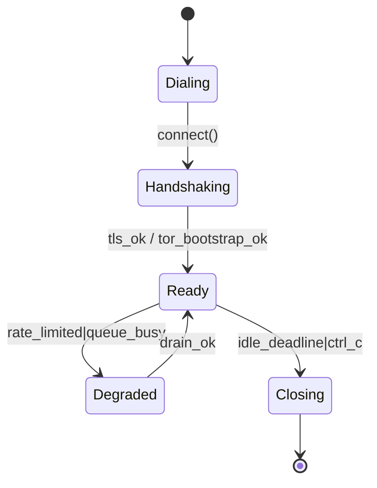

Got it — here’s the full **paste-ready `README.md`** for `ron-transport` with all of Grok’s notes and the fixes folded in (audience header, added sequence diagram, reproducible SLOs script, PQ acceptance gates, metric labels, facet tie-ins, rustdoc-compilable API example, and roadmap polish).

---

````markdown
---
title: ron-transport — README
audience: contributors, ops, auditors
status: draft
msrv: 1.80.0
last-reviewed: 2025-10-02
---

# ron-transport

> **Role:** library  
> **Owner:** Stevan White  
> **Status:** draft  
> **MSRV:** 1.80.0  
> **Last reviewed:** 2025-10-02

Badges (optional):  
[]() []()

---

## 1) Overview

**What it is (one paragraph):**  
`ron-transport` is RustyOnions’ unified transport **library** for TCP/TLS, optional Tor v3 (via Arti), and optional QUIC. It enforces strict I/O ceilings and deadlines and **carries** OAP/1 frames end-to-end; it does **not** parse OAP or expose HTTP. Policy/auth live in host services (gateway/overlay/etc.).

**How it fits (RustyOnions topology):**  
- **Pillar:** 10 — Overlay, Transport & Discovery  
- **Upstream callers:** `svc-gateway`, `svc-overlay`, `svc-index`, `micronode` (embedded)  
- **Downstream deps:** `tokio-rustls` (TLS 1.3), `arti` (feature-gated), QUIC backend (feature-gated)  
- **Data it touches:** network only; no DB  
- **Security boundary:** carries capabilities in OAP; no ambient authority; TLS 1.3 only  

### 1.1 High-Level Architecture (Mermaid REQUIRED)

```mermaid
flowchart LR
  subgraph Host Service
    A[svc-gateway / svc-overlay / micronode] -->|Connection APIs| B(ron-transport)
  end

  subgraph Link Layers
    T1[TLS 1.3]:::t
    T2[Tor v3 via Arti]:::t
    T3[QUIC]:::t
  end

  B --> T1
  B --> T2
  B --> T3
  B -->|Metrics/Logs| E[[Prometheus & JSON Logs]]

  classDef t fill:#1e3a8a,stroke:#172554,color:#fff,rx:6,ry:6;
  style B fill:#0b7285,stroke:#083344,color:#fff
````

### 1.2 Sequence Diagram (Dial/Handshake)

```mermaid
sequenceDiagram
  autonumber
  participant H as Host Service
  participant T as ron-transport
  participant N as Network (TLS/Tor/QUIC)
  H->>T: connect_tls(&addr, ClientConfig)
  T->>N: TCP dial + TLS ClientHello
  N-->>T: ServerHello/Finished
  T-->>H: Transport{ready, deadlines}
  note over H,T: On timeout/size-cap -> error{reason="tls_handshake_failed" | "timeout"}
```

---

## 2) Responsibilities & Boundaries

**MUST do (core responsibilities):**

* [ ] Provide **dialers/listeners** for TLS/TCP, Tor (`arti`), and QUIC (feature-gated).
* [ ] Enforce **I/O ceilings**: `max_frame=1 MiB`, streaming ≈64 KiB, timeouts, idle caps, bounded decompression.
* [ ] Maintain **single-writer per connection**; no locks across `.await`.

**MUST NOT do (anti-scope / boundaries):**

* [ ] Parse OAP frames or implement overlay/DHT logic.
* [ ] Expose HTTP/REST endpoints (hosts do).

**Acceptance Gates (PROOF you did it):**

* [ ] Unit/prop/Loom tests enforce deadlines, single-writer, bounded queues; fuzz edges near 1 MiB.
* [ ] `/metrics` from host include **rejects** (reason canon), **timeouts**, **handshake latency**.
* [ ] Canary PQ hybrid label and rollback plan validated in CI.

---

## 3) Public Interfaces

### 3.1 Rust API (library)

Key functions (stable semantics; examples only):

* `connect_tls(host, port, tls_cfg) -> Transport`
* `connect_onion_v3(service, port, arti_cfg) -> Transport` *(feature `arti`)*
* `connect_quic(authority, quic_cfg) -> Transport` *(feature `quic`)*
* `serve_tls(bind, tls_cfg) -> Listener`
* `serve_onion_v3(hs_cfg) -> Listener` *(feature `arti`)*
* `serve_quic(bind, quic_cfg) -> Listener` *(feature `quic`)*

````rust
/// Minimal TLS connect example.
/// ```no_run
/// use ron_transport::{connect_tls, Transport};
/// use tokio_rustls::rustls::ClientConfig;
///
/// # fn main() -> anyhow::Result<()> {
/// let cfg = ClientConfig::builder().with_safe_defaults();
/// let t: Transport = connect_tls("127.0.0.1", 443, cfg)?;
/// // t.write_all(&buf).await?; t.read_exact(&mut buf).await?;
/// # Ok(())
/// # }
/// ```
````

---

## 4) Configuration

| Variable                 | Type | Default        | Description                               |
| ------------------------ | ---- | -------------- | ----------------------------------------- |
| `READ_TIMEOUT_MS`        | int  | `5000`         | Per-read deadline                         |
| `WRITE_TIMEOUT_MS`       | int  | `5000`         | Per-write deadline                        |
| `IDLE_TIMEOUT_MS`        | int  | `15000`        | Disconnect after idle                     |
| `MAX_FRAME_BYTES`        | int  | `1048576`      | OAP/1 ceiling (enforced as I/O cap)       |
| `STREAM_CHUNK_BYTES`     | int  | `65536`        | Preferred streaming chunk size            |
| `RATE_LIMIT_BYTES_PER_S` | int  | `0` (disabled) | Token-bucket egress; 0 = off              |
| `AMNESIA`                | bool | `false`        | Host’s global amnesia mode (pass-through) |

**Feature flags (Cargo):**

* `default = ["tokio", "rustls"]`
* `arti` — Tor via Arti
* `quic` — QUIC client/server

---

## 5) Build, Run, Test

**Build**

```bash
cargo build -p ron-transport
```

**Tests (unit/prop/docs)**

```bash
cargo test -p ron-transport --all-features
cargo test -p ron-transport --doc
```

**Lint & format**

```bash
cargo fmt --all
cargo clippy -p ron-transport -- -D warnings
```

**Security & deps**

```bash
cargo deny check
```

**Bench (if provided)**

```bash
cargo bench -p ron-transport
```

---

## 6) Observability

**Canonical Metrics (emitted by host using this crate):**

* `dial_attempts_total{transport="tls|arti|quic"}`
* `dial_failures_total{transport,reason="dns|connect_timeout|tls_handshake_failed|tor_bootstrap_timeout|quic_path_error"}`
* `handshake_latency_seconds_bucket{transport}`
* `io_timeouts_total{op="read|write|dial"}`
* `rejected_total{reason="frame_too_large|decompress_overflow|rate_limited|idle_timeout"}`
* `queue_depth{queue="writer_inbox"}`
* `queue_dropped_total{queue="writer_inbox"}`

**Tracing**

* Targets: `ron_transport=info,hyper=warn,tokio=info`
* Span fields: `corr_id`, `peer`, `transport`, `op`, `status`

---

## 7) Performance & SLOs

| Metric                | Target (reference) | Notes                        |
| --------------------- | -----------------: | ---------------------------- |
| Handshake p95 (in-AZ) |            ≤150 ms | TCP+TLS on typical VM        |
| Write p99 (loopback)  |             ≤25 ms | 1 MiB near ceiling           |
| Start-to-ready (TLS)  |               ≤1 s | includes cert load           |
| Idle close accuracy   |            ±5% SLA | deadline precision tolerance |

**Reproduce SLOs (local loopback)**

```bash
cargo build -p ron-transport --release
RUST_LOG=warn cargo run -p ron-transport --example bench_echo -- --mode=server --bind 127.0.0.1:9443 &
SERVER_PID=$!
sleep 1
cargo run -p ron-transport --example bench_echo -- --mode=client --connect 127.0.0.1:9443 --frame-bytes 1048576 --iters 200
kill $SERVER_PID
```

**Facet Tie-ins (Developer Suite)**

* Media facet: first-byte p95 ≤ 100 ms for 64 KiB chunk fetch (in-AZ, steady-state).
* Graph facet: small RPC p95 ≤ 25 ms at 500 RPS (in-AZ, TLS).

---

## 8) Data & Schema

N/A — library carries OAP/1 frames (DTOs defined in `ron-proto`) and enforces size ceilings **only**.

---

## 9) Security & Privacy

* **Threat model:** TLS 1.3 AEAD; onion circuits via Arti (optional). No secret logging; PEM perms enforced by host; capability tokens are application payloads.
* **Key handling:** TLS configs are typed (`tokio_rustls::rustls::{ClientConfig,ServerConfig}`); crate **never** constructs raw rustls types for public API.
* **PII:** none at this layer.
* **PQ posture:** classical today; target **hybrid X25519+ML-KEM-768** once upstream lands; PQ mode is pass-through + labeled metrics with canary/rollback.

**PQ Migration — Acceptance Gates**

* [ ] **Labeling:** export `handshake_kex_label` and `sig_label` as metrics labels (`x25519`, `mlkem768`, `hybrid_x25519_mlkem768`, etc.).
* [ ] **Vectors:** INTEROP vectors updated to include classical and hybrid; CI must pass both.
* [ ] **Canary:** feature flag `pq_hybrid_preview` off by default; opt-in via env. Roll back on error rate >0.1% or p95 handshake regression >10%.
* [ ] **Docs:** QUANTUM.md section “Rollout Plan” linked here; CHANGELOG notes the gate.

---

## 10) Error Taxonomy

| Code/Variant          | When                              | User hint                | Retries       |
| --------------------- | --------------------------------- | ------------------------ | ------------- |
| `FrameTooLarge (413)` | > 1 MiB or COMP bound exceeded    | lower payload / stream   | no            |
| `BadVersion (400)`    | OAP ver≠1                         | upgrade/downgrade client | no            |
| `NotReady (503)`      | Tor bootstrap / cert swap in host | respect `Retry-After`    | yes (jitter)  |
| `Timeout{op}`         | read/write/dial exceeded deadline | widen budget if needed   | yes (bounded) |

---

## 11) Concurrency Model

* **Runtime:** tokio; **one writer task per connection**, reader split; bounded writer inbox. No locks held across `.await`.
* **I/O ceilings:** enforce `max_frame` and chunking; crate does not parse frames.



---

## 12) Compatibility & Requirements

* **Rust:** MSRV 1.80.0
* **OS:** macOS 10.15+, Linux x86_64
* **TLS:** TLS 1.3 via `tokio_rustls::rustls`
* **Profiles:** Micronode (embedded), Macronode (services).

---

## 13) Examples

Service embed (pseudo):

```rust
let (lis, addr) = ron_transport::serve_tls("0.0.0.0:443".parse()?, tls_cfg)?;
while let Some(conn) = lis.accept().await? {
    spawn_reader_and_writer(conn, cfg); // single writer inbox; deadlines
}
```

---

## 14) Troubleshooting

* **413s on large payloads:** OAP cap is **1 MiB**; stream below the ceiling.
* **Tor not ready:** host should return **503 NotReady** with `Retry-After`; check `tor_bootstrap_timeout` reason.
* **Writer backlog:** watch `queue_depth{writer_inbox}` and `queue_dropped_total{writer_inbox}`; prefer backpressure over buffering.

---

## 15) Development Notes

**Project conventions (RustyOnions):**

* TLS API uses `tokio_rustls::rustls::{ClientConfig,ServerConfig}` (compat with `TlsAcceptor::from`).
* Arti/Tor is **feature-gated** (`arti`); QUIC is `quic`.

**Pre-commit quickcheck**

```bash
cargo fmt --all
cargo clippy -- -D warnings
cargo test
cargo deny check
```

---

## 16) Mermaid Diagrams — Policy & Tooling (REQUIRED)

**Authoring tips**

* Keep node labels short (`svc::overlay`, `ron-transport`).

**Render locally (SVG)**

```bash
npm i -g @mermaid-js/mermaid-cli
mmdc -i docs/arch.mmd -o docs/arch.svg
```

**Render via Docker (no Node install)**

```bash
docker run --rm -v "$PWD":/data minlag/mermaid-cli mmdc -i docs/arch.mmd -o docs/arch.svg
```

**CI (GitHub Actions snippet)**

```yaml
name: render-mermaid
on: [push, pull_request]
jobs:
  mmdc:
    runs-on: ubuntu-latest
    steps:
      - uses: actions/checkout@v4
      - run: npm i -g @mermaid-js/mermaid-cli
      - run: |
          mkdir -p docs
          for f in $(git ls-files '*.mmd'); do
            out="${f%.mmd}.svg"
            mmdc -i "$f" -o "$out"
          done
```

---

## 17) Roadmap & TODO

* [ ] Milestone 1 — Land `bench_echo` example + CI perf gate
* [ ] Milestone 2 — PQ hybrid preview (`pq_hybrid_preview`) + metrics labels
* [ ] Hardening — fuzz size/timeout edges; chaos dial failures; backpressure burn-in

---

## 18) Changelog

See [CHANGELOG.md](./CHANGELOG.md). Follow SemVer; document breaking changes with migration notes.

---

## 19) License

Dual-licensed under **MIT** or **Apache-2.0**. See [LICENSE-MIT](../LICENSE-MIT) and [LICENSE-APACHE](../LICENSE-APACHE).

---

## 20) Contributing

PRs welcome! Please run fmt/clippy/tests and include:

* Updated diagrams (if topology changed)
* Docs & examples
* Bench impact (if perf-sensitive)

> Also see: `docs/IDB.md` (Invariant-Driven Blueprint) for this crate.

```
