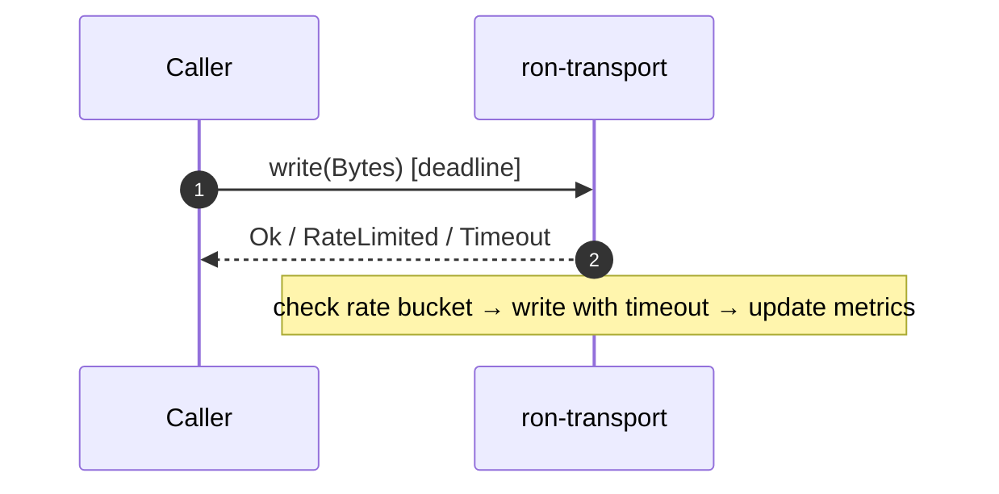
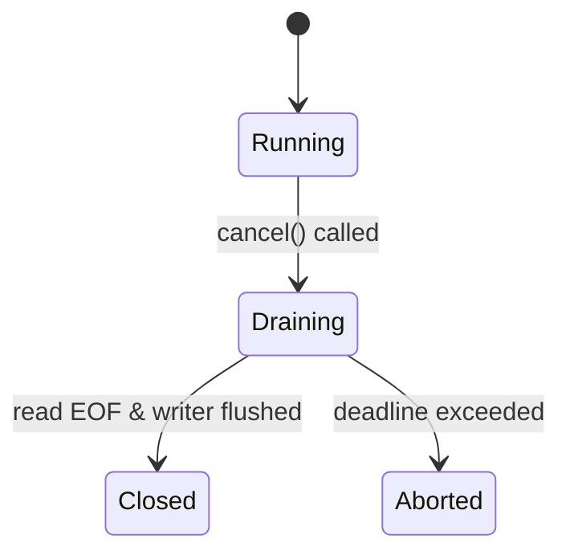

---

title: Concurrency Model — ron-transport
crate: ron-transport
owner: Stevan White
last-reviewed: 2025-09-28
status: draft
template_version: 1.1
msrv: 1.80.0
tokio: "1.x (pinned at workspace root)"
loom: "0.7+ (dev-only)"
lite_mode: "For small library crates: fill §§1,3,4,5,10,11 and mark others N/A"
-------------------------------------------------------------------------------

# Concurrency Model — `ron-transport`

This document makes the concurrency rules **explicit**: tasks, channels, locks, shutdown, timeouts,
and validation (property/loom/TLA+). It complements `docs/SECURITY.md`, `docs/CONFIG.md`,
and the crate’s `README.md` and `IDB.md`.

> **Golden rule:** never hold a lock across `.await` in supervisory or hot paths.

---

## 0) Lite Mode (for tiny lib crates)

`ron-transport` is a **library** crate. It exposes dialers/listeners and per-connection async I/O,
but it does **not** run a long-lived supervisor loop itself.
Per the template, this file prioritizes **§1, §3, §4, §5, §10, §11**. Sections that don’t apply to a pure lib are marked **N/A**.

---

## 1) Invariants (MUST)

* [ ] **No lock across `.await`**. If unavoidable, split the critical section.
* [ ] **Single writer** per connection/socket; the write half is owned by exactly one task.
* [ ] **Bounded channels** only (mpsc/broadcast) with explicit overflow policy.
* [ ] **Explicit timeouts** on all I/O; dial/read/write each have deadlines.
* [ ] **Cooperative cancellation**: every `.await` is cancel-safe or guarded by `select!`.
* [ ] **Graceful shutdown for handles**: expose async `close()/shutdown()`; `Drop` must not block.
* [ ] **No blocking syscalls** on the runtime; use `spawn_blocking` if parsing heavy PEM, etc.
* [ ] **No task leaks**: spawned tasks are tied to a `CancellationToken` owned by the connection handle.
* [ ] **Backpressure over buffering**: reject or shed with metrics; never grow unbounded queues.
* [ ] **Framing limits respected**: transport enforces size ceilings and chunking; framing/parsing is owned by higher layers.

**Async Drop**

* [ ] Do **not** block in `Drop`. Teardown is via explicit async method; `Drop` only releases cheap resources and may log.

---

## 2) Runtime Topology

**N/A (library).**
Typical consumer topology (for context): a service creates a listener, then spawns one **reader task** and one **writer task** per accepted connection. The library provides building blocks (splitting, deadlines, cancellation), but the service owns process-wide supervision.

```mermaid
flowchart TB
  subgraph Service (consumer)
    L[Listener (accept loop)] -->|Conn| R1[Reader Task]
    L -->|Conn| W1[Writer Task]
    L -->|Conn| R2
    L -->|Conn| W2
    SHUT[Shutdown watch] --> L
    SHUT --> R1
    SHUT --> W1
    SHUT --> R2
    SHUT --> W2
  end
```

---

## 3) Channels & Backpressure

**Inventory (bounded unless noted):**

| Name           | Kind      | Capacity | Producers → Consumers | Backpressure Policy         | Drop Semantics                         |
| -------------- | --------- | -------: | --------------------- | --------------------------- | -------------------------------------- |
| `events`       | broadcast |     1024 | 1 → N                 | lag counter; oldest dropped | increment `bus_lagged_total`; warn     |
| `work`         | mpsc      |      512 | N → 1 (per-conn)      | `try_send` → `Busy`         | return typed `Busy` upstream           |
| `shutdown`     | watch     |        1 | 1 → N                 | last-write wins             | N/A                                    |
| `writer_inbox` | mpsc      |      256 | N → 1 (writer task)   | `try_send` else `Busy`      | drop or backpressure per caller policy |

Guidelines:

* Prefer `try_send` + typed error over buffering.
* Maintain a `queue_depth{queue}` gauge and `queue_dropped_total{queue}` counter.
* Per-connection writer inbox is **single-consumer**; never create multiple writers for the same socket.

---

## 4) Locks & Shared State

**Allowed**

* Short-lived `Mutex`/`RwLock` for small metadata; **drop the guard before `.await`**.
* Read-mostly snapshots behind `Arc<_>` (immutable structs).
* Per-connection mutable state **owned by that connection’s tasks**.

**Forbidden**

* Holding any lock across `.await`.
* Nested locks without a strict, documented order.
* Sharing a writer across tasks.

**Suggested hierarchy (if locks are unavoidable)**

1. `state_meta`
2. `routing_table`
3. `counters`

---

## 5) Timeouts, Retries, Deadlines

* **I/O deadlines (config-driven):** `read`, `write`, and `idle` enforced via `tokio::time::timeout`.
* **Dial deadlines:** enforce a total dial timeout; on expiry, return typed `Timeout{ op: "dial" }`.
* **Retries:** the transport does not implement reconnection policy; callers may retry idempotent ops with jittered backoff.
* **Rate limits:** token-bucket checks occur *before* write; overflow yields typed `RateLimited` and increments reject metrics.



---

## 6) Cancellation & Shutdown

**N/A (library supervises per-connection only).**
Per-connection handles are cancel-safe:

* Connection tasks listen on a `CancellationToken` or `watch`.
* On cancel: stop intake, flush writer inbox best-effort, then `shutdown().await` the socket.
* Callers provide a **drain deadline**; tasks exceeding it are aborted and counted.

---

## 7) I/O & Framing

**N/A for parsing.**
The library enforces **size ceilings and chunk sizes** but does not parse higher-level frames. It uses `AsyncReadExt/AsyncWriteExt`, handles partial reads/writes, and calls `.shutdown().await` on normal close.

---

## 8) Error Taxonomy (Concurrency-Relevant)

| Error Kind      | When                                 | Retry?     | Metric                                    | Notes                      |
| --------------- | ------------------------------------ | ---------- | ----------------------------------------- | -------------------------- |
| `Busy`          | writer inbox/channel full            | caller-dep | `busy_rejections_total{queue}`            | prefer backpressure        |
| `Timeout{op}`   | dial/read/write deadline exceeded    | sometimes  | `io_timeouts_total{op}`                   | op ∈ {dial,read,write}     |
| `RateLimited`   | token-bucket depleted                | maybe      | `rejected_total{reason="rate_limit"}`     | avoid buffering            |
| `TooLarge`      | size ceiling violated                | no         | `rejected_total{reason="too_large"}`      | enforce early              |
| `ArtiBootstrap` | arti backend not ready               | maybe      | `rejected_total{reason="arti_bootstrap"}` | maps to Degraded readiness |
| `IoClosed`      | peer closed or half-closed violation | maybe      | `io_closed_total`                         | clean shutdown path        |

---

## 9) Metrics (Concurrency Health)

* `queue_depth{queue}` gauge (writer inbox, work, events)
* `queue_dropped_total{queue}` counter
* `io_timeouts_total{op}` (`dial`,`read`,`write`)
* `rejected_total{reason}` (`rate_limit`,`too_large`,`arti_bootstrap`)
* `tasks_spawned_total{kind}` / `tasks_aborted_total{kind}` (per-conn reader/writer)

---

## 10) Validation Strategy

**Unit / Property**

* Backpressure behavior: `try_send` returns `Busy`; counters increase; no unbounded growth.
* Deadlines honored within tolerance (±5% typical on loopback).
* Single-writer invariant: attempts to create second writer for a conn fail (compile-time or runtime assertion).

**Loom (dev-only)**

* Model: producer → bounded mpsc(writer_inbox) → single writer + cancellation.
* Assert: no deadlock; cancellation always makes progress; no double free/drop.

**Fuzz**

* Malformed size/duration configs (via consumer) never panic; produce typed errors.
* Randomized write sizes near limits (e.g., 1MiB±ε) uphold `TooLarge`/pass paths.

**Chaos (integration, optional)**

* Kill the reader mid-write; writer must observe EOF and exit cleanly.
* Inject random dial failures/timeouts; no task leaks; metrics coherent.

**TLA+ (optional, if ordering matters upstream)**

* Specify deliver-at-most-once semantics for writer inbox; safety: no duplication; liveness: eventual drain under cancellation.

---

## 11) Code Patterns (Copy-Paste)

**Per-connection reader/writer with cooperative shutdown**

```rust
use tokio::{io::{AsyncReadExt, AsyncWriteExt}, sync::{mpsc, watch}};
use tokio_util::sync::CancellationToken;

pub struct Conn {
    cancel: CancellationToken,
    inbox: mpsc::Receiver<bytes::Bytes>, // writer inbox (bounded)
    // read half is owned here
}

pub async fn run_writer(
    mut write_half: tokio::net::tcp::OwnedWriteHalf,
    mut inbox: mpsc::Receiver<bytes::Bytes>,
    cancel: CancellationToken,
    write_timeout: std::time::Duration,
) {
    loop {
        tokio::select! {
            _ = cancel.cancelled() => break,
            maybe_buf = inbox.recv() => {
                let Some(buf) = maybe_buf else { break };
                // rate-limit check (call helper) → return Err(RateLimited) if depleted
                if let Err(_) = tokio::time::timeout(write_timeout, write_half.write_all(&buf)).await {
                    // increment io_timeouts_total{op="write"}
                    break;
                }
            }
        }
    }
    let _ = write_half.shutdown().await;
}

pub async fn run_reader(
    mut read_half: tokio::net::tcp::OwnedReadHalf,
    cancel: CancellationToken,
    read_timeout: std::time::Duration,
    max_frame_bytes: usize,
) {
    let mut buf = bytes::BytesMut::with_capacity(64 * 1024);
    loop {
        tokio::select! {
            _ = cancel.cancelled() => break,
            res = tokio::time::timeout(read_timeout, read_half.read_buf(&mut buf)) => {
                let n = match res { Ok(Ok(n)) => n, _ => break };
                if n == 0 { break; } // EOF
                if buf.len() > max_frame_bytes {
                    // increment rejected_total{reason="too_large"}
                    break;
                }
                // hand off to upper layer parsing (not in this crate)
            }
        }
    }
}
```

**No lock across `.await`**

```rust
let snapshot = {
    let g = state.read();           // short guard
    g.make_snapshot()               // cheap copy
};                                  // guard dropped here
process_async(snapshot).await;       // now safe to await
```

**Bounded mpsc with `try_send`**

```rust
if let Err(tokio::sync::mpsc::error::TrySendError::Full(_)) = tx.try_send(bytes) {
    metrics::busy_rejections_total().inc();
    return Err(Error::Busy);
}
```

**Cancellation token wiring**

```rust
let cancel = CancellationToken::new();
let writer_cancel = cancel.clone();
let reader_cancel = cancel.clone();

let writer = tokio::spawn(run_writer(write_half, inbox, writer_cancel, cfg.write_timeout));
let reader = tokio::spawn(run_reader(read_half, reader_cancel, cfg.read_timeout, cfg.limits.max_frame_bytes as usize));

// later…
cancel.cancel();
let _ = writer.await;
let _ = reader.await;
```

---

## 12) Configuration Hooks (Quick Reference)

* `read_timeout`, `write_timeout`, `idle_timeout`
* `limits.max_frame_bytes`, `limits.chunk_bytes`
* `rates.ingress_bytes_per_sec`, `rates.egress_bytes_per_sec`
* channel capacities (per-conn writer inbox, work/event queues)
* drain deadline (consumer-owned)

See `docs/CONFIG.md` for authoritative schema.

---

## 13) Known Trade-offs / Nonstrict Areas

* Per-connection writer inbox **drop vs reject** is policy: low-latency paths may prefer reject-now.
* Size limit enforcement occurs at the transport boundary; higher-level framing may still reject earlier.
* When using Arti, bootstrap readiness is surfaced; callers decide whether to queue or reject dials.

---

## 14) Mermaid Diagrams

### 14.1 Per-connection tasks

```mermaid
flowchart LR
  A[Accept/Dial] --> R[Reader Task]
  A --> W[Writer Task]
  CTRL[CancellationToken] --> R
  CTRL --> W
  INBOX[mpsc (bounded)] --> W
```

**Text description:** Each connection spawns a Reader and a Writer task. The Writer consumes a bounded inbox. A shared `CancellationToken` cancels both tasks.

### 14.2 Cancellation lifecycle



**Text description:** On cancel, tasks stop intake, flush best-effort, then close; if deadline passes, tasks are aborted.

---

## 15) CI & Lints (Enforcement)

**Clippy (examples)**

* `-D clippy::await_holding_lock`
* `-D clippy::dbg_macro`
* `-D clippy::useless_async`
* `-D warnings`

**Dev jobs**

* Loom tests behind `--cfg loom` (ignored by default).
* Optional fuzz targets for boundary sizes and malformed inputs.

---

## 16) Schema Generation (Optional)

Automate the **Channels** table from code via attributes or a small registry module and a golden test to keep docs and code in sync.

---

## 17) Review & Maintenance

* Review this file whenever tasks/channels/locks change.
* Keep `owner` and `last-reviewed` current.
* Add/adjust Loom/property tests alongside code changes.

---
