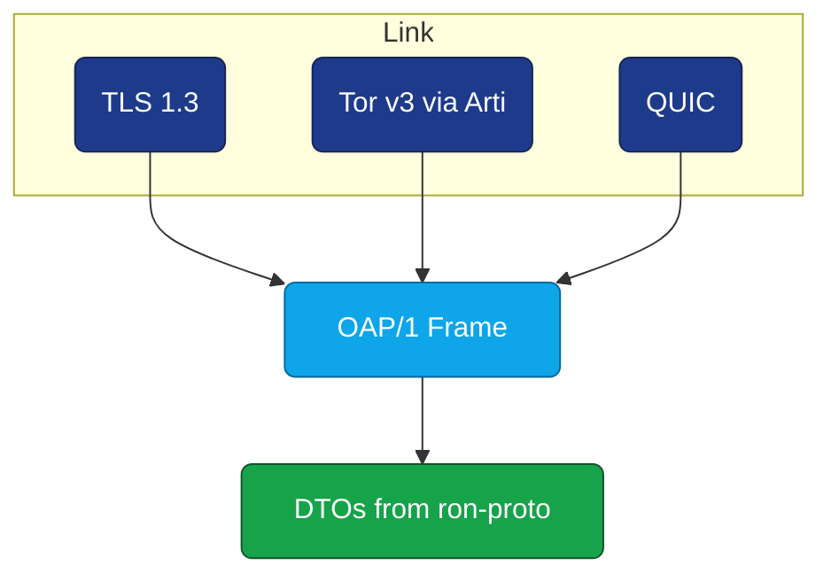
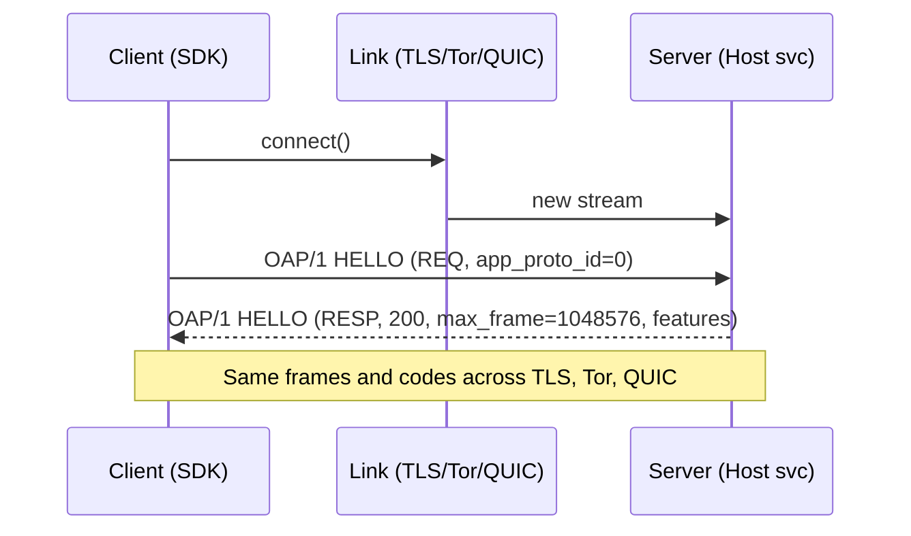

---

# 🔗 INTEROP.md — `ron-transport`

*Audience: developers, auditors, external SDK authors*
*msrv: 1.80.0 (workspace-pinned)*

---

## 0) Purpose

Define the **interop surface** of `ron-transport`:

* **Wire protocols & message formats** used on the connection: OAP/1 framed over TLS/TCP, optional Tor (via `arti` feature), and optional QUIC.
* **DTOs & schemas** carried (by reference to `ron-proto`).
* **Bus topics/events** relevant to transport (mostly N/A for lib; guidance for host services).
* **Canonical test vectors** for frames, HELLO, compression bounds, and Tor path parity.

This ensures all inter-crate and external integrations remain consistent with the Omni-Gate canon and the OAP/1 invariants (frame cap **1 MiB**, stream chunk **64 KiB**), while keeping `ron-transport` strictly a **library** (no service endpoints of its own).

---

## 1) Protocols & Endpoints

### 1.1 Supported transports (feature-gated)

| Transport             | Client | Server | Feature     | Notes                                                                                                             |
| --------------------- | ------ | -----: | ----------- | ----------------------------------------------------------------------------------------------------------------- |
| **TLS/TCP (TLS 1.3)** | ✅      |      ✅ | *(default)* | Rustls only. Strong ciphers, OCSP stapling optional. No ambient authority; capabilities are application payloads. |
| **Tor v3 (Arti)**     | ✅      |      ✅ | `arti`      | Onion services via Arti; bootstrap must be observable; HS publish readiness gates host.                           |
| **QUIC**              | ✅      |      ✅ | `quic`      | QUIC/UDP (e.g., Quinn). Same OAP/1 framing semantics. Idle/stream caps apply.                                     |

> `ron-transport` exposes **client connectors** and **server listeners**; it does **not** define HTTP/REST. Those live in gateway/omnigate services.

### 1.2 Exposed “endpoints” (as APIs)

While this crate is a lib, interoperability requires stable API semantics:

* **Client**

  * `connect_tls(host: &str, port: u16, tls: rustls::ClientConfig) -> Transport`
  * `connect_onion_v3(service: &str, port: u16, arti: ArtiClientCfg) -> Transport` *(feature `arti`)*
  * `connect_quic(authority: &str, quic: QuicClientCfg) -> Transport` *(feature `quic`)*

* **Server**

  * `serve_tls(bind: SocketAddr, tls: rustls::ServerConfig) -> Listener`
  * `serve_onion_v3(hs_cfg: ArtiServiceCfg) -> Listener` *(feature `arti`)*
  * `serve_quic(bind: SocketAddr, quic: QuicServerCfg) -> Listener` *(feature `quic`)*

All transports carry **OAP/1** frames as the application protocol.

### 1.3 Transport invariants (normative)

* **OAP/1 frame cap:** `max_frame = 1_048_576` bytes (1 MiB).
* **Streaming chunk:** `64 KiB` data segments (do not conflate with frame size).
* **Bounded compression:** if `COMP` flag set, inflate bound ≤ 8× `max_frame` or **413** reject (bounded decompression).
* **Timeouts/idle caps:** host config must enforce connect/read/write/idle deadlines; no unbounded connections.
* **TLS:** **TLS 1.3** only, via `rustls`; no native OpenSSL; safe defaults for cipher suites and versions.
* **Tor:** Arti only; v3 onions; bootstrap/readiness surfaced to host.

---

## 2) DTOs / Schemas (carried over OAP)

`ron-transport` does **not** define new DTOs; it conveys DTOs defined in `ron-proto`. The wire envelope is **OAP/1**.

### 2.1 Canonical Envelope (OAP/1 quick reference)

| Field          | Type   | Description                                                                             |
| -------------- | ------ | --------------------------------------------------------------------------------------- |
| `len`          | `u32`  | Remaining length of frame after this field.                                             |
| `ver`          | `u8`   | Protocol version (**1**).                                                               |
| `flags`        | `u16`  | Bitset: `REQ, RESP, EVENT, START, END, ACK_REQ, COMP, APP_E2E, …`.                      |
| `code`         | `u16`  | Status/semantic code (`2xx`, client `4xx`, server `5xx`, or `0` for non-status frames). |
| `app_proto_id` | `u16`  | Application protocol selector (`0 = HELLO`).                                            |
| `tenant_id`    | `u128` | ULID/UUID (0 if unused).                                                                |
| `cap_len`      | `u16`  | Length of the **capability** segment (may be 0).                                        |
| `corr_id`      | `u64`  | Correlation ID (trace propagation).                                                     |
| `[cap]`        | bytes  | Optional macaroon (capability), if present.                                             |
| `[payload]`    | bytes  | Application payload (DTOs from `ron-proto`).                                            |

**Parser rules (normative):** perform size checks **before allocate**, honor compression bounds when `COMP` set, treat `APP_E2E` area as opaque (end-to-end, not parsed by intermediaries). Reserved flags must be `0`.

### 2.2 Example payload DTO (carried)

```rust
#[derive(Serialize, Deserialize)]
#[serde(deny_unknown_fields)]
pub struct ObjectManifestV2 {
  pub id: String,      // "b3:<hex>"
  pub size: u64,       // bytes
  pub chunks: Vec<ChunkV1>, // 64 KiB chunks (storage detail)
}
```

**Encoding:** JSON (golden) with optional CBOR for vectors; schema is versioned and strict (unknown fields → reject).
**Validation:** Host verifies digest matches `id` (`b3:<hex>`) before serving.

---

## 3) Bus Topics

`ron-transport` is a library and emits **no bus events directly**. Hosts that integrate it typically publish:

### 3.1 Events Published (by host services using this crate)

* `<svc>.transport.opened` — `{ transport: "tls|tor|quic", peer, alpn: "oap/1", tls: "1.3" }`
* `<svc>.transport.closed` — `{ transport, reason }`
* `<svc>.transport.rate_limited` — `{ transport, kind: "accept|read|write" }`

### 3.2 Events Subscribed (by host)

* `config.updated` — swap TLS certs/keys, tweak caps timeouts.
* `bus.shutdown` — begin graceful close of listeners and in-flight streams.

> Kernel events such as `ServiceCrashed{ reason }` are emitted by the **host**, not this crate.

---

## 4) Canonical Test Vectors

All vectors live under `tests/vectors/` and are shared across SDKs (Rust/TS/Py/Swift).

### 4.1 HELLO (capabilities discovery)

* **Input (hex frame):** `ver=1, flags=REQ, app_proto_id=0, payload={} (empty)`
* **Output (JSON):**

  ```json
  {
    "ver": 1,
    "flags": ["RESP"],
    "code": 200,
    "hello": {
      "max_frame": 1048576,
      "max_inflight": 64,
      "features": ["COMP","APP_E2E","TOR","QUIC"],
      "transports": ["tls","tor","quic"]
    }
  }
  ```

### 4.2 Frame Round-Trip (boundary sizes)

* **Input:** payload exactly `1_048_576 - header_len` bytes → **OK**.
* **Input:** payload `> 1_048_576 - header_len` → **413 FrameTooLarge**.

### 4.3 Bounded compression (COMP flag)

* **Input:** `COMP` frame where inflated size is ≤ `8 × 1_048_576` → **OK**.
* **Input:** Inflated size exceeds bound → **413 FrameTooLarge**.

### 4.4 Manifest digest

* **Payload:** `b"hello world"` → **Digest:** `b3:9f64a747...`
* **Vector asserts:** host verifies digest before serving.

### 4.5 Tor parity (feature `arti`)

* **Path:** client `connect_onion_v3("abc…onion:443")` → HELLO round-trip identical to TLS (corr_id & flags preserved).
* **Bootstrap:** if Tor bootstrap not ready → **503 NotReady** (from host) with `Retry-After`.

---

## 5) Error Taxonomy (wire-level + transport)

| Code / Variant        | When                                                                 | Notes                                                                                        |
| --------------------- | -------------------------------------------------------------------- | -------------------------------------------------------------------------------------------- |
| **400 BadVersion**    | `ver != 1`                                                           | Reject early; include supported versions.                                                    |
| **413 FrameTooLarge** | Frame exceeds 1 MiB after header; or `COMP` inflate bound exceeded   | Normative cap; do not buffer.                                                                |
| **422 SchemaInvalid** | DTO fails strict parse (`deny_unknown_fields`)                       | Payload DTOs are strict; return reason canon.                                                |
| **429 QuotaExceeded** | Accept/read/write exceeded host policy                               | Host translates to backpressure.                                                             |
| **503 NotReady**      | Transport not ready (e.g., Tor bootstrap; cert/hot-swap in progress) | Include `Retry-After` seconds.                                                               |
| **5xx Transport**     | TLS handshake fail; QUIC path fail; onion publish fail               | Surface stable reasons (`tls_handshake_failed`, `tor_bootstrap_timeout`, `quic_path_error`). |

> Reason strings must come from the **canon reason set** (append-only). No ad-hoc free-text.

---

## 6) Interop Guarantees

* **OAP/1 invariants hold on every transport:** `1 MiB` frame cap, **64 KiB** streaming chunk, bounded decompression.
* **SemVer discipline:** breaking schema or header layout ⇒ **major**; optional fields with defaults ⇒ **minor**.
* **Backward compatibility:** payload DTOs are **strict** (unknown fields rejected); header **reserved flags** must be zero; app payload may carry **APP_E2E** opaque data end-to-end.
* **Auditability:** vectors stored under `/tests/vectors/` and referenced by cross-SDK tests.
* **Amnesia ready:** no persistent sockets/state required by this crate; host may run RAM-only profile (Micronode).
* **No kernel drift:** transport remains a lib; kernel APIs and event types are stable and referenced only by hosts.

---

## 7) Mermaid — Visual Interop

### 7.1 Layering & flows (TLS/Tor/QUIC → OAP/1 → DTOs)



### 7.2 HELLO handshake over any transport



---

## 8) References

* **Interop Blueprint** (OAP/1 header, flags, error taxonomy, vectors)
* **Hardening Blueprint** (global caps: frame=1 MiB, chunk=64 KiB; bounded decompression; TLS/Tor posture)
* **Six Concerns (crate mapping)** — `ron-transport` under **SEC, RES, PERF**
* **OBSERVABILITY.md** (corr_id propagation; reason canon)
* **CONCURRENCY.md** (no locks across await; host readiness gating for Tor/TLS)

---

## 9) Acceptance (DoD)

* [ ] All connectors/listeners enforce OAP/1 caps and timeouts.
* [ ] Cross-transport parity: HELLO + boundary vectors pass on TLS, Tor, QUIC.
* [ ] Compression bound tests pass (`COMP` ≤ 8× frame cap).
* [ ] Error taxonomy returns stable reason strings (append-only).
* [ ] `/tests/vectors/` updated and used by SDK parity tests (Rust/TS/Py/Swift).
* [ ] Host services expose readiness keys for Tor publish/TLS hot-swap.

---

✅ With this interop contract, `ron-transport` stays a **clean, hardened conduit** for OAP/1 frames—uniform across TLS, Tor, and QUIC—while the DTO truth lives in `ron-proto` and service semantics live above.
