# Combined Markdown

_Source directory_: `crates/ron-transport/docs`  
_Files combined_: 13  
_Recursive_: 0

---

### Table of Contents

- API.MD
- CONCURRENCY.MD
- CONFIG.MD
- GOVERNANCE.MD
- IDB.md
- INTEROP.MD
- OBSERVABILITY.MD
- OLD_README.md
- PERFORMANCE.MD
- QUANTUM.MD
- RUNBOOK.MD
- SECURITY.MD
- TESTS.MD

---

## API.MD
_File 1 of 13_


---

# 📖 API.md — `ron-proto`

---

title: API Surface & SemVer Reference
status: draft
msrv: 1.80.0
last-updated: 2025-09-28
audience: contributors, auditors, API consumers
-----------------------------------------------

## 0) Purpose

This document captures the **public API surface** of `ron-proto`:

* Snapshot of exported functions, types, traits, and modules.
* **SemVer discipline**: what changes break vs. extend (Rust API vs. wire).
* Alignment with `CHANGELOG.md` (behavioral vs. surface changes).
* CI-enforceable via `cargo public-api` and `cargo semver-checks`.
* Acts as the **spec** for external consumers (Rust + polyglot SDKs via codegen).

> **Scope:** `ron-proto` is a **library crate (DTOs only)**. No I/O, sockets, or async runtime types are exposed. Endpoint/port topics are **N/A** here.

---

## 1) Public API Surface

### 1.1 How to generate the authoritative snapshot

```bash
cargo install cargo-public-api
cargo public-api --simplified --deny-changes > docs/api-history/ron-proto/$(cargo pkgid | sed 's/.*#//').txt
```

To compare against the last committed snapshot:

```bash
git diff -- docs/api-history/ron-proto
```

> CI (see §6) runs `cargo public-api` on PRs and fails if **breaking** symbols disappear or change without a matching SemVer bump and `CHANGELOG.md` entry.

### 1.2 Nominal API Map (curated overview)

This is a reviewer-friendly overview; the **snapshot in §1.4 is source of truth**.

* **Modules**

  * `id`

    * `pub struct ContentId` (opaque; canonical `"b3:<hex>"`)
    * `pub fn parse_content_id(&str) -> Result<ContentId, ProtoError>`
    * `pub fn content_id_from_bytes(&[u8]) -> ContentId` *(typing only; hashing lives in kms/auth if not exposed)*
  * `oap`

    * `#[non_exhaustive] pub struct OapEnvelope { kind: OapKind, seq: u64, content: ContentId, /* … */ }`
    * `#[non_exhaustive] pub enum OapKind { HelloV1, StartV1, DataV1, EndV1, AckV1, ErrorV1, /* … */ }`
  * `manifest`

    * `#[non_exhaustive] pub struct ManifestV1 { /* #[serde(deny_unknown_fields)] */ }`
  * `cap`

    * `#[non_exhaustive] pub struct CapTokenHdr { /* typed, no secrets */ }`
  * `error`

    * `#[non_exhaustive] pub enum ProtoErrorKind` (decode/encode/schema/addr/…)
    * `pub struct ProtoError { kind: ProtoErrorKind, detail: Option<String> }`
    * `impl ProtoErrorKind { pub fn as_metric_reason(&self) -> &'static str }`  ⟵ **reason canon (immutable strings)**
  * `version`

    * `pub const PROTO_VERSION: &str`
    * `pub const PROTO_ABI_FINGERPRINT: &str`
  * `trace`

    * `pub fn trace_fields(type_name: &str) -> [(&'static str, String); N]` *(helper; no `tracing` dep)*
  * `config`

    * `#[non_exhaustive] pub struct ProtoConfig { … }`
    * `impl ProtoConfig { pub fn validate(&self) -> Result<(), ProtoConfigError>; pub fn from_env_prefixed(prefix:&str) -> Result<Self, EnvError> }`
    * `#[non_exhaustive] pub enum ProtoConfigError`

> All externally consumed DTOs use `#[serde(deny_unknown_fields)]` and prefer `#[non_exhaustive]` to allow additive evolution without breaking construction.

### 1.3 Facet Map (Surface → Facet responsibilities)

| Facet                      | Key Types                                              | SemVer Notes (Rust)                                                                                 | Wire Compatibility Notes                                                                                |
| -------------------------- | ------------------------------------------------------ | --------------------------------------------------------------------------------------------------- | ------------------------------------------------------------------------------------------------------- |
| **Graph / Search / Index** | `manifest::ManifestV1`, `oap::OapEnvelope`             | Mark DTOs `#[non_exhaustive]`; add optional fields via `#[serde(default)]` → **minor**              | Unknown fields rejected (strict); adding **optional** fields keeps wire compat; update interop vectors. |
| **Media**                  | `oap::{OapEnvelope, OapKind::DataV1}`, `id::ContentId` | Additive hints or flags → **minor** if optional; never change existing field semantics              | Observe OAP frame cap (1 MiB) and chunk semantics (~64 KiB) in host; IDs must be `"b3:<hex>"`.          |
| **Trust & Safety**         | `error::ProtoErrorKind` (+ reason canon)               | **Append-only** variant growth on `#[non_exhaustive]` → **minor**; reason strings are **immutable** | Reason strings are part of observability contract; do not mutate literals.                              |
| **ECON (if used)**         | DTOs participating in ledger flows                     | Additive optional fields → **minor**; changing value semantics → **major**                          | Property tests ensure conservation (no negative, no double-spend); update vectors.                      |
| **DX (SDKs)**              | `config::ProtoConfig`, `trace::trace_fields`           | New helpers/constructors → **minor**; signature changes → **major**                                 | Keep SDK codegen in lockstep; regenerate bindings on surface add.                                       |

### 1.4 Current Surface (authoritative snapshot)

Replace this block with the **actual** tool output in the repo:

```text
# cargo public-api --simplified (excerpt; update on every release/PR as needed)
pub mod id
pub mod oap
pub mod manifest
pub mod cap
pub mod error
pub mod version
pub mod trace
pub mod config
pub struct id::ContentId
pub fn id::parse_content_id(s: &str) -> Result<id::ContentId, error::ProtoError>
pub enum oap::OapKind
pub struct oap::OapEnvelope
pub const version::PROTO_VERSION: &str
pub const version::PROTO_ABI_FINGERPRINT: &str
...
```

---

## 2) SemVer Discipline (Rust API vs. Wire Compatibility)

**Two contracts** must stay aligned:

* **Rust API stability** → guarded by SemVer + `cargo public-api`.
* **Wire compatibility** → guarded by strict serde (`deny_unknown_fields`), optional fields with defaults, versioned types, and interop vectors.

### 2.1 Additive (Minor / Non-Breaking)

* Add new functions/modules/`pub` items **without** altering existing signatures.
* Keep DTOs and error enums `#[non_exhaustive]`; add new variants freely (minor).
* Add new **optional** fields to `#[non_exhaustive]` structs using:

  * `#[serde(default)]`
  * doc updates and constructors/builders for ergonomics.
* Add **PQ-hybrid typing** fields behind `cfg(feature="pq")` as **optional** (typing only; crypto lives in kms/auth/transport).
* Add new Cargo features **off by default**.

### 2.2 Breaking (Major)

* Remove/rename/privatize existing `pub` items.
* Change function signatures/trait bounds.
* Make previously `#[non_exhaustive]` types exhaustive.
* Change serde layout in ways that break wire (e.g., removing a field, changing meaning/format).
* **Mutate** an existing reason string literal from `as_metric_reason` (observability regression).

### 2.3 Patch-Level

* Doc-only edits.
* Internal performance improvements with identical API.
* Tightened invariants not visible in the public surface.

### 2.4 Feature Policy

* Adding a feature = **minor**.
* Removing or flipping default features = **major**.
* Any `pub` item behind a feature must be clearly documented with `cfg(feature="…")` in rustdoc.

---

## 3) Stability Guarantees

* **MSRV:** `1.80.0` (workspace-root pinned). Raising MSRV is a **minor** bump with clear justification.
* **Unsafe:** `#![forbid(unsafe_code)]`. Exceptions require design review & explicit justification.
* **No runtime bleed:** API does not leak I/O or async types (e.g., no `tokio::…` in public surface).
* **Docs:** `#![deny(missing_docs)]` at crate root; every `pub` item documented.
* **Observability contract:** `PROTO_VERSION`, `PROTO_ABI_FINGERPRINT`, and **reason strings** are external contracts:

  * Fingerprint may change with schema updates (not a SemVer break alone).
  * Reason strings are **append-only** (never mutate literals).

---

## 4) API Invariants (Crate Role Alignment)

* **Library posture:** Limit to DTOs, error types, and small helpers (parsers, constants, trace fields).
* **DTO hygiene:** All externally consumed DTOs use `#[serde(deny_unknown_fields)]`.
* **Construction:** Prefer constructors/builders to keep structs extensible without breaking direct construction.
* **Addressing:** All content IDs are `"b3:<hex>"` (lowercase, 64 nybbles); construct via `ContentId`.
* **No ambient I/O/async:** Keep public surface independent of services/runtimes.

---

## 5) Tooling

* **cargo public-api** — snapshot & diff of exported symbols.
* **cargo semver-checks** — static analysis of SemVer compatibility.
* **cargo doc** — rustdoc for public items (doctests recommended).
* **API snapshots** — store under `docs/api-history/ron-proto/<crate-version>.txt`.

Local refresh one-liner:

```bash
cargo public-api --simplified > docs/api-history/ron-proto/$(cargo pkgid | sed 's/.*#//').txt
```

---

## 6) CI & Gates

```yaml
name: ron-proto API gates
on: [push, pull_request]
jobs:
  api-surface:
    runs-on: ubuntu-latest
    steps:
      - uses: actions/checkout@v4
      - uses: dtolnay/rust-toolchain@stable
      - name: Build
        run: cargo build -p ron-proto
      - name: Public API snapshot (diff)
        run: |
          cargo install cargo-public-api || true
          cargo public-api --simplified > current.txt
          if ! git diff --quiet -- current.txt; then
            echo "::group::Public API diff"
            git --no-pager diff -- current.txt || true
            echo "::endgroup::"
          fi
      - name: SemVer checks (advisory)
        run: |
          cargo install cargo-semver-checks || true
          cargo semver-checks check-release -p ron-proto || true
```

**Policy:**

* Breaking diffs require: (a) **major bump** and (b) `CHANGELOG.md` entry.
* Any surface diff (even additive) requires a `CHANGELOG.md` “Added/Changed” note.

---

## 7) Acceptance Checklist (Definition of Done)

* [ ] API snapshot generated & committed at `docs/api-history/ron-proto/<version>.txt`.
* [ ] `cargo public-api` clean (no unacknowledged breaking diffs).
* [ ] `CHANGELOG.md` updated (surface + behavior).
* [ ] All public items documented (`cargo doc` OK).
* [ ] DTOs/enums exposed to consumers are `#[non_exhaustive]` and `#[serde(deny_unknown_fields)]` where applicable.
* [ ] Reason string additions documented; no mutations to past strings.
* [ ] Interop vectors updated when wire shape is extended (optional fields only for minor).
* [ ] If PQ-typing added, it’s optional (`cfg(feature="pq")`) with docs.

---

## 8) Appendix

### 8.1 References

* Rust SemVer: [https://doc.rust-lang.org/cargo/reference/semver.html](https://doc.rust-lang.org/cargo/reference/semver.html)
* cargo-public-api: [https://github.com/Enselic/cargo-public-api](https://github.com/Enselic/cargo-public-api)
* cargo-semver-checks: [https://github.com/obi1kenobi/cargo-semver-checks](https://github.com/obi1kenobi/cargo-semver-checks)
* Project canon: `docs/IDB.md`, `docs/CONFIG.md`, `docs/SECURITY.md`, `docs/OBSERVABILITY.md`

### 8.2 Perfection Gates tie-in

* **Gate G:** No undocumented API surface (deny missing docs + snapshot present).
* **Gate H:** Breaking changes require major bump and CHANGELOG entry.
* **Gate J:** API snapshots must match committed history; PR shows diffs.

### 8.3 Examples — safe additive changes

**Add an enum variant (non-breaking):**

```rust
#[non_exhaustive]
pub enum ProtoErrorKind {
    Decode,
    Encode,
    SchemaMismatch,
    // New (minor):
    VersionUnsupported,
}
```

**Add an optional field with serde default (non-breaking):**

```rust
#[non_exhaustive]
#[derive(Serialize, Deserialize)]
#[serde(deny_unknown_fields)]
pub struct ManifestV1 {
    pub id: ContentId,
    #[serde(default)]
    pub hints: Option<ManifestHints>, // newly added
}
```

**Introduce a constructor to avoid direct struct construction:**

```rust
impl ManifestV1 {
    /// Minimal constructor; new fields default-initialized.
    pub fn new(id: ContentId) -> Self {
        Self { id, hints: None }
    }
}
```

> If a struct was previously **exhaustively constructible** (no `#[non_exhaustive]`), adding fields is **breaking**. Prefer non-exhaustive + constructors.

---

## 9) Wire vs. Rust API (reconciliation)

* **Wire**: strict serde + interop vectors guard compatibility; optional fields keep old readers working.
* **Rust**: `cargo public-api` guards surface stability; `#[non_exhaustive]` + constructors enable additive growth.
* An extension that’s wire-compatible may still be a **Rust break** if the struct was exhaustively constructed; design DTOs to avoid that pitfall.

---

## 10) Mermaid — Visuals

### 10.1 API change → CI gating flow

```mermaid
flowchart LR
  D[Dev edits public items] --> S[cargo public-api snapshot]
  S -->|diff| R{Breaking?}
  R -- Yes --> B[Require major bump + CHANGELOG]
  R -- No  --> M[Minor/Patch + CHANGELOG (Added/Changed)]
  S --> C[cargo semver-checks (advisory)]
  C --> P[PR Review]
  P --> G[Merge if gates pass]
```

### 10.2 Module map (surface overview)

```mermaid
flowchart TB
  subgraph ron-proto (lib)
    ID[id]:::m --> ERR[error]:::m
    OAP[oap]:::m --> ID
    MAN[manifest]:::m --> ID
    CAP[cap]:::m --> ERR
    VER[version]:::m
    TR[trace]:::m
    CFG[config]:::m
  end
  classDef m fill:#0ea5e9,stroke:#0369a1,color:#fff,rx:6,ry:6;
```

---

**End of file.**


---

## CONCURRENCY.MD
_File 2 of 13_

---

title: Concurrency Model — ron-transport
crate: ron-transport
owner: Stevan White
last-reviewed: 2025-09-28
status: draft
template_version: 1.1
msrv: 1.80.0
tokio: "1.x (pinned at workspace root)"
loom: "0.7+ (dev-only)"
lite_mode: "For small library crates: fill §§1,3,4,5,10,11 and mark others N/A"
-------------------------------------------------------------------------------

# Concurrency Model — `ron-transport`

This document makes the concurrency rules **explicit**: tasks, channels, locks, shutdown, timeouts,
and validation (property/loom/TLA+). It complements `docs/SECURITY.md`, `docs/CONFIG.md`,
and the crate’s `README.md` and `IDB.md`.

> **Golden rule:** never hold a lock across `.await` in supervisory or hot paths.

---

## 0) Lite Mode (for tiny lib crates)

`ron-transport` is a **library** crate. It exposes dialers/listeners and per-connection async I/O,
but it does **not** run a long-lived supervisor loop itself.
Per the template, this file prioritizes **§1, §3, §4, §5, §10, §11**. Sections that don’t apply to a pure lib are marked **N/A**.

---

## 1) Invariants (MUST)

* [ ] **No lock across `.await`**. If unavoidable, split the critical section.
* [ ] **Single writer** per connection/socket; the write half is owned by exactly one task.
* [ ] **Bounded channels** only (mpsc/broadcast) with explicit overflow policy.
* [ ] **Explicit timeouts** on all I/O; dial/read/write each have deadlines.
* [ ] **Cooperative cancellation**: every `.await` is cancel-safe or guarded by `select!`.
* [ ] **Graceful shutdown for handles**: expose async `close()/shutdown()`; `Drop` must not block.
* [ ] **No blocking syscalls** on the runtime; use `spawn_blocking` if parsing heavy PEM, etc.
* [ ] **No task leaks**: spawned tasks are tied to a `CancellationToken` owned by the connection handle.
* [ ] **Backpressure over buffering**: reject or shed with metrics; never grow unbounded queues.
* [ ] **Framing limits respected**: transport enforces size ceilings and chunking; framing/parsing is owned by higher layers.

**Async Drop**

* [ ] Do **not** block in `Drop`. Teardown is via explicit async method; `Drop` only releases cheap resources and may log.

---

## 2) Runtime Topology

**N/A (library).**
Typical consumer topology (for context): a service creates a listener, then spawns one **reader task** and one **writer task** per accepted connection. The library provides building blocks (splitting, deadlines, cancellation), but the service owns process-wide supervision.

```mermaid
flowchart TB
  subgraph Service (consumer)
    L[Listener (accept loop)] -->|Conn| R1[Reader Task]
    L -->|Conn| W1[Writer Task]
    L -->|Conn| R2
    L -->|Conn| W2
    SHUT[Shutdown watch] --> L
    SHUT --> R1
    SHUT --> W1
    SHUT --> R2
    SHUT --> W2
  end
```

---

## 3) Channels & Backpressure

**Inventory (bounded unless noted):**

| Name           | Kind      | Capacity | Producers → Consumers | Backpressure Policy         | Drop Semantics                         |
| -------------- | --------- | -------: | --------------------- | --------------------------- | -------------------------------------- |
| `events`       | broadcast |     1024 | 1 → N                 | lag counter; oldest dropped | increment `bus_lagged_total`; warn     |
| `work`         | mpsc      |      512 | N → 1 (per-conn)      | `try_send` → `Busy`         | return typed `Busy` upstream           |
| `shutdown`     | watch     |        1 | 1 → N                 | last-write wins             | N/A                                    |
| `writer_inbox` | mpsc      |      256 | N → 1 (writer task)   | `try_send` else `Busy`      | drop or backpressure per caller policy |

Guidelines:

* Prefer `try_send` + typed error over buffering.
* Maintain a `queue_depth{queue}` gauge and `queue_dropped_total{queue}` counter.
* Per-connection writer inbox is **single-consumer**; never create multiple writers for the same socket.

---

## 4) Locks & Shared State

**Allowed**

* Short-lived `Mutex`/`RwLock` for small metadata; **drop the guard before `.await`**.
* Read-mostly snapshots behind `Arc<_>` (immutable structs).
* Per-connection mutable state **owned by that connection’s tasks**.

**Forbidden**

* Holding any lock across `.await`.
* Nested locks without a strict, documented order.
* Sharing a writer across tasks.

**Suggested hierarchy (if locks are unavoidable)**

1. `state_meta`
2. `routing_table`
3. `counters`

---

## 5) Timeouts, Retries, Deadlines

* **I/O deadlines (config-driven):** `read`, `write`, and `idle` enforced via `tokio::time::timeout`.
* **Dial deadlines:** enforce a total dial timeout; on expiry, return typed `Timeout{ op: "dial" }`.
* **Retries:** the transport does not implement reconnection policy; callers may retry idempotent ops with jittered backoff.
* **Rate limits:** token-bucket checks occur *before* write; overflow yields typed `RateLimited` and increments reject metrics.

```mermaid
sequenceDiagram
  autonumber
  participant Caller
  participant T as ron-transport
  Caller->>T: write(Bytes) [deadline]
  T-->>Caller: Ok / RateLimited / Timeout
  Note over T: check rate bucket → write with timeout → update metrics
```



---

## 6) Cancellation & Shutdown

**N/A (library supervises per-connection only).**
Per-connection handles are cancel-safe:

* Connection tasks listen on a `CancellationToken` or `watch`.
* On cancel: stop intake, flush writer inbox best-effort, then `shutdown().await` the socket.
* Callers provide a **drain deadline**; tasks exceeding it are aborted and counted.

---

## 7) I/O & Framing

**N/A for parsing.**
The library enforces **size ceilings and chunk sizes** but does not parse higher-level frames. It uses `AsyncReadExt/AsyncWriteExt`, handles partial reads/writes, and calls `.shutdown().await` on normal close.

---

## 8) Error Taxonomy (Concurrency-Relevant)

| Error Kind      | When                                 | Retry?     | Metric                                    | Notes                      |
| --------------- | ------------------------------------ | ---------- | ----------------------------------------- | -------------------------- |
| `Busy`          | writer inbox/channel full            | caller-dep | `busy_rejections_total{queue}`            | prefer backpressure        |
| `Timeout{op}`   | dial/read/write deadline exceeded    | sometimes  | `io_timeouts_total{op}`                   | op ∈ {dial,read,write}     |
| `RateLimited`   | token-bucket depleted                | maybe      | `rejected_total{reason="rate_limit"}`     | avoid buffering            |
| `TooLarge`      | size ceiling violated                | no         | `rejected_total{reason="too_large"}`      | enforce early              |
| `ArtiBootstrap` | arti backend not ready               | maybe      | `rejected_total{reason="arti_bootstrap"}` | maps to Degraded readiness |
| `IoClosed`      | peer closed or half-closed violation | maybe      | `io_closed_total`                         | clean shutdown path        |

---

## 9) Metrics (Concurrency Health)

* `queue_depth{queue}` gauge (writer inbox, work, events)
* `queue_dropped_total{queue}` counter
* `io_timeouts_total{op}` (`dial`,`read`,`write`)
* `rejected_total{reason}` (`rate_limit`,`too_large`,`arti_bootstrap`)
* `tasks_spawned_total{kind}` / `tasks_aborted_total{kind}` (per-conn reader/writer)

---

## 10) Validation Strategy

**Unit / Property**

* Backpressure behavior: `try_send` returns `Busy`; counters increase; no unbounded growth.
* Deadlines honored within tolerance (±5% typical on loopback).
* Single-writer invariant: attempts to create second writer for a conn fail (compile-time or runtime assertion).

**Loom (dev-only)**

* Model: producer → bounded mpsc(writer_inbox) → single writer + cancellation.
* Assert: no deadlock; cancellation always makes progress; no double free/drop.

**Fuzz**

* Malformed size/duration configs (via consumer) never panic; produce typed errors.
* Randomized write sizes near limits (e.g., 1MiB±ε) uphold `TooLarge`/pass paths.

**Chaos (integration, optional)**

* Kill the reader mid-write; writer must observe EOF and exit cleanly.
* Inject random dial failures/timeouts; no task leaks; metrics coherent.

**TLA+ (optional, if ordering matters upstream)**

* Specify deliver-at-most-once semantics for writer inbox; safety: no duplication; liveness: eventual drain under cancellation.

---

## 11) Code Patterns (Copy-Paste)

**Per-connection reader/writer with cooperative shutdown**

```rust
use tokio::{io::{AsyncReadExt, AsyncWriteExt}, sync::{mpsc, watch}};
use tokio_util::sync::CancellationToken;

pub struct Conn {
    cancel: CancellationToken,
    inbox: mpsc::Receiver<bytes::Bytes>, // writer inbox (bounded)
    // read half is owned here
}

pub async fn run_writer(
    mut write_half: tokio::net::tcp::OwnedWriteHalf,
    mut inbox: mpsc::Receiver<bytes::Bytes>,
    cancel: CancellationToken,
    write_timeout: std::time::Duration,
) {
    loop {
        tokio::select! {
            _ = cancel.cancelled() => break,
            maybe_buf = inbox.recv() => {
                let Some(buf) = maybe_buf else { break };
                // rate-limit check (call helper) → return Err(RateLimited) if depleted
                if let Err(_) = tokio::time::timeout(write_timeout, write_half.write_all(&buf)).await {
                    // increment io_timeouts_total{op="write"}
                    break;
                }
            }
        }
    }
    let _ = write_half.shutdown().await;
}

pub async fn run_reader(
    mut read_half: tokio::net::tcp::OwnedReadHalf,
    cancel: CancellationToken,
    read_timeout: std::time::Duration,
    max_frame_bytes: usize,
) {
    let mut buf = bytes::BytesMut::with_capacity(64 * 1024);
    loop {
        tokio::select! {
            _ = cancel.cancelled() => break,
            res = tokio::time::timeout(read_timeout, read_half.read_buf(&mut buf)) => {
                let n = match res { Ok(Ok(n)) => n, _ => break };
                if n == 0 { break; } // EOF
                if buf.len() > max_frame_bytes {
                    // increment rejected_total{reason="too_large"}
                    break;
                }
                // hand off to upper layer parsing (not in this crate)
            }
        }
    }
}
```

**No lock across `.await`**

```rust
let snapshot = {
    let g = state.read();           // short guard
    g.make_snapshot()               // cheap copy
};                                  // guard dropped here
process_async(snapshot).await;       // now safe to await
```

**Bounded mpsc with `try_send`**

```rust
if let Err(tokio::sync::mpsc::error::TrySendError::Full(_)) = tx.try_send(bytes) {
    metrics::busy_rejections_total().inc();
    return Err(Error::Busy);
}
```

**Cancellation token wiring**

```rust
let cancel = CancellationToken::new();
let writer_cancel = cancel.clone();
let reader_cancel = cancel.clone();

let writer = tokio::spawn(run_writer(write_half, inbox, writer_cancel, cfg.write_timeout));
let reader = tokio::spawn(run_reader(read_half, reader_cancel, cfg.read_timeout, cfg.limits.max_frame_bytes as usize));

// later…
cancel.cancel();
let _ = writer.await;
let _ = reader.await;
```

---

## 12) Configuration Hooks (Quick Reference)

* `read_timeout`, `write_timeout`, `idle_timeout`
* `limits.max_frame_bytes`, `limits.chunk_bytes`
* `rates.ingress_bytes_per_sec`, `rates.egress_bytes_per_sec`
* channel capacities (per-conn writer inbox, work/event queues)
* drain deadline (consumer-owned)

See `docs/CONFIG.md` for authoritative schema.

---

## 13) Known Trade-offs / Nonstrict Areas

* Per-connection writer inbox **drop vs reject** is policy: low-latency paths may prefer reject-now.
* Size limit enforcement occurs at the transport boundary; higher-level framing may still reject earlier.
* When using Arti, bootstrap readiness is surfaced; callers decide whether to queue or reject dials.

---

## 14) Mermaid Diagrams

### 14.1 Per-connection tasks

```mermaid
flowchart LR
  A[Accept/Dial] --> R[Reader Task]
  A --> W[Writer Task]
  CTRL[CancellationToken] --> R
  CTRL --> W
  INBOX[mpsc (bounded)] --> W
```

**Text description:** Each connection spawns a Reader and a Writer task. The Writer consumes a bounded inbox. A shared `CancellationToken` cancels both tasks.

### 14.2 Cancellation lifecycle


**Text description:** On cancel, tasks stop intake, flush best-effort, then close; if deadline passes, tasks are aborted.

---

## 15) CI & Lints (Enforcement)

**Clippy (examples)**

* `-D clippy::await_holding_lock`
* `-D clippy::dbg_macro`
* `-D clippy::useless_async`
* `-D warnings`

**Dev jobs**

* Loom tests behind `--cfg loom` (ignored by default).
* Optional fuzz targets for boundary sizes and malformed inputs.

---

## 16) Schema Generation (Optional)

Automate the **Channels** table from code via attributes or a small registry module and a golden test to keep docs and code in sync.

---

## 17) Review & Maintenance

* Review this file whenever tasks/channels/locks change.
* Keep `owner` and `last-reviewed` current.
* Add/adjust Loom/property tests alongside code changes.

---


---

## CONFIG.MD
_File 3 of 13_


---

````markdown
---
title: Configuration — ron-transport
crate: ron-transport
owner: Stevan White
last-reviewed: 2025-10-01
status: draft
template_version: 1.1
---

# Configuration — `ron-transport`

This document defines **all configuration** for `ron-transport`, including sources,
precedence, schema (types/defaults), validation, feature flags, live-reload behavior,
and security implications. It complements `README.md`, `docs/IDB.md`, and `docs/SECURITY.md`.

> **Tiering:**  
> - **Library crate (this crate):** No HTTP ports or `/healthz` endpoints. Config drives the behavior of **dialers/listeners** and typed connection handles.  
> - **Service consumers:** If a binary or service embeds `ron-transport` (e.g., overlay, gateway), it may surface ports and HTTP metrics endpoints in **its** config. Those are **out of scope here**.

---

## 1) Sources & Precedence (Authoritative)

Configuration may come from multiple sources. **Precedence (highest wins):**

1. **Process flags** (CLI) — only when the optional `cli` feature is enabled  
2. **Environment variables**  
3. **Config file** (e.g., `Config.toml` loaded by the consumer and deserialized into `ron-transport` types)  
4. **Built-in defaults** (hard-coded)

> On dynamic reload, recompute the effective config under the **same precedence** then swap atomically.

**Supported file formats:** TOML (preferred), JSON (optional via consumer).  
**Relative `--config` resolution (consumer responsibility):** `./`, `$CWD`, consumer crate dir.

**Environment variable prefix:** `RON_TRANSPORT_` (e.g., `RON_TRANSPORT_MAX_CONNS=2048`).

---

## 2) Quickstart Examples

> Because `ron-transport` is a **library**, these examples show how a consumer (binary) might feed configuration.

### 2.1 Minimal listener (TCP)
```bash
RON_TRANSPORT_BACKEND=tcp \
RON_TRANSPORT_BIND_ADDR=0.0.0.0:9444 \
RON_TRANSPORT_MAX_CONNS=1024 \
RON_TRANSPORT_READ_TIMEOUT=5s \
RON_TRANSPORT_WRITE_TIMEOUT=5s \
RON_TRANSPORT_IDLE_TIMEOUT=60s \
my-overlay-service
```

### 2.2 Config file (TOML) consumed by your service

```toml
# Config.toml (transport subsection)
[transport]
backend       = "tls"              # "tcp" | "tls" | "arti" (if feature enabled)
bind_addr     = "0.0.0.0:9444"     # omit for dialer-only usage
max_conns     = 1024
read_timeout  = "5s"
write_timeout = "5s"
idle_timeout  = "60s"

[transport.tls]                     # server-side TLS (listeners)
enabled   = true
cert_path = "/etc/ron/cert.pem"
key_path  = "/etc/ron/key.pem"

[transport.tls_client]              # dialer-side TLS (clients)
trust_store = "system"              # "system" | "path"
ca_bundle_path = ""                 # required if trust_store="path"
sni_override  = ""                  # optional
alpn          = []                  # e.g., ["h2","http/1.1"]

[transport.limits]
max_frame_bytes = "1MiB"           # hard ceiling per logical frame (fixed ≤1MiB)
chunk_bytes     = "64KiB"          # streaming chunk size target

# NOTE: decompression guard is fixed at ≤8× by design (not configurable).

[transport.rates]
per_conn_bytes_per_sec  = "0"      # 0 disables per-conn limiter
per_peer_bytes_per_sec  = "0"      # 0 disables per-peer limiter
global_egress_bytes_per_sec  = "8MiB"
global_ingress_bytes_per_sec = "8MiB"

[transport.per_peer]               # optional, per-remote cap
max_conns = 64                     # 0 disables per-peer conn cap

[transport.uds]                    # optional (Linux)
path       = ""                    # e.g., "/run/ron/transport.sock" (mutually exclusive with bind_addr)
allow_uids = []                    # [1000, 1001]

[transport.auth]
macaroon_path = ""                 # capability token file (optional)

[transport.amnesia]
enabled = false                    # RAM-only, no persistent artifacts

[transport.pq]
mode = "off"                       # "off" | "hybrid" (when upstream TLS supports it)

[transport.arti]                   # only used when backend="arti"
bootstrap_timeout = "30s"
pre_dial_delay    = "0s"           # small delay to avoid stampede on cold start

[transport.log]
format = "json"                    # "json" | "text"
level  = "info"                    # "trace".."error"
```

### 2.3 CLI flags (when `cli` feature is enabled, consumer parses and passes through)

```bash
my-overlay-service --transport.config ./Config.toml \
  --transport.backend tcp \
  --transport.bind 0.0.0.0:9444 \
  --transport.max-conns 2048 \
  --transport.read-timeout 5s \
  --transport.write-timeout 5s \
  --transport.idle-timeout 60s \
  --transport.tls \
  --transport.tls-cert /etc/ron/cert.pem \
  --transport.tls-key  /etc/ron/key.pem \
  --transport.tls-client-trust-store system \
  --transport.tls-client-ca-bundle /etc/ssl/custom-ca.pem \
  --transport.tls-client-sni example.com \
  --transport.tls-client-alpn h2,http/1.1 \
  --transport.max-frame 1MiB \
  --transport.chunk 64KiB \
  --transport.per-conn-bps 0 \
  --transport.per-peer-bps 0 \
  --transport.global-egress-bps 8MiB \
  --transport.global-ingress-bps 8MiB \
  --transport.per-peer-max-conns 64 \
  --transport.uds /run/ron/transport.sock \
  --transport.pq off \
  --transport.arti-boot-timeout 30s \
  --transport.arti-pre-dial-delay 0s \
  --transport.log-format json \
  --transport.log-level info
```

---

## 3) Schema (Typed, With Defaults)

> **Durations:** accept `ms`, `s`, `m`, `h`. **Sizes:** accept `B`, `KiB`, `MiB`.  
> **Env mapping:** keys map to `RON_TRANSPORT_*` (upper-snake), with nested keys flattened  
> (e.g., `RON_TRANSPORT_TLS_ENABLED`, `RON_TRANSPORT_TLS_CLIENT_TRUST_STORE`).

| Key / Env Var                                                         | Type                       | Default        | Description                                               | Security Notes                                   |
| --------------------------------------------------------------------- | -------------------------- | -------------- | --------------------------------------------------------- | ------------------------------------------------ |
| `backend` / `RON_TRANSPORT_BACKEND`                                   | enum(`tcp`,`tls`,`arti`)   | `tcp`          | Transport backend (Tor/Arti requires `arti` feature)      | `arti` uses in-proc Arti; no external tor daemon |
| `bind_addr` / `RON_TRANSPORT_BIND_ADDR`                               | socket                     | `127.0.0.1:0`  | Listener bind (omit for dialer-only usage)                 | Public binds require threat review               |
| `max_conns` / `RON_TRANSPORT_MAX_CONNS`                               | u32                        | `1024`         | Global concurrent connection cap                          | Prevents FD exhaustion                           |
| `read_timeout` / `RON_TRANSPORT_READ_TIMEOUT`                         | duration                   | `5s`           | Per-IO read deadline                                      | DoS mitigation                                   |
| `write_timeout` / `RON_TRANSPORT_WRITE_TIMEOUT`                       | duration                   | `5s`           | Per-IO write deadline                                     | DoS mitigation                                   |
| `idle_timeout` / `RON_TRANSPORT_IDLE_TIMEOUT`                         | duration                   | `60s`          | Idle keep-alive cutoff                                    | Resource hygiene                                 |
| `limits.max_frame_bytes` / `RON_TRANSPORT_MAX_FRAME_BYTES`            | size                       | `1MiB`         | Per logical frame ceiling (OAP/1 cap mirrored)            | Guards memory/CPU                                |
| `limits.chunk_bytes` / `RON_TRANSPORT_CHUNK_BYTES`                    | size                       | `64KiB`        | Streaming chunk target                                    | Backpressure friendly                            |
| *(fixed)* decompression guard                                         | N/A                        | `≤8×`          | **Not configurable** (hard limit by design)               | Amplification safety                             |
| `rates.per_conn_bytes_per_sec` / `RON_TRANSPORT_PER_CONN_BPS`         | size (bytes/sec)           | `0`            | Per-connection token-bucket (0 disables)                  | Early reject instead of buffering                |
| `rates.per_peer_bytes_per_sec` / `RON_TRANSPORT_PER_PEER_BPS`         | size (bytes/sec)           | `0`            | Per-peer token-bucket (0 disables)                        | Tames N:1 hot peers                              |
| `rates.global_egress_bytes_per_sec` / `RON_TRANSPORT_GLOBAL_EGRESS_BPS` | size (bytes/sec)         | `0` (disabled) | Global egress rate limit                                  |                                                |
| `rates.global_ingress_bytes_per_sec` / `RON_TRANSPORT_GLOBAL_INGRESS_BPS` | size (bytes/sec)       | `0` (disabled) | Global ingress rate limit                                 |                                                |
| `per_peer.max_conns` / `RON_TRANSPORT_PER_PEER_MAX_CONNS`             | u32                        | `0` (disabled) | Per-peer concurrent connection cap                         | Prevents single peer exhaustion                  |
| `tls.enabled` / `RON_TRANSPORT_TLS_ENABLED`                           | bool                       | `false`        | Enable TLS (listeners)                                    | Use `tokio_rustls::rustls` types only            |
| `tls.cert_path` / `RON_TRANSPORT_TLS_CERT_PATH`                       | path                       | `""`           | PEM certificate file                                      | File perms 0600; do not log                      |
| `tls.key_path` / `RON_TRANSPORT_TLS_KEY_PATH`                         | path                       | `""`           | PEM private key file                                      | Zeroize after load; perms 0600                   |
| `tls_client.trust_store` / `RON_TRANSPORT_TLS_CLIENT_TRUST_STORE`     | enum(`system`,`path`)      | `system`       | Dialer trust source                                       |                                                   |
| `tls_client.ca_bundle_path` / `RON_TRANSPORT_TLS_CLIENT_CA_BUNDLE`    | path                       | `""`           | CA bundle when `trust_store="path"`                       | Path must exist; avoid logging                   |
| `tls_client.sni_override` / `RON_TRANSPORT_TLS_CLIENT_SNI`            | string                     | `""`           | Optional SNI override                                     |                                                   |
| `tls_client.alpn` / `RON_TRANSPORT_TLS_CLIENT_ALPN`                   | list<string>               | `[]`           | Optional ALPN list                                        |                                                   |
| `uds.path` / `RON_TRANSPORT_UDS_PATH`                                 | path                       | `""`           | Optional Unix Domain Socket path                          | Dir 0700; sock 0600; enforce PEERCRED            |
| `uds.allow_uids` / `RON_TRANSPORT_UDS_ALLOW_UIDS`                     | list<u32>                  | `[]`           | Allowed client UIDs over UDS                              | Strict allowlist                                 |
| `auth.macaroon_path` / `RON_TRANSPORT_MACAROON_PATH`                  | path                       | `""`           | Capability token file                                     | Never log or echo                                |
| `amnesia.enabled` / `RON_TRANSPORT_AMNESIA`                           | bool                       | `false`        | RAM-only mode (no persistent artifacts)                   | Disables on-disk caches/keys                     |
| `pq.mode` / `RON_TRANSPORT_PQ_MODE`                                   | enum(`off`,`hybrid`)       | `off`          | PQ readiness toggle (hybrid when upstream supports)       | Interop drift risk if peers not ready            |
| `arti.bootstrap_timeout` / `RON_TRANSPORT_ARTI_BOOT_TIMEOUT`          | duration                   | `30s`          | Max time to stay Degraded before NotReady (Arti only)     | Prevents indefinite limbo                        |
| `arti.pre_dial_delay` / `RON_TRANSPORT_ARTI_PRE_DIAL_DELAY`           | duration                   | `0s`           | Optional small delay before dialing (Arti only)           | Avoids cold-start stampedes                      |
| `log.format` / `RON_TRANSPORT_LOG_FORMAT`                             | enum(`json`,`text`)        | `json`         | Transport log format (emitted by consumer)                | JSON in prod                                     |
| `log.level` / `RON_TRANSPORT_LOG_LEVEL`                               | enum(`trace`..`error`)     | `info`         | Log verbosity (emitted by consumer)                       | Avoid `trace` in prod                            |

> **Metrics:** histogram buckets are **fixed** by IDB and not configurable.

---

## 4) Validation Rules (Fail-Closed)

Apply on startup and on reload:

* `backend ∈ {"tcp","tls","arti"}`; `arti` requires the `arti` feature at compile time.
* `bind_addr` parses to a valid socket **unless** `uds.path` is set (these are mutually exclusive).
* `max_conns > 0`.
* `read_timeout`, `write_timeout` > `0`; `idle_timeout ≥ 1s`.
* `limits.max_frame_bytes ∈ [64KiB, 1MiB]` (must not exceed OAP/1 frame cap).
* `limits.chunk_bytes ∈ [4KiB, 256KiB]` and `chunk_bytes ≤ max_frame_bytes`.
* **Decompression guard** is fixed at ≤8× and not configurable (assert at runtime).
* When `tls.enabled=true`:
  * `cert_path` and `key_path` exist and are readable.
  * On Unix, **reject** keys with group/world permissions (must be 0600).
  * Parse the key once; zeroize buffer afterwards; error if empty/invalid.
* For `tls_client.*`:
  * If `trust_store="path"`, `ca_bundle_path` must exist and be readable.
* When `uds.path` set: parent dir exists and is `0700`; socket must be created with `0600`.
* When `auth.macaroon_path` set: file exists and non-empty; not group/world-readable.
* When `pq.mode="hybrid"`: requires the `pq` cargo feature; otherwise **error**.
* When `backend="arti"`: allow `arti.*` knobs; ignore them otherwise.

**On violation:** return a structured error (library). Consumers should **fail fast** with non-zero exit.

---

## 5) Dynamic Reload (If Supported by Consumer)

* **Trigger:** SIGHUP (consumer), or kernel bus event `ConfigUpdated{version}`.
* **Reload semantics:**
  * **Non-disruptive:** timeouts, chunk/frame caps (≤1 MiB), rate limits, log level/format, TLS client trust options.
  * **Disruptive:** `bind_addr` vs `uds.path`, switching `backend`, enabling/disabling server `tls` → require listener rebind (consumer coordinates drain & swap).
* **Atomicity:** Compute a new `Arc<Config>` snapshot and swap under a non-awaited mutex (e.g., `parking_lot::Mutex`) or `arc_swap`.
* **Debounce & rollback:** Debounce rapid updates (e.g., 500ms). If `validate()` fails, **keep the previous** good config and log a structured error (no swap).
* **Audit:** Emit `KernelEvent::ConfigUpdated{version}` and structured diff (no secrets).

---

## 6) CLI Flags (Canonical, behind `cli` feature)

```
--transport.config <path>            # Load TOML/JSON
--transport.backend <tcp|tls|arti>
--transport.bind <ip:port>           # mutually exclusive with --transport.uds
--transport.max-conns <num>
--transport.read-timeout <dur>
--transport.write-timeout <dur>
--transport.idle-timeout <dur>
--transport.tls                      # sets tls.enabled=true
--transport.tls-cert <path>
--transport.tls-key <path>
--transport.tls-client-trust-store <system|path>
--transport.tls-client-ca-bundle <path>
--transport.tls-client-sni <str>
--transport.tls-client-alpn <csv>
--transport.uds <path>
--transport.max-frame <size>         # e.g., 1MiB (cannot exceed 1MiB)
--transport.chunk <size>             # e.g., 64KiB (≤ max-frame)
--transport.per-conn-bps <bytes/sec>
--transport.per-peer-bps <bytes/sec>
--transport.global-egress-bps <bytes/sec>
--transport.global-ingress-bps <bytes/sec>
--transport.per-peer-max-conns <num>
--transport.pq <off|hybrid>
--transport.arti-boot-timeout <dur>
--transport.arti-pre-dial-delay <dur>
--transport.log-format <json|text>
--transport.log-level <trace|debug|info|warn|error>
```

---

## 7) Feature Flags (Cargo)

| Feature | Default | Effect                                                                |
| ------- | ------: | --------------------------------------------------------------------- |
| `tls`   |     off | Enables TLS accept/dial paths (uses `tokio_rustls::rustls` types)     |
| `arti`  |     off | Enables Arti (Tor) backend; in-proc library only                      |
| `pq`    |     off | Enables PQ-hybrid config pass-through (no algorithms hard-coded here) |
| `cli`   |     off | Enables optional CLI parsing in consumer binaries that opt-in         |
| `ryker` |     off | Optional actor/mailbox integration hooks (no behavior change if off)  |
| `dx`    |     off | Optional helpers for env mapping (ergonomics only; pure lib remains)  |

> Enabling a feature **must not** change defaults silently; it only unlocks additional valid values or code paths.

---

## 8) Security Implications

* **Public binds (`0.0.0.0`)** require strict caps (timeouts, frame size, **8× decompression guard**, rate limits) and monitoring.
* **TLS (server):** Only `tokio_rustls::rustls::ServerConfig` types; never use `rustls::ServerConfig` directly. PEM files must be 0600; never log secrets.
* **TLS (client):** Prefer `trust_store="system"`; for `path`, mount CA bundle read-only; avoid logging SNI/ALPN when sensitive.
* **Arti:** No spawning of external `tor` daemons; bootstrap readiness is surfaced to the consumer via readiness API (`Degraded("arti_bootstrap")` → `Ready` or `NotReady` after `bootstrap_timeout`).
* **Amnesia:** When enabled, **no persistent artifacts** (no on-disk caches/keys); ephemeral material must be zeroized on drop.
* **UDS:** Enforce `SO_PEERCRED` and `allow_uids`; directories 0700, sockets 0600.
* **Macaroons/Capabilities:** Never log tokens; prefer short rotation (≤ 30 days).

---

## 9) Compatibility & Migration

* **Additive evolution:** Introduce new keys with safe defaults.
* **Renames:** Maintain env var aliases for ≥ 1 minor release; emit deprecation warnings.
* **Breaking changes:** Require a **major** version bump and a `CHANGELOG.md` entry with concrete migration steps.

**Deprecation table (to be maintained):**

| Old Key                 | New Key                  | Removal Target | Notes                   |
| ----------------------- | ------------------------ | -------------- | ----------------------- |
| `limits.max_body_bytes` | `limits.max_frame_bytes` | v1→v2          | Clarify OAP/1 semantics |

---

## 10) Reference Types (Rust)

> Paste-ready skeleton for `src/config/mod.rs` (library side). Consumers may wrap this in their own higher-level config.

```rust
use serde::{Deserialize, Serialize};
use std::{net::SocketAddr, path::PathBuf, time::Duration};

#[derive(Debug, Clone, Copy, Serialize, Deserialize, PartialEq, Eq)]
#[serde(rename_all = "lowercase")]
pub enum Backend { Tcp, Tls, Arti }

#[derive(Debug, Clone, Serialize, Deserialize)]
pub struct TlsCfg {
    #[serde(default)]
    pub enabled: bool,                 // listeners
    pub cert_path: Option<PathBuf>,
    pub key_path: Option<PathBuf>,
}

#[derive(Debug, Clone, Serialize, Deserialize, Default)]
pub struct TlsClientCfg {
    #[serde(default = "default_trust_store")]
    pub trust_store: TrustStore,       // system | path
    pub ca_bundle_path: Option<PathBuf>,
    #[serde(default)]
    pub sni_override: Option<String>,
    #[serde(default)]
    pub alpn: Vec<String>,
}
#[derive(Debug, Clone, Copy, Serialize, Deserialize, PartialEq, Eq)]
#[serde(rename_all = "lowercase")]
pub enum TrustStore { System, Path }
fn default_trust_store() -> TrustStore { TrustStore::System }

#[derive(Debug, Clone, Serialize, Deserialize)]
pub struct Limits {
    #[serde(default = "default_max_frame")] pub max_frame_bytes: u64, // bytes
    #[serde(default = "default_chunk")]     pub chunk_bytes: u64,     // bytes
}
fn default_max_frame() -> u64 { 1 * 1024 * 1024 }   // 1 MiB
fn default_chunk()     -> u64 { 64 * 1024 }         // 64 KiB

#[derive(Debug, Clone, Serialize, Deserialize, Default)]
pub struct Rates {
    /// 0 disables the limiter.
    #[serde(default)] pub per_conn_bytes_per_sec: u64,
    #[serde(default)] pub per_peer_bytes_per_sec: u64,
    #[serde(default)] pub global_egress_bytes_per_sec: u64,
    #[serde(default)] pub global_ingress_bytes_per_sec: u64,
}

#[derive(Debug, Clone, Serialize, Deserialize, Default)]
pub struct PerPeer {
    #[serde(default)] pub max_conns: u32, // 0 disables
}

#[derive(Debug, Clone, Copy, Serialize, Deserialize, PartialEq, Eq)]
#[serde(rename_all = "lowercase")]
pub enum PqMode { Off, Hybrid }

#[derive(Debug, Clone, Serialize, Deserialize, Default)]
pub struct Uds {
    pub path: Option<PathBuf>,
    #[serde(default)] pub allow_uids: Vec<u32>,
}

#[derive(Debug, Clone, Serialize, Deserialize, Default)]
pub struct Auth { pub macaroon_path: Option<PathBuf> }

#[derive(Debug, Clone, Serialize, Deserialize, Default)]
pub struct Amnesia { #[serde(default)] pub enabled: bool }

#[derive(Debug, Clone, Serialize, Deserialize)]
pub struct ArtiCfg {
    #[serde(with = "humantime_serde", default = "default_arti_boot")]
    pub bootstrap_timeout: Duration,
    #[serde(with = "humantime_serde", default)]
    pub pre_dial_delay: Duration, // 0 by default
}
fn default_arti_boot() -> Duration { Duration::from_secs(30) }

#[derive(Debug, Clone, Serialize, Deserialize)]
pub struct LogCfg {
    #[serde(default = "default_log_format")] pub format: String, // "json" | "text"
    #[serde(default = "default_log_level")]  pub level: String,  // "info", etc.
}
fn default_log_format() -> String { "json".into() }
fn default_log_level()  -> String { "info".into() }

#[derive(Debug, Clone, Serialize, Deserialize)]
pub struct Config {
    #[serde(default = "default_backend")] pub backend: Backend,
    pub bind_addr: Option<SocketAddr>, // None -> dialer-only
    #[serde(default = "default_max_conns")] pub max_conns: u32,
    #[serde(with = "humantime_serde", default = "default_5s")]  pub read_timeout: Duration,
    #[serde(with = "humantime_serde", default = "default_5s")]  pub write_timeout: Duration,
    #[serde(with = "humantime_serde", default = "default_60s")] pub idle_timeout: Duration,
    #[serde(default)] pub tls: TlsCfg,
    #[serde(default)] pub tls_client: TlsClientCfg,
    #[serde(default)] pub limits: Limits,
    #[serde(default)] pub rates: Rates,
    #[serde(default)] pub per_peer: PerPeer,
    #[serde(default)] pub uds: Uds,
    #[serde(default)] pub auth: Auth,
    #[serde(default)] pub amnesia: Amnesia,
    #[serde(default = "default_pq_mode")] pub pq: PqMode,
    #[serde(default)] pub arti: ArtiCfg,
    #[serde(default)] pub log: LogCfg,
}

fn default_backend() -> Backend { Backend::Tcp }
fn default_max_conns() -> u32 { 1024 }
fn default_5s() -> Duration { Duration::from_secs(5) }
fn default_60s() -> Duration { Duration::from_secs(60) }
fn default_pq_mode() -> PqMode { PqMode::Off }

impl Config {
    pub fn validate(&self) -> anyhow::Result<()> {
        // backend
        if self.max_conns == 0 { anyhow::bail!("max_conns must be > 0"); }

        // bind vs UDS
        if self.uds.path.is_some() && self.bind_addr.is_some() {
            anyhow::bail!("bind_addr and uds.path are mutually exclusive");
        }

        // timeouts & sizes
        if self.read_timeout == Duration::ZERO || self.write_timeout == Duration::ZERO {
            anyhow::bail!("read/write timeouts must be > 0");
        }
        if self.idle_timeout < Duration::from_secs(1) {
            anyhow::bail!("idle_timeout must be >= 1s");
        }
        if !(64 * 1024 ..= 1 * 1024 * 1024).contains(&self.limits.max_frame_bytes) {
            anyhow::bail!("limits.max_frame_bytes must be within [64KiB, 1MiB]");
        }
        if !(4 * 1024 ..= 256 * 1024).contains(&self.limits.chunk_bytes) {
            anyhow::bail!("limits.chunk_bytes must be within [4KiB, 256KiB]");
        }
        if self.limits.chunk_bytes > self.limits.max_frame_bytes {
            anyhow::bail!("limits.chunk_bytes must be <= limits.max_frame_bytes");
        }

        // fixed decompression guard (assert for clarity)
        const DECOMP_GUARD_X: u32 = 8;
        let _ = DECOMP_GUARD_X; // not configurable

        // server TLS
        if self.tls.enabled {
            let (c, k) = self.tls_paths()?; // unwrap Option<PathBuf>
            #[cfg(unix)] { assert_strict_key_perms(&k)?; }
            load_key_zeroized(&k)?; // parse once, then zeroize
            let _ = std::fs::metadata(&c)?;
        }

        // client TLS
        if let TrustStore::Path = self.tls_client.trust_store {
            let p = self.tls_client.ca_bundle_path.as_ref()
                .ok_or_else(|| anyhow::anyhow!("tls_client.trust_store=path requires ca_bundle_path"))?;
            let _ = std::fs::metadata(p)?;
        }

        // PQ feature gate
        #[cfg(not(feature = "pq"))]
        if matches!(self.pq, PqMode::Hybrid) {
            anyhow::bail!("pq.mode=hybrid requires the `pq` cargo feature");
        }

        Ok(())
    }

    fn tls_paths(&self) -> anyhow::Result<(PathBuf, PathBuf)> {
        let c = self.tls.cert_path.clone()
            .ok_or_else(|| anyhow::anyhow!("tls.enabled=true but cert_path is missing"))?;
        let k = self.tls.key_path.clone()
            .ok_or_else(|| anyhow::anyhow!("tls.enabled=true but key_path is missing"))?;
        Ok((c, k))
    }
}

#[cfg(unix)]
fn assert_strict_key_perms(path: &PathBuf) -> anyhow::Result<()> {
    use std::os::unix::fs::PermissionsExt;
    let meta = std::fs::metadata(path)?;
    let mode = meta.permissions().mode() & 0o777;
    if mode & 0o077 != 0 {
        anyhow::bail!("insecure permissions on {} (require 0600)", path.display());
    }
    Ok(())
}

fn load_key_zeroized(path: &PathBuf) -> anyhow::Result<rustls_pemfile::Item> {
    use zeroize::Zeroize;
    let mut buf = std::fs::read(path)?;
    let mut slice: &[u8] = &buf;
    let item = rustls_pemfile::read_one(&mut slice)?
        .ok_or_else(|| anyhow::anyhow!("empty key file"))?;
    buf.zeroize(); // scrub after parse
    Ok(item)
}
```

> **Optional DX helper (behind `dx` feature):** provide a small function that reads `RON_TRANSPORT_*` env and produces a partial `Config` patch for consumers, keeping the lib service-agnostic while avoiding duplicate mapping logic.

---

## 11) Test Matrix

| Scenario                                | Expected Outcome                                             |
| --------------------------------------- | ------------------------------------------------------------ |
| Missing config file                     | Defaults applied; library returns `Config` with safe values  |
| Invalid `backend`                       | Validation error                                             |
| TLS enabled but key/cert missing        | Validation error                                             |
| TLS key world/group-readable (Unix)     | Validation error                                             |
| `max_frame_bytes` > 1MiB                | Validation error                                             |
| `chunk_bytes` > `max_frame_bytes`       | Validation error                                             |
| `pq.mode="hybrid"` without `pq` feature | Validation error                                             |
| Public bind + `max_conns=0`             | Validation error                                             |
| UDS + bind simultaneously               | Validation error                                             |
| Per-peer limiter values negative/overflow | Validation error                                          |
| Arti knobs with non-Arti backend        | Ignored (no error)                                           |
| SIGHUP / bus `ConfigUpdated` (consumer) | Non-disruptive keys hot-swap; disruptive ones trigger rebind |
| **Fuzz malformed TOML/JSON**            | Typed error, never panic; error path points to offending key |
| **Durations/sizes proptest**            | Round-trip parse/format stays within accepted ranges         |

---

## 12) Mermaid — Config Resolution Flow (Consumer + Library)

```mermaid
flowchart TB
  A[Defaults (library)] --> D[Merge]
  B[Config File (consumer)] --> D
  C[Env Vars RON_TRANSPORT_*] --> D
  E[CLI Flags (consumer, optional)] --> D
  D --> V{Validate}
  V -- ok --> R[Runtime Snapshot (Arc<Config>)]
  V -- fail --> X[Error to Consumer]
  R --> H{Hot Reload?}
  H -- yes --> D
  style R fill:#0e7490,stroke:#164e63,color:#fff
```

---

## 13) Operational Notes

* Store production transport config in a secure repo/secret store; mount secrets read-only.
* Prefer **env vars** in containers; avoid baking TLS keys into images.
* When enabling `arti`, monitor readiness: expect `Degraded("arti_bootstrap")` before `Ready`. Use `arti.bootstrap_timeout` to fail fast out of limbo.
* Keep PQ set to `off` until peer compatibility is confirmed; roll out **canary first**.
* Tune `rates.*`, `per_peer.*`, and `max_conns` to meet target p95 handshake latency; prefer **backpressure** (visible rejects) over buffering.
* Metrics histogram buckets are **fixed** by the IDB; do not attempt to tune via config.

---
````


---

## GOVERNANCE.MD
_File 4 of 13_

```markdown
# 🏛 GOVERNANCE.md 

---
title: Governance & Operational Integrity — ron-transport
status: draft
msrv: 1.80.0
last-updated: 2025-10-01
audience: contributors, ops, auditors, stakeholders
crate-type: policy|ops
---

# GOVERNANCE.md

> **Scope note:** `ron-transport` is a **transport library** (TCP/TLS with optional Tor via Arti).  
> It holds **no monetary state**. Throughout this document, “economic integrity” maps to
> **operational integrity of scarce resources** (FDs, CPU, bandwidth) and **bounded authority**
> over safety-critical limits (frame sizes, compression guards, rate caps, readiness semantics).

---

## 0. Purpose

This document defines the **rules of engagement** for `ron-transport` policy and operations.  
It ensures:

- Transparent, auditable decision-making for **defaults and hard limits**.
- Enforcement of **operational invariants** (no unbounded buffers, bounded inflation, single writer).
- Clear **authority boundaries**, change control, and **appeal paths**.
- SLA-backed commitments to embedding services.

It ties into:  
- **IDB (v0.1.2)**: I-1…I-18 invariants (caps, readiness, amnesia, Arti in-proc).  
- **Hardening Blueprint**: quotas-before-work, fixed buckets, decompression guard.  
- **Scaling & Concurrency Blueprints**: single writer, no locks across `.await`.  
- **Perfection Gates A–O** (esp. A, I, J, K, L, M, O).  

---

## 1. Invariants (MUST)

Non-negotiable, CI-enforced, and **release-gated**:

- **[I-G1] Hard caps cannot be exceeded at runtime.**  
  OAP/1 **frame ≤ 1 MiB**, chunk ≈ **64 KiB**, decompression guard **≤ 8×** (stricter than global).  
  Config may **lower** caps but may not raise beyond these limits.

- **[I-G2] Quotas before work.**  
  All I/O applies timeouts, rate limits (per-conn, per-peer, global) and connection caps **before** allocating/buffering.

- **[I-G3] Single writer; no locks across `.await`.**  
  Concurrency model is invariant; violations are release blockers.

- **[I-G4] Stable readiness contract.**  
  `Ready | Degraded{reason} | NotReady{reason}` semantics and reason strings are **stable identifiers**.

- **[I-G5] Error taxonomy stability.**  
  Errors come from a `#[non_exhaustive]` enum with **stable `kind()` strings**; changes require major version bump.

- **[I-G6] In-proc Arti only.**  
  No management of external `tor` daemons; Arti runs in-proc under `arti` feature; amnesia forbids on-disk caches.

- **[I-G7] Buckets are fixed.**  
  Histogram bucket edges for handshake/size/throughput are defined in IDB and **not configurable**.

- **[I-G8] Config reload is atomic with rollback.**  
  On invalid reload, **retain last-good**; emit structured audit event.

- **[I-G9] PQ toggles are config-only.**  
  Enabling PQ-hybrid (when stack supports) must **not** alter public API; annotate metrics with `pq="hybrid"`.

- **[I-G10] No `unsafe` on hot paths.**  
  Any `unsafe` must be cold-path, justified, and covered by tests; violations block release.

---

## 2. Roles & Authority

### Roles (RACI-Style)
| Role                     | Responsibilities                                                          | R | A | C | I |
|--------------------------|---------------------------------------------------------------------------|---|---|---|---|
| **Maintainers**          | Own IDB/CONFIG defaults, invariants, releases                            | ✅ | ✅ | ✅ | ✅ |
| **Security (SECOps)**    | Key custody policy, amnesia/PQ posture, review hardening changes         |   | ✅ | ✅ | ✅ |
| **SRE / Service Owners** | Operate embedding services; tune **runtime** knobs within hard caps      | ✅ |   | ✅ | ✅ |
| **Release Manager**      | Cut releases, ensure gates (Bronze→Gold) are green                       |   | ✅ | ✅ | ✅ |
| **Auditors**             | Verify invariants, buckets, readiness reasons; review logs/metrics       |   |   | ✅ | ✅ |

### Authority Boundaries
- **Maintainers** may adjust **defaults** and **hard caps** via governed releases only.  
  Raising hard caps (e.g., frame > 1 MiB or guard > 8×) requires **major version bump + quorum** (see §4).
- **SREs** may change **runtime config** (timeouts, rate limits, per-peer caps), **never** beyond hard caps.
- **Security** must sign off on any change affecting TLS/Arti/amnesia/PQ semantics.

---

## 3. Rules & SLAs

### Runtime SLAs (as surfaced by embedding services)
- **Readiness:** TCP/TLS path **< 2 s** typical; Arti path **< 30 s** (bounded by `arti.bootstrap_timeout`).
- **Handshake latency (TLS, intra-AZ):** **p95 < 80 ms**, **p99 < 150 ms** on reference rig.  
- **Reject health:** `rejected_total{reason}` **< 1%** at target load.

### Governance Rules
- **No silent drift:** bucket edges, reason strings, and error kinds are **frozen identifiers**.
- **Strict backward compatibility:** public error kinds/reason labels require **semver discipline**; removals = major bump.
- **Kill-switch discipline:** Disabling accept/dial must be done via service controls (listener drain) — **not** by relaxing invariants.

### Compliance Signals (Operators must alert on)
- **Degraded > 60 s**, **NotReady transition**, handshake p95 SLA breach, `too_large` spikes, sustained `rate_limited` > 1%.

---

## 4. Governance Process

### Change Classes & Required Approvals
| Class | Examples                                             | Approvals (Quorum)                              | Release |
|------:|------------------------------------------------------|--------------------------------------------------|---------|
| **0** | Hard caps / invariants (1 MiB, 8×, readiness model) | **2/3 Maintainers + Security**                  | **Major** |
| **1** | Defaults (timeouts, buckets list)                    | **2 Maintainers** + FYI Security                | Minor   |
| **2** | Docs/runbook/tests only                              | 1 Maintainer                                    | Patch   |
| **3** | Runtime config (SRE knob within caps)               | Service Owner                                   | N/A     |

### Proposal Lifecycle
1. **Draft (PR)** with motivation, blast radius, and test deltas.  
2. **Review Window:** 72 h (business days) minimum for Class 0/1.  
3. **Approval:** Quorum per table; Security required for TLS/Arti/amnesia/PQ.  
4. **Execute:** Merge + release; **post-release audit** (10 min) per runbook.  
5. **Fallback:** Revert policy (Class 0/1) only via a second governed PR.

### Emergency Powers
- **Emergency freeze** (e.g., CVE): Service owners **drain and stop accepting**; Maintainers may hotfix **lowering** caps.  
- Any emergency action must land an **audit entry within 24 h**, and a normal proposal within 72 h.

### Parameter Changes
- PQ enablement, per-peer caps defaults, bootstrap timeouts: Class 1.  
- Bucket edges or reason labels: Class 0 (frozen identifiers).

---

## 5. Audit & Observability

- **Audit Events** (structured JSON; emitted by embedding service using library hooks):
  - `TransportPolicyChanged{class, old, new, actor, pr, commit, ts}`
  - `TransportConfigReloaded{result, version}`
  - `TransportReadinessTransition{from, to, reason}`
- **Metrics (required exposure by service):**
  - `transport_dials_total{backend,result}`
  - `transport_accepts_total{backend}`
  - `handshake_latency_seconds{backend}` (fixed buckets)
  - `rejected_total{reason}` with canonical reasons:
    `timeout|tls|too_large|rate_limited|peer_limit|arti_bootstrap`
- **Verifiability:** Nightly **Gold** job runs: fuzz ≥4 h, loom models, 24 h soak, perf snapshot; artifacts retained 30 days.
- **Red-team drills:** Quarterly simulation: rogue admin attempts to raise caps beyond hard limits → rejected by library + CI.

---

## 6. Config & Custody

- **Config** (see CONFIG.md): precedence, atomic reload, rollback on failure.
- **Custody:**
  - TLS private keys: KMS/HSM or secrets store (**0600** on disk if mounted).
  - CA bundles: mounted read-only; prefer `trust_store="system"`.
  - **Amnesia=ON**: no persistent artifacts (incl. Arti caches).
- **Rotation:**
  - TLS cert/keys: as per org policy (≤90 days recommended).
  - Capability tokens (macaroons): ≤30 days, never logged.

---

## 7. Appeal Path

- **Trigger:** Disagreement on Class 0/1 change, or observed SLA harm.
- **Steps:**
  1. Open **Governance Issue** with impact evidence (metrics/logs).  
  2. Request review on governance bus topic (stakeholders pinged).  
  3. If unresolved in 72 h, escalate to Security + Release Manager for **tie-break**.  
  4. Final decision recorded in `GOVERNANCE_LOG.md` with rationale and links.

- **No silent rollbacks.** All reversions follow the same governed path (Class 0/1).

---

## 8. Acceptance Checklist (Definition of Done)

- [ ] **Invariants enforced** in code (caps, guard, concurrency, readiness).  
- [ ] **Authority boundaries** documented (this file) and honored in CI.  
- [ ] **Governed buckets & reason strings** snapshotted in tests.  
- [ ] **Audit events & metrics** wired in embedding services.  
- [ ] **SLA thresholds** tested (perf/soak) and alerting configured.  
- [ ] **Appeal path** validated in a quarterly tabletop or chaos drill.  

---

## 9. Appendix

### 9.1 References
- `docs/IDB.md` (v0.1.2), `docs/CONFIG.md`, `docs/RUNBOOK.md`, `docs/TESTS.md`  
- Blueprints: Hardening, Concurrency & Aliasing, Scaling, Omnigate  
- TLS 1.3 + PQ hybrids (when available via rustls stack)  
- Macaroons (capabilities) for operator/API access, when used by services

### 9.2 History (example entries)
- 2025-09-18 — Adopt **8×** decompression guard (stricter than global); Class 0; quorum 3/3 + Security ✅  
- 2025-09-25 — Added per-peer defaults (Class 1); Maintainers 2/2; perf canary ✅

### 9.3 Risk Matrix (summary)

| Risk                                      | Class | Guardrail                                           |
|-------------------------------------------|:----:|-----------------------------------------------------|
| Frame cap increase > 1 MiB                |  0   | Major release + quorum; CI snapshot tests fail     |
| Disable decompression guard               |  0   | Forbidden; test hard-fails                         |
| Change reason labels/buckets              |  0   | Frozen IDs; breaking change tagged major           |
| PQ hybrid toggle default                  |  1   | Security sign-off; canary with rollback plan       |
| Runtime caps (within hard limits)         |  3   | SRE-owned; alerts on regressions                   |

---

**Governance Golden Rule:**  
When in doubt, **prefer stricter defaults** and **explicit canaries** over silent widening of limits.  
`ron-transport` is the substrate—keep it predictable, bounded, and boring.
```


---

## IDB.md
_File 5 of 13_


---

````markdown
---
title: ron-transport — Invariant-Driven Blueprint (IDB)
version: 0.1.2
status: draft
last-updated: 2025-10-01
audience: contributors, ops, auditors
crate: ron-transport
pillar: 10 — Overlay, Transport & Discovery
owners: [Stevan White]
---

# 🪓 Invariant-Driven Blueprinting (IDB) — `ron-transport`

`ron-transport` is the **unified transport library** for RustyOnions. It abstracts TCP/TLS and (optionally) Tor via **Arti** behind cargo features. The old `svc-arti-transport` was **merged into this crate**; Arti is now a **feature** (`arti`). The DHT lives in `svc-dht` and overlay sessions/gossip in `svc-overlay`; **no DHT/overlay logic here**.  
`ron-transport` must honor OAP/1 bounds as **I/O limits** but does not parse OAP frames.

---

## 1. Invariants (MUST)

- **[I-1] Boundary & canon.** `ron-transport` is a **library** exposing dialers/listeners and typed connections. It must not implement overlay sessions, gossip, or DHT. It exists as one crate in **Pillar 10** of the 33-crate canon.
- **[I-2] Feature-gated backends.** Provide `tcp` and `tls` by default; **Arti/Tor lives under `--features arti`**. The legacy `svc-arti-transport` must not reappear.
- **[I-3] TLS type discipline.** TLS configs use **`tokio_rustls::rustls::{ClientConfig, ServerConfig}`** only (so `TlsAcceptor::from` works). No direct `rustls::*` types in public API.
- **[I-4] Single writer per connection.** Each socket has exactly **one writer task**; reader/writer halves split cleanly.
- **[I-5] No locks across `.await`.** Never hold a lock across async suspension in transport paths.
- **[I-6] Timeouts & ceilings mandatory.** Every connection enforces **read/write/idle timeouts** and **per-peer/global caps**; quotas are checked **before work**.
- **[I-7] Owned bytes on hot path.** Use `bytes::Bytes/BytesMut` for I/O payloads; no borrowed slices escape.
- **[I-8] OAP/1 limits as I/O caps.** Clamp reads to **≤ 1 MiB** per frame, stream in ~**64 KiB** chunks. No OAP parsing here.
- **[I-8b] Decompression guard.** Apply a **compression inflation guard ≤ 8×**; additionally enforce the **absolute 1 MiB frame cap**.  
  *Rationale:* 8× (stricter than the global 10× default) reduces per-connection amplification risk and memory spikes on framed links.
- **[I-9] Observability first-class.** Expose metrics:  
  `transport_dials_total{backend,result}` • `transport_accepts_total{backend}` • `handshake_latency_seconds{backend}` • `bytes_in_total/bytes_out_total{backend}` • `conn_inflight{backend}` • `rejected_total{reason}`
- **[I-10] PQ-ready, crypto-neutral.** Never hard-code non-PQ algorithms; accept PQ/hybrid toggles from config when the stack supports them. Tor circuits remain classical unless Arti exposes PQ circuits in future.
- **[I-11] Amnesia mode honored.** With `amnesia=ON`, no persistent artifacts (including Arti caches) and zeroized ephemeral state.
- **[I-12] Rate limits enforced.** Both per-peer and global **connection + I/O rate limits** (token-bucket style) must exist and be observable.
- **[I-13] Error taxonomy stable.** All errors come from a closed, `#[non_exhaustive]` enum with machine-parsable `kind()`.
- **[I-14] Readiness states explicit.** Crate exposes tri-state: `Ready`, `Degraded(reason)`, `NotReady(reason)`. Arti bootstrap → `Degraded("arti_bootstrap")`.
- **[I-15] Metrics buckets fixed.** Canonical buckets:  
  - `handshake_latency_seconds`: `[0.01, 0.025, 0.05, 0.1, 0.25, 0.5, 1, 2]`  
  - `io_chunk_bytes`: powers-of-two up to **1 MiB** (e.g., 1 KiB … 1 MiB)  
  - (Optional) `throughput_bytes_per_sec`: `[1k, 2k, 4k, 8k, 16k, 32k, 64k, 128k, 256k, 512k, 1m]`
- **[I-16] Six Concerns compliance.** This crate maps to **SEC, RES, PERF** and must satisfy CI gates.
- **[I-17] In-proc Arti only.** No external Tor processes are spawned or managed by this crate; Arti runs in-proc under the `arti` feature.
- **[I-18] No `unsafe` on hot paths.** Any necessary `unsafe` must be cold-path, locally justified, and covered by tests.

---

## 2. Design Principles (SHOULD)

- **[P-1] Thin abstraction, stable traits.** Small `Dialer`/`Listener`/`Conn` traits; backend hidden via features.
- **[P-2] Fail fast, shed early.** Timeouts, quotas, structured rejects (`timeout`, `tls_error`, `peer_limit`, `arti_bootstrap`, `too_large`, `rate_limited`).
- **[P-3] Zero-copy where it matters.** Prefer `Bytes`/`writev`/`readv`.
- **[P-4] Backend symmetry.** TCP, TLS, Arti expose the same shapes & metrics taxonomy.
- **[P-5] Profile-aware defaults.** Micronode: shorter timeouts, stricter caps, amnesia **ON**. Macronode: scale via config.
- **[P-6] Test under both Tokio schedulers** (`current_thread` and `multi_thread`) and run **TSan** in CI.
- **[P-7] Prefer backpressure to buffering.** Reject early; expose reasons in metrics.
- **[P-8] Deterministic cancellation.** Every task tied to a `CancellationToken`; clearly bounded shutdown.

---

## 3. Implementation (HOW)

### [C-1] Config Surface

```rust
pub enum Backend { Tcp, Tls, Arti }

pub struct TransportConfig {
    pub backend: Backend,                    // Tcp | Tls | Arti
    pub name: &'static str,                  // instance label
    pub addr: std::net::SocketAddr,          // listener bind
    pub max_conns: usize,                    // hard cap
    pub read_timeout: std::time::Duration,
    pub write_timeout: std::time::Duration,
    pub idle_timeout: std::time::Duration,
    pub tls: Option<std::sync::Arc<tokio_rustls::rustls::ServerConfig>>,   // server-side
    pub tls_client: Option<std::sync::Arc<tokio_rustls::rustls::ClientConfig>>, // dialer-side
    // Quotas & rate limiting (enforced before work)
    pub max_frame_bytes: usize,              // default 1 MiB
    pub io_rate_bytes_per_sec: Option<u64>,  // per-conn
    pub global_rate_bytes_per_sec: Option<u64>,
}
```

> Dialer-side options (e.g., `ClientConfig`) are injected at construction time via a builder and **also** use `tokio_rustls::rustls::ClientConfig`.

### [C-2] Reader/Writer Split

Use `tokio::io::split(stream)`; spawn **one writer task**; cancel-safe with `CancellationToken`.

### [C-3] Deadlines, Quotas & Backpressure

Wrap I/O in `tokio::time::timeout`; enforce quotas with `tokio::sync::Semaphore` and pre-read length guards; expose rejects in metrics (`rejected_total{reason="timeout|too_large|rate_limited|peer_limit|arti_bootstrap"}`).

### [C-4] Rate Limiter (token bucket)

```rust
pub enum TransportErrorKind { Timeout, PeerLimit, RateLimit, TooLarge, Tls, Arti, IoClosed }

pub struct RateLimiter { /* capacity, tokens, fill rate… */ }

impl RateLimiter {
    pub fn try_consume(&self, n: u64, now_ns: u64) -> bool { /* pacing logic */ }
}
```

### [C-5] Error Taxonomy

```rust
#[derive(thiserror::Error, Debug)]
#[non_exhaustive]
pub enum TransportError {
    #[error("timeout during {op}")] Timeout { op: &'static str },
    #[error("peer limit exceeded")] PeerLimit,
    #[error("rate limited")]       RateLimited,
    #[error("message too large")]  TooLarge,
    #[error("tls handshake failed")] Tls,
    #[error("arti not ready")]     ArtiBootstrap,
    #[error("io closed")]          IoClosed,
}
impl TransportError {
    pub fn kind(&self) -> &'static str { /* stable string mapping */ }
}
```

### [C-6] Readiness Contract

```rust
#[derive(Clone, Debug)]
pub enum ReadyState {
    Ready,
    Degraded { reason: &'static str }, // e.g., "arti_bootstrap"
    NotReady { reason: &'static str }, // e.g., "bind_failed"
}
pub trait TransportHealth { fn readiness(&self) -> ReadyState; }
```

### [C-7] Arti Backend

Compiled only with `--features arti`. Bootstrap status = `Degraded("arti_bootstrap")`; dials fail with `TransportError::ArtiBootstrap` until bootstrap completes. Under **amnesia**, Arti uses in-memory state only; no disk persistence.

### [C-8] Testing Hooks

* `mock::Duplex` dialer for in-proc tests.
* `LoopbackListener` for integration tests.
* `loom` configs for small, deterministic interleavings of writer/inbox/cancel paths.

---

## 4. Acceptance Gates (PROOF)

- **[G-1] Unit/property tests.**
  - Single-writer enforcement.
  - Timeouts cause `Timeout` + `rejected_total{reason="timeout"}`.
  - Borrowed buffers never escape (compile-time + drop tests).

- **[G-2] OAP/1 ceilings & decompression.**
  - Frames > **1 MiB** → `TooLarge`, reject metric increments.
  - Streaming ~ **64 KiB** passes.
  - Decompression inflation tests show **≤ 8×** expansion enforced.

- **[G-3] Feature matrix CI.**
  - Build/test: `--no-default-features`, `--features tls`, `--features arti`, `--features tls,arti`.

- **[G-4] Concurrency gates.**
  - Clippy denies `await_holding_lock`.
  - Tests pass under **Tokio current_thread** and **multi_thread**.
  - **Loom** model(s) for writer/inbox/cancel pass.
  - **TSan** green.
  - Cancellation: kill conn mid-transfer → all tasks stop ≤ **100 ms**.

- **[G-5] Rate limiting proof.**
  - Write loops at 10× throughput pace; verify pacing within ±20% and `rejected_total{reason="rate_limited"}` increments.

- **[G-6] Readiness proof.**
  - Arti backend starts **Degraded("arti_bootstrap")** until bootstrap completes; flips to `Ready` within **1 s**; emits a single transition event.

- **[G-7] Observability smoke.**
  - Dials/accepts increase counters; handshake latency buckets fill; rejects carry stable `reason` strings.
  - JSON logs include `{conn_id, corr_id, backend, reason}` fields.

- **[G-8] PQ posture.**
  - With PQ-hybrid TLS available in the stack, crate compiles unchanged; enabling is **config-only**.
  - **Hybrid KEX vector**: when a PQ-hybrid profile is enabled (e.g., X25519+Kyber via rustls config), the handshake succeeds and records `handshake_latency_seconds{backend="tls", pq="hybrid"} > 0`, with compatibility smoke tests passing.

- **[G-9] Canon audit.**
  - CI grep denies `svc-arti-transport`; crate exists once in canon, Pillar 10.

- **[G-10] Soak & chaos.**
  - 24h soak on reference rig: no FD/mem leaks, steady buckets/throughput.
  - Chaos: induced dial failures / bootstrap stalls produce bounded retries upstream and stable rejects here.

---

## 5. Anti-Scope (Forbidden)

- ❌ Overlay sessions, gossip, or DHT logic.
- ❌ Running/managing external Tor daemons (Arti lib only, in-proc).
- ❌ Parsing OAP frames (only enforce I/O caps).
- ❌ Using `rustls::ServerConfig` directly (must be `tokio_rustls::rustls::*`).
- ❌ Unbounded queues; locks across `.await`; multi-writer sockets.
- ❌ `unsafe` in hot paths.
- ❌ Policy loops (retry/backoff/jitter) — that lives upstream.

---

## 6. References

- **12 Pillars (2025):** Pillar 10, transport boundaries.
- **Full Project Blueprint v2.0:** OAP/1 limits, Arti merge.
- **Concurrency & Aliasing Blueprint v1.3:** Single-writer, no-locks, owned bytes.
- **Hardening Blueprint v2.0:** Timeouts, rejects, amnesia, decompression guards.
- **Scaling Blueprint v1.4:** Micronode vs Macronode defaults; soak.
- **Six Concerns:** SEC/RES/PERF gates.
- **TLS 1.3 RFC & PQ hybrids.**
- **Zeroize crate docs** for amnesia.

---

### Reviewer Quick-Checklist

- [ ] Library-only, no overlay/DHT.
- [ ] Arti gated by `--features arti`; no `svc-arti-transport` remnants.
- [ ] TLS config types = `tokio_rustls::rustls::{ClientConfig, ServerConfig}`.
- [ ] Single-writer per socket; cancel-safe.
- [ ] OAP/1 caps enforced (≤ 1 MiB, ~ 64 KiB chunks) **and** 8× decompression guard (+ rationale).
- [ ] Metrics taxonomy present; buckets fixed; rejects visible with stable reasons.
- [ ] Rate limiting enforced and observable.
- [ ] Readiness states explicit (`Ready/Degraded/NotReady`) with Arti bootstrap semantics.
- [ ] Amnesia honored; PQ toggles are pass-through; **hybrid KEX test vector** passes when enabled.
- [ ] CI: Clippy wall, feature matrix, **Loom + TSan**, 24h soak green.

---

**Why this IDB matters:**  
It fixes the crate’s **laws** (invariants), codifies **preferences**, embeds **patterns** developers can copy-paste, and makes each invariant **provable** via gates. It also guards the borders with **anti-scope**. The result: `ron-transport` stays lean, safe, PQ-ready, and drift-proof, perfectly aligned with the canon.
````

---


---

## INTEROP.MD
_File 6 of 13_


---

# 🔗 INTEROP.md — `ron-transport`

*Audience: developers, auditors, external SDK authors*
*msrv: 1.80.0 (workspace-pinned)*

---

## 0) Purpose

Define the **interop surface** of `ron-transport`:

* **Wire protocols & message formats** used on the connection: OAP/1 framed over TLS/TCP, optional Tor (via `arti` feature), and optional QUIC.
* **DTOs & schemas** carried (by reference to `ron-proto`).
* **Bus topics/events** relevant to transport (mostly N/A for lib; guidance for host services).
* **Canonical test vectors** for frames, HELLO, compression bounds, and Tor path parity.

This ensures all inter-crate and external integrations remain consistent with the Omni-Gate canon and the OAP/1 invariants (frame cap **1 MiB**, stream chunk **64 KiB**), while keeping `ron-transport` strictly a **library** (no service endpoints of its own).

---

## 1) Protocols & Endpoints

### 1.1 Supported transports (feature-gated)

| Transport             | Client | Server | Feature     | Notes                                                                                                             |
| --------------------- | ------ | -----: | ----------- | ----------------------------------------------------------------------------------------------------------------- |
| **TLS/TCP (TLS 1.3)** | ✅      |      ✅ | *(default)* | Rustls only. Strong ciphers, OCSP stapling optional. No ambient authority; capabilities are application payloads. |
| **Tor v3 (Arti)**     | ✅      |      ✅ | `arti`      | Onion services via Arti; bootstrap must be observable; HS publish readiness gates host.                           |
| **QUIC**              | ✅      |      ✅ | `quic`      | QUIC/UDP (e.g., Quinn). Same OAP/1 framing semantics. Idle/stream caps apply.                                     |

> `ron-transport` exposes **client connectors** and **server listeners**; it does **not** define HTTP/REST. Those live in gateway/omnigate services.

### 1.2 Exposed “endpoints” (as APIs)

While this crate is a lib, interoperability requires stable API semantics:

* **Client**

  * `connect_tls(host: &str, port: u16, tls: rustls::ClientConfig) -> Transport`
  * `connect_onion_v3(service: &str, port: u16, arti: ArtiClientCfg) -> Transport` *(feature `arti`)*
  * `connect_quic(authority: &str, quic: QuicClientCfg) -> Transport` *(feature `quic`)*

* **Server**

  * `serve_tls(bind: SocketAddr, tls: rustls::ServerConfig) -> Listener`
  * `serve_onion_v3(hs_cfg: ArtiServiceCfg) -> Listener` *(feature `arti`)*
  * `serve_quic(bind: SocketAddr, quic: QuicServerCfg) -> Listener` *(feature `quic`)*

All transports carry **OAP/1** frames as the application protocol.

### 1.3 Transport invariants (normative)

* **OAP/1 frame cap:** `max_frame = 1_048_576` bytes (1 MiB).
* **Streaming chunk:** `64 KiB` data segments (do not conflate with frame size).
* **Bounded compression:** if `COMP` flag set, inflate bound ≤ 8× `max_frame` or **413** reject (bounded decompression).
* **Timeouts/idle caps:** host config must enforce connect/read/write/idle deadlines; no unbounded connections.
* **TLS:** **TLS 1.3** only, via `rustls`; no native OpenSSL; safe defaults for cipher suites and versions.
* **Tor:** Arti only; v3 onions; bootstrap/readiness surfaced to host.

---

## 2) DTOs / Schemas (carried over OAP)

`ron-transport` does **not** define new DTOs; it conveys DTOs defined in `ron-proto`. The wire envelope is **OAP/1**.

### 2.1 Canonical Envelope (OAP/1 quick reference)

| Field          | Type   | Description                                                                             |
| -------------- | ------ | --------------------------------------------------------------------------------------- |
| `len`          | `u32`  | Remaining length of frame after this field.                                             |
| `ver`          | `u8`   | Protocol version (**1**).                                                               |
| `flags`        | `u16`  | Bitset: `REQ, RESP, EVENT, START, END, ACK_REQ, COMP, APP_E2E, …`.                      |
| `code`         | `u16`  | Status/semantic code (`2xx`, client `4xx`, server `5xx`, or `0` for non-status frames). |
| `app_proto_id` | `u16`  | Application protocol selector (`0 = HELLO`).                                            |
| `tenant_id`    | `u128` | ULID/UUID (0 if unused).                                                                |
| `cap_len`      | `u16`  | Length of the **capability** segment (may be 0).                                        |
| `corr_id`      | `u64`  | Correlation ID (trace propagation).                                                     |
| `[cap]`        | bytes  | Optional macaroon (capability), if present.                                             |
| `[payload]`    | bytes  | Application payload (DTOs from `ron-proto`).                                            |

**Parser rules (normative):** perform size checks **before allocate**, honor compression bounds when `COMP` set, treat `APP_E2E` area as opaque (end-to-end, not parsed by intermediaries). Reserved flags must be `0`.

### 2.2 Example payload DTO (carried)

```rust
#[derive(Serialize, Deserialize)]
#[serde(deny_unknown_fields)]
pub struct ObjectManifestV2 {
  pub id: String,      // "b3:<hex>"
  pub size: u64,       // bytes
  pub chunks: Vec<ChunkV1>, // 64 KiB chunks (storage detail)
}
```

**Encoding:** JSON (golden) with optional CBOR for vectors; schema is versioned and strict (unknown fields → reject).
**Validation:** Host verifies digest matches `id` (`b3:<hex>`) before serving.

---

## 3) Bus Topics

`ron-transport` is a library and emits **no bus events directly**. Hosts that integrate it typically publish:

### 3.1 Events Published (by host services using this crate)

* `<svc>.transport.opened` — `{ transport: "tls|tor|quic", peer, alpn: "oap/1", tls: "1.3" }`
* `<svc>.transport.closed` — `{ transport, reason }`
* `<svc>.transport.rate_limited` — `{ transport, kind: "accept|read|write" }`

### 3.2 Events Subscribed (by host)

* `config.updated` — swap TLS certs/keys, tweak caps timeouts.
* `bus.shutdown` — begin graceful close of listeners and in-flight streams.

> Kernel events such as `ServiceCrashed{ reason }` are emitted by the **host**, not this crate.

---

## 4) Canonical Test Vectors

All vectors live under `tests/vectors/` and are shared across SDKs (Rust/TS/Py/Swift).

### 4.1 HELLO (capabilities discovery)

* **Input (hex frame):** `ver=1, flags=REQ, app_proto_id=0, payload={} (empty)`
* **Output (JSON):**

  ```json
  {
    "ver": 1,
    "flags": ["RESP"],
    "code": 200,
    "hello": {
      "max_frame": 1048576,
      "max_inflight": 64,
      "features": ["COMP","APP_E2E","TOR","QUIC"],
      "transports": ["tls","tor","quic"]
    }
  }
  ```

### 4.2 Frame Round-Trip (boundary sizes)

* **Input:** payload exactly `1_048_576 - header_len` bytes → **OK**.
* **Input:** payload `> 1_048_576 - header_len` → **413 FrameTooLarge**.

### 4.3 Bounded compression (COMP flag)

* **Input:** `COMP` frame where inflated size is ≤ `8 × 1_048_576` → **OK**.
* **Input:** Inflated size exceeds bound → **413 FrameTooLarge**.

### 4.4 Manifest digest

* **Payload:** `b"hello world"` → **Digest:** `b3:9f64a747...`
* **Vector asserts:** host verifies digest before serving.

### 4.5 Tor parity (feature `arti`)

* **Path:** client `connect_onion_v3("abc…onion:443")` → HELLO round-trip identical to TLS (corr_id & flags preserved).
* **Bootstrap:** if Tor bootstrap not ready → **503 NotReady** (from host) with `Retry-After`.

---

## 5) Error Taxonomy (wire-level + transport)

| Code / Variant        | When                                                                 | Notes                                                                                        |
| --------------------- | -------------------------------------------------------------------- | -------------------------------------------------------------------------------------------- |
| **400 BadVersion**    | `ver != 1`                                                           | Reject early; include supported versions.                                                    |
| **413 FrameTooLarge** | Frame exceeds 1 MiB after header; or `COMP` inflate bound exceeded   | Normative cap; do not buffer.                                                                |
| **422 SchemaInvalid** | DTO fails strict parse (`deny_unknown_fields`)                       | Payload DTOs are strict; return reason canon.                                                |
| **429 QuotaExceeded** | Accept/read/write exceeded host policy                               | Host translates to backpressure.                                                             |
| **503 NotReady**      | Transport not ready (e.g., Tor bootstrap; cert/hot-swap in progress) | Include `Retry-After` seconds.                                                               |
| **5xx Transport**     | TLS handshake fail; QUIC path fail; onion publish fail               | Surface stable reasons (`tls_handshake_failed`, `tor_bootstrap_timeout`, `quic_path_error`). |

> Reason strings must come from the **canon reason set** (append-only). No ad-hoc free-text.

---

## 6) Interop Guarantees

* **OAP/1 invariants hold on every transport:** `1 MiB` frame cap, **64 KiB** streaming chunk, bounded decompression.
* **SemVer discipline:** breaking schema or header layout ⇒ **major**; optional fields with defaults ⇒ **minor**.
* **Backward compatibility:** payload DTOs are **strict** (unknown fields rejected); header **reserved flags** must be zero; app payload may carry **APP_E2E** opaque data end-to-end.
* **Auditability:** vectors stored under `/tests/vectors/` and referenced by cross-SDK tests.
* **Amnesia ready:** no persistent sockets/state required by this crate; host may run RAM-only profile (Micronode).
* **No kernel drift:** transport remains a lib; kernel APIs and event types are stable and referenced only by hosts.

---

## 7) Mermaid — Visual Interop

### 7.1 Layering & flows (TLS/Tor/QUIC → OAP/1 → DTOs)


### 7.2 HELLO handshake over any transport


---

## 8) References

* **Interop Blueprint** (OAP/1 header, flags, error taxonomy, vectors)
* **Hardening Blueprint** (global caps: frame=1 MiB, chunk=64 KiB; bounded decompression; TLS/Tor posture)
* **Six Concerns (crate mapping)** — `ron-transport` under **SEC, RES, PERF**
* **OBSERVABILITY.md** (corr_id propagation; reason canon)
* **CONCURRENCY.md** (no locks across await; host readiness gating for Tor/TLS)

---

## 9) Acceptance (DoD)

* [ ] All connectors/listeners enforce OAP/1 caps and timeouts.
* [ ] Cross-transport parity: HELLO + boundary vectors pass on TLS, Tor, QUIC.
* [ ] Compression bound tests pass (`COMP` ≤ 8× frame cap).
* [ ] Error taxonomy returns stable reason strings (append-only).
* [ ] `/tests/vectors/` updated and used by SDK parity tests (Rust/TS/Py/Swift).
* [ ] Host services expose readiness keys for Tor publish/TLS hot-swap.

---

✅ With this interop contract, `ron-transport` stays a **clean, hardened conduit** for OAP/1 frames—uniform across TLS, Tor, and QUIC—while the DTO truth lives in `ron-proto` and service semantics live above.


---

## OBSERVABILITY.MD
_File 7 of 13_

---

# 📈 OBSERVABILITY — `ron-transport`

*Audience: developers, operators, auditors*
*msrv: 1.80.0 (Tokio/loom compatible); Tokio 1.x; Loom 0.7+ (dev-only)*

`ron-transport` is a **library** crate. It exposes metrics handles, logs, spans, and a tri-state **readiness** API that callers can wire to their own `/metrics`, `/healthz`, `/readyz`. It does **not** host HTTP endpoints itself.

---

## 0) Purpose

Define **what is observable**, **how it’s exposed**, and **how it’s consumed** by embedding services:

* Metrics (Prometheus/OpenTelemetry)
* Readiness semantics (tri-state API)
* Logs (structured JSON schema)
* Tracing spans & correlation
* Alerts & SLOs (recommended, consumed by services)

---

## 1) Metrics (Prometheus-style)

### 1.1 Transport “golden” metrics (crate-specific)

> All names are stable; labels are **strictly bounded** to avoid high-cardinality explosions.

| Name                           | Type      | Labels                | Description                                     | Units / Buckets                               |                            |                                      |                                                         |     |
| ------------------------------ | --------- | --------------------- | ----------------------------------------------- | --------------------------------------------- | -------------------------- | ------------------------------------ | ------------------------------------------------------- | --- |
| `transport_dials_total`        | Counter   | `backend`=`tcp        | tls                                             | arti`, `result`=`ok                           | err`                       | Outbound dial attempts and outcomes. | n/a                                                     |     |
| `transport_accepts_total`      | Counter   | `backend`             | Accepted inbound connections.                   | n/a                                           |                            |                                      |                                                         |     |
| `handshake_latency_seconds`    | Histogram | `backend`             | Time from SYN/accept to ready-to-R/W.           | Buckets: `[0.01,0.025,0.05,0.1,0.25,0.5,1,2]` |                            |                                      |                                                         |     |
| `conn_inflight`                | Gauge     | `backend`             | Currently open connections.                     | count                                         |                            |                                      |                                                         |     |
| `bytes_in_total`               | Counter   | `backend`             | Total bytes read from peers.                    | bytes                                         |                            |                                      |                                                         |     |
| `bytes_out_total`              | Counter   | `backend`             | Total bytes written to peers.                   | bytes                                         |                            |                                      |                                                         |     |
| `io_read_size_bytes`           | Histogram | `backend`             | Size of read chunks.                            | P2 buckets up to `1MiB`                       |                            |                                      |                                                         |     |
| `io_write_size_bytes`          | Histogram | `backend`             | Size of write chunks.                           | P2 buckets up to `1MiB`                       |                            |                                      |                                                         |     |
| `rejected_total`               | Counter   | `reason`=`timeout     | too_large                                       | rate_limit                                    | peer_limit                 | arti_bootstrap`                      | All **early rejections** (backpressure over buffering). | n/a |
| `tls_handshake_failures_total` | Counter   | `backend`             | TLS handshake failures surfaced from rustls.    | n/a                                           |                            |                                      |                                                         |     |
| `queue_depth`                  | Gauge     | `queue`=`writer_inbox | work                                            | events`                                       | Depth of bounded channels. | items                                |                                                         |     |
| `queue_dropped_total`          | Counter   | `queue`               | Items dropped due to lag/full.                  | n/a                                           |                            |                                      |                                                         |     |
| `tasks_spawned_total`          | Counter   | `kind`=`reader        | writer`                                         | Per-connection task spawns.                   | n/a                        |                                      |                                                         |     |
| `tasks_aborted_total`          | Counter   | `kind`                | Per-connection task aborts (deadline exceeded). | n/a                                           |                            |                                      |                                                         |     |

**Cardinality budget**

* `backend` ∈ `{tcp,tls,arti}` (feature-gated).
* `result` ∈ `{ok,err}` only.
* `reason` enumerated as above; **no free-form strings**.
* **Never** label with `peer_addr`, cert subjects, or IDs.

**Registration discipline**

* All metrics **registered once** (e.g., in `Metrics::new()` using `OnceLock`).
* Only **handles** are cloned into tasks.
* CI denies duplicate registration by grepping for `register_*` outside the metrics module.

**Example (pseudo-Rust)**

```rust
pub struct Metrics {
    pub dials: prometheus::IntCounterVec,
    pub accepts: prometheus::IntCounterVec,
    pub handshake_latency: prometheus::HistogramVec,
    pub conn_inflight: prometheus::IntGaugeVec,
    pub bytes_in: prometheus::IntCounterVec,
    pub bytes_out: prometheus::IntCounterVec,
    pub rejected: prometheus::IntCounterVec,
    // ...
}

static METRICS: once_cell::sync::OnceCell<Metrics> = once_cell::sync::OnceCell::new();

pub fn metrics() -> &'static Metrics { METRICS.get().expect("init metrics first") }
```

**OTEL mapping (if exporter enabled)**

* Histograms -> OTEL `Histogram` with unit `"s"` (latency) or `"By"` (bytes).
* Counters -> `Sum` (monotonic true).
* Gauges -> `Gauge` (asynchronous preferred for `conn_inflight`/`queue_depth`).

---

## 2) Health & Readiness

`ron-transport` exposes **readiness as an API**, not an endpoint:

```rust
#[derive(Clone, Debug)]
pub enum ReadyState {
  Ready,
  Degraded { reason: &'static str },  // e.g., "arti_bootstrap"
  NotReady { reason: &'static str },  // e.g., "tls_config_missing"
}

pub trait TransportHealth {
  fn readiness(&self) -> ReadyState;
}
```

**Readiness keys (informational for consumers)**

* `listener_bound` (socket bound successfully)
* `tls_config_loaded` (when `backend=tls`)
* `arti_bootstrap` (when `backend=arti`; `Degraded` until circuits usable)

**Consumer mapping (recommended)**

* `/healthz` (liveness): always `200` if process alive.
* `/readyz` (readiness):

  * `Ready` → `200 OK`.
  * `Degraded(reason)` → `503`, body `{"degraded":true,"reason":"<reason>"}` (or `200` if policy allows degraded).
  * `NotReady(reason)` → `503`, body `{"ready":false,"reason":"<reason>"}`.

**Failure semantics**

* Prefer **fail-closed on writes** when `Degraded/NotReady`.
* Reads can be **fail-open** at the consumer’s discretion, but should be rate-limited.

---

## 3) Logs

### 3.1 Format & schema

* **JSON lines** (`application/jsonl`), one event per line.
* **Required fields** (keys are stable and lower_snake_case):

  * `ts` (ISO8601 with timezone)
  * `level` (`INFO|WARN|ERROR|DEBUG|TRACE`)
  * `crate` = `"ron-transport"`
  * `backend` (`"tcp"|"tls"|"arti"`)
  * `event` (`"dial"|"accept"|"handshake"|"read"|"write"|"reject"|"shutdown"`)
  * `reason` (if `event="reject"`, one of the canonical reasons)
  * `conn_id` (short hex or ULID; per-connection)
  * `peer_addr` (when safe; **do not** log for Tor/Arti unless policy allows)
  * `duration_ms` (for timed ops)
  * `bytes` (for read/write events)
  * `corr_id` (if provided by caller; propagate verbatim)

**Redaction & secrets**

* **Never** log PEMs, keys, tokens, or plaintext payloads.
* Redact `peer_addr` under Arti unless explicitly enabled for forensics (gated by consumer policy).

**Examples**

```json
{"ts":"2025-09-28T15:31:22.481Z","level":"INFO","crate":"ron-transport","backend":"tls","event":"handshake","conn_id":"01JD...","duration_ms":38}
{"ts":"2025-09-28T15:31:23.002Z","level":"WARN","crate":"ron-transport","backend":"tcp","event":"reject","reason":"rate_limit","conn_id":"01JD..."}
{"ts":"2025-09-28T15:31:25.114Z","level":"ERROR","crate":"ron-transport","backend":"arti","event":"reject","reason":"arti_bootstrap"}
```

---

## 4) Tracing & Correlation

* Use `tracing` crate; JSON subscriber recommended for prod.
* **Span hierarchy** (suggested):

  * `transport.conn` — per-connection span; attrs: `backend`, `conn_id`, `local_addr`, `peer_addr?`

    * `transport.handshake` — measured by `handshake_latency_seconds`
    * `transport.read` — repeated; annotate `bytes`
    * `transport.write` — repeated; annotate `bytes`
* **Correlation ID** (`corr_id`):

  * Caller injects (HTTP `X-Corr-ID` or bus metadata).
  * Propagate as a span field and log field; do not generate here unless absent and service policy allows.

**Example**

```rust
#[tracing::instrument(name="transport.conn", skip_all, fields(backend=?backend, conn_id=%id))]
async fn run_conn(...) -> Result<()> {
    let _hs = tracing::info_span!("transport.handshake").entered();
    // ...
    Ok(())
}
```

**OTEL exporters**

* Optional feature flag in the *consumer*. Spans map 1:1; resource attrs should include `service.name` (consumer) and `library.name="ron-transport"`.

---

## 5) Alerts & SLOs (recommended; implemented by consumers)

**SLOs (intra-DC targets; adjust per environment)**

* `handshake_latency_seconds` p95 ≤ **100 ms**; p99 ≤ **250 ms**.
* `rejected_total{reason!="arti_bootstrap"}` ratio ≤ **1%** of total dials+accepts.
* `tls_handshake_failures_total` baseline: **0** sustained; bursts trigger investigation.
* `conn_inflight{backend="arti"}` should stabilize after bootstrap; prolonged zero with traffic → degraded.

**Example Prometheus alerts**

```promql
# High rejection rate (excluding arti bootstrap during warmup)
sum(rate(rejected_total{reason!="arti_bootstrap"}[5m]))
/
sum(rate(transport_dials_total[5m]) + rate(transport_accepts_total[5m])) > 0.05
```

```promql
# TLS handshake failures sustained
rate(tls_handshake_failures_total[10m]) > 0
```

```promql
# Handshake latency regression
histogram_quantile(0.95, sum(rate(handshake_latency_seconds_bucket[5m])) by (le)) > 0.1
```

**Runbook pointers (suggested)**

* High `rate_limit` → increase `egress/ingress_bytes_per_sec` or reduce producers; verify backpressure policy.
* High `too_large` → upstream frame sizing bug; check OAP bounds.
* `arti_bootstrap` sustained → check Tor network, bootstrap timeout, egress firewall.

---

## 6) CI / Enforcement

* Metric **smoke tests**: opening/closing a loopback connection must increment `transport_accepts_total`, update `conn_inflight`, and fill `handshake_latency_seconds`.
* **Name stability test**: unit test enumerates expected metric names/labels to prevent accidental renames.
* Logs **contract test**: sample events contain required fields (`event`, `backend`, `conn_id`, `reason?`).
* Readiness **contract test**: arti backend reports `Degraded("arti_bootstrap")` before `Ready`.
* Lints: ensure no `await` under lock in hot paths; enforce histogram bucket sets via a constants module.

---

## 7) Dashboards (starter kit)

**Transport Overview**

* Row 1: `conn_inflight` by backend (stacked area), `transport_dials_total` & `transport_accepts_total` rates (per backend).
* Row 2: `handshake_latency_seconds` p50/p95/p99 (quantiles), `rejected_total` by reason (bar).
* Row 3: `bytes_in_total` / `bytes_out_total` rates, `tls_handshake_failures_total` (single stat).
* Row 4: `queue_depth{queue="writer_inbox"}` and `queue_dropped_total` (to spot slow consumers).

**Arti Focus (when enabled)**

* `rejected_total{reason="arti_bootstrap"}` (rate), `conn_inflight{backend="arti"}`, time-to-ready (derived from logs/spans), overlay service `/readyz` status.

---

## 8) Metric Reference (copy/paste)

```text
transport_dials_total{backend,result}
transport_accepts_total{backend}
handshake_latency_seconds{backend}
conn_inflight{backend}
bytes_in_total{backend}
bytes_out_total{backend}
io_read_size_bytes{backend}
io_write_size_bytes{backend}
rejected_total{reason}
tls_handshake_failures_total{backend}
queue_depth{queue}
queue_dropped_total{queue}
tasks_spawned_total{kind}
tasks_aborted_total{kind}
```

---

## 9) Integration Notes (for consumers)

* Expose `/metrics`, `/healthz`, `/readyz` in your service; **wire** `ron-transport`’s metrics registry and readiness API to those endpoints.
* Use **the same bucket sets** to keep dashboards consistent across crates.
* Respect **tri-state readiness** in autoscalers and deployment probes (treat `Degraded` as either soft-fail or hard-fail per policy).
* Never add high-cardinality labels (peer IPs, cert CNs) to transport metrics.

---

With this, `ron-transport` remains **observable, predictable, and low-cardinality** by default—easy to debug, safe to run, and trivial to dashboard across environments.


---

## OLD_README.md
_File 8 of 13_

# transport

## 1. Overview
- **What it is:** A crate providing network transport abstractions (TCP, Tor, etc.) for RustyOnions services.  
- **Role in RustyOnions:** Supplies pluggable, async-ready transports so that higher-level services (overlay, gateway, etc.) can communicate without binding to a single network backend.

---

## 2. Responsibilities
- **What this crate does:**
  - [x] Defines async `Transport` traits for dialing and listening.  
  - [x] Provides TCP-based implementations.  
  - [x] Optionally integrates with Tor (via `arti` or similar).  
  - [x] Exposes retry/backoff utilities for reliable connections.  

- **What this crate does *not* do:**
  - [x] Does not implement service-specific RPC (that’s `ron-bus`).  
  - [x] Does not handle content resolution (that’s `svc-index`).  
  - [x] Does not serve HTTP directly (that’s `gateway`).  

---

## 3. APIs / Interfaces
- **Rust API:**
  - `trait Transport { async fn dial(...); async fn listen(...); }`  
  - `TcpTransport` — TCP implementation of the trait.  
  - Retry helpers (`with_backoff`, etc.).  

---

## 5. Configuration
- **Environment variables:**  
  - `RON_TRANSPORT_BACKOFF` (optional) — Default retry/backoff policy.  
- **Command-line flags:** None directly (but may be exposed through services that embed this crate).  

---

## 8. Integration
- **Upstream (who calls this):**  
  - `overlay` (legacy)  
  - Future: services that need P2P or remote communication.  

- **Downstream (what it depends on):**  
  - `tokio` for async runtime.  
  - `arti` (if Tor support enabled).  

- **Flow:**  
  ```text
  service → transport::Transport (dial/listen) → TCP/Tor/other backend
```

---

## PERFORMANCE.MD
_File 9 of 13_


```markdown
# ⚡ PERFORMANCE.md — `ron-transport`

---
title: Performance & Scaling
status: draft
msrv: 1.80.0
crate_type: lib
last-updated: 2025-09-29
owner: Stevan White
concerns: [PERF, RES, SEC]
audience: contributors, ops, perf testers
---

## 0) Purpose

Defines the **performance profile** for `ron-transport`, the library that carries **OAP/1** frames over **TLS/TCP**, **Tor v3 (Arti)**, and **QUIC**:

- Lib-level throughput/latency targets and **service-level SLOs** for hosts.
- Benchmarks & workloads it must sustain.
- Harness & profiling tools (Criterion, flamegraph, tokio-console, heaptrack).
- Scaling knobs, known bottlenecks, and a triage runbook.
- **Regression gates** to prevent silent perf drift.

Ties into:
- **Scaling Blueprint v1.3.1** (roles, SLOs, runbooks)  
- **Hardening Blueprint** (bounded decompression, frame caps)  
- **Perfection Gates** (F = perf regressions barred, L = scaling chaos-tested)

---

## 1) SLOs / Targets

> `ron-transport` is a **lib**; SLOs below are what **host services** should achieve when using this crate with OAP/1 defaults (frame cap = **1_048_576** bytes; streaming chunk ≈ **65_536** bytes). Results are normalized per core and per node. Keep strict serde & caps upstream to avoid variability.

### 1.1 Reference nodes
- **Ref-A (dev):** 8 vCPU / 16 GiB / NVMe, x86-64  
- **Ref-B (prod):** 16 vCPU / 32 GiB / NVMe, x86-64

### 1.2 Latency (service-facing, end-to-end over transport)

| Path | SLO p95 (Ref-A) | SLO p95 (Ref-B) | SLO p99 (both) | Notes |
|---|---:|---:|---:|---|
| **TLS/TCP, resumed** (16 KiB) | ≤ **12 ms** | ≤ **8 ms** | ≤ **25 ms** | Enable session tickets; OCSP stapling. |
| **TLS/TCP, cold** (handshake) | ≤ **80 ms** | ≤ **60 ms** | ≤ **150 ms** | Cold path; prefer resumption. |
| **QUIC, 1-RTT** (16 KiB) | ≤ **10 ms** | ≤ **7 ms** | ≤ **20 ms** | 0-RTT only if replay-safe. |
| **Tor v3** (HELLO) | ≤ **900 ms** | ≤ **700 ms** | ≤ **1500 ms** | Gate on bootstrap & HS publish. |
| **Inter-region TLS** (16 KiB) | ≤ **60–120 ms** | ≤ **40–90 ms** | ≤ **200 ms** | WAN dependent; QUIC on lossy paths. |

### 1.3 Throughput (node-level, steady state, non-compressed)

| Workload | Ref-A Target | Ref-B Target | Notes |
|---|---:|---:|---|
| Small frames (1–4 KiB), TLS | **≥ 15k fps** | **≥ 30k fps** | fps = frames/s (REQ→RESP). |
| 64 KiB streaming, TLS | **≥ 2.0 Gb/s** | **≥ 3.5 Gb/s** | Coalesce writes; use `Bytes`. |
| QUIC, 64 KiB streaming | **≥ 2.2 Gb/s** | **≥ 3.8 Gb/s** | Many streams; avoid app HOL. |
| Tor v3, small frames | **≥ 1.2k fps** | **≥ 2.0k fps** | Network dependent. |

### 1.4 Error budget / resource ceilings

- **Failures (5xx transport)** < **0.1%**; **429/503** (quota/backpressure) < **1%**.  
- **Bus overflow** (host) < **0.01%**.  
- **CPU** < **75%** per core at target load; **Mem** steady < **1.5 GiB** per node (transport state).  
- **FDs** < **60%** of soft limit.

---

## 2) Benchmarks & Harness

### 2.1 Micro-bench (Criterion)

Targets hot paths: frame encode/decode, header parse, bounded inflate guard, copy-free write.

```

cargo bench -p ron-transport

```

Suggested benches:
- `oap_frame_encode_16k`
- `oap_frame_decode_16k`
- `oap_header_parse`
- `bounded_inflate_guard_1mib`
- `write_coalesce_64k_chunks`

### 2.2 Integration load (TLS/QUIC/Tor)

```

cargo run -p transport-bench --bin tls_echo_server -- --listen 0.0.0.0:8443
cargo run -p transport-bench --bin tls_echo_client -- --target [https://127.0.0.1:8443](https://127.0.0.1:8443) --conns 200 --rps 15000 --payload 4096

cargo run -p transport-bench --bin quic_echo_server -- --listen 0.0.0.0:8443
cargo run -p transport-bench --bin quic_echo_client -- --target quic://127.0.0.1:8443 --conns 200 --streams 512 --payload 65536

cargo run -p transport-bench --bin tor_echo_server --features arti -- --hs 127.0.0.1:8443
cargo run -p transport-bench --bin tor_echo_client --features arti -- --onion abc...onion:443 --conns 64 --rps 1200 --payload 2048

```

External tools (optional):
```

bombardier -c 200 -l -m POST -d 60s [https://127.0.0.1:8443/echo](https://127.0.0.1:8443/echo)
hyperfine 'cargo run -q -p transport-bench -- --payload 16384 --rps 1000'

```

### 2.3 Profiling

Flamegraph:
```

cargo install flamegraph
cargo flamegraph -p ron-transport --bench oap_frame_decode_16k

```

Async stalls (host):
```

RUSTFLAGS="--cfg tokio_unstable" 
RUST_LOG=debug 
TOKIO_CONSOLE_BIND=127.0.0.1:6669 
cargo run -p svc-gateway

```

**Memory profiling (required):**
```

heaptrack cargo bench -p ron-transport

# open the result:

heaptrack_gui heaptrack.cargo-bench.*.zst

````
Fallbacks: `valgrind --tool=massif`, or `dhat-rs` for allocation hot paths.

### 2.4 Chaos/perf blend

- **Loss/latency injection:** `tc netem` for 1–5% loss, 50–150 ms RTT.  
- **Slow-loris:** many idle half-open connections.  
- **Compression bombs:** verify inflate bound rejects > 8× frame cap with **413** (no OOM).

---

## 3) Scaling Knobs

| Area | Knob | Default/Canon | Guidance |
|---|---|---|---|
| **Concurrency** | Accept semaphore | 2× CPU cores | Prevent accept storms; smooth handshakes. |
|  | In-flight frame permits | 64 | Prefer backpressure over buffering. |
| **Buffers** | Write coalescing | 64 KiB | Align to streaming chunk; `bytes::Bytes`/`BytesMut`. |
|  | Read buffer | 64–128 KiB | Avoid tiny reads; match BDP. |
| **I/O** | TCP_NODELAY | on | Low latency for small frames. |
|  | SO_SNDBUF/SO_RCVBUF | 512 KiB | Increase for high-BDP (WAN/QUIC). |
| **TLS** | Session resumption | on | Tickets (rotate daily); OCSP stapling on. |
|  | Cipher suites | TLS 1.3 AEADs | Keep 1.3-only; short chains. |
| **QUIC** | Max streams | 512 (Ref-A) / 1024 (Ref-B) | Many small streams > one big; autotune windows. |
|  | 0-RTT | off (default) | Enable only for replay-safe ops. |
| **Tor** | Bootstrap timeout | 60–120 s | Gate readiness; expose progress metric. |
| **Compression** | Inflate bound | ≤ 8× frame cap | Reject with **413** if exceeded; never speculative inflate. |

*Feature flags:* QUIC knobs apply with `cfg(feature="quic")`; Tor knobs with `cfg(feature="arti")`; compression knobs only if enabled.

---

## 4) Bottlenecks & Known Limits

- **TLS handshake CPU**: cert verify & key exchange spikes; rely on **resumption** and short chains.  
- **Small write amplification**: many <4 KiB writes → syscalls; **coalesce to 64 KiB**.  
- **Allocation churn**: avoid `Vec<u8>` grow/shrink in hot paths; use `Bytes`/small slabs.  
- **QUIC loss sensitivity**: add **concurrent streams** on lossy links to avoid app HOL.  
- **Tor bootstrap/publish**: slow on first run; always **readiness-gate**.  
- **Compression bombs**: attacker-controlled `COMP`; **bound inflate before allocate**.

**Milestones**
- **Bronze**: Meets Ref-A targets locally; no regressions.  
- **Silver**: Meets Ref-B; chaos (loss 1–3%, 100 ms RTT) passes.  
- **Gold**: Mixed TLS/QUIC/Tor, 24 h soak, stable CPU/mem, p99 within SLO.

---

## 5) Regression Gates (CI)

Compare **median of 3 runs** to baseline; fail if thresholds breach:

| Metric | Gate |
|---|---|
| p95 small-frame latency (TLS) | +10% |
| p99 small-frame latency (TLS) | +10% |
| p95 64 KiB streaming latency | +10% |
| Node throughput (fps / Gb/s) | −10% |
| CPU @ target RPS | +15% |
| Mem steady | +15% |

Baselines live in `testing/performance/baselines/ron-transport.json` (validated by `perf-baseline.schema.json`).

Example baseline:
```json
{
  "ref": "Ref-A",
  "tls_small_p95_ms": 12.0,
  "tls_small_p99_ms": 25.0,
  "tls_stream_64k_gbps": 2.0,
  "quic_stream_64k_gbps": 2.2,
  "cpu_pct_at_target": 70.0,
  "mem_gib": 1.2
}
````

Comparison:

```
cargo run -p perf-ci --bin check -- \
  --crate ron-transport \
  --baselines testing/performance/baselines/ron-transport.json \
  --schema testing/performance/baselines/perf-baseline.schema.json \
  --report testing/performance/reports/ron-transport-$(date +%F).json \
  --gate +10p95,+10p99,-10throughput,+15cpu,+15mem --runs 3 --stat median
```

*Noise note:* On noisy runners widen gates by +5% temporarily with a waiver PR comment referencing this section.

---

## 6) Perf Runbook (Triage)

1. **Reproduce quickly**

   ```
   cargo run -p transport-bench --bin tls_echo_server -- --listen 0.0.0.0:8443
   cargo run -p transport-bench --bin tls_echo_client -- --target https://127.0.0.1:8443 --conns 200 --rps 15000 --payload 4096
   ```
2. **Flamegraph**: inspect `rustls` hot spots, memcpy, allocs.

   ```
   cargo flamegraph -p ron-transport --bench oap_frame_decode_16k
   ```
3. **tokio-console (host)**: find stalls/backpressure, long polls.
4. **Metrics** (host): `*_latency_seconds`, `rejected_total{reason}`, inflight; watch 413/429/503 bursts.
5. **Knob sweep**: increase write coalesce (64→128 KiB), accept semaphore, enable TLS resumption, bump QUIC streams.
6. **Chaos off**: disable compression/jitter; re-measure; re-enable progressively.
7. **Network check**: `tc -s qdisc`, `ss -tinap`, MTU/path; try QUIC on lossy links.
8. **Memory check**: `heaptrack cargo bench -p ron-transport` → open in GUI; verify steady buffer reuse, no growth over 24 h soak.
9. **Tor readiness**: confirm `tor_bootstrap_progress` and HS publish metrics hit 100% before load.
10. **Document**: append findings in **History** (§8).

---

## 7) Acceptance Checklist (DoD)

* [ ] SLOs set for TLS/QUIC/Tor, Ref-A/Ref-B (p95 **and** p99).
* [ ] Criterion micro-benches land with stable IDs.
* [ ] Integration harness runs locally (TLS) and in CI (TLS/QUIC; Tor behind feature).
* [ ] Flamegraph, tokio-console, and **heaptrack** captures checked in at least once.
* [ ] Scaling knobs documented & wired to host configs.
* [ ] Regression gates active with **schema-validated** baselines; median-of-3 policy.
* [ ] 24 h soak (Silver) passes without leak or drift; chaos cases captured.
* [ ] Grafana dashboards updated (`dashboards/transport.json`: p95/p99, fps, 413/429/503, CPU/mem).

---

## 8) Appendix

**Reference SLOs (Scaling Blueprint):**

* p95 GET < **80 ms** intra-region; < **200 ms** inter-region.
* Failure rate < **0.1%**; RF(observed) ≥ RF(target).

**Reference workloads:**

* `tls_echo_{server,client}` — small frame RTTs and throughput.
* `quic_echo_{server,client}` — multi-stream streaming.
* Soak test 24 h with mixed small/64 KiB frames at 60–70% CPU.

**Perfection Gates tie-in:**

* **Gate F** — perf regressions barred by §5 CI gates.
* **Gate L** — scaling validated under chaos (loss/latency/slow-loris).

**History:**

* 2025-Q4: Coalescing from 8 KiB→64 KiB improved TLS small-frame p95 16→11 ms on Ref-A.
* 2025-Q4: Session tickets enabled; cold handshake p95 −30% on Ref-B.

````

---

## New file: `testing/performance/baselines/perf-baseline.schema.json`

```json
{
  "$schema": "https://json-schema.org/draft/2020-12/schema",
  "title": "ron-transport perf baseline",
  "type": "object",
  "required": [
    "ref",
    "tls_small_p95_ms",
    "tls_small_p99_ms",
    "tls_stream_64k_gbps",
    "quic_stream_64k_gbps",
    "cpu_pct_at_target",
    "mem_gib"
  ],
  "properties": {
    "ref": { "type": "string", "enum": ["Ref-A", "Ref-B"] },
    "tls_small_p95_ms": { "type": "number", "minimum": 0 },
    "tls_small_p99_ms": { "type": "number", "minimum": 0 },
    "tls_stream_64k_gbps": { "type": "number", "minimum": 0 },
    "quic_stream_64k_gbps": { "type": "number", "minimum": 0 },
    "cpu_pct_at_target": { "type": "number", "minimum": 0, "maximum": 100 },
    "mem_gib": { "type": "number", "minimum": 0 }
  },
  "additionalProperties": true
}
````

---


---

## QUANTUM.MD
_File 10 of 13_

````markdown
---
title: Post-Quantum (PQ) Readiness & Quantum Proofing
status: draft
msrv: 1.80.0
last-updated: 2025-10-01
audience: contributors, security auditors, ops
crate: ron-transport
crate-type: transport
pillar: 10
owners: [Stevan White]
---

# QUANTUM.md

## 0) Purpose

Define how `ron-transport` resists **quantum-enabled adversaries** and how we migrate to **post-quantum (PQ)** without breaking interop or operations. Scope covers: exposure, current crypto, target posture, flags/config, rollout plan (M1→M3), invariants, observability, tests, risks, and acceptance.

> `ron-transport` is a **transport library**. It does not define application payload crypto or OAP parsing. PQ scope here focuses on **session establishment** (TLS handshakes/KEX) and **policy/telemetry** so embedding services can roll out PQ safely.

---

## 1) Exposure Assessment (What’s at risk?)

- **Public-key usage (Shor-breakable):**
  - **TLS 1.3 KEX:** Classical **X25519** (and/or P-256) today when backend=`tls`.
  - **TLS server cert signatures:** Classical (Ed25519 or ECDSA P-256) — depends on operator cert choice.
  - **Tor/Arti circuits (backend=`arti`):** Classical Tor handshake/circuit building (no PQ today).
- **Symmetric / Hash (Grover-affected only):**
  - **TLS AEAD:** **AES-256-GCM** or **ChaCha20-Poly1305** (256-bit strength acceptable vs Grover).
  - **Handshake transcript hash (TLS):** SHA-256/384 (library-internal to rustls).
- **Data at rest / long-lived artifacts:**  
  - `ron-transport` stores **no persistent data** under **amnesia=ON** (default for Micronode). TLS private keys/certs are short-lived files mounted by operators (rotation policy applies).
  - **HNDL risk** (Harvest-Now, Decrypt-Later): **Medium** for **recorded TLS sessions** if only classical KEX is used; **Low** for Arti if sessions are short but still classical (cannot be retro-decrypted if wrapped by hybrid TLS above Arti; see below).
- **Transport/session lifetime:** seconds to minutes (short, lowers HNDL impact but not zero).
- **Worst-case blast radius if classical PKI/KEX is broken:** passive adversaries could decrypt captured TLS traffic that used classical KEX/certs; Arti circuits remain classical until upstream PQ exists.

> **Note:** `ron-transport` can run **TLS over Arti** only if the embedding service chooses to dial TLS endpoints through Tor. When backend=`arti` alone, the stream is a raw onion circuit (classical).

---

## 2) Current Crypto Profile (Today)

- **Algorithms in use (when `backend=tls`):**
  - **KEX:** X25519 (TLS 1.3)  
  - **Server cert signatures:** Ed25519 or ECDSA P-256 (operator-chosen)  
  - **AEAD:** AES-256-GCM or ChaCha20-Poly1305  
  - **Handshake transcript hash:** SHA-256/384 (per suite)
- **Algorithms (when `backend=arti`):** Tor/Arti’s classical onion circuit crypto (no PQ today).
- **Libraries:** `tokio-rustls` (re-exports `rustls`), `ring` (via rustls), `arti` (optional).
- **Key custody:** TLS keys/certs are operator-provided files (0600); recommend KMS/HSM. Rotation ≤ 90 days.
- **Interfaces carrying crypto:** TLS handshakes and cert chains; Arti onion circuits; **no** app-level signing/verification in this crate.

---

## 3) Target PQ Posture (Where we’re going)

- **KEX (TLS):** adopt **Hybrid KEM** once available in rustls (e.g., **X25519 + ML-KEM (Kyber-768)**).  
  - Policy name: `pq.mode = "hybrid"`.
  - Classical-only remains supported until **M3** default switch.
- **Signatures (TLS certificates):** stay classical short-term (Ed25519/ECDSA). Track ecosystem for **ML-DSA (Dilithium)** or **SLH-DSA (SPHINCS+)** certificate chains; plan migration once supported by ACME/PKI.
- **Arti/Tor:** remains **classical** until Arti exposes PQ circuits. PQ posture for `backend=arti` is **Degraded-PQ**; operators may choose **TLS-over-Arti** (hybrid TLS wrapped inside Tor) to mitigate HNDL.
- **Backwards compatibility:** classical KEX is accepted unless `pq_only=true`. Hybrid negotiation prioritizes PQ when peers support it.

---

## 4) Feature Flags & Config (How to turn it on)

> `ron-transport` is **crypto-neutral**. It exposes policy/config and consumes PQ from its TLS stack when available. No algorithms are hard-coded here.

### Cargo features (crate)
```toml
[features]
tls = []        # TLS paths (tokio-rustls/rustls)
arti = []       # Arti backend
pq = []         # Enable PQ plumbing (labels, config, test vectors)
# (No direct dependency on liboqs in this crate; rustls provides KEM groups when ready)
````

### Config knobs (see CONFIG.md)

```ini
[transport.pq]
mode   = "off"      # "off" | "hybrid"
# optional future policy:
# only  = false     # when true, refuse classical peers (NotReady/clear error)
```

**Interoperability:**

* `mode="off"` → classical TLS only.
* `mode="hybrid"` → negotiate hybrid when peer supports; otherwise classical unless `pq_only=true`.
* `pq_only=true` (future knob) → refuse classical; readiness = NotReady with reason `pq_policy`.

**Metrics:** Always emit PQ labels, even if disabled (`pq="off"`), for adoption tracking.

---

## 5) Migration Plan (Milestones)

**M1 (Bronze) — Hooks & Safety**

* Add `pq` feature, config, metrics labels (`pq={off|hybrid}`); no behavioral change.
* Establish **HNDL posture** and document operator guidance (this file).
* CI builds with `--features pq` and runs **hybrid KEX test vector** when upstream rustls provides it (gated).

**M2 (Silver) — Hybrid Enablement**

* Enable **hybrid KEX** in TLS backend when supported by rustls KEM groups.
* Interop tests: classical↔classical, hybrid↔hybrid, hybrid↔classical (allowed unless `pq_only`).
* Perf budget: ≤ **+20%** handshake latency at p95; record measured deltas.
* Optional: allow **TLS-over-Arti** to benefit from hybrid where policy demands.

**M3 (Gold) — Default & Ops**

* Default `pq.mode="hybrid"` for app-facing planes where peers support it; keep **rollback** path (`off`) in config.
* Dashboards & alerts include PQ labels; runbooks updated (enable/rollback).
* Consider `pq_only` for **regulated environments** after ecosystem confirms support.

**Post-M3 — De-risking**

* Periodic re-evaluation of KEM/SIG parameter sets; add migration plan for PQ certificate chains when PKI catches up.
* Begin sunsetting classical KEX on internal links first (behind `pq_only`).

---

## 6) PQ Invariants (MUST)

* **[PQ-I1]** No **security-critical** TLS paths remain pure classical **when policy requires hybrid** (enforced via config).
* **[PQ-I2]** Symmetric strength **≥ 256-bit**; transcript/hash functions per TLS suite remain ≥ 256-bit security.
* **[PQ-I3]** Negotiation policy is explicit:

  * `pq.mode="hybrid"` attempts hybrid first;
  * `pq_only=true` (future) **refuses** classical peers with a **stable error** (`pq_policy`).
* **[PQ-I4]** PQ enablement is **config-only**; public API does not change.
* **[PQ-I5]** Metrics/logs must label sessions with `pq={off|hybrid|only}` and `algo` when known.
* **[PQ-I6]** CI proves **interop parity**: enabling PQ does not regress non-PQ behavior.

---

## 7) Observability (Metrics, Logs, Readiness)

Emit or ensure the embedding service emits:

* **Counters:**

  * `pq_handshake_total{backend="tls", mode="off|hybrid", result="ok|fail"}`
  * `transport_dials_total{backend,result}` (existing), now with `pq` label when backend="tls"
* **Latency (histogram):**

  * `crypto_latency_seconds{op="kex", backend="tls", mode="off|hybrid"}`
* **Readiness:**

  * If `pq_only=true` and peer/stack can’t negotiate → **NotReady** with reason `pq_policy`.
* **Logs (structured):**

  * Include `pq` and `algo` (e.g., `algo="x25519+ml-kem768"` when exposed by TLS stack).

---

## 8) Testing & Verification

* **Unit/property:** negotiation policy, label propagation, config validation.
* **Integration:** handshake success paths with classical; hybrid when upstream provides KEM groups; clear error on `pq_only` mismatch.
* **Fuzz:** negotiation state machine + error taxonomy (no panics).
* **Loom/Chaos/Soak:** no PQ-specific changes; ensure enabling PQ does not affect cancellation/backpressure behavior.
* **Perf:** compare handshake p95 **off vs hybrid**; assert overhead ≤ budget (alert if exceeded).

> **CI Matrix addenda:** `--features pq`, and when TLS KEM support is present in toolchain, run **Hybrid KEX vector** and set a `pq="hybrid"` label expectation in metrics tests.

---

## 9) Risks & Mitigations

| Risk                            | Impact                          | Mitigation                                                                                  |
| ------------------------------- | ------------------------------- | ------------------------------------------------------------------------------------------- |
| PQ handshake overhead           | Higher p95; CPU spikes          | Session reuse; tune `max_conns`/rates; canary rollout; perf gates with regression budget    |
| Ecosystem lag (PKI for PQ sigs) | Can’t deploy PQ cert chains yet | Use **hybrid KEX** first; keep classical sigs for certs; monitor ACME/PKI timelines         |
| Downgrade/interop confusion     | Unexpected classical fallback   | Explicit `pq_only` policy; structured logs; metrics label `pq` on every handshake           |
| Arti remains classical          | PQ gap for onion circuits       | Optionally run **TLS-over-Arti (hybrid)**; mark `backend=arti` as **Degraded-PQ** in audits |
| Library API churn upstream      | Build fragility                 | Thin adapter layer; vendor exact rustls version range; feature-gate PQ paths                |

---

## 10) Acceptance Checklist (DoD)

* [ ] Exposure documented; **HNDL risk** labeled per backend.
* [ ] `pq` feature compiles; config validated; metrics carry `pq` labels.
* [ ] Interop suite: classical↔classical and (when available) hybrid↔hybrid pass.
* [ ] `pq_only` policy (future) returns stable error and readiness status.
* [ ] Perf deltas recorded (off vs hybrid) with SLOs; alerts wired.
* [ ] Runbook & Security docs updated; operators have enable/rollback steps.

---

## 11) Role Presets (focused for transport)

### Transport (`ron-transport`)

* **Primary target:** **Hybrid KEX** on TLS when available; **policy-driven negotiation**; consistent labels & readiness.
* **Defaults:** `pq.mode="off"` (M1) → enable via config in M2; **default to `"hybrid"` at M3** for app-facing planes with peer support; `pq_only=false`.

### Identity/KMS (context)

* TLS cert issuance remains classical until PQ PKI is practical; track KMS/HSM readiness for ML-DSA/SLH-DSA.

### Gateways/Nodes (consumers)

* Expose `/readyz` + metrics including `pq` labels; provide **one-click rollback** to `pq.mode="off"`.

---

## 12) Appendix

* **Algorithms (today):** KEX=X25519; SIG=Ed25519/ECDSA-P256; AEAD=AES-256-GCM/ChaCha20-Poly1305; Hash=SHA-256/384 (TLS internal).
* **Algorithms (target):** KEX=**Hybrid X25519+ML-KEM-768**; SIG=TBD (ML-DSA or SLH-DSA) when PKI support lands.
* **Libraries:** `tokio-rustls/rustls` (TLS), `arti` (Tor). No direct PQ lib dependency in this crate.
* **Interop notes:** Classical remains accepted unless `pq_only=true`. Arti is classical; use TLS-over-Arti for PQ KEX benefit.
* **Change log (PQ):**

  * 2025-10-01 — Added PQ policy knobs and metrics labels; planned Hybrid KEX vector in CI (gated).

---

### Operator Quickstart (once upstream KEM is available)

1. Set in service config:

   ```toml
   [transport.pq]
   mode = "hybrid"
   ```
2. Roll out to **1 canary**; verify dashboards: `pq="hybrid"`, handshake p95 within budget.
3. Gradually expand; keep **rollback** ready: `mode="off"`.
4. For `backend=arti`, consider **TLS-over-Arti** to gain PQ KEX on top of onion circuits.

```
```


---

## RUNBOOK.MD
_File 11 of 13_


---

````markdown
---
title: RUNBOOK — ron-transport
owner: Stevan White
msrv: 1.80.0
last-reviewed: 2025-10-01
audience: operators, SRE, auditors
---

# 🛠️ RUNBOOK — ron-transport

> ron-transport is a **library crate**. It does not expose ports or HTTP endpoints by itself. This runbook explains how to operate services that **embed** the library (e.g., gateway, overlay) and how to diagnose transport-layer issues (TCP/TLS/Arti).

This document satisfies **PERFECTION_GATES** K (Continuous Vigilance) and L (Black Swan Economics).

---

## 0) Purpose

Operational manual for `ron-transport`: startup wiring, health semantics, diagnostics, failure modes, recovery, scaling, and security ops when embedded into a service. All guidance assumes the service surfaces metrics/logs/readiness derived from the library.

---

## 1) Overview

- **Name:** `ron-transport`
- **Role:** Unified transport library (TCP/TLS, optional Tor via Arti) with strict I/O ceilings and rate limits. No overlay/DHT logic.
- **Criticality Tier:** **0 (kernel)** — foundational; multiple services depend on it for ingress/egress.
- **Dependencies:**
  - Required: `tokio`, `tokio-rustls` (when TLS enabled)
  - Optional: `arti` (Tor) under `--features arti`
  - OS: entropy source; Unix perms enforcement for key files and UDS
- **Ports Exposed:** **None (library).** Consumer services expose their own ports (e.g., `oap_addr`, `metrics_addr`).
- **Data Flows:** Byte streams carrying OAP/1 frames (the library **does not parse OAP**); emits structured logs/metrics via the consumer.
- **Version Constraints:** MSRV 1.80.0; compatible with rustls 0.22+/tokio-rustls re-exports; Arti versions per consumer lockfile.

---

## 2) Startup / Shutdown

Because `ron-transport` is a library, startup is through the **embedding service**.

### Startup (example service)

```bash
RON_TRANSPORT_BACKEND=tls \
RON_TRANSPORT_BIND_ADDR=0.0.0.0:9444 \
RON_TRANSPORT_MAX_CONNS=2048 \
RON_TRANSPORT_READ_TIMEOUT=5s \
RON_TRANSPORT_WRITE_TIMEOUT=5s \
RON_TRANSPORT_IDLE_TIMEOUT=60s \
RON_TRANSPORT_TLS_ENABLED=true \
RON_TRANSPORT_TLS_CERT_PATH=/etc/ron/cert.pem \
RON_TRANSPORT_TLS_KEY_PATH=/etc/ron/key.pem \
my-overlay-service --config /etc/ron/Config.toml
````

**Verification (consumer responsibilities):**

* Logs: a single readiness transition to `Ready` (or `Degraded("arti_bootstrap")` if Arti is bootstrapping).
* `/readyz` (from the service): `200 OK`.
* Metrics (Prometheus): buckets present for `handshake_latency_seconds` and `rejected_total{reason=...}`.

### Shutdown

* `SIGINT` / `SIGTERM`: service should:

  1. stop accepting new connections,
  2. cancel per-conn tasks (deterministic), and
  3. drain gracefully within the service’s shutdown budget (typ. ≤ 5s).
* systemd:

  * `systemctl stop <service>` (ensure `TimeoutStopSec` ≥ idle timeout).

---

## 3) Health & Readiness

**Library readiness contract (surfaced by the service):**

* `Ready` — transport can accept/dial with configured backend.
* `Degraded{ reason }` — transport is usable but impaired. Example: `reason="arti_bootstrap"`.
* `NotReady{ reason }` — transport cannot serve (bind failure, TLS key invalid, Arti exceeded bootstrap timeout).

**Operator expectations (common):**

* Cold start to `Ready`: typically **< 2 s** (TCP/TLS).
* Arti path: `Degraded("arti_bootstrap")` first; transitions to `Ready` usually **< 30 s** (bounded by `arti.bootstrap_timeout`).

**If not ready after expected window:**

* Check service logs for the **exact reason** string.
* Inspect metrics:

  * `transport_dials_total{result="error"}` increasing?
  * `rejected_total{reason="arti_bootstrap"|"tls"|"too_large"|"rate_limited"|"peer_limit"|"timeout"}`
  * `conn_inflight{backend=...}` stuck at 0 with dials attempted?

---

## 4) Common Failure Modes

| Symptom / Signal                                                              | Likely Cause                                     | What to Check (Metric/Log)                                                              | Resolution                                                                                                  | Alert Threshold                                |
| ----------------------------------------------------------------------------- | ------------------------------------------------ | --------------------------------------------------------------------------------------- | ----------------------------------------------------------------------------------------------------------- | ---------------------------------------------- |
| Service `/readyz` stays `Degraded("arti_bootstrap")` then flips to `NotReady` | Arti cannot bootstrap in time                    | `rejected_total{reason="arti_bootstrap"}`; Arti logs (consumer should surface)          | Increase `arti.bootstrap_timeout` cautiously; verify egress/network; confirm no disk writes under amnesia.  | Degraded > 60s, or NotReady event fired        |
| TLS start fails at boot                                                       | Key/cert missing or perms too open               | Error log: `tls key read failed` or `insecure permissions`; no `Ready` event            | Fix paths; enforce **0600** on key; restart.                                                                | Any occurrence in production                   |
| Many `TooLarge` rejects                                                       | Peer/software sending frames > 1 MiB             | `rejected_total{reason="too_large"}` increments; p95 handshake latency stable           | Validate peer; ensure OAP framing capped; **do not raise** frame limit; engage producer team.               | > 5/min sustained                              |
| Throughput collapses; rising `rate_limited`                                   | Rate limits too strict vs workload               | `rejected_total{reason="rate_limited"}`; token bucket stats (if exposed by service)     | Increase `rates.*` (global/per_conn/per_peer) with canary; monitor latency & error rates.                   | p95 > target and rate_limited > 1% of requests |
| Many connections, CPU spike, high wakeups                                     | Missing per-peer caps; a hot peer floods         | `conn_inflight` skew per peer (service should export), accept rate burst from single IP | Enable `per_peer.max_conns` and `per_peer_bytes_per_sec`; consider temporary IP-level firewall throttling.  | Any spike lasting > 5 min                      |
| UDS clients cannot connect                                                    | UDS perms or `allow_uids` mismatch               | Error: `uds peer not permitted`; check socket owner/mode                                | Ensure dir 0700, socket 0600; add required UID to `allow_uids`; restart or reload.                          | Any                                            |
| Long tail latency without errors                                              | Upstream congestion or Nagle/ALPN mismatch       | `handshake_latency_seconds` tail; backend="tls" with odd ALPN                           | Pin ALPN as needed in `tls_client.alpn`; validate upstream/load balancer TCP settings (no mid-conn resets). | p99 > SLO for ≥10 min                          |
| Frequent timeouts (`Timeout` kind)                                            | Dead peer or packet loss; timeout too aggressive | `rejected_total{reason="timeout"}`; TCP retransmits (host), VPN/egress metrics          | Increase read/write timeouts moderately; audit network; test via chaos latency injection.                   | > 1% of requests or sustained spikes           |

---

## 5) Diagnostics

### Logs (service emits, library provides reason strings)

* Filter by correlation:
  `journalctl -u <service> -f | grep -E 'conn_id=|corr_id='`
* Look for structured reasons: `reason=arti_bootstrap|tls|too_large|rate_limited|peer_limit|timeout`

### Metrics (typical Prometheus endpoint on the service)

* Handshake latency histogram:
  `handshake_latency_seconds{backend="tls"|"tcp"|"arti"}`
* Counters:
  `transport_dials_total{backend,result}`, `transport_accepts_total{backend}`, `rejected_total{reason}`, `bytes_in_total`, `bytes_out_total`, `conn_inflight`

### Quick grep

```bash
curl -s http://127.0.0.1:9909/metrics | egrep 'transport_(dials|accepts|rejected|bytes_|conn_inflight)|handshake_latency_seconds'
```

### Packet-level

* `tcpdump -i any port 9444 -vv` (ensure no secrets; prefer metadata only)
* For TLS client trust issues: validate CA bundle on host; check SNI/ALPN settings.

### Arti (when enabled)

* Confirm network egress/ports; check service logs for Arti sub-logger.
* If amnesia enabled, verify **no on-disk Arti caches** exist.

---

## 6) Recovery Procedures

1. **Arti bootstrap stall**

* **Symptom:** Long Degraded → NotReady.
* **Action:** Verify connectivity; bump `arti.bootstrap_timeout` (small increments); redeploy. Consider `pre_dial_delay` to avoid stampede after cold starts.

2. **TLS key/cert problems**

* **Symptom:** Boot fails; NotReady with `tls` error.
* **Action:** Fix paths/perms (0600 key); validate PEM; restart.

3. **Hot peer overload**

* **Symptom:** CPU spike; many inflight from one peer; growing `rate_limited`.
* **Action:** Enable/tune `per_peer.max_conns` and `per_peer_bytes_per_sec`; coordinate with producer; if needed, temporary network throttling.

4. **Excessive timeouts**

* **Symptom:** `rejected_total{reason="timeout"}` spikes.
* **Action:** Increase read/write timeouts slightly; validate network; test with controlled latency injection.

5. **Misconfig reload**

* **Symptom:** Reload leads to errors / loss of readiness.
* **Action:** Roll back to prior snapshot (service should keep last-good); fix config; re-validate; reapply.

6. **Rollback upgrade**

* **Action:** Redeploy previous service build; ensure library version and config are compatible; verify readiness and that rejects normalize.

---

## 7) Backup / Restore

* `ron-transport` is **stateless** by default. Under **amnesia=ON**, it guarantees no persistent artifacts.
* If the embedding service persists **TLS keys or CA bundles**, store them in your secret store; restore by re-mounting secrets and restarting.

---

## 8) Upgrades

* Drain traffic on the service (stop accepting, wait for `conn_inflight → 0` or below threshold).
* Redeploy the service with new library build.
* Post-upgrade validation for **10 minutes**:

  * `/readyz` = 200
  * No `NotReady` transitions
  * Stable `handshake_latency_seconds` buckets
  * `rejected_total` baseline unchanged (or lower)

---

## 9) Chaos Testing

Recommended quarterly drills:

* **Latency injection (egress):**

  * Fault: +100–300 ms RTT
  * Expectation: Slight p95 rise; timeouts/rejects remain <1%.
* **Packet loss (1–5%):**

  * Expectation: No panics; controlled increase in timeouts, alert fires if thresholds crossed.
* **Arti bootstrap failure:**

  * Fault: Drop Tor directory access
  * Expectation: `Degraded("arti_bootstrap")` then `NotReady` at `bootstrap_timeout`; alerts fire; roll-forward procedure executed.
* **Hot peer flood:**

  * Fault: One peer opens > per-peer caps
  * Expectation: Early rejects (`peer_limit`/`rate_limited`), service stays healthy.

---

## 10) Scaling Notes

**Vertical**

* Tune:

  * `max_conns` (global)
  * `rates.per_conn_bytes_per_sec` / `rates.global_*`
  * `per_peer.max_conns` and `per_peer_bytes_per_sec`
* Watch CPU wakeups and memory allocator pressure at high connection counts.

**Horizontal**

* Run multiple replicas of the **service**; each embeds the library.
* Use per-replica `bind_addr` or a load balancer (for TCP/TLS).
* Ensure consistent metrics labels (`instance`, `backend`) to compare replicas.

**SLO hints (typical)**

* Intra-AZ handshake p95: **< 80 ms**
* Cross-region handshake p95: **< 200 ms**
* Rejects (`too_large`/`rate_limited`/`peer_limit`) generally **< 1%** under normal load

---

## 11) Security Ops

* **TLS (server):** Key perms must be **0600**; never log key paths in debug dumps; rotate on standard cadence.
* **TLS (client):** Prefer `trust_store="system"`; when `path`, mount read-only; configure SNI/ALPN only as needed.
* **Amnesia:** With `amnesia=ON`, verify no transport-layer caches/keys on disk; ephemeral material should be zeroized on drop.
* **Arti:** In-proc only; **no external tor daemon**. Readiness reasons are auditable (`arti_bootstrap`); ensure logs don’t leak circuit details.
* **PQ readiness:** `pq.mode="hybrid"` only when upstream stack and peers are compatible; roll out via canary; monitor handshake latency and failure modes.
* **UDS:** Enforce `SO_PEERCRED`; socket dir 0700, file 0600; `allow_uids` must be explicit.

---

## 12) References

* `docs/CONFIG.md` — configuration schema & validation
* `docs/IDB.md` — invariants, principles, acceptance gates
* `docs/SECURITY.md` — threat model, hardening posture
* `docs/OBSERVABILITY.md` — metrics/buckets, logging reasons
* `docs/CONCURRENCY.md` — single-writer, cancellation, loom
* `docs/TESTS.md` — property/fuzz/chaos/soak gates
* Blueprints: Hardening, Concurrency & Aliasing, Omnigate

---

## ✅ Perfection Gates Checklist

* [ ] **Gate A (Metrics):** `handshake_latency_seconds` and `rejected_total{reason}` within SLO; buckets populated
* [ ] **Gate J (Chaos):** Quarterly drills pass (latency, loss, Tor bootstrap, hot peer flood)
* [ ] **Gate K (Vigilance):** Alerts wired on: NotReady transition, Degraded > 60s, rejects > 1%, p95 handshake breach
* [ ] **Gate N (Edge Perf):** ARM/edge profile completed; no pathological syscalls/allocations under load
* [ ] **Gate O (Security):** TLS key perms enforced; amnesia verified; PQ canary plan documented

```
---


---

## SECURITY.MD
_File 12 of 13_

---

title: Security Notes — ron-transport
crate: ron-transport
owner: Stevan White
last-reviewed: 2025-09-28
status: draft
-------------

# Security Documentation — `ron-transport`

This document defines the **threat model**, **security boundaries**, and **hardening requirements** specific to `ron-transport`.
It complements the repo-wide Hardening, Interop, and IDB blueprints and the crate’s `docs/CONFIG.md`.

`ron-transport` is a **library** crate. It provides dialers/listeners and typed, timeout-guarded I/O over TCP/TLS and (optionally) Arti/Tor. It does **not** implement overlay/DHT/auth protocols and does not run a long-lived service loop.

---

## 1) Threat Model (STRIDE)

| Category                   | Threats (examples)                            | Relevant in `ron-transport`? | Mitigation (in or around this crate)                                                                                                                                                                        |
| -------------------------- | --------------------------------------------- | :--------------------------: | ----------------------------------------------------------------------------------------------------------------------------------------------------------------------------------------------------------- |
| **S**poofing               | Impersonated peers, unauthenticated endpoints |             **Y**            | TLS 1.3 via `tokio-rustls::rustls`; optional Tor/Arti circuit establishment; peer identity is proven by the **caller’s** policy (e.g., cert pinning) — transport exposes hooks, does not embed policy.      |
| **T**ampering              | On-path mutation, data integrity loss         |             **Y**            | TLS AEAD integrity; size ceilings and chunking prevent state desync via oversized frames; end-to-end content integrity (e.g., BLAKE3/CAS) belongs to overlay/service layers.                                |
| **R**epudiation            | Missing/auditable logs                        |             **Y**            | Structured logs (JSON) with `peer_addr`, `conn_id`, `corr_id` pass-through; stable error kinds for audit; metrics counters/histograms for dials, handshakes, rejects.                                       |
| **I**nformation Disclosure | Key leakage, secrets in logs, peer info leak  |             **Y**            | No logging of secrets; PEM handling with permission checks (0600) and in-memory **zeroization**; **amnesia mode** forbids persistent artifacts; TLS keys loaded by consumer and handed in as typed configs. |
| **D**enial of Service      | SYN flood, slow-loris, resource exhaustion    |             **Y**            | Hard **read/write/idle** timeouts; **global/per-conn caps**; **token-bucket rate limits** (ingress/egress); bounded channels; early **reject** over buffering; listener/dial semaphores.                    |
| **E**levation of Privilege | Unauthorized operations                       |            **N***            | This crate performs **no authorization**. Capability tokens (e.g., macaroons) and role checks are enforced by **consumers**. Transport must not bypass or cache auth.                                       |

*N at this layer because `ron-transport` doesn’t implement authorization. It must, however, avoid weakening upstream auth (e.g., never downgrading TLS, never exposing plaintext side-channels).

---

## 2) Security Boundaries

* **Inbound (library surface):** constructors for **listeners** (TCP/TLS/Arti, feature-gated), **dialers**, and **connection handles** (reader/writer split). No HTTP endpoints, no `/readyz` here.
* **Outbound:** OS sockets, TLS handshakes via `tokio-rustls`, optional Arti/Tor circuits (in-process; no external `tor` daemon).
* **Trust Zones:**

  * **Default:** public network exposure **via the consumer**; treat all peers as untrusted.
  * **UDS path:** local-trust with `SO_PEERCRED` allowlist (if consumer enables UDS).
* **Assumptions:**

  * Kernel facilities (config/metrics/health) function correctly.
  * Callers enforce **peer authentication** policy and any capability tokens.
  * Persistent storage (if any) is owned by the consumer; amnesia mode = RAM-only.

---

## 3) Key & Credential Handling

* **Key/Secret types in vicinity:**

  * **TLS private keys** (PEM) and **cert chains** (PEM) — *consumer-owned*, passed as `tokio_rustls::rustls::ServerConfig`/client configs.
  * **Arti/Tor state** — in-process; **no external daemon**; respect amnesia (no on-disk caches).
  * **Capability tokens (macaroons)** — *consumer-owned*; **not** parsed or validated by this crate.
* **Storage & lifecycle:**

  * TLS keys **must not** be world/group-readable (reject on Unix if perms ≠ `0600`).
  * Parse PEM in one pass; **zeroize** buffers after use.
  * In **amnesia mode**, no persistent secrets/artifacts; ephemeral material is zeroized on drop.
* **Rotation:**

  * TLS cert/key rotation is **consumer-driven** (hot-swap config + listener rebind as needed). Recommended max age: **≤ 30 days**.
  * Tokens/macaroons rotate under consumer policy; never log or echo.
* **Zeroization:**

  * Use `zeroize::Zeroizing` or explicit scrubbing for key buffers; avoid copies; prefer borrowing where safe.

---

## 4) Hardening Checklist (from Blueprint)

> Do **not** check boxes here—this section is used in PR reviews.

* [ ] 5s timeout on **read** and **write**; 60s **idle** cutoff (configurable).
* [ ] Global **max_conns** and per-conn inbox bounded; no unbounded queues.
* [ ] **Rate limits** (ingress/egress token-bucket) enabled in production profiles.
* [ ] **Request/frame cap**: 1 MiB (OAP/1 mirror); stream in ~64 KiB chunks.
* [ ] UDS sockets: dir `0700`, socket `0600`, `SO_PEERCRED` allowlist.
* [ ] TLS: only `tokio_rustls::rustls::*` types; PEM key perms `0600`; never log secrets.
* [ ] **Amnesia** honored: no on-disk caches/keys when enabled.
* [ ] Chaos test under load: restart, ensure callers’ `/readyz` flips appropriately (transport exposes readiness states, callers wire them).

---

## 5) Observability for Security

* **Metrics (examples):**

  * `transport_dials_total{backend,result}`
  * `transport_accepts_total{backend}`
  * `handshake_latency_seconds{backend}` (fixed buckets)
  * `rejected_total{reason="rate_limit"|"too_large"|"peer_limit"|"arti_bootstrap"}`
  * `tls_handshake_failures_total{backend}`
  * `conn_inflight{backend}`
* **Logs:** Structured JSON; minimally include `conn_id`, `peer_addr`, `backend`, `reason` (stable error kind), and `corr_id` if provided by caller. **Never** log secrets or raw key material.
* **Health/Readiness:** This crate exposes **readiness states** (`Ready | Degraded(reason) | NotReady(reason)`); consumers propagate to `/readyz` and must fail-closed on `NotReady` or `Degraded` per policy.

---

## 6) Dependencies & Supply Chain

* **Security-sensitive crates (feature-gated as noted):**

  * `tokio-rustls` / `rustls` (TLS 1.3; PQ-hybrid readiness via config/feature upstream).
  * `bytes` (zero-copy buffers on hot path).
  * `zeroize` (secret scrubbing).
  * `rustls-pemfile` (PEM parsing for validation-only paths).
  * `arti-client` (when `arti` feature on; in-process Tor).
  * `tokio` (runtime); `tokio-util` (cancel tokens, split).
* **Controls:**

  * **Pinned versions** at workspace root; dependabot or equivalent for updates.
  * **`cargo-deny`** (advisories, bans, licenses) in CI.
  * **`cargo-audit`** as a periodic job.
  * **SBOM** generated at release and stored under `docs/sbom/`.
  * Reproducible builds where feasible; avoid git dependencies in prod.

---

## 7) Formal & Destructive Validation

* **Property tests:** enforce size ceilings (`>1MiB ⇒ TooLarge`), rate-limit semantics (±20% pacing over 5s), and deadline compliance for dial/read/write.
* **Fuzzing (boundary I/O):** randomize chunk sizes near limits; malformed PEM inputs must fail safely without panic. (OAP parsing fuzzing lives in protocol crates.)
* **Loom (dev-only):** model single writer + bounded inbox + cancellation; assert no deadlocks/leaks.
* **Chaos tests (integration):** under load, kill a reader/writer and simulate dial/handshake failures; metrics remain coherent; no task leaks; readiness transitions correct (`Degraded("arti_bootstrap")` → `Ready` or `NotReady` on timeout).
* **TLA+ (optional):** if a consumer requires formalization of dial/backoff or writer-inbox delivery guarantees, include a spec sketch in that service’s repo.

---

## 8) Security Contacts

* **Maintainer:** Stevan White
* **Security contact:** [security@rustyonions.dev](mailto:security@rustyonions.dev)
* **Disclosure policy:** See repository root `SECURITY.md` (coordinated disclosure; private issue intake).

---

## 9) Migration & Upgrades

* **Auth or key-handling changes** (e.g., PQ-hybrid toggles that alter interop): require a **major** version bump and a clear CHANGELOG migration with rollback guidance.
* **Deprecations:** provide env/flag aliases for ≥ 1 minor release; emit structured warnings; define end-of-support dates.
* **Feature gates:** adding/removing `arti`/`pq` features must be explicitly documented in `docs/CONFIG.md` and release notes.

---

## 10) Mermaid — Security Flow Diagram (REQUIRED)

```mermaid
flowchart LR
  A[Client / Peer] -->|TLS 1.3 (optionally via Tor/Arti)| B(ron-transport)
  B -->|typed errors + metrics| D[Reject: TooLarge / RateLimited / Timeout / ArtiBootstrap]
  B -->|Conn handles (read/write with deadlines)| C[Caller (overlay/service)]
  C -->|Auth / Capability checks| E[Downstream app logic]
  style B fill:#b91c1c,stroke:#7f1d1d,color:#fff
```

**Text description:** A client connects over TLS (optionally via Tor/Arti). `ron-transport` enforces deadlines, caps, and rate limits, yielding typed errors and metrics on violation. The consumer performs capability/auth checks and application logic; transport provides no auth bypass.

---

### Notes for Reviewers

* This file is **library-scoped**: anything about overlay protocol semantics, capability validation, or HTTP endpoints belongs to the **consuming service**.
* Ensure changes in `docs/CONFIG.md` related to TLS/Arti/limits remain consistent with these security requirements.
* Prefer **rejecting early** and **measuring visibly** to prevent latent DoS amplification.


---

## TESTS.MD
_File 13 of 13_


---

````markdown
# 🧪 TESTS — ron-transport

*Audience: developers, auditors, CI maintainers*  
*MSRV: 1.80.0 (Tokio/loom compatible)*

This document is the testing **contract** for `ron-transport`. It maps crate **invariants** to concrete tests, defines **gates** (Bronze→Silver→Gold), and standardizes local & CI **invocation**.

---

## 0) Scope & Goals

We test the transport **library** (TCP/TLS and optional Tor via Arti) for:

- Correctness of **invariants** (I-1…I-18 in IDB): single‐writer, no locks across `.await`, strict I/O ceilings (≤1 MiB / ~64 KiB), **8× decompression guard**, quotas before work, readiness tri-state, amnesia, and error taxonomy stability.
- **Resilience** under contention, cancellation, and faults (timeouts, bootstrap stalls).
- **Performance** SLO guardrails (handshake p95, rejects under stress).
- **Drift control**: feature matrix, multi-runtime (Tokio current_thread & multi_thread), and observability surface (buckets, reason strings).

> Note: `ron-transport` does **not parse OAP**—tests exercise I/O limits and framing caps, not protocol decoding.

---

## 1) Taxonomy

### 1.1 Unit tests (fast, <100 ms each)

Location: `src/**/*` with `#[cfg(test)]`.

**Required units**
- **Rate limiter**: token math monotonicity and burst behavior.
- **Length-guards**: `max_frame_bytes` enforcement (reject >1 MiB).
- **Chunking**: ~64 KiB chunk emission under varying input sizes.
- **Error taxonomy**: every public error maps to a stable `kind()` string.
- **Zeroize loader**: PEM key loader zeroizes buffers on parse error/success.
- **Config validation**: boundary values (min/max sizes, timeouts).
- **UDS guards (unix)**: perms checks (0700 dir / 0600 socket).

Run:
```bash
cargo test -p ron-transport --lib
````

### 1.2 Integration tests

Location: `tests/*.rs`. Use only loopback/UDS and in-proc Arti (no external daemons).

**Must include**

* **TLS listener/dialer** happy path with self-signed cert → handshake OK; **handshake_latency_seconds** buckets populated.
* **Feature matrix**: `--no-default-features`, `--features tls`, `--features arti`, `--features tls,arti`.
* **Readiness**: Arti backend starts `Degraded("arti_bootstrap")` → `Ready` (or `NotReady` after configured timeout).
* **Backpressure**: semaphore caps produce **early reject** (`rejected_total{reason="peer_limit"}`) not buffering.
* **Per-conn / per-peer / global rate limits**: enforced and observable (rejects increment, pacing within ±20%).
* **UDS** (unix): positive and negative PEERCRED paths with `allow_uids`.
* **Config reload**: non-disruptive knobs hot-swap; disruptive knobs require rebind (assert service behavior via test harness).
* **Error reasons**: all rejects surface canonical `reason` labels.

Run:

```bash
cargo test -p ron-transport --test '*'
```

### 1.3 Property-based tests

Tooling: `proptest` (preferred).

**Properties**

* **Token bucket**: never overspends; time scaling linearity; ceiling respected.
* **Chunker**: concatenation of emitted chunks == input; each chunk ≤ configured size; last chunk ≤ size.
* **Durations / sizes**: parse↔format round-trip within accepted units.
* **Cancellation**: arbitrary cancel points ⇒ all tasks quiesce ≤100 ms (uses mock duplex with injected cancellations).
* **Inflation guard**: arbitrary “compressed” sequence cannot produce >8× expansion via the guard adapter (pure guard test; not tied to a specific codec).

Run:

```bash
cargo test -p ron-transport --features proptest -- --nocapture
```

### 1.4 Fuzz tests

Tooling: `cargo fuzz` (libFuzzer).

**Targets**

* `fuzz_config_roundtrip`: random TOML/JSON fragments → parse→validate→(optional)serialize never panics.
* `fuzz_pem_loader`: random bytes as PEM; loader never panics; always zeroizes temporary buffers.
* `fuzz_length_guard`: adversarial sequences against the frame/reader guard; never read >1 MiB; rejects cleanly with `TooLarge`.
* `fuzz_reason_wire`: random error paths produce valid/stable `kind()`/`reason` strings.

**Acceptance**

* **CI Bronze:** build targets.
* **Silver:** ≥1 h run, zero crashes.
* **Gold (nightly):** ≥4 h run, zero crashes.

Run (examples):

```bash
cargo fuzz run fuzz_config_roundtrip -- -max_total_time=3600
cargo fuzz run fuzz_length_guard     -- -max_total_time=14400
```

### 1.5 Loom (concurrency model)

Model small interleavings for:

* **Single writer**: no double-writer; reader/writer split safety.
* **Await-holding-lock**: compile-time deny + loom asserts no lock held across await on hot paths.
* **Cancellation**: writer/reader + controller token—eventual cancellation within bound.
* **Backpressure**: semaphore + writer can’t deadlock with reader on shutdown.

Run:

```bash
RUSTFLAGS="--cfg loom" cargo test -p ron-transport --test loom_*
```

### 1.6 Soak / Chaos (long-running)

* **Soak (24 h)**: loopback TLS with steady QPS; verify *no* FD/memory leaks; latency histograms steady; no error drift.
* **Chaos**:

  * Add latency/jitter/loss (tc/netem or in-harness shims).
  * Arti: deny directory access to force bootstrap failure → `Degraded` then `NotReady` at `bootstrap_timeout`.
  * Hot peer: 1 peer exceeds per-peer caps → rejects, no collapse.

Run (reference rigs only; nightly/weekly CI job):

```bash
cargo test -p ron-transport --test soak_tls_loopback -- --ignored --nocapture
```

### 1.7 Performance / Benchmarks

Tooling: `criterion`.

**Benches**

* `bench_handshake_tls_loopback`: p50/p95 handshake latency.
* `bench_rate_limiter`: `try_consume` throughput and variance.
* `bench_chunker`: throughput vs chunk size; target stable 64 KiB.

Targets / SLOs (reference rig):

* Intra-AZ handshake **p95 < 80 ms**; cross-region **p95 < 200 ms** (simulated).
* Reject rates (`too_large`/`rate_limited`/`peer_limit`) **< 1%** at target load.

Run:

```bash
cargo bench -p ron-transport
```

---

## 2) Mapping invariants → tests

| IDB Invariant                    | Test ID(s) / Area                                                                    |
| -------------------------------- | ------------------------------------------------------------------------------------ |
| **I-3 TLS type discipline**      | IT-TLS-01/02: listener/dialer use `tokio_rustls::rustls::*`; compile-time API check  |
| **I-4 Single writer**            | LOOM-SW-01; INT-CANCEL-01                                                            |
| **I-5 No locks across `.await`** | LOOM-LOCK-01; Clippy deny; code scan in CI                                           |
| **I-6 Timeouts & ceilings**      | IT-TIME-01/02; FUZZ-LG-01 (length guard)                                             |
| **I-7 Owned bytes**              | UNIT-CHUNK-01; no borrowed slices escape (compile check)                             |
| **I-8 OAP limits**               | UNIT-LEN-01; IT-CEIL-01; PERF-CHUNK-01                                               |
| **I-8b 8× decompression guard**  | PROP-INFL-01; (optional) FUZZ-INFL-01                                                |
| **I-9 Observability**            | IT-OBS-01: metrics present; reason labels stable                                     |
| **I-10 PQ-ready**                | IT-PQ-01: pq=off no code path change; (feature `pq`) IT-PQ-02 hybrid handshake smoke |
| **I-11 Amnesia**                 | IT-AMN-01: no disk artifacts with amnesia=ON (incl. Arti); fail on writes            |
| **I-12 Rate limits**             | IT-RATE-01..03: per-conn/per-peer/global; pacing ±20%, rejects increment             |
| **I-13 Error taxonomy**          | UNIT-ERR-01: `kind()` stable mapping coverage                                        |
| **I-14 Readiness**               | IT-READY-01: transitions; Arti bootstrap semantics                                   |
| **I-15 Buckets fixed**           | IT-OBS-02: handshake histogram buckets names/edges as per IDB                        |
| **I-16 SEC/RES/PERF gates**      | CI matrix + gates (Bronze/Silver/Gold)                                               |
| **I-17 In-proc Arti only**       | IT-ARTI-01: no external process; library-only                                        |
| **I-18 No unsafe hot paths**     | `cargo geiger`/audit + Miri (sanity)                                                 |

---

## 3) Gates (Bronze → Silver → Gold)

### Bronze (MVP / PR-gate)

* ✅ Unit + integration pass across **feature matrix**:

  * `--no-default-features`, `--features tls`, `--features arti`, `--features tls,arti`
* ✅ Multi-runtime: tests pass on **Tokio current_thread** and **multi_thread**
* ✅ Clippy (deny await-holding-lock on hot paths), rustfmt check
* ✅ Coverage ≥ **70%** (excludes fuzz/bench)
* ✅ Fuzz targets **build** (no run time requirement)

### Silver (Usefully hard)

* ✅ Property tests run and stable (no flaky seeds)
* ✅ Fuzz run ≥ **1 h** in CI, 0 crashes
* ✅ **Loom** suite passes (SW, LOCK, CANCEL)
* ✅ Coverage ≥ **85%**
* ✅ Basic perf: loopback TLS handshake **p95 < 100 ms** on reference rig
* ✅ Observability contract: all required metrics/labels/buckets present

### Gold (Ops-ready)

* ✅ Nightly fuzz ≥ **4 h**, 0 crashes
* ✅ **Soak 24 h**: no FD/memory leaks; no error drift
* ✅ Perf regression tracked; intra-AZ TLS handshake **p95 < 80 ms**
* ✅ PQ hybrid **smoke** behind `pq` feature (when upstream stack supports)
* ✅ Chaos drills: latency/loss, Arti bootstrap failure, hot peer flood
* ✅ Coverage ≥ **90%**

---

## 4) Invocation cheat-sheet

### Full test sweep (developer)

```bash
# fast path
cargo test -p ron-transport --all-targets -- --nocapture

# feature matrix
cargo test -p ron-transport --no-default-features
cargo test -p ron-transport --features tls
cargo test -p ron-transport --features arti
cargo test -p ron-transport --features tls,arti
```

### Loom

```bash
RUSTFLAGS="--cfg loom" cargo test -p ron-transport --test loom_*
```

### Fuzz (examples)

```bash
cargo fuzz run fuzz_config_roundtrip -- -max_total_time=3600
cargo fuzz run fuzz_length_guard     -- -max_total_time=14400
```

### Benchmarks

```bash
cargo bench -p ron-transport
```

### ThreadSanitizer (nightly job)

```bash
RUSTFLAGS="-Zsanitizer=thread" RUSTDOCFLAGS="-Zsanitizer=thread" \
cargo +nightly test -p ron-transport -Zbuild-std --target x86_64-unknown-linux-gnu
```

---

## 5) CI wiring (reference)

**Jobs**

1. **Feature matrix:** build+test four combos (see above).
2. **Multi-runtime:** run suite twice (current_thread vs multi_thread).
3. **Lint:** fmt/clippy (deny on await-holding-lock for hot paths).
4. **Security/audit:** `cargo deny check advisories` + `cargo geiger` (no unsafe on hot paths).
5. **Coverage:** `grcov` (or `cargo tarpaulin` on Linux).
6. **Loom:** dedicated job (`RUSTFLAGS=--cfg loom`).
7. **TSan:** nightly sanitizer job.
8. **Fuzz:** nightly (≥4 h) + on-PR quick 5-min sanity to ensure corpora still compile.
9. **Perf snapshot:** criterion artifacts uploaded; simple regression gate on p95 deltas.
10. **Artifacts:** store failing seeds and PCAPs (if any) as CI artifacts (never store secrets).

**Suggested snippets**

```yaml
strategy:
  matrix:
    features: ["", "tls", "arti", "tls,arti"]
    runtime:  ["current", "multi"]

steps:
- run: cargo test -p ron-transport --features ${{ matrix.features }} -- --nocapture
  env:
    RON_TEST_RUNTIME: ${{ matrix.runtime }}  # harness reads this to select scheduler
```

---

## 6) Observability hooks in tests

* Use a **test recorder** for metrics; assert:

  * `handshake_latency_seconds{backend=...}` histogram exists with canonical buckets.
  * `rejected_total{reason="too_large|rate_limited|peer_limit|timeout|tls|arti_bootstrap"}` increments as expected.
* Emit **JSON** logs with fields `{conn_id, corr_id, backend, reason}` and assert presence on failure paths.
* Ensure reason strings are **stable** (unit snapshot test over the error enum mapping).

---

## 7) Test data & harness rules

* **No external Tor daemons.** Arti runs in-proc; when amnesia=ON, assert no files created.
* **Loopback/UDS only.** Never hit public endpoints in CI.
* **Secrets:** never check in PEM private keys; generate ephemeral self-signed certs in tests.
* **Flaky guards:** mark long soaks as `#[ignore]`; scheduled in nightly pipeline.

---

## 8) Answers to template “Open Questions”

* **Which invariants are loom-checked?**
  Single-writer, no-lock-across-await, deterministic cancellation, backpressure shutdown (I-4, I-5).

* **Which fuzz targets are mandatory?**
  `fuzz_config_roundtrip`, `fuzz_pem_loader`, `fuzz_length_guard` (mandatory); `fuzz_reason_wire` (nice-to-have).

* **What SLOs are measured in perf tests?**
  TLS handshake p95 (<80 ms intra-AZ on reference rig), p99 tail trend; rate-limit pacing within ±20%; reject rates <1% under target load.

---

## 9) Named test IDs (for PR references)

* UNIT-RL-01 (rate limiter monotonic), UNIT-LEN-01 (frame ceiling), UNIT-CHUNK-01 (chunker), UNIT-ERR-01 (error kind map), UNIT-PEM-01 (zeroize).
* IT-TLS-01/02 (listener/dialer), IT-READY-01 (tri-state), IT-RATE-01..03 (per-conn/per-peer/global), IT-OBS-01/02 (metrics/buckets), IT-UDS-01 (PEERCRED), IT-AMN-01 (no disk), IT-CEIL-01 (reject >1 MiB).
* PROP-TB-01 (token bucket), PROP-CH-01 (chunker), PROP-DUR-01 (durations/sizes), PROP-INFL-01 (inflation guard).
* FUZZ-CFG-01, FUZZ-PEM-01, FUZZ-LG-01, FUZZ-RSN-01.
* LOOM-SW-01, LOOM-LOCK-01, LOOM-CANCEL-01, LOOM-BP-01.
* SOAK-TLS-24H-01; CHAOS-ARTI-01; CHAOS-HOT-PEER-01.

---

## 10) Exit criteria

A PR is **mergeable** when it satisfies **Bronze** gates and does not regress any **Gold** nightly signals. A release is **ship-ready** when **Gold** is green for 7 consecutive nightly runs.

```

---


