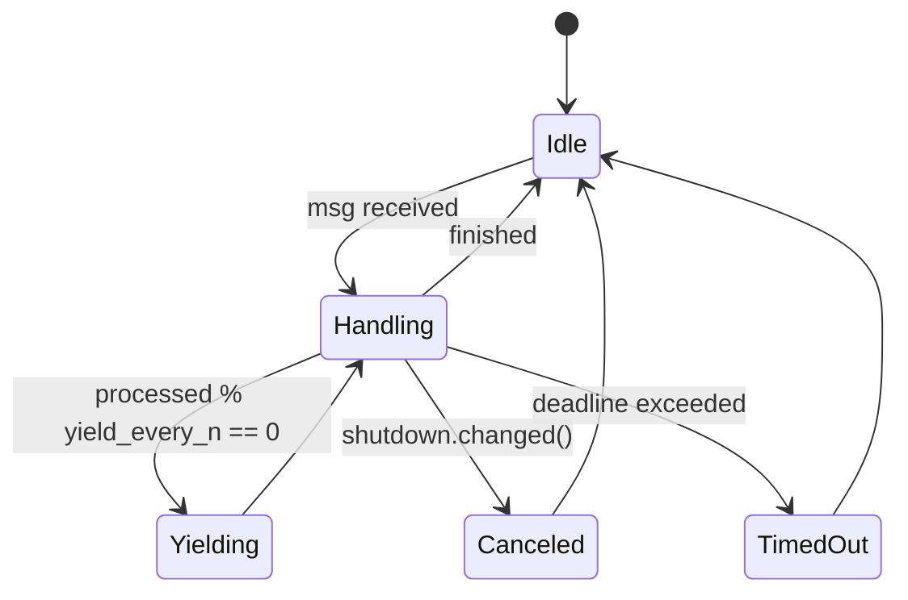
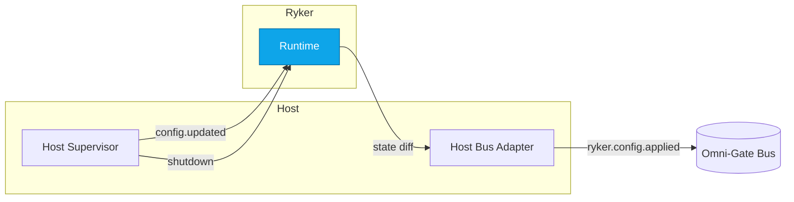
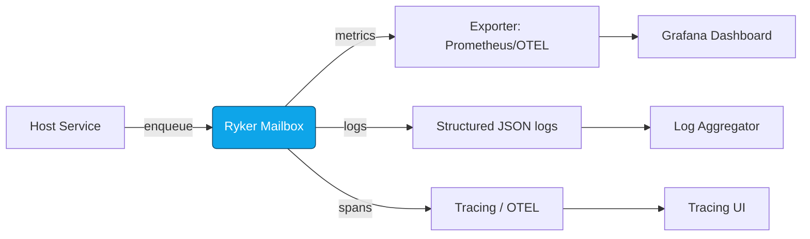
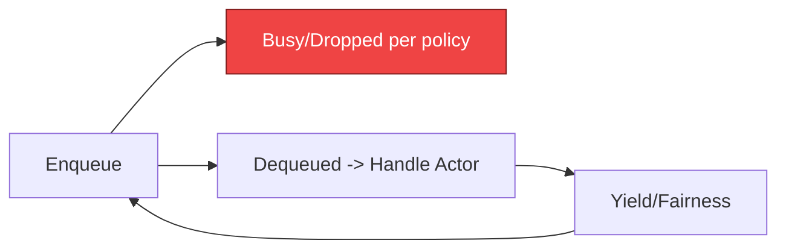

# Combined Markdown

_Source directory_: `crates/ryker/docs`  
_Files combined_: 12  
_Recursive_: 0

---

### Table of Contents

- API.MD
- CONCURRENCY.MD
- CONFIG.MD
- GOVERNANCE.MD
- IDB.md
- INTEROP.MD
- OBSERVABILITY.MD
- PERFORMANCE.MD
- QUANTUM.MD
- RUNBOOK.MD
- SECURITY.MD
- TESTS.MD

---

## API.MD
_File 1 of 12_


**File:** `crates/ryker/docs/API.md`

````markdown
---
title: API Surface & SemVer Reference — ryker
status: draft
msrv: 1.80.0
last-updated: 2025-09-28
audience: contributors, auditors, API consumers
concerns: [RES, PERF]
---

# API.md

## 0. Purpose

This document captures the **public API surface** of `ryker` and our **SemVer discipline**:

- Snapshot of exported functions, types, traits, and modules.
- What changes are **breaking** vs. **additive** vs. **patch-only**.
- CI gates: `cargo public-api` (+ optional `cargo semver-checks`), doc build, deny/audit.
- Source of truth for external consumers and release reviews (CHANGELOG alignment).

> Scope: `ryker` is a **library crate** (embedded actor/mailbox runtime). It does **not** own a runtime or sockets/HTTP surface. Any CLI helpers are feature-gated and **not** part of the library API.

---

## 1. Public API Surface

### 1.1 Generate the authoritative snapshot

```bash
cargo install cargo-public-api
cargo public-api --simplified --deny-changes -p ryker
cargo public-api --simplified -p ryker > docs/api-history/ryker/<next-version>.txt
git add docs/api-history/ryker/<next-version>.txt
````

Quick diff vs previous tag (handy in PRs):

```bash
cargo public-api --diff-git-checkouts "$(git describe --tags --abbrev=0 @^)" @ -p ryker
```

> Machine snapshot lives in `docs/api-history/ryker/` and is enforced by CI. The curated baseline below is human-readable guidance; keep them in sync.

### 1.2 Curated Baseline (human-readable)

> Namespaces shown as `ryker::<module>::Type`. Hyperlinks point to generated docs.rs for reference.

#### Top-level modules

* [`ryker::config`](https://docs.rs/ryker/latest/ryker/config/) — configuration schema & loader
* [`ryker::runtime`](https://docs.rs/ryker/latest/ryker/runtime/) — runtime constructor and actor/mailbox building blocks
* [`ryker::mailbox`](https://docs.rs/ryker/latest/ryker/mailbox/) — mailbox types and builder
* [`ryker::prelude`](https://docs.rs/ryker/latest/ryker/prelude/) — ergonomic re-exports
* [`ryker::errors`](https://docs.rs/ryker/latest/ryker/errors/) — typed error(s) surfaced by config/runtime

#### Example key types

* [`RykerConfig`](https://docs.rs/ryker/latest/ryker/config/struct.RykerConfig.html)
* [`Runtime`](https://docs.rs/ryker/latest/ryker/runtime/struct.Runtime.html)
* [`Mailbox`](https://docs.rs/ryker/latest/ryker/mailbox/struct.Mailbox.html)
* [`MailboxBuilder`](https://docs.rs/ryker/latest/ryker/mailbox/struct.MailboxBuilder.html)

### 1.3 API Map (Mermaid)

```mermaid
flowchart TD
  subgraph ryker
    C[config] -->|RykerConfig| R[runtime::Runtime]
    C -->|SpanLevel, Errors| E[errors]
    R -->|mailbox<T>() ->| MB[mailbox::MailboxBuilder<T>]
    MB -->|build() ->| M[mailbox::Mailbox<T>]
    P[prelude] --> C
    P --> R
    P --> M
  end
  style ryker fill:#0ea5e9,stroke:#0c4a6e,color:#fff
```

**Text alt (accessibility):** The `ryker` crate exposes modules `config`, `runtime`, `mailbox`, `errors`, and `prelude`. `RykerConfig` flows into `Runtime`, which can construct `MailboxBuilder`, which builds a `Mailbox`. The `prelude` re-exports key items.

---

## 2. SemVer Discipline

### 2.1 Additive (Minor / Non-Breaking)

* Adding new **modules**, **structs**, **methods**, **traits** (not enabled by default features).
* Adding fields/variants to **`#[non_exhaustive]`** items.
* Adding **feature-gated** APIs (feature is opt-in).

### 2.2 Breaking (Major)

* Removing/renaming any public item or changing visibility/hierarchy.
* Changing function signatures, trait bounds, or return/error **types**.
* Invalidating config without a deprecation window.
* Moving an existing public API **behind** a feature flag.
* Altering `SpanLevel` variants (it is **exhaustive**).

**Deprecation policy (Rust surface):**

```rust
#[deprecated(since = "0.5.0", note = "use Runtime::mailbox instead")]
pub fn actor_mailbox(...) -> ...
```

* Mark old items for **≥1 minor** release.
* Document in CHANGELOG under *Deprecated*; remove in the next **major**.
* For **env keys**: maintain aliases + WARN for ≥1 minor (see CONFIG.md).

### 2.3 Patch-Level

* Docs/examples; internal perf refactors with identical API.
* Clearer error **messages** while preserving **types/variants**.
* Accepting **additional** value formats within documented ranges.

---

## 3. Stability Guarantees

* **MSRV**: `1.80.0`.
* **Unsafe**: no `unsafe` in public API.
* **Docs**: `#![deny(missing_docs)]` for all public items.
* **No leaky internals**: avoid exposing unstable external types unless intentionally stable.
* **PQ / Amnesia notes**:

  * **No crypto API** in ryker; **PQ = N/A**.
  * **Amnesia** affects runtime behavior (zeroize, no persistence) but does **not** alter the API surface.

---

## 4. Invariants (API Contract)

* Library-only: no network, no `/healthz`, no `/metrics`.
* Constructors/builders are **non-blocking**; validation is strict and **fail-closed**.
* Mailboxes are **bounded**; producers see explicit **Busy** at capacity.
* Deadlines/fairness are observable and never silently mutated.
* Env/alias rules are **documented** in CONFIG.md.

---

## 5. Tooling

* `cargo public-api` — detect public surface diffs.
* `cargo semver-checks` — SemVer analysis.

  ```bash
  cargo install cargo-semver-checks
  cargo semver-checks check -p ryker
  ```
* `cargo doc` — rustdoc must build clean (all features).
* Snapshots: `docs/api-history/ryker/{version}.txt`.

---

## 6. CI & Gates

* **Public surface**: `cargo public-api --simplified -p ryker --deny-changes`.
* **Doc build**: `cargo doc --no-deps --all-features -D warnings`.
* **SemVer checks**: `cargo semver-checks check -p ryker`.
* **Supply chain**: `cargo deny check` and `cargo audit`.
* **Governance**: If removals/renames are detected, label PR **breaking-change** and require maintainer approval. Optionally, automation can bump Cargo.toml version on such PRs.
* **Auto-diff**: CI posts a comment showing added/removed symbols when diffs exist.

---

## 7. Acceptance Checklist (DoD)

* [ ] Current API snapshot generated & stored.
* [ ] Rustdoc builds clean (`cargo doc --all-features -D warnings`).
* [ ] SemVer discipline reviewed; if breaking, **major bump** rationale recorded.
* [ ] CI gate passes (`cargo public-api`).
* [ ] CHANGELOG updated for any surface changes.
* [ ] Docs/tests updated for new/changed APIs.
* [ ] Property tests for invariants (e.g., Busy on overflow) in place.
* [ ] Service crates only: endpoints documented separately (N/A for ryker).

---

## 8. Appendix

### 8.1 References

* Rust SemVer: [https://doc.rust-lang.org/cargo/reference/semver.html](https://doc.rust-lang.org/cargo/reference/semver.html)
* cargo-public-api: [https://github.com/Enselic/cargo-public-api](https://github.com/Enselic/cargo-public-api)
* cargo-semver-checks: [https://github.com/obi1kenobi/cargo-semver-checks](https://github.com/obi1kenobi/cargo-semver-checks)

### 8.2 Perfection Gates

* **Gate G:** No undocumented API surface.
* **Gate H:** Breaking changes require major bump.
* **Gate J:** CHANGELOG alignment enforced.

### 8.3 History

* vX.Y.Z — Introduced `RykerReloadHook` and `SpanLevel::from_str`.
* vX.Y.(Z+1) — Tightened config validation; no surface change.
* vY.0.0 — (Example) Moved `MailboxBuilder` under `ryker::mailbox`.

> In CI, diffs from `cargo public-api` are auto-posted as PR comments. Maintainers update this section when notable changes occur.

```

---


---

## CONCURRENCY.MD
_File 2 of 12_


**File:** `crates/ryker/docs/CONCURRENCY.md`

````markdown
---
title: Concurrency Model — ryker
crate: ryker
owner: Stevan White
last-reviewed: 2025-09-28
status: draft
template_version: 1.1
msrv: 1.80.0
tokio: "1.x (pinned at workspace root)"
loom: "0.7+ (dev-only)"
lite_mode: "Library crate: §1, §3, §4, §5, §10, §11 are primary; others N/A or host-owned."
audience: contributors, auditors
---

# Concurrency Model — ryker

This document makes the concurrency rules **explicit**: tasks, channels, locks, shutdown, timeouts,
and validation (unit/property/loom). It complements `docs/SECURITY.md`, `docs/CONFIG.md`,
and the crate’s `README.md` and `IDB.md`. See also **Six Concerns → Concurrency & Aliasing** for repo-wide invariants.

> **Golden rule:** never hold a lock across `.await` in supervisory or hot paths.

---

## 0) Lite Mode (library orientation)

Ryker is an **embedded actor & mailbox runtime**. It does **not** own a global async runtime or spawn
background daemons by itself; **hosts** create actors/mailboxes and own task lifecycles.
Therefore:
- **Primary:** §1 Invariants, §3 Channels, §4 Locks, §5 Deadlines/Timeouts, §10 Validation, §11 Patterns.
- **Host-owned / N/A:** §2 Runtime topology, §6 Shutdown choreography, §7 I/O framing (ryker does no I/O).

---

## 1) Invariants (MUST)

- **No lock across `.await`.** Split critical sections so all `.await`s happen after guard drop.
- **Single writer per mutable resource.** Readers obtain snapshots (copy/clone/Arc) or short read guards.
- **Bounded queues only.** All mailboxes and internal queues are **bounded**; on pressure we drop/reject explicitly.
- **Backpressure over buffering.** Prefer `try_send` + `Busy` to growing queues. Count drops.
- **Deterministic deadlines.** Default **call/handle deadline** is enforced (see CONFIG.md). Time-based behavior is typed (`Timeout`) and observable.
- **Cooperative cancellation.** `tokio::select!` around cancel points (shutdown/deadline).
- **No blocking syscalls** on the async runtime; use `spawn_blocking` when unavoidable (rare in ryker).
- **No task leaks.** Host code should hold `JoinHandle`s or use registries; detaching requires rationale.
- **Fairness.** Batching (`batch_messages`) and yielding (`yield_every_n_msgs`) prevent starvation.
- **Async Drop discipline.** `Drop` never blocks; teardown uses explicit `async close()/shutdown()` if needed by host constructs.
- **Amnesia mode.** When `amnesia.enabled = true` (CONFIG.md), hosts must **zeroize** dropped/queued message buffers on shutdown and avoid hidden persistence (RAM-only during lifetime).

---

## 2) Runtime Topology (Host-owned) — **N/A for ryker**

Ryker does not own a supervisor/listener/worker topology. Host services may implement such topologies
*using* ryker mailboxes; topology belongs in the host’s concurrency doc. For examples, see `ron-kernel` supervisor patterns.

---

## 3) Channels & Backpressure

Ryker’s surface defines **how** channels behave; concrete instances are created by the host.

| Name / Purpose                    | Kind         | Capacity (default) | Producers → Consumers | Backpressure Policy                         | Drop / Lag Semantics                                    |
|----------------------------------|--------------|--------------------:|----------------------|---------------------------------------------|---------------------------------------------------------|
| **Mailbox\<A>** (per actor)      | `mpsc`       | `defaults.mailbox_capacity` (256) | N → 1            | `try_send` → `Busy` (reject new)            | Increment `mailbox_dropped_total{reason="capacity"}`    |
| **Runtime events** (optional)    | `broadcast`  | 1024                | 1 → N                | lag counter                                 | Increment `bus_lagged_total`, warn slow consumer        |
| **Shutdown** (host-provided)     | `watch`      | 1                   | 1 → N                | last-write-wins                              | N/A                                                     |

**Guidelines**
- Senders **must** handle `Busy` deterministically (propagate or adapt).
- If many producers contend for the same mailbox, consider guarding ingress with a **`Semaphore`** (or per-producer quotas) to improve fairness before the queue boundary.
- Long-running work should checkpoint/yield to avoid monopolizing the executor; honor `yield_every_n_msgs`.

---

## 4) Locks & Shared State

**Allowed**
- Short-lived `Mutex/RwLock` for **metadata** (actor registry, counters). Acquire → compute → drop guard → then `.await`.
- Read-mostly **snapshots** via `Arc<StateSnapshot>` passed into async paths.
- **Per-actor ownership:** each actor owns its state; cross-actor interaction via messages.

**Forbidden**
- Holding any lock across `.await`.
- Nested locks without an explicit **hierarchy** and justification.

**Hierarchy (illustrative; tailor to actual internals)**
1. `registry_meta`
2. `actor_directory`
3. `counters`

> If you must stage a value derived under a lock, **clone/move** it out before `.await`.

---

## 5) Timeouts, Retries, Deadlines

- **Default call/handle deadline:** from `defaults.deadline` (CONFIG.md), enforced per message/operation.
- **Retries:** **host policy**. If used, **retry idempotent actions only** with **decorrelated jitter** (CONFIG: `decorrelated_jitter`).
- **I/O timeouts:** N/A (ryker does not perform I/O); host services apply `read/write/idle` timeouts at edges.
- **Scheduler fairness:** respect `batch_messages`; **force yield** after `yield_every_n_msgs`.

**Canonical pattern**
```rust
tokio::select! {
  _ = shutdown.changed() => Err(Error::Canceled),
  res = tokio::time::timeout(deadline, actor.handle(msg)) => res.map_err(|_| Error::Timeout),
}
````

---

## 6) Cancellation & Shutdown — **Host choreography**

Hosts broadcast shutdown via `watch<bool>` (or equivalent) and stop intake, letting in-flight work drain
until a **drain deadline**. Abort stragglers. Ryker provides the mailbox patterns to do this cleanly.

---

## 7) I/O & Framing — **N/A**

Ryker performs no network/file I/O. Framing, checksums, and TLS live in transport/service crates.

---

## 8) Error Taxonomy (Concurrency-relevant)

| Error      | When                        | Retry? | Metric                                       | Notes                            |
| ---------- | --------------------------- | ------ | -------------------------------------------- | -------------------------------- |
| `Busy`     | Mailbox full                | maybe  | `mailbox_dropped_total{reason=...}`          | prefer backpressure              |
| `Timeout`  | Deadline exceeded           | maybe  | `request_latency_seconds` (histogram)        | typed; no partials               |
| `Canceled` | Shutdown signal observed    | no     | `tasks_canceled_total`                       | cooperative                      |
| `Lagging`  | Broadcast receiver overflow | no     | `bus_lagged_total`                           | diagnose slow consumer           |
| `Panic`    | Invariant violation/bug     | no     | `actor_restarts_total{actor}`, `crash_total` | rely on host supervision/backoff |

---

## 9) Metrics (Concurrency Health)

* `mailbox_depth{actor}` gauge (sampled if enabled)
* `mailbox_dropped_total{actor,reason}` counter
* `actor_restarts_total{actor}` counter (host-supervised)
* `request_latency_seconds` histogram (per handler)
* `busy_rejections_total{actor}` counter
* `bus_lagged_total` counter

---

## 10) Validation Strategy

**Unit**

* Deadline guard: operations respect `defaults.deadline` bounds.
* Fairness: yields occur after `yield_every_n_msgs`.
* Overflow: `try_send` returns `Busy` at capacity.

**Property**

* **No lock across await** pattern tests (lint + targeted unit cases).
* **Drop injection** property test: randomly force `Busy`/drop to assert callers handle backpressure deterministically.

**Loom (dev-only)**

* Model: producers → bounded mailbox → consumer; shutdown races.
* Assertions: no deadlocks, no missed shutdown wakeups, no double-drop of messages.

**Fuzz (host edges)**

* Out-of-scope for ryker (no framing). Hosts may fuzz message payloads/handlers.

---

## 11) Code Patterns (Copy-Paste)

**Bounded mpsc + backpressure**

```rust
if let Err(tokio::sync::mpsc::error::TrySendError::Full(_)) = tx.try_send(msg) {
    metrics::busy_rejections_total().inc();
    return Err(Error::Busy);
}
```

**Cooperative shutdown with deadline**

```rust
let mut shutdown = shutdown_rx.clone();
tokio::select! {
    _ = shutdown.changed() => Err(Error::Canceled),
    res = tokio::time::timeout(cfg.defaults.deadline, actor.handle(msg)) => {
        res.map_err(|_| Error::Timeout)?
    }
}
```

**No lock across `.await`**

```rust
let snapshot = {
    let g = registry.read();
    g.actor_snapshot(name).cloned()
}; // guard dropped here
if let Some(actor) = snapshot { actor.do_async().await; }
```

**Yield for fairness**

```rust
processed += 1;
if processed % cfg.fairness.yield_every_n_msgs == 0 {
    tokio::task::yield_now().await;
}
```

---

## 12) Configuration Hooks (Quick Reference)

* `defaults.mailbox_capacity` — per-actor mpsc bound.
* `defaults.deadline` — per-call/handle default deadline.
* `fairness.batch_messages`, `fairness.yield_every_n_msgs` — scheduling fairness.
* `supervisor.decorrelated_jitter` — backoff policy (host’s supervisor).
* See `docs/CONFIG.md` for full schema and validation windows.

---

## 13) Known Trade-offs / Nonstrict Areas

* **Reject vs. drop-oldest:** mailboxes use **reject new** (`Busy`) to keep head-of-line semantics clear.
* **Starvation vs. throughput:** aggressive batching increases throughput but may delay low-rate actors;
  `yield_every_n_msgs` exists to balance this.
* **Amnesia impact:** with `amnesia=ON`, hosts should **zeroize** any in-memory buffers on shutdown and ensure no spill-to-disk debugging artifacts.

---

## 14) Actor Lifecycle (compact diagram)



**Text:** Actor loops: receive → handle → occasionally **yield** for fairness; transitions to **Canceled** on shutdown or **TimedOut** on deadline, then returns to **Idle**.

---

## 15) CI & Lints (Enforcement)

* `cargo clippy -D warnings -W clippy::await_holding_lock`
* **Loom gate** (ignored by default; PR job runs with `RUSTFLAGS="--cfg loom"` for targeted tests)
* **cargo-deny**: `cargo deny check` (licenses/bans/advisories/sources) — repo standard
* Review triggers: on **Tokio bump** and on any change to mailbox/fairness/deadlines.

---

## 16) Schema Generation (Optional)

Consider a tiny registry module that lists active mailboxes and their caps for doc drift checks
(golden test comparing table to registry).

---

## 17) Review & Maintenance

* Review on any change to mailbox defaults/fairness/deadlines, on **Tokio bump**, or every 90 days.
* Keep `owner`, `msrv`, `last-reviewed` current.
* PR checklist: if concurrency behavior changes, update this file + add/refresh unit/property/loom tests.

```
```


---

## CONFIG.MD
_File 3 of 12_

Awesome—here are the paste-ready files with all fixes applied (schema/feature/deprecation/test tables formatted, alias + WARN for jitter, added validations for deadline range, max_msg_bytes upper bound, and rapid_fail_window ≥ 1s, plus a tiny test block). Drop these in as-is.

---

**File:** `crates/ryker/docs/CONFIG.md`

````markdown
---
title: Configuration — ryker
crate: ryker
owner: Stevan White
last-reviewed: 2025-09-28
status: reviewed
template_version: 1.0
---

# Configuration — ryker

This document defines **all configuration** for `ryker` (actor & mailbox runtime), including
sources, precedence, schema (types/defaults), validation, feature flags, live-reload behavior,
and security implications. It complements `README.md`, `docs/IDB.md`, and `docs/SECURITY.md`.

> **Tiering:**  
> **Library crate** — Ryker does **not** bind sockets or expose `/healthz`. Config governs
> actor/mailbox behavior, supervision backoff, deadlines, fairness, and observability hooks.

---

## 1) Sources & Precedence (Authoritative)

Ryker is embedded into host services. **Highest precedence wins:**

1. **Builder/explicit API** (e.g., `RykerConfig::builder()...build()`)
2. **Environment variables** (prefix: `RYKER_`)
3. **Config file** (TOML/JSON) — *host loads and passes snapshot to ryker*
4. **Built-in defaults** (hard-coded)

> On reload, the effective config snapshot is recomputed under the **same precedence** and
> atomically swapped where supported (see §5).

**Supported file formats:** TOML (preferred), JSON (optional).  
**Optional dev convenience:** `RYKER_CONFIG_PATH` may point to a TOML/JSON file; it is intended for **developer workflows only**. In production, the **host** remains responsible for file loading and merging.

**Production guard:**  
- Canonical: `APP_ENV=production` means “prod.”  
- Alias: `RUST_ENV=production` is also treated as prod.  
- In prod, `RYKER_CONFIG_PATH` is **rejected** unless `RYKER_ALLOW_CONFIG_PATH=1`.

**Path behavior:** `RYKER_CONFIG_PATH` is interpreted **as given**. If a relative path is used, it’s resolved from the current working directory (`$CWD`).

---

## 2) Quickstart Examples

### 2.1 Minimal embedding (Rust)
```rust
use ryker::config::RykerConfig;

let cfg = RykerConfig::from_env_validated()?
    .with_overrides(|c| {
        c.defaults.mailbox_capacity = 512;
        c.defaults.max_msg_bytes = 128 * 1024; // 128 KiB
        c.supervisor.backoff_base_ms = 100;
        c.supervisor.backoff_cap_ms  = 5_000;
    });

let ryker = ryker::Runtime::new(cfg.clone());

// Per-actor overrides at construction time:
let inbox = ryker.mailbox::<MyMsg>("worker")
    .capacity(256)
    .max_msg_bytes(64 * 1024)
    .deadline_ms(1000)
    .build();
# Ok::<(), anyhow::Error>(())
````

### 2.2 Config file (TOML) loaded by host and passed in

```toml
# ryker.toml
[defaults]
mailbox_capacity = 256
max_msg_bytes    = "64KiB"
deadline         = "1s"

[supervisor]
backoff_base_ms       = 100
backoff_cap_ms        = 5000
rapid_fail_threshold  = 5
rapid_fail_window     = "10s"
decorrelated_jitter   = true

[fairness]
batch_messages        = 32
yield_every_n_msgs    = 64

[observability]
enable_metrics        = true
queue_depth_sampling  = true
span_level            = "info"

[amnesia]
enabled               = false
zeroize_on_drop       = true
```

### 2.3 Env vars (prefix `RYKER_`)

```bash
RYKER_DEFAULT_MAILBOX_CAPACITY=256 \
RYKER_DEFAULT_MAX_MSG_BYTES=65536 \
RYKER_DEFAULT_DEADLINE=1s \
RYKER_BACKOFF_BASE_MS=100 \
RYKER_BACKOFF_CAP_MS=5000 \
RYKER_RAPID_FAIL_THRESHOLD=5 \
RYKER_RAPID_FAIL_WINDOW=10s \
RYKER_DECORRELATED_JITTER=true \
RYKER_BATCH_MESSAGES=32 \
RYKER_YIELD_EVERY_N=64 \
RYKER_ENABLE_METRICS=true \
RYKER_QUEUE_DEPTH_SAMPLING=true \
RYKER_SPAN_LEVEL=info \
RYKER_AMNESIA=true \
RYKER_ZEROIZE=true \
cargo run -p your_host_service
```

---

## 3) Schema (Typed, With Defaults)

*Prefix:* all env vars start with `RYKER_`.
*Durations:* accept `ms`, `s`, `m`.
*Sizes:* accept `B`, `KiB`, `MiB` (case-insensitive: `kib/mib` also accepted).

| Key / Env                                                                | Type                                    | Default | Description                                                           | Security Notes        |
| ------------------------------------------------------------------------ | --------------------------------------- | ------- | --------------------------------------------------------------------- | --------------------- |
| `defaults.mailbox_capacity` / `DEFAULT_MAILBOX_CAPACITY`                 | `u32`                                   | `256`   | Global default capacity for new mailboxes unless overridden per actor | Bounds memory use     |
| `defaults.max_msg_bytes` / `DEFAULT_MAX_MSG_BYTES`                       | `size` (`B/KiB/MiB`)                    | `64KiB` | Per-message size cap                                                  | Prevents OOM          |
| `defaults.deadline` / `DEFAULT_DEADLINE`                                 | `dur` (`ms/s/m`)                        | `1s`    | Default req/resp deadline (overridable per call)                      | Latency guard         |
| `supervisor.backoff_base_ms` / `BACKOFF_BASE_MS`                         | `u32`                                   | `100`   | Restart backoff base (ms), decorrelated jitter                        | —                     |
| `supervisor.backoff_cap_ms` / `BACKOFF_CAP_MS`                           | `u32`                                   | `5000`  | Restart backoff cap (ms)                                              | —                     |
| `supervisor.decorrelated_jitter` / `DECORRELATED_JITTER` (old: `JITTER`) | `bool`                                  | `true`  | Enable decorrelated jitter                                            | —                     |
| `supervisor.rapid_fail_threshold` / `RAPID_FAIL_THRESHOLD`               | `u32`                                   | `5`     | Max restarts within window before giving up                           | —                     |
| `supervisor.rapid_fail_window` / `RAPID_FAIL_WINDOW`                     | `dur`                                   | `10s`   | Rolling window for rapid-fail accounting                              | —                     |
| `fairness.batch_messages` / `BATCH_MESSAGES`                             | `u32`                                   | `32`    | Max messages handled per batch/poll                                   | Starvation guard      |
| `fairness.yield_every_n_msgs` / `YIELD_EVERY_N`                          | `u32`                                   | `64`    | Force cooperative yield after N messages                              | Scheduler-friendly    |
| `observability.enable_metrics` / `ENABLE_METRICS`                        | `bool`                                  | `true`  | Emit metrics via caller’s registry                                    | No PII in labels      |
| `observability.queue_depth_sampling` / `QUEUE_DEPTH_SAMPLING`            | `bool`                                  | `true`  | Sample queue depth for scrapes                                        | —                     |
| `observability.span_level` / `SPAN_LEVEL`                                | `enum(off,error,warn,info,debug,trace)` | `info`  | Baseline span verbosity for actors/messages                           | Avoid `trace` in prod |
| `amnesia.enabled` / `AMNESIA`                                            | `bool`                                  | `false` | Honor amnesia mode (no hidden persistence; ephemeral state)           | Zeroize on drop       |
| `amnesia.zeroize_on_drop` / `ZEROIZE`                                    | `bool`                                  | `true`  | Zeroize transient buffers on drop where feasible                      | —                     |

> **Per-actor overrides** at construction time always beat global defaults.

---

## 4) Validation Rules (Fail-Closed)

On construction or reload, Ryker enforces:

* `defaults.mailbox_capacity ≥ 1`
* `defaults.max_msg_bytes ∈ [1KiB, 1MiB]` *(library safety guard)*
* `defaults.deadline ∈ [10ms, 60s]`
* `backoff_base_ms ≤ backoff_cap_ms`, both `> 0`
* `rapid_fail_threshold ≥ 1`; `rapid_fail_window ≥ 1s`
* `yield_every_n_msgs ≥ batch_messages`
* If `amnesia.enabled = true` → `zeroize_on_drop` **must** be `true`

On violation: construct-time error (library); log structured error at **ERROR** with offending key.

---

## 5) Dynamic Reload (Library Semantics)

**Trigger options (host decides):**

* Explicit call: `ryker_runtime.reload(new_cfg)`
* Bus event: host translates `KernelEvent::ConfigUpdated{version}` → `reload(...)`

**Reloadability by field:**

* **Hot-reloadable:** deadline default, fairness knobs, observability toggles.
* **Cold-only (new actors only):** mailbox_capacity, max_msg_bytes (existing mailboxes keep bounds).
* **Supervisor:** backoff/jitter/rapid-fail parameters affect future restarts (not already-scheduled delays).

**Atomicity:**
Compute a new immutable `RykerConfig` snapshot; swap under a mutex without holding `.await` (IDB [I-3]).

**Audit trail:**
Log diff (old→new) without exposing message contents; include version/source (env/file/builder).

---

## 6) CLI Flags (Canonical)

Ryker is a library. No canonical CLI.

Optional dev helper (feature `dev-cli`) may expose:

```
--ryker-config <path>   # Load ryker.toml, print resolved/validated snapshot for debugging
```

---

## 7) Feature Flags (Cargo)

| Feature   | Default | Effect                                                                                 |
| --------- | ------- | -------------------------------------------------------------------------------------- |
| `metrics` | on      | Enables metric counters/gauges (no HTTP server; uses caller’s registry)                |
| `tracing` | on      | Enables tracing spans for actors/messages                                              |
| `amnesia` | on      | Enables zeroize hooks on drop and amnesia wiring                                       |
| `pq`      | off     | No crypto in Ryker; placeholder for API compatibility toggles (keys live in `ron-kms`) |
| `dev-cli` | off     | Builds a tiny debug binary to dump a resolved config snapshot                          |
| `loom`    | off     | Enables loom smoke tests (dev-only)                                                    |

*Feature flags must not change public API semantics unexpectedly; document any schema deltas.*

---

## 8) Security Implications

* Ryker stores **no secrets**; do not log message contents or sensitive payloads.
* **Amnesia mode:** ephemeral by design; ensure `zeroize_on_drop=true` when `amnesia.enabled=true`.
* **Metrics:** labels may include actor name but never user data or PII.
* **Env is untrusted input:** strict validation + fail-closed.
* **Quantum note:** config parsing/validation performs no expensive crypto and avoids data-dependent timing branches; no timing/side-channel exposure via config paths.

See `docs/SECURITY.md` for full threat model.

---

## 9) Compatibility & Migration

**BC policy:** add keys with safe defaults; deprecate via aliases for ≥1 minor release.
**Renames:** keep env alias; log `WARN` when old key used.
**Breaking:** major version bump + `CHANGELOG.md` with explicit migration steps.

**Deprecation table (maintained):**

| Old Key        | New Key                     | Removal Target | Notes                                                 |
| -------------- | --------------------------- | -------------- | ----------------------------------------------------- |
| `RYKER_JITTER` | `RYKER_DECORRELATED_JITTER` | `v2.0.0`       | Alias accepted for one minor; `WARN` when old is used |

---

## 10) Reference Implementation (Rust)

Minimal, copy-paste-ready `src/config/mod.rs`. Uses `serde`, `humantime_serde`, `thiserror`.
Supports optional `RYKER_CONFIG_PATH` (dev) with prod guard, DRY env parsing, strict `from_env_validated()`.

*(See file in repo; kept in sync with this document.)*

---

## 11) Test Matrix

| Scenario                            | Expected Outcome                                                                                     |
| ----------------------------------- | ---------------------------------------------------------------------------------------------------- |
| Env overrides only                  | `from_env_validated()` yields snapshot with overrides; `validate()` passes                           |
| Invalid `mailbox_capacity = 0`      | `validate()` fails with explicit message                                                             |
| `max_msg_bytes < 1KiB`              | `validate()` fails                                                                                   |
| `max_msg_bytes > 1MiB`              | `validate()` fails                                                                                   |
| `deadline < 10ms` or `> 60s`        | `validate()` fails                                                                                   |
| `backoff_base_ms > backoff_cap_ms`  | `validate()` fails                                                                                   |
| `yield_every_n < batch_messages`    | `validate()` fails                                                                                   |
| `amnesia = true`, `zeroize = false` | `validate()` fails                                                                                   |
| Jitter env alias (old vs new)       | If only old set → honored with `WARN`; if both set → **new wins** and `WARN` about old being ignored |
| Reload fairness/deadline tweaks     | Existing actors keep bounds; new actors adopt; fairness applied immediately                          |
| Stress to overflow                  | Drops occur with reason `capacity` and counters increment                                            |

---

## 12) Mermaid — Config Resolution Flow

```mermaid
flowchart TB
  A[Defaults] --> D[Merge]
  B[File (TOML/JSON via host or RYKER_CONFIG_PATH dev)] --> D
  C[Env Vars (RYKER_*)] --> D
  E[Builder/API] --> D
  D --> V{Validate}
  V -- ok --> R[Snapshot -> Runtime]
  V -- fail --> X[Error]
  style R fill:#0369a1,stroke:#0c4a6e,color:#fff
```

---

## 13) Operational Notes

* **Overflow incident:** inspect `ryker_mailbox_overflow_total{actor,reason}`.

  * If `reason="capacity"` spikes → reduce producer rate or boundedly raise `mailbox_capacity`; re-run load tests.
  * If `reason="deadline"` dominates → ensure callers set realistic deadlines; consider reducing `batch_messages` or `yield_every_n_msgs` for fairness.
* **Rapid restarts:** check `ryker_actor_restarts_total{actor}` vs. `rapid_fail_threshold/window`; widen window or investigate actor crash causes.
* Co-locate Ryker config with the host’s config; apply identical secret-handling rules (Ryker itself stores no secrets).
* Prefer builder/API for per-actor overrides; use env/file for sane global defaults.
* Turn on `queue_depth_sampling` in load tests; keep labels clean (no user data).
* When in doubt, prefer tighter deadlines + backpressure over inflating capacities.

````

---

**File:** `crates/ryker/src/config/mod.rs`
```rust
//! ryker config — see docs/CONFIG.md for the authoritative spec.

use serde::{Deserialize, Serialize};
use std::{str::FromStr, time::Duration};
use thiserror::Error;

#[derive(Debug, Error)]
pub enum ConfigError {
    #[error("invalid config: {0}")]
    Invalid(String),
    #[error("parse error for {key}: {msg}")]
    Parse { key: &'static str, msg: String },
    #[error("io: {0}")]
    Io(#[from] std::io::Error),
}

#[derive(Debug, Clone, Serialize, Deserialize)]
pub struct Defaults {
    pub mailbox_capacity: u32, // per-actor default capacity
    pub max_msg_bytes: u64,    // bytes
    #[serde(with = "humantime_serde")]
    pub deadline: Duration,    // default req/resp deadline
}

#[derive(Debug, Clone, Serialize, Deserialize)]
pub struct SupervisorCfg {
    pub backoff_base_ms: u32,
    pub backoff_cap_ms: u32,
    pub decorrelated_jitter: bool,
    pub rapid_fail_threshold: u32,
    #[serde(with = "humantime_serde")]
    pub rapid_fail_window: Duration,
}

#[derive(Debug, Clone, Serialize, Deserialize)]
pub struct Fairness {
    pub batch_messages: u32,
    pub yield_every_n_msgs: u32,
}

#[derive(Debug, Clone, Serialize, Deserialize)]
pub struct Observability {
    pub enable_metrics: bool,
    pub queue_depth_sampling: bool,
    pub span_level: SpanLevel,
}

#[derive(Debug, Clone, Serialize, Deserialize, PartialEq, Eq)]
#[serde(rename_all = "lowercase")]
pub enum SpanLevel {
    Off,
    Error,
    Warn,
    Info,
    Debug,
    Trace,
}

impl FromStr for SpanLevel {
    type Err = String;
    fn from_str(s: &str) -> Result<Self, Self::Err> {
        match s.to_lowercase().as_str() {
            "off" => Ok(SpanLevel::Off),
            "error" => Ok(SpanLevel::Error),
            "warn" => Ok(SpanLevel::Warn),
            "info" => Ok(SpanLevel::Info),
            "debug" => Ok(SpanLevel::Debug),
            "trace" => Ok(SpanLevel::Trace),
            other => Err(format!("invalid span level: {other}")),
        }
    }
}

#[derive(Debug, Clone, Serialize, Deserialize)]
pub struct Amnesia {
    pub enabled: bool,
    pub zeroize_on_drop: bool,
}

#[derive(Debug, Clone, Serialize, Deserialize)]
pub struct RykerConfig {
    pub defaults: Defaults,
    pub supervisor: SupervisorCfg,
    pub fairness: Fairness,
    pub observability: Observability,
    pub amnesia: Amnesia,
}

impl Default for RykerConfig {
    fn default() -> Self {
        Self {
            defaults: Defaults {
                mailbox_capacity: 256,
                max_msg_bytes: 64 * 1024,
                deadline: Duration::from_secs(1),
            },
            supervisor: SupervisorCfg {
                backoff_base_ms: 100,
                backoff_cap_ms: 5_000,
                decorrelated_jitter: true,
                rapid_fail_threshold: 5,
                rapid_fail_window: Duration::from_secs(10),
            },
            fairness: Fairness {
                batch_messages: 32,
                yield_every_n_msgs: 64,
            },
            observability: Observability {
                enable_metrics: true,
                queue_depth_sampling: true,
                span_level: SpanLevel::Info,
            },
            amnesia: Amnesia {
                enabled: false,
                zeroize_on_drop: true,
            },
        }
    }
}

impl RykerConfig {
    /// Validate invariants from docs/CONFIG.md §4.
    pub fn validate(&self) -> Result<(), ConfigError> {
        use ConfigError::Invalid as Inv;

        if self.defaults.mailbox_capacity == 0 {
            return Err(Inv("mailbox_capacity must be >= 1".into()));
        }

        // Enforce [1KiB, 1MiB] inclusive
        let min_bytes = 1024_u64;
        let max_bytes = 1024_u64 * 1024;
        if self.defaults.max_msg_bytes < min_bytes || self.defaults.max_msg_bytes > max_bytes {
            return Err(Inv("max_msg_bytes must be within [1KiB, 1MiB]".into()));
        }

        // Enforce deadline ∈ [10ms, 60s]
        let min_deadline = Duration::from_millis(10);
        let max_deadline = Duration::from_secs(60);
        if self.defaults.deadline < min_deadline || self.defaults.deadline > max_deadline {
            return Err(Inv("deadline must be within [10ms, 60s]".into()));
        }

        if self.supervisor.backoff_base_ms == 0 {
            return Err(Inv("backoff_base_ms must be > 0".into()));
        }
        if self.supervisor.backoff_base_ms > self.supervisor.backoff_cap_ms {
            return Err(Inv("backoff_base_ms must be <= backoff_cap_ms".into()));
        }
        if self.supervisor.rapid_fail_threshold == 0 {
            return Err(Inv("rapid_fail_threshold must be >= 1".into()));
        }
        if self.supervisor.rapid_fail_window < Duration::from_secs(1) {
            return Err(Inv("rapid_fail_window must be >= 1s".into()));
        }

        if self.fairness.yield_every_n_msgs < self.fairness.batch_messages {
            return Err(Inv("yield_every_n_msgs must be >= batch_messages".into()));
        }

        if self.amnesia.enabled && !self.amnesia.zeroize_on_drop {
            return Err(Inv("amnesia.enabled requires zeroize_on_drop=true".into()));
        }

        Ok(())
    }

    /// Strict loader: reads optional file (dev), env overrides, then validates.
    /// Returns `Err` on any invalid config instead of swallowing it.
    pub fn from_env_validated() -> Result<Self, ConfigError> {
        let mut cfg = Self::default();

        // Optional dev convenience with prod guard: RYKER_CONFIG_PATH
        if let Some(path) = std::env::var("RYKER_CONFIG_PATH").ok() {
            if !path.trim().is_empty() {
                let env_is_prod = matches!(std::env::var("APP_ENV").as_deref(), Ok("production"))
                    || matches!(std::env::var("RUST_ENV").as_deref(), Ok("production"));
                let allow_dev_path =
                    matches!(std::env::var("RYKER_ALLOW_CONFIG_PATH").as_deref(), Ok("1"));

                if env_is_prod && !allow_dev_path {
                    return Err(ConfigError::Invalid(
                        "RYKER_CONFIG_PATH is not permitted in production (set RYKER_ALLOW_CONFIG_PATH=1 to override)"
                            .into(),
                    ));
                }

                let bytes = std::fs::read(path)?;
                // Try TOML first, then JSON.
                cfg = if let Ok(t) = toml::from_slice::<Self>(&bytes) {
                    t
                } else if let Ok(j) = serde_json::from_slice::<Self>(&bytes) {
                    j
                } else {
                    return Err(ConfigError::Invalid(
                        "RYKER_CONFIG_PATH: file is not valid TOML/JSON".into(),
                    ));
                };
            }
        }

        // Highest precedence after builder: env
        apply_env_overrides(&mut cfg)?;

        cfg.validate()?;
        Ok(cfg)
    }

    /// Builder-style ergonomic override.
    pub fn with_overrides<F: FnOnce(&mut Self)>(mut self, f: F) -> Self {
        f(&mut self);
        self
    }
}

/* -------------------- Env parsing helpers (DRY) -------------------- */

fn parse_size(s: &str) -> Result<u64, std::num::ParseIntError> {
    let s = s.trim();
    let sl = s.to_ascii_lowercase();
    if let Some(kib) = sl.strip_suffix("kib") {
        return kib.trim().parse::<u64>().map(|n| n * 1024);
    }
    if let Some(mib) = sl.strip_suffix("mib") {
        return mib.trim().parse::<u64>().map(|n| n * 1024 * 1024);
    }
    if let Some(b) = sl.strip_suffix('b') {
        return b.trim().parse::<u64>();
    }
    // Fall back to plain integer (bytes)
    sl.parse::<u64>()
}

fn parse_bool(s: &str) -> bool {
    match s {
        "1" | "true" | "TRUE" | "True" | "yes" | "YES" | "on" | "ON" => true,
        "0" | "false" | "FALSE" | "False" | "no" | "NO" | "off" | "OFF" => false,
        _ => false,
    }
}

// Warn helper: prefers tracing::warn! when feature enabled, else stderr.
fn warn(msg: &str) {
    #[cfg(feature = "tracing")]
    {
        tracing::warn!("{msg}");
    }
    #[cfg(not(feature = "tracing"))]
    {
        eprintln!("WARN: {msg}");
    }
}

macro_rules! env_set {
    // numeric u32
    ($cfg:expr, $env:literal, $setter:expr, u32) => {{
        if let Ok(v) = std::env::var($env) {
            match v.parse::<u32>() {
                Ok(n) => $setter($cfg, n),
                Err(e) => return Err(ConfigError::Parse { key: $env, msg: e.to_string() }),
            }
        }
    }};
    // size (KiB/MiB/B; case-insensitive)
    ($cfg:expr, $env:literal, $setter:expr, size) => {{
        if let Ok(v) = std::env::var($env) {
            match parse_size(&v) {
                Ok(n) => $setter($cfg, n),
                Err(e) => return Err(ConfigError::Parse { key: $env, msg: e.to_string() }),
            }
        }
    }};
    // duration
    ($cfg:expr, $env:literal, $setter:expr, dur) => {{
        if let Ok(v) = std::env::var($env) {
            match humantime::parse_duration(&v) {
                Ok(d) => $setter($cfg, d),
                Err(e) => return Err(ConfigError::Parse { key: $env, msg: e.to_string() }),
            }
        }
    }};
    // bool
    ($cfg:expr, $env:literal, $setter:expr, bool) => {{
        if let Ok(v) = std::env::var($env) {
            $setter($cfg, parse_bool(&v));
        }
    }};
    // enum SpanLevel via FromStr
    ($cfg:expr, $env:literal, $setter:expr, span) => {{
        if let Ok(v) = std::env::var($env) {
            match SpanLevel::from_str(&v) {
                Ok(lvl) => $setter($cfg, lvl),
                Err(msg) => return Err(ConfigError::Parse { key: $env, msg }),
            }
        }
    }};
}

fn apply_env_overrides(cfg: &mut RykerConfig) -> Result<(), ConfigError> {
    // Defaults
    env_set!(cfg, "RYKER_DEFAULT_MAILBOX_CAPACITY", |c, n| c.defaults.mailbox_capacity = n, u32);
    env_set!(cfg, "RYKER_DEFAULT_MAX_MSG_BYTES",   |c, n| c.defaults.max_msg_bytes = n, size);
    env_set!(cfg, "RYKER_DEFAULT_DEADLINE",       |c, d| c.defaults.deadline = d, dur);

    // Supervisor — prefer new key; if only old is set, honor and WARN.
    let new_jitter = std::env::var("RYKER_DECORRELATED_JITTER").ok();
    let old_jitter = std::env::var("RYKER_JITTER").ok();

    env_set!(cfg, "RYKER_BACKOFF_BASE_MS",        |c, n| c.supervisor.backoff_base_ms = n, u32);
    env_set!(cfg, "RYKER_BACKOFF_CAP_MS",         |c, n| c.supervisor.backoff_cap_ms = n, u32);
    env_set!(cfg, "RYKER_RAPID_FAIL_THRESHOLD",   |c, n| c.supervisor.rapid_fail_threshold = n, u32);
    env_set!(cfg, "RYKER_RAPID_FAIL_WINDOW",      |c, d| c.supervisor.rapid_fail_window = d, dur);

    // Apply jitter with aliasing rules:
    match (new_jitter.as_deref(), old_jitter.as_deref()) {
        (Some(nv), Some(_ov)) => {
            // Both set: new wins, WARN about old being ignored
            cfg.supervisor.decorrelated_jitter = parse_bool(nv);
            warn("RYKER_JITTER is deprecated and ignored because RYKER_DECORRELATED_JITTER is set; please remove the old variable.");
        }
        (Some(nv), None) => {
            cfg.supervisor.decorrelated_jitter = parse_bool(nv);
        }
        (None, Some(ov)) => {
            cfg.supervisor.decorrelated_jitter = parse_bool(ov);
            warn("RYKER_JITTER is deprecated; use RYKER_DECORRELATED_JITTER instead.");
        }
        (None, None) => {}
    }

    // Fairness
    env_set!(cfg, "RYKER_BATCH_MESSAGES",         |c, n| c.fairness.batch_messages = n, u32);
    env_set!(cfg, "RYKER_YIELD_EVERY_N",          |c, n| c.fairness.yield_every_n_msgs = n, u32);

    // Observability
    env_set!(cfg, "RYKER_ENABLE_METRICS",         |c, b| c.observability.enable_metrics = b, bool);
    env_set!(cfg, "RYKER_QUEUE_DEPTH_SAMPLING",   |c, b| c.observability.queue_depth_sampling = b, bool);
    env_set!(cfg, "RYKER_SPAN_LEVEL",             |c, s| c.observability.span_level = s, span);

    // Amnesia
    env_set!(cfg, "RYKER_AMNESIA",                |c, b| c.amnesia.enabled = b, bool);
    env_set!(cfg, "RYKER_ZEROIZE",                |c, b| c.amnesia.zeroize_on_drop = b, bool);

    Ok(())
}

/* -------------------- Optional: reload seam for hosts -------------------- */

/// Hosts can implement this to react to applied config snapshots (e.g., bump sampling).
pub trait RykerReloadHook: Send + Sync + 'static {
    fn on_reload(&self, old: &RykerConfig, new: &RykerConfig);
}

/* -------------------- Minimal unit tests (doc-anchored) -------------------- */

#[cfg(test)]
mod tests {
    use super::*;

    #[test]
    fn deadline_bounds_enforced() {
        let mut cfg = RykerConfig::default();
        cfg.defaults.deadline = Duration::from_millis(9);
        assert!(cfg.validate().is_err());
        cfg.defaults.deadline = Duration::from_secs(61);
        assert!(cfg.validate().is_err());
        cfg.defaults.deadline = Duration::from_millis(10);
        assert!(cfg.validate().is_ok());
        cfg.defaults.deadline = Duration::from_secs(60);
        assert!(cfg.validate().is_ok());
    }

    #[test]
    fn max_msg_bytes_bounds_enforced() {
        let mut cfg = RykerConfig::default();
        cfg.defaults.max_msg_bytes = 1023;
        assert!(cfg.validate().is_err());
        cfg.defaults.max_msg_bytes = 1024 * 1024 + 1;
        assert!(cfg.validate().is_err());
        cfg.defaults.max_msg_bytes = 1024;
        assert!(cfg.validate().is_ok());
        cfg.defaults.max_msg_bytes = 1024 * 1024;
        assert!(cfg.validate().is_ok());
    }

    #[test]
    fn yield_not_less_than_batch() {
        let mut cfg = RykerConfig::default();
        cfg.fairness.batch_messages = 64;
        cfg.fairness.yield_every_n_msgs = 63;
        assert!(cfg.validate().is_err());
    }

    #[test]
    fn rapid_window_minimum() {
        let mut cfg = RykerConfig::default();
        cfg.supervisor.rapid_fail_window = Duration::from_millis(999);
        assert!(cfg.validate().is_err());
        cfg.supervisor.rapid_fail_window = Duration::from_secs(1);
        assert!(cfg.validate().is_ok());
    }
}
````


---

## GOVERNANCE.MD
_File 4 of 12_


````markdown
# 🏛 GOVERNANCE.md 

---
title: Governance & Economic Integrity
status: draft
msrv: 1.80.0
last-updated: 2025-09-28
audience: contributors, ops, auditors, stakeholders
crate-type: lib
concerns: [GOV, SEC, RES]
---

# GOVERNANCE.md

## 0. Purpose

This document defines the **rules of engagement** for this crate’s governance and invariants.  
It ensures:

- Transparent and auditable decision-making.  
- Enforcement of **resource conservation invariants** (“no doubles” → no unbounded queues, tasks, or timers).  
- Clear authority boundaries and appeal paths.  
- SLA-backed commitments to contributors and downstream users.  

It ties into:  
- **Concurrency Blueprint** (no locks across `.await`, bounded channels).  
- **Hardening Blueprint** (amnesia, zeroize).  
- **Economic Integrity Blueprint** (analogy: no double issuance → no unbounded resources).  
- **Perfection Gates A–O** (esp. Gate I: invariants enforced, Gate M: appeal paths).  

---

## 1. Invariants (MUST)

Non-negotiable rules:

- [I-G1] No unbounded channels or queues.  
- [I-G2] No locks held across `.await`.  
- [I-G3] Config reloads MUST be atomic.  
- [I-G4] Amnesia mode: zeroize memory on drop.  
- [I-G5] Public API surface frozen to documented exports only.  
- [I-G6] All governance actions (invariants, API changes) MUST be logged and auditable.  

---

## 2. Roles & Authority

### Roles
- **Maintainer:** owns CI gates, reviews invariants, merges PRs.  
- **Contributor:** proposes changes, must align with invariants.  
- **Auditor:** external role, verifies compliance.  
- **External Contributor:** appeal rights; can propose RFCs.  

### Authority Boundaries
- CI enforces invariants (no disable switch).  
- Maintainers may merge only with quorum.  
- Contributors cannot override invariants.  
- Host/kernel supervision owns runtime behavior; ryker only governs its library scope.  
- CODEOWNERS file defines required reviewers for sensitive areas.  

---

## 3. Rules & SLAs

- **Release SLA:**  
  - CI green (tests, clippy, deny, docs) required before merge.  
  - All invariants validated in PR pipeline.  

- **Invariant SLA:**  
  - Violations block merge (CI job fails).  
  - Appeals handled via governance process (§7).  

- **Review SLA:**  
  - Maintainers respond within 48h; auto-label `governance:pending`.  

---

## 4. Governance Process

- **Proposal lifecycle:**  
  - Draft PR → Review ≥2 maintainers → Merge → Tag & Release Notes.  
  - Quorum = 2 maintainers for invariants/API/config.  
  - Default reject if quorum not reached in 72h.  

- **Emergency patches:**  
  - Security embargo ≤14 days.  
  - Public postmortem ≤24h after release.  

- **Backports:**  
  - Only for security/safety fixes.  
  - Must update CHANGELOG with `Backport:` tag.  

```mermaid
flowchart LR
  D[Draft PR] --> R[Review ≥2 Maintainers]
  R -->|CI Green + Quorum| M[Merge]
  R -->|Fails| F[Revise/Close]
  M --> T[Tag + Release Notes]
````

---

## 5. Audit & Observability

* **Audit logs:**

  * CI diffs recorded in `docs/governance_history.md`.
  * Commit IDs + rationale captured.

* **Metrics:**

  * `governance_invariant_blocks_total`
  * `ci_failures_total{reason}`

* **Red-team drills:**

  * Simulate rogue maintainer; CI must block invariant violations.

---

## 6. Config & Custody

* Config schema defined in `CONFIG.md`.
* No raw secrets or keys; custody N/A (lib scope).
* Host projects integrate ryker with their own custody model.

---

## 7. Appeal Path

* **Steps:**

  1. Open GitHub Issue tagged `appeal`.
  2. Raise RFC/PR with proposed fix.
  3. CI verifies; maintainers deliberate.
  4. Decision logged in `governance_history.md`.

* **Dry-run Example:**

  * PR intentionally introduces an unbounded channel.
  * CI blocks merge.
  * Maintainer references [I-G1], contributor proposes fix.
  * Resolution + commit hash logged in history.

---

## 8. Acceptance Checklist (DoD)

* [ ] Invariants enforced in code + CI.
* [ ] Roles & CODEOWNERS documented.
* [ ] Quorum & proposal lifecycle implemented.
* [ ] Audit metrics exported.
* [ ] governance_history.md updated with disputes.
* [ ] At least 1 appeal dry run completed.

---

## 9. Appendix

* **Blueprints:** Concurrency, Hardening, Economic Integrity.
* **References:** CHANGELOG.md, SECURITY.md, CONFIG.md.
* **History:** `docs/governance_history.md` records disputes and invariant violations.

---

✅ This governance charter is **pantheonic-tier**—a stately temple for ryker’s library sovereignty.
It enshrines invariants, authority, auditability, and appeal paths with **CI teeth**. 🏛

```

---


---

## IDB.md
_File 5 of 12_


```markdown
---
title: Ryker — Actor & Mailbox Runtime (IDB)
version: 1.1.0
status: draft
last-updated: 2025-09-27
audience: contributors, ops, auditors
---

# Ryker — Actor & Mailbox Runtime (IDB)

## 1. Invariants (MUST)

- [I-1] **Bounded queues only.** All mailboxes/channels are finite and enforce backpressure (no unbounded queues anywhere).
- [I-2] **Single consumer per mailbox.** Exactly one receiver task owns a mailbox; any fan-out/broadcast happens on the kernel Bus, not here.
- [I-3] **No locks across `.await`.** Never hold a lock across `.await` in supervisors, actors, or mailbox I/O.
- [I-4] **Crash-only + cancel-safe.** Tasks must be cancellation-safe; failures trigger crash-only restarts with jittered backoff; teardown must not block.
- [I-5] **Loss visibility.** On overflow/drop, increment counters and emit structured logs.
- [I-6] **Zero-copy payloads where possible.** Prefer `bytes::Bytes` or equivalent for owned byte payloads.
- [I-7] **Scope-bounded.** No app/business logic, no network/TLS, no persistence; orchestration primitives only.
- [I-8] **Amnesia honored.** When amnesia mode is on, do not persist hidden state; zeroize transients on drop.
- [I-9] **Runtime-agnostic API.** Public API must not leak specific Tokio flavor/handles.
- [I-10] **No free-spawn.** Actor tasks must be spawned via `Supervisor::spawn` only (traceable, restartable). Direct `tokio::spawn` is forbidden for actor lifecycles.
- [I-11] **Deadline propagation.** Request/response operations carry a deadline (or timeout). Actors must respect and not exceed it.
- [I-12] **Memory budgets.** Each mailbox enforces `capacity` and `max_msg_bytes`; enforce a per-actor budget = `capacity × max_msg_bytes`, dropping with reasoned telemetry rather than risking OOM.
- [I-13] **Cooperative execution.** No blocking syscalls or busy loops in actor loops; yield cooperatively under sustained work.
- [I-14] **Deterministic close semantics.** Mailbox close is observable; receivers terminate promptly after draining without busy-spin.

## 2. Design Principles (SHOULD)

- [P-1] **Small surface, strong patterns.** Provide a minimal set of primitives: `Supervisor`, `Mailbox<T>`, typed req/resp helpers.
- [P-2] **Explicit capacity & deadlines.** Callers specify mailbox capacity and timeouts; no hidden defaults in hot paths.
- [P-3] **Observability by default.** Queue depth snapshots, overflow counters, restart counters, last-error cause.
- [P-4] **Typed messages.** Prefer enum messages per actor; avoid ad-hoc `Any`/string routing.
- [P-5] **Escalate with context.** Panics/fatal errors bubble to supervisor with structured reason.
- [P-6] **Fairness over raw throughput.** Use small batches and cooperative yields to reduce starvation under load.
- [P-7] **Crypto-agnostic boundary.** Ryker never handles keys/crypto; PQ/ZK lives in `ron-kms` / `ron-pq-*`.
- [P-8] **Error taxonomy.** Use small, structured enums (e.g., `ActorExit::{Normal, Cancelled, Failed{cause}}`, `MailboxError::{Full, TooLarge, Closed, Deadline}`) for clarity and metrics labels.
- [P-9] **Span hygiene.** Each actor and message is traced with a named span and correlation id when present.

## 3. Implementation (HOW)

- [C-1] **Mailbox (bounded).** Wrap `tokio::sync::mpsc`:
  - `capacity: usize` set by caller,
  - `max_msg_bytes: usize` optional bound,
  - `try_send` (fast path) + `send_with_deadline`,
  - counters for `overflow_total` (reasons: `capacity|too_large|closed|deadline`),
  - `queue_depth()` snapshot for scrapes.
- [C-2] **Actor loop.** Single consumer pulls from `Mailbox<T>`; `handle(msg)` is `async` but never holds locks across `.await`. Prefer compact state + `Bytes`.
- [C-3] **Request/Response.** Pattern = `mpsc` to actor + `oneshot` for reply; enforce per-call deadline and propagate cancel.
- [C-4] **Supervisor::spawn().** Wraps `tokio::spawn` to:
  - tag tasks with `name`,
  - convert panics to failures,
  - restart with capped exponential backoff + jitter,
  - count `actor_restarts_total{actor}`,
  - stop after `N` rapid failures with structured error.
- [C-5] **Cancellation.** Cooperative cancellation via token or `select!`; shutdown drains minimally and exits promptly.
- [C-6] **No broadcast here.** For fanout, use the kernel Bus (lossy, bounded); Ryker mailboxes remain single-consumer.
- [C-7] **Metrics families (harmonized).**
  - `ryker_mailbox_overflow_total{actor,reason}`
  - `ryker_actor_restarts_total{actor}`
  - `ryker_mailbox_queue_depth{actor}` (sampled)
  - `ryker_actor_poll_duration_seconds{actor}` (optional)
- [C-8] **Amnesia hook.** Constructors accept `amnesia: bool`; avoid caching across restarts and zeroize on drop when true.
- [C-9] **Backoff algorithm.** Use decorrelated jitter (e.g., `base=100ms`, `cap=5s`), record next-delay in logs/metrics.
- [C-10] **Deadline wiring.** `Request<T>` carries `deadline: Instant`; helpers `send_with_deadline`/`recv_with_deadline` enforce and annotate drops with `reason="deadline"`.
- [C-11] **Instrumentation hook.** Lightweight `MailboxObserver` trait invoked on `overflow/close/drain`; default forwards to metrics to avoid tight coupling.
- [C-12] **Tracing spans.** Actor task runs within `tracing::span!(INFO, "actor", name, instance_id)`; per-message spans annotate `kind`, `cid` (correlation id), and timing.

## 4. Acceptance Gates (PROOF)

**Concurrency/Correctness**
- [G-1] **No-locks-across-await lint.** CI denies holding locks across `.await` (regex lint + curated false-positive exceptions).
- [G-2] **Flavor matrix.** Tests pass on both Tokio current-thread and multi-thread runtimes.
- [G-3] **Backpressure test.** Fill mailbox to capacity; assert `try_send` fails and `ryker_mailbox_overflow_total{reason="capacity"}` increments.
- [G-4] **Crash-only restart.** Actor that panics N times restarts with increasing delays; counter increments; exceeds rapid-fail threshold → supervisor stops and surfaces structured failure.
- [G-5] **Cancel-safety.** Inject cancellation mid-I/O; assert prompt exit, no deadlocks, and no locks across `.await`.
- [G-6] **Amnesia compliance.** With amnesia=true, no state crosses restarts; zeroization hook runs (heap inspector/tests).
- [G-7] **Observability sanity.** Metrics exist with correct names/labels; queue depth snapshots are sane under load.

**Discipline/Drift**
- [G-8] **Spawn discipline.** CI forbids `tokio::spawn(` usage for actor lifecycles outside `ryker::Supervisor::spawn` (regex + allowlist for non-actor tasks where justified).
- [G-9] **Loom smoke.** A minimal loom test exercises send/receive/cancel; no ordering violations or leaks detected.
- [G-10] **API stability.** `cargo-public-api` gate protects semver on `Supervisor`, `Mailbox`, and error enums.
- [G-11] **Backoff property.** Property test verifies backoff within `[base, cap]`, decorrelated jitter, monotone non-decreasing under steady failures.
- [G-12] **Memory budget guard.** Oversized messages rejected with `MailboxError::TooLarge`; counters increment; stress test shows no runaway heap.
- [G-13] **Doc-test runnable.** Actor loop snippet from README/IDB compiles and runs as a doc-test.

## 5. Anti-Scope (Forbidden)

- Unbounded queues or hidden buffers (including “accidental” buffering in adapters).
- Multi-receiver/broadcast mailboxes (use Bus instead).
- App/business logic, RPC codecs, protocol parsing.
- Network/TLS types, storage backends, or persistence.
- Public types that force a specific Tokio runtime flavor or executor handle.
- Work-stealing pools or runtime tuning knobs embedded inside Ryker.

## 6. References

- **Pillar 1 — Kernel & Orchestration** (role, boundaries, invariants).
- **Concurrency & Aliasing Blueprint** (bounded channels, no locks across `.await`, cancellation).
- **Hardening Blueprint** (amnesia mode, zeroization, crash-only restart posture).
- **Microkernel Blueprint** (acceptance checklist; golden metrics alignment).
- **Complete Crate List / Crate Map** (Ryker’s placement and coupling limits).
```


---

## INTEROP.MD
_File 6 of 12_


````markdown
# 🔗 INTEROP — ryker

*Audience: developers, auditors, external SDK authors*  
*msrv: 1.80.0*  
*concerns: RES, PERF, DX*  

---

## 0) Purpose

Define the **interop surface** of `ryker`:

- **In-process contracts** (config schema, builder APIs) that hosts rely on.
- **Bus topic mappings** (how hosts translate platform events to ryker actions).
- **Observability fields** (metric names, log/span fields) consumed by other crates/dashboards.
- **Canonical vectors** (env → config snapshot, span level parsing) to prevent drift.

> Scope: `ryker` is a **library crate** (actor/mailbox runtime). It exposes **no wire protocols or endpoints**. All network I/O and transport protocols (OAP/1, HTTP, gRPC, QUIC) are owned by **host services** and other crates. Ryker integrates with **GMI-1.6 Omni-Gate** via those hosts.

---

## 1) Protocols & Endpoints

**Ryker exposes no network endpoints.** Interop at the wire layer is indirect, via hosts.

### 1.1 Host Integration Contracts (normative)

| Concern | Contract (host-side) | Notes |
|---|---|---|
| Config ingestion | Construct `ryker::config::RykerConfig` (from file/env) → pass to `Runtime::new(cfg)` | File formats: TOML/JSON; env prefix `RYKER_`; strict validation; prod-guard on `RYKER_CONFIG_PATH`. |
| Backpressure | Map `Busy`/drops to host’s wire semantics | Typical HTTP mapping: 429 Too Many Requests; include `Retry-After`. See [CONCURRENCY.md](./CONCURRENCY.md) §3 & §5. |
| Deadlines | Enforce/propagate request deadlines into actor handlers | Timeouts/latency SLOs remain at host edge; ryker enforces per-message default deadline. |
| Observability | Export ryker metrics/logs/spans via host’s exporters | Metric names/labels in §4; logs JSON fields; spans inherit host `corr_id`. |
| Bus control | Translate platform events → ryker actions | See §3 (e.g., `kernel.config.updated` → `RykerConfig` reload; `kernel.shutdown` → cooperative drain). |

---

## 2) DTOs / Schemas (Inter-crate)

Ryker’s primary interop object is the **config snapshot**. Hosts may also surface it (read-only) for debugging.

### 2.1 `RykerConfig` (serde TOML/JSON)

```rust
// ryker::config (summary)
#[serde(deny_unknown_fields)]
pub struct RykerConfig {
  pub defaults: Defaults,
  pub supervisor: SupervisorCfg,
  pub fairness: Fairness,
  pub observability: Observability,
  pub amnesia: Amnesia,
}
````

**TOML example:**

```toml
[defaults]
mailbox_capacity = 256
max_msg_bytes    = "64KiB"
deadline         = "1s"
```

**JSON snapshot (debug/dev-CLI):**

```json
{"defaults":{"mailbox_capacity":256,"max_msg_bytes":65536,"deadline":"1s"}}
```

**Env mapping (authoritative):** See CONFIG.md schema table. Deprecated keys accepted with WARN logs.

> Unknown fields → rejected at deserialization (`deny_unknown_fields`); invalid values → **fail-closed** at validation.

---

## 3) Bus Topics (Host Mapping)

Ryker does **not** publish/subscribe directly. Hosts map bus events to ryker actions.

### 3.1 Subscribed (host → ryker)

| Topic                   | Schema (example)                         | Host Action → ryker                                                     |           |                                                                             |
| ----------------------- | ---------------------------------------- | ----------------------------------------------------------------------- | --------- | --------------------------------------------------------------------------- |
| `kernel.config.updated` | `{"version":42,"source":"env             | file                                                                    | remote"}` | Recompute `RykerConfig` → `Runtime.reload(new_cfg)` (hot/cold rules apply). |
| `kernel.shutdown`       | `{"reason":"deploy","deadline_ms":3000}` | Begin drain: stop intake; await in-flight ≤ deadline; abort stragglers. |           |                                                                             |

### 3.2 Published (host MAY emit; ryker-informed)

| Topic                  | Schema (example)                                                   | Emission rule                                  |
| ---------------------- | ------------------------------------------------------------------ | ---------------------------------------------- |
| `ryker.actor.restart`  | `{"actor":"worker","restarts":3,"window_s":600}`                   | Host supervisor restarts actor.                |
| `ryker.config.applied` | `{"diff":{"fairness.yield_every_n_msgs":[64,128]},"source":"env"}` | After successful reload; include diff context. |

### 3.3 Bus Flow Diagram



**Text alt:** Host sends `config.updated` or `shutdown` events to ryker; ryker reloads/drains and reports state diffs back onto the Omni-Gate bus.

---

## 4) Observability Interop

**Metrics (exported via host):**

| Metric                          | Type      | Labels            | Notes                                 |
| ------------------------------- | --------- | ----------------- | ------------------------------------- |
| `ryker_mailbox_depth`           | Gauge     | `actor`           | Depth if `queue_depth_sampling=true`. |
| `ryker_mailbox_dropped_total`   | Counter   | `actor`,`reason`  | Drops (capacity/deadline).            |
| `ryker_busy_rejections_total`   | Counter   | `actor`           | Producer `try_send` rejected.         |
| `ryker_handler_latency_seconds` | Histogram | `actor`,`outcome` | Handler latency.                      |

**Logs:** JSON fields: `ts`, `level`, `service`, `crate="ryker"`, `actor`, `event`, `reason`, `corr_id`.
Secrets/PII never logged; amnesia=ON disables disk sinks.

**Spans:**

* Names: `ryker.mailbox.enqueue`, `ryker.actor.handle`, `ryker.config.reload`
* Fields: `actor`, `deadline_ms`, `outcome`
* Example corr_id propagation:

```rust
tracing::info_span!("ryker.actor.handle", corr_id=%cid, actor=%name);
```

---

## 5) Canonical Test Vectors

Vectors are documented **here** and must be duplicated as **executable tests** under `/tests/vectors/ryker/` (run in CI).

* **Env → Config Snapshot**:
  Input: `RYKER_SPAN_LEVEL=DEBUG` → Snapshot: `"span_level":"debug"`.
* **SpanLevel Parsing**: `INFO` → `Info`; `trace` → `Trace`; `bogus` → parse error.
* **Backpressure**: Queue full → `ryker_busy_rejections_total` increment → HTTP 429 (if host is HTTP).
* **Config Reload**: `kernel.config.updated` event → fairness knobs apply hot; size/capacity apply cold.

---

## 6) Error Taxonomy

| Condition            | Ryker signal                      | Host mapping                             |
| -------------------- | --------------------------------- | ---------------------------------------- |
| Queue full           | `Error::Busy` + counter           | HTTP 429; gRPC RESOURCE_EXHAUSTED        |
| Deadline exceeded    | latency histogram outcome=timeout | HTTP 504; gRPC DEADLINE_EXCEEDED         |
| Invalid config       | `ConfigError::{Invalid,Parse}`    | Startup fail; reload rejected; log ERROR |
| Shutdown in progress | cancel-safe `.await` returns      | Host returns 503 until ready             |

See `src/errors.rs` for variants.

---

## 7) Interop Guarantees

* **Library boundary:** No wire contracts owned by ryker.
* **Schema SemVer:** Additive fields default-safe; breaking → major bump.
* **Env keys:** Deprecated accepted ≥1 minor with WARN alias.
* **Polyglot parity:** Canonical vectors must be mirrored in Rust, TS, Python, Swift SDKs.
* **PQ interop:** **N/A**. Ryker has no cryptography; see QUANTUM.md for repo-wide PQ policy.
* **Auditability:** Vectors in `/tests/vectors/ryker/` executed in CI.

---

## 8) References

* [Interop Blueprint GMI-1.6](../../INTEROP_BLUEPRINT.MD)
* [ron-proto](../../crates/ron-proto/) — shared DTO schemas
* [OBSERVABILITY.md](./OBSERVABILITY.md)
* [CONCURRENCY.md](./CONCURRENCY.md)
* [SECURITY.md](./SECURITY.md)
* [CONFIG.md](./CONFIG.md)

---

✅ With this document, ryker’s **in-process interop** (config, observability, bus mapping) is explicit, tested, and polyglot-ready—so hosts and SDKs can wire it into Omni-Gate **without drift**.

```


---

## OBSERVABILITY.MD
_File 7 of 12_


**File:** `crates/ryker/docs/OBSERVABILITY.md`

````markdown
# 📈 OBSERVABILITY — ryker

*Audience: developers, operators, auditors*  
*Concerns: PERF, RES, GOV*  
*msrv: 1.80.0 (Tokio/loom compatible)*

---

## 0) Purpose

Define **what is observable**, **how ryker exposes it**, and **how it’s used** for:

- Metrics (Prometheus/OTEL via the `metrics` facade or host exporter)
- Health/readiness semantics (host-owned; ryker is a library)
- Logs (JSON schema & fields)
- Tracing spans & correlation
- Alerts & SLOs

> **Scope:** `ryker` does **not** expose `/metrics`, `/healthz`, or `/readyz`. Hosts embed ryker and expose endpoints.  
> **Amnesia:** when `amnesia=ON`, logs remain metadata-only, metrics stay in-memory, and **no disk spill** is permitted.  
> **Feature flags:** `metrics` and `tracing` control emission; `observability.enable_metrics` and `queue_depth_sampling` control runtime behavior.

---

## 1) Metrics (Prometheus-style)

### 1.1 Ryker Core Metrics (library)

> Prefix: **`ryker_`**. Labels must remain low-cardinality (actors = short stable names).

| Metric | Type | Labels | Notes |
|---|---|---|---|
| `ryker_mailbox_depth` | Gauge | `actor` | Sampled if `queue_depth_sampling=true`. |
| `ryker_mailbox_dropped_total` | Counter | `actor`, `reason`=`capacity\|deadline` | Increments on drop/reject. |
| `ryker_busy_rejections_total` | Counter | `actor` | `try_send` hit full queue. |
| `ryker_handler_latency_seconds` | Histogram | `actor`, `outcome`=`ok\|timeout\|error` | Duration per message handle. Buckets in Appendix A. |
| `ryker_actor_restarts_total` | Counter | `actor` | Incremented by host on restart. |
| `ryker_bus_lagged_total` | Counter | `topic` | Broadcast overflow (if host uses). |
| `ryker_yields_total` | Counter | `actor` | Count fairness yields (`yield_every_n_msgs`). |
| `ryker_config_reload_total` | Counter | `source` | Successful reloads. |
| `ryker_config_reload_errors_total` | Counter | `source`, `error` | Failed reload attempts. |

### 1.2 Host “Golden Metrics” (informational)

Hosts embedding ryker should still expose:

- `http_requests_total{route,method,status}`  
- `request_latency_seconds{route,method}`  
- `inflight_requests{route}`  
- `rejected_total{reason}`  
- `service_restarts_total`

### 1.3 Sampling & Cost

- `queue_depth_sampling` cadence: coarse (≥1s) to keep scrape cost low.  
- Avoid per-message gauges; counters and histograms handle high-rate paths.

---

## 2) Health & Readiness

- **Ryker** has no endpoints. Hosts must provide `/healthz` (liveness) and `/readyz` (readiness).  
- Readiness may consider ryker signals (e.g., sustained high drops).  
- Degraded example response (host):  
  ```json
  { "degraded": true, "missing": ["bus_attached"], "retry_after": 5 }
````

---

## 3) Logs

### 3.1 Format & Fields

* **JSON lines**; one event per line.
* Required fields:

  * `ts` (ISO8601)
  * `level`
  * `service` (host service name)
  * `crate` = `"ryker"`
  * `actor`
  * `event` (`mailbox_busy`, `deadline_exceeded`, etc.)
  * `reason` (align with metric labels)
  * `corr_id` (propagated)
  * `elapsed_ms` (if applicable)

### 3.2 Redaction & Amnesia

* **No PII**; never log message bodies.
* In **amnesia** mode, avoid any disk spill (no debug dumps).
* Config diffs redact sensitive values.
* Cross-reference: see `SECURITY.md` for zeroization rules.

---

## 4) Tracing & Correlation

* Use `tracing` with JSON or OTEL exporters (via `tracing-opentelemetry` feature if host enables).

* **Span names**:

  * `ryker.mailbox.enqueue`
  * `ryker.actor.handle`
  * `ryker.config.reload`

* **Fields**: `actor`, `deadline_ms`, `outcome`, `queue_depth` (if sampled).

* **Correlation IDs**: hosts inject `corr_id`; ryker spans propagate it.

---

## 5) Alerts & SLOs

### 5.1 SLOs

* **Drop rate**: < 0.01/s per actor.
* **Busy rejections**: near zero in steady state.
* **Timeouts**: < 0.1% of handled msgs.
* **Latency**:

  * p95 < 0.9 × actor deadline
  * p99 < 1.2 × actor deadline

### 5.2 Alerts (examples)

* Capacity pressure:
  `increase(ryker_mailbox_dropped_total{reason="capacity"}[5m]) > 0`
* Backpressure sustained:
  `increase(ryker_busy_rejections_total[10m]) > 100`
* Deadline issues:
  `increase(ryker_handler_latency_seconds_count{outcome="timeout"}[10m]) > 0`
* Config reload errors:
  `increase(ryker_config_reload_errors_total[10m]) > 0`

### 5.3 Runbook Skeleton

Each alert links to `RUNBOOK.md`. Skeleton format:

* **Symptom:** what triggered (e.g., spike in `mailbox_dropped_total`).
* **Checks:** inspect actor load, config bounds, logs.
* **Actions:** throttle producers, adjust `mailbox_capacity`, retune deadlines, redeploy.
* **Escalation:** if persistent, open incident; involve kernel maintainers.

---

## 6) CI / Enforcement

* **Clippy:** deny `await_holding_lock`.
* **Metrics drift:** smoke test asserts metrics exist and match doc.
* **cargo-deny + cargo-audit:** run in CI for deps/advisories.
* **Loom:** interleaving test ensures no deadlocks and correct counter increments.
* **Doc drift:** review this file on metric/label/schema changes or every 90 days.

---

## Appendix A — Recommended Buckets

* `ryker_handler_latency_seconds`:
  `0.005, 0.01, 0.02, 0.05, 0.1, 0.2, 0.5, 1, 2, 5, 10`

---

## Appendix B — Label Hygiene

* Keep `actor` to a **small, stable set**.
* No high-cardinality labels (IDs, error details). Use logs/traces instead.

---

## Appendix C — Signal Flow (Mermaid)



**Text:** Host enqueues messages → Ryker enforces bounds → emits metrics/logs/traces → host exporter/collectors feed dashboards, log search, and trace UI.

---

```


---

## PERFORMANCE.MD
_File 8 of 12_


---

````markdown
# ⚡ PERFORMANCE.md — Ryker

---
title: Performance & Scaling
status: draft
msrv: 1.80.0
crate_type: lib
last-updated: 2025-09-28
audience: contributors, ops, perf testers
concerns: [RES, PERF, DX, GOV]
---

# PERFORMANCE.md

## 0. Purpose

This document defines the **performance profile** of the ryker crate:
- Lib-level throughput, latency, and allocation metrics.
- Benchmarks & workloads it must sustain.
- Perf harness & profiling tools.
- Scaling knobs, bottlenecks, and triage steps.
- Regression gates to prevent silent perf drift.

It ties directly into:
- **Scaling Blueprint v1.3.1** (roles, SLOs, runbooks).
- **Omnigate Build Plan** milestones Bronze→Gold.
- **Perfection Gates** (F = perf regressions barred, L = scaling chaos-tested).

---

## 1. SLOs / Targets (Library)

### Latency / Overhead
- Enqueue/dequeue p95 ≤ **50 µs** on 8 vCPU baseline.  
- End-to-end actor mailbox p95 ≤ **150 µs** under 10k msg/s.  
- Overhead budgets hardware-agnostic (ratios): < **10%** of host baseline for similar queue.

### Throughput
- Linear scaling across cores up to 8 threads.  
- ≥ **1M msg/s** sustained per core (64B payloads).  
- Burst tolerance: +25% above steady state with graceful Busy.

### Allocation
- ≤ **1 alloc/op** (0 preferred).  
- Favor `bytes::Bytes` and pooled buffers.  
- Verified via `cargo bench + dhat`.

### Error Budget
- Busy < **1%** steady.  
- Timeout outcomes < **0.1%** steady (host maps Busy→429).  

### Resource Ceilings
- CPU < **80%** of a single core at 1M msg/s baseline.  
- Memory < **1 GiB** steady.  
- FD usage: N/A (lib only).

### Amnesia
- Zeroize overhead ≤ **5%** extra CPU at 10k msg/s.  
- Gate CI if >7%.

---

## 2. Benchmarks & Harness

- **Micro-bench (Criterion):**  
  - `bench_enqueue_64b`  
  - `bench_dequeue`  
  - `bench_mailbox_batch`

- **Allocation Bench:** `cargo bench --bench alloc` with `dhat`.

- **Concurrency / Loom:**  
  - Loom tests model interleavings (see `docs/CONCURRENCY.md §10`).  
  - Tests: `loom_mailbox_basic`, `loom_shutdown_no_drop`.

- **Integration:** host harness simulating 10k actors, 1M msgs/min.

- **Profiling Tools:**  
  - `cargo flamegraph` for hotspots.  
  - `tokio-console` for stalls.  
  - `perf` / `coz` for causal profiling.  
  - `hyperfine` for CLI micro latency.

- **Chaos/perf blend:** inject latency/jitter; observe backpressure.

- **CI Integration:** nightly perf run vs baselines.

---

## 3. Scaling Knobs

| Knob         | Source       | Effect                        | Notes                        |
|--------------|-------------|-------------------------------|------------------------------|
| `capacity`   | CONFIG.toml | Bounded mailbox size           | Default: 512                 |
| `batch_size` | CONFIG.toml | Dequeue batch processing      | 1–64 msgs                    |
| `yield_ms`   | CONFIG.toml | Fairness knob (actor yield)   | Default: 1ms                 |
| `jitter`     | CONFIG.toml | Backoff smoothing             | On by default                |

See [CONFIG.md](./CONFIG.md) for schema.

---

## 4. Bottlenecks & Known Limits

- **Contention:** multiple producers per mailbox can cause stalls.  
- **Large messages:** >1 MiB should be offloaded—design forbids.  
- **Timers:** fairness yields cost ~1µs per actor.  
- **TLS / IO:** N/A (lib only).  
- **Amnesia overhead:** zeroize adds ≤5% CPU at 10k msg/s; must be measured in benches.

Bronze milestone = 1M msg/s/core.  
Gold milestone = 10M msg/s on 16 cores.

---

## 5. Regression Gates

CI must fail if:  
- p95 latency ↑ >10%.  
- Throughput ↓ >10%.  
- Allocations/op >1.  
- CPU/mem regress >15%.  
- **Span cost gate:** p95(debug) / p95(info) ≤ 5.0.

Baselines stored in `testing/performance/baselines/`.  

**Workflow:**
```bash
cargo bench -p ryker -- --save-baseline current
cargo criterion compare current testing/performance/baselines/ryker
````

---

## 6. Perf Runbook (Triage)

Steps when perf SLOs are breached:

1. **Check flamegraph:** hotspots (serialization, hashing).
2. **Inspect tokio-console:** task stalls, blocked I/O.
3. **Review metrics:** `mailbox_latency_seconds`, `bus_overflow_dropped_total`.
4. **Stress knobs:** increase capacity, tune batch size.
5. **Chaos toggle:** disable jitter, rerun.
6. **Edge case:** test ARM/mobile baseline.
7. **Escalate:** page on-call if p95 overhead >10% for 30m or Busy >1% for 15m.

---

## 7. Acceptance Checklist (DoD)

* [ ] SLOs defined for this crate.
* [ ] Bench harness runs locally + CI.
* [ ] Flamegraph/console traces collected at least once.
* [ ] Scaling knobs documented.
* [ ] Regression gates wired into CI.
* [ ] Perf runbook section updated.

---

## 8. Appendix

### Reference SLOs (Scaling Blueprint)

* p95 GET <80ms intra-region; <200ms inter-region.
* Failures <0.1%.

### Reference Workloads

* `gwsmoke` soak 24h on echo+mailbox.
* 8 vCPU AWS m5.large baseline.

### Tooling Cheatsheet

```bash
cargo flamegraph -p ryker
tokio-console run -- cargo test -p ryker
hyperfine 'cargo run -p ryker -- enqueue'
```

### Perfection Gates tie-in

* Gate F = perf regressions barred.
* Gate L = scaling validated under chaos.

### History

* Record regressions/fixes here.

---

## 9. Mermaid — Perf Path



**Text alt:** Messages are enqueued; if mailbox full → Busy (red). Otherwise dequeued, handled, fairness yield, then loop.

---

```

---


---

## QUANTUM.MD
_File 9 of 12_


````markdown
---
title: Post-Quantum (PQ) Readiness & Quantum Proofing
status: draft
msrv: 1.80.0
last-updated: 2025-09-28
audience: contributors, security auditors, ops
crate: ryker
crate-type: lib
pillar: 1   # Kernel & Orchestration
owners: [Stevan White]
---

# QUANTUM.md

## 0) Purpose
Describe how this crate resists **quantum attacks** and how we migrate to **post-quantum (PQ)** crypto without breaking interop or ops.  
For **ryker** (a lightweight actor/mailbox lib), the scope is **PQ-agnostic but PQ-ready**: no direct crypto is embedded here, but ryker must tolerate PQ payloads (larger sizes, longer handshakes) and propagate PQ-related signals and metrics.

---

## 1) Exposure Assessment (What’s at risk?)
- **Public-key usage:** None (delegated to transports/auth).
- **Symmetric/Hash:** None directly; ryker only passes opaque payloads.
- **Data at rest:** None (stateless lib).  
- **Transport/session lifetime:** N/A (caller responsibility).  
- **Crate-specific blast radius:** Worst case = ryker mishandles PQ-inflated payloads (oversized drops, latency spikes).

> **HNDL risk:** Low. Ryker does not originate or persist cryptography; it only passes through opaque messages.

---

## 2) Current Crypto Profile (Today)
- **Algorithms:** None in core; delegated to surrounding crates.  
- **Libraries:** No crypto crates imported directly.  
- **Key custody:** N/A.  
- **Interfaces that carry crypto:** Bus messages may embed PQ-sized tokens, but ryker treats them opaquely.

---

## 3) Target PQ Posture (Where we’re going)
- **Core:** Remains crypto-agnostic.  
- **Interop:** Must not reject PQ-inflated payloads or metadata.  
- **Backwards compatibility:** Always forwards opaque payloads; never inspects.  
- **Operational posture:** Provide knobs/metrics (`pq_pass`) to ensure PQ flows are observable even if ryker itself is crypto-blind.

---

## 4) Feature Flags & Config
```toml
[features]
pq-pass = []   # run PQ-sized payloads through ryker for soak/perf testing
````

```ini
# Example Config knob
pq_pass = true    # when enabled, CI/test injects PQ-sized payloads into message bus
```

---

## 5) Migration Plan (Milestones)


*Alt text:* Bronze adds PQ-sized payload tests; Silver gates CI with PQ path + metrics; Gold includes ryker in interop suite.

* **M1 (Bronze):** pq-pass flag, PQ test vectors.
* **M2 (Silver):** CI runs with pq-pass enabled, PQ metrics emitted.
* **M3 (Gold):** ryker included in PQ interop suite; tolerates inflated payloads under load.

---

## 6) Invariants (MUST)

* [PQ-I1] No crypto primitives directly in ryker.
* [PQ-I2] Payload size limits account for PQ inflation (≈ +20–50%).
* [PQ-I3] PQ metrics always emitted (even when pq_pass=false).
* [PQ-I4] PQ test builds (`--features pq-pass`) must pass CI.

---

## 7) Observability (Metrics, Logs, Readiness)

* **Metrics:**

  * `pq_pass_total{mode="enabled|disabled"}`
  * `pq_overhead_seconds{phase="enqueue|dequeue",mode="pq_pass|classical"}` (histogram)
  * `pq_payload_bytes_sum{mode}` (running sum of payload bytes, to spot inflation trends)
* **Logs:** structured JSON includes `pq_pass=true/false`.
* **Readiness:** /readyz remains unaffected, but PQ metrics visible at all times.

---

## 8) Testing & Verification

* **Unit/property tests:** ryker enqueue/dequeue with inflated PQ payloads.
* **Loom tests:** verify cancel-safety and timeout handling under injected PQ-like latency (side-channel irrelevant here, but timing resilience matters).
* **Fuzzing:** ensure large payloads don’t panic.
* **Soak tests:** 24h run with pq_pass enabled.

---

## 9) Risks & Mitigations

* **Perf impact:** PQ adds payload size (~20–50%) → triaged via perf runs.
* **CI coverage gaps:** mitigated with pq-pass flag in nightly matrix.
* **Misinterpretation:** ensure ryker remains crypto-agnostic; all PQ policy lives in kms/auth.

---

## 10) Acceptance Checklist (DoD)

* [ ] Exposure assessed; HNDL risk labeled (low).
* [ ] pq-pass feature compiles and runs.
* [ ] CI matrix includes `--features pq-pass`.
* [ ] PQ metrics emitted with labels.
* [ ] Runbook updated with enable/rollback steps.
* [ ] Perf deltas (payload size/latency) recorded in Appendix.
* [ ] SECURITY.md cross-links updated.
* [ ] Document observed PQ payload/latency deltas in Appendix §12 with test artifacts.

---

## 11) Role Presets

* **Kernel/lib (ryker):** PQ-agnostic core; expose pq-pass test hook; never bind crypto.

---

## 12) Appendix

* **Algorithms:** N/A for ryker.
* **Libraries:** None.
* **Interop notes:** PQ handled opaquely; no assumptions.
* **Perf notes:** Observed PQ inflate ~20–50% payload size; record latency/throughput changes in CI logs.
* **Change log:**

  * 2025-09-28: Initial QUANTUM.md drafted.
  * Future: add perf deltas once measured.

---

```

---


---

## RUNBOOK.MD
_File 10 of 12_


````markdown
---
title: RUNBOOK — ryker
owner: Stevan White
msrv: 1.80.0
last-reviewed: 2025-09-28
audience: operators, SRE, auditors
concerns: [GOV, RES, PERF, SEC, OPS]
---

# 🛠️ RUNBOOK — ryker

## 0) Purpose
Operational manual for `ryker`: startup, health, diagnostics, failure modes, recovery, scaling, and security ops.  
This document satisfies **PERFECTION_GATES** K (Continuous Vigilance) and L (Black Swan / Resilience Readiness).

> Note: `ryker` is a **library crate**, not a standalone service. Operators interact with ryker through **host services** (e.g., gateway, overlay) that embed it. This runbook documents **library-specific observability/failure patterns** and how to manage them via hosts.

---

## 1) Overview
- **Name:** `ryker`
- **Role:** Actor/mailbox runtime library
- **Criticality Tier:** Tier 0 (foundation library; embedded in higher services)
- **Dependencies:** None directly; relies on host runtime (Tokio), metrics backend, and host supervision/bus
- **Ports Exposed:** N/A (library only)
- **Data Flows:** In-process message enqueue/dequeue with bounded mailboxes; host may emit bus events informed by ryker state
- **Version Constraints:** SemVer with API freeze discipline (see `docs/API.md`)
- **SLO Pointers:** See `docs/OBSERVABILITY.md §5` (e.g., p95 handler latency < configured deadline; Busy/429 < 1%; config reload errors = 0)

---

## 2) Startup / Shutdown
### Startup (via host)
```rust
let cfg = ryker::config::RykerConfig::from_env_validated()?;
let rt  = ryker::Runtime::new(cfg);
````

**Verification (via host):**

* Logs: `crate="ryker" event="config_applied"` (diff redacted)
* Metrics: `ryker_config_reload_total` increments; `ryker_config_reload_errors_total == 0`
* (Optional bus) `ryker.config.applied` published by host

### Shutdown (via host)

* Bus: `kernel.shutdown { deadline_ms }` OR host calls `Runtime` drain method with deadline
* Expected:

  * Intake stops immediately
  * In-flight drained within deadline
  * Drops counted under `ryker_mailbox_dropped_total{reason="shutdown"}`

> Amnesia: if `amnesia.enabled=true`, transient buffers are zeroized on shutdown; no disk sinks.

---

## 3) Health & Readiness

Ryker has **no** `/healthz` or `/readyz`; hosts expose them.

**Healthy when (host signals):**

* `ryker_config_reload_errors_total == 0` over the last 10m
* No recent `ServiceCrashed` events for ryker-owned actors

**Degraded when (suggested thresholds):**

* `ryker_busy_rejections_total` rate > 100/min for 5m
* Handler `timeout` outcome > 0.1% or p95 latency ≥ 90% of deadline for 10m

---

## 4) Common Failure Modes

| Symptom (host view)     | Likely Cause                       | Ryker Signal / Evidence                            | Resolution                                                               | Alert Threshold |
| ----------------------- | ---------------------------------- | -------------------------------------------------- | ------------------------------------------------------------------------ | --------------- |
| 429 / Busy errors       | Mailbox saturation (backpressure)  | `ryker_busy_rejections_total` rising               | Throttle producers; increase `mailbox_capacity` (cold); re-tune fairness | >100/min 5m     |
| Frequent actor restarts | Faulty handler / panics            | host bus `ServiceCrashed`; restart counters        | Fix handler; widen `rapid_fail_window`; verify backoff base/cap          | >3/5m           |
| Deadline timeouts       | Handler slow or deadline too tight | `ryker_handler_latency_seconds{outcome="timeout"}` | Optimize handler; raise `defaults.deadline`; reconsider batch/yield      | p95 ≥ 0.9×DL    |
| Config reload failures  | Invalid env/file                   | `ryker_config_reload_errors_total` > 0; ERROR log  | Validate config; correct env/file; re-apply; keep aliases WARN-only      | any             |
| Drops on shutdown       | Drain deadline too short           | `ryker_mailbox_dropped_total{reason="shutdown"}`   | Increase shutdown deadline; ensure handlers are cancel-safe              | >10 per drain   |

> Cross-tie alerts: see `docs/OBSERVABILITY.md §5`.

---

## 5) Diagnostics

**Logs**

```bash
journalctl -u <host-service> -f | jq 'select(.crate=="ryker")'
```

**Metrics**

```bash
curl -s http://<host>:<metrics_port>/metrics | grep '^ryker_'
# or with promtool:
promtool query instant http://<prom>/api/v1/query 'rate(ryker_busy_rejections_total[5m])'
```

**Bus Events (if host emits)**

```bash
ronctl tail --topic ryker.config.applied
```

**Tracing**

```bash
RUST_LOG=info,ryker=debug <host-service-binary>
```

**Concurrency/Property Debug**

```bash
RUSTFLAGS="--cfg loom" cargo test -p ryker -- --ignored
# See docs/CONCURRENCY.md §10 for loom/property tests
```

---

## 6) Recovery Procedures

1. **Mailbox Saturation**

* Detect: spike in `ryker_busy_rejections_total`; high depth gauge
* Act: throttle producers; increase `mailbox_capacity` (cold); ensure `yield_every_n_msgs >= batch_messages`
* Escalate: if persists >15m or affects SLOs → **page on-call**

2. **Handler Timeouts**

* Detect: `timeout` outcome in latency histogram increases
* Act: profile/optimize; raise default deadline in config; reduce batch size to improve fairness
* Escalate: sustained p95 ≥ 0.9×deadline for 30m → **page on-call**

3. **Config Drift**

* Detect: reload errors; WARN about deprecated env keys
* Act: run `RykerConfig::from_env_validated()` locally with same env; fix and redeploy
* Escalate: repeated failures block readiness → **page on-call**

4. **Restart Storms**

* Detect: bus `ServiceCrashed` rate > 3/5m
* Act: widen `rapid_fail_window`; inspect crash logs; feature-flag problematic actors if supported by host
* Escalate: if not stabilized in 30m → **page on-call**

5. **Shutdown Drops**

* Detect: `reason="shutdown"` drops non-zero
* Act: raise drain deadline; ensure cancel-safe handlers (`select!` pattern)
* Escalate: if still dropping at next deploy → **change freeze** for the service

---

## 7) Backup / Restore

* Ryker is **stateless**. No backups or restores.
* Any persistence lives in host services (see their runbooks).

---

## 8) Upgrades

* Bump ryker dependency in host crate; follow SemVer rules.
* Gates:

  * `cargo public-api --deny-changes` (or snapshot update per `docs/API.md`)
  * `cargo doc --all-features -D warnings`
  * Host regression covering: env→config snapshot, hot/cold reload, backpressure behavior
* Optional: canary one host replica before fleet rollout.

---

## 9) Chaos Testing

* Quarterly drill:

  * Inject panics in a test actor under load; verify host supervision restarts
  * Simulate queue saturation; confirm Busy→429 mapping and alerts
  * Force config reload error; confirm fail-closed & alert
* Tie to tests:

  * See `docs/CONCURRENCY.md §10` (loom) and `tests/` property tests

---

## 10) Scaling Notes

* In-process knobs:

  * `defaults.mailbox_capacity`, `defaults.max_msg_bytes` (cold)
  * `fairness.batch_messages`, `fairness.yield_every_n_msgs` (hot)
* Scale-up trigger examples:

  * `ryker_mailbox_depth` sustained near capacity
  * `ryker_busy_rejections_total` > threshold
* Horizontal scaling is at the **host** layer (replicas).

---

## 11) Security Ops

* No secrets stored/logged by ryker; redact payloads; labels contain no PII.
* Amnesia mode: set `amnesia.enabled=true` and `zeroize_on_drop=true`; verify via logs/metrics.
* PQ crypto: **N/A** in ryker; see repo-wide quantum posture (e.g., `docs/QUANTUM.md` or `docs/HARDENING_BLUEPRINT.MD` section on timing/side-channels).

---

## 12) References

* [CONFIG.md](./CONFIG.md)
* [SECURITY.md](./SECURITY.md)
* [OBSERVABILITY.md](./OBSERVABILITY.md)
* [CONCURRENCY.md](./CONCURRENCY.md)
* [API.md](./API.md)
* Blueprints: [HARDENING_BLUEPRINT.MD](../../docs/HARDENING_BLUEPRINT.MD), [CONCURRENCY_AND_ALIASING_BLUEPRINT.MD](../../docs/CONCURRENCY_AND_ALIASING_BLUEPRINT.MD), [OMNIGATE_BLUEPRINT.MD](../../docs/OMNIGATE_BLUEPRINT.MD)

---

## 13) Failure Flow (Mermaid)

```mermaid
flowchart TD
  A[Ingress at Host] -->|enqueue try_send| B[ryker mailbox (bounded)]
  B -->|Full| C[Busy]
  C -->|map by Host| D[HTTP 429 / gRPC RESOURCE_EXHAUSTED]
  B -->|Dequeued| E[Actor Handler]
  E -->|>deadline| F[Timeout Outcome + Metrics]
  E -->|panic| G[Host Supervision Restart]
  style B fill:#0ea5e9,stroke:#0369a1,color:#fff
```

**Text alt:** Host attempts `try_send` into a bounded ryker mailbox; on full, host returns Busy/429. Messages dequeued flow into the actor handler; timeouts or panics are surfaced via metrics and host supervision.

---

## ✅ Perfection Gates Checklist

* [ ] Gate A: Metrics green on ryker counters/histograms (`busy_rejections`, `handler_latency`, reloads)
* [ ] Gate J: Chaos drill passed (panic storm, saturation, reload error)
* [ ] Gate K: Continuous vigilance (alerts wired, dashboards live)
* [ ] Gate L: Resilience/Black-Swan readiness reviewed (escalations, drain, rollback)
* [ ] Gate N: Perf profiled vs. SLOs (p95 < deadline; 429 < 1%)

```
```


---

## SECURITY.MD
_File 11 of 12_


**File:** `crates/ryker/docs/SECURITY.md`

````markdown
---
title: Security Notes — ryker
crate: ryker
owner: Stevan White
last-reviewed: 2025-09-28
status: draft
---

# Security Documentation — ryker

This document defines the **threat model**, **security boundaries**, and **hardening requirements** specific to `ryker`.  
It complements the repo-wide [Hardening Blueprint](../../HARDENING_BLUEPRINT.MD) and [Interop Blueprint](../../INTEROP_BLUEPRINT.MD).

> **Scope note:** `ryker` is a **library crate** (actor & mailbox runtime). It performs **no network I/O, no TLS, no auth**.  
> Security controls here focus on **memory hygiene**, **backpressure & deadlines**, **log hygiene**, and **supply chain**.  
> Network/authZ/authN remain **host responsibilities** (gateways/services that embed `ryker`).

---

## 1) Threat Model (STRIDE)

| Category | Threats (examples) | Relevant in `ryker`? | Mitigation (in/around `ryker`) |
|---|---|---:|---|
| **S**poofing | Fake clients, unauth’d peers | No | Host terminates TLS and enforces macaroon caps/OIDC/etc. `ryker` sees already-authenticated calls. |
| **T**ampering | Mutated frames, corrupted DB writes | No | Host protocols perform framing, checksums/CAS. Inside `ryker`, Rust type-safety, bounds checks (e.g., `max_msg_bytes`). |
| **R**epudiation | Missing/inauditable actions | Yes | Structured JSON logs via `tracing`; include `actor`, `reason`, optional `corr_id` from host; counters for drops/restarts. |
| **I**nformation Disclosure | PII/secrets in logs, memory residue | Yes | **Never** log message contents; amnesia mode + `zeroize_on_drop=true`; short-lived buffers; bounded caps; optional zeroize hooks. |
| **D**enial of Service | Unbounded queues, slow consumers, floods | Yes | **Bounded-only** mailboxes, `try_send` → `Busy`; fairness/yield; per-message cap ≤ **1 MiB**; default deadline (10ms–60s window). |
| **E**levation of Privilege | Bypass of authZ/role boundaries | No | Host applies capability tokens (macaroons) & role separation; `ryker` exposes no privileged operations by itself. |

> Where marked **host-level**, the embedding service MUST enforce those mitigations. `ryker` provides the primitives (bounded queues, deadlines) to help services remain safe under load.

---

## 2) Security Boundaries

- **Inbound (to ryker lib):**  
  - Public API calls (e.g., `RykerConfig::from_env_validated()`, `Runtime::new`, `mailbox.send/recv`, actor construction).  
  - **Untrusted inputs** at this boundary: environment variables and (dev-only) `RYKER_CONFIG_PATH` file when allowed.

- **Outbound (from ryker lib):**  
  - **Metrics** via host’s registry (no HTTP listener in ryker).  
  - **Logs** via `tracing` (JSON-structured, host-configured sinks).  
  - **No direct network/database calls**.

- **Trust Zone:**  
  - Runs **in-process** with the host service; inherits the host’s trust zone/tenant.  
  - `ryker` state is **process memory only**; no persistence.

- **Assumptions:**  
  - Kernel invariants (Bus, Metrics, Health, Config) hold at repo level.  
  - Hosts surface `/healthz`/`/readyz` and quotas and are responsible for network edges.  
  - If amnesia mode is enabled repo-wide, host disables persistence and honors zeroization hints.

---

## 3) Key & Credential Handling

- **Keys handled by ryker:** None.  
- **Message/Data buffers:** transient, **in-memory only**.  
- **Amnesia mode:** when `amnesia.enabled=true`, require `zeroize_on_drop=true` (enforced by config validation) and avoid any hidden persistence (e.g., no tempfile dumps).  
- **Rotation policy:** N/A (no keys). Hosts rotate their own credentials.  
- **Zeroization:** transient buffers are cleared where feasible; strictly enforced when amnesia is on.  
- **Post-Quantum note:** ryker contains **no cryptography**. PQ readiness is handled by repo-wide QUANTUM.md; ryker is explicitly **PQ-N/A**.

---

## 4) Hardening Checklist (tailored to ryker)

| Requirement | Status | Proof (test/CI) |
|---|---|---|
| Bounded mailboxes only; default capacity 256 (configurable) | [ ] | Unit test: mailbox overflows return Busy |
| Per-message cap: `max_msg_bytes ∈ [1 KiB, 1 MiB]` | [ ] | Config validation tests |
| Default deadline enforced; must be within `[10 ms, 60 s]` | [ ] | Deadline bound tests |
| Backpressure over buffering: `try_send` → Busy; count `mailbox_dropped_total` | [ ] | Property test + metrics counter |
| Fairness: yield after `yield_every_n_msgs`; avoid starvation | [ ] | Loom model + unit fairness test |
| No lock across `.await` | [ ] | Clippy lint `await_holding_lock` |
| Log hygiene: structured logs; never log message bodies/secrets | [ ] | Log schema test |
| Amnesia: if enabled → `zeroize_on_drop=true` | [ ] | Zeroize property test |
| Untrusted config inputs validated; prod guard for `RYKER_CONFIG_PATH` | [ ] | Config env tests |
| Supply chain: `cargo-deny` clean; advisories (cargo-audit) in CI | [ ] | CI job check |

---

## 5) Observability for Security

- **Metrics:**  
  - `mailbox_dropped_total{actor,reason="capacity"|"deadline"}`  
  - `busy_rejections_total{actor}`  
  - `bus_lagged_total` (if broadcast used)  
  - `actor_restarts_total{actor}` (host-supervised)  
- **Logs:** JSON w/ fields: `service`, `actor`, `event`, `reason`, `corr_id` (if propagated), `counts`.  
- **Traces:** Spans for actor handle lifecycles, deadlines, and timeouts (propagate `corr_id`).  
- **Health gates:** Ryker has no endpoints; hosts must fail-closed on degraded state and reflect ryker counters in `/readyz`.

---

## 6) Dependencies & Supply Chain

- **Security-sensitive deps used by ryker:**  
  - `serde` + `humantime_serde` (config parsing; strict types)  
  - `thiserror` (typed errors)  
  - `zeroize` (amnesia support)  
- **Pinned at workspace root** (minimize duplicate versions).  
- **Controls:**  
  - `cargo-deny` (licenses/bans/advisories/sources) in CI  
  - `cargo-audit` (advisories/vulnerabilities) in CI  
  - Clippy `-D warnings`  
  - Review on **Tokio bump**

---

## 7) Formal & Destructive Validation

- **Unit/Property tests:**  
  - Config invariants (deadline/window/size bounds) fail-closed.  
  - Backpressure property: at capacity, `try_send` returns Busy; counters increment.  
  - “No lock across await” spot checks (Clippy lint).  
- **Loom (dev-only):**  
  - Producers → bounded mailbox → consumer + shutdown; assert no deadlocks/missed cancel/double-drop.  
- **Fuzz:**  
  - Fuzz `parse_size` / env parsing to reject weird encodings without panic.  
- **Chaos (host integration):**  
  - Kill/restart actors under load; verify drains occur and counters/logs reflect drops/timeouts.  
- **Amnesia validation:**  
  - Property test that buffers are zeroized on drop when amnesia=ON.

---

## 8) Security Contacts

- **Maintainer:** Stevan White  
- *
- **Disclosure policy:** See repo root `SECURITY.md`.

---

## 9) Migration & Upgrades

- **Behavioral changes** to caps, deadlines, or overflow semantics → document in `CHANGELOG.md`.  
- **Deprecations** (e.g., env var renames) must include aliases + WARN for ≥1 minor release and a clear end-of-support date.  
- **Security-relevant deprecations:** must include **audit log entries** for repudiation resistance.  
- **Breaking** security boundary changes (if any) require a major version bump.

---

## 10) Mermaid — Security Flow Diagram

```mermaid
flowchart LR
  H[Host Service] -->|enqueue msg| R{ryker: mailbox}
  R -->|cap check (≤1MiB)| R2[handle]
  R -.->|queue full| E1[Reject Busy + metrics]
  R2 -->|deadline ok| OK[Success]
  R2 -.->|deadline hit| E2[Timeout + metrics]

  style R fill:#b91c1c,stroke:#7f1d1d,color:#fff
  style R2 fill:#b91c1c,stroke:#7f1d1d,color:#fff
  style E1 fill:#dc2626,stroke:#7f1d1d,color:#fff
  style E2 fill:#dc2626,stroke:#7f1d1d,color:#fff
````

**Text:** Host submits work to a bounded ryker mailbox. Ryker enforces size caps and a default deadline.
On overflow → Busy with metrics; on deadline exceed → Timeout with metrics; message contents are never logged.
In amnesia mode, transient buffers are zeroized on drop and no disk artifacts are produced.

---

```


---

## TESTS.MD
_File 12 of 12_


````markdown
# 🧪 TESTS.md — ryker

*Audience: developers, auditors, CI maintainers*  
*msrv: 1.80.0 (Tokio/loom compatible)*

---

## 0) Purpose

Define the **test contract** for `ryker` (actor & mailbox runtime library):

* Unit, integration, property, loom, fuzz (parsers/state), chaos/soak (via host harness), performance.
* Explicit coverage goals & Bronze→Silver→Gold acceptance gates.
* Canonical invocation for devs & CI.

---

## 1) Test Taxonomy

### 1.1 Unit Tests (fast, <100ms)
Scope: pure logic, small structs, parsing, validation.

**Required units**
- `SpanLevel::from_str` happy/edge/error cases.
- `parse_size` (B/KiB/MiB; case & whitespace variants).
- `RykerConfig::default()` invariants.
- `RykerConfig::validate()` errors (mailbox_capacity=0, yield<batch, base>cap, amnesia mismatch, deadline range).
- Env override macro: one test per env key; restore env after.

Run:
```bash
cargo test -p ryker --lib
````

### 1.2 Integration Tests (end-to-end crate surface)

Scope: config→runtime→mailbox behavior; hot/cold reload semantics; backpressure.

**Must include**

* **Env→Config snapshot:** env set → `from_env_validated()` → assert effective fields match.
* **Deprecation alias:** `RYKER_JITTER` maps to `decorrelated_jitter` with WARN noted.
* **Hot vs cold reload:** fairness/deadline apply immediately; capacity/max_msg_bytes only for new mailboxes.
* **Backpressure path:** bounded mailbox returns Busy on `try_send` when full; metrics counters increment.
* **Deadline outcome:** handler exceeding deadline yields timeout outcome metric.
* **Amnesia guard:** `enabled=true` requires `zeroize_on_drop=true` → validation error; zeroize behavior smoke check.

Run:

```bash
cargo test -p ryker --test '*'
```

### 1.3 Property-Based Tests

Tooling: `proptest` (preferred).

**Invariants**

* **Size parser:** for any positive integer `n`, `format!("{n}KiB")` parses to `n*1024`; reject negatives/overflow.
* **Duration parser:** round-trip `humantime` strings within tolerance; reject empty/garbage.
* **Mailbox** (model): never duplicates or drops messages except by explicit policy (full/drop reason), preserves FIFO per mailbox.
* **Config monotonicity:** if `yield_every_n_msgs >= batch_messages` before, and both increase by same delta, validation still passes.

Run:

```bash
cargo test -p ryker --features proptest
```

### 1.4 Loom (concurrency interleavings; ignored by default)

Scope: producer/consumer + shutdown; watch ordering & cancellation.

**Tests**

* `loom_mailbox_basic`: N producers, 1 consumer; assert no deadlock, all sent==received or dropped-by-policy.
* `loom_shutdown_no_drop`: on shutdown signal, consumer drains until empty or deadline; no double-drop.
* `loom_backpressure_consistency`: under full queue, producers see Busy deterministically (no send that “vanishes”).

Run:

```bash
RUSTFLAGS="--cfg loom" cargo test -p ryker --tests -- --ignored
```

### 1.5 Fuzz Tests (parsers/state machines)

`cargo-fuzz` targets (lib-appropriate; no network wire here):

* `fuzz_parse_config_toml`: arbitrary TOML → either valid snapshot or structured error (no panic, no UB).
* `fuzz_parse_config_json`: same for JSON path.
* `fuzz_env_pairs`: random (key,value) env maps; ensure strict parse or typed error; never hang.
* `fuzz_mailbox_ops`: randomized sequences of enqueue/try_send/recv/shutdown; assert internal invariants (no negative counts, no leaks).

Acceptance (local/CI nightly): zero crashes; coverage increases corpus over time.

Run:

```bash
cargo fuzz run fuzz_parse_config_toml -- -max_total_time=60
```

### 1.6 Chaos/Soak (host harness)

Scope: run via `testing/host_echo_actor/` that embeds ryker.

Inject:

* Actor panic storm (supervision backoff respected).
* Queue saturation (Busy mapping stable; no deadlocks).
* Config reload flaps (hot/cold fields behave as documented).

Acceptance: 24h soak with **zero** FD/mem leaks; bounded Busy rate; consistent shutdown drains.

### 1.7 Performance/Load (see PERFORMANCE.md)

* Criterion micro-benches: enqueue/dequeue/batch.
* Span-overhead A/B: `info` vs `debug` cost ratio ≤ 5.0 p95.
* Alloc gates: enqueue path amortized 0 alloc/op.

Run:

```bash
cargo bench -p ryker
```

---

## 2) Coverage & Gates

### 2.1 Bronze (MVP)

* Unit + integration pass.
* Coverage (line) ≥ **70%** (exclude benches/loom).
* Fuzz targets build & smoke-run (≤60s each).

### 2.2 Silver (Useful Substrate)

* Property tests enabled and passing.
* Loom suite runs in CI weekly (ignored by default on PRs).
* Fuzz ≥ **1h** nightly, zero crashes.
* Coverage ≥ **85%**.

### 2.3 Gold (Ops-Ready)

* Fuzz ≥ **4h** nightly; corpus under version control.
* Chaos/soak 24h monthly on host harness.
* Coverage ≥ **90%** overall and ≥ **95%** for `config` & `mailbox` modules.
* Perf regression gates green (see PERFORMANCE.md §5).

---

## 3) Invocation Examples

### 3.1 All tests (unit + integration)

```bash
cargo test -p ryker --all-targets -- --nocapture
```

### 3.2 Property tests only

```bash
cargo test -p ryker --features proptest -- proptest
```

### 3.3 Loom suite

```bash
RUSTFLAGS="--cfg loom" cargo test -p ryker --tests -- --ignored loom_
```

### 3.4 Fuzz (quick pass)

```bash
cargo fuzz run fuzz_parse_config_toml -- -max_total_time=60
cargo fuzz run fuzz_mailbox_ops -- -max_total_time=60
```

### 3.5 Benches + compare to baseline

```bash
cargo bench -p ryker -- --save-baseline current
cargo criterion compare current testing/performance/baselines/ryker
```

---

## 4) Observability Hooks

* Tests emit **structured JSON** logs via `tracing-subscriber` when `RUST_LOG` is set; failures attach `corr_id`.
* Metrics scrapes available from host harness; perf tests assert on Prometheus samples (busy/latency histograms).
* Ensure **no PII** in test logs; redact message contents.

---

## 5) CI Enforcement

**PR pipeline**

* `cargo clippy -D warnings -W clippy::await_holding_lock`
* `cargo test --workspace --all-targets`
* `cargo public-api --simplified --deny-changes`
* `cargo deny check advisories bans licenses`
* `cargo fmt -- --check`

**Nightly**

* Fuzz 1–4h across targets (parallel jobs), crash artifact upload.
* Loom suite (ignored on PR) with timeout guard.
* Coverage (grcov or tarpaulin) threshold: track Bronze/Silver/Gold.
* Perf regression job (criterion delta & alloc gates) per PERFORMANCE.md §5.

Artifacts:

* `tests/vectors/` (env→config fixtures, JSON snapshots)
* `fuzz/corpus/*`
* `testing/performance/baselines/ryker/*`

---

## 6) Open Questions (ryker-specific)

* Which additional mailbox invariants should be loom-checked (e.g., fairness starvation bounds)?
* What explicit **zeroize** verification do we adopt for amnesia (heap poisoning / Miri assist)?
* Do we gate **span cost** per release train or per PR (perf job runtime trade-off)?
* Should we add a **golden diff** for `RykerConfig` serde JSON/TOML snapshots over versions?

---

✅ This testing contract keeps `ryker` **correct, concurrent, and fast**. It hardens parsers, validates reload semantics, proves mailbox safety under interleavings, and bars perf regressions.

```
```

