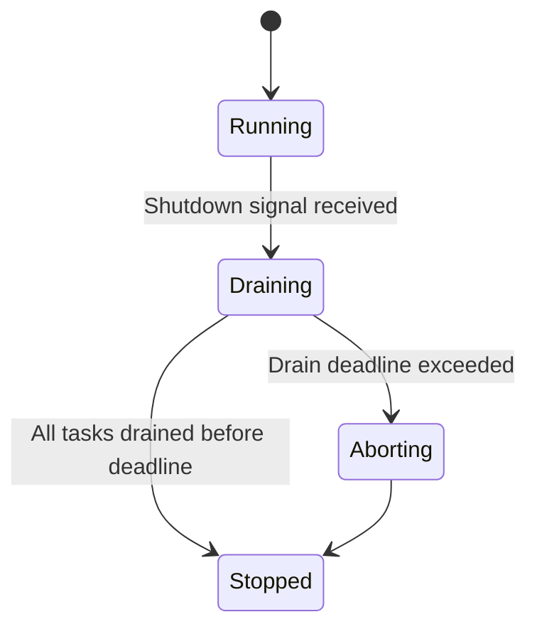
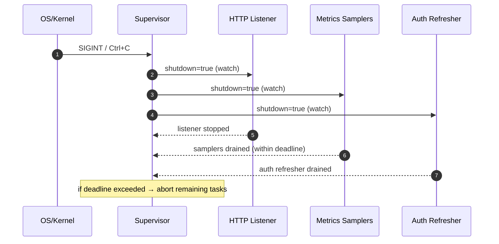

````markdown
---
title: Concurrency Model — svc-admin
crate: svc-admin
owner: Stevan White
last-reviewed: 2025-12-04
status: draft
template_version: 1.2
msrv: 1.80.0
tokio: "1.x (pinned at workspace root)"
loom: "0.7+ (dev-only)"
lite_mode: "Service crate (full model; all sections apply)"
---

# Concurrency Model — svc-admin

This document makes the concurrency rules **explicit** for `svc-admin`: Axum HTTP server,
auth middleware, metrics polling tasks, config reload, and shutdown behavior. It
complements the svc-admin IDB, `docs/CONFIG.md`, and `docs/SECURITY.md`.

> **Golden rule:** never hold a lock across `.await` in supervisory or hot paths.

---

## 0) Lite Mode

Not in lite mode. `svc-admin` is a **service crate** with:

- a long-lived HTTP server,
- auth middleware (ingress/passport or dev-only none),
- background metrics sampling tasks,
- optional config reload,
- cooperative shutdown.

All sections apply.

---

## 1) Invariants (MUST)

- [I-1] **No lock across `.await`.**  
  Shared state (config, node registry, auth/JWK cache, metrics buffers) MUST NOT hold a
  `Mutex` or `RwLock` guard across `.await`.  
  Pattern: copy/clone data out under the guard, drop the guard, then await.

- [I-2] **Single writer per mutable resource.**  
  For each mutable resource:
  - Node registry/config → written once at startup, or via a **single** config-reload task.
  - Metrics ring buffer per node → owned by a dedicated sampler task; HTTP handlers read snapshots only.
  - Auth key/JWK cache (if passport mode uses local verification) → updated by a single refresh task.
  - UI config → immutable at runtime (or updated only by a single updater).
  No two tasks may concurrently mutate the same ring buffer or auth/config struct.

- [I-3] **Bounded channels only.**  
  All internal MPSC/Broadcast channels MUST be bounded with explicit capacity, or be `watch`
  when single-slot semantics are enough:
  - No unbounded MPSC.
  - No unbounded buffering of metrics, auth updates, or work.

- [I-4] **Explicit timeouts on I/O.**  
  All outbound HTTP calls from svc-admin to nodes (healthz/readyz/status/metrics) or to
  passport/issuer endpoints (if we introspect or fetch JWKs) MUST use explicit timeouts
  derived from config.  
  Failure modes:
  - Timeout → typed error surfaced to UI or logged.
  - Connection error → typed error surfaced to UI or logged.

- [I-5] **Cooperative cancellation.**  
  Background tasks (metrics sampler, config watcher, optional auth-key refresher) MUST:
  - listen on a `watch`-style shutdown signal, and
  - use `tokio::select!` to bail out promptly when shutdown is requested.

- [I-6] **Graceful shutdown with deadline.**  
  On shutdown:
  - Stop accepting new HTTP connections.
  - Let in-flight requests and background tasks finish within a configurable deadline (e.g., 5–10s).
  - After deadline, remaining tasks MAY be aborted; this MUST be counted and logged.

- [I-7] **No blocking syscalls on async runtime.**  
  Blocking I/O (reading config files, TLS keystores, macaroons, etc.) MUST:
  - occur at startup before runtime, OR
  - use `tokio::task::spawn_blocking`.  
  No heavy `std::fs` work in hot request or auth paths.

- [I-8] **No task leaks.**  
  Every spawned background task MUST:
  - have a join handle kept in a supervisor list, OR
  - be intentionally detached with justification (e.g., Hyper/Axum internal tasks).  
  `svc-admin` MUST join tasks (or abort them) during shutdown.

- [I-9] **Backpressure over buffering.**  
  When a bounded channel is full:
  - Prefer returning a `Busy`/`429` error to the caller (for HTTP handlers using that channel),
  - or dropping the *oldest* metrics sample and incrementing a metric counter.  
  svc-admin MUST NOT grow in-memory queues without bound.

- [I-10] **HTTP-only framing.**  
  `svc-admin` MUST rely on HTTP/JSON/text (Prometheus) framing only; it MUST NOT invent
  custom binary protocols. Any parsing of `/metrics` MUST guard against malformed input,
  but there is no custom network framing beyond HTTP.

- [I-11] **Async Drop is cheap.**  
  Core structs MUST NOT perform blocking or network I/O in `Drop`.  
  Teardown logic MUST be explicit via async `shutdown()/close()` methods, called as part
  of the shutdown sequence.

---

## 2) Runtime Topology

**Runtime:**  

- `tokio` multi-threaded runtime (workspace-pinned version).
- Axum/Hyper server runs on the shared runtime with middleware layers for:
  - logging,
  - auth (ingress/passport/none),
  - JSON/metrics endpoints.

**Primary tasks/components:**

- **HTTP Listener (Axum Server)**  
  - Accepts incoming HTTP connections for:
    - SPA static assets,
    - Auth-gated admin APIs:
      - `/api/nodes`, `/api/nodes/{id}/status`,
      - `/api/nodes/{id}/metrics/summary`, `/api/nodes/{id}/metrics/facets`,
      - future mutating admin actions (reload/shutdown).
  - Criticality: high (main control surface).

- **Auth Middleware / Gate**  
  - Runs inside HTTP pipeline:
    - `auth.mode="none"`: dev-only, minimal/no checks.
    - `auth.mode="ingress"`: trusts ingress headers (`X-User`, `X-Groups`, etc.).
    - `auth.mode="passport"`: validates tokens (e.g., JWT/passport) using cached keys/JWKs.
  - Criticality: high (front door to all admin APIs).
  - Concurrency rules:
    - No blocking I/O in the hot auth path.
    - Any JWKS/key refresh happens in a separate background task or via a library’s own cache.

- **Per-node Metrics Sampler (optional, configurable)**  
  - For each configured node:
    - Periodically polls node `/metrics` endpoint under a timeout.
    - Updates a small ring buffer (short-horizon) with derived summaries.
  - Criticality: medium (charts & facets; not required for core health view).

- **Config Watcher (optional future)**  
  - Watches for `ConfigUpdated` bus event, SIGHUP, or HTTP admin reload.
  - Reloads config (node list, timeouts, UI config, auth mode, etc.) and updates shared state atomically.
  - Criticality: low/medium; can be disabled.

- **Auth Key/JWK Refresher (optional, passport mode)**  
  - When `auth.mode="passport"` and we verify tokens locally:
    - Periodically refreshes issuer keys/JWKs with a bounded timeout.
    - Updates an `AuthState` cache atomically.
  - Criticality: medium (keeps auth path fast and offline-tolerant).

- **Shutdown Supervisor**  
  - Listens for `wait_for_ctrl_c()` or equivalent signal.
  - Drives shutdown sequence (notify tasks, drain, then abort leftovers).

```mermaid
flowchart TB
  subgraph Runtime[s vc-admin Runtime]
    S[Supervisor] -->|spawn| L[HTTP Listener (Axum)]
    L --> G[Auth Gate (middleware)]
    S -->|spawn per node| M1[Metrics Sampler N1]
    S -->|spawn per node| M2[Metrics Sampler N2]
    S -->|spawn (opt)| AK[Auth Key Refresher]

    subgraph CTRL[Control]
      SHUT[Shutdown watch<bool>] --> L
      SHUT --> M1
      SHUT --> M2
      SHUT --> AK
    end
  end

  G -->|proxy admin calls| NODES[(RON Nodes)]
  M1 -->|poll /metrics| NODES
  M2 -->|poll /metrics| NODES
````

**Text description:**
Supervisor spawns an Axum HTTP listener that includes auth middleware, and a metrics sampler per node. In passport mode, an optional auth-key refresher keeps issuer keys up to date. A shutdown watch channel notifies all tasks. The listener and samplers talk to RON nodes via HTTP admin endpoints; the auth gate validates operators before requests hit the proxy layer.

---

## 3) Channels & Backpressure

`svc-admin` uses channels primarily for:

* shutdown signaling,
* optional work fan-out (if we offload heavy parsing),
* optional config reload,
* optional auth-key refresh triggers.

**Inventory (bounded unless noted):**

| Name               | Kind       | Capacity | Producers → Consumers            | Backpressure Policy                    | Drop Semantics                               |
| ------------------ | ---------- | -------: | -------------------------------- | -------------------------------------- | -------------------------------------------- |
| `shutdown_rx`      | watch      |        1 | Supervisor → N tasks             | last-write wins                        | N/A                                          |
| `metrics_cmd_tx`*  | mpsc       |      256 | HTTP handlers → samplers/workers | `try_send` → `Busy` to caller          | reject new work; increment `busy_rejections` |
| `reload_tx`*       | watch/mpsc |        1 | Signal → config task             | last-write wins / bounded if mpsc      | N/A or drop-oldest w/ metric                 |
| `auth_refresh_tx`* | mpsc       |       32 | Timer / events → auth refresher  | `try_send` → coalesce or log “skipped” | may drop redundant refresh requests          |
| `events_tx`*       | broadcast  |     1024 | Core → observers/logs            | drop-oldest; log + increment counter   | slow listeners observe lag metrics           |

* Optional; we may start without these and introduce them if/when we offload more work from HTTP handlers.

**Guidelines:**

* Prefer `watch` for 1→N *state* (shutdown flag, active config snapshot).
* Prefer **bounded `mpsc`** for discrete jobs; use `try_send` and propagate “Busy” to HTTP callers.
* Do **not** forward to unbounded channels; if backpressure hits, surface it as:

  * HTTP 429/Busy (for admin APIs), or
  * metrics-counter increments and dropped samples (for metrics/auth refresh).

---

## 4) Locks & Shared State

**Shared state types:**

* `Arc<NodeRegistry>` — mapping `node_id → NodeConfig`.
* `Arc<UiConfig>` — read-mostly, loaded at startup (themes, language, dev flags).
* `Arc<MetricsStore>` — per-node short-horizon metrics ring buffers (behind `RwLock` or internal locks).
* `Arc<AuthState>` — in passport mode, optional cache of issuer metadata / keys / JWKs and derived auth rules.

**Allowed:**

* `RwLock<NodeRegistry>` for rare write, frequent read (if dynamic reload is implemented):

  * Pattern: read locks for lookups; write locks only in reload path.
* `RwLock<MetricsStore>` or per-node `Mutex<MetricsRing>`:

  * Writers: metrics samplers only.
  * Readers: HTTP handlers constructing summaries.
* `RwLock<AuthState>` (if we manage keys/JWKs ourselves):

  * Writer: auth-key refresher task.
  * Readers: auth middleware verifying tokens.
* Snapshot pattern:

  * Acquire read lock, copy out small summary struct or key set, drop lock, then perform heavier computation or verification.

**Forbidden:**

* Holding `Mutex`/`RwLock` guards across `.await` in handlers, samplers, or auth middleware.
* Nested locks without explicit hierarchy.
* Large, long-lived critical sections around network I/O (to nodes or passport).

**Lock hierarchy (if multiple locks are taken):**

1. `config_lock` (NodeRegistry/UiConfig/AuthConfig) — rarely mutated.
2. `auth_state_lock` (AuthState/JWK cache) — infrequent writes, frequent reads in auth middleware.
3. `metrics_lock` (MetricsStore or per-node metrics buffer).
4. `ephemeral_state` (any short-lived per-request ephemeral state) — avoid cross-task locks; prefer local variables.

If multiple locks are needed in a single function, they MUST be acquired in this order and released before any `.await`.

---

## 5) Timeouts, Retries, Deadlines

**I/O to nodes:**

* Defaults (configurable via `svc-admin.toml`):

  * `read_timeout = 5s`
  * `write_timeout = 5s`
  * `connect_timeout = 2s`
  * `metrics_poll_timeout = 3s`

* Outbound HTTP calls to nodes MUST enforce a **total request timeout** encompassing connect + read:

  * On timeout: return a typed error to UI (`UpstreamTimeout`/`GatewayTimeout`).

**I/O to passport/issuer (if applicable):**

* Auth-key/JWK refresh:

  * Per-request timeout: e.g., 2–3s.
  * Backoff on failure, but **no retries in the hot auth path**:

    * verify with cached keys only; if keys are stale/unavailable, reject with auth error.

**Retries:**

* For **metrics polling**:

  * MAY retry transient network failures with jittered backoff:

    * initial backoff 100–250ms,
    * cap at 2s,
    * max 3 attempts per poll interval.

  * If all retries fail, sampler records an error and the UI shows stale/empty data with a “metrics unavailable” message.

* For **healthz/readyz/status** proxy calls:

  * Prefer **no automatic retries** inside a single HTTP handler; instead, rely on caller to retry if needed.

**Deadlines:**

* Inbound HTTP to svc-admin:

  * Rely on Axum/Hyper defaults + node call timeouts; we can add a global per-request deadline for admin APIs if needed (e.g., 5s) to prevent hung handlers.

```mermaid
sequenceDiagram
  autonumber
  participant UI as SPA
  participant A as svc-admin
  participant AUTH as Auth Gate
  participant N as Node
  UI->>A: GET /api/nodes/{id}/status (deadline=5s)
  A->>AUTH: validate operator (no blocking I/O)
  AUTH-->>A: ok / error
  alt auth ok
    A->>N: GET /readyz + /api/v1/status (timeout=3s)
    N-->>A: status/readyz or error
    A-->>UI: JSON AdminStatusView or typed error
  else auth fail
    A-->>UI: 401/403 (typed error)
  end
```

**Text description:**
SPA calls svc-admin with a 5-second deadline for a status view. svc-admin’s auth gate validates the operator without blocking network calls (using cached state). On success, svc-admin calls the node’s `/readyz` and `/api/v1/status` with a 3-second timeout. If auth fails, a 401/403 is returned; if node I/O fails, a typed upstream error is returned.

---

## 6) Cancellation & Shutdown

**Signal source:**

* OS signal: `CTRL+C` / SIGINT (via `wait_for_ctrl_c()`).
* Future: `KernelEvent::Shutdown` from `ron-kernel` bus (if integrated).

**Propagation:**

* Supervisor holds a `watch::Sender<bool>` for shutdown.
* All long-running tasks (HTTP server, metrics samplers, config watcher, auth-key refresher) hold `watch::Receiver<bool>`.
* Tasks use `tokio::select!` between:

  * node I/O / metrics sampling / auth-key refresh / Hyper server future, and
  * `shutdown_rx.changed()`.

**Draining:**

* On shutdown:

  1. Supervisor sets `shutdown = true`.
  2. Stop accepting new HTTP connections (graceful Axum shutdown).
  3. Let in-flight HTTP requests and metrics/auth-refresh loops finish up to `drain_deadline` (e.g., 5–10s).
  4. Join metrics sampling + auth refresh tasks.

* After `drain_deadline`, any still-running tasks:

  * will have their join handles `.abort()`-ed,
  * `tasks_aborted_total{kind}` metric incremented.



**Text description:**
While Running, svc-admin processes requests, enforces auth, and samples metrics. On shutdown, it enters Draining, stopping intake and waiting for tasks to finish. If they finish within the deadline, it transitions to Stopped. If not, it aborts remaining tasks then transitions to Stopped.

---

## 7) I/O & Framing

**I/O types:**

* Inbound: HTTP/1.1/HTTP/2 (via Hyper/Axum).
* Outbound:

  * HTTP calls to nodes (healthz/readyz/status/metrics).
  * Optional HTTP calls to passport/issuer endpoints (for keys/JWKs, if local verification).

**Framing:**

* JSON for admin views (`/api/...`).
* Prometheus text exposition format for `/metrics` parsing (outbound to nodes).

**Rules:**

* No custom binary framing.
* For Prometheus metrics:

  * Use robust text parsing tolerant of extra metrics and unknown lines.
  * Apply **size limits** to the `/metrics` response body (e.g., 1–4 MiB cap) to prevent memory blow-up.
* For passport/issuer responses:

  * Bound body size (e.g., JWK sets) and use structured JSON parsing with `deny_unknown_fields` where practical.

---

## 8) Error Taxonomy (Concurrency-Relevant)

| Error                  | When                                 | Retry?           | Metric                                 | Notes                                   |
| ---------------------- | ------------------------------------ | ---------------- | -------------------------------------- | --------------------------------------- |
| `Busy`                 | internal work queue full (if used)   | maybe            | `busy_rejections_total{endpoint}`      | return 429 to SPA                       |
| `UpstreamTimeout`      | node I/O exceeds timeout             | caller may retry | `io_timeouts_total{op="node_call"}`    | mark node status as degraded            |
| `UpstreamConnectError` | node unreachable / refused           | maybe            | `io_errors_total{kind="connect"}`      | degrade node; show explicit message     |
| `UpstreamParseError`   | invalid metrics / status payload     | no               | `parse_errors_total{kind}`             | leave UI minimal; log raw sample size   |
| `AuthTimeout`*         | auth-key/JWK refresh exceeds timeout | maybe (later)    | `io_timeouts_total{op="auth_refresh"}` | auth uses cached keys only; log warning |
| `AuthValidationError`  | token invalid/expired                | caller may retry | `auth_failures_total{reason}`          | return 401/403; no retry inside handler |
| `Canceled`             | shutdown during operation            | no               | `tasks_canceled_total{kind}`           | expected on graceful shutdown           |
| `Aborted`              | task aborted after drain deadline    | no               | `tasks_aborted_total{kind}`            | bug or slow node; should be rare        |

* `AuthTimeout` applies only if we run a dedicated refresh task; auth middleware should never block waiting for it.

---

## 9) Metrics (Concurrency & Auth Health)

svc-admin SHOULD export its own Prometheus metrics to track concurrency and auth health, including:

* `svc_admin_tasks_spawned_total{kind="http_listener|metrics_sampler|config_watcher|auth_refresher"}`
* `svc_admin_tasks_aborted_total{kind}`
* `svc_admin_tasks_canceled_total{kind}`
* `svc_admin_io_timeouts_total{op="node_call|metrics_poll|auth_refresh"}`
* `svc_admin_io_errors_total{kind="connect|parse|auth"}`
* `svc_admin_busy_rejections_total{endpoint}`
* `svc_admin_metrics_queue_depth{node_id}` (if we buffer metrics beyond a trivial ring)
* `svc_admin_shutdown_drains_total{result="clean|aborted"}`
* `svc_admin_auth_failures_total{reason}` (invalid token, missing header, issuer mismatch, etc.)

These metrics let operators see:

* if samplers are timing out,
* if any internal queue is shedding load,
* if shutdowns are clean or frequently aborting tasks,
* if auth is failing unusually often.

---

## 10) Validation Strategy

**Unit / Property tests:**

* Metrics parsing:

  * property tests over synthetic Prometheus inputs (random labels, unexpected metrics).
  * ensure we never panic on malformed lines; parse-or-skip.

* Timeouts:

  * tests where a fake-node sleeps beyond timeout; svc-admin must return `UpstreamTimeout`.

* Status mapping:

  * mapping from `/readyz` + `/api/v1/status` fixtures to `AdminStatusView` is deterministic and stable.

* Auth gate:

  * `auth.mode="none"`: requests pass through (dev-only).
  * `auth.mode="ingress"`: missing/invalid headers → 401/403; valid headers → pass through.
  * `auth.mode="passport"`: valid token → pass; invalid/expired/issuer mismatch → 401/403; no blocking I/O in handler (use stubbed key cache).

**Loom (dev-only, targeted):**

* Model a simplified topology:

  * 1 metrics sampler task,
  * 1 HTTP handler reading metrics summary,
  * 1 auth middleware reading from `AuthState`,
  * shared `MetricsStore` and `AuthState` under locks,
  * shutdown watch channel.

* Assert:

  * no deadlock,
  * shutdown is observed by all tasks,
  * no double-use of ring buffer or auth keys after shutdown.

**Fuzz:**

* Fuzz the metrics parser with random input including:

  * very long lines,
  * invalid UTF-8 (if reachable),
  * metrics with extremely large values.

* Fuzz token parsing/validation boundaries (if we have custom wrappers around passport libraries).

**Chaos / manual:**

* Run svc-admin against:

  * a node that randomly fails `/metrics` requests,
  * a node that occasionally hangs `/metrics` beyond timeout.

* In passport mode, simulate:

  * intermittent failures to fetch JWKs/issuer metadata,
  * expired tokens.

* Observe:

  * UI stays responsive,
  * auth errors are explicit,
  * no memory growth from unbounded buffering.

---

## 11) Code Patterns (Copy-Paste)

**Shutdown-aware metrics sampler (per node)**

```rust
//! RO:WHAT  — Periodically poll /metrics for a node and update ring buffer.
//! RO:WHY   — Provide short-horizon charts without long-term TSDB.
//! RO:INTERACTS — NodeConfig, MetricsStore, shutdown watch.
//! RO:INVARIANTS — No lock across await; bounded memory; cancel-safe.

pub async fn run_metrics_sampler(
    node: Arc<NodeConfig>,
    store: Arc<MetricsStore>,
    mut shutdown: tokio::sync::watch::Receiver<bool>,
    interval: std::time::Duration,
) {
    let client = build_reqwest_client(&node);

    loop {
        tokio::select! {
            changed = shutdown.changed() => {
                if changed.is_ok() && *shutdown.borrow() {
                    tracing::info!(node = %node.id, "metrics sampler shutting down");
                    break;
                }
            }
            _ = tokio::time::sleep(interval) => {
                if let Err(e) = poll_once(&client, &node, &store).await {
                    tracing::warn!(node = %node.id, error = %e, "metrics poll failed");
                }
            }
        }
    }
}

async fn poll_once(
    client: &reqwest::Client,
    node: &NodeConfig,
    store: &MetricsStore,
) -> anyhow::Result<()> {
    // Fetch outside of any lock.
    let body = client
        .get(format!("{}/metrics", node.base_url))
        .timeout(node.metrics_timeout)
        .send()
        .await?
        .error_for_status()?
        .text()
        .await?;

    let summary = parse_metrics_summary(&body)?;

    // Short critical section: update ring buffer.
    store.update(node.id.clone(), summary);
    Ok(())
}
```

**Bounded “work” queue with `try_send` (if used)**

```rust
pub fn enqueue_job(
    tx: &tokio::sync::mpsc::Sender<Job>,
    job: Job,
) -> Result<(), Error> {
    use tokio::sync::mpsc::error::TrySendError;

    match tx.try_send(job) {
        Ok(()) => Ok(()),
        Err(TrySendError::Full(_)) => {
            metrics::busy_rejections_total("job_queue").inc();
            Err(Error::Busy)
        }
        Err(TrySendError::Closed(_)) => Err(Error::QueueClosed),
    }
}
```

**No lock across `.await` in handler**

```rust
async fn get_node_status(
    State(app): State<AppState>,
    Path(node_id): Path<String>,
    auth: AuthContext, // e.g., injected by middleware
) -> Result<Json<AdminStatusView>, ApiError> {
    auth.require_role("admin")?; // cheap check, no blocking I/O

    let node_cfg = {
        // Short-lived read lock to find node config.
        let reg = app.node_registry.read().unwrap();
        reg.get(&node_id).cloned().ok_or(ApiError::NotFound)?
    }; // lock dropped here

    let status = fetch_status_from_node(&node_cfg).await?; // no lock held

    Ok(Json(status))
}
```

---

## 12) Configuration Hooks (Quick Reference)

Concurrency- & auth-related config keys (see full CONFIG doc for details):

* `max_conns` — limit inbound connections to svc-admin (via Axum/Hyper/server config).
* `read_timeout`, `write_timeout`, `connect_timeout` — for outbound node calls.
* `polling.metrics_interval` — cadence for metrics sampling.
* `polling.metrics_window` — effective horizon for in-memory metrics ring buffer.
* `shutdown.drain_deadline` — how long to wait for draining tasks before abort.
* `metrics.max_body_bytes` — max `/metrics` response body size accepted.
* `auth.mode` — `"none" | "ingress" | "passport"`; influences whether auth middleware is a no-op, header-checking, or token-verifying.
* `auth.*` keys — issuer, audience, passport base URL, cookie name, ingress header names; influence how frequently and where we do I/O (refresh vs inline).

These keys directly shape concurrency behavior (timeouts, task load, memory use, auth path).

---

## 13) Known Trade-offs / Nonstrict Areas

* **Metrics sampling vs on-demand fetch:**

  * We choose periodic sampling (background tasks) to keep the SPA snappy and avoid hitting nodes on every UI poll.
  * Trade-off: slight staleness vs lower per-request latency; acceptable for short-horizon ops.

* **Drop-oldest vs reject-new for metrics samples:**

  * For metrics rings, we prefer drop-oldest:

    * preserves recent history,
    * avoids rejecting sampler updates (which would freeze charts).
  * For any internal job queues (if introduced), we prefer reject-new with a `Busy` error.

* **Auth-key refresh vs inline fetch:**

  * We prefer background refresh of JWKs/issuer metadata over inline fetch in auth middleware:

    * keeps auth path low-latency,
    * tolerates issuer outages using cached keys.
  * Trade-off: brief windows where new keys are not yet picked up until next refresh.

* **Loom usage is targeted, not exhaustive:**

  * We will use Loom for specific tricky pieces (metrics store + shutdown + auth state), not for the entire crate.

* **Config reload is optional:**

  * In early versions, config may be static (loaded once at startup).
  * When reload is added, concurrency model on NodeRegistry/AuthState will need careful review.

---

## 14) Mermaid Diagrams (REQUIRED)

### 14.1 Task & Queue Topology

```mermaid
flowchart LR
  subgraph SVC[s vc-admin]
    SUP[Supervisor] -->|spawn| HTTP[HTTP Listener (Axum)]
    HTTP --> AUTH[Auth Middleware]
    SUP -->|spawn per node| MS1[Metrics Sampler N1]
    SUP -->|spawn per node| MS2[Metrics Sampler N2]
    SUP -->|spawn (opt)| AK[Auth Key Refresher]

    subgraph CTRL[Control]
      SHUT[Shutdown watch<bool>] --> HTTP
      SHUT --> MS1
      SHUT --> MS2
      SHUT --> AK
    end
  end

  AUTH -->|proxy admin calls| NODES[(RON Nodes)]
  MS1 -->|poll /metrics| NODES
  MS2 -->|poll /metrics| NODES
```

**Text description:**
Supervisor spawns an HTTP listener with auth middleware, and metrics samplers per node plus an optional auth-key refresher. Shutdown watch connects to all tasks. Auth middleware validates operators, then handlers proxy to RON nodes.

### 14.2 Shutdown Sequence



**Text description:**
The OS delivers a signal to the Supervisor, which broadcasts shutdown to the HTTP listener, metrics samplers, and auth refresher. They complete in-flight work and acknowledge. If they do not acknowledge within the deadline, the Supervisor aborts them.

---

## 15) CI & Lints (Enforcement)

**Clippy / rustc flags (crate-level expectation):**

* `-D warnings`
* `-W clippy::pedantic` (or workspace standard)
* `-D clippy::await_holding_lock`
* `-W clippy::needless_collect`
* `-W clippy::useless_async`

**Suggested GitHub Actions (or equivalent):**

```yaml
name: svc-admin-concurrency-guardrails
on: [push, pull_request]

jobs:
  clippy:
    runs-on: ubuntu-latest
    steps:
      - uses: actions/checkout@v4
      - uses: dtolnay/rust-toolchain@stable
      - run: cargo clippy -p svc-admin --all-targets --all-features -- -D warnings -W clippy::await_holding_lock

  tests:
    runs-on: ubuntu-latest
    steps:
      - uses: actions/checkout@v4
      - uses: dtolnay/rust-toolchain@stable
      - run: cargo test -p svc-admin --all-features

  loom:
    if: github.event_name == 'pull_request'
    runs-on: ubuntu-latest
    steps:
      - uses: actions/checkout@v4
      - uses: dtolnay/rust-toolchain@stable
      - run: RUSTFLAGS="--cfg loom" cargo test -p svc-admin --tests -- --ignored
```

(We can add fuzz/chaos jobs later when those targets exist.)

---

## 16) Schema Generation (Optional, Nice-to-Have)

For now, the **Channels & Locks tables are hand-maintained**.

Future nice-to-have:

* Annotate channels/locks with small macros (e.g., `#[doc_channel(...)]`) and:

  * generate a `docs/_generated/svc-admin-concurrency.mdfrag` in `build.rs`, or
  * run a small dev-only tool that checks the doc table against a registry.

---

## 17) Review & Maintenance

* **Review cadence:**

  * Revisit this file on:

    * introduction of new background tasks,
    * changes to metrics sampling strategy,
    * addition of config reload,
    * introduction of new auth modes or auth backends,
    * or major refactors to HTTP handler structure.
  * At least once per quarter while svc-admin is in active development.

* **PR checklist:**
  Any PR that:

  * adds/removes background tasks,
  * changes channel capacities or types,
  * modifies shutdown or auth behavior,

  MUST:

  * update this file, and
  * add/adjust tests (unit/property/loom) accordingly.

```
```
