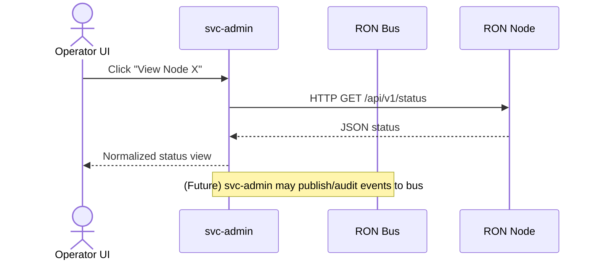
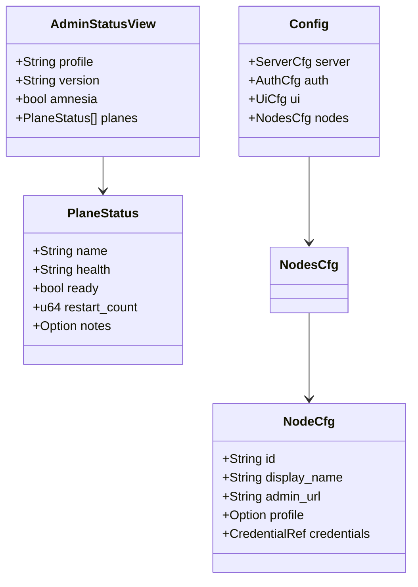
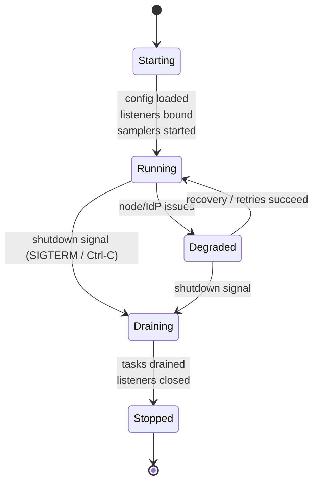

````md
# svc-admin

> **Role:** Admin-plane GUI + HTTP/JSON proxy for RON-CORE nodes  
> **Owner:** Stevan White / RustyOnions  
> **Status:** draft (pre-0.1.0, developer preview target)  
> **MSRV:** 1.80.0 (Tokio / loom compatible)  
> **Last reviewed:** 2025-12-04

Badges (future):  
[]() []() []() []()

---

## 1) Overview

**What it is (one paragraph):**  
`svc-admin` is the **admin-plane service** for RON-CORE: a Rust/Axum HTTP server that serves an operator **SPA dashboard** and a small JSON API for node health, readiness, and metrics. It talks **only** to documented node admin HTTP endpoints (`/healthz`, `/readyz`, `/version`, `/metrics`, `/api/v1/status`, and future `/api/v1/reload` / `/api/v1/shutdown`) and never to data-plane or shell interfaces. It is **read-mostly by default**: destructive actions are opt-in, heavily gated, and fully audited. `svc-admin` gives operators “eyes and limited hands” on RON nodes without becoming an orchestrator or control-plane of its own.

**How it fits (RustyOnions topology):**  

- **Pillar:** Admin Plane & Observability (visibility + bounded operator actions)  
- **Upstream callers:**
  - Operator browsers (SPA over HTTPS)
  - Monitoring systems hitting `/healthz`, `/readyz`, `/metrics`
  - Optional CLI tools / scripts that call the same JSON API as the SPA
- **Downstream deps:**
  - RON-CORE nodes (`macronode`, `micronode`, etc.) over HTTP(S) admin endpoints
  - Optional identity / passport provider (`svc-passport`, OIDC IdP, or ingress auth)
  - Prometheus / log shipping stack (metrics and structured logs)
- **Data it touches:**
  - In-memory config/state, node registry, short-window metrics buffers
  - Network calls to nodes and IdP
  - Disk reads for config files and TLS keys/macaroons (mounted as secrets)
- **Security boundary:**
  - Sits in **ops/admin trust zone**, never exposed to the public Internet unprotected
  - Treats node macaroons/tokens as **root-equivalent** for those nodes
  - No economic state, no customer data; only node health/metrics and operator actions

### 1.1 High-Level Architecture (Mermaid)

```mermaid
flowchart LR
  subgraph Operators & Monitoring
    UIB[Browser (Operator SPA)]
    MON[Monitors / Probes]
  end

  subgraph AdminPlane["Admin Plane"]
    A[svc-admin<br/>Axum HTTP + SPA]
  end

  subgraph Nodes["RON-CORE Nodes"]
    N1[macronode]
    N2[micronode]
    N3[other RON nodes]
  end

  subgraph Observability
    PM[[Prometheus]]
    LOG[[Log / Trace Sink]]
  end

  UIB -->|HTTPS + JSON| A
  MON -->|/healthz /readyz /metrics| A

  A -->|HTTP(S) admin endpoints<br/>(/healthz /readyz /version /metrics /api/v1/status)| N1
  A -->|same| N2
  A -->|same| N3

  A -->|/metrics| PM
  A -->|structured logs / spans| LOG

  style A fill:#0b7285,stroke:#083344,color:#fff
````

---

## 2) Responsibilities & Boundaries

**MUST do (core responsibilities):**

* [ ] Serve the **operator dashboard SPA** and a small JSON API for node health, readiness, and metrics.
* [ ] Proxy **read-only** admin-plane calls to RON nodes (`/healthz`, `/readyz`, `/version`, `/metrics`, `/api/v1/status`).
* [ ] Maintain **truthful readiness views**: never mark a node or plane ready if `/readyz` disagrees.
* [ ] Expose **short-horizon metrics** only (in-memory windows) for operators and SLOs.
* [ ] Enforce **auth modes** (`none` / `ingress` / `passport`) and role-based gates for any mutating actions.
* [ ] Emit structured, attributable **audit logs** for all operator-visible actions.

**MUST NOT do (anti-scope / boundaries):**

* [ ] MUST NOT become a general-purpose **orchestrator** (no scheduling, rebalancing, autoscaling decisions).
* [ ] MUST NOT implement or embed a **time-series DB** or long-term metrics storage.
* [ ] MUST NOT provide any **remote shell**, script execution, or hidden “ops-only” endpoints.
* [ ] MUST NOT override node-reported **health/readiness** with its own shadow model.
* [ ] MUST NOT store node credentials (macaroons/tokens) in cleartext logs or unencrypted dumps.
* [ ] MUST NOT implement its own user database / identity system; integrates with passport/IdP instead.
* [ ] MUST NOT manipulate **economic state** (balances, rewards, billing, quotas).

**Acceptance Gates (PROOF you did it):**

* [ ] Unit/property tests proving:

  * config parsing defaults (`ui.read_only`, `auth.mode`, node registry),
  * invariants around truthful readiness and short-horizon metrics.
* [ ] Integration tests (fake nodes) covering:

  * node up/down/partial failure,
  * malformed `/metrics` or `/api/v1/status` payloads,
  * passport/IdP outages and degraded auth behavior.
* [ ] `/healthz` and `/readyz` endpoints reflect **real internal state** (listeners bound, config loaded, samplers running).
* [ ] Prometheus metrics exposed for:

  * HTTP latency, errors, fan-out to nodes, auth failures, operator actions.
* [ ] Benchmarks and/or chaos tests demonstrating:

  * stable P99 latency under target load,
  * no crashes or leaks when nodes are slow or unavailable.

---

## 3) Public Interfaces

`svc-admin` is primarily a **service crate**. Its public surface is:

* The `svc-admin` **binary / CLI**.
* The **HTTP/JSON** API consumed by the SPA and external tools.
* A small Rust library surface for config/DTOs and server bootstrap.

### 3.1 Rust API (library)

Key modules/types (illustrative; keep in sync with `cargo public-api`):

* `pub mod config` — configuration loading (`svc-admin.toml`, env overrides, CLI args).
* `pub mod dto` — DTOs for node status, UI config, metrics summaries.
* `pub mod server` — server bootstrap, Axum router, readiness wiring.
* `pub mod error` — crate-wide error type.

Important types:

* `struct Config` — full runtime configuration (bind addresses, nodes, auth, UI, TLS).
* `struct UiCfg` — UI/SPA-related config (read-only mode, feature flags).
* `struct AuthCfg` — auth mode and passport/IdP integration.
* `struct NodeCfg` / `NodesCfg` — mapping of logical node IDs to admin endpoints + creds.
* `struct AdminStatusView` — normalized view of a node’s health/ready/planes.
* `struct PlaneStatus` — per-plane health readiness (gateway, overlay, storage, facets…).

Typical usage (tests / harnesses):

```rust
use svc_admin::config::load_config_from_env_and_args;
use svc_admin::server::run_server;

#[tokio::main]
async fn main() -> anyhow::Result<()> {
    let cfg = load_config_from_env_and_args()?;
    run_server(cfg).await?;
    Ok(())
}
```

### 3.2 Bus RPC / Events (service)

As of the initial releases:

* **RPC over bus:** none (reserved for future config/audit integration).
* **Events Emitted:** none directly; instead, audit information flows via structured logs and metrics.
* **Subscribed Topics:** none; all node interaction is via HTTP admin endpoints.

If/when bus integration is added, it should follow:



### 3.3 HTTP / JSON (service)

**Base URL:** `http://<host>:<port>/` (typically `5300` for UI, `5310` for metrics/health or same port behind a router).

Core endpoints (0.1.0 target):

* **UI / static:**

  * `GET /` → SPA index (HTML)
  * `GET /assets/*` → JS/CSS bundles

* **Admin-plane API (JSON):**

  * `GET /api/ui-config`
    → UI configuration (feature flags, read-only mode, theme, environment labels).

  * `GET /api/me`
    → Current operator identity/roles as seen by `svc-admin` (from headers/token).

  * `GET /api/nodes`
    → List of configured nodes, minimal details (id, name, profile, tags).

  * `GET /api/nodes/{id}/status`
    → `AdminStatusView` for a single node, derived from `/healthz`, `/readyz`, `/version`, `/api/v1/status`.

  * `GET /api/nodes/{id}/metrics/summary`
    → Short-window metrics summary for the node (RPS, error rates, p95/99, per-plane health).

  * `GET /api/nodes/{id}/metrics/facets`
    → Metrics grouped by facet label / `ron_facet_*` prefixes.

* **Self-health & metrics:**

  * `GET /healthz` → `200 OK` when process is alive.
  * `GET /readyz` → `200 OK` only once config loaded, listeners bound, samplers/auth ready.
  * `GET /metrics` → Prometheus text for `svc-admin` itself (and optional embedded node summaries).

Mutating endpoints (future / gated):

* `POST /api/nodes/{id}/reload` — when enabled, triggers node reload (behind config + role + confirmation).
* `POST /api/nodes/{id}/shutdown` — same for shutdown; disabled by default and heavily gated.

### 3.4 CLI (binary/tool)

**Usage:**

```bash
cargo run -p svc-admin -- --config ./configs/svc-admin.dev.toml
```

Common flags:

* `--config <path>` — path to `svc-admin.toml` (primary config file).
* `--bind <addr>` — override HTTP bind address (e.g., `0.0.0.0:5300`).
* `--metrics-bind <addr>` — override metrics/health bind (or share with main bind).
* `--log-level <level>` — tracing level (`error`, `warn`, `info`, `debug`, `trace`).

(Env vars can override these; see Configuration.)

---

## 4) Configuration

> Full schema: `docs/CONFIG.MD`. Below are the main knobs you’ll touch day-to-day.

| Variable                 | Type   | Default          | Description                            |
| ------------------------ | ------ | ---------------- | -------------------------------------- |
| `SVC_ADMIN_CONFIG`       | path   | none (required)  | Path to `svc-admin.toml`               |
| `SVC_ADMIN_BIND_ADDR`    | socket | `127.0.0.1:5300` | UI + API bind address                  |
| `SVC_ADMIN_METRICS_ADDR` | socket | `127.0.0.1:5310` | `/healthz`, `/readyz`, `/metrics` bind |
| `SVC_ADMIN_AUTH_MODE`    | enum   | `none` (dev)     | `none` | `ingress` | `passport`        |
| `SVC_ADMIN_LOG_LEVEL`    | string | `info`           | Global log level                       |
| `SVC_ADMIN_NODES_FILE`   | path   | from config      | Optional separate node registry file   |
| `SVC_ADMIN_TLS_CERT`     | path   | unset            | TLS cert path (if TLS enabled)         |
| `SVC_ADMIN_TLS_KEY`      | path   | unset            | TLS private key path                   |

**Core config sections (toml):**

* `[server]` — bind addresses, timeouts, max connections, graceful shutdown.
* `[auth]` — `mode = "none" | "ingress" | "passport"`, IdP endpoints, JWKS caching.
* `[ui]` — `read_only`, feature flags (e.g., `enable_actions`, `enable_app_playground`).
* `[nodes]` — maps logical node IDs to admin URLs and credential references.
* `[tls]` — TLS enablement and cert/key paths if serving HTTPS directly.

**Feature flags (Cargo):**

* `default = ["axum", "tokio", "serde"]`
* `tls` — enable TLS via `tokio_rustls::rustls::ServerConfig`.
* `otel` — optional OpenTelemetry exporters.
* `passport` — optional built-in passport validation (vs. trusting ingress).

---

## 5) Build, Run, Test

**Build**

```bash
cargo build -p svc-admin
```

**Run (dev)**

```bash
RUST_LOG=info \
SVC_ADMIN_CONFIG=./configs/svc-admin.dev.toml \
cargo run -p svc-admin -- --config ./configs/svc-admin.dev.toml
```

**Run (example prod-style)**

```bash
/usr/local/bin/svc-admin --config /etc/ron/svc-admin.toml
```

**Tests (unit, integration, doc)**

```bash
# All tests
cargo test -p svc-admin --all-features

# Doc tests
cargo test -p svc-admin --doc
```

**Lint & format**

```bash
cargo fmt --all
cargo clippy -p svc-admin --all-features -- -D warnings
```

**Security & deps**

```bash
cargo deny check
```

**Bench / perf (if provided)**

```bash
cargo bench -p svc-admin
```

---

## 6) Observability

**Endpoints (service):**

* `GET /metrics` — Prometheus exposition for `svc-admin` itself.
* `GET /healthz` — liveness, light-weight (no node fan-out).
* `GET /readyz` — readiness, reflects:

  * config loaded and validated,
  * listeners bound,
  * auth initialized (in `ingress`/`passport` modes),
  * metrics sampler tasks started.

**Canonical Metrics**

Prometheus-style metrics (illustrative):

* `http_requests_total{service="svc-admin",route,method,status}` — request counter.
* `http_request_duration_seconds{service="svc-admin",route,method}` — request latency histogram.
* `svc_admin_node_fanout_latency_seconds{node_id,kind}` — node admin-call latency.
* `svc_admin_node_fanout_errors_total{node_id,kind}` — errors talking to node admin endpoints.
* `svc_admin_admin_actions_total{action,result}` — reload/shutdown actions (when enabled).
* `svc_admin_auth_failures_total{reason}` — auth/authorization failures.
* `bus_lagged_total{service="svc-admin"}` — if bus integration added later.
* `service_restarts_total{service="svc-admin"}` — tracked by supervisor / process manager.

**Tracing**

* Suggested targets: `svc_admin=info,axum=warn,tower_http=warn`.
* Span fields:

  * `request_id` / `corr_id`
  * `peer_addr`
  * `route`, `method`, `status`
  * `node_id` (for fan-out)
  * `subject`, `roles` (for admin actions)

---

## 7) Performance & SLOs

| Metric         | Target       | Notes                                              |
| -------------- | ------------ | -------------------------------------------------- |
| P50 latency    | ≤ 10 ms      | for `/api/*` under nominal cluster load            |
| P95 latency    | ≤ 50 ms      | including single-node fan-out                      |
| P99 latency    | ≤ 150 ms     | with moderate node count and healthy network       |
| Start-to-ready | ≤ 2–3 s      | from process start to `/readyz` = OK               |
| Max node count | 50–200 nodes | per instance (tunable; depends on polling cadence) |

> When you publish real numbers, document **how to reproduce** them:
> machine profile, node count, polling interval, dataset, flags, and load generator.

---

## 8) Data & Schema

**Data model (summary):**

* No persistent TSDB; node metrics are stored in **short-lived in-memory buffers** per node.
* Config is loaded from `svc-admin.toml` (and optionally an external `nodes` file) into `Config` / `NodesCfg`.
* DTOs are versioned via SemVer rules, not stored at rest.



**Migrations**

* Config changes:

  * Additive keys are preferred; deprecations should be supported for ≥ 1 minor release with log warnings.
* JSON schema changes:

  * Add only optional fields for minor versions.
  * Breaking changes → major bump and explicit docs in `API.md` + `CHANGELOG.md`.

---

## 9) Security & Privacy

* **Threat model (high level):**

  * Attacker attempts to:

    * gain access to `svc-admin` and issue dangerous admin actions,
    * scrape node topology/metrics,
    * abuse `/metrics` or status endpoints for reconnaissance,
    * exploit auth/IdP outages or misconfigurations.
* **Key handling:**

  * Uses TLS via `tokio_rustls::rustls::ServerConfig` when serving HTTPS.
  * Node macaroons/tokens loaded from files or secret mounts; **never logged**.
  * Config and creds should live in secrets/locked-down volumes, not world-readable.
* **PII:**

  * None by design; `svc-admin` deals with node health, not user data.
  * Auth tokens are handled as opaque blobs; minimal decoding for roles/subject.
* **AuthN/Z:**

  * `auth.mode = "none"` — dev-only; no authentication.
  * `auth.mode = "ingress"` — trusts headers set by reverse proxy / ingress (SSO/IdP).
  * `auth.mode = "passport"` — validates passports/tokens directly (JWKS, OIDC).
  * Role checks gate dangerous actions (reload/shutdown) and certain views.
* **Input validation:**

  * Request body caps (~1 MiB), compressed `/metrics` caps.
  * Timeouts for calls to nodes and IdP; fail-safe on timeout.
  * Strict JSON parsing for node status; never crash on malformed data.
* **Supply chain:**

  * Pinned workspace dependencies; `cargo deny` clean.
  * `unsafe` forbidden in Rust backend.

---

## 10) Error Taxonomy

(Concrete enums will live in `error` module; this is the conceptual taxonomy.)

| Code/Variant                     | When it happens                             | User hint                                     | Retries          |
| -------------------------------- | ------------------------------------------- | --------------------------------------------- | ---------------- |
| `ConfigError::MissingConfig`     | `svc-admin.toml` not found / unreadable     | Check `SVC_ADMIN_CONFIG` and file permissions | no               |
| `ConfigError::InvalidValue`      | bad TOML / invalid `auth.mode`              | Fix config and restart                        | no               |
| `UpstreamError::NodeUnavailable` | node admin endpoint unreachable             | Node down or network issue                    | yes, backoff     |
| `UpstreamError::Timeout`         | node/IdP call exceeded timeout              | Check node or IdP health; tune timeouts       | yes, jittered    |
| `UpstreamError::MalformedStatus` | node `/api/v1/status` JSON malformed        | Node misbehaving; check node logs/version     | maybe            |
| `AuthError::Unauthenticated`     | no credentials in `ingress`/`passport` mode | Login or check ingress/IdP configuration      | no               |
| `AuthError::Forbidden`           | roles not sufficient for requested action   | Contact admin for role updates                | no               |
| `ActionError::NotEnabled`        | reload/shutdown when actions disabled       | Enable via config (with review) if intended   | no               |
| `StateError::NotReady`           | `/readyz` before samplers/auth fully ready  | Wait for readiness; investigate if prolonged  | yes, after delay |

---

## 11) Concurrency Model

* **Runtime:** `tokio` (1.x), multi-threaded runtime (service crate).
* **I/O:** All admin-plane calls via async HTTP client with explicit timeouts.
* **Background tasks:**

  * Metrics sampler: polls node `/metrics` and status at configured intervals into ring buffers.
  * Optional auth/JWKS refresher in `passport` mode.
  * Config reload watcher (if enabled).
* **Shared state:**

  * Node registry and metrics buffers are accessed via `Arc` + lock types (`Mutex`/`RwLock`), **never held across `.await`**.
  * Single-writer discipline per mutable resource (per-node metrics ring buffer, auth cache).
* **Shutdown:**

  * Cooperatively drains: stop accepting new requests, stop samplers, then shut down HTTP.



---

## 12) Compatibility & Requirements

* **Rust:** MSRV 1.80.0.
* **OS:** Linux x86_64, macOS (for dev); containerized deployments supported.
* **TLS:** `tokio-rustls` 0.26.x.
* **HTTP:** `axum` 0.7.x, `tower-http` 0.6.x.
* **Nodes:** expects RON-CORE admin-plane v1:

  * `/healthz`, `/readyz`, `/version`, `/metrics`, `/api/v1/status`.

---

## 13) Examples

Minimal example (dev run + curl):

```bash
RUST_LOG=info \
SVC_ADMIN_CONFIG=./configs/svc-admin.dev.toml \
cargo run -p svc-admin -- --config ./configs/svc-admin.dev.toml
```

Check health & readiness:

```bash
curl -sS http://127.0.0.1:5310/healthz
curl -sS http://127.0.0.1:5310/readyz | jq .
```

List nodes (JSON):

```bash
curl -sS http://127.0.0.1:5300/api/nodes | jq .
```

Fetch node status:

```bash
curl -sS http://127.0.0.1:5300/api/nodes/macronode-1/status | jq .
```

---

## 14) Troubleshooting

* **Port already in use**

  * Symptom: bind error at startup.
  * Fix: change `SVC_ADMIN_BIND_ADDR` / `SVC_ADMIN_METRICS_ADDR`, or stop conflicting process.

* **`/readyz` stays non-ready**

  * Check logs for:

    * config parse errors,
    * node registry loading issues,
    * auth initialization failures,
    * sampler task startup errors.
  * Validate that `svc-admin.toml` paths and node URLs are reachable.

* **Node shows “unknown” or “degraded”**

  * Call node endpoints manually:

    * `curl` node `/healthz`, `/readyz`, `/metrics`, `/api/v1/status`.
  * If node is misbehaving, fix node first; `svc-admin` reflects what node reports.

* **TLS errors**

  * Ensure cert/key paths and formats match `tokio_rustls` expectations.
  * Verify that reverse proxy (if any) is configured correctly.

* **High latency in UI**

  * Check:

    * node count and polling interval,
    * CPU saturation,
    * timeouts,
    * log verbosity (`RUST_LOG=trace` in prod is rarely a good idea).

---

## 15) Development Notes

**Project conventions (RustyOnions):**

* Axum handlers return types convertible with `.into_response()`.
* No `unsafe` in the Rust backend.
* `svc-admin` library surface is intentionally small; most modules are internal.
* `/healthz` should be dependency-light; `/readyz` can be stricter.
* Node interaction is **HTTP-only** on admin endpoints, never OAP/1 or shell.

**Pre-commit quickcheck**

```bash
cargo fmt --all
cargo clippy --all-features -- -D warnings
cargo test -p svc-admin --all-features
cargo deny check
```

---

## 16) Mermaid Diagrams — Policy

This README includes:

1. **Architecture** diagram (1.1).
2. **Sequence** diagram (3.2, conceptual) for node status lookups.
3. **State** diagram (11) for lifecycle / degraded states.

To regenerate SVGs for docs (optional):

```bash
npm i -g @mermaid-js/mermaid-cli
mmdc -i docs/arch.mmd -o docs/arch.svg
mmdc -i docs/sequence.mmd -o docs/sequence.svg
mmdc -i docs/state.mmd -o docs/state.svg
```

---

## 17) Roadmap & TODO

* [ ] **Milestone 0.1.0 — Read-only Admin Console**

  * Implement core config parsing and node registry.
  * Implement `/`, `/assets/*`, `/healthz`, `/readyz`, `/metrics`.
  * Implement `/api/ui-config`, `/api/me`, `/api/nodes`, `/api/nodes/{id}/status`.
  * Implement metrics samplers + short-window summaries.

* [ ] **Milestone 0.2.0 — Gated Actions & Passport Mode**

  * Implement `auth.mode="passport"` with JWKS caching and role extraction.
  * Add gated `reload` / `shutdown` actions (config + role + confirmation).
  * Full audit logging for operator actions.

* [ ] **Milestone 0.3.x — Hardening & Scaling**

  * Tune polling, batching, and node fan-out strategy.
  * Add chaos tests and more exhaustive benches.
  * Finalize SLOs and alerting recommendations.

* [ ] **Hardening tasks**

  * Fuzz node status and metrics parsers.
  * Loom tests for concurrency around samplers and shutdown.
  * Additional guards for config changes and dangerous features.

---

## 18) Changelog

See [CHANGELOG.md](./CHANGELOG.md). Follow SemVer:

* `0.y.z` — pre-1.0; still avoid breaking HTTP/JSON contracts without strong reason.
* Breaking changes to HTTP/JSON, config, or auth semantics → major bump (or at least clearly documented and coordinated).

---

## 19) License

Dual-licensed under **MIT** and **Apache-2.0**:

* [LICENSE-MIT](../LICENSE-MIT)
* [LICENSE-APACHE](../LICENSE-APACHE)

---

## 20) Contributing

PRs welcome!

Before sending a PR:

* Run `cargo fmt`, `cargo clippy`, `cargo test`, and `cargo deny check`.
* Update docs (`API.md`, `CONFIG.MD`, `SECURITY.MD`, `OBSERVABILITY.MD`) if topology or surface changes.
* Update Mermaid diagrams under `docs/*.mmd` if flows or states change.
* For API-affecting changes, update `CHANGELOG.md` and `docs/API.MD`.

See `docs/IDB.md` (Invariant-Driven Blueprint) and the rest of the `docs/*.MD` set for deeper background on `svc-admin`’s role and invariants.

```
```
