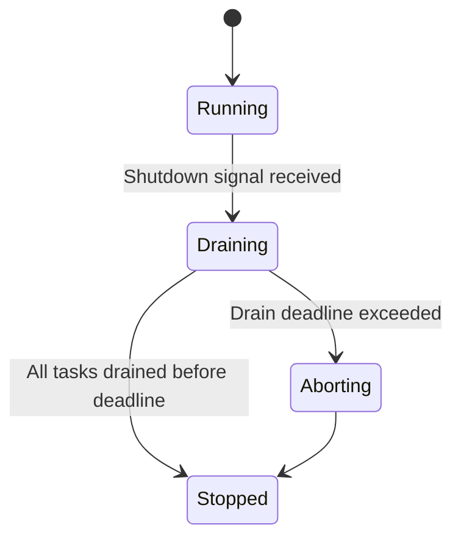
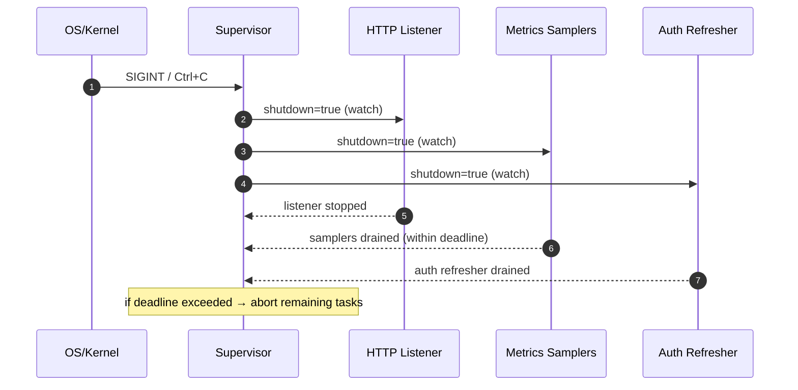

# Combined Markdown

_Source directory_: `crates/svc-admin/docs`  
_Files combined_: 12  
_Recursive_: 0

---

### Table of Contents

- API.MD
- CONCURRENCY.MD
- CONFIG.MD
- GOVERNANCE.MD
- IDB.md
- INTEROP.MD
- OBSERVABILITY.MD
- PERFORMANCE.MD
- QUANTUM.MD
- RUNBOOK.MD
- SECURITY.MD
- TESTS.MD

---

## API.MD
_File 1 of 12_


````md
---
title: API Surface & SemVer Reference — svc-admin
status: draft
msrv: 1.80.0
last-updated: 2025-12-04
audience: contributors, auditors, API consumers
---

# API.md — svc-admin

## 0. Purpose

This document captures the **public API surface** of `svc-admin`:

- Snapshot of exported **Rust types** (for internal integration / tests).
- Description of the **HTTP/JSON surface** that the SPA and external tools call.
- CLI flags and config keys that shape runtime behavior.
- SemVer discipline for what counts as a breaking vs. additive change.
- Alignment with `CHANGELOG.md`, `IDB.md`, `CONFIG.MD`, and `SECURITY.MD`. :contentReference[oaicite:0]{index=0}

`svc-admin` is primarily a **service crate**:

- The **canonical public API** is:
  - its **CLI** (`svc-admin` binary),
  - its **HTTP endpoints** (`/`, `/api/...`, `/healthz`, `/readyz`, `/metrics`),
  - the **JSON shapes** used by the React SPA and any external admin tooling.
- The Rust library surface exists mainly to support:
  - composition in tests and harnesses (fake-node / multi-node),
  - reuse of DTOs and config parsing.

---

## 1. Public API Surface

### 1.1 Rust API Surface (planned / enforced)

The intention is that `svc-admin` exposes a **small, well-defined library surface** for configuration, DTOs, and server bootstrap. Everything else is internal.

Expected `cargo public-api --simplified` snapshot (illustrative; keep this in sync with real output once the crate is implemented):

```text
# Root

pub mod config
pub mod dto
pub mod server
pub mod error

# config

pub struct Config
pub struct UiCfg
pub struct AuthCfg
pub struct NodeCfg
pub struct NodesCfg
pub fn load_config_from_env_and_args() -> Result<Config, error::Error>

# dto

/// Projection of a node's admin status as seen by svc-admin.
pub struct AdminStatusView {
    pub profile: String,          // "macronode" | "micronode" | etc.
    pub version: String,          // node semantic version
    pub planes: Vec<PlaneStatus>, // per-plane health/ready info
    pub amnesia: bool,
}

pub struct PlaneStatus {
    pub name: String,             // "gateway", "overlay", "kv", "facets", ...
    pub health: String,           // "ok" | "fail" | "unknown"
    pub ready: bool,
    pub restart_count: u64,
    pub notes: Option<String>,
}

pub struct UiConfigDto {
    pub default_theme: String,        // "system" | "light" | "dark" | "red-eye"
    pub available_themes: Vec<String>,
    pub default_language: String,     // "en-US", "es-ES", ...
    pub available_languages: Vec<String>,
    pub read_only: bool,
}

pub struct MeResponse {
    pub subject: String,              // user id / principal
    pub display_name: Option<String>,
    pub roles: Vec<String>,           // "viewer" | "admin" | ...
    pub auth_mode: String,            // "none" | "ingress" | "passport"
    pub login_url: Option<String>,    // present on 401 in passport mode
}

pub struct NodeSummary {
    pub id: String,
    pub display_name: String,
    pub environment: String,          // "dev" | "staging" | "prod" | ...
    pub amnesia: bool,
}

pub struct MetricsSummaryDto { /* short-window counters / histograms */ }
pub struct FacetMetricsDto   { /* grouped per-facet summaries        */ }

# server

pub struct AppState { /* shared state (Config, clients, caches) */ }

pub async fn build_router(state: AppState) -> axum::Router;
pub async fn run(config: Config) -> Result<(), error::Error>;

# error

pub enum Error {
    Config(ConfigError),
    Io(std::io::Error),
    Http(reqwest::Error),
    Auth(AuthError),
    Upstream(UpstreamError),
    // #[non_exhaustive] planned for 0.2.0+
}

pub type Result<T> = std::result::Result<T, Error>;
````

Notes:

* `AdminStatusView` and `PlaneStatus` exactly reflect the IDB DTOs and are used as the **canonical normalized status view**. 
* DTO modules should be `serde`-driven and used for both Rust and JSON, with `#[serde(deny_unknown_fields)]` where appropriate to catch schema drift. 
* `server::run` is the main entrypoint for the binary; the actual `bin/svc-admin.rs` should be a thin wrapper that calls this.

**Discipline:** anything that is **not** explicitly listed here should be treated as **internal** (subject to change without SemVer guarantees), even if it happens to be `pub` for crate-internal reasons.

### 1.2 CLI Surface

The `svc-admin` binary exposes a small set of stable CLI flags that map to the config schema in `CONFIG.MD`. 

Current / planned flags:

* `svc-admin --help`
* `svc-admin --version`
* `svc-admin --config <PATH>` — override default `svc-admin.toml` path.
* `svc-admin --bind-addr <ADDR:PORT>` — override `bind_addr` in config (optional; may remain experimental).
* `svc-admin --metrics-addr <ADDR:PORT>` — override `metrics_addr` in config (optional).
* `svc-admin --log-level <LEVEL>` — override `log.level` (`error|warn|info|debug|trace`).

These are considered **public API** once documented and relied upon by deployment scripts.

Env vars:

* All env vars documented in `CONFIG.MD` (`SVC_ADMIN_*`) are part of the **configuration API surface** and must be treated as such (additive-only changes, deprecate before removal). 

### 1.3 HTTP / JSON API Surface

This is the **primary API** for consumers (the SPA, CLI tools, scripts, future plugins). It is divided into:

* **Service health / metrics:**

  * `GET /healthz`
  * `GET /readyz`
  * `GET /metrics`

* **SPA & static assets:**

  * `GET /` → SPA index.
  * `GET /assets/*` → static JS/CSS/assets (when embedded).

* **Admin JSON API (svc-admin-local):**

  | Method | Path                              | Description                                                  |
  | ------ | --------------------------------- | ------------------------------------------------------------ |
  | GET    | `/api/ui-config`                  | Returns `UiConfigDto` with theme, language, read-only flags. |
  | GET    | `/api/me`                         | Returns `MeResponse` describing the current operator.        |
  | GET    | `/api/nodes`                      | List `NodeSummary` from config.                              |
  | GET    | `/api/nodes/{id}/status`          | Returns `AdminStatusView` for a node.                        |
  | GET    | `/api/nodes/{id}/metrics/summary` | Returns `MetricsSummaryDto` (short-window, aggregated).      |
  | GET    | `/api/nodes/{id}/metrics/facets`  | Returns `FacetMetricsDto` grouped by facet.                  |

* **Future / controlled mutating endpoints (feature-gated):** 

  | Method | Path                       | Description                       | Status         |
  | ------ | -------------------------- | --------------------------------- | -------------- |
  | POST   | `/api/nodes/{id}/reload`   | Ask node to reload its config.    | future / gated |
  | POST   | `/api/nodes/{id}/shutdown` | Ask node to shut down gracefully. | future / gated |

  These map to node admin endpoints (`/api/v1/reload`, `/api/v1/shutdown`) and MUST remain behind **config + auth + audit** gates.

#### 1.3.1 JSON shapes (sketch)

* `GET /api/ui-config` → `UiConfigDto`:

  ```json
  {
    "defaultTheme": "system",
    "availableThemes": ["system", "light", "dark", "red-eye"],
    "defaultLanguage": "en-US",
    "availableLanguages": ["en-US"],
    "readOnly": true
  }
  ```

  Backed by `ui.*` and `ui.dev.*` config. 

* `GET /api/me` → `MeResponse`:

  ```json
  {
    "subject": "stevan@example.com",
    "displayName": "Stevan White",
    "roles": ["admin"],
    "authMode": "passport",
    "loginUrl": null
  }
  ```

  * In `auth.mode="none"`, returns a synthetic dev identity. 
  * In `auth.mode="passport"`, 401 responses MAY include `{"loginUrl": "https://passport.local/login?..."}`
    to drive SPA sign-in. 

* `GET /api/nodes` → `NodeSummary[]`:

  ```json
  [
    {
      "id": "macronode-dev",
      "displayName": "macronode-dev",
      "environment": "dev",
      "amnesia": false
    }
  ]
  ```

  Derived from `[nodes.*]` config entries and amnesia flags observed via `AdminStatusView`. 

* `GET /api/nodes/{id}/status` → `AdminStatusView`:

  ```json
  {
    "profile": "macronode",
    "version": "0.1.0",
    "planes": [
      {
        "name": "gateway",
        "health": "ok",
        "ready": true,
        "restartCount": 0,
        "notes": null
      }
    ],
    "amnesia": false
  }
  ```

  The mapping from `/readyz` + `/api/v1/status` payloads into this normalized view is part of the **contract** and covered by tests. 

* `GET /api/nodes/{id}/metrics/summary` and `/metrics/facets`:

  * Both return *short-window* summaries only, not raw Prometheus text or time-series DBs.
  * `summary` focuses on per-plane health (RPS, error rates, p95s).
  * `facets` groups metrics by facet label or `ron_facet_*` prefix. 

Exactly serialization details will be documented in `docs/openapi/svc-admin.yaml` once the paths are implemented; this `API.md` is the human-readable overview.

---

## 2. SemVer Discipline

### 2.1 Additive (Minor / Non-Breaking)

For `svc-admin`, the following are considered **additive, non-breaking** changes (minor version bump):

* Adding new **HTTP endpoints**, as long as existing endpoints’ semantics are unchanged.
* Adding new **optional JSON fields** to existing responses (must be `Option<>` / nullable in DTOs).
* Adding new **DTO types** or new variants to `Error` marked as `#[non_exhaustive]`.
* Adding new **metrics** or labels (as long as existing labels remain and semantics don’t invert).
* Adding optional CLI flags or env vars with safe defaults.

### 2.2 Breaking (Major)

Changes that require a **major** version bump:

* Removing / renaming HTTP endpoints or changing method/route (e.g., `GET` → `POST`).
* Changing the **meaning** or required fields of a JSON response in a way that would break existing clients:

  * renaming keys,
  * changing types (e.g., `string` → `number`),
  * dropping fields without a deprecation path.
* Changing `auth.mode` semantics or default behavior in a way that would surprise operators (e.g., making `passport` mandatory without a backward-compatible path). 
* Changing how **config keys** behave (e.g., `ui.read_only` defaulting to `false` instead of `true`). 
* Removing or heavily altering key Rust types like `AdminStatusView`, `PlaneStatus`, or `Config` in a way that breaks downstream consumers.

### 2.3 Patch-Level

Patch releases (e.g., `0.1.1`) may include:

* Doc-only fixes and comments.
* Internal implementation refactors, performance improvements, and bugfixes that **do not** change:

  * HTTP endpoints,
  * JSON schemas,
  * CLI flags or env var names,
  * public Rust types / signatures.
* New metrics that are clearly optional / “extra” and don’t alter existing charts.

---

## 3. Stability Guarantees

* **MSRV:** `1.80.0` (Tokio/loom-compatible), as per crate header.
* **HTTP surface:** once the crate reaches `0.1.0` and the SPA is wired, we treat the HTTP/JSON contract as **“stable but pre-1.0”**:

  * we avoid breaking changes without good reason,
  * if we must break something, we:

    * bump minor (`0.x` → `0.(x+1)`),
    * document it explicitly in `CHANGELOG.md` and this file.
* **Rust library surface:** is **secondary**; only the types listed in §1.1 are considered “public API” for SemVer; everything else is subject to change.
* **Unsafe code:** forbidden, consistent with `IDB.md` (`Zero unsafe in Rust backend`). 
* Internal types (e.g., `reqwest::Client`, auth caches, metrics stores) MUST NOT leak into public signatures unless intentionally part of the contract.

---

## 4. Invariants

* **Role alignment:**

  * `svc-admin` is an **admin-plane GUI + proxy**, not an orchestrator or data plane. 
  * API surface MUST reflect that: mostly read-only views; mutating actions are explicit and heavily gated. 

* **Admin-plane only:**

  * All node interactions go through documented admin endpoints:

    * `/healthz`, `/readyz`, `/version`, `/metrics`, `/api/v1/status`, and future `/api/v1/reload` / `/api/v1/shutdown`. 
  * No bespoke or hidden channels; this shapes the Rust and HTTP API surface.

* **Truthful readiness:**

  * `AdminStatusView` and `/api/nodes/{id}/status` MUST never mark a node as “ready” when its `/readyz` is negative. 

* **Short-horizon metrics:**

  * `svc-admin` must not grow its own TSDB; metrics endpoints expose only short, in-memory windows derived from `/metrics`. 

* **Auth / policy first:**

  * Any non-read-only admin action goes through node-level auth and is fully documented in API / logs. 

* **No remote shell:**

  * No API (Rust or HTTP) may expose anything that maps to local or remote shell execution. Actions must translate to **HTTP requests** only, consistent with “Visual runbook over curl.” 

* **Non-orchestration:**

  * No endpoint should imply global cluster orchestration (e.g., “rebalance cluster”, “move shards”). That belongs to separate control-plane services. 

---

## 5. Tooling

To keep the API surface honest and traceable:

* `cargo public-api -p svc-admin --simplified`

  * run in CI,
  * snapshot stored under `docs/api-history/svc-admin/{version}.txt`.
* `cargo semver-checks -p svc-admin` (optional, once integrated)

  * ensures we don’t accidentally make breaking changes while claiming minor/patch bumps.
* `cargo doc -p svc-admin --all-features`

  * all public items must be documented (`#![deny(missing_docs)]`).
* `docs/openapi/svc-admin.yaml`

  * machine-readable OpenAPI spec for HTTP surface, generated/maintained from DTOs and routes.

Snapshots should be updated **only** when:

* a deliberate API change is made, and
* `CHANGELOG.md` is updated accordingly.

---

## 6. CI & Gates

The following gates apply to `svc-admin`:

* **Public API diff check:**

  * CI step runs:

    ```bash
    cargo public-api -p svc-admin --simplified --deny-changes
    ```

  * Any diff must be:

    * explicitly acknowledged in the PR,
    * accompanied by a `CHANGELOG.md` entry,
    * and, if breaking, accompanied by a version bump.

* **HTTP surface test coverage:**

  * Integration tests (including the fake-node harness) must assert:

    * endpoints exist (`/api/ui-config`, `/api/me`, `/api/nodes/...`),
    * JSON shapes can be deserialized into the published DTOs,
    * readiness semantics are truthful and stable. 

* **Config / security gates:**

  * For changes touching `auth.mode`, TLS config, or node credential handling, CI must ensure:

    * security tests in `SECURITY.MD` are still green, including fuzzing and auth flows. 

* **Workspace-level Perfection Gates:**

  * `svc-admin` participates in global gates:

    * no undocumented public items,
    * no unsafe usage,
    * observability endpoints (`/metrics`, `/healthz`, `/readyz`) exposed and documented.

---

## 7. Acceptance Checklist (DoD) for API Changes

For any PR that changes `svc-admin`’s API (Rust or HTTP):

* [ ] `cargo public-api -p svc-admin` run locally; snapshot updated if needed.
* [ ] If public surface changed:

  * [ ] `CHANGELOG.md` includes a clear description (what changed, why).
  * [ ] `docs/openapi/svc-admin.yaml` updated (for HTTP changes).
  * [ ] This `API.md` updated if semantics or contracts changed.
* [ ] New/changed endpoints have tests (unit + integration) and, where applicable, fake-node harness coverage.
* [ ] For breaking changes:

  * [ ] Version bumped appropriately (major for true breaks).
  * [ ] Migration steps documented (if needed).

---

## 8. Appendix

### 8.1 References

* Rust SemVer guidelines: [https://doc.rust-lang.org/cargo/reference/semver.html](https://doc.rust-lang.org/cargo/reference/semver.html)
* `cargo-public-api`: [https://github.com/Enselic/cargo-public-api](https://github.com/Enselic/cargo-public-api)
* `cargo-semver-checks`: [https://github.com/obi1kenobi/cargo-semver-checks](https://github.com/obi1kenobi/cargo-semver-checks)
* svc-admin IDB: high-level invariants and DTO definitions. 
* svc-admin CONFIG: configuration API keys and env vars. 
* svc-admin SECURITY: auth modes and health gates. 

### 8.2 Perfection Gates tie-in

* **Gate G:** No undocumented API surface
  → enforced via `#![deny(missing_docs)]` and doc coverage in `cargo doc`.
* **Gate H:** Breaking changes require major version bump
  → enforced by human review + `cargo public-api` diffs + version policy.
* **Gate J:** CHANGELOG alignment
  → any detected `public-api` diff without matching `CHANGELOG` entry fails CI.

### 8.3 History

* **0.1.0 (planned):**

  * Initial stable HTTP surface:

    * `/`, `/assets/*`
    * `/healthz`, `/readyz`, `/metrics`
    * `/api/ui-config`, `/api/me`, `/api/nodes`, `/api/nodes/{id}/status`, `/api/nodes/{id}/metrics/*`
  * Rust DTOs: `AdminStatusView`, `PlaneStatus`, `UiConfigDto`, `MeResponse`, `NodeSummary`, `MetricsSummaryDto`, `FacetMetricsDto`.
  * Config surface as per `svc-admin.toml` example. 

(As we implement `svc-admin`, update this history section with concrete versions and links to the corresponding API snapshots.)

```
```


---

## CONCURRENCY.MD
_File 2 of 12_


````markdown
---
title: Concurrency Model — svc-admin
crate: svc-admin
owner: Stevan White
last-reviewed: 2025-12-04
status: draft
template_version: 1.2
msrv: 1.80.0
tokio: "1.x (pinned at workspace root)"
loom: "0.7+ (dev-only)"
lite_mode: "Service crate (full model; all sections apply)"
---

# Concurrency Model — svc-admin

This document makes the concurrency rules **explicit** for `svc-admin`: Axum HTTP server,
auth middleware, metrics polling tasks, config reload, and shutdown behavior. It
complements the svc-admin IDB, `docs/CONFIG.md`, and `docs/SECURITY.md`.

> **Golden rule:** never hold a lock across `.await` in supervisory or hot paths.

---

## 0) Lite Mode

Not in lite mode. `svc-admin` is a **service crate** with:

- a long-lived HTTP server,
- auth middleware (ingress/passport or dev-only none),
- background metrics sampling tasks,
- optional config reload,
- cooperative shutdown.

All sections apply.

---

## 1) Invariants (MUST)

- [I-1] **No lock across `.await`.**  
  Shared state (config, node registry, auth/JWK cache, metrics buffers) MUST NOT hold a
  `Mutex` or `RwLock` guard across `.await`.  
  Pattern: copy/clone data out under the guard, drop the guard, then await.

- [I-2] **Single writer per mutable resource.**  
  For each mutable resource:
  - Node registry/config → written once at startup, or via a **single** config-reload task.
  - Metrics ring buffer per node → owned by a dedicated sampler task; HTTP handlers read snapshots only.
  - Auth key/JWK cache (if passport mode uses local verification) → updated by a single refresh task.
  - UI config → immutable at runtime (or updated only by a single updater).
  No two tasks may concurrently mutate the same ring buffer or auth/config struct.

- [I-3] **Bounded channels only.**  
  All internal MPSC/Broadcast channels MUST be bounded with explicit capacity, or be `watch`
  when single-slot semantics are enough:
  - No unbounded MPSC.
  - No unbounded buffering of metrics, auth updates, or work.

- [I-4] **Explicit timeouts on I/O.**  
  All outbound HTTP calls from svc-admin to nodes (healthz/readyz/status/metrics) or to
  passport/issuer endpoints (if we introspect or fetch JWKs) MUST use explicit timeouts
  derived from config.  
  Failure modes:
  - Timeout → typed error surfaced to UI or logged.
  - Connection error → typed error surfaced to UI or logged.

- [I-5] **Cooperative cancellation.**  
  Background tasks (metrics sampler, config watcher, optional auth-key refresher) MUST:
  - listen on a `watch`-style shutdown signal, and
  - use `tokio::select!` to bail out promptly when shutdown is requested.

- [I-6] **Graceful shutdown with deadline.**  
  On shutdown:
  - Stop accepting new HTTP connections.
  - Let in-flight requests and background tasks finish within a configurable deadline (e.g., 5–10s).
  - After deadline, remaining tasks MAY be aborted; this MUST be counted and logged.

- [I-7] **No blocking syscalls on async runtime.**  
  Blocking I/O (reading config files, TLS keystores, macaroons, etc.) MUST:
  - occur at startup before runtime, OR
  - use `tokio::task::spawn_blocking`.  
  No heavy `std::fs` work in hot request or auth paths.

- [I-8] **No task leaks.**  
  Every spawned background task MUST:
  - have a join handle kept in a supervisor list, OR
  - be intentionally detached with justification (e.g., Hyper/Axum internal tasks).  
  `svc-admin` MUST join tasks (or abort them) during shutdown.

- [I-9] **Backpressure over buffering.**  
  When a bounded channel is full:
  - Prefer returning a `Busy`/`429` error to the caller (for HTTP handlers using that channel),
  - or dropping the *oldest* metrics sample and incrementing a metric counter.  
  svc-admin MUST NOT grow in-memory queues without bound.

- [I-10] **HTTP-only framing.**  
  `svc-admin` MUST rely on HTTP/JSON/text (Prometheus) framing only; it MUST NOT invent
  custom binary protocols. Any parsing of `/metrics` MUST guard against malformed input,
  but there is no custom network framing beyond HTTP.

- [I-11] **Async Drop is cheap.**  
  Core structs MUST NOT perform blocking or network I/O in `Drop`.  
  Teardown logic MUST be explicit via async `shutdown()/close()` methods, called as part
  of the shutdown sequence.

---

## 2) Runtime Topology

**Runtime:**  

- `tokio` multi-threaded runtime (workspace-pinned version).
- Axum/Hyper server runs on the shared runtime with middleware layers for:
  - logging,
  - auth (ingress/passport/none),
  - JSON/metrics endpoints.

**Primary tasks/components:**

- **HTTP Listener (Axum Server)**  
  - Accepts incoming HTTP connections for:
    - SPA static assets,
    - Auth-gated admin APIs:
      - `/api/nodes`, `/api/nodes/{id}/status`,
      - `/api/nodes/{id}/metrics/summary`, `/api/nodes/{id}/metrics/facets`,
      - future mutating admin actions (reload/shutdown).
  - Criticality: high (main control surface).

- **Auth Middleware / Gate**  
  - Runs inside HTTP pipeline:
    - `auth.mode="none"`: dev-only, minimal/no checks.
    - `auth.mode="ingress"`: trusts ingress headers (`X-User`, `X-Groups`, etc.).
    - `auth.mode="passport"`: validates tokens (e.g., JWT/passport) using cached keys/JWKs.
  - Criticality: high (front door to all admin APIs).
  - Concurrency rules:
    - No blocking I/O in the hot auth path.
    - Any JWKS/key refresh happens in a separate background task or via a library’s own cache.

- **Per-node Metrics Sampler (optional, configurable)**  
  - For each configured node:
    - Periodically polls node `/metrics` endpoint under a timeout.
    - Updates a small ring buffer (short-horizon) with derived summaries.
  - Criticality: medium (charts & facets; not required for core health view).

- **Config Watcher (optional future)**  
  - Watches for `ConfigUpdated` bus event, SIGHUP, or HTTP admin reload.
  - Reloads config (node list, timeouts, UI config, auth mode, etc.) and updates shared state atomically.
  - Criticality: low/medium; can be disabled.

- **Auth Key/JWK Refresher (optional, passport mode)**  
  - When `auth.mode="passport"` and we verify tokens locally:
    - Periodically refreshes issuer keys/JWKs with a bounded timeout.
    - Updates an `AuthState` cache atomically.
  - Criticality: medium (keeps auth path fast and offline-tolerant).

- **Shutdown Supervisor**  
  - Listens for `wait_for_ctrl_c()` or equivalent signal.
  - Drives shutdown sequence (notify tasks, drain, then abort leftovers).

```mermaid
flowchart TB
  subgraph Runtime[s vc-admin Runtime]
    S[Supervisor] -->|spawn| L[HTTP Listener (Axum)]
    L --> G[Auth Gate (middleware)]
    S -->|spawn per node| M1[Metrics Sampler N1]
    S -->|spawn per node| M2[Metrics Sampler N2]
    S -->|spawn (opt)| AK[Auth Key Refresher]

    subgraph CTRL[Control]
      SHUT[Shutdown watch<bool>] --> L
      SHUT --> M1
      SHUT --> M2
      SHUT --> AK
    end
  end

  G -->|proxy admin calls| NODES[(RON Nodes)]
  M1 -->|poll /metrics| NODES
  M2 -->|poll /metrics| NODES
````

**Text description:**
Supervisor spawns an Axum HTTP listener that includes auth middleware, and a metrics sampler per node. In passport mode, an optional auth-key refresher keeps issuer keys up to date. A shutdown watch channel notifies all tasks. The listener and samplers talk to RON nodes via HTTP admin endpoints; the auth gate validates operators before requests hit the proxy layer.

---

## 3) Channels & Backpressure

`svc-admin` uses channels primarily for:

* shutdown signaling,
* optional work fan-out (if we offload heavy parsing),
* optional config reload,
* optional auth-key refresh triggers.

**Inventory (bounded unless noted):**

| Name               | Kind       | Capacity | Producers → Consumers            | Backpressure Policy                    | Drop Semantics                               |
| ------------------ | ---------- | -------: | -------------------------------- | -------------------------------------- | -------------------------------------------- |
| `shutdown_rx`      | watch      |        1 | Supervisor → N tasks             | last-write wins                        | N/A                                          |
| `metrics_cmd_tx`*  | mpsc       |      256 | HTTP handlers → samplers/workers | `try_send` → `Busy` to caller          | reject new work; increment `busy_rejections` |
| `reload_tx`*       | watch/mpsc |        1 | Signal → config task             | last-write wins / bounded if mpsc      | N/A or drop-oldest w/ metric                 |
| `auth_refresh_tx`* | mpsc       |       32 | Timer / events → auth refresher  | `try_send` → coalesce or log “skipped” | may drop redundant refresh requests          |
| `events_tx`*       | broadcast  |     1024 | Core → observers/logs            | drop-oldest; log + increment counter   | slow listeners observe lag metrics           |

* Optional; we may start without these and introduce them if/when we offload more work from HTTP handlers.

**Guidelines:**

* Prefer `watch` for 1→N *state* (shutdown flag, active config snapshot).
* Prefer **bounded `mpsc`** for discrete jobs; use `try_send` and propagate “Busy” to HTTP callers.
* Do **not** forward to unbounded channels; if backpressure hits, surface it as:

  * HTTP 429/Busy (for admin APIs), or
  * metrics-counter increments and dropped samples (for metrics/auth refresh).

---

## 4) Locks & Shared State

**Shared state types:**

* `Arc<NodeRegistry>` — mapping `node_id → NodeConfig`.
* `Arc<UiConfig>` — read-mostly, loaded at startup (themes, language, dev flags).
* `Arc<MetricsStore>` — per-node short-horizon metrics ring buffers (behind `RwLock` or internal locks).
* `Arc<AuthState>` — in passport mode, optional cache of issuer metadata / keys / JWKs and derived auth rules.

**Allowed:**

* `RwLock<NodeRegistry>` for rare write, frequent read (if dynamic reload is implemented):

  * Pattern: read locks for lookups; write locks only in reload path.
* `RwLock<MetricsStore>` or per-node `Mutex<MetricsRing>`:

  * Writers: metrics samplers only.
  * Readers: HTTP handlers constructing summaries.
* `RwLock<AuthState>` (if we manage keys/JWKs ourselves):

  * Writer: auth-key refresher task.
  * Readers: auth middleware verifying tokens.
* Snapshot pattern:

  * Acquire read lock, copy out small summary struct or key set, drop lock, then perform heavier computation or verification.

**Forbidden:**

* Holding `Mutex`/`RwLock` guards across `.await` in handlers, samplers, or auth middleware.
* Nested locks without explicit hierarchy.
* Large, long-lived critical sections around network I/O (to nodes or passport).

**Lock hierarchy (if multiple locks are taken):**

1. `config_lock` (NodeRegistry/UiConfig/AuthConfig) — rarely mutated.
2. `auth_state_lock` (AuthState/JWK cache) — infrequent writes, frequent reads in auth middleware.
3. `metrics_lock` (MetricsStore or per-node metrics buffer).
4. `ephemeral_state` (any short-lived per-request ephemeral state) — avoid cross-task locks; prefer local variables.

If multiple locks are needed in a single function, they MUST be acquired in this order and released before any `.await`.

---

## 5) Timeouts, Retries, Deadlines

**I/O to nodes:**

* Defaults (configurable via `svc-admin.toml`):

  * `read_timeout = 5s`
  * `write_timeout = 5s`
  * `connect_timeout = 2s`
  * `metrics_poll_timeout = 3s`

* Outbound HTTP calls to nodes MUST enforce a **total request timeout** encompassing connect + read:

  * On timeout: return a typed error to UI (`UpstreamTimeout`/`GatewayTimeout`).

**I/O to passport/issuer (if applicable):**

* Auth-key/JWK refresh:

  * Per-request timeout: e.g., 2–3s.
  * Backoff on failure, but **no retries in the hot auth path**:

    * verify with cached keys only; if keys are stale/unavailable, reject with auth error.

**Retries:**

* For **metrics polling**:

  * MAY retry transient network failures with jittered backoff:

    * initial backoff 100–250ms,
    * cap at 2s,
    * max 3 attempts per poll interval.

  * If all retries fail, sampler records an error and the UI shows stale/empty data with a “metrics unavailable” message.

* For **healthz/readyz/status** proxy calls:

  * Prefer **no automatic retries** inside a single HTTP handler; instead, rely on caller to retry if needed.

**Deadlines:**

* Inbound HTTP to svc-admin:

  * Rely on Axum/Hyper defaults + node call timeouts; we can add a global per-request deadline for admin APIs if needed (e.g., 5s) to prevent hung handlers.

```mermaid
sequenceDiagram
  autonumber
  participant UI as SPA
  participant A as svc-admin
  participant AUTH as Auth Gate
  participant N as Node
  UI->>A: GET /api/nodes/{id}/status (deadline=5s)
  A->>AUTH: validate operator (no blocking I/O)
  AUTH-->>A: ok / error
  alt auth ok
    A->>N: GET /readyz + /api/v1/status (timeout=3s)
    N-->>A: status/readyz or error
    A-->>UI: JSON AdminStatusView or typed error
  else auth fail
    A-->>UI: 401/403 (typed error)
  end
```

**Text description:**
SPA calls svc-admin with a 5-second deadline for a status view. svc-admin’s auth gate validates the operator without blocking network calls (using cached state). On success, svc-admin calls the node’s `/readyz` and `/api/v1/status` with a 3-second timeout. If auth fails, a 401/403 is returned; if node I/O fails, a typed upstream error is returned.

---

## 6) Cancellation & Shutdown

**Signal source:**

* OS signal: `CTRL+C` / SIGINT (via `wait_for_ctrl_c()`).
* Future: `KernelEvent::Shutdown` from `ron-kernel` bus (if integrated).

**Propagation:**

* Supervisor holds a `watch::Sender<bool>` for shutdown.
* All long-running tasks (HTTP server, metrics samplers, config watcher, auth-key refresher) hold `watch::Receiver<bool>`.
* Tasks use `tokio::select!` between:

  * node I/O / metrics sampling / auth-key refresh / Hyper server future, and
  * `shutdown_rx.changed()`.

**Draining:**

* On shutdown:

  1. Supervisor sets `shutdown = true`.
  2. Stop accepting new HTTP connections (graceful Axum shutdown).
  3. Let in-flight HTTP requests and metrics/auth-refresh loops finish up to `drain_deadline` (e.g., 5–10s).
  4. Join metrics sampling + auth refresh tasks.

* After `drain_deadline`, any still-running tasks:

  * will have their join handles `.abort()`-ed,
  * `tasks_aborted_total{kind}` metric incremented.



**Text description:**
While Running, svc-admin processes requests, enforces auth, and samples metrics. On shutdown, it enters Draining, stopping intake and waiting for tasks to finish. If they finish within the deadline, it transitions to Stopped. If not, it aborts remaining tasks then transitions to Stopped.

---

## 7) I/O & Framing

**I/O types:**

* Inbound: HTTP/1.1/HTTP/2 (via Hyper/Axum).
* Outbound:

  * HTTP calls to nodes (healthz/readyz/status/metrics).
  * Optional HTTP calls to passport/issuer endpoints (for keys/JWKs, if local verification).

**Framing:**

* JSON for admin views (`/api/...`).
* Prometheus text exposition format for `/metrics` parsing (outbound to nodes).

**Rules:**

* No custom binary framing.
* For Prometheus metrics:

  * Use robust text parsing tolerant of extra metrics and unknown lines.
  * Apply **size limits** to the `/metrics` response body (e.g., 1–4 MiB cap) to prevent memory blow-up.
* For passport/issuer responses:

  * Bound body size (e.g., JWK sets) and use structured JSON parsing with `deny_unknown_fields` where practical.

---

## 8) Error Taxonomy (Concurrency-Relevant)

| Error                  | When                                 | Retry?           | Metric                                 | Notes                                   |
| ---------------------- | ------------------------------------ | ---------------- | -------------------------------------- | --------------------------------------- |
| `Busy`                 | internal work queue full (if used)   | maybe            | `busy_rejections_total{endpoint}`      | return 429 to SPA                       |
| `UpstreamTimeout`      | node I/O exceeds timeout             | caller may retry | `io_timeouts_total{op="node_call"}`    | mark node status as degraded            |
| `UpstreamConnectError` | node unreachable / refused           | maybe            | `io_errors_total{kind="connect"}`      | degrade node; show explicit message     |
| `UpstreamParseError`   | invalid metrics / status payload     | no               | `parse_errors_total{kind}`             | leave UI minimal; log raw sample size   |
| `AuthTimeout`*         | auth-key/JWK refresh exceeds timeout | maybe (later)    | `io_timeouts_total{op="auth_refresh"}` | auth uses cached keys only; log warning |
| `AuthValidationError`  | token invalid/expired                | caller may retry | `auth_failures_total{reason}`          | return 401/403; no retry inside handler |
| `Canceled`             | shutdown during operation            | no               | `tasks_canceled_total{kind}`           | expected on graceful shutdown           |
| `Aborted`              | task aborted after drain deadline    | no               | `tasks_aborted_total{kind}`            | bug or slow node; should be rare        |

* `AuthTimeout` applies only if we run a dedicated refresh task; auth middleware should never block waiting for it.

---

## 9) Metrics (Concurrency & Auth Health)

svc-admin SHOULD export its own Prometheus metrics to track concurrency and auth health, including:

* `svc_admin_tasks_spawned_total{kind="http_listener|metrics_sampler|config_watcher|auth_refresher"}`
* `svc_admin_tasks_aborted_total{kind}`
* `svc_admin_tasks_canceled_total{kind}`
* `svc_admin_io_timeouts_total{op="node_call|metrics_poll|auth_refresh"}`
* `svc_admin_io_errors_total{kind="connect|parse|auth"}`
* `svc_admin_busy_rejections_total{endpoint}`
* `svc_admin_metrics_queue_depth{node_id}` (if we buffer metrics beyond a trivial ring)
* `svc_admin_shutdown_drains_total{result="clean|aborted"}`
* `svc_admin_auth_failures_total{reason}` (invalid token, missing header, issuer mismatch, etc.)

These metrics let operators see:

* if samplers are timing out,
* if any internal queue is shedding load,
* if shutdowns are clean or frequently aborting tasks,
* if auth is failing unusually often.

---

## 10) Validation Strategy

**Unit / Property tests:**

* Metrics parsing:

  * property tests over synthetic Prometheus inputs (random labels, unexpected metrics).
  * ensure we never panic on malformed lines; parse-or-skip.

* Timeouts:

  * tests where a fake-node sleeps beyond timeout; svc-admin must return `UpstreamTimeout`.

* Status mapping:

  * mapping from `/readyz` + `/api/v1/status` fixtures to `AdminStatusView` is deterministic and stable.

* Auth gate:

  * `auth.mode="none"`: requests pass through (dev-only).
  * `auth.mode="ingress"`: missing/invalid headers → 401/403; valid headers → pass through.
  * `auth.mode="passport"`: valid token → pass; invalid/expired/issuer mismatch → 401/403; no blocking I/O in handler (use stubbed key cache).

**Loom (dev-only, targeted):**

* Model a simplified topology:

  * 1 metrics sampler task,
  * 1 HTTP handler reading metrics summary,
  * 1 auth middleware reading from `AuthState`,
  * shared `MetricsStore` and `AuthState` under locks,
  * shutdown watch channel.

* Assert:

  * no deadlock,
  * shutdown is observed by all tasks,
  * no double-use of ring buffer or auth keys after shutdown.

**Fuzz:**

* Fuzz the metrics parser with random input including:

  * very long lines,
  * invalid UTF-8 (if reachable),
  * metrics with extremely large values.

* Fuzz token parsing/validation boundaries (if we have custom wrappers around passport libraries).

**Chaos / manual:**

* Run svc-admin against:

  * a node that randomly fails `/metrics` requests,
  * a node that occasionally hangs `/metrics` beyond timeout.

* In passport mode, simulate:

  * intermittent failures to fetch JWKs/issuer metadata,
  * expired tokens.

* Observe:

  * UI stays responsive,
  * auth errors are explicit,
  * no memory growth from unbounded buffering.

---

## 11) Code Patterns (Copy-Paste)

**Shutdown-aware metrics sampler (per node)**

```rust
//! RO:WHAT  — Periodically poll /metrics for a node and update ring buffer.
//! RO:WHY   — Provide short-horizon charts without long-term TSDB.
//! RO:INTERACTS — NodeConfig, MetricsStore, shutdown watch.
//! RO:INVARIANTS — No lock across await; bounded memory; cancel-safe.

pub async fn run_metrics_sampler(
    node: Arc<NodeConfig>,
    store: Arc<MetricsStore>,
    mut shutdown: tokio::sync::watch::Receiver<bool>,
    interval: std::time::Duration,
) {
    let client = build_reqwest_client(&node);

    loop {
        tokio::select! {
            changed = shutdown.changed() => {
                if changed.is_ok() && *shutdown.borrow() {
                    tracing::info!(node = %node.id, "metrics sampler shutting down");
                    break;
                }
            }
            _ = tokio::time::sleep(interval) => {
                if let Err(e) = poll_once(&client, &node, &store).await {
                    tracing::warn!(node = %node.id, error = %e, "metrics poll failed");
                }
            }
        }
    }
}

async fn poll_once(
    client: &reqwest::Client,
    node: &NodeConfig,
    store: &MetricsStore,
) -> anyhow::Result<()> {
    // Fetch outside of any lock.
    let body = client
        .get(format!("{}/metrics", node.base_url))
        .timeout(node.metrics_timeout)
        .send()
        .await?
        .error_for_status()?
        .text()
        .await?;

    let summary = parse_metrics_summary(&body)?;

    // Short critical section: update ring buffer.
    store.update(node.id.clone(), summary);
    Ok(())
}
```

**Bounded “work” queue with `try_send` (if used)**

```rust
pub fn enqueue_job(
    tx: &tokio::sync::mpsc::Sender<Job>,
    job: Job,
) -> Result<(), Error> {
    use tokio::sync::mpsc::error::TrySendError;

    match tx.try_send(job) {
        Ok(()) => Ok(()),
        Err(TrySendError::Full(_)) => {
            metrics::busy_rejections_total("job_queue").inc();
            Err(Error::Busy)
        }
        Err(TrySendError::Closed(_)) => Err(Error::QueueClosed),
    }
}
```

**No lock across `.await` in handler**

```rust
async fn get_node_status(
    State(app): State<AppState>,
    Path(node_id): Path<String>,
    auth: AuthContext, // e.g., injected by middleware
) -> Result<Json<AdminStatusView>, ApiError> {
    auth.require_role("admin")?; // cheap check, no blocking I/O

    let node_cfg = {
        // Short-lived read lock to find node config.
        let reg = app.node_registry.read().unwrap();
        reg.get(&node_id).cloned().ok_or(ApiError::NotFound)?
    }; // lock dropped here

    let status = fetch_status_from_node(&node_cfg).await?; // no lock held

    Ok(Json(status))
}
```

---

## 12) Configuration Hooks (Quick Reference)

Concurrency- & auth-related config keys (see full CONFIG doc for details):

* `max_conns` — limit inbound connections to svc-admin (via Axum/Hyper/server config).
* `read_timeout`, `write_timeout`, `connect_timeout` — for outbound node calls.
* `polling.metrics_interval` — cadence for metrics sampling.
* `polling.metrics_window` — effective horizon for in-memory metrics ring buffer.
* `shutdown.drain_deadline` — how long to wait for draining tasks before abort.
* `metrics.max_body_bytes` — max `/metrics` response body size accepted.
* `auth.mode` — `"none" | "ingress" | "passport"`; influences whether auth middleware is a no-op, header-checking, or token-verifying.
* `auth.*` keys — issuer, audience, passport base URL, cookie name, ingress header names; influence how frequently and where we do I/O (refresh vs inline).

These keys directly shape concurrency behavior (timeouts, task load, memory use, auth path).

---

## 13) Known Trade-offs / Nonstrict Areas

* **Metrics sampling vs on-demand fetch:**

  * We choose periodic sampling (background tasks) to keep the SPA snappy and avoid hitting nodes on every UI poll.
  * Trade-off: slight staleness vs lower per-request latency; acceptable for short-horizon ops.

* **Drop-oldest vs reject-new for metrics samples:**

  * For metrics rings, we prefer drop-oldest:

    * preserves recent history,
    * avoids rejecting sampler updates (which would freeze charts).
  * For any internal job queues (if introduced), we prefer reject-new with a `Busy` error.

* **Auth-key refresh vs inline fetch:**

  * We prefer background refresh of JWKs/issuer metadata over inline fetch in auth middleware:

    * keeps auth path low-latency,
    * tolerates issuer outages using cached keys.
  * Trade-off: brief windows where new keys are not yet picked up until next refresh.

* **Loom usage is targeted, not exhaustive:**

  * We will use Loom for specific tricky pieces (metrics store + shutdown + auth state), not for the entire crate.

* **Config reload is optional:**

  * In early versions, config may be static (loaded once at startup).
  * When reload is added, concurrency model on NodeRegistry/AuthState will need careful review.

---

## 14) Mermaid Diagrams (REQUIRED)

### 14.1 Task & Queue Topology

```mermaid
flowchart LR
  subgraph SVC[s vc-admin]
    SUP[Supervisor] -->|spawn| HTTP[HTTP Listener (Axum)]
    HTTP --> AUTH[Auth Middleware]
    SUP -->|spawn per node| MS1[Metrics Sampler N1]
    SUP -->|spawn per node| MS2[Metrics Sampler N2]
    SUP -->|spawn (opt)| AK[Auth Key Refresher]

    subgraph CTRL[Control]
      SHUT[Shutdown watch<bool>] --> HTTP
      SHUT --> MS1
      SHUT --> MS2
      SHUT --> AK
    end
  end

  AUTH -->|proxy admin calls| NODES[(RON Nodes)]
  MS1 -->|poll /metrics| NODES
  MS2 -->|poll /metrics| NODES
```

**Text description:**
Supervisor spawns an HTTP listener with auth middleware, and metrics samplers per node plus an optional auth-key refresher. Shutdown watch connects to all tasks. Auth middleware validates operators, then handlers proxy to RON nodes.

### 14.2 Shutdown Sequence



**Text description:**
The OS delivers a signal to the Supervisor, which broadcasts shutdown to the HTTP listener, metrics samplers, and auth refresher. They complete in-flight work and acknowledge. If they do not acknowledge within the deadline, the Supervisor aborts them.

---

## 15) CI & Lints (Enforcement)

**Clippy / rustc flags (crate-level expectation):**

* `-D warnings`
* `-W clippy::pedantic` (or workspace standard)
* `-D clippy::await_holding_lock`
* `-W clippy::needless_collect`
* `-W clippy::useless_async`

**Suggested GitHub Actions (or equivalent):**

```yaml
name: svc-admin-concurrency-guardrails
on: [push, pull_request]

jobs:
  clippy:
    runs-on: ubuntu-latest
    steps:
      - uses: actions/checkout@v4
      - uses: dtolnay/rust-toolchain@stable
      - run: cargo clippy -p svc-admin --all-targets --all-features -- -D warnings -W clippy::await_holding_lock

  tests:
    runs-on: ubuntu-latest
    steps:
      - uses: actions/checkout@v4
      - uses: dtolnay/rust-toolchain@stable
      - run: cargo test -p svc-admin --all-features

  loom:
    if: github.event_name == 'pull_request'
    runs-on: ubuntu-latest
    steps:
      - uses: actions/checkout@v4
      - uses: dtolnay/rust-toolchain@stable
      - run: RUSTFLAGS="--cfg loom" cargo test -p svc-admin --tests -- --ignored
```

(We can add fuzz/chaos jobs later when those targets exist.)

---

## 16) Schema Generation (Optional, Nice-to-Have)

For now, the **Channels & Locks tables are hand-maintained**.

Future nice-to-have:

* Annotate channels/locks with small macros (e.g., `#[doc_channel(...)]`) and:

  * generate a `docs/_generated/svc-admin-concurrency.mdfrag` in `build.rs`, or
  * run a small dev-only tool that checks the doc table against a registry.

---

## 17) Review & Maintenance

* **Review cadence:**

  * Revisit this file on:

    * introduction of new background tasks,
    * changes to metrics sampling strategy,
    * addition of config reload,
    * introduction of new auth modes or auth backends,
    * or major refactors to HTTP handler structure.
  * At least once per quarter while svc-admin is in active development.

* **PR checklist:**
  Any PR that:

  * adds/removes background tasks,
  * changes channel capacities or types,
  * modifies shutdown or auth behavior,

  MUST:

  * update this file, and
  * add/adjust tests (unit/property/loom) accordingly.

```
```


---

## CONFIG.MD
_File 3 of 12_


````markdown
---
title: Configuration — svc-admin
crate: svc-admin
owner: Stevan White
last-reviewed: 2025-12-04
status: draft
template_version: 1.1
---

# Configuration — svc-admin

This document defines **all configuration** for `svc-admin`, including sources,
precedence, schema (types/defaults), validation, feature flags, live-reload behavior,
and security implications. It complements `README.md`, `docs/SECURITY.md`, and the
svc-admin IDB.

`svc-admin` is a **service crate**: an Axum-based HTTP server that:

- Serves the **admin dashboard SPA** (GUI).
- Exposes its own `/metrics`, `/healthz`, `/readyz`.
- Proxies admin-plane requests to **configured RON nodes** (macronode, micronode, future svc-*).
- Enforces **operator auth** (via svc-passport / ingress / dev-mode) before showing sensitive UI.

> **Crate prefix:**  
> All environment variables use `SVC_ADMIN_` as the prefix.

---

## 1) Sources & Precedence (Authoritative)

Configuration may come from multiple sources. **Precedence (highest wins):**

1. **Process flags** (CLI)  
2. **Environment variables**  
3. **Config file** (e.g., `svc-admin.toml` beside the binary)  
4. **Built-in defaults** (hard-coded)

> When reloading dynamically, the effective config is recomputed under the same precedence.

**Supported file formats:**

- **TOML (preferred)** — `svc-admin.toml`, `Config.toml`, or custom via `--config`.
- **JSON (optional/future)** — if added, must be explicitly documented.

**Default config file resolution order (first hit wins):**

1. `--config <path>` (if provided; if relative, resolved from `$CWD`).
2. `./svc-admin.toml`
3. `./Config.toml`

If no file is found, svc-admin starts with **built-in defaults** and environment overrides.

**Node configuration (targets):**

- **Primary source:** config file (`[nodes.<id>]` sections).
- Environment and CLI flags are used for **global settings** (bind, metrics, polling, UI defaults, auth mode), not for the full per-node list.

---

## 2) Quickstart Examples

### 2.1 Minimal service start (single-node, dev, no auth)

> **Dev-only.** Binds to loopback, `auth.mode=none`, HTTP to node.

```bash
cd /Users/mymac/Desktop/RustyOnions

RUST_LOG=info \
SVC_ADMIN_BIND_ADDR=127.0.0.1:5300 \
SVC_ADMIN_METRICS_ADDR=127.0.0.1:0 \
SVC_ADMIN_AUTH_MODE=none \
cargo run -p svc-admin -- \
  --node http://127.0.0.1:8090
````

This:

* Binds the svc-admin UI on `127.0.0.1:5300` (loopback).
* Exposes Prometheus metrics on an ephemeral port (`127.0.0.1:0` → OS chooses).
* Configures a single target node at `http://127.0.0.1:8090` (macronode or micronode admin).
* Runs with **dev-only auth mode** (`auth.mode=none`), which **MUST NOT** be used with `environment="prod"` or non-loopback binds.

---

### 2.2 Config file (TOML) — recommended

> Example for **dev** with optional app-plane playground and no TLS on svc-admin itself.

```toml
# svc-admin.toml

# Where svc-admin itself listens
bind_addr    = "127.0.0.1:5300"
metrics_addr = "127.0.0.1:0"

max_conns     = 1024
read_timeout  = "5s"
write_timeout = "5s"
idle_timeout  = "60s"

[log]
format = "json"       # "json" | "text"
level  = "info"       # "trace" | "debug" | "info" | "warn" | "error"

[tls]
enabled   = false
# cert_path = "/etc/ron/svc-admin/cert.pem"
# key_path  = "/etc/ron/svc-admin/key.pem"

[polling]
metrics_interval = "5s"       # how often to poll node /metrics
metrics_window   = "5m"       # how long of an in-memory window to keep

[ui]
read_only = true              # default: no mutating admin actions
theme     = "system"          # "system" | "light" | "dark" | "red-eye"
language  = "en-US"           # default locale key

[ui.dev]
enable_app_playground = true  # dev-only app-plane playground (uses ron-app-sdk-ts)

[actions]
enable_reload   = false       # allow POST /api/v1/reload via UI
enable_shutdown = false       # allow POST /api/v1/shutdown via UI

[auth]
mode              = "none"                  # "none" | "ingress" | "passport"
passport_base_url = "https://passport.dev" # only used when mode="passport"
client_id         = "svc-admin-dev"
issuer            = "https://passport.dev"
audience          = "svc-admin-dev"
# ingress_header_user   = "X-User"
# ingress_header_groups = "X-Groups"
# cookie_name           = "ron_passport"

# Node definitions (macronode, micronode, etc.)
[nodes.macronode_dev]
base_url      = "http://127.0.0.1:8090"
display_name  = "macronode-dev"
environment   = "dev"          # "dev" | "staging" | "prod"
insecure_http = true           # allow http for this node (dev only)
# macaroon_path = "/etc/ron/macaroon.macronode-dev"

[nodes.micronode_dev]
base_url      = "http://127.0.0.1:8091"
display_name  = "micronode-dev"
environment   = "dev"
insecure_http = true
```

---

### 2.3 Production-style config (behind svc-passport / ingress)

```toml
# svc-admin.toml (prod-style sketch)

bind_addr    = "0.0.0.0:5300"
metrics_addr = "127.0.0.1:9530"

max_conns     = 4096
read_timeout  = "5s"
write_timeout = "5s"
idle_timeout  = "60s"

[log]
format = "json"
level  = "info"

[tls]
enabled   = true
cert_path = "/etc/ron/svc-admin/cert.pem"
key_path  = "/etc/ron/svc-admin/key.pem"

[polling]
metrics_interval = "10s"
metrics_window   = "10m"

[ui]
read_only = true
theme     = "dark"
language  = "en-US"

[actions]
enable_reload   = false
enable_shutdown = false

[auth]
mode              = "passport"                      # enforce operator auth
passport_base_url = "https://passport.ron-core.dev"
client_id         = "svc-admin"
issuer            = "https://passport.ron-core.dev"
audience          = "svc-admin"
cookie_name       = "ron_passport"

[nodes.macronode_prod]
base_url      = "https://macronode-1.internal:8090"
display_name  = "macronode-1"
environment   = "prod"
insecure_http = false
macaroon_path = "/etc/ron/macaroon.macronode-prod"
```

---

### 2.4 CLI flags (override file/env)

```bash
cargo run -p svc-admin -- \
  --config svc-admin.toml \
  --bind 0.0.0.0:5300 \
  --metrics 127.0.0.1:9530 \
  --read-only \
  --ui-theme dark \
  --ui-language en-US \
  --auth-mode passport \
  --node https://127.0.0.1:8090
```

This:

* Loads `svc-admin.toml`.
* Overrides bind + metrics addresses.
* Forces **read-only UI** even if actions are enabled in the config.
* Overrides UI theme/language defaults.
* Overrides auth mode for this process.
* Adds or overrides a single-node entry for the current run (for quick dev).

> In production, prefer **file + env**, with CLI flags used sparingly for one-off testing.

---

## 3) Schema (Typed, With Defaults)

> **Prefix convention:** All env vars begin with `SVC_ADMIN_`.
>
> Nested keys are flattened in env as `SVC_ADMIN_<SECTION>_<KEY>`, e.g.:
>
> * `SVC_ADMIN_UI_THEME`, `SVC_ADMIN_AUTH_MODE`, `SVC_ADMIN_POLLING_METRICS_INTERVAL`.
>
> **Durations** accept `s`, `ms`, `m`, `h`. **Sizes** accept `B`, `KB`, `MB`, `MiB`.

### 3.1 Global svc-admin keys

| Key / Env Var                                                             | Type            | Default          | Description                                      | Security Notes                                   |
| ------------------------------------------------------------------------- | --------------- | ---------------- | ------------------------------------------------ | ------------------------------------------------ |
| `bind_addr` / `SVC_ADMIN_BIND_ADDR`                                       | socket          | `127.0.0.1:5300` | HTTP/UI bind address for svc-admin               | Public binds require auth + network review       |
| `metrics_addr` / `SVC_ADMIN_METRICS_ADDR`                                 | socket          | `127.0.0.1:0`    | Prometheus metrics bind for svc-admin itself     | Prefer localhost; external scrape via gateway    |
| `max_conns` / `SVC_ADMIN_MAX_CONNS`                                       | u32             | `1024`           | Max concurrent client connections                | Prevents FD exhaustion                           |
| `read_timeout` / `SVC_ADMIN_READ_TIMEOUT`                                 | duration        | `5s`             | Per-client read timeout                          | DoS mitigation                                   |
| `write_timeout` / `SVC_ADMIN_WRITE_TIMEOUT`                               | duration        | `5s`             | Per-client write timeout                         | DoS mitigation                                   |
| `idle_timeout` / `SVC_ADMIN_IDLE_TIMEOUT`                                 | duration        | `60s`            | Keep-alive idle shutdown                         | Resource hygiene                                 |
| `log.format` / `SVC_ADMIN_LOG_FORMAT`                                     | enum(text,json) | `json`           | Log format                                       | JSON recommended in prod for aggregation         |
| `log.level` / `SVC_ADMIN_LOG_LEVEL`                                       | enum            | `info`           | `trace`..`error`                                 | Avoid `trace` in prod                            |
| `tls.enabled` / `SVC_ADMIN_TLS_ENABLED`                                   | bool            | `false`          | Enable TLS on svc-admin listener                 | Use tokio-rustls only                            |
| `tls.cert_path` / `SVC_ADMIN_TLS_CERT_PATH`                               | path            | `""`             | PEM cert path for svc-admin                      | Secrets on disk; perms 0600                      |
| `tls.key_path` / `SVC_ADMIN_TLS_KEY_PATH`                                 | path            | `""`             | PEM key path for svc-admin                       | Zeroize in memory; never log                     |
| `polling.metrics_interval` / `SVC_ADMIN_METRICS_INTERVAL`                 | duration        | `5s`             | Poll interval for node `/metrics`                | Too low = load on nodes; too high = stale UI     |
| `polling.metrics_window` / `SVC_ADMIN_METRICS_WINDOW`                     | duration        | `5m`             | In-memory window for metrics visualization       | No long-term TSDB; bounded memory                |
| `ui.read_only` / `SVC_ADMIN_READ_ONLY`                                    | bool            | `true`           | Force UI to be read-only                         | MUST default true; prod posture                  |
| `ui.theme` / `SVC_ADMIN_UI_THEME`                                         | enum            | `"system"`       | `"system"`, `"light"`, `"dark"`, `"red-eye"`     | Only affects UX; no security effect              |
| `ui.language` / `SVC_ADMIN_UI_LANGUAGE`                                   | string (locale) | `"en-US"`        | Default language pack key                        | i18n; keys must map to existing pack             |
| `ui.dev.enable_app_playground` / `SVC_ADMIN_UI_DEV_ENABLE_APP_PLAYGROUND` | bool            | `false`          | Enable dev app-plane playground (ron-app-sdk-ts) | Dev-only; MUST be `false` in prod                |
| `actions.enable_reload` / `SVC_ADMIN_ENABLE_RELOAD`                       | bool            | `false`          | Allow config reload actions via UI               | Powerful; require policy + audit                 |
| `actions.enable_shutdown` / `SVC_ADMIN_ENABLE_SHUTDOWN`                   | bool            | `false`          | Allow shutdown actions via UI                    | Highest risk; enable only with strict governance |

### 3.2 Auth config keys

| Key / Env Var                                                         | Type         | Default          | Description                                              | Security Notes                                               |
| --------------------------------------------------------------------- | ------------ | ---------------- | -------------------------------------------------------- | ------------------------------------------------------------ |
| `auth.mode` / `SVC_ADMIN_AUTH_MODE`                                   | enum         | `"none"`         | `"none"` | `"ingress"` | `"passport"`                    | `"none"` dev-only; prod MUST use `"ingress"` or `"passport"` |
| `auth.passport_base_url` / `SVC_ADMIN_AUTH_PASSPORT_BASE_URL`         | URL string   | `""`             | Base URL of svc-passport (for redirects/links)           | Required when `auth.mode="passport"`                         |
| `auth.client_id` / `SVC_ADMIN_AUTH_CLIENT_ID`                         | string       | `"svc-admin"`    | OIDC/Passport client_id for svc-admin                    | Tied to passport config                                      |
| `auth.issuer` / `SVC_ADMIN_AUTH_ISSUER`                               | string (URL) | `""`             | Expected issuer claim for passports                      | Required when `auth.mode="passport"`                         |
| `auth.audience` / `SVC_ADMIN_AUTH_AUDIENCE`                           | string       | `"svc-admin"`    | Expected audience claim for passports                    | Required when `auth.mode="passport"`                         |
| `auth.cookie_name` / `SVC_ADMIN_AUTH_COOKIE_NAME`                     | string       | `"ron_passport"` | Name of cookie carrying passport token (if cookie-based) | Sensitive; must not be guessable in multi-tenant setups      |
| `auth.ingress_header_user` / `SVC_ADMIN_AUTH_INGRESS_HEADER_USER`     | string       | `"X-User"`       | Header used by ingress to convey user identity           | Only used when `auth.mode="ingress"`                         |
| `auth.ingress_header_groups` / `SVC_ADMIN_AUTH_INGRESS_HEADER_GROUPS` | string       | `"X-Groups"`     | Header used by ingress to convey group/role info         | Only used when `auth.mode="ingress"`                         |

### 3.3 Node-specific keys (config file only; env/CLI are global)

| Key (TOML)                   | Type            | Default      | Description                                            | Security Notes                                                 |
| ---------------------------- | --------------- | ------------ | ------------------------------------------------------ | -------------------------------------------------------------- |
| `nodes.<id>.base_url`        | URL (string)    | **required** | Base URL of the node’s admin plane (e.g., `https://…`) | Use HTTPS in prod; HTTP allowed only with `insecure_http=true` |
| `nodes.<id>.display_name`    | string          | `<id>`       | Human-friendly name for the node                       | Cosmetic only                                                  |
| `nodes.<id>.environment`     | enum            | `"dev"`      | `"dev"`, `"staging"`, or `"prod"`                      | Drives UX hints + some validation; no auth effect by itself    |
| `nodes.<id>.insecure_http`   | bool            | `false`      | Allow HTTP (no TLS) to this node                       | Only for localhost/dev; forbid in prod                         |
| `nodes.<id>.macaroon_path`   | path (optional) | `""`         | Path to capability token/macaroon for this node        | Treat as secret; never log contents                            |
| `nodes.<id>.default_timeout` | duration        | `5s`         | Per-node proxy timeout (admin calls)                   | DoS protection, avoid “hung UI”                                |

> **Note:** Per-node secrets (macaroons/tokens) MUST live in config files or secret mounts, not in logs.
> If future env overrides for per-node secrets are added, they MUST be documented with a clear naming convention.

---

## 4) Validation Rules (Fail-Closed)

On startup or reload, svc-admin builds an effective `Config` snapshot and applies **strict validation**:

### 4.1 Global

* `bind_addr` and `metrics_addr`:

  * Must parse as valid `SocketAddr`.
  * Ports `<1024` require OS privileges; config should warn in logs.

* `max_conns` **> 0**.

* `polling.metrics_interval` **>= 250ms** (below that is rejected as too aggressive).

* `polling.metrics_window` **>= 10s** and **>= metrics_interval**.

* `log.level` and `log.format` must be valid enum values.

* If `tls.enabled=true`:

  * Both `cert_path` and `key_path` must be present, must exist, and must be readable.
  * Key file must not be world-readable (on Unix: mode not including “others” read/write/exec).

* `ui.theme`:

  * Must be `"system"`, `"light"`, `"dark"`, or `"red-eye"`; else config is rejected.

* `ui.language`:

  * Must match a supported pack key (e.g., `"en-US"`). If unknown:

    * either rejected, or mapped to `"en-US"` with a loud warning (implementation choice; default behavior should be documented).

* `ui.dev.enable_app_playground`:

  * Allowed in all envs at config level, but runtime SHOULD log a warning or refuse to enable if **all** nodes are `"prod"`.

### 4.2 Auth

* `auth.mode` must be one of `"none"`, `"ingress"`, `"passport"`.

* If `auth.mode = "passport"`:

  * `passport_base_url`, `issuer`, and `client_id` MUST be non-empty.
  * `audience` MUST be non-empty (default `"svc-admin"` is acceptable).
  * Optional `cookie_name` must be a valid cookie token name (no spaces, control chars).

* If `auth.mode = "ingress"`:

  * `ingress_header_user` and `ingress_header_groups` must be non-empty, safe header names.

* If **any node** has `environment="prod"` **and**:

  * `auth.mode = "none"` **and** `bind_addr` is not loopback (`127.0.0.1`/`::1`), then:

    * **Fail fast**: svc-admin MUST refuse to start in this configuration.
  * `auth.mode = "none"` but `bind_addr` is loopback:

    * Allowed but MUST log a clear `SECURITY_WARNING` that dev-mode auth is used against prod nodes.

### 4.3 Node entries

For each `[nodes.<id>]`:

* `base_url`:

  * Must be a valid URL with `http` or `https` scheme.
  * If scheme is `http`, `insecure_http` MUST be `true`; otherwise startup fails.

* `display_name`:

  * If omitted, defaults to `<id>`.

* `environment`:

  * Must be one of `"dev"`, `"staging"`, `"prod"`. Unknown values are rejected.

* `macaroon_path` (if set):

  * File must exist and be readable.
  * svc-admin must NOT read or log contents during validation; only existence is checked.

* `default_timeout`:

  * Must be > 0 and not absurdly large (e.g., we may cap at 5 minutes to catch misconfig).

### 4.4 On validation failure

svc-admin MUST:

* Log a **structured error** (JSON) with:

  * which key is invalid,
  * why,
  * **without** including secret values.
* **Exit non-zero** (for service) rather than starting in a partially invalid state.

For dynamic reload (if supported), invalid config MUST leave the **previous valid snapshot** in place and reject the new one with a clear log.

---

## 5) Dynamic Reload (If Supported)

Dynamic reload is **optional** but recommended; design assumes:

### 5.1 Triggers

* SIGHUP signal, or
* HTTP admin endpoint on svc-admin itself (e.g., `POST /admin/reload`), or
* Bus event `ConfigUpdated { version: <u64> }` if svc-admin joins RON’s bus.

### 5.2 Reload semantics

* **Safe to reload in-place:**

  * `log.level`, `log.format`
  * `polling.metrics_interval`, `polling.metrics_window`
  * `ui.read_only`, `ui.theme`, `ui.language`, `ui.dev.enable_app_playground`
  * `actions.*` flags (if we choose to allow runtime action toggles)
  * Node list (`nodes.*`) **if** we rebind only the internal proxy configuration, not the svc-admin listener.
  * `auth.mode` and other auth fields (if token validation stack supports hot-swap), with care.

* **Disruptive or restart-required:**

  * `bind_addr`, `metrics_addr` — require socket rebind.
  * `tls.*` for svc-admin — require reinitializing TLS acceptor.

A “disruptive” reload SHOULD be done as “drain and restart” rather than hot-swap.

### 5.3 Atomicity

* Parse & validate a **new `Config` instance** off to the side.
* On success, swap an `Arc<Config>` in a single, non-blocking step.
* No `.await` is held while holding any config lock.

### 5.4 Audit

* On reload, svc-admin SHOULD emit:

  * a structured log entry, e.g. `{"event":"config_reload","old_version":X,"new_version":Y}`.
  * If integrated with `ron-audit`, an audit event with:

    * node id = `svc-admin`,
    * who triggered it (if HTTP admin endpoint used),
    * success/failure.

---

## 6) CLI Flags (Canonical)

> Flags are optional; prefer file + env in production.

Canonical flags (final naming implemented with `clap` or similar):

```text
--config <path>                  # Load svc-admin.toml (baseline config)
--bind <ip:port>                 # Override bind_addr
--metrics <ip:port>              # Override metrics_addr
--max-conns <num>                # Override max_conns
--read-timeout <dur>             # Override read_timeout
--write-timeout <dur>            # Override write_timeout
--idle-timeout <dur>             # Override idle_timeout
--log-format <json|text>
--log-level <trace|debug|info|warn|error>

# UI/behavior
--read-only                      # Force UI read-only mode
--ui-theme <system|light|dark|red-eye>
--ui-language <locale>           # e.g. en-US, es-ES
--allow-reload                   # Equivalent to actions.enable_reload=true
--allow-shutdown                 # Equivalent to actions.enable_shutdown=true
--enable-app-playground          # Equivalent to ui.dev.enable_app_playground=true

# Auth
--auth-mode <none|ingress|passport>
--auth-passport-base-url <url>
--auth-client-id <id>
--auth-issuer <issuer-url>
--auth-audience <aud>
--auth-cookie-name <name>
--auth-ingress-header-user <header-name>
--auth-ingress-header-groups <header-name>

# Quick single-node dev override
--node <url>                     # Add/override a simple node entry for this run
--node-env <dev|staging|prod>    # Environment label for --node (default: dev)
--node-insecure-http             # Allow http for --node (dev only)

# TLS for svc-admin
--tls                            # Shorthand for tls.enabled=true
--tls-cert <path>
--tls-key <path>
```

Rules:

* CLI flags MUST NOT silently introduce new behavior not representable in the config schema; they are just overrides.
* Truly one-off testing flags (e.g., `--dev-demo`) MUST be clearly labeled and default off.

---

## 7) Feature Flags (Cargo)

| Feature     | Default | Effect                                                                               |
| ----------- | ------: | ------------------------------------------------------------------------------------ |
| `tls`       |     off | Enables tokio-rustls dependencies and `tls.*` config keys                            |
| `cli`       |      on | Enable CLI parsing (clap/structopt) for flags above                                  |
| `embed-spa` |      on | Embed SPA assets in the binary (disable for dev builds that serve from disk)         |
| `dev-tools` |      on | Include dev-only endpoints (e.g., fake-node hooks, extra logging, playground wiring) |

Notes:

* `tls` feature MUST be consistent with workspace TLS policy (tokio-rustls, not native-tls).
* `embed-spa` off may expect a `SPA_DIST_DIR` env var or config key for local dev static assets.
* `dev-tools` MUST be safe to disable for production builds (no dev-only endpoints).

---

## 8) Security Implications

Key points:

* **Public binds (`0.0.0.0`):**

  * Exposes the admin UI. In prod, this MUST be behind:

    * an authenticated reverse proxy or
    * svc-passport-based auth (mode `"passport"`).
  * `auth.mode="none"` with non-loopback bind MUST be rejected in validation.

* **TLS for svc-admin:**

  * Use `tokio_rustls::rustls::ServerConfig` only.
  * Cert/key paths are secrets; restrict filesystem permissions.
  * No automatic cert discovery; all paths must be explicit.

* **Auth modes:**

  * `auth.mode="none"`:

    * Dev-only; only acceptable when:

      * all nodes are non-prod **or**
      * bind_addr is loopback.
  * `auth.mode="ingress"`:

    * svc-admin trusts headers from ingress.
    * Ingress is responsible for validating end-user identity.
  * `auth.mode="passport"`:

    * svc-admin validates tokens directly against svc-passport’s issuer/audience/keys.

* **Node credentials (macaroons/tokens):**

  * Stored in `nodes.<id>.macaroon_path` or equivalent *only*.
  * Never log them.
  * Treat them like root access to the node’s admin plane.

* **Read-only default:**

  * `ui.read_only=true` + `actions.enable_* = false` is the default posture.
  * Any deviation MUST be intentional and documented in ops runbooks.

* **Insecure HTTP:**

  * `nodes.<id>.insecure_http=true` is only acceptable for localhost/dev.
  * svc-admin MUST reject `http` URLs in prod configs unless explicitly allowed.

* **Metrics polling:**

  * Too aggressive polling can serve as an amplification vector (driving load on nodes).
  * Config must keep metrics intervals sane (`>=250ms`, usually 2–10s).

* **App playground:**

  * `ui.dev.enable_app_playground` exposes app-plane tooling.
  * In prod, it SHOULD be disabled; if enabled, it MUST be gated by strong operator auth and clearly labeled “dev-only”.

See `docs/SECURITY.md` for a full threat model.

---

## 9) Compatibility & Migration

* **Backwards compatibility:**

  * New keys MUST have safe defaults (preserving prior behavior).
  * Example: adding `ui.theme`, `ui.language`, and `auth.mode` with defaults (`"system"`, `"en-US"`, `"none"`) preserves dev behavior but is gated in prod by validation rules.

* **Renames:**

  * When renaming keys (e.g., `metrics_bind` → `metrics_addr`), keep:

    * an alias for env vars (e.g., `SVC_ADMIN_METRICS_BIND`) for at least one minor version,
    * a deprecation warning in logs when legacy keys are used.

* **Breaking changes:**

  * Any schema change that alters semantics of existing config keys or makes previously valid configs invalid MUST be paired with:

    * a **major version bump**, and
    * clear migration notes in `CHANGELOG.md` + `docs/MIGRATION.md`.

**Deprecation table (to maintain over time):**

| Old Key                 | New Key                    | Removal Target | Notes                                |
| ----------------------- | -------------------------- | -------------: | ------------------------------------ |
| `metrics_bind`          | `metrics_addr`             |         v1.2.0 | Accept both for 1.x; warn on old key |
| `nodes.<id>.token_path` | `nodes.<id>.macaroon_path` |         v1.3.0 | Unified naming with `ron-policy`     |

---

## 10) Reference Implementation (Rust)

> Minimal example for `Config` with file + env + CLI (serde-based).
> This snippet is intended to live in `src/config.rs` for `svc-admin`.

```rust
use std::{collections::BTreeMap, net::SocketAddr, path::PathBuf, time::Duration};
use serde::{Deserialize, Serialize};

#[derive(Debug, Clone, Serialize, Deserialize)]
pub struct TlsCfg {
    pub enabled: bool,
    pub cert_path: Option<PathBuf>,
    pub key_path: Option<PathBuf>,
}

#[derive(Debug, Clone, Serialize, Deserialize)]
pub struct PollingCfg {
    #[serde(with = "humantime_serde", default = "default_metrics_interval")]
    pub metrics_interval: Duration,
    #[serde(with = "humantime_serde", default = "default_metrics_window")]
    pub metrics_window: Duration,
}

#[derive(Debug, Clone, Serialize, Deserialize)]
pub struct LogCfg {
    #[serde(default = "default_log_format")]
    pub format: String, // "json" | "text"
    #[serde(default = "default_log_level")]
    pub level: String,  // "trace" | "debug" | "info" | "warn" | "error"
}

#[derive(Debug, Clone, Serialize, Deserialize)]
pub struct UiDevCfg {
    #[serde(default)]
    pub enable_app_playground: bool,
}

#[derive(Debug, Clone, Serialize, Deserialize)]
pub struct UiCfg {
    #[serde(default = "default_read_only")]
    pub read_only: bool,
    #[serde(default = "default_ui_theme")]
    pub theme: String,      // "system" | "light" | "dark" | "red-eye"
    #[serde(default = "default_ui_language")]
    pub language: String,   // "en-US", "es-ES", ...
    #[serde(default)]
    pub dev: UiDevCfg,
}

#[derive(Debug, Clone, Serialize, Deserialize)]
pub struct ActionsCfg {
    #[serde(default)]
    pub enable_reload: bool,
    #[serde(default)]
    pub enable_shutdown: bool,
}

#[derive(Debug, Clone, Serialize, Deserialize)]
pub struct AuthCfg {
    #[serde(default = "default_auth_mode")]
    pub mode: String,               // "none" | "ingress" | "passport"
    pub passport_base_url: Option<String>,
    pub client_id: Option<String>,
    pub issuer: Option<String>,
    pub audience: Option<String>,
    #[serde(default = "default_cookie_name")]
    pub cookie_name: String,
    #[serde(default = "default_ingress_header_user")]
    pub ingress_header_user: String,
    #[serde(default = "default_ingress_header_groups")]
    pub ingress_header_groups: String,
}

#[derive(Debug, Clone, Serialize, Deserialize)]
pub struct NodeCfg {
    pub base_url: String,
    #[serde(default)]
    pub display_name: Option<String>,
    #[serde(default = "default_environment")]
    pub environment: String, // "dev" | "staging" | "prod"
    #[serde(default)]
    pub insecure_http: bool,
    #[serde(default)]
    pub macaroon_path: Option<PathBuf>,
    #[serde(with = "humantime_serde", default = "default_node_timeout")]
    pub default_timeout: Duration,
}

#[derive(Debug, Clone, Serialize, Deserialize)]
pub struct Config {
    #[serde(default = "default_bind_addr")]
    pub bind_addr: SocketAddr,
    #[serde(default = "default_metrics_addr")]
    pub metrics_addr: SocketAddr,
    #[serde(default = "default_max_conns")]
    pub max_conns: u32,
    #[serde(with = "humantime_serde", default = "default_5s")]
    pub read_timeout: Duration,
    #[serde(with = "humantime_serde", default = "default_5s")]
    pub write_timeout: Duration,
    #[serde(with = "humantime_serde", default = "default_60s")]
    pub idle_timeout: Duration,

    #[serde(default)]
    pub tls: TlsCfg,
    #[serde(default)]
    pub polling: PollingCfg,
    #[serde(default)]
    pub log: LogCfg,
    #[serde(default)]
    pub ui: UiCfg,
    #[serde(default)]
    pub actions: ActionsCfg,
    #[serde(default)]
    pub auth: AuthCfg,
    #[serde(default)]
    pub nodes: BTreeMap<String, NodeCfg>,
}

// Defaults

fn default_bind_addr() -> SocketAddr {
    "127.0.0.1:5300".parse().expect("valid default bind addr")
}
fn default_metrics_addr() -> SocketAddr {
    "127.0.0.1:0".parse().expect("valid default metrics addr")
}
fn default_max_conns() -> u32 { 1024 }
fn default_5s() -> Duration { Duration::from_secs(5) }
fn default_60s() -> Duration { Duration::from_secs(60) }
fn default_metrics_interval() -> Duration { Duration::from_secs(5) }
fn default_metrics_window() -> Duration { Duration::from_secs(300) } // 5m
fn default_log_format() -> String { "json".to_string() }
fn default_log_level() -> String { "info".to_string() }
fn default_read_only() -> bool { true }
fn default_environment() -> String { "dev".to_string() }
fn default_node_timeout() -> Duration { Duration::from_secs(5) }
fn default_ui_theme() -> String { "system".to_string() }
fn default_ui_language() -> String { "en-US".to_string() }
fn default_auth_mode() -> String { "none".to_string() }
fn default_cookie_name() -> String { "ron_passport".to_string() }
fn default_ingress_header_user() -> String { "X-User".to_string() }
fn default_ingress_header_groups() -> String { "X-Groups".to_string() }

impl Default for TlsCfg {
    fn default() -> Self {
        Self {
            enabled: false,
            cert_path: None,
            key_path: None,
        }
    }
}

impl Default for PollingCfg {
    fn default() -> Self {
        Self {
            metrics_interval: default_metrics_interval(),
            metrics_window: default_metrics_window(),
        }
    }
}

impl Default for LogCfg {
    fn default() -> Self {
        Self {
            format: default_log_format(),
            level: default_log_level(),
        }
    }
}

impl Default for UiDevCfg {
    fn default() -> Self {
        Self {
            enable_app_playground: false,
        }
    }
}

impl Default for UiCfg {
    fn default() -> Self {
        Self {
            read_only: default_read_only(),
            theme: default_ui_theme(),
            language: default_ui_language(),
            dev: UiDevCfg::default(),
        }
    }
}

impl Default for ActionsCfg {
    fn default() -> Self {
        Self {
            enable_reload: false,
            enable_shutdown: false,
        }
    }
}

impl Default for AuthCfg {
    fn default() -> Self {
        Self {
            mode: default_auth_mode(),
            passport_base_url: None,
            client_id: Some("svc-admin".to_string()),
            issuer: None,
            audience: Some("svc-admin".to_string()),
            cookie_name: default_cookie_name(),
            ingress_header_user: default_ingress_header_user(),
            ingress_header_groups: default_ingress_header_groups(),
        }
    }
}

// Validation

impl Config {
    /// Validate config according to the rules in the blueprint.
    pub fn validate(&self) -> anyhow::Result<()> {
        if self.max_conns == 0 {
            anyhow::bail!("max_conns must be > 0");
        }

        if self.polling.metrics_interval < Duration::from_millis(250) {
            anyhow::bail!("metrics_interval must be >= 250ms");
        }

        if self.polling.metrics_window < self.polling.metrics_interval {
            anyhow::bail!("metrics_window must be >= metrics_interval");
        }

        if self.tls.enabled {
            match (&self.tls.cert_path, &self.tls.key_path) {
                (Some(c), Some(k)) if c.exists() && k.exists() => {}
                _ => anyhow::bail!("TLS enabled but cert_path/key_path missing or unreadable"),
            }
        }

        // UI theme validation
        match self.ui.theme.as_str() {
            "system" | "light" | "dark" | "red-eye" => {}
            other => anyhow::bail!("invalid ui.theme: {other}"),
        }

        // Auth mode validation
        match self.auth.mode.as_str() {
            "none" | "ingress" | "passport" => {}
            other => anyhow::bail!("invalid auth.mode: {other}"),
        }

        if self.auth.mode == "passport" {
            if self.auth.passport_base_url.as_deref().unwrap_or("").is_empty() {
                anyhow::bail!("auth.mode=passport requires auth.passport_base_url");
            }
            if self.auth.issuer.as_deref().unwrap_or("").is_empty() {
                anyhow::bail!("auth.mode=passport requires auth.issuer");
            }
            if self.auth.client_id.as_deref().unwrap_or("").is_empty() {
                anyhow::bail!("auth.mode=passport requires auth.client_id");
            }
            if self.auth.audience.as_deref().unwrap_or("").is_empty() {
                anyhow::bail!("auth.mode=passport requires auth.audience");
            }
        }

        let bind_is_loopback = self.bind_addr.ip().is_loopback();

        // Node validations (and prod+auth interactions)
        let mut has_prod_node = false;

        for (id, node) in &self.nodes {
            if !(node.base_url.starts_with("http://")
                || node.base_url.starts_with("https://"))
            {
                anyhow::bail!("node[{id}]: base_url must start with http:// or https://");
            }
            if node.base_url.starts_with("http://") && !node.insecure_http {
                anyhow::bail!(
                    "node[{id}]: http:// base_url requires insecure_http=true (dev only)"
                );
            }
            if !matches!(
                node.environment.as_str(),
                "dev" | "staging" | "prod"
            ) {
                anyhow::bail!(
                    "node[{id}]: environment must be 'dev', 'staging', or 'prod'"
                );
            }
            if node.environment == "prod" {
                has_prod_node = true;
            }
            if let Some(path) = &node.macaroon_path {
                if !path.exists() {
                    anyhow::bail!("node[{id}]: macaroon_path does not exist: {}", path.display());
                }
            }
            if node.default_timeout == Duration::from_secs(0) {
                anyhow::bail!("node[{id}]: default_timeout must be > 0");
            }
        }

        if has_prod_node && self.auth.mode == "none" && !bind_is_loopback {
            anyhow::bail!(
                "auth.mode=none is not allowed with prod nodes and non-loopback bind_addr"
            );
        }

        Ok(())
    }
}
```

---

## 11) Test Matrix

| Scenario                                                                  | Expected Outcome                                                             |
| ------------------------------------------------------------------------- | ---------------------------------------------------------------------------- |
| Missing `svc-admin.toml`                                                  | Start with built-in defaults + env; log a warning                            |
| Invalid `bind_addr` env/flag                                              | Fail fast with clear error; exit non-zero                                    |
| TLS enabled but cert/key missing                                          | Fail fast; clear error; do not start                                         |
| `metrics_interval` < 250ms                                                | Fail fast; config rejected                                                   |
| Node with `http://` base_url, `insecure_http=false`                       | Fail fast; log that insecure_http must be true for http                      |
| Node with unknown environment `"qa"`                                      | Fail fast; config rejected                                                   |
| Node macaroon path missing                                                | Fail fast; do not attempt to start                                           |
| `auth.mode="passport"` without issuer/client_id/audience/base_url         | Fail fast; config rejected                                                   |
| At least one node `environment="prod"` + `auth.mode="none"` + public bind | Fail fast; config rejected; security warning in logs                         |
| All nodes `environment="dev"` + `auth.mode="none"` + loopback bind        | Start with dev auth mode; log dev-mode warning                               |
| SIGHUP (if implemented)                                                   | Reload config; if valid, swap snapshot; if invalid, retain old config        |
| UI read-only + `actions.*` true                                           | UI still refuses to present mutating actions (read_only trumps actions)      |
| `ui.theme` invalid                                                        | Fail fast; config rejected                                                   |
| Single-node dev (`--node http://127.0.0.1`)                               | Start with one node in config; UI shows that node; validation still enforced |

---

## 12) Mermaid — Config Resolution Flow

```mermaid
flowchart TB
  A[Defaults] --> D[Merge]
  B[Config file (svc-admin.toml)] --> D
  C[Env Vars (SVC_ADMIN_*)] --> D
  E[CLI Flags] --> D
  D --> V{Validate}
  V -- ok --> R[Runtime Config Snapshot]
  V -- fail --> X[Exit / Keep Old Snapshot]
  style R fill:#0369a1,stroke:#0c4a6e,color:#fff
```

---

## 13) Operational Notes

* Keep **production `svc-admin.toml`** under version control (private repo or secret store).
* In container deployments:

  * Prefer **env vars** for top-level tuning.
  * Mount `svc-admin.toml` and macaroon files as **read-only secrets**.
* Restrict svc-admin’s bind address:

  * Typically `127.0.0.1:5300` behind a reverse proxy, or
  * A private VPC subnet; never the public Internet without strong auth.
* Treat node macaroon/token files as **equivalent to root access** on those nodes.
* Configure `auth.mode` thoughtfully:

  * `none` for local/dev only.
  * `ingress` when an upstream (e.g., Envoy/NGINX) already enforces auth.
  * `passport` when svc-admin validates passports itself.
* Keep `ui.dev.enable_app_playground` off in prod unless you explicitly want app-plane dev tooling in the admin console and have strong RBAC.
* Update this document whenever:

  * New config keys are added.
  * Defaults change.
  * Any breaking config behavior is introduced.

```
```


---

## GOVERNANCE.MD
_File 4 of 12_

```md
# 🏛 GOVERNANCE.md — svc-admin

---
title: Governance & Operational Integrity — svc-admin
status: draft
msrv: 1.80.0
last-updated: 2025-12-04
audience: contributors, ops, auditors, stakeholders
crate-type: policy
---

## 0. Purpose

This document defines the **rules of engagement** for `svc-admin`:

- Who is allowed to use it and **for what**.
- What it is **allowed to do** to RON-CORE nodes (and what it is explicitly *not* allowed to do).
- How dangerous actions (reload/shutdown) are **gated, audited, and approved**.
- How configuration and credentials are **owned, reviewed, and rotated**.
- What happens when `svc-admin` and the “real world” disagree (appeals / disputes).

`svc-admin` does **not** implement economic logic (no balances, no ledgers, no rewards).  
Its governance is about **operational authority & visibility**, not tokens or money.

This doc ties into:

- **IDB for svc-admin** (role: admin GUI + HTTP proxy, read-mostly).
- **SECURITY.md** (auth modes, surfaces, threat model).
- **CONFIG.md** (who edits what, environments).
- **OBSERVABILITY.md** (audit logs, metrics).
- **Hardening & Scaling blueprints** (bounded authority, safe defaults).

---

## 1. Invariants (MUST)

Non-negotiable rules for `svc-admin` governance:

- **[G-SA1] No “hidden” control plane**

  All actions `svc-admin` can perform on nodes MUST flow through **documented node admin HTTP endpoints** (e.g., `/healthz`, `/readyz`, `/version`, `/metrics`, `/api/v1/status`, future `/api/v1/reload`, `/api/v1/shutdown`).  
  No shell access, no RPC backdoors, no “just for ops” secret endpoints.

- **[G-SA2] Read-mostly by default**

  In all environments, `svc-admin` MUST default to **read-only** mode:

  - `ui.read_only = true` unless explicitly disabled.
  - Mutating actions on nodes (`reload`, `shutdown`, future `scale`, etc.) are **disabled by default**, behind explicit feature flags (*and* auth).

- **[G-SA3] Bounded destructive authority**

  When mutating actions are enabled:

  - They MUST be gated by both:
    - configuration (`actions.enable_reload`, `actions.enable_shutdown`, etc.), and
    - operator role (e.g., `role = "admin"` or stronger).
  - `svc-admin` MUST never implement “super-admin” powers that bypass:
    - node-level policy,
    - auth on the node’s admin plane,
    - global RON policy.

- **[G-SA4] Every operator action is attributable & auditable**

  All operator-visible actions in `svc-admin` MUST:

  - be tied to an **identity** (subject from auth/inbound headers),
  - be logged with:
    - `subject`, `roles`,
    - `action` (e.g., `view_node`, `trigger_reload`, `trigger_shutdown`),
    - `node_id` / `plane` (when applicable),
    - `result` (success / error / denied),
    - `corr_id` for cross-service tracing.

- **[G-SA5] `svc-admin` cannot change economic state**

  `svc-admin` MUST NOT:

  - alter node economic policy,
  - mint/distribute rewards,
  - change quotas or billing rates directly.

  If such changes exist, they must be delegated to dedicated policy / econ services (`ron-policy`, `ron-ledger`, `svc-rewarder`) and surfaced from there as read-only status.

- **[G-SA6] Truthful readiness & status**

  `svc-admin` MUST NOT display a node/plane as “ready/healthy” when underlying node admin endpoints indicate otherwise.  
  Derived views may aggregate or simplify details, but **never invert** health/ready signals.

---

## 2. Roles & Authority

### 2.1 Human Roles

- **Viewer (Read-Only Operator)**

  - Can:
    - log in,
    - view node lists, statuses, metrics,
    - view environment labels (`dev/staging/prod`),
    - download logs/metrics snapshots if allowed.
  - Cannot:
    - trigger reloads/shutdowns,
    - change `svc-admin` config,
    - add/remove nodes.

- **Admin Operator**

  - Can:
    - everything Viewer can,
    - trigger **node-level admin actions** when explicitly enabled:
      - e.g., `/api/nodes/{id}/reload`, `/shutdown`.
    - initiate UI-level operations like “refresh metrics now”.
  - Cannot:
    - bypass node’s own auth/policy,
    - change `svc-admin` binary or deployment topology,
    - touch economic services.

- **Platform SRE / Infra Owner**

  - Can:
    - deploy/upgrade/rollback `svc-admin`,
    - edit `svc-admin.toml` (and environment-specific configs),
    - wire svc-admin behind ingress/LB,
    - connect svc-admin to IdP (Passport) or set `auth.mode=ingress`.
  - Should:
    - treat `svc-admin` config as **IaC** (Git + code reviews),
    - coordinate with Security on auth changes.

- **Security Officer / Auditor**

  - Can:
    - review logs & metrics,
    - review `svc-admin` config (including auth modes, node lists),
    - verify that dangerous features are disabled in prod unless there is explicit approval,
    - audit role assignments and use of admin actions.
  - Cannot:
    - necessarily operate nodes directly (unless they also hold an operator role).

### 2.2 Service Roles & Authority Boundaries

- **svc-admin itself:**

  - *May*:
    - proxy read-only calls to nodes (status, metrics, health),
    - call node admin actions when config + auth allow,
    - display aggregated health & metrics to operators.
  - *Must not*:
    - modify data plane traffic,
    - orchestrate cluster-level changes (e.g., rebalancing, moving shards),
    - host long-lived economic state,
    - act as a “root of truth” for anything beyond the health/status it reads.

- **Nodes (macronode/micronode/etc.):**

  - Are the **source of truth** for:
    - their own health/readiness,
    - their own admin actions semantics,
    - economic/logical behavior of their services.
  - Can ignore or reject `svc-admin` admin requests if they violate node-level policy.

---

## 3. Rules & Operational SLAs

`svc-admin` doesn’t enforce financial SLAs, but it does have **operational governance rules**:

### 3.1 Environment Separation

- Dev, staging, and prod should each have **distinct** `svc-admin` instances with separate configs:

  - Dev: can allow `auth.mode="none"` and enable more dangerous actions for testing.
  - Staging: should mirror prod in auth/config but with non-critical nodes.
  - Prod: must use `auth.mode="ingress"` or `auth.mode="passport"`; `auth.mode="none"` is forbidden.

- Config repository and deployment pipelines MUST make it obvious which environment you’re working on (env labels, naming).

### 3.2 Operational SLAs

These are not user-visible API SLAs but internal commitments:

- **Visibility SLA:**
  - Node status/metrics views should refresh in UI with lag ≤ 30–60s under normal conditions.
- **Truthfulness SLA:**
  - If nodes change readiness/health, `svc-admin` must reflect that within the metrics/status polling interval.
- **Action SLA (when enabled):**
  - When an operator triggers a node reload/shutdown, `svc-admin` must:
    - either clearly confirm success/failure,
    - or show a timeout/error state.
  - No silent “fire and forget”.

### 3.3 Governance Rules for Dangerous Features

- `actions.enable_reload` and `actions.enable_shutdown` (names illustrative) MUST:

  - default to `false` in all configs.
  - be changed via **PR + review** in the config repo (no ad-hoc edits on prod machines).
  - be restricted to specific environments or clusters (e.g., only ops training cluster).
  - be visible in the UI (badge or warning like “Destructive actions enabled”).

---

## 4. Governance Process

### 4.1 Changes to svc-admin Itself

Any change to:

- binary/behavior (code),
- config (addresses, nodes, auth modes, actions),
- deployed number of replicas,

must go through:

1. **Proposal / PR:**

   - Code change with tests, or
   - Config change with clear description (e.g., “enable reload for staging only”).

2. **Review:**

   - At least one reviewer who understands:
     - `svc-admin` role and limitations,
     - security implications of the change.

3. **Approval & Deploy:**

   - Merged to main/stable branch.
   - Deployed via CI/CD, not ad-hoc.

4. **Verification:**

   - Check `/readyz`, dashboards, auth mode behavior.
   - Update runbooks / docs if semantics changed.

### 4.2 Enabling / Disabling Mutating Actions

Specifically for actions like node reload/shutdown:

1. **Justification:**

   - E.g., “Ops training for new SREs”, “Rapid failover drill”, “Emergency node drain tool”.

2. **Scope:**

   - Which environment(s)?
   - Which nodes (maybe only a subset)?

3. **Configuration Change:**

   - Update `svc-admin.toml` under `actions.*` section.
   - Add warnings/labels in UI if supported.

4. **Approval:**

   - At least **two** sign-offs:
     - Platform SRE / Ops lead.
     - Security or product owner (depending on org).

5. **Time-boxing:**

   - Set explicit expiry for this configuration (e.g., revert after training day).
   - Create a follow-up ticket to revert.

### 4.3 Emergency Operations

If an emergency requires temporary enabling of destructive actions (e.g., urgent cluster shutdown via svc-admin):

- Use **pre-defined emergency procedure**:

  1. Declare incident and incident commander.
  2. Temporarily enable required actions via PR or emergency config path (with explicit comment).
  3. Run only the minimum actions required.
  4. Disable again immediately afterward.
  5. Document in incident report and governance history.

---

## 5. Audit & Observability

### 5.1 Audit Logging

`svc-admin` MUST log:

- Operator identity (`subject`, `roles`).
- `auth.mode` in effect.
- Administrative actions:

  - `view_node`, `view_metrics`, `download_logs`.
  - `trigger_reload`, `trigger_shutdown` (or any future mutating actions).
  - Configuration errors or misconfig detection.

- Node-level outcomes:

  - Node unreachable, TLS failure, bad credentials.
  - Node 4xx/5xx on admin endpoints.

Logs should be:

- structured (JSON),
- shipped to a central log store,
- retained for a reasonable period (per security/compliance policy).

### 5.2 Metrics

Core governance-relevant metrics:

- `svc_admin_actions_total{action, result, node_id}`:
  - counts view vs admin actions, success vs error vs denied.
- `svc_admin_auth_failures_total{mode, reason}`:
  - track misconfig or auth drift.
- `svc_admin_upstream_errors_total{kind}`:
  - distinguish node issues vs svc-admin issues.

These metrics allow auditors and SREs to:

- see who is using admin features, how often,
- detect misconfig (e.g., sudden spike in auth failures),
- verify that destructive operations are rare and intentional.

---

## 6. Config & Custody

### 6.1 Config Ownership

- `svc-admin.toml` (and env-specific overlays) are owned by the **Platform SRE / Infra team**, with Security and Product as stakeholders.

- Config is **version-controlled**:
  - No manual edits in `/etc/ron` on prod without IaC backing.
  - No “secret” local configs that diverge from the repo.

### 6.2 Secrets & Credentials

- Node admin credentials:
  - stored in secret manager (Vault/KMS/Cloud secret store),
  - never committed to git,
  - never printed in logs.

- Passport / IdP secrets:
  - same as above; no raw secrets in `svc-admin.toml`.

- TLS keys for ingress:
  - handled by ingress/termination layer where possible.
  - if `svc-admin` terminates TLS directly, keys must be:
    - stored securely,
    - rotated per org policy (e.g., every 90 days).

### 6.3 Rotation & Revocation

- Credential or config mistakes discovered later must prompt:

  - **Revocation** of affected tokens/keys.
  - Redeployment with corrected config.
  - Post-mortem documenting impact and remediation.

---

## 7. Appeal Path

`svc-admin` is an **observer and proxy**, not the ultimate authority. Disputes may arise when:

- the UI shows a node as down but the node seems fine, or vice versa;
- an operator believes an action was executed incorrectly or without authorization;
- security/audit suspects misuse.

**Appeal path:**

1. **Local Investigation:**

   - Operator or SRE gathers:
     - svc-admin logs for relevant `corr_id` and `subject`,
     - node logs/admin metrics around the same time.

2. **Dispute Flag:**

   - Record the suspected issue in the incident/issue tracker:
     - “svc-admin vs node disagreement”,
     - “unintended node shutdown via svc-admin”.

3. **Review by Platform SRE + Security:**

   - Determine:
     - whether svc-admin misrepresented data,
     - whether operator auth/role gating failed,
     - whether config allowed unexpected actions.

4. **Outcome Options:**

   - **Bug in svc-admin**:
     - fix and ship patch,
     - add test/guardrail,
     - update GOVERNANCE history.
   - **Misuse within configured boundaries**:
     - adjust training and/or role assignment,
     - possibly tighten config.
   - **Misconfiguration of boundaries**:
     - revert/lock config,
     - require stronger governance on future changes (more reviewers, env constraints).

5. **Documentation & Lessons Learned:**

   - Update this GOVERNANCE doc and/or RUNBOOK with:
     - new rules or clarifications,
     - examples of what went wrong and how to avoid it.

---

## 8. Acceptance Checklist (DoD)

For `svc-admin` to be considered **governance-ready** (Beta+):

- [ ] **Invariants enforced:**  
  - Read-only by default, no hidden admin channels, no economic state, truthful readiness.

- [ ] **Roles & authority documented and implemented:**  
  - Viewer vs Admin Operator vs Platform SRE vs Auditor; mapped to auth claims/roles.

- [ ] **Mutating actions gated:**  
  - Config flags exist and default to off,  
  - Auth guards enforce admin role,  
  - UI indicates when such actions are enabled.

- [ ] **Governance process in place:**  
  - Config changes go through PR + review,  
  - Emergency procedures documented.

- [ ] **Metrics & logs exported:**  
  - Action and auth metrics exist,  
  - Structured logs capture operator actions with IDs & corr_ids.

- [ ] **SLA & appeals:**  
  - Operational SLAs for visibility and truthfulness defined and monitored,  
  - Appeal path from dispute → investigation → remediation documented.

---

## 9. Appendix

### 9.1 Blueprints & Docs

- **svc-admin:**
  - `IDB.md` — role, DTOs, constraints.
  - `CONFIG.md` — config schema & env overrides.
  - `SECURITY.md` — auth modes, surfaces, threat model.
  - `OBSERVABILITY.md` — metrics, logs, tracing.
  - `CONCURRENCY.md` — task model, bounded channels.
  - `PERFORMANCE.md` — SLOs, perf gates.
  - `API.md` & `INTEROP.md` — HTTP surface & contracts.

- **Global:**
  - Hardening Blueprint — bounded authority, TLS, timeouts.
  - Concurrency & Aliasing Blueprint — safe concurrency practices.
  - Scaling Blueprint — SLO and scaling policies for services.
  - Perfection Gates — especially:
    - Gate I: bounded invariants,
    - Gate K: continuous vigilance,
    - Gate L: scaling & chaos behavior,
    - Gate M: appeal paths and incident learning.

### 9.2 History

- **2025-12-04:** Initial GOVERNANCE draft for `svc-admin` (read-mostly admin GUI + proxy).
- Future incidents, governance changes, or disputes involving `svc-admin` should be summarized here with links to post-mortems and config changes.

```


---

## IDB.md
_File 5 of 12_


````markdown
---
title: svc-admin (Admin Plane GUI)
version: 0.1.0
status: draft
last-updated: 2025-12-04
audience: contributors, ops, auditors
---

# svc-admin (Admin Plane GUI)

## 1. Invariants (MUST)

- [I-1] **Admin-plane only.**  
  svc-admin MUST interact with nodes *only* via existing HTTP admin surfaces:
  - `/healthz`
  - `/readyz`
  - `/version`
  - `/metrics`
  - `/api/v1/status`
  - and explicitly defined admin endpoints (e.g., `/api/v1/reload`, `/api/v1/shutdown`, `/api/v1/selftest`) when they exist.  
  It MUST NOT invent new backdoor protocols or privileged channels.

- [I-2] **Truthful readiness.**  
  svc-admin MUST never claim a node or plane is “ready” if that node’s `/readyz` reports “not ready” or degraded.  
  All UI status badges and colors MUST be derived from node-reported health/readiness, not inferred or overridden.

- [I-3] **No hidden state about nodes.**  
  All operational state shown in the UI MUST be either:
  - live from node endpoints, or
  - from explicit svc-admin config (e.g., a local TOML with labels, auth, env tags).  
  svc-admin MUST NOT maintain its own shadow model of node health, config, or topology that can diverge from the nodes.

- [I-4] **Policy-first for all actions.**  
  Any action that can change node state (reload, shutdown, future drain, etc.) MUST:
  - go through the node’s authenticated admin endpoint, and
  - be fully subject to that node’s security and policy system (macaroons, `ron-policy`, TLS, etc.).  
  svc-admin MUST NOT bypass or weaken node-level authz.

- [I-5] **Read-only by default.**  
  The default operating mode of svc-admin MUST be read-only:
  - No state-changing buttons are active unless an operator explicitly configures allowed actions and credentials for the target node(s).
  - In the absence of explicit configuration, all mutation controls MUST be disabled or hidden.

- [I-6] **Amnesia-aware and amnesia-safe.**  
  When a node is running in an “amnesia” or ephemeral mode, svc-admin MUST:
  - surface this clearly in the UI, and
  - avoid storing sensitive node state persistently on disk by default.  
  Amnesia flags reported by nodes MUST be treated as truth; svc-admin MUST NOT assume persistence when a node says it is ephemeral.

- [I-7] **Profile-agnostic, profile-accurate.**  
  svc-admin MUST work against both **macronode** and **micronode** profiles using the same UI shell:
  - It MUST discover capabilities via `/version` and `/api/v1/status`.
  - It MUST only show planes/services that actually exist on that node (e.g., no “overlay” tile on a profile that doesn’t expose it).

- [I-8] **No remote shell or arbitrary code execution.**  
  svc-admin MUST NOT execute arbitrary shell commands, scripts, or binaries on behalf of the operator (locally or remotely).  
  “Runbook actions” MUST map to **documented HTTP endpoints** only, not to shell invocations.

- [I-9] **Short-horizon metrics only.**  
  svc-admin’s internal metrics visualization MUST be based on a short, in-memory window (e.g., last N samples) collected from `/metrics`.  
  It MUST NOT implement its own long-lived time-series database or silently store large historical datasets by default.

- [I-10] **No orchestration role.**  
  svc-admin MUST NOT assume responsibility for scheduling, load balancing, or cluster-level orchestration.  
  It is an *administration and observability* panel, not a control plane.

- [I-11] **Zero unsafe in Rust backend.**  
  The Rust (Axum) backend for svc-admin MUST NOT rely on `unsafe` code. Any exceptional case requiring `unsafe` MUST be treated as a design bug.

- [I-12] **Deterministic mapping from admin data → UI.**  
  For each tile, badge, and status color, there MUST be a deterministic mapping from admin-plane data (health, ready, metrics, restart counters, etc.).  
  This mapping MUST be documented and testable (no “magic heuristics”).

- [I-13] **Least-privilege configuration.**  
  Node credentials (tokens, macaroons, etc.) configured in svc-admin MUST be scoped to the minimal set of admin actions required (view vs control).  
  svc-admin MUST NOT assume cluster-wide god tokens by default.

- [I-14] **Auditable admin actions.**  
  Any non-read-only admin action triggered via svc-admin MUST be:
  - visible in svc-admin’s own logs / event stream, and
  - designed to integrate with `ron-audit` or an equivalent audit service, so that an external auditor can reconstruct who did what, when.

- [I-15] **Operator auth via trusted identity (svc-passport / ingress).**  
  In non-dev environments, svc-admin MUST only serve its SPA and JSON APIs to authenticated operators whose identity and roles are derived from a **trusted identity source**:
  - svc-passport (preferred), or
  - an ingress/gateway that itself uses svc-passport or an equivalent IdP.  
  svc-admin MUST NOT implement its own username/password database or bespoke password flows; it MUST rely on signed tokens/claims from the identity layer.

---

## 2. Design Principles (SHOULD)

- [P-1] **“Visual runbook over curl.”**  
  Every action and insight in svc-admin SHOULD be explainable as a small set of `curl` commands against the node’s admin plane.  
  The UI SHOULD feel like a polished, annotated version of the node’s README + smoke script.

- [P-2] **3 a.m. incident-first UX.**  
  The primary design target is an operator on-call at 3 a.m.:
  - The first screen SHOULD answer, within seconds: “Is this node healthy?” and “If not, which plane is failing and why?”
  - Navigation SHOULD be shallow (1–2 clicks to the failing plane’s detail view).

- [P-3] **Single-node focus first, fleet later.**  
  The first iterations of svc-admin SHOULD focus on deeply understanding one node at a time.  
  Multi-node / cluster dashboards SHOULD only appear after single-node views are stable, truthful, and widely used.

- [P-4] **Profile-sensitive, layout-stable.**  
  The overall layout (header, nav, core sections) SHOULD remain consistent between macronode and micronode.  
  Differences SHOULD appear as:
  - additional or missing tiles,
  - extra tabs/sections on detail views,  
  not as entirely different UX flows.

- [P-5] **Explainability over cleverness.**  
  For every red/yellow badge, svc-admin SHOULD be able to explain the reasoning in human language (e.g., “Ready=FALSE because overlay plane health=FAIL and last check timed out”).  
  Tooltips and side panels SHOULD prefer concrete cause chains over vague labels.

- [P-6] **Prometheus and Grafana coexistence.**  
  svc-admin SHOULD coexist smoothly with Prometheus/Grafana:
  - Use plain text Prometheus metrics from `/metrics`.
  - Where appropriate, provide links or canned Grafana queries/dashboards rather than re-implementing full TSDB features.

- [P-7] **Static SPA + Axum proxy.**  
  svc-admin SHOULD be built as:
  - a React + TypeScript single-page app (SPA), bundled with Vite, and
  - served by an Axum backend which also proxies admin requests to nodes.  
  Static assets SHOULD be embedded in the binary to ease deployment.

- [P-8] **Strong typing, thin layers.**  
  The Rust backend SHOULD:
  - define strongly typed DTOs for `/api/v1/status`, readiness, and metrics projections, and
  - keep the proxy and mapping logic thin and testable, without heavy frameworks.

- [P-9] **Graceful degradation.**  
  When a node is unreachable, misconfigured, or partially broken:
  - svc-admin SHOULD present clear error states (e.g., “Cannot reach /metrics: TLS handshake failed”).
  - It SHOULD still render what information it *can* fetch, rather than failing the entire page.

- [P-10] **Environment-aware UX (config-driven).**  
  svc-admin SHOULD treat environments (dev, staging, prod) differently in UX, but **only via explicit configuration** (e.g., `environment = "dev"` and `ui.dev.*` flags in `svc-admin.toml`), never via heuristics on hostnames or URLs:
  - Dev: more experimental tools (KV inspector, facet tester, app-plane playground) visible when explicitly enabled.
  - Prod: fewer mutating controls, more emphasis on read-only observability and auditing.

- [P-11] **Small, composable UI components.**  
  The SPA SHOULD treat planes, metrics charts, and status tiles as composable components:
  - Each component SHOULD be testable independently (Storybook / component tests).
  - The overall dashboard SHOULD assemble those components rather than using a monolithic page.

- [P-12] **Theming and responsive layout.**  
  Given real-world operator usage, svc-admin SHOULD support:
  - **design-token-based themes** (CSS variables) with at least three built-in themes: `"light"`, `"dark"`, and `"red-eye"` (night/low-blue mode),
  - a responsive layout that remains usable on laptops, large monitors, and tablet screens.

- [P-13] **Modular layouts and extension points.**  
  The SPA layout SHOULD be defined in terms of named regions/slots (e.g., `header`, `sidebar`, `overview-main`, `detail-main`, `footer-tools`), and panels SHOULD be pluggable into those slots.  
  This allows future customization and alternative layouts (e.g., custom dashboards) without rewriting the core data layer.

- [P-14] **i18n-ready labeling.**  
  All user-facing text in the SPA SHOULD be referenced via stable message keys and language packs (e.g., `t("overview.title")`), not hard-coded English strings in components.  
  A default locale (e.g., `en-US`) SHOULD be provided, and the design SHOULD anticipate future locale packs.

- [P-15] **Configurable themes and languages.**  
  svc-admin SHOULD expose configuration keys for:
  - default theme (`ui.theme = "system" | "light" | "dark" | "red-eye"`),
  - default language (`ui.language = "en-US"`),  
  while still allowing per-operator preferences stored client-side (e.g., in `localStorage`).

- [P-16] **Facet-aware metrics views.**  
  When nodes expose **facet metrics** via the shared Prometheus registry (e.g., metrics labeled with `facet="<facet_name>"` or prefixed by `ron_facet_*`), svc-admin SHOULD:
  - surface a dedicated **Facets tab/button** in the UI, and
  - group and visualize these metrics by facet, without requiring additional node changes.

- [P-17] **Batteries-included login UX backed by svc-passport.**  
  svc-admin SHOULD present a clear “Sign in” / “Operator login” experience, but all authentication MUST be backed by:
  - svc-passport (preferred) issuing signed passports/tokens, or
  - an ingress that itself relies on svc-passport or an equivalent IdP.  
  The SPA SHOULD interact with auth via a simple `/api/me` + redirect-to-login pattern, not by collecting passwords directly.

---

## 3. Implementation (HOW)

- [C-1] **High-level architecture**

  - `svc-admin` crate (Rust):
    - Uses Axum as the HTTP server.
    - Serves static SPA assets at `/` (embedded using something like `include_dir` or equivalent).
    - Exposes backend API endpoints for the SPA, e.g.:
      - `GET /api/nodes` → list configured nodes (from a local config file or env vars).
      - `GET /api/nodes/{id}/health` → proxy to `<node>/healthz`.
      - `GET /api/nodes/{id}/ready` → proxy to `<node>/readyz`.
      - `GET /api/nodes/{id}/status` → proxy to `<node>/api/v1/status`.
      - `GET /api/nodes/{id}/metrics` → proxy to `<node>/metrics` and optionally parse key metrics for quick charts.
      - `GET /api/nodes/{id}/metrics/summary` → short-horizon, pre-processed view for charts.
      - `GET /api/nodes/{id}/metrics/facets` → facet-grouped metrics view.
      - `GET /api/ui-config` → UI config (theme, languages, feature flags).
      - `GET /api/me` → current operator identity + roles (from svc-passport / ingress).

  - React SPA (TypeScript):
    - Talks only to the `svc-admin` backend (`/api/...`) for admin-plane data and auth (`/api/me`).
    - Optionally uses `ron-app-sdk-ts` for **dev-only app-plane tooling** (e.g., playground console), gated by config.
    - Renders:
      - Node selector + environment/amnesia badges.
      - Overview dashboard (readiness pill, plane tiles).
      - Detail views for each plane.
      - Metrics charts using a light charting library (e.g. Recharts).
      - A **Facets** tab/button for facet metrics when present.
      - A top-right identity widget (`Signed in as …`, theme toggle, language selector).

- [C-2] **Node and UI configuration model**

  Config file (e.g., `svc-admin.toml`):

  ```toml
  # svc-admin.toml

  bind_addr    = "127.0.0.1:5300"
  metrics_addr = "127.0.0.1:0"

  [log]
  format = "json"
  level  = "info"

  [ui]
  read_only = true
  theme     = "system"   # "system" | "light" | "dark" | "red-eye"
  language  = "en-US"

  [ui.dev]
  enable_app_playground = true  # uses ron-app-sdk-ts (dev only)

  [polling]
  metrics_interval = "5s"
  metrics_window   = "5m"

  [auth]
  mode              = "passport"               # "none" | "ingress" | "passport"
  passport_base_url = "https://passport.local" # used in redirects / links
  client_id         = "svc-admin"              # for svc-passport / IdP
  issuer            = "https://passport.local"
  audience          = "svc-admin"

  [nodes.macronode-dev]
  base_url      = "http://127.0.0.1:8090"
  display_name  = "macronode-dev"
  environment   = "dev"
  insecure_http = true
  # macaroon_path = "/etc/ron/macaroon.macronode-dev"

  [nodes.micronode-dev]
  base_url      = "http://127.0.0.1:8091"
  display_name  = "micronode-dev"
  environment   = "dev"
  insecure_http = true
  # macaroon_path = "/etc/ron/macaroon.micronode-dev"
````

Backend pattern:

* Load config once at startup into a typed `Config` struct (see Config blueprint).
* Expose a `NodeConfig` map, `UiCfg`, and `AuthCfg` in Axum state.
* Ensure that *all* outbound node HTTP requests use this config (no ad-hoc URLs).

- [C-3] **Health / readiness / status DTOs**

  In Rust:

  ```rust
  /// Projection of the node's admin status as seen by svc-admin.
  #[derive(Debug, Clone, serde::Deserialize, serde::Serialize)]
  #[serde(deny_unknown_fields)]
  pub struct AdminStatusView {
      pub profile: String,          // "macronode" | "micronode" | etc.
      pub version: String,          // node semantic version
      pub planes: Vec<PlaneStatus>, // per-plane health/ready info
      pub amnesia: bool,
  }

  #[derive(Debug, Clone, serde::Deserialize, serde::Serialize)]
  #[serde(deny_unknown_fields)]
  pub struct PlaneStatus {
      pub name: String,             // "gateway", "overlay", "kv", "facets", ...
      pub health: String,           // "ok" | "fail" | "unknown"
      pub ready: bool,
      pub restart_count: u64,
      pub notes: Option<String>,    // optional explanatory string from node
  }
  ```

  * Provide mapping code from raw `/api/v1/status` payloads into this normalized view.
  * Maintain 1:1 tests from real or fixture status payloads to `AdminStatusView`.

- [C-4] **Metrics polling and caching**

  * Backend:

    * `GET /api/nodes/{id}/metrics/summary`:

      * On each request (or at polling intervals), fetch `/metrics` from the node.
      * Parse a small, whitelisted subset of metrics (e.g., request counters, latency histograms, restart counters).
      * Maintain an in-memory ring buffer per node/plane with the last N samples (bounded by `polling.metrics_window`).

    * `GET /api/nodes/{id}/metrics/facets`:

      * Same underlying metrics source, but:

        * filters series by `facet` label or `ron_facet_*` prefix,
        * groups them by facet name for the SPA.

  * Frontend:

    * Polls `metrics/summary` every X seconds for the active node.
    * When the **Facets** tab is active, polls `metrics/facets` (or reuses cached data) and renders facet-specific charts.

- [C-5] **Status mapping → UI components**

  React components, e.g.:

  * `<ReadinessPill status={adminStatusView}>`
  * `<PlaneGrid planes={adminStatusView.planes}>`
  * `<PlaneDetail plane={planeStatus}>`
  * `<MetricsChart data={metricsSeries}>`
  * `<FacetMetricsPanel facets={facetMetricsSummary}>`
  * `<IdentityWidget me={me} onSignIn={...} onSignOut={...} />`

  Each component:

  * Has a small prop type.
  * Encodes the deterministic mapping from status/metrics to colors/icons.
  * Reads labels via i18n keys and colors via theme tokens.

- [C-6] **Amnesia display**

  * `AdminStatusView` includes `amnesia: bool`.
  * UI:

    * Shows a prominent badge near the node name: `Amnesia: ON` / `OFF`.
    * Adds annotations where relevant (e.g., logs: “Node reports amnesia; logs may not be persisted to disk”).

- [C-7] **Auth / policy integration**

  **Operator auth (svc-passport / ingress):**

  * Auth modes:

    * `auth.mode = "none"`:

      * Dev-only; svc-admin SHOULD only bind to loopback.
      * `/api/me` returns a synthetic “dev” identity.
    * `auth.mode = "ingress"`:

      * svc-admin trusts identity headers set by an upstream ingress (e.g., `X-User`, `X-Groups`).
      * `/api/me` reflects those claims and maps them to local roles.
    * `auth.mode = "passport"`:

      * svc-admin expects a passport token (cookie or bearer) issued by svc-passport.
      * Validates signature/expiry/issuer/audience using configured keys.
      * If missing or invalid, returns `401` and (optionally) a `login_url` pointing to svc-passport.

  * SPA flow:

    * On load, SPA calls `/api/me`.
    * If `200`, shows identity + role and enables viewer/admin UI accordingly.
    * If `401` with `login_url`, shows a **Sign in** button that redirects to svc-passport.

  **Node admin auth:**

  * All proxy requests from svc-admin to nodes:

    * MUST attach the node’s configured auth token or macaroon in the correct header.
    * MUST use HTTPS by default; `insecure_http = true` is required to allow HTTP (dev only).

  * Future actions:

    * `POST /api/nodes/{id}/reload` (svc-admin endpoint) → `POST <node>/api/v1/reload`.
    * `POST /api/nodes/{id}/shutdown` → `POST <node>/api/v1/shutdown`.

  * These actions MUST be gated by:

    * svc-admin config (`actions.enable_*`),
    * operator roles from `/api/me` (viewer vs admin),
    * node-level authn/authz,
    * and MUST emit audit events.

- [C-8] **Packaging & deployment**

  * Binary:

    * `svc-admin` single binary, static-link friendly.
    * Contains embedded SPA assets when `embed-spa` feature is enabled.

  * Config:

    * Default path `svc-admin.toml` in working directory, overrideable via `--config` or env.

  * Deployment:

    * Run behind a reverse proxy or gateway if desired (often backed by svc-passport), but MUST work stand-alone over TLS.

- [C-9] **Testing harness**

  * “Fake-node” harness:

    * Exposes `/healthz`, `/readyz`, `/metrics`, `/version`, `/api/v1/status` with controllable responses.
    * Can be used to simulate facet metrics (`facet` labels) and amnesia flags.

  * Integration tests:

    * Spin up fake-node + svc-admin.
    * Assert correct JSON admin views and metrics summaries.

- [C-10] **Code comments and CI alignment**

  * Every Rust module in svc-admin SHOULD follow `CODECOMMENTS.MD`, e.g.:

    ```rust
    //! RO:WHAT       — svc-admin HTTP proxy for node admin plane.
    //! RO:WHY        — Provide a stable JSON API for the SPA dashboard over /healthz,/readyz,/status,/metrics.
    //! RO:INTERACTS  — NodeConfig, reqwest-based proxy client, SPA static assets, svc-passport / ingress.
    //! RO:INVARIANTS — No unsafe; no new protocols; all state derived from node endpoints, config, or trusted identity claims.
    ```

  * CI:

    * `cargo fmt`, `cargo clippy --all-targets --all-features`, and full tests for svc-admin.
    * Integrated into workspace CODECHECK flows.

- [C-11] **Theming (light/dark/red-eye) and tokens**

  * CSS / Tailwind design tokens:

    * Define color variables such as `--color-bg`, `--color-bg-alt`, `--color-text`, `--color-accent`, `--color-danger`, etc.
    * Provide three theme scopes:

      * `data-theme="light"`
      * `data-theme="dark"`
      * `data-theme="red-eye"` (very dark, low-blue, warm text).

  * Components:

    * MUST use design tokens (CSS vars or mapped Tailwind classes), not raw hex values.

  * Theme selection:

    * Default from `ui.theme` config (`system`/`light`/`dark`/`red-eye`).
    * Per-operator override stored in `localStorage` and applied via `document.documentElement.dataset.theme`.

- [C-12] **i18n and language packs**

  * SPA defines a simple translation function, e.g.:

    ```ts
    import { useI18n } from "./i18n";

    const { t } = useI18n();
    <h1>{t("overview.title")}</h1>;
    ```

  * Language packs:

    ```ts
    // en-US.ts
    export const enUS = {
      "overview.title": "Node Overview",
      "overview.status.ready": "Ready",
      "overview.status.notReady": "Not Ready",
      "planes.gateway": "Gateway Plane",
      "planes.overlay": "Overlay Plane",
      "theme.light": "Light",
      "theme.dark": "Dark",
      "theme.redEye": "Red-eye",
      "auth.signIn": "Sign in",
      "auth.signedInAs": "Signed in as {{user}}",
      // ...
    } as const;
    ```

  * Backend exposes `/api/ui-config` with:

    * `defaultLanguage`, `availableLanguages`, `defaultTheme`.

  * SPA:

    * Picks initial language from config or browser locale (if supported).
    * Allows per-operator override in the UI.

- [C-13] **Facet metrics tab/button**

  * Backend:

    * Discovers facet metrics by:

      * scanning metrics for `facet` label, or
      * matching `ron_facet_*` prefixes.
    * Provides an aggregated response from `/api/nodes/{id}/metrics/facets`:

      * per-facet summary (e.g., requests/second, error rate, latency).

  * Frontend:

    * Shows a **Facets** tab or button when facet metrics are detected for the selected node.
    * Clicking it:

      * loads facet metrics (if not already cached),
      * renders a per-facet grid of charts and status badges.
    * If no facet metrics exist, the tab/button is disabled or hidden with a clear explanation.

---

## 4. Acceptance Gates (PROOF)

* [G-1] **Readiness truth tests.**
  For a set of fixture `/readyz` + `/api/v1/status` responses (healthy, degraded, failing):

  * Backend tests MUST assert that `AdminStatusView` and the derived JSON for the SPA:

    * never mark nodes as ready when `/readyz` is negative, and
    * correctly identify which planes are blocking readiness.

* [G-2] **Metrics parsing property tests.**
  Given arbitrary but valid Prometheus-text metrics:

  * Property tests MUST show that:

    * parsing either succeeds with a defined “summary view” or cleanly rejects malformed metrics.
    * no panic or misclassification occurs due to unexpected metrics.
    * facet metrics are detected only when `facet` labels or `ron_facet_*` metrics are actually present.

* [G-3] **No-shell guarantee.**
  A static analysis / grep-based gate MUST confirm:

  * no use of `std::process::Command` or similar shell-exec primitives in svc-admin’s codebase.
  * If any such usage exists (e.g., for dev-only scripts), it MUST be under `#[cfg(test)]` or clearly isolated and documented, and NOT reachable from the running server.

* [G-4] **Security regression tests.**

  * Integration tests MUST verify:

    * svc-admin refuses to proxy to nodes over HTTP unless `insecure_http = true` is set in config.
    * auth headers are correctly attached to node calls when configured.
    * `svc-admin` returns appropriate HTTP errors (401/403/502) when a node rejects or is unreachable, and the SPA surfaces them without crashing.

* [G-5] **Profile coverage tests.**

  * Fixtures for:

    * macronode-like `/api/v1/status` (multiple planes),
    * micronode-like `/api/v1/status` (KV + facets only).

  * Tests MUST assert that:

    * macro fixtures produce multiple plane tiles.
    * micro fixtures hide macro-only planes and show KV/facets correctly.
    * the SPA’s component tree does not break when planes are missing.

* [G-6] **3 a.m. UX walkthrough.**

  A manual or scripted checklist for reviewers MUST verify that, for a node configured as:

  * healthy → the overview clearly shows “Ready” and all planes green.
  * broken plane (e.g., overlay) → the overview highlights the failing plane and provides an immediate explanation of the failure chain.
  * unreachable → a clear error banner is shown, not a blank or spinning page.

* [G-7] **Zero unsafe & lint gates.**

  CI MUST enforce:

  * `cargo clippy --all-targets --all-features` with the same pedantic settings used elsewhere in RON-CORE.
  * A `cargo geiger` or similar check (if adopted) showing zero `unsafe` usage in svc-admin.
  * All tests (unit, integration, property) green.

* [G-8] **SPA integration tests.**

  Using Playwright/Cypress or a similar framework (once wired):

  * End-to-end tests MUST hit the SPA, load the overview page against a fake-node, and assert:

    * readiness pill text/color,
    * presence of plane tiles,
    * basic chart rendering with metrics data.

* [G-9] **Audit hook validation (for actions).**

  Once mutations (reload/shutdown) are added:

  * Tests MUST verify that every such action:

    * triggers an outbound call to the node’s admin endpoint, and
    * emits a structured log/audit event in svc-admin’s logs that includes node id, action, user (if applicable), and timestamp.

* [G-10] **Theming, i18n, and facet metrics behavior.**

  * Theming:

    * Automated or manual tests MUST confirm that changing theme (light/dark/red-eye) updates component visuals without breaking layout.

  * i18n:

    * At least one non-English test pack (e.g., `es-ES`) MUST be wire-able in dev mode, and UI text MUST come from translation keys, not hard-coded strings.

  * Facet metrics:

    * With a fake-node exposing facet metrics (via `facet` label), the **Facets** tab/button MUST appear and show grouped metrics.
    * With no facet metrics, the tab/button MUST be absent or clearly disabled, without errors.

* [G-11] **Auth mode & passport integration tests.**

  * For `auth.mode = "none"`:

    * svc-admin MUST bind only to loopback (in tests).
    * `/api/me` MUST return a synthetic dev identity and mark the mode as non-production.

  * For `auth.mode = "ingress"`:

    * Tests MUST set identity headers on requests (e.g., `X-User`, `X-Groups`).
    * `/api/me` MUST reflect those claims and map them to local roles.

  * For `auth.mode = "passport"`:

    * Tests MUST simulate valid and invalid passport tokens:

      * valid → `/api/me` returns 200 with identity/roles.
      * invalid/expired/missing → `/api/me` returns 401 with a `login_url` field.
    * Admin-only UI actions MUST be inaccessible when `/api/me` reports no admin role.

---

## 5. Anti-Scope (Forbidden)

svc-admin MUST NOT:

* Become a general-purpose **orchestrator** (no scheduling, no placement, no autoscaling decisions).
* Implement or embed its own **time-series database** or long-term metrics storage beyond a short, in-memory buffer.
* Execute **shell commands**, **scripts**, or **remote code** as part of its normal operation.
* Maintain an internal **health model** that overrides or contradicts node-reported `/healthz` and `/readyz`.
* Offer **Web3** or token/ledger/rewarder views; RON-CORE’s Web3-related crates are explicitly out-of-scope for the RON-CORE pivot.
* Store node credentials (tokens, macaroons) in cleartext logs or unencrypted dumps.
* Introduce a separate **user database** or full-blown identity system; if multi-user auth is needed, it MUST integrate with existing identity mechanisms (e.g., svc-passport, OIDC, SSO) rather than inventing one.
* Directly edit node configuration files on disk over SSH, NFS, or other file system access mechanisms.
* Depend on non-standard or exotic front-end frameworks that are hard to maintain (stick to React + TypeScript).
* Hard-code user-facing strings or colors in components; those MUST flow through i18n message keys and theme tokens.

---

## 6. References

* RON-CORE master blueprint (`RON_CORE.MD`)
* MICROKERNEL blueprint (kernel, supervisor, bus, planes)
* SCALING blueprint (planes, readiness, golden metrics)
* HARDENING blueprint (security posture, amnesia, TLS)
* SIX_CONCERNS blueprint (Governance, Observability, Security, etc.)
* Configuration blueprint for `svc-admin` (Config schema, reload behavior)
* ALLCODEBUNDLES.MD (current implementations of:

  * `ron-kernel` (KernelEvent, supervisor, bus),
  * `ron-metrics` (Prometheus export, HealthState),
  * `svc-overlay`, `svc-dht`, `svc-storage`, `svc-index`, `ron-policy`, etc.)
* `svc-passport` (planned) IDB — canonical identity / passport provider for operator auth.
* External analogues for inspiration (not as hard dependencies):

  * Kubernetes Dashboard (read-only cluster views, RBAC)
  * Consul UI (service & health views)
  * Prometheus + Grafana (metrics + dashboards)

> **Facet metrics note:**
> Facets SHOULD expose metrics via the shared Prometheus registry with a `facet` label (or well-defined prefix such as `ron_facet_*`), so svc-admin can group and visualize facet-level metrics without additional node-specific code.

```
```


---

## INTEROP.MD
_File 6 of 12_

````md
# 🔗 INTEROP.md — svc-admin

*Audience: developers, auditors, external SDK authors*  
*msrv: 1.80.0*

---

## 0) Purpose

This document defines the **interop surface** of `svc-admin`:

* Wire protocols & message formats (HTTP/1.1 + TLS).
* DTOs & JSON schemas used between:
  * operator browsers ⇄ `svc-admin` (UI/JSON),
  * `svc-admin` ⇄ RON nodes (admin plane),
  * `svc-admin` ⇄ svc-passport/IdP (passport mode).
* Any bus topics/events (currently *none*; reserved for future config/audit).
* Canonical test vectors for HTTP/JSON interactions.

`svc-admin` is **not** an OAP/1 endpoint and does **not** speak QUIC or custom binary protocols. It is a **pure HTTP/JSON admin-plane client + UI** that sits beside Omni-Gate and visualizes what nodes report.  

This document ensures all inter-crate and external integrations remain consistent with **GMI-1.6 Omni-Gate** and the global “HTTP-only admin plane” story.

---

## 1) Protocols & Endpoints

### 1.1 Ingress Protocols (into svc-admin)

**Supported:**

- HTTP/1.1 (Axum/Hyper) over:
  - `tcp` with optional TLS (via `tokio_rustls::rustls::ServerConfig`), controlled by `[tls]` config / `SVC_ADMIN_TLS_*`.  
- Optional Unix Domain Sockets (UDS) in future; if used, follow hardening rules (0700 dir, 0600 socket).  

**NOT supported:**

- Direct OAP/1 framing.
- QUIC/HTTP3.
- Raw gRPC.

Ingress consumers:

- Operator browsers (SPA, JSON API).
- Monitoring / load probes hitting `/healthz`, `/readyz`, `/metrics`.  

### 1.2 Outbound Protocols (from svc-admin)

`svc-admin` only talks to three classes of peers:  

1. **RON nodes (macronode/micronode/others)** over HTTP(S):

   - `GET /healthz`
   - `GET /readyz`
   - `GET /version`
   - `GET /api/v1/status`
   - `GET /metrics`
   - Future:
     - `POST /api/v1/reload`
     - `POST /api/v1/shutdown`

2. **Passport / IdP endpoints** (passport mode only):

   - JWKS / keyset URLs.
   - Discovery metadata endpoints (`.well-known`).
   - Optional introspection endpoints (if used by the auth library).

3. **Logging / audit sinks**:

   - stdout/stderr structured logs.
   - Future: HTTP/gRPC to `ron-audit` or external collectors.

**Transport invariants:**

- All outbound HTTP calls have explicit timeouts derived from config.  
- TLS to nodes & IdP must use Rustls via `tokio_rustls` only.  
- Request bodies are small JSON; admin API expects **body cap ≈ 1 MiB** and size/decompression caps on `/metrics` bodies (1–4 MiB decompressed).  

### 1.3 Exposed HTTP Endpoints (svc-admin surface)

**Operator-facing (inbound):**  

- SPA / static:

  - `GET /` — SPA index.
  - `GET /assets/*` — static JS/CSS/assets (when embedded).

- UI / admin JSON API:

  - `GET /api/ui-config` — UI config (theme, language, read-only). Driven by `[ui]` + `[ui.dev]` config.  
  - `GET /api/me` — identity and roles for current operator, plus `auth.mode`.  
  - `GET /api/nodes` — configured nodes (`id`, `display_name`, `environment`, `amnesia?`).  
  - `GET /api/nodes/{id}/health` — proxied `/healthz` from node (optional convenience; we may just derive health from status).  
  - `GET /api/nodes/{id}/ready` — proxied `/readyz`.  
  - `GET /api/nodes/{id}/status` — normalized `AdminStatusView` built from `/api/v1/status` and readiness.  
  - `GET /api/nodes/{id}/metrics/summary` — short-window summary over `/metrics`.  
  - `GET /api/nodes/{id}/metrics/facets` — facet metrics view when facet metrics detected.  

- Mutating admin actions (future; gated):

  - `POST /api/nodes/{id}/reload` — only when `actions.enable_reload = true`.  
  - `POST /api/nodes/{id}/shutdown` — only when `actions.enable_shutdown = true`.  

- svc-admin health:

  - `GET /healthz` — liveness.
  - `GET /readyz` — readiness gate.
  - `GET /metrics` — Prometheus metrics for svc-admin itself.

Auth modes for inbound: `auth.mode = "none" | "ingress" | "passport"`, with semantics defined in SECURITY.  

---

## 2) DTOs / Schemas

All interop is **HTTP + JSON** (and text/Prometheus for `/metrics`). No custom binary framing.  

### 2.1 Inbound DTOs (svc-admin responses)

The **canonical JSON shapes** exposed to browsers and tools are:

#### 2.1.1 `UiConfigDto` — `GET /api/ui-config`

Backed by `[ui]` and `[ui.dev]` config.  

```json
{
  "defaultTheme": "system",
  "availableThemes": ["system", "light", "dark", "red-eye"],
  "defaultLanguage": "en-US",
  "availableLanguages": ["en-US"],
  "readOnly": true,
  "dev": {
    "enableAppPlayground": false
  }
}
````

Rules:

* `availableThemes` must be a superset of the configured theme; unknown values are ignored by clients.
* `readOnly = true` **must reflect** `ui.read_only` OR enforced read-only mode (e.g., CLI `--read-only`).

#### 2.1.2 `MeResponse` — `GET /api/me`

```json
{
  "subject": "stevan@example.com",
  "displayName": "Stevan White",
  "roles": ["admin"],
  "authMode": "passport",
  "loginUrl": null
}
```

Semantics:

* `authMode` mirrors `auth.mode`.
* In `auth.mode="none"`, `subject` may be a synthetic `"dev-operator"`; `roles` may be `["dev"]`.
* In `auth.mode="passport"`, if unauthenticated, svc-admin SHOULD 401 with:

  ```json
  {
    "code": "unauth",
    "authMode": "passport",
    "loginUrl": "https://passport.example.com/login?...",
    "message": "Authentication required"
  }
  ```

  where `loginUrl` is constructed from `auth.passport_base_url`, `client_id`, and redirect target.

#### 2.1.3 `NodeSummary` — `GET /api/nodes`

```json
[
  {
    "id": "macronode_dev",
    "displayName": "macronode-dev",
    "environment": "dev",
    "amnesia": false
  }
]
```

* `id` is the TOML section key (`nodes.<id>`).
* `environment` is `"dev" | "staging" | "prod"`.
* `amnesia` is derived from node status payloads (when present); default `false` if unknown.

#### 2.1.4 `AdminStatusView` — `GET /api/nodes/{id}/status`

Normalized view of a node’s status, backed by node `/readyz` + `/api/v1/status`.

```json
{
  "profile": "macronode",
  "version": "0.3.2",
  "planes": [
    {
      "name": "gateway",
      "health": "ok",
      "ready": true,
      "restartCount": 1,
      "notes": "bound: 0.0.0.0:8090"
    },
    {
      "name": "overlay",
      "health": "fail",
      "ready": false,
      "restartCount": 3,
      "notes": "handshake failures; see node logs"
    }
  ],
  "amnesia": false
}
```

Invariants:

* `health` is `"ok" | "fail" | "unknown"`. Node-specific health fields are mapped into this.
* `ready` MUST respect node `/readyz`; svc-admin cannot mark `ready=true` when node says otherwise.
* `restartCount` is best-effort; if not reported by node, default to 0.

#### 2.1.5 Metrics DTOs — `GET /api/nodes/{id}/metrics/*`

These endpoints return **short-window, aggregated metrics** only. They are not substitutes for scraping node `/metrics` directly.

Sketch:

```json
{
  "windowSeconds": 300,
  "updatedAt": "2025-12-04T12:34:56Z",
  "planes": [
    {
      "name": "gateway",
      "httpRps": 123.4,
      "errorRate": 0.002,
      "p95LatencyMs": 45.6
    }
  ]
}
```

Facet variants group by facet label (`facet="kv"`, `"overlay"`, etc.), but remain JSON.

### 2.2 Outbound DTOs (peer expectations)

#### 2.2.1 Node admin APIs

`svc-admin` assumes node admin APIs have the following:

* `GET /healthz` → `200 OK` plain text or JSON; any non-2xx treated as “unhealthy”.
* `GET /readyz` → JSON with `ready: bool`, `missing: [...]`, `degraded: bool`. (Exact schema is node-specific but must be parseable enough to extract `ready`.)
* `GET /api/v1/status` → node-specific status JSON that `svc-admin` maps into `AdminStatusView`.
* `GET /metrics` → Prometheus text format (OpenMetrics acceptable). `svc-admin` parses a sub-set required for visualization.

If a node returns **extra fields**, svc-admin **ignores unknown fields** but never drops critical flags like `ready=false`.

#### 2.2.2 Passport / IdP

`svc-admin` treats IdP as a standard OIDC-ish issuer:

* JWKS endpoint returning `{"keys":[...]}`.
* Access tokens validating issuer/audience/exp/nbf.
* Optional `groups` / `roles` claim mapping to operator roles.

Interop here is delegated to the chosen Rust OIDC/JWT lib; `svc-admin` is responsible for **config correctness** only (issuer, audience, client_id, cookie name).

---

## 3) Bus Topics

Current status: **no direct kernel bus integration**.

* `svc-admin` does not:

  * read or write kernel bus messages,
  * manage actors via bus,
  * consume `KernelEvent` directly.

Future potential:

* Subscribe to `config.updated` or node/plane events via a bus or gRPC streaming service, but that would live in a **separate integration crate** (e.g., `svc-admin-bus-adapter`) to keep `svc-admin` simple and HTTP-only.

Interop invariant:

* Any future bus integration must not introduce **hidden control channels** that can perform actions not visible via the documented HTTP admin APIs.

---

## 4) Canonical Test Vectors

This section defines canonical interop tests as **HTTP exchanges** rather than binary frames.

### 4.1 Operator → svc-admin (`/api/nodes/{id}/status`)

**Request:**

```http
GET /api/nodes/macronode_dev/status HTTP/1.1
Host: admin.local:5300
Accept: application/json
X-Corr-ID: 7c50e5e6-b6af-4df7-9f6b-8d5b4b15df01
Cookie: ron_passport=eyJhbGciOiJSUzI1NiIsInR5cCI6IkpXVCJ9...
```

**Expected svc-admin behavior:**

1. Auth middleware:

   * Validates passport token (issuer/audience/exp/signature).
2. Upstream calls:

   * `GET https://macronode-dev.internal:8090/readyz` (with macaroon).
   * `GET https://macronode-dev.internal:8090/api/v1/status`.
3. Returns `AdminStatusView` JSON with `ready` derived from `/readyz`.

**Response (happy-path):**

```http
HTTP/1.1 200 OK
Content-Type: application/json
X-Corr-ID: 7c50e5e6-b6af-4df7-9f6b-8d5b4b15df01

{
  "profile": "macronode",
  "version": "0.3.2",
  "planes": [
    {
      "name": "gateway",
      "health": "ok",
      "ready": true,
      "restartCount": 0,
      "notes": null
    }
  ],
  "amnesia": false
}
```

If the node is unreachable, svc-admin returns e.g.:

```http
HTTP/1.1 502 Bad Gateway
Content-Type: application/json

{
  "code": "upstream_unavailable",
  "nodeId": "macronode_dev",
  "message": "Failed to reach node /api/v1/status",
  "details": { "kind": "connect", "timeoutMs": 2000 }
}
```

…and increments `svc_admin_upstream_errors_total{kind="connect"}`.

### 4.2 svc-admin → Node (`/metrics`)

**Request:**

```http
GET /metrics HTTP/1.1
Host: macronode-1.internal
Accept: text/plain
User-Agent: svc-admin/0.1
Authorization: Bearer <macaroon-or-token>
```

**Response (snippet):**

```text
# HELP http_requests_total Total HTTP requests
# TYPE http_requests_total counter
http_requests_total{route="/o/{addr}",method="GET",status="200"} 12345
http_requests_total{route="/o/{addr}",method="GET",status="500"} 10
# HELP ron_node_restarts_total Node-level restart counter
# TYPE ron_node_restarts_total counter
ron_node_restarts_total{plane="overlay"} 3
```

`svc-admin` must:

* respect decompression and size caps (e.g., fail if > 4 MiB decompressed).
* parse only necessary metrics, ignoring others safely.

If body too large:

* Count towards `svc_admin_rejected_total{reason="oversized"}` and `svc_admin_metrics_body_rejected_total{reason="too_large"}` (per OBSERVABILITY), and surface an error in charts.

### 4.3 Auth mode interop — `auth.mode="ingress"`

**Request via ingress:**

```http
GET /api/me HTTP/1.1
Host: admin.prod.ron-core.dev
X-User: jane@example.com
X-Groups: admin,ops
Accept: application/json
```

* svc-admin in `auth.mode="ingress"` maps `X-User` → `subject` and `X-Groups` → `roles`/`groups`.

**Response:**

```json
{
  "subject": "jane@example.com",
  "displayName": "jane@example.com",
  "roles": ["admin", "ops"],
  "authMode": "ingress",
  "loginUrl": null
}
```

---

## 5) Error Taxonomy

Interop-facing error categories for svc-admin:

* `400 BadRequest` — malformed query parameters, invalid node ID, etc.
* `401 Unauthorized` — missing/invalid auth token/headers (when `auth.mode != "none"`).
* `403 Forbidden` — operator authenticated but not allowed to perform the action (e.g. `shutdown`).
* `404 NotFound` — unknown node ID.
* `429 Busy` — internal backpressure when bounded channels are full.
* `502 Bad Gateway` — node-level issues:

  * unreachable,
  * timeout,
  * TLS handshake failures.
* `503 NotReady` — svc-admin itself not ready (readiness gate failed), but process alive.

These map to internal error kinds:

* `Error::Auth(AuthError::Unauth | AuthError::Forbidden)`
* `Error::Upstream(UpstreamError::Connect | Timeout | Parse | NotReady)`
* `Error::Busy` (for backpressure).

Interop invariants:

* Error responses SHOULD have a canonical JSON envelope:

  ```json
  {
    "code": "upstream_unavailable",
    "message": "Failed to reach node /metrics",
    "details": {
      "nodeId": "macronode_prod",
      "kind": "timeout"
    }
  }
  ```

* `code` string values (e.g., `"unauth"`, `"forbidden"`, `"busy"`, `"upstream_unavailable"`) are stable and aligned with metrics labels (e.g. `svc_admin_rejected_total{reason="unauth"}`).

---

## 6) Interop Guarantees

* **HTTP-only framing:**
  `svc-admin` **MUST NOT** invent new binary protocols. All interop is HTTP + JSON (and text/Prometheus).

* **No hidden channels:**
  All control flows go through documented admin endpoints; no backdoor RPCs or shell bridges.

* **SemVer discipline:**

  * Breaking changes to HTTP routes, JSON shapes, or error codes require a **major** bump (or minor bump pre-1.0 with clear migration notes).
  * New fields added as `Option<>`/nullable are backward compatible.

* **Backward compatibility:**

  * Unknown JSON fields from nodes (`/api/v1/status`) are ignored when mapping to `AdminStatusView`.
  * Unknown fields in `svc-admin` responses should be ignored by clients; never repurposed with incompatible semantics.

* **Size and timeout guarantees:**

  * Request body cap: ~1 MiB.
  * `/metrics` decompressed cap: 1–4 MiB (config/chosen in code).
  * Per-request timeouts enforced for node and IdP calls.

* **Auditability:**

  * Canonical HTTP test vectors live under `tests/vectors/interop/svc-admin/*.http` (planned).
  * Security-related flows (unauth, forbidden, upstream_unavailable) are logged with `action`, `result`, `corr_id`, `node_id`.

---

## 7) References

* **Blueprints & Docs:**

  * `docs/IDB.md` — svc-admin role & DTO sketch.
  * `docs/CONFIG.MD` — configuration schema & CLI/env interop.
  * `docs/SECURITY.MD` — inbound/outbound surfaces and threat model.
  * `docs/CONCURRENCY.MD` — HTTP-only framing & async invariants.
  * `docs/OBSERVABILITY.md` — correlation IDs & metrics used in interop flows.

* **Global Interop:**

  * GMI-1.6 Omni-Gate / OAP-1 specs (repo-level docs).
  * RON node admin-plane docs (svc-overlay, svc-gateway, macronode/micronode) for `/healthz`, `/readyz`, `/api/v1/status`, `/metrics`.

---

✅ With this INTEROP spec, `svc-admin`’s **wire-level contracts** are explicit:

* HTTP-only admin-plane proxy,
* stable JSON DTOs for UI/CLI/SDKs,
* predictable error codes and metrics,
* and clear boundaries with RON nodes and identity systems.

```
```


---

## OBSERVABILITY.MD
_File 7 of 12_

````markdown
# 📈 OBSERVABILITY.md — svc-admin

*Audience: developers, operators, auditors*  
*MSRV: 1.80.0 (Tokio/loom compatible)*

---

## 0) Purpose

`svc-admin` is the **admin-plane GUI** and API façade for RON-CORE nodes. It talks only to node **admin HTTP surfaces** (`/healthz`, `/readyz`, `/version`, `/metrics`, `/api/v1/status`, and documented admin endpoints), and it MUST NOT invent hidden control channels or shadow state.

This document defines **what we observe** and **how we expose it** for:

* Metrics (Prometheus / OTEL)
* Health & readiness (for svc-admin itself, and how we reflect node health truthfully)
* Logs (JSON schema, fields, redaction rules)
* Tracing spans & correlation across svc-admin ↔ nodes
* Alerts & SLOs (what “healthy” looks like for operators at 3 a.m.)

Key constraints:

* **Short-horizon metrics only** — svc-admin keeps an in-memory window of node metrics; no TSDB, no long-lived historical store.  
* **Truthful readiness** — svc-admin **never** reports a node/plane as “ready” if that node’s `/readyz` says otherwise.  
* **Read-only by default** — observability-first, no actions unless explicitly enabled.  

---

## 1) Metrics (Prometheus-style)

### 1.0 Metric namespace & exposure

* All metrics are exposed via **Prometheus text** on `/metrics` bound to `metrics_addr` (`SVC_ADMIN_METRICS_ADDR`).  
* We follow a **global golden-metrics schema** across services, with service-specific metrics prefixed with `svc_admin_…`.
* Metrics server binding is **separate** from the UI/API bind (`bind_addr`) to allow localhost-only scrapes in production.  

Cardinality constraints:

* `route` labels should be **templated paths** (e.g., `/api/nodes/{id}/status`), not raw IDs.
* Metrics that carry `node_id` are limited to the set of **configured nodes** (small, explicitly curated set).  

---

### 1.1 Golden Metrics (every service, svc-admin flavor)

These exist for **svc-admin itself**, independent of node metrics:

* `http_requests_total{route,method,status}` (Counter)  
  * All inbound HTTP requests to svc-admin (SPA assets + JSON APIs).
* `request_latency_seconds{route,method}` (Histogram)  
  * Duration from request accept to response send, used for p50/p95/p99.
* `inflight_requests{route}` (Gauge)  
  * Requests currently in-flight; can be implied if we rely on concurrency limits instead.
* `bus_lagged_total` (Counter)  
  * For any internal broadcast channels we use (e.g., `events_tx`), increment when listeners lag and we drop messages.  
* `service_restarts_total{service="svc-admin"}` (Counter)  
  * Incremented by the supervisor on restart loops (if/when we supervise svc-admin as a child, or from a higher-level supervisor).
* `rejected_total{reason}` (Counter)  
  * Global rejection counter, with reasons aligned to API error mapping (`"busy"`, `"timeout"`, `"invalid"`, etc.).  
  * **Security-relevant reasons** like `"unauth"`, `"forbidden"`, `"oversized"` use the more specific `svc_admin_rejected_total{reason=…}` below.  

We also inherit **security metrics** from `SECURITY.md` as first-class golden metrics for svc-admin:

* `svc_admin_rejected_total{reason="unauth"|"forbidden"|"oversized"|"timeout"}`  
* `svc_admin_auth_failures_total{scope="ui"|"node"|"passport"}`  
* `svc_admin_tls_handshake_failures_total{peer="node"|"client"}`  
* `svc_admin_csrf_failures_total` (future)  
* `svc_admin_upstream_errors_total{kind="connect"|"timeout"|"parse"}`  

These are the **primary alerting signals** for auth and upstream/node problems (see §5).

---

### 1.2 Service-Specific Metrics

svc-admin’s job is to **visualize nodes**. Internally we track:

#### Node inventory & status

* `svc_admin_nodes_total{environment}` (Gauge)  
  * Count of configured nodes by environment (dev/staging/prod).  
* `svc_admin_node_up{node_id,environment}` (Gauge: 0/1)  
  * Derived from node `/healthz` responses.
* `svc_admin_node_ready{node_id,environment}` (Gauge: 0/1)  
* `svc_admin_node_degraded{node_id,plane}` (Gauge: 0/1)  
  * Derived strictly from node `/readyz` and status JSON; svc-admin **never overrides** node readiness.  
* `svc_admin_node_amnesia{node_id}` (Gauge: 0/1)  
  * Reflects `amnesia: bool` in `AdminStatusView` and is surfaced clearly in the UI.  

#### Metrics sampling (short-horizon rings)

Based on the **per-node metrics sampler** design:  

* `svc_admin_metrics_samples_total{node_id}` (Counter)  
  * Successful polls of `/metrics` per node.
* `svc_admin_metrics_parse_errors_total{node_id}` (Counter)  
  * Prometheus parsing failures (malformed or unexpected content).
* `svc_admin_metrics_staleness_seconds{node_id}` (Gauge)  
  * Time since last successful update of the ring buffer; used to detect stale charts.
* `svc_admin_metrics_window_seconds` (Gauge)  
  * Effective horizon of the in-memory ring, derived from `polling.metrics_window`.  
* `svc_admin_metrics_body_rejected_total{reason="too_large"|"decompression_ratio"}` (Counter)  
  * Rejections due to size/ratio caps.  

#### Auth & config

* `svc_admin_auth_mode{mode}` (Gauge: 0/1 per mode, exactly one 1)  
  * Exposes current auth configuration (`none | ingress | passport`).  
* `svc_admin_auth_refresh_total{result="ok"|"error"}` (Counter)  
  * Success/failure of JWK/issuer metadata refresh.
* `svc_admin_config_reloads_total{result="ok"|"error"}` (Counter; future when reload exists)  
  * Correlates with optional config-watcher.  

#### Internal queues & backpressure

From the channel/backpressure inventory:  

* `svc_admin_busy_rejections_total{queue}` (Counter)  
  * Increments when `try_send` on bounded queues fails (e.g., job queue, auth-refresh queue).  
* `svc_admin_events_lagged_total` (Counter)  
  * When `events_tx` drops messages for slow listeners, mirror this into `bus_lagged_total` while also keeping a service-specific counter.

#### Dev-only app-plane playground

If `[ui.dev.enable_app_playground = true]`, the dev playground (backed by `ron-app-sdk-ts`) may emit **app-plane request metrics** (e.g., `svc_admin_app_playground_requests_total`). :contentReference[oaicite:23]{index=23}  

These are clearly labeled as **dev-only** and MUST NOT be relied on for production alerting.

---

### 1.3 Registration Discipline

* All metrics are **registered exactly once** in `Metrics::new()` for svc-admin.
* Metric handles (Counters, Histograms, Gauges) are cloned into handlers, samplers, and auth middleware; no duplicate registration in “leaf” code.
* CI **greps for `register_` / `lazy_static!` / `once_cell::sync::Lazy`** to ensure:
  * only one registration site,
  * no per-request registration,
  * no dynamic metric names from user input.

---

## 2) Health & Readiness

### 2.1 Endpoints

svc-admin exposes the standard triad:

* `GET /healthz` — **liveness**: returns `200 OK` if the process is up and the supervisor loop is running.
* `GET /readyz` — **readiness**: returns `200 OK` only once core dependencies are ready:
  * config loaded,
  * HTTP listener bound,
  * metrics listener bound (if configured),
  * auth mode initialized,
  * node registry loaded,
  * shutdown not in progress.  
* `GET /metrics` — Prometheus endpoint for svc-admin’s own metrics (as described in §1), bound to `metrics_addr`.  

**Important:**

* `/readyz` reflects **svc-admin’s own ability** to serve admin requests, not whether all nodes are healthy.
* Node health/readiness is surfaced via **admin APIs** (e.g., `/api/nodes/{id}/status`) and UI tiles, derived strictly from node endpoints (no heuristic overrides).  

---

### 2.2 Readiness Keys (svc-admin)

Internally, we model readiness as a small `HealthState` with boolean keys like:

* `config_loaded` — initial config parsed and validated.  
* `http_listener_bound` — main Axum listener is bound to `bind_addr`.  
* `metrics_listener_bound` — metrics listener bound (if `metrics_addr` != `0`).  
* `auth_ready` — auth middleware initialized according to `auth.mode`, with any required keys cached.  
* `node_registry_loaded` — Node registry built from `[nodes.*]` config entries.  
* `samplers_running` — if metrics sampling is enabled, at least one successful poll occurred per configured node within `polling.metrics_window`.  

`/readyz` encodes:

```jsonc
{
  "ready": true | false,
  "missing": ["config_loaded", "auth_ready"],
  "degraded": ["samplers_running"],
  "details": {
    "config_loaded": true,
    "http_listener_bound": true,
    "metrics_listener_bound": true,
    "auth_ready": false,
    "node_registry_loaded": true,
    "samplers_running": false
  }
}
````

* `ready = true` only when **all non-optional keys are true**.
* Optional components (like samplers) can be expressed in `degraded` without flipping readiness to false.

---

### 2.3 Failure Semantics

* **Fail-open reads / fail-closed writes**:

  * Read-only admin views (default) tolerate sampler failures and node connectivity issues by returning explicit upstream errors without crashing the service.
  * Any future mutating actions (reload/shutdown) follow node-level policy and fail closed on auth or upstream errors.
* When svc-admin itself is degraded but still partially useful:

  * `/readyz` returns `503` with JSON:

    ```jsonc
    {
      "ready": false,
      "degraded": true,
      "missing": ["auth_ready"],
      "retry_after": 30
    }
    ```
* When nodes are degraded:

  * `/readyz` for svc-admin can still be `200`, but **admin APIs** and UI clearly show which nodes/planes are failing, based on node `/readyz` and `AdminStatusView`.

---

## 3) Logs

### 3.1 Format & Sink

* **Format:** JSON lines, one event per line (`application/jsonl`).
* Controlled via `log.format` (`json` | `text`); **JSON is strongly recommended in prod.**
* `log.level` (`trace` → `error`) defaults to `info`; `trace` only in dev.

Each log event MUST include at least:

* `ts` — ISO8601 timestamp.
* `service = "svc-admin"`.
* `level` — `INFO|WARN|ERROR|DEBUG|TRACE`.
* `corr_id` — correlation ID for this request/operation (see §4).
* `peer_addr` — client IP where available/appropriate.
* `node_id` — for outbound node calls.
* `action` — high-level operation name:

  * `"proxy_health"`, `"proxy_ready"`, `"proxy_status"`, `"proxy_metrics"`,
  * `"auth_validate"`, `"auth_refresh"`, `"reload"`, `"shutdown"`, `"metrics_sample"`, etc.
* `result` — `"ok"`, `"timeout"`, `"unauth"`, `"forbidden"`, `"error"`, `"upstream_unavailable"`, etc.
* For authenticated operators:

  * `subject` — canonical user ID / email / UUID from SSO.
  * `roles` — coarse roles/groups, e.g. `"admin"`, `"viewer"`.

Where relevant, we also include:

* `latency_ms` — for request spans (mirrors `request_latency_seconds` histogram).
* `reason` — machine-readable reason matching `svc_admin_rejected_total{reason=…}` and `svc_admin_upstream_errors_total{kind=…}`.
* `status_code` — HTTP status returned by svc-admin to the client.
* `upstream_status` — HTTP code returned by the node (if any).
* `metrics_body_bytes` — size of `/metrics` responses that we accept or reject.

---

### 3.2 Redaction & Secrets

**Never log:**

* Access tokens, macaroons, or auth headers.
* Full passports / JWTs.
* Node credentials (paths are safe, contents are not).

Redaction rules:

* Where we must mention a credential, log a **tag** and a truncated fingerprint, e.g.:

  ```json
  {
    "node_id": "macronode-prod",
    "action": "proxy_status",
    "credential_ref": "macaroon_path",
    "credential_fingerprint": "abc123…7890"
  }
  ```

* For env/config snapshots, log **only non-secret fields** (e.g., `auth.mode`, `bind_addr`, `metrics_addr`, `polling.*`, `ui.*`). Values like `client_id`, `issuer`, `audience`, cookie names are okay; tokens and private keys are not.

---

### 3.3 Event Taxonomy

We standardize `action` and `result` fields:

* **Ingress/auth:**

  * `auth_validate` — evaluating `auth.mode`, headers, or passport token.
  * `auth_refresh` — periodic JWK/issuer refresh.
* **Node proxying:**

  * `proxy_health`, `proxy_ready`, `proxy_status`, `proxy_metrics`.
  * `node_action_reload`, `node_action_shutdown` (future).
* **Metrics sampling:**

  * `metrics_sample` — one `/metrics` poll for a node (success).
  * `metrics_sample_error` — poll failed (connect, timeout, parse, oversized), with `reason` and `kind`.
* **Config & lifecycle:**

  * `config_loaded`, `config_reload`, `shutdown_begin`, `shutdown_complete`.

Each error-like event increments the **aligned metric**:

* `result = "unauth"` → `svc_admin_rejected_total{reason="unauth"}`.
* `result = "timeout"` from node → `svc_admin_upstream_errors_total{kind="timeout"}`.

This ensures **metric ↔ log correlation** during incident triage.

---

## 4) Tracing & Correlation

svc-admin uses the `tracing` crate with a JSON `tracing-subscriber` backend (compatible with log shipping systems and optional OTEL exporters).

### 4.1 Span structure

For each inbound HTTP request:

* Root span: `svc.admin.http`

  * Attributes: `route`, `method`, `corr_id`, `peer_addr`, `auth_mode`, `subject` (if any), `roles`, `status_code`, `latency_ms`.
* Child spans:

  * `svc.admin.auth.validate` — auth middleware, before handler.
  * `svc.admin.node.proxy` — for node admin API calls, with `node_id`, `target_url`, `upstream_status`.
  * `svc.admin.metrics.sample` — background sampler spans, with `node_id` and `metrics_body_bytes`.
  * `svc.admin.config.reload` — when we add reload support.

### 4.2 Correlation IDs

* Ingress:

  * Extract `X-Corr-ID` from inbound requests if present; otherwise generate a ULID/UUID.
  * Inject into both **logs** (`corr_id`) and **spans**.
* Egress (to nodes):

  * Forward `X-Corr-ID` header to node admin endpoints.
  * Node logs (and metrics) can then be stitched with svc-admin’s logs using this ID.

### 4.3 OTEL / external tracing (optional)

* An optional `otel` feature can export spans to a collector.
* Export pipeline is **best-effort**:

  * tracing failures must **never** affect request handling or readiness.
* No node credentials or PII are placed in OTEL attributes.

---

## 5) Alerts & SLOs

These are **recommended defaults** for operators; concrete values can be tuned per deployment.

### 5.1 Standard SLOs (svc-admin itself)

* **Availability (UI/API):**

  * 99.9% of `GET /` (SPA) and `/api/*` calls return non-5xx responses.
* **Latency:**

  * p95 `request_latency_seconds{route="/api/nodes/{id}/status"}` < **250 ms** for intra-region nodes, under normal load (small fleets).
* **Error rates:**

  * 5xx rate (`status >= 500`) < **0.5%** of requests.
  * `svc_admin_rejected_total{reason="unauth"|"forbidden"}` rate should be small and stable; spikes often indicate misconfig or auth outage.

### 5.2 Node coverage SLOs

* **Metrics freshness:**

  * `svc_admin_metrics_staleness_seconds{node_id}` ≤ **3 × polling.metrics_interval** for ≥ 99% of samples.
* **Node visibility:**

  * For any production node, `svc_admin_node_up{node_id}` = 1 for ≥ 99.9% of time; if not, treat as an upstream/node issue.
* **Amnesia awareness:**

  * Nodes reporting `amnesia = true` should have visible badges in UI and clear annotations in logs/metrics so operators know persistence guarantees are different.

### 5.3 Example Alerts

Operators are encouraged to wire PromQL alerts along these lines:

* **Auth / Security:**

  * `increase(svc_admin_auth_failures_total[5m]) > 0` (warning), sustained for `> 30m` (critical).
  * `rate(svc_admin_rejected_total{reason="unauth"|"forbidden"}[5m]) > 0.05` (5% of traffic) — investigate SSO/ingress/passport.
* **Upstream / Node health:**

  * `rate(svc_admin_upstream_errors_total[5m]) > 1` ⇒ nodes misbehaving or network issues.
  * `svc_admin_node_ready{environment="prod"} == 0` for any node for > N minutes ⇒ critical incident.
* **Metrics sampling:**

  * `max_over_time(svc_admin_metrics_staleness_seconds[10m]) > (metrics_window / 2)` ⇒ charts are stale; metrics samplers may be failing.
* **Resource & concurrency:**

  * `increase(svc_admin_busy_rejections_total[5m]) > 0` ⇒ admin traffic exceeding configured queue capacity.
  * Frequent restarts (`increase(service_restarts_total{service="svc-admin"}[1h]) > 0`) ⇒ investigate crashes or OOM issues.

Each alert should reference **`RUNBOOK.md`** with:

* how to inspect /healthz, /readyz,
* how to check node connectivity,
* how to examine logs filtered by `corr_id`, `node_id`, `action`.

---

## 6) CI / Enforcement

To keep observability **non-rotted and consistent**, CI should enforce:

* **Endpoint presence:**

  * Integration tests that start svc-admin and assert:

    * `/healthz` returns 200 with minimal JSON.
    * `/readyz` transitions from non-ready → ready once config & listeners are initialized.
    * `/metrics` returns parseable Prometheus text and includes:

      * at least one `http_requests_total` series,
      * `svc_admin_nodes_total`,
      * security metrics like `svc_admin_rejected_total`.
* **Log schema:**

  * Tests that exercise a simple request and assert:

    * `service="svc-admin"`,
    * `corr_id` present,
    * `action` and `result` set,
    * no secrets/PII-like fields in the log JSON.
* **Metrics parser & staleness:**

  * Unit/property tests over synthetic Prometheus inputs to ensure we never panic on malformed lines and we safely skip bad metrics.
  * Tests that simulate sampler timeouts and ensure we:

    * log `metrics_sample_error` events,
    * increment `svc_admin_upstream_errors_total`,
    * increase `svc_admin_metrics_staleness_seconds`,
    * retain bounded memory (ring buffer).
* **Auth mode sanity:**

  * Tests confirming `auth.mode="none"` is dev-only and emits a warning log in non-dev environments, and that ingress/passport modes properly surface 401/403 with aligned security metrics.
* **Loom / concurrency checks (targeted):**

  * Loom models for:

    * metrics store + HTTP handler + shutdown,
    * `AuthState` read/write patterns,
    * verifying no deadlocks and no use-after-shutdown.

Docs:

* `OBSERVABILITY.md`, `SECURITY.md`, `CONFIG.md`, and `CONCURRENCY.md` should be **reviewed at least every 90 days** or whenever we add a major plane/view to svc-admin, to keep observability behavior aligned with the actual code.

---

```
```


---

## PERFORMANCE.MD
_File 8 of 12_

```md
---
title: Performance & Scaling — svc-admin
status: draft
msrv: 1.80.0
crate_type: service
last-updated: 2025-12-04
audience: contributors, ops, perf testers
---

# PERFORMANCE.md — svc-admin

## 0. Purpose

This document defines the **performance profile** of `svc-admin`:

- Service-level objectives (SLOs) for the operator UI and admin API.
- Expected workloads and scaling envelope (nodes × operators).
- Perf harness and profiling tools.
- Scaling knobs and known bottlenecks (metrics fanout, auth, JSON mapping).
- Regression gates to prevent silent perf drift.

It ties into:

- **SCALING blueprint** (planes, readiness, golden metrics).  
- **Hardening blueprint v2.0** (HTTP timeouts, caps, concurrency).:contentReference[oaicite:1]{index=1}  
- **svc-admin CONCURRENCY.md** (bounded channels, timeouts, cooperative shutdown).:contentReference[oaicite:2]{index=2}  

`svc-admin` is an **operator-facing admin GUI & proxy**, not a data plane. It is expected to be **lightweight but responsive** under:

- 1–20 active operators per instance.
- 1–100 nodes per instance (configurable), with short-horizon metrics buffers only.:contentReference[oaicite:3]{index=3}  

---

## 1. SLOs / Targets

### 1.1 Service Role

`svc-admin`:

- serves a React/TypeScript SPA (static assets),:contentReference[oaicite:4]{index=4}  
- exposes a JSON API for node status & metrics,
- fans out to nodes’ `/healthz`, `/readyz`, `/api/v1/status`, `/metrics`,:contentReference[oaicite:5]{index=5}  
- optionally validates operator identity via ingress/passport.  

It is **read-mostly** and **control-plane only**. SLOs are tuned for *human operators*, not bulk programmatic traffic.

### 1.2 Latency Targets (steady state)

All numbers are **per svc-admin instance**, in a healthy cluster, intra-region.

**Local-only endpoints** (no node fanout):

- `GET /`, `GET /assets/*`, `GET /api/ui-config`, `GET /api/me`, `GET /api/nodes`:
  - p50: ≤ 10 ms
  - p95: ≤ 30 ms
  - p99: ≤ 60 ms

These are dominated by:

- config lookups,
- small JSON serialization,
- (optionally) local token parsing for `/api/me` in passport mode.

**Node-backed endpoints** (single-node fanout):

- `GET /api/nodes/{id}/status`
- `GET /api/nodes/{id}/metrics/summary`
- `GET /api/nodes/{id}/metrics/facets`

Targets (assuming node admin APIs are healthy and within Hardening HTTP limits):  

- p50: ≤ 80 ms
- p95: ≤ 400 ms
- p99: ≤ 1000 ms

If nodes are slow or unreachable, `svc-admin` **fails fast with typed errors** and surfaces partial data, rather than burning the entire error budget.:contentReference[oaicite:8]{index=8}  

### 1.3 Throughput Targets

Admin traffic is expected to be low compared to data plane, but SLOs should support:

- **Target throughput**:  
  - ≥ 200 requests/s sustained (mixed UI + JSON) per instance.
  - Peak bursts up to ~500 requests/s (aligned with global Hardening RPS cap).:contentReference[oaicite:9]{index=9}  

- **Fanout**:
  - For a single operator dashboard view on N nodes, svc-admin should tolerate:
    - N = 50 nodes,
    - metrics sampling interval = 15–30s,
    - without saturating CPU or blowing timeouts.

### 1.4 Error Budget & Resource Ceilings

**Error budget:**

- 5xx (server) error rate: < 0.1% of requests.
- 429/503 (backpressure / not ready) from svc-admin: < 1% over 5-minute windows.:contentReference[oaicite:10]{index=10}  
- Upstream errors (node unavailable, node 5xx) are **counted separately** and surfaced in UI, but they do not count against svc-admin’s *own* error budget.

**Resource ceilings** (guidance per instance, at target load):

- CPU:
  - svc-admin itself: ≤ 1 core equivalent at 200 req/s.
- Memory:
  - steady state: ≤ 512 MiB (including TLS, metrics buffers, and SPA assets).
- File descriptors:
  - target: < 50% of system limit.
  - under Hardening defaults: ≤ 512 concurrent connections.:contentReference[oaicite:11]{index=11}  

No explicit **edge/mobile SLOs** apply to the Rust service; those apply to the SPA bundle separately (handled in front-end perf budgets).

---

## 2. Benchmarks & Harness

### 2.1 Micro-benchmarks

Micro-benchmarks should focus on **CPU-heavy and allocation-heavy** paths:

- JSON mapping:
  - Node `/api/v1/status` → `AdminStatusView` DTO.:contentReference[oaicite:12]{index=12}  
- Metrics parsing:
  - `/metrics` text → summarized metrics and facets structures.
- Auth decoding (optional):
  - passport JWT verification (if done locally),
  - ingress header parsing (string → roles).

**Tooling:**

- `criterion`-based benches under `benches/`:
  - `status_mapping_bench.rs`
  - `metrics_parse_bench.rs`
  - `auth_decode_bench.rs` (if auth work is local)

Benchmarks must run under `cargo bench -p svc-admin --features benches` to avoid leaking bench-only symbols into prod builds (see global notes on gating bench features).:contentReference[oaicite:13]{index=13}  

### 2.2 Integration Load Tests

Create `testing/performance/svc-admin/` with scripts and configs:

- **HTTP load:**

  - `svc_admin_smoke.sh`:

    - Launch svc-admin with a small `svc-admin.toml` (3–5 nodes).
    - Use `wrk` or `bombardier` to drive:

      - `GET /api/ui-config`
      - `GET /api/me`
      - `GET /api/nodes`
      - `GET /api/nodes/{id}/status`
      - `GET /api/nodes/{id}/metrics/summary`

    - Measure p50/p95/p99 latency and RPS.

- **Fanout / node scaling test:**

  - `svc_admin_fanout.sh`:

    - Run svc-admin against a **fake-node** implementation that:
      - serves synthetic `/readyz`, `/api/v1/status`, `/metrics` at predictable latency.
    - Scale node count (`N = 10, 25, 50, 100`) and sampling interval (`T = 10, 15, 30s`).
    - Validate that:
      - CPU remains below threshold,
      - metrics polling tasks remain within timeouts,
      - svc-admin remains ready (`/readyz` = 200).:contentReference[oaicite:14]{index=14}  

### 2.3 Profiling

Recommended tools:

- `cargo flamegraph`:
  - Identify hotspots in:
    - metrics parsing,
    - JSON mapping,
    - TLS handshake overhead (if not offloaded).:contentReference[oaicite:15]{index=15}  
- `tokio-console`:
  - Observe async stalls and long tasks:
    - metrics sampler tasks blocking,
    - auth/JWK refreshers,
    - config reload handling.:contentReference[oaicite:16]{index=16}  
- `hyperfine`:
  - CLI-level perf for one-off admin actions (e.g. CLI wrapper to hit `/api/nodes`).

### 2.4 Chaos/Perf Blend

Test **resilience under degraded conditions**:

- Node `/metrics` responses delayed near the timeout.
- Nodes returning large but bounded `/metrics` bodies (decompression guard + size caps).  
- Partial node outages (1/10 nodes slow or unreachable).

Goals:

- svc-admin **stays responsive** to other nodes.
- `/readyz` remains 200 unless svc-admin’s own invariants break (config, metrics sampler crash, auth misconfig).:contentReference[oaicite:18]{index=18}  

Nightly CI (or scheduled runs) should include at least one perf/chaos scenario.

---

## 3. Scaling Knobs

The main **scaling levers** for svc-admin are:

### 3.1 Concurrency & Server Stack

- **Axum/Hyper server settings**:

  - `max_conns` (global concurrency cap) — aligned with Hardening defaults (≤ 512).:contentReference[oaicite:19]{index=19}  
  - HTTP keep-alive & idle timeouts.

- **Tower layers:**

  - `TimeoutLayer` for per-request timeouts (inbound + outbound).
  - `ConcurrencyLimitLayer` or `RateLimitLayer` for backpressure (esp. node-fanout endpoints).  

### 3.2 Background Tasks

From `CONCURRENCY.md`:​:contentReference[oaicite:21]{index=21}  

- Metrics sampler:
  - one task per node group or per node (depending on design).
  - `poll_interval` and `timeout` are key knobs.
- Config reload:
  - single writer for config snapshot.
- Auth key/JWK refresh:
  - refresh interval and timeout; must not saturate CPU or block the runtime.

These tasks must use **bounded channels** and **cooperative cancellation** to avoid unbounded memory or stuck tasks.:contentReference[oaicite:22]{index=22}  

### 3.3 Memory & Buffering

Given anti-scope forbids TSDB, metrics retention is **short-horizon** and in-memory only.  

Knobs:

- Per-node metrics buffer length (e.g., last N points or last M minutes).
- Max metrics series tracked per node (e.g., limited set of golden metrics+facets).
- JSON response sizes for metrics summaries (avoid dumping raw `/metrics`).

### 3.4 Horizontal & Vertical Scaling

- **Horizontal scaling**:

  - svc-admin is stateless (beyond short in-memory buffers).
  - Multiple instances can be run behind an ingress/load balancer.
  - Operators can pin sessions to one instance for stable dashboards, but this is optional.

- **Vertical scaling**:

  - If metrics fanout is heavy (many nodes), scale up CPU and memory.
  - If parsing `/metrics` becomes expensive, consider:
    - reducing metrics sampling frequency,
    - limiting which metrics are parsed.

---

## 4. Bottlenecks & Known Limits

### 4.1 Hot Spots

Expected hot spots:

1. **Metrics parsing**:

   - Parsing Prometheus text for `/metrics` is CPU and allocation heavy.
   - This is acceptable at low frequency but can dominate CPU at high N×poll_rate.

2. **TLS handshakes**:

   - Cold connections to nodes or IdP can incur handshake cost; keep-alives help amortize.:contentReference[oaicite:24]{index=24}  

3. **Auth / JWT verification** (passport mode, if done locally):

   - Verifying JWTs per request can become significant if traffic rises; prefer:
     - header-based identity (`auth.mode="ingress"`) where appropriate, or
     - caching results (e.g., short-lived session tokens at ingress).

4. **JSON mapping & serialization**:

   - Node status JSON → strongly typed DTOs (status) → JSON for SPA.:contentReference[oaicite:25]{index=25}  

### 4.2 Acceptable vs Must-Fix

- **Acceptable**:

  - Node count up to ~50 with 15–30s metrics polling.
  - 1–5 operators actively using dashboards.
  - CPU spikes during config reloads or JWK refresh are short and rare.

- **Must-fix**:

  - svc-admin `/readyz` flipping frequently due to metrics sampler overload.
  - p95 latency for local-only endpoints (`/api/ui-config`, `/api/me`) creeping above ~50–80ms at normal operator load.
  - `/metrics` parsing causing sustained high CPU (>70–80%) at moderate node counts.
  - Out-of-memory events from unbounded channels or metrics buffers (violates bounded-channels invariant).  

---

## 5. Regression Gates

### 5.1 Baselines

Perf baselines should be stored under:

- `testing/performance/baselines/svc-admin/`:

  - `baseline-local-only.json` (UI-only endpoints).
  - `baseline-node-fanout-10nodes.json`.
  - `baseline-node-fanout-50nodes.json`.

Each baseline captures:

- target RPS,
- p50/p95/p99 latency,
- CPU/mem snapshots.

### 5.2 CI Rules

CI or nightly jobs must **fail** if:

- p95 latency for local-only endpoints (`/api/ui-config`, `/api/me`) **increases >10%** over baseline at equal load.
- p95 latency for node-backed endpoints (`/api/nodes/{id}/status`) **increases >20%** over baseline, after discounting upstream node latency changes.
- Throughput at fixed load **drops >10%**.
- CPU or memory at baseline load **increases >15%**.

Escape hatch:

- A regression may be temporarily accepted if:
  - traced to an upstream dependency or security hardening change,
  - documented in CHANGELOG + PERF notes,
  - accompanied by a work item to recover performance.

---

## 6. Perf Runbook (Triage)

When SLOs are breached:

1. **Confirm the scope**:

   - Is the problem local-only endpoints (UI, `/api/me`) or node-backed endpoints?
   - Are nodes or IdP themselves healthy (check node `/healthz`, `/readyz`, `/metrics`)?:contentReference[oaicite:27]{index=27}  

2. **Check metrics** (svc-admin `/metrics`):

   - Look at:
     - `http_request_duration_seconds` histograms for svc-admin.:contentReference[oaicite:28]{index=28}  
     - `svc_admin_upstream_errors_total{kind}`.
     - `svc_admin_rejected_total{reason}` (busy, oversized, unauth, etc.).
   - Confirm if errors are upstream (nodes) vs internal.

3. **Profile**:

   - Run `cargo flamegraph -p svc-admin --bin svc-admin` under representative load.
   - Use `tokio-console` to inspect long-running tasks or blocked futures.  

4. **Inspect scaling knobs**:

   - Reduce metrics polling frequency or sampled nodes.
   - Increase concurrency caps slightly if they are too tight (within Hardening limits).
   - Consider enabling keep-alive or tuning timeouts.

5. **Chaos toggle**:

   - Temporarily disable expensive features (e.g. facet metrics parsing) to see if latency improves.
   - Narrow the metrics parsing to a subset of golden metrics only.

6. **Node vs svc-admin separation**:

   - If nodes are slow/unhealthy, svc-admin should:
     - keep `/readyz` reporting **ready** (svc-admin itself healthy),
     - surface per-node failures in UI, but not treat them as its own perf failure.  

7. **Record and update**:

   - Capture flamegraphs, tokio-console snapshots, and metric snapshots.
   - Update `testing/performance/baselines/` and this doc’s history if a new equilibrium is reached.

---

## 7. Acceptance Checklist (DoD)

For **svc-admin Beta+** on the PERF concern:

- [ ] SLOs for latency, throughput, and error budget are defined (this doc).
- [ ] Micro-benchmarks exist for status mapping and metrics parsing.
- [ ] Integration perf harness (`svc_admin_smoke.sh`, `svc_admin_fanout.sh`) runs locally.
- [ ] At least one **flamegraph** and **tokio-console trace** has been captured and archived.
- [ ] Scaling knobs (poll intervals, concurrency caps, metrics limits) are documented in `CONFIG.md` and this doc.
- [ ] Regression gates are wired into CI or scheduled nightly runs.
- [ ] Perf runbook section is reviewed and kept in sync with observed behavior.

---

## 8. Appendix

### 8.1 Reference SLOs (Scaling Blueprint)

svc-admin inherits the workspace’s **PERF** concern expectations:​:contentReference[oaicite:31]{index=31}  

- p95 GET < 80 ms intra-region (for local-only endpoints).
- Failures < 0.1%.
- RF observed ≥ RF target (for data-plane nodes; svc-admin’s job is to visualize, not enforce).

### 8.2 Reference Workloads

- Operators checking node overview/dashboard every few seconds.
- Occasional drilling into:
  - plane-level status,
  - facet metrics,
  - auth mode & environment differences.  

### 8.3 Perfection Gates Tie-in

- **Gate F (perf regressions barred):**
  - Any measurable regression beyond defined thresholds **must** be caught by CI and documented.

- **Gate L (scaling validated under chaos):**
  - svc-admin must be tested under:
    - partial node outages,
    - slow metrics,
    - auth misconfig scenarios (passport issues)  
    while remaining usable and truthful.

### 8.4 History

- *2025-12-04*: Initial PERF profile for svc-admin drafted (pre-Beta) based on IDB, Hardening, and Concurrency docs.

```


---

## QUANTUM.MD
_File 9 of 12_


---
title: Post-Quantum (PQ) Readiness & Quantum Proofing
status: draft
msrv: 1.80.0
last-updated: YYYY-MM-DD
audience: contributors, security auditors, ops
crate: <crate-name>          # e.g., ron-kms
crate-type: lib|service|transport|econ|policy|kms|sdk|node
pillar: <1..12>              # which architectural pillar this crate belongs to
owners: [Stevan White]
---

# QUANTUM.md

## 0) Purpose
Describe how this crate resists **quantum attacks** and how we migrate to **post-quantum (PQ)** crypto without breaking interop or ops.  
Scope covers: algorithms in use, where keys live, runtime knobs, telemetry, tests, rollout plan, and “harvest-now-decrypt-later” exposure.

---

## 1) Exposure Assessment (What’s at risk?)
- **Public-key usage (breakable by Shor):**
  - Key exchange: <X25519?|TLS1.3?>  
  - Signatures: <Ed25519?|JWT?|macaroons?>  
- **Symmetric/Hash (Grover-affected only):**
  - Ciphers/AEAD: <AES-256?|ChaCha20-Poly1305?>  
  - Hash: <BLAKE3-256?>  
- **Data at rest / long-lived artifacts:**
  - <ledger entries / mailbox payloads / manifests / caps>  
  - Retention window: <days/weeks/months/years> → **HNDL risk:** low/med/high
- **Transport/Session lifetime:** <seconds/minutes/hours> (shorter = lower HNDL risk)
- **Crate-specific blast radius:** One sentence on worst-case impact if classical PKI is broken.

> **HNDL = Harvest-Now, Decrypt-Later** risk: Can an adversary record now and decrypt in a PQ future?

---

## 2) Current Crypto Profile (Today)
- **Algorithms in use:**  
  - KEX: <X25519>  
  - Signatures: <Ed25519>  
  - Symmetric/Hash: <AES-256 / ChaCha20-Poly1305 / BLAKE3-256>  
- **Libraries:** <rustls / ring / ed25519-dalek / …>  
- **Key custody:** <ron-kms|file|env|HSM?>; rotation <N days>; backup policy <…>  
- **Interfaces that carry crypto:** APIs, frames, tokens, manifests, certificates.

---

## 3) Target PQ Posture (Where we’re going)
- **Key exchange / encryption (PQ or Hybrid):** <ML-KEM (Kyber) | Hybrid(X25519+ML-KEM)>  
- **Signatures:** <ML-DSA (Dilithium) | SLH-DSA (SPHINCS+)>  
- **Transport TLS:** <classical now> → enable **hybrid KEX** when `pq_hybrid = true`.  
- **Tokens/capabilities:** add PQ signature option and negotiate per-tenant policy.  
- **Backwards compatibility:** classical remains supported until **M3** (Gold), then default to hybrid.

---

## 4) Feature Flags & Config (How to turn it on)
```toml
# Cargo features (example)
[features]
pq = []              # enable PQ plumbing in this crate
pq-hybrid = ["pq"]   # use Hybrid KEX (X25519 + ML-KEM)
pq-sign = ["pq"]     # enable PQ signatures (Dilithium/Sphincs+)
pq-only = []         # (optional) disable classical fallback at runtime/build

# Example dependency toggles (illustrative)
# liboqs-rust / oqs-sys crates or equivalent PQ libs would be feature-gated
```

```ini
# Config knobs (example, map to your crate Config)
pq_hybrid = true            # default off until M2; on by default in M3
pq_sign_algo = "ml-dsa"     # "ml-dsa" | "slh-dsa"
pq_only = false             # if true, refuse classical handshakes
key_rotation_days = 90
```

* **Interoperability switch:** if peer lacks PQ, behavior = \<negotiate | refuse when pq\_only=true>.
* **Metrics toggle:** always emit PQ labels even when disabled (value=0) for easy adoption.

---

## 5) Migration Plan (Milestones)

* **M1 (Bronze)** — Planning & Hooks

  * Add `pq` feature and config stubs (no behavior change).
  * Document exposure; baseline perf for classical.
  * Unit tests compile with PQ features (even if mocked).

* **M2 (Silver)** — Hybrid Enablement

  * Turn on **Hybrid KEX** in transports (`ron-transport`, `svc-arti-transport`).
  * Optional: **PQ signatures** behind `pq-sign` in `ron-auth` / `svc-passport`.
  * Interop tests: classical↔classical, hybrid↔hybrid, hybrid↔classical (when allowed).
  * Perf budget: target <10–20% handshake overhead; log actuals.

* **M3 (Gold)** — Default & Operationalization

  * Default **pq\_hybrid = true** for app-facing planes.
  * PQ signatures for **ledger receipts** / **caps** where policy requires it.
  * Add runbooks for incident handling and rollback (flip to classical if needed).
  * Docs: QUANTUM.md finalized; SECURITY.md updated.

* **Post-M3** — De-risking & De-precation

  * Add `pq_only` environments; begin sunsetting pure-classical in external edges.
  * Monitor ecosystem updates; plan periodic PQ re-evaluation.

---

## 6) Invariants (MUST)

* \[PQ-I1] No pure ECC/RSA in security-critical paths **unless** wrapped in **hybrid PQ**.
* \[PQ-I2] Symmetric keys **≥ 256-bit**; hashes **≥ 256-bit** (e.g., BLAKE3-256).
* \[PQ-I3] Long-lived data (ledger/mailbox/archives) MUST be re-encryptable under PQ keys.
* \[PQ-I4] Negotiation: if `pq_only = true`, refuse classical peers with a clear error.
* \[PQ-I5] Key rotation procedure upgrades algorithms without silent fallback.
* \[PQ-I6] PQ feature builds pass tests/CI; interop parity with classical is proven.

---

## 7) Observability (Metrics, Logs, Readiness)

Expose per-op metrics with **algo labels**:

* `pq_handshake_total{algo="x25519",role}`, `{algo="ml-kem"}`, `{algo="hybrid"}`
* `pq_signature_total{algo}`, `pq_signature_failures_total{reason}`
* `crypto_latency_seconds{op="kex|sign|verify",algo}` (histogram)
* **Readiness:** `/readyz` fails if policy requires PQ and peer/stack can’t negotiate it.
* **Structured logs:** include `pq={off|hybrid|pq-only}`, `algo=…`, `peer_mode=…`.

---

## 8) Testing & Verification

* **Unit / property tests:** frame parsers, token validators under PQ + classical.
* **Interop suite:** classical↔classical, hybrid↔hybrid, hybrid↔classical.
* **Fuzzing:** PQ decoders, negotiation paths, error taxonomy.
* **Load tests:** handshake/sec with and without PQ; ARM/edge profiles if applicable.
* **Security drills:** simulate “classical break” (force pq\_only) and verify safe failure.

---

## 9) Risks & Mitigations

* **Perf & footprint:** larger keys/certs and slower handshakes → cache handshakes; reuse sessions.
* **Library churn:** PQ libs evolve → isolate via a thin adapter trait; pin versions per workspace.
* **Classical fallback abuse:** enforce `pq_only` where mandated; log and alert on downgraded sessions.
* **E2E ecosystem gaps:** keep PQ optional until interop coverage is proven; document peer requirements.

---

## 10) Acceptance Checklist (DoD)

* [ ] Exposure assessed; HNDL risk labeled (low/med/high).
* [ ] `pq` features compile; CI matrix includes `--features pq,pq-hybrid,pq-sign`.
* [ ] Hybrid KEX interop passes; clear errors on mismatch.
* [ ] PQ metrics emitted; dashboards updated.
* [ ] Runbook updated with enable/rollback steps.
* [ ] Perf numbers recorded (handshake, sign/verify, RAM/CPU).
* [ ] SECURITY.md cross-links updated; owners ack.

---

## 11) Role Presets (fill quickly per crate)

> Use these as drop-ins for **Primary Targets** and **Defaults**.

### kernel/lib (`ron-kernel`, `ron-bus`, `ron-metrics`, `ron-proto`)

* **Primary Targets:** PQ-agnostic core; expose flags & types but avoid crypto binding.
* **Defaults:** `pq=false`; provide traits for transports/tokens to plug PQ.

### transport (`ron-transport`, `svc-arti-transport`)

* **Primary Targets:** **Hybrid KEX** first; TLS/KEX adapters; negotiation policy.
* **Defaults:** `pq_hybrid=false (M1) → true (M3)`; `pq_only=false`.

### identity/policy/kms (`ron-kms`, `ron-auth`, `svc-passport`, `ron-policy`, `ron-audit`)

* **Primary Targets:** **PQ signatures** option; custody & rotation; audit coverage.
* **Defaults:** `pq_sign=false (M1) → optional (M2/M3)`; `key_rotation_days=90`.

### storage/index/mailbox (`svc-storage`, `svc-index`, `svc-overlay`, `svc-mailbox`)

* **Primary Targets:** HNDL mitigation (encrypt long-lived at rest with PQ-ready envelopes).
* **Defaults:** classical transit OK in M1; add PQ at rest hooks; document retention.

### gateway/omnigate/nodes (`svc-gateway`, `omnigate`, `macronode`, `micronode`)

* **Primary Targets:** policy-driven negotiation; `/readyz` + metrics; easy rollback.
* **Defaults:** `pq_hybrid=true` **only** when upstreams support it; otherwise log+allow.

### econ (`ron-ledger`, `ron-accounting`, `svc-wallet`, `svc-rewarder`, `svc-ads`)

* **Primary Targets:** PQ sign for receipts; optional PQ-aware ZK hooks.
* **Defaults:** classical OK until partners support PQ; add adapter traits now.

### sdk (`ron-app-sdk`, `oap`)

* **Primary Targets:** client-side negotiation; clear errors; sample code for hybrid.
* **Defaults:** keep classical examples; add PQ example behind feature flag.

---

## 12) Appendix (fill as you adopt)

* **Algorithms chosen:** KEX=<…>, SIG=<…> (and why).
* **Libraries:** \<lib names & versions>; audit notes.
* **Interop notes:** peer stacks supported, fallback policy.
* **Change log:** date → change (enable hybrid by default, add pq\_only for env X, etc.)


---

### How to use
- Drop this file into `crates/<name>/docs/QUANTUM.md`.
- Fill just **sections 1, 2, 11, and 12** first (10–15 minutes per crate).
- For transport/identity/econ crates, also fill **sections 4–7** now; others can inherit presets.


---

## RUNBOOK.MD
_File 10 of 12_

````md
---
title: RUNBOOK — svc-admin
owner: RustyOnions / RON-CORE
msrv: 1.80.0
last-reviewed: 2025-12-04
audience: operators, SRE, auditors
---

# 🛠️ RUNBOOK — svc-admin

## 0) Purpose

Operational manual for `svc-admin`: startup, health, diagnostics, failure modes, recovery, scaling, and security ops.

`svc-admin` is the **admin-plane GUI + HTTP proxy** for RON-CORE nodes. It talks only to **documented admin endpoints** on nodes (`/healthz`, `/readyz`, `/version`, `/metrics`, `/api/v1/status`, future `/api/v1/reload`, `/api/v1/shutdown`) and never to data-plane or shell interfaces.

This document satisfies **PERFECTION_GATES**:

- **K – Continuous Vigilance:** clear runbook & alerts.
- **L – Black Swan Economics:** tested behavior under partial node failure, slow metrics, and auth outages.

---

## 1) Overview

- **Name:** `svc-admin`
- **Role:**  
  Admin-plane service providing:
  - HTML/JS **operator dashboard** (SPA),
  - JSON API for node health, readiness, metrics, and environment view,
  - optional one-click admin actions (reload/shutdown) behind strict gates.

- **Criticality Tier:**  
  - **Tier 1 – Critical service** for operators (loss is painful but **does not** directly corrupt data or stop the data plane).
  - Nodes (gateway/overlay/storage) continue serving apps if `svc-admin` is down; you “lose eyes” but not the system.

- **Dependencies (runtime):**
  - One or more RON-CORE nodes (e.g., `macronode`, `micronode`) exposing admin HTTP endpoints.
  - Optional: identity provider (Passport / OIDC) or ingress identity headers, depending on `auth.mode`.
  - Local environment: filesystem for config and TLS keys, network connectivity to nodes & IdP.

- **Ports Exposed (typical example; see CONFIG.md for actual values):**
  - `bind_addr` — e.g., `0.0.0.0:5300` for UI + JSON API.
  - `metrics_addr` — e.g., `0.0.0.0:5310` for Prometheus `/metrics` + `/healthz` + `/readyz`.
  - Optional: Unix domain socket instead of TCP for internal deployments.

- **Data Flows:**
  - **Ingress:**
    - Operator browser → `svc-admin` via HTTP(S).
    - Monitoring systems → `/healthz`, `/readyz`, `/metrics`.
  - **Egress:**
    - `svc-admin` → nodes (HTTP(S) to admin endpoints).
    - `svc-admin` → IdP (JWKS / metadata / token checks), if `auth.mode="passport"`.
    - Logs/metrics → stdout/err, Prometheus, log shipping stack.

- **Version / API Constraints:**
  - Expects nodes implementing the **RON-CORE admin plane v1**:
    - `/healthz`, `/readyz`, `/version`, `/metrics`, `/api/v1/status`.
  - Changes in node admin API must be coordinated with `svc-admin` upgrades.

---

## 2) Startup / Shutdown

### 2.1 Startup

Common patterns:

```bash
# Dev: run from workspace
RUST_LOG=info \
SVC_ADMIN_CONFIG=./configs/svc-admin.dev.toml \
cargo run -p svc-admin -- --config ./configs/svc-admin.dev.toml

# Prod: systemd or container
/usr/local/bin/svc-admin --config /etc/ron/svc-admin.toml
````

**Config & env overrides (examples; see CONFIG.md)**:

* `--config /path/to/svc-admin.toml`
* Env-style overrides:

  * `SVC_ADMIN_CONFIG=/etc/ron/svc-admin.toml`
  * `SVC_ADMIN_BIND_ADDR=0.0.0.0:5300`
  * `SVC_ADMIN_METRICS_ADDR=0.0.0.0:5310`
  * `SVC_ADMIN_AUTH_MODE=passport|ingress|none`
  * `SVC_ADMIN_LOG_LEVEL=info|debug|trace`

**Verification (happy path):**

1. Logs:

   * Look for lines such as:

     * `svc-admin: config loaded`
     * `svc-admin: HTTP listening on ...`
     * `svc-admin: readiness achieved` or similar.

2. Health checks:

   ```bash
   curl -sS http://127.0.0.1:5310/healthz
   curl -sS http://127.0.0.1:5310/readyz | jq
   ```

   * `/healthz` → `200 OK` immediately if process is up.
   * `/readyz` → `200 OK` once:

     * config parsed,
     * listeners bound,
     * auth initialized,
     * node registry loaded,
     * metrics sampler (if enabled) has started successfully.

3. UI:

   ```bash
   open http://127.0.0.1:5300/
   ```

   * You should see the dashboard loading (even if nodes are down).

### 2.2 Shutdown

**Manual (dev):**

* `Ctrl-C` in the terminal:

  * triggers graceful shutdown of HTTP server and background tasks (metrics sampler, auth refresh).
  * `/readyz` flips to non-ready during drain.

**systemd:**

```bash
systemctl stop svc-admin
journalctl -u svc-admin -f
```

* Expect logs indicating graceful shutdown:

  * `svc-admin: shutdown requested`
  * `svc-admin: background tasks stopped`
  * `svc-admin: exit 0`

**Containers (K8s, Nomad, etc.):**

* Use standard SIGTERM → graceful shutdown flow.
* Ensure terminationGracePeriodSeconds ≥ 10–30s to allow clean drain.

---

## 3) Health & Readiness

### 3.1 Endpoints

* `GET /healthz`

  * Liveness: returns `200 OK` if the process and supervisor loop are alive.
  * Does **not** check nodes or IdP.

* `GET /readyz`

  * Readiness: returns `200 OK` only when core components are ready:

    * config loaded,
    * HTTP listener bound,
    * metrics listener bound (if configured),
    * auth mode initialized (`none`, `ingress`, or `passport`),
    * node registry constructed from config,
    * metrics sampler (if enabled) has at least one successful cycle or is disabled by configuration.

* `GET /metrics`

  * Prometheus metrics for svc-admin itself (not nodes).
  * Used to monitor latency, error rates, upstream failures, and sampler behavior.

### 3.2 Expected Behavior

* **Startup readiness:**

  * `/healthz` should be ready within **< 1s** of process start.
  * `/readyz` typically ready within **2–10s**, depending on:

    * metrics sampler initial polls,
    * initial auth/JWK fetch (passport mode).

* **Degraded but serving:**

  * If some nodes are down:

    * `/readyz` for svc-admin may still be `200 OK` (svc-admin itself is fine).
    * Node cards should show per-node errors and metrics gaps.

* **Not ready after 30s+:**

  Investigate:

  * Config issues:

    * mis-typed `bind_addr`, port already in use,
    * broken node URLs,
    * malformed TLS/Passport config.
  * Auth issues:

    * passport mode cannot reach IdP / JWKS.

  Use diagnostics in §5.

---

## 4) Common Failure Modes

| Symptom                                           | Likely Cause                                                      | Metric / Log Clues                                       | Resolution                                                                                | Alert Threshold                     |
| ------------------------------------------------- | ----------------------------------------------------------------- | -------------------------------------------------------- | ----------------------------------------------------------------------------------------- | ----------------------------------- |
| `/readyz` stuck in 503 on startup                 | Config parse failure, listener bind error, auth/JWK fail          | startup logs; no `ready=1` log; `/metrics` missing       | Fix config (addresses, TLS, auth); restart.                                               | `/readyz` non-200 for >5m           |
| Dashboard shows **all nodes unavailable**         | Bad node URLs/DNS, network ACL, TLS handshake failures            | `svc_admin_upstream_errors_total{kind="connect"}` ↑      | Check node endpoints from same host via `curl`; fix config/DNS/TLS; restart.              | >0 upstream errors for >5m          |
| Some nodes red / others green                     | Per-node outage / node misconfig                                  | upstream errors for specific `node_id` only              | Investigate affected node(s) directly (`curl /healthz,/readyz`); fix node; not svc-admin  | 1+ nodes `ready=false` in prod      |
| Frequent 401/403 to operators                     | Misconfigured `auth.mode` or ingress/Passport headers             | logs with `action=auth_validate result=unauth/forbidden` | Fix IdP/Passport config; or fix ingress header mapping; double-check `auth.mode`.         | auth failures spike >1% of requests |
| Ops see **stale charts** (no updates for minutes) | Metrics sampler stuck, timeouts, or oversized `/metrics`          | `svc_admin_metrics_staleness_seconds` trending upward    | Inspect metrics sampler logs; maybe reduce sampling frequency or drop large metrics sets. | staleness > 3× interval for >10m    |
| High CPU on svc-admin                             | Aggressive metrics parsing, too many nodes, very frequent polling | flamegraph hotspots in parsing tasks                     | Reduce node count per instance, raise polling interval, or limit parsed metrics.          | CPU >70–80% sustained >10m          |
| 429/503 `busy` from svc-admin                     | Inbound concurrency limit hit or internal queue full              | `svc_admin_rejected_total{reason="busy"}` ↑              | Check load; scale horizontally or adjust concurrency limit carefully.                     | busy rejections >1% of requests     |
| Nodes show “amnesia” but ops unaware              | Amnesia flag not surfaced/understood                              | `amnesia=true` in `AdminStatusView`; UI badge            | Educate ops: amnesia nodes are ephemeral; adjust expectations and run policies.           | N/A (informational, not error)      |

---

## 5) Diagnostics

### 5.1 Logs

**Systemd:**

```bash
journalctl -u svc-admin -f
```

**Containers:**

```bash
docker logs -f svc-admin
# or
kubectl logs -f deploy/svc-admin
```

Filter by correlation ID:

```bash
journalctl -u svc-admin -f | grep "corr_id="
```

Look for:

* `action=auth_validate`, `result=unauth/forbidden`.
* `action=metrics_sample`, `result=error`, `kind=timeout/connect/oversized`.
* `action=node_status_proxy`, `node_id=..., result=upstream_unavailable`.

### 5.2 Metrics

Via Prometheus-style `/metrics`:

```bash
curl -s http://127.0.0.1:5310/metrics | grep svc_admin
curl -s http://127.0.0.1:5310/metrics | grep http_request_duration_seconds
```

Useful series:

* `http_request_duration_seconds_bucket{route="/api/nodes/{id}/status",...}`
* `svc_admin_upstream_errors_total{kind="connect"|"timeout"|"parse"}`
* `svc_admin_rejected_total{reason="busy"|"unauth"|"forbidden"|"oversized"}`
* `svc_admin_metrics_staleness_seconds{node_id="..."}`

### 5.3 Direct Node Probing

To distinguish svc-admin vs node issues, **bypass svc-admin** and query nodes directly from the same host:

```bash
# Example: node admin on 127.0.0.1:8090
curl -sS http://127.0.0.1:8090/readyz | jq
curl -sS http://127.0.0.1:8090/api/v1/status | jq
curl -sS http://127.0.0.1:8090/metrics | head -100
```

If these fail from the svc-admin host, the problem is node or network, not svc-admin.

### 5.4 Auth / Passport Diagnostics

* Check Passport / OIDC metadata:

  ```bash
  curl -sS "$SVC_ADMIN_PASSPORT_ISSUER/.well-known/openid-configuration" | jq '.issuer,.jwks_uri'
  curl -sS "$(jq -r '.jwks_uri' <<< "$...")" | jq '.keys | length'
  ```

* Look in svc-admin logs for:

  * `action=auth_refresh` (JWK updates).
  * `result=error`, `details=...` when IdP unreachable.

### 5.5 Perf / Concurrency Debug

* `RUST_LOG=debug` and optionally `trace` (dev only) for detailed traces.

* `tokio-console` (dev/stage):

  * Run svc-admin under `TOKIO_CONSOLE_BIND` to inspect:

    * long-running tasks,
    * blocked futures,
    * tasks that never yield.

* `cargo flamegraph -p svc-admin --bin svc-admin` under synthetic load to find CPU hotspots.

---

## 6) Recovery Procedures

### 6.1 Config Drift / Misconfig

**Symptom:** svc-admin refuses to start or `/readyz` stays 503.

1. Validate config file syntax:

   ```bash
   svc-admin --config /etc/ron/svc-admin.toml --check-config
   # (if/when we add a dedicated check; otherwise run in a staging environment)
   ```

2. Check for:

   * invalid `bind_addr` or `metrics_addr`,
   * malformed node URLs,
   * TLS cert/key path issues,
   * incorrect `auth.mode` values.

3. Fix config → restart svc-admin.

### 6.2 Auth Outage (Passport / Ingress)

**Symptom:** operators get 401/403; `/api/me` fails.

1. Confirm IdP availability (curl `.well-known` and JWKS).
2. Check svc-admin logs for `auth_validate`, `auth_refresh` errors.
3. If IdP is down and this blocks critical visibility:

   * Short-term emergency option (dev/test only): switch `auth.mode` to `none` or `ingress` where safe, **documenting the security waiver**.
   * Long-term: repair IdP or ingress headers.

Restart svc-admin after config change.

### 6.3 Node or Network Outage

**Symptom:** some nodes show as unavailable in UI; upstream errors in metrics.

1. Confirm connectivity with `curl` directly to node admin endpoints.
2. If only some nodes are down:

   * treat as **node incident**, not svc-admin.
   * svc-admin should remain healthy; they just show errors for those nodes.
3. Escalate to node owners; fix node configuration or restart node processes.

### 6.4 Metrics Overload / High CPU

**Symptom:** CPU pegged, charts laggy, `svc_admin_metrics_staleness_seconds` increasing.

1. Check node count and polling frequency:

   * In `svc-admin.toml`, locate `polling.metrics_interval` and `polling.metrics_window`.
2. Apply reductions:

   * Increase interval (e.g., from 10s → 30s).
   * Reduce number of nodes per svc-admin instance (split config, run multiple instances).
3. Consider limiting metrics parsing to the core golden metrics engaged by the UI.
4. Restart svc-admin and verify perf.

### 6.5 Overload / Backpressure

**Symptom:** many 429/503 from svc-admin itself.

1. Inspect `/metrics` for `svc_admin_rejected_total{reason="busy"}` and concurrency gauges.
2. Check load:

   * Are many automated clients polling `/api/nodes` / metrics too aggressively?
3. Actions:

   * Reduce polling rate on clients (especially automation).
   * Scale svc-admin horizontally (more replicas behind LB).
   * Carefully increase concurrency caps if well within resource headroom.

### 6.6 Roll Back Upgrade

1. Identify the last known good version (git tag and binary).
2. Remove svc-admin instance(s) from LB / traffic.
3. Deploy previous version:

   * `git checkout vX.Y.Z && cargo build --release -p svc-admin`.
4. Restart svc-admin with the previous binary.
5. Verify:

   * `/healthz`, `/readyz`.
   * Node dashboards.
   * No new errors in logs.

---

## 7) Backup / Restore

`svc-admin` is **stateless** at runtime:

* No local DB or durable application state.
* State consists of:

  * Config files (`svc-admin.toml` + environment-specific overrides).
  * TLS certificates/keys for incoming HTTPS (if used).
  * Any local Passport/IdP config (client IDs, secrets).

### 7.1 Backup

* Config and secrets should be stored in:

  * Git (for non-secret parts),
  * Secret manager (for IDs, tokens, private keys),
  * or infra-as-code (K8s Secrets, Vault, etc.).

### 7.2 Restore

* To rebuild svc-admin after a node failure:

  1. Recreate config + secret materials on a new host.
  2. Deploy binary/container.
  3. Start `svc-admin` and rejoin LB/monitoring.

No special runtime restore steps are required beyond configuration.

---

## 8) Upgrades

### 8.1 Rolling Upgrade

For HA deployments behind a load balancer:

1. **Drain one instance:**

   * Remove from LB or set drain/termination on that pod/VM.
2. **Stop svc-admin:**

   * `systemctl stop svc-admin` or equivalent.
3. **Deploy new binary/container.**
4. **Start svc-admin.**
5. **Verify readiness:**

   * `/healthz`, `/readyz`, smoke-check UI and basic API calls.
6. **Re-add instance to LB.**
7. Repeat for remaining instances.

### 8.2 Post-Upgrade Checks

* Confirm:

  * SPA loads and can fetch `/api/ui-config`, `/api/me`.
  * Node status pages work (some nodes green).
  * No new error patterns in logs (e.g., schema mismatch with nodes).

If upgrade includes **API changes** between svc-admin and nodes:

* Ensure node versions and svc-admin versions are compatible per release notes.

---

## 9) Chaos Testing

Quarterly or per-major release, run a **chaos drill** targeting svc-admin + nodes:

### 9.1 Scenarios

* **Node latency injection:**

  * Introduce 500–1000 ms latency to `/metrics` and `/api/v1/status` on a subset of nodes.
  * Expect:

    * svc-admin remains responsive,
    * charts show gaps or degraded states,
    * clear upstream error metrics.

* **Partial node outage:**

  * Take 1/5 nodes fully offline.
  * Ensure:

    * svc-admin dashboards show some nodes red but still load,
    * svc-admin remains `ready` with correct per-node errors.

* **Auth failures:**

  * Break IdP/JWKS endpoint.
  * Expect:

    * 401/403 patterns for operators,
    * `auth_refresh` errors in logs,
    * svc-admin itself staying up (though effectively locked down).

### 9.2 Success Criteria

* No crashes or panic loops in svc-admin.
* `/healthz` remains 200 and `/readyz` reflects svc-admin’s state truthfully.
* Alerts fire as expected:

  * upstream error rates,
  * stale metrics,
  * auth failure spikes.

Document each drill run and updates needed to runbooks / configs.

---

## 10) Scaling Notes

### 10.1 Vertical Scaling

* If metrics parsing or JSON mapping dominate CPU:

  * Increase CPU allocation.
  * Consider enabling more worker threads via Tokio runtime settings (if tuned).
* If memory pressure appears:

  * Reduce metrics window size,
  * Lower max number of nodes per instance.

### 10.2 Horizontal Scaling

* `svc-admin` is stateless; easiest scale-up is **more replicas**.
* Guidelines:

  * 1 instance per:

    * up to ~25–50 nodes,
    * up to ~10 concurrent operators.
  * For larger fleets, either:

    * run multiple svc-admin clusters (per environment or per node group),
    * or scale up and carefully tune metrics sampling.

### 10.3 Capacity Planning

* For per-instance target of ~200 req/s:

  * 1–2 vCPUs and 512 MiB–1 GiB RAM are sufficient in most environments.
* Monitor:

  * `http_request_duration_seconds`,
  * `svc_admin_upstream_errors_total`,
  * `svc_admin_metrics_staleness_seconds`,
  * CPU and memory via host/container metrics.

Scale out **before** hitting steady-state CPU >70% or frequent `busy` rejections.

---

## 11) Security Ops

### 11.1 Secrets Handling

* Never log:

  * node macaroon/token contents,
  * Passport/IdP secrets,
  * JWT raw bodies.
* Config:

  * keep secrets in env variables or secret stores,
  * avoid plaintext secrets in git.

### 11.2 TLS & Certificates

* For HTTPS ingress:

  * rotate certificates using standard tooling (Certbot, ACME, or operator-managed PKI).
* For outbound TLS:

  * rely on system or embedded trust roots as configured.
  * treat node admin endpoints as internal; rotate as per node’s TLS strategy.

### 11.3 Auth Modes

* `auth.mode="none"` is **dev-only**:

  * strongly discouraged in production; treat as security waiver.
* `auth.mode="ingress"`:

  * rely on trusted ingress to authenticate users and inject identity headers.
* `auth.mode="passport"`:

  * treat IdP as source of truth.
  * monitor refresh failures and 401/403 patterns.

### 11.4 Audit Trail

* Ensure centralized logging (ELK, Loki, etc.) captures:

  * operator actions,
  * node-level admin operations triggered via svc-admin (reload/shutdown),
  * correlation IDs for cross-service tracing.

If/when `ron-audit` is deployed, integrate svc-admin logs and metrics into the audit pipeline.

---

## 12) References

* [CONFIG.md](./CONFIG.md) — configuration schema, env vars, examples.
* [SECURITY.md](./SECURITY.md) — threat model, auth modes, surfaces.
* [OBSERVABILITY.md](./OBSERVABILITY.md) — metrics, logs, traces, alerts.
* [CONCURRENCY.md](./CONCURRENCY.md) — task model, channels, shutdown.
* [PERFORMANCE.md](./PERFORMANCE.md) — SLOs, benchmarks, scaling knobs.
* RON-CORE Blueprints:

  * Hardening Blueprint
  * Concurrency & Aliasing Blueprint
  * Scaling Blueprint
  * Omni-Gate / App Plane Blueprints

---

## ✅ Perfection Gates Checklist (svc-admin)

* [ ] **Gate A:** Metrics green (`http_request_duration_seconds`, `svc_admin_*`).
* [ ] **Gate F:** No unapproved perf regressions (see PERFORMANCE.md).
* [ ] **Gate J:** Chaos drill for svc-admin + nodes passed in last 90 days.
* [ ] **Gate K:** Alerts wired for auth failures, upstream errors, stale metrics.
* [ ] **Gate L:** Scaling behavior validated under degraded node conditions.
* [ ] **Gate O:** Security audit clean (auth modes, logging, secrets).

```
```


---

## SECURITY.MD
_File 11 of 12_


````markdown
---
title: Security Notes — svc-admin
crate: svc-admin
owner: Stevan White
last-reviewed: 2025-12-04
status: draft
---

# Security Documentation — svc-admin

This document defines the **threat model**, **security boundaries**, and **hardening requirements** specific to `svc-admin`.  
It complements the repo-wide Hardening, Interop, and RON-CORE blueprints and the svc-admin IDB, Config, and Concurrency docs.

`svc-admin` is an **operator-facing admin GUI** over the RON-CORE admin plane. It amplifies power, so it must be treated as a **high-value, high-risk** component: compromise here can reveal topology, metrics, and (if enabled) trigger admin actions on nodes.

`svc-admin` is **not** a full identity provider. Multi-user auth is handled by upstream identity systems (SSO / IdP / svc-passport + ingress). svc-admin consumes identity and **enforces policy**, but does not store passwords or invent its own user database.

---

## 1) Threat Model (STRIDE)

### 1.1 STRIDE Matrix

| Category | Threats                                                                                   | Relevant in `svc-admin`? | Mitigation (current / planned)                                                                                                                                                                                                                                                                                   |
|----------|-------------------------------------------------------------------------------------------|---------------------------|------------------------------------------------------------------------------------------------------------------------------------------------------------------------------------------------------------------------------------------------------------------------------------------------------------------|
| **S**poofing | Client impersonation; fake operator; fake node endpoints                                     | **Yes**                  | TLS (tokio-rustls) for svc-admin; TLS to nodes; macaroon/token auth for node calls; deploy behind SSO/identity proxy; `auth.mode` (`none` \| `ingress` \| `passport`) with ingress headers or validated tokens; no local password DB; rely on svc-passport / IdP for user identity and session management.   |
| **T**ampering | Manipulated HTTP traffic; modified config; UI tampering via XSS/CSRF                         | **Yes**                  | HTTPS; HSTS at ingress; strict config file perms; SPA served with CSP, XFO, and `X-Content-Type-Options`; no `eval`/dynamic script injection; React-encoded HTML; CSRF defenses if svc-admin ever issues its own cookies; preference for stateless APIs behind an authenticated ingress/proxy.                   |
| **R**epudiation | “I didn’t click that” for admin actions; missing audit trail                                  | **Yes**                  | Structured JSON logs with operator identity (from SSO/headers/claims), node ID, action, and `corr_id`; designed integration with `ron-audit` or audit sink; log-level + retention policy; non-read-only actions explicitly logged; SPA surfaces “who you are” (subject/roles) for operators.                     |
| **I**nformation Disclosure | Node topology leaks; metrics containing sensitive labels; token or credential exposure         | **Yes**                  | Do not log secrets; redact sensitive headers; short-horizon in-memory metrics only; no long-term TSDB by default; optional redaction rules for known-sensitive label keys; TLS for svc-admin and nodes; auth failures/logs include node ID and reason, not raw token; config + secrets kept on least-privileged FS. |
| **D**enial of Service | Flooding svc-admin; abusing `/metrics` fanout; slow clients/polls; expensive auth checks | **Yes**                  | Concurrency caps; body/size caps; per-request timeouts; rate-limiting via tower-http or ingress; bounded metrics buffers; backpressure on internal channels; cheap auth path (no blocking I/O in middleware); bounded timeouts and retries for metrics and any auth-key/JWKS refresh.                           |
| **E**levation of Privilege | Viewer gaining mutating powers; over-broad macaroons; bypass of auth mode              | **Yes**                  | Read-only by default; config-gated actions (`actions.enable_*`); least-privilege macaroons; `auth.mode` + roles/claims enforced at handler layer for mutation endpoints; role separation (viewer/admin) delegated to SSO/svc-passport groups; no local RBAC DB; invariants: no unauthenticated mutating endpoints. |

### 1.2 Scope & Non-scope

- We **assume nodes are honest** about their own status and metrics; svc-admin visualizes what nodes report.
- We **do not** attempt to protect against:
  - a malicious operator with full access to svc-admin’s host/OS,
  - an attacker with arbitrary code execution on the host.
  Those are treated as infrastructure compromises.

---

## 2) Security Boundaries

### 2.1 Inbound

svc-admin receives:

- HTTP(S) requests from **operator browsers**:

  - `GET /` — static SPA (admin dashboard UI).
  - `GET /api/ui-config` — UI configuration (themes, languages, auth mode, etc.).
  - `GET /api/nodes` — configured node list (IDs, display names, env tags).
  - `GET /api/nodes/{id}/health` — proxied `/healthz` from node.
  - `GET /api/nodes/{id}/ready` — proxied `/readyz`.
  - `GET /api/nodes/{id}/status` — proxied `/api/v1/status`.
  - `GET /api/nodes/{id}/metrics/summary` — derived summary over `/metrics`.
  - `GET /api/nodes/{id}/metrics/facets` — facet metrics view when facet metrics are detected.
  - Future **mutating** endpoints (guarded by config + auth):

    - `POST /api/nodes/{id}/reload`
    - `POST /api/nodes/{id}/shutdown`
    - Future: plane-level actions like “drain overlay listeners” / “self-test” etc.

- svc-admin’s own health and metrics:

  - `GET /healthz` — liveness.
  - `GET /readyz` — readiness gate (fail-closed when invariants break).
  - `GET /metrics` — svc-admin’s own Prometheus metrics.

**Auth & identity modes:**

- `auth.mode = "none"`:

  - Dev-only; svc-admin enforces no operator identity beyond network boundaries.
  - Must only be used on localhost or locked-down environments.

- `auth.mode = "ingress"`:

  - svc-admin trusts headers set by an upstream auth/ingress (e.g., `X-User`, `X-Groups`).
  - No local session or password handling; identity is provided by SSO / svc-passport at the edge.

- `auth.mode = "passport"`:

  - svc-admin validates a token (e.g., JWT / passport) per request:
    - verifies issuer, audience, expiry, and signature using cached keys/JWKS.
    - derives roles/permissions from token claims.
  - No local password DB; tokens are minted by svc-passport / IdP.

svc-admin **does not expose** arbitrary “debug” or dev-only endpoints without explicit config gating. Any “playground” or dev tools (e.g., app-plane console) are hard-gated behind `ui.dev` settings and non-prod environments.

### 2.2 Outbound

svc-admin calls:

- **RON nodes** over HTTP(S):

  - `/healthz`, `/readyz`, `/version`, `/api/v1/status`, `/metrics`.
  - Future: `/api/v1/reload`, `/api/v1/shutdown`, other documented admin endpoints.

- **Logging / audit sinks**:

  - stdout/stderr for structured logs.
  - future: HTTP/gRPC to `ron-audit` service or centralized log collector.

- **Passport/IdP endpoints (passport mode only, if configured)**:

  - Optional JWKS / keyset URLs for token validation.
  - Optional discovery metadata endpoints.

svc-admin does **not** talk directly to databases, K/V stores, or external message buses.

### 2.3 Trust Zone

- `svc-admin` is expected to run in a **trusted operator zone**:

  - same cluster / VPC / host network as RON nodes, or
  - tightly controlled operator subnet / VPN.

- The UI is **not meant for anonymous internet users**:

  - even dev deployments should be:
    - bound to localhost, or
    - behind an authenticated gateway (VPN, SSO, bastion).

### 2.4 Assumptions

- Nodes enforce their own:

  - TLS, auth, quotas, and `/readyz` semantics.

- Kernel invariants hold:

  - Health/metrics/exporters behave as documented.

- File system, if used:

  - Config files are **per-service**, with correct ownership (`svc-admin` user) and restrictive permissions (`0600`/`0640`).

- Reverse proxy / ingress:

  - If present (nginx, Traefik, Envoy, etc.), is configured to:
    - terminate TLS with modern ciphersuites **or** pass-through to svc-admin TLS,
    - inject identity headers only after successful auth,
    - scrub/override conflicting identity headers from outside.

---

## 3) Key & Credential Handling

### 3.1 Types of keys / secrets

- **svc-admin TLS keys** (if terminating TLS itself with tokio-rustls):

  - X.509 certificate + private key.

- **Node credentials**:

  - macaroons / bearer tokens / API keys to talk to RON nodes’ admin plane.

- **Auth/Passport integration**:

  - Public keys / JWKS for issuer (not secret, but security-sensitive configuration).
  - Optional client secret if svc-admin ever acts as an OAuth client (avoid unless necessary).

- **(Future) Session / CSRF secrets**:

  - Only if svc-admin introduces any local cookie-based UX; by default we prefer stateless token/headers and external sessions.

### 3.2 Storage

- TLS keys:

  - Loaded from file paths specified in config (`tls.cert_path`, `tls.key_path`).
  - Files MUST be owned by the `svc-admin` OS user and **not world-readable** (`0600`).

- Node credentials:

  - Stored as **paths or secret references** in config when possible (e.g., `nodes.<id>.macaroon_path`).
  - In memory:
    - loaded once at startup or reload,
    - held in dedicated structs,
    - never logged.

- Passport / JWKS configuration:

  - Issuer URL, audience, and JWKS endpoint are configuration inputs.
  - Keys themselves are public but still integrity-sensitive; they should be cached in memory with a bounded refresh interval and not modified by arbitrary data.

- Amnesia mode:

  - When a node reports **amnesia**, svc-admin still retains its configuration and credentials unless it is itself started in an amnesia/ephemeral mode.
  - If a future `svc-admin` amnesia mode is introduced:

    - node credentials SHOULD be provided by env/secret mounts only,
    - config and secrets MUST NOT be persisted to disk beyond what’s strictly required.

### 3.3 Rotation & Revocation

- Node tokens/macaroons:

  - SHOULD be rotated **≤ 30 days**, controlled by ops / `ron-policy`.
  - Rotation via:
    - updating node config or secret store,
    - reloading svc-admin config,
    - ensuring nodes reject old tokens/macaroons.

- TLS keys:

  - Follow standard certificate rotation practices (cert-manager, ACME, etc.).

- Auth/Passport keys:

  - `svc-admin` relies on issuer/JWKS rotation from svc-passport or upstream IdP.
  - Refresh is **read-only**; stale keys affect login/validation but do not leak secrets.

### 3.4 Zeroization

- For secrets we do manage (e.g., node macaroons):

  - Use `zeroize::Zeroizing` or equivalent to reduce residual time in memory.
  - Avoid unnecessary copies (pass by reference where possible).

- We accept that not all copies (e.g., inside libs, OS buffers) can be fully controlled; the goal is to minimize lifetime and duplication.

---

## 4) Hardening Checklist (from Blueprint, adapted to svc-admin)

svc-admin MUST conform to the workspace Hardening blueprint, with the following **concrete expectations**:

- [ ] **5s timeout on outbound node calls**  

  - Node HTTP calls MUST use explicit timeouts (connect + read), defaulting to ~3–5s and tunable via config.
  - Metrics polling uses shorter timeouts (e.g., 3s) and bounded retries.

- [ ] **Concurrency cap on inbound requests**

  - HTTP server configured (via Hyper/Axum and OS settings) to limit concurrent connections (`max_conns`).
  - Optionally also limit concurrency per endpoint (e.g., metrics, status) if needed.

- [ ] **Optional RPS caps**

  - For internet-facing or multi-tenant operator environments, use tower-http or the ingress to enforce RPS caps (e.g., 500 RPS).

- [ ] **Request body cap: 1 MiB**

  - svc-admin expects only small JSON bodies (if any).
  - Use `RequestBodyLimitLayer` or equivalent at the Axum layer.

- [ ] **Decompression ratio cap and size caps**

  - If compression is enabled, enforce:
    - decompression ratio ≤ 10×,
    - absolute cap on decompressed `/metrics` bodies (1–4 MiB).

- [ ] **UDS sockets (if used)**

  - If svc-admin is ever exposed via Unix domain sockets:
    - socket dir `0700`, socket `0600`,
    - optional `SO_PEERCRED` checks to restrict peers.

- [ ] **No direct DB access**

  - svc-admin does **not** talk directly to DBs; it uses only admin-plane HTTP.

- [ ] **Chaos test / restart under load**

  - Under synthetic UI load:
    - restart svc-admin and ensure `/readyz` flips appropriately,
    - verify it recovers without leaking secrets or leaving stale state.

- [ ] **Auth mode sanity**

  - `auth.mode="none"` **must not** be used in production.
  - In non-`none` modes, mutating endpoints MUST require valid authenticated identity and proper roles/claims.

---

## 5) Observability for Security

### 5.1 Metrics

svc-admin SHOULD emit security-relevant metrics, e.g.:

- `svc_admin_rejected_total{reason="unauth"|"forbidden"|"oversized"|"timeout"}`  
- `svc_admin_auth_failures_total{scope="ui"|"node"|"passport"}`  
  - `scope="ui"`: operator auth errors (invalid token/headers).
  - `scope="node"`: node rejects svc-admin’s credentials.
  - `scope="passport"`: failures contacting issuer/JWKS.
- `svc_admin_tls_handshake_failures_total{peer="node"|"client"}`  
- `svc_admin_csrf_failures_total` (if/when CSRF layer exists)  
- `svc_admin_upstream_errors_total{kind="connect"|"timeout"|"parse"}`  

These metrics aid detection of:

- brute-force / credential misuse,
- misconfigured nodes or expired certs,
- broken auth flows,
- attempts to abuse size/time limits.

### 5.2 Logs

All logs MUST be structured (JSON) with at least:

- `service = "svc-admin"`
- `level`
- `timestamp`
- `corr_id` (per incoming HTTP request)
- `peer_addr` (client IP, where available/appropriate)
- `node_id` (for outbound node calls, if applicable)
- `action` (`"proxy_health"`, `"proxy_ready"`, `"proxy_status"`, `"proxy_metrics"`, `"reload"`, `"shutdown"`, `"auth_validate"`, etc.)
- `result` (`"ok"`, `"timeout"`, `"unauth"`, `"forbidden"`, `"error"`)

For authenticated operators, logs SHOULD include:

- `subject` (canonical user id / email / UUID from SSO / token),
- `roles` or `groups` (coarsely, e.g., `"admin"`, `"viewer"`), if available.

**Never log:**

- Raw `Authorization` headers or cookies.
- macaroons/tokens or decoded sensitive claims (beyond minimal subject/roles).
- TLS private keys or certificate material.
- Full raw `/metrics` payloads (only sizes/counts).

### 5.3 Health gates

- `/healthz`:

  - Basic liveness: process up, config parsed.

- `/readyz`:

  - Fail-closed when **critical invariants** break, e.g.:

    - config invalid or inconsistent,
    - metrics sampler panicking in a loop (hard errors),
    - auth subsystem misconfigured (e.g., `auth.mode="passport"` but issuer config invalid).

  - svc-admin may stay ready when **nodes** are unhealthy; per-node errors are surfaced in the UI instead of failing svc-admin itself.

---

## 6) Dependencies & Supply Chain

**Security-sensitive dependencies:**

- `tokio-rustls` — TLS for svc-admin (if not terminated by proxy).
- `hyper` / `axum` — HTTP server.
- `tower-http` — timeouts, body limits, compression, possibly rate-limits.
- `reqwest` — outbound HTTPS client to nodes and optionally passport/issuer endpoints.
- `serde` / `serde_json` — deserialization of node status, auth config, and JWKs.
- `prometheus` or similar — svc-admin’s own metrics export.
- `zeroize` (if used) — memory zeroization for secrets.
- Auth-related crates (if we implement local token verification), e.g.:

  - JWT / JOSE / OIDC client crates (final choice TBD, but must be mainstream and audited),
  - or a thin passport client library from our own workspace.

**Pinned versions:**

- All above are pinned at the **workspace root** `Cargo.toml` to avoid version skew or accidental multiple major versions.

**Supply chain controls:**

- `cargo-deny` enforced in CI:

  - denies known-vulnerable versions,
  - enforces license policy,
  - disallows unknown registries except explicit allowlist.

- SBOM:

  - At release time, svc-admin SHOULD include or reference a dependency list/SBOM (SPDX/CycloneDX) under `docs/sbom/` or a global SBOM for the workspace.

**No homegrown crypto:**

- svc-admin does not implement its own crypto primitives.
- All signing/verification uses standard, widely maintained libraries (via rustls, JOSE, etc.).

---

## 7) Formal & Destructive Validation

**Property tests:**

- Config:

  - property checks on config parser ensure:

    - invalid TLS paths / missing certs → fail-fast,
    - invalid enum values (`auth.mode`, `ui.theme`, `environment`) → reject or default safely.

- Node responses:

  - property tests for `/api/v1/status` mapping ensure:

    - `deny_unknown_fields` catches unexpected schema drift where appropriate,
    - malformed JSON does not crash svc-admin.

**Auth flows (unit / integration):**

- `auth.mode="none"`:

  - requests pass through; tests assert this is **only** enabled via config and emits a warning in logs for non-dev envs.

- `auth.mode="ingress"`:

  - missing/invalid identity headers → 401/403.
  - valid headers → request reaches handler with expected `subject` and `roles`.

- `auth.mode="passport"`:

  - valid token (correct issuer/aud/audience, not expired) → accepted.
  - expired, tampered, or wrong-audience token → 401/403.
  - token validation must **not** perform blocking network calls; JWKS refresh is tested separately.

**Fuzzing:**

- Metrics parser:

  - fuzz Prometheus text parsing to ensure no panics or blow-ups with weird content.

- Status parser:

  - fuzz JSON structures within size limits; ensure safe failures.

- (Optional) Token claims parsing:

  - fuzz around claim boundaries (times, numeric types) if we write wrappers around auth libs.

**Loom / concurrency checks:**

- As covered in Concurrency doc, but with an eye on:

  - metrics store + HTTP handler + shutdown,
  - `AuthState` read/write patterns (if we keep a local JWK cache).

**Chaos tests:**

- Under load:

  - break node connectivity and verify svc-admin returns `upstream_unavailable` without crashing.

- In passport mode:

  - temporarily break JWKS endpoint; ensure svc-admin uses cached keys and logs degraded state, but does not hang in auth middleware.

**TLA+ (optional/future):**

- For complex multi-node readiness visualizations or multi-issuer auth flows, we MAY define a small TLA+/PlusCal sketch. For now, out of scope.

---

## 8) Security Contacts

- **Maintainer:** Stevan White  
- **Security contact email:** `security@rustyonions.dev` (planned / placeholder)  
- **Disclosure policy:** See repo root `SECURITY.md` (responsible disclosure, coordinated fixes, embargo windows).

---

## 9) Migration & Upgrades

- Any **breaking change to auth or credential handling** MUST:

  - be treated as a **major version bump** for svc-admin,
  - be called out explicitly in `CHANGELOG.md` and `docs/UPGRADING.md`.

Examples:

- Introducing or changing `auth.mode` semantics.
- Switching from ingress-only auth to mandatory passport validation for certain deployments.
- Changing how node credentials are stored (e.g., moving from inline config to secret store references).

- **Deprecations:**

  - If a config key is deprecated (e.g., `insecure_http`), keep a compatibility path for ≥ 1 minor release, log a warning, and document removal targets.

---

## 10) Mermaid — Security Flow Diagram (REQUIRED)

```mermaid
flowchart LR
  subgraph Operators
    UI[Browser (Operator)]
  end

  UI -->|HTTPS + IdP/SSO / svc-passport| A[svc-admin<br/>auth.mode=none/ingress/passport]

  subgraph Nodes[RON Nodes]
    N1[macronode]
    N2[micronode]
  end

  A -->|TLS + macaroon/token| N1
  A -->|TLS + macaroon/token| N2

  A -.->|Reject unauth/oversized/timeout| ERR[HTTP Error + Security Metrics]

  style A fill:#b91c1c,stroke:#7f1d1d,color:#fff
````

**Text description:**
Operator browsers authenticate via SSO / svc-passport and reach svc-admin over HTTPS. Depending on `auth.mode`, svc-admin either trusts ingress headers or validates tokens itself. svc-admin calls RON nodes’ admin APIs over TLS using macaroons/tokens scoped to least privilege. Unauthorized, oversized, or timed-out requests are rejected with HTTP errors and increment appropriate security metrics.

---

```
```


---

## TESTS.MD
_File 12 of 12_

````md
# 🧪 TESTS.md — svc-admin

*Audience: developers, auditors, CI maintainers*  
*msrv: 1.80.0 (Tokio/loom compatible)*

---

## 0) Purpose

This document defines the **test contract** for `svc-admin`:

- What we test: unit, integration, property, fuzz, chaos, performance.
- What we guarantee: HTTP/API behavior, config invariants, concurrency & shutdown, security surfaces.
- How we run it: commands for devs & CI and what “good” looks like (Bronze → Silver → Gold).

`svc-admin` is an **admin-plane service** (UI + JSON API + HTTP proxy) that:

- reads config & auth mode,
- talks to **node admin endpoints** (`/healthz`, `/readyz`, `/version`, `/metrics`, `/api/v1/status`),
- exposes **normalized views** (AdminStatusView, metrics summaries) to operators.

Tests must prove:

- We **never lie** about node readiness or status.
- We **never crash** on hostile or malformed admin responses.
- We stay correct under **slow nodes**, **partial failure**, and **auth/IdP issues**.
- We respect **CONFIG**, **SECURITY**, **CONCURRENCY**, **OBSERVABILITY**, and **PERFORMANCE** docs for this crate.

---

## 1) Test Taxonomy

### 1.1 Unit Tests

**Scope:** single modules & functions; fast (< 50–100 ms); no real network; pure or mostly pure logic.

**Core areas:**

- **Config parsing & defaults**  
  - TOML → `Config` struct:
    - Correct defaults for bind/metrics addresses.
    - `ui.read_only` default & overrides.
    - `auth.mode` parsing and invalid mode rejection.
    - Node definitions (`nodes.*`) mapping into internal registry.

- **DTO construction / mapping**  
  - Raw node status JSON → `AdminStatusView`:
    - `ready=false` in node data can **never** become `ready=true` in view.
    - `amnesia` flags propagate correctly.
    - Missing fields -> sane defaults (`restartCount=0`, `notes=None`).
  - Raw `/metrics` text → summary DTOs:
    - Golden metrics recognized.
    - Unknown series ignored, not fatal.
    - Negative or NaN values treated safely.

- **Auth & mode selection**  
  - `auth.mode = "none" | "ingress" | "passport"`:
    - correct guard behavior for each:
      - “none” → always accept (dev only).
      - “ingress” → header-based identity mapping.
      - “passport” → token-based identity with “unauth”/“forbidden” decisions.

- **Readiness gate logic**  
  - All required readiness keys must be set before `ready=true`.
  - Negative conditions (e.g. metrics sampler failing) drive readiness to false.

**Location:**

- `src/config.rs` unit tests.
- `src/dto/*.rs` unit tests for mapping.
- `src/auth/*.rs` unit tests for modes/guards.
- `src/readiness.rs` unit tests for gate semantics.

**Run:**

```bash
cargo test -p svc-admin --lib
````

---

### 1.2 Integration Tests

**Scope:** end-to-end crate surface via HTTP and top-level entrypoints (router/server), **with fake nodes**.

We want “operator-visible” behavior tested:

* HTTP routes & JSON contracts (`API.md`).
* Config -> router -> outbound node calls -> AdminStatusView & metrics.
* Concurrency invariants: clean shutdown, bounded queues (see `CONCURRENCY.md`).
* Error mapping: upstream errors → stable JSON error envelopes & metrics.

**Patterns:**

* Use **in-process HTTP servers** (e.g., `axum::Router` on ephemeral ports) as fake nodes:

  * Provide endpoints:

    * `/healthz`, `/readyz`, `/version`, `/api/v1/status`, `/metrics`.
  * Configurable behavior:

    * healthy vs unhealthy vs slow vs malformed.
* Start svc-admin with:

  * test config pointing at fake nodes.
  * ephemeral UI & metrics ports (bind to `127.0.0.1:0` and introspect actual ports).

**Must-have integration tests:**

1. **Happy-path UI/API:**

   * `GET /` returns SPA index (or placeholder).
   * `GET /api/ui-config` returns expected theme & read-only flags from config.
   * `GET /api/me` for:

     * `auth.mode="none"` (dev identity),
     * `auth.mode="ingress"` (headers present),
     * `auth.mode="passport"` (mock token accepted).

2. **Node status round-trip:**

   * Given node admin responds with known JSON, `GET /api/nodes/{id}/status` returns correct `AdminStatusView`.
   * `ready` matches node `/readyz`.
   * Per-plane health mapping is correct.

3. **Partial node failure:**

   * Some fake nodes return 500 or are unreachable.
   * svc-admin:

     * still returns 200 for `/api/nodes` and `/api/nodes/{id}/status` where possible,
     * returns 5xx or error envelopes only for affected node(s),
     * **does not** mark unaffected nodes as failed.

4. **Metrics summarization:**

   * Fake `/metrics` with:

     * a few golden series (http RPS, error rates, latency).
     * extra noise metrics.
   * `GET /api/nodes/{id}/metrics/summary` returns expected aggregated values.

5. **Readiness & shutdown:**

   * Start svc-admin, wait until `/readyz = 200`.
   * Send SIGINT or call server shutdown path.
   * Assert:

     * `/readyz` flips to non-ready during drain.
     * No panics; all background tasks finish.

**Location:**

* `tests/http_smoke.rs`
* `tests/status_roundtrip.rs`
* `tests/metrics_summary.rs`
* `tests/shutdown.rs`

**Run:**

```bash
cargo test -p svc-admin --tests
# or explicitly:
cargo test -p svc-admin --test http_smoke
```

---

### 1.3 Property-Based Tests

**Scope:** input-space heavy or schema-mapping code; we care about:

* No panics on arbitrary inputs.
* Round-trip / idempotent behavior where applicable.
* Invariants from `CONFIG.md`, `CONCURRENCY.md`, `INTEROP.md`.

**Candidates:**

1. **Config loader:**

   * Generate random but structurally valid TOML fragments:

     * `ui.*`, `auth.*`, `nodes.*` sections.
   * Properties:

     * loader never panics; returns `Result<Config, Error>`.
     * valid values round-trip through `Config` → TOML → `Config`.

2. **AdminStatusView mapper:**

   * Generate random node status JSON (within schema envelope).
   * Property:

     * `ready=false` in raw data ===> `ready` never becomes true in view.
     * unknown fields are ignored; we don’t panic.

3. **Metrics parser:**

   * Generate random sequences of Prometheus-like lines + random noise.
   * Properties:

     * parser never panics,
     * total counted requests & errors are non-negative,
     * ignoring unknown series yields same golden outputs.

**Tooling:**

* `proptest` preferred (shrinking).
* Possibly `quickcheck` for simpler properties.

**Location:**

* `tests/prop_config.rs`
* `tests/prop_status.rs`
* `tests/prop_metrics.rs`

**Run:**

```bash
cargo test -p svc-admin --test prop_*
```

---

### 1.4 Fuzz Tests

`svc-admin` is HTTP/JSON/text facing; fuzzing is valuable for:

* metric text parsing,
* admin response parsing,
* config loader hardening.

**Targets (examples):**

1. `svc_admin_metrics_parser_fuzz`:

   * Input: arbitrary byte slices.
   * Feed into metrics parser as if it were `/metrics` body (subject to size limits).
   * Assertions:

     * no panics,
     * we bail out early on oversized input,
     * we don’t allocate unbounded memory.

2. `svc_admin_status_decoder_fuzz`:

   * Input: arbitrary JSON up to some limit.
   * Attempt to deserialize into raw node status and map to `AdminStatusView`.
   * Assertions:

     * errors are handled cleanly; no panics.

3. `svc_admin_config_loader_fuzz`:

   * Input: arbitrary bytes as TOML candidate.
   * `Config::from_toml_str` must never panic.

**Tooling:**

* `cargo fuzz`.

**Run (examples):**

```bash
# Setup (once)
cargo fuzz init

# Run individual fuzzers
cargo fuzz run svc_admin_metrics_parser_fuzz -- -max_total_time=60
cargo fuzz run svc_admin_status_decoder_fuzz -- -max_total_time=60
cargo fuzz run svc_admin_config_loader_fuzz -- -max_total_time=60
```

Nightly/longer runs for Gold; see §2.

---

### 1.5 Chaos / Soak Tests

**Scope:** `svc-admin` as a **service** with live HTTP listeners, contacting fake nodes or staging nodes.

Scenarios:

1. **Metrics slowness:**

   * Fake nodes delay `/metrics` responses close to timeout.
   * Ensure:

     * svc-admin doesn’t deadlock or starve,
     * stale metrics are indicated,
     * `/readyz` remains 200 if svc-admin itself is fine.

2. **Partial node outages:**

   * Randomly kill or disconnect subset of nodes.
   * Ensure:

     * svc-admin logs upstream errors,
     * UI shows per-node issues,
     * svc-admin doesn’t crash or flap readiness.

3. **Auth chaos (passport mode):**

   * IdP intermittently fails or returns invalid JWK set.
   * Ensure:

     * auth errors logged,
     * operators see 401/403 appropriately,
     * svc-admin remains up & ready (albeit with limited access).

4. **Process restarts:**

   * Periodically kill svc-admin while traffic is ongoing.
   * Confirm clean startup, no port leaks or FD leaks.

**Acceptance (for Gold):**

* 24h soak under mixed traffic and chaos injection:

  * zero memory leaks (RSS stable ± small drift),
  * FDs stable (< 60–70% of limit),
  * no panics,
  * `/readyz` consistent except during planned restarts.

---

### 1.6 Performance / Load Tests

See `PERFORMANCE.md` for SLOs; tests must validate:

* Local-only endpoints (UI + `/api/ui-config`, `/api/me`, `/api/nodes`) meet latency targets under small load.
* Node-backed endpoints (status, metrics summary) meet targets given well-behaved nodes.

**Harness:**

* `testing/performance/svc-admin/svc_admin_smoke.sh`:

  * Use `wrk`/`bombardier` against:

    * `/api/ui-config`,
    * `/api/me`,
    * `/api/nodes`,
    * `/api/nodes/{id}/status`.

* `testing/performance/svc-admin/svc_admin_fanout.sh`:

  * Use fake nodes to simulate N=10,25,50 nodes.
  * Measure:

    * RPS,
    * p95 latency,
    * CPU/mem.

**Run:**

```bash
# Dev smoke
./testing/performance/svc-admin/svc_admin_smoke.sh

# Fanout scaling test
./testing/performance/svc-admin/svc_admin_fanout.sh
```

---

## 2) Coverage & Gates

### 2.1 Bronze (MVP)

`svc-admin` can be merged to main & used in dev/staging when:

* ✅ Unit + integration tests pass:

  ```bash
  cargo test -p svc-admin --all-targets
  ```

* ✅ Minimal property tests exist (config loader & status mapping).

* ✅ Fuzz harnesses build (`cargo fuzz build`).

* ✅ Code coverage ≥ **70%** on `src/` (via `grcov` or `cargo-tarpaulin`).

### 2.2 Silver (Useful Substrate)

For **pre-Beta** / “team-usable in staging”:

* ✅ Property tests for:

  * config loader,
  * status mapping,
  * metrics parser.
* ✅ Fuzz runs **≥ 1h** in CI (nightly) across:

  * `svc_admin_metrics_parser_fuzz`,
  * `svc_admin_status_decoder_fuzz`,
  * `svc_admin_config_loader_fuzz`.
* ✅ Chaos test scripts exist and are runnable against a staging stack.
* ✅ Coverage ≥ **85%**, especially for:

  * config & readiness,
  * DTO mapping,
  * auth & guards,
  * error mapping.

### 2.3 Gold (Ops-Ready)

For **production-ready** svc-admin:

* ✅ Property test suite is stable and part of regular CI.
* ✅ Fuzz runs **≥ 4h nightly** on core fuzz targets (metrics, status, config).
* ✅ At least one **24h soak/chaos** test per quarter across:

  * svc-admin,
  * a small node fleet or fake-node cluster,
  * IdP/ingress.
* ✅ Coverage ≥ **90%** on:

  * crate’s core logic,
  * all error branches for HTTP handlers.
* ✅ Performance regression tracked release-to-release (see `PERFORMANCE.md`).
* ✅ Known failure modes are covered by one or more tests.

---

## 3) Invocation Examples

### 3.1 All Tests (dev-friendly)

```bash
# All unit + integration tests for this crate
cargo test -p svc-admin --all-targets -- --nocapture
```

### 3.2 Specific Test Modules

```bash
# Config tests only
cargo test -p svc-admin config

# HTTP smoke tests only
cargo test -p svc-admin --test http_smoke
```

### 3.3 Fuzz Targets

```bash
# Short fuzz run for quick dev feedback
cargo fuzz run svc_admin_metrics_parser_fuzz -- -max_total_time=60
cargo fuzz run svc_admin_status_decoder_fuzz -- -max_total_time=60
cargo fuzz run svc_admin_config_loader_fuzz -- -max_total_time=60
```

### 3.4 Loom (Concurrency Model Tests)

Focus on:

* readiness gate state machine,
* metrics sampler lifecycle,
* graceful shutdown.

```bash
# Example (once loom tests exist)
RUSTFLAGS="--cfg loom" \
  cargo test -p svc-admin --test loom_readiness
```

Loom tests should live under `tests/loom_*` and target small, deterministic components (not the whole HTTP stack).

### 3.5 Benchmarks

```bash
# Criterion benches (behind a feature to avoid pulling in dev-only deps)
cargo bench -p svc-admin --features benches
```

---

## 4) Observability Hooks

To improve debuggability:

* Tests SHOULD use `tracing` with a test subscriber that:

  * logs JSON or structured logs on failure,
  * includes `corr_id`, `node_id`, `auth_mode`, `route` where applicable.

* Integration tests should:

  * assert presence of `X-Corr-ID` headers or correlation IDs in logs.
  * when tests fail, print last few log lines / metrics snapshots.

* A shared test utility module (e.g., `tests/util/mod.rs`) can expose:

  ```rust
  fn init_test_tracing() { /* install tracing-subscriber for tests */ }
  ```

This connects directly with `OBSERVABILITY.md` and ensures failures in CI can be triaged quickly.

---

## 5) CI Enforcement

### 5.1 Core CI Jobs

At the workspace level, but relevant for `svc-admin`:

* **Test & Lints:**

  ```bash
  cargo test --workspace --all-targets
  cargo fmt -- --check
  cargo clippy --workspace --all-targets -- -D warnings
  ```

* **Security & deps:**

  ```bash
  cargo deny check advisories
  cargo deny check licenses
  ```

* **Public API drift** (for Rust surface):

  ```bash
  cargo public-api -p svc-admin --simplified --deny-changes
  ```

* **Coverage (nightly or gated branch):**

  * `grcov` or `cargo-tarpaulin` capturing svc-admin line & branch coverage.

### 5.2 Fuzz & Chaos (Nightly / Scheduled)

* Nightly fuzz:

  ```bash
  cargo fuzz run svc_admin_metrics_parser_fuzz -- -max_total_time=3600
  cargo fuzz run svc_admin_status_decoder_fuzz  -- -max_total_time=3600
  cargo fuzz run svc_admin_config_loader_fuzz   -- -max_total_time=3600
  ```

* Scheduled chaos/perf job:

  ```bash
  ./testing/performance/svc-admin/svc_admin_smoke.sh
  ./testing/performance/svc-admin/svc_admin_fanout.sh
  # plus chaos harness for fake nodes / IdP
  ```

Fail CI if:

* fuzz run finds a crash or timeout,
* chaos/perf harness regresses beyond thresholds defined in `PERFORMANCE.md`.

---

## 6) Open Questions (per svc-admin)

* **Loom invariants:**

  * Which concurrency-critical components are modeled with loom?

    * Candidate: readiness gate + metrics sampler + shutdown coordination.
  * How often do loom tests run (PR vs nightly)?

* **Mandatory fuzz targets:**

  * Is `svc_admin_metrics_parser_fuzz` considered mandatory for production?
  * Are we fuzzing any **auth-mode logic** (e.g., corrupted headers/tokens)?

* **Perf SLOs in tests:**

  * Which SLOs from `PERFORMANCE.md` are enforced as **hard CI gates** vs informational?
  * Do we maintain recorded perf baselines under `testing/performance/baselines/svc-admin/` and auto-compare?

* **Staging vs production test parity:**

  * Do we require staging chaos tests before prod upgrades (e.g., at least one partial-node-failure test)?

---

✅ With this `TESTS.md`, `svc-admin` declares a clear **testing contract**:

* What kinds of tests exist,
* How to run them,
* What thresholds define Bronze/Silver/Gold quality,

so that the admin plane stays trustworthy even as the rest of RON-CORE evolves.

```
```

