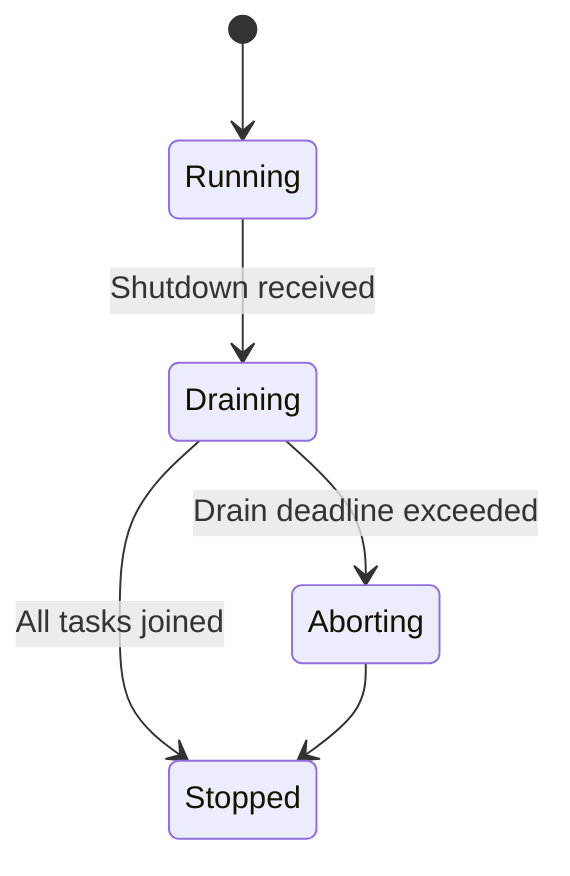
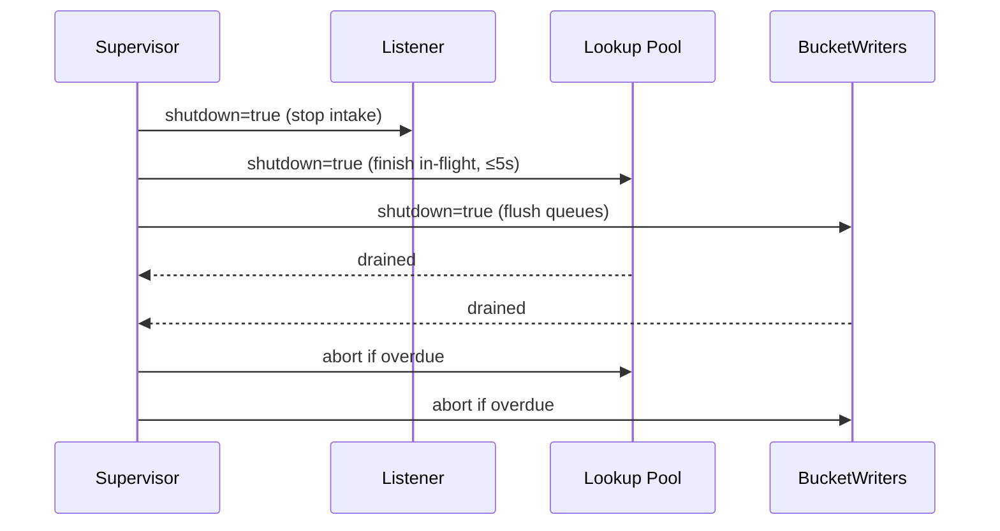

````markdown
---
title: Concurrency Model — svc-dht
crate: svc-dht
owner: Stevan White
last-reviewed: 2025-10-10
status: draft
template_version: 1.1
msrv: 1.80.0
tokio: "1.x (pinned at workspace root)"
loom: "0.7+ (dev-only)"
lite_mode: "N/A (service crate)"
---

# Concurrency Model — svc-dht

This document makes the concurrency rules **explicit**: tasks, channels, locks, shutdown, timeouts,
and validation (property/loom/TLA+). It complements `docs/SECURITY.md`, `docs/CONFIG.md`,
and the crate’s `README.md` and `IDB.md`.

> **Golden rule:** never hold a lock across `.await` in supervisory or hot paths.

---

## 0) Lite Mode

N/A — `svc-dht` is a service with background tasks.

---

## 1) Invariants (MUST)

- [I-1] **No lock across `.await`.** If unavoidable, split the critical section; prefer message passing.
- [I-2] **Single writer per mutable resource.** Each k-bucket is mutated by its **BucketWriter** task. Readers use snapshots.
- [I-3] **Bounded channels only.** Every mpsc/broadcast has a finite capacity and a documented overflow policy.
- [I-4] **Explicit deadlines.** All DHT RPCs and I/O have a deadline enforced by `timeout()`; timeouts map to typed errors.
- [I-5] **Cooperative cancellation.** All `.await` points are cancel-safe or guarded by `select!` with shutdown.
- [I-6] **Graceful shutdown.** On `Shutdown`, stop intake, drain within deadline (default 5s), then abort stragglers.
- [I-7] **No blocking syscalls on runtime.** Use `spawn_blocking` for crypto/FS as needed; cap pool usage.
- [I-8] **No task leaks.** Every spawned task is tracked; detached tasks are documented and bounded.
- [I-9] **Backpressure over buffering.** Prefer `Busy`/shed with metrics to growing queues.
- [I-10] **Framing is length-checked** and guards against split/partial reads.
- [I-11] **Async Drop discipline.** `Drop` never blocks; expose async `close()/shutdown()` and call it before drop.

---

## 2) Runtime Topology

**Runtime:** Tokio multi-threaded scheduler.

**Primary tasks (actors):**
- **Supervisor** — owns lifecycle, health/ready gates, and shutdown broadcast; restarts children with jittered backoff (max 60s).
- **RPC Listener** — accepts inbound DHT RPCs (`FIND_NODE`, `FIND_VALUE`, `PROVIDE`, `STORE`); pushes work into bounded queues.
- **Lookup Pool** — `N` workers executing Kademlia lookups using concurrent probes (`α`) and hedging; results reported to Supervisor.
- **BucketWriter(s)** — 1 task per k-bucket handling inserts/evicts/refreshes; enforces single-writer invariant.
- **Republisher** — periodically republishes provider records before TTL expiry.
- **Bootstrapper** — dials seeds until `B` seeds reachable and `X%` buckets non-empty; gates `/readyz`.
- **Metrics Exporter** — serves `/metrics`; no heavy work, piggybacks on shared registry.
- **Rate-Limiter** — process-wide semaphores/limiters (RPS/inflight/bytes) used by Listener/Pool.

```mermaid
flowchart TB
  subgraph Runtime
    SUP[Supervisor] -->|spawn| L[RPC Listener]
    SUP -->|spawn| P[Lookup Pool (W1..Wm)]
    SUP -->|spawn| BW[BucketWriter(s)]
    SUP -->|spawn| R[Republisher]
    SUP -->|spawn| BS[Bootstrapper]
    SUP -->|spawn| MX[Metrics Exporter]
    L -->|mpsc:work(512)| P
    P -->|mpsc:route(1024)| BW
    R -->|mpsc:route(1024)| BW
    SUP -->|watch Shutdown| L
    SUP -->|watch Shutdown| P
    SUP -->|watch Shutdown| BW
    SUP -->|watch Shutdown| R
    SUP -->|watch Shutdown| BS
  end
  style SUP fill:#0ea5e9,stroke:#0c4a6e,color:#fff
````

**Text description:** Supervisor spawns Listener, Lookup Pool, BucketWriters, Republisher, Bootstrapper, and Metrics. Listener feeds Lookup Pool via bounded `work` queue; workers and republisher send routing changes to BucketWriters via bounded `route` queue. All tasks subscribe to a `Shutdown` watch.

---

## 3) Channels & Backpressure

**Inventory (bounded unless noted):**

| Name           | Kind        |  Cap | Producers → Consumers                | Backpressure Policy                      | Drop Semantics                          |
| -------------- | ----------- | ---: | ------------------------------------ | ---------------------------------------- | --------------------------------------- |
| `work_tx`      | `mpsc`      |  512 | RPC Listener → Lookup Pool           | `try_send` else return `Busy`            | `busy_rejections_total{queue="work"}`++ |
| `route_tx[b]`  | `mpsc`      | 1024 | Lookup/Republisher → BucketWriter[b] | `send().await` w/ per-send timeout       | on timeout: count `route_dropped_total` |
| `events_tx`    | `broadcast` | 1024 | Core → subscribers (SDK/ops)         | lag counter; drop **oldest** on overflow | `bus_lagged_total`++, WARN w/ `lag`     |
| `shutdown_rx`  | `watch`     |    1 | Supervisor → N                       | last-write wins                          | N/A                                     |
| `rate_limiter` | semaphore   |    — | All RPC handlers                     | `try_acquire_many` → `Busy` if none      | `quota_reject_total{kind}`++            |

**Guidelines**

* Prefer **rejecting early** (`Busy`) to accepting unbounded latency.
* Keep per-queue **depth gauge**: `queue_depth{queue}`.
* For `route_tx[b]`, impose **send timeout** (e.g., 100ms) to avoid head-of-line blocking on misbehaving bucket writers.

---

## 4) Locks & Shared State

**Allowed**

* Short-lived `Mutex/RwLock` protecting **metadata** (e.g., metrics registry init, config snapshot swap). Never `.await` under guard.
* **Arc<Snapshot>** for read-mostly routing table views by Lookup workers (replaced atomically by BucketWriter commits).
* Per-connection state **owned by its task**; cross-task communication via channels only.

**Forbidden**

* Holding any lock across `.await`.
* Nested locks without explicit hierarchy.

**Hierarchy (if unavoidable)**

1. `state_meta`
2. `routing_snapshot`
3. `counters`

**Pattern:** All mutations to routing state go through the **BucketWriter actor**, not via locks.

---

## 5) Timeouts, Retries, Deadlines

* **I/O caps** (from config defaults): `read=5s`, `write=5s`, `idle=60s`.
* **Transport RPC**: `rpc_timeout≈1500ms` per probe; **hedge** after `250ms` (cancel losers on first success).
* **Lookup deadline**: `hop_budget=5`; enforce `p99 ≤ 5 hops`.
* **Retries**: Only for idempotent ops (`FIND_NODE`, `FIND_VALUE`). Jittered backoff `50–100ms`, exponential to `≤2s`, **max 3 tries**.
* **Per-send timeout** on `route_tx[b]` to BucketWriter: `≤100ms`.
* **Circuit breaker (optional)**: open on consecutive timeouts; half-open probe count 1–3.

```mermaid
sequenceDiagram
  autonumber
  participant C as Caller
  participant D as svc-dht
  C->>D: FIND_VALUE (deadline=2s)
  D->>D: spawn probes α; hedge after 250ms
  D-->>C: value or closest k (≤5 hops) or Timeout/Busy
```

---

## 6) Cancellation & Shutdown

* **Signal:** `KernelEvent::Shutdown` or CTRL-C.
* **Propagation:** Each task runs `tokio::select! { _ = shutdown.changed() => ..., }` in loops.
* **Phases:**

  1. **Quiesce intake:** Listener stops accepting new RPCs; return `NotReady`/`Busy`.
  2. **Drain:** Lookup Pool finishes in-flight up to **drain deadline** (default 5s).
  3. **Abort:** Abort tasks exceeding the deadline; increment `tasks_aborted_total{kind}`.
* **Idempotency:** Shutdown can be signaled multiple times; tasks ignore extra changes.



---

## 7) I/O & Framing

* **Framing:** Length-delimited messages w/ max frame (`1MiB` default). Validate length before allocation.
* **Reads/Writes:** Use `AsyncReadExt/AsyncWriteExt`; always `.shutdown().await` on success/error.
* **Partial reads:** Assemble frames over multiple reads; reject overlong or truncated frames.
* **Checksum/signature:** Where present (record envelopes), verify **off-IO path** (use `spawn_blocking` with budget).

---

## 8) Error Taxonomy (Concurrency-Relevant)

| Error      | When                        | Retry?    | Metric                            | Notes                          |
| ---------- | --------------------------- | --------- | --------------------------------- | ------------------------------ |
| `Busy`     | queue/semaphore exhausted   | maybe     | `busy_rejections_total{endpoint}` | Caller may backoff             |
| `Timeout`  | rpc or route send timed out | sometimes | `io_timeouts_total{op}`           | Includes hedged probe timeouts |
| `Canceled` | shutdown hit                | no        | `tasks_canceled_total{kind}`      | Cooperative                    |
| `Lagging`  | broadcast overflow          | no        | `bus_lagged_total`                | Warn + drop oldest             |
| `NotReady` | during drain/bootstrap      | yes       | `not_ready_total{phase}`          | Honours readiness gates        |

All map to the public `DhtError` where relevant.

---

## 9) Metrics (Concurrency Health)

* `queue_depth{queue}` gauge (work, route)
* `queue_dropped_total{queue}`
* `tasks_spawned_total{kind}`, `tasks_aborted_total{kind}`, `tasks_canceled_total{kind}`
* `io_timeouts_total{op}` (`read`,`write`,`connect`,`find_node`,`find_value`)
* `backoff_retries_total{op}`
* `busy_rejections_total{endpoint}`
* `hedge_spawned_total`, `hedge_canceled_total`

---

## 10) Validation Strategy

**Unit/Property**

* Backpressure: `try_send` → `Busy` under saturation; no silent growth.
* Deadline honoured: RPCs do not exceed configured timeouts by >5%.
* Single-writer: mutations only via BucketWriter; assert no concurrent mutable access.

**Loom (dev-only)**

* Model: **producer → mpsc(work) → worker → mpsc(route) → bucket_writer** plus shutdown.
* Assert: no deadlock, no missed shutdown, no message reordering that violates invariants.

**Fuzz**

* Frame decoder (length+payload) with boundary sizes (0, 1, 1MiB, 1MiB+1).
* Provider-record parsing under concurrent submission (fuzzer thread + actor).

**Chaos**

* Kill/respawn Lookup workers under load; verify success rate recovers; `/readyz` toggles properly.

**(Optional) TLA+**

* Model lookup steps and bucket updates; safety (no dup/invalid insert), liveness (eventual completion under bounded faults).

---

## 11) Code Patterns (Copy-Paste)

### 11.1 BucketWriter actor (single writer)

```rust
pub enum RouteCmd {
    Insert(Node),
    Seen(NodeId),
    Evict(NodeId),
}

pub struct BucketWriter {
    rx: tokio::sync::mpsc::Receiver<RouteCmd>,
    snapshot: Arc<RoutingSnapshot>,
}

impl BucketWriter {
    pub async fn run(mut self, mut shutdown: tokio::sync::watch::Receiver<bool>) {
        loop {
            tokio::select! {
                _ = shutdown.changed() => break,
                biased;
                Some(cmd) = self.rx.recv() => {
                    // Mutate local structures without awaiting external I/O.
                    self.apply(cmd);
                    // Publish a fresh snapshot atomically (no await).
                    self.snapshot = Arc::new(self.snapshot.commit());
                }
                else => break,
            }
        }
    }
}
```

### 11.2 Lookup worker with hedging + cancel-safety

```rust
pub async fn run_lookup(req: LookupReq, net: Net, cfg: LookupCfg, mut shutdown: watch::Receiver<bool>) -> Result<Answer> {
    let mut hops = 0usize;
    let mut frontier = closest(req.target, cfg.alpha * 2);
    while hops < cfg.hop_budget {
        let batch: Vec<Node> = next_batch(&mut frontier, cfg.alpha);
        if batch.is_empty() { break; }
        let (tx, mut rx) = tokio::sync::mpsc::channel(batch.len());
        let mut join = tokio::task::JoinSet::new();

        for peer in batch {
            let tx = tx.clone();
            join.spawn(async move {
                let ans = tokio::time::timeout(cfg.rpc_timeout, net.find_node(peer, req.target)).await;
                let _ = tx.send(ans).await;
            });
        }
        let mut hedge = tokio::time::sleep(cfg.hedge_after);
        tokio::pin!(hedge);

        let mut improved = false;
        for _ in 0..cfg.alpha {
            tokio::select! {
                _ = shutdown.changed() => return Err(Error::Canceled),
                _ = &mut hedge, if join.len() < (cfg.alpha + cfg.beta) => {
                    // Hedge by spawning extra probes up to beta
                    if let Some(extra) = frontier.pop() {
                        let tx = tx.clone();
                        join.spawn(async move {
                            let ans = tokio::time::timeout(cfg.rpc_timeout, net.find_node(extra, req.target)).await;
                            let _ = tx.send(ans).await;
                        });
                    }
                }
                Some(res) = rx.recv() => {
                    if let Ok(Ok(reply)) = res {
                        improved |= consider(reply, &mut frontier);
                    }
                }
            }
        }
        // Cancel losers quickly
        join.abort_all();
        if !improved { break; }
        hops += 1;
    }
    make_answer(frontier).ok_or(Error::HopExceeded)
}
```

### 11.3 Backpressure-first enqueue

```rust
match work_tx.try_send(job) {
    Ok(()) => {}
    Err(tokio::sync::mpsc::error::TrySendError::Full(_)) => {
        metrics::busy_rejections_total("rpc").inc();
        return Err(Error::Busy);
    }
    Err(e) => return Err(Error::from(e)),
}
```

### 11.4 Timeout with deadline

```rust
let res = tokio::time::timeout(cfg.read_timeout, read_frame(&mut stream)).await?;
```

### 11.5 Cooperative shutdown skeleton

```rust
let (shutdown_tx, shutdown_rx) = tokio::sync::watch::channel(false);
let worker = tokio::spawn(worker_loop(work_rx, shutdown_rx.clone()));
// later:
let _ = shutdown_tx.send(true);
let _ = tokio::time::timeout(Duration::from_secs(5), worker).await;
```

### 11.6 Async Drop pattern

```rust
pub struct Client { inner: Option<Conn> }
impl Client {
  pub async fn close(&mut self) -> anyhow::Result<()> {
    if let Some(mut c) = self.inner.take() { c.shutdown().await?; }
    Ok(())
  }
}
impl Drop for Client {
  fn drop(&mut self) {
    if self.inner.is_some() { tracing::debug!("Client dropped without close()"); }
  }
}
```

---

## 12) Configuration Hooks (Quick Reference)

* Channel capacities: `work=512`, `route=1024`, broadcast=1024.
* Timeouts: `rpc_timeout`, `hedge_after`, transport `read/write/idle`.
* Limits: inflight semaphore counts, global RPS.
* Drain deadline (`5s`) and per-send timeout to BucketWriters (`100ms`).
* Lookup tuning: `alpha`, `beta`, `hop_budget`.

See `docs/CONFIG.md` for authoritative schema.

---

## 13) Known Trade-offs / Nonstrict Areas

* **Drop oldest vs reject new** on broadcast: chosen to keep subscribers roughly in sync at the cost of losing oldest events.
* **Send-timeout to BucketWriter** may drop routing updates under extreme saturation; lookup correctness still holds (next refresh will reconcile).
* **Hedging** increases network cost modestly to cut tails; bounded by `beta` and canceled aggressively.

---

## 14) Mermaid Diagrams

### 14.1 Task & Queue Topology

```mermaid
flowchart LR
  IN[RPC Listener] -->|mpsc:work (512)| W1[Lookup W1]
  IN -->|mpsc:work (512)| W2[Lookup W2]
  W1 -->|mpsc:route (1024)| BW1[BucketWriter #1]
  W2 -->|mpsc:route (1024)| BW2[BucketWriter #2]
  RP[Republisher] -->|mpsc:route (1024)| BW1
  subgraph Control
    SHUT[watch: Shutdown] --> IN
    SHUT --> W1
    SHUT --> W2
    SHUT --> RP
    SHUT --> BW1
    SHUT --> BW2
  end
```

**Text:** Listener feeds Lookup workers; workers/republisher send routing changes to per-bucket writers; Shutdown watch fans out to all.

### 14.2 Shutdown Sequence



---

## 15) CI & Lints (Enforcement)

**Clippy**

* `-D clippy::await_holding_lock`
* `-D clippy::needless_collect`
* `-D clippy::useless_async`
* `-D warnings` (workspace standard)

**Actions (suggested)**

```yaml
name: svc-dht-concurrency-guardrails
on: [push, pull_request]
jobs:
  clippy:
    runs-on: ubuntu-latest
    steps:
      - uses: actions/checkout@v4
      - uses: dtolnay/rust-toolchain@stable
      - run: cargo clippy -p svc-dht -- -D warnings -D clippy::await_holding_lock

  loom:
    if: github.event_name == 'pull_request'
    runs-on: ubuntu-latest
    steps:
      - uses: actions/checkout@v4
      - uses: dtolnay/rust-toolchain@stable
      - run: RUSTFLAGS="--cfg loom" cargo test -p svc-dht --tests -- --ignored

  fuzz:
    runs-on: ubuntu-latest
    steps:
      - uses: actions/checkout@v4
      - uses: dtolnay/rust-toolchain@stable
      - run: cargo install cargo-fuzz
      - run: cargo fuzz build -p svc-dht
```

---

## 16) Schema Generation (Optional)

Automate **Channels/Locks tables** to prevent drift:

* Annotate channel creation sites with a lightweight macro, e.g.:

  ```rust
  #[doc_channel(name="work", kind="mpsc", cap=512, policy="try_send")]
  let (work_tx, work_rx) = tokio::sync::mpsc::channel(512);
  ```

* A small build script can emit `docs/_generated/concurrency.channels.mdfrag` for inclusion.

* Add a golden test that **counts** channels and compares to the doc table.

---

## 17) Review & Maintenance

* **Review cadence:** every 90 days or on any change to tasks/channels/locks.
* Keep **owner**, **msrv**, **last-reviewed** current.
* **PR checklist:** If you modify concurrency, update this doc + tests (unit/loom).

```
```
