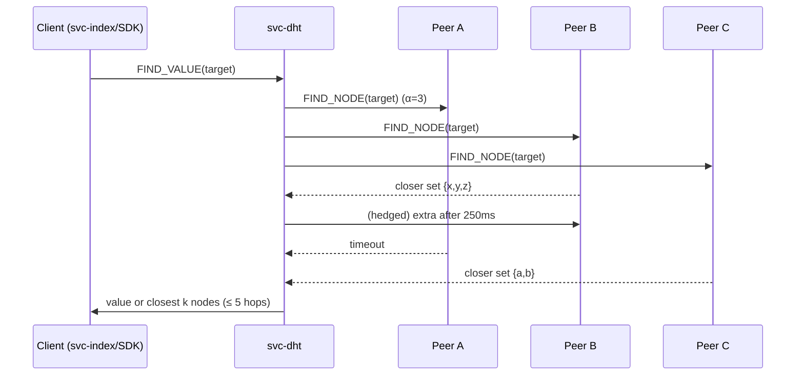
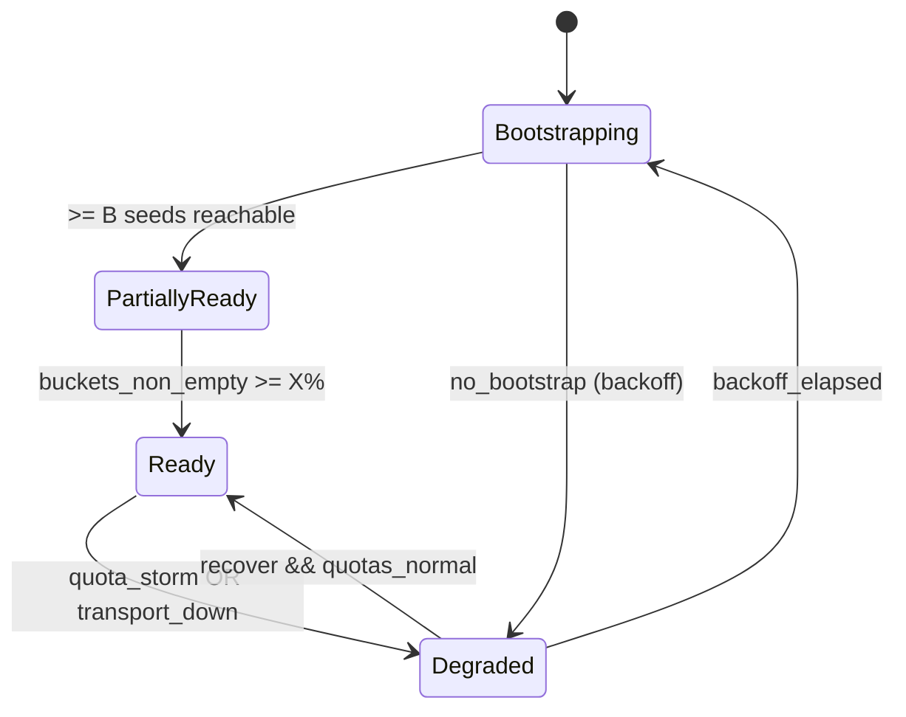

````markdown
---
title: svc-dht — Invariant-Driven Blueprint (IDB)
version: 0.2.1
status: reviewed
last-updated: 2025-10-10
audience: contributors, ops, auditors
---

# svc-dht — Invariant-Driven Blueprint (IDB)

**Role.** First-class **discovery** service for the overlay. Maintains a Kademlia/Discv5-style DHT and answers provider/node lookups for higher layers (index, storage, SDK). This crate **owns** routing tables and discovery; `svc-overlay` has **no** embedded DHT logic.

---

## 1) Invariants (MUST)

- **[I-1] Boundary of responsibility.** All DHT functions (routing table, `FIND_NODE`/`FIND_VALUE`, `PROVIDE`/`STORE`, refresh & churn handling) live **only** in `svc-dht`. `svc-overlay` handles sessions/gossip and must not mutate DHT state.

- **[I-2] Hop bound SLO.** Lookup paths are bounded: **p99 ≤ 5 hops** in steady state, enforced by sims and runtime metrics.

- **[I-3] Single-writer buckets.** Each k-bucket is mutated under **single-writer discipline** (CAS or short, non-awaited critical sections). **No lock is held across `.await`.**

- **[I-4] Bounded concurrency.** α (parallelism for queries) and β (concurrent value lookups) are **explicitly bounded** and cancel-safe; hedged sub-queries must be pre-budgeted and aborted on fastest-winner.

- **[I-5] Rate-limits & quotas.** Per-peer and global ceilings for RPCs (queries/sec, bytes/sec, inflight) are enforced **before** heavy work; structured rejects are observable via metrics and error taxonomy.

- **[I-6] Provider records are signed & expiring.** Provider/ad-records carry origin signatures, TTL defaults (e.g., 24h) and **republish before expiry** (e.g., 12h). Stale/oversized/unsigned records are rejected.

- **[I-7] Transport abstraction only.** Network I/O uses **`ron-transport`** (TLS; Tor/QUIC features via flags). `svc-dht` does not embed transport backends beyond the abstraction.

- **[I-8] Observability contract.** Expose golden metrics & health:  
  `dht_lookup_hops_histogram`, `dht_success_total{op}`, `dht_bucket_occupancy{bucket}`, `rejected_total{reason}`, plus `/metrics`, `/healthz`, `/readyz`, `/version`.

- **[I-9] Amnesia-aware.** Honor **amnesia mode** (Micronode default): RAM-only caches, ephemeral logs, **no** on-disk spill.

- **[I-10] Interop contract.** Upstream resolves (`svc-index`/SDK) can rely on the DHT **p99 ≤ 5 hops** and a deterministic **error taxonomy**; SDK retries are full-jitter with backoff.

- **[I-11] Bootstrap robustness.** `/readyz` MUST remain **not ready** until **≥ B** bootstrap peers are reachable **and** **≥ X%** of buckets are non-empty. Defaults: `B=3`, `X=60%`. If all bootstrap peers are exhausted, apply exponential backoff (cap 5 min) with jitter; no tight loops.

- **[I-12] NAT & dual-stack discipline.** Maintain IPv4/IPv6 addresses; degrade gracefully if only one family is present. Prefer UDP/QUIC rendezvous where supported; otherwise clean TCP fallback. No address-family starvation during peer selection.

- **[I-13] Diversity floor (anti-eclipse).** Bucket fills must enforce **ASN/geo diversity**: no more than **D%** of entries in a bucket may originate from a single ASN/geo. Default `D=40%`. Measure diversity per bucket using **unique-ASN count** and **Shannon entropy** over ASN distribution; buckets must maintain entropy **≥ 1.5 bits** under normal conditions.

- **[I-14] Error taxonomy determinism.** All remote ops return one of a **closed set** of errors:
  `HopExceeded`, `Timeout`, `QuotaHit{kind}`, `StaleRecord`, `BadSignature`, `NoBootstrap`, `NotReady`, `TransportDown`. Text forms and JSON schema are versioned and stable.

- **[I-15] PQ-hybrid envelope.** Provider records and signed control frames support **dual-signing** (Ed25519 + **ML-DSA-87**) during migration; verification **MUST** accept any configured superset but **MUST** warn on classical-only after `pq.require_pq_on`.

- **[I-16] Side-channel hygiene.** Signature and record validation use constant-time comparisons where applicable; rejects do not leak target specificity via timing beyond configured jitter envelopes.

- **[I-17] Traceability.** Every lookup, provide, and store operation carries a stable **lookup_id** (UUIDv7 or equivalent) propagated across internal spans and structured logs; failure paths MUST include `lookup_id`, `peer_id`, and `reason`.

---

## 2) Design Principles (SHOULD)

- **[P-1] Resist eclipse/Sybil via diversity.** Prefer peer diversity (ASNs/regions) when filling buckets; rotate queries across disjoint subsets.
- **[P-2] Zero-copy on hot paths.** Prefer **owned bytes** & zero-copy; never borrow short-lived buffers into responses.
- **[P-3] Deadline-driven I/O.** Every RPC has a deadline; abandoned branches cancel promptly.
- **[P-4] Backpressure first.** Shed early under quota pressure; `/readyz` degrades **writes first** (`PROVIDE/STORE`) before reads.
- **[P-5] Profile parity.** Same API on **Micronode** (amnesia ON) and **Macronode**; only scale & persistence differ.
- **[P-6] PQ-future-proofing.** Treat signature/KEX as replaceable; keep verification pluggable to adopt ML-DSA/ML-KEM alongside classical keys.
- **[P-7] Privacy-preserving lookups.** Randomize query ordering among closest peers (α set), keep constant-ish fanout, clamp timing jitter to reduce target-nearness leakage via RTT.
- **[P-8] Pluggable provider store.** Provider-record persistence behind a trait; default in-memory (Micronode), optional on-disk (Macronode) with sealed types.
- **[P-9] Auditability by default.** Emit structured logs (JSON) at INFO for state transitions and WARN for rejects; include `lookup_id`, `op`, `peer`, `err`, and hop count. Sampling may be applied at INFO but never at WARN/ERROR.
- **[P-10] Operable SLOs.** Pair every metric SLO with an explicit alert policy and a runbook pointer; alerts must be rate-limited and deduplicated across instances.

---

## 3) Implementation (HOW)

> Patterns are copy-paste-ready sketches; keep modules small and testable.

### 3.1 Bucket discipline

Route **all** inserts/evicts through a single `BucketWriter` task per k-bucket (mpsc). Reader tasks use snapshots for concurrent lookups. This enforces single-writer (I-3) and avoids `.await` while holding locks.

### 3.2 Lookup executor pseudocode

```rust
// Pseudocode-style; keep real code modular.
struct LookupCfg { alpha: usize, beta: usize, hop_budget: usize, hedge_after: Duration, rpc_timeout: Duration }

async fn lookup(target: NodeId, cfg: LookupCfg, rt: &Routing, net: &Network) -> Result<Vec<Node>, DhtError> {
    let mut frontier = rt.closest(target).take(cfg.alpha * 2);
    let mut seen = HashSet::new();
    let mut hops = 0;

    while hops < cfg.hop_budget {
        let batch = frontier.iter().filter(|n| seen.insert(n.id)).take(cfg.alpha).cloned().collect::<Vec<_>>();
        if batch.is_empty() { break; }

        let (tx, mut rx) = tokio::sync::mpsc::channel(batch.len());
        for peer in batch {
            let tx = tx.clone();
            tokio::spawn(async move {
                let ans = net.find_node(peer, target).with_timeout(cfg.rpc_timeout).await;
                let _ = tx.send((peer, ans)).await;
            });
        }

        let mut closer = Vec::new();
        let mut got_better = false;
        let hedge = tokio::time::sleep(cfg.hedge_after);
        tokio::pin!(hedge);

        for _ in 0..cfg.alpha {
            tokio::select! {
                Some((peer, Ok(resp))) = rx.recv() => {
                    closer.extend(resp.closest);
                    got_better |= resp.closest.iter().any(|n| n.id.distance(&target) < peer.id.distance(&target));
                }
                Some((_, Err(e))) = rx.recv() => { record_error(e); }
                _ = &mut hedge => { /* optionally spawn hedged up to β */ }
                else => break
            }
        }

        if !got_better { break; }
        frontier = select_k_closest(frontier.into_iter().chain(closer.into_iter()), target, rt.k());
        hops += 1;
    }

    if hops >= cfg.hop_budget { return Err(DhtError::HopExceeded); }
    Ok(frontier)
}
````

### 3.3 Provider record schema

```json
{
  "cid": "b3:<hex>",
  "provider": "NodeId",
  "addrs": ["<multiaddr>", "..."],
  "sig": "<bytes>",           // Ed25519 and/or ML-DSA in envelope
  "ttl": 86400,               // seconds
  "ts":  1733856000           // unix epoch seconds
}
```

Validate `b3:` content ID prefix, signature(s), and TTL. Refuse stale, oversized, or unsigned records (I-6, I-15).

### 3.4 Error taxonomy (stable)

```rust
#[non_exhaustive] // changes are semver-signaled
#[derive(Debug, Clone, Serialize)]
pub enum DhtError {
    HopExceeded,
    Timeout,
    QuotaHit { kind: &'static str }, // rps|bytes|inflight
    StaleRecord,
    BadSignature,
    NoBootstrap,
    NotReady,
    TransportDown,
}
```

### 3.5 Config defaults (paste into config)

```toml
# svc-dht defaults (override per profile)
[svc_dht]
alpha = 3
beta = 2
k = 20
hop_budget = 5
rpc_timeout_ms = 1500
hedge_after_ms = 250
provider_ttl_secs = 86400        # 24h
provider_refresh_secs = 43200    # 12h
bootstrap_required = 3
ready_bucket_fill_pct = 60
asn_diversity_max_pct = 40
max_inflight = 512
max_rps = 500
max_frame_bytes = 1048576

[pq]
dual_sign = true
require_pq_on = "2026-06-01"     # after this date, classical-only warns
algorithms = ["ed25519", "mldsa87"]
```

### 3.6 NAT + Bootstrap behavior

* **Bootstrap**: try all seeds in randomized order; maintain last-seen-success; backoff tiers `1s→5s→15s→60s→300s` with ±20% jitter; no tight loops.
* **NAT traversal**: prefer QUIC/UDP rendezvous if support is available; otherwise fall back to TCP. Respect overlay-provided relay hints **via trait** (no overlay logic embedded). Mark non-punchable peers to avoid wasted attempts.
* **Connection racing (Happy Eyeballs).** When both v4 and v6 are present, race connections with a small stagger (e.g., 50–100 ms) and keep the winner.

### 3.7 Metrics & health wiring

Register once (e.g., `OnceLock`) and export:

* `dht_lookup_hops_histogram`
* `dht_success_total{op}`                         # op ∈ {find_node, find_value, provide, store}
* `dht_bucket_occupancy{bucket}`
* `rejected_total{reason}`                        # reason ∈ {quota, timeout, not_ready, bad_sig, stale, transport}
* `pq_dual_sign_ratio`                            # ratio of records carrying both classical + PQ signatures
* `pq_classical_only_total`                       # count of classical-only records accepted during migration
* `pq_verify_fail_total{alg}`                     # alg ∈ {ed25519, mldsa87}

`/readyz` flips to **ready** only after bootstrap and bucket fill thresholds; degrades on quota storms (writes shed first).

### 3.8 Tiny visual (lookup flow)



### 3.9 Ready state visual



### 3.10 Side-channel hygiene snippet

```rust
// Example: constant-time equality for record digests
use subtle::ConstantTimeEq;

fn eq_digest_ct(a: &[u8; 32], b: &[u8; 32]) -> bool {
    a.ct_eq(b).into()
}
```

---

## 4) Acceptance Gates (PROOF)

> These are **blocking** in CI; each MUST maps to ≥1 gate.

### Unit / Property

* **[G-1] Bucket single-writer.** Property test proves no concurrent mutable access to a bucket; CAS transitions only (I-3).
* **[G-2] Record validity.** Proptest for provider records: invalid TTL/signatures/prefixes are rejected with structured reasons (I-6, I-14).

### Simulation / Perf

* **[G-3] Hop distribution sim (CI-fail bar).** In a 10k-node synthetic with churn 10%/h, 100k random lookups: `p50 ≤ 3`, `p95 ≤ 4`, `p99 ≤ 5` hops. **Fail build** if violated (I-2).
* **[G-4] Churn recovery.** After killing 20% of nodes, success rate returns to **≥ 99.0% within ≤ 300s** and remains **≥ 99.5%** for next 15 minutes (I-2, I-4).
* **[G-5] Hedged dials perf.** With `hedge_after_ms=250`, median latency improves **≥ 10%**, and `p99` **does not regress** vs baseline (I-4).

### Hardening / Chaos

* **[G-6] Quota storms.** At 3× `max_rps` for 60s, requests are **shed with 503**; `rejected_total{reason="quota"}` increments; `/readyz` degrades (writes off) in ≤ 2s (I-5, I-8).
* **[G-7] Eclipse resistance.** With ≥ 70% of a bucket seeded from one ASN, average **unique-ASN count ≥ 3** across successful lookups **and** **ASN entropy ≥ 1.5 bits**. **Fail** if either threshold is breached (I-13).

### Observability & Readiness

* **[G-8] Metrics contract.** Scrape must expose: `dht_lookup_hops_histogram`, `dht_success_total{op}`, `dht_bucket_occupancy{bucket}`, `rejected_total{reason}`, `pq_dual_sign_ratio` (I-8, I-15).
* **[G-9] Health/ready gating.** `/readyz` only green after `bootstrap_required` & `ready_bucket_fill_pct` satisfied; flips to degraded on sustained quota rejects (I-11, I-5).

### Interop / DX / Fuzz

* **[G-10] SDK flow.** End-to-end “resolve→fetch” via `svc-index + svc-dht` meets **p99 ≤ 5 hops**; SDK retries/jitter observed (I-10).
* **[G-11] Fuzz/provider-parser.** `cargo fuzz` corpus achieves **0 crashes** over 5 minutes and **> 90%** state coverage in parser (I-6).
* **[G-12] NAT/dual-stack matrix.** In v4-only, v6-only, and dual-stack harnesses: success **≥ 99%** and time-to-first-success **≤ rpc_timeout × hop_budget** (I-12).

### PQ-Hybrid

* **[G-13] Dual-sign overhead.** With `pq.dual_sign=true`, verify median overhead **≤ 20%**, `p95 ≤ 2×` classical; `pq_dual_sign_ratio ≥ 0.95` during migration window (I-15).

### Ops: Alerting & Traceability

* **[G-14] Alerting SLOs.** Alert rules present and tested via synthetic metric pushes:

  * Fire **CRITICAL** if `dht_lookup_hops_histogram{le="5"}` coverage drops below **99% for 5 minutes**.
  * Fire **WARNING** if `rejected_total{reason="quota"}` rate > **5/sec for 10 minutes**.
    CI asserts alert definitions exist and pass a dry-run simulation (I-8, P-10).

* **[G-15] Trace correlation.** 99% of WARN/ERROR logs in load tests include `lookup_id`, `peer_id` (when applicable), and canonical `DhtError`. CI checks a sampled log bundle for the fields (I-17, P-9).

---

## 5) Anti-Scope (Forbidden)

* ❌ **No** DHT logic in `svc-overlay` or the kernel; no routing table mutations outside `svc-dht` (I-1).
* ❌ **No** unbounded queues or multi-writer to a single socket; **no** locks across `.await` (I-3).
* ❌ **No** ambient trust: unsigned/undated provider records, or records without `b3:` content IDs (I-6).
* ❌ **No** direct transport impls baked into the service; always go through `ron-transport` (I-7).
* ❌ **No** disk persistence when **amnesia=ON** (I-9).
* ❌ **No custom cryptography.** Use vetted libs behind the KMS boundary; no homebrew signatures/hashes (I-15).

---

## 6) References

* Project canon: **12 Pillars** (Overlay/Transport/Discovery), **Six Concerns**, **Concurrency & Aliasing**, **Scaling**, **Hardening**, **App Integration**, **Full Project Blueprint**.
* Internal contracts: `ron-transport` (timeouts, TLS/Tor/QUIC features), `svc-index` (resolve flows), PQ migration notes (KMS/KEX/signature envelopes).
* External touchstones: Kademlia hop-bound literature; Sybil/eclipse mitigation via ASN/geo diversity.

---

## Reviewer Checklist (for PRs)

* Hop SLO CI job green (`p50/p95/p99` thresholds met).
* Churn recovery SLA met (≤ 300s).
* NAT/dual-stack matrix green across v4, v6, dual.
* Metrics contract present (incl. `pq_dual_sign_ratio`, verify-fail counts).
* Error taxonomy stable; no ad hoc error strings.
* Traceability present (`lookup_id` in WARN/ERROR logs).
* Anti-scope: no direct transport impls; no `.await` under locks; no disk writes in amnesia mode.
* Config defaults present and documented; α/β/k/hop budget wired to sims and CI.
* Alerting policies + runbook links committed and dry-run tested.

---

### Semver & Governance

* Adding, removing, or materially tightening a **MUST** invariant → **minor** version bump of this IDB.
* Changing **PROOF** thresholds without changing invariants → **patch**.
* All changes require sign-off from **Security** (I-6/I-15), **Perf** (I-2/I-4), and **Ops** (I-8/I-11) owners.

```
```
