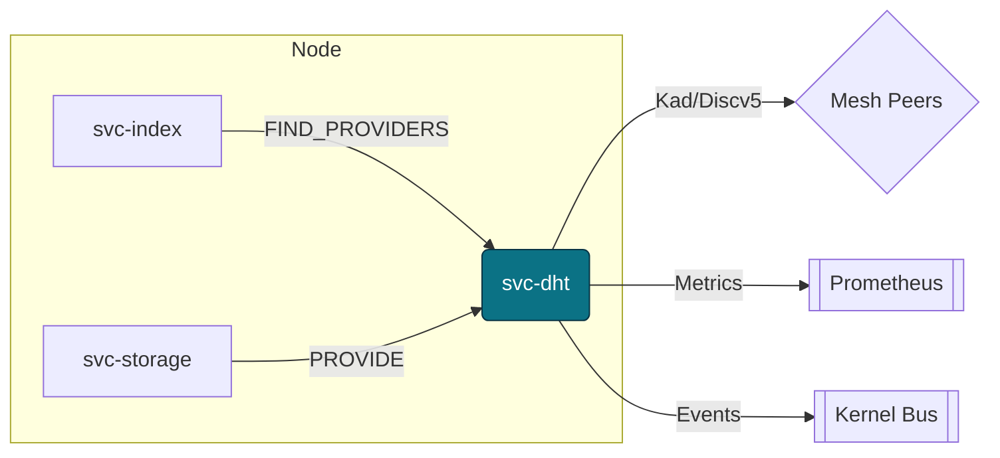
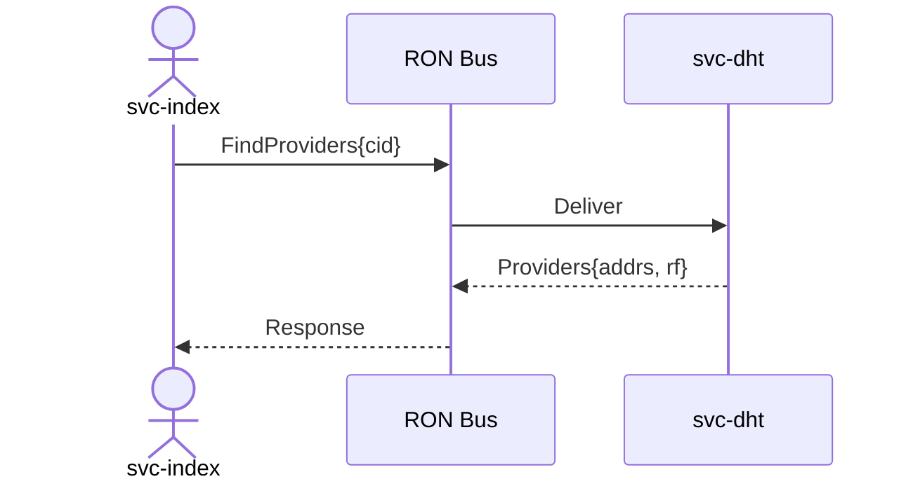
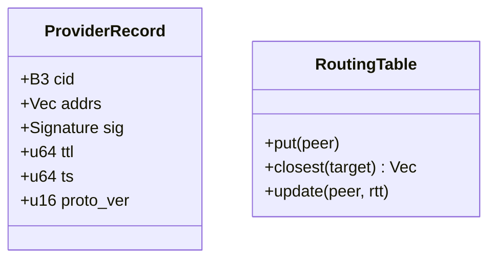
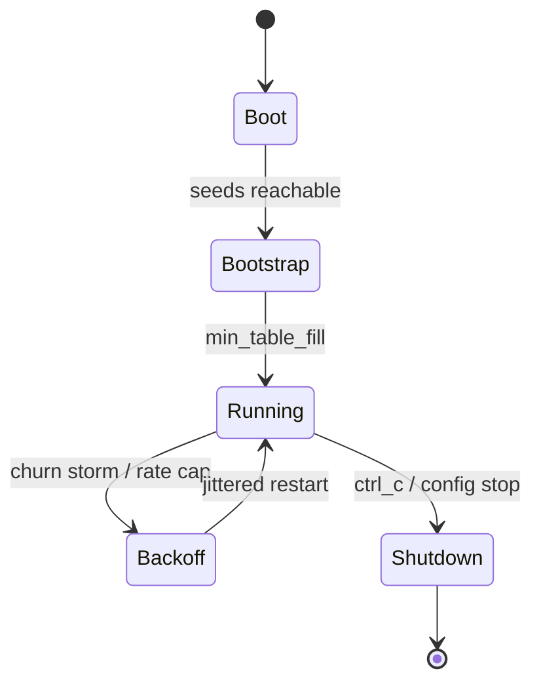

---

# svc-dht

> **Role:** service (Kademlia/Discv5 discovery & provider lookups)
> **Owner:** Stevan White
> **Status:** draft
> **MSRV:** 1.80.0
> **Last reviewed:** 2025-10-11
> **Audience:** contributors, ops, auditors

Badges (optional):
[]() []()

---

## 1) Overview

**What it is (one paragraph):**
`svc-dht` is the substrate’s discovery plane. It maintains a Kademlia/Discv5 routing table, answers `FIND_NODE/FIND_PROVIDERS`, and stores/serves **provider records** so other services (e.g., `svc-index`, `svc-storage`) can discover who has a given content id (`b3:<hex>`). Ingress is capability-gated and rate-limited. Golden metrics cover latency, hop count, replication health, ASN diversity, and reject reasons. Target: **p99 ≤ 5 hops** under churn.

**How it fits (RustyOnions topology):**

* **Pillar:** 10 — Overlay, Transport & Discovery
* **Upstream callers:** `svc-index` (resolve providers), `svc-storage` (announce/provide), node profiles (`macronode`, `micronode`)
* **Downstream deps:** `ron-transport` (TCP/TLS; Tor via `arti` feature), kernel bus/metrics; optional ephemeral sled cache
* **Data it touches:** in-memory routing table; optional on-disk ephemeral cache (disabled by default in Micronode/amnesia)
* **Security boundary:** no PII; provider records are signed; per-peer quotas and global inflight caps

### 1.1 High-Level Architecture



---

## 2) Responsibilities & Boundaries

**MUST do (core responsibilities):**

* Maintain Kademlia/Discv5 table with **single-writer per k-bucket**.
* Serve `FIND_NODE`, `FIND_PROVIDERS`, `STORE/PROVIDE` with hop/time budgets and hedged queries.
* Enforce **ASN diversity** (entropy floor, max % per ASN) for Sybil resistance.
* Republish provider records per TTL; prune expired; export replication health.

**MUST NOT do (anti-scope):**

* No session/gossip (that’s `svc-overlay`).
* No index/business policy or ledger logic—**discovery only**.

**Acceptance Gates (proof):**

* Unit/prop tests cover bucket updates, expiry, ASN diversity, hedging deadlines.
* Metrics exported: latency/hops/ASN/replication/rejects; alerts wired.
* `/readyz` blocks until bootstrap quorum and min table fill.
* Bench meets SLOs: **p95 lookup < 150 ms** (intra-AZ), **p99 hops ≤ 5**.

---

## 3) Public Interfaces

### 3.1 Interop mapping (wire ↔ bus)

| Operation      | Wire (Kad/Discv5) | Bus Topic                  | Request → Response schema (summary)                  | Notes                           |
| -------------- | ----------------- | -------------------------- | ---------------------------------------------------- | ------------------------------- |
| Find providers | FIND_PROVIDERS    | `ron://dht/find_providers` | `{ cid:B3 } → { addrs:[Multiaddr], rf:u8 }`          | hop_budget & deadline respected |
| Find node      | FIND_NODE         | `ron://dht/find_node`      | `{ node_id } → { peers:[PeerInfo] }`                 | closest peers by XOR distance   |
| Store/announce | STORE/PROVIDE     | `ron://dht/store_provide`  | `{ cid:B3, proof:Sig } → { accepted:bool, reason? }` | provider TTL enforced           |



### 3.2 HTTP surface

* `GET /healthz` → `200 OK`
* `GET /readyz` → `200 OK {ready:true}` once bootstrap + min-fill reached
* `GET /metrics` → Prometheus text

---

## 4) Configuration

> Env-first; flags mirror env. Profiles set sensible bundles.

| Variable               | Type   | Default       | Description                                  |
| ---------------------- | ------ | ------------- | -------------------------------------------- |
| `DHT_BIND`             | socket | `0.0.0.0:0`   | Listen addr                                  |
| `DHT_BOOTSTRAP`        | list   | *(empty)*     | Comma-sep multiaddrs of seed peers           |
| `DHT_K`                | int    | 20            | Kademlia bucket size                         |
| `DHT_ALPHA`            | int    | 3             | Lookup parallelism                           |
| `DHT_BETA`             | int    | 2             | Hedged query budget                          |
| `DHT_HEDGE_STAGGER_MS` | int    | 15            | Delay before launching hedges                |
| `DHT_PROVIDE_TTL_SEC`  | int    | 86400         | Provider TTL                                 |
| `DHT_REPUBLISH_SEC`    | int    | 43200         | Republish cadence                            |
| `DHT_PEER_RATE_RPS`    | int    | 100           | Per-peer rate ceiling                        |
| `DHT_GLOBAL_INFLIGHT`  | int    | 512           | Node-wide concurrent ops cap                 |
| `DHT_ASN_MAX_PCT`      | int    | 40            | Max % of peers from a single ASN             |
| `DHT_ASN_ENTROPY_MIN`  | float  | 2.5           | Shannon entropy floor across ASNs            |
| `DHT_PROFILE`          | enum   | `macronode`   | `micronode` enables amnesia defaults         |
| `DHT_AMNESIA`          | bool   | false         | RAM-only mode; disables on-disk cache        |
| `DHT_PQ_REQUIRE`       | bool   | false         | Require PQ verification (fail-closed)        |
| `DHT_PQ_DUAL_SIGN`     | bool   | true          | Accept classical+PQ (interop window)         |
| `DHT_PQ_ALGO`          | enum   | `ml-dsa`      | `ml-dsa` (Dilithium) or `sphincs+`           |
| `DHT_PQ_REQUIRE_ON`    | date   | *(unset)*     | Date after which PQ is required (ops toggle) |
| `LOG_LEVEL`            | str    | `info`        | tracing level                                |
| `METRICS_ADDR`         | socket | `127.0.0.1:0` | Prometheus exporter bind                     |

**Flags (examples):**

```
--bind 0.0.0.0:9910
--bootstrap /ip4/1.2.3.4/udp/9910/p2p/12D3K...,/onion/abc...:9910
--k 20 --alpha 3 --beta 2 --hedge-stagger-ms 15
--provide-ttl 86400 --republish 43200
--peer-rate 100 --inflight 512
--asn-max-pct 40 --asn-entropy-min 2.5
--profile micronode --amnesia
--pq-require=false --pq-dual-sign=true --pq-algo ml-dsa
--pq-require-on 2026-01-01
```

**Cargo features:**

* `default = ["tokio", "serde"]`
* `arti` — Tor transport via `ron-transport`
* `sled-cache` — ephemeral local cache (off by default on Micronode)
* `tls` — TLS via `tokio_rustls`

---

## 5) Build, Run, Test

**Build**

```
cargo build -p svc-dht
```

**Run**

```
RUST_LOG=info METRICS_ADDR=127.0.0.1:0 cargo run -p svc-dht -- --bind 0.0.0.0:9910
```

**Unit/prop/doc tests**

```
cargo test -p svc-dht --all-features
cargo test -p svc-dht --doc
```

**Fuzz (examples)**

```
cargo fuzz run msg_frame_decode -- -runs=0 -max_total_time=60
cargo fuzz run kad_packet_decode -- -rss_limit_mb=2048 -max_total_time=90
# Corpus: seeded from prior CI failures under fuzz/corpus/*
```

**Loom (concurrency invariants)**

```
RUSTFLAGS="--cfg loom" cargo test -p svc-dht --test loom_kbucket -- --nocapture
```

**Soak / churn sim (harness)**

```
cargo run -p svc-dht-harness -- --nodes 1000 --churn 0.05 --duration 600s
```

**Fmt/Lint/Supply chain**

```
cargo fmt --all
cargo clippy -p svc-dht -- -D warnings
cargo deny check
```

**Coverage & mutation (CI gates)**

```
cargo tarpaulin --locked --workspace --out Xml
cargo mutants --workspace --timeout 30s --no-run-ignored
# Targets: ≥85% line/branch coverage; mutation score ≥70%
```

**Bench**

```
cargo bench -p svc-dht
```

---

## 6) Observability

**Endpoints:** `/metrics`, `/healthz`, `/readyz`

**Canonical metrics**

| Metric name                  | Type      | Labels                                        | Notes                                        |
| ---------------------------- | --------- | --------------------------------------------- | -------------------------------------------- |
| `ron_dht_requests_total`     | counter   | `op`                                          | find_node/find_providers/store               |
| `ron_dht_lookup_ms`          | histogram | `op`                                          | latency (ms); exemplars enabled in perf runs |
| `ron_dht_hops_hist`          | histogram | `op`                                          | hop count distribution                       |
| `ron_dht_bucket_occupancy`   | gauge     | `k_bucket`                                    | per-bucket fill                              |
| `ron_dht_peers_total`        | gauge     | `state` (known, connected, evicted)           |                                              |
| `ron_dht_rejected_total`     | counter   | `reason` (rate, malformed, oversize, asn_cap) |                                              |
| `ron_dht_providers_total`    | gauge     |                                               | current provider records                     |
| `ron_dht_missing_records`    | gauge     | `cid_class`                                   | suspected RF under-replication               |
| `ron_asn_entropy`            | gauge     |                                               | Shannon entropy across ASNs                  |
| `bus_overflow_dropped_total` | counter   | `service="svc-dht"`                           | inherited kernel metric                      |

**Tracing**
Targets: `svc_dht=info,ron_transport=warn`; span fields: `request_id`, `peer`, `cid`, `hops`, `alpha`, `beta`, `deadline_ms`.

---

## 7) Performance & SLOs

| Metric             |             Target | Notes                     |
| ------------------ | -----------------: | ------------------------- |
| Lookup p50 latency |            ≤ 40 ms | intra-AZ                  |
| Lookup p95 latency |           ≤ 150 ms | intra-AZ, nominal churn   |
| Hop count p99      |                ≤ 5 | with `alpha=3, beta=2`    |
| Start-to-ready     |              < 2 s | post-bootstrap            |
| Max concurrent ops | 512 (configurable) | global inflight cap       |
| Hedge efficacy     |     ≥ 25% tail cut | β vs β=0 baseline         |
| Inter-region p95   |           ≤ 500 ms | single continent, nominal |

> Reproduce with harness: fixed seeds, 1k peers, churn 5%, hedging stagger 15ms; export flamegraphs for regressions.

---

## 8) Data & Schema

**ProviderRecord (v1)**
`{ cid:B3, addrs:[Multiaddr], sig:Ed25519|PQ, ttl:u64, ts:u64, proto_ver:u16 }`
Signature verified before accept; TTL enforced; schema versioned (reject older than min).

**JSON example (auditor-friendly)**

```json
{
  "proto_ver": 1,
  "cid": "b3:4f7c...9a",
  "addrs": ["/ip4/203.0.113.10/tcp/4001", "/onion/abcd1234:9910"],
  "sig": { "ed25519": "mZ1+Q1b...==" },
  "pq_sig": { "ml-dsa": "A2lfFJ...==" },
  "ttl": 86400,
  "ts": 1728624000
}
```

**RoutingTable**
Kademlia k-buckets keyed by NodeId; single-writer per bucket; RTT-aware updates.



---

## 9) Security & Privacy

* **STRIDE (short):**

  * **S**poofing: signed provider records; capability-gated ingress.
  * **T**ampering: signature/TTL/size checks; reject malformed/oversize frames.
  * **R**epudiation: structured audit via `ron-audit` on sensitive denies.
  * **I**nfo disclosure: no PII; addresses only; Tor via `arti` optional.
  * **D**oS: quotas (per-peer/global), hop/time budgets, hedged timeouts.
  * **E**oP: no ambient trust; scoped capabilities only.
* **PQ roadmap:** `DHT_PQ_DUAL_SIGN=true` default; `DHT_PQ_REQUIRE_ON` for calendar cutover; `DHT_PQ_REQUIRE=true` for strict networks; `DHT_PQ_ALGO` selects ML-DSA/Sphincs+.
* **Redaction:** structured logs—no secrets/PII; truncate payloads; include reason codes.
* **Supply chain:** workspace pins; `cargo deny` clean.
* **Unsafe:** any `unsafe` blocks require Loom coverage and fuzz targets for the surrounding module.

---

## 10) Error Taxonomy

| Code/Variant                | When it happens           | User hint                      | Retries        |
| --------------------------- | ------------------------- | ------------------------------ | -------------- |
| `DhtError::NoBootstrap`     | zero reachable seeds      | verify `DHT_BOOTSTRAP`         | no             |
| `DhtError::HopBudget`       | hop cap exceeded          | raise deadline/hops if allowed | yes (jittered) |
| `DhtError::Deadline`        | time budget exceeded      | try later                      | yes (bounded)  |
| `DhtError::RateLimited`     | per-peer/global limit hit | back off; see metrics          | yes            |
| `DhtError::MalformedRecord` | bad sig/ttl/size          | fix peer; will be pruned       | no             |
| `DhtError::OverSize`        | frame > OAP/1 bound       | reduce size; check chunking    | no             |
| `DhtError::AsnCap`          | ASN % cap exceeded        | diversify seeds/peers          | yes (later)    |

Wire responses use `{ accepted: bool, reason?: String }` where applicable.

---

## 11) Concurrency Model

* **Runtime:** tokio; cancel-safe futures; cooperative tasks.
* **I/O:** `ron-transport` with explicit read/write/idle timeouts.
* **Channels:** ryker mailboxes for work; bounded broadcast bus.
* **Invariants:** **no locks across `.await`**; **single-writer per k-bucket**; bounded inflight; hedges respect deadlines.
* **Validation:** Loom tests assert no deadlocks & uphold invariants in k-bucket updates and hedged query fan-out. Proptests verify idempotent `PROVIDE` and ordering by XOR distance under churn.



---

## 12) Compatibility & Requirements

* **Rust:** MSRV 1.80.0
* **OS:** macOS 10.15+, Linux x86_64; Containers OK
* **TLS:** `tokio_rustls 0.26.x` (`tokio_rustls::rustls::ServerConfig`)
* **HTTP:** axum 0.7.x, tower-http 0.6.x (for admin endpoints)
* **Transport:** `ron-transport` (TCP/TLS, optional Tor via `arti`)

---

## 13) Examples

Service checks:

```
curl -sS http://127.0.0.1:9910/healthz
curl -sS http://127.0.0.1:9910/readyz
curl -sS http://127.0.0.1:9910/metrics | head
```

Bus RPC (pseudo):

```rust
use ron_bus::Bus;
use ron_proto::{B3, Providers};

let cid = B3::from_hex("...")?;
let resp: Providers = bus.rpc("ron://dht/find_providers", &cid).await?;
```

---

## 14) Troubleshooting

* **Not ready:** `/readyz` false → check `DHT_BOOTSTRAP` reachability; watch `ron_dht_peers_total{state="connected"}`.
* **High hops/latency:** tune `DHT_ALPHA` and `DHT_HEDGE_STAGGER_MS`; confirm deadlines; inspect `ron_dht_hops_hist` tails.
* **Rate limited:** reduce caller concurrency; see `ron_dht_rejected_total{reason="rate"}`; align with per-peer/global caps.
* **ASN cap trips:** diversify seeds; adjust `DHT_ASN_MAX_PCT` only if audits allow; monitor `ron_asn_entropy`.
* **Tor issues:** build with `--features arti`; verify HS keys when `--amnesia` is on.
* **Alerts/exemplars:** latency alerts use exemplars from `ron_dht_lookup_ms`; cross-check slow traces by `request_id`.

---

## 15) Development Notes

**Conventions:** axum handlers end with `.into_response()`; kernel re-exports stable; TLS type is `tokio_rustls::rustls::ServerConfig`.
**Pre-commit:**

```
cargo fmt --all
cargo clippy -- -D warnings
cargo test
cargo deny check
```

---

## 16) Mermaid Policy & Tooling

This README includes: architecture (1.1), sequence (3.1), state (11).

Render locally:

```
npm i -g @mermaid-js/mermaid-cli
mmdc -i docs/arch.mmd -o docs/arch.svg
```

Docker:

```
docker run --rm -v "$PWD":/data minlag/mermaid-cli mmdc -i docs/arch.mmd -o docs/arch.svg
```

CI snippet:

```yaml
name: render-mermaid
on: [push, pull_request]
jobs:
  mmdc:
    runs-on: ubuntu-latest
    steps:
      - uses: actions/checkout@v4
      - run: npm i -g @mermaid-js/mermaid-cli
      - run: |
          for f in $(git ls-files '*.mmd'); do
            mmdc -i "$f" -o "${f%.mmd}.svg"
          done
```

---

## 17) Roadmap & TODO (with acceptance)

* **M1 — Bronze**

  * Bootstrap + provider store/serve; `/readyz` wired
  * SLOs: p99≤5 hops (1h soak), p95<150ms intra-AZ
* **M2 — Silver**

  * Hedged queries; Tor parity; ASN diversity alerts
  * Chaos tests (peer churn storms); soak 6h, zero FD leaks
* **M3 — Gold**

  * PQ-hybrid default; `DHT_PQ_REQUIRE_ON` enforced
  * Multi-region sims; RF repair workflows
  * 24h soak: zero FD leaks, stable heap (<5% drift)

---

## 18) Open Questions

* Inter-region budgets per region-pair beyond p95 ≤ 500ms—set separate SLOs for cross-continent?
* Additional Loom invariants (beyond k-bucket and hedged fan-out) worth encoding?
* Mutation gate target—hold at 70% or raise to 80% once perf stabilizes?

---

## 19) Changelog

See [CHANGELOG.md](./CHANGELOG.md). SemVer; document breaking changes with migration notes.

---

## 20) License

Dual-licensed under **MIT** or **Apache-2.0**. See [LICENSE-MIT](../LICENSE-MIT) and [LICENSE-APACHE](../LICENSE-APACHE).

---

## 21) Contributing

PRs welcome! Include:

* Updated diagrams if topology changed
* Tests (incl. prop/loom/fuzz) and metrics deltas if query path touched
* Bench impact notes

> Also see: `docs/IDB.md` (invariants) and `QUANTUM.md` (PQ posture).

---

