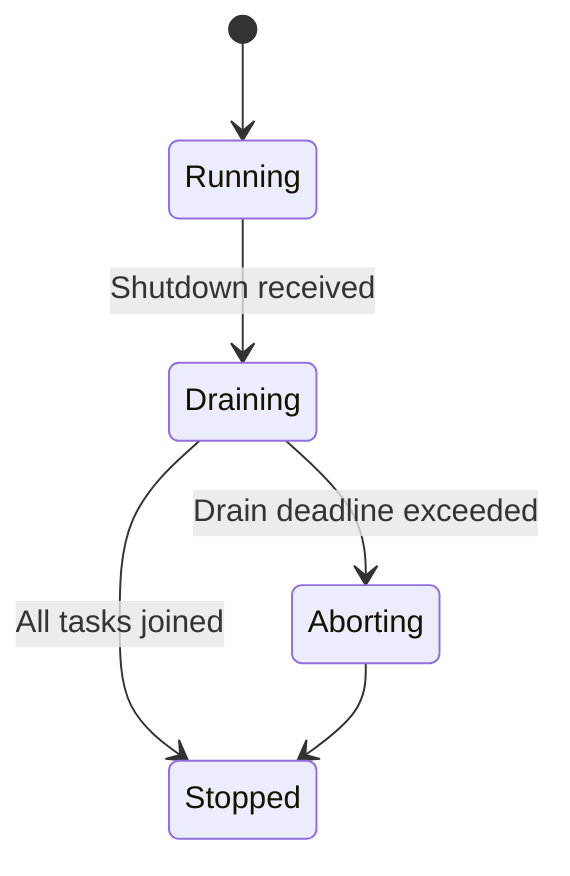
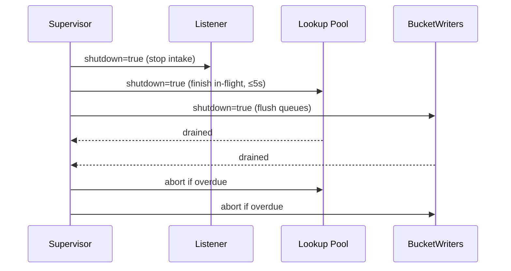
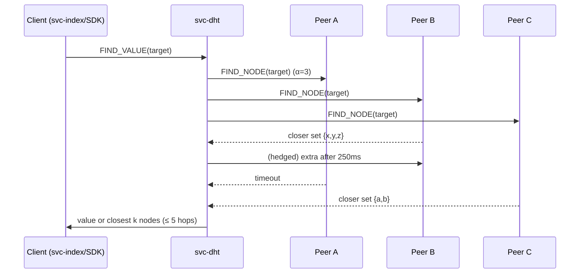
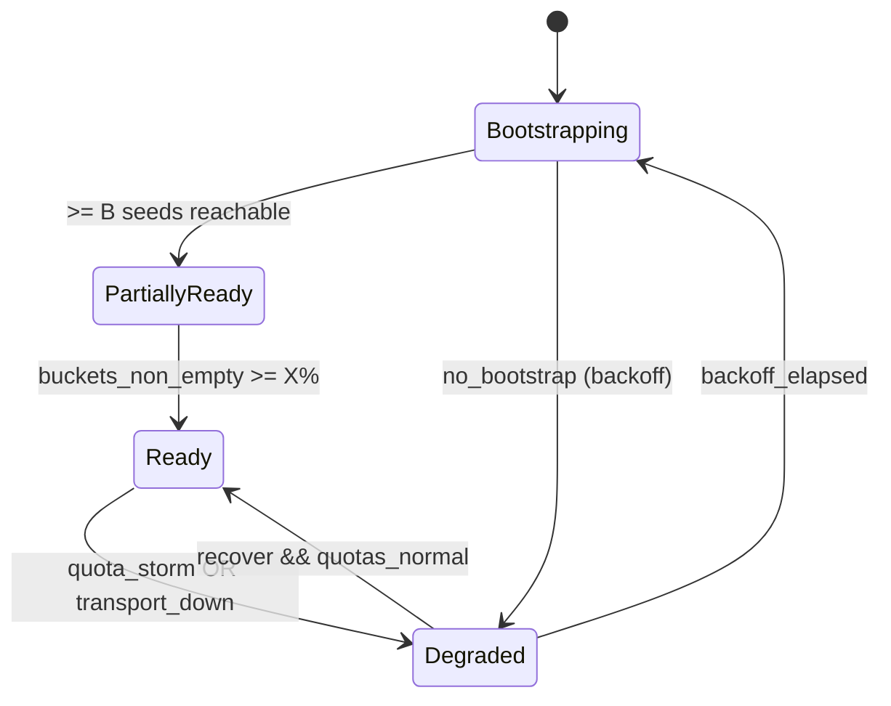

# Combined Markdown

_Source directory_: `crates/svc-dht/docs`  
_Files combined_: 13  
_Recursive_: 0

---

### Table of Contents

- API.MD
- CONCURRENCY.MD
- CONFIG.MD
- GOVERNANCE.MD
- IDB.md
- INTEROP.MD
- OBSERVABILITY.MD
- OLD_README.md
- PERFORMANCE.MD
- QUANTUM.MD
- RUNBOOK.MD
- SECURITY.MD
- TESTS.MD

---

## API.MD
_File 1 of 13_

````markdown
---
title: API Surface & SemVer Reference — svc-dht
status: draft
msrv: 1.80.0
last-updated: 2025-10-11
audience: contributors, auditors, API consumers
---

# API.md — svc-dht

## 0. Purpose

This document captures the **public API surface** of `svc-dht`:

- Snapshot of exported Rust symbols (functions, types, traits, modules) and **service endpoints**.
- **SemVer discipline:** what changes are additive vs. breaking.
- Alignment with `CHANGELOG.md` (behavioral vs. surface changes).
- CI-enforceable via `cargo public-api` and optional `cargo semver-checks`.
- Serves as the “spec” for external consumers: SDK authors, operators, auditors.

> `svc-dht` is a **service crate**. Its API includes:
> - Minimal Rust exports intended for wiring/testing.
> - **CLI** flags & exit codes.
> - **HTTP** endpoints (`/metrics`, `/healthz`, `/readyz`, `/version`).
> - **DHT RPCs** (wire-level) over `ron-transport`.

---

## 1. Public API Surface (Rust)

Generated via:

```bash
cargo public-api -p svc-dht --simplified --deny-changes
````

> The list below is a maintained snapshot. Update on any symbol change.
> Rust surface is intentionally **small**; internals remain crate-private.

### 1.1 Current Surface Snapshot (Rust)

```text
# Keep in sync with actual `cargo public-api --simplified` output

pub mod api            // wire/HTTP schema types (#[non_exhaustive])
pub mod config         // Config (public for integration/tests)
pub mod error          // DhtError (#[non_exhaustive])
pub mod metrics        // Metrics handle + constructors
pub mod version        // Build info for /version endpoint

pub use crate::config::Config;
pub use crate::error::DhtError;

pub struct Metrics;                              // opaque handle
pub fn run(cfg: Config) -> Result<(), DhtError>; // main runner
pub fn build_info() -> &'static version::BuildInfo;
```

### 1.2 API History Snapshots

* Stored at: `docs/api-history/svc-dht/<crate-version>.txt` (exact output of `cargo public-api --simplified`).
* CI posts a **diff** vs. previous snapshot on each PR (see §6).

---

## 2. Service API Surface (non-Rust)

### 2.1 CLI (stable surface)

```text
svc-dht [FLAGS] [--config <path>]

  --bind <ip:port>                     # HTTP/ingress bind
  --metrics <ip:port>                  # Prometheus bind
  --max-conns <num>
  --read-timeout <dur>                 # e.g., 5s, 250ms
  --write-timeout <dur>
  --idle-timeout <dur>

  --alpha <n> --beta <n> --k <n> --hop-budget <n>
  --rpc-timeout <dur> --hedge-after <dur>

  --bootstrap-required <n>
  --ready-bucket-fill <pct>
  --bootstrap-seed <host:port>         # repeatable

  --asn-max-pct <pct> --asn-entropy-min <bits>
  --he-stagger <dur>

  --pq-dual-sign | --no-pq-dual-sign
  --pq-require-pq-on <YYYY-MM-DD>
  --pq-alg <name>                      # repeatable

  --amnesia
  --profile <micronode|macronode>
  --log-format <json|text>
  --log-level <trace|debug|info|warn|error>
  --version
  --help
```

**CLI SemVer rules**

* **Additive**: new flags with safe defaults → **minor**.
* **Breaking**: rename/remove flags, or change default **semantics** → **major**.
* **Patch**: help text, aliases (keep old flag), non-behavioral defaults → **patch**.

**Exit codes**

* `0` success; `2` bad config/validation; `3` bind error; `4` bootstrap timeout (if `--strict-ready` enabled); `>10` reserved.

### 2.2 HTTP (operational endpoints)

| Method | Path       | Purpose            | Code(s) | Notes                                                    |
| -----: | ---------- | ------------------ | ------- | -------------------------------------------------------- |
|    GET | `/metrics` | Prometheus metrics | 200     | Bind on `metrics_addr`; **localhost in prod**            |
|    GET | `/healthz` | Liveness           | 200     | Handler always returns quickly                           |
|    GET | `/readyz`  | Readiness          | 200/503 | On 503 returns JSON with `missing[]`, `retry_after`      |
|    GET | `/version` | Build info         | 200     | `{ service, version, git, build_ts, rustc, features[] }` |

**HTTP SemVer rules**

* Adding **fields** to `/version` → **minor**.
* Changing field names/types → **major**.
* `/metrics` names in §5.1 are contractual (see **metrics-as-API**).

### 2.3 DHT RPCs (wire-level)

Kademlia-style RPCs over `ron-transport` (TLS/QUIC/TCP, optional Tor). **Protocol envelopes include** `proto_ver: u16` (current: `1`).

| Op           | Dir          | Request (sketch)                           | Response (sketch)                                       | Notes                           |
| ------------ | ------------ | ------------------------------------------ | ------------------------------------------------------- | ------------------------------- |
| `FIND_NODE`  | bi-dir       | `{ proto_ver:1, target_key:b3, corr_id }`  | `{ proto_ver:1, closest:[NodeInfo;≤k], corr_id }`       | Hop budget ≤ `hop_budget`       |
| `FIND_VALUE` | bi-dir       | `{ proto_ver:1, content_key:b3, corr_id }` | `{ proto_ver:1, value?:ProviderRecord, closest?:[..] }` | Value or closest nodes          |
| `PROVIDE`    | inbound      | `{ proto_ver:1, record:ProviderRecord }`   | `{ proto_ver:1, accepted:bool, reason? }`               | Verify signatures; TTL enforced |
| `STORE`      | inbound(opt) | `{ proto_ver:1, key, value, sigs[] }`      | `{ proto_ver:1, accepted:bool, reason? }`               | Feature-gated                   |

**ProviderRecord (stable sketch, non-normative)**

```json
{
  "proto_ver": 1,
  "key": "b3:<hex-32>",
  "publisher": "peer:<id>",
  "addrs": ["tcp://host:port","quic://host:port"],
  "ttl": 86400,
  "ts": 1731264000,
  "sigs": [
    {"alg":"ed25519","sig":"<base64>"},
    {"alg":"mldsa87","sig":"<base64>"}  // optional PQ during migration
  ]
}
```

**Wire SemVer rules**

* **Additive**: new **optional** fields → **minor**; older peers must ignore them.
* **Breaking**: incompatible wire changes bump **proto_ver**; must be **flag-gated** prior to defaulting.
* **Behavioral** tightening (e.g., require PQ after `require_pq_on`): **minor** if gated with compatibility mode; **major** if ungated.

**Protocol versioning policy**

* `proto_ver = 1` initial line. Additive changes keep major; incompatible changes bump to `2`, announced with a deprecation window (§3.4).

---

## 3. SemVer Discipline

### 3.1 Additive (Minor / Non-Breaking)

* New public functions/types/modules **behind non-default features**.
* Extending `#[non_exhaustive]` enums/structs with new variants/fields.
* Adding `/version` fields, **new metrics**, or **optional** RPC fields.

### 3.2 Breaking (Major)

* Remove/rename exports.
* Change function signatures, trait bounds, or error types.
* Make `#[non_exhaustive]` types exhaustive.
* Remove CLI flags or change their semantics non-compatibly.
* Change **required** wire fields or accept/reject logic **without** a gate.

### 3.3 Patch-Level

* Doc/test-only changes.
* Perf improvements with identical API/behavior.
* Metrics **bucket** tuning that does not break alert contracts (§5.2).

### 3.4 Behavioral Deprecation Window

For **behavioral tightenings** (e.g., stricter signature acceptance, PQ requirement):

* Announce in CHANGELOG and API.md.
* Emit WARN telemetry for **≥ 1 minor release** (or **≥ 90 days**) with counters/samples.
* Provide a config/feature flag for **compat mode** during the window.
* After the window, switch default to strict mode (may be **minor** if gated; **major** if ungated).

---

## 4. API Invariants

* **Service-first:** minimal Rust surface; internals (runtime/transport/buckets) are private.
* **No internal leakage:** do not expose `tokio`/transport concrete types unintentionally.
* **Non-exhaustive errors:** public error enums are `#[non_exhaustive]`.
* **Stable op names:** `FIND_NODE`, `FIND_VALUE`, `PROVIDE`, `STORE?` additions → minor; removals → major.
* **Metrics as API:** alert-coupled metric names/labels are **contractual** (§5).

---

## 5. Observability API (Contract)

### 5.1 Canonical Names (do not rename without deprecation)

* `dht_lookup_hops_histogram_bucket`
* `dht_lookup_latency_seconds`
* `rejected_total{reason}`
* `pq_dual_sign_ratio`
* `dht_bucket_asn_entropy_bits`
* `dht_ready_bucket_fill_pct`
* `tls_handshake_failures_total`

### 5.2 Alert Coupling (contractual)

* **Hop SLO:** p99 hops ≤ 5 (from `dht_lookup_hops_histogram_bucket`).
* **PQ Ratio:** `pq_dual_sign_ratio ≥ 0.95` during migration.
* **Diversity:** `avg_over_time(dht_bucket_asn_entropy_bits[15m]) ≥ 1.5`.
* **Quota:** `sum(rate(rejected_total{reason="quota"}[5m]))`.

**Metric deprecation policy**

* Provide a duplicate metric/label for **≥ 1 minor** (or **90 days**) with deprecation notice; migrate dashboards/alerts in the same PR.

---

## 6. Tooling & CI Gates

**Minimum tool versions**

* `cargo-public-api` **≥ 0.44.0**
* `cargo-semver-checks` **≥ 0.44.0**
* `rustc` **= 1.80.0** (MSRV)

**Commands**

```bash
cargo public-api -p svc-dht --simplified --deny-changes
cargo semver-checks check-release -p svc-dht
RUSTDOCFLAGS="--deny warnings" cargo doc -p svc-dht
```

**API history snapshots**

* On release: write `docs/api-history/svc-dht/<version>.txt` from `cargo public-api --simplified`.
* CI diff (PR comment):

```bash
git diff --no-index \
  docs/api-history/svc-dht/<prev>.txt \
  docs/api-history/svc-dht/<next>.txt || true
```

**Fail policy**

* Surface diff without matching CHANGELOG entry → **fail**.
* `--deny-changes` failure without `semver-ack` label → **fail**.

---

## 7. Behavior vs. Surface (CHANGELOG Mapping)

* **Surface**: list added/removed Rust symbols, flags, endpoints.
* **Behavior**: stricter policy/validation, SLO adjustments; include migration steps and deprecation windows (§3.4).
* **Observability**: metric/label changes + alert migration notes.

---

## 8. Acceptance Checklist (Definition of Done)

* [ ] Current `cargo public-api` snapshot stored at `docs/api-history/svc-dht/<version>.txt`.
* [ ] SemVer impact reviewed (minor/major/patch justified).
* [ ] CI gates pass (`cargo public-api`; optional `cargo semver-checks`).
* [ ] `CHANGELOG.md` updated (surface + behavior).
* [ ] Docs/tests updated for new/changed APIs.
* [ ] Service endpoints documented; payload examples updated.
* [ ] Metrics/alerts coupling reviewed; deprecations (if any) staged.

---

## 9. Appendix

### 9.1 References

* Rust SemVer: [https://doc.rust-lang.org/cargo/reference/semver.html](https://doc.rust-lang.org/cargo/reference/semver.html)
* cargo-public-api: [https://github.com/Enselic/cargo-public-api](https://github.com/Enselic/cargo-public-api)
* cargo-semver-checks: [https://github.com/obi1kenobi/cargo-semver-checks](https://github.com/obi1kenobi/cargo-semver-checks)

### 9.2 Example `/version` payload

```json
{
  "service": "svc-dht",
  "version": "0.2.0",
  "git": "a1b2c3d (dirty: false)",
  "build_ts": "2025-10-11T14:23:11Z",
  "rustc": "1.80.0 (stable)",
  "features": ["pq","tls"]
}
```

### 9.3 Example `/readyz` 503 payload

```json
{
  "service": "svc-dht",
  "degraded": true,
  "missing": ["bootstrap_min_seeds","bucket_fill_pct"],
  "retry_after": 10
}
```

---

## 10. API Test Matrix (smoke/contract)

| Area    | Test                                           | Expectation                                                   |
| ------- | ---------------------------------------------- | ------------------------------------------------------------- |
| CLI     | `svc-dht --version`                            | JSON matches `/version` fields; exit 0                        |
| CLI     | unknown flag                                   | Non-zero exit; helpful usage on stderr                        |
| HTTP    | `/readyz` pre-bootstrap                        | `503` with `missing[]`; schema matches example                |
| HTTP    | `/version`                                     | Contains `service, version, git, build_ts, rustc, features[]` |
| Metrics | Registry                                       | Presence of contractual metrics (§5.1), correct types         |
| Wire    | `proto_ver=1` + unknown optional field         | Ignored by receiver without error                             |
| Wire    | Signature policy tightening in **compat mode** | WARN + accept during window; REJECT after window toggled      |
| SemVer  | `cargo public-api --deny-changes`              | No diffs unless CHANGELOG + `semver-ack` label present        |

---

✅ With this reference:

* The Rust surface stays **tight** and intentional.
* **CLI/HTTP/metrics/wire** are treated as API with SemVer expectations.
* CI enforces drift control, and the changelog tells consumers what changed and how to migrate.

```
```


---

## CONCURRENCY.MD
_File 2 of 13_

````markdown
---
title: Concurrency Model — svc-dht
crate: svc-dht
owner: Stevan White
last-reviewed: 2025-10-10
status: draft
template_version: 1.1
msrv: 1.80.0
tokio: "1.x (pinned at workspace root)"
loom: "0.7+ (dev-only)"
lite_mode: "N/A (service crate)"
---

# Concurrency Model — svc-dht

This document makes the concurrency rules **explicit**: tasks, channels, locks, shutdown, timeouts,
and validation (property/loom/TLA+). It complements `docs/SECURITY.md`, `docs/CONFIG.md`,
and the crate’s `README.md` and `IDB.md`.

> **Golden rule:** never hold a lock across `.await` in supervisory or hot paths.

---

## 0) Lite Mode

N/A — `svc-dht` is a service with background tasks.

---

## 1) Invariants (MUST)

- [I-1] **No lock across `.await`.** If unavoidable, split the critical section; prefer message passing.
- [I-2] **Single writer per mutable resource.** Each k-bucket is mutated by its **BucketWriter** task. Readers use snapshots.
- [I-3] **Bounded channels only.** Every mpsc/broadcast has a finite capacity and a documented overflow policy.
- [I-4] **Explicit deadlines.** All DHT RPCs and I/O have a deadline enforced by `timeout()`; timeouts map to typed errors.
- [I-5] **Cooperative cancellation.** All `.await` points are cancel-safe or guarded by `select!` with shutdown.
- [I-6] **Graceful shutdown.** On `Shutdown`, stop intake, drain within deadline (default 5s), then abort stragglers.
- [I-7] **No blocking syscalls on runtime.** Use `spawn_blocking` for crypto/FS as needed; cap pool usage.
- [I-8] **No task leaks.** Every spawned task is tracked; detached tasks are documented and bounded.
- [I-9] **Backpressure over buffering.** Prefer `Busy`/shed with metrics to growing queues.
- [I-10] **Framing is length-checked** and guards against split/partial reads.
- [I-11] **Async Drop discipline.** `Drop` never blocks; expose async `close()/shutdown()` and call it before drop.

---

## 2) Runtime Topology

**Runtime:** Tokio multi-threaded scheduler.

**Primary tasks (actors):**
- **Supervisor** — owns lifecycle, health/ready gates, and shutdown broadcast; restarts children with jittered backoff (max 60s).
- **RPC Listener** — accepts inbound DHT RPCs (`FIND_NODE`, `FIND_VALUE`, `PROVIDE`, `STORE`); pushes work into bounded queues.
- **Lookup Pool** — `N` workers executing Kademlia lookups using concurrent probes (`α`) and hedging; results reported to Supervisor.
- **BucketWriter(s)** — 1 task per k-bucket handling inserts/evicts/refreshes; enforces single-writer invariant.
- **Republisher** — periodically republishes provider records before TTL expiry.
- **Bootstrapper** — dials seeds until `B` seeds reachable and `X%` buckets non-empty; gates `/readyz`.
- **Metrics Exporter** — serves `/metrics`; no heavy work, piggybacks on shared registry.
- **Rate-Limiter** — process-wide semaphores/limiters (RPS/inflight/bytes) used by Listener/Pool.

```mermaid
flowchart TB
  subgraph Runtime
    SUP[Supervisor] -->|spawn| L[RPC Listener]
    SUP -->|spawn| P[Lookup Pool (W1..Wm)]
    SUP -->|spawn| BW[BucketWriter(s)]
    SUP -->|spawn| R[Republisher]
    SUP -->|spawn| BS[Bootstrapper]
    SUP -->|spawn| MX[Metrics Exporter]
    L -->|mpsc:work(512)| P
    P -->|mpsc:route(1024)| BW
    R -->|mpsc:route(1024)| BW
    SUP -->|watch Shutdown| L
    SUP -->|watch Shutdown| P
    SUP -->|watch Shutdown| BW
    SUP -->|watch Shutdown| R
    SUP -->|watch Shutdown| BS
  end
  style SUP fill:#0ea5e9,stroke:#0c4a6e,color:#fff
````

**Text description:** Supervisor spawns Listener, Lookup Pool, BucketWriters, Republisher, Bootstrapper, and Metrics. Listener feeds Lookup Pool via bounded `work` queue; workers and republisher send routing changes to BucketWriters via bounded `route` queue. All tasks subscribe to a `Shutdown` watch.

---

## 3) Channels & Backpressure

**Inventory (bounded unless noted):**

| Name           | Kind        |  Cap | Producers → Consumers                | Backpressure Policy                      | Drop Semantics                          |
| -------------- | ----------- | ---: | ------------------------------------ | ---------------------------------------- | --------------------------------------- |
| `work_tx`      | `mpsc`      |  512 | RPC Listener → Lookup Pool           | `try_send` else return `Busy`            | `busy_rejections_total{queue="work"}`++ |
| `route_tx[b]`  | `mpsc`      | 1024 | Lookup/Republisher → BucketWriter[b] | `send().await` w/ per-send timeout       | on timeout: count `route_dropped_total` |
| `events_tx`    | `broadcast` | 1024 | Core → subscribers (SDK/ops)         | lag counter; drop **oldest** on overflow | `bus_lagged_total`++, WARN w/ `lag`     |
| `shutdown_rx`  | `watch`     |    1 | Supervisor → N                       | last-write wins                          | N/A                                     |
| `rate_limiter` | semaphore   |    — | All RPC handlers                     | `try_acquire_many` → `Busy` if none      | `quota_reject_total{kind}`++            |

**Guidelines**

* Prefer **rejecting early** (`Busy`) to accepting unbounded latency.
* Keep per-queue **depth gauge**: `queue_depth{queue}`.
* For `route_tx[b]`, impose **send timeout** (e.g., 100ms) to avoid head-of-line blocking on misbehaving bucket writers.

---

## 4) Locks & Shared State

**Allowed**

* Short-lived `Mutex/RwLock` protecting **metadata** (e.g., metrics registry init, config snapshot swap). Never `.await` under guard.
* **Arc<Snapshot>** for read-mostly routing table views by Lookup workers (replaced atomically by BucketWriter commits).
* Per-connection state **owned by its task**; cross-task communication via channels only.

**Forbidden**

* Holding any lock across `.await`.
* Nested locks without explicit hierarchy.

**Hierarchy (if unavoidable)**

1. `state_meta`
2. `routing_snapshot`
3. `counters`

**Pattern:** All mutations to routing state go through the **BucketWriter actor**, not via locks.

---

## 5) Timeouts, Retries, Deadlines

* **I/O caps** (from config defaults): `read=5s`, `write=5s`, `idle=60s`.
* **Transport RPC**: `rpc_timeout≈1500ms` per probe; **hedge** after `250ms` (cancel losers on first success).
* **Lookup deadline**: `hop_budget=5`; enforce `p99 ≤ 5 hops`.
* **Retries**: Only for idempotent ops (`FIND_NODE`, `FIND_VALUE`). Jittered backoff `50–100ms`, exponential to `≤2s`, **max 3 tries**.
* **Per-send timeout** on `route_tx[b]` to BucketWriter: `≤100ms`.
* **Circuit breaker (optional)**: open on consecutive timeouts; half-open probe count 1–3.

```mermaid
sequenceDiagram
  autonumber
  participant C as Caller
  participant D as svc-dht
  C->>D: FIND_VALUE (deadline=2s)
  D->>D: spawn probes α; hedge after 250ms
  D-->>C: value or closest k (≤5 hops) or Timeout/Busy
```

---

## 6) Cancellation & Shutdown

* **Signal:** `KernelEvent::Shutdown` or CTRL-C.
* **Propagation:** Each task runs `tokio::select! { _ = shutdown.changed() => ..., }` in loops.
* **Phases:**

  1. **Quiesce intake:** Listener stops accepting new RPCs; return `NotReady`/`Busy`.
  2. **Drain:** Lookup Pool finishes in-flight up to **drain deadline** (default 5s).
  3. **Abort:** Abort tasks exceeding the deadline; increment `tasks_aborted_total{kind}`.
* **Idempotency:** Shutdown can be signaled multiple times; tasks ignore extra changes.



---

## 7) I/O & Framing

* **Framing:** Length-delimited messages w/ max frame (`1MiB` default). Validate length before allocation.
* **Reads/Writes:** Use `AsyncReadExt/AsyncWriteExt`; always `.shutdown().await` on success/error.
* **Partial reads:** Assemble frames over multiple reads; reject overlong or truncated frames.
* **Checksum/signature:** Where present (record envelopes), verify **off-IO path** (use `spawn_blocking` with budget).

---

## 8) Error Taxonomy (Concurrency-Relevant)

| Error      | When                        | Retry?    | Metric                            | Notes                          |
| ---------- | --------------------------- | --------- | --------------------------------- | ------------------------------ |
| `Busy`     | queue/semaphore exhausted   | maybe     | `busy_rejections_total{endpoint}` | Caller may backoff             |
| `Timeout`  | rpc or route send timed out | sometimes | `io_timeouts_total{op}`           | Includes hedged probe timeouts |
| `Canceled` | shutdown hit                | no        | `tasks_canceled_total{kind}`      | Cooperative                    |
| `Lagging`  | broadcast overflow          | no        | `bus_lagged_total`                | Warn + drop oldest             |
| `NotReady` | during drain/bootstrap      | yes       | `not_ready_total{phase}`          | Honours readiness gates        |

All map to the public `DhtError` where relevant.

---

## 9) Metrics (Concurrency Health)

* `queue_depth{queue}` gauge (work, route)
* `queue_dropped_total{queue}`
* `tasks_spawned_total{kind}`, `tasks_aborted_total{kind}`, `tasks_canceled_total{kind}`
* `io_timeouts_total{op}` (`read`,`write`,`connect`,`find_node`,`find_value`)
* `backoff_retries_total{op}`
* `busy_rejections_total{endpoint}`
* `hedge_spawned_total`, `hedge_canceled_total`

---

## 10) Validation Strategy

**Unit/Property**

* Backpressure: `try_send` → `Busy` under saturation; no silent growth.
* Deadline honoured: RPCs do not exceed configured timeouts by >5%.
* Single-writer: mutations only via BucketWriter; assert no concurrent mutable access.

**Loom (dev-only)**

* Model: **producer → mpsc(work) → worker → mpsc(route) → bucket_writer** plus shutdown.
* Assert: no deadlock, no missed shutdown, no message reordering that violates invariants.

**Fuzz**

* Frame decoder (length+payload) with boundary sizes (0, 1, 1MiB, 1MiB+1).
* Provider-record parsing under concurrent submission (fuzzer thread + actor).

**Chaos**

* Kill/respawn Lookup workers under load; verify success rate recovers; `/readyz` toggles properly.

**(Optional) TLA+**

* Model lookup steps and bucket updates; safety (no dup/invalid insert), liveness (eventual completion under bounded faults).

---

## 11) Code Patterns (Copy-Paste)

### 11.1 BucketWriter actor (single writer)

```rust
pub enum RouteCmd {
    Insert(Node),
    Seen(NodeId),
    Evict(NodeId),
}

pub struct BucketWriter {
    rx: tokio::sync::mpsc::Receiver<RouteCmd>,
    snapshot: Arc<RoutingSnapshot>,
}

impl BucketWriter {
    pub async fn run(mut self, mut shutdown: tokio::sync::watch::Receiver<bool>) {
        loop {
            tokio::select! {
                _ = shutdown.changed() => break,
                biased;
                Some(cmd) = self.rx.recv() => {
                    // Mutate local structures without awaiting external I/O.
                    self.apply(cmd);
                    // Publish a fresh snapshot atomically (no await).
                    self.snapshot = Arc::new(self.snapshot.commit());
                }
                else => break,
            }
        }
    }
}
```

### 11.2 Lookup worker with hedging + cancel-safety

```rust
pub async fn run_lookup(req: LookupReq, net: Net, cfg: LookupCfg, mut shutdown: watch::Receiver<bool>) -> Result<Answer> {
    let mut hops = 0usize;
    let mut frontier = closest(req.target, cfg.alpha * 2);
    while hops < cfg.hop_budget {
        let batch: Vec<Node> = next_batch(&mut frontier, cfg.alpha);
        if batch.is_empty() { break; }
        let (tx, mut rx) = tokio::sync::mpsc::channel(batch.len());
        let mut join = tokio::task::JoinSet::new();

        for peer in batch {
            let tx = tx.clone();
            join.spawn(async move {
                let ans = tokio::time::timeout(cfg.rpc_timeout, net.find_node(peer, req.target)).await;
                let _ = tx.send(ans).await;
            });
        }
        let mut hedge = tokio::time::sleep(cfg.hedge_after);
        tokio::pin!(hedge);

        let mut improved = false;
        for _ in 0..cfg.alpha {
            tokio::select! {
                _ = shutdown.changed() => return Err(Error::Canceled),
                _ = &mut hedge, if join.len() < (cfg.alpha + cfg.beta) => {
                    // Hedge by spawning extra probes up to beta
                    if let Some(extra) = frontier.pop() {
                        let tx = tx.clone();
                        join.spawn(async move {
                            let ans = tokio::time::timeout(cfg.rpc_timeout, net.find_node(extra, req.target)).await;
                            let _ = tx.send(ans).await;
                        });
                    }
                }
                Some(res) = rx.recv() => {
                    if let Ok(Ok(reply)) = res {
                        improved |= consider(reply, &mut frontier);
                    }
                }
            }
        }
        // Cancel losers quickly
        join.abort_all();
        if !improved { break; }
        hops += 1;
    }
    make_answer(frontier).ok_or(Error::HopExceeded)
}
```

### 11.3 Backpressure-first enqueue

```rust
match work_tx.try_send(job) {
    Ok(()) => {}
    Err(tokio::sync::mpsc::error::TrySendError::Full(_)) => {
        metrics::busy_rejections_total("rpc").inc();
        return Err(Error::Busy);
    }
    Err(e) => return Err(Error::from(e)),
}
```

### 11.4 Timeout with deadline

```rust
let res = tokio::time::timeout(cfg.read_timeout, read_frame(&mut stream)).await?;
```

### 11.5 Cooperative shutdown skeleton

```rust
let (shutdown_tx, shutdown_rx) = tokio::sync::watch::channel(false);
let worker = tokio::spawn(worker_loop(work_rx, shutdown_rx.clone()));
// later:
let _ = shutdown_tx.send(true);
let _ = tokio::time::timeout(Duration::from_secs(5), worker).await;
```

### 11.6 Async Drop pattern

```rust
pub struct Client { inner: Option<Conn> }
impl Client {
  pub async fn close(&mut self) -> anyhow::Result<()> {
    if let Some(mut c) = self.inner.take() { c.shutdown().await?; }
    Ok(())
  }
}
impl Drop for Client {
  fn drop(&mut self) {
    if self.inner.is_some() { tracing::debug!("Client dropped without close()"); }
  }
}
```

---

## 12) Configuration Hooks (Quick Reference)

* Channel capacities: `work=512`, `route=1024`, broadcast=1024.
* Timeouts: `rpc_timeout`, `hedge_after`, transport `read/write/idle`.
* Limits: inflight semaphore counts, global RPS.
* Drain deadline (`5s`) and per-send timeout to BucketWriters (`100ms`).
* Lookup tuning: `alpha`, `beta`, `hop_budget`.

See `docs/CONFIG.md` for authoritative schema.

---

## 13) Known Trade-offs / Nonstrict Areas

* **Drop oldest vs reject new** on broadcast: chosen to keep subscribers roughly in sync at the cost of losing oldest events.
* **Send-timeout to BucketWriter** may drop routing updates under extreme saturation; lookup correctness still holds (next refresh will reconcile).
* **Hedging** increases network cost modestly to cut tails; bounded by `beta` and canceled aggressively.

---

## 14) Mermaid Diagrams

### 14.1 Task & Queue Topology

```mermaid
flowchart LR
  IN[RPC Listener] -->|mpsc:work (512)| W1[Lookup W1]
  IN -->|mpsc:work (512)| W2[Lookup W2]
  W1 -->|mpsc:route (1024)| BW1[BucketWriter #1]
  W2 -->|mpsc:route (1024)| BW2[BucketWriter #2]
  RP[Republisher] -->|mpsc:route (1024)| BW1
  subgraph Control
    SHUT[watch: Shutdown] --> IN
    SHUT --> W1
    SHUT --> W2
    SHUT --> RP
    SHUT --> BW1
    SHUT --> BW2
  end
```

**Text:** Listener feeds Lookup workers; workers/republisher send routing changes to per-bucket writers; Shutdown watch fans out to all.

### 14.2 Shutdown Sequence



---

## 15) CI & Lints (Enforcement)

**Clippy**

* `-D clippy::await_holding_lock`
* `-D clippy::needless_collect`
* `-D clippy::useless_async`
* `-D warnings` (workspace standard)

**Actions (suggested)**

```yaml
name: svc-dht-concurrency-guardrails
on: [push, pull_request]
jobs:
  clippy:
    runs-on: ubuntu-latest
    steps:
      - uses: actions/checkout@v4
      - uses: dtolnay/rust-toolchain@stable
      - run: cargo clippy -p svc-dht -- -D warnings -D clippy::await_holding_lock

  loom:
    if: github.event_name == 'pull_request'
    runs-on: ubuntu-latest
    steps:
      - uses: actions/checkout@v4
      - uses: dtolnay/rust-toolchain@stable
      - run: RUSTFLAGS="--cfg loom" cargo test -p svc-dht --tests -- --ignored

  fuzz:
    runs-on: ubuntu-latest
    steps:
      - uses: actions/checkout@v4
      - uses: dtolnay/rust-toolchain@stable
      - run: cargo install cargo-fuzz
      - run: cargo fuzz build -p svc-dht
```

---

## 16) Schema Generation (Optional)

Automate **Channels/Locks tables** to prevent drift:

* Annotate channel creation sites with a lightweight macro, e.g.:

  ```rust
  #[doc_channel(name="work", kind="mpsc", cap=512, policy="try_send")]
  let (work_tx, work_rx) = tokio::sync::mpsc::channel(512);
  ```

* A small build script can emit `docs/_generated/concurrency.channels.mdfrag` for inclusion.

* Add a golden test that **counts** channels and compares to the doc table.

---

## 17) Review & Maintenance

* **Review cadence:** every 90 days or on any change to tasks/channels/locks.
* Keep **owner**, **msrv**, **last-reviewed** current.
* **PR checklist:** If you modify concurrency, update this doc + tests (unit/loom).

```
```


---

## CONFIG.MD
_File 3 of 13_

````markdown
---
title: Configuration — svc-dht
crate: svc-dht
owner: Stevan White
last-reviewed: 2025-10-10
status: draft
template_version: 1.1
---

# Configuration — svc-dht

This document defines **all configuration** for `svc-dht`, including sources,
precedence, schema (types/defaults), validation, feature flags, live-reload behavior,
and security implications. It complements `README.md`, `docs/SECURITY.md`, and the IDB.

> **Tiering:** Service crate — all sections apply (network, readiness, observability, etc.).

---

## 1) Sources & Precedence (Authoritative)

Configuration may come from multiple sources. **Precedence (highest wins):**

1. **Process flags** (CLI)  
2. **Environment variables**  
3. **Config file** (e.g., `Config.toml` beside the binary or passed via `--config`)  
4. **Built-in defaults** (hard-coded in `src/config.rs`)

When reloading dynamically, the effective config is recomputed under the same precedence.

**Supported file formats:** TOML (preferred), JSON (optional).  
**Path resolution order for `--config` (if relative):** `./`, `$CWD`, crate dir.  
**Environment variable prefix:** `SVC_DHT_` (e.g., `SVC_DHT_BIND_ADDR`).

---

## 2) Quickstart Examples

### 2.1 Minimal service start

```bash
RUST_LOG=info \
SVC_DHT_BIND_ADDR=0.0.0.0:8080 \
SVC_DHT_METRICS_ADDR=127.0.0.1:0 \
cargo run -p svc-dht
````

### 2.2 Config file (TOML) — recommended baseline

```toml
# Config.toml
bind_addr     = "0.0.0.0:8080"
metrics_addr  = "127.0.0.1:0"
max_conns     = 1024
read_timeout  = "5s"
write_timeout = "5s"
idle_timeout  = "60s"

[transport]
read_timeout     = "1500ms"
write_timeout    = "1500ms"
idle_timeout     = "60s"
max_frame_bytes  = "1MiB"

[tls]
enabled = false
# cert_path = "/etc/ron/cert.pem"
# key_path  = "/etc/ron/key.pem"

[limits]
max_body_bytes       = "1MiB"
decompress_ratio_cap = 10
max_inflight         = 512
max_rps              = 500

[dht]
alpha       = 3
beta        = 2
k           = 20
hop_budget  = 5
rpc_timeout = "1500ms"
hedge_after = "250ms"

[provider]
ttl_secs         = 86400    # 24h
refresh_secs     = 43200    # 12h
max_record_bytes = "16KiB"

[bootstrap]
required              = 3
ready_bucket_fill_pct = 60
seeds = [
  "node1.ron.example:6891",
  "node2.ron.example:6891"
]

[diversity]
asn_max_pct     = 40
asn_entropy_min = 1.5

[nat]
happy_eyeballs_stagger = "75ms"

[pq]
dual_sign     = true
require_pq_on = "2026-06-01"
algorithms    = ["ed25519","mldsa87"]

[amnesia]
enabled = false

[log]
format = "json"         # json|text
level  = "info"         # trace|debug|info|warn|error
```

### 2.3 CLI flags (override file/env)

```bash
cargo run -p svc-dht -- \
  --bind 0.0.0.0:8080 \
  --metrics 127.0.0.1:0 \
  --max-conns 2048 \
  --alpha 4 --beta 2 --k 20 --hop-budget 5 \
  --rpc-timeout 1500ms --hedge-after 250ms \
  --bootstrap-required 3 --ready-bucket-fill 60 \
  --bootstrap-seed node1.ron.example:6891 \
  --bootstrap-seed node2.ron.example:6891 \
  --asn-max-pct 40 --asn-entropy-min 1.5 \
  --pq-dual-sign --pq-require-pq-on 2026-06-01 \
  --profile micronode
```

### 2.4 Docker Compose (example)

```yaml
version: "3.9"
services:
  svc-dht:
    image: ghcr.io/rustyonions/svc-dht:latest
    environment:
      RUST_LOG: info
      SVC_DHT_BIND_ADDR: 0.0.0.0:8080
      SVC_DHT_METRICS_ADDR: 0.0.0.0:9090
      SVC_DHT_ALPHA: 3
      SVC_DHT_PQ_DUAL_SIGN: "true"
    ports:
      - "8080:8080"
      - "9090:9090"
    read_only: true
    tmpfs:
      - /tmp:size=32m,mode=1777
```

---

## 3) Schema (Typed, With Defaults)

> **Durations** accept `ms`, `s`, `m`, `h`. **Sizes** accept `B`, `KB`, `MB`, `MiB`, `GiB`.

| Key / Env Var                                                   | Type                          |                 Default | Description                        | Security Notes                              |
| --------------------------------------------------------------- | ----------------------------- | ----------------------: | ---------------------------------- | ------------------------------------------- |
| `bind_addr` / `SVC_DHT_BIND_ADDR`                               | socket                        |           `127.0.0.1:0` | HTTP/ingress bind address          | Public binds require firewall/threat review |
| `metrics_addr` / `SVC_DHT_METRICS_ADDR`                         | socket                        |           `127.0.0.1:0` | Prometheus endpoint bind           | Prefer localhost in prod; gateway scrape    |
| `max_conns` / `SVC_DHT_MAX_CONNS`                               | u32                           |                  `1024` | Max concurrent connections         | Prevents FD exhaustion                      |
| `read_timeout` / `SVC_DHT_READ_TIMEOUT`                         | duration                      |                    `5s` | Per-request read timeout           | DoS mitigation                              |
| `write_timeout` / `SVC_DHT_WRITE_TIMEOUT`                       | duration                      |                    `5s` | Per-request write timeout          | DoS mitigation                              |
| `idle_timeout` / `SVC_DHT_IDLE_TIMEOUT`                         | duration                      |                   `60s` | Keep-alive idle shutdown           | Resource hygiene                            |
| `transport.read_timeout` / `SVC_DHT_T_READ_TIMEOUT`             | duration                      |                `1500ms` | Socket read timeout                | Lower than HTTP caps                        |
| `transport.write_timeout` / `SVC_DHT_T_WRITE_TIMEOUT`           | duration                      |                `1500ms` | Socket write timeout               |                                             |
| `transport.idle_timeout` / `SVC_DHT_T_IDLE_TIMEOUT`             | duration                      |                   `60s` | Socket idle                        |                                             |
| `transport.max_frame_bytes` / `SVC_DHT_T_MAX_FRAME_BYTES`       | size                          |                  `1MiB` | Max framed payload                 | Guard against bloat                         |
| `limits.max_body_bytes` / `SVC_DHT_MAX_BODY_BYTES`              | size                          |                  `1MiB` | Request payload cap                | Decompression bomb guard                    |
| `limits.decompress_ratio_cap` / `SVC_DHT_DECOMPRESS_RATIO_CAP`  | u32                           |                    `10` | Max allowed decompression ratio    | Zip bomb guard                              |
| `limits.max_inflight` / `SVC_DHT_MAX_INFLIGHT`                  | u32                           |                   `512` | Global inflight RPC ceiling        | Backpressure                                |
| `limits.max_rps` / `SVC_DHT_MAX_RPS`                            | u32                           |                   `500` | Global RPS ceiling                 | Backpressure                                |
| `tls.enabled` / `SVC_DHT_TLS_ENABLED`                           | bool                          |                 `false` | Enable TLS (tokio-rustls)          | Use tokio-rustls only                       |
| `tls.cert_path` / `SVC_DHT_TLS_CERT_PATH`                       | path                          |                    `""` | PEM cert path                      | Secrets on disk; perms 0600                 |
| `tls.key_path` / `SVC_DHT_TLS_KEY_PATH`                         | path                          |                    `""` | PEM key path                       | Zeroize in memory                           |
| `uds.path` / `SVC_DHT_UDS_PATH`                                 | path                          |                    `""` | Unix Domain Socket path (optional) | Dir 0700, sock 0600                         |
| `uds.allow_uids` / `SVC_DHT_UDS_ALLOW_UIDS`                     | list<u32>                     |                    `[]` | PEERCRED allowlist                 | Strict production control                   |
| `dht.alpha` / `SVC_DHT_ALPHA`                                   | u8                            |                     `3` | Parallelism for queries            | Bounded concurrency                         |
| `dht.beta` / `SVC_DHT_BETA`                                     | u8                            |                     `2` | Value-lookup concurrency           | Bounded concurrency                         |
| `dht.k` / `SVC_DHT_K`                                           | u8                            |                    `20` | Kademlia bucket size               | Must match sims                             |
| `dht.hop_budget` / `SVC_DHT_HOP_BUDGET`                         | u8                            |                     `5` | Max hops per lookup                | SLO p99 ≤ 5                                 |
| `dht.rpc_timeout` / `SVC_DHT_RPC_TIMEOUT`                       | duration                      |                `1500ms` | Per-RPC deadline                   | Cancel losers promptly                      |
| `dht.hedge_after` / `SVC_DHT_HEDGE_AFTER`                       | duration                      |                 `250ms` | Hedge delay to spawn extra dial    | Tail latency control                        |
| `bootstrap.required` / `SVC_DHT_BOOTSTRAP_REQUIRED`             | u8                            |                     `3` | Seeds that must be reachable       | Gate `/readyz`                              |
| `bootstrap.ready_bucket_fill_pct` / `SVC_DHT_READY_BUCKET_FILL` | u8                            |                    `60` | % buckets non-empty to be ready    | Gate `/readyz`                              |
| `bootstrap.seeds` / `SVC_DHT_BOOTSTRAP_SEEDS`                   | list<string>                  |                    `[]` | Seed addresses/hostnames           | Prefer diverse ASNs/regions                 |
| `provider.ttl_secs` / `SVC_DHT_PROVIDER_TTL_SECS`               | u32                           |                 `86400` | Record TTL (seconds)               | Expiring, republished                       |
| `provider.refresh_secs` / `SVC_DHT_PROVIDER_REFRESH_SECS`       | u32                           |                 `43200` | Republish interval                 |                                             |
| `provider.max_record_bytes` / `SVC_DHT_PROVIDER_MAX_BYTES`      | size                          |                 `16KiB` | Max provider record size           | Reject oversize                             |
| `diversity.asn_max_pct` / `SVC_DHT_ASN_MAX_PCT`                 | u8                            |                    `40` | Max % per ASN per bucket           | Anti-eclipse                                |
| `diversity.asn_entropy_min` / `SVC_DHT_ASN_ENTROPY_MIN`         | f32                           |                   `1.5` | Shannon entropy floor per bucket   | Anti-eclipse                                |
| `nat.happy_eyeballs_stagger` / `SVC_DHT_HE_STAGGER`             | duration                      |                  `75ms` | v4/v6 race stagger                 | Dual-stack UX                               |
| `pq.dual_sign` / `SVC_DHT_PQ_DUAL_SIGN`                         | bool                          |                  `true` | Dual-sign envelope enabled         | PQ migration                                |
| `pq.require_pq_on` / `SVC_DHT_PQ_REQUIRE_ON`                    | date(YYYY-MM-DD)              |          `"2026-06-01"` | Warn on classical-only after date  | Interop window                              |
| `pq.algorithms` / `SVC_DHT_PQ_ALGS`                             | list<string>                  | `["ed25519","mldsa87"]` | Allowed signature algs             | KMS-backed                                  |
| `amnesia.enabled` / `SVC_DHT_AMNESIA`                           | bool                          |                 `false` | RAM-only mode (no disk)            | No persistence                              |
| `log.format` / `SVC_DHT_LOG_FORMAT`                             | enum(`json`,`text`)           |                  `json` | Structured logs                    | JSON required in prod                       |
| `log.level` / `SVC_DHT_LOG_LEVEL`                               | enum                          |                  `info` | `trace`..`error`                   | Avoid `trace` in prod                       |
| `profile` / `SVC_DHT_PROFILE`                                   | enum(`micronode`,`macronode`) |                  `null` | Tiered overrides (see §14)         |                                             |

**Diversity entropy formula (Shannon H):**
For each bucket, let pᵢ be the fraction of entries from ASN i.
H = −Σ pᵢ · log₂(pᵢ). The config `diversity.asn_entropy_min` enforces a floor on H.

---

## 4) Validation Rules (Fail-Closed)

On startup or reload, apply **strict validation**:

* `bind_addr`, `metrics_addr` parse to valid sockets; ports <1024 require privileges.
* If `tls.enabled=true`, `cert_path` and `key_path` must exist, be readable, and not world-readable; zeroize key after load.
* `max_conns` > 0; `limits.max_body_bytes` ≥ 1 KiB; `decompress_ratio_cap` ≥ 1.
* `limits.max_inflight` ≥ `alpha + beta`; `limits.max_rps` ≥ `alpha * 50` (sane floor).
* `dht.hop_budget` ≥ 1 and ≤ 32; `alpha` ≥ 1; `k` ∈ [16, 32] (must match sims).
* `bootstrap.required` ≥ 1 if `bootstrap.seeds` non-empty; fqdn/host:port parseable.
* `diversity.asn_max_pct` in [10, 100]; `diversity.asn_entropy_min` in [0.0, 8.0].
* `provider.max_record_bytes` ≥ 1 KiB and ≤ 64 KiB.
* If `amnesia.enabled=true`: any disk-backed provider store is **refused**.
* For `pq.dual_sign=true`: `pq.algorithms` must include a classical alg (`ed25519`) and a PQ alg (`mldsa87`).
* `pq.require_pq_on` must parse as `YYYY-MM-DD` and be **strictly greater** than the current date.

**On violation:** log structured error, **exit non-zero** (service) or **return error** (tests).
**Post-reload:** re-run `validate()`; if invalid, **keep the old config**, emit WARN with reasons.

---

## 5) Dynamic Reload (If Supported)

**Triggers:** SIGHUP (preferred), or bus `KernelEvent::ConfigUpdated { version }`.

**Reload semantics:**

* **Debounce** incoming reload triggers by **5s** (latest wins).
* **Non-disruptive:** timeouts, limits, log level/format, DHT α/β/k/hop_budget, diversity thresholds, PQ flags.
* **Disruptive (socket rebind):** `bind_addr`, `metrics_addr`, `tls.*`, `uds.*`.

**Atomicity:** Build a new config snapshot; run `validate()`; on success, swap under a short critical section (no `.await` held).
**Audit:** Emit `KernelEvent::ConfigUpdated { version, failed: bool }`; log a **redacted** diff (paths/counts; never secrets).

---

## 6) CLI Flags (Canonical)

```
--config <path>                   # Load Config.{toml,json}
--bind <ip:port>                  # bind_addr
--metrics <ip:port>               # metrics_addr
--max-conns <num>
--read-timeout <dur>              # 5s, 250ms
--write-timeout <dur>
--idle-timeout <dur>

--t-read-timeout <dur>            # transport.read_timeout
--t-write-timeout <dur>
--t-idle-timeout <dur>
--t-max-frame <size>              # e.g., 1MiB

--alpha <n> --beta <n> --k <n> --hop-budget <n>
--rpc-timeout <dur> --hedge-after <dur>

--bootstrap-required <n>
--ready-bucket-fill <pct>
--bootstrap-seed <host:port>      # repeatable

--provider-ttl <secs> --provider-refresh <secs>
--provider-max-bytes <size>

--asn-max-pct <pct> --asn-entropy-min <bits>
--he-stagger <dur>

--pq-dual-sign | --no-pq-dual-sign
--pq-require-pq-on <YYYY-MM-DD>
--pq-alg <name>                   # repeatable; ed25519|mldsa87

--amnesia                         # sets amnesia.enabled=true
--profile <micronode|macronode>   # tiered overrides (§14)
--log-format <json|text>
--log-level <trace|debug|info|warn|error>
--help
```

---

## 7) Feature Flags (Cargo)

| Feature |  Default | Effect                                                          |
| ------- | -------: | --------------------------------------------------------------- |
| `tls`   |      off | Enables tokio-rustls integration and activates `tls.*` settings |
| `quic`  |      off | Enables QUIC transports via `ron-transport` adapters            |
| `arti`  |      off | Enables Tor routing via `ron-transport` adapters                |
| `pq`    |      off | Enables PQ envelope and `pq.*` config                           |
| `cli`   | on (bin) | Enables CLI parsing for flags above                             |
| `kameo` |      off | Optional actor integration                                      |

> Turning features on **does not** change defaults; it only enables code paths & config keys.

---

## 8) Security Implications

* **Public binds** (`0.0.0.0`) require sane caps (timeouts, body size, inflight, RPS) and upstream firewalling.
* **TLS**: only `tokio_rustls::rustls::ServerConfig`; never `rustls::ServerConfig` directly.
* **PQ**: dual-sign window should be time-bounded; alert if `pq_dual_sign_ratio < 0.95` during migration.
* **Amnesia mode**: disables disk-backed stores; ensure provider-store impl respects this (RAM-only).
* **UDS**: enforce `SO_PEERCRED`; gate access via `uds.allow_uids`.
* **Diversity knobs**: loosening `asn_max_pct` or `asn_entropy_min` weakens eclipse resistance; changes must be reviewed.
* **Seeds**: rotate quarterly; ensure ASN/geo diversity.

See `docs/SECURITY.md` for the full threat model.

---

## 9) Compatibility & Migration

* **Backward compatible** changes add keys with safe defaults.
* **Renames** keep env-var aliases ≥ 1 minor; warn on use.
* **Breaking** config changes require a **major** bump and a `CHANGELOG.md` entry with migration steps.

*Deprecation table (maintained):*

| Old Key             | New Key                     | Removal Target | Notes                |
| ------------------- | --------------------------- | -------------: | -------------------- |
| `provider.max_size` | `provider.max_record_bytes` |       vA+1.0.0 | Size units clarified |

---

## 10) Reference Implementation (Rust)

> Minimal `Config` with file + env + CLI (serde). Comments included; paste into `src/config.rs`.

```rust
use std::{net::SocketAddr, path::PathBuf, time::Duration};
use serde::{Deserialize, Serialize};

#[derive(Debug, Clone, Serialize, Deserialize, Default)]
pub struct TlsCfg {
    pub enabled: bool,
    pub cert_path: Option<PathBuf>,
    pub key_path: Option<PathBuf>,
}

#[derive(Debug, Clone, Serialize, Deserialize)]
pub struct TransportCfg {
    #[serde(with = "humantime_serde", default = "ms1500")]
    pub read_timeout: Duration,
    #[serde(with = "humantime_serde", default = "ms1500")]
    pub write_timeout: Duration,
    #[serde(with = "humantime_serde", default = "s60")]
    pub idle_timeout: Duration,
    #[serde(default = "one_mib")]
    pub max_frame_bytes: u64, // bytes
}
impl Default for TransportCfg {
    fn default() -> Self {
        Self { read_timeout: ms1500(), write_timeout: ms1500(), idle_timeout: s60(), max_frame_bytes: one_mib() }
    }
}

#[derive(Debug, Clone, Serialize, Deserialize)]
pub struct Limits {
    #[serde(default = "one_mib")]
    pub max_body_bytes: u64, // bytes
    #[serde(default = "ten")]
    pub decompress_ratio_cap: u32,
    #[serde(default = "five_hundred")]
    pub max_rps: u32,
    #[serde(default = "five_hundred_twelve")]
    pub max_inflight: u32,
}
impl Default for Limits {
    fn default() -> Self {
        Self { max_body_bytes: one_mib(), decompress_ratio_cap: ten(), max_rps: five_hundred(), max_inflight: five_hundred_twelve() }
    }
}

#[derive(Debug, Clone, Serialize, Deserialize)]
pub struct DhtTuning {
    #[serde(default = "three_u8")]
    pub alpha: u8,
    #[serde(default = "two_u8")]
    pub beta: u8,
    #[serde(default = "twenty_u8")]
    pub k: u8,
    #[serde(default = "five_u8")]
    pub hop_budget: u8,
    #[serde(with = "humantime_serde", default = "ms1500")]
    pub rpc_timeout: Duration,
    #[serde(with = "humantime_serde", default = "ms250")]
    pub hedge_after: Duration,
}
impl Default for DhtTuning {
    fn default() -> Self {
        Self {
            alpha: three_u8(), beta: two_u8(), k: twenty_u8(), hop_budget: five_u8(),
            rpc_timeout: ms1500(), hedge_after: ms250()
        }
    }
}

#[derive(Debug, Clone, Serialize, Deserialize)]
pub struct ProviderCfg {
    #[serde(default = "secs_86400")]
    pub ttl_secs: u32,
    #[serde(default = "secs_43200")]
    pub refresh_secs: u32,
    #[serde(default = "sixteen_kib")]
    pub max_record_bytes: u64, // bytes
}
impl Default for ProviderCfg {
    fn default() -> Self {
        Self { ttl_secs: secs_86400(), refresh_secs: secs_43200(), max_record_bytes: sixteen_kib() }
    }
}

#[derive(Debug, Clone, Serialize, Deserialize, Default)]
pub struct BootstrapCfg {
    #[serde(default = "three_u8")]
    pub required: u8,
    #[serde(default = "sixty_u8")]
    pub ready_bucket_fill_pct: u8,
    #[serde(default)]
    pub seeds: Vec<String>,
}

#[derive(Debug, Clone, Serialize, Deserialize)]
pub struct DiversityCfg {
    #[serde(default = "forty_u8")]
    pub asn_max_pct: u8,
    #[serde(default = "entropy_1_5")]
    pub asn_entropy_min: f32,
}
impl Default for DiversityCfg {
    fn default() -> Self { Self { asn_max_pct: forty_u8(), asn_entropy_min: entropy_1_5() } }
}

#[derive(Debug, Clone, Serialize, Deserialize)]
pub struct NatCfg {
    #[serde(with = "humantime_serde", default = "ms75")]
    pub happy_eyeballs_stagger: Duration,
}
impl Default for NatCfg {
    fn default() -> Self { Self { happy_eyeballs_stagger: ms75() } }
}

#[derive(Debug, Clone, Serialize, Deserialize)]
pub struct PqCfg {
    #[serde(default = "true_val")]
    pub dual_sign: bool,
    #[serde(default = "default_require_on")]
    pub require_pq_on: String, // YYYY-MM-DD
    #[serde(default = "default_algs")]
    pub algorithms: Vec<String>, // ["ed25519","mldsa87"]
}
impl Default for PqCfg {
    fn default() -> Self { Self { dual_sign: true_val(), require_pq_on: default_require_on(), algorithms: default_algs() } }
}

#[derive(Debug, Clone, Serialize, Deserialize, Default)]
pub struct AmnesiaCfg {
    pub enabled: bool,
}

#[derive(Debug, Clone, Serialize, Deserialize)]
pub struct LogCfg {
    #[serde(default = "json_fmt")]
    pub format: String, // "json" or "text"
    #[serde(default = "info_lvl")]
    pub level: String,  // "trace".."error"
}
impl Default for LogCfg {
    fn default() -> Self { Self { format: json_fmt(), level: info_lvl() } }
}

#[derive(Debug, Clone, Serialize, Deserialize)]
pub struct Config {
    // Core sockets
    pub bind_addr: Option<SocketAddr>,      // None => 127.0.0.1:0
    pub metrics_addr: Option<SocketAddr>,   // None => 127.0.0.1:0
    #[serde(default = "one_zero_two_four")]
    pub max_conns: u32,
    #[serde(with = "humantime_serde", default = "s5")]
    pub read_timeout: Duration,
    #[serde(with = "humantime_serde", default = "s5")]
    pub write_timeout: Duration,
    #[serde(with = "humantime_serde", default = "s60")]
    pub idle_timeout: Duration,

    // Subsystems
    #[serde(default)]
    pub transport: TransportCfg,
    #[serde(default)]
    pub tls: TlsCfg,
    #[serde(default)]
    pub limits: Limits,
    #[serde(default)]
    pub dht: DhtTuning,
    #[serde(default)]
    pub provider: ProviderCfg,
    #[serde(default)]
    pub bootstrap: BootstrapCfg,
    #[serde(default)]
    pub diversity: DiversityCfg,
    #[serde(default)]
    pub nat: NatCfg,
    #[serde(default)]
    pub pq: PqCfg,
    #[serde(default)]
    pub amnesia: AmnesiaCfg,
    #[serde(default)]
    pub log: LogCfg,

    // NEW: profile
    #[serde(default)]
    pub profile: Option<String>, // "micronode" | "macronode"
}

fn one_mib() -> u64 { 1 * 1024 * 1024 }
fn sixteen_kib() -> u64 { 16 * 1024 }
fn five_u8() -> u8 { 5 }
fn three_u8() -> u8 { 3 }
fn two_u8() -> u8 { 2 }
fn twenty_u8() -> u8 { 20 }
fn sixty_u8() -> u8 { 60 }
fn forty_u8() -> u8 { 40 }
fn entropy_1_5() -> f32 { 1.5 }
fn one_zero_two_four() -> u32 { 1024 }
fn five_hundred() -> u32 { 500 }
fn five_hundred_twelve() -> u32 { 512 }
fn s5() -> Duration { Duration::from_secs(5) }
fn s60() -> Duration { Duration::from_secs(60) }
fn ms1500() -> Duration { Duration::from_millis(1500) }
fn ms250() -> Duration { Duration::from_millis(250) }
fn ms75() -> Duration { Duration::from_millis(75) }
fn secs_86400() -> u32 { 86_400 }
fn secs_43200() -> u32 { 43_200 }
fn json_fmt() -> String { "json".into() }
fn info_lvl() -> String { "info".into() }
fn true_val() -> bool { true }
fn default_require_on() -> String { "2026-06-01".into() }
fn default_algs() -> Vec<String> { vec!["ed25519".into(), "mldsa87".into()] }
fn ten() -> u32 { 10 }

impl Config {
    pub fn validate(&self) -> anyhow::Result<()> {
        if self.max_conns == 0 { anyhow::bail!("max_conns must be > 0"); }
        if self.limits.max_body_bytes < 1024 { anyhow::bail!("max_body_bytes too small"); }
        if self.limits.decompress_ratio_cap == 0 { anyhow::bail!("decompress_ratio_cap must be >= 1"); }
        if self.limits.max_inflight < (self.dht.alpha as u32 + self.dht.beta as u32) {
            anyhow::bail!("max_inflight must be >= alpha + beta");
        }
        if !(16..=32).contains(&self.dht.k) { anyhow::bail!("k must be in [16,32]"); }
        if self.dht.hop_budget == 0 { anyhow::bail!("hop_budget must be >= 1"); }
        if self.tls.enabled {
            match (&self.tls.cert_path, &self.tls.key_path) {
                (Some(c), Some(k)) if c.exists() && k.exists() => {},
                _ => anyhow::bail!("TLS enabled but cert/key missing"),
            }
        }
        // PQ checks
        if self.pq.dual_sign {
            let has_classical = self.pq.algorithms.iter().any(|a| a == "ed25519");
            let has_pq = self.pq.algorithms.iter().any(|a| a == "mldsa87");
            if !(has_classical && has_pq) {
                anyhow::bail!("pq.algorithms must include ed25519 and mldsa87 when dual_sign=true");
            }
        }
        // pq.require_pq_on must be future date
        if let Ok(date) = chrono::NaiveDate::parse_from_str(&self.pq.require_pq_on, "%Y-%m-%d") {
            let today = chrono::Utc::now().date_naive();
            if date <= today {
                anyhow::bail!("pq.require_pq_on must be a future date");
            }
        } else {
            anyhow::bail!("pq.require_pq_on must be YYYY-MM-DD");
        }
        Ok(())
    }
}

// Helper to apply reloads atomically with validation
pub fn try_apply_reload(current: &Config, proposed: Config) -> anyhow::Result<Config> {
    if let Err(e) = proposed.validate() {
        tracing::warn!(error=%e, "config reload rejected; keeping previous snapshot");
        anyhow::bail!(e);
    }
    Ok(proposed)
}
```

---

## 11) Test Matrix

| Scenario                              | Expected Outcome                                                    |
| ------------------------------------- | ------------------------------------------------------------------- |
| Missing `Config.toml`                 | Start with defaults; log info                                       |
| Invalid `bind_addr`                   | Fail fast with explicit error                                       |
| TLS enabled but no keys               | Fail fast                                                           |
| Body over `max_body_bytes`            | `413 Payload Too Large` (service)                                   |
| Ratio > `decompress_ratio_cap`        | `400 Bad Request` + metric                                          |
| α+β > max_inflight                    | Fail validation                                                     |
| `k` out of [16,32]                    | Fail validation                                                     |
| SIGHUP received (single)              | Non-disruptive reload for safe keys; disruptive ones rebind sockets |
| Rapid SIGHUP burst                    | Only one reload after 5s debounce; no thrash                        |
| Reload with invalid TOML              | Old config retained; WARN logged                                    |
| `amnesia=true` with disk-backed store | Refuse to start                                                     |
| `pq.require_pq_on` ≤ today            | Fail validation with clear message                                  |
| Profile: `micronode`                  | Amnesia on; lower limits applied; service healthy                   |
| ASN entropy drops < 1.5               | WARNING alert fired; runbook link present                           |

---

## 12) Mermaid — Config Resolution Flow

```mermaid
flowchart TB
  A[Defaults] --> D[Merge]
  B[Config File] --> D
  C[Env Vars] --> D
  E[CLI Flags] --> D
  P[Profile] --> D
  RT[Reload Trigger (SIGHUP/bus, 5s debounce)] --> D
  D --> V{Validate}
  V -- ok --> R[Runtime Snapshot]
  V -- fail --> X[Keep Old & Warn]
  style R fill:#0369a1,stroke:#0c4a6e,color:#fff
```

---

## 13) Operational Notes

* Keep **prod config under version control** (private repo/secret store).
* Prefer **env vars** for containers; mount secrets read-only; rotate keys regularly.
* Document default ports and firewall expectations near `bind_addr` in ops playbooks.
* Pair knobs with dashboards/alerts: hops p99, rejects by reason, PQ dual-sign ratio, churn success.
* Rotate **bootstrap seeds** quarterly; verify ASN/region diversity.
* Pin alert severities and escalation (on-call rotation) in the paging policy.
* Include this file in PR reviews whenever config changes are introduced.

---

## 14) Profiles (Tiered Overrides)

Profiles provide opinionated overrides for common deployments. They are loaded **after** file/env/defaults but **before** CLI. Use `--profile <name>` or `SVC_DHT_PROFILE=<name>`.

### 14.1 micronode (edge/dev, amnesia-first)

```toml
[profile.micronode]
amnesia.enabled = true
limits.max_body_bytes = "512KiB"
limits.max_rps = 200
limits.max_inflight = 256
dht.alpha = 3
dht.beta = 2
bootstrap.required = 1
log.format = "json"
log.level = "info"
```

### 14.2 macronode (core/cluster)

```toml
[profile.macronode]
amnesia.enabled = false
limits.max_body_bytes = "2MiB"
limits.max_rps = 2000
limits.max_inflight = 2048
dht.alpha = 4
dht.beta = 3
bootstrap.required = 3
diversity.asn_max_pct = 40
diversity.asn_entropy_min = 1.5
log.format = "json"
log.level = "info"
```

---

## 15) Alerts (PromQL & Runbooks)

> All alerts should include a link to the appropriate **runbook** (e.g., `docs/RUNBOOK.md#…`), represented below as `runbook://…`.

### 15.1 Hop SLO coverage (CRITICAL)

**Expr:**

```
(1 - histogram_quantile(0.99, sum by (le) (rate(dht_lookup_hops_histogram_bucket[5m]))))
```

**Condition:** < 0.01 for **5m** (i.e., p99 exceeds 5 hops)
**Runbook:** `runbook://svc-dht/hops-slo`

### 15.2 Quota storm (WARNING)

**Expr:**

```
sum(rate(rejected_total{reason="quota"}[5m])) > 5
```

**For:** 10m
**Runbook:** `runbook://svc-dht/limits-tuning`

### 15.3 PQ migration compliance (WARNING→CRITICAL)

**Expr:**

```
avg_over_time(pq_dual_sign_ratio[15m]) < 0.95
```

**For:** 30m (WARNING); 2h (CRITICAL)
**Runbook:** `runbook://svc-dht/pq-migration`

### 15.4 Diversity erosion (WARNING)

**Expr:**

```
avg_over_time(dht_bucket_asn_entropy_bits[15m]) < 1.5
```

**For:** 30m
**Runbook:** `runbook://svc-dht/eclipse-mitigation`

> Note: expose `dht_bucket_asn_entropy_bits` as a gauge (per bucket); roll up via `avg by (bucket)`.

```
```


---

## GOVERNANCE.MD
_File 4 of 13_

**File:** `crates/svc-dht/GOVERNANCE.md`

````markdown
# 🏛 GOVERNANCE.md — svc-dht

---
title: Governance & Operational Integrity (svc-dht)
status: draft
msrv: 1.80.0
last-updated: 2025-10-11
audience: contributors, ops, auditors, stakeholders
crate-type: service|ops
owner: Stevan White
review-cadence: quarterly
---

## 0. Purpose

This document defines the **rules of engagement** for `svc-dht`—the Kademlia/Discv5 discovery service of RustyOnions.

It ensures:
- Transparent, auditable operational decision-making.
- Enforcement of **integrity invariants** (no duplicates, bounded TTL/authority).
- Clear **authority boundaries** and **appeal paths** for allow/deny lists, bootstrap sets, rate/geo policy, and PQ enforcement.
- SLA-backed commitments to external consumers (overlay, registry, gateway).

It ties into:
- **Economic Integrity Blueprint** (bounded authority/quotas; no unbounded issuance of “providers”).
- **Hardening Blueprint** (capabilities, custody, amnesia).
- **Perfection Gates A–O** (esp. **I** invariants, **K** vigilance, **M** appeals, **F** perf gates).

> MSRV policy: repo-wide MSRV is `1.80.0`. Review and bump **quarterly** only after the workspace CI matrix is green.

---

## 1. Invariants (MUST)

- **[I-D1] Idempotent PROVIDE:** No duplicate provider records for the same `(key, peer_id)`; re-PROVIDE extends TTL only.
- **[I-D2] Bounded TTL:** Provider TTL is finite and **≤ 48h** unless a governance-approved override is active.
- **[I-D3] Bounded authority:** No ambient admin. All write actions require **capability tokens** (macaroons v1) with explicit caveats (scope, verbs, expiry).
- **[I-D4] Policy-before-perf:** Rejections (429/403/413) fire before overload; backpressure beats collapse.
- **[I-D5] Signed, append-only governance:** All governance actions emit a **tamper-evident** audit event (hash-chained).
- **[I-D6] Safe defaults:** Micronode runs with **amnesia ON**; write paths fail closed in degraded mode.
- **[I-D7] PQ monotonicity:** When `REQUIRE_PQ_ON=true`, turning it **off** requires Security quorum **and a 24h delay window** with public audit; post-toggle, **ML-DSA-87** is mandatory for control ops while ON.
- **[I-D8] Ready means routable:** `/readyz=200` only after ≥1 **live** bootstrap is reachable and the routing table is warmed.
- **[I-D9] No hidden state:** Any config affecting network behavior (α/β, ceilings, bootstraps, PQ) is versioned and observable via metrics.

**Enforcement:** Verified by `TESTS.md` (unit/property/integration), perf/soak CI gates, and governance-lint in CI.

---

## 2. Roles & Authority

### Roles
- **Service Owner (Owner):** SLOs, releases, arbitration. _(Current: **Stevan White**.)_
- **Ops (Pillar 9):** rollouts, incidents, chaos drills, config deployment.
- **Security (Pillar 10):** policy profiles, PQ enforcement, allow/deny edits, red-team drills.
- **Auditor (Read-only):** queries logs/metrics/audit; verifies proofs.
- **Contributor:** code/config changes via PR; no production authority.

### Authority Boundaries
- **Ops** can deploy, canary, and set **degraded mode**; cannot change allow/deny, bootstraps, or PQ without Security quorum.
- **Security** approves policy profiles, PQ toggles, and bootstrap rotations via **quorum**.
- **Owner** approves SemVer-impacting changes and resolves contention.
- **Auditor** reads only; may file disputes (see §7).
- **All write actions** use macaroons with scoped caveats:
  - Example: `service=svc-dht`, `action=pq.toggle`, `expires<=2025-10-12T00:00Z`, `ip=10.0.0.0/8`.

---

## 3. Rules & SLAs

- **Service SLOs (steady state, intra-AZ):**
  - Lookup latency **p95 < 500ms**, hop **p99 ≤ 5**.
  - Restart-to-ready **p99 ≤ 10s**.
  - Monthly availability **≥ 99.9%** for `/readyz` and lookup RPCs.

- **Governance propagation SLO:**
  - Approved changes **visible in metrics/config digest within ≤ 60s**.
  - Alert if `governance_propagate_ms > 60000` for **2m**.

- **Provider lifecycle:**
  - Default TTL **24h**; max TTL **48h** without explicit override.
  - Per-peer ceilings enforced; exceeders receive 429 with `Retry-After`.

- **Overrides & appeals:**
  - Temporary allow/deny exceptions require Security quorum; **auto-expire ≤ 7 days**.
  - Appeals in §7; **no silent rollbacks**.

---

## 4. Governance Process

### Quorum & Defaults
- **Security quorum (standard): `2-of-3`** signers.
- **Emergency majority:** `ceil(M/2)+1` of registered Security signers.
- **Auto-reject:** proposals lapse if quorum not met in **24h** (business-hours clock).

### Proposal Lifecycle
1. **Draft**: PR + governance issue (change spec, risk, rollback plan, metrics to watch).
2. **Review**: Owner + Security; CI/lints green; threat note added.
3. **Approve**: Security quorum signs off (macaroon-scoped).
4. **Execute**: Ops canary **10%/10m** → promote on green.
5. **Record**: Signed audit event with proposal ID, signers, config digest, and resulting metrics snapshot.

**Mermaid — Lifecycle**
```mermaid
flowchart TD
A[Draft PR + Governance Issue] --> B[Security/Owner Review + CI Green]
B --> C{Quorum 2-of-3?}
C -- No --> X[Auto-Reject @24h]
C -- Yes --> D[Execute Canary 10%/10m]
D --> E{Green Metrics?}
E -- No --> R[Rollback to LKG]
E -- Yes --> F[Promote to 100%]
F --> G[Record Signed Audit Event]
````

### Emergency Powers

* Freeze PROVIDE (writes) with emergency majority; reads continue when safe.
* Replace/disable malicious bootstrap endpoints with emergency majority.
* Must publish **audit event ≤ 24h** and a **post-mortem ≤ 72h**.

### Parameter Changes (require lifecycle)

* α/β, inflight ceilings, timeouts.
* Provider TTL/caps.
* Allow/deny policies; geo/ASN rules.
* Bootstrap set (add/rotate/remove).
* PQ enforcement (`REQUIRE_PQ_ON`).

### Example CLI (normative)

```bash
# Propose a policy profile change
ronctl governance propose --service svc-dht --change policy.profile=strict --reason "Eclipse risk; tighten for 48h"

# View and verify config digest
ronctl config hash --file /etc/ron/svc-dht.toml

# Approve (Security signer; macaroon scoped to action and expiry)
ronctl governance approve --proposal-id 42 --cap macaroon.txt
```

---

## 5. Audit & Observability

* **Audit log:** append-only, hash-chained; each entry includes
  `ts, actor, capability_id, action, before_digest, after_digest, reason, proposal_id, signers[]`.
* **Retention:** audit logs stored **≥ 90 days** in tamper-evident storage.
* **Metrics (required):**

  * `governance_actions_total{action,status}`
  * `governance_propagate_ms` (histogram)
  * `policy_profile_active{profile}` (gauge)
  * `pq_enforced` (0/1), `pq_downgrade_attempt_total`
  * `bootstrap_set_hash{hash="..."}`
  * `rejected_total{reason}` (403/413/429/503 breakdown)
* **Proofs/validations:**

  * Provider conservation: unique `(key,peer_id)` count matches active entries.
  * TTL range checks: all entries `<= max_ttl`.
* **Red-team drills (quarterly):**

  * “Rogue admin” simulation; **fail drill** if any capability scope is bypassed or quorum is circumvented.

---

## 6. Config & Custody

* **Config MUST declare:**

  * α/β/ceilings/timeouts; provider TTL/caps; active policy profile.
  * Bootstrap seeds by **fingerprint + endpoint**.
  * PQ enforcement flag and the 24h downgrade delay window.
  * SLO targets (echoed for dependents).

* **Custody:**

  * Governance/macaroons signing keys in **ron-kms** or HSM.
  * No raw private keys in env/files.
  * Onion/transport keys:

    * **Micronode:** ephemeral (amnesia); rotate on restart.
    * **Macronode:** KMS-backed; rotation every **90 days** with **≤ 7 days** overlap.

---

## 7. Appeal Path

1. **File dispute** on governance bus topic with `{proposal_id|audit_id}`, evidence (metrics/logs/pcaps), and requested remedy.
2. **Security review** drafts an override (limited scope/time).
3. **Quorum vote** (2-of-3). If approved, Ops executes; overrides **auto-expire ≤ 7 days**.
4. **Record**: ledger entry `disputed=true` + link to incident/post-mortem.
5. **Escalate** if unresolved **> 72h**: Owner convenes Ops/Sec panel; may freeze the implicated control (policy enforcement, bootstrap change) pending outcome.

**Template (suggested):**

```
Dispute: <proposal_id|audit_id>
Summary: <one-liner>
Evidence: <metrics, logs, pcaps>
Requested Override: <scope, duration>
Impact: <SLO/SLA effects>
Contacts: <on-call rota link>
```

---

## 8. Acceptance Checklist (DoD)

* [ ] Invariants (§1) enforced by tests (unit/property/integration) and CI gates.
* [ ] Role bindings and capability scopes validated in staging (macaroons with caveats).
* [ ] Proposal lifecycle implemented; quorum config set; audit emission verified.
* [ ] Metrics in §5 exported; dashboards/alerts wired (incl. `governance_propagate_ms`).
* [ ] SLA thresholds exercised in perf/soak; alerts for breaches present.
* [ ] Appeal path (§7) validated in a governance drill.
* [ ] Custody & rotation policy operational (staging + prod dry-run).
* [ ] PQ toggle workflow exercised (canary → enforce → 24h downgrade window → rollback path).
* [ ] **Governance-lint CI job** checks schema/quorum fields and required metrics are present.

---

## 9. Appendix

### Blueprints

* Economic Integrity (bounded authority/quotas; no unbounded issuance).
* Hardening (capabilities, custody, amnesia; redaction).
* Perfection Gates: I (Invariants), M (Appeals), K (Vigilance), F (Perf).

### References

* Macaroons v1 capability tokens (attenuation, caveats, expiry).
* Kademlia/Discv5 operational notes (provider TTLs, churn, bootstraps).
* `RUNBOOK.md`, `SECURITY.md`, `CONFIG.md`, `TESTS.md`, `OBSERVABILITY.md`.

### History

* **2025-10-11** — Governance genesis (quorum=2-of-3; TTL max=48h; PQ 24h downgrade delay) — approver(s): Stevan White — `audit_id=genesis`
* *Add subsequent events here…*

---

## On-call & CI hooks

* **On-call rota:** see `docs/ops/oncall.md` (weekly rotation; contact escalation levels).
* **CI governance-lint:** validates presence of quorum config, required metrics, and denies PRs that alter governance without an audit plan.

```
```


---

## IDB.md
_File 5 of 13_

````markdown
---
title: svc-dht — Invariant-Driven Blueprint (IDB)
version: 0.2.1
status: reviewed
last-updated: 2025-10-10
audience: contributors, ops, auditors
---

# svc-dht — Invariant-Driven Blueprint (IDB)

**Role.** First-class **discovery** service for the overlay. Maintains a Kademlia/Discv5-style DHT and answers provider/node lookups for higher layers (index, storage, SDK). This crate **owns** routing tables and discovery; `svc-overlay` has **no** embedded DHT logic.

---

## 1) Invariants (MUST)

- **[I-1] Boundary of responsibility.** All DHT functions (routing table, `FIND_NODE`/`FIND_VALUE`, `PROVIDE`/`STORE`, refresh & churn handling) live **only** in `svc-dht`. `svc-overlay` handles sessions/gossip and must not mutate DHT state.

- **[I-2] Hop bound SLO.** Lookup paths are bounded: **p99 ≤ 5 hops** in steady state, enforced by sims and runtime metrics.

- **[I-3] Single-writer buckets.** Each k-bucket is mutated under **single-writer discipline** (CAS or short, non-awaited critical sections). **No lock is held across `.await`.**

- **[I-4] Bounded concurrency.** α (parallelism for queries) and β (concurrent value lookups) are **explicitly bounded** and cancel-safe; hedged sub-queries must be pre-budgeted and aborted on fastest-winner.

- **[I-5] Rate-limits & quotas.** Per-peer and global ceilings for RPCs (queries/sec, bytes/sec, inflight) are enforced **before** heavy work; structured rejects are observable via metrics and error taxonomy.

- **[I-6] Provider records are signed & expiring.** Provider/ad-records carry origin signatures, TTL defaults (e.g., 24h) and **republish before expiry** (e.g., 12h). Stale/oversized/unsigned records are rejected.

- **[I-7] Transport abstraction only.** Network I/O uses **`ron-transport`** (TLS; Tor/QUIC features via flags). `svc-dht` does not embed transport backends beyond the abstraction.

- **[I-8] Observability contract.** Expose golden metrics & health:  
  `dht_lookup_hops_histogram`, `dht_success_total{op}`, `dht_bucket_occupancy{bucket}`, `rejected_total{reason}`, plus `/metrics`, `/healthz`, `/readyz`, `/version`.

- **[I-9] Amnesia-aware.** Honor **amnesia mode** (Micronode default): RAM-only caches, ephemeral logs, **no** on-disk spill.

- **[I-10] Interop contract.** Upstream resolves (`svc-index`/SDK) can rely on the DHT **p99 ≤ 5 hops** and a deterministic **error taxonomy**; SDK retries are full-jitter with backoff.

- **[I-11] Bootstrap robustness.** `/readyz` MUST remain **not ready** until **≥ B** bootstrap peers are reachable **and** **≥ X%** of buckets are non-empty. Defaults: `B=3`, `X=60%`. If all bootstrap peers are exhausted, apply exponential backoff (cap 5 min) with jitter; no tight loops.

- **[I-12] NAT & dual-stack discipline.** Maintain IPv4/IPv6 addresses; degrade gracefully if only one family is present. Prefer UDP/QUIC rendezvous where supported; otherwise clean TCP fallback. No address-family starvation during peer selection.

- **[I-13] Diversity floor (anti-eclipse).** Bucket fills must enforce **ASN/geo diversity**: no more than **D%** of entries in a bucket may originate from a single ASN/geo. Default `D=40%`. Measure diversity per bucket using **unique-ASN count** and **Shannon entropy** over ASN distribution; buckets must maintain entropy **≥ 1.5 bits** under normal conditions.

- **[I-14] Error taxonomy determinism.** All remote ops return one of a **closed set** of errors:
  `HopExceeded`, `Timeout`, `QuotaHit{kind}`, `StaleRecord`, `BadSignature`, `NoBootstrap`, `NotReady`, `TransportDown`. Text forms and JSON schema are versioned and stable.

- **[I-15] PQ-hybrid envelope.** Provider records and signed control frames support **dual-signing** (Ed25519 + **ML-DSA-87**) during migration; verification **MUST** accept any configured superset but **MUST** warn on classical-only after `pq.require_pq_on`.

- **[I-16] Side-channel hygiene.** Signature and record validation use constant-time comparisons where applicable; rejects do not leak target specificity via timing beyond configured jitter envelopes.

- **[I-17] Traceability.** Every lookup, provide, and store operation carries a stable **lookup_id** (UUIDv7 or equivalent) propagated across internal spans and structured logs; failure paths MUST include `lookup_id`, `peer_id`, and `reason`.

---

## 2) Design Principles (SHOULD)

- **[P-1] Resist eclipse/Sybil via diversity.** Prefer peer diversity (ASNs/regions) when filling buckets; rotate queries across disjoint subsets.
- **[P-2] Zero-copy on hot paths.** Prefer **owned bytes** & zero-copy; never borrow short-lived buffers into responses.
- **[P-3] Deadline-driven I/O.** Every RPC has a deadline; abandoned branches cancel promptly.
- **[P-4] Backpressure first.** Shed early under quota pressure; `/readyz` degrades **writes first** (`PROVIDE/STORE`) before reads.
- **[P-5] Profile parity.** Same API on **Micronode** (amnesia ON) and **Macronode**; only scale & persistence differ.
- **[P-6] PQ-future-proofing.** Treat signature/KEX as replaceable; keep verification pluggable to adopt ML-DSA/ML-KEM alongside classical keys.
- **[P-7] Privacy-preserving lookups.** Randomize query ordering among closest peers (α set), keep constant-ish fanout, clamp timing jitter to reduce target-nearness leakage via RTT.
- **[P-8] Pluggable provider store.** Provider-record persistence behind a trait; default in-memory (Micronode), optional on-disk (Macronode) with sealed types.
- **[P-9] Auditability by default.** Emit structured logs (JSON) at INFO for state transitions and WARN for rejects; include `lookup_id`, `op`, `peer`, `err`, and hop count. Sampling may be applied at INFO but never at WARN/ERROR.
- **[P-10] Operable SLOs.** Pair every metric SLO with an explicit alert policy and a runbook pointer; alerts must be rate-limited and deduplicated across instances.

---

## 3) Implementation (HOW)

> Patterns are copy-paste-ready sketches; keep modules small and testable.

### 3.1 Bucket discipline

Route **all** inserts/evicts through a single `BucketWriter` task per k-bucket (mpsc). Reader tasks use snapshots for concurrent lookups. This enforces single-writer (I-3) and avoids `.await` while holding locks.

### 3.2 Lookup executor pseudocode

```rust
// Pseudocode-style; keep real code modular.
struct LookupCfg { alpha: usize, beta: usize, hop_budget: usize, hedge_after: Duration, rpc_timeout: Duration }

async fn lookup(target: NodeId, cfg: LookupCfg, rt: &Routing, net: &Network) -> Result<Vec<Node>, DhtError> {
    let mut frontier = rt.closest(target).take(cfg.alpha * 2);
    let mut seen = HashSet::new();
    let mut hops = 0;

    while hops < cfg.hop_budget {
        let batch = frontier.iter().filter(|n| seen.insert(n.id)).take(cfg.alpha).cloned().collect::<Vec<_>>();
        if batch.is_empty() { break; }

        let (tx, mut rx) = tokio::sync::mpsc::channel(batch.len());
        for peer in batch {
            let tx = tx.clone();
            tokio::spawn(async move {
                let ans = net.find_node(peer, target).with_timeout(cfg.rpc_timeout).await;
                let _ = tx.send((peer, ans)).await;
            });
        }

        let mut closer = Vec::new();
        let mut got_better = false;
        let hedge = tokio::time::sleep(cfg.hedge_after);
        tokio::pin!(hedge);

        for _ in 0..cfg.alpha {
            tokio::select! {
                Some((peer, Ok(resp))) = rx.recv() => {
                    closer.extend(resp.closest);
                    got_better |= resp.closest.iter().any(|n| n.id.distance(&target) < peer.id.distance(&target));
                }
                Some((_, Err(e))) = rx.recv() => { record_error(e); }
                _ = &mut hedge => { /* optionally spawn hedged up to β */ }
                else => break
            }
        }

        if !got_better { break; }
        frontier = select_k_closest(frontier.into_iter().chain(closer.into_iter()), target, rt.k());
        hops += 1;
    }

    if hops >= cfg.hop_budget { return Err(DhtError::HopExceeded); }
    Ok(frontier)
}
````

### 3.3 Provider record schema

```json
{
  "cid": "b3:<hex>",
  "provider": "NodeId",
  "addrs": ["<multiaddr>", "..."],
  "sig": "<bytes>",           // Ed25519 and/or ML-DSA in envelope
  "ttl": 86400,               // seconds
  "ts":  1733856000           // unix epoch seconds
}
```

Validate `b3:` content ID prefix, signature(s), and TTL. Refuse stale, oversized, or unsigned records (I-6, I-15).

### 3.4 Error taxonomy (stable)

```rust
#[non_exhaustive] // changes are semver-signaled
#[derive(Debug, Clone, Serialize)]
pub enum DhtError {
    HopExceeded,
    Timeout,
    QuotaHit { kind: &'static str }, // rps|bytes|inflight
    StaleRecord,
    BadSignature,
    NoBootstrap,
    NotReady,
    TransportDown,
}
```

### 3.5 Config defaults (paste into config)

```toml
# svc-dht defaults (override per profile)
[svc_dht]
alpha = 3
beta = 2
k = 20
hop_budget = 5
rpc_timeout_ms = 1500
hedge_after_ms = 250
provider_ttl_secs = 86400        # 24h
provider_refresh_secs = 43200    # 12h
bootstrap_required = 3
ready_bucket_fill_pct = 60
asn_diversity_max_pct = 40
max_inflight = 512
max_rps = 500
max_frame_bytes = 1048576

[pq]
dual_sign = true
require_pq_on = "2026-06-01"     # after this date, classical-only warns
algorithms = ["ed25519", "mldsa87"]
```

### 3.6 NAT + Bootstrap behavior

* **Bootstrap**: try all seeds in randomized order; maintain last-seen-success; backoff tiers `1s→5s→15s→60s→300s` with ±20% jitter; no tight loops.
* **NAT traversal**: prefer QUIC/UDP rendezvous if support is available; otherwise fall back to TCP. Respect overlay-provided relay hints **via trait** (no overlay logic embedded). Mark non-punchable peers to avoid wasted attempts.
* **Connection racing (Happy Eyeballs).** When both v4 and v6 are present, race connections with a small stagger (e.g., 50–100 ms) and keep the winner.

### 3.7 Metrics & health wiring

Register once (e.g., `OnceLock`) and export:

* `dht_lookup_hops_histogram`
* `dht_success_total{op}`                         # op ∈ {find_node, find_value, provide, store}
* `dht_bucket_occupancy{bucket}`
* `rejected_total{reason}`                        # reason ∈ {quota, timeout, not_ready, bad_sig, stale, transport}
* `pq_dual_sign_ratio`                            # ratio of records carrying both classical + PQ signatures
* `pq_classical_only_total`                       # count of classical-only records accepted during migration
* `pq_verify_fail_total{alg}`                     # alg ∈ {ed25519, mldsa87}

`/readyz` flips to **ready** only after bootstrap and bucket fill thresholds; degrades on quota storms (writes shed first).

### 3.8 Tiny visual (lookup flow)



### 3.9 Ready state visual



### 3.10 Side-channel hygiene snippet

```rust
// Example: constant-time equality for record digests
use subtle::ConstantTimeEq;

fn eq_digest_ct(a: &[u8; 32], b: &[u8; 32]) -> bool {
    a.ct_eq(b).into()
}
```

---

## 4) Acceptance Gates (PROOF)

> These are **blocking** in CI; each MUST maps to ≥1 gate.

### Unit / Property

* **[G-1] Bucket single-writer.** Property test proves no concurrent mutable access to a bucket; CAS transitions only (I-3).
* **[G-2] Record validity.** Proptest for provider records: invalid TTL/signatures/prefixes are rejected with structured reasons (I-6, I-14).

### Simulation / Perf

* **[G-3] Hop distribution sim (CI-fail bar).** In a 10k-node synthetic with churn 10%/h, 100k random lookups: `p50 ≤ 3`, `p95 ≤ 4`, `p99 ≤ 5` hops. **Fail build** if violated (I-2).
* **[G-4] Churn recovery.** After killing 20% of nodes, success rate returns to **≥ 99.0% within ≤ 300s** and remains **≥ 99.5%** for next 15 minutes (I-2, I-4).
* **[G-5] Hedged dials perf.** With `hedge_after_ms=250`, median latency improves **≥ 10%**, and `p99` **does not regress** vs baseline (I-4).

### Hardening / Chaos

* **[G-6] Quota storms.** At 3× `max_rps` for 60s, requests are **shed with 503**; `rejected_total{reason="quota"}` increments; `/readyz` degrades (writes off) in ≤ 2s (I-5, I-8).
* **[G-7] Eclipse resistance.** With ≥ 70% of a bucket seeded from one ASN, average **unique-ASN count ≥ 3** across successful lookups **and** **ASN entropy ≥ 1.5 bits**. **Fail** if either threshold is breached (I-13).

### Observability & Readiness

* **[G-8] Metrics contract.** Scrape must expose: `dht_lookup_hops_histogram`, `dht_success_total{op}`, `dht_bucket_occupancy{bucket}`, `rejected_total{reason}`, `pq_dual_sign_ratio` (I-8, I-15).
* **[G-9] Health/ready gating.** `/readyz` only green after `bootstrap_required` & `ready_bucket_fill_pct` satisfied; flips to degraded on sustained quota rejects (I-11, I-5).

### Interop / DX / Fuzz

* **[G-10] SDK flow.** End-to-end “resolve→fetch” via `svc-index + svc-dht` meets **p99 ≤ 5 hops**; SDK retries/jitter observed (I-10).
* **[G-11] Fuzz/provider-parser.** `cargo fuzz` corpus achieves **0 crashes** over 5 minutes and **> 90%** state coverage in parser (I-6).
* **[G-12] NAT/dual-stack matrix.** In v4-only, v6-only, and dual-stack harnesses: success **≥ 99%** and time-to-first-success **≤ rpc_timeout × hop_budget** (I-12).

### PQ-Hybrid

* **[G-13] Dual-sign overhead.** With `pq.dual_sign=true`, verify median overhead **≤ 20%**, `p95 ≤ 2×` classical; `pq_dual_sign_ratio ≥ 0.95` during migration window (I-15).

### Ops: Alerting & Traceability

* **[G-14] Alerting SLOs.** Alert rules present and tested via synthetic metric pushes:

  * Fire **CRITICAL** if `dht_lookup_hops_histogram{le="5"}` coverage drops below **99% for 5 minutes**.
  * Fire **WARNING** if `rejected_total{reason="quota"}` rate > **5/sec for 10 minutes**.
    CI asserts alert definitions exist and pass a dry-run simulation (I-8, P-10).

* **[G-15] Trace correlation.** 99% of WARN/ERROR logs in load tests include `lookup_id`, `peer_id` (when applicable), and canonical `DhtError`. CI checks a sampled log bundle for the fields (I-17, P-9).

---

## 5) Anti-Scope (Forbidden)

* ❌ **No** DHT logic in `svc-overlay` or the kernel; no routing table mutations outside `svc-dht` (I-1).
* ❌ **No** unbounded queues or multi-writer to a single socket; **no** locks across `.await` (I-3).
* ❌ **No** ambient trust: unsigned/undated provider records, or records without `b3:` content IDs (I-6).
* ❌ **No** direct transport impls baked into the service; always go through `ron-transport` (I-7).
* ❌ **No** disk persistence when **amnesia=ON** (I-9).
* ❌ **No custom cryptography.** Use vetted libs behind the KMS boundary; no homebrew signatures/hashes (I-15).

---

## 6) References

* Project canon: **12 Pillars** (Overlay/Transport/Discovery), **Six Concerns**, **Concurrency & Aliasing**, **Scaling**, **Hardening**, **App Integration**, **Full Project Blueprint**.
* Internal contracts: `ron-transport` (timeouts, TLS/Tor/QUIC features), `svc-index` (resolve flows), PQ migration notes (KMS/KEX/signature envelopes).
* External touchstones: Kademlia hop-bound literature; Sybil/eclipse mitigation via ASN/geo diversity.

---

## Reviewer Checklist (for PRs)

* Hop SLO CI job green (`p50/p95/p99` thresholds met).
* Churn recovery SLA met (≤ 300s).
* NAT/dual-stack matrix green across v4, v6, dual.
* Metrics contract present (incl. `pq_dual_sign_ratio`, verify-fail counts).
* Error taxonomy stable; no ad hoc error strings.
* Traceability present (`lookup_id` in WARN/ERROR logs).
* Anti-scope: no direct transport impls; no `.await` under locks; no disk writes in amnesia mode.
* Config defaults present and documented; α/β/k/hop budget wired to sims and CI.
* Alerting policies + runbook links committed and dry-run tested.

---

### Semver & Governance

* Adding, removing, or materially tightening a **MUST** invariant → **minor** version bump of this IDB.
* Changing **PROOF** thresholds without changing invariants → **patch**.
* All changes require sign-off from **Security** (I-6/I-15), **Perf** (I-2/I-4), and **Ops** (I-8/I-11) owners.

```
```


---

## INTEROP.MD
_File 6 of 13_

````markdown
# 🔗 INTEROP — svc-dht

*Audience: developers, auditors, external SDK authors*  
*msrv: 1.80.0*

---

## 0) Purpose

Define the **interop surface** of `svc-dht`:

- Wire protocols & message formats (DHT over `ron-transport`: TLS/TCP or QUIC; optional Tor/relay).
- DTOs & schemas (lookup requests/responses, provider records).
- Bus topics and events (what we publish/subscribe).
- Canonical **test vectors** and invariants.

This keeps integrations consistent with **GMI-1.6 Omni-Gate** and prevents drift across crates and SDKs.

---

## 1) Protocols & Endpoints

### 1.1 Ingress Protocols

- **DHT peer protocol** over **`ron-transport`**:
  - **QUIC/TLS 1.3** (preferred) or **TLS 1.3/TCP**.
  - Optional **Tor/relay** hop via transport adapter.
  - **ALPN**:
    - `ron/kad-cbor` (default binary CBOR)
    - `ron/kad-msgpack` (optional MsgPack)
- **Operational HTTP**:
  - `GET /metrics` (OpenMetrics)
  - `GET /healthz` (liveness)
  - `GET /readyz` (readiness)
  - `GET /version` (build info)

### 1.2 Exposed DHT Operations (OpCodes)

| OpCode        | Name         | Direction     | Purpose                                |
|---------------|--------------|---------------|----------------------------------------|
| `0x01`        | FIND_NODE    | bi-directional| Return closest `k` nodes to target key |
| `0x02`        | FIND_VALUE   | bi-directional| Return value (provider) or closest `k` |
| `0x03`        | PROVIDE      | inbound       | Submit signed provider record          |
| `0x04` (opt)  | STORE        | inbound       | Store KV (feature-gated)               |

### 1.3 Transport Invariants

- **Max frame**: **1 MiB** (hard cap)  
- **Default RPC timeout**: **1500 ms** (per probe); hedge after **250 ms**  
- **Hops SLO**: p99 **≤ 5** hops (budget enforced)  
- **Streaming chunk** (if used): 64 KiB  
- **TLS**: `tokio_rustls::rustls::ServerConfig` only; TLS 1.3 minimum

---

## 2) DTOs / Schemas

Encoding is **binary CBOR** (canonical, deterministic). MsgPack is allowed when ALPN negotiates `ron/kad-msgpack`. Unknown fields **must be ignored** by readers (forward-compatible).

> All messages share a **common envelope** and an **op-specific payload**.

### 2.1 Common Envelope (binary; shown as Rust for clarity)

```rust
#[non_exhaustive]
struct Envelope<'a> {
  proto_ver: u16,          // = 1
  opcode: u8,              // 0x01..0x04
  corr_id: u64,            // correlation / tracing
  ts: u64,                 // unix seconds (sender clock)
  hops_seen: u8,           // monotonically non-decreasing
  flags: u16,              // bitfield: REQ=0x1, RESP=0x2, HEDGE=0x4
  payload: &'a [u8],       // CBOR of one of the op-specific DTOs below
}
````

### 2.2 Node & Routing DTOs

```rust
/// 256-bit node id (BLAKE3 keyed or transport-native id, canonicalized as bytes)
struct NodeId([u8; 32]);

struct NodeInfo {
  id: NodeId,
  asn: u32,                // max 32-bit
  addrs: Vec<MultiAddr>,   // e.g., "quic://host:port", "tcp://host:port"
  last_seen: u64,          // unix sec
}
```

### 2.3 Lookup DTOs

```rust
struct FindNodeReq { target_key: [u8; 32] }       // BLAKE3 digest
struct FindNodeResp { closest: Vec<NodeInfo> }    // len ≤ k

struct FindValueReq { content_key: [u8; 32] }
struct FindValueResp {
  value: Option<ProviderRecord>,
  closest: Option<Vec<NodeInfo>>                  // present if not found
}
```

### 2.4 ProviderRecord (signed, expiring)

```rust
/// Canonical provider record; signatures cover the canonical CBOR of {key,publisher,addrs,ttl,ts}
struct ProviderRecord {
  proto_ver: u16,          // = 1
  key: [u8; 32],           // BLAKE3 content id (b3)
  publisher: NodeId,       // publisher node id
  addrs: Vec<MultiAddr>,   // how to reach the publisher/provider
  ttl: u32,                // seconds (max enforced by policy)
  ts: u64,                 // unix seconds (issuer clock)
  sigs: Vec<Sig>           // one or more signatures (see below)
}

enum SigAlg { Ed25519, MLDSA87 }   // ML-DSA-87 optional during PQ migration

struct Sig {
  alg: SigAlg,
  pk: Vec<u8>,               // public key bytes; format depends on alg
  sig: Vec<u8>               // signature over canonical record
}
```

**Signature policy (migration)**

* During PQ migration, **dual-sign** is recommended (Ed25519 + ML-DSA-87).
* After `pq.require_pq_on`, classical-only records may warn/reject per policy.

---

## 3) Bus Topics

### 3.1 Published Events

| Topic                       | Payload (serde JSON)                                  | Notes                                     |
| --------------------------- | ----------------------------------------------------- | ----------------------------------------- |
| `svc-dht.lookup.done`       | `{ corr_id, op, hops, latency_ms, success, target? }` | Audit/metrics fanout                      |
| `svc-dht.provider.accepted` | `{ key:"b3:<…>", publisher, ttl }`                    | On PROVIDE accept                         |
| `svc-dht.provider.rejected` | `{ key:"b3:<…>", reason }`                            | reason∈{bad_sig,stale,ttl_exceeded,quota} |
| `svc-dht.bootstrap.state`   | `{ seeds_up, required, ready_bucket_fill_pct }`       | Drives `/readyz`                          |
| `kernel.health`             | `KernelEvent::Health { service:"svc-dht", ok:bool }`  | Canonical health                          |
| `kernel.crash`              | `KernelEvent::ServiceCrashed { service, reason }`     | Crash loop signal                         |

### 3.2 Subscribed Events

| Topic            | Action                                    |
| ---------------- | ----------------------------------------- |
| `config.updated` | Swap config snapshot (atomic); log diff   |
| `bus.shutdown`   | Begin graceful drain (see CONCURRENCY.md) |

> **Inter-crate contract:** event names are **stable**; payloads are additive (unknown fields ignored).

---

## 4) Canonical Test Vectors

Test vectors live in `tests/vectors/svc-dht/` and are consumed by SDKs and conformance tests.

### 4.1 BLAKE3 Content ID

* **Input**: UTF-8 bytes `"hello world"`
* **Output (truncated)**: `b3:9f64a7…`
* **Notes**: Authoritative full hex is stored in `vectors/b3-helloworld.txt`.
* **Verifier**: `cargo test -p svc-dht --test vectors::b3_roundtrip`

### 4.2 FIND_NODE Round-Trip (CBOR, proto_ver=1)

* **Request (CBOR hex, truncated):**

  ```
  a5 69 70 72 6f 74 6f 5f 76 65 72 01 66 6f 70 63 6f 64 65 01
  67 63 6f 72 72 5f 69 64 1a de ad be ef 62 74 73 1a 67 2b 2e 80
  69 68 6f 70 73 5f 73 65 65 6e 00 66 66 6c 61 67 73 00
  67 70 61 79 6c 6f 61 64 58 23 <CBOR of FindNodeReq>
  ```
* **Response**: `FindNodeResp.closest` contains **≤ k** `NodeInfo` entries; sample under `vectors/find_node_resp.cbor`.

### 4.3 PROVIDE Verification

* **Record**: `ProviderRecord` with `key = b3:<hello world>`, `ttl=86400`, `ts=1731264000`
* **Sigs**:

  * `Ed25519`: `pk`/`sig` files under `vectors/ed25519/`
  * `ML-DSA-87` (optional): under `vectors/mldsa87/`
* **Expected**: `accepted=true` in response; on altered `addrs` → `accepted=false`, `reason="bad_sig"`.

### 4.4 Frame Limits

* **Input**: payload size 1,048,577 bytes (1 MiB + 1)
* **Expected**: `413 FrameTooLarge` (see §5), connection remains usable thereafter.

> All vectors have both **CBOR** and **MsgPack** encodings when applicable.

---

## 5) Error Taxonomy (Wire / HTTP)

### 5.1 Wire Errors (u16 code → reason)

| Code | Reason          | When                              |
| ---: | --------------- | --------------------------------- |
| 1000 | `Ok`            | Success                           |
| 1400 | `BadVersion`    | `proto_ver` unsupported           |
| 1413 | `FrameTooLarge` | > 1 MiB frame                     |
| 1429 | `QuotaExceeded` | RPS/inflight/semaphore exhausted  |
| 1440 | `BadSignature`  | Record signatures invalid         |
| 1441 | `StaleRecord`   | `ts`/`ttl` invalid                |
| 1450 | `NotReady`      | Bootstrap/readiness not satisfied |
| 1508 | `Timeout`       | RPC timed out                     |
| 1501 | `Busy`          | Backpressure shed                 |

> **Mapping**: Wire errors map to `DhtError` variants and to metrics `rejected_total{reason}`.

### 5.2 HTTP Errors

* `503 NotReady` on `/readyz` with JSON `{ degraded:true, missing:[…], retry_after }`
* `/metrics` and `/healthz` always `200` on handler success (liveness).

---

## 6) Interop Guarantees

* **Proto stability**: `proto_ver=1` baseline. Unknown fields are **ignored**. Incompatible changes bump **major** and are feature/flag-gated before default.
* **SemVer discipline**: Schema-breaking changes require **major** crate version and deprecation window.
* **No Kernel drift**: Kernel bus topics and health/crash events are frozen; payloads only extend additively.
* **Auditability**: All canonical vectors checked in under `tests/vectors/` and exercised in CI.

---

## 7) Conformance Checklist (for SDKs/peers)

* [ ] Negotiate ALPN (`ron/kad-cbor` or `ron/kad-msgpack`).
* [ ] Send `Envelope{ proto_ver=1, corr_id≠0 }`; ignore unknown fields on receive.
* [ ] Enforce **1 MiB** frame cap; close just the stream on violation, not the whole conn.
* [ ] Honor **hop budget**; refuse to forward if budget exceeded.
* [ ] Verify **ProviderRecord** signatures (Ed25519; ML-DSA-87 when present).
* [ ] Treat policy tightenings (PQ require) via advertised flags/handshake fields when present; otherwise infer from errors.
* [ ] Respect backpressure (`Busy`) and retry with jitter; do not spin.
* [ ] Carry correlation (`corr_id`) end-to-end for tracing.

---

## 8) References

* **Interop Blueprint GMI-1.6** — `docs/Interop_Blueprint.md`
* **OBSERVABILITY.md** — correlation ids, metric contracts
* **CONCURRENCY.md** — readiness & shutdown semantics
* **SECURITY.md** — signatures, PQ migration, quotas

---

## 9) Appendix — Field & Encoding Rules

* **CBOR**: use canonical ordering; shortest form integers; byte strings for digests/keys.
* **MsgPack**: no extension types; binary for digests/keys.
* **MultiAddr**: ASCII; scheme in `{tcp,quic,tor}`; authority `host:port`.
* **BLAKE3**: `b3:<hex-64>` (truncate only for display; on-wire is 32-byte binary).

---

✅ With this INTEROP spec, `svc-dht` exposes a clear, versioned **wire contract**, stable **bus events**, and **canonical vectors** that any SDK or peer can use to implement and verify compatibility—without guesswork or drift.

```
```


---

## OBSERVABILITY.MD
_File 7 of 13_

````markdown
# 📈 OBSERVABILITY — svc-dht

*Audience: developers, operators, auditors*  
*msrv: 1.80.0 (Tokio/loom compatible)*

---

## 0) Purpose

Define **what is observable**, **how we expose it**, and **how it’s used** for:

- Metrics (Prometheus/OTEL)
- Health & readiness semantics
- Logs (JSON schema, fields)
- Tracing spans & correlation
- Alerts & SLOs
- Dashboards & CI guardrails

This doc mirrors the IDB, Concurrency, Security, and Config blueprints. Names, units, and buckets are **canonical**.

---

## 1) Metrics (Prometheus/OpenMetrics)

### 1.1 Golden Metrics (every service)

| Metric | Type | Labels | Notes |
|---|---|---|---|
| `http_requests_total` | Counter | `route,method,status` | Increments on response write |
| `request_latency_seconds` | Histogram | `route,method` | Buckets: `le={0.01,0.025,0.05,0.1,0.25,0.5,1,2,5}` |
| `inflight_requests` | Gauge | `route` | Active reqs; mirrors concurrency cap |
| `bus_lagged_total` | Counter | `channel` | Broadcast drops due to lag |
| `service_restarts_total` | Counter | `task` | Supervisor restarts (jittered) |
| `rejected_total` | Counter | `reason,endpoint` | `reason∈{quota,ratio_cap,frame_cap,bad_sig,not_ready,busy,unauth}` |

### 1.2 DHT-Specific Metrics (authoritative)

| Metric | Type | Labels | Notes |
|---|---|---|---|
| `dht_lookup_hops_histogram` | Histogram | `op∈{FIND_NODE,FIND_VALUE}` | Buckets: `le={1,2,3,4,5,6,8,10}` (integer hops) |
| `dht_lookup_latency_seconds` | Histogram | `op` | End-to-end lookup wall time |
| `dht_hedge_spawned_total` | Counter | `op` | Hedged probe count |
| `dht_hedge_canceled_total` | Counter | `op` | Loser cancellations |
| `dht_rpcs_total` | Counter | `op,peer_asn,code` | Code: `ok,timeout,busy,not_ready,bad_sig` |
| `dht_rpcs_inflight` | Gauge | `op` | Parallel RPC probes (α+β bounded) |
| `dht_bucket_asn_entropy_bits` | Gauge | `bucket` | Shannon entropy per bucket snapshot |
| `dht_bucket_asn_max_pct` | Gauge | `bucket` | Max ASN share in bucket (0–100) |
| `dht_route_updates_total` | Counter | `action∈{insert,evict,refresh}` | Produced by BucketWriter |
| `dht_bootstrap_seeds_up` | Gauge | `seed` | 1 if reachable |
| `dht_ready_bucket_fill_pct` | Gauge | — | % non-empty buckets |
| `provider_records_total` | Gauge | `state∈{live,stale,rejected}` | Current provider record counts |
| `provider_republish_total` | Counter | `result∈{ok,timeout,reject}` | Republisher outcomes |
| `pq_dual_sign_ratio` | Gauge | — | Fraction dual-signed in last window |
| `pq_verify_fail_total` | Counter | `alg∈{ed25519,mldsa87}` | Signature verify failures |
| `tls_handshake_failures_total` | Counter | `reason` | From transport layer |
| `queue_depth` | Gauge | `queue∈{work,route,events}` | Sampled queue depth |
| `queue_dropped_total` | Counter | `queue` | Drops due to backpressure |

**Registration Discipline**  
All metrics are registered exactly once in `Metrics::new()`; handles (`Arc<Metrics>`) are cloned. CI greps for duplicate `register_*` calls (see §6).

### 1.3 Exemplary Rust registration (paste-ready)

```rust
use metrics_exporter_prometheus::{PrometheusBuilder, PrometheusHandle};
use once_cell::sync::Lazy;

pub static PROM_HANDLE: Lazy<PrometheusHandle> = Lazy::new(|| {
    PrometheusBuilder::new()
        .set_buckets_for_metric("request_latency_seconds", &[0.01,0.025,0.05,0.1,0.25,0.5,1.0,2.0,5.0]).unwrap()
        .set_buckets_for_metric("dht_lookup_latency_seconds", &[0.01,0.025,0.05,0.1,0.25,0.5,1.0,2.0,5.0]).unwrap()
        .set_buckets_for_metric("dht_lookup_hops_histogram", &[1.0,2.0,3.0,4.0,5.0,6.0,8.0,10.0]).unwrap()
        .install_recorder().unwrap()
});
````

---

## 2) Health & Readiness

### 2.1 Endpoints

* `GET /healthz` — **liveness**. Returns `200 OK` if process is serving the handler.
* `GET /readyz` — **readiness**. Returns:

  * `200 OK` when **all** readiness keys are satisfied.
  * `503 Service Unavailable` with JSON body on degradation.

### 2.2 Readiness Keys (svc-dht)

* `config_loaded` — config parsed & validated.
* `listeners_bound` — RPC + HTTP bound successfully.
* `bootstrap_min_seeds` — ≥ `bootstrap.required` seeds reachable.
* `bucket_fill_pct` — ≥ `bootstrap.ready_bucket_fill_pct` non-empty buckets.
* `metrics_exporter_ready` — `/metrics` bound.
* `pq_policy_loaded` — PQ config valid; warnings allowed pre-`require_pq_on`.

### 2.3 Failure Semantics

* **Fail-open reads / fail-closed writes** during degradation:

  * Lookup reads may serve best-effort if buckets exist.
  * Mutating operations (e.g., `PROVIDE`) return `503 NotReady`.
* **Degraded response (503) schema:**

```json
{
  "service": "svc-dht",
  "degraded": true,
  "missing": ["bootstrap_min_seeds","bucket_fill_pct"],
  "retry_after": 10
}
```

---

## 3) Logs (JSON Lines)

### 3.1 Schema (canonical fields)

* `ts` (RFC3339/ISO8601, UTC)
* `level` (`TRACE|DEBUG|INFO|WARN|ERROR`)
* `service` (`"svc-dht"`)
* `event` (taxonomy: `rpc_accept`, `rpc_result`, `lookup_start`, `lookup_done`, `bucket_update`, `quota_exhausted`, `not_ready`, `verify_fail`, `tls_handshake_fail`, `service_crashed`)
* `corr_id` (ULID)
* `op` (`FIND_NODE|FIND_VALUE|PROVIDE|STORE`)
* `peer_id` (string), `peer_addr` (redactable), `asn` (number)
* `reason` (aligns with `rejected_total{reason}`)
* `latency_ms` (number)
* `hops` (int)
* `bytes_in`, `bytes_out` (ints)
* `bucket` (int) when applicable

**Example lines:**

```json
{"ts":"2025-10-10T15:42:33.512Z","level":"INFO","service":"svc-dht","event":"lookup_done","corr_id":"01JAB5AH5TX5WAF3JF3C7ZV1MY","op":"FIND_VALUE","hops":3,"latency_ms":87,"peer_id":"12D3KooW...","asn":13335}
{"ts":"2025-10-10T15:42:34.101Z","level":"WARN","service":"svc-dht","event":"quota_exhausted","reason":"quota","endpoint":"rpc","inflight":512}
{"ts":"2025-10-10T15:42:34.555Z","level":"WARN","service":"svc-dht","event":"verify_fail","op":"PROVIDE","reason":"bad_sig","alg":"mldsa87"}
```

### 3.2 Redaction & Secrets

* **Never** log provider **payloads**, macaroons, keys, or raw cert material.
* Addresses may be truncated (e.g., `/24`) if policy requires; always log ASN instead.

---

## 4) Tracing & Correlation

* Use `tracing` + `tracing-subscriber` JSON formatter (or OTEL feature).
* **Span naming**: `svc.dht.<component>.<operation>`, e.g., `svc.dht.lookup.find_value`.
* **Span attributes**: `corr_id`, `op`, `target_key`, `hop`, `peer_id`, `asn`.
* **Correlation IDs**:

  * Inject on ingress:

    * HTTP: `X-Corr-Id` header (generate if missing)
    * DHT: include in envelope metadata if available; otherwise generated per request
  * Propagate via events/metrics labels when feasible.
* **Sampling**:

  * Default trace sampling 1% (configurable); force sampling for WARN/ERROR.

**Span skeleton:**

```rust
let span = tracing::info_span!(
    "svc.dht.lookup.find_value",
    corr_id = %corr_id,
    target = %hex::encode(key),
    hop_budget = cfg.hop_budget
);
let _g = span.enter();
```

---

## 5) Alerts & SLOs

### 5.1 SLOs (svc-dht)

* **Lookup** p95 latency: **<200ms** intra-region; p99 hops **≤5**.
* 5xx rate (HTTP) **<0.1%**; `429|503` combined **<1%** steady state.
* Bootstrap time to ready (cold start): median **≤120s**, p95 **≤300s**.
* PQ compliance ratio (`pq_dual_sign_ratio`) **≥0.95** during migration window.
* Diversity floor: `avg_over_time(dht_bucket_asn_entropy_bits[15m]) ≥ 1.5`.

### 5.2 Alert Rules (PromQL)

```promql
# Hop SLO p99 violated (5m window)
(1 - histogram_quantile(0.99, sum by (le) (rate(dht_lookup_hops_histogram_bucket[5m])))) < 0.01
```

* **Severity:** critical, **For:** 5m, **Runbook:** `runbook://svc-dht/hops-slo`

```promql
# PQ migration compliance (warn)
avg_over_time(pq_dual_sign_ratio[30m]) < 0.95
```

* **Severity:** warning, **For:** 30m, **Runbook:** `runbook://svc-dht/pq-migration`

```promql
# Diversity erosion (warn)
avg_over_time(dht_bucket_asn_entropy_bits[15m]) < 1.5
```

* **Severity:** warning, **For:** 30m, **Runbook:** `runbook://svc-dht/eclipse-mitigation`

```promql
# Quota storm (warn)
sum(rate(rejected_total{reason="quota"}[5m])) > 5
```

* **Severity:** warning, **For:** 10m, **Runbook:** `runbook://svc-dht/limits-tuning`

```promql
# Bootstrap stuck (critical): not ready past boot budget
(dht_ready_bucket_fill_pct < on() group_left() 60) and on() (time() - process_start_time_seconds > 300)
```

* **Severity:** critical, **Runbook:** `runbook://svc-dht/bootstrap-stuck`

### 5.3 Runbooks

Each alert has an entry in `RUNBOOK.md` with triage steps, graphs to consult, and mitigations (e.g., raise seeds, relax ASN floor temporarily under change control).

---

## 6) CI / Enforcement

* **Static checks** (script or `cargo nextest`):

  * Assert `/metrics`, `/healthz`, `/readyz` routes exist in the binary target.
  * Grep duplicate `register_*` metrics calls (deny duplicates).
  * Enforce log schema fields by snapshot tests (`serde_json::Value` schema check).
* **Lints**:

  * `-D clippy::await_holding_lock` (prevents metrics/logs under held locks).
  * `-D warnings` globally.
* **Golden tests**:

  * Produce a tiny registry dump; compare metric **names**/units to a golden file.
  * Integration test for `/readyz` gating transitions: not-ready → ready after seeded.

---

## 7) Dashboards (Grafana outline)

**Dashboard: svc-dht — Overview**

1. **Golden RPS/Latency**

   * Panels: `http_requests_total` (rate by route/method), `request_latency_seconds` (p50/p95)
2. **Lookup Health**

   * `dht_lookup_latency_seconds` p50/p95/p99
   * `dht_lookup_hops_histogram` p50/p95/p99 (via quantile)
   * `dht_rpcs_total` by `code`
3. **Backpressure**

   * `queue_depth{queue}` (work/route), `queue_dropped_total{queue}`, `busy_rejections_total`
4. **Bootstrap & Readiness**

   * `dht_bootstrap_seeds_up` (by seed), `dht_ready_bucket_fill_pct`, `/readyz` flip annotations
5. **Diversity & Eclipse**

   * `dht_bucket_asn_entropy_bits` heatmap (bucket idx), `dht_bucket_asn_max_pct`
6. **PQ Migration**

   * `pq_dual_sign_ratio`, `pq_verify_fail_total{alg}`
7. **Errors**

   * `rejected_total{reason}`, `tls_handshake_failures_total`, `io_timeouts_total{op}`

---

## 8) OTEL (optional, feature `otel`)

* Export **traces** (and optionally **metrics/logs**) via OTLP/HTTP to your collector.
* Resource attributes: `service.name=svc-dht`, `service.version`, `deployment.environment`.
* Sampling: parent-based, 1% default; ERROR/WARN always sampled.

Example (pseudocode):

```rust
#[cfg(feature = "otel")]
fn init_tracing_otel() -> anyhow::Result<()> {
    use opentelemetry::sdk::{trace as sdktrace, Resource};
    let tracer = opentelemetry_otlp::new_pipeline()
        .tracing()
        .with_exporter(opentelemetry_otlp::new_exporter().http())
        .with_trace_config(sdktrace::Config::default().with_resource(Resource::new(vec![
            opentelemetry::KeyValue::new("service.name", "svc-dht"),
        ])))
        .install_batch(opentelemetry::runtime::Tokio)?;
    tracing_subscriber::registry()
        .with(tracing_subscriber::EnvFilter::from_default_env())
        .with(tracing_opentelemetry::layer().with_tracer(tracer))
        .init();
    Ok(())
}
```

---

## 9) Endpoint Contracts

* `GET /metrics` — OpenMetrics; **bind localhost** in production (see CONFIG.md).
* `GET /healthz` — `200 OK` if handler executes.
* `GET /readyz` — `200/503` with JSON body; never block on long operations; use cached readiness snapshot updated by Supervisor.

---

## 10) Metric Naming Rules

* **snake_case**, nouns first: `dht_lookup_latency_seconds`.
* Units in name (`_seconds`, `_bytes`, `_total`, `_bits`) per Prometheus conventions.
* Label cardinality is bounded; **never** use unbounded values (full IPs, raw error messages). Prefer ASN, short reason enums.

---

## 11) Test Matrix (Observability)

| Scenario                    | Expectation                                                                                     |
| --------------------------- | ----------------------------------------------------------------------------------------------- |
| Cold start before bootstrap | `/readyz` = 503 with `missing` keys; `dht_bootstrap_seeds_up` reflects reachability             |
| Eclipse simulation          | `dht_bucket_asn_entropy_bits` < 1.5 → WARNING alert                                             |
| Quota storm                 | `rejected_total{reason="quota"}` increases; WARN alert fires                                    |
| Bad signature flood         | `pq_verify_fail_total{alg}` increases; `rejected_total{reason="bad_sig"}` increments; no panics |
| Broadcast lag               | `bus_lagged_total` increments; WARN log shows `lag`                                             |
| Hedging active              | `dht_hedge_spawned_total` > 0; `dht_hedge_canceled_total` tracks losers                         |
| Ready → drain               | `/readyz` flips to 503 during shutdown; later `/healthz` stays 200 until process exit           |

---

## 12) FAQ / Notes

* **Where do corr_ids come from?** HTTP header `X-Corr-Id` or generated ULID. Carried on lookup spans and log lines.
* **Why hops histogram?** It directly enforces the IDB hop SLO; alerts trigger early under routing pathologies.
* **Why entropy metric?** Operational defense against eclipse; gives auditors a quantitative proof.

---

✅ With this plan, `svc-dht` emits **uniform, high-signal** telemetry: operators get actionable alerts; auditors get measurable proofs; developers get spans and metrics that map 1:1 to the IDB and Concurrency docs.

```
```


---

## OLD_README.md
_File 8 of 13_

# svc-index

## 1. Overview
- **What it is:** A microservice that maintains the mapping of RustyOnions content addresses to local bundle directories.  
- **Role in RustyOnions:** Provides the directory resolution service for the rest of the system. Both `svc-overlay` and developer tooling (`ronctl`) rely on `svc-index` for consistent address→directory lookups.

---

## 2. Responsibilities
- **What this crate does:**
  - [x] Stores address → directory mappings.
  - [x] Responds to RPC requests over the `ron-bus` Unix socket.
  - [x] Provides health checks for kernel supervision.
- **What this crate does *not* do:**
  - [x] Does not serve HTTP (that’s the gateway).  
  - [x] Does not read/write file bytes (delegates to `svc-storage`).  
  - [x] Does not implement overlay protocol (delegates to `svc-overlay`).  

---

## 3. APIs / Interfaces
- **Bus RPC methods:**
  - `v1.health` → `IndexResp::HealthOk`
  - `v1.resolve { addr }` → `IndexResp::Resolved { dir } | NotFound | Err { err }`
  - `v1.put_address { addr, dir }` → `IndexResp::PutOk | Err { err }`

---

## 5. Configuration
- **Environment variables:**  
  - `RON_INDEX_SOCK` — UDS path to bind for the service (default: `/tmp/ron/svc-index.sock`).

---

## 8. Integration
- **Upstream crates/services that call this:**  
  - `svc-overlay` (to resolve bundle directory for an address).  
  - `ronctl` (CLI to test/insert mappings).  
- **Downstream crates/services this depends on:**  
  - None directly — it is the source of truth for mappings.  
- **Typical flow:**  
  ```text
  client → gateway → svc-overlay → svc-index (resolve)
                             ↘ svc-storage (read bytes)
```


---

## PERFORMANCE.MD
_File 9 of 13_

```markdown
---
title: Performance & Scaling — svc-dht
status: draft
msrv: 1.80.0
crate_type: service
last-updated: 2025-10-11
audience: contributors, ops, perf testers
---

# ⚡ PERFORMANCE.md — svc-dht

## 0. Purpose

This document defines the **performance profile** of `svc-dht`:
- Service-level objectives (SLOs) for lookup latency, hop-count, and readiness.
- Benchmarks & workloads it must sustain (per-node & cluster views).
- Perf harness & profiling tools (repeatable, CI-enforced).
- Scaling knobs, known bottlenecks, and triage steps.
- Regression gates to prevent silent drift.

It ties into:
- **Scaling Blueprint v1.3.1** (roles, SLOs, runbooks).
- **Omnigate Build Plan** milestones Bronze→Gold.
- **Perfection Gates** (F = perf regressions barred, L = scaling chaos-tested).
- **IDB** invariants (hop budget, hedging) and **OBSERVABILITY.md** (metrics-as-contract).

---

## 1. SLOs / Targets (Service)

> SLOs apply to steady-state, intra-region traffic unless noted. SLI sources are the canonical metrics in OBSERVABILITY (§5.1).

### Latency
- **Lookup (FIND_VALUE/FIND_NODE)**  
  - **p95** < **200 ms** intra-region  
  - **p99** < **400 ms** intra-region  
  - Inter-region guidance: **p95** < **500 ms**
- **Hop Count**  
  - **p99** **≤ 5** hops (hard SLO; alerts fire otherwise)

### Throughput (per node)
- **Sustain** ≥ **2,500 RPC/s** mixed workload (60% FIND_VALUE, 35% FIND_NODE, 5% PROVIDE)  
- **Burst** absorb 5,000 RPC/s for 60s with **graceful backpressure** (Busy/NotReady; no panics)

### Error Budget
- 5xx (HTTP ops plane) **< 0.1%**
- `429|503` combined **< 1%**
- `queue_dropped_total / (queue_dropped_total + processed)` **< 0.01%**
- `tls_handshake_failures_total` rate **near-zero** (investigate if > 1/min)

### Resource Ceilings @ target load (per node)
- **CPU**: < **70%** average across cores; no core pegged > 90% for > 5m
- **Memory**: < **1.0 GiB** steady; no unbounded growth (GC/fragmentation checked)
- **FD usage**: < **60%** of limit
- **GC/allocs**: < **2 allocations** per hot-path RPC (decode → route → encode), amortized via arenas/`Bytes`

### Bootstrap / Readiness
- Cold start **median ≤ 120s**, **p95 ≤ 300s** to `readyz=200`
- `dht_ready_bucket_fill_pct` reaches configured threshold within **300s**

### Edge Profile (Micronode)
- Cold start **≤ 800 ms** to begin dialing seeds
- Steady power < **1.5 W** @ 500 RPC/s (guidance), chunk size 32–64 KiB

---

## 2. Benchmarks & Harness

### 2.1 Micro-benchmarks (Criterion)
- Focus: **CBOR encode/decode**, **BLAKE3 derivations**, **signature verification**, **node distance & sort**, **ASN entropy calc**.
- Location: `benches/`  
- Run:
```

cargo bench -p svc-dht

```

### 2.2 Integration / Load
- **Synthetic peer swarm** (Tokio): spawns N peers, randomized RTT/jitter, drives mixed RPCs:
```

cargo run -p svc-dht-perf -- --peers 2000 --rps 3000 --alpha 3 --beta 1 --k 20 --duration 300s

```
- **wrk/bombardier** for HTTP ops plane:
```

bombardier -c 128 -d 60s [http://127.0.0.1:9108/metrics](http://127.0.0.1:9108/metrics)

```
- **gwsmoke** (if available): scripted DHT probes with histograms.

### 2.3 Profiling
- Flamegraph (CPU hotspots):
```

cargo flamegraph -p svc-dht --bin svc-dht -- --alpha 3 --beta 1

```
- Tokio Console (async stalls):
```

RUSTFLAGS="--cfg tokio_unstable" 
TOKIO_CONSOLE_BIND=127.0.0.1:6669 
cargo run -p svc-dht -- --profile macronode

```
- `perf` / `coz` (optional causal profiling):
```

sudo perf record -g -- cargo run -p svc-dht -- --profile macronode

````

### 2.4 Chaos/Perf Blend
- Latency injection & slow-loris at transport; compression bomb checks; random task abort in lookup workers to validate hedging and recovery.

### 2.5 CI Integration (nightly)
- Nightly perf runs compare against baselines under `testing/performance/baselines/*.json`
- Artifacts: flamegraphs (.svg), tokio-console records, metrics snapshots (.prom)

---

## 3. Scaling Knobs

| Knob | Default | Range | Effect |
|------|---------|-------|--------|
| `alpha` (α) | 3 | 1–8 | Parallel closest-probe fanout; ↑ reduces tail, ↑ load |
| `beta` (β) | 1 | 0–4 | Hedged probes; cuts tail; cancel losers aggressively |
| `k` | 20 | 16–32 | Return set size & bucket width; ↑ memory & sorting cost |
| `hop_budget` | 5 | 3–8 | Max hops; protects against pathologies |
| `rpc_timeout` | 1500ms | 800–2500ms | Probe deadline; tunes tail vs retries |
| `hedge_after` | 250ms | 100–600ms | Hedging delay; too low == self-DDOS |
| `queue_cap.work` | 512 | 256–2048 | Backpressure depth; too high == latency |
| `bucket_refresh_interval` | 30s | 10–120s | Churn resilience vs background load |
| `asn_max_pct` | 40% | 25–60% | Eclipse resistance vs reachability |
| `asn_entropy_min` | 1.5 bits | 1.0–2.0 | Diversity floor |
| `frame_max` | 1 MiB | fixed | DoS guardrail |
| `chunk_size` | 64 KiB | 32–128 KiB | I/O balance (edge tuning) |

**Horizontal scaling:** stateless service—scale replicas linearly until shared infra (metrics/seed lists) bottlenecks.  
**Vertical scaling:** cpu-bound on verify/sort; memory bound on buckets & inflight maps.

---

## 4. Bottlenecks & Known Limits

### Current hotspots (ranked)
1. **Signature verification** (`Ed25519`, `ML-DSA-87`) on PROVIDE bursts  
 *Mitigation:* batch verify (where safe), move to worker pool, cache good publishers.
2. **TLS/QUIC handshake churn** during sudden peer rotations  
 *Mitigation:* connection pooling, keep-alives, conservative idle timeouts.
3. **CBOR encode/decode** allocations (large `NodeInfo` vectors)  
 *Mitigation:* pre-size vectors, `Bytes` zero-copy, arena/stack-alloc for small structs.
4. **Distance sort** (xor metric) on large candidate sets  
 *Mitigation:* partial selection (`select_nth_unstable`), keep K-heap.
5. **ASN diversity computation** (entropy per bucket)  
 *Mitigation:* incremental rolling metrics; O(1) updates on insert/evict.

### Must-fix vs Acceptable
- **Must-fix**: sustained violation of p99 hops, verify path > 30% CPU, GC/alloc regression > 20%  
- **Acceptable**: microbench variance ±5%, single-core spike < 60s under burst

### Milestones (Omnigate)
- **Bronze**: 1,500 RPC/s, p95 < 250ms, CPU < 70%  
- **Silver**: 2,500 RPC/s, p95 < 200ms, hop p99 ≤ 5, bootstrap p95 ≤ 300s  
- **Gold**: 4,000 RPC/s, p95 < 150ms, burst 6,000/s for 2 min without error budget burn

---

## 5. Regression Gates (CI)

- **Fail build** if any of:
- `lookup p95` ↑ **> 10%** vs baseline
- `throughput` ↓ **> 10%** vs baseline
- `CPU avg` or `alloc/op` ↑ **> 15%**
- `hop p99` > **5**
- `bootstrap p95` > **300s**
- Baselines: `testing/performance/baselines/{intra,inter,edge}.json`
- Waivers: allowed only with root-cause (e.g., upstream TLS change), CHANGELOG note, and signed-off issue.

**Example CI snippet**
```yaml
- name: perf-run
run: cargo run -p svc-dht-perf -- --peers 2000 --rps 3000 --duration 180s --json out.json
- name: perf-compare
run: cargo run -p perf-compare -- --baseline testing/performance/baselines/intra.json --actual out.json --fail-p95=10 --fail-rps=10 --fail-cpu=15
````

---

## 6. Perf Runbook (Triage)

1. **Validate scenario**

   * Confirm load mix (FIND_VALUE/FIND_NODE/PROVIDE) and RPS match plan.
   * Check environment noise (noisy neighbors, CPU throttling).
2. **Inspect flamegraph**

   * Hot stacks: verify, distance sort, CBOR, TLS; confirm instruction hotspots.
3. **Tokio Console**

   * Look for long `.await` stalls, queue backpressure, task churn.
4. **Metrics deep-dive**

   * `dht_lookup_latency_seconds`, `dht_lookup_hops_histogram`
   * `dht_rpcs_total{code=timeout|busy|not_ready}`, `queue_dropped_total{queue}`
5. **Tune scaling knobs**

   * Start with `alpha/beta/hedge_after/rpc_timeout`, then queue caps.
   * For bursts: lower `hedge_after` cautiously; increase `alpha` only if CPU headroom exists.
6. **Chaos toggles**

   * Disable compression; raise TLS session resumption; test with connection reuse.
7. **Edge path**

   * Reduce `chunk_size` to 32 KiB; lower `k` to 16; enable amnesia for RAM-only.
8. **If still failing**

   * Capture pprof/flamegraph and console traces; open a **Perf Incident** with artifacts and exact commit SHA.

---

## 7. Acceptance Checklist (DoD)

* [ ] SLOs set (latency, hops, throughput, readiness).
* [ ] Bench harness runs locally & in CI (nightly).
* [ ] Flamegraph + tokio-console traces captured for **Silver** load.
* [ ] Scaling knobs documented with safe ranges.
* [ ] Regression gates wired; baselines stored and referenced.
* [ ] Runbook updated with recent incident learnings.

---

## 8. Appendix

### 8.1 Reference SLOs (Scaling Blueprint)

* p95 lookup **< 200ms** intra; p99 hops **≤ 5**
* Failures **< 0.1%**; `429|503` **< 1%**

### 8.2 Reference Workloads

* **Intra-region**: RTT 1–3ms, jitter ±1ms, loss < 0.1%
* **Inter-region**: RTT 20–60ms, jitter ±5ms, loss < 0.5%
* **Soak**: 24h at 1,500 RPC/s; monitor drift and memory

### 8.3 Tooling Cheatsheet

```
# quick local perf
cargo run -p svc-dht-perf -- --peers 1000 --rps 2000 --duration 120s

# record flamegraph
cargo flamegraph -p svc-dht --bin svc-dht

# run criterion micro-benches
cargo bench -p svc-dht

# live async insights
RUSTFLAGS="--cfg tokio_unstable" TOKIO_CONSOLE_BIND=127.0.0.1:6669 cargo run -p svc-dht
```

### 8.4 History

* (keep a short log of regressions/fixes with commit SHAs and a one-line root cause)

---

```
```


---

## QUANTUM.MD
_File 10 of 13_

**File:** `crates/svc-dht/QUANTUM.md`

````markdown
---
title: Post-Quantum (PQ) Readiness & Quantum Proofing
status: draft
msrv: 1.80.0
last-updated: 2025-10-11
audience: contributors, security auditors, ops
crate: svc-dht
crate-type: service
pillar: 10
owners: [Stevan White]
review-cadence: quarterly
---

# QUANTUM.md — svc-dht

## 0) Purpose
Describe how `svc-dht` (Kademlia/Discv5 discovery service) resists **quantum attacks** and how we migrate to **post-quantum (PQ)** crypto without breaking interop or operations. Scope includes: current algorithms, key custody, runtime knobs, telemetry, tests, rollout plan, and **harvest-now-decrypt-later (HNDL)** exposure.

> **MSRV review:** repo-wide MSRV is `1.80.0`. Re-evaluate **quarterly** and bump only when the full workspace CI matrix is green (helps unlock PQ library fixes).

---

## 1) Exposure Assessment (What’s at risk?)
- **Public-key (Shor-breakable):**
  - **Transport KEX:** X25519 in TLS 1.3 via `ron-transport`.
  - **Signatures:** Ed25519 for control-plane/auth (capability macaroons, admin ops, signed audit events), node identities, and bootstrap fingerprints.
- **Symmetric/Hash (Grover-affected):**
  - **AEAD:** ChaCha20-Poly1305 and/or AES-256-GCM.
  - **Hash:** BLAKE3-256 (and/or SHA-256 in third-party stacks).
  - **Guidance:** Prefer **AES-256-GCM** where available to keep ≥256-bit Grover margin; ChaCha20-Poly1305 is acceptable with 256-bit keys.
- **Data at rest / long-lived artifacts:**
  - `svc-dht` is **stateless**; optional warm caches (macronode) are discardable. Long-lived: **governance/audit logs** (signed).
  - **Retention:** governance/audit ≥ **90 days**; caches ≤ hours.
  - **HNDL risk:** **Low** for DHT payloads; **Medium** for control-plane artifacts (forgery risk if signatures remain classical).
- **Session lifetime:** seconds–minutes → low HNDL for transport payloads; identity/auth still at risk.
- **Worst-case classical break:** spoofed bootstraps (eclipse), forged admin ops → traffic steering, lookup corruption. PQ priorities: **control-plane & bootstrap trust**, then transport.

---

## 2) Current Crypto Profile (Today)
- **Algorithms:**
  - **KEX:** X25519 (TLS 1.3).
  - **Signatures:** Ed25519 (caps/audit/node IDs).
  - **Symmetric/Hash:** ChaCha20-Poly1305 or AES-256-GCM; BLAKE3-256.
- **Libraries (pin & audit quarterly):**
  - `ron-transport` (rustls-based), `ed25519-dalek` 2.x, `blake3` 1.x, platform AEADs.
- **Key custody:** Admin/capability signing keys in **ron-kms/HSM**; transport keys ephemeral (Micronode) or KMS-backed (Macronode). Rotation **≤90 days**; **no raw keys** in env/files.
- **Crypto-bearing interfaces:** TLS sessions, macaroon capabilities, signed audit entries, bootstrap fingerprints, optional Tor (`arti`) link.

---

## 3) Target PQ Posture (Where we’re going)
- **KEX/Encryption:** **Hybrid KEX** = X25519 + **ML-KEM-768** (Kyber-768) where supported; pure-classical allowed M1–M2; **pq_only** mode for regulated envs.
- **Signatures:** **ML-DSA-87** (Dilithium-3) primary for control-plane; **SLH-DSA-128s** (SPHINCS+) optional for special deployments (e.g., ultra-conservative).
- **Transport TLS:** remains classical until **M3**; when `pq_hybrid = true`, advertise/choose hybrid if peer supports.
- **Tokens/capabilities:** add PQ signature option; per-tenant policy decides required families.
- **Back-compat:** classical interop through **M2**; default hybrid in **M3**; **Post-M3** offers **pq_only** toggles per plane.

---

## 4) Feature Flags & Config (How to turn it on)
```toml
# Cargo (svc-dht)
[features]
pq = []                # enable PQ plumbing
pq-hybrid = ["pq"]     # hybrid KEX (X25519 + ML-KEM)
pq-sign = ["pq"]       # PQ signatures for control-plane (Dilithium/SPHINCS+)
pq-only = []           # hard-disable classical at build (rare; prefer runtime knobs)
````

```ini
# svc-dht config (runtime)
pq_hybrid = false           # M1 default -> true in M3
pq_sign_algo = "ml-dsa"     # "ml-dsa" | "slh-dsa"
pq_only = false             # refuse classical peers for all planes when true
pq_only_control = false     # require PQ for control-plane/admin only
key_rotation_days = 90

# Governance mapping
REQUIRE_PQ_ON = false       # operational guard for PQ on control-plane (maps to pq_only_control)
```

**Ops toggles (copy-paste):**

```bash
# Turn on hybrid KEX
ronctl set svc-dht pq_hybrid=true

# Enforce PQ on control-plane only
ronctl set svc-dht pq_only_control=true

# Full PQ-only (refuse classical everywhere)
ronctl set svc-dht pq_only=true
```

*Interoperability:* if peer lacks PQ → **negotiate** hybrid when available, else **refuse** only when `pq_only*`/`REQUIRE_PQ_ON` is set.

---

## 5) Migration Plan (Milestones)

**M1 (Bronze) — Planning & Hooks**

* Land `pq`, `pq-hybrid`, `pq-sign` features and config; no behavior change by default.
* Document exposure; baseline classical perf on x86_64 & ARM.
* Ensure unit tests compile with PQ features (mock adapters allowed).

**M2 (Silver) — Hybrid Enablement**

* Enable **hybrid KEX** behind `pq_hybrid=true` in `ron-transport`.
* Add **PQ signatures** option for macaroon/audit events.
* Interop: classic↔classic, hybrid↔classic (allowed), hybrid↔hybrid (preferred).
* Perf budget: handshake overhead **≤20%** (p95); record actuals & tail.

**M3 (Gold) — Default & Operationalization**

* Default `pq_hybrid=true` for external links; keep classical fallback unless `pq_only*` set.
* Control-plane end-to-end **ML-DSA-87** support; policy can **require** it.
* Runbooks for enable/rollback; chaos drill simulates “classical break” (flip pq_only* on).

**Post-M3 — De-risking & Deprecation**

* Offer **pq_only** per plane; sunset pure-classical when **≥90%** of peers advertise hybrid for **30 consecutive days** (measured by metrics).
* Re-evaluate algorithms annually; re-sign long-lived artifacts under PQ.

**Mermaid — Rollout**

```mermaid
flowchart LR
M1[Hooks & Baseline] --> M2[Hybrid Enabled (opt-in)]
M2 --> M3[Hybrid Default + PQ Sign Control-Plane]
M3 --> M4[Deprecate Classical (>=90% peers hybrid for 30d)]
```

---

## 6) Invariants (MUST)

* **[PQ-I1]** No security-critical path remains **pure classical** once a PQ/hybrid option exists (transport=hybrid; control-plane=PQ sign).
* **[PQ-I2]** Symmetric strength **≥256-bit**; **hash outputs ≥256-bit** (AES-256-GCM / ChaCha20-Poly1305; BLAKE3-256).
* **[PQ-I3]** Long-lived artifacts (audit/governance receipts) are **signable** under PQ; **re-signing** procedure exists.
* **[PQ-I4]** If `pq_only* = true`, classical handshakes/tokens are **refused** with structured errors and `Retry-After` guidance.
* **[PQ-I5]** Key rotation upgrades algorithms without silent fallback; rotations are **audited**.
* **[PQ-I6]** CI covers **PQ feature builds**; interop parity with classical is proven (tests + soak).
* **[PQ-I7]** **No downgrade without quorum + 24h delay** (see GOVERNANCE.md); attempted downgrades are logged/alerted.

---

## 7) Observability (Metrics, Logs, Readiness)

Expose per-op metrics with algorithm labels:

* `pq_handshake_total{algo="x25519"|"ml-kem"|"hybrid",role="client|server"}`
* `pq_signature_total{algo="ed25519"|"ml-dsa"|"slh-dsa",kind="cap|audit|id"}`
* `pq_signature_failures_total{reason}`
* `crypto_latency_seconds{op="kex|sign|verify",algo}` (histogram)
* `pq_enforced` (0/1), `pq_downgrade_attempt_total`
* **Readiness:** `/readyz` **fails** if policy requires PQ (`REQUIRE_PQ_ON`/`pq_only*`) and negotiation can’t satisfy it.
* **Structured logs:** include `pq_mode={off|hybrid|pq-only}`, `algo=*`, `peer_mode=*`, `downgrade_reason=*`.

**PromQL (alerts):**

```promql
ALERT PqDowngradeAttempts
  IF increase(pq_downgrade_attempt_total[10m]) > 0
  LABELS { severity="ticket" }
  ANNOTATIONS { summary="PQ downgrade attempts detected" }

ALERT PqEnforcementBroken
  IF pq_enforced == 1 AND (probe_success{job="svc-dht-readyz"} == 0)
  FOR 2m
  LABELS { severity="page" }
  ANNOTATIONS { summary="PQ enforcement active but service not ready" }
```

---

## 8) Testing & Verification

* **Unit / property:** frame parsers, token validators under PQ+classical; adapters property-tested (encode/verify round-trip, refusal semantics).
* **Mutation tests (adapters):** run `cargo mutants` (or equivalent) over KEX/sign adapters; Gold gate ≥ **70%** mutation score.
* **Interop suite:** classic↔classic, hybrid↔classic, hybrid↔hybrid; include Tor/`arti` where supported.
* **Fuzzing:** PQ decoders & negotiation paths (bounds checks; no panics; structured rejects).
* **Load:** handshake/s throughput; p95/p99 latency, CPU/RAM deltas with PQ on x86_64 & ARM.
* **Security drills:** simulate “classical break” (flip `REQUIRE_PQ_ON=true`); verify safe failure + operator guidance.

---

## 9) Risks & Mitigations

* **Performance/footprint:** Larger keys/slower handshakes. → **Mitigate** with session resumption, handshake caching, tuned α/β hedging to hide tail.
* **Library churn/supply chain:** PQ libs evolve. → **Mitigate** with thin adapter trait, pinned versions, **`cargo deny` advisories** on PQ deps; quarterly audit.
* **Downgrade abuse:** Forced classical. → **Mitigate** with `pq_only*`, downgrade alerts, and **quorum + 24h delay** to disable enforcement.
* **Interop gaps:** Peers not PQ-ready. → **Mitigate** with hybrid first; per-tenant policy; sunset only after **≥90%** hybrid adoption for **30d**.

---

## 10) Acceptance Checklist (DoD)

* [ ] Exposure assessed; HNDL labeled (**Control-plane: Medium**, **Data-plane: Low**).
* [ ] `pq` features compile; CI matrix includes `--features pq,pq-hybrid,pq-sign`.
* [ ] Hybrid KEX interop passes; refusal semantics correct when `pq_only*` true.
* [ ] PQ metrics/alerts wired (`pq_enforced`, `pq_downgrade_attempt_total`).
* [ ] RUNBOOK updated (enable/rollback); GOVERNANCE enforces quorum + 24h delay for disabling PQ.
* [ ] Perf numbers captured (handshake/sec, p95/p99, CPU/RAM) on x86_64 & ARM; overhead ≤ **20%** p95.
* [ ] SECURITY.md cross-links updated; owners ack.
* [ ] `cargo deny` passes on PQ dependency set; versions pinned.

---

## 11) Role Presets (svc-dht-relevant)

### transport (`ron-transport`, `svc-arti-transport`)

* **Primary:** **Hybrid KEX**; negotiation policy; `pq_only_control`.
* **Defaults:** `pq_hybrid=false (M1) → true (M3)`; `pq_only=false` except regulated envs.

### identity/policy/kms (`ron-kms`, `ron-auth`, `svc-passport`, `ron-policy`, `ron-audit`)

* **Primary:** **PQ signatures** for capabilities/audit; custody & rotation; downgrade alerts.
* **Defaults:** `pq_sign=false (M1) → optional (M2/M3)`; rotation ≤ 90 days.

### gateway/overlay/node (`svc-gateway`, `svc-overlay`, `micronode`, `macronode`)

* **Primary:** policy-driven PQ negotiation; `/readyz` gating when required; clear errors.
* **Defaults:** enable hybrid where upstream supports; otherwise log+allow until M3.

---

## 12) Appendix (fill as adopted)

**Algorithms (initial posture):**

* **KEX:** **Hybrid** (X25519 + ML-KEM-768).
* **Signatures:** **ML-DSA-87** (primary), **SLH-DSA-128s** (optional).
* **Symmetric/Hash:** AES-256-GCM / ChaCha20-Poly1305; BLAKE3-256.

**Libraries (pin & audit):**

* `ron-transport` (rustls + PQ adapter), `ed25519-dalek` 2.x, PQ adapter crate (e.g., `oqs`/equiv) behind features.
* Audit via `cargo deny` (quarterly); update notes recorded below.

**Interop sunset note:**

* Pure-classical allowed until **M3**. Deprecation when **≥90%** peers advertise hybrid for **30d**.

**Change log:**

* 2025-10-11 — Draft created; features/knobs defined; alerts/mermaid/ops toggles added; supply-chain audit policy noted.

---

```
```


---

## RUNBOOK.MD
_File 11 of 13_

**File:** `crates/svc-dht/RUNBOOK.md`

````markdown
---
title: RUNBOOK — svc-dht
owner: Stevan White
msrv: 1.80.0
version: 1.1 (post-review 2025-10-11)
next-review: 2026-01-11
last-reviewed: 2025-10-11
audience: operators, SRE, auditors
---

# 🛠️ RUNBOOK — svc-dht

## 0) Purpose
Operational manual for `svc-dht` (Kademlia/Discv5 discovery service): startup, health, diagnostics, failure modes, recovery, scaling, and security ops.  
This document satisfies **PERFECTION_GATES** K (Continuous Vigilance) and L (Black Swan Economics).

> **MSRV policy:** Repo-wide MSRV is `1.80.0`. Review quarterly; bump only after CI is green across all crates.

---

## 1) Overview
- **Name:** `svc-dht`
- **Role:** Provider/peer discovery. Maintains DHT routing table; answers `FIND_NODE`, `GET_PROVIDERS`, `PROVIDE`. **Overlay logic lives elsewhere** (strict separation).
- **Criticality Tier:** 1 (critical service for resolve/read paths)
- **Dependencies:**  
  `ron-kernel` (bus, health), `ron-transport` (TLS/TCP; optional Tor via `arti` feature), `ron-metrics` (Prometheus HTTP), `ron-policy` (rate/geo/abuse), `svc-registry` (signed descriptors)
- **Ports/Endpoints:**  
  - `DHT_ADDR` (UDP/TCP as configured)  
  - `METRICS_ADDR` (HTTP): `/metrics`, `/healthz`, `/readyz`  
  - Optional admin UDS (peer-cred gated)
- **Data Flows & SLOs:**  
  Ingress = DHT RPCs; Egress = discovery results + bus events + golden metrics.  
  Targets: **p99 hops ≤ 5**; **p95 intra-region lookup < 500 ms** (nominal).
- **Version/Interop:**  
  Requires workspace-pinned `ron-*` API surface; OAP/1 framing limits apply end-to-end (max frame **1 MiB**; stream chunk **64 KiB**).  
  **PQ note:** PQ enforcement supported (e.g., ML-DSA-87) when `REQUIRE_PQ_ON=true`; see §12.1.

---

## 2) Startup / Shutdown

### 2.1 Startup
```bash
cargo run -p svc-dht -- --config ./configs/svc-dht.toml
# or
./target/release/svc-dht --config /etc/ron/svc-dht.toml
````

**Verification**

```bash
curl -fsS http://127.0.0.1:9909/readyz
# expect: 200 OK

curl -fsS http://127.0.0.1:9909/metrics | grep -E 'ron_dht_(lookup|hops|bootstrap)'
journalctl -u svc-dht -n 100 --no-pager | grep 'ready=1'
```

### Common startup errors

| Error                    | Likely Cause                     | Fix                                                    |
| ------------------------ | -------------------------------- | ------------------------------------------------------ |
| `DhtError::Bind`         | Port in use / insufficient perms | Change `DHT_ADDR` or free port; check `ulimit -n`      |
| `BootstrapTimeout`       | Seed unreachable / egress issue  | Verify bootstrap IPs/SG/routes; retry with jitter      |
| `ConfigInvalid(key=...)` | Bad TOML / unknown flag          | Run `ronctl config check`; rollback to last-known-good |

### 2.2 Shutdown

* `Ctrl-C` (SIGINT): graceful drain; readiness flips before listeners close.
* systemd:

```bash
systemctl stop svc-dht
```

**Crash-only safety:** supervised tasks restart with jittered backoff; `ServiceCrashed{service,reason}` broadcast on bus.

---

## 3) Health & Readiness

* **/healthz:** process alive (liveness).
* **/readyz:** listeners bound, bus subscribed, bootstrap succeeded (≥1 **live** bootstrap; i.e., pingable and responsive to handshake), routing table warmed.
* **SLA:** p99 time-to-ready ≤ **10s** after start; 99% of restarts ready within **15s**.

**If not ready after 15s**

1. Check bus for `ServiceCrashed`.
2. Verify outbound egress to bootstraps.
3. Inspect metrics: `ron_dht_bootstrap_peers == 0`, `ron_dht_inflight_lookup` pinned.

**Degraded control (ops drill):**

```bash
ronctl set-degraded --service=svc-dht --on
# rollback:
ronctl set-degraded --service=svc-dht --off
```

**PromQL ready probe:**

```promql
probe_success{job="svc-dht-readyz"} == 1
```

---

## 4) Environment / Flags (Ops Surface)

| Name                 | Type   |                             Default | Description                                            |
| -------------------- | ------ | ----------------------------------: | ------------------------------------------------------ |
| `RON_CONFIG`         | path   |                             (unset) | Path to config file (TOML). Overrides per-flag values. |
| `DHT_ADDR`           | addr   |                      `0.0.0.0:9444` | Bind address (UDP/TCP depending on config).            |
| `METRICS_ADDR`       | addr   |                    `127.0.0.1:9909` | Prometheus/health endpoints.                           |
| `TRANSPORT_FEATURES` | csv    |                             (unset) | `arti` enables Tor via `ron-transport`.                |
| `RON_AMNESIA`        | on/off | `on` (micronode), `off` (macronode) | RAM-only caches / ephemeral logs when `on`.            |
| `DHT_ALPHA`          | int    |                                 `3` | Parallel lookups degree (α).                           |
| `DHT_BETA`           | int    |                                 `2` | Hedged extra queries (β).                              |
| `DHT_TIMEOUT_MS`     | ms     |                               `750` | Per-hop timeout.                                       |
| `POLICY_PROFILE`     | enum   |                           `default` | Rate/geo/abuse policy profile.                         |
| `REQUIRE_PQ_ON`      | bool   |                             `false` | Enforce PQ-only signatures/handshakes (see §12.1).     |

> See `CONFIG.md` for full matrix (peer ceilings, retries, jitter, TLS ciphers, bucket writer guarantees).

---

## 5) Common Failure Modes

| Symptom                    | Likely Cause                | What to Check                          | Resolution                                                                          | Severity | Alert         |
| -------------------------- | --------------------------- | -------------------------------------- | ----------------------------------------------------------------------------------- | :------: | ------------- |
| Lookups slow (p95 > 500ms) | Lost bootstrap / partition  | `ron_dht_bootstrap_peers==0`, hop p99↑ | Reseed bootstraps; verify egress; temporarily raise α, then tighten                 |     M    | p95>500ms 15m |
| Hop count > 5 p99          | Eclipse/Sybil; churn spike  | `ron_dht_hops_p99>5`, peer diversity↓  | `ronctl policy update --profile=strict`; rotate bootstrap set; raise β to 3 for 15m |     H    | any           |
| PROVIDE failures           | Policy/Quota rejects        | `rejected_total{reason}`               | Update `ron-policy`; adjust DRR; client backoff+jitter                              |     M    | >5/min        |
| Table thrash + CPU pegged  | α/β too high; no semaphores | `inflight_lookup` ~ ceiling            | Reduce α/β; enforce semaphores; add replica                                         |     M    | sustained 5m  |
| Ready flapping             | Crash loop; bus overload    | `service_restarts_total`↑              | Examine last panic; widen backoff; cut subscribers                                  |     H    | >3/5m         |
| 5xx on `/get_providers`    | Downstream index/storage    | 5xx logs; degraded=true                | Enter read-only degraded; coordinate with owners                                    |     H    | >1% 10m       |

---

## 6) Diagnostics

* **Logs (structured JSON):**

```bash
journalctl -u svc-dht -f | jq -r 'select(.corr_id!=null) | [.ts,.level,.msg,.corr_id,.hops,.peer_id] | @tsv'
# requires: jq
```

* **Metrics (Prometheus):**

```bash
curl -s http://127.0.0.1:9909/metrics | grep -E 'ron_dht|requests_total|latency_seconds'
```

* **Bus events:**

```bash
ronctl tail --topic svc-dht
```

* **Perf (hotpath):**

```bash
cargo install flamegraph
cargo flamegraph -p svc-dht
```

**Mermaid — Startup flow**

```mermaid
flowchart LR
A[Start svc-dht] --> B[Bind listeners]
B --> C[Subscribe to bus]
C --> D[Bootstrap to peers]
D -->|ok| E[Warm routing table]
D -->|timeout| F[Retry + backoff]
E --> G[/readyz=200]
```

---

## 7) Recovery Procedures

### 7.1 DHT Failover / Missing Providers

**Signals:** `ron_dht_missing_records>0`, `rf_observed<rf_target`, p95↑
**Action:**

```bash
ronctl repair --hash b3:<HEX> --rf 3 --prefer-region <REGION>
```

**Exit:** Alerts clear ≥30m; p95 < 500ms; hop p99 ≤ 5.

### 7.2 Eclipse / Sybil Suspicion

* Enforce per-op rate limits (policy profile → `strict`).
* Rotate bootstrap set (publish new seeds).
* Temporarily raise β (hedging) to `3`; revert after stability.

### 7.3 Routing Table Corruption

* Restart service (crash-only).
* Ensure **single-writer per k-bucket** and backpressure are enabled.

### 7.4 Overload

* Lower α/β; enforce semaphores.
* Horizontal scale: add 1+ replicas; enable gateway early shedding.

### 7.5 Rollback Upgrade

```bash
git checkout vX.Y.Z
cargo build --release
systemctl restart svc-dht
curl -fsS http://127.0.0.1:9909/readyz
```

**Escalation:** If unresolved in 15m, page Pillar 9 (Ops) and Pillar 10 (Security). Contacts: see `GOVERNANCE.md` on-call rota.

---

## 8) Backup / Restore

Stateless in durable terms; routing table regenerates.
If a persistent cache is enabled (macronode), treat as **disposable**.

**!Amnesia cache ops (if present):**

```bash
# backup
rsync -a /var/ron/dht-cache host:/backup/svc-dht-cache/

# restore (service stopped)
rsync -a host:/backup/svc-dht-cache/ /var/ron/dht-cache/
```

---

## 9) Upgrades

### 9.1 Canary / Blue-Green

* Bring up **green** at 10% traffic; confirm for 10m:

  * `/readyz` stable
  * `service_restarts_total` flat
  * p95 lookup < 500ms; hop p99 ≤ 5
* Promote to 100%; keep **blue** hot for 30m.

### 9.2 Config Migrations

* Apply atomically; on invalid config, **auto-rollback** to last-known-good (LKG).
* **Governance:** CR approval required for Tier-1 changes.

### 9.3 PQ Rollout (feature gate)

1. Set `REQUIRE_PQ_ON=true` on **canary**.
2. Watch `pq_downgrade_attempt_total` and client error rate for **30m**.
3. Promote to 100%; rollback by toggling flag (audited path only).

---

## 10) Chaos Testing (Gate K)

**Quarterly drill** (CI + staging):

| Fault                               | Method                                                                | Success Criteria                                                                |
| ----------------------------------- | --------------------------------------------------------------------- | ------------------------------------------------------------------------------- |
| 50% packet loss on bootstraps (15m) | `ronctl chaos inject --fault=loss --percent=50 --targets=bootstrap`   | `/readyz` flips before collapse; hop p99 ≤ 7; **MTTR < 5m** after fault removal |
| +300ms latency (regional link)      | `ronctl chaos inject --fault=latency --ms=300 --targets=inter-region` | p95 < 800ms; zero data loss; proper shedding under load                         |
| Partition a replica                 | iptables drop (or `ronctl chaos`)                                     | Remaining replicas sustain p95 < 700ms; alerts fire < 2m                        |
| CPU saturation (1 core pegged)      | `stress-ng`                                                           | RPS throttled (not crashed); **MTTR < 5m**                                      |

**Fallback (no `ronctl chaos`):**
Use Linux `tc` netem:

```bash
tc qdisc add dev <iface> root netem loss 50%
tc qdisc change dev <iface> root netem delay 300ms
tc qdisc del dev <iface> root netem
```

---

## 11) Scaling Notes

* **Knobs:** α (parallelism), β (hedging), per-peer ceilings, per-hop timeout, `ron-transport` read/write/idle timeouts.
* **Nominal churn:** < **10%** peer turnover per hour. If ≥10% for 10m+, treat as degraded and raise β temporarily.
* **When to scale:** if `inflight_requests > 80% capacity` for 10m, or hop p99 > 5 for 10m without partition explanation.
* **Rule of thumb:** Each replica sustains ~**500 rps** @ 4c/8GB under nominal churn.

---

## 12) Security Ops

* **Zero-trust:** capability-gated admin; no ambient authority. Reject unauthenticated control requests.
* **Transport:** TLS1.3 via `ron-transport`. `arti` (Tor) is a **library feature** toggle; ensure read/write/idle timeouts.
* **Amnesia Mode:** RAM-only caches; ephemeral logs; no disk spill when enabled.
* **Observability Security:** Structured rejects (400/404/413/429/503) with no secret leakage; redact PII.

### 12.1 Post-Quantum (PQ) Hooks

* When `REQUIRE_PQ_ON=true`:

  * Reject classical-only signatures/handshakes.
  * Emit `pq_downgrade_attempt_total` and structured security log.
  * Rollback toggle only via audited, capability-gated path.

**Vulnerability hygiene**

```bash
cargo deny check advisories
# optional if enabled in workspace
cargo audit
```

**Tor mode monitoring:** watch `ron_transport_tor_errors` (gauge/counter) for stability.

---

## 13) References

* **Internal:** `CONFIG.md`, `SECURITY.md`, `OBSERVABILITY.md`, `CONCURRENCY.md`, `PERFORMANCE.md`, `INTEROP.md`, `IDB.md`, blueprints (App/Omnigate/Scaling/Hardening)
* **External:** Maymounkov & Mazieres (2002), *Kademlia: A Peer-to-Peer Information System Based on the XOR Metric*; IETF **QUIC RFC 9000** (transport context)

---

## ✅ Perfection Gates Checklist (svc-dht)

* [ ] **A — Metrics:** `/metrics` exposes golden set; `build_info` present
* [ ] **B — Interop:** wire/DTOs validated vs `INTEROP.md`
* [ ] **C — Config:** schema validated; `deny_unknown_fields` enforced; LKG set
* [ ] **D — Concurrency:** single-writer buckets; no locks across `.await`
* [ ] **E — Observability:** exemplars; RED metrics exported; structured logs
* [ ] **F — Perf Gates:** p99 hops ≤ 5; p95 intra < 500ms; perf CI regression gates
* [ ] **G — Governance:** CR approval recorded for last upgrade/migration
* [ ] **H — Economics:** quotas/rate limits active (policy profile)
* [ ] **I — Invariants:** IDB invariants green (pre-deploy)
* [ ] **J — Chaos:** quarterly drill passed; **MTTR < 5m**
* [ ] **K — Vigilance:** alerts wired; runbook reviewed on schedule
* [ ] **L — Black Swan:** eclipse/failover playbooks tested
* [ ] **M — Portability:** runs on ARM64 & x86_64 with same SLOs
* [ ] **N — Edge Perf:** profiled on low-core edge targets

---

# Appendices

## A) Prometheus — Suggested Alerts

```promql
# Ready stuck false for 15s (fast-fire)
ALERT SvcDhtNotReady
  IF probe_success{job="svc-dht-readyz"} == 0
  FOR 15s
  LABELS { severity="page" }
  ANNOTATIONS { summary="svc-dht not ready", runbook="RUNBOOK.md#3-health-readiness" }

# Bootstrap lost for 2m
ALERT DhtBootstrapZero
  IF max_over_time(ron_dht_bootstrap_peers[2m]) == 0
  FOR 2m
  LABELS { severity="page" }
  ANNOTATIONS { summary="svc-dht lost all bootstraps", runbook="RUNBOOK.md#7-recovery-procedures" }

# Lookup latency regression
ALERT DhtLookupP95High
  IF histogram_quantile(0.95, sum by(le) (rate(ron_dht_lookup_ms_bucket[5m]))) > 0.5
  FOR 10m
  LABELS { severity="ticket" }
  ANNOTATIONS { summary="svc-dht p95 lookup > 500ms" }

# Hop budget exceeded (if recorded as gauge)
ALERT DhtHopP99High
  IF ron_dht_hops_p99 > 5
  FOR 10m
  LABELS { severity="ticket" }
  ANNOTATIONS { summary="svc-dht hop p99 > 5" }

# Crash loop
ALERT DhtRestartsBurst
  IF increase(service_restarts_total{service="svc-dht"}[5m]) > 3
  LABELS { severity="page" }
  ANNOTATIONS { summary="svc-dht crash loop detected" }

# PQ downgrade attempts (if PQ enforced)
ALERT DhtPqDowngradeAttempts
  IF increase(pq_downgrade_attempt_total[10m]) > 0
  LABELS { severity="ticket" }
  ANNOTATIONS { summary="PQ downgrade attempts seen" }
```

> If `ron_dht_hops_p99` is derived via recording rules, include the recording expression in your ruleset.

---

## B) On-Call Quick Reference

* **Page triggers:** `SvcDhtNotReady`, `DhtBootstrapZero`, `DhtRestartsBurst`
* **First 5 minutes:**

  1. Check `/readyz`, then logs for `ServiceCrashed`.
  2. Verify egress to bootstraps (security groups, routes).
  3. If eclipse suspected, switch to `strict` policy + rotate bootstraps.
* **If unresolved @15m:** escalate (Pillar 9/10), initiate rollback or failover.

---

## C) Post-Incident Template

```
Incident: <id / date / duration>
Impact: <user-visible effects, SLOs breached>
Timeline:
- t0: detection (alert X)
- t1: triage start, actions A/B/C
- t2: mitigation applied
- t3: resolved, verification complete

Root Cause:
Contributing Factors:
What Went Well:
What Went Poorly:
Action Items (owner → due):
- [ ] ...
```

---

## D) Glossary

* **α (alpha):** parallelism for lookup queries.
* **β (beta):** hedged extra queries beyond alpha.
* **hop:** a DHT step to a peer closer to target key.
* **amnesia mode:** RAM-only operation; no persistent logs/caches.

```
```


---

## SECURITY.MD
_File 12 of 13_

````markdown
---
title: Security Notes — svc-dht
crate: svc-dht
owner: Stevan White
last-reviewed: 2025-10-10
status: draft
---

# Security Documentation — svc-dht

This document defines the **threat model**, **security boundaries**, and **hardening requirements** specific to `svc-dht`.  
It complements the repo-wide Hardening, Interop, Concurrency, Config, and IDB blueprints.

---

## 1) Threat Model (STRIDE)

> Context: `svc-dht` is a discovery service that speaks a Kademlia/Discv5-style DHT over `ron-transport` (TLS/QUIC/TCP, optional Tor). It accepts peer RPCs (`FIND_NODE`, `FIND_VALUE`, `PROVIDE`, `STORE`) and exposes observability (`/metrics`, `/healthz`, `/readyz`, `/version`). Provider records are **signed** and **expiring**. Amnesia mode is supported.

| Category | Threats | Relevant in `svc-dht`? | Mitigation |
|---|---|---|---|
| **S**poofing | Fake peers/IDs, DNS poisoning of bootstrap seeds | **Yes** | TLS via `ron-transport` where configured; strict peer-ID format; bootstrap diversity and certificate pinning (where applicable); signed provider records (Ed25519 + optional ML-DSA-87) |
| **T**ampering | On-wire mutation, forged provider records, route poisoning | **Yes** | TLS integrity; record signature verification; content addressing (BLAKE3 `b3:`); single-writer buckets; deterministic error taxonomy |
| **R**epudiation | “We never sent that” claims; missing audit trail | **Yes** | Structured JSON logs; stable `lookup_id`/correlation IDs; signed control frames; clocked timestamps |
| **I**nformation Disclosure | Provider hints, peer addresses, keys in logs; HNDL (Harvest-Now-Decrypt-Later) | **Yes** | No secrets in logs; redaction; amnesia mode (RAM-only); TLS 1.3 PFS today; roadmap: **hybrid TLS KEX** (X25519 + ML-KEM/Kyber) when available; minimize data retention |
| **D**enial of Service | Flood (RPS/inflight), slow-loris, decompression bombs, neighbor table stuffing, eclipse attempts | **Yes** | RPS + inflight quotas; strict timeouts; frame/body caps; decompression ratio caps; bounded channels; ASN/geo diversity floor + entropy; bounded hedging with cancel; early `Busy` shedding |
| **E**levation of Privilege | Unauthorized ops, abuse of metrics/health/control sockets | **Yes** | Capability tokens (macaroons) if enabled; no admin mutators over public DHT; metrics/health on localhost/UDS; UDS PEERCRED allowlist; validate config & fail-closed |

**Post-Quantum / HNDL note:** While TLS 1.3 provides PFS (mitigating HNDL against classical adversaries), long-term confidentiality is treated as a PQ risk. Roadmap: enable **hybrid TLS key exchange** (X25519 + **ML-KEM/Kyber**) in `ron-transport` once available; continue **dual-signing** envelopes (Ed25519 + **ML-DSA-87**).

**Assumptions (non-goals):**
- DHT peer set is partially adversarial, but cannot break standard primitives (TLS/signatures).
- `svc-dht` stores no end-user PII; provider records are public by design.
- In amnesia mode, persistence is **off**; loss after restart is acceptable.

---

## 2) Security Boundaries

- **Inbound (public or semi-public):**
  - DHT RPCs over `ron-transport` (TLS/TCP or QUIC; optional Tor/relay).
  - HTTP: `/metrics` (Prometheus), `/healthz`, `/readyz`, `/version` *(default bind localhost)*.
  - Optional UDS for local control plane.

- **Outbound:**
  - `ron-transport` dials to peers and bootstrap seeds.
  - Logs/metrics sinks (pull scrape preferred; no push by default).

- **Trust Zone:**
  - Runs as **non-root** in a standard container/VM; network-exposed to public DHT.
  - `/metrics` and control sockets should be **localhost/UDS** only in production.

- **Assumptions:**
  - Kernel (bus/metrics/health/config) invariants hold.
  - Transport/KMS enforce their own quotas & readiness.
  - FS namespace is **service-scoped**; no shared writable volumes unless required.

---

## 3) Key & Credential Handling

- **Key/secret types:**
  - **TLS server cert/key** (PEM) if serving TLS endpoints.
  - **Node identity** (transport-specific; e.g., QUIC keys).
  - **Macaroon root key** (if capability tokens enabled for admin endpoints).
  - **Signature verification keys** for provider/control envelopes (Ed25519, ML-DSA-87).

- **Storage:**
  - On disk: PEM files (0600), owned by service user. Never world-readable.
  - In memory: wrap sensitive bytes in `zeroize::Zeroizing`; drop ASAP.
  - **Amnesia mode:** disallow on-disk storage; refuse to start if disk-backed stores are configured.

- **Rotation:**
  - TLS/macaroons: rotate **≤ 30 days**, reload via SIGHUP; fail-closed on invalid.
  - Bootstrap pins/certs: review/rotate quarterly.
  - PQ migration: enforce `pq.require_pq_on`; after that, classical-only records warn (optionally reject per policy).

- **Zeroization & libraries (verification):**
  - Use `zeroize::Zeroizing`; constant-time compares via `subtle::ConstantTimeEq`.
  - Prefer `ed25519-dalek` (or `ring` where suitable) for Ed25519; **ML-DSA-87** via `pqclean` bindings behind a local trait.  
  - ❌ **No custom crypto**.

---

## 4) Hardening Checklist (from Blueprint & IDB)

- [ ] **Timeouts**: HTTP read/write 5s; transport RPC 1500ms; hedge after 250ms; idle 60s.  
- [ ] **Concurrency caps**: inflight ≤ 512; RPS ≤ 500 (profile-dependent).  
- [ ] **Body/frame caps**: HTTP body ≤ 1 MiB; transport frame ≤ 1 MiB.  
- [ ] **Decompression**: ratio ≤ 10× with absolute cap; reject on exceed.  
- [ ] **Buckets**: single-writer actor; no `.await` under lock; commit via snapshot swap.  
- [ ] **Diversity**: per-bucket ≤ 40% per ASN **and** entropy ≥ 1.5 bits; prefer diverse replacements.  
- [ ] **Amnesia**: when enabled, refuse disk persistence; logs ephemeral.  
- [ ] **UDS**: dir `0700`, socket `0600`, enforce `SO_PEERCRED` allowlist.  
- [ ] **Observability**: `/metrics` on localhost or behind firewall; scrub sensitive fields (none expected).  
- [ ] **Chaos**: restart under load → `/readyz` fail-closed until bootstrap/B% buckets filled.  
- [ ] **No custom crypto**: use vetted libs only.  
- [ ] **Run as non-root**; drop Linux caps; seccomp profile applied.  
- [ ] **PQ migration controls**: dual-sign active; `pq_dual_sign_ratio ≥ 0.95`; warn classical-only after `require_pq_on`.  
- [ ] **Container MAC**: AppArmor/SELinux profile enforced; read-only root FS.

---

## 5) Observability for Security

- **Metrics (minimum):**
  - `rejected_total{reason="unauth"|"quota"|"ratio_cap"|"frame_cap"|"bad_sig"|"stale"|"not_ready"}`
  - `tls_handshake_failures_total`
  - `pq_dual_sign_ratio`, `pq_classical_only_total`, `pq_verify_fail_total{alg}`
  - `dht_bucket_asn_entropy_bits{bucket}` (gauge), `eclipse_suspect_total`
  - `busy_rejections_total{endpoint}`, `io_timeouts_total{op}`

- **Logs (JSON):**
  - Fields: `service`, `lookup_id`, `op`, `peer_id`, `peer_addr`, `asn`, `reason`, `error`, `hop_count`, `duration_ms`.
  - No secrets; redact tokens; log certificate/key **fingerprints** only.

- **Health gates:**
  - `/readyz` stays **red** until `bootstrap.required` reachable **and** `ready_bucket_fill_pct` achieved; on quota storms, degrade writes first.
  - `/healthz` is liveness only; never expose sensitive state.

- **Alert expressions (Prometheus):**
  - **Hop SLO p99 > 5 (5m):**  
    `(1 - histogram_quantile(0.99, sum by (le) (rate(dht_lookup_hops_histogram_bucket[5m])))) < 0.01`
  - **PQ compliance (30m warn):**  
    `avg_over_time(pq_dual_sign_ratio[30m]) < 0.95`
  - **Diversity erosion (30m warn):**  
    `avg_over_time(dht_bucket_asn_entropy_bits[15m]) < 1.5`
  - **Quota storm (10m warn):**  
    `sum(rate(rejected_total{reason="quota"}[5m])) > 5`

---

## 6) Dependencies & Supply Chain

- **Security-sensitive crates (pin at workspace root):**
  - `tokio-rustls` (TLS 1.3), `quinn` (QUIC) via transport adapters.
  - `ed25519-dalek` / `ring` (Ed25519 verify), `pqclean` (ML-DSA-87 verify) behind trait.
  - `blake3` (content addressing), `zeroize`, `subtle` (constant-time compares).
  - `serde`, `rmp-serde` (if MsgPack), `humantime-serde`.

- **Controls:**
  - `cargo-deny` in CI (advisories, bans, duplicates, sources).
  - **SBOM** generated on release and published under `docs/sbom/`.
  - **Vendoring policy:** If a security-sensitive crate becomes unmaintained, pin & vendor under `third_party/` with license headers; add periodic diff checks.
  - **Repro policy:** `Cargo.lock` committed; CI runs `cargo-deny check`; optional `-Z minimal-versions` job to minimize attack surface.

---

## 7) Formal & Destructive Validation

- **Property tests:** reject unsigned/oversized/stale provider records; enforce hop budget invariants.
- **Fuzzing (libFuzzer/AFL):** frame & record parsers; target **> 90%** edge coverage; **0 crashes in 10 minutes** at -O1 on CI baseline; corpus includes invalid sigs/TTL/lengths.
- **Loom (dev-only):** model producer → mpsc(work) → lookup → mpsc(route) → bucket-writer + shutdown; assert no deadlocks, no missed shutdown, no reordering that violates invariants.
- **Chaos:** kill/respawn Lookup workers & BucketWriter under **3× RPS for 60s**; `/readyz` goes red within **≤ 2s** and returns green within **≤ 300s** post-recovery.
- **Interops:** simulate **70% single-ASN** seeding; ensure avg unique-ASN ≥ 3 and **entropy ≥ 1.5 bits** under load.
- **(Optional) TLA+:** model lookup contraction + bucket updates: safety (no invalid insert), liveness (eventual completion with bounded faults).

---

## 8) Security Contacts

- **Maintainer:** Stevan White  
- **Backup/Ops:** RustyOnions Platform Team (on-call)  
- **Disclosure policy:** See repo root `SECURITY.md` (responsible disclosure; PGP key/fingerprint there).

---

## 9) Migration & Upgrades

- **Auth/Key changes:** any breaking change to signatures, PQ policy, or macaroon schema ⇒ **major** version bump + migration guide.
- **Deprecations:** keep env aliases ≥ 1 minor; emit warnings on use; document EoL dates.
- **PQ rollout:** dual-sign during migration; after `require_pq_on`, warn (optionally reject via policy flag) classical-only records.

---

## 10) Mermaid — Security Flow Diagram (REQUIRED)

```mermaid
flowchart LR
  A[Peer / Client] -->|TLS/QUIC (PFS; plan hybrid PQ)| B(svc-dht)
  A -.->|Unsigned / Oversized / Quota exceeded| D[Reject + Metrics + Typed Error]
  B -->|Verify sig: Ed25519| B
  B -->|Verify sig: ML-DSA-87 (if present)| B
  B -->|Validated request| C[BucketWriter / Lookup Engine]
  B -->|/metrics (localhost)| M[Prometheus]
  style B fill:#b91c1c,stroke:#7f1d1d,color:#fff
  style D fill:#1f2937,stroke:#111827,color:#fff
````

**Text:** Peers connect over secure transport. `svc-dht` validates framing, quotas, and signatures (Ed25519 + optionally ML-DSA-87) before handing requests to routing/lookup actors. Bad inputs are rejected with metrics and typed errors. Metrics are scraped locally.

---

## 11) Appendix — Concrete Guardrails (Copy-Paste)

* **TLS listener (tokio-rustls)**

  * Min protocol: TLS1.3; disable legacy ciphers; enable OCSP stapling if available.
  * Enforce SNI when virtual-hosting.

* **Constant-time comparisons**

  * Use `subtle::ConstantTimeEq` for digest/key equality checks on hot paths.

* **Reject early**

  * Apply quotas **before** expensive validation; return `Busy`/`NotReady` deterministically.

* **Log discipline**

  * Never log provider payloads; log count/size only.
  * Log peer IDs and ASN; avoid raw addresses where policy requires privacy.

* **Container runtime**

  * Drop Linux capabilities; read-only root FS; tmpfs for `/tmp`; non-root UID/GID; seccomp.

* **Container MAC & k8s examples**

  ```yaml
  # AppArmor (example): profiles/svc-dht.apparmor
  profile svc-dht flags=(attach_disconnected,mediate_deleted) {
    # deny dangerous syscalls; allow net, read-only fs, tmpfs
  }

  # Kubernetes securityContext (example)
  securityContext:
    allowPrivilegeEscalation: false
    readOnlyRootFilesystem: true
    runAsNonRoot: true
    runAsUser: 10001
    capabilities:
      drop: [ "ALL" ]
    seccompProfile:
      type: RuntimeDefault
  ```

---

## 12) Security Trade-offs

* **Amnesia vs. Forensics:** Amnesia (RAM-only) reduces data exposure but limits post-incident auditability. Mitigation: amplify **structured logging** with `lookup_id`/peer context (no secrets); optionally export to remote SIEM if policy allows.
* **Hedging vs. Attack Surface:** Hedged probes cut tail latency but increase network cost; bounded by `beta` and aggressively canceled to prevent amplification.
* **Diversity vs. Reachability:** ASN/entropy floors can slow convergence in sparse regions; temporary relaxations require explicit change control and alerting.

---

```
```


---

## TESTS.MD
_File 13 of 13_

**File:** `crates/svc-dht/TESTS.md`

````markdown
# 🧪 TESTS.md — svc-dht

*Audience: developers, auditors, CI maintainers*  
*msrv: 1.80.0 (Tokio/loom compatible)*

---

## 0) Purpose

Define the **test contract** for `svc-dht`:

- Unit, integration, property, fuzz, chaos/soak, and performance tests.
- Explicit coverage goals & Bronze→Silver→Gold acceptance gates.
- Copy-pasteable invocation for devs & CI.

`svc-dht` is a Kademlia/Discv5 discovery service. Test focus: **routing-table correctness**, **lookup/provide semantics**, **resilience under churn/partition**, **observability**, and **no panics** on hostile inputs.

---

## 1) Test Taxonomy

### 1.1 Unit Tests

**Scope:** Pure logic; fast (<100ms).  
**Targets:**
- `routing::kbucket` — insert/evict/refresh; LRU discipline; “single-writer per k-bucket” respected.
- `routing::distance` — XOR distance invariants (symmetry; `d(a,a)=0`; deterministic ordering).
- `lookup::planner` — α/β hedging planner caps inflight; timeout budget obeyed.
- `policy::limits` — per-peer ceilings; quota buckets.
- `codec::{msg,peerid}` — encode/decode simple frames; no allocations > limits.

**Location:** `src/**` with `#[cfg(test)]`.  
**Run:**
```bash
cargo test -p svc-dht --lib
````

### 1.2 Integration Tests

**Scope:** End-to-end crate surface in `tests/*.rs`.
**Must include:**

* **Bootstrap & Readiness:** start ephemeral svc-dht with 1–3 static bootstraps → `/readyz` within SLA; routing table warmed.
* **API Round-Trip:** `PROVIDE(key)` then `GET_PROVIDERS(key)` returns self (with eventual consistency budget).
* **Config Reload:** send SIGHUP or hot-reload endpoint → α/β/timeouts reflect new config without dropping existing sessions. 【CONFIG.md】
* **Concurrency Invariants:** clean shutdown on SIGINT; no tasks left running; backpressure holds under bus lag. 【CONCURRENCY.md】
* **Reject Paths:** structured 400/404/413/429/503; no secret leakage; `Retry-After` where applicable. 【SECURITY.md/OBSERVABILITY.md】

**Run:**

```bash
cargo test -p svc-dht --test '*'
```

### 1.3 Property-Based Tests

**Scope:** Parsers, codecs, routing policies, state-machine transitions.
**Tooling:** `proptest` (preferred) or `quickcheck`.

**Invariants (examples):**

* **Codec round-trip:** `decode(encode(msg)) == msg` for DHT messages within size limits.
* **Idempotent PROVIDE:** repeating `PROVIDE(k)` for same peer does not multiply entries.
* **Routing placement:** for random `PeerId`, bucket index matches prefix; distance ordering consistent for any (a,b,c): `d(a,b) < d(a,c)` ⇒ `rank(a,b) < rank(a,c)`.
* **No panics / no UB:** fuzzer-generated byte streams fed to decoders never panic.

**Run:**

```bash
cargo test -p svc-dht --features proptest
```

### 1.4 Fuzz Tests

**Scope:** Wire-facing surfaces.

* `fuzz_targets/msg_decode.rs` — DHT message decoder (varint/length-prefix; bounds-checked).
* `fuzz_targets/oap_frame.rs` — OAP/1 frame parser (max-frame, chunk sizing).
* `fuzz_targets/admin_json.rs` — admin/metrics JSON handlers (robust redaction; no panics).

**Tooling:** `cargo fuzz` (llvm-libfuzzer).
**Corpus:** seeded from CI failures + sanitized pcaps + property seeds.

**Acceptance:**

* CI quick smoke: 60s per target, **zero crashes/oom**.
* Nightly: **≥4h** per target, **zero crashes**; new findings become regression seeds.

**Run:**

```bash
cargo fuzz run msg_decode -- -max_total_time=60
cargo fuzz run oap_frame  -- -max_total_time=60
```

### 1.5 Chaos / Soak Tests

**Scope:** Service behavior under faults & time.

* **Process crashes:** random worker kill → supervisor restart; `/readyz` restores ≤10s p99.
* **Network faults:** 50% loss / +300ms latency on bootstraps; partition one replica.
* **Bus stress:** delayed/dropped events; must not deadlock.
* **Resource pressure:** FD exhaustion attempt; memory pressure (should shed, not crash).

**Acceptance:** **24h soak** = zero FD leaks (steady descriptors), memory stable (no unbounded growth), no deadlocks; alerting fired appropriately.

**Harness (examples):**

```bash
# loss/latency (fallback if no ronctl chaos)
tc qdisc add dev <iface> root netem loss 50%
tc qdisc change dev <iface> root netem delay 300ms
tc qdisc del dev <iface> root netem
```

### 1.6 Performance / Load Tests

**Scope:** Throughput, latency, hop budget, quotas.

* **Emulated swarm:** N peers with configurable churn; measure **p95 lookup < 500ms** (intra-AZ), **hop p99 ≤ 5** under nominal churn (<10%/h).
* **Hedging efficacy:** β=0/1/2/3 comparisons; ensure reduced tail without overload.
* **Quota behavior:** sustained RPS hits per-peer ceilings with correct 429 rate.

**Tools:** `criterion` micro-benches for hot paths; `testing/load_harness` for swarm.
**Run:**

```bash
cargo bench -p svc-dht
cargo run -p testing-load -- --replicas 1 --peers 2000 --rps 500
```

---

## 2) Coverage & Gates

### 2.1 Bronze (MVP)

* Unit + integration tests pass locally and in CI.
* Line **and** branch coverage ≥ **70%** (excluding generated code).
* Fuzz harness builds for all targets; 60s smoke passes.

### 2.2 Silver (Useful Substrate)

* Property tests included for codec/routing.
* Fuzz run ≥ **1h** per target in CI nightly.
* Coverage ≥ **85%**; no **unsafe** (if present) without tests covering the boundary.
* Basic chaos scripts checked into `testing/chaos/` and exercised weekly.

### 2.3 Gold (Ops-Ready)

* Fuzz run ≥ **4h** nightly; zero new crashes for 14 consecutive days.
* **24h** soak job green (no FD/memory leaks; no deadlocks).
* Coverage ≥ **90%**; mutation score (if enabled) ≥ **70%**.
* Perf CI tracks regression per release; fail if p95 intra-AZ > **500ms** or hop p99 > **5**.

---

## 3) Invocation Examples

### 3.1 All tests (crate)

```bash
cargo test -p svc-dht --all-targets -- --nocapture
```

### 3.2 Specific integration test

```bash
cargo test -p svc-dht --test bootstrap_ready -- --nocapture
```

### 3.3 Fuzz targets (quick smoke)

```bash
cargo fuzz run msg_decode -- -max_total_time=60
cargo fuzz run oap_frame  -- -max_total_time=60
cargo fuzz run admin_json -- -max_total_time=60
```

### 3.4 Loom (concurrency model)

> Ensures no deadlocks and enforces single-writer per k-bucket.

```bash
RUSTFLAGS="--cfg loom" cargo test -p svc-dht --test loom_*
```

### 3.5 Benchmarks

```bash
cargo bench -p svc-dht
```

---

## 4) Observability Hooks

* Tests emit **structured JSON** on failure; logs include `corr_id`, `peer_id`, `hops`, `reason`.
* Exemplars: latency samples attached to Prometheus histograms in perf tests.
* Test harness propagates `corr_id` into sub-services so cross-crate traces can be reconstructed.
* Redaction rules enforced in negative-path tests (no secrets/PII in logs).

---

## 5) CI Enforcement

**Recommended GitHub Actions steps (workspace-aware):**

```bash
cargo fmt --all -- --check
cargo clippy --workspace --all-targets -- -D warnings
cargo test  --workspace --all-targets -- --nocapture
cargo deny check advisories
# optional if enabled:
cargo install cargo-tarpaulin || true
cargo tarpaulin --out Xml --workspace --timeout 600
# nightly jobs:
cargo fuzz run msg_decode -- -max_total_time=3600
cargo fuzz run oap_frame  -- -max_total_time=3600
cargo fuzz run admin_json -- -max_total_time=3600
```

**Matrix:** run on `x86_64-unknown-linux-gnu` and `aarch64-unknown-linux-gnu` (release builds) to satisfy portability gates.

---

## 6) Open Questions (crate-specific to finalize)

* **Loom invariants:** exact set beyond single-writer buckets (e.g., no `.await` while holding locks; bounded inflight under bus lag).
* **Mandatory fuzz targets:** confirm list (msg_decode, oap_frame, admin_json) and any transport-layer fuzz surfaces.
* **Perf SLOs:** inter-region budgets & hedging profiles for multi-AZ; finalize RPS target per replica for CI load job.

---

## Appendix A — Suggested test files layout

```
svc-dht/
  src/
    routing/...
    codec/...
  tests/
    bootstrap_ready.rs
    provide_getproviders.rs
    config_reload.rs
    rejects_structured.rs
    loom_shutdown_backpressure.rs   # behind --cfg loom
  fuzz/
    fuzz_targets/
      msg_decode.rs
      oap_frame.rs
      admin_json.rs
  testing/
    chaos/
      netem.sh
      partition.sh
    load_harness/
      Cargo.toml
      src/main.rs
```

✅ This contract makes `svc-dht` verifiably safe, resilient, and performant, and prevents silent drift of test discipline over time.

```
```

