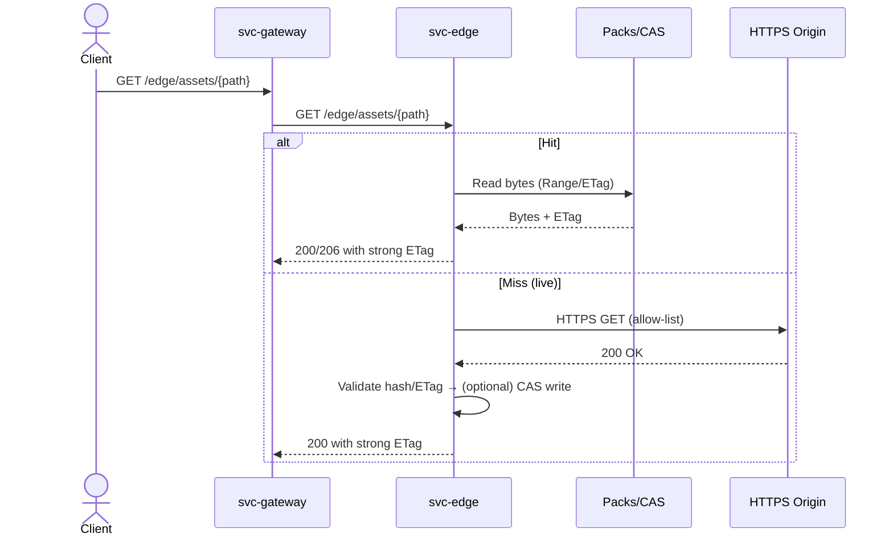
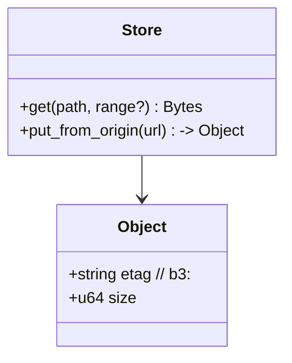
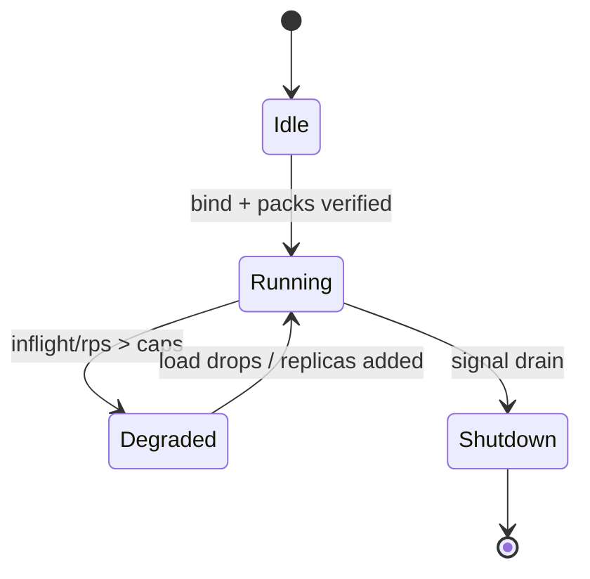

---

# svc-edge

> **Role:** service
> **Owner:** Stevan White
> **Status:** draft
> **MSRV:** 1.80.0
> **Last reviewed:** 2025-10-17

Badges (optional):
[]() []() []() []()

---

## 1) Overview

**What it is (one paragraph):**
`svc-edge` is a stateless edge asset server for static and ranged bytes. It serves from local packs/CAS on a warm hit and can optionally **live-fill** from an allow-listed HTTPS origin on a miss, validating integrity (strong ETag / BLAKE3) before returning bytes or caching. It exposes `/healthz`, `/readyz`, and `/metrics`, and is engineered for early, deterministic shedding under pressure.

**How it fits (RustyOnions topology):**

* **Pillar:** P6 — Ingress & Edge
* **Upstream callers:** `svc-gateway` / Omnigate
* **Downstream deps:** Local packs/CAS (e.g., PMTiles/MBTiles), allow-listed HTTPS origins, Prometheus
* **Data it touches:** network I/O, local pack files; no user PII on hot path
* **Security boundary:** Edge plane hardening (timeouts, inflight/RPS caps, decompression guards); amnesia-mode supported

### 1.1 High-Level Architecture (Mermaid REQUIRED)

```mermaid
flowchart LR
  subgraph Client/Node
    A[Caller: svc-gateway/Omnigate] -->|HTTP GET| B(svc-edge)
  end

  B -->|Pack/CAS read| D[(Local packs / CAS)]
  B -->|Live fill (allow-list HTTPS)| C[Origin(s)]
  B -->|Metrics| E[[Prometheus]]

  style B fill:#0b7285,stroke:#083344,color:#fff
```

---

## 2) Responsibilities & Boundaries

**MUST do (core responsibilities):**

* [ ] Serve static assets with strong ETag, `Accept-Ranges`, and **single-range** `206` semantics.
* [ ] Optionally live-fill from allow-listed HTTPS origins and verify integrity before serve/cache.
* [ ] Expose `/healthz`, `/readyz`, `/metrics`; honor **amnesia mode**.

**MUST NOT do (anti-scope / boundaries):**

* [ ] Hold user identity/PII or perform capability evaluation (that’s gateway/Omnigate).
* [ ] Perform overlay/DHT/storage discovery (that’s `svc-index`/`svc-dht`).

**Acceptance Gates (PROOF you did it):**

* [ ] Unit/prop tests cover Range/ETag/live-fill invariants; fuzz `Range` and `If-None-Match`.
* [ ] Golden metrics exported: latency histogram, inflight/backlog gauges, cache hit/miss, reject counters.
* [ ] `/readyz` reflects pack/CAS reachability and inflight thresholds in real time.
* [ ] Bench meets SLOs: warm-hit p95 < 40 ms; live-fill p95 < 250 ms (documented repro).

---

## 3) Public Interfaces

### 3.1 Rust API (library)

This is a **service** crate; no stable Rust API is promised. Any `pub` items are internal and may change; CI enforces via `cargo public-api`.

### 3.2 Bus RPC / Events (service)

No bus RPC surface. Operational events flow via **metrics + structured logs** (with `X-Corr-ID`).



### 3.3 HTTP (service)

* **Base URL:** `http://<host>:<port>/`
* **Endpoints:**

  * `GET /edge/assets/{*path}` → serve from packs/CAS or live-fill; supports `Range`, `If-None-Match`, strong ETag.
    Returns `200/206/304/416`. **Multi-range is disabled by default.**
  * `GET /metrics` → Prometheus exposition
  * `GET /healthz`, `GET /readyz` → liveness/readiness

### 3.4 CLI (binary/tool)

```bash
cargo run -p svc-edge -- --config ./configs/svc-edge.toml
```

---

## 4) Configuration

| Variable/Key                   | Type   | Default          | Description                                            |
| ------------------------------ | ------ | ---------------- | ------------------------------------------------------ |
| `SVC_EDGE_BIND_ADDR`           | socket | `0.0.0.0:8080`   | HTTP bind address                                      |
| `SVC_EDGE_METRICS_ADDR`        | socket | `127.0.0.1:9909` | Prometheus bind                                        |
| `edge.mode`                    | enum   | `offline`        | `offline` packs only; `live` enables allow-listed fill |
| `edge.packs[]`                 | path   | —                | Pack files (PMTiles/MBTiles)                           |
| `edge.allow[]`                 | host   | —                | Allow-listed HTTPS origins for live-fill               |
| `ingress.max_inflight`         | int    | `512`            | Concurrency cap                                        |
| `ingress.rps_limit`            | int    | `500`            | Admission control                                      |
| `ingress.body_bytes`           | size   | `1MiB`           | Request body cap                                       |
| `ingress.decompress_max_ratio` | int    | `10`             | Decompression guard (≤10×)                             |
| `ingress.decompress_abs_bytes` | size   | `1MiB`           | Absolute decompression cap                             |

**Flags**

```bash
--bind 0.0.0.0:8080
--metrics 127.0.0.1:9909
--config ./configs/svc-edge.toml
```

**Feature flags (Cargo)**

* `otel` — OTLP tracing export (optional)
* `pq` / `pq-sign` — staged PQ-hybrid pilots (outbound TLS, policy artifacts)

---

## 5) Build, Run, Test

**Build**

```bash
cargo build -p svc-edge
```

**Run**

```bash
RUST_LOG=info \
SVC_EDGE_BIND_ADDR=0.0.0.0:8080 \
SVC_EDGE_METRICS_ADDR=127.0.0.1:9909 \
SVC_EDGE_SECURITY__AMNESIA=true \
cargo run -p svc-edge
```

**Tests (unit/prop/docs)**

```bash
cargo test -p svc-edge --all-features
cargo test -p svc-edge --doc
```

**Lint & format**

```bash
cargo fmt --all
cargo clippy -p svc-edge -- -D warnings
```

**Security & deps**

```bash
cargo deny check
```

**Bench / Perf rigs**

```bash
# quick smoke (latency/ETag path)
bombardier -c 128 -d 2m -l -H "X-Corr-ID: test" http://127.0.0.1:8080/edge/assets/tile.pmtiles

# steady soak (shedding/backpressure), 30m with p99 tracking
hey -z 30m -c 256 http://127.0.0.1:8080/edge/assets/tile.pmtiles
```

*Repro notes:* use release build, disable CPU throttling, pin to a core, record Prometheus snapshots; include hardware profile in results.

---

## 6) Observability

**Endpoints:** `/metrics`, `/healthz`, `/readyz` (readiness checks packs verified, CAS reachable, inflight < caps, amnesia respected).

**Canonical Metrics:**

* `http_requests_total{route,method,status}`
* `request_latency_seconds{route,method}` (histogram)
* `inflight_requests{route}` (gauge)
* `rejected_total{reason}`; `busy_rejections_total{endpoint}`
* `edge_cache_{hits,misses}_total{path}`
* `edge_range_requests_total{result}`
* `edge_live_fill_{attempts,success}_total{host}`
* `io_timeouts_total{op}`; `backoff_retries_total{op}`
* `edge_cas_writes_total{status}`

**Tracing:** JSON logs; spans `svc.edge.http`, `svc.edge.cache`, `svc.edge.fill`, `svc.edge.range`; propagate `X-Corr-ID`. Sample 1% success, 100% failures.

**Alert ideas (wire in Prometheus):**

* 5xx > 0.1% (5m)
* Shedding (`busy_rejections_total`) > 1% (15m)
* `/readyz` failing > 5m

---

## 7) Performance & SLOs

| Metric                   | Target               | Notes                      |
| ------------------------ | -------------------- | -------------------------- |
| Warm-hit p95 / p99       | < 40 ms / < 80 ms    | Local packs/CAS            |
| Live-fill p95            | < 250 ms             | Network origin (excl. 4xx) |
| Inter-region p95         | < 200 ms             | Via gateway                |
| Error rate (5xx)         | < 0.1%               | 30-day                     |
| Shedding (429/503)       | < 1% sustained (15m) | Admission control          |
| Start→ready (no verify)  | < 300 ms             | Warm                       |
| Start→ready (verify 10k) | < 2 s                | With verify                |

*“How to reproduce”* lives in `docs/PERFORMANCE.md` with exact CLI, dataset, and host specs.

---

## 8) Data & Schema

**Model:**

* Keys: asset path (or pack key); Values: bytes + strong **ETag** (`b3:<hex>`).
* **Single-range** only; multi-range disabled (simpler, safer memory profile).



**Migrations:** N/A for runtime; if pack formats evolve, handle at pack build time. Document any verifier changes in CHANGELOG.

---

## 9) Security & Privacy

* **Ingress hardening:** timeouts (e.g., 5s), inflight cap (e.g., 512), RPS limit (e.g., 500), body cap (1 MiB), decompression guard (≤10× with absolute cap).
* **Amnesia mode:** RAM-only caches; no disk spill; degrade instead of persisting.
* **PII:** None on the hot path; bind `/metrics` locally or protect at gateway.
* **TLS:** Prefer rustls via gateway; outbound origin TLS follows workspace policy.
* **Supply chain:** workspace-pinned deps; `cargo deny` clean; CI checks `public-api`.
* **Input validation:** strict header/length limits; deny malformed `Range`; clamp `If-None-Match` size.

---

## 10) Error Taxonomy

| Code/Variant                | When it happens                  | User hint                    | Retries |
| --------------------------- | -------------------------------- | ---------------------------- | ------- |
| `304 Not Modified`          | ETag matches via `If-None-Match` | Use cached body              | n/a     |
| `413 Payload Too Large`     | Body > cap                       | Reduce request size          | no      |
| `416 Range Not Satisfiable` | Invalid/unsatisfiable `Range`    | Fix header (e.g., bytes=0-…) | no      |
| `429 Too Many Requests`     | RPS/inflight caps exceeded       | Back off w/ jitter           | yes     |
| `503 Service Unavailable`   | Draining or degraded readiness   | Retry with jitter            | yes     |

Tie these to metrics: `rejected_total{reason=payload_too_large|range_invalid|busy|draining}`.

---

## 11) Concurrency Model

* Tokio cooperative tasks, bounded queues, **never hold a lock across `.await`** on supervisory paths.
* Readiness flips **before** saturation; early shed > tail-latency collapse.



---

## 12) Compatibility & Requirements

* **Rust:** MSRV 1.80.0
* **OS:** macOS 10.15+, Linux x86_64/ARM64; containers supported
* **Core deps:** axum 0.7.x, tower-http 0.6.x, tokio 1.x, prometheus 0.14.x, tokio-rustls 0.26.x
* **Profiles:** Micronode (amnesia ON by default) and Macronode (multi-service) supported

---

## 13) Examples

**Health & Range**

```bash
curl -sS http://127.0.0.1:8080/healthz
curl -i -H "Range: bytes=0-65535" http://127.0.0.1:8080/edge/assets/path | sed -n '1,20p'
```

**Conditional GET (ETag)**

```bash
etag=$(curl -sI http://127.0.0.1:8080/edge/assets/path | awk -F': ' '/^ETag/{print $2}' | tr -d '\r')
curl -i -H "If-None-Match: $etag" http://127.0.0.1:8080/edge/assets/path
```

**Invalid Range (expect 416)**

```bash
curl -i -H "Range: bytes=9999999999-0" http://127.0.0.1:8080/edge/assets/path
```

---

## 14) Troubleshooting

* **`/readyz` false:** verify pack paths/permissions, CAS reachability, amnesia constraints.
* **Shedding > 1%:** check `edge_inflight`, `edge_queue_depth`, CPU/IO; scale replicas or tune caps.
* **High tail latency:** confirm release build, reduce log verbosity, increase concurrency caps cautiously, check origin RTT if live-fill.
* **TLS/OTEL:** ensure feature flags & credentials set; bind `/metrics` to localhost when public.

See also: `docs/RUNBOOK.md`.

---

## 15) Development Notes

**Project conventions**

* Axum handlers end with `.into_response()`.
* Public re-exports live in `lib.rs` (Bus, KernelEvent, Metrics, HealthState, Config, `wait_for_ctrl_c()`).
* Use `tokio_rustls::rustls::ServerConfig` for TLS types (not `rustls::ServerConfig`).

**Pre-commit quickcheck**

```bash
cargo fmt --all
cargo clippy -- -D warnings
cargo test
cargo deny check
```

---

## 16) Mermaid Diagrams — Policy & Tooling (REQUIRED)

* Include: (1) architecture flowchart, (2) common-path sequence, (3) lifecycle/state.
* **Render locally (SVG)**

```bash
npm i -g @mermaid-js/mermaid-cli
mmdc -i docs/arch.mmd -o docs/arch.svg
```

* **CI snippet (Mermaid + public API)**

```yaml
name: docs-and-api
on: [push, pull_request]
jobs:
  mmdc:
    runs-on: ubuntu-latest
    steps:
      - uses: actions/checkout@v4
      - run: npm i -g @mermaid-js/mermaid-cli
      - run: |
          mkdir -p docs
          for f in $(git ls-files '*.mmd'); do
            out="${f%.mmd}.svg"
            mmdc -i "$f" -o "$out"
          done
  public-api:
    runs-on: ubuntu-latest
    steps:
      - uses: actions/checkout@v4
      - uses: dtolnay/rust-toolchain@stable
      - run: cargo install cargo-public-api || true
      - run: cargo public-api -p svc-edge
```

**For non-Markdown viewers:** render SVGs into `docs/` and reference them from README.

---

## 17) Roadmap & TODO

* [ ] **Bronze → Silver**

  * Lock warm-hit p95 < 40 ms & p99 < 80 ms (document repro)
  * Alerts wired (5xx, shedding, readiness) and RUNBOOK updated
* [ ] **Silver → Gold**

  * PQ pilot behind feature flag (`pq`, `pq-sign`) for outbound origin TLS; posture surfaced in metrics
  * ARM/Edge perf notes (16–256 KiB ranges), perf/Watt, and container limits captured
  * Multi-region soak with gateway; inter-region p95 < 200 ms

---

## 18) Changelog

See [CHANGELOG.md](./CHANGELOG.md). Follow SemVer; explicitly document HTTP header/behavior changes (ETag/Range) and any config key renames.

---

## 19) License

Dual-licensed under **MIT** or **Apache-2.0**. See [LICENSE-MIT](../LICENSE-MIT) and [LICENSE-APACHE](../LICENSE-APACHE).

---

## 20) Contributing

PRs welcome! Please include:

* Updated diagrams if topology changed
* Docs & examples (especially perf repros)
* Perf impact (numbers + how to reproduce) per `docs/PERFORMANCE.md`
* Link to `docs/RUNBOOK.md` section if you changed operability behavior

---

