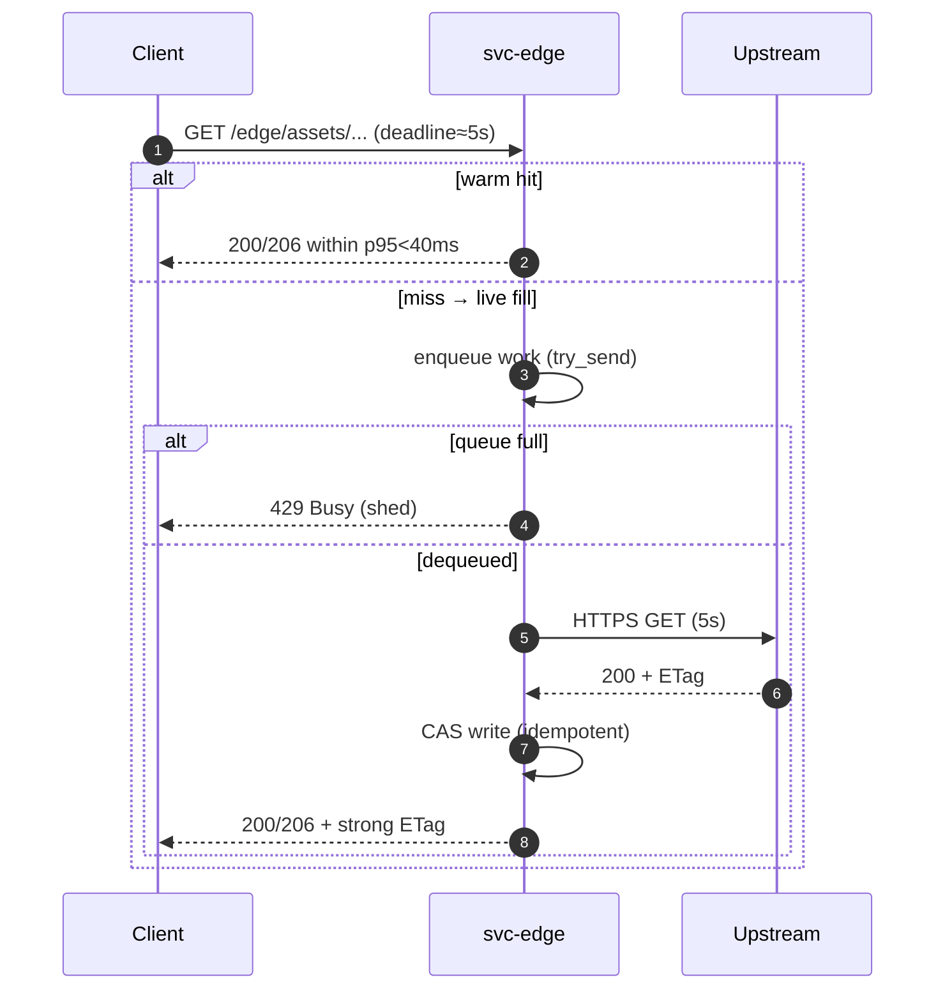
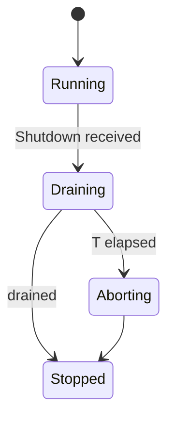
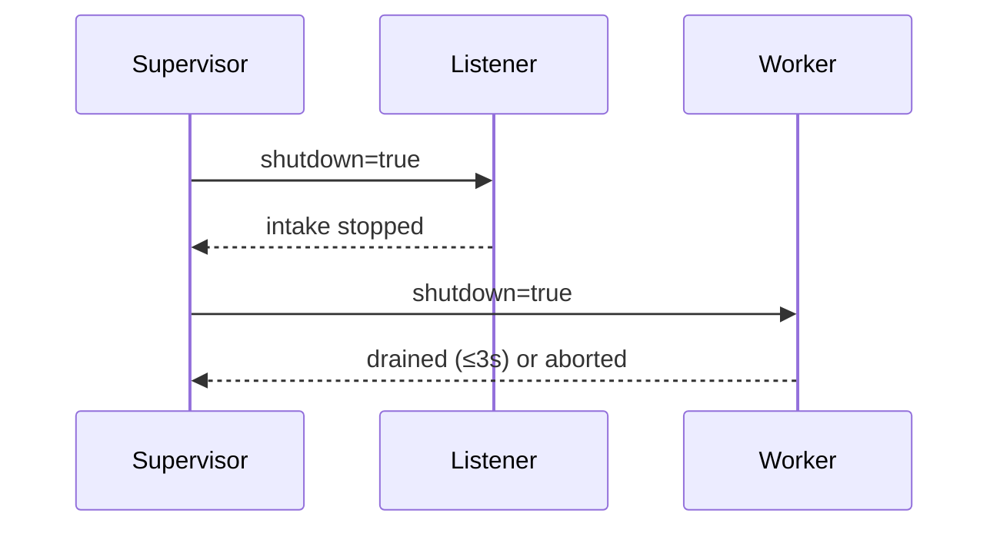

---

title: Concurrency Model — svc-edge
crate: svc-edge
owner: Stevan White
last-reviewed: 2025-10-17
status: draft
template_version: 1.1
msrv: 1.80.0
tokio: "1.x (pinned at workspace root)"
loom: "0.7+ (dev-only)"
lite_mode: "For small library crates: fill §§1,3,4,5,10,11 and mark others N/A"

# Concurrency Model — svc-edge

This document makes the concurrency rules **explicit**: tasks, channels, locks, shutdown, timeouts,
and validation (property/loom/TLA+). It complements `docs/SECURITY.md`, `docs/CONFIG.md`,
and the crate’s `README.md` and `IDB.md`.

> **Golden rule:** never hold a lock across `.await` in supervisory or hot paths.

---

## 0) Lite Mode (for tiny lib crates)

N/A — `svc-edge` is a service crate with background tasks and listeners.

---

## 1) Invariants (MUST)

* [I-1] **No lock across `.await`.** If unavoidable, split the critical section.
* [I-2] **Single writer** per mutable resource (CAS writes, readiness state); readers use snapshots or short read guards.
* [I-3] **Bounded channels only** with explicit overflow policy; **no unbounded buffering**.
* [I-4] **Explicit timeouts** on all I/O (ingress 5s, live fill 5s, idle 60s); fail fast with typed errors.
* [I-5] **Cooperative cancellation**: every `.await` is cancel-safe or guarded by `select!`.
* [I-6] **Graceful shutdown**: observe `Shutdown`; stop intake, drain within deadline; abort stragglers.
* [I-7] **No blocking syscalls** on the async runtime; use `spawn_blocking` for CPU/file hashing if needed.
* [I-8] **No task leaks**: track join handles; detach only with rationale (e.g., metrics exporter owned by runtime).
* [I-9] **Backpressure over buffering**: reject with 429 + metrics instead of growing queues.
* [I-10] **HTTP framing is validated**: range parsing, conditional requests, and content-length/streaming guards.
* [I-11] **Async Drop**: `Drop` never blocks; provide async `close()`/`shutdown()` for teardown paths.

---

## 2) Runtime Topology

* **Runtime:** Tokio multi-threaded (worker threads = CPU cores unless overridden).
* **Primary tasks:**

  * **Supervisor** — boots listeners, workers, metrics; owns shutdown watch; computes readiness.
  * **HTTP Listener** — Axum/Tower stack; admission control (timeouts, body cap, inflight, RPS); enqueues work or serves hits directly.
  * **Worker Pool (N)** — processes **live fill** jobs (allow-list check, HTTPS GET with timeout + retries + jitter, ETag validation, CAS write).
  * **Metrics Exporter** — serves `/metrics`; cheap, long-lived.
  * **Pack Verifier (optional/startup)** — verifies PMTiles/MBTiles integrity on boot or reload.

```mermaid
flowchart TB
  subgraph Runtime
    SUP[Supervisor] -->|spawn| L[HTTP Listener]
    SUP -->|spawn N| W[Worker Pool]
    L -->|mpsc(work, cap=512)| W
    SUP -->|watch Shutdown| L
    SUP -->|watch Shutdown| W
    SUP -->|expose| M[/metrics/]
  end
  W -->|results/metrics| SUP
  style SUP fill:#0ea5e9,stroke:#0c4a6e,color:#fff
```

**Text:** Supervisor spawns Listener and Worker pool. Listener enqueues bounded jobs for live fills; otherwise serves hits (packs/CAS) inline. A watch channel propagates shutdown.

---

## 3) Channels & Backpressure

**Inventory (all bounded):**

| Name              | Kind      | Capacity | Producers → Consumers | Backpressure Policy              | Drop Semantics                                   |
| ----------------- | --------- | -------: | --------------------- | -------------------------------- | ------------------------------------------------ |
| `work_tx`         | mpsc      |      512 | Listener → Workers    | `try_send`; if `Full` → 429 Busy | `busy_rejections_total{endpoint="/edge/assets"}` |
| `shutdown_rx`     | watch     |        1 | Supervisor → All      | last-write-wins                  | N/A                                              |
| `events_tx` (opt) | broadcast |     1024 | 1 → N                 | lag counter; drop oldest         | `bus_lagged_total` + warn                        |

**Guidelines**

* Listener **never .awaits** on queue capacity; it uses `try_send` and returns Busy (429) with a metric bump.
* Workers **pull**; if queue is empty, they park on `recv().await` and are cancelled by shutdown.

---

## 4) Locks & Shared State

**Allowed**

* Short-lived `Mutex/RwLock` for tiny metadata (readiness flags, counters snapshots). **No `.await` under guard.**
* Read-mostly state as `Arc<StateSnapshot>`; replace atomically on config reload.
* Per-connection/request state is **owned by its task**.

**Forbidden**

* Holding any lock across `.await`.
* Nested locks without declared order.

**Hierarchy (rarely needed)**

1. `state_meta`
2. `routing_table`
3. `counters`

---

## 5) Timeouts, Retries, Deadlines

* **Ingress I/O:** `timeout=5s` (configurable), `max_inflight=512`, `rps_limit=500`, `body_cap=1MiB`, `decompress<=10×` with **absolute** cap `10MiB`.
* **Live fill RPC:** HTTPS GET `timeout=5s`; retries for transient errors (timeout/503/504) with **exponential backoff + jitter**:
  `sleep_n = min(max_ms, base_ms * 2^n) + U[0, base_ms]` where `base_ms=50`, `max_ms=800`, `n∈[0,2]` (max 3 tries).
* **Idle:** connections closed after `idle=60s`.
* **End-to-end deadline:** respect `Request-Timeout`/`Deadline` headers if present (best-effort); otherwise use server defaults.



---

## 6) Cancellation & Shutdown

* **Signal:** `KernelEvent::Shutdown` or `tokio::signal::ctrl_c`.
* **Propagation:** `watch::Sender<bool>` → all tasks via `tokio::select!`.
* **Draining:** Listener stops enqueuing; workers complete in-flight with deadline **T=3s** (configurable).
* **Abort:** Workers exceeding T are **aborted** via handle; record `tasks_aborted_total{kind="worker"}`. Listener closes cleanly.



---

## 7) I/O & Framing

* **HTTP only**, no custom binary protocol. **Strict** Range/If-None-Match parsing, max header sizes from ingress caps.
* **Streaming** bodies; set `Content-Length` when known; otherwise `Transfer-Encoding: chunked` with caps.
* **Pack reads** (PMTiles/MBTiles) are **bounded** and mapped into `Bytes` chunks; validate index bounds before read.
* **CAS writes** use streaming hashing; move CPU-heavy hashing to `spawn_blocking` if contention observed.

---

## 8) Error Taxonomy (Concurrency-Relevant)

| Error          | When                          | Retry?           | Metric                            | Notes                         |
| -------------- | ----------------------------- | ---------------- | --------------------------------- | ----------------------------- |
| `Busy`         | `work_tx.try_send` is `Full`  | Client may retry | `busy_rejections_total{endpoint}` | Enforced backpressure         |
| `Timeout`      | Any I/O > deadline            | Transient        | `io_timeouts_total{op}`           | Includes upstream HTTPS       |
| `Canceled`     | Shutdown while awaiting       | No               | `tasks_canceled_total{kind}`      | Cooperative cancellation      |
| `Lagging`      | broadcast overflow            | No               | `bus_lagged_total`                | Slow consumers                |
| `RejectPolicy` | Not allow-listed / cap excess | No               | `edge_rejects_total{reason=...}`  | Deterministic 4xx/429 per IDB |

---

## 9) Metrics (Concurrency Health)

* `queue_depth{queue="work"}` (gauge) and `queue_dropped_total{queue="work"}`
* `busy_rejections_total{endpoint}`
* `tasks_{spawned,aborted,canceled}_total{kind}`
* `io_timeouts_total{op}` (read/write/connect/fill)
* `backoff_retries_total{op="live_fill"}`
* `edge_rejects_total{reason}` (amnesia, not_allowed, decompress_cap, body_cap, timeout, rate_limit, invalid_range, etag_invalid)

---

## 10) Validation Strategy

**Unit / Property**

* Backpressure: enqueue policy returns `Busy` when capacity exhausted; increments metrics.
* Deadlines: `timeout=5s` enforced; tolerance ±100ms under CI.
* Lock discipline: `#[cfg(test)]` hooks can assert no known guards live across `.await` in handlers (spot checks).

**Loom (dev-only)**

* Model: 1 producer → mpsc(2) → 1 consumer + shutdown watch. Assert: no deadlocks, no missed shutdown, consumer drains at most 2 items.

**Fuzz**

* Range/If-Range/If-None-Match parsers; gzip/zstd header corruption; chunked transfer boundary cases.

**Chaos**

* Kill 50% workers mid-load; ensure `/readyz` flips to degraded when shed kicks in; recover within 1s of relaunch.

**(Optional) TLA+**

* Model message flow for **work queue** to show no duplication/loss and eventual service under fair scheduling.

---

## 11) Code Patterns (Copy-Paste)

**Listener enqueues with bounded backpressure**

```rust
use tokio::sync::mpsc;
use axum::{extract::State, response::IntoResponse};
use http::StatusCode;

pub struct WorkItem {
    pub uri: http::Uri,
    pub range: Option<http::HeaderValue>,
    pub deadline: std::time::Instant,
}

pub async fn assets_handler(
    State(app): State<AppState>,
    ax_req: axum::http::Request<axum::body::Body>,
) -> impl IntoResponse {
    // Fast path: serve from pack/CAS inline (no queue) when present.
    if let Some(resp) = try_serve_from_cache(&app, &ax_req).await {
        return resp;
    }
    // Miss → attempt to enqueue live fill job with try_send
    let job = WorkItem {
        uri: ax_req.uri().clone(),
        range: ax_req.headers().get(http::header::RANGE).cloned(),
        deadline: std::time::Instant::now() + std::time::Duration::from_secs(5),
    };
    match app.work_tx.try_send(job) {
        Ok(()) => (StatusCode::ACCEPTED, "queued").into_response(),
        Err(mpsc::error::TrySendError::Full(_)) => {
            metrics::busy_rejections_total().with_label_values(&["/edge/assets"]).inc();
            (StatusCode::TOO_MANY_REQUESTS, "busy").into_response()
        }
        Err(mpsc::error::TrySendError::Closed(_)) => {
            (StatusCode::SERVICE_UNAVAILABLE, "draining").into_response()
        }
    }
}
```

**Worker with cooperative shutdown + retry/jitter**

```rust
use tokio::{select, time};
use rand::{thread_rng, Rng};

async fn worker_loop(mut rx: tokio::sync::mpsc::Receiver<WorkItem>, mut shutdown: tokio::sync::watch::Receiver<bool>, cfg: RetryCfg) {
    while let Some(job) = {
        select! {
            _ = shutdown.changed() => break,
            j = rx.recv() => j,
        }
    } {
        let mut attempt = 0u32;
        loop {
            select! {
              _ = shutdown.changed() => break,
              res = fetch_and_fill(job.uri.clone(), job.range.clone()) => {
                match res {
                  Ok(()) => { break; }
                  Err(Error::Transient) if attempt < cfg.max_retries => {
                      let base = cfg.base_ms;
                      let max  = cfg.max_ms;
                      let exp  = base.saturating_mul(1u64.saturating_shl(attempt.min(31)));
                      let delay = exp.min(max) + if cfg.jitter { thread_rng().gen_range(0..=base) } else { 0 };
                      metrics::backoff_retries_total().with_label_values(&["live_fill"]).inc();
                      time::sleep(time::Duration::from_millis(delay)).await;
                      attempt += 1;
                  }
                  Err(_) => { break; } // permanent or retries exhausted
                }
              }
            }
        }
    }
}
```

**Shutdown orchestration**

```rust
let (shutdown_tx, shutdown_rx) = tokio::sync::watch::channel(false);
let (work_tx, work_rx) = tokio::sync::mpsc::channel(512);

let workers: Vec<_> = (0..num_workers)
  .map(|_| {
      let rx = work_rx.clone();
      let rx_shutdown = shutdown_rx.clone();
      tokio::spawn(worker_loop(rx, rx_shutdown, cfg.retry.live_fill.clone()))
  })
  .collect();

// Listener uses work_tx and shutdown_rx...

// On shutdown:
shutdown_tx.send(true).ok();
let drain_deadline = tokio::time::Duration::from_secs(3);
let _ = tokio::time::timeout(drain_deadline, async {
    for w in workers { let _ = w.await; }
}).await; // timeout ⇒ abort handles individually
```

**No lock across `.await`**

```rust
let snapshot = {
    let guard = state_meta.read();       // small/short guard
    guard.current_snapshot().clone()     // drop before await
};
serve_with(snapshot).await;
```

---

## 12) Configuration Hooks (Quick Reference)

* `ingress.timeout_secs`, `ingress.max_inflight`, `ingress.rps_limit`,
  `ingress.body_bytes`, `ingress.decompress_max_ratio`, `ingress.decompress_abs_bytes`
* `retry.live_fill.{base_ms,max_ms,max_retries,jitter}`
* `drain_deadline` (internal default 3s; expose if needed)
* channel capacities (`work_tx` = 512)

Authoritative schema: `docs/CONFIG.md`.

---

## 13) Known Trade-offs / Nonstrict Areas

* **Queue policy:** we **reject new** (429) when the work queue is full to keep latency bounded; we do **not** drop in-flight work.
* **Speculative fill:** intentionally **disabled** to avoid wasted bandwidth and race-y CAS writes.
* **Hashing cost:** moved to background/`spawn_blocking` only if profiling shows contention; default stays async to avoid context switches.

---

## 14) Mermaid Diagrams (REQUIRED)

### 14.1 Task & Queue Topology

```mermaid
flowchart LR
  IN[Ingress] -->|mpsc:work(512)| W1[Worker A]
  IN -->|mpsc:work(512)| W2[Worker B]
  subgraph Control
    SHUT[Shutdown watch] --> W1
    SHUT --> W2
  end
```

**Text:** Ingress feeds two workers via bounded mpsc(512); Shutdown watch notifies both.

### 14.2 Shutdown Sequence



**Text:** Supervisor signals shutdown, Listener stops enqueuing, Workers drain or are aborted after deadline.

---

## 15) CI & Lints (Enforcement)

**Clippy / rustc**

* `-D warnings`
* Recommend enabling (or custom lint pass): **await-holding-lock** checks in reviews/CI (grep/deny patterns).

**GitHub Actions (sketch)**

```yaml
name: concurrency-guardrails
on: [push, pull_request]
jobs:
  clippy:
    runs-on: ubuntu-latest
    steps:
      - uses: actions/checkout@v4
      - uses: dtolnay/rust-toolchain@stable
      - run: cargo clippy -p svc-edge -- -D warnings

  loom:
    if: github.event_name == 'pull_request'
    runs-on: ubuntu-latest
    steps:
      - uses: actions/checkout@v4
      - uses: dtolnay/rust-toolchain@stable
      - run: RUSTFLAGS="--cfg loom" cargo test -p svc-edge --tests -- --ignored

  fuzz:
    runs-on: ubuntu-latest
    steps:
      - uses: actions/checkout@v4
      - uses: dtolnay/rust-toolchain@stable
      - run: cargo install cargo-fuzz
      - run: cargo fuzz build -p svc-edge
```

---

## 16) Schema Generation (Optional)

* Consider annotating channels with attributes and generating `docs/_generated/concurrency.mdfrag` in `build.rs`.
* Alternatively, keep a registry module that unit-tests the doc tables (golden test).

---

## 17) Review & Maintenance

* **Review cadence:** every 90 days or on any change to listeners/workers/queues or ingress caps.
* Keep **owner**, **msrv**, **last-reviewed** current.
* PR checklist: if concurrency changes, update this document + associated Loom/property tests.

---
