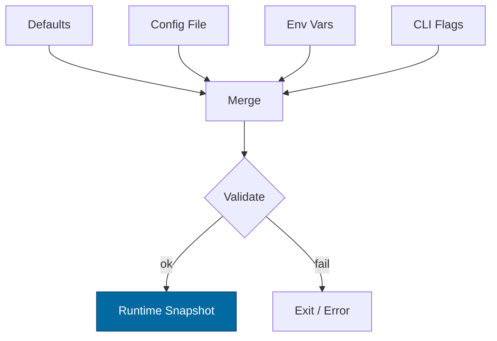

---

title: Configuration — svc-edge
crate: svc-edge
owner: Stevan White
last-reviewed: 2025-10-17
status: draft
template_version: 1.0.2

# Configuration — svc-edge

This document defines **all configuration** for `svc-edge`: sources/precedence, schema (types/defaults), validation, feature flags, live-reload behavior, and security implications. It complements `README.md`, `docs/IDB.md`, and `docs/SECURITY.md`.

> **Tiering:**
> Service crate: all sections apply.

---

## 1) Sources & Precedence (Authoritative)

1. **Process flags** (CLI) → 2) **Environment variables** → 3) **Config file** (`--config` or `Config.toml`) → 4) **Built-in defaults**.
   Reload recomputes under the same precedence.

Formats: **TOML** (preferred), JSON (optional).
`--config` path resolution (relative): `./`, `$CWD`, crate dir.

---

## 2) Quickstart Examples

### 2.1 Minimal (offline packs + amnesia)

```bash
SVC_EDGE_BIND_ADDR=0.0.0.0:8080
SVC_EDGE_METRICS_ADDR=127.0.0.1:0
SVC_EDGE_EDGE__MODE=offline
SVC_EDGE_EDGE__PACKS=./data/world.pmtiles
SVC_EDGE_SECURITY__AMNESIA=true
RUST_LOG=info
cargo run -p svc-edge
```

### 2.2 Config file (TOML)

```toml
# Config.toml
bind_addr    = "0.0.0.0:8080"
metrics_addr = "127.0.0.1:0"

[edge]
mode  = "offline"   # "offline" | "live"
packs = ["./data/world.pmtiles"]
allow = []          # allow-list for live fills

[ingress]
timeout_secs          = 5
max_inflight          = 512
rps_limit             = 500
body_bytes            = "1MiB"
decompress_max_ratio  = 10
decompress_abs_bytes  = "10MiB"   # absolute cap

[security]
amnesia = true
hsts    = true

[cors]                      # deny-by-default if omitted
allow_origins = []
allow_methods = []
allow_headers = []

[retry]
# Jitter formula (normative): sleep = min(max_ms, base_ms * 2^attempt) + U[0, base_ms]
live_fill = { strategy="exp_backoff", base_ms=50, max_ms=800, max_retries=3, jitter=true, retry_on=[503,504,"timeout"] }

[http]
enable_multi_range = false      # default: disabled
strong_etag        = true       # content-hash ETag

[audit]
enabled = false                 # optional tamper-evident audit hook
```

### 2.3 CLI overrides

```bash
cargo run -p svc-edge -- \
  --bind 0.0.0.0:8080 \
  --metrics 127.0.0.1:0 \
  --mode live \
  --allow fonts.gstatic.com --allow api.maptiler.com \
  --rps 500 --inflight 512 --body 1MiB --decompress 10 --decompress-abs 10MiB \
  --amnesia=false --hsts --strong-etag --no-multirange \
  --jitter --retry-base 50 --retry-max 800 --retry-count 3 --retry-on 503 --retry-on 504 --retry-on timeout
```

### 2.4 Container quickstart (micronode parity)

```bash
docker run --rm -p 8080:8080 \
  -e SVC_EDGE_BIND_ADDR=0.0.0.0:8080 \
  -e SVC_EDGE_METRICS_ADDR=127.0.0.1:0 \
  -e SVC_EDGE_EDGE__MODE=offline \
  -e SVC_EDGE_EDGE__PACKS=/data/world.pmtiles \
  -e SVC_EDGE_SECURITY__AMNESIA=true \
  -v $PWD/data:/data:ro \
  ghcr.io/rustyonions/svc-edge:latest
```

---

## 3) Schema (Typed, With Defaults)

> Prefix: `SVC_EDGE_`; nested keys use `__` (e.g., `SVC_EDGE_EDGE__MODE`).
> Durations accept `s`, `ms`, `m`, `h`. Sizes accept `B`, `KB`, `MB`, `KiB`, `MiB`.

| Key / Env Var                                                             | Type                   |               Default | Description                   | Security Notes              |
| ------------------------------------------------------------------------- | ---------------------- | --------------------: | ----------------------------- | --------------------------- |
| `bind_addr` / `SVC_EDGE_BIND_ADDR`                                        | socket                 |         `127.0.0.1:0` | HTTP bind                     | Public binds require review |
| `metrics_addr` / `SVC_EDGE_METRICS_ADDR`                                  | socket                 |         `127.0.0.1:0` | Prometheus bind               | Prefer localhost            |
| `edge.mode` / `SVC_EDGE_EDGE__MODE`                                       | enum(`offline`,`live`) |             `offline` | Operating mode                | `offline` = zero egress     |
| `edge.packs` / `SVC_EDGE_EDGE__PACKS`                                     | list<path>             |                  `[]` | PMTiles/MBTiles pack paths    | Verified at mount           |
| `edge.allow` / `SVC_EDGE_EDGE__ALLOW`                                     | list<string>           |                  `[]` | Allow-list for live fills     | Deny by default             |
| `ingress.timeout_secs` / `SVC_EDGE_INGRESS__TIMEOUT_SECS`                 | u32                    |                   `5` | Per-request global timeout    | DoS mitigation              |
| `ingress.max_inflight` / `SVC_EDGE_INGRESS__MAX_INFLIGHT`                 | u32                    |                 `512` | Max concurrent in-flight      | Backpressure                |
| `ingress.rps_limit` / `SVC_EDGE_INGRESS__RPS_LIMIT`                       | u32                    |                 `500` | Rate limit per instance       | Abuse control               |
| `ingress.body_bytes` / `SVC_EDGE_INGRESS__BODY_BYTES`                     | size                   |                `1MiB` | Request body cap              | Zip-bomb guard              |
| `ingress.decompress_max_ratio` / `SVC_EDGE_INGRESS__DECOMPRESS_MAX_RATIO` | u32                    |                  `10` | Allowed decompression ratio   | Zip-bomb guard              |
| `ingress.decompress_abs_bytes` / `SVC_EDGE_INGRESS__DECOMPRESS_ABS_BYTES` | size                   |               `10MiB` | Absolute post-decompress cap  | Hard stop against bombs     |
| `security.amnesia` / `SVC_EDGE_SECURITY__AMNESIA`                         | bool                   |               `false` | RAM-only mode; no disk writes | Enforced fail-closed        |
| `security.hsts` / `SVC_EDGE_SECURITY__HSTS`                               | bool                   |                `true` | Send HSTS when TLS            | Force HTTPS                 |
| `cors.allow_origins` / `SVC_EDGE_CORS__ALLOW_ORIGINS`                     | list<string>           |                  `[]` | CORS origins allowlist        | Default deny                |
| `cors.allow_methods` / `SVC_EDGE_CORS__ALLOW_METHODS`                     | list<string>           |                  `[]` | CORS methods allowlist        |                             |
| `cors.allow_headers` / `SVC_EDGE_CORS__ALLOW_HEADERS`                     | list<string>           |                  `[]` | CORS headers allowlist        |                             |
| `retry.live_fill.strategy` / `SVC_EDGE_RETRY__LIVE_FILL__STRATEGY`        | enum(`exp_backoff`)    |         `exp_backoff` | Retry strategy                |                             |
| `retry.live_fill.base_ms` / `SVC_EDGE_RETRY__LIVE_FILL__BASE_MS`          | u32                    |                  `50` | Initial backoff (ms)          |                             |
| `retry.live_fill.max_ms` / `SVC_EDGE_RETRY__LIVE_FILL__MAX_MS`            | u32                    |                 `800` | Max backoff (ms)              |                             |
| `retry.live_fill.max_retries` / `SVC_EDGE_RETRY__LIVE_FILL__MAX_RETRIES`  | u32                    |                   `3` | Max retries                   | Prevents herds              |
| `retry.live_fill.jitter` / `SVC_EDGE_RETRY__LIVE_FILL__JITTER`            | bool                   |                `true` | Enable jitter                 | Avoid sync bursts           |
| `retry.live_fill.retry_on` / `SVC_EDGE_RETRY__LIVE_FILL__RETRY_ON`        | list<string|u16>       | `[503,504,"timeout"]` | Retryable conditions          |                             |
| `http.enable_multi_range` / `SVC_EDGE_HTTP__ENABLE_MULTI_RANGE`           | bool                   |               `false` | Enable multi-range responses  | Off by default              |
| `http.strong_etag` / `SVC_EDGE_HTTP__STRONG_ETAG`                         | bool                   |                `true` | Use content-hash strong ETag  | Integrity                   |
| `audit.enabled` / `SVC_EDGE_AUDIT__ENABLED`                               | bool                   |               `false` | Emit audit records            | Treat as sensitive          |
| `log.format` / `SVC_EDGE_LOG__FORMAT`                                     | enum(`json`,`text`)    |                `json` | Log format                    | JSON in prod                |
| `log.level` / `SVC_EDGE_LOG__LEVEL`                                       | enum                   |                `info` | `trace..error`                | Avoid `trace` in prod       |

**Jitter formula (normative):** For attempt `n ≥ 0`,
`sleep_n = min(max_ms, base_ms * 2^n) + U[0, base_ms]`.

---

## 4) Validation Rules (Fail-Closed)

* `bind_addr`/`metrics_addr` parse; ports <1024 require privileges.
* `edge.mode="offline"` → at least one readable `edge.packs` entry.
* `edge.mode="live"` → non-empty `edge.allow`.
* `ingress.max_inflight > 0`, `rps_limit > 0`, `body_bytes ≥ 1KiB`.
* `decompress_max_ratio ≥ 1` and `decompress_abs_bytes ≥ body_bytes`.
* If `security.amnesia=true`: no disk-persistence paths; any write attempt is **rejected** and readiness **degraded**.
* Retry sanity: `base_ms ≤ max_ms`, `max_retries ≤ 5`.
* CORS lists contain valid entries.

On violation: log a structured error and **exit non-zero**.

---

## 5) Dynamic Reload

**Trigger:** SIGHUP or `KernelEvent::ConfigUpdated { version }`.
**Non-disruptive:** ingress caps, timeouts, retry/jitter, logging, CORS allow-lists.
**Disruptive:** `bind_addr`, amnesia toggle, pack set changes (re-mount & verify), TLS handoff.
**Atomicity:** compute new snapshot; swap under a mutex without holding `.await`.
**Failure posture:** if reload apply fails, retain prior config and back off `1s,2s,4s,8s` (cap 8s) before re-attempt (log reason).
**Audit:** emit `KernelEvent::ConfigUpdated { version }` + redacted diff (no secrets).

---

## 6) CLI Flags (Canonical)

```
--help                          # prints all flags and defaults
--config <path>                 # low-precedence config file
--bind <ip:port>                --metrics <ip:port>
--mode <offline|live>           --pack <path>            (repeatable)
--allow <hostname>              (repeatable)
--rps <num>                     --inflight <num>
--body <size>                   --decompress <ratio>
--decompress-abs <size>
--amnesia[=true|false]          --hsts | --no-hsts
--strong-etag | --no-strong-etag
--multirange | --no-multirange
--retry-base <ms>               --retry-max <ms>
--retry-count <n>               --retry-on <val>         (repeatable: 503|504|timeout)
--jitter | --no-jitter
--log-format <json|text>        --log-level <trace|debug|info|warn|error>
```

---

## 7) Feature Flags (Cargo)

| Feature | Default | Effect                                                    |
| ------- | ------: | --------------------------------------------------------- |
| `tls`   |     off | Enable tokio-rustls server path (if terminating TLS here) |
| `pq`    |     off | Reserve PQ toggles (future)                               |
| `cli`   |      on | Enables CLI parsing for flags                             |
| `kameo` |     off | Optional actor integration                                |

---

## 8) Security Implications

* Public binds require caps (timeouts/RPS/inflight/body/decompress).
* Amnesia must never spill; attempted writes reject + degrade readiness.
* CORS deny by default; whitelists deliberate.
* Audit streams may contain hashes/hosts—treat as sensitive.
* Live fills only from allow-list; all others explicit 4xx/429 with `reason`.

---

## 9) Compatibility & Migration

* Additive keys ship with safe defaults; document here.
* Renames: keep env aliases ≥1 minor; warn when used.
* Breaking config: major version + `CHANGELOG.md` migration.

Deprecations (maintained):

| Old Key | New Key |  Removal | Notes              |
| ------- | ------- | -------: | ------------------ |
| `<old>` | `<new>` | vA+1.0.0 | Provide conversion |

---

## 10) Reference Implementation (Rust)

```rust
use std::{net::SocketAddr, path::PathBuf};
use serde::{Deserialize, Serialize};
use anyhow::{self, Context};
use rand::{thread_rng, Rng};

#[derive(Debug, Clone, Serialize, Deserialize)]
#[serde(rename_all = "snake_case")]
pub enum Mode { Offline, Live }

#[derive(Debug, Clone, Serialize, Deserialize, Default)]
pub struct EdgeCfg {
    pub mode: Mode,
    #[serde(default)]
    pub packs: Vec<PathBuf>,
    #[serde(default)]
    pub allow: Vec<String>,
}

#[derive(Debug, Clone, Serialize, Deserialize)]
pub struct Ingress {
    /// Per-request global timeout (seconds)
    pub timeout_secs: u64,
    /// Max concurrent in-flight requests
    pub max_inflight: u32,
    /// Rate limit per instance
    pub rps_limit: u32,
    /// Request body cap (e.g., "1MiB"); parsed to bytes at validate()
    pub body_bytes: String,
    /// Allowed decompression ratio (e.g., 10)
    pub decompress_max_ratio: u32,
    /// Absolute post-decompress cap (e.g., "10MiB")
    pub decompress_abs_bytes: String,
}

#[derive(Debug, Clone, Serialize, Deserialize, Default)]
pub struct Security {
    pub amnesia: bool,
    pub hsts: bool,
}

#[derive(Debug, Clone, Serialize, Deserialize, Default)]
pub struct Cors {
    #[serde(default)] pub allow_origins: Vec<String>,
    #[serde(default)] pub allow_methods: Vec<String>,
    #[serde(default)] pub allow_headers: Vec<String>,
}

#[derive(Debug, Clone, Serialize, Deserialize)]
pub struct RetryFill {
    pub strategy: String,     // "exp_backoff"
    pub base_ms: u64,         // 50
    pub max_ms: u64,          // 800
    pub max_retries: u32,     // 3
    pub jitter: bool,         // true
    #[serde(default)]
    pub retry_on: Vec<String> // ["503","504","timeout"]
}

#[derive(Debug, Clone, Serialize, Deserialize, Default)]
pub struct Retry { pub live_fill: RetryFill }

#[derive(Debug, Clone, Serialize, Deserialize, Default)]
pub struct Http {
    pub enable_multi_range: bool,
    pub strong_etag: bool,
}

#[derive(Debug, Clone, Serialize, Deserialize, Default)]
pub struct Audit { pub enabled: bool }

#[derive(Debug, Clone, Serialize, Deserialize)]
pub struct Config {
    #[serde(default)] pub bind_addr: Option<SocketAddr>,   // None => 127.0.0.1:0
    #[serde(default)] pub metrics_addr: Option<SocketAddr>,// None => 127.0.0.1:0
    #[serde(default)] pub edge: EdgeCfg,
    pub ingress: Ingress,
    #[serde(default)] pub security: Security,
    #[serde(default)] pub cors: Cors,
    #[serde(default)] pub retry: Retry,
    #[serde(default)] pub http: Http,
    #[serde(default)] pub audit: Audit,
    #[serde(default = "default_log_format")] pub log_format: String, // "json"|"text"
    #[serde(default = "default_log_level")]  pub log_level: String,  // "info", etc.
}

fn default_log_format() -> String { "json".into() }
fn default_log_level() -> String { "info".into() }

impl Config {
    pub fn validate(&self) -> anyhow::Result<()> {
        // Mode constraints
        match self.edge.mode {
            Mode::Offline => {
                if self.edge.packs.is_empty() {
                    anyhow::bail!("offline mode requires at least one edge.packs entry");
                }
            }
            Mode::Live => {
                if self.edge.allow.is_empty() {
                    anyhow::bail!("live mode requires non-empty edge.allow list");
                }
            }
        }

        // Ingress sanity
        if self.ingress.max_inflight == 0 { anyhow::bail!("ingress.max_inflight must be > 0"); }
        if self.ingress.rps_limit == 0 { anyhow::bail!("ingress.rps_limit must be > 0"); }
        if self.ingress.decompress_max_ratio == 0 {
            anyhow::bail!("ingress.decompress_max_ratio must be >= 1");
        }

        let body = parse_size(&self.ingress.body_bytes)?;
        let abs  = parse_size(&self.ingress.decompress_abs_bytes)?;
        if body < 1024 { anyhow::bail!("ingress.body_bytes must be >= 1KiB"); }
        if abs < body  { anyhow::bail!("ingress.decompress_abs_bytes must be >= ingress.body_bytes"); }

        // Retry sanity
        let r = &self.retry.live_fill;
        if r.base_ms > r.max_ms {
            anyhow::bail!("retry.live_fill.base_ms must be <= retry.live_fill.max_ms");
        }
        if r.max_retries > 5 {
            anyhow::bail!("retry.live_fill.max_retries must be <= 5");
        }

        Ok(())
    }
}

/// Integer-exact human size parser.
/// Accepts: raw bytes ("4096"), decimal ("KB","MB"), binary ("KiB","MiB").
pub fn parse_size(s: &str) -> anyhow::Result<u64> {
    let s = s.trim();
    // Split numeric prefix + unit suffix
    let (num_part, unit_part) = {
        let mut split = s.len();
        for (i, ch) in s.char_indices() {
            if !ch.is_ascii_digit() { split = i; break; }
        }
        s.split_at(split)
    };

    let (num_str, unit) = if num_part.is_empty() {
        // tolerate leading spaces; rebuild numeric prefix
        let mut digits = String::new();
        let mut rest   = String::new();
        for ch in s.chars() {
            if digits.is_empty() && ch.is_whitespace() { continue; }
            if ch.is_ascii_digit() { digits.push(ch); } else { rest.push(ch); }
        }
        (digits.trim(), rest.trim().to_ascii_lowercase())
    } else {
        (num_part.trim(), unit_part.trim().to_ascii_lowercase())
    };

    if num_str.is_empty() {
        anyhow::bail!("size must start with digits: {s}");
    }
    let n: u64 = num_str.parse().context("invalid size number")?;

    let mul: u64 = match unit.as_str() {
        "" | "b" => 1,
        "kb"     => 1_000,
        "mb"     => 1_000_000,
        "kib"    => 1024,
        "mib"    => 1024 * 1024,
        _ => anyhow::bail!("unknown size unit: {unit} (use B, KB/MB, KiB/MiB)"),
    };

    n.checked_mul(mul).context("size overflow")
}

/// Jitter backoff (normative): min(max_ms, base_ms * 2^attempt) + U[0, base_ms]
pub fn jitter_backoff_ms(base_ms: u64, max_ms: u64, attempt: u32) -> u64 {
    let exp = base_ms.saturating_mul(1u64.saturating_shl(attempt.min(31)));
    let cap = exp.min(max_ms);
    let jitter: u64 = thread_rng().gen_range(0..=base_ms);
    cap.saturating_add(jitter)
}
```

> **Dependencies (add to Cargo.toml if not present):**
> `anyhow = "1"` • `serde = { version = "1", features = ["derive"] }` • `rand = "0.9"`

---

## 11) Test Matrix

| Scenario                     | Expected Outcome                                       |
| ---------------------------- | ------------------------------------------------------ |
| Missing file                 | Start with defaults; warn                              |
| Offline with no packs        | Fail fast                                              |
| Live with empty allow-list   | Fail fast                                              |
| Invalid sockets              | Fail fast                                              |
| Body > cap                   | 413 Payload Too Large                                  |
| Decompress ratio exceeded    | 400 + `reason="decompress_cap"`                        |
| Decompress absolute exceeded | 400 + `reason="decompress_abs"`                        |
| SIGHUP reload (safe keys)    | Non-disruptive                                         |
| Reload failure               | Old config retained; backoff 1s/2s/4s/8s; error logged |
| Amnesia write attempt        | Reject; `/readyz=degraded`; metric `reason="amnesia"`  |

---

## 12) Mermaid — Config Resolution Flow



---

## 13) Operational Notes

* Keep prod config in version control (private) or a secret store; mount secrets read-only.
* Mount packs read-only; pin container image digests in prod.
* Document firewall openings near `bind_addr`.
* Include this file in every PR that changes config keys/semantics.

---
