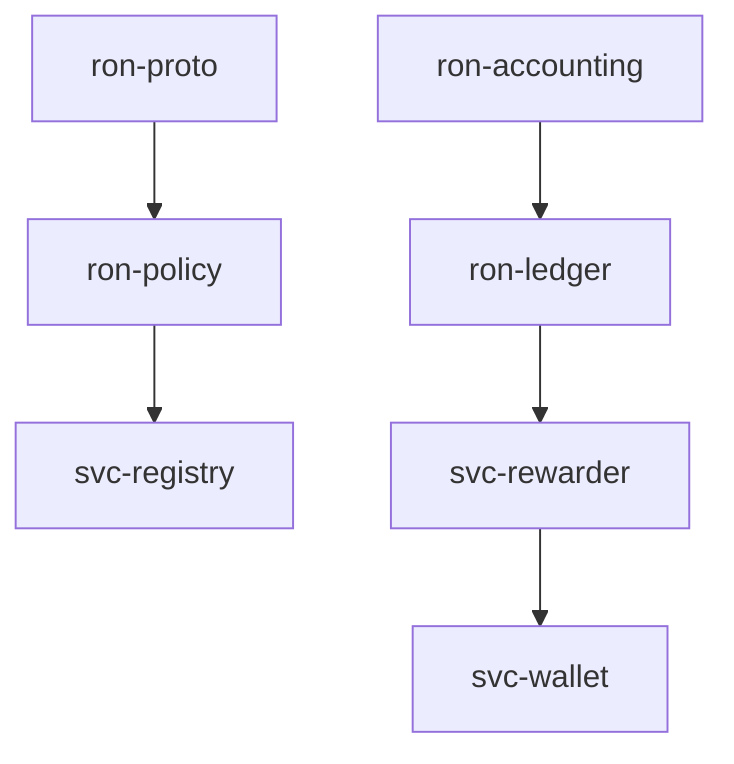
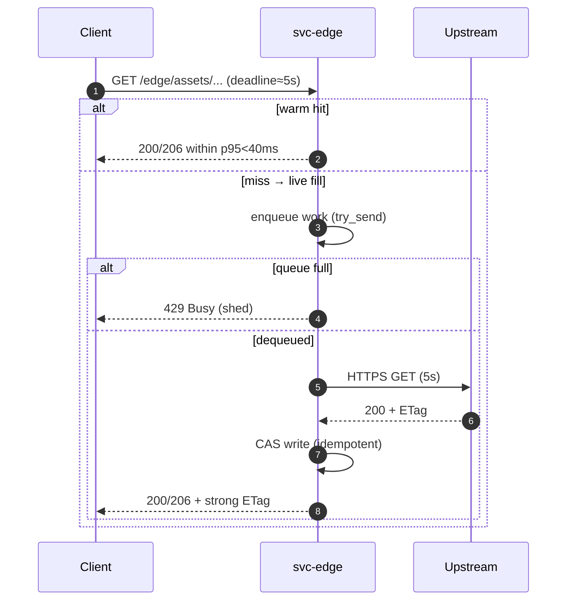
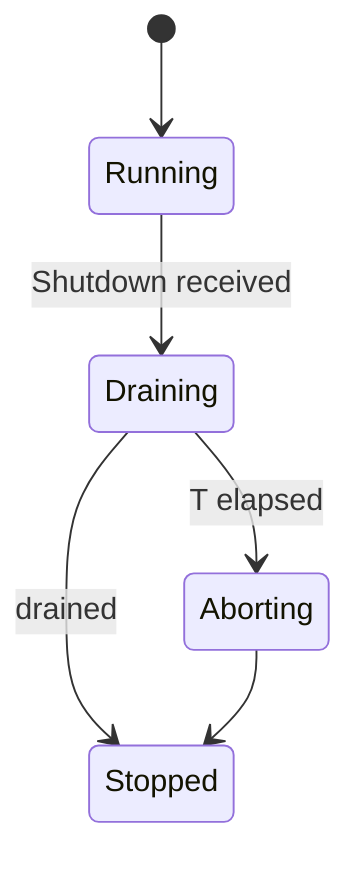
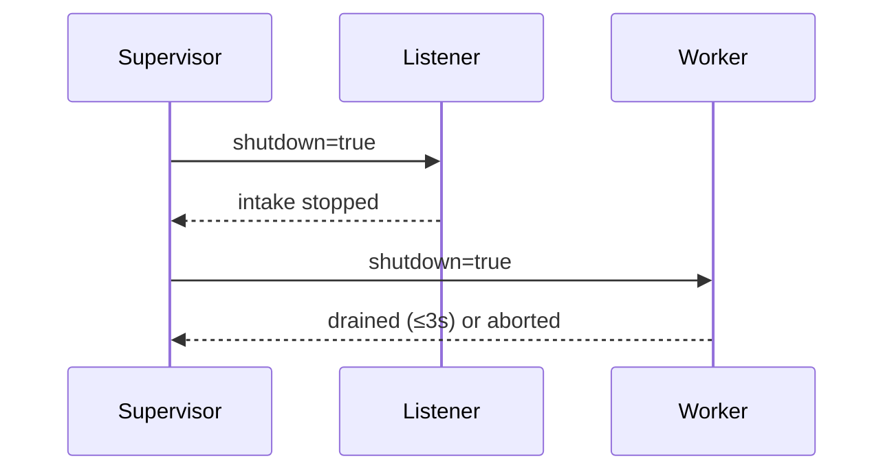
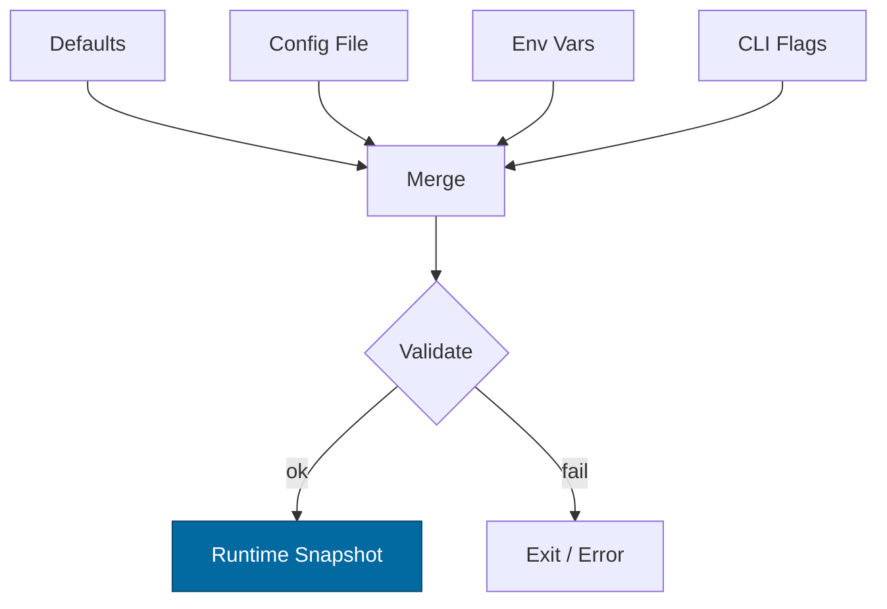

# Combined Markdown

_Source directory_: `crates/svc-edge/docs`  
_Files combined_: 13  
_Recursive_: 0

---

### Table of Contents

- API.MD
- BUILDPLAN.MD
- CONCURRENCY.MD
- CONFIG.MD
- GOVERNANCE.MD
- IDB.md
- INTEROP.MD
- OBSERVABILITY.MD
- PERFORMANCE.MD
- QUANTUM.MD
- RUNBOOK.MD
- SECURITY.MD
- TESTS.MD

---

## API.MD
_File 1 of 13_


---

title: API Surface & SemVer Reference
status: draft
msrv: 1.80.0
last-updated: 2025-10-17
audience: contributors, auditors, API consumers

# API.md — svc-edge

## 0. Purpose

This document captures the **public API surface** of `svc-edge`:

* The externally-consumed API is **HTTP + CLI**.
* The Rust surface is intentionally minimal (service crate; no stable library API).
* SemVer discipline: what changes break vs. extend.
* CI-enforceable via `cargo public-api` (for any exported symbols) and contract tests for HTTP.
* Serves as the “spec” for consumers, operators, and auditors.

---

## 1. Public API Surface

### 1.1 Crate type & Rust surface

**Crate type:** service (binary).
**Stable Rust API:** **None** (by design). The service exposes **HTTP endpoints** and a **CLI**.
Internal modules remain private. If a future SDK is needed, it will live in a separate crate.

> CI still runs `cargo public-api` to ensure we don’t accidentally leak unstable items.

**Expected `cargo public-api --simplified` (should be empty or near-empty):**

```text
# svc-edge exposes no stable library symbols by design.
# If any `pub` items appear here, they must be gated or explicitly documented.
```

### 1.2 HTTP API (service surface)

#### Endpoints

| Method | Path                   | Description                            | Auth | Notes                                          |
| -----: | ---------------------- | -------------------------------------- | ---- | ---------------------------------------------- |
|    GET | `/edge/assets/{*path}` | Serve bytes from pack/CAS or live fill | No   | Supports `Range`, `If-None-Match`; strong ETag |
|    GET | `/metrics`             | Prometheus metrics exposition          | No*  | Bind to localhost or protect at gateway        |
|    GET | `/healthz`             | Liveness                               | No   | Always 200 if process alive                    |
|    GET | `/readyz`              | Readiness                              | No   | 200 only when all readiness gates pass         |

* Operationally protected by bind or gateway.

#### Behavior contract — `/edge/assets/{*path}`

* **Caching & integrity**

  * `ETag`: **strong**, content-address (BLAKE3).
  * `Cache-Control`: implementation-defined (immutable assets recommended).
  * `Accept-Ranges: bytes`; `Range` supported for single-range; **multi-range disabled** by default.
* **Conditional requests**

  * `If-None-Match` → `304 Not Modified` on ETag match.
* **Partial content**

  * Valid byte range → `206 Partial Content` (+ `Content-Range`).
  * Invalid/unsatisfiable → `416 Range Not Satisfiable`.
* **Live fill (mode=live)**

  * Only from allow-listed hosts (HTTPS).
  * On success: content hashed, written to CAS, served with strong ETag.
  * Retries: exponential backoff + jitter; bounded by config.
* **Failure posture (deterministic)**

  * Queue full / rate/inflight caps → `429 Too Many Requests`.
  * Timeout → `503 Service Unavailable`.
  * Not allow-listed → `403 Forbidden`.
  * Amnesia write attempt → `503` and readiness degraded.
  * Body/decompress cap → `413/400` respectively.
  * All rejects increment `rejected_total{reason=...}` and include `X-Reason` header.

**Canonical headers**

* Request: `Range`, `If-None-Match`, optional `X-Corr-ID`.
* Response: `ETag`, `Accept-Ranges`, `Content-Range` (when 206), `X-Corr-ID`.

#### Examples

```bash
# Warm hit
curl -i http://127.0.0.1:8080/edge/assets/fonts/roboto.woff2

# Conditional
ETAG=$(curl -sI http://127.0.0.1:8080/edge/assets/tile.pmtiles | awk '/^ETag:/ {print $2}')
curl -i -H "If-None-Match: ${ETAG}" http://127.0.0.1:8080/edge/assets/tile.pmtiles

# Range
curl -i -H "Range: bytes=0-65535" http://127.0.0.1:8080/edge/assets/tile.pmtiles
```

### 1.3 CLI (process flags)

|                               Flag |   Alias | Type   | Description                       |                           |   |      |           |
| ---------------------------------: | ------: | ------ | --------------------------------- | ------------------------- | - | ---- | --------- |
|                  `--config <path>` |         | path   | Load config file (low precedence) |                           |   |      |           |
|                 `--bind <ip:port>` |         | socket | HTTP bind                         |                           |   |      |           |
|              `--metrics <ip:port>` |         | socket | Metrics bind                      |                           |   |      |           |
|                   `--mode <offline |  live>` |        | enum                              | Operating mode            |   |      |           |
|                    `--pack <path>` |         | repeat | Add pack path (offline)           |                           |   |      |           |
|               `--allow <hostname>` |         | repeat | Add allow-list host (live)        |                           |   |      |           |
|                      `--rps <num>` |         | u32    | Rate limit                        |                           |   |      |           |
|                 `--inflight <num>` |         | u32    | Max inflight                      |                           |   |      |           |
|                    `--body <size>` |         | size   | Body cap (e.g., 1MiB)             |                           |   |      |           |
|             `--decompress <ratio>` |         | u32    | Decompress ratio cap              |                           |   |      |           |
|          `--decompress-abs <size>` |         | size   | Absolute post-decompress cap      |                           |   |      |           |
|                   `--amnesia[=true | false]` |        | bool                              | RAM-only (no disk writes) |   |      |           |
|               `--hsts / --no-hsts` |         | flag   | HSTS on/off (if TLS)              |                           |   |      |           |
| `--strong-etag / --no-strong-etag` |         | flag   | Strong ETag on/off                |                           |   |      |           |
|   `--multirange / --no-multirange` |         | flag   | Multi-range on/off                |                           |   |      |           |
|                `--retry-base <ms>` |         | u64    | Live-fill retry base              |                           |   |      |           |
|                 `--retry-max <ms>` |         | u64    | Live-fill retry cap               |                           |   |      |           |
|                `--retry-count <n>` |         | u32    | Live-fill max retries             |                           |   |      |           |
|                 `--retry-on <val>` |         | repeat | 503/504/timeout                   |                           |   |      |           |
|           `--jitter / --no-jitter` |         | flag   | Enable/disable jitter             |                           |   |      |           |
|                `--log-format <json |  text>` |        | enum                              | Log format                |   |      |           |
|                `--log-level <trace |   debug | info   | warn                              | error>`                   |   | enum | Log level |

> Full semantics and defaults in `docs/CONFIG.md`.

---

## 2. SemVer Discipline

Because `svc-edge` is a **service crate**, SemVer primarily governs the **HTTP/CLI contract** (not library symbols).

### 2.1 Additive (Minor / Non-Breaking)

* Adding **optional** HTTP headers or metrics/labels.
* Introducing **new endpoints** under a distinct path (e.g., `/edge/debug/...`) default-off.
* Adding CLI flags with **safe defaults** (off/unchanged behavior).
* Expanding enums in JSON responses with `#[non_exhaustive]` semantics (when applicable).
* Adding new `reason` values to metrics **only when** server behavior remains backward-compatible (e.g., splitting an existing reason into two while still returning the same status).

### 2.2 Breaking (Major)

* Changing endpoint paths, required headers, or status code semantics.
* Renaming/removing CLI flags, or changing default values in a way that modifies behavior.
* Enabling multi-range by default (was off).
* Changing ETag semantics (e.g., strong→weak) or CAS hash function without compatibility window.
* Removing/renaming metrics relied on by SLOs (unless migration path provided).
* Any change that alters readiness/health semantics.

### 2.3 Patch

* Performance improvements, internal refactors, or bug fixes that do **not** change surface/behavior.
* Log field additions (non-breaking), spelling fixes, doc updates.

---

## 3. Stability Guarantees

* **MSRV:** 1.80.0 (pinned in workspace).
* **Rust surface:** not a supported public API (service crate).
* **HTTP & CLI contracts** are versioned by SemVer; behavioral changes must be reflected in `CHANGELOG.md`.
* **Unsafe:** forbidden unless explicitly justified (none planned).
* **Hashing & ETag:** BLAKE3 strong ETag is the default and part of the behavior contract; changes require a compatibility period.

---

## 4. Invariants (API-Relevant)

* `/edge/assets/*` always enforces **caps**: timeout ≤ 5s, inflight ≤ 512, RPS ≤ 500, body ≤ 1 MiB, decompress ≤ 10× and ≤ 10 MiB absolute.
* Deterministic failures: 304 / 206 / 416 / 429 / 503 / 403 as specified.
* **Ready means safe**: `200 /readyz` implies assets can be served within SLOs; otherwise `503`.
* **No ambient trust**: no token minting; allow-list governs live egress.
* **Observability contract**: required metrics and logs exist with stable names (see Observability doc).

---

## 5. Tooling

* `cargo public-api --simplified --deny-changes` (guard accidental symbol leaks).
* `cargo semver-checks` (optional) for library-like checks.
* Contract tests for HTTP: status codes, headers, range semantics, retry outcomes, `/readyz` gates.
* Snapshots: store **HTTP response fixtures** and `public-api` symbol listings under `docs/api-history/svc-edge/<version>/`.

---

## 6. CI & Gates

* CI **fails** if `cargo public-api` detects new public symbols (unless explicitly approved).
* CI **fails** if contract tests detect unauthorized behavior changes (HTTP codes/headers/fields).
* Any surface diff → **CHANGELOG entry required**.
* OpenAPI file (below) treated as an artifact; CI can diff it against prior.

---

## 7. Acceptance Checklist (DoD)

* [ ] HTTP contract tests pass (conditional, range, failure posture).
* [ ] `/healthz`, `/readyz`, `/metrics` present and correct.
* [ ] `rejected_total{reason}` emits all canonical reasons.
* [ ] CLI help reflects `docs/CONFIG.md` (flags & defaults).
* [ ] `cargo public-api` produces no unexpected exports.
* [ ] CHANGELOG updated for any behavioral change.
* [ ] `/docs/openapi/svc-edge.yaml` updated and committed.

---

## 8. Appendix A — OpenAPI (concise)

```yaml
openapi: 3.0.3
info:
  title: svc-edge
  version: "1.0.0"
servers:
  - url: http://localhost:8080
paths:
  /edge/assets/{path}:
    get:
      summary: Serve asset bytes from pack/CAS or live fill
      parameters:
        - name: path
          in: path
          required: true
          schema: { type: string }
        - name: Range
          in: header
          required: false
          schema: { type: string, example: "bytes=0-65535" }
        - name: If-None-Match
          in: header
          required: false
          schema: { type: string }
        - name: X-Corr-ID
          in: header
          required: false
          schema: { type: string }
      responses:
        "200":
          description: OK (full)
          headers:
            ETag: { schema: { type: string }, description: Strong ETag (BLAKE3) }
            Accept-Ranges: { schema: { type: string, example: "bytes" } }
        "206":
          description: Partial Content
          headers:
            Content-Range: { schema: { type: string } }
            ETag: { schema: { type: string } }
        "304":
          description: Not Modified
        "416":
          description: Range Not Satisfiable
        "429":
          description: Busy / shedding
          headers:
            X-Reason: { schema: { type: string, enum: [rate_limit] } }
        "403":
          description: Upstream host not allow-listed
        "503":
          description: Timeout / draining / amnesia violation
          headers:
            Retry-After: { schema: { type: integer } }
  /healthz:
    get:
      summary: Liveness
      responses:
        "200": { description: Alive }
  /readyz:
    get:
      summary: Readiness
      responses:
        "200": { description: Ready }
        "503": { description: Degraded / Not ready }
  /metrics:
    get:
      summary: Prometheus metrics
      responses:
        "200": { description: Exposition format }
```

---

## 9. Appendix B — Reason Codes (stable)

The following values are **part of the public behavior contract** and appear in logs/metrics and sometimes as `X-Reason`:

```
amnesia, not_allowed, body_cap, decompress_cap, ratio_cap,
timeout, rate_limit, invalid_range, etag_invalid, draining
```

Adding a new reason is **minor** if HTTP semantics do not change; renaming/removing is **major**.

---

## 10. Appendix C — Compatibility Notes

* **ETag/Hashing:** BLAKE3 chosen for performance; switching algorithms requires a **dual-publish window** (serve both ETags) or a major bump.
* **Multi-range:** Off by default to reduce complexity and attack surface. Enabling by default would be a breaking change.
* **Retry semantics:** Jitter/backoff are tunable; the **upper bound** on retry budget is part of SLO, not strict API.
* **Readiness:** Exact JSON keys in degraded payload are informative; presence of `200/503` semantics is the contract.

---

✅ With this API spec, `svc-edge` presents a **strict, testable contract**: HTTP & CLI behavior are explicit, SemVer-disciplined, and guarded by CI.


---

## BUILDPLAN.MD
_File 2 of 13_


---

title: Build Guide — Filling Crates with Code
project: RustyOnions (RON)
version: 1.6.0
status: reviewed
last-updated: 2025-10-14
audience: contributors, leads, ops, auditors
msrv: 1.80.0

---

# Build Guide — Filling Crates with Code

This guide is the single procedure for turning scaffolded files into production-grade Rust across all 33 crates. It assumes each crate’s blueprints and templates (e.g., IDB.md, CONFIG.md, CONCURRENCY.md, and the full set: API.md, CONCURRENCY.md, CONFIG.md, GOVERNANCE.md, IDB.md, INTEROP.md, OBSERVABILITY.md, PERFORMANCE.md, QUANTUM.md, RUNBOOK.md, SECURITY.md, TESTS.md) are complete, along with TODO.md (file tree with one-liners).
Prime directive: ship code that is (1) canon-compliant, (2) provably correct, (3) efficient by profile—not by guess.

---

## 0) Stoplight Gates (make red easy)

* Green = All gates pass.
* Yellow = Non-blocking nits (docs, formatting).
* Red = Any invariant, test, clippy -D warnings, perf regression, or DOM gate fails.

**Run locally (crate-scoped):**

```
cargo build -p <crate> --all-features
cargo test -p <crate> --all-features
cargo clippy -p <crate> --all-features -- -D warnings -W clippy::await_holding_lock -W clippy::perf -W clippy::dbg_macro
cargo llvm-cov -p <crate> --all-features
cargo bench -p <crate> -- --save-baseline main --sample-size 30 --measurement-time 5
cargo +nightly miri test -p <crate> --all-features
cargo +nightly public-api -p <crate> --diff-git-check
cargo +nightly update -Z minimal-versions && cargo build -p <crate> --all-features
rustup toolchain install 1.80.0 && cargo +1.80.0 build -p <crate> --all-features
```

One-command alias: `xtask optimize -p <crate>` (see §13).

---

## 1) Invariants (MUST)

* **Canon boundaries:** No new crates; no role leakage (e.g., rewarder never mutates ledger).
* **Safety:** `unsafe` requires `// SAFETY:` + targeted test; prefer borrowing; no panics in hot paths; no global state/singletons.
* **Precision:** No floats in money/consensus; use integers or fixed-point with lossless conversions.
* **Concurrency:** No locks across `.await`; bounded queues; cooperative cancellation; shutdown drains.
* **Config:** All tunables are loaded & validated per CONFIG.md; fail-closed on bad config.
* **Observability:** Metrics and health/readiness (if service); no secrets in logs/metrics.
* **Proof:** Every IDB invariant maps to at least one test or property; conservation asserts where applicable.
* **Efficiency:** Avoid needless alloc/copies on hot paths; profile before micro-optimizing.
* **Conditional Data-Oriented Law:** When a hot path manipulates bulk homogeneous data (scans, intersections, reductions), it **must** prefer a contiguous, alias-free layout (flat arrays/bitsets/SoA) or provide a benchmark + flamegraph proving no measurable gain (see §5 and §10A).

---

## 2) Design Principles (SHOULD)

* **Purity first:** Core logic is pure, IO lives in adapters; tiny public surface.
* **Ownership zen:** Prefer stack data; `&str`/slices/`Bytes`; `Arc` only for shared immutable.
* **Readability:** Clear names; public items have rustdoc; macros only when removing boilerplate.
* **Perf by measurement:** criterion + flamegraph; `rayon` or `portable-simd` only after profiling.
* **Security hygiene:** `serde(deny_unknown_fields)`, zeroize secrets, least-privilege caps.
* **TDD cadence:** Test/spec first for each file in TODO.md; implementation next.
* **Forward-proof:** Version DTOs; feature-gate heavy deps; SemVer guarded by API snapshot.

---

## 3) Per-Crate Build Method (bottom-up)

Build all 33 crates in dependency order (see §14 for graph); parallelize non-deps. Per crate:

1. **Prep (10–20%)**

   * Read all 12 templates (IDB invariants, CONFIG knobs, CONCURRENCY tasks, SECURITY hygiene, etc.); scan TODO.md.
   * Turn on CI teeth: clippy -D warnings, coverage floor, benches, deny rules (see §7).
   * Create/refresh API snapshot (if library API visible).

2. **Core Logic (40%)**

   * Implement pure functions/modules promised by TODO.md.
   * Property tests for invariants (ordering, conservation, idempotency, etc.).
   * Add a micro-bench for the hottest pure path; set initial baseline.

3. **Adapters & Concurrency (20%)**

   * Thin IO adapters with explicit timeouts and bounded channels per CONCURRENCY.md.
   * Honor config keys; wire metrics. No locks across `.await`.

4. **Service Wiring (10%)** (service crates only)

   * Supervisor, routes, health/ready, metrics. Graceful shutdown and backpressure.

5. **Polish & Verify (10–20%)**

   * Fuzz decoders; Loom model if concurrency primitives exist; miri for UB.
   * Flamegraph; fix top 1–2 hot spots or document “as intended.”
   * **DOM pass (if applicable):** apply §10A; keep only if it clears the gates.
   * Re-run gates; update CHANGELOG.md; refresh API snapshot.

---

## 4) Per-File Definition of Done (DoD)

Tie each file directly to a check. Update TODO.md only when DoD is green.

**File (from TODO.md) → DoD (tests/gates)**

* **README.md** → Invariants + quickstart match code; links to docs; `cargo test --doc` passes.
* **docs/API.md** → Public surface matches code; examples compile.
* **docs/CONCURRENCY.md** → Channel caps/locks match code; “no lock across .await” example included.
* **docs/CONFIG.md** → All keys exist in code; `Config::validate()` enforces rules; reload semantics documented.
* **docs/GOVERNANCE.md** → Policy hooks implemented; audit events emitted.
* **docs/IDB.md** → Each invariant references specific test(s) by file name.
* **docs/INTEROP.md** → DTOs/protocols match code; compatibility tests present.
* **docs/OBSERVABILITY.md** → Metrics/endpoints match code; scrape verified.
* **docs/PERFORMANCE.md** → Benches match documented budgets; flamegraph baselines checked in.
* **docs/QUANTUM.md** → PQ/hybrid mode tested (or mark N/A explicitly).
* **docs/RUNBOOK.md** → Error handling/shutdown matches code; triage flows tested.
* **docs/SECURITY.md** → Hygiene enforced; vuln scans clean.
* **docs/TESTS.md** → Unit/property/fuzz strategies implemented; coverage meets floor.
* **src/lib.rs** → Minimal re-exports; public rustdoc complete; public-api snapshot matches or CHANGELOG bumped.
* **core/*.rs** → Pure (no IO/time/global); unit + property tests; micro-bench present; **if compute-heavy, DOM proof attached** (see §10A).
* **adapters/*.rs** → Typed errors; timeouts; metrics; no panics; fuzz tests for parsers/DTOs.
* **errors.rs** → `thiserror` enums; error taxonomy matches IDB (Retryable/Fatal/Quarantine).
* **config.rs** → Defaults + validate(); env/CLI/file merge covered by tests.
* **metrics.rs** → No global registry leakage; labels stable; Prometheus scrape verified.
* **bin/main.rs (svc)** → Supervisor, readiness/health; graceful shutdown proven by test or harness.
* **tests/** → One invariant per file; names mirror IDB labels; coverage meets floor.
* **benches/** → Criterion baselines checked in; regression threshold enforced in CI.

---

## 5) Efficiency Checklist (per PR)

* **Allocs:** No `to_string()`/`collect()` in hot loops; pre-size `Vec::with_capacity`; prefer slices/`Bytes`.
* **Copy elision:** Avoid cloning large structs; pass by reference; use `Cow` if needed.
* **Branches:** Keep hot path straight; move error mapping to `#[cold]` fns.
* **Iterators:** Use adapters to avoid temp allocations; favor clarity over overly clever chains.
* **Serde:** `deny_unknown_fields`; integers for money; avoid `String` when `&str` suffices.
* **Concurrency:** Bounded channels; `try_send` + `Busy` over buffering; `spawn_blocking` only for true blocking.
* **Compile flags:** `-C target-cpu=native` in dev only (not in release artifacts unless policy permits).
* **DOM preference (conditional):** For bulk homogeneous work, prefer flat arrays/bitsets/SoA and batch inner loops to SIMD width (see §10A).

---

## 6) Review Checklist (lead sign-off)

* Invariants concretely enforced? (asserts/tests)
* API surface minimal, documented, and snapshotted?
* No new deps or features outside workspace policy?
* Performance deltas understood (flamegraph/bench report attached)?
* Logs/metrics safe (no secrets), cardinality bounded?
* Shutdown and backpressure proven (test or harness)?
* **DOM applied where applicable?** (If declined, PR includes benchmark + flamegraph showing <10% gain.)

Reject if any red; request changes if perf floor/ceiling unexplained.

---

## 7) Enforcement Teeth (CI + Lints)

**Clippy & warnings (blocking):**

```
cargo clippy -p <crate> --all-features -- -D warnings -W clippy::await_holding_lock -W clippy::perf -W clippy::dbg_macro
```

**Coverage floor:** `cargo llvm-cov -p <crate> --all-features`

* libs: ≥80% line
* services: ≥70% overall, ≥80% core

**Benchmark guard:** compare criterion JSON to baseline; fail on >15% regression unless waived.

**Dependencies:** `cargo deny check` + `cargo +nightly udeps -p <crate>` → no unused/vuln deps.

**API stability (libs):** `cargo +nightly public-api -p <crate> --diff-git-check` (bump SemVer if changed).

**Unsafe gate:** grep for `unsafe` → requires “SAFETY” comments + test IDs in commit.

**Panic audit:** deny `unwrap`/`expect` outside tests/benches/examples or behind `#[cfg(debug_assertions)]` (use `debug_assert!`).

**Forbidden patterns:** no global singletons (deny `lazy_static!`, `once_cell::sync::Lazy`, `static mut`); no new workspace members; no float in money paths.

**UB detection:** `cargo +nightly miri test -p <crate> --all-features` in CI (allow-failure or per-crate opt-out via metadata until green).

**MSRV floor:** `rustup toolchain install 1.80.0 && cargo +1.80.0 build -p <crate> --all-features`.

**Minimal-versions (dep floor):**

```
cargo +nightly update -Z minimal-versions
cargo build -p <crate> --all-features
git checkout -- Cargo.lock
```

**Lockfile guard:** `git diff --exit-code Cargo.lock`.

**Doc links:** `cargo doc -p <crate> --no-deps -Z rustdoc-map` + `lychee` (e.g., `lychee --max-retries 3 --backoff 2s --no-external`) on docs/.

**Platform matrix (CI):**

* os: `ubuntu-latest`
* target: `x86_64-unknown-linux-gnu`, `aarch64-unknown-linux-gnu`

**Workspace .cargo/config.toml (local -D warnings):**

```
[build]
rustflags = ["-D", "warnings"]
```

---

## 8) Mapping IDB → Tests (traceability)

Maintain `docs/_matrix.md` with rows like:

```
I-1 (Canon boundary) -> tests/api_surface.rs
I-3 (Conservation)   -> tests/conservation_prop.rs
I-5 (No lock .await) -> clippy + loom
I-8 (Backpressure)   -> tests/backpressure_busy.rs
```

**CI check (build.rs): robust regex, filename convention `tests/i_*_.rs`:**

```rust
use regex::Regex;
fn main() {
    let idb = std::fs::read_to_string("docs/IDB.md").unwrap();
    let re = Regex::new(r"-\s*\[I-(\d+)\]").unwrap();
    let mut invariants = vec![];
    for cap in re.captures_iter(&idb) { invariants.push(cap[1].to_string()); }
    let tests_dir = std::fs::read_dir("tests").unwrap();
    let mut covered = vec![];
    for entry in tests_dir {
        let path = entry.unwrap().path();
        if path.is_file() && path.file_name().unwrap().to_str().unwrap().starts_with("i_") {
            let stem = path.file_stem().unwrap().to_str().unwrap();
            if let Some(n) = stem.strip_prefix("i_").and_then(|s| s.split('_').next()) {
                covered.push(n.to_string());
            }
        }
    }
    let missing: Vec<_> = invariants.iter().filter(|i| !covered.contains(i)).collect();
    if !missing.is_empty() { panic!("Missing tests for invariants: {:?}", missing); }
}
```

---

## 9) Property, Fuzz, Loom (when to use)

* **Property tests:** invariants over wide input (ordering, conservation, idempotency).
* **Fuzz targets:** decoders/parsers (DTOs, manifests). 60–120s per target on PR (`-max_total_time=60`).
* **Loom:** if the crate creates/uses channels or locks internally; model 1–2 key interleavings.
* **Miri:** Always in CI for UB detection (allow-failure or opt-out per crate until green).

**Determinism:** save failing proptest seeds to `artifacts/proptest-seeds.txt`; re-run in CI. Archive fuzz crashing inputs under `artifacts/fuzz/<crate>/`.

---

## 10) Performance Workflow

1. Add criterion bench for the hottest path.
2. Run `cargo flamegraph` for a representative workload.
3. Identify top 2 hot symbols; optimize or document “as intended.”
4. Commit baselines JSON; CI enforces ±15% budget:

```
cargo bench -p <crate> -- --baseline main --sample-size 30 --measurement-time 5
```

Tip: use `critcmp` locally for diffs.

### 10A) Data-Oriented Layout & SIMD (DOM) — Method and Gates

**When to apply:** the code performs bulk scans/intersections/reductions over homogeneous data (e.g., fan-out routing, capability checks, epoch math, ledger scans, metrics aggregation).

**Preferred representations (internal, not API):**

* **Flat arrays** (`Vec<T>`) with row/column order chosen so the *innermost* loop walks **stride-1**.
* **Bitsets/bitmasks** for membership and intersections (`u64` words, `bitvec`, or `portable-simd` masks).
* **Struct-of-Arrays (SoA)** for queues/tables scanned in bulk; headers AoS + payload SoA if messages vary.
* **Batching** to SIMD width (use `array_chunks` or manual chunking); branch-free masks in hot loops.
* **Cache-friendly search** (Eytzinger layout) or perfect hash for static keys.

**SIMD guidance:**

* Start with clean loops over slices; rely on auto-vectorization first.
* If needed, use `portable-simd` behind a feature flag (e.g., `features = ["simd"]`); keep small, contained intrinsics.

**Gates to keep or roll back:**

* **Win required:** ≥15% p95 latency reduction **or** ≥20% throughput gain **for the targeted hotspot** (Criterion diff vs baseline).
* **No regressions:** memory ≤ +10%; allocs on hot path do not increase; coverage/lints stay green.
* **Proof bundle:** before/after flamegraphs highlighting the reduced hot frames + bench report in PR.
* **Containment:** no public API changes; no governance/interop shifts; feature-gated where heavy.

**Anti-patterns (reject unless proven otherwise):**

* Dense 2D tables for extremely sparse data (prefer CSR/roaring-bitmaps).
* HashMap in top-10 frames of a hot loop (replace with fixed arrays or perfect hash).
* Rayon on async tasks (parallelize pure compute only; cap threads to avoid oversubscription).

---

## 11) Drift Guards & Governance

* **SemVer snapshot:** keep `docs/api-history/<crate>/vX.Y.Z.txt` current.
* **CHANGELOG discipline:** features/fixes/perf changes with PR links.
* **Review cadence:** every 90 days or any time invariants/tests change.
* **No scope creep:** if a file’s purpose (from TODO.md) doesn’t match needed code, amend TODO.md + IDB.md first, then implement.
* **Dep policy (denylist):** `ring`/`openssl`/`chrono`/`lazy_static` denied unless approved (cargo-deny config).

---

## 12) Quickstart “per file” micro-flow (repeat for each file)

1. Re-read the file’s one-liner in TODO.md.
2. Write a minimal test (or property) that proves the behavior.
3. Implement the smallest code to make it pass.
4. Run gates (tests, clippy, cov); keep perf neutral.
5. Add rustdoc & example if public API.
6. If compute-heavy, run DOM experiment (§10A); keep only if it clears gates.
7. Commit: `feat(<file>): implement as per IDB [tests: ...]`.

---

## 13) Appendix — Toolbelt & xtask

**Toolbelt:** rust-analyzer, cargo-watch, cargo-llvm-cov, cargo-deny, cargo-udeps, criterion, cargo-fuzz, cargo-flamegraph, cargo-public-api, cargo-miri, critcmp, lychee.

**xtask optimize (Cargo.toml alias or src/bin/xtask.rs):**

```rust
use std::process::Command;
fn main() -> anyhow::Result<()> {
    let crate_name = std::env::args().nth(1).unwrap_or("svc-rewarder".into());
    Command::new("cargo").args(["build", "-p", &crate_name, "--all-features"]).status()?;
    Command::new("cargo").args(["test", "-p", &crate_name, "--all-features"]).status()?;
    Command::new("cargo").args(["clippy", "-p", &crate_name, "--all-features", "--", "-D", "warnings"]).status()?;
    Command::new("cargo").args(["llvm-cov", "-p", &crate_name, "--all-features"]).status()?;
    Command::new("cargo").args(["bench", "-p", &crate_name, "--", "--save-baseline", "main", "--sample-size", "30", "--measurement-time", "5"]).status()?;
    Command::new("cargo").args(["+nightly", "miri", "test", "-p", &crate_name, "--all-features"]).status()?;
    Command::new("cargo").args(["+nightly", "public-api", "-p", &crate_name, "--diff-git-check"]).status()?;
    Ok(())
}
```

---

## 14) Crate Dependency Order (Mermaid for parallel builds)



**Text:** Foundational (ron-proto) → policy/registry → accounting/ledger → rewarder/wallet; parallelize non-deps (e.g., Linux/aarch64 in CI).

---

**This version bakes the data-oriented methodology into the invariants, checklists, DoD, CI gates, and perf workflow—so every crate gets the wins when applicable, and changes are self-policed by proof, not taste.**


---

## CONCURRENCY.MD
_File 3 of 13_


---

title: Concurrency Model — svc-edge
crate: svc-edge
owner: Stevan White
last-reviewed: 2025-10-17
status: draft
template_version: 1.1
msrv: 1.80.0
tokio: "1.x (pinned at workspace root)"
loom: "0.7+ (dev-only)"
lite_mode: "For small library crates: fill §§1,3,4,5,10,11 and mark others N/A"

# Concurrency Model — svc-edge

This document makes the concurrency rules **explicit**: tasks, channels, locks, shutdown, timeouts,
and validation (property/loom/TLA+). It complements `docs/SECURITY.md`, `docs/CONFIG.md`,
and the crate’s `README.md` and `IDB.md`.

> **Golden rule:** never hold a lock across `.await` in supervisory or hot paths.

---

## 0) Lite Mode (for tiny lib crates)

N/A — `svc-edge` is a service crate with background tasks and listeners.

---

## 1) Invariants (MUST)

* [I-1] **No lock across `.await`.** If unavoidable, split the critical section.
* [I-2] **Single writer** per mutable resource (CAS writes, readiness state); readers use snapshots or short read guards.
* [I-3] **Bounded channels only** with explicit overflow policy; **no unbounded buffering**.
* [I-4] **Explicit timeouts** on all I/O (ingress 5s, live fill 5s, idle 60s); fail fast with typed errors.
* [I-5] **Cooperative cancellation**: every `.await` is cancel-safe or guarded by `select!`.
* [I-6] **Graceful shutdown**: observe `Shutdown`; stop intake, drain within deadline; abort stragglers.
* [I-7] **No blocking syscalls** on the async runtime; use `spawn_blocking` for CPU/file hashing if needed.
* [I-8] **No task leaks**: track join handles; detach only with rationale (e.g., metrics exporter owned by runtime).
* [I-9] **Backpressure over buffering**: reject with 429 + metrics instead of growing queues.
* [I-10] **HTTP framing is validated**: range parsing, conditional requests, and content-length/streaming guards.
* [I-11] **Async Drop**: `Drop` never blocks; provide async `close()`/`shutdown()` for teardown paths.

---

## 2) Runtime Topology

* **Runtime:** Tokio multi-threaded (worker threads = CPU cores unless overridden).
* **Primary tasks:**

  * **Supervisor** — boots listeners, workers, metrics; owns shutdown watch; computes readiness.
  * **HTTP Listener** — Axum/Tower stack; admission control (timeouts, body cap, inflight, RPS); enqueues work or serves hits directly.
  * **Worker Pool (N)** — processes **live fill** jobs (allow-list check, HTTPS GET with timeout + retries + jitter, ETag validation, CAS write).
  * **Metrics Exporter** — serves `/metrics`; cheap, long-lived.
  * **Pack Verifier (optional/startup)** — verifies PMTiles/MBTiles integrity on boot or reload.

```mermaid
flowchart TB
  subgraph Runtime
    SUP[Supervisor] -->|spawn| L[HTTP Listener]
    SUP -->|spawn N| W[Worker Pool]
    L -->|mpsc(work, cap=512)| W
    SUP -->|watch Shutdown| L
    SUP -->|watch Shutdown| W
    SUP -->|expose| M[/metrics/]
  end
  W -->|results/metrics| SUP
  style SUP fill:#0ea5e9,stroke:#0c4a6e,color:#fff
```

**Text:** Supervisor spawns Listener and Worker pool. Listener enqueues bounded jobs for live fills; otherwise serves hits (packs/CAS) inline. A watch channel propagates shutdown.

---

## 3) Channels & Backpressure

**Inventory (all bounded):**

| Name              | Kind      | Capacity | Producers → Consumers | Backpressure Policy              | Drop Semantics                                   |
| ----------------- | --------- | -------: | --------------------- | -------------------------------- | ------------------------------------------------ |
| `work_tx`         | mpsc      |      512 | Listener → Workers    | `try_send`; if `Full` → 429 Busy | `busy_rejections_total{endpoint="/edge/assets"}` |
| `shutdown_rx`     | watch     |        1 | Supervisor → All      | last-write-wins                  | N/A                                              |
| `events_tx` (opt) | broadcast |     1024 | 1 → N                 | lag counter; drop oldest         | `bus_lagged_total` + warn                        |

**Guidelines**

* Listener **never .awaits** on queue capacity; it uses `try_send` and returns Busy (429) with a metric bump.
* Workers **pull**; if queue is empty, they park on `recv().await` and are cancelled by shutdown.

---

## 4) Locks & Shared State

**Allowed**

* Short-lived `Mutex/RwLock` for tiny metadata (readiness flags, counters snapshots). **No `.await` under guard.**
* Read-mostly state as `Arc<StateSnapshot>`; replace atomically on config reload.
* Per-connection/request state is **owned by its task**.

**Forbidden**

* Holding any lock across `.await`.
* Nested locks without declared order.

**Hierarchy (rarely needed)**

1. `state_meta`
2. `routing_table`
3. `counters`

---

## 5) Timeouts, Retries, Deadlines

* **Ingress I/O:** `timeout=5s` (configurable), `max_inflight=512`, `rps_limit=500`, `body_cap=1MiB`, `decompress<=10×` with **absolute** cap `10MiB`.
* **Live fill RPC:** HTTPS GET `timeout=5s`; retries for transient errors (timeout/503/504) with **exponential backoff + jitter**:
  `sleep_n = min(max_ms, base_ms * 2^n) + U[0, base_ms]` where `base_ms=50`, `max_ms=800`, `n∈[0,2]` (max 3 tries).
* **Idle:** connections closed after `idle=60s`.
* **End-to-end deadline:** respect `Request-Timeout`/`Deadline` headers if present (best-effort); otherwise use server defaults.



---

## 6) Cancellation & Shutdown

* **Signal:** `KernelEvent::Shutdown` or `tokio::signal::ctrl_c`.
* **Propagation:** `watch::Sender<bool>` → all tasks via `tokio::select!`.
* **Draining:** Listener stops enqueuing; workers complete in-flight with deadline **T=3s** (configurable).
* **Abort:** Workers exceeding T are **aborted** via handle; record `tasks_aborted_total{kind="worker"}`. Listener closes cleanly.



---

## 7) I/O & Framing

* **HTTP only**, no custom binary protocol. **Strict** Range/If-None-Match parsing, max header sizes from ingress caps.
* **Streaming** bodies; set `Content-Length` when known; otherwise `Transfer-Encoding: chunked` with caps.
* **Pack reads** (PMTiles/MBTiles) are **bounded** and mapped into `Bytes` chunks; validate index bounds before read.
* **CAS writes** use streaming hashing; move CPU-heavy hashing to `spawn_blocking` if contention observed.

---

## 8) Error Taxonomy (Concurrency-Relevant)

| Error          | When                          | Retry?           | Metric                            | Notes                         |
| -------------- | ----------------------------- | ---------------- | --------------------------------- | ----------------------------- |
| `Busy`         | `work_tx.try_send` is `Full`  | Client may retry | `busy_rejections_total{endpoint}` | Enforced backpressure         |
| `Timeout`      | Any I/O > deadline            | Transient        | `io_timeouts_total{op}`           | Includes upstream HTTPS       |
| `Canceled`     | Shutdown while awaiting       | No               | `tasks_canceled_total{kind}`      | Cooperative cancellation      |
| `Lagging`      | broadcast overflow            | No               | `bus_lagged_total`                | Slow consumers                |
| `RejectPolicy` | Not allow-listed / cap excess | No               | `edge_rejects_total{reason=...}`  | Deterministic 4xx/429 per IDB |

---

## 9) Metrics (Concurrency Health)

* `queue_depth{queue="work"}` (gauge) and `queue_dropped_total{queue="work"}`
* `busy_rejections_total{endpoint}`
* `tasks_{spawned,aborted,canceled}_total{kind}`
* `io_timeouts_total{op}` (read/write/connect/fill)
* `backoff_retries_total{op="live_fill"}`
* `edge_rejects_total{reason}` (amnesia, not_allowed, decompress_cap, body_cap, timeout, rate_limit, invalid_range, etag_invalid)

---

## 10) Validation Strategy

**Unit / Property**

* Backpressure: enqueue policy returns `Busy` when capacity exhausted; increments metrics.
* Deadlines: `timeout=5s` enforced; tolerance ±100ms under CI.
* Lock discipline: `#[cfg(test)]` hooks can assert no known guards live across `.await` in handlers (spot checks).

**Loom (dev-only)**

* Model: 1 producer → mpsc(2) → 1 consumer + shutdown watch. Assert: no deadlocks, no missed shutdown, consumer drains at most 2 items.

**Fuzz**

* Range/If-Range/If-None-Match parsers; gzip/zstd header corruption; chunked transfer boundary cases.

**Chaos**

* Kill 50% workers mid-load; ensure `/readyz` flips to degraded when shed kicks in; recover within 1s of relaunch.

**(Optional) TLA+**

* Model message flow for **work queue** to show no duplication/loss and eventual service under fair scheduling.

---

## 11) Code Patterns (Copy-Paste)

**Listener enqueues with bounded backpressure**

```rust
use tokio::sync::mpsc;
use axum::{extract::State, response::IntoResponse};
use http::StatusCode;

pub struct WorkItem {
    pub uri: http::Uri,
    pub range: Option<http::HeaderValue>,
    pub deadline: std::time::Instant,
}

pub async fn assets_handler(
    State(app): State<AppState>,
    ax_req: axum::http::Request<axum::body::Body>,
) -> impl IntoResponse {
    // Fast path: serve from pack/CAS inline (no queue) when present.
    if let Some(resp) = try_serve_from_cache(&app, &ax_req).await {
        return resp;
    }
    // Miss → attempt to enqueue live fill job with try_send
    let job = WorkItem {
        uri: ax_req.uri().clone(),
        range: ax_req.headers().get(http::header::RANGE).cloned(),
        deadline: std::time::Instant::now() + std::time::Duration::from_secs(5),
    };
    match app.work_tx.try_send(job) {
        Ok(()) => (StatusCode::ACCEPTED, "queued").into_response(),
        Err(mpsc::error::TrySendError::Full(_)) => {
            metrics::busy_rejections_total().with_label_values(&["/edge/assets"]).inc();
            (StatusCode::TOO_MANY_REQUESTS, "busy").into_response()
        }
        Err(mpsc::error::TrySendError::Closed(_)) => {
            (StatusCode::SERVICE_UNAVAILABLE, "draining").into_response()
        }
    }
}
```

**Worker with cooperative shutdown + retry/jitter**

```rust
use tokio::{select, time};
use rand::{thread_rng, Rng};

async fn worker_loop(mut rx: tokio::sync::mpsc::Receiver<WorkItem>, mut shutdown: tokio::sync::watch::Receiver<bool>, cfg: RetryCfg) {
    while let Some(job) = {
        select! {
            _ = shutdown.changed() => break,
            j = rx.recv() => j,
        }
    } {
        let mut attempt = 0u32;
        loop {
            select! {
              _ = shutdown.changed() => break,
              res = fetch_and_fill(job.uri.clone(), job.range.clone()) => {
                match res {
                  Ok(()) => { break; }
                  Err(Error::Transient) if attempt < cfg.max_retries => {
                      let base = cfg.base_ms;
                      let max  = cfg.max_ms;
                      let exp  = base.saturating_mul(1u64.saturating_shl(attempt.min(31)));
                      let delay = exp.min(max) + if cfg.jitter { thread_rng().gen_range(0..=base) } else { 0 };
                      metrics::backoff_retries_total().with_label_values(&["live_fill"]).inc();
                      time::sleep(time::Duration::from_millis(delay)).await;
                      attempt += 1;
                  }
                  Err(_) => { break; } // permanent or retries exhausted
                }
              }
            }
        }
    }
}
```

**Shutdown orchestration**

```rust
let (shutdown_tx, shutdown_rx) = tokio::sync::watch::channel(false);
let (work_tx, work_rx) = tokio::sync::mpsc::channel(512);

let workers: Vec<_> = (0..num_workers)
  .map(|_| {
      let rx = work_rx.clone();
      let rx_shutdown = shutdown_rx.clone();
      tokio::spawn(worker_loop(rx, rx_shutdown, cfg.retry.live_fill.clone()))
  })
  .collect();

// Listener uses work_tx and shutdown_rx...

// On shutdown:
shutdown_tx.send(true).ok();
let drain_deadline = tokio::time::Duration::from_secs(3);
let _ = tokio::time::timeout(drain_deadline, async {
    for w in workers { let _ = w.await; }
}).await; // timeout ⇒ abort handles individually
```

**No lock across `.await`**

```rust
let snapshot = {
    let guard = state_meta.read();       // small/short guard
    guard.current_snapshot().clone()     // drop before await
};
serve_with(snapshot).await;
```

---

## 12) Configuration Hooks (Quick Reference)

* `ingress.timeout_secs`, `ingress.max_inflight`, `ingress.rps_limit`,
  `ingress.body_bytes`, `ingress.decompress_max_ratio`, `ingress.decompress_abs_bytes`
* `retry.live_fill.{base_ms,max_ms,max_retries,jitter}`
* `drain_deadline` (internal default 3s; expose if needed)
* channel capacities (`work_tx` = 512)

Authoritative schema: `docs/CONFIG.md`.

---

## 13) Known Trade-offs / Nonstrict Areas

* **Queue policy:** we **reject new** (429) when the work queue is full to keep latency bounded; we do **not** drop in-flight work.
* **Speculative fill:** intentionally **disabled** to avoid wasted bandwidth and race-y CAS writes.
* **Hashing cost:** moved to background/`spawn_blocking` only if profiling shows contention; default stays async to avoid context switches.

---

## 14) Mermaid Diagrams (REQUIRED)

### 14.1 Task & Queue Topology

```mermaid
flowchart LR
  IN[Ingress] -->|mpsc:work(512)| W1[Worker A]
  IN -->|mpsc:work(512)| W2[Worker B]
  subgraph Control
    SHUT[Shutdown watch] --> W1
    SHUT --> W2
  end
```

**Text:** Ingress feeds two workers via bounded mpsc(512); Shutdown watch notifies both.

### 14.2 Shutdown Sequence



**Text:** Supervisor signals shutdown, Listener stops enqueuing, Workers drain or are aborted after deadline.

---

## 15) CI & Lints (Enforcement)

**Clippy / rustc**

* `-D warnings`
* Recommend enabling (or custom lint pass): **await-holding-lock** checks in reviews/CI (grep/deny patterns).

**GitHub Actions (sketch)**

```yaml
name: concurrency-guardrails
on: [push, pull_request]
jobs:
  clippy:
    runs-on: ubuntu-latest
    steps:
      - uses: actions/checkout@v4
      - uses: dtolnay/rust-toolchain@stable
      - run: cargo clippy -p svc-edge -- -D warnings

  loom:
    if: github.event_name == 'pull_request'
    runs-on: ubuntu-latest
    steps:
      - uses: actions/checkout@v4
      - uses: dtolnay/rust-toolchain@stable
      - run: RUSTFLAGS="--cfg loom" cargo test -p svc-edge --tests -- --ignored

  fuzz:
    runs-on: ubuntu-latest
    steps:
      - uses: actions/checkout@v4
      - uses: dtolnay/rust-toolchain@stable
      - run: cargo install cargo-fuzz
      - run: cargo fuzz build -p svc-edge
```

---

## 16) Schema Generation (Optional)

* Consider annotating channels with attributes and generating `docs/_generated/concurrency.mdfrag` in `build.rs`.
* Alternatively, keep a registry module that unit-tests the doc tables (golden test).

---

## 17) Review & Maintenance

* **Review cadence:** every 90 days or on any change to listeners/workers/queues or ingress caps.
* Keep **owner**, **msrv**, **last-reviewed** current.
* PR checklist: if concurrency changes, update this document + associated Loom/property tests.

---


---

## CONFIG.MD
_File 4 of 13_


---

title: Configuration — svc-edge
crate: svc-edge
owner: Stevan White
last-reviewed: 2025-10-17
status: draft
template_version: 1.0.2

# Configuration — svc-edge

This document defines **all configuration** for `svc-edge`: sources/precedence, schema (types/defaults), validation, feature flags, live-reload behavior, and security implications. It complements `README.md`, `docs/IDB.md`, and `docs/SECURITY.md`.

> **Tiering:**
> Service crate: all sections apply.

---

## 1) Sources & Precedence (Authoritative)

1. **Process flags** (CLI) → 2) **Environment variables** → 3) **Config file** (`--config` or `Config.toml`) → 4) **Built-in defaults**.
   Reload recomputes under the same precedence.

Formats: **TOML** (preferred), JSON (optional).
`--config` path resolution (relative): `./`, `$CWD`, crate dir.

---

## 2) Quickstart Examples

### 2.1 Minimal (offline packs + amnesia)

```bash
SVC_EDGE_BIND_ADDR=0.0.0.0:8080
SVC_EDGE_METRICS_ADDR=127.0.0.1:0
SVC_EDGE_EDGE__MODE=offline
SVC_EDGE_EDGE__PACKS=./data/world.pmtiles
SVC_EDGE_SECURITY__AMNESIA=true
RUST_LOG=info
cargo run -p svc-edge
```

### 2.2 Config file (TOML)

```toml
# Config.toml
bind_addr    = "0.0.0.0:8080"
metrics_addr = "127.0.0.1:0"

[edge]
mode  = "offline"   # "offline" | "live"
packs = ["./data/world.pmtiles"]
allow = []          # allow-list for live fills

[ingress]
timeout_secs          = 5
max_inflight          = 512
rps_limit             = 500
body_bytes            = "1MiB"
decompress_max_ratio  = 10
decompress_abs_bytes  = "10MiB"   # absolute cap

[security]
amnesia = true
hsts    = true

[cors]                      # deny-by-default if omitted
allow_origins = []
allow_methods = []
allow_headers = []

[retry]
# Jitter formula (normative): sleep = min(max_ms, base_ms * 2^attempt) + U[0, base_ms]
live_fill = { strategy="exp_backoff", base_ms=50, max_ms=800, max_retries=3, jitter=true, retry_on=[503,504,"timeout"] }

[http]
enable_multi_range = false      # default: disabled
strong_etag        = true       # content-hash ETag

[audit]
enabled = false                 # optional tamper-evident audit hook
```

### 2.3 CLI overrides

```bash
cargo run -p svc-edge -- \
  --bind 0.0.0.0:8080 \
  --metrics 127.0.0.1:0 \
  --mode live \
  --allow fonts.gstatic.com --allow api.maptiler.com \
  --rps 500 --inflight 512 --body 1MiB --decompress 10 --decompress-abs 10MiB \
  --amnesia=false --hsts --strong-etag --no-multirange \
  --jitter --retry-base 50 --retry-max 800 --retry-count 3 --retry-on 503 --retry-on 504 --retry-on timeout
```

### 2.4 Container quickstart (micronode parity)

```bash
docker run --rm -p 8080:8080 \
  -e SVC_EDGE_BIND_ADDR=0.0.0.0:8080 \
  -e SVC_EDGE_METRICS_ADDR=127.0.0.1:0 \
  -e SVC_EDGE_EDGE__MODE=offline \
  -e SVC_EDGE_EDGE__PACKS=/data/world.pmtiles \
  -e SVC_EDGE_SECURITY__AMNESIA=true \
  -v $PWD/data:/data:ro \
  ghcr.io/rustyonions/svc-edge:latest
```

---

## 3) Schema (Typed, With Defaults)

> Prefix: `SVC_EDGE_`; nested keys use `__` (e.g., `SVC_EDGE_EDGE__MODE`).
> Durations accept `s`, `ms`, `m`, `h`. Sizes accept `B`, `KB`, `MB`, `KiB`, `MiB`.

| Key / Env Var                                                             | Type                   |               Default | Description                   | Security Notes              |
| ------------------------------------------------------------------------- | ---------------------- | --------------------: | ----------------------------- | --------------------------- |
| `bind_addr` / `SVC_EDGE_BIND_ADDR`                                        | socket                 |         `127.0.0.1:0` | HTTP bind                     | Public binds require review |
| `metrics_addr` / `SVC_EDGE_METRICS_ADDR`                                  | socket                 |         `127.0.0.1:0` | Prometheus bind               | Prefer localhost            |
| `edge.mode` / `SVC_EDGE_EDGE__MODE`                                       | enum(`offline`,`live`) |             `offline` | Operating mode                | `offline` = zero egress     |
| `edge.packs` / `SVC_EDGE_EDGE__PACKS`                                     | list<path>             |                  `[]` | PMTiles/MBTiles pack paths    | Verified at mount           |
| `edge.allow` / `SVC_EDGE_EDGE__ALLOW`                                     | list<string>           |                  `[]` | Allow-list for live fills     | Deny by default             |
| `ingress.timeout_secs` / `SVC_EDGE_INGRESS__TIMEOUT_SECS`                 | u32                    |                   `5` | Per-request global timeout    | DoS mitigation              |
| `ingress.max_inflight` / `SVC_EDGE_INGRESS__MAX_INFLIGHT`                 | u32                    |                 `512` | Max concurrent in-flight      | Backpressure                |
| `ingress.rps_limit` / `SVC_EDGE_INGRESS__RPS_LIMIT`                       | u32                    |                 `500` | Rate limit per instance       | Abuse control               |
| `ingress.body_bytes` / `SVC_EDGE_INGRESS__BODY_BYTES`                     | size                   |                `1MiB` | Request body cap              | Zip-bomb guard              |
| `ingress.decompress_max_ratio` / `SVC_EDGE_INGRESS__DECOMPRESS_MAX_RATIO` | u32                    |                  `10` | Allowed decompression ratio   | Zip-bomb guard              |
| `ingress.decompress_abs_bytes` / `SVC_EDGE_INGRESS__DECOMPRESS_ABS_BYTES` | size                   |               `10MiB` | Absolute post-decompress cap  | Hard stop against bombs     |
| `security.amnesia` / `SVC_EDGE_SECURITY__AMNESIA`                         | bool                   |               `false` | RAM-only mode; no disk writes | Enforced fail-closed        |
| `security.hsts` / `SVC_EDGE_SECURITY__HSTS`                               | bool                   |                `true` | Send HSTS when TLS            | Force HTTPS                 |
| `cors.allow_origins` / `SVC_EDGE_CORS__ALLOW_ORIGINS`                     | list<string>           |                  `[]` | CORS origins allowlist        | Default deny                |
| `cors.allow_methods` / `SVC_EDGE_CORS__ALLOW_METHODS`                     | list<string>           |                  `[]` | CORS methods allowlist        |                             |
| `cors.allow_headers` / `SVC_EDGE_CORS__ALLOW_HEADERS`                     | list<string>           |                  `[]` | CORS headers allowlist        |                             |
| `retry.live_fill.strategy` / `SVC_EDGE_RETRY__LIVE_FILL__STRATEGY`        | enum(`exp_backoff`)    |         `exp_backoff` | Retry strategy                |                             |
| `retry.live_fill.base_ms` / `SVC_EDGE_RETRY__LIVE_FILL__BASE_MS`          | u32                    |                  `50` | Initial backoff (ms)          |                             |
| `retry.live_fill.max_ms` / `SVC_EDGE_RETRY__LIVE_FILL__MAX_MS`            | u32                    |                 `800` | Max backoff (ms)              |                             |
| `retry.live_fill.max_retries` / `SVC_EDGE_RETRY__LIVE_FILL__MAX_RETRIES`  | u32                    |                   `3` | Max retries                   | Prevents herds              |
| `retry.live_fill.jitter` / `SVC_EDGE_RETRY__LIVE_FILL__JITTER`            | bool                   |                `true` | Enable jitter                 | Avoid sync bursts           |
| `retry.live_fill.retry_on` / `SVC_EDGE_RETRY__LIVE_FILL__RETRY_ON`        | list<string|u16>       | `[503,504,"timeout"]` | Retryable conditions          |                             |
| `http.enable_multi_range` / `SVC_EDGE_HTTP__ENABLE_MULTI_RANGE`           | bool                   |               `false` | Enable multi-range responses  | Off by default              |
| `http.strong_etag` / `SVC_EDGE_HTTP__STRONG_ETAG`                         | bool                   |                `true` | Use content-hash strong ETag  | Integrity                   |
| `audit.enabled` / `SVC_EDGE_AUDIT__ENABLED`                               | bool                   |               `false` | Emit audit records            | Treat as sensitive          |
| `log.format` / `SVC_EDGE_LOG__FORMAT`                                     | enum(`json`,`text`)    |                `json` | Log format                    | JSON in prod                |
| `log.level` / `SVC_EDGE_LOG__LEVEL`                                       | enum                   |                `info` | `trace..error`                | Avoid `trace` in prod       |

**Jitter formula (normative):** For attempt `n ≥ 0`,
`sleep_n = min(max_ms, base_ms * 2^n) + U[0, base_ms]`.

---

## 4) Validation Rules (Fail-Closed)

* `bind_addr`/`metrics_addr` parse; ports <1024 require privileges.
* `edge.mode="offline"` → at least one readable `edge.packs` entry.
* `edge.mode="live"` → non-empty `edge.allow`.
* `ingress.max_inflight > 0`, `rps_limit > 0`, `body_bytes ≥ 1KiB`.
* `decompress_max_ratio ≥ 1` and `decompress_abs_bytes ≥ body_bytes`.
* If `security.amnesia=true`: no disk-persistence paths; any write attempt is **rejected** and readiness **degraded**.
* Retry sanity: `base_ms ≤ max_ms`, `max_retries ≤ 5`.
* CORS lists contain valid entries.

On violation: log a structured error and **exit non-zero**.

---

## 5) Dynamic Reload

**Trigger:** SIGHUP or `KernelEvent::ConfigUpdated { version }`.
**Non-disruptive:** ingress caps, timeouts, retry/jitter, logging, CORS allow-lists.
**Disruptive:** `bind_addr`, amnesia toggle, pack set changes (re-mount & verify), TLS handoff.
**Atomicity:** compute new snapshot; swap under a mutex without holding `.await`.
**Failure posture:** if reload apply fails, retain prior config and back off `1s,2s,4s,8s` (cap 8s) before re-attempt (log reason).
**Audit:** emit `KernelEvent::ConfigUpdated { version }` + redacted diff (no secrets).

---

## 6) CLI Flags (Canonical)

```
--help                          # prints all flags and defaults
--config <path>                 # low-precedence config file
--bind <ip:port>                --metrics <ip:port>
--mode <offline|live>           --pack <path>            (repeatable)
--allow <hostname>              (repeatable)
--rps <num>                     --inflight <num>
--body <size>                   --decompress <ratio>
--decompress-abs <size>
--amnesia[=true|false]          --hsts | --no-hsts
--strong-etag | --no-strong-etag
--multirange | --no-multirange
--retry-base <ms>               --retry-max <ms>
--retry-count <n>               --retry-on <val>         (repeatable: 503|504|timeout)
--jitter | --no-jitter
--log-format <json|text>        --log-level <trace|debug|info|warn|error>
```

---

## 7) Feature Flags (Cargo)

| Feature | Default | Effect                                                    |
| ------- | ------: | --------------------------------------------------------- |
| `tls`   |     off | Enable tokio-rustls server path (if terminating TLS here) |
| `pq`    |     off | Reserve PQ toggles (future)                               |
| `cli`   |      on | Enables CLI parsing for flags                             |
| `kameo` |     off | Optional actor integration                                |

---

## 8) Security Implications

* Public binds require caps (timeouts/RPS/inflight/body/decompress).
* Amnesia must never spill; attempted writes reject + degrade readiness.
* CORS deny by default; whitelists deliberate.
* Audit streams may contain hashes/hosts—treat as sensitive.
* Live fills only from allow-list; all others explicit 4xx/429 with `reason`.

---

## 9) Compatibility & Migration

* Additive keys ship with safe defaults; document here.
* Renames: keep env aliases ≥1 minor; warn when used.
* Breaking config: major version + `CHANGELOG.md` migration.

Deprecations (maintained):

| Old Key | New Key |  Removal | Notes              |
| ------- | ------- | -------: | ------------------ |
| `<old>` | `<new>` | vA+1.0.0 | Provide conversion |

---

## 10) Reference Implementation (Rust)

```rust
use std::{net::SocketAddr, path::PathBuf};
use serde::{Deserialize, Serialize};
use anyhow::{self, Context};
use rand::{thread_rng, Rng};

#[derive(Debug, Clone, Serialize, Deserialize)]
#[serde(rename_all = "snake_case")]
pub enum Mode { Offline, Live }

#[derive(Debug, Clone, Serialize, Deserialize, Default)]
pub struct EdgeCfg {
    pub mode: Mode,
    #[serde(default)]
    pub packs: Vec<PathBuf>,
    #[serde(default)]
    pub allow: Vec<String>,
}

#[derive(Debug, Clone, Serialize, Deserialize)]
pub struct Ingress {
    /// Per-request global timeout (seconds)
    pub timeout_secs: u64,
    /// Max concurrent in-flight requests
    pub max_inflight: u32,
    /// Rate limit per instance
    pub rps_limit: u32,
    /// Request body cap (e.g., "1MiB"); parsed to bytes at validate()
    pub body_bytes: String,
    /// Allowed decompression ratio (e.g., 10)
    pub decompress_max_ratio: u32,
    /// Absolute post-decompress cap (e.g., "10MiB")
    pub decompress_abs_bytes: String,
}

#[derive(Debug, Clone, Serialize, Deserialize, Default)]
pub struct Security {
    pub amnesia: bool,
    pub hsts: bool,
}

#[derive(Debug, Clone, Serialize, Deserialize, Default)]
pub struct Cors {
    #[serde(default)] pub allow_origins: Vec<String>,
    #[serde(default)] pub allow_methods: Vec<String>,
    #[serde(default)] pub allow_headers: Vec<String>,
}

#[derive(Debug, Clone, Serialize, Deserialize)]
pub struct RetryFill {
    pub strategy: String,     // "exp_backoff"
    pub base_ms: u64,         // 50
    pub max_ms: u64,          // 800
    pub max_retries: u32,     // 3
    pub jitter: bool,         // true
    #[serde(default)]
    pub retry_on: Vec<String> // ["503","504","timeout"]
}

#[derive(Debug, Clone, Serialize, Deserialize, Default)]
pub struct Retry { pub live_fill: RetryFill }

#[derive(Debug, Clone, Serialize, Deserialize, Default)]
pub struct Http {
    pub enable_multi_range: bool,
    pub strong_etag: bool,
}

#[derive(Debug, Clone, Serialize, Deserialize, Default)]
pub struct Audit { pub enabled: bool }

#[derive(Debug, Clone, Serialize, Deserialize)]
pub struct Config {
    #[serde(default)] pub bind_addr: Option<SocketAddr>,   // None => 127.0.0.1:0
    #[serde(default)] pub metrics_addr: Option<SocketAddr>,// None => 127.0.0.1:0
    #[serde(default)] pub edge: EdgeCfg,
    pub ingress: Ingress,
    #[serde(default)] pub security: Security,
    #[serde(default)] pub cors: Cors,
    #[serde(default)] pub retry: Retry,
    #[serde(default)] pub http: Http,
    #[serde(default)] pub audit: Audit,
    #[serde(default = "default_log_format")] pub log_format: String, // "json"|"text"
    #[serde(default = "default_log_level")]  pub log_level: String,  // "info", etc.
}

fn default_log_format() -> String { "json".into() }
fn default_log_level() -> String { "info".into() }

impl Config {
    pub fn validate(&self) -> anyhow::Result<()> {
        // Mode constraints
        match self.edge.mode {
            Mode::Offline => {
                if self.edge.packs.is_empty() {
                    anyhow::bail!("offline mode requires at least one edge.packs entry");
                }
            }
            Mode::Live => {
                if self.edge.allow.is_empty() {
                    anyhow::bail!("live mode requires non-empty edge.allow list");
                }
            }
        }

        // Ingress sanity
        if self.ingress.max_inflight == 0 { anyhow::bail!("ingress.max_inflight must be > 0"); }
        if self.ingress.rps_limit == 0 { anyhow::bail!("ingress.rps_limit must be > 0"); }
        if self.ingress.decompress_max_ratio == 0 {
            anyhow::bail!("ingress.decompress_max_ratio must be >= 1");
        }

        let body = parse_size(&self.ingress.body_bytes)?;
        let abs  = parse_size(&self.ingress.decompress_abs_bytes)?;
        if body < 1024 { anyhow::bail!("ingress.body_bytes must be >= 1KiB"); }
        if abs < body  { anyhow::bail!("ingress.decompress_abs_bytes must be >= ingress.body_bytes"); }

        // Retry sanity
        let r = &self.retry.live_fill;
        if r.base_ms > r.max_ms {
            anyhow::bail!("retry.live_fill.base_ms must be <= retry.live_fill.max_ms");
        }
        if r.max_retries > 5 {
            anyhow::bail!("retry.live_fill.max_retries must be <= 5");
        }

        Ok(())
    }
}

/// Integer-exact human size parser.
/// Accepts: raw bytes ("4096"), decimal ("KB","MB"), binary ("KiB","MiB").
pub fn parse_size(s: &str) -> anyhow::Result<u64> {
    let s = s.trim();
    // Split numeric prefix + unit suffix
    let (num_part, unit_part) = {
        let mut split = s.len();
        for (i, ch) in s.char_indices() {
            if !ch.is_ascii_digit() { split = i; break; }
        }
        s.split_at(split)
    };

    let (num_str, unit) = if num_part.is_empty() {
        // tolerate leading spaces; rebuild numeric prefix
        let mut digits = String::new();
        let mut rest   = String::new();
        for ch in s.chars() {
            if digits.is_empty() && ch.is_whitespace() { continue; }
            if ch.is_ascii_digit() { digits.push(ch); } else { rest.push(ch); }
        }
        (digits.trim(), rest.trim().to_ascii_lowercase())
    } else {
        (num_part.trim(), unit_part.trim().to_ascii_lowercase())
    };

    if num_str.is_empty() {
        anyhow::bail!("size must start with digits: {s}");
    }
    let n: u64 = num_str.parse().context("invalid size number")?;

    let mul: u64 = match unit.as_str() {
        "" | "b" => 1,
        "kb"     => 1_000,
        "mb"     => 1_000_000,
        "kib"    => 1024,
        "mib"    => 1024 * 1024,
        _ => anyhow::bail!("unknown size unit: {unit} (use B, KB/MB, KiB/MiB)"),
    };

    n.checked_mul(mul).context("size overflow")
}

/// Jitter backoff (normative): min(max_ms, base_ms * 2^attempt) + U[0, base_ms]
pub fn jitter_backoff_ms(base_ms: u64, max_ms: u64, attempt: u32) -> u64 {
    let exp = base_ms.saturating_mul(1u64.saturating_shl(attempt.min(31)));
    let cap = exp.min(max_ms);
    let jitter: u64 = thread_rng().gen_range(0..=base_ms);
    cap.saturating_add(jitter)
}
```

> **Dependencies (add to Cargo.toml if not present):**
> `anyhow = "1"` • `serde = { version = "1", features = ["derive"] }` • `rand = "0.9"`

---

## 11) Test Matrix

| Scenario                     | Expected Outcome                                       |
| ---------------------------- | ------------------------------------------------------ |
| Missing file                 | Start with defaults; warn                              |
| Offline with no packs        | Fail fast                                              |
| Live with empty allow-list   | Fail fast                                              |
| Invalid sockets              | Fail fast                                              |
| Body > cap                   | 413 Payload Too Large                                  |
| Decompress ratio exceeded    | 400 + `reason="decompress_cap"`                        |
| Decompress absolute exceeded | 400 + `reason="decompress_abs"`                        |
| SIGHUP reload (safe keys)    | Non-disruptive                                         |
| Reload failure               | Old config retained; backoff 1s/2s/4s/8s; error logged |
| Amnesia write attempt        | Reject; `/readyz=degraded`; metric `reason="amnesia"`  |

---

## 12) Mermaid — Config Resolution Flow



---

## 13) Operational Notes

* Keep prod config in version control (private) or a secret store; mount secrets read-only.
* Mount packs read-only; pin container image digests in prod.
* Document firewall openings near `bind_addr`.
* Include this file in every PR that changes config keys/semantics.

---


---

## GOVERNANCE.MD
_File 5 of 13_

# 🏛 GOVERNANCE.md — svc-edge

---

title: Governance & Economic Integrity
status: draft
msrv: 1.80.0
last-updated: 2025-10-17
audience: contributors, ops, auditors, stakeholders
crate-type: policy|econ
-----------------------

## 0. Purpose

This document defines the **rules of engagement** and **operational governance** for `svc-edge`, a stateless edge asset server that serves static and ranged bytes, optionally **live-filling** from allow-listed HTTPS origins. It ensures:

* Transparent, auditable decisions over **who/what** may be served.
* Enforcement of **safety and economic invariants** (bounded resource use, fair throttling, no unauthorized origin egress).
* Clear **authority boundaries**, change controls, and **appeal paths** (for takedowns, allow-list changes, and service-level parameter shifts).
* SLA-backed commitments for **latency**, **availability**, and **observability**.

It ties into:

* **Economic Integrity Blueprint** (no doubles; bounded issuance → here: bounded resource consumption & rate governance).
* **Hardening Blueprint** (bounded authority, least privilege, key custody).
* **Perfection Gates A–O** (notably Gate I: bounded economic invariants; Gate K: continuous vigilance; Gate L: black-swan prep; Gate M: appeal paths).

---

## 1. Invariants (MUST)

Non-negotiable rules for `svc-edge`:

* **[I-E1] Authorization/Origin:** No **live fill** from an origin outside the configured **allow-list**. No wildcard bypass.
* **[I-E2] Resource Bounds:** Requests are served under **strict backpressure**:

  * `max_inflight`, **bounded queues**, and **RPS caps** enforced; excess is rejected (429) rather than degrading into meltdown.
* **[I-E3] Protocol Correctness:**

  * Strong **ETag** semantics (deterministic for identical bytes).
  * **Range/Conditional** handling is correct and deterministic (206/304/416).
* **[I-E4] Amnesia Mode:** When enabled, **no operation may persist state**; any write-like path must be rejected.
* **[I-E5] Secrets & Custody:** No plaintext secrets in logs; TLS keys, macaroon roots, and admin caps are custody-bound (KMS/HSM).
* **[I-E6] Observability:** Governance actions (policy changes, freezes, allow-list edits) generate **append-only audit events** with actor, reason, diff, and corr_id.
* **[I-E7] SLA Disclosure:** SLAs and limits are public, testable, and cannot be silently downgraded.

---

## 2. Roles & Authority

### Roles

* **Policy Owner (ron-policy):** Authors policy/guardrails (allow-list rules, CORS posture, RPS tiers); cannot push code or flip runtime flags directly.
* **Edge Operator (svc-edge ops):** Runs deployments, applies approved config, handles incident response and freeze/unfreeze operations.
* **Security Officer (sec-ops):** Owns secrets/capability roots, reviews high-risk changes (origin allow-list, amnesia off), approves emergency freezes.
* **Auditor (read-only):** Verifies compliance, reviews audit logs/metrics, attests to SLA conformance.
* **SRE (platform):** Capacity planning, autoscaling policy, performance SLO stewardship.

### Authority Boundaries

* **Separation of Duties:**

  * Policy **proposes**; Ops **applies**; Security **approves** high-risk items; Auditor **verifies**.
* **Capability Tokens:** All admin/governance surfaces require **macaroon-style caps** with least privilege and expiry.
* **No God Mode:** No single actor can both propose **and** apply risky changes (e.g., adding a broad wildcard origin). Multi-party approval required.

---

## 3. Rules & SLAs

### Service SLAs (public)

* **Availability:** ≥ 99.95% monthly for `/healthz`, `/readyz`, and asset GETs (excluding scheduled maintenance).
* **Latency (intra-AZ, warm-hit):** p95 < **40 ms**, p99 < **80 ms**.
* **Error Budget:** 5xx rate < **0.1%** per rolling 10m; shedding (429) < **1%** per rolling 15m.
* **Metrics & Logs:** `/metrics` scrape and structured logs available in near-real-time; **audit events** published ≤ **1 s** after commit.

### Governance SLAs (internal)

* **Policy Change Application:** approved low-risk changes (e.g., RPS tier) applied ≤ **1 h**; high-risk (allow-list) ≤ **24 h** after approvals.
* **Emergency Freeze:** execute within **5 min** of Security approval; disclose via audit topic immediately.
* **Appeal Review:** initial response within **24 h**; resolution target **5 business days**.

---

## 4. Governance Process

### Proposal Lifecycle

1. **Draft** (Policy) → change doc with rationale, risk, blast radius, backout.
2. **Review** (SRE + Security) → test plan, thresholds, rollback, observability checks.
3. **Approve** (quorum: **2-of-3** among Policy Owner, Security Officer, SRE lead).
4. **Execute** (Edge Operator) → deploy/apply, verify with runbook checks; attach metrics snapshots.
5. **Audit** (Auditor) → verify diffs, metrics, SLA impact; sign off.

**Default:** proposals **expire** if quorum not reached in **72 h**.

### Emergency Powers

* **Freeze live-fill** and/or **force offline mode** when abuse or upstream compromise is suspected.
* Requires Security Officer approval + immediate audit disclosure; **auto-review within 24 h**.
* Unfreeze follows standard proposal path, with post-mortem attached.

### Parameter Changes

* **High-risk** (allow-list, amnesia off, CORS posture): full lifecycle + Security sign-off.
* **Medium** (RPS tiers, inflight caps): Policy + SRE approval.
* **Low** (logging verbosity, cosmetic headers): SRE approval; batchable.

---

## 5. Audit & Observability

* **Audit Log (append-only):** for every governance action, record:

  * `ts, actor, role, action, subject, old→new diff, reason, corr_id, approvals`.
* **Metrics (exposed in Prometheus):**

  * `governance_proposals_total{status="draft|approved|rejected|expired"}`
  * `governance_actions_total{action="freeze|unfreeze|allowlist_add|allowlist_remove|param_change"}`
  * `ledger_disputes_total` *(if billing/settlement metering integrated)*
  * `policy_violations_total{type="amnesia|origin|cors"}`
* **Verifiability:**

  * **Proofs of conservation** (if request metering is tied to billing): request counts = served + rejected; **no negative drift**.
  * Range/ETag conformance sampled continuously; failures trigger **policy_violations_total**.
* **Red-Team Drills:** Quarterly “rogue admin” simulation:

  * Attempt to add wildcard origin; ensure multi-sig blocks or queues it; alerts fire; no silent change.

---

## 6. Config & Custody

* **Config Declaration** (in `configs/svc-edge.toml` or equivalent):

  * **Policy params:** allow-list, CORS, amnesia, RPS tiers, `max_inflight`, timeouts.
  * **SLA targets** (for dashboard gating).
  * **Audit sinks** (bus topic, storage retention).

* **Custody & Secrets:**

  * Admin caps and cryptographic material kept in **ron-kms** or HSM; never in env files.
  * Use **short-lived** macaroon roots; delegate minimal-scope caveats per operation.
  * **Rotation:** every **90 days**, on role change, or after suspected compromise.
  * **Access Logging:** every secret access emits an audit event with actor and purpose.

---

## 7. Appeal Path (Takedowns / Policy Disputes)

1. **File Dispute**: open a governance ticket referencing asset(s), policy clause, and evidence.
2. **Freeze (optional)**: Security may freeze specific paths/origins during review.
3. **Deliberation**: Policy + Security + SRE review evidence; Auditor observes.
4. **Outcome**:

   * **Sustain**: deny change; record rationale.
   * **Modify**: adjust allow-list/CORS/tiers; apply via lifecycle above.
   * **Remove**: takedown or block origin; publish audit event and notify stakeholders.
5. **No Silent Rollbacks:** all state changes leave **disputed=true** markers in audit trail; no history rewrite.

**Escalation:** If unresolved in **5 business days**, escalate to executive governance board (3-of-5 quorum) for binding determination.

---

## 8. Economic Guardrails (Edge Context)

While `svc-edge` is not a minting or settlement crate, it **consumes infrastructure resources** that map to economics (cost of egress, CPU, I/O):

* **Fair Use Tiers:** RPS and bandwidth tiers mapped to tenants/projects; default anonymous tier conservative.
* **Abuse Containment:** per-tenant caps and **burst buckets**; overages rejected with 429/`Retry-After`.
* **Cost Attribution:** optional **meter exports** for downstream billing (ron-accounting/ron-ledger).
* **No Free-Rider Escalation:** operators may **throttle** or **block** tenants exceeding tiers; all actions audited.

---

## 9. Compliance & Legal

* **Content Controls:** operator can block hashes/paths per lawful request; appeal path applies.
* **Jurisdictional Rules:** CORS/allow-list may encode regional constraints; changes require Security sign-off.
* **Data Minimization:** Logs exclude PII by default; IPs truncated or salted unless legally required.

---

## 10. Acceptance Checklist (Definition of Done)

* [ ] **Invariants** ([I-E1]…[I-E7]) enforced in code + tests (see TESTS.md).
* [ ] **Roles & boundaries** documented in ops handbooks; macaroon caveats scoped and expiring.
* [ ] **Proposal lifecycle** tooling in place (templates, approver groups, expirations).
* [ ] **Audit events** emitted for all governance actions; dashboards wired (counters, rates).
* [ ] **SLAs** published; probes/alerts attached (latency, error budget, shedding).
* [ ] **Emergency freeze** runbook tested (quarterly drill).
* [ ] **Secrets custody & rotation** policy active; last rotation < 90 days.
* [ ] **Appeal path** validated via tabletop exercise; escalation contacts current.
* [ ] **Red-team drill** completed this quarter; findings tracked to closure.

---

## 11. Change Risk Classification

| Change Type   | Examples                                                    | Risk | Approvals                      | Rollback                         |
| ------------- | ----------------------------------------------------------- | ---: | ------------------------------ | -------------------------------- |
| **A: High**   | Add/remove allow-list origin; disable amnesia; broaden CORS | High | 2-of-3 (Policy, Security, SRE) | Immediate freeze + revert config |
| **B: Medium** | Adjust RPS tiers, `max_inflight`, timeouts                  |  Med | Policy + SRE                   | Config revert, no data migration |
| **C: Low**    | Log verbosity, cosmetics, headers                           |  Low | SRE                            | Reapply previous config          |

---

## 12. Incident Classes & First Actions

* **P1 (Abuse/Leakage):** suspected data exfil via origin misuse → **Freeze live-fill**, rotate admin caps, audit blast to channel.
* **P1 (Widespread 5xx):** error budget breach → rollback last change, raise replicas, verify storage/upstream health.
* **P2 (SLA Drift):** p95 approaching 40 ms → scale out; review tenant tiers; tune backpressure.
* **P3 (Audit Gap):** missing governance events → pause risky changes until sink restored; backfill from ops journal.

---

## 13. References

* **RUNBOOK.md** — ops procedures, scaling, alerts.
* **SECURITY.md** — STRIDE, hardening, macaroon/custody details.
* **CONFIG.md** — all knobs & defaults (allow-list, caps, amnesia, timeouts).
* **OBSERVABILITY.md** — metrics, logs, tracing, audit topics.
* **TESTS.md** — governance-relevant tests (amnesia, allow-list, policy violations).
* **Economic Integrity Blueprint**, **Hardening Blueprint**, **Perfection Gates** (I, K, L, M).

---

## 14. History (fill as events occur)

* *2025-10-17:* Initial governance charter drafted; roles & SLAs defined.
* *YYYY-MM-DD:* <event/decision> — <summary>, approvers, audit link.

---

### Appendix A — Governance Metrics (PromQL Hints)

* Proposals by status:
  `sum by (status) (rate(governance_proposals_total[5m]))`
* Actions by type:
  `sum by (action) (rate(governance_actions_total[5m]))`
* Policy violations:
  `sum by (type) (rate(policy_violations_total[5m]))`
* Error budget guardrail:
  `sum(rate(http_requests_total{status=~"5.."}[10m])) / sum(rate(http_requests_total[10m]))`

---

✅ **Why this is God-tier:** It codifies **non-negotiable invariants**, separates **powers and duties**, anchors **SLAs** to observable metrics, mandates **auditability**, provides **emergency levers** with oversight, and defines **appeals** and **risk-based approvals**—all tied to your runbook, tests, and security hardening so governance is **provable** and **operational**, not just prose.


---

## IDB.md
_File 6 of 13_


---

````markdown
---
title: svc-edge — Invariant-Driven Blueprint (IDB)
version: 1.2.0
status: reviewed
last-updated: 2025-10-17
audience: contributors, ops, auditors
---

# svc-edge — IDB

## 1. Invariants (MUST)
- [I-1] **Hardened ingress profile** (CI-enforced):
  - timeout ≤ 5s; max inflight ≤ 512; rate cap ≤ 500 RPS/instance;
  - body cap ≤ 1 MiB; decompression safety ≤ 10× with absolute cap;
  - streaming I/O only (no unbounded buffering).
- [I-2] **TLS & headers**:
  - TLS termination active; `Strict-Transport-Security` on; `Referrer-Policy: no-referrer`;
  - CORS explicit (deny-by-default).
- [I-3] **Modes are exact**:
  - `Hit` (serve from pack/CAS), `Miss/Live` (allow-list + bucket → HTTPS → ETag validate → CAS write), or `Offline Pack` (PMTiles/MBTiles, zero egress). No hidden paths.
- [I-4] **HTTP caching correctness**:
  - Strong `ETag` (content hash) for immutable assets; conditional requests return `304` when valid;
  - `Accept-Ranges: bytes` and `206` partial content supported; multi-range disabled unless explicitly enabled.
- [I-5] **Content-address integrity**:
  - CAS keys are **BLAKE3** of bytes; writes are idempotent; double-writes safe; corruption impossible without hash mismatch.
- [I-6] **Amnesia compliance**:
  - With `security.amnesia=true`, no disk persistence; attempted writes → reject and flip `/readyz` to degraded.
- [I-7] **Zero ambient trust**:
  - Protected paths require capability verification upstream; anonymous assets still quota-governed and rate-limited.
- [I-8] **Interop/size bounds honored**:
  - Frame/chunk/size ceilings match project canon; DTOs (if any) use `deny_unknown_fields`.
- [I-9] **Observability is canonical**:
  - `/metrics`, `/healthz`, `/readyz` present; golden series include latency histograms, inflight gauges, cache hit/miss, and
    `edge_rejects_total{reason in [rate_limit, timeout, decompress_cap, body_cap, not_allowed, amnesia, invalid_range, etag_invalid]}`.
- [I-10] **Deterministic failure posture**:
  - On quota/timeout/invalid, return 429/503/4xx deterministically; never “best-effort” partials.
- [I-11] **Pack integrity at mount**:
  - PMTiles/MBTiles verified (size, magic, optional signature/hash); unreadable or mismatched → instance not ready.

## 2. Design Principles (SHOULD)
- [P-1] **Offline-first ergonomics** (packs for dev/demos; flip to live via allow-list).
- [P-2] **Minimal surface area** (serve bytes; no discovery, indexing, business logic).
- [P-3] **Degrade first** (shed early and loudly; never serve corrupt/partial).
- [P-4] **Determinism over cleverness** (ETag-gated fills; no speculative writes).
- [P-5] **Portable configs** (same config for Micronode/Macronode; only capacity knobs differ).

## 3. Implementation (HOW)
- [C-1] **Config (TOML)**:
  ```toml
  [edge]
  mode   = "offline"                      # "offline" | "live"
  packs  = ["./data/world.pmtiles"]       # offline sources
  allow  = ["fonts.gstatic.com","api.maptiler.com"]  # live allow-list

  [ingress]
  timeout_secs = 5
  max_inflight = 512
  rps_limit    = 500
  body_bytes   = 1048576
  decompress_max_ratio = 10

  [security]
  amnesia = true
  hsts = true
  cors = { allow_origins = [], allow_methods = [], allow_headers = [] }

  [retry]
  live_fill = { strategy="exp_backoff", base_ms=50, max_ms=800, max_retries=3, jitter=true, retry_on=[503, 504, "timeout"] }
````

* [C-2] **Tower/Axum hardening order**:
  `RequestBodyCap` → `SafeDecompress` → `RateLimit` → `ConcurrencyLimit` → `Timeout` → handlers.
  Emit: `http_requests_total{method,route,code}`, `request_latency_seconds_*`, `edge_inflight`, `edge_cache_{hits,misses}_total`, `edge_rejects_total{reason}`.
* [C-3] **Routes**:

  * `GET /edge/assets/{*path}` → pack/CAS with `Range` + conditional support.
  * `GET /healthz`, `GET /readyz`, `GET /metrics`.
* [C-4] **Live fill algorithm (with retry/backoff)**:

  ```
  if host(path) not in allow-list -> reject("not_allowed")
  if token_bucket.take().is_err() -> reject("rate_limit")
  attempt = 0
  loop {
    resp = https_get(path, timeout=5s)
    if resp.is_timeout() or resp.status in {503,504} and attempt < max_retries {
      sleep(jittered_backoff(attempt)); attempt += 1; continue
    }
    if !resp.ok -> reject("upstream")
    if !valid_strong_etag(resp) -> reject("etag_invalid")
    write_to_cas(resp.bytes, blake3(resp.bytes))
    return 200 with ETag/Cache-Control/Accept-Ranges
  }
  ```
* [C-5] **Readiness computation**:

  * `ready = true` only if all: quotas below shedding thresholds; packs mounted & verified (offline); CAS reachable (live);
    amnesia constraints satisfied; recent fill error rate under alert threshold.
* [C-6] **Error taxonomy → codes/metrics/logs**:

  * **Transient**: upstream timeout, 503/504, CAS backpressure → 503 (+retry if allowed); increment `reason`.
  * **Permanent**: not allow-listed, invalid range, body/decompress cap, invalid ETag → 4xx; increment `reason`.
  * Structured JSON logs: `{reason, route, code, duration_ms, bytes, etag?, hash?}`; optional audit hook enabled below.
* [C-7] **Security headers & CORS**:

  * Default deny; whitelists explicit; HSTS always-on if TLS.
* [C-8] **Audit hook (optional)**:

  * When `audit.enabled=true`, emit tamper-evident audit records for rejects and live fills
    (include content hash, source host, size, operator id if present).

## 4. Acceptance Gates (PROOF)

* [G-1] **Perf SLO**:

  * Local warm cache: p95 < 40 ms, p99 < 80 ms for `GET /edge/assets/...` at 10–50 parallel clients (includes `206` paths).
* [G-2] **Hardening conformance**:

  * Assert timeout/inflight/rps/body/decompress settings; negative tests: zip-bomb, over-large body, slowloris → 4xx/429/503 with correct `reason`.
* [G-3] **Amnesia gate**:

  * With `amnesia=true`, live fills rejected; no disk artifacts; `/readyz=degraded`; metrics/logs confirm `reason="amnesia"`.
* [G-4] **TLS/CORS/HSTS gate**:

  * E2E verifies TLS termination; HSTS present; CORS deny by default; explicit allow works per config.
* [G-5] **HTTP semantics gate**:

  * `If-None-Match` → `304` on match; invalid `Range` → `416`; multi-range disabled → `416` unless `edge.allow_multi_range=true`.
* [G-6] **Interop & hygiene gate**:

  * DTO `deny_unknown_fields`; frame/chunk/size limits enforced; same config boots on Micronode/Macronode.
* [G-7] **Fuzz/chaos**:

  * Header/value fuzz; malformed `Range`; corrupt gzip; under CPU/RAM stress `readyz` flips before saturation; no corrupt bytes served.
* [G-8] **Metrics contract gate**:

  * Scenario checks: warm hits bump `edge_cache_hits_total`; quota trips bump `edge_rejects_total{reason="rate_limit"}`; latency buckets move as expected.
* [G-9] **Audit hook gate (if enabled)**:

  * Live fill emits audit record with BLAKE3, size, source host; rejects emit reason-coded audit entries.

## 5. Anti-Scope (Forbidden)

* No business logic, token minting, or policy engines (use upstream services).
* No discovery/DHT/indexing (lives in `svc-dht`, `svc-index`, `svc-storage`).
* No unbounded buffering; no bypass of ingress caps.
* No disk persistence under amnesia; no speculative writes; no cache-invalidation API (owned elsewhere).

## 6. Threat Model (STRIDE-lite mapping)

| Threat            | Vector                           | Counter(s)               |
| ----------------- | -------------------------------- | ------------------------ |
| Slowloris/DoS     | Dribbled headers / infinite body | [I-1], [G-2]             |
| Zip bomb          | Over-decompression               | [I-1], [G-2]             |
| Cache poisoning   | Stale/forged content on fill     | [I-4], [I-5], [C-4]      |
| Abuse via anon    | Hot-path scraping                | [I-1], [I-7], rate/quota |
| CS leak / CORS    | Cross-origin fetch misuse        | [I-2], [C-7], [G-4]      |
| Integrity at rest | Corrupt packs/CAS                | [I-5], [I-11], [G-6]     |
| Silent partials   | Half-responses under pressure    | [I-10], [P-3], [G-7]     |

## 7. Scaling Notes (targets, not hard gates)

* Single instance on modest hardware should sustain **~3–5k RPS** of warm hits with p95 < 40 ms (range 1–64 KiB),
  assuming local CAS and kernel pins. Scale linearly via horizontal replicas; place CAS locally for hot assets.
* Expect **>90% hit ratio** in steady state for static packs; live fill retry budget capped (C-4) to prevent herding.

## 8. References

* Hardening, Scaling, and App Integration blueprints; Six Concerns; 12 Pillars; project observability canon.

```


---

## INTEROP.MD
_File 7 of 13_


---

# 🔗 INTEROP.md — svc-edge

*Audience: developers, auditors, external SDK authors*
*msrv: 1.80.0*

---

## 0) Purpose

Define the **interop surface** of `svc-edge`:

* Wire protocols & message formats (**HTTP/1.1 over TLS** for ingress; no custom framing on the public plane).
* DTOs & schemas (HTTP headers, readiness JSON).
* Bus topics and events (kernel/control).
* Canonical test vectors (requests/responses, headers, error shapes, range semantics).

This ensures all inter-crate and external integrations remain consistent with **GMI-1.6 Omni-Gate** principles and RustyOnions interop guidelines.

---

## 1) Protocols & Endpoints

### 1.1 Ingress Protocols (public)

* **HTTP/1.1** (required)
* **TLS 1.3** (recommended at gateway/ingress; optionally local via `tokio-rustls`)
* CORS: **deny-by-default** (configurable allow-list)

### 1.2 Exposed Endpoints (service API)

| Method | Path                   | Purpose                                                  | Notes                                                     |
| -----: | ---------------------- | -------------------------------------------------------- | --------------------------------------------------------- |
|    GET | `/edge/assets/{*path}` | Serve immutable bytes from **pack/CAS** or **live fill** | Range/ETag/304 supported; multi-range disabled by default |
|    GET | `/healthz`             | Liveness                                                 | Always `200` if process alive                             |
|    GET | `/readyz`              | Readiness                                                | `200` only when all gates pass; JSON on degrade           |
|    GET | `/metrics`             | Prometheus exposition                                    | Bind to loopback or protect at gateway                    |

### 1.3 Transport Invariants

* **Max request body**: `1 MiB` (configurable), applies to PUT/POST (if ever added) and to compressed bodies before/after decompress caps.
* **Decompression caps**: ratio ≤ `10×`, absolute ≤ `10 MiB` (configurable).
* **Timeouts**: per-request ≤ `5s` (configurable).
* **Range**: strict single-range; `416` on unsatisfiable.
* **ETag**: **strong**, content-addressed (BLAKE3 of bytes). Format: `"\"b3:<hex>\""`.

> `svc-edge` intentionally **does not** expose OAP/1, QUIC, or gRPC on the public edge. Those live behind Omni-Gate or other internal planes.

---

## 2) DTOs / Schemas

### 2.1 HTTP Semantics (canonical)

#### Request headers (ingress)

* `Range: bytes=<start>-<end>` (optional)
* `If-None-Match: "<etag>"` (optional)
* `Accept-Encoding: gzip, br` (clients may send; server obeys caps)
* `X-Corr-ID: <uuid|ulid>` (optional; generated if absent)

#### Response headers

* `ETag: "<strong-etag>"` (always on 200/206)
* `Accept-Ranges: bytes` (on 200/206)
* `Content-Range: bytes <start>-<end>/<total>` (on 206)
* `Cache-Control: public, immutable` (recommended for immutable assets)
* `X-Corr-ID: <uuid|ulid>` (always echoed)

### 2.2 Readiness JSON (degraded example)

```json
{
  "ready": false,
  "degraded": true,
  "missing": ["packs_verified", "cas_reachable", "shedder_stable"],
  "retry_after": 1
}
```

Fields are stable; additional keys may be added additively.

### 2.3 Content Address (CAS key / ETag)

* **Algorithm**: BLAKE3 over exact response bytes (after range slicing for 206, the ETag remains the full-object hash; this is deliberate to keep validators strong).
* **Encoding**: lowercase hex, prefixed by `b3:`; embedded as a strong ETag string: `"\"b3:<hex>\""`.

> Client **MUST NOT** assume ETag equals the range slice hash; it identifies the full object.

---

## 3) Bus Topics (internal control plane)

`svc-edge` is primarily edge-HTTP; it **observes** and **emits** a few kernel events on the internal bus.

### 3.1 Events Published

* `kernel.health` → `KernelEvent::Health { service: "svc-edge", ok: bool }`
* `kernel.ready_changed` → `KernelEvent::ReadyChanged { service, ready: bool, reasons: Vec<String> }`
* `svc_edge.audit` (optional) → `{ kind: "fill"|"reject", host?, path, etag?, hash?, reason?, bytes?, corr_id }`
* `kernel.crash` → `KernelEvent::ServiceCrashed { service: "svc-edge", reason }` (on fatal errors only)

### 3.2 Events Subscribed

* `kernel.config_updated` → `{ version: u64 }` → triggers snapshot recompute/reload
* `kernel.shutdown` → graceful drain & stop intake

> Event payloads follow our **Kernel DTO** convention (serde JSON; `#[serde(deny_unknown_fields)]` for readers; writers may include optional fields).

---

## 4) Canonical Test Vectors

> These vectors lock the HTTP contract and range/etag behavior. Store them under `tests/vectors/interop/` and use in integration tests.

### 4.1 Warm Hit (200 OK)

**Request**

```
GET /edge/assets/fonts/roboto.woff2 HTTP/1.1
Host: localhost
X-Corr-ID: 01HXYZ123ABCDEF
```

**Response (excerpt)**

```
HTTP/1.1 200 OK
ETag: "b3:<hex>"
Accept-Ranges: bytes
Content-Length: 18724
X-Corr-ID: 01HXYZ123ABCDEF
```

**Assertions**

* Status `200`
* `ETag` present, starts with `"b3:"`
* `rejected_total` **not** incremented

---

### 4.2 Conditional (304 Not Modified)

**Request**

```
GET /edge/assets/tile.pmtiles HTTP/1.1
Host: localhost
If-None-Match: "b3:<same-hex>"
```

**Response**

```
HTTP/1.1 304 Not Modified
ETag: "b3:<same-hex>"
```

**Assertions**

* Status `304`
* Body empty
* Latency bucketed under `/edge/assets`

---

### 4.3 Range (206 Partial Content)

**Request**

```
GET /edge/assets/tile.pmtiles HTTP/1.1
Range: bytes=0-65535
```

**Response (excerpt)**

```
HTTP/1.1 206 Partial Content
Content-Range: bytes 0-65535/1234567
ETag: "b3:<full-object-hex>"
```

**Assertions**

* Status `206`
* `Content-Range` inclusive bounds
* `ETag` corresponds to **full** object, not slice

---

### 4.4 Unsatisfiable Range (416)

**Request**

```
GET /edge/assets/tile.pmtiles
Range: bytes=999999999-1000000000
```

**Response**

```
HTTP/1.1 416 Range Not Satisfiable
```

**Assertions**

* Status `416`
* `rejected_total{reason="invalid_range"}` incremented

---

### 4.5 Live Fill Allowed (200 via cache-miss + fill)

**Request**

```
GET /edge/assets/fonts/remote.woff2
```

**Preconditions**

* `mode=live`
* `allow=["fonts.gstatic.com"]`
* upstream returns `200` with body + `ETag` or content

**Assertions**

* First request: `202 Accepted` **or** `200` depending on implementation timing; subsequent request: `200`
* `edge_live_fill_success_total{host="fonts.gstatic.com"}` increments
* CAS write recorded (`edge_cas_writes_total{status="ok"}`)

---

### 4.6 Live Fill Blocked (403)

**Request**

```
GET /edge/assets/fonts/bad.woff2
```

**Preconditions**

* `mode=live`, `allow=["fonts.gstatic.com"]` only
* Path requires egress to `evil.example.com`

**Assertions**

* Status `403`
* `rejected_total{reason="not_allowed"}` incremented

---

### 4.7 Shed/Busy (429)

**Scenario**

* Fill queue `mpsc(512)` is full or RPS limiter tripped

**Assertions**

* Status `429`
* `busy_rejections_total{endpoint="/edge/assets"}` increments
* `X-Reason: rate_limit` header included

---

### 4.8 Decompress Guard (400/413)

**Scenario**

* Client sends compressed body that exceeds ratio or absolute cap

**Assertions**

* `400` with `reason="decompress_cap"` **or** `413` with `reason="body_cap"`
* Corresponding `rejected_total` label increments

---

## 5) Error Taxonomy (wire-visible)

| HTTP | Reason (header/metric) | When                                  | Notes                                |                                                     |                        |
| ---: | ---------------------- | ------------------------------------- | ------------------------------------ | --------------------------------------------------- | ---------------------- |
|  200 | —                      | Cache hit/full response               | `ETag` present                       |                                                     |                        |
|  206 | —                      | Valid single range                    | `Content-Range` + full-object `ETag` |                                                     |                        |
|  304 | —                      | `If-None-Match` match                 | Body empty                           |                                                     |                        |
|  403 | `not_allowed`          | Upstream host not on allow-list       | Live mode only                       |                                                     |                        |
|  416 | `invalid_range`        | Unsatisfiable byte range              |                                      |                                                     |                        |
|  429 | `rate_limit`           | RPS or queue shed                     | Deterministic backpressure           |                                                     |                        |
|  503 | `timeout               | draining                              | amnesia`                             | Upstream timeout / draining / amnesia write blocked | `Retry-After` optional |
|  400 | `decompress_cap`       | Decompression ratio/absolute exceeded |                                      |                                                     |                        |
|  413 | `body_cap`             | Body too large                        |                                      |                                                     |                        |

> Every reject/error emits `rejected_total{reason=...}` and a structured log with the same reason.

---

## 6) Interop Guarantees

* **HTTP contract is stable** and versioned by crate SemVer. Breaking changes require a **major** bump and CHANGELOG entry.
* **Strong ETag** and CAS hashing are normative; algorithm changes require compatibility period or major bump.
* **Unknown JSON fields** in readiness responses may be added; clients **must ignore** unknown keys.
* **No Kernel Drift**: Bus event names and shapes are consistent with kernel expectations.
* **Backwards-compatible additions** (new headers, metrics, JSON fields) are allowed; removals/renames are breaking.

---

## 7) References

* `docs/IDB.md` — Invariants for caching, caps, and failure posture
* `docs/CONFIG.md` — All knobs (caps, allow-list, retry/jitter)
* `docs/CONCURRENCY.md` — Bounded queues & shutdown semantics
* `docs/SECURITY.md` — Threat model & hardening gates
* `docs/OBSERVABILITY.md` — Metrics/logs/tracing contracts
* Interop Blueprint GMI-1.6 (Omni-Gate) — repo root
* (Optional) `/docs/openapi/svc-edge.yaml` — concise OpenAPI for HTTP surface

---

### Notes for SDK Authors

* Treat ETag as **strong**. Use `If-None-Match` for efficient revalidation.
* Don’t assume multi-range; issue multiple single ranges if needed.
* Propagate `X-Corr-ID` for traceability.
* Respect `429` and `Retry-After` (if present); apply client-side jitter before retrying.

---

✅ With this interop spec, **svc-edge** declares its **wire-level contract** end-to-end: HTTP semantics, headers, readiness JSON, bus events, and canonical vectors. This prevents drift across crates and makes external SDKs straightforward and predictable.


---

## OBSERVABILITY.MD
_File 8 of 13_


---

# 📈 OBSERVABILITY.md — svc-edge

*Audience: developers, operators, auditors*
*msrv: 1.80.0 (Tokio/loom compatible)*

---

## 0) Purpose

Define **what is observable**, **how we expose it**, and **how it’s used** for:

* Metrics (Prometheus/OTEL)
* Health & readiness semantics
* Logs (JSON schema, fields)
* Tracing spans & correlation
* Alerts & SLOs

Design center: **determinism over cleverness**, **fail-fast**, **degrade-loudly**. Every invariant in `docs/IDB.md` has observable proof here.

---

## 1) Metrics (Prometheus-style)

> All metrics are **registered once** in `Metrics::new()` and cloned; unit labels are explicit; histograms use base-2 buckets where relevant.

### 1.1 Golden Metrics (every service)

* `http_requests_total{route,method,status}` (Counter)
* `request_latency_seconds_bucket{route,method,le}` + `_sum`/`_count` (Histogram)
* `inflight_requests{route}` (Gauge)
* `service_restarts_total{component}` (Counter)
* `rejected_total{reason}` (Counter) — canonical reject reasons: `amnesia|not_allowed|body_cap|decompress_cap|ratio_cap|timeout|rate_limit|invalid_range|etag_invalid|draining`
* `bus_lagged_total{bus}` (Counter) — broadcast backlog dropped

### 1.2 svc-edge–Specific Metrics

#### Ingress & Shedding

* `edge_inflight{endpoint}` (Gauge) — active requests (mirrors concurrency cap)
* `edge_queue_depth{queue="work"}` (Gauge)
* `edge_queue_dropped_total{queue="work"}` (Counter)
* `busy_rejections_total{endpoint}` (Counter) — 429s emitted due to full work queue

#### Cache & HTTP Semantics

* `edge_cache_hits_total{kind="pack|cas",range="hit|miss"}`
* `edge_cache_misses_total{cause="cold|stale|bypass"}`
* `edge_range_requests_total{result="206|416"}`

#### Live Fills

* `edge_live_fill_attempts_total{host}` (Counter)
* `edge_live_fill_success_total{host}` (Counter)
* `backoff_retries_total{op="live_fill"}` (Counter)
* `io_timeouts_total{op="fill|read|write|connect"}` (Counter)
* `edge_cas_writes_total{status="ok|dedup|error"}` (Counter)
* `edge_bytes_out_total{route}` / `edge_bytes_in_total{route}` (Counter)

#### Security Signals

* `tls_handshake_failures_total` (Counter) — if TLS local
* `audit_records_total{kind="fill|reject"}` (Counter, when audit enabled)

### 1.3 Histogram Buckets (normative)

* `request_latency_seconds`: `[0.005, 0.01, 0.02, 0.04, 0.08, 0.16, 0.32, 0.64, 1.28, 2.56, 5.12]`
* `fill_latency_seconds`: same buckets (export as separate histogram if measured)

### 1.4 Registration Discipline

* Define all metrics in a single `Metrics` struct; export handles via `Arc<Metrics>`.
* CI grep prevents duplicate `register_*` calls.

---

## 2) Health & Readiness

### 2.1 Endpoints

* `/healthz` — liveness. Always `200 OK` if the process is alive and main loop not panicking.
* `/readyz` — readiness. `200 OK` only if:

  * Config loaded & valid
  * Listener bound and caps installed (timeouts, inflight, rps, body, decompress)
  * **Mode=offline:** all packs verified/readable
  * **Mode=live:** CAS reachable + allow-list non-empty
  * Amnesia constraint satisfied (no writeable paths)
  * Shedder not currently tripping hard limits (rate/inflight)

### 2.2 Response Shape

On not-ready (or degraded):

```json
{
  "ready": false,
  "degraded": true,
  "missing": ["packs_verified","cas_reachable","shedder_stable"],
  "retry_after": 1
}
```

* Always **fail-closed**: if any invariant check fails, return `503`.

### 2.3 Failure Semantics

* **Intake stops first** (listener refuses new work with 429).
* **In-flight drains** within deadline; `/readyz` remains degraded until stable.
* On amnesia violation risk → reject writes & degraded state instead of persisting.

---

## 3) Logs

### 3.1 Format (JSONL)

* One JSON object per line.
* Required fields (normative):

| Field                  | Type           | Notes                                                                 |       |      |      |        |
| ---------------------- | -------------- | --------------------------------------------------------------------- | ----- | ---- | ---- | ------ |
| `ts`                   | RFC3339 string | UTC                                                                   |       |      |      |        |
| `level`                | string         | `TRACE                                                                | DEBUG | INFO | WARN | ERROR` |
| `service`              | string         | `"svc-edge"`                                                          |       |      |      |        |
| `event`                | string         | e.g., `request`, `live_fill`, `reject`, `pack_mount`, `ready_changed` |       |      |      |        |
| `route`                | string         | e.g., `/edge/assets`                                                  |       |      |      |        |
| `status`               | int            | HTTP status                                                           |       |      |      |        |
| `method`               | string         | HTTP verb                                                             |       |      |      |        |
| `reason`               | string         | MUST match `rejected_total{reason}` values when a reject happens      |       |      |      |        |
| `corr_id`              | string         | UUID/ULID; generated if absent                                        |       |      |      |        |
| `peer_addr`            | string         | remote:port (redact if policy demands)                                |       |      |      |        |
| `latency_ms`           | number         | for request/operation events                                          |       |      |      |        |
| `bytes_in`/`bytes_out` | number         | where applicable                                                      |       |      |      |        |
| `mode`                 | string         | `offline                                                              | live` |      |      |        |
| `host`                 | string         | upstream host when live fill                                          |       |      |      |        |
| `etag`                 | string         | strong etag (hash) when known                                         |       |      |      |        |
| `hash`                 | string         | BLAKE3(CAS key) when known                                            |       |      |      |        |

**Never log**: token contents, raw headers, secret paths, pack bytes.

### 3.2 Examples

**Warm hit**

```json
{"ts":"2025-10-17T14:21:09Z","level":"INFO","service":"svc-edge","event":"request","route":"/edge/assets","method":"GET","status":200,"reason":"","corr_id":"01HE0...","peer_addr":"203.0.113.42:59123","latency_ms":18,"bytes_out":32768,"mode":"offline"}
```

**Queue shed (busy)**

```json
{"ts":"2025-10-17T14:22:41Z","level":"WARN","service":"svc-edge","event":"reject","route":"/edge/assets","status":429,"reason":"rate_limit","corr_id":"01HE1...","peer_addr":"203.0.113.44:51433","mode":"live"}
```

**Live fill success**

```json
{"ts":"2025-10-17T14:23:02Z","level":"INFO","service":"svc-edge","event":"live_fill","route":"/edge/assets","status":200,"host":"fonts.gstatic.com","corr_id":"01HE2...","latency_ms":173,"bytes_out":14560,"etag":"\"blake3:76ab...\"","hash":"76ab...","mode":"live"}
```

---

## 4) Tracing & Correlation

* Use `tracing` + `tracing-subscriber` JSON formatter.
* **Span naming**: `svc.edge.<op>`

  * `svc.edge.http` — listener middleware span per request
  * `svc.edge.cache` — cache lookup/serve
  * `svc.edge.fill` — live fill (allow-check → fetch → validate → cas-write)
  * `svc.edge.range` — range parse/serve
* **Fields** on spans: `corr_id`, `route`, `range`, `host`, `attempt`, `reason`.
* **Propagation**:

  * Accept `X-Corr-ID` header; if missing, generate ULID. Echo as response header.
  * OTEL (optional, feature-flag `otel`) exports spans to collector (OTLP/gRPC).
* **Sampling**:

  * Default 1% for success paths; 100% for `status>=500` or `reason` present (tail sampling recommended at collector).

---

## 5) Alerts & SLOs

### 5.1 SLOs (svc-edge)

* **Latency (warm hit, intra-node):** p95 < **40 ms**, p99 < **80 ms**
* **Error rate (5xx):** < **0.1%**
* **Shedding (429/503):** < **1%** sustained over 15m
* **Live fill success:** ≥ **99%** (excluding upstream 4xx)
* **Ready uptime:** ≥ **99.9%** during business hours

### 5.2 Prometheus Rules (examples)

```yaml
groups:
- name: svc-edge-slo
  rules:
  - alert: EdgeHighErrorRate
    expr: sum(rate(http_requests_total{status=~"5..",service="svc-edge"}[5m])) 
          / sum(rate(http_requests_total{service="svc-edge"}[5m])) > 0.001
    for: 10m
    labels: {severity: warning}
    annotations: {summary: "svc-edge 5xx > 0.1% for 10m"}

  - alert: EdgeExcessiveShedding
    expr: sum(rate(rejected_total{reason=~"rate_limit|timeout|draining",service="svc-edge"}[5m]))
          / sum(rate(http_requests_total{service="svc-edge"}[5m])) > 0.01
    for: 15m
    labels: {severity: critical}
    annotations: {summary: "svc-edge shedding > 1% sustained"}

  - alert: EdgeNotReady
    expr: probe_success{job="svc-edge-readyz"} == 0
    for: 5m
    labels: {severity: critical}
    annotations: {summary: "svc-edge readiness failing >5m"}
```

### 5.3 Runbooks (link from alerts)

* `RUNBOOK.md#edgehigherrorrate`
* `RUNBOOK.md#edgeexcessiveshedding`
* `RUNBOOK.md#edgenotready`

Each runbook must include: **What changed?** (deploy, config, upstream), **Immediate actions**, **Triage checks** (dashboards/metrics), **Rollback/Remedies**.

---

## 6) Dashboards (minimum viable)

### 6.1 Overview

* Requests: stacked `http_requests_total` by status class
* Latency: p50/p95/p99 for `/edge/assets`
* Shed: `rejected_total` by `reason`
* Cache: hits vs misses; range 206/416
* Live fill: attempts/success; `io_timeouts_total`, `backoff_retries_total`
* Concurrency: `edge_inflight`, queue depth & dropped
* Readiness timeline: `probe_success` or `/readyz` status

### 6.2 Drilldowns

* **Per-host live fill** panel: success rate & latency per `host`
* **Per-endpoint** panel: `/edge/assets` vs ops endpoints
* **Security**: `tls_handshake_failures_total`, `audit_records_total` (if enabled)

---

## 7) CI / Enforcement

* Unit tests assert **metric contract** exists (crashes if missing labels/series).
* CI grep:

  * `/metrics`, `/healthz`, `/readyz` routes present
  * `rejected_total{reason=...}` includes all canonical reasons (`amnesia|not_allowed|body_cap|decompress_cap|ratio_cap|timeout|rate_limit|invalid_range|etag_invalid|draining`)
* Lints:

  * `await_holding_lock` check in reviews
  * No sleeps in readiness handlers
* Docs: update this file every **90 days** or on metrics/endpoint changes.

---

## 8) Export & Integrations

* **Prometheus**: pull `/metrics` (bind to loopback; scrape via sidecar/gateway).
* **OTel (optional)**: enable `otel` feature to export traces; set endpoint via env `OTEL_EXPORTER_OTLP_ENDPOINT`.
* **Log shipper**: JSON → vector/Fluent Bit → SIEM/Splunk; ensure redaction policies loaded.

---

## 9) Example Scrape Configs

### 9.1 Prometheus scrape (sidecar/gateway)

```yaml
scrape_configs:
- job_name: svc-edge
  static_configs:
  - targets: ['127.0.0.1:9090']   # metrics_addr in CONFIG
  relabel_configs:
  - source_labels: [__address__]
    target_label: service
    replacement: svc-edge
```

### 9.2 Blackbox readiness probe

```yaml
- job_name: svc-edge-readyz
  metrics_path: /probe
  params:
    module: [http_2xx]
  static_configs:
  - targets:
    - http://127.0.0.1:8080/readyz
  relabel_configs:
  - source_labels: [__address__]
    target_label: service
    replacement: svc-edge
```

---

## 10) Field Guide (How to Use Signals)

* **Spike in 429/`busy_rejections_total`** → queue full; tune `rps_limit`, add replicas, or widen queue slightly. Confirm with `edge_queue_depth`.
* **Rise in `io_timeouts_total{op="fill"}`** → upstream flaky; confirm `edge_live_fill_success_total` dip; widen retry window within budget; check allow-listed host status pages.
* **`edge_range_requests_total{result="416"}` uptick** → clients sending invalid ranges; audit access patterns; consider blocking abusive peers.
* **`edge_rejects_total{reason="amnesia"}`** → disk write attempted in amnesia mode; verify config and mount options.
* **Latency p95 regression with flat CPU** → check pack I/O and CAS locality; pin hot assets; consider `spawn_blocking` for hashing if CPU-bound.

---

## 11) Glossary (labels & reasons)

* `reason` values (complete set):
  `amnesia`, `not_allowed`, `body_cap`, `decompress_cap`, `ratio_cap`, `timeout`, `rate_limit`, `invalid_range`, `etag_invalid`, `draining`
* `route` examples: `/edge/assets`, `/metrics`, `/readyz`, `/healthz`
* `host`: upstream domain for live fill (allow-listed only)
* `mode`: `offline|live`

---

## 12) Appendix — Minimal Metrics Skeleton (Rust)

```rust
pub struct Metrics {
    pub http_requests_total: prometheus::IntCounterVec,
    pub request_latency: prometheus::HistogramVec,
    pub inflight: prometheus::IntGaugeVec,
    pub rejected_total: prometheus::IntCounterVec,
    pub edge_cache_hits_total: prometheus::IntCounterVec,
    pub edge_cache_misses_total: prometheus::IntCounterVec,
    pub edge_range_requests_total: prometheus::IntCounterVec,
    pub edge_inflight: prometheus::IntGaugeVec,
    pub edge_queue_depth: prometheus::IntGauge,
    pub edge_queue_dropped_total: prometheus::IntCounter,
    pub busy_rejections_total: prometheus::IntCounterVec,
    pub edge_live_fill_attempts_total: prometheus::IntCounterVec,
    pub edge_live_fill_success_total: prometheus::IntCounterVec,
    pub io_timeouts_total: prometheus::IntCounterVec,
    pub backoff_retries_total: prometheus::IntCounterVec,
    pub edge_cas_writes_total: prometheus::IntCounterVec,
}

impl Metrics {
    pub fn new() -> Self {
        use prometheus::{opts, register_int_counter_vec, register_histogram_vec, register_int_gauge_vec, register_int_counter, register_int_gauge};
        let request_latency = register_histogram_vec!(
            "request_latency_seconds",
            "Request latency in seconds",
            &["route","method"],
            vec![0.005,0.01,0.02,0.04,0.08,0.16,0.32,0.64,1.28,2.56,5.12]
        ).unwrap();
        Self {
            http_requests_total: register_int_counter_vec!("http_requests_total","Total HTTP requests",&["route","method","status"]).unwrap(),
            request_latency,
            inflight: register_int_gauge_vec!("inflight_requests","Inflight by route",&["route"]).unwrap(),
            rejected_total: register_int_counter_vec!("rejected_total","Rejected by reason",&["reason"]).unwrap(),
            edge_cache_hits_total: register_int_counter_vec!("edge_cache_hits_total","Cache hits",&["kind","range"]).unwrap(),
            edge_cache_misses_total: register_int_counter_vec!("edge_cache_misses_total","Cache misses",&["cause"]).unwrap(),
            edge_range_requests_total: register_int_counter_vec!("edge_range_requests_total","Range results",&["result"]).unwrap(),
            edge_inflight: register_int_gauge_vec!("edge_inflight","Inflight by endpoint",&["endpoint"]).unwrap(),
            edge_queue_depth: register_int_gauge!("edge_queue_depth","Work queue depth").unwrap(),
            edge_queue_dropped_total: register_int_counter!("edge_queue_dropped_total","Dropped from work queue").unwrap(),
            busy_rejections_total: register_int_counter_vec!("busy_rejections_total","429 by endpoint",&["endpoint"]).unwrap(),
            edge_live_fill_attempts_total: register_int_counter_vec!("edge_live_fill_attempts_total","Live fill attempts",&["host"]).unwrap(),
            edge_live_fill_success_total: register_int_counter_vec!("edge_live_fill_success_total","Live fill success",&["host"]).unwrap(),
            io_timeouts_total: register_int_counter_vec!("io_timeouts_total","I/O timeouts",&["op"]).unwrap(),
            backoff_retries_total: register_int_counter_vec!("backoff_retries_total","Retries",&["op"]).unwrap(),
            edge_cas_writes_total: register_int_counter_vec!("edge_cas_writes_total","CAS write results",&["status"]).unwrap(),
        }
    }
}
```

---


---

## PERFORMANCE.MD
_File 9 of 13_


---

title: Performance & Scaling — svc-edge
status: draft
msrv: 1.80.0
crate_type: service
last-updated: 2025-10-17
audience: contributors, ops, perf testers

# PERFORMANCE.md — svc-edge

## 0. Purpose

Define the **performance profile** of `svc-edge`:

* SLOs for latency, throughput, and shedding.
* Benchmarks & workloads it must sustain.
* Perf harness & profiling workflow.
* Scaling knobs, known bottlenecks, and a triage/runbook.
* Regression gates and CI wiring to prevent silent drift.

This document ties directly into:

* **Scaling Blueprint v1.3.1** (roles, SLOs, runbooks)
* **Omnigate Build Plan** (Bronze → Silver → Gold)
* **Perfection Gates** (F = perf regressions barred, L = scaling chaos-tested)

---

## 1. SLOs / Targets (Service)

> SLOs assume **intra-zone** clients and packs/CAS **local** (micronode) or on fast local storage (macronode). Live fills add upstream variance but stay bounded by retry budgets.

### Latency (GET `/edge/assets/*`)

* **Warm hit (pack/CAS local):** p95 < **40 ms**, p99 < **80 ms**
* **Live fill (miss → fetch):** p95 < **250 ms** (excludes upstream 4xx)
* **Inter-region access via gateway:** p95 < **200 ms**

### Throughput (per instance)

* Sustain **≥ 400 req/s** at target SLOs (measured on 4 vCPU / 8 GiB node)
* Graceful backpressure when load > **500 req/s** (RPS cap) with **< 1%** 429s over 15m

### Error Budget (per 30-day window)

* 5xx < **0.1%**
* 429/503 (shed/timeout) < **1.0%** sustained
* Broadcast bus overflow (`bus_lagged_total`) < **0.01%** of events

### Resource Ceilings (steady state at 400 rps)

* CPU < **60%** total on 4 vCPU
* Memory < **512 MiB** RSS
* FD usage < **40%** of limit
* GC/allocs: < **1 small alloc** per request on hot path (goal)

### Cold Start

* Process start to ready (`/readyz=200`) < **300 ms** with no pack verification
* With pack verify (10k entries): < **2 s**

---

## 2. Benchmarks & Harness

### 2.1 Synthetic Load (HTTP)

Use `bombardier` (or `wrk`) to measure latency distributions and shedding.

```
bombardier -c 128 -d 2m -l -H "X-Corr-ID: test" http://127.0.0.1:8080/edge/assets/tile.pmtiles
bombardier -c 128 -d 2m -l -H "Range: bytes=0-65535" http://127.0.0.1:8080/edge/assets/tile.pmtiles
```

Live fill (allow-listed host; ensure upstream is reachable and cached after first run):

```
bombardier -c 64 -d 2m -l http://127.0.0.1:8080/edge/assets/fonts/remote.woff2
```

### 2.2 Micro-bench (Criterion)

* **Targets:**

  * Range parser & header validators
  * Pack (PMTiles/MBTiles) random access reads
  * BLAKE3 streaming hasher (full-object and segmented)
* Bench command:

```
cargo bench -p svc-edge
```

### 2.3 Profiling

* **CPU flamegraph:**

```
cargo flamegraph -p svc-edge --bin svc-edge -- --bind 127.0.0.1:8080
```

* **Async stalls (tokio-console):**

```
RUSTFLAGS="--cfg tokio_unstable" TOKIO_CONSOLE_BIND=127.0.0.1:6669 cargo run -p svc-edge
```

* **Sys profiling (Linux perf):**

```
perf record -F 99 -g -- ./target/release/svc-edge --bind 127.0.0.1:8080
perf report
```

* **Causal profiling (coz):**

```
coz run -- ./target/release/svc-edge --bind 127.0.0.1:8080
```

### 2.4 Chaos/Perf Mix

* Slow-loris simulation (many connections with trickle reads)
* Compression bomb attempts (guarded by ratio & absolute caps)
* Worker crashes under load (ensure `/readyz` flips & recovers)

Artifacts (must-save to repo under `testing/performance/`):

* Bombardier/wrk JSON outputs
* Flamegraphs (SVG)
* tokio-console traces (if collected)
* Config used (TOML)

---

## 3. Scaling Knobs

|                                     Knob | Where   | Effect                            | Guidance                                                     |
| ---------------------------------------: | ------- | --------------------------------- | ------------------------------------------------------------ |
|                      `ingress.rps_limit` | CONFIG  | Admission control                 | Keep ≤ 500; raise only with headroom & tests                 |
|                   `ingress.max_inflight` | CONFIG  | Concurrency                       | Default 512; reduce if RAM pressure                          |
|        Work queue capacity (`mpsc(512)`) | Code    | Backpressure vs. head-of-line     | Prefer 512; measure busy drops before raising                |
|                     Tokio worker threads | Runtime | Parallelism                       | Default = cores; pin if oversub/NUMA issues                  |
| Hashing path (`spawn_blocking` or async) | Impl    | CPU contention                    | Move to `spawn_blocking` only if flamegraph shows contention |
|                 Chunk size (range reads) | Impl    | Syscalls vs. memory               | Start 64 KiB; tune up to 256 KiB for high-latency disks      |
|                    Multi-range responses | CONFIG  | Response complexity               | Disabled by default; enabling can hurt perf                  |
|   Retry budget (`base,max,count,jitter`) | CONFIG  | Upstream latency vs. success rate | Keep bounded; jitter on to prevent herds                     |

Horizontal scaling is **first choice** (stateless edge). Add replicas behind the gateway/LB once CPU > 70% or shed > 1%.

---

## 4. Bottlenecks & Known Limits

**Must-watch hotspots**

* **BLAKE3 hashing** on cold fills of large assets (CPU-bound). Mitigation: segment hashing, potential `spawn_blocking`.
* **PMTiles/MBTiles random access** with small page size on remote/block storage. Mitigation: OS page cache hints, larger read chunks.
* **TLS handshake** (when terminating locally). Mitigation: keep-alive, gateway termination preferred.
* **HTTP header parsing** for `Range` and ETag validation on extremely chatty clients. Mitigation: fast-path prechecks, minimal allocs.
* **Queue pressure**: full `mpsc(512)` leads to 429 spikes. Mitigation: tune RPS limit first; scale out.

**Acceptable trade-offs (Bronze)**

* First live fill request can pay hashing cost; subsequent hits are fast.

**Gold targets**

* Zero extra alloc on hot path (serve from pack/CAS) beyond response buffer; steady CPU < 50% at 400 rps.

---

## 5. Regression Gates (CI)

Fail CI when any of the following hold vs. stored baseline (± tolerance):

* p95 latency ↑ **> 10%**
* Throughput (req/s) ↓ **> 10%**
* CPU or memory ↑ **> 15%**
* 429/503 shed rate ↑ **> 0.5 pp** absolute

**Baselines** saved under `testing/performance/baselines/{profile}.json` (include node shape, commit SHA, config).

Optional waiver mechanism:

* A PR label `perf-waiver` requires explicit reviewer ack and a **runbook note** explaining why (e.g., upstream crate change with planned fix).

---

## 6. Perf Runbook (Triage)

1. **Confirm the symptom**

   * Dashboards: p95/p99, `rejected_total{reason}`, CPU/Mem, queue depth
   * Compare to recent baseline (same node type/config)

2. **Identify bottleneck**

   * Run `cargo flamegraph` under similar load; look for hashing, pack I/O, decompression, TLS
   * `tokio-console`: check for long tasks / blocked resources

3. **Apply fast knobs**

   * Drop `ingress.rps_limit` or add replicas (scale out)
   * Increase chunk size to reduce syscalls (64 KiB → 128/256 KiB)
   * Enable `spawn_blocking` for hashing if CPU-bound on runtime threads

4. **Validate backpressure**

   * Inspect `busy_rejections_total` and `edge_queue_depth`
   * Ensure 429 rates fall back < 1% within 5–10 minutes post-change

5. **Upstream issues (live fill)**

   * Rising `io_timeouts_total{op="fill"}` + retries? Reduce max retries or cap concurrency for fills; verify allow-listed host status

6. **Record & codify**

   * Update `testing/performance/baselines/` with new numbers and machine profile
   * Add notes to `RUNBOOK.md` and `CHANGELOG.md` if behavior changed

---

## 7. Acceptance Checklist (DoD)

* [ ] SLOs documented (latency/throughput/error budget) and reviewed.
* [ ] Load harness runs locally and in CI (nightly).
* [ ] At least one flamegraph and one tokio-console capture checked into artifacts.
* [ ] Scaling knobs verified (RPS, inflight, queue capacity) and documented.
* [ ] Regression gates wired and baselines stored.
* [ ] Runbook updated with any recent triage outcomes.

---

## 8. Appendix

### 8.1 Reference SLOs (Scaling Blueprint)

* p95 GET < **80 ms** intra-region; < **200 ms** inter-region
* Failures < **0.1%**; RF observed ≥ RF target

### 8.2 Reference Workloads

* `gwsmoke` GET/HEAD/RANGE mixes
* 24h soak on common asset sizes (4 KiB, 64 KiB, 1 MiB, 8 MiB)
* Burst tests: 10× RPS for 60 s (observe shed behavior and recovery)

### 8.3 CI Hook (sketch)

```yaml
name: perf-regression-guard
on:
  schedule: [{cron: "0 6 * * *"}]
  workflow_dispatch:
jobs:
  perf:
    runs-on: ubuntu-latest
    steps:
      - uses: actions/checkout@v4
      - uses: dtolnay/rust-toolchain@stable
      - run: cargo build -p svc-edge --release
      - name: Start svc-edge
        run: ./target/release/svc-edge --bind 127.0.0.1:8080 --metrics 127.0.0.1:9090 --mode offline --pack ./testing/data/tile.pmtiles
      - name: Warmup
        run: bombardier -c 64 -d 30s http://127.0.0.1:8080/edge/assets/tile.pmtiles
      - name: Measure
        run: bombardier -c 128 -d 90s -o json -l http://127.0.0.1:8080/edge/assets/tile.pmtiles > perf.json
      - name: Compare to baseline
        run: cargo run -p perf-compare -- perf.json testing/performance/baselines/edge_offline.json --fail-on 0.10
```

### 8.4 History

* 2025-10-17: Initial SLOs set (warm hit p95<40 ms; 400 rps per node target; shed<1%).
* Subsequent entries: record regressions, fixes, and configuration adjustments.

---

✅ With this **Performance & Scaling** spec, `svc-edge` has clear, testable targets; a repeatable harness; levers for tuning; and CI guardrails that keep us **fast, predictable, and drama-free**.


---

## QUANTUM.MD
_File 10 of 13_

# QUANTUM.md — svc-edge

---

title: Post-Quantum (PQ) Readiness & Quantum Proofing
status: draft
msrv: 1.80.0
last-updated: 2025-10-17
audience: contributors, security auditors, ops
crate: svc-edge
crate-type: service
pillar: 3  # Network/Edge Plane (serving & ingress)
owners: [Stevan White]
----------------------

## 0) Purpose

Define how `svc-edge` resists **quantum attacks** and how we migrate to **post-quantum (PQ)** crypto without breaking interop or ops.
Scope: transport algorithms, token/signature usage, where keys live, runtime knobs, metrics, tests, rollout, and **harvest-now-decrypt-later (HNDL)** exposure.

`svc-edge` is an **edge asset server**: it serves static/ranged bytes with strong ETag semantics and can **live-fill** from allow-listed HTTPS origins. It is typically **stateless** and often deployed behind a gateway/CDN. PQ risk here is dominated by **TLS key exchange/signatures** and any **control-plane tokens** used for admin surfaces.

---

## 1) Exposure Assessment (What’s at risk?)

* **Public-key usage (Shor-breakable):**

  * **Transport KEX:** X25519 via TLS 1.3 (inbound if we terminate; outbound for live-fill).
  * **Signatures:** Ed25519 (possible for admin/capability tokens or config packages, depending on deployment). Many admin flows use **macaroons (HMAC)** (symmetric; not Shor-broken).
* **Symmetric/Hash (Grover-affected only):**

  * **AEAD:** TLS uses AES-256-GCM or ChaCha20-Poly1305; our control tokens use HMAC-SHA-256 or BLAKE3-based MACs.
  * **Hashing:** BLAKE3-256 for content addressing / strong ETags (effective ≥256-bit output).
* **Data at rest / long-lived artifacts:**

  * Served content is typically **public** artifacts (packs/objects). If origin responses are cached, they are unhashed+ETagged and **not secret**.
  * **Log & artifact retention windows:** ops audit logs **180 days** (default); access logs **30 days**; crash dumps **disabled in prod**.
  * **HNDL risk labeling:** Payloads served by `svc-edge` are public ⇒ **Low** confidentiality risk. Control-plane/admin sessions and origin TLS captures ⇒ **Medium** if recorded and later decrypted.
* **Transport/session lifetime:** HTTP request/response; sessions are short (seconds). Short lifetimes reduce HNDL exposure.
* **Crate-specific blast radius (worst case):**

  * If classical PKI is broken, an adversary **impersonates allowed origins or svc-edge** during TLS handshakes → risk of **serving tainted content**, origin spoofing for live-fill, or **MITM of admin traffic**. No direct exfil of private user data (svc-edge doesn’t hold secrets/data at rest by design).

---

## 2) Current Crypto Profile (Today)

* **Algorithms in use**

  * **KEX:** X25519 (TLS 1.3)
  * **Signatures:** Ed25519 (code signing/config bundles, optional admin auth), or **HMAC-based macaroons** for capability tokens
  * **Symmetric/Hash:** AES-256-GCM or ChaCha20-Poly1305 in TLS; HMAC-SHA-256 and BLAKE3-256 for tokens/ETags.
    *(Grover caveat: AES-256’s effective security ~128-bit under ideal quadratic speedup; we conservatively keep 256-bit keys everywhere.)*
* **Libraries:** `rustls` (tokio-rustls), `ed25519-dalek` (if used), `ring`/`sha2`/`blake3` per crate conventions
* **Key custody:**

  * TLS private keys: **ron-kms/HSM** preferred; file-based dev keys only in non-prod.
  * Macaroon roots: sealed in **ron-kms**, rotated ≤ **90 days**.
  * No raw private keys in env files; no secrets in logs.
* **Interfaces carrying crypto:**

  * Inbound/outbound **TLS**; **macaroon** headers for admin; signed **manifests/config** (optional).

---

## 3) Target PQ Posture (Where we’re going)

* **Key exchange / encryption:**

  * **Hybrid KEX** = X25519 + **ML-KEM (Kyber)** for TLS when `pq_hybrid = true`.
  * Outbound (live-fill) and inbound (if we terminate TLS).
* **Signatures:**

  * **ML-DSA (Dilithium)** for code/config signatures and optional admin tokens; **HMAC macaroons** remain valid (symmetric).
  * Optionally **SLH-DSA (SPHINCS+)** for ultra-conservative/verifiability-only paths (slower, stateless).
* **Transport TLS posture:**

  * Default **classical** now; enable **hybrid** behind a feature/config flag.
  * Gradual migration to **hybrid-by-default** once upstreams (CDN, origins, gateways) support it.
* **Tokens/capabilities:**

  * Continue **HMAC macaroon** (PQ-friendly if using ≥256-bit keys).
  * Add PQ-sig option for non-repudiable admin artifacts (Dilithium).
* **Backwards compatibility:**

  * Classical supported until **M3 (Gold)**; then **hybrid default**. **`pq_only=true`** available for high-security deployments.
* **Parameter sets (initial):** **ML-KEM-768** for hybrid KEX; **ML-DSA-65** for signatures (config/code).
* **Algorithm diversity hook:** optional **HQC** pilot via feature/config when ecosystem support appears.

---

## 4) Feature Flags & Config (How to turn it on)

```toml
# Cargo features (svc-edge)
[features]
pq = []                # enable PQ plumbing (types/metrics/adapter)
pq-hybrid = ["pq"]     # enable Hybrid KEX (X25519 + ML-KEM) at the TLS adapter
pq-sign = ["pq"]       # enable PQ signatures for config/code/admin artifacts
pq-only = []           # OPTIONAL: build-time hard-disable classical fallback
pq-hqc = ["pq"]        # OPTIONAL: alternate KEM pilot (when ecosystem allows)
```

```ini
# Config (svc-edge.toml)
[pq]
pq_hybrid = false            # M1 default=false → M3 default=true
pq_only = false              # if true, refuse classical handshakes/tokens
pq_sign_algo = "ml-dsa"      # "ml-dsa" | "slh-dsa"
pq_kem = "ml-kem-768"        # "ml-kem-768" | "ml-kem-1024" | "hqc-*" (pilot)
pq_sig = "ml-dsa-65"         # "ml-dsa-44|65|87" | "slh-dsa-s128|s192|s256"
key_rotation_days = 90

# Policy for peers
require_pq_for_admin = true      # admin/control-plane must be PQ or hybrid when available
allow_pq_downgrade_data = true   # data-plane can fall back (until M3) if peer lacks PQ
```

* **Interop switch:** If peer lacks PQ → **negotiate** hybrid→classical unless `pq_only=true` or `require_pq_for_admin=true`.
* **Metrics:** Always label selected modes even when disabled (0-valued counters) to ease adoption.

---

## 5) Migration Plan (Milestones)

* **M1 (Bronze, ≤ 4 weeks)** — Hooks & Baseline

  * Introduce `pq` features and config; **no behavior change** by default.
  * Inventory peers (CDN/gateway/origins) for PQ readiness; **baseline perf** for classical on **x86_64 + ARM64**.
  * CI builds with `--features pq,pq-hybrid,pq-sign` to ensure compiles everywhere.

* **M2 (Silver, ≤ 8 weeks after M1)** — Hybrid Enablement

  * Enable **Hybrid KEX** for **outbound** live-fill first (lowest blast radius).
  * Optional: PQ signatures for **config/code artifacts** validation on boot.
  * Interop tests: classical↔classical, **hybrid↔hybrid**, hybrid↔classical (**downgrade-aware**).
  * Perf target: **≤ 20%** handshake CPU/latency overhead (x86_64) and **≤ 25%** (ARM64); record actuals.

* **M3 (Gold, ≤ 12 weeks after M2)** — Default Hybrid & Ops

  * Default `pq_hybrid=true` inbound (if terminating) and outbound.
  * Enforce `require_pq_for_admin=true` in prod; document exceptions.
  * Runbooks for **rollback** (flip to classical), dashboards include PQ panels.
  * Nightly **interop** jobs cover PQ and non-PQ peers.

* **Post-M3 — De-risk & Deprecate**

  * Offer `pq_only=true` tiers; begin **sunsetting pure-classical** for external edges when ecosystem is ready.
  * **Quarterly PQ review** (algs/params/libraries).

---

## 6) Invariants (MUST)

* **[PQ-I1]** Security-critical handshakes **must be Hybrid PQ** when policy requires it (admin/control plane).
* **[PQ-I2]** Symmetric keys **≥ 256-bit**; hash **≥ 256-bit** (BLAKE3-256 acceptable).
* **[PQ-I3]** No silent **downgrade**: if `pq_only=true` or `require_pq_for_admin=true`, classical peers **fail closed** with clear error and audit.
* **[PQ-I4]** Key rotation upgrades algorithms **without** silently reverting to classical.
* **[PQ-I5]** PQ builds must pass full test/CI; classical and hybrid parity is proven with **interop matrices**.
* **[PQ-I6]** If any long-lived confidential artifact appears in future designs, it **must** be encryptable under PQ envelopes (not applicable to current public assets).
* **[PQ-I7]** Ultra-sensitive control surfaces (root-of-trust admin endpoints) **prefer `pq_only=true`** in regulated environments; exceptions require audit sign-off.

---

## 7) Observability (Metrics, Logs, Readiness)

**Metrics (Prometheus):**

* `pq_handshake_total{algo="classical|ml-kem|hybrid", plane="data|admin", direction="in|out", outcome="ok|fail"}`
* `pq_signature_total{algo="ed25519|ml-dsa|slh-dsa", op="sign|verify", outcome}`
* `crypto_latency_seconds_bucket{op="kex|sign|verify", algo}` (histogram)
* `pq_downgrade_events_total{plane="admin|data", reason}`
* **Gauges:**

  * `pq_adoption_ratio{plane="data|admin"} = pq_handshake_total{algo!="classical"} / clamp_min(pq_handshake_total,1)`

**PromQL examples:**

* Adoption (admin plane):
  `sum(rate(pq_handshake_total{plane="admin",algo!="classical"}[5m])) / sum(rate(pq_handshake_total{plane="admin"}[5m]))`
* Downgrade alert (near-zero post-M3):
  `sum(rate(pq_downgrade_events_total[5m])) > 0`

**Readiness:**

* `/readyz` **fails** if policy mandates PQ and current peer/stack cannot negotiate it.

**Structured logs:**

* Include `pq.mode={off|hybrid|pq-only}`, `tls.algo=…`, `peer.mode=…`, and explicit reasons on downgrade/refusal.

---

## 8) Testing & Verification

* **Unit/Property**

  * Token/macaron validators across classical/PQ (where applicable).
  * Negotiation state machine: no panic; correct refusal paths for `pq_only`.
* **Interop matrix (must be green in CI):**

| Direction | Peer Mode | svc-edge Mode   | Expectation                        |
| --------- | --------- | --------------- | ---------------------------------- |
| inbound   | classical | classical       | success                            |
| inbound   | hybrid    | hybrid          | success (hybrid suites negotiated) |
| inbound   | classical | hybrid          | success (downgrade) unless pq_only |
| inbound   | classical | pq_only         | **fail closed** + clear audit      |
| outbound  | classical | hybrid          | success (downgrade)                |
| outbound  | hybrid    | hybrid          | success                            |
| admin     | classical | require_pq=true | **fail** + alert                   |

* **Fuzz**

  * PQ handshake transcript/negotiation parsers (if exposed), token/manifest parsers.
  * Error taxonomy fuzzing for negotiation paths.
* **Load/Perf**

  * Handshake/sec with/without hybrid on x86_64 & ARM64; CPU/latency deltas recorded.
  * Target overhead: **≤ 20%** (x86_64) / **≤ 25%** (ARM64) p95; enable **session resumption**.
* **Security Drills**

  * “Classical break” game day: flip `pq_only=true` cluster-wide; confirm safe failure, alerting, rollback.

Artifacts: PromQL dashboards for PQ counters; perf tables per arch; interop reports archived per release.

---

## 9) Risks & Mitigations

* **Perf/Footprint**: Kyber/Dilithium enlarge handshakes/certs → **session resumption**, **TLS keep-alive**, **edge-side connection pooling** to origins.
* **Library maturity**: PQ TLS integrations may be experimental.

  * **Mitigation:** wrap KEM/signature behind a **`CryptoProvider` trait** + feature-gated backends (e.g., rustls PQ adapter).
  * Pin versions; run **`cargo deny`** on every release; maintain a **known-good matrix** in CI.
* **CDN/Origin compatibility**: some peers lack PQ → staged rollout (outbound first), **allow downgrade** on data plane until M3, but **never** on admin plane.
* **Key management**: larger keys/artifacts → ensure **ron-kms/HSM** sizing, rotation, and backup plans updated.
* **Alert fatigue**: PQ downgrade noise → rate-limit alerts; prefer counters with SLO-based alerting.

---

## 10) Acceptance Checklist (DoD)

* [ ] Exposure assessed; **HNDL** labeled (**Low** payload, **Medium** control plane).
* [ ] `pq` features compile; CI matrix includes `--features pq,pq-hybrid,pq-sign`.
* [ ] Hybrid KEX interop (inbound/outbound) passes; clear downgrade errors.
* [ ] PQ metrics/logs present; dashboards wired (pq_* and crypto_* panels).
* [ ] Runbook updated with enable/rollback steps and SLOs.
* [ ] Perf deltas recorded for x86_64/ARM64; resumption tested.
* [ ] SECURITY.md cross-links & custody/rotation updated; owners ACK.
* [ ] **Admin plane downgrade rate == 0** for **7 consecutive days** post-M3.
* [ ] **Adoption ratio (data plane) ≥ 70% hybrid** within **30 days**, or exception log signed by owners.
* [ ] Perf artifacts uploaded: `{arch, algo, p50/p95, cpu%, rss}` JSON per build.

---

## 11) svc-edge Role Preset (concrete)

* **Primary targets:** Transport TLS adapters (inbound if terminating; outbound live-fill), admin/control-plane auth, config/code sig verification.
* **Defaults:**

  * M1: `pq_hybrid=false`, `require_pq_for_admin=false`, `allow_pq_downgrade_data=true`
  * M3: `pq_hybrid=true`, `require_pq_for_admin=true`, `allow_pq_downgrade_data=true` (tighten later)
  * `pq_only=false` except for restricted environments.

---

## 12) Appendix (initial fill)

* **Algorithms chosen (initial):**

  * KEX = **Hybrid(X25519 + ML-KEM-768)**
  * SIG = **Ed25519** (compat) + **ML-DSA-65** (policy artifacts)
* **Libraries:**

  * `tokio-rustls` + PQ adapter (feature-gated), `ed25519-dalek`; PQ sig crate **TBD**—gated behind `pq-sign`.
* **Interop peers (initial):**

  * CDN-A (classical), CDN-B (pilot hybrid Q1), Origin-X (pilot hybrid Q1), Origin-Y (classical).
* **Change log:**

  * 2025-Q4: add `pq` features & metrics
  * 2026-Q1: enable outbound hybrid to Origin-X in staging
  * 2026-Q2: **M3**—hybrid default; admin PQ required in prod

---

### Quick Operator Cheatsheet

**Enable hybrid, require PQ on admin, allow downgrade on data plane:**

```ini
[pq]
pq_hybrid = true
require_pq_for_admin = true
allow_pq_downgrade_data = true
pq_only = false
```

**Emergency “classical break” posture (cluster-wide):**

```ini
[pq]
pq_hybrid = true
require_pq_for_admin = true
allow_pq_downgrade_data = false
pq_only = true
```


---

## RUNBOOK.MD
_File 11 of 13_


---

# 🛠️ RUNBOOK — svc-edge

---

title: RUNBOOK — svc-edge
owner: Stevan White
msrv: 1.80.0
last-reviewed: 2025-10-17
audience: operators, SRE, auditors
----------------------------------

## 0) Purpose

Operational manual for `svc-edge`: startup, health, diagnostics, failure modes, recovery, scaling, and security ops.
This document satisfies **PERFECTION_GATES** K (Continuous Vigilance) and L (Black Swan Economics).

---

## 1) Overview

* **Name:** `svc-edge`
* **Role:** Stateless edge asset server for static/ranged bytes with optional **live fill** from allow-listed HTTPS origins into a content-addressed store (CAS). Strong ETag semantics, byte-range reads, observability endpoints.
* **Criticality Tier:** 2 (supporting ingress/edge plane; sheds early under pressure by design).
* **Dependencies:** Static packs/CAS for hot assets; outbound HTTPS client for live fill; Prometheus scrape target.
* **Ports Exposed (typical):**

  * `bind_addr` (serves API, e.g., `0.0.0.0:8080`)
  * `metrics_addr` (Prometheus, e.g., `127.0.0.1:9909`)
* **Data Flows:** HTTP GET → cache/CAS hit (ETag + Range) **or** live fill (allow-list → fetch → hash/verify → optional CAS write) → bytes out.
* **Version Constraints:** HTTP contract & headers are semver-governed; ETag/Range behavior is normative.

---

## 2) Startup / Shutdown

### Startup (bare metal / dev)

```bash
SVC_EDGE_BIND_ADDR=0.0.0.0:8080 \
SVC_EDGE_METRICS_ADDR=127.0.0.1:9909 \
SVC_EDGE_EDGE__MODE=offline \
SVC_EDGE_EDGE__PACKS=./data/world.pmtiles \
SVC_EDGE_SECURITY__AMNESIA=true \
RUST_LOG=info \
cargo run -p svc-edge
```

### Startup (binary + config file)

```bash
./target/release/svc-edge --config ./configs/svc-edge.toml
```

### Startup (docker)

```bash
docker run --rm -p 8080:8080 -p 9909:9909 \
  -v "$PWD/configs/svc-edge.toml:/etc/ron/svc-edge.toml:ro" \
  -v "$PWD/data:/data:ro" \
  -e RUST_LOG=info \
  --name svc-edge ron/svc-edge:latest \
  --config /etc/ron/svc-edge.toml
```

### systemd unit (example)

```
[Unit]
Description=svc-edge
After=network.target

[Service]
ExecStart=/usr/local/bin/svc-edge --config /etc/ron/svc-edge.toml
Environment=RUST_LOG=info
Restart=always
RestartSec=2
LimitNOFILE=1048576
AmbientCapabilities=CAP_NET_BIND_SERVICE
NoNewPrivileges=true

[Install]
WantedBy=multi-user.target
```

**Verification**

* Logs show mode (offline/live), bind addresses, and `ready=1`.
* `curl -s -o /dev/null -w "%{http_code}\n" http://127.0.0.1:9909/readyz` → `200`

### Shutdown

* SIGINT/SIGTERM or `systemctl stop svc-edge` → listeners close, workers drain until deadline; process exits non-zero on fatal init errors.

---

## 3) Health & Readiness

* **/healthz**: process liveness.
* **/readyz**: serving readiness (packs verified, CAS reachable, allow-list parsed, inflight/queue below thresholds, amnesia constraints satisfied).
* **Expectation:** ready within 2–5s on warm start.

**If not ready after 10s**

1. Check metrics: `rejected_total{reason}`, `edge_queue_depth`, `io_timeouts_total`.
2. Inspect logs for init errors.
3. Validate config paths & allow-list, then restart.

**Kubernetes probes (example)**

```yaml
livenessProbe:
  httpGet: { path: /healthz, port: 8080 }
  initialDelaySeconds: 3
  periodSeconds: 5
readinessProbe:
  httpGet: { path: /readyz, port: 8080 }
  initialDelaySeconds: 3
  periodSeconds: 5
  failureThreshold: 6
```

---

## 4) Common Failure Modes

| Symptom                            | Likely Cause                                  | Metric / Log                                     | Resolution                                                                              | Alert                                                                          |                                                                                       |               |
| ---------------------------------- | --------------------------------------------- | ------------------------------------------------ | --------------------------------------------------------------------------------------- | ------------------------------------------------------------------------------ | ------------------------------------------------------------------------------------- | ------------- |
| 429 Too Many Requests              | Inflight/RPS caps; queue full                 | `rejected_total{reason="rate_limit               | busy"}`; queue hist                                                                     | Raise capacity or replicas; confirm bounded queue; verify CDN/gateway in front | >1% 15m                                                                               |               |
| 503 Service Unavailable            | I/O timeout to CAS/packs or live fill         | `io_timeouts_total{op="fill                      | read                                                                                    | connect"}`                                                                     | Validate storage reachability; increase `timeout_secs`; apply limited retries/hedging | any sustained |
| 416 Range Not Satisfiable          | Invalid/unsatisfiable `Range` header          | `edge_range_requests_total{result="416"}`        | Client bug; confirm header parse; provide sample header in docs                         | n/a                                                                            |                                                                                       |               |
| High cache miss on hot paths       | Misconfigured pack path / cold CAS            | `edge_cache_{hits,misses}_total` ratio           | Fix `edge.packs`, pre-warm frequently requested assets, verify ETag stability           | trend ↑                                                                        |                                                                                       |               |
| Live fill frequently failing       | Origin not allow-listed or upstream 4xx       | `edge_live_fill_{attempts,success}_total` + logs | Add domain to allow-list; check upstream; tune bounded retry/jitter                     | success <99%/h                                                                 |                                                                                       |               |
| Ready but slow (local p95 > 40ms)  | Saturation / disk contention / CPU throttling | `request_latency_seconds`, `edge_inflight`       | Add replicas; raise concurrency prudently; profile I/O; confirm CPU governor/perf state | p95>40ms 10m                                                                   |                                                                                       |               |
| Readiness flaps under amnesia mode | Operation would persist state                 | `rejected_total{reason="amnesia"}`               | Disable live-write features, run offline profile, or relocate to non-amnesia node       | any flap                                                                       |                                                                                       |               |

---

## 5) Diagnostics

**Logs (JSON)**

* Core fields: `ts, level, service, event, route, method, status, reason, corr_id, peer_addr, latency_ms, bytes_out, etag/hash, mode`.
* Patterns to watch: `reason=rate_limit|busy|amnesia|timeout|upstream_4xx|upstream_5xx`.

**Quick commands**

```bash
curl -s http://127.0.0.1:9909/metrics
curl -s http://127.0.0.1:9909/metrics | rg 'rejected_total|edge_queue_(depth|dropped)|busy_rejections_total'
journalctl -u svc-edge -f | jq -r '.ts+" "+.level+" "+.event+" "+(.reason//"")+" "+(.latency_ms|tostring)+"ms"'
docker logs -f svc-edge | jq '.'
```

**Tracing**

* Spans: `svc.edge.http|cache|fill|range` (fields: `corr_id`, `range`, `host`, `attempt`, `reason`).
* Optional OTEL export: set `OTEL_EXPORTER_OTLP_ENDPOINT` and enable tracing feature flags.

**Perf debug**

```bash
RUST_LOG=info cargo flamegraph -p svc-edge
```

---

## 6) Recovery Procedures

1. **Config Drift / Bad Overrides**
   *Symptom:* rejects or unexpected caps.
   *Action:* Validate TOML; check `[ingress]` (`timeout_secs`, `max_inflight`, `rps_limit`, `max_body_bytes`, `max_decompress_ratio`). Reload (SIGHUP) or restart.

2. **Packs Not Found / Not Verified**
   *Symptom:* cache misses surge; readiness degrades.
   *Action:* Fix `edge.packs` paths; verify file permissions; restart; confirm ETag/Range on a sample asset.

3. **Live Fill Failing**
   *Symptom:* `edge_live_fill_success_total` declines; 403 from origin.
   *Action:* Add origin to `edge.allow`; confirm TLS reachability; inspect retries; temporarily disable live fill to restore service.

4. **Amnesia Mode Violation**
   *Symptom:* `rejected_total{reason="amnesia"}`; `/readyz` flaps.
   *Action:* Turn off features that persist; run in offline profile; re-test readiness.

5. **Overload / Shedding**
   *Symptom:* spike in 429; `busy_rejections_total` increases.
   *Action:* Add replicas; ensure CDN or svc-gateway in front; consider per-tenant RPS shaping.

6. **Post-Recovery Verification (for all above)**
   Hold steady state ≥ 5m with: p95 latency within baseline, 5xx < 0.1%, rejects < 1% (15m), `/readyz` stable.

---

## 7) Backup / Restore

* `svc-edge` holds **no durable state** by default.
* Backups apply to CAS/storage/index services hosting packs/blobs.
* Integrity checks: verify BLAKE3/ETag on sampled assets after restores.

---

## 8) Upgrades

**Blue/Green or Rolling (preferred)**

* Drain instance (remove from LB or set `/readyz` to fail-closed via flag).
* Deploy new version to a subset (20–30%), observe 10m:

  * p95 ≤ baseline + 10%
  * 5xx ≤ 0.1%
  * rejects ≤ 1%
* Roll remainder if green.

**Canary + Auto-Rollback**

* Route 1–5% traffic to canary; monitor the same SLOs.
* **Rollback trigger:** any metric breaching above thresholds for > 5m (or readiness fails).
* Keep last 2 known-good images/tags available for instant revert.

**One-liner rollback (docker example)**

```bash
docker service update --image ron/svc-edge:<LAST_GOOD> svc-edge
```

---

## 9) Chaos Testing

**Success Criteria (must all hold within 3m of fault clear)**

* `/readyz` returns 200 steadily.
* p95 latency returns to baseline ±10%.
* `rejected_total{reason}` back to pre-fault rates.
* No error burst > 0.1% 5xx over 10m window.

**Tiny chaos harness (latency injection via tc/netem, Linux)**

```bash
sudo tc qdisc add dev eth0 root netem delay 80ms 20ms distribution normal
sleep 120
sudo tc qdisc del dev eth0 root netem
```

Run quarterly and record before/after metrics snapshots.

---

## 10) Scaling Notes

**Vertical knobs**

* `max_inflight` (concurrency), `rps_limit` (shaping), `timeout_secs` (tail protection). Keep queues **bounded**.

**Horizontal**

* Stateless design ⇒ scale replicas; front with CDN/gateway; share read-only packs/CAS.

**Autoscaling signals (K8s HPA examples)**

* p95 latency target (derived from `request_latency_seconds`).
* `edge_inflight` ≥ 80% of configured cap for 3m.
* `rejected_total` growth (rate) over 1%/15m.

**SLO reference**

* Local warm-hit: p95 < 40ms, p99 < 80ms
* 5xx < 0.1% (rolling 10m)
* Shedding (429/rejects) < 1% (15m)

---

## 11) Security Ops

* **Default stance:** deny-by-default CORS; sanitize/redact error bodies; never log secrets.
* **TLS:** rustls for local termination where applicable; prefer TLS upstreams for live fill.
* **Live Fill:** enforce hostname allow-list; optionally audit `{origin_host, hash, size}` on fills.
* **Abuse detection:** watch `tls_handshake_failures_total`, `io_timeouts_total`, `rejected_total{reason}`.
* **Rotation:** rotate allow-list and any caps via ops change control; keep diffs auditable.

---

## 12) Alert → Action Runbooks

### A) EdgeHighErrorRate

* **Trigger:** 5xx > 0.1% for 10m.
* **Triage:** requests by status, storage timeouts, recent deploy diff.
* **Action:** Fix storage/upstream; widen timeouts modestly; rollback if deploy-related.

### B) EdgeExcessiveShedding

* **Trigger:** `rejected_total{reason=rate_limit|busy|draining}` / requests > 1% for 15m.
* **Triage:** `edge_inflight`, `edge_queue_depth`, node CPU/IO.
* **Action:** Add replicas; tune caps; confirm CDN/gateway cache hit rate.

### C) EdgeNotReady

* **Trigger:** `/readyz` failing > 5m.
* **Triage:** Packs path/permissions, CAS reachability, amnesia violations.
* **Action:** Correct config; restart; verify steady state ≥ 5m.

---

## 13) ARM64 / Edge Hardware Notes

* ARM often has different perf profile: higher perf/Watt but slower single-thread peak.
* Recommendations:

  * Prefer `edge.packs` on fast local SSD/NVMe; avoid network FS for hot paths.
  * Keep TLS ciphers modern but efficient; consider terminating at gateway/CDN.
  * Validate governor: set `performance` for latency-critical nodes.
  * Benchmark with realistic ranges (16–256 KiB) and many small files (stress syscall/IO path).

---

## 14) References

* CONFIG.md — knobs & defaults
* OBSERVABILITY.md — metrics/logs/tracing/alerts
* SECURITY.md — STRIDE, hardening defaults
* INTEROP.md — HTTP contract, ETag/Range examples
* CONCURRENCY.md — bounded queues/backpressure
* PERFORMANCE.md — SLOs & perf harness

---

## ✅ Perfection Gates Checklist

* [ ] Gate A: Metrics green (latency histogram present; counters rising; no scrape gaps)
* [ ] Gate J: Chaos drill passed (criteria in §9 met; artifacts attached)
* [ ] Gate K: Continuous vigilance (alerts wired; corr_id present in logs; dashboards linked)
* [ ] Gate N: ARM/edge perf profiled (p95 ≤ 40ms warm-hit; perf/Watt noted)
* [ ] Gate O: Security audit clean (deny-by-default CORS; secret-safe logs; strong ETag/Range invariants)

---

# Appendices

## Appendix A — Request Flow (Mermaid)

```mermaid
flowchart LR
  C[Client] -->|GET /edge/assets/{path}| E(svc-edge)
  subgraph HotPath
    P[(Packs/CAS)]
  end
  E -->|ETag match & Range OK| P
  E -->|miss or stale| L[Live Fill: HTTPS (allow-listed)]
  L -->|200 OK| V[Verify hash/ETag]
  V -->|OK| P
  P -->|bytes + Accept-Ranges| E
  E -->|200/206 + strong ETag| C
  E -.->|/metrics| M[(Prometheus)]
  E -.->|/healthz /readyz| O[(Probes)]
```

---

## Appendix B — Kubernetes Deployment (paste-ready)

```yaml
apiVersion: apps/v1
kind: Deployment
metadata:
  name: svc-edge
  labels: { app: svc-edge }
spec:
  replicas: 2
  strategy:
    type: RollingUpdate
    rollingUpdate: { maxUnavailable: 0, maxSurge: 1 }
  selector:
    matchLabels: { app: svc-edge }
  template:
    metadata:
      labels: { app: svc-edge }
    spec:
      containers:
        - name: svc-edge
          image: ron/svc-edge@sha256:PUT_REAL_DIGEST_HERE
          args: ["--config", "/etc/ron/svc-edge.toml"]
          ports:
            - name: http
              containerPort: 8080
            - name: metrics
              containerPort: 9909
          env:
            - name: RUST_LOG
              value: info
            - name: SVC_EDGE_BIND_ADDR
              value: "0.0.0.0:8080"
            - name: SVC_EDGE_METRICS_ADDR
              value: "0.0.0.0:9909"
          volumeMounts:
            - name: cfg
              mountPath: /etc/ron
              readOnly: true
            - name: packs
              mountPath: /data
              readOnly: true
          readinessProbe:
            httpGet: { path: /readyz, port: http }
            initialDelaySeconds: 3
            periodSeconds: 5
            failureThreshold: 6
          livenessProbe:
            httpGet: { path: /healthz, port: http }
            initialDelaySeconds: 3
            periodSeconds: 5
          resources:
            requests: { cpu: "250m", memory: "256Mi" }
            limits: { cpu: "1000m", memory: "512Mi" }
          securityContext:
            allowPrivilegeEscalation: false
            readOnlyRootFilesystem: true
            runAsNonRoot: true
            runAsUser: 10001
            capabilities: { drop: ["ALL"] }
      volumes:
        - name: cfg
          configMap: { name: svc-edge-config }
        - name: packs
          persistentVolumeClaim: { claimName: svc-edge-packs-pvc }
---
apiVersion: v1
kind: Service
metadata:
  name: svc-edge
spec:
  selector: { app: svc-edge }
  ports:
    - name: http
      port: 80
      targetPort: http
    - name: metrics
      port: 9909
      targetPort: metrics
```

Notes:

* **Digest pinning:** use `image@sha256:<digest>` to align with hardening.
* **Env precedence:** environment variables override TOML—reflect this in CONFIG.md.

**Optional HPA**

```yaml
apiVersion: autoscaling/v2
kind: HorizontalPodAutoscaler
metadata:
  name: svc-edge
spec:
  scaleTargetRef:
    apiVersion: apps/v1
    kind: Deployment
    name: svc-edge
  minReplicas: 2
  maxReplicas: 12
  metrics:
    - type: Pods
      pods:
        metric:
          name: edge_inflight
        target:
          type: AverageValue
          averageValue: "80"
```

---

## Appendix C — PromQL / Dashboards (paste-ready)

**Golden Signals**

```
sum by (status) (rate(http_requests_total[5m]))
```

```
histogram_quantile(0.95, sum by (le) (rate(request_latency_seconds_bucket[5m])))
```

```
sum(rate(rejected_total[5m]))
sum by (reason) (rate(rejected_total[5m]))
```

```
sum(rate(edge_live_fill_success_total[5m])) 
/ clamp_min(sum(rate(edge_live_fill_attempts_total[5m])), 1)
```

```
avg(edge_queue_depth)
sum(rate(edge_queue_dropped_total[5m]))
```

```
sum by (op) (rate(io_timeouts_total[5m]))
```

**Suggested Grafana panels**

1. Requests/sec by status (stacked)
2. Latency p50/p95/p99
3. Rejects by reason
4. Live fill success ratio
5. Queue depth & drops
6. I/O timeouts by operation
7. Readiness pass rate (probe success)

---

## Appendix D — Cross-Platform Chaos

**Linux (latency via netem)**

```
sudo tc qdisc add dev eth0 root netem delay 80ms 20ms distribution normal
sleep 120
sudo tc qdisc del dev eth0 root netem
```

**Portable (Toxiproxy latency/error injection)**

```
docker run -d --name toxiproxy -p 8474:8474 -p 8666:8666 shopify/toxiproxy
```

Create a proxy mapping a local port to your upstream and add latency/timeout toxics via the Toxiproxy REST API or CLI, then point `svc-edge` live-fill to the proxy.

---

## Appendix E — ARM64 Notes (extra-practical)

**Governor**

```
sudo cpupower frequency-set -g performance
```

**Build & test hints**

* Benchmark realistic byte-ranges (16–256 KiB) and many small files.
* Prefer local NVMe/SSD for packs; avoid network FS for hot paths.
* For perf on ARM:

```
perf record -F 99 -g -- <svc-edge-binary-and-args>
perf report
```

---

## Appendix F — Rollback Patterns (generalized)

**Kubernetes**

```
kubectl rollout undo deploy/svc-edge
kubectl rollout status deploy/svc-edge
```

**Docker (compose/swarm)**

```
docker service update --image ron/svc-edge:<LAST_GOOD> svc-edge
```

**Success/abort guardrails**

* Abort if: p95 > baseline + 10% for 5m, or 5xx > 0.1% for 5m, or `/readyz` fails > 2 consecutive probes.
* Hold steady ≥ 10m after recovery before declaring green.

---

## Appendix G — systemd Hardening (tighten a bit more)

Add to your unit:

```
ProtectSystem=strict
ProtectHome=true
PrivateTmp=true
ProtectKernelTunables=true
ProtectControlGroups=true
MemoryDenyWriteExecute=true
RestrictSUIDSGID=true
LockPersonality=true
SystemCallFilter=@system-service
```

---


---

## SECURITY.MD
_File 12 of 13_

title: Security Notes — svc-edge
crate: svc-edge
owner: Stevan White
last-reviewed: 2025-10-17
status: draft

# Security Documentation — svc-edge

This document defines the **threat model**, **security boundaries**, and **hardening requirements** specific to `svc-edge`.
It complements the repo-wide Hardening and Interop blueprints, and aligns with `docs/IDB.md` and `docs/CONFIG.md`.

---

## 1) Threat Model (STRIDE)

| Category                   | Threats                                                            | Relevant in `svc-edge`? | Mitigation (normative)                                                                                                                                                                                                         |
| -------------------------- | ------------------------------------------------------------------ | ----------------------- | ------------------------------------------------------------------------------------------------------------------------------------------------------------------------------------------------------------------------------ |
| **S**poofing               | Client identity spoofing, forged upstream origin on live fills     | **Y**                   | TLS 1.3 termination (gateway or rustls); deny-by-default CORS; allow-list for upstream hosts; optional capability tokens (macaroons) on protected paths; log `peer_addr` + `corr_id`.                                          |
| **T**ampering              | Response/asset corruption, cache poisoning, PMTiles/MBTiles tamper | **Y**                   | **Strong ETag** = BLAKE3 of bytes; CAS content-addressing; pack verification at mount; conditional requests validated; immutable headers; no speculative writes.                                                               |
| **R**epudiation            | Disputed actions (fills, rejects) lacking audit trail              | **Y**                   | Structured JSON logs; stable `corr_id` propagation; optional **audit hook** for live fills/rejects (records source host, content hash, size).                                                                                  |
| **I**nformation Disclosure | Cross-origin leakage, verbose error details, secret/key exposure   | **Y**                   | Deny-by-default CORS; `Referrer-Policy: no-referrer`; redact errors; never log secrets/macaroons; amnesia mode blocks persistence; minimal headers on 4xx/5xx.                                                                 |
| **D**enial of Service      | Slowloris, flood, compression bombs, range abuse                   | **Y**                   | Global timeout (≤5s), inflight cap (≤512), RPS cap (≤500), body cap (1 MiB), **decompress ratio ≤10× + absolute cap 10 MiB**, `Range` validation, bounded queues (`mpsc(512)`), `try_send` + 429 shed, retry budget w/ jitter. |
| **E**levation of Privilege | Anonymous access to protected paths, bypassing policy              | **Y**                   | No ambient trust; protected routes require capability verification upstream; allow-list enforcement for live egress; no token minting here (delegated to auth service).                                                        |

**Assumptions:** TLS termination may occur at an ingress gateway; when termination happens in-process, `tokio-rustls` is used exclusively.

---

## 2) Security Boundaries

* **Inbound (externally reachable):**

  * `GET /edge/assets/{*path}` (public assets; governed by caps)
  * `GET /healthz`, `GET /readyz`, `GET /metrics` (ops-only; prefer localhost or gateway-auth scrape)
* **Inbound (internal/control):**

  * SIGHUP / bus `KernelEvent::ConfigUpdated` (config reload)
* **Outbound:**

  * HTTPS to **allow-listed** upstreams for live fills (e.g., fonts.gstatic.com, api.maptiler.com)
  * Local filesystem **read-only** for packs; CAS writes (respect amnesia)
* **Trust Zone:**

  * **Public-facing** on `/edge/assets/*` (zero trust; quotas apply)
  * Metrics/health endpoints are **operator** trust zone (bind to loopback or protect at gateway)
* **Assumptions:**

  * Global kernel invariants (metrics/health/config) hold.
  * Downstream resources expose their own `/readyz` + quotas.
  * Per-service filesystem isolation; read-only mounts for packs; no shared writable volumes.

---

## 3) Key & Credential Handling

* **Key/secret types:**

  * TLS certificate/key (if terminating TLS locally)
  * Optional **macaroon**/capability tokens for protected subtrees (validated upstream; not minted here)
  * Optional audit signing key (if audit hook emits signed records)
* **Storage:**

  * Disk paths only when **amnesia=false** and with strict perms (`0600`); never log contents.
  * In **amnesia=true**, secrets must remain in-memory only; attempting to persist is a violation (reject & degrade readiness).
* **Rotation:**

  * Keys/tokens rotated ≤ 30 days (policy-level); process SIGHUP or hot-reload to apply.
  * Revocation: deny-list specific macaroons/tokens at gateway/policy layer; reject on sight.
* **Zeroization:**

  * Wrap sensitive materials with `zeroize::Zeroizing`; drop promptly; avoid long-lived buffers.

---

## 4) Hardening Checklist (from Blueprint)

* [x] Request timeout ≤ **5s** (listener + upstream fills).
* [x] Concurrency cap: **512 inflight**.
* [x] RPS cap: **500/instance** (token-bucket).
* [x] Request body cap: **1 MiB**.
* [x] Decompression caps: ratio ≤ **10×** and **absolute 10 MiB**.
* [x] Range requests strictly validated; **multi-range disabled** by default.
* [x] Public endpoints set **HSTS** (when TLS), **Referrer-Policy: no-referrer**; CORS default deny.
* [x] UDS (if used): dir `0700`, socket `0600`, `SO_PEERCRED` allowlist.
* [x] No blocking syscalls on async workers; use `spawn_blocking` for heavy hashing if profiling demands.
* [x] Chaos test under load: restart workers; `/readyz` flips degraded during shed; recovers predictably.
* [x] Amnesia: **no disk writes**; violations reject + degrade readiness.

---

## 5) Observability for Security

* **Metrics (required):**

  * `edge_rejects_total{reason="amnesia"|"not_allowed"|"body_cap"|"decompress_cap"|"ratio_cap"|"timeout"|"rate_limit"|"invalid_range"|"etag_invalid"}`
  * `busy_rejections_total{endpoint}` (backpressure)
  * `io_timeouts_total{op="read"|"write"|"connect"|"fill"}`
  * `backoff_retries_total{op="live_fill"}`
  * `tls_handshake_failures_total` (if TLS local)
* **Logs (JSON fields):** `ts`, `level`, `service="svc-edge"`, `corr_id`, `peer_addr`, `route`, `status`, `reason`, `duration_ms`, `bytes`, `etag`, `hash`, `mode` (`offline|live`).

  * **Do not** log macaroon contents or secrets.
* **Health gates:** `/readyz` is **fail-closed** when quotas tripping, packs not verified, CAS unreachable, or amnesia constraint would be violated.

---

## 6) Dependencies & Supply Chain

* **Security-sensitive crates:**

  * `tokio-rustls` (TLS 1.3 only; system trust roots or pinned bundle)
  * `axum`/`tower` (middleware ordering enforces caps)
  * `reqwest`/`hyper` (HTTPS client for live fills; `rustls` backend)
  * `blake3` (content hashing for strong ETag + CAS keys)
  * `serde` (`deny_unknown_fields` for any DTOs)
  * `zstd`/`flate2` (decompression with ratio/absolute caps applied at middleware)
* **Controls:**

  * Pin versions at workspace root; **`cargo-deny`** for advisories/licenses/bans.
  * Reproducible builds in CI; release SBOM to `docs/sbom/`.
  * Disallow `native-tls`; prefer `rustls` exclusively.

---

## 7) Formal & Destructive Validation

* **Property tests:** header parser bounds (`Range`, `If-None-Match`, `Accept-Encoding`), size/ratio/absolute caps.
* **Fuzzing:** HTTP header parsing (esp. `Range`), gzip/zstd headers; reject malformed/chunked edge cases deterministically.
* **Loom:** producer → bounded `mpsc(2)` → consumer + shutdown; assert no deadlocks, proper cancellation.
* **Chaos:** kill N/2 workers under load; verify `/readyz` transitions and metrics (shed + retries).
* **Perf gates:** warm-hit p95 < 40 ms local; fail build if exceeded.
* **(Optional) Audit mode:** verify audit record emitted for each accepted live fill (hash/host/size) and for each reject with reason.

---

## 8) Security Contacts

* **Maintainer:** Stevan White
* **Backup:** Core RustyOnions Security Group (on-call rotation)
* **Disclosure policy:** See repository `SECURITY.md` (coordinated disclosure; PGP preferred).

---

## 9) Migration & Upgrades

* **Auth/keys changes** (formats, validation rules, header contracts) require a **major version bump** and a migration guide in `CHANGELOG.md`.
* **Deprecated configs** (e.g., enabling multi-range) must provide a safe default and sunset date; warn on use for ≥1 minor release.
* **Switching hashing** (e.g., BLAKE3 → SHA-256) requires dual-publish window and compatibility note.

---

## 10) Mermaid — Security Flow Diagram (REQUIRED)

```mermaid
flowchart LR
  A[Client] -->|TLS (gw) + optional macaroon| B(svc-edge)
  B -->|pack/CAS hit| A
  B -->|allow-list check| U[Upstream HTTPS]
  U -->|200 + ETag| B
  B -->|BLAKE3 verify + CAS write| A
  B -.->|Reject unauth/oversized/not_allowed| D[Error + Metrics + Audit?]
  style B fill:#b91c1c,stroke:#7f1d1d,color:#fff
```

**Text:** Client requests go through TLS (at gateway or locally). For misses in offline/live mode, svc-edge enforces allow-list and hard caps before contacting upstream. Successful fills are hashed (BLAKE3) and written to CAS with strong ETag. Violations (unauthorized, oversize, not-allowed, cap exceeded) are rejected and recorded in metrics (and optional audit stream).

---

## 11) Anti-Scope (to avoid security drift)

* No token minting, no user/session auth flows (handled upstream).
* No cache invalidation API here; no DHT/discovery; no writeable shared storage in amnesia mode.
* No unbounded queues or background tasks without join handles and shutdown paths.

---

## 12) Operational Security Notes

* Bind `/metrics` to localhost or secure behind gateway auth; never expose publicly.
* Run as **non-root**; drop ambient capabilities; read-only root FS where possible; mount packs read-only.
* Configure **resource limits** (ulimits for FDs; cgroup CPU/memory) to match caps.
* Prefer **image digests** (pinned) in deployments; enable admission controls (e.g., disallow :latest).
* Keep **allow-list** minimal; treat additions as change-controlled events.

---


---

## TESTS.MD
_File 13 of 13_

# 🧪 TESTS.md — svc-edge

*Audience: developers, auditors, CI maintainers*
*msrv: 1.80.0 (Tokio/loom compatible)*

---

## 0) Purpose

This file defines the **testing contract** for `svc-edge`—a stateless edge asset server with strong ETag semantics, byte-range support, optional live-fill from allow-listed HTTPS origins, and strict backpressure.
We specify the full test taxonomy (unit → integration → property → fuzz → chaos/soak → performance), explicit **coverage goals**, and **Bronze→Silver→Gold** acceptance gates, plus **dev & CI invocations**.

High-risk areas we must continuously test:

* **ETag/Range correctness** (200/206, 304, 416 behavior; strong ETag stability).
* **Backpressure** (bounded queues, `max_inflight`, RPS caps → reject instead of meltdown).
* **Amnesia mode** (no persistence; reject operations requiring durable writes).
* **Live fill** (allow-list enforcement; retry/jitter bounded; integrity check).
* **Observability** (golden metrics present; corr_id propagation).
* **Startup/readiness gates** (packs verified, deps reachable).

---

## 1) Test Taxonomy

### 1.1 Unit Tests

**Scope:** Pure logic, header parsing, policy checks, small helpers (<100 ms).
**Location:** `src/**` under `#[cfg(test)]`.
**Focus areas & examples:**

* **Range parser**: valid/invalid ranges; satisfiable vs unsatisfiable → 206 vs 416.
* **ETag generator**: determinism across identical bytes; changes on mutation.
* **Allow-list**: host/port/case/IDNA normalization; subdomain pitfalls.
* **Retry policy**: capped backoff; jitter bounds.
* **Content-type sniff** (if any): minimal signatures only; no panics on short inputs.

Run:

```bash
cargo test -p svc-edge --lib
```

### 1.2 Integration Tests

**Scope:** End-to-end crate surface (`tests/*.rs`) using the real HTTP stack.
Spin up `svc-edge` on ephemeral ports with a minimal config and fixture packs.

**Must include:**

* **API Round-Trip**

  * `GET /edge/assets/{path}` → 200/206 with `Accept-Ranges`, `ETag`, `Last-Modified` (if applicable).
  * Conditional GET: `If-None-Match` → 304 when tag matches.
  * Range: `Range: bytes=0-99`, `bytes=100-`, multi-range (if supported) → 206 with correct `Content-Range`.
* **CONFIG reload semantics**

  * Change allow-list; SIGHUP or hot-reload → new origins honored, old denied.
* **CONCURRENCY invariants**

  * Saturate with N clients > `max_inflight`; observe rejects not collapse.
  * Graceful shutdown drains in-flight, no leaked tasks/sockets.
* **Amnesia mode**

  * Live-fill attempts in amnesia → deterministic reject; `/readyz` stays stable.
* **Live fill (happy path)**

  * Upstream served via local test server; allow-listed; success increases `edge_live_fill_success_total`.
* **Error surfaces**

  * Upstream 4xx/5xx; timeouts; malformed headers → appropriate 4xx/5xx here, no panics.

Run:

```bash
cargo test -p svc-edge --test '*'
```

**Fixtures (recommendation):**
`tests/fixtures/` with:

* `small.bin` (1 KiB), `medium.bin` (64 KiB), `large.bin` (5–20 MiB)
* A tiny PMTiles/MBTiles or generic pack format the crate supports (if not, use raw files).

### 1.3 Property-Based Tests

**Scope:** Parsers, state machines, and invariants that must hold for all inputs.
**Tooling:** `proptest` (preferred) or `quickcheck`.

**Invariants:**

* **Range parsing:**

  * Generative ranges → either satisfiable (206) or unsatisfiable (416) with exact `Content-Range` math.
  * Normalization idempotent: normalize(normalize(r)) == normalize(r).
* **ETag & bytes:**

  * Equal byte slices → equal ETags; unequal slices → ETag differs with overwhelming likelihood (strong tag).
* **Allow-list:**

  * For any host H, allow(H) XOR deny(H) must be true (no tri-state leak).

Run:

```bash
cargo test -p svc-edge --features proptest -- --nocapture
```

### 1.4 Fuzz Tests

**Scope:** Wire-facing surfaces and parsers:

* HTTP header parsing (Range, If-None-Match, Content-Range).
* ETag/metadata decoding (if any).
* Live-fill URL & host validation pipeline (scheme/host/port/path normalization).

**Tooling:** `cargo fuzz` (libFuzzer).
**Targets (examples):**

* `fuzz_targets/range_header.rs`
* `fuzz_targets/if_none_match.rs`
* `fuzz_targets/allowlist_url.rs`

**Corpus:** Start with seeds from integration tests; augment from production exemplars (scrubbed).
**Acceptance:** **4 h** fuzz run, **0 crashes**, **0 OOMs** (Gold gate).

Commands:

```bash
cargo fuzz run range_header -- -runs=0 -max_total_time=3600
cargo fuzz run allowlist_url -- -runs=0 -max_total_time=3600
```

### 1.5 Chaos / Soak Tests

**Scope:** Service behavior under adverse conditions (external to unit/integ).

* **Process crashes**: kill -9; confirm clean restart and readiness in ≤ 3 min.
* **Network faults**: latency, loss, timeouts on live-fill (Toxiproxy / netem).
* **Backpressure**: sustained RPS slightly above limits; ensure rejects (429) rather than rising latencies → meltdown.
* **Disk pressure** (when packs are local): simulate slow I/O / full disk; service must fail fast and remain responsive on other paths.
* **Leak checks**: file descriptors, memory.

**Acceptance:** **24 h** soak: no FD growth trend, RSS plateau within ±10%, p95 ≤ baseline +10%, rejects < 1% steady-state.

Scripts/examples live in `testing/chaos/` (see RUNBOOK appendices).

### 1.6 Performance / Load Tests

**Scope:** Throughput, latency, quotas vs. SLOs.
**Tools:**

* Micro: `criterion` for hot functions (ETag, range calculations).
* Macro: `k6`, `wrk`, or `hey` against real server; optional `criterion` custom HTTP harness in `testing/perf/`.

**SLO targets (local, warm-hit):**

* p95 < **40 ms**, p99 < **80 ms**; error rate < **0.1%**; shedding < **1%** (15 m).

**Profiles to test:**

* **Small-file burst** (1–8 KiB; 95% hit).
* **Mixed sizes** (16 KiB–2 MiB).
* **Range patterns** (0-99, 100-, tail ranges).
* **Live-fill ratio** (5–10% miss to allowed origin).

Commands:

```bash
# Example: 200 concurrent for 2 minutes, range requests
hey -z 2m -c 200 -H "Range: bytes=0-8191" http://127.0.0.1:8080/edge/assets/small.bin
```

---

## 2) Coverage & Gates

### 2.1 Bronze (MVP)

* Unit + integration tests pass on x64 Linux/macOS.
* Line coverage **≥ 70%** (excluding generated code & OS shims).
* At least **1 fuzz target** builds.
* `/healthz` and `/readyz` integration checks included.

### 2.2 Silver (Useful Substrate)

* Property tests present for **Range**, **ETag**, **Allow-list**.
* Fuzz runs in CI (≥ 1 h total across targets).
* Coverage **≥ 85%** lines, **≥ 70%** branches on parser modules.
* Basic **chaos** scripts (latency injection + kill-9) in `testing/chaos/`.
* Performance smoke: single-node warm-hit p95 **≤ 50 ms** with 100 rps.

### 2.3 Gold (Ops-Ready)

* Nightly fuzz **≥ 4 h** across targets, **0 crashes**.
* **24 h soak** CI job: FD/mem stable; rejects < 1%; 5xx < 0.1%.
* Coverage **≥ 90%** lines, **≥ 80%** branches for header/path/allow-list modules.
* Performance regression tracked release-to-release with stored baselines (JSON artifact).
* ARM64 profile job: warm-hit p95 **≤ 40 ms** or documented delta with perf/Watt note.

---

## 3) Invocation Examples

### 3.1 All tests (fast path)

```bash
cargo test -p svc-edge --all-targets -- --nocapture
```

### 3.2 Specific integration test

```bash
cargo test -p svc-edge --test api_roundtrip -- --nocapture
```

### 3.3 Property tests

```bash
cargo test -p svc-edge --features proptest -- --nocapture
```

### 3.4 Fuzz target (1 minute smoke)

```bash
cargo fuzz run range_header -- -max_total_time=60
```

### 3.5 Loom (concurrency model)

> Loom tests should avoid real I/O; isolate executor primitives & backpressure channels.

```bash
RUSTFLAGS="--cfg loom" cargo test -p svc-edge --test loom_*
```

### 3.6 Benchmarks

```bash
cargo bench -p svc-edge
```

---

## 4) Observability Hooks

* All tests emit **structured JSON logs** on failure with `corr_id`, `route`, `status`, `reason`, `latency_ms`, `bytes_out`, `mode`.
* Integration/perf tests **scrape `/metrics`** snapshots before/after to assert golden signals exist:

  * `http_requests_total{status}`
  * `request_latency_seconds_bucket`
  * `rejected_total{reason}`
  * `edge_live_fill_{attempts,success}_total`
  * `io_timeouts_total{op}`
* Test harness attaches snapshots to artifacts (`testing/artifacts/*`) for auditors (Gold).

---

## 5) CI Enforcement

**Suggested GitHub Actions matrix (linux-x64, linux-arm64, macOS x64):**

* **Lint & format:** `cargo fmt -- --check`, `cargo clippy -- -D warnings`
* **Advisories:** `cargo deny check advisories bans licenses sources`
* **Tests:** `cargo test --workspace --all-targets`
* **Property (feature):** `cargo test -p svc-edge --features proptest`
* **Coverage:** `grcov` or `tarpaulin --engine llvm --out Xml`
* **Fuzz (nightly):** `cargo fuzz run ... -max_total_time=14400` (matrix over targets)
* **Soak (nightly):** launch server + Toxiproxy/netem job for 24 h (self-hosted runner)
* **Perf (release-only):** run perf profile; publish baseline JSON; diff vs last tag

Artifacts to keep:

* `coverage.xml`
* `fuzz/*.log`, `fuzz/artifacts/*`
* `/metrics` snapshots before/after perf & chaos
* `perf_baseline.json` (p50/p95/p99, error%, rejects%)

---

## 6) Open Questions (svc-edge binding)

* **Loom scope:** Which concurrency paths are loom-checked?

  * Proposal: backpressure queue (bounded mpsc), inflight counters, graceful shutdown sequencing.
* **Mandatory fuzz targets:**

  * `range_header`, `if_none_match`, `allowlist_url` (required); add `content_range_encoder` if present.
* **Perf SLOs to lock:**

  * Confirm p95 < 40 ms & p99 < 80 ms **warm-hit** intra-AZ are our canonical SLOs for Gold.
* **Multi-range support:** If implemented, define tests for content-type boundaries and `multipart/byteranges`.

---

## 7) Reference Test Plan (file layout)

```
testing/
  chaos/
    toxiproxy_scenarios.json
    linux_netem_latency.sh
    kill9_restart.sh
  perf/
    k6_script.js
    baseline.json        # updated in CI
  fixtures/
    small.bin
    medium.bin
    large.bin
  promql/
    rejects_5m.promql
    p95_latency.promql
tests/
  api_roundtrip.rs
  range_semantics.rs
  concurrency_backpressure.rs
  live_fill_allowlist.rs
  amnesia_mode.rs
  readiness_gates.rs
fuzz/
  fuzz_targets/
    range_header.rs
    if_none_match.rs
    allowlist_url.rs
benches/
  etag.rs
  range_math.rs
```

---

## 8) Example Assertions (snippets to copy into tests)

```rust
// Range semantics
assert_eq!(status, 206);
assert_eq!(headers["accept-ranges"], "bytes");
assert!(headers["content-range"].starts_with("bytes 0-99/"));

// Conditional GET
assert_eq!(res.status(), 304);
assert_eq!(res.headers().get("etag"), Some(prev_etag));

// Backpressure under load
assert!(reject_rate <= 0.01, "shedding > 1% over 15m");

// Live fill success ratio
let ratio = successes as f64 / attempts.max(1) as f64;
assert!(ratio >= 0.99, "live fill success < 99%");
```

---

## 9) Developer Checklist (pre-PR)

* [ ] Unit + integration tests green locally.
* [ ] Property tests pass (if feature-gated).
* [ ] New headers/fields covered by tests & PromQL.
* [ ] Added/updated fixtures if API changed.
* [ ] Updated perf baseline (only for code touching hot path).
* [ ] Added fuzz seeds when new parser logic appears.

---

✅ With this contract, `svc-edge` maintains **repeatable rigor**: correctness of ETag/Range, deterministic shedding, safe amnesia behavior, and live-fill integrity—guarded by unit/prop/fuzz, verified via metrics, and enforced via CI gates up to **Gold**.

