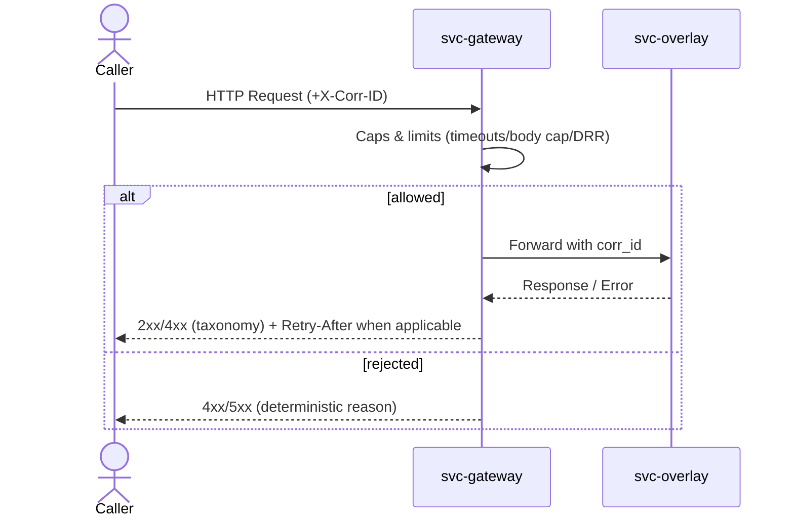
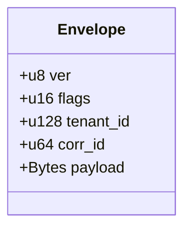
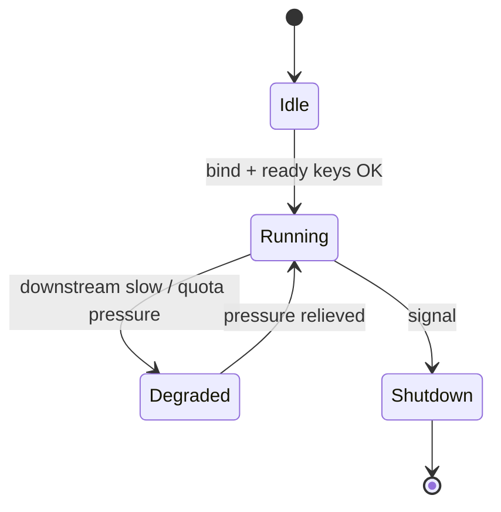
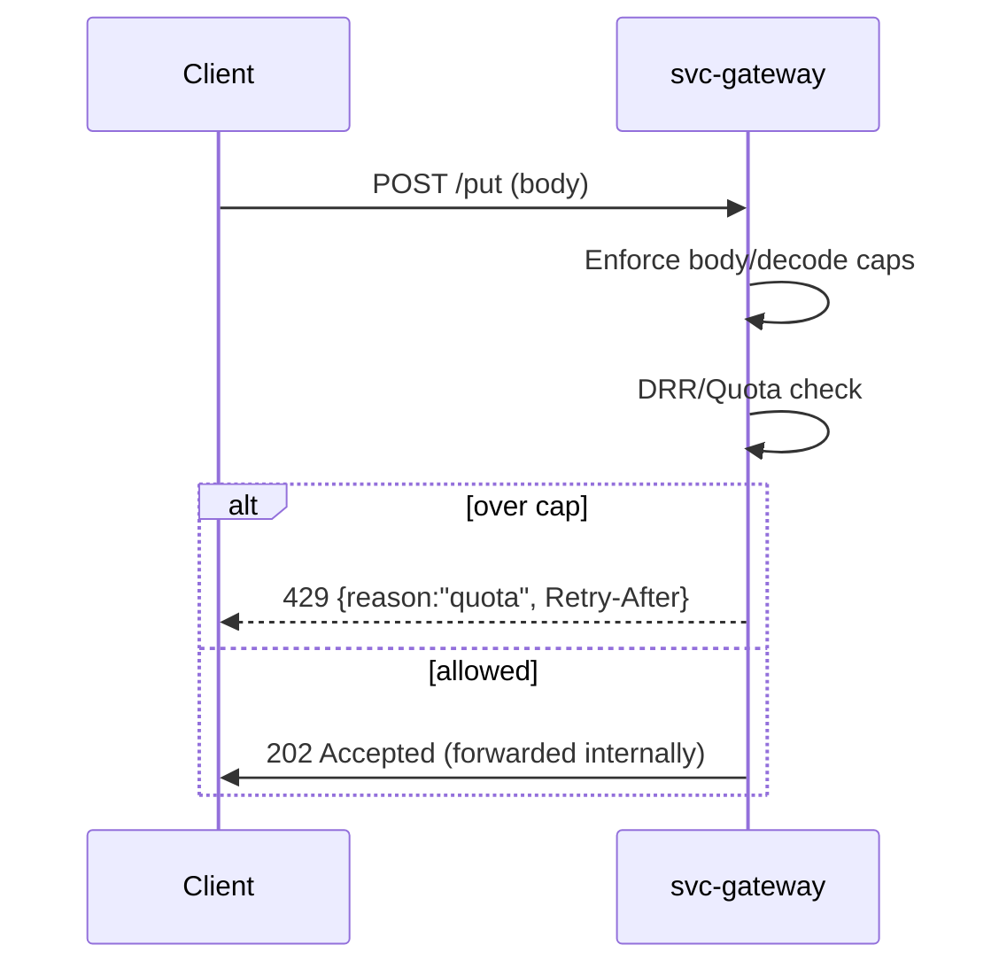

# svc-gateway

> **Role:** service (hardened HTTP ↔ OAP/1 ingress)
> **Owner:** Stevan White
> **Status:** draft
> **MSRV:** 1.80.0
> **Last reviewed:** 2025-10-03

Badges (optional):
[]() []()

---

## 1) Overview

**What it is (one paragraph):**
`svc-gateway` is the public ingress for RustyOnions. It terminates TLS, enforces hard safety caps (timeouts, body/decoded limits), applies multi-tenant quotas and DRR fairness before any expensive work, and forwards validated requests into the internal mesh (overlay → index/storage). It is stateless by design (no user payloads persisted), emits canonical metrics/logs, and degrades predictably (shed writes first) to protect tail latency and availability.

**How it fits (RustyOnions topology):**

* **Pillar:** 3 (Ingress & Transport)
* **Upstream callers:** browsers/SDKs/clients, LB/edge nodes
* **Downstream deps:** `svc-overlay` (primary), indirectly `svc-index`, `svc-storage`
* **Data it touches:** network only; ephemeral buffers; metrics/logs
* **Security boundary:** public-facing; capability (macaroon) gated for mutations; no PII stored

### 1.1 High-Level Architecture (Mermaid REQUIRED)

```mermaid
flowchart LR
  subgraph Client/Node
    A[External Client / SDK] -->|HTTP/1.1 or HTTP/2 (TLS)| B(svc-gateway)
  end

  B -->|RPC/Bus| C[svc-overlay]
  C --> D[svc-index]
  C --> E[svc-storage]
  B -->|/metrics| F[[Prometheus]]

  style B fill:#0b7285,stroke:#083344,color:#fff
```

---

## 2) Responsibilities & Boundaries

**MUST do (core responsibilities):**

* [ ] Terminate TLS and enforce ingress hardening (timeouts, caps, method/host checks).
* [ ] Enforce quotas/DRR fairness and shed early (429/Retry-After) under load.
* [ ] Expose `/healthz`, `/readyz` (truthful degrade), `/metrics`, `/version`.
* [ ] Forward validated requests to overlay with correlation and deterministic error taxonomy.

**MUST NOT do (anti-scope / boundaries):**

* [ ] No persistent user data (stateless; counters/metrics only).
* [ ] No business logic, hydration/BFF, or ledger/econ semantics (belongs to omnigate/econ crates).

**Acceptance Gates (PROOF you did it):**

* [ ] Unit/prop tests cover caps (1 MiB), decode ratio (≤10×), taxonomy (400/401/403/413/415/416/429/503).
* [ ] Metrics exported (`request_latency_seconds`, `rejected_total{reason}`, DRR/quotas) with dashboards/alerts.
* [ ] `/readyz` sheds writes first and returns 503 when degraded.
* [ ] Bench meets SLO: p95 GET intra-region < 80 ms (ref hardware), error budget met.

---

## 3) Public Interfaces

### 3.2 Bus RPC / Events (service)

* **Ingress decision surface:** admission control + forward.
* **Events Emitted:** `svc-gateway.degraded`, `*.health`, `*.crash` (structured; append-only).
* **Subscribed Topics:** `config.updated`, `bus.shutdown`.



### 3.3 HTTP / gRPC (service/binary)

* **Base URL:** `http://<host>:<port>/` (TLS recommended in production)
* **Endpoints:**

  * `GET /healthz` → `200 OK` `"ok"`
  * `GET /readyz` → `200|503` `{degraded,missing, retry_after?}`
  * `GET /metrics` → Prometheus text
  * `GET /version` → `{version, git, build}`

---

## 4) Configuration

> Prefer environment variables first. Provide sane defaults.

| Variable                          | Type             |       Default | Description                                       |
| --------------------------------- | ---------------- | ------------: | ------------------------------------------------- |
| `SVC_GATEWAY_BIND_ADDR`           | socket           | `127.0.0.1:0` | HTTP bind address                                 |
| `SVC_GATEWAY_METRICS_ADDR`        | socket           | `127.0.0.1:0` | Prometheus bind (often localhost-only)            |
| `SVC_GATEWAY_MAX_CONNS`           | u32              |           512 | Max concurrent connections                        |
| `SVC_GATEWAY_READ_TIMEOUT`        | duration         |          `5s` | Per-request read timeout                          |
| `SVC_GATEWAY_WRITE_TIMEOUT`       | duration         |          `5s` | Per-request write timeout                         |
| `SVC_GATEWAY_IDLE_TIMEOUT`        | duration         |         `60s` | Keep-alive idle timeout                           |
| `SVC_GATEWAY_MAX_BODY_BYTES`      | size             |        `1MiB` | Raw body cap (413 on breach)                      |
| `SVC_GATEWAY_DECODE_ABS_CAP`      | size             |        `8MiB` | Post-decode absolute cap (413 `decoded-cap`)      |
| `SVC_GATEWAY_DECODE_RATIO_MAX`    | u32              |            10 | Max decompression ratio (413 `decoded-ratio`)     |
| `SVC_GATEWAY_TLS_ENABLED`         | bool             |         false | Enable TLS (tokio-rustls only)                    |
| `SVC_GATEWAY_TLS_CERT_PATH`       | path             |          `""` | PEM cert path (0600)                              |
| `SVC_GATEWAY_TLS_KEY_PATH`        | path             |          `""` | PEM key path (0600; zeroize in-memory)            |
| `SVC_GATEWAY_UDS_PATH`            | path             |          `""` | Optional Unix socket bind                         |
| `SVC_GATEWAY_UDS_ALLOW_UIDS`      | list<u32>        |          `[]` | Allowed UIDs via `SO_PEERCRED`                    |
| `SVC_GATEWAY_MACAROON_PATH`       | path             |          `""` | Capability token file (verification keys/caveats) |
| `SVC_GATEWAY_DRR_DEFAULT_QUANTUM` | u32              |             1 | DRR base weight                                   |
| `SVC_GATEWAY_DRR_TENANT_QUANTA`   | map<string,u32>  |          `{}` | Per-tenant override weights                       |
| `SVC_GATEWAY_RATE_LIMIT_RPS`      | u32              |           500 | Instance-level RPS cap                            |
| `SVC_GATEWAY_AMNESIA`             | bool             |         false | RAM-only mode (no disk spill)                     |
| `SVC_GATEWAY_PQ_MODE`             | enum(off,hybrid) |         `off` | PQ hybrid KEX policy (see QUANTUM.md)             |
| `SVC_GATEWAY_LOG_FORMAT`          | enum(json,text)  |        `json` | Structured logs                                   |
| `SVC_GATEWAY_LOG_LEVEL`           | enum             |        `info` | `trace`..`error`                                  |
| `SVC_GATEWAY_DANGER_OK`           | bool             |         false | Required to weaken defaults (disallowed in prod)  |

**Flags (if any):**

```
--bind 0.0.0.0:8080
--metrics 127.0.0.1:0
--max-conns 1024
--read-timeout 5s --write-timeout 5s --idle-timeout 60s
--tls --tls-cert /etc/ron/tls/cert.pem --tls-key /etc/ron/tls/key.pem
--rate-limit-rps 500
--log-format json --log-level info
```

**Feature flags (Cargo):**

* `tls` — TLS via `tokio-rustls`
* `pq` — PQ plumbing; `pq-hybrid`, `pq-sign` optional adapters
* `cli` — CLI arg parsing (bins)
* `kameo` — optional actor integration

---

## 5) Build, Run, Test

**Build**

```
cargo build -p svc-gateway
```

**Run (service)**

```
RUST_LOG=info SVC_GATEWAY_METRICS_ADDR=127.0.0.1:0 cargo run -p svc-gateway
```

**Tests (unit/prop/docs)**

```
cargo test -p svc-gateway --all-features
cargo test -p svc-gateway --doc
```

**Lint & format**

```
cargo fmt --all
cargo clippy -p svc-gateway -- -D warnings
```

**Security & deps**

```
cargo deny check
```

**Bench (if provided)**

```
cargo bench -p svc-gateway
```

---

## 6) Observability

**Endpoints (service):**

* `/metrics` — Prometheus exposition
* `/healthz` — liveness
* `/readyz` — readiness (sheds writes first on degrade)
* `/version` — build metadata

**Canonical Metrics (align with RustyOnions):**

* `http_requests_total{route,method,status}` (Counter)
* `request_latency_seconds{route,method}` (Histogram)
* `inflight_requests{route}` (Gauge)
* `rejected_total{reason}` — `unauth|forbidden|quota|busy|body_cap|decoded-cap|decoded-ratio|unsupported|degraded`
* `gateway_quota_exhaustions_total{tenant}` (Counter)
* `gateway_drr_queue_depth{tenant}` (Gauge)
* `busy_rejections_total{endpoint}` (Counter)
* `gateway_degraded{bool}` (Gauge)

**Tracing**

* Targets: `svc-gateway=info,axum=warn,tower_http=warn`
* Span fields: `corr_id`, `peer_addr`, `route`, `status`, `tenant?`

---

## 7) Performance & SLOs

| Metric         | Target          | Notes                                |
| -------------- | --------------- | ------------------------------------ |
| P50 latency    | < 10 ms         | steady-state reads                   |
| P95 latency    | < 80 ms (intra) | inter-region p95 < 200 ms            |
| Start-to-ready | < 2–5 s         | cold start (control surface ready)   |
| Max RPS        | 500 rps/inst    | operate ≤80% then scale horizontally |

> Reproduce on reference box; include payload mixes (16/64/256 KiB), spike/soak scripts, and flamegraphs.

---

## 8) Data & Schema (if applicable)

**Data model (summary)**
Stateless ingress. For content-addressed reads, preserve `ETag: "b3:<hex>"` and verify integrity when applicable.



**Migrations**
N/A (stateless). Any wire-level changes are versioned in OpenAPI/spec.

---

## 9) Security & Privacy

* **Threat model:** STRIDE covered in `SECURITY.md` (smuggling, decode bombs, floods); default-deny routes.
* **Key handling:** `tokio-rustls`; keys loaded from KMS/disk (0600); never logged; zeroized on drop.
* **PII:** none persisted; logs redact secrets; JSON structured with bounded fields.
* **AuthN/Z:** capability tokens (macaroons) on mutations; caveats (verb/path/tenant/TTL).
* **Input validation:** size/time caps; strict `Host`/method; TE/CL conflict denial; decompression guards.
* **Supply chain:** workspace-pinned deps; `cargo-deny` clean.

---

## 10) Error Taxonomy

| Code | Reason        | When                                    | Retry?             |
| ---- | ------------- | --------------------------------------- | ------------------ |
| 400  | malformed     | framing/header conflicts                | no                 |
| 401  | unauth        | missing/invalid capability              | no                 |
| 403  | forbidden     | capability insufficient                 | no                 |
| 413  | body_cap      | body > 1 MiB                            | fix (smaller body) |
| 413  | decoded-cap   | post-decode > 8 MiB                     | fix (smaller body) |
| 413  | decoded-ratio | expansion > 10×                         | fix (encoding)     |
| 415  | unsupported   | unsupported content-encoding/media type | fix                |
| 416  | range         | unsatisfiable range                     | fix                |
| 429  | quota / busy  | quota hit or queue full                 | yes (Retry-After)  |
| 503  | degraded      | readiness not met / shed writes         | yes later          |

---

## 11) Concurrency Model

* **Runtime:** Tokio multi-threaded; bounded channels; cooperative cancellation.
* **I/O:** streaming reads (~64 KiB), explicit timeouts, early rejects.
* **Channels:** bounded mpsc for work; broadcast for events; `try_send` + `Busy` over buffering.
* **Rules:** never hold a lock across `.await`; drain on shutdown; abort stragglers after deadline.



---

## 12) Compatibility & Requirements

* **Rust:** 1.80.0+
* **OS:** Linux x86_64/arm64; macOS (dev)
* **TLS:** tokio_rustls 0.26.x
* **HTTP:** axum 0.7.x, tower-http 0.6.x
* **DB:** none (stateless)

---

## 13) Examples

Service health:

```
curl -sS http://127.0.0.1:8080/healthz
```

Readiness:

```
curl -sS http://127.0.0.1:8080/readyz | jq .
```

---

## 14) Troubleshooting

* **Port already in use:** change `--bind` or `SVC_GATEWAY_BIND_ADDR`.
* **TLS errors:** validate cert/key paths & perms; use tokio-rustls config.
* **413 surprises:** check `Content-Encoding`; decoded bytes might exceed caps.
* **High latency:** confirm `--release`, reduce log verbosity, check downstreams.
* **Frequent 429:** tenant burst > quota; tune DRR/limits or add replicas.

---

## 15) Development Notes

**Project conventions (RustyOnions):**

* Axum handlers end with `.into_response()`.
* Re-export in `lib.rs`: `Config`, `Metrics`, `ReadinessSnapshot`, `service::run`, `VERSION`.
* Transport TLS uses `tokio_rustls::rustls::ServerConfig`.

**Pre-commit quickcheck**

```
cargo fmt --all
cargo clippy -- -D warnings
cargo test
cargo deny check
```

---

## 16) Mermaid Diagrams — Policy & Tooling (REQUIRED)

**Architecture** — see §1.1

**Sequence — Quota/DRR admit-or-reject**



**State — Degrade-first lifecycle** — see §11

**Render locally (SVG)**

```
npm i -g @mermaid-js/mermaid-cli
mmdc -i docs/arch.mmd -o docs/arch.svg
```

**Render via Docker**

```
docker run --rm -v "$PWD":/data minlag/mermaid-cli mmdc -i docs/arch.mmd -o docs/arch.svg
```

**CI (GitHub Actions snippet)**

```yaml
name: render-mermaid
on: [push, pull_request]
jobs:
  mmdc:
    runs-on: ubuntu-latest
    steps:
      - uses: actions/checkout@v4
      - run: npm i -g @mermaid-js/mermaid-cli
      - run: |
          mkdir -p docs
          for f in $(git ls-files '*.mmd'); do
            out="${f%.mmd}.svg"
            mmdc -i "$f" -o "$out"
          done
```

---

## 17) Roadmap & TODO

* [ ] Milestone 1 — Baseline ingress (caps/timeouts/taxonomy) + golden metrics.
* [ ] Milestone 2 — DRR fairness + per-tenant quotas + chaos/soak scripts.
* [ ] Milestone 3 — PQ hybrid KEX toggle + interop tests (see QUANTUM.md).
* [ ] Hardening tasks — header/path fuzzers; TE/CL conflict guards; perf baselines & flamegraphs.

---

## 18) Changelog

See [CHANGELOG.md](./CHANGELOG.md). Follow SemVer; document breaking changes with migration notes.

---

## 19) License

Dual-licensed under **MIT** or **Apache-2.0**. See [LICENSE-MIT](../LICENSE-MIT) and [LICENSE-APACHE](../LICENSE-APACHE).

---

## 20) Contributing

PRs welcome! Please run fmt/clippy/tests and include:

* Updated diagrams (if topology changed)
* Docs & examples
* Bench impact or confirmation against baselines

> Also see: `docs/IDB.md`, `docs/CONFIG.md`, `docs/OBSERVABILITY.md`, `docs/SECURITY.md`, `docs/TESTS.md`, `docs/PERFORMANCE.md`, `docs/QUANTUM.md`, and `docs/RUNBOOK.md` for deep detail.
