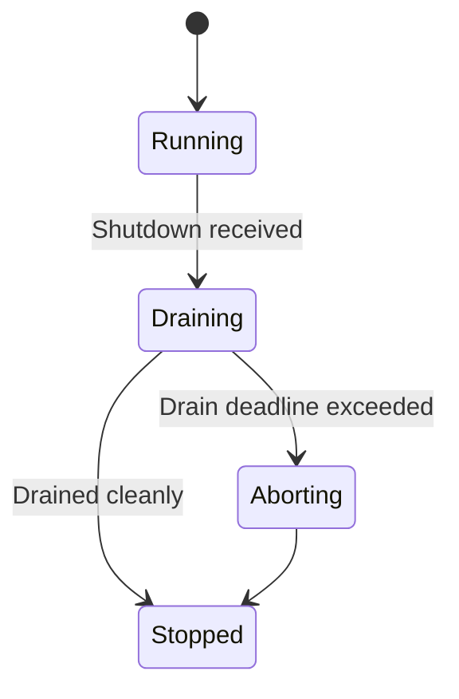
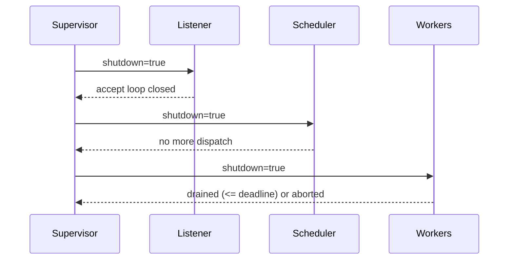

````markdown
---
title: Concurrency Model — svc-gateway
crate: svc-gateway
owner: Stevan White
last-reviewed: 2025-10-02
status: draft
template_version: 1.1
msrv: 1.80.0
tokio: "1.x (pinned at workspace root)"
loom: "0.7+ (dev-only)"
lite_mode: "N/A — service crate"
---

# Concurrency Model — svc-gateway

This document makes the concurrency rules **explicit**: tasks, channels, locks, shutdown, timeouts,
and validation (property/loom/TLA+). It complements `docs/SECURITY.md`, `docs/CONFIG.md`,
and the crate’s `README.md` and `IDB.md`.

> **Golden rule:** never hold a lock across `.await` in supervisory or hot paths.

---

## 0) Lite Mode (for tiny lib crates)

N/A — `svc-gateway` is a service with background tasks.

---

## 1) Invariants (MUST)

- [x] **No lock across `.await`**. If unavoidable, split the critical section and move `.await` outside the guard.
- [x] **Single writer** per mutable resource; readers use snapshots or short read guards.
- [x] **Bounded channels only** (mpsc/broadcast) with explicit overflow policy (drop/reject).
- [x] **Explicit timeouts** on all I/O and RPCs; fail fast with typed errors.
- [x] **Cooperative cancellation**: every `.await` is cancel-safe or guarded by `select!`.
- [x] **Graceful shutdown**: observe `Shutdown` signal; drain within deadline; abort stragglers and count them.
- [x] **No blocking syscalls** on the async runtime; use `spawn_blocking` if required.
- [x] **No task leaks**: track join handles for owned tasks; detaching requires a rationale and a watchdog.
- [x] **Backpressure over buffering**: prefer drop/reject with metrics over unbounded queues.
- [x] **Framing**: length-delimited with caps; handle partial reads safely.

**Async Drop**
- [x] Do **not** block in `Drop`. Expose an async `close()/shutdown()` and call it explicitly; `Drop` only releases cheap resources.

---

## 2) Runtime Topology

**Runtime:** Tokio **multi-threaded** (worker threads = CPU cores by default).

**Primary tasks:**
- **Supervisor** — boots router/listener, DRR scheduler, metrics server; owns shutdown signal; monitors health.
- **HTTP Listener** — accepts connections; applies tower layers (timeouts, caps, rate-limit); routes to handlers.
- **DRR Scheduler** — optional internal queue for tenant fairness when doing async downstream calls; picks next work item with deficit round-robin; exposes fairness metrics.
- **Worker Pool** — N workers (N = min(cores, 8) by default) consuming from bounded `work_rx` when DRR is enabled; otherwise handlers execute inline with per-conn concurrency limits.
- **Metrics/Ready Prober** — serves `/metrics`, `/healthz`, `/readyz`; samples depth/lag counters and exposes gauges.

```mermaid
flowchart TB
  subgraph Runtime
    SUP[Supervisor] -->|spawn| L[HTTP Listener]
    SUP -->|spawn| S[DRR Scheduler]
    SUP -->|spawn N| W[Worker Pool]
    L -->|mpsc(work:512)| S
    S -->|mpsc(work:512)| W
    SUP -->|watch Shutdown| L
    SUP -->|watch Shutdown| S
    SUP -->|watch Shutdown| W
  end
  W -->|join results| SUP
  style SUP fill:#0ea5e9,stroke:#0c4a6e,color:#fff
````

**Text description:** Supervisor spawns Listener, Scheduler, Workers. Listener ingests requests and enqueues costed work into a bounded queue. Scheduler enforces DRR and dispatches to Workers. All tasks receive shutdown via a `watch` channel.

---

## 3) Channels & Backpressure

**Inventory (all bounded unless noted):**

| Name             | Kind      | Capacity | Producers → Consumers | Backpressure Policy                    | Drop Semantics                            |
| ---------------- | --------- | -------: | --------------------- | -------------------------------------- | ----------------------------------------- |
| `events_tx`      | broadcast |     1024 | 1 → N                 | lag counter on slow subs               | increment `bus_lagged_total`; drop oldest |
| `work_tx`        | mpsc      |      512 | Listener → Scheduler  | `try_send`; on full → Busy/429         | return 429 upstream; `busy_rejections++`  |
| `sched_tx`       | mpsc      |      512 | Scheduler → Workers   | `try_send`; on full → drop oldest task | `queue_dropped_total{queue="sched"}`      |
| `shutdown_tx/rx` | watch     |        1 | 1 → N                 | last-write-wins                        | N/A                                       |
| `metrics_tick`   | mpsc      |       64 | 1 → 1                 | `send().await` (low rate ≤1 Hz)        | N/A                                       |

**Guidelines:**

* Prefer **`try_send`** + explicit `Busy` error over `.send().await` in hot paths.
* Emit `queue_depth{queue}` gauges and `queue_dropped_total{queue}` counters.
* For broadcast, monitor `lagged()` and account drops explicitly.

---

## 4) Locks & Shared State

**Allowed**

* Short-lived `Mutex`/`RwLock` for small metadata maps (e.g., tenant configs); **never** `.await` while holding a guard.
* Read-mostly state via `Arc<StateSnapshot>` rebuilt on config updates.
* Per-connection state owned by that connection’s task; cross-task communication via channels.

**Forbidden**

* Holding locks across `.await`.
* Nested locks without a documented hierarchy.

**Hierarchy (if unavoidable)**

1. `state_meta` (global config snapshot)
2. `routing_table` (read-mostly)
3. `counters` (atomic types preferred over locks)

**Atomics preferred** for counters/gauges (`AtomicU64/AtomicBool`) over locks.

---

## 5) Timeouts, Retries, Deadlines

* **Ingress I/O:** `read=5s`, `write=5s`, `idle=60s` (configurable; see CONFIG.md).
* **Downstream RPC (if any):** total deadline ≤ request deadline. **Idempotent** ops may retry with **jittered backoff** (50–100ms initial, cap 2s, **max 3 tries**).
* **Circuit breaker (optional):** open on error-rate or consecutive failures; half-open probes at backoff cap.

```mermaid
sequenceDiagram
  autonumber
  participant C as Client
  participant G as svc-gateway
  C->>G: HTTP Request (deadline=2s)
  Note over G: Apply caps/DRR; accept or reject quickly
  G-->>C: 200/202 result <br/>or 429 Busy / 503 Degraded
```

**Text:** Client sends request with a deadline; gateway either accepts and processes within deadline or returns deterministic Busy/Degraded errors.

---

## 6) Cancellation & Shutdown

* **Signal sources:** `KernelEvent::Shutdown`, `wait_for_ctrl_c()`, or container stop.
* **Propagation:** every task uses `tokio::select! { _ = shutdown.changed() => ..., _ = work => ... }`.
* **Draining:** Listener stops accepting new work; Scheduler stops dispatch; Workers finish in-flight up to a **drain deadline** (config: 1–5s).
* **Abort:** any worker exceeding deadline is aborted via `JoinHandle::abort()`; increment `tasks_aborted_total{kind="worker"}` and record reasons.



---

## 7) I/O & Framing

* HTTP ingress terminates at gateway; body reads are **streamed in ~64 KiB chunks** with **1 MiB** cap.
* If decompression is enabled, enforce **10:1 ratio** and **8 MiB absolute decoded cap**; reject with **413** on breach.
* Always call `stream.shutdown().await` (where applicable) after success/error to flush FIN.
* Partial reads are expected; length checks precede policy and downstream dials.

---

## 8) Error Taxonomy (Concurrency-Relevant)

| Error        | When                         | Retry?    | Metric                               | Notes                         |       |          |
| ------------ | ---------------------------- | --------- | ------------------------------------ | ----------------------------- | ----- | -------- |
| `Busy`       | `work_tx` full               | maybe (*) | `busy_rejections_total{endpoint}`    | Return 429 with `Retry-After` |       |          |
| `Timeout`    | read/write deadline exceeded | sometimes | `io_timeouts_total{op}`              | Attach `op=read               | write | connect` |
| `Canceled`   | shutdown triggered           | no        | `tasks_canceled_total{kind}`         | cooperative cancellation      |       |          |
| `Lagging`    | broadcast overflow           | no        | `bus_lagged_total`                   | subscriber too slow           |       |          |
| `Degraded`   | readiness shedding writes    | yes later | `gateway_degraded{bool}`             | `/readyz` advertises shedding |       |          |
| `DecodeBomb` | decompress ratio/size breach | no        | `rejected_total{reason="decoded-*"`} | deterministic 413             |       |          |

(*) Only idempotent calls and only under caller’s deadline.

---

## 9) Metrics (Concurrency Health)

* `queue_depth{queue}` gauge
* `queue_dropped_total{queue}` counter
* `tasks_spawned_total{kind}` / `tasks_aborted_total{kind}` counters
* `io_timeouts_total{op}` counter
* `backoff_retries_total{op}` counter
* `busy_rejections_total{endpoint}` counter
* `gateway_degraded{bool}` gauge
* `bus_lagged_total` counter

---

## 10) Validation Strategy

**Unit / Property**

* Backpressure: `work_tx` full → returns `Busy (429)` and increments `busy_rejections_total`.
* Deadlines: read/write operations respect configured timeouts ± tolerance.
* Lock discipline: compile-time lints + targeted tests for “no await while locked”.

**Loom (dev)**

* Model `producer → mpsc(512) → consumer` with shutdown.
* Properties: no deadlock; all shutdown signals observed; no double-drop or use-after-close.

**Fuzz**

* HTTP body/framing/decompression boundaries; malformed headers and chunked encodings.

**Chaos**

* Kill and restart worker tasks under load; `/readyz` flips to degraded and recovers; drain deadline honored.

**TLA+ (optional)**

* Model DRR fairness and shutdown liveness: eventually all enqueued tasks either finish or are dropped on deadline.

---

## 11) Code Patterns (Copy-Paste)

**Spawn + cooperative shutdown**

```rust
let (shutdown_tx, mut shutdown_rx) = tokio::sync::watch::channel(false);

let worker = tokio::spawn({
    let mut rx = work_rx;
    async move {
        loop {
            tokio::select! {
                _ = shutdown_rx.changed() => break,
                maybe_job = rx.recv() => {
                    let Some(job) = maybe_job else { break };
                    if let Err(e) = handle_job(job).await {
                        tracing::warn!(error=%e, "job failed");
                    }
                }
            }
        }
    }
});

// on shutdown:
// shutdown_tx.send(true).ok();
// let _ = worker.await;
```

**Bounded mpsc with `try_send`**

```rust
match work_tx.try_send(job) {
    Ok(()) => {}
    Err(tokio::sync::mpsc::error::TrySendError::Full(_job)) => {
        metrics::busy_rejections_total().inc();
        return Err(Error::Busy);
    }
    Err(e) => return Err(e.into()),
}
```

**Timeout with deadline**

```rust
let res = tokio::time::timeout(cfg.read_timeout, read_body(&mut req)).await;
```

**No lock across `.await`**

```rust
let value = { let g = state.lock(); g.derive_value() }; // guard dropped here
do_async(value).await;
```

**Async Drop pattern**

```rust
pub struct Client { inner: Option<Conn> }

impl Client {
    pub async fn close(&mut self) -> anyhow::Result<()> {
        if let Some(conn) = self.inner.take() { conn.shutdown().await?; }
        Ok(())
    }
}

impl Drop for Client {
    fn drop(&mut self) {
        if self.inner.is_some() {
            tracing::debug!("Client dropped without close(); best-effort cleanup");
        }
    }
}
```

---

## 12) Configuration Hooks (Quick Reference)

* `max_conns`, `read_timeout`, `write_timeout`, `idle_timeout`
* DRR: `drr.default_quantum`, `drr.tenant_quanta`, `drr.rate_limit_rps`
* Channel capacities: `work_tx`, `sched_tx` (compile-time constants or config)
* Drain deadline (shutdown)
* Decode guards: `limits.decode_ratio_max`, `limits.decode_abs_cap_bytes`

See `docs/CONFIG.md` for authoritative schema/defaults.

---

## 13) Known Trade-offs / Nonstrict Areas

* **Fairness vs throughput:** DRR improves fairness under multi-tenant load but adds scheduling overhead; allow bypass when single-tenant.
* **Drop-oldest vs reject-new:** Scheduler drops **oldest** when saturated to minimize tail-latency for new arrivals (documented in SLOs).
* **Inline handler vs worker pool:** For simple routes, inline execution + tower limits may outperform queued worker pools; keep both paths available.

---

## 14) Mermaid Diagrams

### 14.1 Task & Queue Topology

```mermaid
flowchart LR
  IN[Ingress Router] -->|mpsc work(512)| SCH[DRR Scheduler]
  SCH -->|mpsc sched(512)| W1[Worker A]
  SCH -->|mpsc sched(512)| W2[Worker B]
  subgraph Control
    SHUT[Shutdown watch] --> IN
    SHUT --> SCH
    SHUT --> W1
    SHUT --> W2
  end
```

**Text:** Router enqueues into bounded `work(512)`; Scheduler dispatches into bounded `sched(512)` for workers; Shutdown watch fans out.

### 14.2 Shutdown Sequence



---

## 15) CI & Lints (Enforcement)

**Clippy lints**

* `-D warnings`
* `-D clippy::await_holding_lock`
* `-W clippy::future_not_send` (spot accidental !Send futures)
* `-W clippy::large_futures` (encourage boxing in hot paths)

**GitHub Actions (suggested)**

```yaml
name: concurrency-guardrails
on: [push, pull_request]
jobs:
  clippy:
    runs-on: ubuntu-latest
    steps:
      - uses: actions/checkout@v4
      - uses: dtolnay/rust-toolchain@stable
      - run: cargo clippy -p svc-gateway -- -D warnings -D clippy::await_holding_lock

  loom:
    if: github.event_name == 'pull_request'
    runs-on: ubuntu-latest
    steps:
      - uses: actions/checkout@v4
      - uses: dtolnay/rust-toolchain@stable
      - run: RUSTFLAGS="--cfg loom" cargo test -p svc-gateway --tests -- --ignored

  fuzz:
    runs-on: ubuntu-latest
    steps:
      - uses: actions/checkout@v4
      - uses: dtolnay/rust-toolchain@stable
      - run: cargo install cargo-fuzz
      - run: cargo fuzz build -p svc-gateway
```

---

## 16) Schema Generation (Optional)

* Add tiny macros/attributes for channel registration and generate `docs/_generated/concurrency.mdfrag`.
* Or maintain a `concurrency.rs` registry and a **golden test** that the doc table matches the registry.

---

## 17) Review & Maintenance

* Review every **90 days** or on any change to tasks/channels/locks.
* Keep `owner`, `msrv`, `last-reviewed` current.
* **PR checklist:** if you modify concurrency, update this doc + Loom/property tests.

```
```
