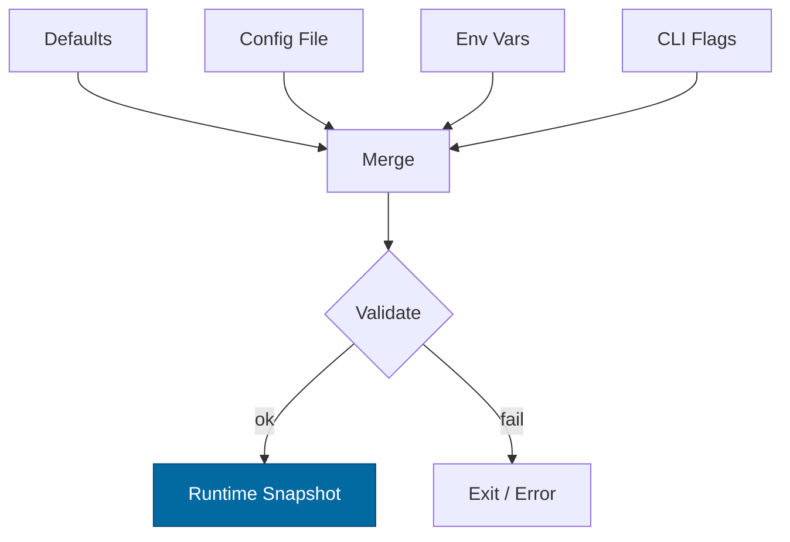

````markdown
---
title: Configuration — svc-gateway
crate: svc-gateway
owner: Stevan White
last-reviewed: 2025-10-02
status: draft
template_version: 1.0
---

# Configuration — svc-gateway

This document defines **all configuration** for `svc-gateway`, including sources,
precedence, schema (types/defaults), validation, feature flags, live-reload behavior,
and security implications. It complements `README.md` and `docs/SECURITY.md`.

> **Tiering:**  
> Service crate — all sections apply (network, readiness, observability, etc.).

---

## 1) Sources & Precedence (Authoritative)

Configuration may come from multiple sources. **Precedence (highest wins):**

1. **Process flags** (CLI)  
2. **Environment variables**  
3. **Config file** (`Config.toml` beside the binary, or `--config <path>`)  
4. **Built-in defaults** (hard-coded)

When reloading dynamically, the effective config is recomputed under the same precedence.

**Supported file formats:** TOML (preferred), JSON (optional).  
**Path resolution order for `--config` (if relative):** `./`, `$CWD`, crate dir.

**Env prefix:** `SVC_GATEWAY_` (e.g., `SVC_GATEWAY_BIND_ADDR=0.0.0.0:8080`).

---

## 2) Quickstart Examples

### 2.1 Minimal service start
```bash
RUST_LOG=info \
SVC_GATEWAY_BIND_ADDR=0.0.0.0:8080 \
SVC_GATEWAY_METRICS_ADDR=127.0.0.1:0 \
cargo run -p svc-gateway
````

### 2.2 Config file (TOML)

```toml
# Config.toml

# --- Network ---
bind_addr    = "0.0.0.0:8080"   # default 127.0.0.1:0
metrics_addr = "127.0.0.1:0"

# --- Core limits/timeouts ---
max_conns     = 512
read_timeout  = "5s"
write_timeout = "5s"
idle_timeout  = "60s"

# --- Request limits ---
[limits]
max_body_bytes        = "1MiB"   # 1,048,576 bytes
decode_abs_cap_bytes  = "8MiB"   # post-decode absolute cap
decode_ratio_max      = 10       # 10:1 max expansion ratio

# --- TLS (tokio-rustls only) ---
[tls]
enabled   = false
# cert_path = "/etc/ron/tls/cert.pem"
# key_path  = "/etc/ron/tls/key.pem"

# --- UDS (optional) ---
[uds]
path       = ""        # e.g., "/run/svc-gateway.sock"
allow_uids = []        # e.g., [1000, 1001]

# --- Auth / Capabilities ---
[auth]
macaroon_path = ""     # file with capability tokens (if used)

# --- DRR / Quotas ---
[drr]
default_quantum = 1          # cost units per round
tenant_quanta   = {}         # per-tenant override map: { "tenantA"=2, "tenantB"=1 }
rate_limit_rps  = 500        # instance-level steady-state limit

# --- Modes / Flags ---
[amnesia]
enabled = false              # RAM-only mode (no spill)

[pq]
mode = "off"                 # "off" | "hybrid"

[safety]
danger_ok = false            # must be true to weaken safe defaults (dev only)

# --- Logging ---
[log]
format = "json"              # "json" | "text"
level  = "info"              # "trace".."error"
```

### 2.3 CLI flags (override file/env)

```bash
cargo run -p svc-gateway -- \
  --bind 0.0.0.0:8080 \
  --metrics 127.0.0.1:0 \
  --max-conns 1024 \
  --read-timeout 5s \
  --write-timeout 5s \
  --idle-timeout 60s \
  --tls \
  --tls-cert /etc/ron/tls/cert.pem \
  --tls-key  /etc/ron/tls/key.pem \
  --log-format json \
  --log-level info
```

---

## 3) Schema (Typed, With Defaults)

> **Durations** accept `ms`, `s`, `m`, `h`.
> **Sizes** accept `B`, `KB`, `MB`, `MiB`, etc.
> **Env mapping:** `SVC_GATEWAY_<UPPER_SNAKE_CASE_PATH>`

| Key / Env Var                                                | Type             | Default       | Description                              | Security Notes                     |
| ------------------------------------------------------------ | ---------------- | ------------- | ---------------------------------------- | ---------------------------------- |
| `bind_addr` / `SVC_GATEWAY_BIND_ADDR`                        | socket           | `127.0.0.1:0` | HTTP/ingress bind address                | Public binds require threat review |
| `metrics_addr` / `SVC_GATEWAY_METRICS_ADDR`                  | socket           | `127.0.0.1:0` | Prometheus endpoint bind                 | Prefer localhost in prod           |
| `max_conns` / `SVC_GATEWAY_MAX_CONNS`                        | u32              | `512`         | Max concurrent connections               | Prevents FD exhaustion             |
| `read_timeout` / `SVC_GATEWAY_READ_TIMEOUT`                  | duration         | `5s`          | Per-request read timeout                 | DoS mitigation                     |
| `write_timeout` / `SVC_GATEWAY_WRITE_TIMEOUT`                | duration         | `5s`          | Per-request write timeout                | DoS mitigation                     |
| `idle_timeout` / `SVC_GATEWAY_IDLE_TIMEOUT`                  | duration         | `60s`         | Keep-alive idle shutdown                 | Resource hygiene                   |
| `limits.max_body_bytes` / `SVC_GATEWAY_MAX_BODY_BYTES`       | size             | `1MiB`        | Request payload cap                      | Edge rejection (413)               |
| `limits.decode_abs_cap_bytes` / `SVC_GATEWAY_DECODE_ABS_CAP` | size             | `8MiB`        | Post-decode absolute cap                 | Zip bomb guard                     |
| `limits.decode_ratio_max` / `SVC_GATEWAY_DECODE_RATIO_MAX`   | u32              | `10`          | Max decompression ratio                  | Zip bomb guard                     |
| `tls.enabled` / `SVC_GATEWAY_TLS_ENABLED`                    | bool             | `false`       | Enable TLS                               | tokio-rustls only                  |
| `tls.cert_path` / `SVC_GATEWAY_TLS_CERT_PATH`                | path             | `""`          | PEM cert path                            | Secrets on disk; perms 0600        |
| `tls.key_path` / `SVC_GATEWAY_TLS_KEY_PATH`                  | path             | `""`          | PEM key path                             | Zeroize in memory                  |
| `uds.path` / `SVC_GATEWAY_UDS_PATH`                          | path             | `""`          | Unix domain socket path (optional)       | Dir 0700, sock 0600; SO_PEERCRED   |
| `uds.allow_uids` / `SVC_GATEWAY_UDS_ALLOW_UIDS`              | list<u32>        | `[]`          | PEERCRED allowlist                       | Strict production control          |
| `auth.macaroon_path` / `SVC_GATEWAY_MACAROON_PATH`           | path             | `""`          | Capability token file                    | Never log contents                 |
| `drr.default_quantum` / `SVC_GATEWAY_DRR_DEFAULT_QUANTUM`    | u32              | `1`           | Cost units per round                     | Fairness control                   |
| `drr.tenant_quanta` / `SVC_GATEWAY_DRR_TENANT_QUANTA`        | map<string,u32>  | `{}`          | Per-tenant quantum overrides             | Keep minimal; audit changes        |
| `drr.rate_limit_rps` / `SVC_GATEWAY_RATE_LIMIT_RPS`          | u32              | `500`         | Instance-level rate limit                | Backpressure control               |
| `amnesia.enabled` / `SVC_GATEWAY_AMNESIA`                    | bool             | `false`       | RAM-only mode (no disk spill)            | Disables persistent logs/buffers   |
| `pq.mode` / `SVC_GATEWAY_PQ_MODE`                            | enum(off,hybrid) | `off`         | PQ readiness toggle                      | Interop compatibility risk         |
| `safety.danger_ok` / `SVC_GATEWAY_DANGER_OK`                 | bool             | `false`       | Allow weakening safe defaults (dev only) | Must be false in prod              |
| `log.format` / `SVC_GATEWAY_LOG_FORMAT`                      | enum(json,text)  | `json`        | Structured logs                          | JSON recommended in prod           |
| `log.level` / `SVC_GATEWAY_LOG_LEVEL`                        | enum             | `info`        | `trace`..`error`                         | Avoid `trace` in prod              |

---

## 4) Validation Rules (Fail-Closed)

Apply on startup or reload:

* `bind_addr`, `metrics_addr` parse to valid sockets (ports <1024 require privileges).
* `max_conns > 0`, `limits.max_body_bytes ≥ 1 KiB`.
* `limits.decode_abs_cap_bytes ≥ limits.max_body_bytes`.
* `limits.decode_ratio_max ≥ 1`.
* If `tls.enabled = true`: `cert_path` and `key_path` exist, readable, and not world-readable.
* If `uds.path` set: parent dir exists, mode `0700`; socket `0600`.
* If `auth.macaroon_path` set: file exists, non-empty.
* If `pq.mode = "hybrid"`: feature enabled at build or explicit interop override.
* If any value weakens safe defaults (e.g., `max_conns > 4096`, `rate_limit_rps > 2000`, `max_body_bytes > 1MiB`, decode caps raised), **require** `safety.danger_ok = true`; otherwise fail.

**On violation:** structured error → **exit non-zero** (service) or **return error** (library).

---

## 5) Dynamic Reload (If Supported)

* **Triggers:** SIGHUP **or** bus event `ConfigUpdated { version: <u64> }`.
* **Reload semantics:**

  * **Non-disruptive:** timeouts, limits, log level/format, DRR quanta, rate limits.
  * **Disruptive:** `bind_addr`, `tls.*`, `uds.*` (socket rebind required).
* **Atomicity:** Compute a new snapshot; swap under a mutex without holding `.await`.
* **Audit:** Emit `KernelEvent::ConfigUpdated { version }` and a redacted diff.

---

## 6) CLI Flags (Canonical)

```
--config <path>                # Load Config.toml (low precedence)
--bind <ip:port>               # bind_addr
--metrics <ip:port>            # metrics_addr
--max-conns <num>
--read-timeout <dur>           # 5s, 250ms, 1m
--write-timeout <dur>
--idle-timeout <dur>
--tls                          # tls.enabled=true
--tls-cert <path>              # tls.cert_path
--tls-key <path>               # tls.key_path
--uds <path>                   # uds.path
--rate-limit-rps <num>         # drr.rate_limit_rps
--log-format <json|text>
--log-level <trace|debug|info|warn|error>
```

---

## 7) Feature Flags (Cargo)

| Feature | Default | Effect                                                  |
| ------: | :-----: | ------------------------------------------------------- |
|   `tls` |   off   | Enables tokio-rustls TLS plumbing and tls.* config keys |
|    `pq` |   off   | Enables PQ hybrid mode config (`pq.mode=hybrid`)        |
|   `cli` |    on   | Enables CLI parser for flags above (bins only)          |
| `kameo` |   off   | Optional actor integration                              |

> If a feature changes the schema, document the delta and keep defaults safe.

---

## 8) Security Implications

* **Public binds** (`0.0.0.0`) require strict caps (timeouts, body size, RPS).
* **TLS:** only `tokio_rustls::rustls::ServerConfig`; avoid other TLS stacks.
* **Macaroons:** never log token contents; rotate ≤ 30 days.
* **Amnesia:** disables persistent logs/buffers; use ring buffer tracing.
* **UDS:** enforce `SO_PEERCRED` and `uds.allow_uids`; keep paths private.

See `docs/SECURITY.md` for the crate’s threat model.

---

## 9) Compatibility & Migration

* **Backwards compatible:** add new keys with safe defaults; do not change semantics silently.
* **Renames:** keep old env alias for ≥ 1 minor; warn on use.
* **Breaking changes:** bump **major**; include clear migration steps in `CHANGELOG.md`.

**Deprecation table:**

| Old Key | New Key | Removal Target | Notes |
| ------: | :------ | -------------: | ----- |
|       — | —       |              — | —     |

---

## 10) Reference Implementation (Rust)

> Paste into `src/config.rs`. Uses `serde`, `humantime_serde` for durations, and plain bytes for sizes (resolve strings to bytes when loading).

```rust
use std::{net::SocketAddr, path::PathBuf, time::Duration};
use serde::{Deserialize, Serialize};

#[derive(Debug, Clone, Serialize, Deserialize, Default)]
pub struct TlsCfg {
    pub enabled: bool,
    pub cert_path: Option<PathBuf>,
    pub key_path: Option<PathBuf>,
}

#[derive(Debug, Clone, Serialize, Deserialize, Default)]
pub struct UdsCfg {
    pub path: Option<PathBuf>,
    #[serde(default)]
    pub allow_uids: Vec<u32>,
}

#[derive(Debug, Clone, Serialize, Deserialize)]
pub struct Limits {
    #[serde(default = "default_body_bytes")]
    pub max_body_bytes: u64,       // bytes
    #[serde(default = "default_decode_abs_cap")]
    pub decode_abs_cap_bytes: u64, // bytes (post-decode)
    #[serde(default = "default_decode_ratio")]
    pub decode_ratio_max: u32,     // e.g., 10:1
}

fn default_body_bytes() -> u64 { 1 * 1024 * 1024 }      // 1 MiB
fn default_decode_abs_cap() -> u64 { 8 * 1024 * 1024 }  // 8 MiB
fn default_decode_ratio() -> u32 { 10 }

#[derive(Debug, Clone, Serialize, Deserialize, Default)]
pub struct AuthCfg {
    pub macaroon_path: Option<PathBuf>,
}

#[derive(Debug, Clone, Serialize, Deserialize)]
pub struct DrrCfg {
    #[serde(default = "default_quantum")]
    pub default_quantum: u32,
    #[serde(default)]
    pub tenant_quanta: std::collections::BTreeMap<String, u32>,
    #[serde(default = "default_rate_limit_rps")]
    pub rate_limit_rps: u32,
}
fn default_quantum() -> u32 { 1 }
fn default_rate_limit_rps() -> u32 { 500 }

#[derive(Debug, Clone, Serialize, Deserialize)]
#[serde(rename_all = "lowercase")]
pub enum PqMode { Off, Hybrid }
impl Default for PqMode { fn default() -> Self { PqMode::Off } }

#[derive(Debug, Clone, Serialize, Deserialize, Default)]
pub struct AmnesiaCfg { pub enabled: bool }

#[derive(Debug, Clone, Serialize, Deserialize)]
#[serde(rename_all = "lowercase")]
pub enum LogFormat { Json, Text }
impl Default for LogFormat { fn default() -> Self { LogFormat::Json } }

#[derive(Debug, Clone, Serialize, Deserialize)]
pub struct LogCfg {
    #[serde(default)]
    pub format: LogFormat,
    #[serde(default = "default_log_level")]
    pub level: String, // "trace".."error"
}
fn default_log_level() -> String { "info".to_string() }

#[derive(Debug, Clone, Serialize, Deserialize)]
pub struct SafetyCfg {
    #[serde(default)]
    pub danger_ok: bool,
}

#[derive(Debug, Clone, Serialize, Deserialize)]
pub struct Config {
    pub bind_addr: Option<SocketAddr>,     // None => 127.0.0.1:0
    pub metrics_addr: Option<SocketAddr>,  // None => 127.0.0.1:0
    #[serde(default = "default_max_conns")]
    pub max_conns: u32,

    #[serde(with = "humantime_serde", default = "default_5s")]
    pub read_timeout: Duration,
    #[serde(with = "humantime_serde", default = "default_5s")]
    pub write_timeout: Duration,
    #[serde(with = "humantime_serde", default = "default_60s")]
    pub idle_timeout: Duration,

    #[serde(default)]
    pub tls: TlsCfg,
    #[serde(default)]
    pub uds: UdsCfg,
    #[serde(default)]
    pub limits: Limits,
    #[serde(default)]
    pub auth: AuthCfg,
    #[serde(default)]
    pub drr: DrrCfg,
    #[serde(default)]
    pub amnesia: AmnesiaCfg,
    #[serde(default)]
    pub pq: PqMode,
    #[serde(default)]
    pub safety: SafetyCfg,
    #[serde(default)]
    pub log: LogCfg,
}

fn default_max_conns() -> u32 { 512 }
fn default_5s() -> Duration { Duration::from_secs(5) }
fn default_60s() -> Duration { Duration::from_secs(60) }

impl Default for Config {
    fn default() -> Self {
        Self {
            bind_addr: Some("127.0.0.1:0".parse().unwrap()),
            metrics_addr: Some("127.0.0.1:0".parse().unwrap()),
            max_conns: default_max_conns(),
            read_timeout: default_5s(),
            write_timeout: default_5s(),
            idle_timeout: default_60s(),
            tls: TlsCfg::default(),
            uds: UdsCfg::default(),
            limits: Limits {
                max_body_bytes: default_body_bytes(),
                decode_abs_cap_bytes: default_decode_abs_cap(),
                decode_ratio_max: default_decode_ratio(),
            },
            auth: AuthCfg::default(),
            drr: DrrCfg {
                default_quantum: default_quantum(),
                tenant_quanta: Default::default(),
                rate_limit_rps: default_rate_limit_rps(),
            },
            amnesia: AmnesiaCfg { enabled: false },
            pq: PqMode::Off,
            safety: SafetyCfg { danger_ok: false },
            log: LogCfg { format: LogFormat::Json, level: default_log_level() },
        }
    }
}

impl Config {
    pub fn validate(&self) -> anyhow::Result<()> {
        // basic ranges
        if self.max_conns == 0 { anyhow::bail!("max_conns must be > 0"); }
        if self.limits.max_body_bytes < 1024 {
            anyhow::bail!("limits.max_body_bytes must be at least 1KiB");
        }
        if self.limits.decode_abs_cap_bytes < self.limits.max_body_bytes {
            anyhow::bail!("limits.decode_abs_cap_bytes must be >= max_body_bytes");
        }
        if self.limits.decode_ratio_max < 1 {
            anyhow::bail!("limits.decode_ratio_max must be >= 1");
        }

        // TLS preconditions
        if self.tls.enabled {
            match (&self.tls.cert_path, &self.tls.key_path) {
                (Some(c), Some(k)) if c.exists() && k.exists() => {},
                _ => anyhow::bail!("TLS enabled but cert/key not found or unreadable"),
            }
        }

        // UDS preconditions (best-effort: existence checked by runtime binder)
        if let Some(p) = &self.uds.path {
            if p.as_os_str().is_empty() {
                anyhow::bail!("uds.path is empty string")
            }
        }

        // Safety rails — forbid weakening defaults in prod unless danger_ok
        let weakened =
            self.max_conns > 4096
            || self.drr.rate_limit_rps > 2000
            || self.limits.max_body_bytes > default_body_bytes()
            || self.limits.decode_abs_cap_bytes > 16 * 1024 * 1024
            || matches!(self.pq, PqMode::Hybrid);

        let prod = std::env::var("RUST_ENV").ok().as_deref() == Some("production");

        if prod && weakened && !self.safety.danger_ok {
            anyhow::bail!("unsafe config in production without safety.danger_ok=true");
        }

        Ok(())
    }
}
```

---

## 11) Test Matrix

| Scenario                                  | Expected Outcome                                             |
| ----------------------------------------- | ------------------------------------------------------------ |
| Missing `Config.toml`                     | Start with defaults; warn                                    |
| Invalid `bind_addr`                       | Fail fast with explicit error                                |
| TLS enabled but missing keys              | Fail fast                                                    |
| Body over `max_body_bytes`                | `413 Payload Too Large` at ingress                           |
| Decoded size > `decode_abs_cap_bytes`     | `413 Payload Too Large` with reason `decoded-cap`            |
| Ratio > `decode_ratio_max`                | `413 Payload Too Large` with reason `decoded-ratio`          |
| SIGHUP received                           | Non-disruptive reload for safe keys; disruptive ones rebind  |
| Weakened defaults in prod, no `danger_ok` | Startup fails with clear diagnostic                          |
| DRR tenant override                       | Takes effect on reload; fairness within ±10% over 60s window |

---

## 12) Mermaid — Config Resolution Flow



---

## 13) Operational Notes

* Keep **prod config under version control** (private repo/secret store); mount secrets read-only.
* Prefer **env vars** in containers; avoid baking secrets into images.
* Document **default ports** and **firewall rules** near `bind_addr`.
* Any change to keys **must update this doc** and `CHANGELOG.md` with migration notes.

```
```
