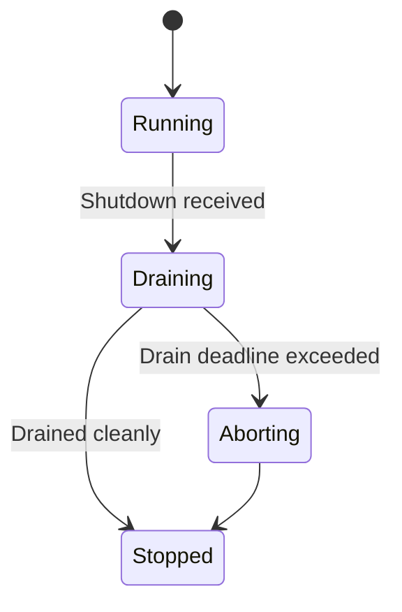
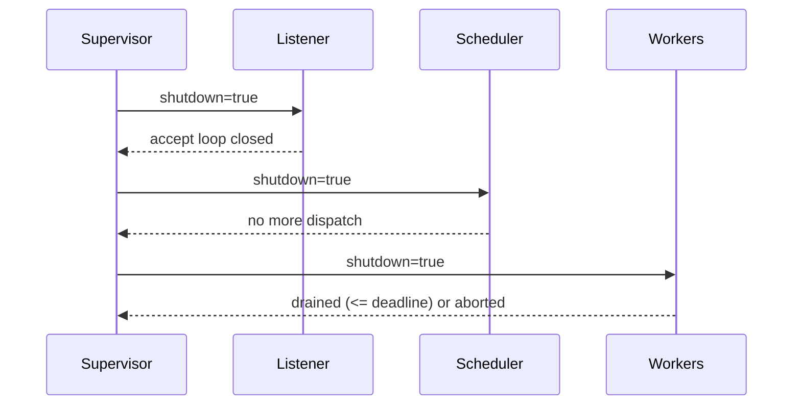
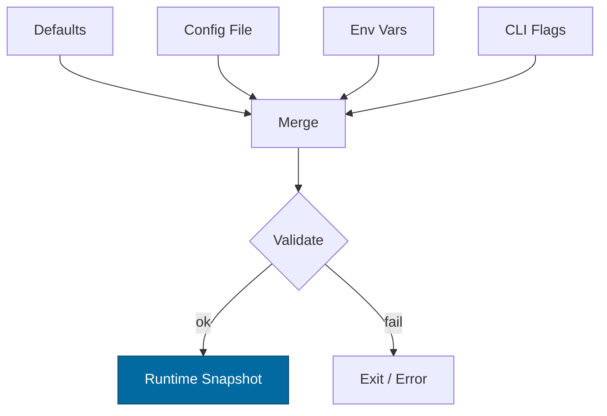

# Combined Markdown

_Source directory_: `crates/svc-gateway/docs`  
_Files combined_: 13  
_Recursive_: 0

---

### Table of Contents

- API.MD
- CONCURRENCY.MD
- CONFIG.MD
- GOVERNANCE.MD
- IDB.md
- INTEROP.MD
- OBSERVABILITY.MD
- OLD_README.md
- PERFORMANCE.MD
- QUANTUM.MD
- RUNBOOK.MD
- SECURITY.MD
- TESTS.MD

---

## API.MD
_File 1 of 13_


---

````markdown
---
title: API Surface & SemVer Reference — svc-gateway
status: draft
msrv: 1.80.0
last-updated: 2025-10-03
audience: contributors, auditors, API consumers
---

# API.md

## 0. Purpose

This document captures the **public API surface** of `svc-gateway`:

- Snapshot of exported Rust items and the **HTTP wire contract**.
- SemVer discipline: what changes **break** vs **extend**.
- CI-enforceable via `cargo public-api` (Rust) and `openapi-diff` (HTTP).
- Acts as the “spec” for external consumers.

`svc-gateway` is a **service crate** (ingress). The Rust public API is intentionally small; the primary surface is **HTTP**.

```mermaid
flowchart LR
  C[Client] -->|HTTP/1.1| G[svc-gateway]
  C -. X-Corr-ID .-> G
  G -->|cap checks + limits| G
  G -->|validated request| D[Downstream]
  G -.->|JSON error + Retry-After| C
  style G fill:#0ea5e9,stroke:#0c4a6e,color:#fff
````

---

## 1. Public API Surface

### 1.1 Rust Surface (intended contract)

> Keep small, stable, and testable. This lets other crates embed or integration-test the service.

```text
# Target public items (contract — assert via cargo public-api)
pub mod config {
    pub struct Config;                 // serde-loadable, validated
}
pub mod readiness {
    pub struct ReadinessSnapshot;      // { degraded: bool, missing: Vec<&'static str> }
    pub const READY_KEYS: &'static [&'static str];
}
pub mod telemetry {
    pub fn init_tracing(service: &str) -> Result<(), Box<dyn std::error::Error>>;
}
pub mod metrics {
    pub struct Metrics;                // registered handles; Clone
}
pub mod service {
    pub async fn run(cfg: config::Config) -> anyhow::Result<()>;
    pub const VERSION: &'static str;   // build info (git, semver)
}
pub mod errors {
    #[non_exhaustive]
    pub enum Error {
        Busy, Timeout, Unauthorized, Forbidden,
        TooLarge, Unsupported, Degraded,
        Io(std::io::Error),
        Other(String)
    }
}
```

**Doctest examples (non-normative)**

````rust
/// Create config, initialize tracing, and run service.
/// ```no_run
/// use svc_gateway::{config::Config, telemetry, service};
/// telemetry::init_tracing("svc-gateway").unwrap();
/// let cfg = Config::default(); // load/merge env+file in real main()
/// tokio_test::block_on(service::run(cfg)).unwrap();
/// ```
````

Assert in CI:

```bash
cargo public-api --simplified --deny-changes -p svc-gateway
```

---

### 1.2 HTTP Surface (primary contract)

All endpoints are served over **HTTP/1.1 or HTTP/2 (TLS 1.3)**.

#### 1.2.1 Base Path

* The default base path is `/api/…`.
* Deployments MAY set `BASE_PATH` (e.g., `/gateway/v1`) **without breaking** the contract *provided* per-route semantics, headers, and error taxonomy remain unchanged.
* If base path changes, reflect it in OpenAPI and CHANGELOG (minor if additive, major if removing old path).

#### 1.2.2 Control & Telemetry

| Method | Path       |  Status | Body       | Notes                                                |
| -----: | ---------- | ------: | ---------- | ---------------------------------------------------- |
|    GET | `/healthz` |     200 | `"ok"`     | Liveness only. Never carries secrets.                |
|    GET | `/readyz`  | 200/503 | JSON       | `503` on degrade. See schema below.                  |
|    GET | `/metrics` |     200 | text/plain | Prometheus exposition. Usually bound to localhost.   |
|    GET | `/version` |     200 | JSON       | `{ "version": "...", "git": "...", "build": "..." }` |

`/readyz` JSON (stable):

```json
{ "degraded": false, "missing": [] }
```

When degraded:

```json
{ "degraded": true, "missing": ["policy_loaded"], "retry_after": 1 }
```

#### 1.2.3 Ingress API (edge rules applied)

* **Caps & Limits:** read/write timeouts **5s**; ≤**512** inflight; ≤**500 rps/instance**; body cap **1 MiB**; decode guard **10:1** and **≤ 8 MiB** post-decode.
* **Auth:** capability tokens (macaroons) on **mutations**; no sessions/cookies.
* **Deterministic errors (reason registry):**

| HTTP | Reason          | When                                |
| ---: | --------------- | ----------------------------------- |
|  400 | `malformed`     | Bad framing/headers/body            |
|  401 | `unauth`        | Missing/invalid capability token    |
|  403 | `forbidden`     | Capability present but insufficient |
|  413 | `body_cap`      | Raw body exceeds 1 MiB              |
|  413 | `decoded-cap`   | Post-decode > 8 MiB                 |
|  413 | `decoded-ratio` | Expansion ratio > 10:1              |
|  415 | `unsupported`   | Unsupported media/encoding          |
|  429 | `quota`         | Rate/DRR quota exceeded             |
|  429 | `busy`          | Queue full/backpressure             |
|  503 | `degraded`      | Readiness shedding writes           |

Error payload (stable):

```json
{ "code": 429, "reason": "quota", "retry_after": 2 }
```

#### 1.2.4 Required Headers (contract)

* **Request:**

  * `Authorization: Bearer <capability>` (mutations)
  * `Content-Encoding: gzip|deflate|br` (if used; subject to guards)
  * `X-Corr-ID: <uuid/ulid>` (optional; generated if absent)

* **Response:**

  * `X-Corr-ID` (echoed or created)
  * `Retry-After: <seconds>` (for 429/503)
  * `ETag: "b3:<hex>"` (on content-addressed reads, when applicable)

---

## 2. SemVer Discipline

We track **two** surfaces:

1. **Rust API** — Cargo SemVer
2. **HTTP API** — wire contract rules below

### 2.1 Rust API

**Additive (minor)**

* New `pub` items that don’t change existing signatures.
* New enum variants/fields only on `#[non_exhaustive]`.
* Optional config fields with safe defaults.

**Breaking (major)**

* Remove/rename public items; change signatures/bounds.
* Change error types/variants in breaking ways.
* Make previously `#[non_exhaustive]` items exhaustive.

**Patch**

* Impl/perf/doc changes with identical surface.

### 2.2 HTTP API

**Compatible (additive)**

* Add new routes or optional response fields.
* Add new error **reasons** (registry is **additive only**).
* Tighten validation against previously undefined behavior.

**Breaking**

* Remove/rename routes or change success schema.
* Change status code/`reason` mapping for existing failures.
* Remove or semantically alter a required header.

> **Reason Registry Stability:** Reasons are **append-only**; existing meanings never change. CI checks that any emitted `reason` is in the registry.

---

## 3. Stability Guarantees

* **MSRV:** 1.80.0 (workspace-pinned).
* **Unsafe code:** forbidden unless explicitly justified.
* **No internal type leaks**: public Rust signatures avoid deep stack types.
* **Docs required:** `#![deny(missing_docs)]` for public items; OpenAPI in `/docs/openapi/`.

---

## 4. Invariants

* **Service crate**: Rust surface stays minimal (config, readiness, telemetry, metrics, `run()`, `VERSION`).
* **HTTP**: Predictable degrade (`/readyz` truth), deterministic error taxonomy, `X-Corr-ID` propagation, `Retry-After` on backpressure, `ETag` on CAS reads.

---

## 5. Tooling

* **Rust surface**

  ```bash
  cargo install cargo-public-api
  cargo public-api --simplified -p svc-gateway > docs/api-history/svc-gateway/<NEW_VERSION>.txt
  ```

* **HTTP surface**

  * Store spec at `/docs/openapi/svc-gateway.yaml`.
  * Diff against previous:

    ```bash
    openapi-diff docs/openapi/svc-gateway-prev.yaml docs/openapi/svc-gateway.yaml --fail-on-incompatible
    ```

* **Optional**

  * `cargo semver-checks` for stricter Rust SemVer analysis.
  * `cargo doc` with doctests for `Config` and error taxonomy examples.

---

## 6. CI & Gates

* **Rust surface gate**

  ```yaml
  - name: public-api
    run: |
      cargo install cargo-public-api || true
      cargo public-api --simplified -p svc-gateway > public-api.txt
      git diff --exit-code -- public-api.txt || (echo "Public API changed; update API.md/CHANGELOG" && exit 1)
  ```

* **HTTP surface gate**

  ```yaml
  - name: openapi-diff
    run: |
      openapi-diff docs/openapi/svc-gateway-prev.yaml docs/openapi/svc-gateway.yaml --fail-on-incompatible
  ```

* **Reason registry sanity**

  ```yaml
  - name: error-reason-registry
    run: cargo test -p svc-gateway --test error_reasons_golden
  ```

---

## 7. Acceptance Checklist (DoD)

* [ ] Current **Rust** API snapshot stored under `/docs/api-history/svc-gateway/<version>.txt`.
* [ ] **OpenAPI** updated and diffed; base path documented if changed.
* [ ] CI gates green (`public-api`, `openapi-diff`, reason registry test).
* [ ] **CHANGELOG.md** updated for any surface changes.
* [ ] Docs/tests updated for new/changed APIs.
* [ ] Error taxonomy table matches implementation & metrics (`rejected_total{reason=…}`).

---

## 8. Appendix

### 8.1 Error Object (JSON Schema)

```json
{
  "$id": "https://rustyonions.dev/schemas/gateway-error.json",
  "type": "object",
  "required": ["code", "reason"],
  "properties": {
    "code":   { "type": "integer", "enum": [400,401,403,413,415,429,503] },
    "reason": { "type": "string",
                "enum": ["malformed","unauth","forbidden","body_cap","decoded-cap","decoded-ratio","unsupported","quota","busy","degraded"] },
    "retry_after": { "type": "integer", "minimum": 0 }
  },
  "additionalProperties": false
}
```

### 8.2 `/readyz` Response (JSON Schema)

```json
{
  "$id": "https://rustyonions.dev/schemas/gateway-readyz.json",
  "type": "object",
  "required": ["degraded","missing"],
  "properties": {
    "degraded": { "type": "boolean" },
    "missing":  { "type": "array", "items": { "type": "string" } },
    "retry_after": { "type": "integer", "minimum": 0 }
  },
  "additionalProperties": false
}
```

### 8.3 Minimal OpenAPI Skeleton (headers included)

```yaml
openapi: 3.0.3
info:
  title: svc-gateway API
  version: "1.0.0"
paths:
  /healthz:
    get:
      summary: Liveness probe
      responses:
        "200": { description: OK, content: { text/plain: { schema: { type: string } } } }
  /readyz:
    get:
      summary: Readiness probe (degrade-aware)
      responses:
        "200":
          description: Ready
          headers:
            X-Corr-ID: { $ref: "#/components/headers/XCorrID" }
          content:
            application/json: { schema: { $ref: "#/components/schemas/Readyz" } }
        "503":
          description: Degraded
          headers:
            X-Corr-ID: { $ref: "#/components/headers/XCorrID" }
            Retry-After: { $ref: "#/components/headers/RetryAfter" }
          content:
            application/json: { schema: { $ref: "#/components/schemas/Readyz" } }
  /metrics:
    get:
      summary: Prometheus metrics
      responses:
        "200": { description: Prometheus text }
  /version:
    get:
      summary: Build metadata
      responses:
        "200":
          description: Version JSON
          headers:
            X-Corr-ID: { $ref: "#/components/headers/XCorrID" }
components:
  headers:
    XCorrID:
      schema: { type: string }
      description: Correlation ID propagated end-to-end
    RetryAfter:
      schema: { type: integer, minimum: 0 }
      description: Seconds to wait before retrying
    ETag:
      schema: { type: string }
      description: Strong ETag (b3:<hex>) on content-addressed reads
  schemas:
    Error:  { $ref: "gateway-error.json" }
    Readyz:
      type: object
      required: [degraded, missing]
      properties:
        degraded: { type: boolean }
        missing:  { type: array, items: { type: string } }
        retry_after: { type: integer, minimum: 0 }
```

### 8.4 Examples

**Successful GET**

```bash
curl -H "X-Corr-ID: 01J..." https://gateway.example/api/objects/123
```

**429 with Retry-After**

```bash
curl -i -X POST https://gateway.example/api/put -d @big.json
# HTTP/1.1 429 Too Many Requests
# Retry-After: 2
# X-Corr-ID: 01J...
# { "code": 429, "reason": "quota", "retry_after": 2 }
```

**413 decoded-cap**

```bash
# Response: 413 + { "code": 413, "reason": "decoded-cap" }
```

---

## 9. History

* **1.0.0 (draft)** — Minimal Rust surface (`Config`, `run`, `Metrics`, `ReadinessSnapshot`, `init_tracing`, `VERSION`), stable HTTP control endpoints, deterministic error taxonomy/headers, base-path note, and CI gates for Rust+HTTP surfaces.

```
---


---

## CONCURRENCY.MD
_File 2 of 13_


````markdown
---
title: Concurrency Model — svc-gateway
crate: svc-gateway
owner: Stevan White
last-reviewed: 2025-10-02
status: draft
template_version: 1.1
msrv: 1.80.0
tokio: "1.x (pinned at workspace root)"
loom: "0.7+ (dev-only)"
lite_mode: "N/A — service crate"
---

# Concurrency Model — svc-gateway

This document makes the concurrency rules **explicit**: tasks, channels, locks, shutdown, timeouts,
and validation (property/loom/TLA+). It complements `docs/SECURITY.md`, `docs/CONFIG.md`,
and the crate’s `README.md` and `IDB.md`.

> **Golden rule:** never hold a lock across `.await` in supervisory or hot paths.

---

## 0) Lite Mode (for tiny lib crates)

N/A — `svc-gateway` is a service with background tasks.

---

## 1) Invariants (MUST)

- [x] **No lock across `.await`**. If unavoidable, split the critical section and move `.await` outside the guard.
- [x] **Single writer** per mutable resource; readers use snapshots or short read guards.
- [x] **Bounded channels only** (mpsc/broadcast) with explicit overflow policy (drop/reject).
- [x] **Explicit timeouts** on all I/O and RPCs; fail fast with typed errors.
- [x] **Cooperative cancellation**: every `.await` is cancel-safe or guarded by `select!`.
- [x] **Graceful shutdown**: observe `Shutdown` signal; drain within deadline; abort stragglers and count them.
- [x] **No blocking syscalls** on the async runtime; use `spawn_blocking` if required.
- [x] **No task leaks**: track join handles for owned tasks; detaching requires a rationale and a watchdog.
- [x] **Backpressure over buffering**: prefer drop/reject with metrics over unbounded queues.
- [x] **Framing**: length-delimited with caps; handle partial reads safely.

**Async Drop**
- [x] Do **not** block in `Drop`. Expose an async `close()/shutdown()` and call it explicitly; `Drop` only releases cheap resources.

---

## 2) Runtime Topology

**Runtime:** Tokio **multi-threaded** (worker threads = CPU cores by default).

**Primary tasks:**
- **Supervisor** — boots router/listener, DRR scheduler, metrics server; owns shutdown signal; monitors health.
- **HTTP Listener** — accepts connections; applies tower layers (timeouts, caps, rate-limit); routes to handlers.
- **DRR Scheduler** — optional internal queue for tenant fairness when doing async downstream calls; picks next work item with deficit round-robin; exposes fairness metrics.
- **Worker Pool** — N workers (N = min(cores, 8) by default) consuming from bounded `work_rx` when DRR is enabled; otherwise handlers execute inline with per-conn concurrency limits.
- **Metrics/Ready Prober** — serves `/metrics`, `/healthz`, `/readyz`; samples depth/lag counters and exposes gauges.

```mermaid
flowchart TB
  subgraph Runtime
    SUP[Supervisor] -->|spawn| L[HTTP Listener]
    SUP -->|spawn| S[DRR Scheduler]
    SUP -->|spawn N| W[Worker Pool]
    L -->|mpsc(work:512)| S
    S -->|mpsc(work:512)| W
    SUP -->|watch Shutdown| L
    SUP -->|watch Shutdown| S
    SUP -->|watch Shutdown| W
  end
  W -->|join results| SUP
  style SUP fill:#0ea5e9,stroke:#0c4a6e,color:#fff
````

**Text description:** Supervisor spawns Listener, Scheduler, Workers. Listener ingests requests and enqueues costed work into a bounded queue. Scheduler enforces DRR and dispatches to Workers. All tasks receive shutdown via a `watch` channel.

---

## 3) Channels & Backpressure

**Inventory (all bounded unless noted):**

| Name             | Kind      | Capacity | Producers → Consumers | Backpressure Policy                    | Drop Semantics                            |
| ---------------- | --------- | -------: | --------------------- | -------------------------------------- | ----------------------------------------- |
| `events_tx`      | broadcast |     1024 | 1 → N                 | lag counter on slow subs               | increment `bus_lagged_total`; drop oldest |
| `work_tx`        | mpsc      |      512 | Listener → Scheduler  | `try_send`; on full → Busy/429         | return 429 upstream; `busy_rejections++`  |
| `sched_tx`       | mpsc      |      512 | Scheduler → Workers   | `try_send`; on full → drop oldest task | `queue_dropped_total{queue="sched"}`      |
| `shutdown_tx/rx` | watch     |        1 | 1 → N                 | last-write-wins                        | N/A                                       |
| `metrics_tick`   | mpsc      |       64 | 1 → 1                 | `send().await` (low rate ≤1 Hz)        | N/A                                       |

**Guidelines:**

* Prefer **`try_send`** + explicit `Busy` error over `.send().await` in hot paths.
* Emit `queue_depth{queue}` gauges and `queue_dropped_total{queue}` counters.
* For broadcast, monitor `lagged()` and account drops explicitly.

---

## 4) Locks & Shared State

**Allowed**

* Short-lived `Mutex`/`RwLock` for small metadata maps (e.g., tenant configs); **never** `.await` while holding a guard.
* Read-mostly state via `Arc<StateSnapshot>` rebuilt on config updates.
* Per-connection state owned by that connection’s task; cross-task communication via channels.

**Forbidden**

* Holding locks across `.await`.
* Nested locks without a documented hierarchy.

**Hierarchy (if unavoidable)**

1. `state_meta` (global config snapshot)
2. `routing_table` (read-mostly)
3. `counters` (atomic types preferred over locks)

**Atomics preferred** for counters/gauges (`AtomicU64/AtomicBool`) over locks.

---

## 5) Timeouts, Retries, Deadlines

* **Ingress I/O:** `read=5s`, `write=5s`, `idle=60s` (configurable; see CONFIG.md).
* **Downstream RPC (if any):** total deadline ≤ request deadline. **Idempotent** ops may retry with **jittered backoff** (50–100ms initial, cap 2s, **max 3 tries**).
* **Circuit breaker (optional):** open on error-rate or consecutive failures; half-open probes at backoff cap.

```mermaid
sequenceDiagram
  autonumber
  participant C as Client
  participant G as svc-gateway
  C->>G: HTTP Request (deadline=2s)
  Note over G: Apply caps/DRR; accept or reject quickly
  G-->>C: 200/202 result <br/>or 429 Busy / 503 Degraded
```

**Text:** Client sends request with a deadline; gateway either accepts and processes within deadline or returns deterministic Busy/Degraded errors.

---

## 6) Cancellation & Shutdown

* **Signal sources:** `KernelEvent::Shutdown`, `wait_for_ctrl_c()`, or container stop.
* **Propagation:** every task uses `tokio::select! { _ = shutdown.changed() => ..., _ = work => ... }`.
* **Draining:** Listener stops accepting new work; Scheduler stops dispatch; Workers finish in-flight up to a **drain deadline** (config: 1–5s).
* **Abort:** any worker exceeding deadline is aborted via `JoinHandle::abort()`; increment `tasks_aborted_total{kind="worker"}` and record reasons.



---

## 7) I/O & Framing

* HTTP ingress terminates at gateway; body reads are **streamed in ~64 KiB chunks** with **1 MiB** cap.
* If decompression is enabled, enforce **10:1 ratio** and **8 MiB absolute decoded cap**; reject with **413** on breach.
* Always call `stream.shutdown().await` (where applicable) after success/error to flush FIN.
* Partial reads are expected; length checks precede policy and downstream dials.

---

## 8) Error Taxonomy (Concurrency-Relevant)

| Error        | When                         | Retry?    | Metric                               | Notes                         |       |          |
| ------------ | ---------------------------- | --------- | ------------------------------------ | ----------------------------- | ----- | -------- |
| `Busy`       | `work_tx` full               | maybe (*) | `busy_rejections_total{endpoint}`    | Return 429 with `Retry-After` |       |          |
| `Timeout`    | read/write deadline exceeded | sometimes | `io_timeouts_total{op}`              | Attach `op=read               | write | connect` |
| `Canceled`   | shutdown triggered           | no        | `tasks_canceled_total{kind}`         | cooperative cancellation      |       |          |
| `Lagging`    | broadcast overflow           | no        | `bus_lagged_total`                   | subscriber too slow           |       |          |
| `Degraded`   | readiness shedding writes    | yes later | `gateway_degraded{bool}`             | `/readyz` advertises shedding |       |          |
| `DecodeBomb` | decompress ratio/size breach | no        | `rejected_total{reason="decoded-*"`} | deterministic 413             |       |          |

(*) Only idempotent calls and only under caller’s deadline.

---

## 9) Metrics (Concurrency Health)

* `queue_depth{queue}` gauge
* `queue_dropped_total{queue}` counter
* `tasks_spawned_total{kind}` / `tasks_aborted_total{kind}` counters
* `io_timeouts_total{op}` counter
* `backoff_retries_total{op}` counter
* `busy_rejections_total{endpoint}` counter
* `gateway_degraded{bool}` gauge
* `bus_lagged_total` counter

---

## 10) Validation Strategy

**Unit / Property**

* Backpressure: `work_tx` full → returns `Busy (429)` and increments `busy_rejections_total`.
* Deadlines: read/write operations respect configured timeouts ± tolerance.
* Lock discipline: compile-time lints + targeted tests for “no await while locked”.

**Loom (dev)**

* Model `producer → mpsc(512) → consumer` with shutdown.
* Properties: no deadlock; all shutdown signals observed; no double-drop or use-after-close.

**Fuzz**

* HTTP body/framing/decompression boundaries; malformed headers and chunked encodings.

**Chaos**

* Kill and restart worker tasks under load; `/readyz` flips to degraded and recovers; drain deadline honored.

**TLA+ (optional)**

* Model DRR fairness and shutdown liveness: eventually all enqueued tasks either finish or are dropped on deadline.

---

## 11) Code Patterns (Copy-Paste)

**Spawn + cooperative shutdown**

```rust
let (shutdown_tx, mut shutdown_rx) = tokio::sync::watch::channel(false);

let worker = tokio::spawn({
    let mut rx = work_rx;
    async move {
        loop {
            tokio::select! {
                _ = shutdown_rx.changed() => break,
                maybe_job = rx.recv() => {
                    let Some(job) = maybe_job else { break };
                    if let Err(e) = handle_job(job).await {
                        tracing::warn!(error=%e, "job failed");
                    }
                }
            }
        }
    }
});

// on shutdown:
// shutdown_tx.send(true).ok();
// let _ = worker.await;
```

**Bounded mpsc with `try_send`**

```rust
match work_tx.try_send(job) {
    Ok(()) => {}
    Err(tokio::sync::mpsc::error::TrySendError::Full(_job)) => {
        metrics::busy_rejections_total().inc();
        return Err(Error::Busy);
    }
    Err(e) => return Err(e.into()),
}
```

**Timeout with deadline**

```rust
let res = tokio::time::timeout(cfg.read_timeout, read_body(&mut req)).await;
```

**No lock across `.await`**

```rust
let value = { let g = state.lock(); g.derive_value() }; // guard dropped here
do_async(value).await;
```

**Async Drop pattern**

```rust
pub struct Client { inner: Option<Conn> }

impl Client {
    pub async fn close(&mut self) -> anyhow::Result<()> {
        if let Some(conn) = self.inner.take() { conn.shutdown().await?; }
        Ok(())
    }
}

impl Drop for Client {
    fn drop(&mut self) {
        if self.inner.is_some() {
            tracing::debug!("Client dropped without close(); best-effort cleanup");
        }
    }
}
```

---

## 12) Configuration Hooks (Quick Reference)

* `max_conns`, `read_timeout`, `write_timeout`, `idle_timeout`
* DRR: `drr.default_quantum`, `drr.tenant_quanta`, `drr.rate_limit_rps`
* Channel capacities: `work_tx`, `sched_tx` (compile-time constants or config)
* Drain deadline (shutdown)
* Decode guards: `limits.decode_ratio_max`, `limits.decode_abs_cap_bytes`

See `docs/CONFIG.md` for authoritative schema/defaults.

---

## 13) Known Trade-offs / Nonstrict Areas

* **Fairness vs throughput:** DRR improves fairness under multi-tenant load but adds scheduling overhead; allow bypass when single-tenant.
* **Drop-oldest vs reject-new:** Scheduler drops **oldest** when saturated to minimize tail-latency for new arrivals (documented in SLOs).
* **Inline handler vs worker pool:** For simple routes, inline execution + tower limits may outperform queued worker pools; keep both paths available.

---

## 14) Mermaid Diagrams

### 14.1 Task & Queue Topology

```mermaid
flowchart LR
  IN[Ingress Router] -->|mpsc work(512)| SCH[DRR Scheduler]
  SCH -->|mpsc sched(512)| W1[Worker A]
  SCH -->|mpsc sched(512)| W2[Worker B]
  subgraph Control
    SHUT[Shutdown watch] --> IN
    SHUT --> SCH
    SHUT --> W1
    SHUT --> W2
  end
```

**Text:** Router enqueues into bounded `work(512)`; Scheduler dispatches into bounded `sched(512)` for workers; Shutdown watch fans out.

### 14.2 Shutdown Sequence



---

## 15) CI & Lints (Enforcement)

**Clippy lints**

* `-D warnings`
* `-D clippy::await_holding_lock`
* `-W clippy::future_not_send` (spot accidental !Send futures)
* `-W clippy::large_futures` (encourage boxing in hot paths)

**GitHub Actions (suggested)**

```yaml
name: concurrency-guardrails
on: [push, pull_request]
jobs:
  clippy:
    runs-on: ubuntu-latest
    steps:
      - uses: actions/checkout@v4
      - uses: dtolnay/rust-toolchain@stable
      - run: cargo clippy -p svc-gateway -- -D warnings -D clippy::await_holding_lock

  loom:
    if: github.event_name == 'pull_request'
    runs-on: ubuntu-latest
    steps:
      - uses: actions/checkout@v4
      - uses: dtolnay/rust-toolchain@stable
      - run: RUSTFLAGS="--cfg loom" cargo test -p svc-gateway --tests -- --ignored

  fuzz:
    runs-on: ubuntu-latest
    steps:
      - uses: actions/checkout@v4
      - uses: dtolnay/rust-toolchain@stable
      - run: cargo install cargo-fuzz
      - run: cargo fuzz build -p svc-gateway
```

---

## 16) Schema Generation (Optional)

* Add tiny macros/attributes for channel registration and generate `docs/_generated/concurrency.mdfrag`.
* Or maintain a `concurrency.rs` registry and a **golden test** that the doc table matches the registry.

---

## 17) Review & Maintenance

* Review every **90 days** or on any change to tasks/channels/locks.
* Keep `owner`, `msrv`, `last-reviewed` current.
* **PR checklist:** if you modify concurrency, update this doc + Loom/property tests.

```
```


---

## CONFIG.MD
_File 3 of 13_


````markdown
---
title: Configuration — svc-gateway
crate: svc-gateway
owner: Stevan White
last-reviewed: 2025-10-02
status: draft
template_version: 1.0
---

# Configuration — svc-gateway

This document defines **all configuration** for `svc-gateway`, including sources,
precedence, schema (types/defaults), validation, feature flags, live-reload behavior,
and security implications. It complements `README.md` and `docs/SECURITY.md`.

> **Tiering:**  
> Service crate — all sections apply (network, readiness, observability, etc.).

---

## 1) Sources & Precedence (Authoritative)

Configuration may come from multiple sources. **Precedence (highest wins):**

1. **Process flags** (CLI)  
2. **Environment variables**  
3. **Config file** (`Config.toml` beside the binary, or `--config <path>`)  
4. **Built-in defaults** (hard-coded)

When reloading dynamically, the effective config is recomputed under the same precedence.

**Supported file formats:** TOML (preferred), JSON (optional).  
**Path resolution order for `--config` (if relative):** `./`, `$CWD`, crate dir.

**Env prefix:** `SVC_GATEWAY_` (e.g., `SVC_GATEWAY_BIND_ADDR=0.0.0.0:8080`).

---

## 2) Quickstart Examples

### 2.1 Minimal service start
```bash
RUST_LOG=info \
SVC_GATEWAY_BIND_ADDR=0.0.0.0:8080 \
SVC_GATEWAY_METRICS_ADDR=127.0.0.1:0 \
cargo run -p svc-gateway
````

### 2.2 Config file (TOML)

```toml
# Config.toml

# --- Network ---
bind_addr    = "0.0.0.0:8080"   # default 127.0.0.1:0
metrics_addr = "127.0.0.1:0"

# --- Core limits/timeouts ---
max_conns     = 512
read_timeout  = "5s"
write_timeout = "5s"
idle_timeout  = "60s"

# --- Request limits ---
[limits]
max_body_bytes        = "1MiB"   # 1,048,576 bytes
decode_abs_cap_bytes  = "8MiB"   # post-decode absolute cap
decode_ratio_max      = 10       # 10:1 max expansion ratio

# --- TLS (tokio-rustls only) ---
[tls]
enabled   = false
# cert_path = "/etc/ron/tls/cert.pem"
# key_path  = "/etc/ron/tls/key.pem"

# --- UDS (optional) ---
[uds]
path       = ""        # e.g., "/run/svc-gateway.sock"
allow_uids = []        # e.g., [1000, 1001]

# --- Auth / Capabilities ---
[auth]
macaroon_path = ""     # file with capability tokens (if used)

# --- DRR / Quotas ---
[drr]
default_quantum = 1          # cost units per round
tenant_quanta   = {}         # per-tenant override map: { "tenantA"=2, "tenantB"=1 }
rate_limit_rps  = 500        # instance-level steady-state limit

# --- Modes / Flags ---
[amnesia]
enabled = false              # RAM-only mode (no spill)

[pq]
mode = "off"                 # "off" | "hybrid"

[safety]
danger_ok = false            # must be true to weaken safe defaults (dev only)

# --- Logging ---
[log]
format = "json"              # "json" | "text"
level  = "info"              # "trace".."error"
```

### 2.3 CLI flags (override file/env)

```bash
cargo run -p svc-gateway -- \
  --bind 0.0.0.0:8080 \
  --metrics 127.0.0.1:0 \
  --max-conns 1024 \
  --read-timeout 5s \
  --write-timeout 5s \
  --idle-timeout 60s \
  --tls \
  --tls-cert /etc/ron/tls/cert.pem \
  --tls-key  /etc/ron/tls/key.pem \
  --log-format json \
  --log-level info
```

---

## 3) Schema (Typed, With Defaults)

> **Durations** accept `ms`, `s`, `m`, `h`.
> **Sizes** accept `B`, `KB`, `MB`, `MiB`, etc.
> **Env mapping:** `SVC_GATEWAY_<UPPER_SNAKE_CASE_PATH>`

| Key / Env Var                                                | Type             | Default       | Description                              | Security Notes                     |
| ------------------------------------------------------------ | ---------------- | ------------- | ---------------------------------------- | ---------------------------------- |
| `bind_addr` / `SVC_GATEWAY_BIND_ADDR`                        | socket           | `127.0.0.1:0` | HTTP/ingress bind address                | Public binds require threat review |
| `metrics_addr` / `SVC_GATEWAY_METRICS_ADDR`                  | socket           | `127.0.0.1:0` | Prometheus endpoint bind                 | Prefer localhost in prod           |
| `max_conns` / `SVC_GATEWAY_MAX_CONNS`                        | u32              | `512`         | Max concurrent connections               | Prevents FD exhaustion             |
| `read_timeout` / `SVC_GATEWAY_READ_TIMEOUT`                  | duration         | `5s`          | Per-request read timeout                 | DoS mitigation                     |
| `write_timeout` / `SVC_GATEWAY_WRITE_TIMEOUT`                | duration         | `5s`          | Per-request write timeout                | DoS mitigation                     |
| `idle_timeout` / `SVC_GATEWAY_IDLE_TIMEOUT`                  | duration         | `60s`         | Keep-alive idle shutdown                 | Resource hygiene                   |
| `limits.max_body_bytes` / `SVC_GATEWAY_MAX_BODY_BYTES`       | size             | `1MiB`        | Request payload cap                      | Edge rejection (413)               |
| `limits.decode_abs_cap_bytes` / `SVC_GATEWAY_DECODE_ABS_CAP` | size             | `8MiB`        | Post-decode absolute cap                 | Zip bomb guard                     |
| `limits.decode_ratio_max` / `SVC_GATEWAY_DECODE_RATIO_MAX`   | u32              | `10`          | Max decompression ratio                  | Zip bomb guard                     |
| `tls.enabled` / `SVC_GATEWAY_TLS_ENABLED`                    | bool             | `false`       | Enable TLS                               | tokio-rustls only                  |
| `tls.cert_path` / `SVC_GATEWAY_TLS_CERT_PATH`                | path             | `""`          | PEM cert path                            | Secrets on disk; perms 0600        |
| `tls.key_path` / `SVC_GATEWAY_TLS_KEY_PATH`                  | path             | `""`          | PEM key path                             | Zeroize in memory                  |
| `uds.path` / `SVC_GATEWAY_UDS_PATH`                          | path             | `""`          | Unix domain socket path (optional)       | Dir 0700, sock 0600; SO_PEERCRED   |
| `uds.allow_uids` / `SVC_GATEWAY_UDS_ALLOW_UIDS`              | list<u32>        | `[]`          | PEERCRED allowlist                       | Strict production control          |
| `auth.macaroon_path` / `SVC_GATEWAY_MACAROON_PATH`           | path             | `""`          | Capability token file                    | Never log contents                 |
| `drr.default_quantum` / `SVC_GATEWAY_DRR_DEFAULT_QUANTUM`    | u32              | `1`           | Cost units per round                     | Fairness control                   |
| `drr.tenant_quanta` / `SVC_GATEWAY_DRR_TENANT_QUANTA`        | map<string,u32>  | `{}`          | Per-tenant quantum overrides             | Keep minimal; audit changes        |
| `drr.rate_limit_rps` / `SVC_GATEWAY_RATE_LIMIT_RPS`          | u32              | `500`         | Instance-level rate limit                | Backpressure control               |
| `amnesia.enabled` / `SVC_GATEWAY_AMNESIA`                    | bool             | `false`       | RAM-only mode (no disk spill)            | Disables persistent logs/buffers   |
| `pq.mode` / `SVC_GATEWAY_PQ_MODE`                            | enum(off,hybrid) | `off`         | PQ readiness toggle                      | Interop compatibility risk         |
| `safety.danger_ok` / `SVC_GATEWAY_DANGER_OK`                 | bool             | `false`       | Allow weakening safe defaults (dev only) | Must be false in prod              |
| `log.format` / `SVC_GATEWAY_LOG_FORMAT`                      | enum(json,text)  | `json`        | Structured logs                          | JSON recommended in prod           |
| `log.level` / `SVC_GATEWAY_LOG_LEVEL`                        | enum             | `info`        | `trace`..`error`                         | Avoid `trace` in prod              |

---

## 4) Validation Rules (Fail-Closed)

Apply on startup or reload:

* `bind_addr`, `metrics_addr` parse to valid sockets (ports <1024 require privileges).
* `max_conns > 0`, `limits.max_body_bytes ≥ 1 KiB`.
* `limits.decode_abs_cap_bytes ≥ limits.max_body_bytes`.
* `limits.decode_ratio_max ≥ 1`.
* If `tls.enabled = true`: `cert_path` and `key_path` exist, readable, and not world-readable.
* If `uds.path` set: parent dir exists, mode `0700`; socket `0600`.
* If `auth.macaroon_path` set: file exists, non-empty.
* If `pq.mode = "hybrid"`: feature enabled at build or explicit interop override.
* If any value weakens safe defaults (e.g., `max_conns > 4096`, `rate_limit_rps > 2000`, `max_body_bytes > 1MiB`, decode caps raised), **require** `safety.danger_ok = true`; otherwise fail.

**On violation:** structured error → **exit non-zero** (service) or **return error** (library).

---

## 5) Dynamic Reload (If Supported)

* **Triggers:** SIGHUP **or** bus event `ConfigUpdated { version: <u64> }`.
* **Reload semantics:**

  * **Non-disruptive:** timeouts, limits, log level/format, DRR quanta, rate limits.
  * **Disruptive:** `bind_addr`, `tls.*`, `uds.*` (socket rebind required).
* **Atomicity:** Compute a new snapshot; swap under a mutex without holding `.await`.
* **Audit:** Emit `KernelEvent::ConfigUpdated { version }` and a redacted diff.

---

## 6) CLI Flags (Canonical)

```
--config <path>                # Load Config.toml (low precedence)
--bind <ip:port>               # bind_addr
--metrics <ip:port>            # metrics_addr
--max-conns <num>
--read-timeout <dur>           # 5s, 250ms, 1m
--write-timeout <dur>
--idle-timeout <dur>
--tls                          # tls.enabled=true
--tls-cert <path>              # tls.cert_path
--tls-key <path>               # tls.key_path
--uds <path>                   # uds.path
--rate-limit-rps <num>         # drr.rate_limit_rps
--log-format <json|text>
--log-level <trace|debug|info|warn|error>
```

---

## 7) Feature Flags (Cargo)

| Feature | Default | Effect                                                  |
| ------: | :-----: | ------------------------------------------------------- |
|   `tls` |   off   | Enables tokio-rustls TLS plumbing and tls.* config keys |
|    `pq` |   off   | Enables PQ hybrid mode config (`pq.mode=hybrid`)        |
|   `cli` |    on   | Enables CLI parser for flags above (bins only)          |
| `kameo` |   off   | Optional actor integration                              |

> If a feature changes the schema, document the delta and keep defaults safe.

---

## 8) Security Implications

* **Public binds** (`0.0.0.0`) require strict caps (timeouts, body size, RPS).
* **TLS:** only `tokio_rustls::rustls::ServerConfig`; avoid other TLS stacks.
* **Macaroons:** never log token contents; rotate ≤ 30 days.
* **Amnesia:** disables persistent logs/buffers; use ring buffer tracing.
* **UDS:** enforce `SO_PEERCRED` and `uds.allow_uids`; keep paths private.

See `docs/SECURITY.md` for the crate’s threat model.

---

## 9) Compatibility & Migration

* **Backwards compatible:** add new keys with safe defaults; do not change semantics silently.
* **Renames:** keep old env alias for ≥ 1 minor; warn on use.
* **Breaking changes:** bump **major**; include clear migration steps in `CHANGELOG.md`.

**Deprecation table:**

| Old Key | New Key | Removal Target | Notes |
| ------: | :------ | -------------: | ----- |
|       — | —       |              — | —     |

---

## 10) Reference Implementation (Rust)

> Paste into `src/config.rs`. Uses `serde`, `humantime_serde` for durations, and plain bytes for sizes (resolve strings to bytes when loading).

```rust
use std::{net::SocketAddr, path::PathBuf, time::Duration};
use serde::{Deserialize, Serialize};

#[derive(Debug, Clone, Serialize, Deserialize, Default)]
pub struct TlsCfg {
    pub enabled: bool,
    pub cert_path: Option<PathBuf>,
    pub key_path: Option<PathBuf>,
}

#[derive(Debug, Clone, Serialize, Deserialize, Default)]
pub struct UdsCfg {
    pub path: Option<PathBuf>,
    #[serde(default)]
    pub allow_uids: Vec<u32>,
}

#[derive(Debug, Clone, Serialize, Deserialize)]
pub struct Limits {
    #[serde(default = "default_body_bytes")]
    pub max_body_bytes: u64,       // bytes
    #[serde(default = "default_decode_abs_cap")]
    pub decode_abs_cap_bytes: u64, // bytes (post-decode)
    #[serde(default = "default_decode_ratio")]
    pub decode_ratio_max: u32,     // e.g., 10:1
}

fn default_body_bytes() -> u64 { 1 * 1024 * 1024 }      // 1 MiB
fn default_decode_abs_cap() -> u64 { 8 * 1024 * 1024 }  // 8 MiB
fn default_decode_ratio() -> u32 { 10 }

#[derive(Debug, Clone, Serialize, Deserialize, Default)]
pub struct AuthCfg {
    pub macaroon_path: Option<PathBuf>,
}

#[derive(Debug, Clone, Serialize, Deserialize)]
pub struct DrrCfg {
    #[serde(default = "default_quantum")]
    pub default_quantum: u32,
    #[serde(default)]
    pub tenant_quanta: std::collections::BTreeMap<String, u32>,
    #[serde(default = "default_rate_limit_rps")]
    pub rate_limit_rps: u32,
}
fn default_quantum() -> u32 { 1 }
fn default_rate_limit_rps() -> u32 { 500 }

#[derive(Debug, Clone, Serialize, Deserialize)]
#[serde(rename_all = "lowercase")]
pub enum PqMode { Off, Hybrid }
impl Default for PqMode { fn default() -> Self { PqMode::Off } }

#[derive(Debug, Clone, Serialize, Deserialize, Default)]
pub struct AmnesiaCfg { pub enabled: bool }

#[derive(Debug, Clone, Serialize, Deserialize)]
#[serde(rename_all = "lowercase")]
pub enum LogFormat { Json, Text }
impl Default for LogFormat { fn default() -> Self { LogFormat::Json } }

#[derive(Debug, Clone, Serialize, Deserialize)]
pub struct LogCfg {
    #[serde(default)]
    pub format: LogFormat,
    #[serde(default = "default_log_level")]
    pub level: String, // "trace".."error"
}
fn default_log_level() -> String { "info".to_string() }

#[derive(Debug, Clone, Serialize, Deserialize)]
pub struct SafetyCfg {
    #[serde(default)]
    pub danger_ok: bool,
}

#[derive(Debug, Clone, Serialize, Deserialize)]
pub struct Config {
    pub bind_addr: Option<SocketAddr>,     // None => 127.0.0.1:0
    pub metrics_addr: Option<SocketAddr>,  // None => 127.0.0.1:0
    #[serde(default = "default_max_conns")]
    pub max_conns: u32,

    #[serde(with = "humantime_serde", default = "default_5s")]
    pub read_timeout: Duration,
    #[serde(with = "humantime_serde", default = "default_5s")]
    pub write_timeout: Duration,
    #[serde(with = "humantime_serde", default = "default_60s")]
    pub idle_timeout: Duration,

    #[serde(default)]
    pub tls: TlsCfg,
    #[serde(default)]
    pub uds: UdsCfg,
    #[serde(default)]
    pub limits: Limits,
    #[serde(default)]
    pub auth: AuthCfg,
    #[serde(default)]
    pub drr: DrrCfg,
    #[serde(default)]
    pub amnesia: AmnesiaCfg,
    #[serde(default)]
    pub pq: PqMode,
    #[serde(default)]
    pub safety: SafetyCfg,
    #[serde(default)]
    pub log: LogCfg,
}

fn default_max_conns() -> u32 { 512 }
fn default_5s() -> Duration { Duration::from_secs(5) }
fn default_60s() -> Duration { Duration::from_secs(60) }

impl Default for Config {
    fn default() -> Self {
        Self {
            bind_addr: Some("127.0.0.1:0".parse().unwrap()),
            metrics_addr: Some("127.0.0.1:0".parse().unwrap()),
            max_conns: default_max_conns(),
            read_timeout: default_5s(),
            write_timeout: default_5s(),
            idle_timeout: default_60s(),
            tls: TlsCfg::default(),
            uds: UdsCfg::default(),
            limits: Limits {
                max_body_bytes: default_body_bytes(),
                decode_abs_cap_bytes: default_decode_abs_cap(),
                decode_ratio_max: default_decode_ratio(),
            },
            auth: AuthCfg::default(),
            drr: DrrCfg {
                default_quantum: default_quantum(),
                tenant_quanta: Default::default(),
                rate_limit_rps: default_rate_limit_rps(),
            },
            amnesia: AmnesiaCfg { enabled: false },
            pq: PqMode::Off,
            safety: SafetyCfg { danger_ok: false },
            log: LogCfg { format: LogFormat::Json, level: default_log_level() },
        }
    }
}

impl Config {
    pub fn validate(&self) -> anyhow::Result<()> {
        // basic ranges
        if self.max_conns == 0 { anyhow::bail!("max_conns must be > 0"); }
        if self.limits.max_body_bytes < 1024 {
            anyhow::bail!("limits.max_body_bytes must be at least 1KiB");
        }
        if self.limits.decode_abs_cap_bytes < self.limits.max_body_bytes {
            anyhow::bail!("limits.decode_abs_cap_bytes must be >= max_body_bytes");
        }
        if self.limits.decode_ratio_max < 1 {
            anyhow::bail!("limits.decode_ratio_max must be >= 1");
        }

        // TLS preconditions
        if self.tls.enabled {
            match (&self.tls.cert_path, &self.tls.key_path) {
                (Some(c), Some(k)) if c.exists() && k.exists() => {},
                _ => anyhow::bail!("TLS enabled but cert/key not found or unreadable"),
            }
        }

        // UDS preconditions (best-effort: existence checked by runtime binder)
        if let Some(p) = &self.uds.path {
            if p.as_os_str().is_empty() {
                anyhow::bail!("uds.path is empty string")
            }
        }

        // Safety rails — forbid weakening defaults in prod unless danger_ok
        let weakened =
            self.max_conns > 4096
            || self.drr.rate_limit_rps > 2000
            || self.limits.max_body_bytes > default_body_bytes()
            || self.limits.decode_abs_cap_bytes > 16 * 1024 * 1024
            || matches!(self.pq, PqMode::Hybrid);

        let prod = std::env::var("RUST_ENV").ok().as_deref() == Some("production");

        if prod && weakened && !self.safety.danger_ok {
            anyhow::bail!("unsafe config in production without safety.danger_ok=true");
        }

        Ok(())
    }
}
```

---

## 11) Test Matrix

| Scenario                                  | Expected Outcome                                             |
| ----------------------------------------- | ------------------------------------------------------------ |
| Missing `Config.toml`                     | Start with defaults; warn                                    |
| Invalid `bind_addr`                       | Fail fast with explicit error                                |
| TLS enabled but missing keys              | Fail fast                                                    |
| Body over `max_body_bytes`                | `413 Payload Too Large` at ingress                           |
| Decoded size > `decode_abs_cap_bytes`     | `413 Payload Too Large` with reason `decoded-cap`            |
| Ratio > `decode_ratio_max`                | `413 Payload Too Large` with reason `decoded-ratio`          |
| SIGHUP received                           | Non-disruptive reload for safe keys; disruptive ones rebind  |
| Weakened defaults in prod, no `danger_ok` | Startup fails with clear diagnostic                          |
| DRR tenant override                       | Takes effect on reload; fairness within ±10% over 60s window |

---

## 12) Mermaid — Config Resolution Flow



---

## 13) Operational Notes

* Keep **prod config under version control** (private repo/secret store); mount secrets read-only.
* Prefer **env vars** in containers; avoid baking secrets into images.
* Document **default ports** and **firewall rules** near `bind_addr`.
* Any change to keys **must update this doc** and `CHANGELOG.md` with migration notes.

```
```


---

## GOVERNANCE.MD
_File 4 of 13_


---

```markdown
# 🏛 GOVERNANCE.md — `svc-gateway`

---
title: Governance & Economic Integrity — svc-gateway
status: draft
msrv: 1.80.0
last-updated: 2025-10-03
audience: contributors, ops, auditors, stakeholders
crate-type: policy
---

# GOVERNANCE.md

## 0. Purpose

This document defines the **rules of engagement** for `svc-gateway` as the ingress policy and admission-control surface of RustyOnions.  
It ensures:

- Transparent, auditable **admission decisions** (accept/reject/shape).  
- Enforcement of **economic invariants** for multi-tenant fairness (quotas, DRR), avoiding noisy-neighbor harm.  
- Clear **authority boundaries** (who can change limits, when, and how).  
- SLA-backed commitments to external consumers and internal services.  

Ties into:
- **Economic Integrity** (no doubles, bounded issuance) interpreted at ingress as **no double-count or double-use of quota**, and **bounded authority** over resource allocation.  
- **Hardening** (bounded authority, key custody, immutable caps).  
- **Perfection Gates A–O** with emphasis on **Gate I** (bounded economic invariants) and **Gate M** (appeal paths & reversibility).

---

## 1. Invariants (MUST)

**Admission & Accounting**
- **[I-G1] No double-count:** Each accepted request is counted exactly once against the correct tenant/principal bucket; retries with the same idempotency key do not double-charge.
- **[I-G2] No quota bypass:** No route, header, or encoding path may bypass rate/quota enforcement; early shed happens **before** expensive work.
- **[I-G3] Deterministic decisions:** Given `(principal, route, time_bin, config_version)`, the decision (ACCEPT/REJECT/SHAPE) is deterministic and reproducible from logs.

**Safety & Boundaries**
- **[I-G4] Hard caps immutable at runtime:** Global safety caps (e.g., body ≤ 1 MiB, decode ratio ≤ 10×, decoded abs ≤ 8 MiB) cannot be raised in prod except via signed governance override (multi-sig) and time-bounded policy.
- **[I-G5] Authority is bounded:** No single operator can widen global safety caps or tenant ceilings; overrides require quorum (see §4).
- **[I-G6] Auditability:** Every governance-relevant action (policy update, cap change, override, freeze) emits a signed, append-only audit event with diff.

**Fairness & Integrity**
- **[I-G7] DRR fairness preserved:** Weighted Deficit Round Robin cannot starve any active tenant with a non-zero weight; weights must sum to a bounded value and be validated at load.
- **[I-G8] Error taxonomy stability:** Policy outcomes map to a stable status + JSON schema (e.g., `429 quota`, `413 body-cap`, `413 decoded-cap`, `503 degrade`).

---

## 2. Roles & Authority

### Roles
- **Policy Owner (ron-policy / Governance Council):** Defines global ingress policy templates, safety caps, and change windows.
- **Gateway Operator (Ops):** Operates instances; may **tighten** limits locally (never widen beyond global bounds).
- **Tenant Admin:** Manages tenant-scoped quotas within allowed envelope; cannot exceed global/cluster caps.
- **Auditor (Read-only):** Verifies logs, metrics, and signatures; can trigger audits and freeze proposals.

### Authority Boundaries
- **Global Safety Caps:** Only Policy Owner can propose widening; requires **multi-sig quorum** to enact (see §4). Operators may tighten.
- **Tenant Quotas/Weights:** Tenant Admin can request increases up to policy ceilings; automatic approval may apply within band; above band requires policy review.
- **Runtime Flags:** `danger_ok=true` is **non-prod only** and cannot be set in prod builds/config; prod binaries refuse to start with this flag.
- **Capability Tokens:** All role actions are scoped via macaroons with caveats (time, route, tenant, CIDR). Gateway never accepts ambient admin.

---

## 3. Rules & SLAs

**Ingress SLAs (under healthy downstreams)**
- **Availability:** Control surface (`/healthz`, `/readyz`, `/metrics`) ≥ 99.95% monthly.  
- **Latency:** Intra-region p95 GET < 80 ms; inter-region p95 GET < 200 ms.  
- **Error Budget:** 5xx < 0.1%; **429/503 < 1%** sustained over 5 minutes at declared capacity.

**Quota & Fairness**
- **Ceilings:** Instance RPS cap defaults to 500 rps; inflight cap ≤ 512; DRR weights validated on deploy.  
- **Isolation:** Per-tenant token buckets ensure no tenant can exceed its ceiling; burst shaping is logged.

**Audit Timeliness**
- Governance/audit events must be visible in the audit log **≤ 1s** after commit and retained ≥ 365 days.

**Breach Handling**
- Sustained breach of SLAs triggers automatic **degrade-first** mode (writes shed), page to Ops, and opens a governance incident.

---

## 4. Governance Process

**Proposal Lifecycle (caps, quotas, weights, policy templates)**
1. **Draft:** Proposer (Policy Owner or Tenant Admin within bounds) submits change with rationale, risk, and rollback plan.
2. **Review:** Security & Ops sign-off; automatic checks validate invariants ([I-G1..I-G8]).
3. **Approve:** **Quorum N-of-M multi-sig** (configurable per environment) signs the proposal artifact.
4. **Execute (Staged):** Canary 5% of traffic → 25% → 100% with automated metrics gating; auto-rollback on red metrics.
5. **Record:** Signed audit event persisted and broadcast to `governance.*` bus topics.

**Emergency Powers**
- **Freeze:** Majority multi-sig may place gateway in **degrade-only** mode (reads only) or full **admission freeze**. Must publish signed event and post-mortem within **24h**.
- **Temporary Override:** Time-boxed widening for incident mitigation (e.g., set RPS ceiling +10% for ≤ 2h). Requires multi-sig; auto-expires; must include rollback plan.

**Change Windows**
- Prod changes occur within published windows with on-call coverage; outside windows require incident ticket + multi-sig.

---

## 5. Audit & Observability

**Audit Logs (append-only, signed)**
- `policy.update` (diff, signatures, config_version)
- `quota.change` (tenant id, old/new, scope, TTL)
- `override.issue|expire` (reason, scope, TTL, signers)
- `freeze.enable|disable` (scope, reason)

**Metrics (minimum)**
- `governance_proposals_total{status}`
- `quota_exhaustions_total{tenant}`
- `rejected_total{reason}` with stable `"reason"` taxonomy
- `drr_weight_sum` gauge and per-tenant `drr_weight`
- `gateway_degraded{bool}`

**Verifiability**
- **Proofs of accounting:** For any window, sum(accepted_by_tenant) ≤ global ceilings; per-tenant acceptance equals bucket grants − rejects within error margin.  
- **Range checks:** Safety caps present and equal configured values across replicas (config_version match).

**Red-Team Drills**
- Simulate rogue operator attempting to widen cap; expect rejection without multi-sig and an audit event.

---

## 6. Config & Custody

**Config Declares**
- Global safety caps (body cap, decode ratio/abs).  
- Instance ceilings (RPS, inflight).  
- DRR weights default set and allowed ranges.  
- Governance parameters (quorum M, N, change windows).  
- SLA targets & alert thresholds.

**Key Custody**
- TLS keys and macaroon root/verification keys reside in **ron-kms/HSM**; no raw private keys on disk/env.  
- **Rotation:** Keys rotated every **90 days** or on compromise; macaroon caveats enforce short TTLs (hours-days).  
- **Separation of Duties:** Signers for governance not co-located with operational SSH keys.

---

## 7. Appeal Path

**Disputes**
1. Tenant opens dispute referencing `X-Corr-ID` and `audit_event_id`.  
2. Gateway marks related ledger/audit entries `disputed=true` (no silent rollback).  
3. Policy Owner reviews; if change required, submit governance proposal with fast-track multi-sig.

**Escalation**
- If unresolved in **T=72h**, escalate to Governance Council; publish outcome and rationale.  
- All appeals and outcomes are appended to the audit log.

---

## 8. Acceptance Checklist (DoD)

- [ ] Invariants [I-G1..I-G8] implemented & enforced by tests/CI.  
- [ ] Roles and authority boundaries documented in CONFIG & enforced at runtime.  
- [ ] Multi-sig proposal lifecycle implemented; artifacts signed & archived.  
- [ ] Metrics & audit logs exported; dashboards & alerts wired.  
- [ ] SLA thresholds tested (perf/soak) and monitored in prod.  
- [ ] Appeal path validated in quarterly governance drill.  
- [ ] Emergency freeze & temporary override tested with auto-expiry.

---

## 9. Appendix

**Blueprint Anchors**
- *Economic Integrity:* no double-counting, bounded issuance → ingress quotas & deterministic accounting.  
- *Hardening:* bounded authority, custody/rotation, non-bypass safety caps.  
- *Perfection Gates:* **I** (bounded invariants), **M** (appeal path), **F/L** (perf/chaos gating supports governance).

**References**
- Macaroons v1 capability tokens (short-TTL, caveats).  
- Governance bus topics schema: `governance.*` (proposal, approval, execute, override, freeze).  
- TLA+ sketches: DRR fairness and token-bucket conservation (optional).  
- `/docs/spec/governance.md` (if present) for schema specifics.

**History**
- Record governance incidents (freezes, overrides), with timestamps, signers, and outcomes to build institutional memory.

```

---


---

## IDB.md
_File 5 of 13_


````markdown
---
title: svc-gateway — Ingress IDB (OAP/1 over HTTP)
version: 1.0.0
status: draft
last-updated: 2025-10-02
audience: contributors, ops, auditors
---

# svc-gateway — Invariant-Driven Blueprinting (IDB)

> Role: hardened, stateless **HTTP ↔ OAP/1 ingress**. Terminates TLS, enforces quotas/DRR, applies caps **before** heavy work, exposes health/readiness, and forwards to internal services. No hydration—`omnigate` owns that.

---

## 1. Invariants (MUST)

- **[I-1] Canon & role.** Gateway is the HTTP↔OAP ingress. It terminates TLS, enforces **fair-queue DRR**, applies **quotas** and **caps** at the edge, exposes `/metrics`, `/healthz`, `/readyz`, and remains **stateless** aside from counters.
- **[I-2] OAP/1 bounds.** Enforce protocol limits: `max_frame = 1 MiB` (413 if exceeded). Stream request bodies in ~`64 KiB` chunks; never buffer unbounded.
- **[I-3] Content addressing on reads.** When proxying CAS reads, set strong `ETag = "b3:<hex>"` and verify digest before serving bytes; preserve integrity headers end-to-end.
- **[I-4] Hardening defaults.** Timeouts = `5s`, inflight ≤ `512`, rate limit ≤ `500 rps/instance`, body cap `1 MiB`. Decompression guarded (see I-11). Reject early with structured errors.
- **[I-5] Readiness semantics.** `/readyz` **sheds writes first** under pressure; prefer read-only service continuity. Backpressure/DRR state must be observable.
- **[I-6] Capabilities only.** All mutating routes require **capability tokens** (e.g., macaroons). No ambient trust.
- **[I-7] No kernel creep.** No kernel bus, DHT, overlay, ledger, or storage logic inside gateway. It only **consumes** internal services.
- **[I-8] PQ-neutral TLS.** Use `tokio_rustls` types and allow PQ-hybrid flags to pass through; never down-convert negotiated suites.
- **[I-9] Golden metrics.** Expose at minimum:  
  `http_requests_total{route,method,status}`,  
  `request_latency_seconds{route,method}`,  
  `inflight_requests{route}`,  
  `rejected_total{reason}`,  
  plus DRR/quotas metrics below.
- **[I-10] Amnesia mode honor.** In “amnesia=ON” profiles, avoid on-disk spill; use RAM-only buffers/ring logs; zeroize secrets on drop.
- **[I-11] Decompression guard is mandatory.** If decoding (gzip/deflate/br), enforce **ratio cap ≤ 10:1** and **absolute decoded cap ≤ 8 MiB**. Reject 413 on breach. No streaming decode without guard.
- **[I-12] Configurable but safe defaults.** Hardening knobs are tunable via config, but defaults are safe. Lowering below defaults requires `danger_ok=true` and is disallowed in prod builds.
- **[I-13] No custom auth paths.** No passwords, cookies, or session stickiness. Only bearer-style capability tokens.
- **[I-14] Deterministic error taxonomy.** Map edge failures to a fixed set:  
  `400` malformed, `401` missing/invalid cap, `403` cap denied,  
  `413` too large / decoded too large, `415` unsupported media,  
  `429` quota/DRR, `503` degraded.

---

## 2. Design Principles (SHOULD)

- **[P-1] Fail fast at the edge.** Apply caps/quotas/DRR before any downstream I/O; use 429/503 with `Retry-After`.
- **[P-2] Small, composable layers.** Compose tower layers for timeout, concurrency, rate limiting, body cap, tracing; keep handlers thin.
- **[P-3] Predictable degrade.** Prefer read-only availability; `/readyz` truthfully reflects shedding; logs and metrics tell the truth.
- **[P-4] DTO hygiene.** Uphold strict schemas (deny unknowns) when unwrapping OAP envelopes for policy checks.
- **[P-5] Stateless scale.** No session state; horizontal scale behind LB.
- **[P-6] Observability is non-optional.** Every limiter/queue/backpressure decision emits a metric and a trace span with a reason code.
- **[P-7] Bytes first, policy early.** Validate size/encoding first, then capabilities, then dial downstream.

---

## 3. Implementation (HOW)

### [C-1] Hardening stack (Axum + tower)
```rust
use tower::{ServiceBuilder, limit::ConcurrencyLimitLayer};
use tower_http::{
  timeout::TimeoutLayer,
  limit::RequestBodyLimitLayer,
  request_id::MakeRequestUuidLayer,
  decompression::DecompressionLayer,
};
use std::time::Duration;

pub fn hardening() -> impl tower::Layer<axum::Router> {
    ServiceBuilder::new()
      .layer(TimeoutLayer::new(Duration::from_secs(5)))      // I-4
      .layer(ConcurrencyLimitLayer::new(512))                // I-4
      .layer(RequestBodyLimitLayer::new(1 << 20))            // 1 MiB (I-2,I-4)
      .layer(MakeRequestUuidLayer::default())
      .layer(DecompressionLayer::new())                      // Pair with I-11 guard
}
````

### [C-2] DRR sketch (deterministic & observable)

```rust
struct RequestCtx { /* tenant_id, cost_units(), ... */ }
struct TenantQ { id: String, deficit: u32, quantum: u32, queue: Vec<RequestCtx> }

fn pick_next(tenants: &mut [TenantQ]) -> Option<RequestCtx> {
    for t in tenants.iter_mut() {
        t.deficit = t.deficit.saturating_add(t.quantum);
        if let Some(req) = t.queue.first().cloned() {
            let cost = req.cost_units().max(1);
            if t.deficit >= cost {
                t.deficit -= cost;
                let _ = t.queue.remove(0);
                // emit metrics: gateway_drr_queue_depth{tenant}, gateway_quota_exhaustions_total{tenant}
                return Some(req);
            }
        }
    }
    None
}
```

### [C-3] Structured rejects (stable DX)

```rust
#[derive(serde::Serialize)]
struct Reject { code: u16, reason: &'static str, retry_after: Option<u32> }

fn too_many_requests(seconds: u32)
-> (axum::http::StatusCode, [(&'static str, String);1], axum::Json<Reject>) {
    use axum::http::StatusCode as S;
    (S::TOO_MANY_REQUESTS,
     [("Retry-After", seconds.to_string())],
     axum::Json(Reject{ code: 429, reason: "quota", retry_after: Some(seconds) }))
}
```

### [C-4] Readiness that sheds writes first

```rust
pub async fn readyz(state: AppState) -> impl axum::response::IntoResponse {
    if state.shed_writes() {
        return (axum::http::StatusCode::SERVICE_UNAVAILABLE,
                [("Retry-After","1")],
                "degraded: shedding writes").into_response();
    }
    "ready"
}
```

### [C-5] OAP/1 enforcement at ingress

* Validate `Content-Length` ≤ `1 MiB` for framed payloads; 413 otherwise.
* Stream in ~`64 KiB` reads; map envelope errors to: `400/413/429/503`.

### [C-6] Metrics taxonomy (minimum)

* HTTP: `http_requests_total{route,method,status}`, `request_latency_seconds{route,method}`, `inflight_requests{route}`
* Quotas/DRR: `gateway_quota_exhaustions_total{tenant}`, `gateway_drr_queue_depth{tenant}`
* Readiness/backpressure: `rejected_total{reason}`, `gateway_degraded{bool}`
* Version/health endpoints: `/metrics`, `/healthz`, `/readyz`, `/version`

### [C-7] TLS / PQ-neutral plumbing

* Use `tokio_rustls` server config; surface PQ flags; never strip them.

### [C-8] Amnesia toggle

* When enabled: RAM-only request buffers; ring-buffer tracing; redact PII; zeroize caps.

### [C-9] Decompression guard helper (ratio + absolute)

```rust
use axum::body::Body;
use http::Request;
use tokio::io::AsyncReadExt;
use tokio_util::io::StreamReader;

const DECODE_ABS_CAP: usize = 8 * 1024 * 1024; // 8 MiB
const DECODE_RATIO_MAX: usize = 10;            // 10:1

pub async fn read_with_guard(
    req: Request<Body>,
    claimed_len: Option<usize>
) -> Result<Vec<u8>, (http::StatusCode, &'static str)> {
    let mut in_bytes: usize = claimed_len.unwrap_or(0);
    let mut out = Vec::new();
    let mut reader = StreamReader::new(
        req.into_body().map_err(|_| std::io::Error::from(std::io::ErrorKind::Other))
    );
    let mut buf = [0u8; 64 * 1024]; // ~64 KiB
    loop {
        let n = reader.read(&mut buf).await.map_err(|_| (http::StatusCode::BAD_REQUEST, "read"))?;
        if n == 0 { break; }
        in_bytes = in_bytes.saturating_add(n);
        out.extend_from_slice(&buf[..n]);
        if out.len() > DECODE_ABS_CAP { return Err((http::StatusCode::PAYLOAD_TOO_LARGE, "decoded-cap")); }
        if in_bytes > 0 && out.len() > in_bytes.saturating_mul(DECODE_RATIO_MAX) {
            return Err((http::StatusCode::PAYLOAD_TOO_LARGE, "decoded-ratio"));
        }
    }
    Ok(out)
}
```

### [C-10] Config surface (keys + defaults)

* `gateway.timeout_ms = 5000`
* `gateway.max_inflight = 512`
* `gateway.rate_limit_rps = 500`
* `gateway.body_cap_bytes = 1_048_576`   # 1 MiB
* `gateway.decode_abs_cap_bytes = 8_388_608`   # 8 MiB
* `gateway.decode_ratio_max = 10`
* `gateway.amnesia = true|false`
* `gateway.danger_ok = false`   # required to weaken defaults (non-prod only)

---

## 4. Acceptance Gates (PROOF)

* **[G-1] Limits test.** 2 MiB body → **413**. 600 rps for 60s → **429** with `Retry-After`. `rejected_total{reason}` increments as expected.
* **[G-2] Readiness behavior.** Under induced pressure (restart storm or quota exhaustion), `/readyz` → **503** and writes are shed; reads continue if possible.
* **[G-3] OAP conformance.** Fuzz/vectors confirm 1 MiB frame cap, ~64 KiB streaming, stable error mapping: `400/413/429/503`.
* **[G-4] Capability enforcement.** Mutating routes without valid token → **401/403**; audit log includes reason and route.
* **[G-5] Observability gates.** Prometheus scrape exposes required metrics; dashboard shows latency histograms, queue depth, quota exhaustions, reject reasons.
* **[G-6] Amnesia matrix.** With `amnesia=ON`, integration proves zero on-disk spill; with OFF, logs rotate safely.
* **[G-7] CI concerns.** Deny `await_holding_lock`, `unwrap_used`; run sanitizer job; test both single-thread and multi-thread runtimes.
* **[G-8] Perf baseline lock.** At 400 rps, **p95 ≤ 150 ms** for 64 KiB requests on the Bronze reference host; CI fails if p95 regresses >20% vs baseline JSON.
* **[G-9] Decompression bomb test.** 100 KiB gzip expanding to ~12 MiB → **413** with `reason="decoded-cap"`; no OOM; stable memory profile.
* **[G-10] Error taxonomy conformance.** Vector tests assert status/reason pairs per [I-14].
* **[G-11] Config safety guard.** With `danger_ok=false`, setting `max_inflight=10_000` fails startup with a clear diagnostic; with `danger_ok=true` in `dev`, it starts.

---

## 5. Anti-Scope (Forbidden)

* ❌ View hydration, templating, BFF logic (belongs to `omnigate`).
* ❌ Overlay/DHT/session management (`svc-overlay`, `svc-dht` own these).
* ❌ Ledger/economic semantics (wallet, rewards, ads).
* ❌ Persistent state beyond counters/metrics; no sessions/cookies.
* ❌ Kernel or transport event loops (`ron-kernel`, `ron-transport` own these).
* ❌ WebSocket business logic. WS pass-through only under same caps/limits; no stateful chat/render logic.

---

## 6. References (non-normative)

* RustyOnions canon: 33-crate atlas, 12 Pillars, Six Concerns.
* Hardening & Scaling blueprints: timeouts, caps, DRR, degrade-first.
* Concurrency & Observability guides: runtime discipline, golden metrics set.
* OAP/1 and CAS conventions: 1 MiB frames, BLAKE3 `b3:<hex>` integrity.

```


---

## INTEROP.MD
_File 6 of 13_


````markdown
# 🔗 INTEROP.md — svc-gateway

*Audience: developers, auditors, external SDK authors*  
*msrv: 1.80.0*

---

## 0) Purpose

Define the **interop surface** of `svc-gateway`:

* Wire protocols & message formats (OAP/1 over HTTP/TLS, QUIC optional).
* DTOs & schemas shared across crates (ron-proto).
* Bus topics and events consumed/published.
* Canonical test vectors to freeze interop behavior.

This ensures all integrations (internal crates, SDKs, external clients) remain consistent with **GMI-1.6 Omni-Gate** and the RustyOnions canon.

---

## 1) Protocols & Endpoints

### 1.1 Ingress Protocols

- **HTTP/1.1 + HTTP/2** over TLS 1.3 (`tokio_rustls::rustls::ServerConfig` only).
- **OAP/1 framed** (content-addressed object plane).
- **QUIC** optional (feature-flag, future interop).

### 1.2 Exposed Endpoints

- `GET /o/{addr}`  
  → Returns object by **content address** (`b3:<hex>`).  
  Requires no capability for public objects; private requires macaroon.

- `POST /put`  
  → Stores object; requires macaroon capability.  
  Body ≤ 1 MiB; decompression ratio ≤ 10×.

- Control plane:
  - `GET /healthz` — liveness probe.
  - `GET /readyz` — readiness gate.
  - `GET /metrics` — Prometheus metrics.
  - `GET /version` — build/version info.

### 1.3 Transport Invariants

- `max_frame = 1 MiB` (OAP/1 bound).
- Streaming chunk size = 64 KiB (for storage/overlay).
- TLS strictly `tokio_rustls::rustls::ServerConfig`.
- No custom framing; only canonical OAP/1 envelope.

---

## 2) DTOs / Schemas

### 2.1 ObjectManifestV2

```rust
struct ObjectManifestV2 {
  id: String,          // b3:<hex>
  size: u64,           // bytes
  chunks: Vec<Chunk>,  // 64 KiB
}
````

* **Encoding:** DAG-CBOR, strict schema, versioned.
* **Validation:** Digest recomputation required before serving.
* **Interop guarantee:** Forward-compatible (ignore unknown fields).

### 2.2 Canonical Envelope (OAP/1)

| Field       | Type | Description                       |
| ----------- | ---- | --------------------------------- |
| `len`       | u32  | Remaining length                  |
| `ver`       | u8   | Protocol version (1)              |
| `flags`     | u16  | `REQ`, `RESP`, `EVENT`, etc.      |
| `tenant_id` | u128 | ULID/UUID; 0 if unused            |
| `corr_id`   | u64  | Correlation ID for tracing        |
| `payload`   | []   | Application payload (may be COMP) |

---

## 3) Bus Topics

### 3.1 Events Published

* `svc-gateway.health` → `KernelEvent::Health { service, ok }`
* `svc-gateway.crash` → `KernelEvent::ServiceCrashed { service, reason }`
* `svc-gateway.degraded` → signals write-shed mode
* Service-specific forwardings:

  * `overlay.obj_put`
  * `overlay.obj_get`

### 3.2 Events Subscribed

* `config.updated` → update runtime config snapshot.
* `bus.shutdown` → trigger graceful shutdown.

---

## 4) Canonical Test Vectors

### 4.1 Frame Round-Trip

Input (hex):

```
01 00 00 10 …  
```

Output (JSON):

```json
{ "ver":1, "flags":"REQ", "tenant_id":"000…0", "corr_id":42, "payload":"…" }
```

### 4.2 Manifest Digest

Payload:

```
"hello world"
```

Digest:

```
b3:9f64a747e1… (BLAKE3)
```

### 4.3 Capability Example

```json
{
  "typ": "macaroon",
  "caveats": ["ttl=60s","method=GET","path=/o/"],
  "sig": "base64…"
}
```

---

## 5) Error Taxonomy

* `400 BadVersion` → unsupported OAP version.
* `401 Unauthorized` → missing/invalid macaroon.
* `413 FrameTooLarge` → body exceeds 1 MiB.
* `429 QuotaExceeded` → tenant over quota or DRR reject.
* `503 NotReady` → readiness gate failed (degraded state).

Error responses always JSON:

```json
{ "code":429, "reason":"quota", "retry_after":30, "corr_id":"ulid…" }
```

---

## 6) Interop Guarantees

* **No Kernel Drift:** Kernel surface frozen; gateway only bridges ingress.
* **SemVer Discipline:** Any breaking schema/protocol change requires a major version.
* **Backward Compatibility:** Unknown fields ignored, never dropped.
* **Append-only error taxonomy:** Reasons may be added but not repurposed.
* **Auditability:** Canonical vectors stored in `/tests/vectors/` and used by SDK CI.
* **Amnesia mode:** If enabled, no persistence of caps or keys across restarts.

---

## 7) References

* [Interop Blueprint GMI-1.6](../../docs/Interop_Blueprint.md)
* [OAP/1 Spec](../../docs/specs/OAP-1.md)
* [OBSERVABILITY.md](./OBSERVABILITY.md) — corr_id tracing IDs
* [CONCURRENCY.md](./CONCURRENCY.md) — shutdown & readiness

---

✅ With this doc, `svc-gateway` declares its **wire-level constitution**: protocols, DTOs, events, vectors, and guarantees. SDKs and auditors can rely on it as the single source of truth for ingress interop.

```


---

## OBSERVABILITY.MD
_File 7 of 13_


````markdown
# 📈 OBSERVABILITY.md — svc-gateway

*Audience: developers, operators, auditors*  
*msrv: 1.80.0 (Tokio/loom compatible)*

---

## 0) Purpose

Define **what is observable**, **how we expose it**, and **how it’s used** for:

- Metrics (Prometheus / optional OTEL export)
- Health & readiness semantics
- Logs (JSON schema, fields, redaction)
- Tracing spans & correlation (ingress → downstream)
- Alerts & SLOs with runbook pointers

`svc-gateway` is the hardened **HTTP ↔ OAP/1 ingress**. Observability must prove edge caps (timeouts, quotas, DRR, decode guards), capability checks, and predictable degrade behavior (shed writes first).

---

## 1) Metrics (Prometheus-style)

### 1.1 Golden Metrics (required for every service)

- `http_requests_total{route,method,status}` (Counter)
- `request_latency_seconds{route,method}` (Histogram; use native buckets + exemplars)
- `inflight_requests{route}` (Gauge) — can be implied by concurrency limit layer
- `service_restarts_total` (Counter) — supervised restarts
- `rejected_total{reason}` (Counter) — canonical reasons: `unauth|quota|body_cap|decoded-cap|decoded-ratio|method|host|degraded`
- `bus_lagged_total` (Counter) — broadcast backlog dropped (if subscribed)

**Histogram buckets (suggested):** `5, 10, 20, 50, 80, 120, 200, 300, 500, 1000 ms` (seconds representation)

### 1.2 Gateway-Specific Metrics

- **Quotas / DRR**
  - `gateway_quota_exhaustions_total{tenant}` (Counter)
  - `gateway_drr_queue_depth{tenant}` (Gauge)
  - `busy_rejections_total{endpoint}` (Counter)
- **Bytes**
  - `bytes_in_total{route}` (Counter)
  - `bytes_out_total{route}` (Counter)
- **Decode Guards**
  - `decoded_reject_total{reason="decoded-cap|decoded-ratio"}` (Counter)
- **TLS / Handshake**
  - `tls_handshake_failures_total{reason}` (Counter)
- **Degrade & Readiness**
  - `gateway_degraded{bool}` (Gauge: 1 when shedding writes)
  - `readyz_fail_total{key}` (Counter; missing readiness key cause)

### 1.3 Registration Discipline

- All metrics are **registered once** during `Metrics::new()` (or module init).
- Metric handles are **cloned** into tasks/handlers; no re-registration at call sites.
- CI asserts **no duplicate registration** and that **all reason labels** used by code are present in tests (golden list).

### 1.4 Exemplars (optional but recommended)

- If using OTEL/Tracing linkage, attach exemplars (trace IDs) to latency histograms for top-N slow routes investigations.

---

## 2) Health & Readiness

### 2.1 Endpoints

- `/healthz` — **liveness** only (200 if process is alive).
- `/readyz` — **readiness** gate (200 only when all keys satisfied).
- `/metrics` — Prometheus text exposition, always best-effort.
- `/version` — build/scm metadata (no secrets).

### 2.2 Readiness Keys (svc-gateway)

- `config_loaded` — validated config snapshot is active
- `listener_bound` — HTTP/TLS sockets bound and accepting
- `metrics_bound` — metrics endpoint bound (localhost allowed)
- `policy_loaded` — capability verification key(s) present (if required)
- `downstream_accessible` — optional; ping essential dependencies if strict mode enabled

### 2.3 Failure Semantics

- **Degrade mode**: prefer read-only. `/readyz` → `503` with:
  ```json
  { "degraded": true, "missing": ["<keys>"], "retry_after": 1 }
````

* **Writes shed first**: increment `rejected_total{reason="degraded"}` and set `gateway_degraded{bool}=1`.
* `/healthz` continues to return `200` during degrade unless a fatal condition is reached (process unhealthy).

---

## 3) Logs

### 3.1 Format

* **JSON Lines** (`application/jsonl`), one event per line.
* Timestamp: RFC3339 with millis (UTC).

### 3.2 Required Fields

| Field        | Type   | Notes                                                                                  |      |       |       |        |
| ------------ | ------ | -------------------------------------------------------------------------------------- | ---- | ----- | ----- | ------ |
| `ts`         | string | ISO8601/RFC3339 UTC                                                                    |      |       |       |        |
| `level`      | string | `INFO                                                                                  | WARN | ERROR | DEBUG | TRACE` |
| `service`    | string | `svc-gateway`                                                                          |      |       |       |        |
| `event`      | string | `http_req`, `quota_exhausted`, `decoded_reject`, `cap_denied`, `readyz`, `panic`, etc. |      |       |       |        |
| `route`      | string | normalized route id (e.g., `/api/put`)                                                 |      |       |       |        |
| `method`     | string | `GET                                                                                   | POST | ...`  |       |        |
| `status`     | number | HTTP status code                                                                       |      |       |       |        |
| `reason`     | string | must align with `rejected_total{reason=...}`                                           |      |       |       |        |
| `corr_id`    | string | ULID/UUID; ingress-created if absent                                                   |      |       |       |        |
| `span_id`    | string | tracing span id (if enabled)                                                           |      |       |       |        |
| `tenant`     | string | optional; if multi-tenant label present                                                |      |       |       |        |
| `peer_addr`  | string | remote IP:port (redacted rules apply)                                                  |      |       |       |        |
| `user_agent` | string | truncated (≤256 chars)                                                                 |      |       |       |        |
| `req_bytes`  | number | request body size                                                                      |      |       |       |        |
| `resp_bytes` | number | response body size                                                                     |      |       |       |        |
| `latency_ms` | number | end-to-end duration                                                                    |      |       |       |        |

### 3.3 Redaction & Secrets

* **Never** log tokens/keys. If correlation with tokens is required, log a **hash prefix** of a non-reversible token ID.
* Truncate and redact PII-bearing headers (e.g., `Authorization`, custom secrets).
* Config-change diffs must **redact secrets** (`***`).

---

## 4) Tracing & Correlation

* Use `tracing` + `tracing-subscriber` (JSON formatter).
* **Span naming**: `svc.gateway.<operation>`
  e.g., `svc.gateway.ingress`, `svc.gateway.decode`, `svc.gateway.cap_check`, `svc.gateway.forward`.
* **Ingress correlation**

  * Accept `X-Corr-ID` or `X-Request-Id`; if missing, generate ULID.
  * Propagate `X-Corr-ID` downstream.
* **W3C TraceContext (optional)**

  * If `otel` feature enabled, support `traceparent`/`tracestate` propagation.
* **Exemplars**

  * Attach trace IDs to latency histograms where the metrics backend supports exemplars.

---

## 5) Alerts & SLOs

### 5.1 SLOs (svc-gateway default; tune per environment)

* **Latency**: public GET p95 < **80 ms** intra-region; < **200 ms** inter-region.
* **Error budget**: 5xx rate < **0.1%**.
* **Backpressure**: 429/503 combined < **1%** sustained (5m).
* **Decode safety**: `decoded_reject_total` spike alerts when > **10/min**.
* **Degradation**: `gateway_degraded{bool} == 1` for > **60s** is critical.

### 5.2 PromQL Alert Examples

**High backpressure (warning)**

```promql
sum(rate(busy_rejections_total[5m])) / sum(rate(http_requests_total[5m])) > 0.01
```

**Decode bomb detection (critical)**

```promql
sum(rate(decoded_reject_total{reason=~"decoded-(cap|ratio)"}[1m])) > 10
```

**Readiness degraded (critical)**

```promql
max_over_time(gateway_degraded{bool="1"}[1m]) == 1
```

**Latency regression p95 (warning)**

```promql
histogram_quantile(0.95, sum by (le) (rate(request_latency_seconds_bucket[5m]))) > 0.15
```

**TLS handshake failures (warning)**

```promql
sum(rate(tls_handshake_failures_total[5m])) > 5
```

### 5.3 Runbooks

* Every alert must link to `RUNBOOK.md` sections:

  * **Backpressure** → check quotas/DRR config, traffic anomaly, downstream health.
  * **Decode rejections** → confirm content-encoding, malformed clients, abuse pattern.
  * **Degraded readiness** → identify missing readiness keys; evaluate downstream outages.
  * **Latency regression** → inspect hotspots with exemplars; compare to baseline JSON.

---

## 6) CI / Enforcement

* **Endpoint conformance tests** ensure:

  * `/metrics` exposes all golden metrics with expected labels.
  * `/readyz` returns 200 only when readiness keys satisfied; 503 otherwise with explanatory JSON.
* **Reason taxonomy tests**:

  * Golden list for `rejected_total{reason}`; fail CI if code emits unknown reasons.
* **Lint gates**:

  * `await_holding_lock` forbidden in handlers/supervisor.
  * Readiness gates disallow “sleep-based” probes.
* **Doc freshness**: this file is reviewed every **90 days** or on any observable change.

---

## 7) Dashboards (Operator Starter Pack)

Create a minimal Grafana dashboard with these panels:

1. **Requests & Errors**

   * `sum(rate(http_requests_total[1m])) by (status)`
2. **Latency p50/p95/p99**

   * `histogram_quantile(0.95, sum by (le)(rate(request_latency_seconds_bucket[5m])))`
3. **Backpressure**

   * `sum(rate(busy_rejections_total[5m])) by (endpoint)`
   * `sum(rate(rejected_total{reason="quota"}[5m]))`
4. **Decode Safety**

   * `sum(rate(decoded_reject_total[5m])) by (reason)`
5. **DRR Fairness**

   * `avg(gateway_drr_queue_depth) by (tenant)`
   * `sum(rate(gateway_quota_exhaustions_total[5m])) by (tenant)`
6. **Readiness & Health**

   * `max(gateway_degraded)` and `sum(rate(readyz_fail_total[5m])) by (key)`
7. **TLS Health**

   * `sum(rate(tls_handshake_failures_total[5m])) by (reason)`

---

## 8) Operator Playbook Snippets

**Confirm degrade path is active**

```bash
curl -sS http://$HOST:$PORT/readyz | jq .
```

**Scrape metrics locally**

```bash
curl -sS http://127.0.0.1:$METRICS_PORT/metrics | head -n 50
```

**Trace a single slow request (requires tracing enabled)**

```bash
# Look up recent slow spans via your tracing backend and correlate with corr_id from logs
```

---

## 9) Implementation Pointers

* **Metrics wiring**: initialize in `main()`/`Metrics::new()`; pass handles to router layers and handlers.
* **HTTP layers**: add latency histogram & inflight gauges at the router (tower-http) + custom reject metrics in error handler.
* **Readyz provider**: central readiness registry with atomic keys; route updates through config watcher.
* **Logging**: set subscriber early; ensure JSON, UTC time, and structured fields; redact secrets globally.

---

## 10) Observability Contract (What reviewers check)

* Golden metrics present with correct labels.
* Error taxonomy mirrored between logs and metrics (`reason` field).
* Readiness: shedding writes first is **observable** (metrics + endpoint behavior).
* Decode guard outcomes (ratio/abs cap) produce **deterministic** 413 + labeled metrics.
* Correlation IDs: always present end-to-end.

---

## 11) Change Log (this file)

* 2025-10-02: Initial version aligned to IDB/CONFIG/SECURITY for svc-gateway.

```
```


---

## OLD_README.md
_File 8 of 13_

# gateway

## 1. Overview
- **What it is:** The HTTP façade for RustyOnions. It exposes content bundles over standard HTTP.  
- **Role in RustyOnions:** Acts as the public entry point. Instead of reading from the filesystem or database directly, it delegates to `svc-overlay`, which in turn calls `svc-index` and `svc-storage`. This enforces the microkernel design of isolation and fault tolerance.

---

## 2. Responsibilities
- **What this crate does:**
  - [x] Provides HTTP routes (`/o/:addr/*tail`) via Axum.  
  - [x] Retrieves bundle files by calling `svc-overlay` through `ron-bus`.  
  - [x] Optionally enforces payment requirements (`402 Payment Required` if `Manifest.toml` specifies).  

- **What this crate does *not* do:**
  - [x] Does not access sled or filesystem directly.  
  - [x] Does not resolve addresses (delegates to `svc-index` through overlay).  
  - [x] Does not read/write bundle bytes (delegates to `svc-storage` through overlay).  

---

## 3. APIs / Interfaces
- **HTTP API:**
  - `GET /o/:addr/*tail`  
    - Returns file bytes from the bundle.  
    - Defaults to `payload.bin` if no tail is specified.  
    - Status codes:  
      - `200 OK` → file returned  
      - `402 Payment Required` → if payments are enforced and required  
      - `404 Not Found` → if address or file missing  
      - `502 Bad Gateway` → if underlying services fail  

- **Rust API (internal only):**  
  - `router(AppState)` — builds the Axum router for embedding in binaries.

---

## 5. Configuration
- **Environment variables:**  
  - `RON_INDEX_SOCK` — Path to `svc-index` UDS (default: `/tmp/ron/svc-index.sock`, used indirectly).  
  - `RON_OVERLAY_SOCK` — Path to `svc-overlay` UDS (default: `/tmp/ron/svc-overlay.sock`).  

- **Command-line flags:**  
  - `--bind <addr:port>` — Bind address for the HTTP server (default: `127.0.0.1:54087`).  
  - `--enforce-payments` — Enforce `[payment].required` manifests by returning `402 Payment Required`.  

---

## 8. Integration
- **Upstream:**  
  - External clients (browsers, curl, apps).  

- **Downstream:**  
  - `svc-overlay` (all fetches delegated here).  
  - `svc-index` (indirectly through overlay for address resolution).  
  - `svc-storage` (indirectly through overlay for file bytes).  

- **Flow:**  
  ```text
  client → gateway (HTTP) → svc-overlay (bus RPC)
                           ↘ svc-index (resolve addr → dir)
                           ↘ svc-storage (read file bytes)
```

---

## PERFORMANCE.MD
_File 9 of 13_


---

````markdown
# ⚡ PERFORMANCE.md — `svc-gateway`

---
title: Performance & Scaling — svc-gateway
status: draft
msrv: 1.80.0
crate_type: service
last-updated: 2025-10-03
audience: contributors, ops, perf testers
---

# PERFORMANCE.md

## 0. Purpose

This document defines the **performance profile** for `svc-gateway`, the hardened, stateless HTTP↔OAP/1 ingress:

- Service-level objectives (SLOs) and guardrails.
- Benchmarks & workloads to sustain.
- Perf harness & profiling tools.
- Scaling knobs, known bottlenecks, and triage steps.
- Regression gates to prevent silent perf drift.

It ties into:
- **Scaling Blueprint** SLOs & runbooks. :contentReference[oaicite:0]{index=0}
- **Hardening defaults** (timeouts, caps, DRR/backpressure). :contentReference[oaicite:1]{index=1} :contentReference[oaicite:2]{index=2}
- **svc-gateway IDB** invariants (DRR, quota-first, OAP/1 bounds, golden metrics). :contentReference[oaicite:3]{index=3}

---

## 1. SLOs / Targets

### 1.1 Latency (read path)
- **Public GET start latency** (time to first byte):
  - **Intra-region p95 < 80 ms**. :contentReference[oaicite:4]{index=4}
  - **Inter-region p95 < 200 ms**. :contentReference[oaicite:5]{index=5}

### 1.2 Latency (write/mutate path)
- For representative 64 KiB requests on the Bronze host, **p95 ≤ 150 ms at 400 rps** (baseline gate). :contentReference[oaicite:6]{index=6}

### 1.3 Throughput & backpressure
- **Design cap (per instance):** **500 rps**; apply DRR/quotas **before** heavy work, shed load early. :contentReference[oaicite:7]{index=7} :contentReference[oaicite:8]{index=8}
- **Target sustained throughput:** operate at **≤ 80%** of configured cap to preserve tail latency; scale horizontally beyond that (LB + health eject on `/readyz`). :contentReference[oaicite:9]{index=9}

### 1.4 Error budget & rejects
- **5xx < 0.1%**; **429/503 < 1%** (sustained, 5m). :contentReference[oaicite:10]{index=10}
- `/readyz` must **shed writes first** under pressure; DRR/backpressure observable. :contentReference[oaicite:11]{index=11}

### 1.5 Resource ceilings (reference)
- **Inflight ≤ 512**, **body cap = 1 MiB**, **decode ratio ≤ 10×** with **absolute decoded cap ≤ 8 MiB**. :contentReference[oaicite:12]{index=12} :contentReference[oaicite:13]{index=13}
- **Timeouts**: request timeout **5 s** (read/write), idle connections per service policy. :contentReference[oaicite:14]{index=14}

### 1.6 Protocol bounds (interop-critical)
- **OAP/1**: **max_frame = 1 MiB**; stream I/O in ~**64 KiB** chunks (no unbounded buffering). :contentReference[oaicite:15]{index=15} :contentReference[oaicite:16]{index=16}

---

## 2. Benchmarks & Harness

### 2.1 Micro-benchmarks (Criterion)
- **Hot paths**:
  - Header parse & route dispatch (Axum/Tower).
  - Capability verification fast-path (token parsing only).
  - Optional decode guard path (gzip/deflate/br gate checks).
- Run with `cargo bench` and export JSON for trend analysis.

### 2.2 Integration load tests
- **Load mix** (representative):
  - **GET /o/{addr}** (16 KiB, 64 KiB, 256 KiB) with/without Range.
  - **PUT/POST** small writes (8–64 KiB) behind caps/quota.
  - **Negative cases**: 1.5 MiB body → expect **413**, 600 rps spike → **429** with `Retry-After`. :contentReference[oaicite:17]{index=17}
- **Tools**: `bombardier`, `wrk`, `hey` for HTTP; scripts under `testing/performance/`.

Example (soak at 80% cap):
```bash
bombardier -c 128 -d 15m -l -m GET http://$BIND/o/$ADDR
````

Spike/limit tests:

```bash
bombardier -c 256 -r 600 -n 30000 -m POST http://$BIND/api/put --body ./payload_64k.bin
```

### 2.3 Profiling

* **Flamegraph** for hotspots; **tokio-console** for stalls; optional `perf`/`coz` for causal profiling.
* Collect artifacts for the worst tail (p99+) run in CI’s nightly perf job.

### 2.4 Chaos/perf blend

* Slow-loris, decompression bomb vectors, restart storms with LB health eject; verify `/readyz` degrades and DRR keeps serving reads.  

---

## 3. Scaling Knobs

* **Concurrency**: Tower concurrency limit, semaphore on inflight (≤ 512), DRR queue weights per route. 
* **Rate limiting**: instance RPS cap (≤ 500), token bucket per principal; reject early (429) before heavy work.  
* **I/O**: prefer streaming bodies (~64 KiB chunks) and **owned bytes** to avoid copies; hard **1 MiB** body cap.  
* **Decode guards**: ratio ≤ 10× and absolute ≤ 8 MiB; refusal path is 413 with structured `reason`.  
* **Horizontal scale**: add replicas; LB should health-eject on `/readyz` within ≤ 15 s in small clusters. 
* **Amnesia mode**: RAM-only buffers/logs; ensure no on-disk spill (micronode default). 

---

## 4. Bottlenecks & Known Limits

* **TLS handshake & header parse**: CPU spikes at cold start / connection churn; amortize with keep-alive and LB tuning.
* **Decode guard checks**: gzip/deflate/br headers & ratio accounting on inbound can show up in p99; ensure short-circuit on cap breach. 
* **Write path backends**: downstream `omnigate`/storage/index dominate tail latency; gateway must shed writes first. 
* **OAP bounds**: hard **1 MiB** frame/body caps—anything larger is 413; do not buffer unbounded. 
* **DRR fairness**: mis-tuned weights can starve low-volume tenants; monitor reject/backpressure metrics. 

---

## 5. Regression Gates

* **Per-PR guard** (micro/short runs):

  * Fail if **p95 latency ↑ > 10%** or **throughput ↓ > 10%** vs previous commit’s short-run baseline.
* **Nightly Bronze baseline** (64 KiB payload @ 400 rps):

  * Fail if **p95 > 150 ms × 1.2** (i.e., >20% regression) or **reject rate > 1%**. Baselines live under `testing/performance/baselines/`. 
* **Resource guards**:

  * Alert on sustained inflight > 90% of 512 cap; decoded rejections > 10/min. 
* **Escape hatch**:

  * Temporary waiver allowed if regression is traced to an upstream dependency and documented with flamegraphs & notes; must pass within 7 days.

---

## 6. Perf Runbook (Triage)

1. **Check metrics dashboard**: `request_latency_seconds`, `http_requests_total`, `rejected_total{reason}`, DRR queue depth; confirm if rejects are quota/decoded/overload. 
2. **Flamegraph**: look for handshake, header parse, decode-guard, capability parse hotspots.
3. **tokio-console**: identify stalls (blocked I/O, wide critical sections).
4. **Toggle knobs**:

   * Lower concurrency limit to protect tail; adjust DRR weights for noisy tenants.
   * Disable decode (if safe) to localize bottleneck; re-run A/B.
5. **Chaos checks**: induce 600 rps spike and verify early 429s; ensure `/readyz` flips to degrade (writes first). 
6. **Downstream verification**: sample calls to `omnigate`/storage/index; if slow, hedge or temporarily prefer cached reads (if policy allows).
7. **Amnesia hygiene**: on micronode, verify zero on-disk spill and memory boundedness. 

---

## 7. Acceptance Checklist (DoD)

* [ ] SLOs declared (GET start latency, error budget, rejects). 
* [ ] Bench harness runs locally + CI; spike/limits tests assert 413/429/503 taxonomy. 
* [ ] Flamegraph & tokio-console traces captured for worst tail.
* [ ] Scaling knobs (concurrency, RPS, decode caps) documented & tunable. 
* [ ] Regression gates wired to baselines (`testing/performance/baselines/*.json`). 
* [ ] `/readyz` degrade-first semantics verified (writes shed first). 

---

## 8. Appendix

### 8.1 Reference SLOs (Scaling Blueprint)

* **GET start latency**: **p95 < 80 ms** intra-region; **< 200 ms** inter-region. **5xx < 0.1%**, **429/503 < 1%**. 

### 8.2 Reference workloads

* `GET /o/{addr}` with 16/64/256 KiB bodies; range requests.
* **Soak**: 24 h at 80% of cap; **Spike**: 120% for 60 s → early 429s; **Decode bomb**: 100 KiB gzip → ~12 MiB → expect 413 and no OOM. 

### 8.3 Protocol constants (interop)

* **OAP/1** `max_frame = 1 MiB`; **storage streaming ~64 KiB**; content addressing via BLAKE3 (`"b3:<hex>"`). 

### 8.4 Perfection Gates tie-in

* **Gate F**: perf regressions barred by CI baselines.
* **Gate L**: scaling validated under chaos (degrade-first ingress). 

```

---
```


---

## QUANTUM.MD
_File 10 of 13_


---

````markdown
---
title: Post-Quantum (PQ) Readiness & Quantum Proofing
status: draft
msrv: 1.80.0
last-updated: 2025-10-03
audience: contributors, security auditors, ops
crate: svc-gateway
crate-type: service
pillar: 3
owners: [Stevan White]
---

# QUANTUM.md

## 0) Purpose
Define how `svc-gateway` resists **quantum attacks** and how we migrate to **post-quantum (PQ)** without breaking interop or ops.  
Scope: algorithms, custody, runtime knobs, telemetry, tests, rollout plan, and **Harvest-Now-Decrypt-Later (HNDL)** exposure.

---

## 1) Exposure Assessment (What’s at risk?)

**Public-key usage (Shor-breakable today)**
- **TLS 1.3 KEX:** X25519 (ephemeral ECDH).
- **Signatures:** Ed25519 used indirectly for verifying upstream tokens/receipts (via policy/auth libs), not minted by gateway.
- **Capabilities/Macaroons:** bearer-style with Ed25519 verification (short TTLs); gateway **must not** log tokens.

**Symmetric/Hash (Grover-affected only)**
- **AEAD:** ChaCha20-Poly1305 (or AES-256-GCM if selected by TLS).
- **Hashing:** BLAKE3-256 for addressing/IDs; SHA-256 may appear in third-party TLS cert chains but is not the addressing canon.

**Data at rest / long-lived artifacts (inside the gateway)**
- Gateway is **stateless** by design: no user payloads stored; only ephemeral buffers and short-retention logs/metrics.
- **Retention window:** logs ≤ 30–90 days (policy-driven), **with secrets redacted**. Payload bodies not persisted.  
  → **HNDL risk: Low** within the gateway. (Downstream services—index/storage/mailbox—carry their own HNDL plans.)

**Transport / Session lifetime**
- TLS sessions are **short-lived (seconds to minutes)**; session resumption keys rotate frequently. Short lifetimes reduce HNDL payoff.

**Crate-specific blast radius (if classical PKI is broken)**
- Worst case: recorded TLS traffic to the gateway could be decrypted in a PQ future if only classical X25519 was used.  
  Practical impact is limited to **transit confidentiality** of requests/responses at the edge; no long-term artifacts are held by the gateway.

> **HNDL note:** For ingress, the dominant mitigation is **hybrid PQ KEX** in TLS and minimizing logged material (no tokens, no payloads).

---

## 2) Current Crypto Profile (Today)

- **Algorithms in use**
  - **KEX:** X25519 (TLS 1.3).
  - **Signatures:** Ed25519 (verify-only for macaroons/receipts via upstream libs).
  - **Symmetric:** ChaCha20-Poly1305 (primary), AES-256-GCM (optional).
  - **Hash:** BLAKE3-256 (content addressing / IDs), SHA-256 possibly in external PKI chains.

- **Libraries**
  - `tokio-rustls` / `rustls` (TLS 1.3).
  - `ed25519-dalek` (verify only, when capability verification is local).
  - `blake3`, `ring`/`hpke` (where applicable via transport/auth stacks).

- **Key custody**
  - **TLS server keys:** in `ron-kms`/HSM or OS keystore; never raw in env/files in prod.
  - **Gateway does not mint tokens**; verification keys fetched from KMS/policy and cached with short TTL.
  - **Rotation:** TLS keys ≥ every 90 days; verification keys per policy TTL.

- **Interfaces carrying crypto**
  - TLS endpoints, capability tokens (authorization headers), OAP/1 frames (transit only), audit event signatures (verify path).

---

## 3) Target PQ Posture (Where we’re going)

- **KEX / encryption (Transport)**
  - **Hybrid TLS KEX:** **X25519 + ML-KEM (Kyber)** when `pq_hybrid = true`.  
    *Goal:* neutralize HNDL for edge ingress without breaking classical peers.

- **Signatures**
  - Support verification for **ML-DSA (Dilithium)** and/or **SLH-DSA (SPHINCS+)** for capability/receipt verification as upstreams adopt PQ.  
  - Gateway remains **verify-only**; minting stays in `ron-auth` / `svc-passport` / `ron-kms`.

- **Transport TLS**
  - Classical default now; enable **hybrid** per env.  
  - **M3 (Gold):** default `pq_hybrid = true` on public edges where peer stacks are ready.

- **Tokens/Capabilities**
  - **Dual-rail verification:** accept PQ-signed tokens when present; fall back to Ed25519 unless `pq_only=true`.

- **Backwards compatibility**
  - Classical remains supported until **M3** default shift; enforcement controlled via config and feature flags.

---

## 4) Feature Flags & Config (How to turn it on)

```toml
# Cargo features (crate-local)
[features]
pq = []                 # enable PQ plumbing
pq-hybrid = ["pq"]      # hybrid TLS KEX adapters
pq-sign = ["pq"]        # enable PQ signature verification adapters
pq-only = []            # (optional) compile-time hard refuse classical
````

```ini
# svc-gateway Config (snippet)
pq_hybrid = false            # M1 default; set true per env starting M2/M3
pq_sign_algo = "ml-dsa"      # "ml-dsa" | "slh-dsa" | "off"
pq_only = false              # if true, refuse classical handshakes/tokens
key_rotation_days = 90
```

* **Interoperability:** if peer lacks PQ → **negotiate classical** (log downgrade) unless `pq_only=true` (then refuse).
* **Metrics:** always emit PQ-labeled counters/histograms even when disabled (value=0) to ease adoption.

---

## 5) Migration Plan (Milestones)

**M1 — Bronze (Hooks & Hygiene)**

* Add feature flags (`pq`, `pq-hybrid`, `pq-sign`) and config knobs; no default behavior change.
* Ensure **no secrets** in logs; scrub tokens/keys; shorten TLS session ticket lifetimes.
* Baseline perf for classical TLS; compile tests with PQ features (mock adapters acceptable initially).

**M2 — Silver (Enablement & Interop)**

* Enable **Hybrid TLS KEX** behind `pq_hybrid=true` in environments where upstream LB/clients support it.
* Introduce **PQ verify adapters** for tokens/receipts; interop matrix:

  * classical↔classical, hybrid↔hybrid, hybrid↔classical (downgrade logged).
* Perf target: ≤ 10–20% handshake overhead; measure & record.

**M3 — Gold (Default & Ops)**

* Default `pq_hybrid=true` for public ingress planes; provide `pq_only` for high-assurance tenants.
* Accept **PQ-signed caps/receipts** (verify path) by default; classical accepted unless policy forbids.
* Update RUNBOOK (enable/rollback playbooks); SECURITY (threat model) finalized.

**Post-M3 — De-Risk & Sunsets**

* Gradually enable `pq_only=true` for regulated tenants; sunset pure classical at edges where safe.
* Periodic PQ algorithm re-evaluation; prepare for new NIST levels/params.

---

## 6) Invariants (MUST)

* **[PQ-I1]** No security-critical path remains **pure classical** when policy demands PQ/hybrid.
* **[PQ-I2]** Symmetric strengths at **256-bit**; hashes at **≥ 256-bit** (BLAKE3-256).
* **[PQ-I3]** Gateway stores **no long-lived plaintext**; any cached verification keys come from KMS and have short TTLs.
* **[PQ-I4]** If `pq_only=true`, classical handshakes/tokens are **refused with clear error taxonomy**.
* **[PQ-I5]** Key rotation upgrades algorithms without silent fallback (audit event must include old/new algos).
* **[PQ-I6]** CI matrix runs `--features pq,pq-hybrid,pq-sign` and exercises classical↔hybrid interop.

---

## 7) Observability (Metrics, Logs, Readiness)

**Metrics**

* `pq_handshake_total{mode="off|classical|hybrid|pq-only", algo="x25519|ml-kem|hybrid"}`
* `pq_signature_verify_total{algo="ed25519|ml-dsa|slh-dsa", result="ok|fail"}`
* `crypto_latency_seconds{op="kex|sign|verify", algo}` (histogram)
* `pq_downgrade_total{reason="peer-no-pq|policy|error"}`

**Logs (structured)**

* Include `pq_mode`, negotiated `kex_algo`, `sig_algos_supported`, `peer_mode`, and downgrade reasons.
* **Never** log raw tokens or keys.

**Readiness**

* `/readyz` **fails** if policy mandates PQ (`pq_only=true`) and negotiation cannot establish PQ/hybrid.

---

## 8) Testing & Verification

* **Unit/property:** negotiation state machine, header/token acceptance rules, error taxonomy for `pq_only` refusals.
* **Interop:** matrix across classical/hybrid peers; verify downgrade logging and metrics.
* **Fuzz:** PQ negotiation decoders; token parser under mixed algos; TLS extension parser (if locally handled).
* **Load:** handshake/sec with hybrid vs classical on x86_64 and ARM; measure CPU/RAM deltas.
* **Security drill:** simulate “classical break” day—flip `pq_only=true` in staging; ensure clean refusals and stable error taxonomy.

---

## 9) Risks & Mitigations

* **Perf/footprint:** hybrid increases handshake cost → enable keep-alive, session resumption, and tune accept backlog.
* **Library churn:** PQ stacks evolve → wrap behind **thin adapter traits**; pin and audit versions at workspace root.
* **Downgrade abuse:** attackers force classical → alert on `pq_downgrade_total`; tenants can enforce `pq_only=true`.
* **Ecosystem gaps:** older clients lack PQ → default hybrid is opt-in per env until coverage is sufficient.

---

## 10) Acceptance Checklist (DoD)

* [ ] Exposure assessed; **HNDL risk = Low** for gateway; notes added.
* [ ] Features compile: `pq`, `pq-hybrid`, `pq-sign`; CI matrix green.
* [ ] Interop tests pass (classical↔classical, hybrid↔hybrid, hybrid↔classical).
* [ ] PQ metrics/log fields emitted; dashboards updated.
* [ ] RUNBOOK updated with enable/rollback steps; SECURITY updated.
* [ ] Perf numbers recorded (handshake, verify, CPU/RAM).
* [ ] KMS-backed custody confirmed; rotation policy enforced.

---

## 11) Role Presets (svc-gateway)

* **Primary Targets:** policy-driven negotiation at the edge; `/readyz` reflects PQ policy; verify-only for PQ signatures; no token minting.
* **Defaults:** `pq_hybrid=false` (M1) → env-opt-in (M2) → **true by default (M3)** where peers support it; `pq_only=false` except for high-assurance tenants.

---

## 12) Appendix

**Algorithms Chosen (initial)**

* **KEX:** X25519 (now); **Hybrid X25519+ML-KEM** (target).
* **SIG:** Ed25519 (verify) now; **ML-DSA** / **SLH-DSA** verify when available.
* **AEAD:** ChaCha20-Poly1305 (pref) / AES-256-GCM (alt).
* **HASH:** BLAKE3-256.

**Libraries (subject to workspace pinning)**

* `tokio-rustls`/`rustls` (TLS), `ed25519-dalek`, `blake3`, optional PQ adapters (`oqs-sys`/equiv) behind features.

**Interop Notes**

* LB/clients must advertise hybrid KEX ciphersuites; otherwise classical is negotiated (downgrade logged).
* For regulated tenants, enable `pq_only=true` and distribute client guidance.

**Change Log**

* 2025-10-03: Draft QUANTUM.md; added flags/knobs; set M1→M3 plan.

```

---
```


---

## RUNBOOK.MD
_File 11 of 13_


---

````markdown
---
title: RUNBOOK — svc-gateway
owner: Stevan White
msrv: 1.80.0
last-reviewed: 2025-10-03
audience: operators, SRE, auditors
---

# 🛠️ RUNBOOK — svc-gateway

## 0) Purpose
Operational manual for `svc-gateway`: startup, health, diagnostics, failure modes, recovery, scaling, and security ops.  
Satisfies **PERFECTION_GATES** K (Continuous Vigilance) and L (Black Swan / Chaos). :contentReference[oaicite:0]{index=0} :contentReference[oaicite:1]{index=1}

---

## 1) Overview
- **Name:** `svc-gateway`
- **Role:** Hardened ingress (HTTP→OAP/1): TLS termination, quotas/backpressure, early shed; forwards to overlay/index/storage. :contentReference[oaicite:2]{index=2} :contentReference[oaicite:3]{index=3}
- **Criticality Tier:** 1 (critical service in front of Omnigate/overlay).
- **Dependencies:** `ron-bus` (events), `svc-overlay` (data fetch), `svc-index` (resolve), `svc-storage` (bytes). :contentReference[oaicite:4]{index=4}
- **Ports Exposed:** HTTP bind (ingress), `/metrics`, `/healthz`, `/readyz`, `/version` (control surface). :contentReference[oaicite:5]{index=5}
- **Data Flows:** client → gateway (HTTP) → overlay (bus RPC) ↘ index ↘ storage. :contentReference[oaicite:6]{index=6}
- **Version Constraints:** OAP/1 envelope; `max_frame=1 MiB`, streaming ~64 KiB; DTOs via `ron-proto`. :contentReference[oaicite:7]{index=7}

---

## 2) Startup / Shutdown

### Startup
```bash
# Local debug
cargo run -p svc-gateway -- --config ./configs/svc-gateway.toml

# Prod-style binary
./target/release/svc-gateway --config /etc/ron/svc-gateway.toml
````

**Key config knobs** (defaults vary by profile):

* `gateway.timeout_ms = 5000`
* `gateway.max_inflight = 512`
* `gateway.rate_limit_rps = 500`
* `gateway.body_cap_bytes = 1_048_576`         # 1 MiB (OAP bound)
* `gateway.decode_abs_cap_bytes = 8_388_608`   # 8 MiB absolute decoded cap
* `gateway.decode_ratio_max = 10`
* `gateway.amnesia = true|false`
* `gateway.danger_ok = false` (must be true to weaken caps in non-prod) 

**Verification**

```bash
curl -sS http://127.0.0.1:PORT/readyz   # expect 200 when fully ready
curl -sS http://127.0.0.1:PORT/metrics  # golden metrics exposed
```

Uniform control endpoints are required across services. 

### Shutdown

* SIGINT/SIGTERM → graceful drain; readiness flips early under pressure. (Gate asserts degrade-first.)  

---

## 3) Health & Readiness

* **/healthz**: process alive.
* **/readyz**: accepting traffic (bus OK, quotas/DRR healthy). Degrades **before** collapse and sheds writes first when overloaded.  
* **Expected readiness:** 2–5 s typical; investigate if >10 s or flapping.
* **On not-ready (503):** confirm downstreams and check reject reasons & queue depth.

---

## 4) Common Failure Modes

| Symptom                               | Likely Cause                                 | Metric / Log (evidence)                      | Resolution                                                                   | Alert Threshold    |
| ------------------------------------- | -------------------------------------------- | -------------------------------------------- | ---------------------------------------------------------------------------- | ------------------ |
| 429 spikes with `Retry-After` headers | Quota/DRR limiting working as designed       | `rejected_total{reason="quota"}`; 429 JSON   | Raise per-tenant caps, smooth spikes, or add replicas                        | sustained >1% 5m   |
| 413 `decoded-cap` on uploads          | Decompression ratio/absolute cap exceeded    | `decoded_reject_total`; 413 JSON             | Reject (by design) or increase `decode_*` caps after risk review             | >10/min warn       |
| 503 `/readyz` during traffic spikes   | Degrade-first: write shed or downstream slow | `gateway_degraded{bool}=1`                   | Confirm downstream health; temporarily reduce write load; scale horizontally | >60s critical      |
| Slower p95 on GET                     | TLS/parse hot paths or downstream tail       | latency histograms; flamegraph hotspots      | Keep-alive, tune concurrency cap; investigate overlay/index/storage latency  | p95 > targets      |
| Unexpected 401/403                    | Capability missing/expired                   | error taxonomy code + audit event            | Re-issue macaroons; verify policy & TTLs                                     | any spike          |
| Large body accepted unexpectedly      | Dangerous config override                    | check config; `danger_ok=false` should block | Set `danger_ok=false`; restart; add policy to block unsafe overrides         | any (gate)         |

---

## 5) Diagnostics

**Logs**

```bash
journalctl -u svc-gateway -f | grep X-Corr-ID
```

Redact secrets; use correlation IDs; prefer JSON tracing spans (`svc.gateway.*`).  

**Metrics**

```bash
curl -s http://127.0.0.1:PORT/metrics | grep -E 'latency|rejected_total|decoded|degraded'
```

Golden metrics required across the estate. 

**Bus events**

```bash
ronctl tail --topic svc-gateway.degraded --since 10m
```

Gateway emits health/degraded/crash events on the bus. 

**Perf/Async**

```bash
cargo flamegraph -p svc-gateway
TOKIO_CONSOLE_BIND=127.0.0.1:6669 RUST_LOG=debug ./target/release/svc-gateway --config ...
```

Attach flamegraphs to regressions; inspect stalls with `tokio-console`. 

---

## 6) Recovery Procedures

1. **Config Drift / Unsafe Caps**

   * Symptom: accepting >1 MiB, too many inflight, etc.
   * Action: restore safe defaults (`danger_ok=false`), reload, re-deploy. Gate blocks unsafe overrides in prod. 

2. **Downstream Slowness (overlay/index/storage)**

   * Symptom: `/readyz` degrades, GET tails rise.
   * Action: confirm downstreams; shed writes first; horizontally scale gateway/omnigate tier.  

3. **Decode Bomb / Memory Pressure**

   * Symptom: 413 `decoded-cap`, rising decoded rejects.
   * Action: keep caps; if business-justified, raise ratio/abs-cap incrementally; re-run safety test (`100 KiB → ~12 MiB` must still 413). 

4. **Quota Exhaustion / Tenant Noisy-Neighbor**

   * Symptom: bursty 429s.
   * Action: tune DRR weights/tenant caps; consider separate pool or replica; validate <1% sustained rejects (5m). 

5. **Crash Loop**

   * Symptom: frequent restarts; bus `*.crash` events.
   * Action: inspect last config change; roll back binary; collect flamegraph + logs; file regression gate waiver only with evidence.  

---

## 7) Backup / Restore

* **Gateway is stateless** (beyond counters/metrics): no backups required; verify amnesia mode (RAM-only) on Micronode. 
* **Downstreams (index/storage)** own durability & backup procedures.

---

## 8) Upgrades

1. Drain via LB (readiness off), then stop the unit.
2. Deploy new binary; **no migrations** expected (stateless).
3. Verify `/readyz==200` and no `*.crash` events for 10m; SLO/alerts green. 

---

## 9) Chaos Testing

* Inject burst (e.g., 600 rps for 60s) → expect early 429 with `Retry-After`.
* Induce downstream slowness → `/readyz` degrades and **writes are shed**; reads continue if possible.
* Attach flamegraph to the worst tail run.  

---

## 10) Scaling Notes

* **Horizontal first**: stateless replicas behind LB; health-eject on `/readyz`. 
* **Knobs**: concurrency/inflight caps, rate-limit RPS, decode caps, timeouts; keep within OAP bounds (1 MiB / ~64 KiB).  
* **Scale signal**: sustained inflight >80% of `max_inflight` or rejects approaching 1% (5m). 

---

## 11) Security Ops

* **Capabilities-only** (macaroons); no ambient trust. Rotate short-TTL caps regularly. 
* **Redaction**: never log tokens; hash prefixes only; redact PII headers. 
* **Amnesia mode**: RAM-only artifacts on Micronode; ensure **no disk spill**. 

---

## 12) References

* [CONFIG.md] — caps/timeouts/limits & safety flags. 
* [CONCURRENCY.md] — invariants (no lock across `.await`, bounded channels). 
* [OBSERVABILITY.md] — golden metrics, alerts, exemplars, correlation.  
* **Omnigate Blueprint** — degrade-first & CI gates. 
* **Interop Blueprint** — OAP/1 contract & bounds. 

---

## ✅ Perfection Gates Checklist

* [ ] **Gate F**: perf regressions barred (baseline + flamegraph attached on fail). 
* [ ] **Gate L**: chaos: degrade-first verified (write-shed, early 429). 
* [ ] **Gate K**: continuous vigilance: alerts wired (latency/backpressure/decode). 
* [ ] OAP bounds hold (1 MiB / ~64 KiB); taxonomy stable (400/413/429/503).  

```

---
```


---

## SECURITY.MD
_File 12 of 13_


````markdown
---
title: Security Notes — svc-gateway
crate: svc-gateway
owner: Stevan White
last-reviewed: 2025-10-02
status: draft
---

# Security Documentation — svc-gateway

This document defines the **threat model**, **security boundaries**, and **hardening requirements** specific to `svc-gateway`.  
It complements the repo-wide Hardening Blueprint and Interop Blueprint.

---

## 1) Threat Model (STRIDE)

| Category | Threats | Relevant in `svc-gateway`? | Mitigation |
|---|---|---:|---|
| **S**poofing | Fake identities, unauthenticated peers, forged `X-Forwarded-*` | **Y** | TLS 1.3 (tokio-rustls); capability tokens (macaroons); strict `Host` validation; canonicalize/whitelist forwarded headers; optional mTLS in private zones |
| **T**ampering | Mutated requests, header smuggling, TE/CL desync, path normalization attacks | **Y** | HTTP/1.1+2 only, no h2c; strip hop-by-hop headers; reject TE/CL conflicts; normalized path; fixed error taxonomy; integrity headers preserved (`ETag="b3:<hex>"`) |
| **R**epudiation | Missing/weak audit trails, unverifiable actions | **Y** | Structured JSON logs (req/resp), `corr_id`/trace IDs, tenant ID (if present), hashed token IDs, time-sync; immutable log stream |
| **I**nformation Disclosure | PII leakage in logs, verbose errors, token/key exposure | **Y** | Amnesia mode; redaction layer; no secret logging; uniform errors; size-bounded traces; zeroize secrets in memory |
| **D**enial of Service | Floods, slow-loris, connection churn, decompression bombs | **Y** | Hard timeouts (read/write 5s), concurrency cap (≤512), RPS cap (≤500/inst), body cap (1 MiB), decompress ratio ≤10:1 + absolute 8 MiB; DRR + quotas; fail-fast 429/503 |
| **E**levation of Privilege | Capability bypass, confused deputy, path overreach | **Y** | Capability tokens (macaroons) with caveats (route/verb/tenant/TTL); default-deny routes; no ambient auth; strict method allow-list |

Additional web-specific risks & stances:

- **Request smuggling:** deny TE/CL conflicts; single framing source of truth; disable `Transfer-Encoding` other than `chunked`; no proxy-in-proxy ambiguity.
- **CORS:** default **deny**; allow only explicit origins/methods/headers per route (if gateway must serve browsers).
- **Clickjacking:** not applicable (API), but may set `X-Frame-Options: DENY` on any accidental HTML paths.
- **HSTS:** optional if terminating TLS for browser clients.

---

## 2) Security Boundaries

- **Inbound (public)**  
  - `TLS :bind_addr` → `GET /readyz`, `GET /healthz`, `GET /metrics` (metrics usually bound to localhost)  
  - `POST/PUT/PATCH/DELETE /api/*` (capability-gated)  
  - `GET /api/*` (read-mostly; sheds writes first under pressure)  
  - `GET /version` (build info)  

- **Outbound (trusted internal)**  
  - `omnigate` (hydration/BFF), or directly to internal services (e.g., storage/index/mailbox) over mTLS or mesh.  
  - Metrics sink (Prometheus scrape).  
  - Optional: control bus (read-only) for config updates.

- **Trust Zone**  
  - `svc-gateway` is **public-facing** ingress. Treat all inbound as untrusted. Outbound into a **trusted service mesh** (same tenant or cluster).

- **Assumptions**  
  - Kernel invariants hold (Bus, Metrics, Health, Config).  
  - Downstream services enforce their own `/readyz` and quotas.  
  - Filesystem is namespaced per service; no shared world-writable dirs.  
  - Time is roughly in sync (for capability TTLs).

---

## 3) Key & Credential Handling

- **Key types**
  - **TLS**: server certificate/private key (PEM).  
  - **Macaroon root/verification keys**: for minting/validating capability tokens (or verification-only if minted elsewhere).  
  - **Optional mTLS CA**: to validate internal clients in private zones.

- **Storage & loading**
  - From disk paths in config (0600 perms); **never** from CLI args.  
  - In **amnesia mode**, secrets are **memory-only** and not persisted.  
  - In-memory secrets wrapped with `zeroize::Zeroizing` and dropped on shutdown.

- **Rotation**
  - **TLS**: rotate ≤ 30 days or per corporate policy; support SIGHUP reload.  
  - **Macaroons**: rotate root key ≤ 30 days; support **key ID (kid)** versioning and **grace window** for dual-key validation.  
  - **Revocation**: deny-list by token ID (hash) for high-risk incidents; prefer short TTL + narrow caveats to minimize blast radius.

- **Usage discipline**
  - Do not log tokens or keys; log only a stable **hash prefix** for token ID correlation.  
  - Avoid sharing the same root key across environments/tenants.

---

## 4) Hardening Checklist (from Blueprint + svc-gateway specifics)

- [ ] **Ingress caps**: read=5s, write=5s, idle=60s; **max inflight=512**; **RPS=500/inst** (tunable with safety guard).  
- [ ] **Body cap**: 1 MiB; streaming reads in ~64 KiB chunks.  
- [ ] **Decompression guard**: ratio ≤10:1 and **absolute decoded cap ≤8 MiB**; reject 413 on breach.  
- [ ] **Framing safety**: disable TE/CL conflicts; reject unknown `Transfer-Encoding`; strip hop-by-hop headers (`Connection`, `Upgrade`, etc.).  
- [ ] **Header limits**: max header count & bytes; reject oversize with 431.  
- [ ] **Method/route allow-list**: default-deny; OPTIONS only if explicitly allowed.  
- [ ] **Host/authority validation**: enforce expected `Host`/SNI; drop absolute-form anomalies.  
- [ ] **Forwarded headers**: canonicalize `X-Forwarded-For` / `Forwarded`; never trust client-supplied chain without proxy trust config.  
- [ ] **UDS**: dir `0700`, socket `0600`, enforce `SO_PEERCRED` allow-list.  
- [ ] **TLS 1.3 only**: modern cipher suites; disable renegotiation; ALPN `h2,http/1.1` only; no h2c.  
- [ ] **Capability checks**: per-route/verb/tenant; enforce TTL and caveats before any downstream I/O.  
- [ ] **Amnesia mode**: RAM-only buffers/logs; redact PII; zeroize secrets.  
- [ ] **Chaos**: restart under load; `/readyz` flips correctly; writes shed first.

---

## 5) Observability for Security

- **Metrics**
  - `rejected_total{reason="unauth"|"quota"|"body_cap"|"decoded-cap"|"decoded-ratio"|"method"|"host"}`  
  - `auth_failures_total{service="svc-gateway"}`  
  - `tls_handshake_failures_total`  
  - `busy_rejections_total{endpoint}`  
  - `gateway_degraded{bool}` (1 when shedding writes)

- **Logs (JSON, structured)**
  - Fields: `ts`, `level`, `service`, `route`, `method`, `status`, `reason`, `peer_addr`, `tenant`, `corr_id`, `span_id`, `req_bytes`, `resp_bytes`, `latency_ms`.  
  - **Never** log tokens/keys; log token **hash prefix** (e.g., `tok=ab12…`).  
  - Error taxonomy is deterministic: 400/401/403/413/415/429/503 only for edge failures.

- **Health gates**
  - `/readyz` fail-closed when degraded; `/healthz` remains basic liveness; `/metrics` always best-effort.

---

## 6) Dependencies & Supply Chain

- **Security-sensitive crates**
  - `tokio-rustls` (TLS 1.3), `axum`/`hyper`/`tower-http` (HTTP stack), `serde` (strict DTOs), `zeroize` (secret memory), `prometheus` (metrics).  
- **Pinning & policy**
  - Versions are **pinned at workspace root**; deny wildcard deps.  
  - `cargo-deny` in CI (licenses, bans, advisories, sources).  
  - Reproducible builds where possible; vendor lockfiles.  
- **SBOM**
  - Generate at release; store under `docs/sbom/`; include build metadata and hashes.

---

## 7) Formal & Destructive Validation

- **Property tests**:  
  - Capability validation (TTL/caveats), error taxonomy mapping, header/path normalization, TE/CL conflict handling.  
- **Fuzzing**:  
  - HTTP request parser paths and body/decompression streams (chunked + gzip/deflate/br), boundary values (1 MiB cap ±1).  
- **Loom (dev)**:  
  - Producer→bounded queue→consumer under shutdown; show no deadlock or lost shutdown.  
- **Chaos**:  
  - Kill worker tasks at random under load; confirm `/readyz` degraded state; verify drain deadline and abort accounting.  
- **Perf/Safety gates**:  
  - p95 latency baseline lock; decompression bomb (100 KiB → 12 MiB) must 413 without OOM.

---

## 8) Security Contacts

- **Maintainer:** Stevan White  
- **Security contact:** `security@rustyonions.dev`  
- **Disclosure policy:** see repo root `SECURITY.md` (responsible disclosure; 90-day public window unless otherwise agreed).

---

## 9) Migration & Upgrades

- **Breaking changes** (auth format, capability model, TLS/mTLS expectations) require a **major version bump** and explicit migration steps in `CHANGELOG.md`.  
- **Deprecations** must include: overlap window, config aliases, automated conversion notes.  
- **Key rotation**: document cutover schedule; support dual-key validation period.

---

## 10) Mermaid — Security Flow Diagram (REQUIRED)

```mermaid
flowchart LR
  A[Client] -->|TLS 1.3 + macaroon| B(svc-gateway)
  B -->|cap checks + caps/limits| B
  B -->|validated request| C[Downstream Service]
  B -.->|reject unauth/oversized/degraded| D[Error + Metrics + JSON log]
  style B fill:#b91c1c,stroke:#7f1d1d,color:#fff
````

**Text description:** Client connects over TLS 1.3 and presents a capability token. `svc-gateway` enforces caps/limits, validates capabilities, and either forwards the request to a downstream service or rejects deterministically while emitting security metrics and structured logs.

```
```


---

## TESTS.MD
_File 13 of 13_


---

````markdown
# 🧪 TESTS.md — `svc-gateway`

*Audience: developers, auditors, CI maintainers*  
*msrv: 1.80.0 (Tokio/Loom compatible)*

---

## 0) Purpose

Define the **test contract** for `svc-gateway`:

* Unit, integration, property, fuzz, chaos/soak, and performance tests.
* Explicit coverage goals and **Bronze → Silver → Gold** acceptance gates.
* Reproducible invocation commands for devs & CI, with stable baselines.

This test plan enforces:
- **Ingress safety invariants:** bounded body (≤ 1 MiB), decode ratio (≤ 10×), early shed (429/503) under pressure.
- **Control surface invariants:** `/healthz`, `/readyz`, `/metrics`, `/version` present and correct.
- **Degrade-first semantics:** write paths shed before reads when overloaded.
- **Error taxonomy stability:** 400/401/403/405/411/413/415/416/429/503 mapped and JSON-shaped.

---

## 1) Test Taxonomy

### 1.1 Unit Tests (fast, <100ms)

**Scope**
- Header parsing (Accept-Encoding, Range, Content-Length consistency).
- Capability token envelope parsing (structure only; no crypto semantics here).
- Config parsing/validation (caps/timeouts/“danger_ok” guards).
- Small helper modules (DRR weight math, limiter arithmetic, reason mapping).

**Location**
- `src/**` with `#[cfg(test)]`.

**Run**
```bash
cargo test -p svc-gateway --lib
````

**Key invariants**

* Never panic on malformed headers; return correct taxonomy code.
* Content-Length vs chunked ambiguity → 400.
* `danger_ok=false` in non-dev profiles blocks unsafe caps at startup.

---

### 1.2 Integration Tests (end-to-end)

**Scope**

* Full HTTP ingress → handlers → (mocked) downstream calls.
* Readiness lifecycle, backpressure, and degrade-first behavior.
* Error taxonomy and JSON error body shape (stable fields).
* Config reload semantics (SIGHUP/`/config/reload` if applicable).

**Location**

* `tests/*.rs`

**Must cover**

1. **Control endpoints**

   * `/healthz` → 200 (process alive).
   * `/readyz` → 503 until bus/deps ready; 200 after.
   * `/metrics` exposes golden metrics.
2. **Routing & Happy paths**

   * `GET /o/{addr}`: 200 with small bodies (16/64/256 KiB).
   * Range requests: valid `206` for satisfiable; `416` on invalid ranges.
3. **Safety caps**

   * Body > 1 MiB → `413 body-cap` with structured JSON (`reason`, `cap_bytes`).
   * Encoded body exceeding decode ratio (e.g., gz ~12 MiB from 100 KiB) → `413 decoded-cap`.
4. **Backpressure & Quotas**

   * Spike to 600 rps at default caps → early 429 with `Retry-After` header; sustained reject rate <1% once load returns to steady-state.
5. **Error taxonomy**

   * 400 double `Content-Length`.
   * 401/403 capability missing/invalid.
   * 405 wrong method to route.
   * 411 missing length where required.
   * 415 unsupported `Content-Encoding`.
   * 416 unsatisfiable ranges.
   * 503 when `/readyz` not ready or degrading due to downstream.
6. **Config reload**

   * Flip rate limit and inflight caps; verify new limits applied without process restart.
7. **Degrade-first**

   * Under induced downstream slowness, writes shed (429/503) while reads continue, then `/readyz` flips to 503 when guardrails engage.

**Run**

```bash
cargo test -p svc-gateway --test '*'
```

---

### 1.3 Property-Based Tests

**Tooling**

* `proptest` (preferred) or `quickcheck`.

**Targets & invariants**

* **Header/Path parser**

  * Arbitrary header maps (bounded size) never panic.
  * Normalization is idempotent (normalize(normalize(h)) == normalize(h)).
  * Range parser: for any content length `L`, producing ranges via generator:

    * Valid ranges yield `Some(Satisfiable)` where `start < end ≤ L`.
    * Invalid yield `None` and map to 416.
* **Error JSON envelope**

  * For any taxonomy variant, JSON → struct → JSON round-trips byte-for-byte (stable fields).
* **Limiter arithmetic**

  * Token bucket under any burst pattern respects ceiling; total accepted ≤ configured cap over window.

**Run**

```bash
cargo test -p svc-gateway --features proptest
```

---

### 1.4 Fuzz Tests

**Tooling**

* `cargo fuzz` (libFuzzer, nightly).

**Fuzz targets (examples under `fuzz/fuzz_targets/`)**

* `headers_fuzz.rs` — arbitrary HTTP/1.1 header sequences → parser (no panics, bounded allocations).
* `range_header_fuzz.rs` — byte-range inputs → parser invariants hold.
* `path_fuzz.rs` — percent-encoding, UTF-8 edges; no traversal or UB.
* `gzip_bomb_fuzz.rs` — random compressed blobs → decode guard refuses > ratio/abs-cap and never OOMs.
* `cap_token_fuzz.rs` — capability envelope (structure-only) must not panic; rejects unbounded size.

**Acceptance**

* CI: 1h per-target (Silver).
* Nightly: 4h per-target (Gold).
* **Zero crashes**, **no OOM**, ASan clean.

**Run examples**

```bash
cargo fuzz run headers_fuzz -- -max_total_time=3600
cargo fuzz run gzip_bomb_fuzz -- -rss_limit_mb=4096 -timeout=30
```

---

### 1.5 Chaos / Soak Tests

**Scope**

* Process crashes, restart storms, LB health-eject, bus lag/drops, downstream slowness, and network jitter.

**Inject**

* Kill gateway process randomly during load; verify clean restart, `/readyz` recovery < 15s.
* Add downstream latency/jitter (e.g., 50/200/500 ms P99) and packet loss (1–3%).
* Slow-loris connections (incomplete headers/bodies) to assert timeouts and FD boundedness.
* Decompression bombs directed to decode guard.

**Acceptance**

* **24h soak** at 80% of RPS cap with zero FD leak (fds stable), bounded memory, and no rising reject trend.

**Harness**

* Scripts in `testing/chaos/` using `toxiproxy` or `tc netem`.
* Assertions scrape `/metrics` + logs for regressions.

---

### 1.6 Performance / Load Tests

**Scope**

* Throughput, latency (p50/p95/p99), backpressure behavior, and reject taxonomy under spikes.

**Targets**

* Intra-region GET p95 < 80 ms; inter-region p95 < 200 ms (at Bronze host).
* Spike 600 rps for 60s: early 429s with `Retry-After`, no collapse.
* 64 KiB write p95 ≤ 150 ms @ 400 rps baseline.

**Tools**

* `criterion` for micro benches.
* `bombardier`, `wrk`, `hey` under `testing/performance/`.

**Run examples**

```bash
bombardier -c 128 -d 3m -l -m GET http://$BIND/o/$ADDR
bombardier -c 256 -r 600 -n 30000 -m POST http://$BIND/put --body ./payload_64k.bin
cargo bench -p svc-gateway
```

---

## 2) Coverage & Gates

We use `cargo-llvm-cov` (preferred) or `grcov` to compute coverage.
**Lines/branches** exclude generated code and vendor stubs.

### 2.1 Bronze (MVP)

* Unit + integration tests pass on Linux/macOS.
* Coverage **≥ 70%** (lines).
* Fuzz harness builds (no targets required to run in PR).
* Control endpoints verified (`/healthz`, `/readyz`, `/metrics`, `/version`).

### 2.2 Silver (Useful Substrate)

* Property tests enabled; key invariants under proptest.
* Fuzz **≥ 1h per target** in CI nightly.
* Coverage **≥ 85%** lines, **≥ 70%** branches.
* Chaos scripts present; 1h chaos mini-drill passes (no leaks).

### 2.3 Gold (Ops-Ready)

* Fuzz **≥ 4h per target** nightly; zero crashes over trailing 14 days.
* Soak **24h** at 80% cap; stable fds/memory; tail lat OK.
* Coverage **≥ 90%** lines, **≥ 80%** branches.
* Perf regressions tracked; baselines stored and enforced.

---

## 3) Invocation Examples

### 3.1 All tests (fast path)

```bash
cargo test -p svc-gateway --all-targets -- --nocapture
```

### 3.2 Integration only

```bash
cargo test -p svc-gateway --test '*'
```

### 3.3 Property tests

```bash
cargo test -p svc-gateway --features proptest -- proptest-case=10000
```

### 3.4 Fuzz target (1-hour)

```bash
cargo fuzz run headers_fuzz -- -max_total_time=3600
```

### 3.5 Loom (concurrency model)

```bash
RUSTFLAGS="--cfg loom" RUST_TEST_THREADS=1 cargo test -p svc-gateway --test loom_*
```

### 3.6 Benchmarks

```bash
cargo bench -p svc-gateway
```

---

## 4) Observability Hooks

* **Structured logs**: JSON on failure, correlation IDs (`X-Corr-ID`) threaded through requests.
* **Golden metrics** exposed in tests; assertions consume `/metrics` to verify:

  * `*_latency_seconds` histograms,
  * `rejected_total{reason=...}`,
  * `gateway_degraded`,
  * inflight gauges.
* **Artifacts**: On CI failure, upload:

  * test logs (JSONL),
  * flamegraphs (worst tail run),
  * `/metrics` snapshots,
  * failed response bodies for taxonomy diffs.

---

## 5) CI Enforcement

**PR (quick)**

* `cargo fmt -- --check`
* `cargo clippy -- -D warnings`
* `cargo test --workspace --all-targets`
* `cargo llvm-cov --summary-only --workspace --lcov --output-path coverage.lcov`
* Perf smoke: short `bombardier` run (30–60s) comparing to last-good short baseline
* `cargo deny check advisories bans licenses`

**Nightly (deep)**

* Fuzz: each target `-max_total_time=14400` (4h)
* Soak: 24h chaos at 80% cap (metrics polled)
* Perf: full workload matrix (GET sizes, spikes, decode tests)
* Upload baselines to `testing/performance/baselines/` and trend dashboards

**Fail conditions**

* p95 ↑ >10% or throughput ↓ >10% vs baseline (same host/profile)
* Coverage below gate thresholds
* New taxonomy drift (status or JSON fields mismatch)
* Any fuzz crash/ASan issue

---

## 6) Suite Layout (Recommended)

```
svc-gateway/
├─ src/
│  └─ ... #[cfg(test)] unit tests
├─ tests/
│  ├─ health_ready.rs
│  ├─ routing_happy.rs
│  ├─ error_taxonomy.rs
│  ├─ safety_caps.rs           # 1 MiB body, decode ratio/abs-cap → 413
│  ├─ quotas_backpressure.rs   # spike 600 rps → early 429
│  ├─ degrade_first.rs         # writes shed before reads
│  ├─ config_reload.rs
│  └─ downstream_slow.rs
├─ tests_loom/
│  ├─ loom_backpressure.rs     # bounded queues; no deadlock; cancellation safe
│  └─ loom_shutdown.rs         # graceful drain; no cross-'.await' locks
├─ fuzz/
│  └─ fuzz_targets/
│     ├─ headers_fuzz.rs
│     ├─ range_header_fuzz.rs
│     ├─ path_fuzz.rs
│     ├─ gzip_bomb_fuzz.rs
│     └─ cap_token_fuzz.rs
├─ testing/
│  ├─ performance/
│  │  ├─ workloads.yaml
│  │  ├─ baselines/
│  │  │  └─ svc-gateway_bronze_64k.json
│  │  └─ perf_harness.rs
│  └─ chaos/
│     ├─ toxiproxy_scenarios.yaml
│     └─ soak_runner.sh
└─ scripts/
   ├─ test_all.sh
   ├─ fuzz_all.sh
   └─ perf_smoke.sh
```

---

## 7) Canonical Scenarios (Must Not Regress)

1. **Body overflow**: 1,048,577-byte POST → 413 `body-cap`; memory bounded.
2. **Decode overflow**: 100 KiB gz → ~12 MiB decoded → 413 `decoded-cap`; process steady.
3. **Burst ingress**: 600 rps for 60s → early 429; p95 recovers < 2× baseline within 30s after spike.
4. **Downstream stall**: overlay/index 500 ms P99 → `/readyz` degrades; writes shed; reads continue ≤ target tails.
5. **Ambiguous length**: both `Content-Length` and `Transfer-Encoding: chunked` → 400.
6. **Range edge**: `Range: bytes=-1` on 0-length body → 416; no panic.
7. **Config reload**: halve rate limit; reject curve tracks new ceiling within 1s buckets.
8. **Loom drain**: cancel ~25% of requests mid-flight → no deadlocks, resources freed.

---

## 8) Open Questions (crate-specific answers)

* **Which invariants are loom-checked?**
  Bounded inflight queue; graceful shutdown (no task holds a lock across `.await`); cancellation safety; no double-close on channels; time-bounded readiness flip.

* **Which fuzz targets are mandatory?**
  `headers_fuzz`, `range_header_fuzz`, `gzip_bomb_fuzz` are mandatory; `path_fuzz` and `cap_token_fuzz` are strongly recommended.

* **What SLOs are measured in perf tests?**
  Intra-AZ GET p95 < 80 ms; inter-AZ p95 < 200 ms; 64 KiB write p95 ≤ 150 ms @ 400 rps; sustained rejects < 1% over 5m windows under nominal load.

---

## 9) Developer Quickstart (copy/paste)

```bash
# Fast feedback (unit + integ)
cargo test -p svc-gateway --all-targets -- --nocapture

# Property tests
cargo test -p svc-gateway --features proptest -- proptest-case=10000

# Fuzz (install cargo-fuzz first)
cargo fuzz run headers_fuzz -- -max_total_time=600

# Loom model checks
RUSTFLAGS="--cfg loom" RUST_TEST_THREADS=1 cargo test -p svc-gateway --test loom_*

# Perf smoke (adjust $BIND/$ADDR)
bombardier -c 128 -d 60s -l -m GET http://$BIND/o/$ADDR
```

---

✅ With this TESTS.md, `svc-gateway` has a **clear, enforceable** testing contract that guards safety invariants, tail latency, and taxonomy stability—and scales from fast PR feedback to nightly Gold-tier assurance.

```
```

