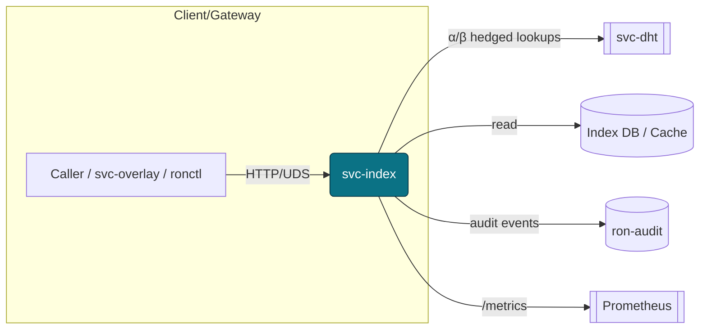
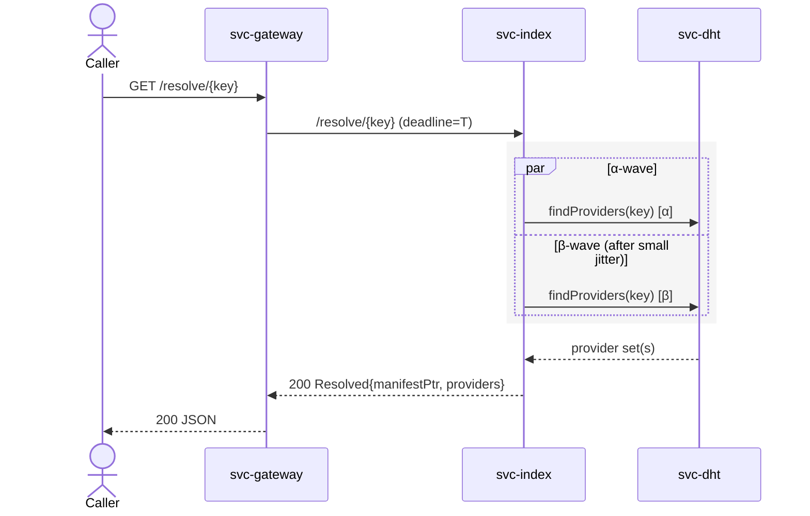
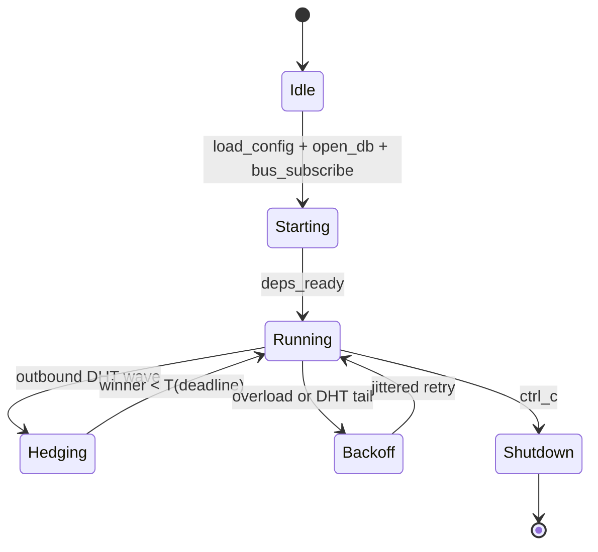
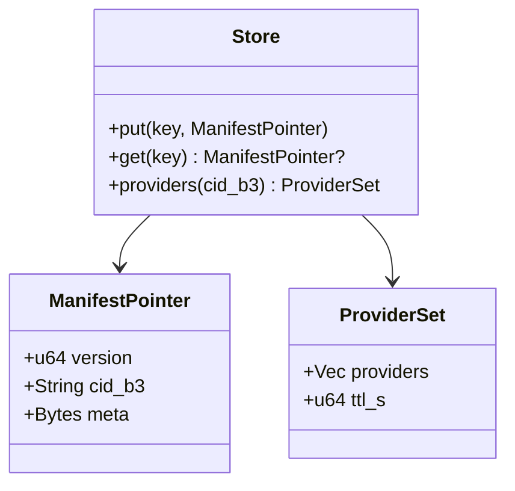

---

# svc-index

> **Role:** service
> **Owner:** Stevan White
> **Status:** draft
> **MSRV:** 1.80.0
> **Last reviewed:** 2025-10-04

Badges (optional):
[]() []() []() []()

---

## 1) Overview

**What it is (one paragraph):**
`svc-index` is the read-optimized resolver for RustyOnions. It maps **names** and **content IDs** (`b3:<hex>`) to **manifests** and **ranked provider sets**. It enforces strict **hardening limits** (frame/body caps, decompression ratio guard, inflight caps, deadlines) and **truthful readiness**. It does **not** store blob bytes and does **not** implement DHT internals; provider discovery is delegated to `svc-dht`.

**How it fits (RustyOnions topology):**

* **Pillar:** Naming & Index (runtime lookups; schemas live in `ron-naming`)
* **Upstream callers:** `svc-overlay`, `svc-gateway`, `ronctl` (CLI), SDKs
* **Downstream deps:** `svc-dht` (provider discovery), `ron-audit` (admin ops/events), kernel bus/metrics/auth
* **Data it touches:** single service DB root (+ RAM caches); no blob storage
* **Security boundary:** capability-gated admin; optional UDS with peer-cred; amnesia mode (RAM-first, zeroize on drop)

### 1.1 High-Level Architecture



### 1.2 Sequence — Resolve Path (Mermaid)



### 1.3 State — Service Lifecycle (Mermaid)



---

## 2) Responsibilities & Boundaries

**MUST do (core responsibilities):**

* [ ] Deterministic **name/`b3:<hex>` → manifest → provider set** resolution (epoch/config bound).
* [ ] Verify **BLAKE3** for any manifest bytes that pass through.
* [ ] Enforce OAP/1 invariants (1 MiB frame) and service hardening caps:

  * `max_request_bytes` (e.g., 1 MiB), `max_response_bytes` (e.g., 1 MiB)
  * decompression ratio guard (e.g., ≤ 10:1)
  * inflight limit (bounded), total deadline (e.g., 1200 ms)

**MUST NOT do (anti-scope / boundaries):**

* [ ] Store or serve blob bytes (that’s `svc-storage`).
* [ ] Implement DHT internals (that’s `svc-dht`).

**Acceptance Gates (PROOF you did it):**

* [ ] Unit/prop tests cover: BLAKE3 verification, caps/rejects, truthful readiness.
* [ ] Metrics exported & alerts wired: `index_*`, `rejected_total{reason}`, `request_latency_seconds`.
* [ ] `/healthz` and `/readyz` reflect real DB+DHT+bus state.
* [ ] Perf: p95 resolve `< 80 ms` intra-region; `< 200 ms` inter-region on ref machine.

---

## 3) Public Interfaces

### 3.1 Rust API (library)

Primarily a **service**; library surface is DTOs and a tiny client helper for tests/examples via `ron-proto`. Keep stable.

### 3.2 Bus RPC / Events (service)

* **RPC:** `v1.resolve { addr } -> Resolved|NotFound|Err` on `ron://index/resolve`
* **Health:** `v1.health -> HealthOk`
* **Admin:** `v1.put_address { addr, dir } -> PutOk|Err`
* **Events:** audit events on admin mutations

### 3.3 HTTP / gRPC (service/binary)

* **Base URL:** `http://<host>:<port>/`
* **Endpoints:**

  * `GET /resolve/{key}` → manifest pointer/meta; `?fresh=bool`
  * `GET /providers/{cid}` → ranked provider set (`limit`, `region`, `min_freshness`)
  * `POST /admin/reindex` / `POST /admin/pin|unpin` (capability required)
  * `GET /healthz`, `GET /readyz`, `GET /metrics`, `GET /version`
* **Caching hints:** `ETag`, `Cache-Control: max-age=...` (for hot keys)

### 3.4 CLI (binary/tool)

```bash
cargo run -p svc-index -- --bind 127.0.0.1:9909
curl -sS "http://127.0.0.1:9909/resolve/b3:ab12cd..." | jq .
curl -sS "http://127.0.0.1:9909/providers/b3:ab12cd..." | jq .
```

---

## 4) Configuration

> Env first; sane defaults; single DB root.

| Variable            | Type   | Default                   | Description                                |
| ------------------- | ------ | ------------------------- | ------------------------------------------ |
| `RON_INDEX_SOCK`    | path   | `/tmp/ron/svc-index.sock` | UDS bind path when UDS mode enabled        |
| `RON_INDEX_DB`      | path   | **(required)**            | **Single** index DB root for this instance |
| `INDEX_BIND`        | socket | `127.0.0.1:9909`          | HTTP bind                                  |
| `METRICS_ADDR`      | socket | `127.0.0.1:0`             | Prometheus exporter bind                   |
| `INDEX_DEADLINE_MS` | int    | `1200`                    | End-to-end request deadline                |
| `INDEX_INFLIGHT`    | int    | `1024`                    | Max concurrent requests                    |
| `INDEX_DECMP_MAXR`  | int    | `10`                      | Max decompression ratio                    |
| `INDEX_MAX_REQ_B`   | int    | `1048576`                 | Max request bytes                          |
| `INDEX_MAX_RSP_B`   | int    | `1048576`                 | Max response bytes                         |
| `LOG_LEVEL`         | string | `info`                    | tracing level (`trace`..`error`)           |
| `AMNESIA`           | bool   | `false`                   | RAM-first caches, zeroize on drop          |

**Flags:**

```
--bind 0.0.0.0:9909
--uds.enable true
--db.path ./var/index
--deadline-ms 1200 --alpha 2 --beta 2
--amnesia on
```

**Cargo features:**

* `facets` — optional search/graph facets (SLO p95 ≤150 ms path)
* `otel` — OpenTelemetry export for traces/metrics

---

## 5) Build, Run, Test

**Build**

```
cargo build -p svc-index
```

**Run**

```
RUST_LOG=info METRICS_ADDR=127.0.0.1:9909 cargo run -p svc-index
```

**Unit/Prop/Doc tests**

```
cargo test -p svc-index --all-features
cargo test -p svc-index --doc
```

**Property tests (proptest)**

```
cargo test -p svc-index --test prop_index
```

**Loom (concurrency)**

```
RUSTFLAGS="--cfg loom" cargo test -p svc-index --test loom_index --release
```

**Fuzzing (cargo-fuzz)**

```
cargo fuzz run http_resolve
cargo fuzz run parse_manifest
```

**Lint & format**

```
cargo fmt --all
cargo clippy -p svc-index -- -D warnings
```

**Security & deps**

```
cargo deny check
```

**Bench**

```
cargo bench -p svc-index
```

---

## 6) Observability

**Endpoints:** `/metrics`, `/healthz`, `/readyz` (truthful: DB+DHT+bus)

**Canonical Metrics:**

* `request_latency_seconds{route,method}` — histogram
* `index_resolve_latency_seconds{cache_source}` — histogram
* `index_dht_lookup_ms{wave}` — histogram
* `index_cache_hits_total`, `index_cache_misses_total` — counters
* `rejected_total{reason}` — counter (`over_capacity`, `too_large`, `timeout`, `decompress_ratio`)
* `inflight_requests{route}` — gauge
* `service_restarts_total{service}` — counter
* `bus_lagged_total{service}`, `bus_queue_depth{service}` — counters/gauges

**Tracing:** JSON logs; propagate `X-Corr-ID`; spans include `request_id`, `peer_addr`, `route`, `status`, `alpha_beta_wave`.

**Example log:**

```json
{"ts":"2025-10-03T20:17:11Z","level":"INFO","svc":"svc-index","ev":"resolve_ok","route":"/resolve/:key","status":200,"latency_ms":27,"key_hint":"b3:7f19a2...","source":"cache","providers":5}
```

---

## 7) Performance & SLOs

| Metric               | Target     | Notes                     |
| -------------------- | ---------- | ------------------------- |
| p50 resolve (intra)  | < 20 ms    | warm cache                |
| p95 resolve (intra)  | < 80 ms    | hedged, nominal load      |
| p95 resolve (inter)  | < 200 ms   | macronode profile         |
| Availability (10m)   | 5xx < 0.1% | exclude deploys           |
| Cache hit ratio (1h) | > 0.80     | target for steady traffic |
| DHT hops p99         | ≤ 5        | hedge win rate ≥ 0.2      |

**Repro:** Criterion harness `benches/resolve.rs`; dataset `perf/keys.txt`; run with `--alpha 2 --beta 2 --deadline-ms 1200`.

---

## 8) Data & Schema

**Model (summary):**

* Keys in index DB; values are `ManifestPointer` and `ProviderSet`.
* Any manifest bytes verified via **BLAKE3** before use.



**Migrations:**

* Header schema version; reject older than `min_supported`.
* Deterministic mapping per epoch; admin mutations emit audit events.
* **Golden vectors**: `tests/golden/resolve/*.json` must pass in CI.

---

## 9) Security & Privacy

* **Threat model (STRIDE):**

  * Spoofing: macaroons/capabilities; optional UDS allow-list
  * Tampering: BLAKE3 verification; CAS invariants
  * Repudiation: audit on admin ops; structured logs
  * Information disclosure: PII **none**; minimal metadata only
  * DoS: caps on body/ratio/inflight; hedged lookups with deadlines
  * Elevation: admin routes require explicit capability; deny-by-default

* **Key handling:** Prefer `ron-kms` custody; rotate ≤30d; never log keys; zeroize on drop; amnesia mode for RAM-first caches.

* **PQ readiness:** Index uses TLS/macaroon verification rather than bespoke crypto; PQ plan is **TLS hybrid** (Kyber KEM with classical) when rustls pipeline enables it, plus **PQ signatures** for capability token issuers (documented in `QUANTUM.md`). No long-term confidentiality material is stored here; **HN-DL** risk minimal.

---

## 10) Error Taxonomy

| Code/Variant             | When                         | User hint                       | Retries        |
| ------------------------ | ---------------------------- | ------------------------------- | -------------- |
| `Error::NotFound`        | key/cid not indexed          | Check key or set `?fresh=true`  | no             |
| `Error::OverCapacity`    | inflight/rate cap exceeded   | Back off; respect `Retry-After` | yes (jittered) |
| `Error::TooLarge`        | caps exceeded (req/rsp/body) | Reduce size                     | no             |
| `Error::DecompressRatio` | ratio guard tripped          | Use smaller/compressed inputs   | no             |
| `Error::Timeout`         | exceeded deadline            | Try later / adjust deadline     | yes            |
| `Error::UpstreamUnready` | DHT/DB/bus unready           | Try later                       | yes            |
| `Error::Unauthorized`    | missing/invalid capability   | Obtain proper token             | no             |

---

## 11) Concurrency Model

* **Runtime:** tokio; copy-before-await; never hold a lock across `.await` in supervisory paths.
* **I/O:** α/β hedged calls to DHT with **global request deadline**.
* **Channels:** bus for events/metrics/health; bounded mpsc for work queues.
* **Loom targets:** `tests/loom_index.rs` exercise cache + hedging + cancellation.

(See state diagram in §1.3.)

---

## 12) Compatibility & Requirements

* **Rust:** MSRV 1.80.0
* **OS:** macOS 10.15+, Linux x86_64; containers supported
* **TLS/HTTP:** tokio_rustls 0.26.x; axum 0.7.x; tower-http 0.6.x
* **DB:** sled; **one `RON_INDEX_DB` per instance**

---

## 13) Examples

**Service curl**

```
curl -sS http://127.0.0.1:9909/healthz | jq .
curl -sS "http://127.0.0.1:9909/resolve/b3:7f19a2..." | jq .
```

**Rust (rustdoc-tested)**

````rust
/// ```
/// use ron_proto::Addr;
/// // Example placeholder; SDK client lives in ron-proto/SDKs.
/// let _ = Addr::from_b3("b3:7f19a2deadbeef").unwrap();
/// ```
````

---

## 14) Troubleshooting

* **Port in use:** change `--bind` or `METRICS_ADDR`.
* **TLS errors:** ensure tokio_rustls config; do **not** use `rustls::ServerConfig` directly.
* **Sled permission:** verify DB path exists & is writable; single process owns it.
* **High latency:** check `index_dht_lookup_ms` and cache hit; warm/pin hot keys; tune `--alpha/--beta`.
* **Readiness flapping:** inspect `/readyz` reasons and DHT peer health.
* **Bus lagging:** watch `bus_lagged_total` / `bus_queue_depth`; reduce spammy logs.

---

## 15) Development Notes

* Axum handlers end with `.into_response()`.
* Public re-exports live in `lib.rs` (`Bus`, `KernelEvent`, `Metrics`, `HealthState`, `Config`, `wait_for_ctrl_c()` where applicable).
* TLS types must use **`tokio_rustls::rustls::ServerConfig`** (not `rustls::ServerConfig`).
* **Perfection Gates** in CI: fmt/clippy/tests/deny + perf/chaos/security gates.

**Pre-commit quickcheck**

```
cargo fmt --all
cargo clippy -- -D warnings
cargo test
cargo deny check
```

---

## 16) Mermaid Diagrams — Policy & Tooling

Must include: **architecture**, **sequence**, **state** (see §§1.1–1.3). Treat diagrams as code.

**Render locally (SVG)**

```
npm i -g @mermaid-js/mermaid-cli
mmdc -i docs/arch.mmd -o docs/arch.svg
mmdc -i docs/sequence.mmd -o docs/sequence.svg
mmdc -i docs/state.mmd -o docs/state.svg
```

**Render via Docker**

```
docker run --rm -v "$PWD":/data minlag/mermaid-cli mmdc -i docs/arch.mmd -o docs/arch.svg
```

**CI (GitHub Actions)**

```yaml
name: render-mermaid
on: [push, pull_request]
jobs:
  mmdc:
    runs-on: ubuntu-latest
    steps:
      - uses: actions/checkout@v4
      - run: npm i -g @mermaid-js/mermaid-cli
      - run: |
          mkdir -p docs
          for f in $(git ls-files '*.mmd'); do
            out="${f%.mmd}.svg"
            mmdc -i "$f" -o "$out"
          done
```

---

## 17) Roadmap & TODO

* [ ] **M1 — Core**: resolve/providers, truthful readiness, metrics/alerts
* [ ] **M2 — Perf**: α/β hedging, cache warm/pin ops, miss-storm bench
* [ ] **Hardening**: fuzz (HTTP + manifest), chaos (peer flaps), amnesia purge metric
* [ ] **Gates**: Bronze → Silver → Gold checklists wired in CI

---

## 18) Changelog

See [CHANGELOG.md](./CHANGELOG.md). Follow SemVer; document breaking changes and migration paths.

---

## 19) License

Dual-licensed under **MIT** or **Apache-2.0**. See [LICENSE-MIT](./LICENSE-MIT) and [LICENSE-APACHE](./LICENSE-APACHE).

---

## 20) Contributing

PRs welcome! Please run fmt/clippy/tests and include:

* Updated diagrams when topology changes
* Docs & examples
* Bench impact (SLO deltas)

Also see this crate’s `IDB.md`, `CONFIG.md`, `SECURITY.md`, `OBSERVABILITY.md`, `PERFORMANCE.md`, and `QUANTUM.md`.

---

### SVC-INDEX BETA PASS CHECK:

cargo fmt -p svc-index
cargo clippy -p svc-index --no-deps -- -D warnings
cargo build -p svc-index
INDEX_BIND=127.0.0.1:5304 cargo run -p svc-index &
pid=$!; sleep 0.3
curl -s -o /dev/null -w "%{http_code}" http://127.0.0.1:5304/healthz
curl -s -o /dev/null -w "%{http_code}" http://127.0.0.1:5304/readyz
curl -s -o /dev/null -w "%{http_code}" http://127.0.0.1:5304/version
curl -s http://127.0.0.1:5304/metrics | head -n 10
CID_ZERO=b3:0000000000000000000000000000000000000000000000000000000000000000
curl -s -o /dev/null -w "%{http_code}" http://127.0.0.1:5304/resolve/name:does-not-exist   # expect 404
curl -s -o /dev/null -w "%{http_code}" http://127.0.0.1:5304/providers/not-a-cid            # expect 400
curl -s -o /dev/null -w "%{http_code}" http://127.0.0.1:5304/providers/$CID_ZERO            # expect 404
kill $pid


