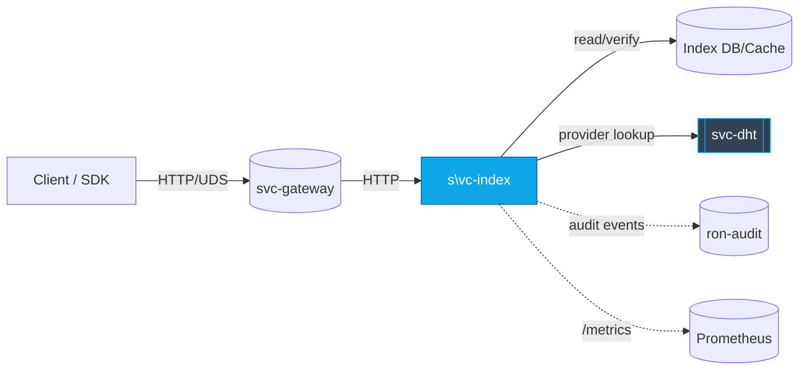
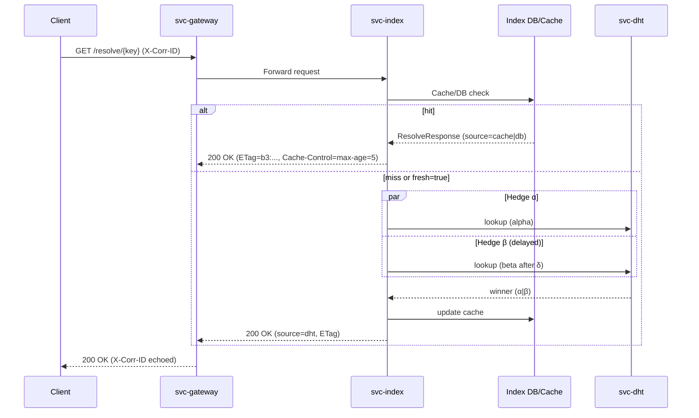

---

title: API Surface & SemVer Reference
status: draft
msrv: 1.80.0
last-updated: 2025-10-03
audience: contributors, auditors, API consumers
crate: svc-index
----------------

# API.md — `svc-index`

## 0) Purpose

This document captures the **public API surface** for `svc-index`, a **read-optimized resolver** that maps **names / `b3:<hex>` content IDs → manifests → provider sets**.

Because `svc-index` is a **service crate**, its stable contract is the **HTTP/UDS API**, wire **DTOs**, and **Bus events**. Rust exports are intentionally minimal; any shared DTOs intended for reuse live in `ron-proto`.

It provides:

* A snapshot of exported symbols (if any) and the **HTTP/UDS API**.
* **SemVer discipline** and what constitutes a breaking change.
* Error taxonomy, status code semantics, headers, and invariants.
* Generation of **OpenAPI** and **public-api** snapshots, enforced in CI.

---

## 1) Public API Surface

### 1.1 Rust surface (crate exports)

`svc-index` does **not** provide a consumer library API. Any public items under `src/lib.rs` are **internal** unless explicitly listed here. If a thin helper library target exists, keep it minimal.

Example (illustrative; replace with actual):

```text
# Replace with actual output from cargo public-api
pub mod dto
pub use dto::{ResolveResponse, ProvidersResponse, ErrorResponse, ProviderEntry}
pub fn build_router(state: AppState) -> axum::Router  # internal-facing; stability not guaranteed
```

Generate a real snapshot (optional for service crates):

```bash
cargo public-api --simplified > docs/api-history/svc-index/$(cargo pkgid | sed 's/.*#//').libapi.txt
```

> **Normative surface is HTTP/UDS** below. The Rust surface may change faster.

---

### 1.2 HTTP/UDS API (normative)

**Transports:** HTTP/1.1 (+TLS when public) and/or **UDS** (Unix Domain Socket).
**Content types:** `application/json` (default). Optional `application/cbor` or `application/msgpack` via `Accept` when the feature is enabled.

#### 1.2.1 Common headers

* **Request**

  * `Accept: application/json` (or `application/cbor`)
  * `Authorization: Bearer <capability>` (admin/facets; not required for public reads unless policy says so)
  * `X-Corr-ID: <ULID/UUID>` (optional; server generates if absent)
  * `Idempotency-Key: <token>` (admin POSTs; optional but recommended)

* **Response**

  * `X-Corr-ID: <same-as-request-or-generated>`
  * `ETag: "b3:<hex>"` (resolve/providers responses when applicable)
  * `Cache-Control: public, max-age=<s>` (resolve/providers; see §1.2.6)
  * `RateLimit-Limit`, `RateLimit-Remaining`, `RateLimit-Reset` (if quotas enabled)
  * `Retry-After: <seconds>` (on 429/503 when appropriate)

---

#### 1.2.2 Core endpoints

##### `GET /resolve/{key}`

Resolve a **name** or **`b3:<hex>`** to a manifest pointer and basic metadata.

* **Path:** `key` — either `name:*` or `b3:<hex>`
* **Query:** `fresh=bool` (default `false`) — if `true`, validate against DB/DHT before returning cached value
* **Responses:**

  * `200 OK` → `ResolveResponse`
  * `404 Not Found` → `ErrorResponse{code="not_found"}`
  * `429/503` → `ErrorResponse{code="over_capacity"|"upstream_unready"}`, optional `Retry-After`
* **Example:**

  ```
  curl -sS "http://localhost:8080/resolve/b3:ab12cd34..." | jq
  ```

##### `GET /providers/{cid}`

Return the **provider set** for a `b3:<hex>` with ranking hints.

* **Path:** `cid` — `b3:<hex>`
* **Query:** `region=<iso-region>` (advisory), `limit=1..32` (default `5`), `min_freshness=<seconds>`
* **Responses:**

  * `200 OK` → `ProvidersResponse`
  * `404 Not Found` → `ErrorResponse{code="not_found"}`
  * `429/503` → as above

##### `POST /admin/reindex`  *(capability required)*

Trigger **reindex/backfill** tasks for keys or ranges.

* **Body:** `AdminReindexRequest`
* **Responses:**

  * `202 Accepted` → `AdminTaskAccepted{task_id}`
  * `401/403` → `ErrorResponse{code="unauthorized"|"forbidden"}`
* **Idempotency:** respected via `Idempotency-Key` for 24h per `(route, body-digest, capability-scope)`.

##### `POST /admin/pin`  /  `POST /admin/unpin`  *(capability required)*

Pin or unpin a `cid` in the index.

* **Body:** `AdminPinRequest { cid: String }`
* **Responses:**

  * `200 OK` → `{ "ok": true }`
  * `401/403` → unauthorized/forbidden

##### Health/Meta

* `GET /healthz` → `200 OK` (liveness)
* `GET /readyz` → `200 OK` only when **all readiness keys** are true; else `503` with `{ ready:false, missing:[...] }`
* `GET /metrics` → Prometheus exposition
* `GET /version` → `{ "crate":"svc-index", "version":"x.y.z", "git_sha":"...", "build":"..." }`

> **UDS mode:** Same routes over a Unix socket; authentication may rely on **SO_PEERCRED** allow-lists in place of `Authorization`. UDS is optional, gated by `uds.enabled`.

---

#### 1.2.3 Facets (optional / gated)

Feature flag: `facets` (off by default). SLO: p95 ≤ 150 ms intra-AZ for small queries.

##### `GET /search/{query}`

* **Path:** `query` — UTF-8, max 128 chars
* **Query:** `limit=1..50` (default 10), `offset>=0` (default 0), `region=<iso>` (advisory)
* **Response:** `SearchResponse`
* **Errors:** `400 bad_request` (too long), `429 over_capacity`, `503 upstream_unready`

##### `GET /graph/{node}`

Neighborhood peek for a CID or name.

* **Path:** `node` — `name:*` or `b3:<hex>`
* **Query:** `max_neighbors=1..128` (default 16), `hops=1..3` (default 1)
* **Response:** `GraphResponse`
* **Errors:** as above

---

#### 1.2.4 Pagination & limits (unified rules)

* `limit` is clamped per endpoint (search: max 50; providers: max 32).
* `offset` applies to search only.
* When pages exist, include:

  ```json
  { "next_offset": 20, "has_more": true }
  ```

---

#### 1.2.5 RBAC / capability scopes

Capabilities are **least-privilege** and composable:

* `index.read` — `GET /resolve/*`, `GET /providers/*`, facets if enabled
* `index.admin` — `POST /admin/reindex`
* `index.pin` — `POST /admin/pin`, `/admin/unpin`

UDS mode maps scopes to an allow-list of peer UIDs/GIDs.

---

#### 1.2.6 Caching & idempotency

* **Caching:**

  * `/resolve` & `/providers` — default `Cache-Control: public, max-age=5`.
  * If `fresh=true`, server sets `Cache-Control: no-cache` and still returns `ETag`.
  * `ETag` equals the current **manifest/provider-set BLAKE3 digest**.
* **Idempotency:**

  * Admin POSTs respect `Idempotency-Key` for ≥24h; duplicate keys return the original result envelope.

---

### 1.3 DTOs (wire schemas)

All responses are **forward-compatible**: unknown fields MUST be ignored by clients. Request DTOs use `#[serde(deny_unknown_fields)]`.

```json
// ResolveResponse
{
  "key": "b3:7f19a2c0...",
  "kind": "cid|name",
  "manifest_cid": "b3:ab12cd34...",
  "source": "cache|db|dht",
  "integrity": { "algo": "blake3", "digest": "ab12..." },
  "etag": "b3:ab12cd34...",
  "freshness_s": 42,
  "providers_hint": 5
}
```

```json
// ProvidersResponse
{
  "cid": "b3:ab12cd34...",
  "providers": [
    {
      "id": "node-123",
      "addr": "tcp://198.51.100.20:443",
      "region": "us-east-1",
      "class": "region_match|fresh|any",
      "score": 0.87,
      "last_seen_s": 9
    }
  ],
  "hedge": { "alpha_ms": 20, "beta_ms": 35, "winner": "alpha|beta|tie" }
}
```

```json
// SearchResponse (facets)
{
  "query": "foo",
  "results": [
    { "key": "name:foo", "cid": "b3:ab12...", "score": 0.92 }
  ],
  "limit": 10,
  "offset": 0,
  "total_estimate": 37,
  "next_offset": 10,
  "has_more": true
}
```

```json
// GraphResponse (facets)
{
  "root": "b3:ab12...",
  "neighbors": [
    { "cid": "b3:cd34...", "edge": "manifest->provider", "weight": 0.8 }
  ],
  "truncated": false
}
```

```json
// ErrorResponse (shared)
{
  "code": "unauthorized|forbidden|not_found|over_capacity|timeout|bad_request|upstream_unready|body_cap|unsupported_type|internal",
  "message": "human-readable summary (no secrets)",
  "corr_id": "01J9W1M0K6Q1GJ9E8Z4Q0T8M5X",
  "retry_after": 5
}
```

```json
// AdminReindexRequest
{ "keys": ["name:foo", "b3:7f19..."], "priority": "low|normal|high" }
```

---

### 1.4 Status codes (canonical)

* `200 OK` — success (reads), or successful admin pin/unpin
* `202 Accepted` — async admin task accepted (reindex)
* `400 Bad Request` — malformed key/params
* `401 Unauthorized` / `403 Forbidden` — missing/invalid capability or UDS peer not allowed
* `404 Not Found` — unknown key/cid
* `413 Payload Too Large` — body exceeds 1 MiB cap
* `415 Unsupported Media Type` — unsupported `Content-Type`
* `429 Too Many Requests` — quotas / inflight caps tripped
* `503 Service Unavailable` — not ready / degraded / upstream DHT down
* `504 Gateway Timeout` — upstream exceeded deadline
* `500 Internal Server Error` — unexpected server failure

---

## 2) SemVer Discipline

### 2.1 Additive (Minor / Non-Breaking)

* New endpoints that don’t change existing behavior.
* New **optional** response fields; new query params with safe defaults.
* New enum variants with clients using `#[serde(other)]`.

### 2.2 Breaking (Major)

* Removing/renaming endpoints or parameters.
* Changing JSON field **types**, or making optional → required.
* Changing error codes or status mappings for existing conditions.
* Altering idempotency or caching semantics for existing routes.
* Rust: removing/renaming exports; changing function signatures/trait bounds.

### 2.3 Patch

* Doc fixes; perf improvements; internal refactors with **no external change**.
* Adding metrics/logs without changing API responses.

---

## 3) Stability Guarantees

* **MSRV:** `1.80.0`.
* **Wire stability:** Responses are forward-compatible; request DTOs deny unknown fields.
* **Auth/quotas:** Capability and quota semantics are stable; new `ErrorResponse.code` values may be added (non-breaking).
* **Headers:** `X-Corr-ID`, strong `ETag` for cacheable reads, `Retry-After` and `RateLimit-*` when applicable.
* **No unsafe:** The service forbids `unsafe` unless explicitly documented.

---

## 4) Invariants

* **Deterministic keys:** All object references are **BLAKE3 CIDs** prefixed `b3:`.
* **Size & time:** Request body cap **1 MiB**; default request timeout **5s**; default providers `limit=5` (clamped to `32`).
* **Readiness:** `/readyz` is **fail-closed** until DB, DHT client, bus, listeners, and metrics are live.
* **Integrity:** Before returning manifest-derived data, verify the `b3` digest matches the index entry.
* **Logging:** No secrets; `corr_id` always present.
* **Caching:** `ETag` is a strong validator (BLAKE3 digest).

---

## 5) Transport policy (TLS & PQ posture)

* **TLS (when public):** Terminate with rustls TLS 1.3. Ciphersuites limited to CHACHA20-POLY1305 and AES-GCM families. ALPN `http/1.1`. Native roots enabled where allowed or use a pinned bundle.
* **PQ readiness:** All integrity IDs (`b3:<hex>`) use BLAKE3 (PQ-safe for SUF property). TLS hybrids (e.g., X25519+Kyber) may be piloted behind a feature flag when the broader stack is ready. No DTO changes required.

---

## 6) Bus events (emitted)

Payloads are DTO-shaped; include `corr_id` and minimal hints.

* `Index.AdminTaskAccepted { task_id, kind:"reindex", keys:[..] }`
* `Index.PinChanged { cid, action:"pin"|"unpin" }`
* `Index.ResolveObserved { key_hint, source:"cache"|"db"|"dht", latency_ms }`

---

## 7) Tooling

* **OpenAPI** (authoritative API schema)

  ```bash
  cargo run --bin svc-index -- --dump-openapi > docs/openapi/svc-index.v1.json
  ```
* **Public API snapshot** (Rust symbols, if any)

  ```bash
  cargo public-api --simplified > docs/api-history/svc-index/$(cargo pkgid | sed 's/.*#//').libapi.txt
  ```
* **HTTP surface snapshot** (text summary for diffs)

  ```bash
  mkdir -p docs/api-history/svc-index
  cat <<'EOF' > docs/api-history/svc-index/v0.1.0-http.txt
  GET /resolve/{key}
  GET /providers/{cid}
  # facets (optional)
  GET /search/{query}
  GET /graph/{node}
  POST /admin/reindex
  POST /admin/pin
  POST /admin/unpin
  GET /healthz
  GET /readyz
  GET /metrics
  GET /version
  EOF
  ```

---

## 8) CI & Gates

* **Public surface gate:** `cargo public-api --deny-changes` (warn-only for service crates unless you intend a stable Rust lib).
* **OpenAPI drift gate:** PRs modifying routes/DTOs must update `docs/openapi/svc-index.v1.json` and `docs/api-history/svc-index/*.txt`.
* **Status taxonomy lint:** Every error path maps to a canonical `ErrorResponse.code`.
* **Headers contract tests:** Assert `X-Corr-ID` always present; cacheable reads set strong `ETag`.
* **Ready semantics:** `/readyz` returns `503` until all readiness keys are true; no sleep-based hacks.

---

## 9) Contract tests (API gates)

1. **Headers:** Response includes `X-Corr-ID`; `/resolve` & `/providers` set strong `ETag`.
2. **Caps before work:** `POST /admin/reindex` without scope → `401/403` and increments `rejected_total{reason="unauth"}`.
3. **Body cap:** 1.5 MiB POST → `413` and no handler work executed.
4. **Ready:** `/readyz` `503→200` only when all keys become true; no flapping within a request.
5. **Status taxonomy:** Every failure maps to a stable `ErrorResponse.code`.
6. **Pagination:** `GET /search` honors `limit/offset`, clamps at max, stable `next_offset/has_more`.
7. **Determinism:** `GET /providers/{cid}` with identical inputs is stable modulo freshness; `limit` respected.

---

## 10) SemVer & Acceptance

* **SemVer planes:** (1) Rust symbols (minimal), (2) HTTP/UDS protocol.
* **PR checklist (DoD):**

  * [ ] OpenAPI updated and committed.
  * [ ] `docs/api-history/svc-index/<version>-http.txt` regenerated.
  * [ ] (If applicable) `cargo public-api` snapshot updated.
  * [ ] CHANGELOG includes **API impact** (add/break/patch).
  * [ ] Contract tests updated/added and passing.
  * [ ] RUNBOOK and dashboards updated if behavior/metrics changed.

---

## 11) Appendix

### 11.1 Error taxonomy (stable)

| HTTP | `code`             | Meaning / Notes                          |
| ---: | ------------------ | ---------------------------------------- |
|  400 | `bad_request`      | Malformed key/params                     |
|  401 | `unauthorized`     | Missing/invalid capability               |
|  403 | `forbidden`        | Capability lacks scope / UDS peer denied |
|  404 | `not_found`        | Unknown key/cid                          |
|  413 | `body_cap`         | Request body exceeds 1 MiB               |
|  415 | `unsupported_type` | Unrecognized `Content-Type`              |
|  429 | `over_capacity`    | Quotas/concurrency exceeded              |
|  503 | `upstream_unready` | DB/DHT/bus/listeners not ready           |
|  504 | `timeout`          | Upstream exceeded deadline               |
|  500 | `internal`         | Unexpected server error                  |

### 11.2 Query rules

* Unknown query params are ignored (logged at DEBUG).
* `limit` clamped to endpoint max; `offset>=0`.
* `region` is advisory; server may include out-of-region providers to satisfy availability.

### 11.3 Versioning strategy

* **Path:** default unversioned (`/resolve`, `/providers`); introduce `/v2/...` only for **breaking** changes.
* **Header:** optionally accept `X-API-Version: 1` for early dual-stack experiments (non-breaking).
* **DTOs:** additive only; use optional fields + `#[serde(default)]`.

### 11.4 Examples

* Resolve by CID (fresh):

  ```
  curl -sS "http://localhost:8080/resolve/b3:ab12cd?fresh=true" \
       -H "X-Corr-ID: 01J9W..." | jq
  ```
* Providers (region prefer, cap 8):

  ```
  curl -sS "http://localhost:8080/providers/b3:ab12cd?region=us-east-1&limit=8" | jq
  ```
* Admin reindex (idempotent):

  ```
  curl -sS -X POST http://localhost:8080/admin/reindex \
       -H "Authorization: Bearer <cap>" \
       -H "Idempotency-Key: 8c2e0c..." \
       -d '{"keys":["b3:ab12cd34..."],"priority":"high"}'
  ```

---

## 12) Mermaid — API & Flow Diagrams

### 12.1 Component view (svc-index in context)



### 12.2 Resolve request sequence (happy path + hedge)



---

