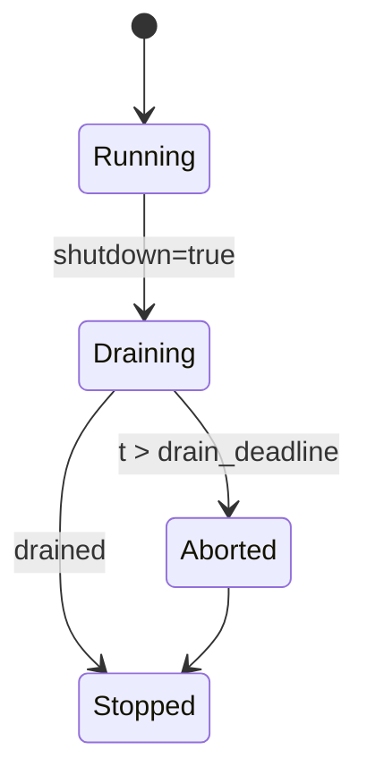

---

````markdown
---
title: Concurrency Model — svc-index
crate: svc-index
owner: Stevan White
last-reviewed: 2025-10-03
status: draft
template_version: 1.1
msrv: 1.80.0
tokio: "1.x (pinned at workspace root)"
loom: "0.7+ (dev-only)"
lite_mode: "N/A (service crate with background tasks)"
---

# Concurrency Model — `svc-index`

> **Golden rule:** never hold a lock across `.await` in supervisory or hot paths.  
> **Service role recap:** thin, read-optimized resolver mapping **name/`b3:<hex>` → manifest → provider set**, with **DHT α/β hedging** and strict **backpressure**.

---

## 0) Lite Mode

N/A — this crate runs listeners, a resolver pool, janitors, and config/shutdown plumbing.

---

## 1) Invariants (MUST)

- **[I-1] No lock across `.await`.** Copy small data out; drop guards before network/disk awaits.
- **[I-2] Single writer per mutable resource.** 
  - `cache_meta`: writer = janitor; readers = workers (read-mostly via snapshots).
  - `breaker_table`: writer = breaker janitor; readers = workers.
- **[I-3] Bounded queues only.** Every channel has a **fixed capacity** and a **documented overflow policy** (reject-new for request work; drop-oldest only for broadcast).
- **[I-4] End-to-end deadlines.** Each request has a total budget (default **1200ms**), enforced across α/β DHT lookups and ranking.
- **[I-5] Cancel-safe awaits.** All `.await`s are either idempotent/cancel-safe or wrapped by `select!` with shutdown/timeout.
- **[I-6] Graceful shutdown.** Intake halts, in-flight drains (<= request budget or global **drain_deadline 1–5s**), then abort.
- **[I-7] No blocking syscalls on runtime.** Use `spawn_blocking` for blocking filesystem ops (e.g., Rocks metadata) if ever enabled.
- **[I-8] No task leaks.** Every task has an owner `JoinHandle` stored in Supervisor and joined on shutdown. Detached tasks require a comment + metric.
- **[I-9] Backpressure over buffering.** Admission controller rejects with `Busy` when backlog exceeds SLA; workers never infinite-buffer.
- **[I-10] Framing & caps.** HTTP bodies ≤ **1 MiB**; decompression ratio ≤ **10×**; `serde(deny_unknown_fields)`.
- **[I-11] Capability gating before enqueue.** Admin/facets must pass `ron-auth` before work enters queues.
- **[I-12] Amnesia mode.** No background task persists to disk; janitors purge according to `purge_interval_ms`.
- **[I-13] Priority rules.** Health/metrics, readyz, and HEAD/GET `/version` **bypass** heavy pools and never queue behind slow work.
- **[I-14] Fairness.** Per-IP connection cap (default **256**) + optional per-IP token bucket to prevent stampede.

---

## 2) Runtime Topology & Threading

**Tokio** multi-thread runtime, worker-stealing on.  
**OS threads** sized by workspace defaults; acceptor thread count configurable (default **1**) to avoid thundering accepts.

### Task inventory

| Task                     | Count                 | Criticality | Description |
|-------------------------|-----------------------|-------------|-------------|
| Supervisor              | 1                     | Critical    | Owns config snapshot, spawns/monitors children, propagates shutdown |
| HTTP Listener           | 1                     | Critical    | Accepts TCP, routes handlers, enforces per-IP caps & admission |
| Resolver Workers        | `M` (cfg, e.g., 2–N)  | Critical    | Execute `/resolve` & `/providers`: cache→DHT α/β→rank |
| Config Reloader         | 1                     | High        | SIGHUP/bus watcher; swaps snapshots atomically |
| Cache Janitor           | 1                     | Medium      | TTL eviction; negative cache purge |
| Breaker Janitor         | 1                     | Medium      | Error-window rolls, half-open probes |
| Warmup Prefetcher       | 0–1                   | Low         | Optional: prefill `cache.warmup_keys` at boot |
| Metrics Export          | 0 (pull)              | N/A         | Prometheus pull; no task |

### Dataflow (Mermaid)

```mermaid
flowchart TB
  SUP[Supervisor] -->|spawn| L[HTTP Listener]
  SUP -->|spawn| RL[Config Reloader]
  SUP -->|spawn| CJ[Cache Janitor]
  SUP -->|spawn| BJ[Breaker Janitor]
  L -->|mpsc work(512)| W1[Resolver-1]
  L -->|mpsc work(512)| W2[Resolver-2]
  RL -->|watch cfg| L
  RL -->|watch cfg| W1
  RL -->|watch cfg| W2
  SUP -->|watch shutdown| L
  SUP -->|watch shutdown| RL
  SUP -->|watch shutdown| CJ
  SUP -->|watch shutdown| BJ
  SUP -->|watch shutdown| W1
  SUP -->|watch shutdown| W2
  style SUP fill:#0ea5e9,stroke:#0c4a6e,color:#fff
````

**Admission control:** Listener enforces per-route concurrency **and** queue depth. If `work_tx.try_send` fails → immediate `Busy`.

---

## 3) Channels & Backpressure

| Name        | Kind        |  Cap | Producers → Consumers            | Backpressure Policy                     | Drop Semantics                  |
| ----------- | ----------- | ---: | -------------------------------- | --------------------------------------- | ------------------------------- |
| `work_tx`   | `mpsc`      |  512 | Listener → Resolver Pool         | `try_send`; on Full → `Busy` (HTTP 429) | None (reject-new)               |
| `events_tx` | `broadcast` | 1024 | Core → Observers (metrics/audit) | Drop-oldest + `lagged_total`            | Log warn once/5s with lag count |
| `cfg_watch` | `watch`     |    1 | Reloader → All tasks             | Last-write-wins                         | N/A                             |
| `shutdown`  | `watch`     |    1 | Supervisor → All tasks           | Last-write-wins                         | N/A                             |

**Queue metrics:**
`queue_depth{queue}`, `queue_dropped_total{queue}`, `busy_rejections_total{route}`, `bus_lagged_total`.

---

## 4) Shared State, Locks & Hierarchy

**State objects**

* `Arc<ConfigSnapshot>` — atomic swap; **no locks** for reading.
* `Arc<CacheMeta>` — `DashMap<Key, Meta>` (short-lived shard guards).
* `Arc<BreakerTable>` — `DashMap<Target, State>`; janitor mutates windows; workers read.

**Allowed locks**

* `Mutex<MetricsScratch>` for batch counters; hold < 1ms.
* `RwLock<SmallPolicy>` for rare updates; reads cheap, writers very rare.

**Forbidden**

* Locks across `.await`.
* Lock order inversions.

**Hierarchy (must acquire in this order, release reverse)**

1. `config_snapshot` (read-only; no actual lock)
2. `cache_meta` shard guard
3. `breaker_table` shard guard
4. `metrics_scratch` (Mutex)

> Any deviation requires a rationale comment and a Loom test.

---

## 5) Timeouts, Retries, Deadlines & Hedging

**Budgets (defaults; see CONFIG.md):**

* HTTP read/write: **5s**; idle: **60s**.
* Resolve total deadline: **1200ms** (`dht.deadline_ms`).
* Hedge after: **150ms** (`dht.hedge_ms`).
* α fanout: **3**; β fanout: **2**.

**Hedged DHT pseudo-algorithm**

```
T = deadline_ms
launch α queries in parallel
if none satisfactory by hedge_ms:
    launch β queries (distinct peers)
on first satisfactory quorum:
    cancel others (cooperative)
if T expires:
    return Timeout
```

**Retries:** only for idempotent DHT errors (`Transient`, `NoRoute`), **max 3**, jitter 50–100ms, stop if breaker open.

**Circuit breaker state machine**

States: `Closed` → `Open` → `HalfOpen` → `Closed`

* Enter **Open** if error_ratio(window_s) > threshold.
* In **Open**, reject immediate for target.
* After `cooldown_s`, move to **HalfOpen**; allow `half_open_probes`.

  * If probes succeed (ratio OK), go **Closed**; else back to **Open**.

---

## 6) Cancellation & Shutdown

**Signal:** `KernelEvent::Shutdown` or `ctrl_c()`.
**Phases:**

1. **Quiesce intake** — Listener stops accepting new connections; returns `503 draining` or `Connection: close` based on route.
2. **Drain** — Workers finish in-flight (deadline = min(request budget, configured `drain_deadline` 1–5s)).
3. **Abort** — Abort stragglers; set `/readyz=false` at t0, keep `/healthz=200` until final.

**State model (Mermaid)**



---

## 7) I/O & Framing

* HTTP/1.1 + JSON DTOs; `serde(deny_unknown_fields)`.
* Body cap **1 MiB**, decompression ratio cap **10×**.
* Explicit `AsyncWriteExt::shutdown().await` on graceful close.

---

## 8) Error Taxonomy (Concurrency-relevant)

| Error         | Condition                        | Retry? | Metric                                          | HTTP |
| ------------- | -------------------------------- | ------ | ----------------------------------------------- | ---- |
| `Busy`        | `work_tx` full or admission deny | Caller | `busy_rejections_total{route}`                  | 429  |
| `Timeout`     | Budget exceeded                  | Maybe  | `io_timeouts_total{op}`, `resolve_deadline_hit` | 504  |
| `BreakerOpen` | Target breaker open              | Maybe  | `breaker_open_total{target}`                    | 503  |
| `Canceled`    | Shutdown                         | No     | `tasks_canceled_total{kind}`                    | 503  |
| `Lagging`     | Broadcast overflow               | No     | `bus_lagged_total`                              | N/A  |

---

## 9) Concurrency Health Metrics

* `queue_depth{queue}` gauge; `queue_dropped_total{queue}` counter
* `tasks_spawned_total{kind}`, `tasks_aborted_total{kind}`, `tasks_canceled_total{kind}`
* `resolve_latency_seconds` histogram; `index_dht_lookup_ms` histogram
* `backoff_retries_total{op}`; `breaker_state{target,state}`
* `busy_rejections_total{route}`; `io_timeouts_total{op}`

---

## 10) Validation Strategy

**Unit / Property**

* Admission: full queue returns `Busy` *and* increments metric.
* Deadline: resolve respects total budget (±50ms).
* Breaker: transitions obey thresholds/cooldowns.

**Loom**

* Models:

  1. **Producer-Consumer-Shutdown:** `mpsc(1)` with shutdown; prove no deadlock, no lost shutdown, no double-drop.
  2. **Config Swap:** reader snapshot during concurrent writer swap; prove reader sees either old or new, never torn.
* Keep loom tests `#[ignore]` by default; run in PR job.

**Fuzz**

* Path fuzz for `b3:<hex>`; JSON fuzz with unknown fields & size bombs (respect caps).

**Chaos**

* Drop α peer mid-flight; confirm hedge β wins and cancels α.
* Flood with per-IP connections; confirm per-IP limit + rate-limit + fair rejections.

---

## 11) Code Patterns (Copy-Paste)

### 11.1 Admission + bounded queue

```rust
// in handler
if admission::too_busy(&admission_state, client_ip, route) {
    metrics::busy_rejections_total(route).inc();
    return Err(Error::Busy);
}
match work_tx.try_send(Job::Resolve { id, deadline: Instant::now() + cfg.deadline() }) {
    Ok(()) => Ok(Response::accepted()),
    Err(tokio::sync::mpsc::error::TrySendError::Full(_)) => {
        metrics::busy_rejections_total(route).inc();
        Err(Error::Busy)
    }
    Err(e) => Err(Error::internal(e)),
}
```

### 11.2 Worker with cooperative shutdown + deadline

```rust
pub async fn worker_loop(
    mut rx: mpsc::Receiver<Job>,
    mut shutdown: watch::Receiver<bool>,
    cfgw: watch::Receiver<Arc<ConfigSnapshot>>,
) {
    let mut cfg_rx = cfgw;
    let mut cfg = cfg_rx.borrow().clone();
    loop {
        tokio::select! {
            _ = shutdown.changed() => break,
            _ = cfg_rx.changed() => { cfg = cfg_rx.borrow().clone(); },
            maybe = rx.recv() => {
                let Some(job) = maybe else { break };
                if let Err(e) = process_job(job, &cfg).await {
                    tracing::warn!(error=%e, "job failed");
                }
            }
        }
    }
}
```

### 11.3 Hedged DHT with cancellation

```rust
async fn dht_hedged_lookup(key: Key, cfg: &Cfg, shutdown: &mut watch::Receiver<bool>) -> Result<Answer> {
    use futures::{FutureExt, future::select};
    let budget = Duration::from_millis(cfg.dht.deadline_ms as u64);
    let hedge = Duration::from_millis(cfg.dht.hedge_ms as u64);

    tokio::select! {
        _ = shutdown.changed() => Err(Error::Canceled),
        out = async {
            let alpha = dht::lookup(key.clone(), cfg, cfg.dht.alpha).fuse();
            let sleep = tokio::time::sleep(hedge).fuse();
            futures::pin_mut!(alpha, sleep);

            let first = tokio::select! {
                r = &mut alpha => r?,
                _ = &mut sleep => {
                    let beta = dht::lookup(key.clone(), cfg, cfg.dht.beta).fuse();
                    let (res, _rem) = select(alpha, beta).await;
                    match res { futures::Either::Left((r, _)) => r?, futures::Either::Right((r, _)) => r? }
                }
            };
            Ok::<_, Error>(first)
        }.timeout(budget)
    }?
}
```

### 11.4 No lock across `.await`

```rust
// copy snapshot / compute outside lock
let snap = {
    if let Some(meta) = cache_meta.get(&key) {
        meta.to_snapshot()
    } else { Default::default() }
};
let ranked = rank_providers(&snap, providers); // pure
```

### 11.5 Graceful shutdown + join

```rust
let (shutdown_tx, shutdown_rx) = watch::channel(false);
let handles = supervisor::spawn_all(shutdown_rx.clone(), cfg.clone()).await?;
// trigger shutdown
let _ = shutdown_tx.send(true);
for h in handles { let _ = h.await; }
```

---

## 12) Config Hooks (Quick Reference)

* Listener limits: `max_conns`, per-IP caps (`server.connection_limit_per_ip`)
* Queue caps: `work(512)`, `events(1024)` (static here; expose in config only if needed)
* DHT knobs: `alpha`, `beta`, `hedge_ms`, `deadline_ms`
* Breaker: `error_window_s`, `trip_threshold`, `cooldown_s`, `half_open_probes`
* Rate limit / quotas: `ratelimit.*`, `quotas.*`
* Drain: `amnesia.purge_interval_ms` and global drain window

---

## 13) Capacity Planning (Math)

Let:

* **λ** = mean incoming RPS for `/resolve`
* **S** = mean service time without DHT (ranking/cache), e.g., **5ms**
* **D** = mean DHT time per lookup (α dominated), e.g., **40ms**
* **p_hit** = cache hit rate
* Effective per-job time ≈ `p_hit*S + (1-p_hit)*(S+D)`
* With **M** workers, target utilization ρ ≈ `λ * E[service] / M` ≤ **0.7**
  → choose **M ≥ ceil(λ * E[service] / 0.7)**

Queue capacity (512) should be ≥ `burst_per_sec * hedge_factor` but small enough to keep tail low; start with **512** and adjust by SLO.

---

## 14) Deadlocks, Races, Priority Inversion

* **Deadlock risk:** nested shard guards — mitigated by **hierarchy** and copy-out pattern.
* **Race risk:** config swap vs. worker read — mitigated by `watch` snapshot (point-in-time).
* **Priority inversion:** background janitors run low priority; never hold queues; CPU heavy ops prohibited in janitors.

---

## 15) OS / Runtime Tuning

* **TCP backlog** ≥ 4096; **tcp_nodelay** on; **keepalive 60s**.
* **ulimit -n**: at least `2 * max_conns`.
* **CFS**: avoid CPU pinning unless NUMA testing shows wins; default work-stealing.
* **Container**: request CPU > 1 core for fairness; avoid throttling → latency spikes.

---

## 16) CI & Lints

* Clippy: `-D clippy::await_holding_lock`, `-D warnings`
* Loom job (PR): `RUSTFLAGS="--cfg loom" cargo test -p svc-index -- --ignored`
* Fuzz job: `cargo fuzz` targets: `dto_json`, `b3_path`

---

## 17) Review & Maintenance

* Update on any change to: channel caps, worker counts, breaker logic, hedging, or shutdown sequencing.
* Keep `last-reviewed`, MSRV aligned with workspace.
* Tie changes to acceptance gates in IDB: [G-2] concurrency tests, [G-3] DHT sims, [G-4] hardening.

---

## 18) Paste-Ready Skeleton (drop into `src/concurrency/`)

> This compiles once you connect your actual types for `Job`, `Cfg`, `process_job`, and `dht`. Comments explain the contract.

```rust
// src/concurrency/mod.rs
pub mod supervisor;
pub mod admission;
pub mod workers;
```

```rust
// src/concurrency/supervisor.rs
use std::sync::Arc;
use tokio::{sync::{mpsc, watch}, task::JoinHandle};

#[derive(Clone)]
pub struct ConfigSnapshot(Arc<crate::config::Config>);

pub struct Handles {
    pub listener: JoinHandle<()>,
    pub workers: Vec<JoinHandle<()>>,
    pub janitors: Vec<JoinHandle<()>>,
    pub reloader: JoinHandle<()>,
}

pub async fn spawn_all(
    mut shutdown: watch::Receiver<bool>,
    cfg0: Arc<crate::config::Config>,
) -> anyhow::Result<Handles> {
    let (work_tx, work_rx) = mpsc::channel(512);
    let (cfg_tx, cfg_rx) = watch::channel(Arc::new(cfg0.as_ref().clone()));

    // Listener
    let listener = crate::net::listener::spawn(work_tx.clone(), cfg_rx.clone(), shutdown.clone());

    // Workers
    let mut workers = Vec::new();
    let wcount = std::cmp::max(2, num_cpus::get_physical() / 2);
    for _ in 0..wcount {
        workers.push(crate::concurrency::workers::spawn_resolver(
            work_rx.clone(), cfg_rx.clone(), shutdown.clone(),
        ));
    }

    // Janitors
    let mut janitors = Vec::new();
    janitors.push(tokio::spawn(crate::janitors::cache(cfg_rx.clone(), shutdown.clone())));
    janitors.push(tokio::spawn(crate::janitors::breaker(cfg_rx.clone(), shutdown.clone())));

    // Reloader
    let reloader = tokio::spawn(async move {
        use tokio::signal::unix::{signal, SignalKind};
        let mut hup = signal(SignalKind::hangup()).ok();
        loop {
            tokio::select! {
                _ = shutdown.changed() => break,
                _ = async { if let Some(ref mut s) = hup { s.recv().await; } } => {
                    // Load new config (omitted) then:
                    // let new_cfg = Arc::new(load()?);
                    // let _ = cfg_tx.send(new_cfg);
                }
            }
        }
    });

    Ok(Handles { listener, workers, janitors, reloader })
}
```

```rust
// src/concurrency/admission.rs
use std::net::IpAddr;
use std::sync::atomic::{AtomicU32, Ordering};

pub struct AdmissionState {
    per_ip: dashmap::DashMap<IpAddr, AtomicU32>,
    per_ip_cap: u32,
}

impl AdmissionState {
    pub fn new(per_ip_cap: u32) -> Self {
        Self { per_ip: dashmap::DashMap::new(), per_ip_cap }
    }
    pub fn inc(&self, ip: IpAddr) -> bool {
        let e = self.per_ip.entry(ip).or_insert_with(|| AtomicU32::new(0));
        let c = e.fetch_add(1, Ordering::Relaxed) + 1;
        c <= self.per_ip_cap
    }
    pub fn dec(&self, ip: IpAddr) {
        if let Some(e) = self.per_ip.get(&ip) {
            e.fetch_sub(1, Ordering::Relaxed);
        }
    }
    pub fn too_busy(&self, ip: IpAddr) -> bool {
        if let Some(e) = self.per_ip.get(&ip) { e.load(Ordering::Relaxed) >= self.per_ip_cap } else { false }
    }
}
```

```rust
// src/concurrency/workers.rs
use tokio::sync::{mpsc, watch};
use std::sync::Arc;

pub enum Job {
    Resolve { id: crate::types::Id, deadline: std::time::Instant },
    Providers { cid: crate::types::Cid, deadline: std::time::Instant },
}

pub fn spawn_resolver(
    mut rx: mpsc::Receiver<Job>,
    cfg_rx: watch::Receiver<Arc<crate::config::Config>>,
    mut shutdown: watch::Receiver<bool>,
) -> tokio::task::JoinHandle<()> {
    tokio::spawn(async move {
        let mut cfg_rx = cfg_rx;
        let mut cfg = cfg_rx.borrow().clone();
        loop {
            tokio::select! {
                _ = shutdown.changed() => break,
                _ = cfg_rx.changed() => { cfg = cfg_rx.borrow().clone(); }
                maybe = rx.recv() => {
                    let Some(job) = maybe else { break };
                    let res = match job {
                        Job::Resolve { id, deadline } =>
                            crate::pipeline::resolve(id, deadline, &cfg, &mut shutdown).await,
                        Job::Providers { cid, deadline } =>
                            crate::pipeline::providers(cid, deadline, &cfg, &mut shutdown).await,
                    };
                    if let Err(e) = res { tracing::warn!(error=%e, "job failed"); }
                }
            }
        }
    })
}
```

> Hook up `crate::pipeline::{resolve,providers}` to use the hedged DHT helper and ranking, honoring deadlines and cancellation.

---

```
