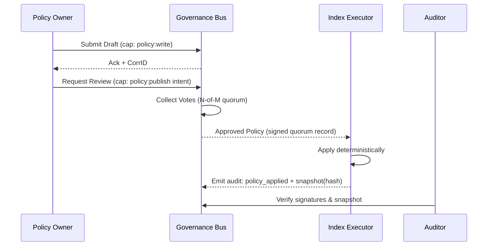
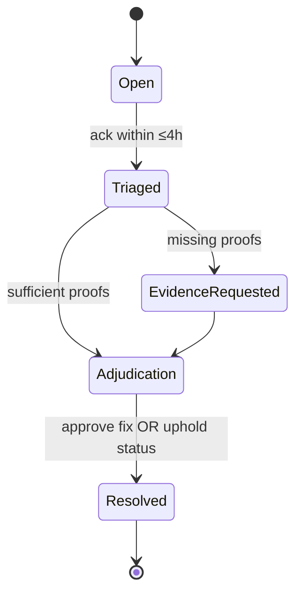

---

# 🏛 GOVERNANCE.md — `svc-index`

---

title: Governance & Economic Integrity
status: draft
msrv: 1.80.0
last-updated: 2025-10-04
audience: contributors, ops, auditors, stakeholders
crate-type: policy|econ
-----------------------

## 0) Purpose

This document defines the **rules of engagement** for `svc-index`—the read-optimized resolver that maps **name / `b3:<hex>` → manifest → provider set**, consults `svc-dht` for discovery, and exposes the result to external consumers. Although `svc-index` does **not** mint, settle, or transfer value, its outputs can **influence** downstream economics (e.g., reward attribution, discovery weight). Therefore, its governance must be **transparent, auditable, and bounded**:

* Canonical **invariants** are enforceable in code and CI.
* Clear **role separation** (policy vs execution vs audit).
* **No unbounded authority**; all changes are **cap-gated** and **logged**.
* SLA-backed commitments for **propagation** and **audit visibility**.

Ties into: **Economic Integrity Blueprint** (no doubles, bounded issuance), **Hardening Blueprint** (bounded authority, custody), and **Perfection Gates** (Gate I: bounded economic invariants; Gate M: appeal paths).

---

## 1) Invariants (MUST)

**Non-negotiable rules for `svc-index`:**

* **[I-IDX-1] Deterministic Mapping:** For a given input `(namespace, key)` and configuration epoch `E`, the resolved manifest and provider set are **deterministic** given observable state (cache/DB + DHT claims).
* **[I-IDX-2] Content Address Integrity:** Resolved manifests are content-addressed (BLAKE3). The bytes served for `b3:<hex>` **must hash** to that address.
* **[I-IDX-3] No Silent Mutation:** A resolved `(namespace,key)` result **never changes** without an auditable cause: new manifest version, expiry, revocation, or policy update. All changes emit governance/audit events.
* **[I-IDX-4] Bounded Authority:** No single actor can rewrite historical index state, suppress audit logs, or bypass policy checks. All privileged actions require **capability tokens** with scope, expiry, and audit IDs.
* **[I-IDX-5] Tamper-Evident Logs:** All governance actions produce **append-only, signed** audit records. Index snapshots are **hash-anchored** and signed.
* **[I-IDX-6] Economic Neutrality:** `svc-index` **cannot** mint, debit, credit, or settle. It produces resolvable facts. Any cross-crate economic effect (e.g., rewarder) must prove and accept those facts **independently**.
* **[I-IDX-7] Do-Not-Erase Principle:** Deletions are **tombstoned** (with reason) rather than purged, except when legally required; in that case, a **redacted tombstone** is recorded.
* **[I-IDX-8] Bounded Latency of Truth:** Governance/audit events for index changes are visible to subscribers within **≤1s** (intra-AZ target) after commit; external consumers can fetch the latest snapshot hash.

---

## 2) Roles & Authority

### Canonical Roles

* **Policy Owner (`ron-policy`)** — proposes indexing policies (namespace rules, inclusion/exclusion, TTLs, dispute windows). Cannot execute DB rewrites.
* **Index Executor (`svc-index`)** — enforces policy deterministically, maintains cache/DB, signs snapshots, emits audit events. Cannot alter policy unilaterally.
* **Ledger Keeper (`ron-ledger`)** — separate system; may **consume** index facts but can reject them. `svc-index` never issues ledger ops.
* **Rewarder (`svc-rewarder`)** — distributes incentives within ledger constraints; must prove provider set provenance (snapshot hash + inclusion proof).
* **Auditor (external)** — read-only; verifies snapshots, diffs, and audit streams; can file disputes.

### Authority Boundaries (caps/macaroons v1 with caveats)

* **Policy Owner**: `policy:write` (propose), `policy:publish` (with quorum), **no** `index:write`.
* **Index Executor**: `index:apply` (execute approved policy), `index:snapshot:sign`, **no** `policy:write`.
* **Rewarder**: `reward:distribute` within ledger caps, **no** `index:write`.
* **Emergency Freeze**: `index:freeze` requires **multi-sig quorum** with TTL; auto-unfreezes unless renewed.

All tokens carry: **scope**, **namespace constraints**, **expiry ≤ 90d**, **auditable ID**, and **issuer fingerprint**. Rotation is mandatory (§6).

---

## 3) Rules & SLAs

### Indexing Rules

* **Inclusion/Exclusion:** A namespace policy defines admissible keys, allowed manifest schemas, maximum object size, and valid providers.
* **Staleness Bounds:** For mutable names, a newer manifest must be visible within **T_update ≤ 5s** of policy-approved publication or the index reports **stale** in `/readyz` reasons.
* **Provider Set Proofs:** Provider membership claims require **N≥2 independent witnesses** (DHT proofs) or a single trusted registrar (per namespace policy).
* **Tombstones:** Exclusions create tombstones with reason (`legal`, `spam`, `policy`) and TTL. Redacted tombstones include legal case ID hash.

### SLAs to Consumers

* **Settlement SLA (governance visibility):** 99.9% of governance/audit entries visible within **≤1s** of commit.
* **Snapshot SLA:** New snapshot hash every **≤60s** while there are changes; signed and retrievable.
* **Dispute Turnaround:** Initial triage **≤4h**, resolution **≤72h** unless extended with cause.

### Deviations

* **Policy deviation** (e.g., emergency exclusion) triggers an **auto-freeze** of the affected namespace and a visible audit banner until ratified by quorum.

---

## 4) Governance Process

### Proposal Lifecycle (policy changes, parameter updates)

**Quorum:** N-of-M signers per namespace (configurable). **Timeout:** default reject if quorum not reached in **T_quorum ≤ 24h**.

### Emergency Powers

* **Freeze/Unfreeze:** Requires quorum cap `index:freeze`. Freeze carries **scope** (namespace/key) and **TTL ≤ 24h**. Must be logged with reason and proposer(s).
* **Mandatory Disclosure:** Emergency actions must appear in audit stream within **≤1h** of activation.

### Parameter Changes

* Changes to inclusion policy, TTLs, snapshot cadence, witness requirements, or dispute windows **must** go through the proposal lifecycle.

---

## 5) Audit & Observability

* **Audit Stream:** Append-only, signed records: `policy_proposed`, `policy_approved`, `index_applied`, `snapshot_signed`, `freeze_{on,off}`, `dispute_{opened,closed}`.
* **Snapshot Anchoring:** Each snapshot includes: `prev_hash`, `height`, `time`, `signer_set`, `namespace_roots`.
* **Metrics (minimum):**

  * `governance_proposals_total{status∈{draft,approved,rejected,expired}}`
  * `governance_freezes_total{scope}`
  * `index_snapshots_total{signer}`
  * `ledger_disputes_total{state}` *(read-through from governance bus)*
  * `rewarder_emissions_total` *(optional, if observed via bus)*
* **Verifiability:**

  * **Conservation proof** is owned by the ledger; index only **exposes facts**.
  * `svc-rewarder` must verify snapshot inclusion (`snapshot_hash`,`namespace_root`) before distribution.
* **Red-Team Drills (quarterly):** Simulate rogue index admin; verify that signed caps and quorum rules prevent unilateral changes; ensure audit emits tamper-evident trail.

---

## 6) Config & Custody

**Config MUST declare:**

* Namespace policies (inclusion/exclusion, TTLs, witness/registrar settings).
* Snapshot cadence and signer set.
* Quorum rules (N-of-M) per namespace.
* SLA targets for audit visibility and dispute turnaround.

**Key Custody:**

* Snapshot signing and governance keys live in **ron-kms or HSM**.
* **No raw private keys** in env/files.
* Cap issuers sign macaroons with **short-lived** keys; rotate **≤ 90 days** or on compromise.
* **Compromise Drill:** Revoke issuer, rotate signer set, re-sign latest snapshot; publish chain of custody in audit.

**PQ Readiness (optional pilot):**

* Snapshot signatures or macaroon issuers may be dual-signed (classical + PQ). Track `pq_enabled` gauge; target **p95 overhead < 10%**.

---

## 7) Appeal Path (Disputes)

**Use cases:** Incorrect mapping, unlawful content, improper exclusion, stale provider set.

**Rules:**

1. Filing a dispute creates an **audit entry** with `corr_id`, scope, and claimed violation.
2. **No silent rollbacks.** If adjudication requires change, apply via **policy-approved** path; emit `dispute_closed{resolved=…}` and new snapshot.
3. **Escalation ladder:**

   * Governance bus topic `governance.disputes` → quorum review.
   * Quorum override (multi-sig) if policy change required.
   * Auditor review and **public disclosure** of decision & reasoning.

---

## 8) Economic Safety (Cross-Crate Contracts)

While `svc-index` is economically neutral, it must not enable downstream manipulation:

* **Provider-Set Integrity:** A provider appears only with **valid proof** (N witness DHT proofs or registrar attestation).
* **No Retroactive Rewrite:** Snapshots are immutable; rewarder must reference **specific snapshot hash** when attributing rewards.
* **Rate-Limit Namespace Churn:** Policy may cap changes/hour to reduce gaming; excess is queued and disclosed.
* **Cross-Check Hook:** Emit `index_provider_set_changes_total{namespace}` for downstream analytics and anomaly alerts.

---

## 9) Security & Privacy Constraints

* **Minimal Disclosure:** Audit records avoid personal data; legal removals are redacted with case-ID hash.
* **Censorship Resistance vs Lawful Removal:** Exclusions require reason codes; legal orders must be signed and referenced; redacted tombstones remain.
* **Logging Hygiene:** No secrets; cap IDs are opaque but consistent for audit correlation.

---

## 10) Acceptance Checklist (Definition of Done)

* [ ] **Invariants enforced** in code & CI (tests for determinism, content hash integrity, tombstones).
* [ ] **Roles & caps** documented; macaroons issued with scope/expiry; rotation policy implemented.
* [ ] **Proposal lifecycle** wired to governance bus; quorum enforced; emergency freeze TTL-bounded.
* [ ] **Audit stream** append-only; snapshot signing + anchoring live; metrics exported.
* [ ] **SLA monitors**: audit visibility ≤1s; snapshot cadence ≤60s when changes exist.
* [ ] **Appeal path** implemented; disputes tested (triage ≤4h, resolution ≤72h).
* [ ] **Economic safety hooks** present (provider proof checks; snapshot hash required by consumers).
* [ ] **Custody** via KMS/HSM; rotation drill documented and tested.
* [ ] **PQ pilot (optional)** documented; overhead tracked if enabled.

---

## 11) Appendix

**Blueprints & Gates:**

* Economic Integrity (no doubles; bounded emission) → Gate I
* Hardening (bounded authority; custody; tamper-evidence)
* Perfection Gates: I (econ invariants), K (vigilance), M (appeal), O (security audit)

**Bus Topics (summary):** *(see INTEROP.md for schemas)*

* `governance.policy.draft|review|approved|rejected`
* `governance.freeze.on|off`
* `index.snapshot.signed`
* `governance.dispute.opened|closed`

**Artifacts:**

* `docs/spec/governance.md` — schemas for proposals, votes, snapshots.
* `docs/api-history/svc-index/` — snapshot hash journal & rationale.
* TLA+ sketches *(optional)* for quorum & freeze TTL.

**History (to be maintained):**

* Past freezes (scope, TTL, reason, signers).
* Disputes (corr_id, outcome, turnaround).
* Policy evolutions (diff, voters, snapshot reference).

---

**Notes for maintainers**: Keep this file **in lockstep** with CONFIG/INTEROP/SECURITY changes. Every change that moves authority, alters witness requirements, or affects the audit/snapshot pipeline must update this doc and add/adjust tests in `TESTS.md` (governance section).
