---

# 🔗 INTEROP.md — `svc-index`

*Audience: developers, auditors, external SDK authors*
*msrv: 1.80.0*

---

## 0) Purpose

Define the **interop surface** of `svc-index` so other crates/services/SDKs can integrate without drift.

Scope covers:

* **Wire protocols** & message formats (HTTP/UDS; OAP/1 noted for context).
* **DTOs & schemas** (JSON first; CBOR/MsgPack optional).
* **Bus topics & events** (emitted/subscribed).
* **Canonical test vectors & conformance rules**.

This keeps `svc-index` consistent with **GMI-1.6 Omni-Gate**, the IDB invariants, and the repo’s transport/hardening policies.

---

## 1) Protocols & Endpoints

### 1.1 Ingress protocols

* **HTTP/1.1** (+ **TLS 1.3** when public) via `tokio_rustls::rustls::ServerConfig`.
* **UDS** (Unix Domain Socket) with **SO_PEERCRED** allow-lists (optional; same routes).
* **OAP/1**: *Not exposed* by `svc-index` externally. (OAP/1 applies to blob/overlay transports; `svc-index` is a resolver.)

### 1.2 Exposed endpoints (normative HTTP/UDS surface)

* `GET /resolve/{key}` → Resolve name or `b3:<hex>` to a manifest pointer.
* `GET /providers/{cid}` → Ranked provider set for a `b3:<hex>`.
* `POST /admin/reindex` → Enqueue reindex/backfill (**capability required**).
* `POST /admin/pin` / `POST /admin/unpin` → Pin/unpin a `cid` (**capability required**).
* `GET /healthz`, `GET /readyz`, `GET /metrics`, `GET /version`.
* *(Optional, gated via `facets`)* `GET /search/{query}`, `GET /graph/{node}`.

**Auth:** public reads may be open or gated by policy; admin/facets require **capability** (macaroon) or UDS allow-list.

### 1.3 Transport invariants (applied at the edge)

* **Body cap:** `1 MiB`.
* **Decompression ratio:** `≤ 10×` + absolute cap.
* **Timeouts:** Default request budget `≤ 5s` (end-to-end lookup hedging within this).
* **Concurrency:** Inflight cap (service-level) + per-IP/connection caps.
* **TLS:** `tokio_rustls::rustls::ServerConfig` (TLS 1.3; CHACHA20-POLY1305/AES-GCM).
* **Streaming:** *N/A for blobs* (index doesn’t stream chunk bytes). (Overlay/storage use `≈64 KiB` chunks; referenced for context only.)

---

## 2) DTOs / Schemas

### 2.1 Wire encodings

* **JSON** (`application/json`) — canonical.
* **CBOR** (`application/cbor`) / **MsgPack** (`application/msgpack`) — optional, **feature-gated**.
* **Forward-compatibility:** Responses may add optional fields at any time; clients **must ignore** unknown fields.
* **Request hygiene:** Requests use `#[serde(deny_unknown_fields)]`.

### 2.2 Core DTOs (Rust-like shape)

```rust
/// GET /resolve/{key}
pub struct ResolveResponse {
  pub key: String,                // "name:*" or "b3:<hex>"
  pub kind: ResolveKind,          // "cid" | "name"
  pub manifest_cid: String,       // "b3:<hex>"
  pub source: Source,             // "cache" | "db" | "dht"
  pub integrity: Integrity,       // algo="blake3", digest=<hex>
  pub etag: String,               // "b3:<hex>"
  pub freshness_s: u64,           // staleness bound
  pub providers_hint: u32         // approximate count
}

pub struct ProvidersResponse {
  pub cid: String,                // "b3:<hex>"
  pub providers: Vec<ProviderEntry>,
  pub hedge: Option<HedgeInfo>    // α/β times & winner
}

pub struct ProviderEntry {
  pub id: String,                 // node ID (opaque)
  pub addr: String,               // "tcp://host:port" or scheme URI
  pub region: Option<String>,     // e.g., "us-east-1"
  pub class: ProviderClass,       // "region_match" | "fresh" | "any"
  pub score: f32,                 // 0.0..1.0
  pub last_seen_s: u64
}

pub struct ErrorResponse {
  pub code: ErrorCode,            // see §5
  pub message: String,            // stable, non-secret
  pub corr_id: String,            // ULID/UUID
  pub retry_after: Option<u64>    // seconds (429/503)
}
```

**Facets (optional, `facets` feature)**

```rust
pub struct SearchResponse {
  pub query: String,
  pub results: Vec<SearchHit>,    // { key, cid, score }
  pub limit: u32,
  pub offset: u32,
  pub total_estimate: u64,
  pub next_offset: Option<u32>,
  pub has_more: bool
}

pub struct GraphResponse {
  pub root: String,               // "name:*" or "b3:<hex>"
  pub neighbors: Vec<GraphEdge>,  // { cid, edge, weight }
  pub truncated: bool
}
```

> **Canonical keying:** All content IDs are **BLAKE3** CIDs with `b3:<hex>` prefix.

### 2.3 Admin DTOs

```rust
pub struct AdminReindexRequest {
  pub keys: Vec<String>,          // e.g., ["name:foo", "b3:abcd..."]
  pub priority: Priority          // "low" | "normal" | "high"
}

pub struct AdminTaskAccepted {
  pub task_id: String
}
```

---

## 3) Bus Topics

### 3.1 Events Published

* `kernel.health` → `KernelEvent::Health { service, ok }`
* `kernel.crash` → `KernelEvent::ServiceCrashed { service }`
* `index.admin.accepted` → `{ task_id, kind:"reindex", keys:[..], corr_id }`
* `index.pin.changed` → `{ cid, action:"pin"|"unpin", corr_id }`
* `index.resolve.observed` → `{ key_hint, source:"cache"|"db"|"dht", latency_ms, corr_id }`

### 3.2 Events Subscribed

* `config.updated` → reload config snapshot (capabilities, limits, features).
* `bus.shutdown` → graceful shutdown (readiness flips fail-closed).

> **Correlation:** All events propagate `corr_id`.

---

## 4) Canonical Test Vectors

> Ship these under `tests/vectors/` and assert **request/response envelopes** and **error taxonomy** are stable. Prefer **property-style** checks where digest material is involved.

### 4.1 Resolve & Providers (JSON)

* **Resolve by CID**

  * **Request:** `GET /resolve/b3:ab12...`
  * **Expect:** `200`, `ResolveResponse.kind = "cid"`, `etag` equals `manifest_cid`.

* **Providers (region prefer)**

  * **Request:** `GET /providers/b3:ab12...?region=us-east-1&limit=5`
  * **Expect:** `200`, `providers.len() ≤ 5`, classes in allowed set, optional region bias.

### 4.2 Error taxonomy conformance

* **Body cap:** POST `1.5 MiB` → `413` with `ErrorResponse.code = "body_cap"`.
* **Unauth admin:** POST `/admin/reindex` without cap → `401/403`; increments `rejected_total{reason="unauth"}`.
* **Not ready:** `/readyz` before init → `503` with `{ ready:false, missing:[...] }`.

### 4.3 Digest/property checks

* **Integrity property:** When `ResolveResponse` is returned, `integrity.digest` must equal the BLAKE3 of the manifest bytes the index points at (checked in the harness with `b3sum`), and `etag == manifest_cid`.

---

## 5) Error Taxonomy (stable wire contract)

| HTTP | `ErrorResponse.code` | Meaning                                  |
| ---: | -------------------- | ---------------------------------------- |
|  400 | `bad_request`        | Malformed key/params                     |
|  401 | `unauthorized`       | Missing/invalid capability               |
|  403 | `forbidden`          | Capability lacks scope / UDS peer denied |
|  404 | `not_found`          | Unknown key/cid                          |
|  413 | `body_cap`           | Request body exceeds 1 MiB               |
|  415 | `unsupported_type`   | Unrecognized `Content-Type`              |
|  429 | `over_capacity`      | Quotas / inflight caps tripped           |
|  503 | `upstream_unready`   | DB/DHT/bus/listeners not ready           |
|  504 | `timeout`            | Upstream exceeded deadline               |
|  500 | `internal`           | Unexpected server error                  |

> **Status/code mapping is normative.** Changing a mapping for an existing condition is **breaking**.

---

## 6) Interop Guarantees

* **No kernel drift:** Bus/Metrics/Health/Config usage adheres to kernel’s frozen exports.
* **SemVer discipline:**

  * **Additive:** new optional fields/queries; new endpoints that don’t change existing semantics.
  * **Breaking:** removals, type changes, required field flips, status/code remaps.
* **Forward-compat:** Responses may add fields; clients **must ignore** unknowns.
* **Determinism:** For identical inputs, `/providers/{cid}` is stable modulo freshness; `limit` is enforced.
* **Auditability:** Canonical vectors stored under `tests/vectors/` and referenced by CI conformance tests.
* **Headers contract:** `X-Corr-ID` is echoed/generate-if-missing; cacheable reads set **strong** `ETag = b3:<hex>`.

---

## 7) Compatibility Matrix (SDK & formats)

| Client | JSON | CBOR | MsgPack | Notes                        |
| -----: | :--: | :--: | :-----: | ---------------------------- |
|   Rust |   ✅  |  ✅*  |    ✅*   | `*` when feature enabled     |
|  JS/TS |   ✅  |   —  |    —    | JSON over fetch/axios        |
|     Go |   ✅  |  ✅*  |    —    | CBOR optional                |
| Python |   ✅  |  ✅*  |    ✅*   | Feature-gated binary formats |

---

## 8) References

* `API.md` (endpoints, headers, pagination rules, facets).
* `OBSERVABILITY.md` (corr_id propagation, metrics names).
* `SECURITY.md` (capability gates, TLS policy, limits).
* Interop Blueprint **GMI-1.6** (ingress policy, error envelopes).
* OAP/1 Spec (context only; not exposed by `svc-index`).

---

## 9) Mermaid — Interop Flows

### 9.1 Components & wires


### 9.2 Resolve sequence with hedge

```mermaid
sequenceDiagram
  participant C as Client
  participant I as svc-index
  participant DB as Index DB/Cache
  participant D as svc-dht

  C->>I: GET /resolve/{key}
  I->>DB: lookup(key)
  alt hit or !fresh
    DB-->>I: manifest ptr
    I-->>C: 200 JSON (ETag=b3:..., source=cache|db)
  else miss or fresh=true
    par α
      I->>D: lookup(cid) alpha
    and β (δ delay)
      I->>D: lookup(cid) beta
    end
    D-->>I: winner (α|β)
    I->>DB: write-back cache
    I-->>C: 200 JSON (source=dht, hedge=winner)
  end
```



---

## 10) Conformance: CI & local checks

* **Contract tests:** Run against the live service; assert:

  * status/code mapping (§5), headers (`X-Corr-ID`, `ETag`), body cap `413`, unauth `401/403`, readiness `503→200`.
* **Snapshot drift:** Update `/docs/api-history/svc-index/*` and OpenAPI on any surface change.
* **Label hygiene:** No high-cardinality labels in metrics; route templates (no raw keys in labels).

---

