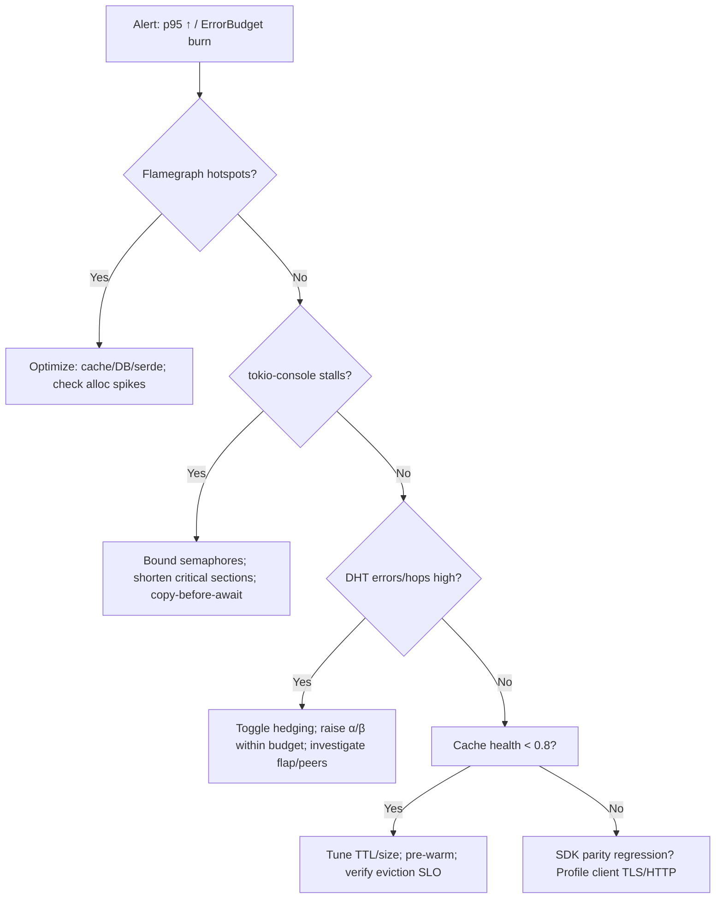

---

# ⚡ PERFORMANCE.md — `svc-index`

---

title: Performance & Scaling
status: draft
msrv: 1.80.0
crate_type: service
last-updated: 2025-10-03
audience: contributors, ops, perf testers
-----------------------------------------

## 0) Purpose

Defines the **performance profile** for `svc-index`, the thin, read-optimized resolver that maps **names / `b3:<hex>` → manifests → provider sets** (DHT-assisted). It freezes SLOs, workloads, harnesses, knobs, bottlenecks, a triage runbook, and **regression gates**.
Canon inheritance: **Scaling Blueprint v1.3.1**, **Hardening & Interop invariants** (OAP/1 `max_frame = 1 MiB`; storage streaming ≈ 64 KiB), **Perfection Gates** (F: perf regressions barred, L: scaling chaos-tested).

---

## 1) SLOs / Targets

### 1.1 Service SLOs (Resolve / Providers)

* **Latency:** p95 `< 80 ms` intra-region; `< 200 ms` inter-region.
* **Availability:** 5xx `< 0.1%` (rolling 10-min).
* **Throttle/Error budget:** 429/503 `< 1%` sustained (excl. drills).
* **Integrity:** `index_integrity_fail_total == 0`.
* **Cache health:** hit ratio `> 0.80` (1h window).
* **DHT health:** hedge **win rate > 0.2**; **p99 ≤ 5 hops** for lookups.

### 1.2 Profile Matrix (Micronode vs. Macronode)

| Profile   | p95 Resolve (intra) | p95 Inter | DHT Hops p99 | Amnesia / Cache                              | Notes                                                                          |
| --------- | ------------------: | --------: | -----------: | -------------------------------------------- | ------------------------------------------------------------------------------ |
| Micronode |             < 50 ms |      N/A* |         N/A* | RAM-only; zeroize on shutdown                | Single-tenant; local cache dominant; *Inter/DHT typically mocked for local dev |
| Macronode |             < 80 ms |  < 200 ms |          ≤ 5 | RAM+spill; eviction SLO: p95 refill < 200 ms | Multi-tenant; cross-AZ traffic; hedged lookups                                 |

### 1.3 Resource Ceilings @ target load

* **CPU:** `< 60%` per core sustained.
* **Memory:** steady-state `< 1.5 GiB` (cache tier included).
* **FDs:** `< 30%` of system limit.
* **Timeouts/limits (defaults):** request 5 s; inflight 512; RPS 500; body cap 1 MiB; decompress ≤ 10×.
* **Readiness:** `/readyz` = 200 only when **config, DB, DHT client, bus** are healthy; otherwise `503` with `Retry-After`.

### 1.4 SDK / Polyglot Parity (interop DX)

* **Client delta cap:** Non-Rust SDK resolve p95 within **+20%** of Rust reference under the same workload (TS, Python).

---

## 2. Benchmarks & Harness

### 2.1 Micro-bench (Criterion)

* Cache hit/miss paths (name→manifest; `providers` construction).
* DTO encode/decode (JSON/CBOR).
* **Report allocations/op** via heaptrack; fail any +15% alloc regression.

### 2.2 Integration load rigs

* HTTP resolve at fixed RPS with **80/20 hot:cold** key mix.
* **DHT hedged lookups**: α (first-wave) + β (second-wave) with injected tail peers.
* Tooling: `wrk`, `bombardier`, `gwsmoke`; scripts under `testing/performance/`.

### 2.3 SDK parity benches

* Reproduce resolve benchmarks using **ron-app-sdk** in **Rust / TypeScript / Python** clients; assert `< 20%` p95 delta vs Rust.

### 2.4 Profiling

* `cargo flamegraph` (cache/DB/serde hotspots).
* `tokio-console` (stalls, semaphore starvation).
* `perf` / `coz` (causal profiling).
* `hyperfine` for any CLI latency (if a binary tool exists).

### 2.5 Chaos/perf blend

* **Slow-loris**, **compression bombs**, **cache-cold sweeps**, **DHT flap** (peer churn/packet loss).
* Verify structured rejects, truthful `/readyz`, and stable error taxonomy under stress.

---

## 3. Scaling Knobs

* **Concurrency:** per-route semaphores; α/β hedging fan-out; bounded inflight.
* **Deadlines:** end-to-end resolve budget ≈ 1200 ms; per-leg timeouts (cache/DB/DHT) must sum under budget with slack.
* **Memory/I-O:** use `bytes::Bytes`; stream responses; never conflate OAP/1 `1 MiB` wire cap with storage chunking (~64 KiB).
* **Horizontal scale:** stateless replicas; cache warms via traffic; Micronode favors warm RAM caches (amnesia).
* **Metrics cardinality bounds:**

  * `{route}` ≤ 10, `{type}` ∈ {name, cid, facet}, `{status}` ∈ {ok, error, throttled}.
  * CI asserts label sets; reject high-cardinality expansions.

### 3.1 Future-proofing stubs (lightweight)

* **PQ pilot toggle (hedged lookups):** enable PQ-hybrid key exchange on DHT client; target overhead **< 10%** p95.
* **ZK/Econ hook:** maintain counters for provider-set changes to feed cross-crate contract tests (econ impacts measured elsewhere).

---

## 4. Bottlenecks & Known Limits

* **Cache miss storms** → surge in DHT calls and tail latency. Watch `index_cache_{hits,misses}_total`, `index_dht_lookup_ms`; expand α/β cautiously.
* **Discovery tails** under partial partitions or slow peers → rely on hedging and hop cap (p99 ≤ 5).
* **DB contention** if mis-sharded or iterators held across await points → **copy before await**, keep one configured `RON_INDEX_DB` root.
* **Hard-limit hits** (size/time/inflight) must fail fast and be observable (`rejected_total{reason}`).
* **SDK variances**: if TS/Python exceed +20% p95, profile TLS/serde and Nagle/HTTP1 vs HTTP2 settings on clients.

---

## 5. Regression Gates (CI must fail if…)

* **Latency:** p95 ↑ > 10% vs baseline (track intra/inter separately).
* **Throughput:** ↓ > 10% at fixed error budget.
* **CPU/Memory:** regress > 15% at fixed RPS.
* **Allocations/op:** ↑ > 15% on micro-bench hot paths.
* **SDK parity:** any SDK p95 delta > 20% vs Rust in parity jobs.
* **Waiver policy:** time-boxed; any waiver **expires next release** unless replaced with root-cause ticket + plan.
* Baselines live in `testing/performance/baselines/`.

**CI sketch (GitHub Actions):**

```yaml
jobs:
  perf-regress:
    runs-on: ubuntu-latest
    steps:
      - uses: actions/checkout@v4
      - uses: dtolnay/rust-toolchain@stable
      - run: cargo bench -- --save-baseline main
      - run: cargo bench -- --load-baseline main --fail-if-slower 10
  sdk-parity:
    runs-on: ubuntu-latest
    steps:
      - uses: actions/checkout@v4
      - run: pnpm i && pnpm run bench:resolve   # TS client
      - run: python3 testing/performance/sdk_py/bench_resolve.py --fail-if-slower 1.2
```

---

## 6. Perf Runbook (Triage)



1. **Flamegraph first** → confirm CPU hotspots (cache/DB/serde) vs wait.
2. **tokio-console** → locate stalls, long polls, semaphore starvation.
3. **Metrics sweep** → `request_latency_seconds`, `rejected_total{reason}`, cache miss spike, DHT hops/errors.
4. **Knob stress** → α/β, inflight, TTL/size, deadlines; re-run fixed-RPS tests.
5. **Chaos toggle** → disable compression/hedging/jitter to isolate; then re-enable progressively.
6. **Profile split** → reproduce on Micronode (amnesia) vs Macronode to see cache/spill sensitivities.

---

## 7. Acceptance Checklist (DoD)

* [ ] SLOs and profile matrix (Micronode/Macronode) documented and dashboarded.
* [ ] Micro + integration + chaos rigs run locally and in nightly CI.
* [ ] Flamegraph + tokio-console traces captured at least once per release.
* [ ] Scaling knobs (α/β, inflight, deadlines, TTL/size) reflected in CONFIG.md.
* [ ] Metrics label cardinality bounds enforced in CI.
* [ ] Regression gates wired (latency/throughput/CPU/mem/allocs + SDK parity).
* [ ] Runbook validated during a drill; alert links updated.
* [ ] Waiver, if any, has expiry and owner.

---

## 8. Appendix

### 8.1 Canonical invariants & limits

* **OAP/1:** `max_frame = 1 MiB` (wire).
* **Storage I/O:** stream in **~64 KiB** chunks (storage detail).
* **Hardening defaults:** request timeout 5 s; inflight 512; RPS 500; body cap 1 MiB; decompress ≤ 10×.
* **Endpoints:** expose `/metrics`, `/healthz`, `/readyz`, `/version`.

### 8.2 Metrics canon (and bounds)

* Must exist: `request_latency_seconds`, `rejected_total{reason}`, `index_resolve_latency_seconds{type}`, `index_dht_lookup_ms`, `index_cache_{hits,misses}_total`, `inflight_requests{route}`.
* **Label bounds:** `{type} ∈ {name,cid,facet}`, `{route} ≤ 10`, `{status} ∈ {ok,error,throttled}`.

### 8.3 SDK parity notes

* Measure p95 across Rust, TS, Python clients for identical keysets and server build; record deltas next to baselines.

### 8.4 Future-proofing pointers

* **PQ impact tracking:** If PQ-hybrid is enabled on DHT client, record `pq_enabled` gauge and overhead factor; target p95 overhead `< 10%`.
* **Econ cross-checks:** Emit `index_provider_set_changes_total`; contract tests in econ suite validate downstream impacts (no perf gating here).

### 8.5 History

* Keep a short journal of regressions/fixes to build institutional memory (link CI runs, PRs, flamegraphs).

---

