---

title: RUNBOOK — svc-index
owner: Stevan White
msrv: 1.80.0
last-reviewed: 2025-10-03
audience: operators, SRE, auditors

# 🛠️ RUNBOOK — `svc-index`

## 0) Purpose

Operational manual for `svc-index`: startup, health, diagnostics, failure modes, recovery, scaling, and security ops.
Satisfies **PERFECTION_GATES** K (Continuous Vigilance) and L (Black Swan Economics).

---

## 1) Overview

* **Name:** `svc-index`
* **Role:** Index & resolver (name / `b3:<hex>` → manifest → provider set), read-optimized; consults `svc-dht` for discovery.
* **Criticality Tier:** 1 (critical service)
* **Primary Dependencies:**
  **ron-bus** (health/config events), **svc-dht** client (hedged lookups), **Sled DB** (single configured root), **Prometheus** scrape.
* **Ports/Addresses (examples):** API `127.0.0.1:9414`, Metrics `127.0.0.1:9909`, Bus UDS or `127.0.0.1:9410`
* **Data Flows:** HTTP resolves in → cache/DB → (on miss) `svc-dht` → compose response → metrics/bus out.
* **Version Constraints:** Requires `ron-kernel` public events (`Health`, `ConfigUpdated`, `ServiceCrashed`, `Shutdown`).

---

## 2) Startup / Shutdown

### Startup (dev)

```bash
cargo run -p svc-index -- --config ./configs/svc-index.toml
```

### Startup (release)

```bash
./target/release/svc-index --config /etc/ron/svc-index.toml
```

### Env overrides

`RON_CONFIG=/etc/ron/svc-index.toml`
`RON_INDEX_DB=/var/lib/ron/svc-index/`
`RON_HTTP_ADDR=0.0.0.0:9414`
`RON_METRICS_ADDR=0.0.0.0:9909`
`RON_DHT_BOOTSTRAP=<peer1,peer2,...>`
`RON_AMNESIA=0|1`

### Feature toggles (if built)

`--amnesia` · `--tls` · `--dht-hedge alpha,beta` · `--max-inflight N` · `--rps-limit N` · `--deadline-ms N`

### Verification

```bash
curl -sS http://127.0.0.1:9909/readyz
curl -sS http://127.0.0.1:9909/version
```

Expect `/readyz` = 200 with readiness reasons logged.

### Shutdown

* Interactive: `Ctrl-C` → graceful drain, bus `Shutdown`.
* systemd: `systemctl stop svc-index`
* K8s: delete pod/drain node; rely on preStop to drain.

#### Mermaid — Startup sequence


---

## 3) Health & Readiness

* **/healthz:** process alive.
* **/readyz (200 only if):**

  1. config valid,
  2. sled DB open (RW or configured RO),
  3. bus subscribed,
  4. DHT client healthy or in acceptable degraded mode (hedging off + warm cache),
  5. cache warm (if configured).
* **Ready window:** 2–5 s typical. Degrade to `503` (with `Retry-After`) if deps fail.

Not ready after 10 s? Tail logs for readiness reasons, check bus `ServiceCrashed{...}`, inspect `bus_overflow_dropped_total`, `index_cache_{hits,misses}_total`, `index_dht_lookup_ms`.

---

## 4) Common Failure Modes

| Symptom                      | Likely Cause                               | Metric / Log Hint                             | Resolution                                                 | Alert Threshold             |
| ---------------------------- | ------------------------------------------ | --------------------------------------------- | ---------------------------------------------------------- | --------------------------- |
| 503 on resolve bursts        | Quota/inflight exceeded                    | `rejected_total{reason="throttled"}`          | Raise caps carefully or add replicas; verify autoscale/HPA | >1% over 5 min              |
| p95 > 200 ms inter-region    | DHT tails; under-hedged; slow peers        | `index_dht_lookup_ms`, hop histos, hedge win% | Increase α/β; refresh peers; check partitions              | p95 breach 10 min           |
| Cache miss storm             | Hot set eviction / cold start              | Hit ratio < 0.8, `misses_total` spike         | Increase cache size/TTL; pre-warm; pin hot keys            | hit < 0.7 for 5 min         |
| 5xx spikes                   | DB errors; integrity fail                  | sled errors; `index_integrity_fail_total`     | Stop, integrity check, restore snapshot                    | any                         |
| Readiness flapping           | Bus or DHT flakiness                       | `/readyz` toggles; `dht_errors_total`         | Add jitter/backoff; stabilize peers; tune probe thresholds | >3 flaps/10 min             |
| High CPU at low RPS          | Serde/alloc churn; client keepalive issues | Flamegraph hotspots; alloc/op ↑               | Switch to CBOR/Bytes; tune keepalive; DTO slimming         | CPU >80% @ <50% target RPS  |
| DB contention / locks        | Long iterators across await                | Long spans; console: blocked tasks            | Copy-before-await; shrink critical sections; tune workers  | any sustained lock > 500 ms |
| Disk nearly full (sled root) | Log/data growth                            | OS alerts; DB write errors                    | Expand/prune; restore last good snapshot                   | <10% free space             |

---

## 5) Diagnostics

### Quick commands

```bash
journalctl -u svc-index -f
curl -s http://127.0.0.1:9909/metrics | grep -E 'index_|request_latency_seconds|rejected_total|inflight_requests'
curl -s http://127.0.0.1:9909/healthz
curl -s http://127.0.0.1:9909/readyz
ronctl tail --topic svc-index
```

### Deep dives

* **Tokio console:** run with console enabled; look for blocked tasks/semaphore starvation.
* **Flamegraph:** verify hotspots (cache/DB/serde).
* **Watch:**
  `request_latency_seconds{route="resolve"}` p95/p99,
  `index_dht_lookup_ms` + hops,
  `index_cache_{hits,misses}_total`,
  `rejected_total{reason}`,
  `inflight_requests{route}`,
  `bus_overflow_dropped_total` (should be 0).

---

## 6) Recovery Procedures

1. **Config drift / bad rollout**

* Action: `ronctl config check`; revert to last good; `SIGHUP` or rolling restart.

2. **DB corruption (sled root)**

* Action: stop; snapshot; restore last snapshot; start; verify `/readyz`. If persistent, run offline integrity tool; escalate.

3. **DHT unreachable / long tails**

* Action: temporarily disable hedging; refresh bootstrap; re-enable hedging with conservative α/β; ensure hop cap; serve cache-only in degraded mode if needed.

4. **Overload / hot key storm**

* Action: request shedding at edge; add replicas; raise inflight cautiously; pre-warm/pin hot entries.

5. **Readiness flapping**

* Action: inspect per-dep reasons; stabilize bus/DHT; add jitter; widen probe thresholds.

6. **Rollback version**

* Action: redeploy previous tag; verify stability 10 min; file regression with flamegraph + console artifacts.

#### Mermaid — Recovery flow

```mermaid
flowchart TD
  A[Incident: p95 ↑ / 503s] --> B{Cache hit < 0.8?}
  B -->|Yes| C[Pre-warm / increase TTL/size / pin hot keys]
  B -->|No| D{DHT hops/errors high?}
  D -->|Yes| E[Adjust α/β; refresh peers; check partitions]
  D -->|No| F{Blocked tasks / locks?}
  F -->|Yes| G[Copy-before-await; shrink critical sections]
  F -->|No| H[Serde/alloc hotspots]
  H --> I[Switch to Bytes/CBOR; slim DTOs]
  I --> J[Re-test fixed-RPS; restore chaos toggles]
```



---

## 7) Backup / Restore

**Stateful:** sled root.

**Cold backup (preferred):**

```bash
systemctl stop svc-index
rsync -a --delete /var/lib/ron/svc-index/ /backups/svc-index/$(date +%F-%H%M)/
systemctl start svc-index
```

**Restore:**

```bash
systemctl stop svc-index
rsync -a /backups/svc-index/<snapshot>/ /var/lib/ron/svc-index/
systemctl start svc-index
curl -s http://127.0.0.1:9909/readyz
```

**Retention:** keep hourly for 24h, daily for 7d, weekly for 4w (adjust per policy).

---

## 8) Upgrades

1. Drain traffic (edge ↓ weight or `systemctl stop --no-block`).
2. Apply migrations if present: `ronctl migrate svc-index --plan`.
3. Deploy new binary; start; verify `/readyz` + dashboards.
4. Watch 10 min: p95 within SLO; hit ratio ≥ 0.8; no `ServiceCrashed`.
5. Roll back within 5 min if regressions; attach perf artifacts to PR; open RCA.

---

## 9) Chaos Testing

Run quarterly (Gate J) **and** include a **24h soak** (memory/FD leak watch).

```bash
ronctl chaos inject --target svc-index --fault=latency --arg=dht:+200ms --duration=10m
ronctl chaos inject --target svc-index --fault=cache_cold --arg=0.8 --duration=5m
ronctl chaos soak --target svc-index --duration=24h
```

**Pass criteria:** hedging keeps SLOs; cache-cold recovery < 3 min; rejects are structured; no leak creep; `/readyz` truthful.

---

## 10) Scaling Notes

* **Vertical:** add cores; optimize serde; reduce alloc/op before scaling out.
* **Horizontal:** stateless replicas; share bus; autoscale on:

  * `inflight_requests{route="resolve"} > 80% cap` for 5 min, or
  * sustained `rejected_total{reason="throttled"} > 0`.

**Profiles & Architectures**

| Profile/Arch                | Capacity Estimate  | Notes                                 |
| --------------------------- | ------------------ | ------------------------------------- |
| Micronode aarch64 (4c/8GiB) | ~400 rps @ SLO met | Amnesia RAM-only; verify zeroize perf |
| Macronode x86_64 (4c/8GiB)  | ~500 rps @ SLO met | RAM+spill; monitor eviction SLO       |

---

## 11) Security Ops

* **Secrets:** no plaintext in logs; scrub sensitive fields when flagged.
* **Caps/ACL:** rotate with `ronctl cap rotate`; confirm via `/version` and audit stream.
* **Amnesia mode:** enable for Micronode; verify zeroization on shutdown.
* **TLS:** prefer rustls; rotate certs via sidecar or watcher (SIGHUP reload).
* **PQ pilot (optional):** `ronctl cap rotate --pq` (if supported); track gauge `pq_enabled` and p95 overhead; target <10%.
* **Audit trail:** tail `ron-audit` for cap/policy changes; **tamper-evident check** (if enabled): `ronctl audit verify --window 24h`.

---

## 12) References

* CONFIG.md (limits: deadlines, inflight, RPS, cache TTL/size, hedging α/β)
* SECURITY.md (threat model, caps, PQ notes)
* OBSERVABILITY.md (dashboards, alerts)
* CONCURRENCY.md (copy-before-await, semaphore bounds)
* PERFORMANCE.md (SLOs, gates, harnesses)
* INTEROP.md (routes, DTOs, limits)
* Blueprints: Hardening, Concurrency & Aliasing, Omni-Gate, Scaling

---

## ✅ Perfection Gates Checklist

* **Maturity tiers:**
  **Bronze:** Gates A/O clean (metrics + audit); **Gold:** all gates + quarterly chaos + scaling validated.

* [ ] Gate A: Metrics green (p95 SLO, error budget burn <1%)

* [ ] Gate J: Chaos passed (+24h soak; no leaks; truthful `/readyz`)

* [ ] Gate K: Continuous vigilance (alerts wired; weekly dashboard review)

* [ ] Gate L: Scaling under chaos validated (autoscale triggers exercised)

* [ ] Gate N: ARM/edge profile captured (Micronode)

* [ ] Gate O: Security audit clean (caps rotated, TLS fresh, audit verify ok)

* [ ] PQ (if piloted): overhead <10%, rotate play validated

---

### Quick Triage (One-Pager)

1. **p95 breach** → check `index_dht_lookup_ms` & cache hit ratio → adjust α/β; warm/pin cache → re-measure.
2. **503 spikes** → `rejected_total{reason}` → if throttled: add replicas/raise caps; if deadline: increase per-leg budget carefully.
3. **Readiness flaps** → read `/readyz` reasons; stabilize DHT/bus; add jitter; widen probes.
4. **High CPU** → flamegraph; slim DTOs; switch to CBOR/Bytes; ensure client keepalive.
5. **DB errors** → stop → backup → restore snapshot → start → verify integrity & `/readyz`.
