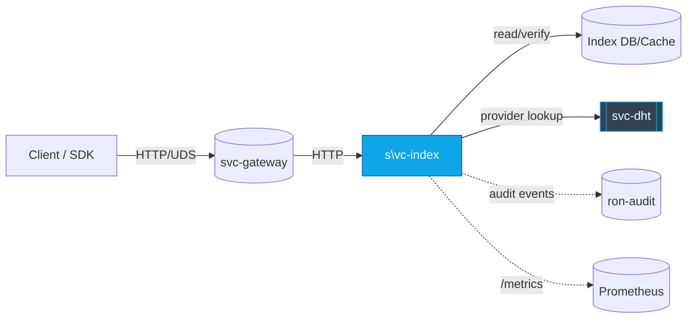
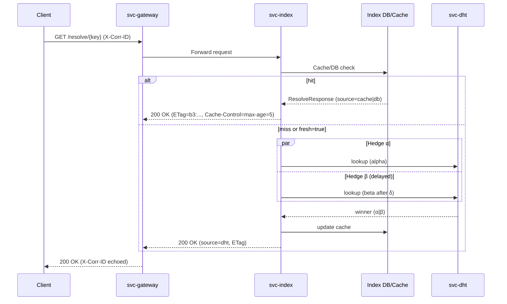
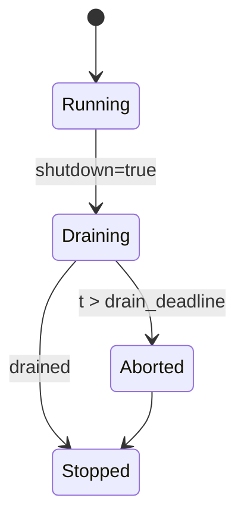
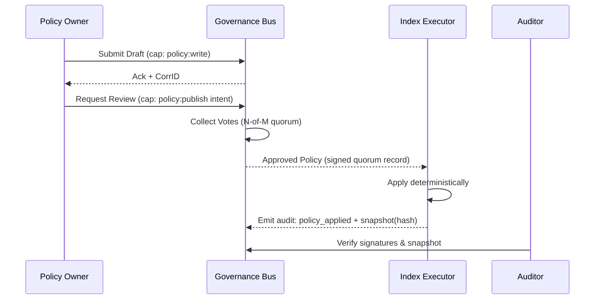
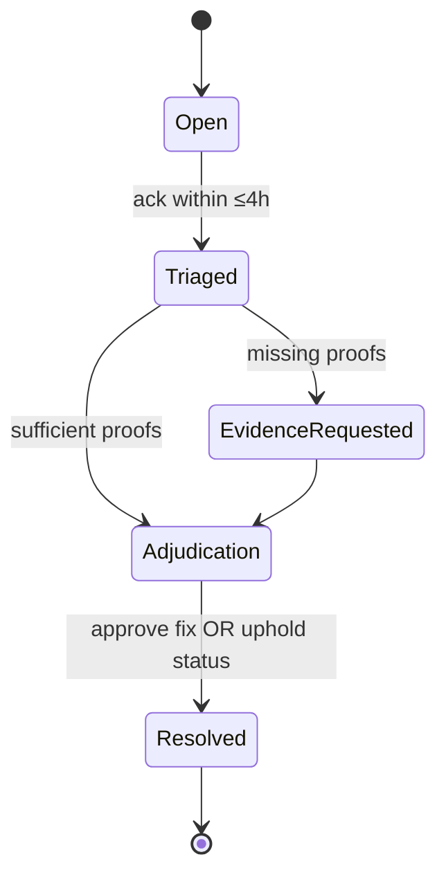
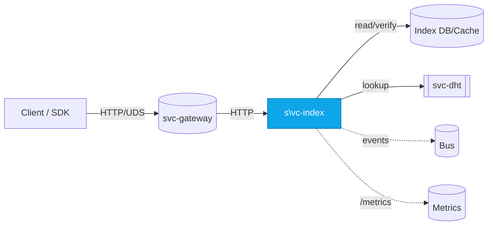
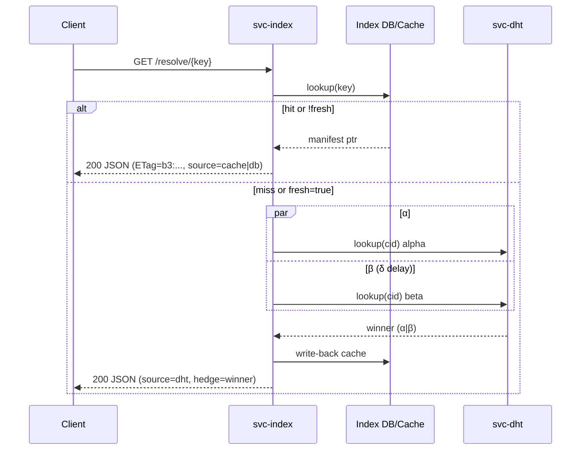
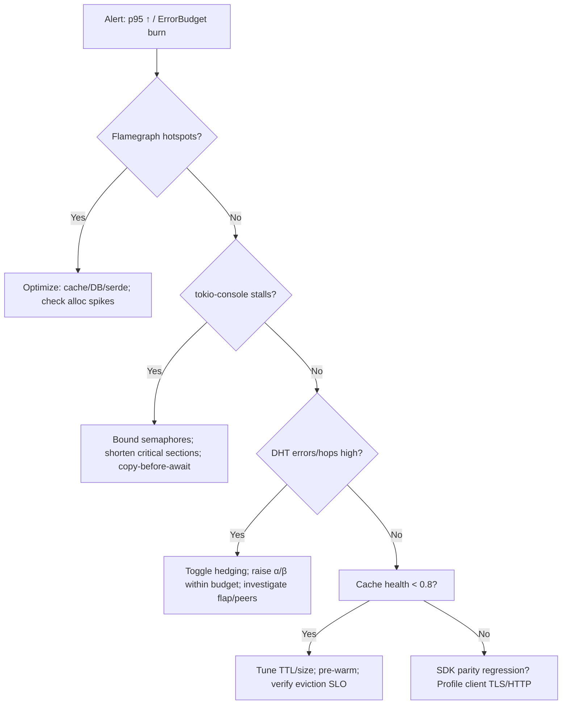
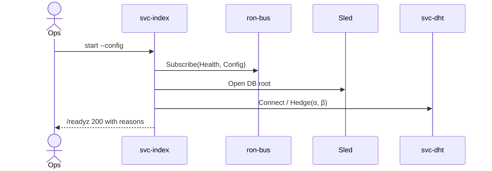
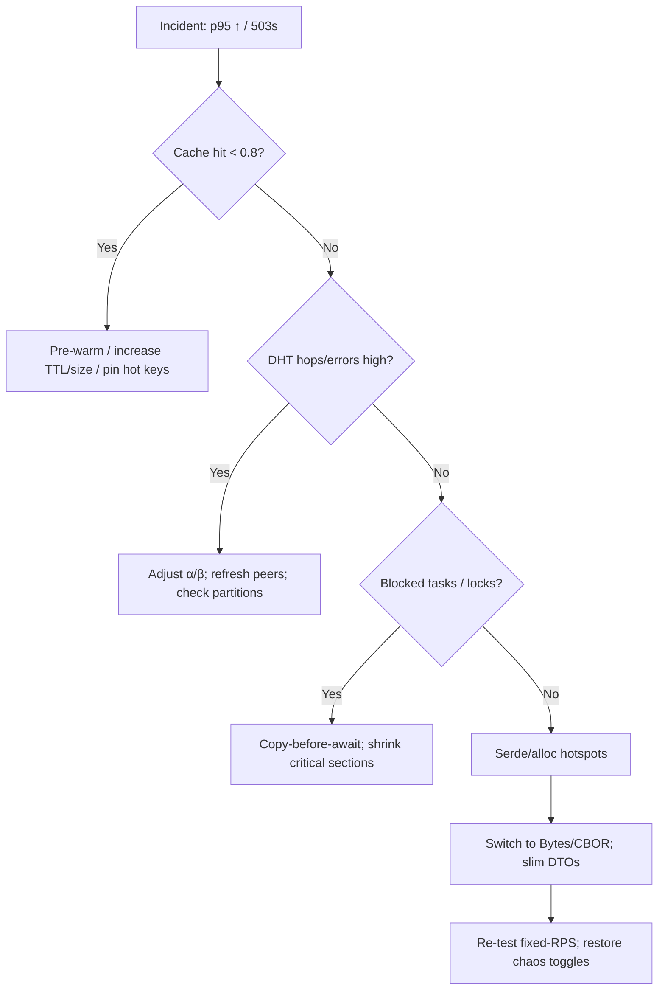

# Combined Markdown

_Source directory_: `crates/svc-index/docs`  
_Files combined_: 13  
_Recursive_: 0

---

### Table of Contents

- API.MD
- CONCURRENCY.MD
- CONFIG.MD
- GOVERNANCE.MD
- IDB.md
- INTEROP.MD
- OBSERVABILITY.MD
- OLD_README.md
- PERFORMANCE.MD
- QUANTUM.MD
- RUNBOOK.MD
- SECURITY.MD
- TESTS.MD

---

## API.MD
_File 1 of 13_

---

title: API Surface & SemVer Reference
status: draft
msrv: 1.80.0
last-updated: 2025-10-03
audience: contributors, auditors, API consumers
crate: svc-index
----------------

# API.md — `svc-index`

## 0) Purpose

This document captures the **public API surface** for `svc-index`, a **read-optimized resolver** that maps **names / `b3:<hex>` content IDs → manifests → provider sets**.

Because `svc-index` is a **service crate**, its stable contract is the **HTTP/UDS API**, wire **DTOs**, and **Bus events**. Rust exports are intentionally minimal; any shared DTOs intended for reuse live in `ron-proto`.

It provides:

* A snapshot of exported symbols (if any) and the **HTTP/UDS API**.
* **SemVer discipline** and what constitutes a breaking change.
* Error taxonomy, status code semantics, headers, and invariants.
* Generation of **OpenAPI** and **public-api** snapshots, enforced in CI.

---

## 1) Public API Surface

### 1.1 Rust surface (crate exports)

`svc-index` does **not** provide a consumer library API. Any public items under `src/lib.rs` are **internal** unless explicitly listed here. If a thin helper library target exists, keep it minimal.

Example (illustrative; replace with actual):

```text
# Replace with actual output from cargo public-api
pub mod dto
pub use dto::{ResolveResponse, ProvidersResponse, ErrorResponse, ProviderEntry}
pub fn build_router(state: AppState) -> axum::Router  # internal-facing; stability not guaranteed
```

Generate a real snapshot (optional for service crates):

```bash
cargo public-api --simplified > docs/api-history/svc-index/$(cargo pkgid | sed 's/.*#//').libapi.txt
```

> **Normative surface is HTTP/UDS** below. The Rust surface may change faster.

---

### 1.2 HTTP/UDS API (normative)

**Transports:** HTTP/1.1 (+TLS when public) and/or **UDS** (Unix Domain Socket).
**Content types:** `application/json` (default). Optional `application/cbor` or `application/msgpack` via `Accept` when the feature is enabled.

#### 1.2.1 Common headers

* **Request**

  * `Accept: application/json` (or `application/cbor`)
  * `Authorization: Bearer <capability>` (admin/facets; not required for public reads unless policy says so)
  * `X-Corr-ID: <ULID/UUID>` (optional; server generates if absent)
  * `Idempotency-Key: <token>` (admin POSTs; optional but recommended)

* **Response**

  * `X-Corr-ID: <same-as-request-or-generated>`
  * `ETag: "b3:<hex>"` (resolve/providers responses when applicable)
  * `Cache-Control: public, max-age=<s>` (resolve/providers; see §1.2.6)
  * `RateLimit-Limit`, `RateLimit-Remaining`, `RateLimit-Reset` (if quotas enabled)
  * `Retry-After: <seconds>` (on 429/503 when appropriate)

---

#### 1.2.2 Core endpoints

##### `GET /resolve/{key}`

Resolve a **name** or **`b3:<hex>`** to a manifest pointer and basic metadata.

* **Path:** `key` — either `name:*` or `b3:<hex>`
* **Query:** `fresh=bool` (default `false`) — if `true`, validate against DB/DHT before returning cached value
* **Responses:**

  * `200 OK` → `ResolveResponse`
  * `404 Not Found` → `ErrorResponse{code="not_found"}`
  * `429/503` → `ErrorResponse{code="over_capacity"|"upstream_unready"}`, optional `Retry-After`
* **Example:**

  ```
  curl -sS "http://localhost:8080/resolve/b3:ab12cd34..." | jq
  ```

##### `GET /providers/{cid}`

Return the **provider set** for a `b3:<hex>` with ranking hints.

* **Path:** `cid` — `b3:<hex>`
* **Query:** `region=<iso-region>` (advisory), `limit=1..32` (default `5`), `min_freshness=<seconds>`
* **Responses:**

  * `200 OK` → `ProvidersResponse`
  * `404 Not Found` → `ErrorResponse{code="not_found"}`
  * `429/503` → as above

##### `POST /admin/reindex`  *(capability required)*

Trigger **reindex/backfill** tasks for keys or ranges.

* **Body:** `AdminReindexRequest`
* **Responses:**

  * `202 Accepted` → `AdminTaskAccepted{task_id}`
  * `401/403` → `ErrorResponse{code="unauthorized"|"forbidden"}`
* **Idempotency:** respected via `Idempotency-Key` for 24h per `(route, body-digest, capability-scope)`.

##### `POST /admin/pin`  /  `POST /admin/unpin`  *(capability required)*

Pin or unpin a `cid` in the index.

* **Body:** `AdminPinRequest { cid: String }`
* **Responses:**

  * `200 OK` → `{ "ok": true }`
  * `401/403` → unauthorized/forbidden

##### Health/Meta

* `GET /healthz` → `200 OK` (liveness)
* `GET /readyz` → `200 OK` only when **all readiness keys** are true; else `503` with `{ ready:false, missing:[...] }`
* `GET /metrics` → Prometheus exposition
* `GET /version` → `{ "crate":"svc-index", "version":"x.y.z", "git_sha":"...", "build":"..." }`

> **UDS mode:** Same routes over a Unix socket; authentication may rely on **SO_PEERCRED** allow-lists in place of `Authorization`. UDS is optional, gated by `uds.enabled`.

---

#### 1.2.3 Facets (optional / gated)

Feature flag: `facets` (off by default). SLO: p95 ≤ 150 ms intra-AZ for small queries.

##### `GET /search/{query}`

* **Path:** `query` — UTF-8, max 128 chars
* **Query:** `limit=1..50` (default 10), `offset>=0` (default 0), `region=<iso>` (advisory)
* **Response:** `SearchResponse`
* **Errors:** `400 bad_request` (too long), `429 over_capacity`, `503 upstream_unready`

##### `GET /graph/{node}`

Neighborhood peek for a CID or name.

* **Path:** `node` — `name:*` or `b3:<hex>`
* **Query:** `max_neighbors=1..128` (default 16), `hops=1..3` (default 1)
* **Response:** `GraphResponse`
* **Errors:** as above

---

#### 1.2.4 Pagination & limits (unified rules)

* `limit` is clamped per endpoint (search: max 50; providers: max 32).
* `offset` applies to search only.
* When pages exist, include:

  ```json
  { "next_offset": 20, "has_more": true }
  ```

---

#### 1.2.5 RBAC / capability scopes

Capabilities are **least-privilege** and composable:

* `index.read` — `GET /resolve/*`, `GET /providers/*`, facets if enabled
* `index.admin` — `POST /admin/reindex`
* `index.pin` — `POST /admin/pin`, `/admin/unpin`

UDS mode maps scopes to an allow-list of peer UIDs/GIDs.

---

#### 1.2.6 Caching & idempotency

* **Caching:**

  * `/resolve` & `/providers` — default `Cache-Control: public, max-age=5`.
  * If `fresh=true`, server sets `Cache-Control: no-cache` and still returns `ETag`.
  * `ETag` equals the current **manifest/provider-set BLAKE3 digest**.
* **Idempotency:**

  * Admin POSTs respect `Idempotency-Key` for ≥24h; duplicate keys return the original result envelope.

---

### 1.3 DTOs (wire schemas)

All responses are **forward-compatible**: unknown fields MUST be ignored by clients. Request DTOs use `#[serde(deny_unknown_fields)]`.

```json
// ResolveResponse
{
  "key": "b3:7f19a2c0...",
  "kind": "cid|name",
  "manifest_cid": "b3:ab12cd34...",
  "source": "cache|db|dht",
  "integrity": { "algo": "blake3", "digest": "ab12..." },
  "etag": "b3:ab12cd34...",
  "freshness_s": 42,
  "providers_hint": 5
}
```

```json
// ProvidersResponse
{
  "cid": "b3:ab12cd34...",
  "providers": [
    {
      "id": "node-123",
      "addr": "tcp://198.51.100.20:443",
      "region": "us-east-1",
      "class": "region_match|fresh|any",
      "score": 0.87,
      "last_seen_s": 9
    }
  ],
  "hedge": { "alpha_ms": 20, "beta_ms": 35, "winner": "alpha|beta|tie" }
}
```

```json
// SearchResponse (facets)
{
  "query": "foo",
  "results": [
    { "key": "name:foo", "cid": "b3:ab12...", "score": 0.92 }
  ],
  "limit": 10,
  "offset": 0,
  "total_estimate": 37,
  "next_offset": 10,
  "has_more": true
}
```

```json
// GraphResponse (facets)
{
  "root": "b3:ab12...",
  "neighbors": [
    { "cid": "b3:cd34...", "edge": "manifest->provider", "weight": 0.8 }
  ],
  "truncated": false
}
```

```json
// ErrorResponse (shared)
{
  "code": "unauthorized|forbidden|not_found|over_capacity|timeout|bad_request|upstream_unready|body_cap|unsupported_type|internal",
  "message": "human-readable summary (no secrets)",
  "corr_id": "01J9W1M0K6Q1GJ9E8Z4Q0T8M5X",
  "retry_after": 5
}
```

```json
// AdminReindexRequest
{ "keys": ["name:foo", "b3:7f19..."], "priority": "low|normal|high" }
```

---

### 1.4 Status codes (canonical)

* `200 OK` — success (reads), or successful admin pin/unpin
* `202 Accepted` — async admin task accepted (reindex)
* `400 Bad Request` — malformed key/params
* `401 Unauthorized` / `403 Forbidden` — missing/invalid capability or UDS peer not allowed
* `404 Not Found` — unknown key/cid
* `413 Payload Too Large` — body exceeds 1 MiB cap
* `415 Unsupported Media Type` — unsupported `Content-Type`
* `429 Too Many Requests` — quotas / inflight caps tripped
* `503 Service Unavailable` — not ready / degraded / upstream DHT down
* `504 Gateway Timeout` — upstream exceeded deadline
* `500 Internal Server Error` — unexpected server failure

---

## 2) SemVer Discipline

### 2.1 Additive (Minor / Non-Breaking)

* New endpoints that don’t change existing behavior.
* New **optional** response fields; new query params with safe defaults.
* New enum variants with clients using `#[serde(other)]`.

### 2.2 Breaking (Major)

* Removing/renaming endpoints or parameters.
* Changing JSON field **types**, or making optional → required.
* Changing error codes or status mappings for existing conditions.
* Altering idempotency or caching semantics for existing routes.
* Rust: removing/renaming exports; changing function signatures/trait bounds.

### 2.3 Patch

* Doc fixes; perf improvements; internal refactors with **no external change**.
* Adding metrics/logs without changing API responses.

---

## 3) Stability Guarantees

* **MSRV:** `1.80.0`.
* **Wire stability:** Responses are forward-compatible; request DTOs deny unknown fields.
* **Auth/quotas:** Capability and quota semantics are stable; new `ErrorResponse.code` values may be added (non-breaking).
* **Headers:** `X-Corr-ID`, strong `ETag` for cacheable reads, `Retry-After` and `RateLimit-*` when applicable.
* **No unsafe:** The service forbids `unsafe` unless explicitly documented.

---

## 4) Invariants

* **Deterministic keys:** All object references are **BLAKE3 CIDs** prefixed `b3:`.
* **Size & time:** Request body cap **1 MiB**; default request timeout **5s**; default providers `limit=5` (clamped to `32`).
* **Readiness:** `/readyz` is **fail-closed** until DB, DHT client, bus, listeners, and metrics are live.
* **Integrity:** Before returning manifest-derived data, verify the `b3` digest matches the index entry.
* **Logging:** No secrets; `corr_id` always present.
* **Caching:** `ETag` is a strong validator (BLAKE3 digest).

---

## 5) Transport policy (TLS & PQ posture)

* **TLS (when public):** Terminate with rustls TLS 1.3. Ciphersuites limited to CHACHA20-POLY1305 and AES-GCM families. ALPN `http/1.1`. Native roots enabled where allowed or use a pinned bundle.
* **PQ readiness:** All integrity IDs (`b3:<hex>`) use BLAKE3 (PQ-safe for SUF property). TLS hybrids (e.g., X25519+Kyber) may be piloted behind a feature flag when the broader stack is ready. No DTO changes required.

---

## 6) Bus events (emitted)

Payloads are DTO-shaped; include `corr_id` and minimal hints.

* `Index.AdminTaskAccepted { task_id, kind:"reindex", keys:[..] }`
* `Index.PinChanged { cid, action:"pin"|"unpin" }`
* `Index.ResolveObserved { key_hint, source:"cache"|"db"|"dht", latency_ms }`

---

## 7) Tooling

* **OpenAPI** (authoritative API schema)

  ```bash
  cargo run --bin svc-index -- --dump-openapi > docs/openapi/svc-index.v1.json
  ```
* **Public API snapshot** (Rust symbols, if any)

  ```bash
  cargo public-api --simplified > docs/api-history/svc-index/$(cargo pkgid | sed 's/.*#//').libapi.txt
  ```
* **HTTP surface snapshot** (text summary for diffs)

  ```bash
  mkdir -p docs/api-history/svc-index
  cat <<'EOF' > docs/api-history/svc-index/v0.1.0-http.txt
  GET /resolve/{key}
  GET /providers/{cid}
  # facets (optional)
  GET /search/{query}
  GET /graph/{node}
  POST /admin/reindex
  POST /admin/pin
  POST /admin/unpin
  GET /healthz
  GET /readyz
  GET /metrics
  GET /version
  EOF
  ```

---

## 8) CI & Gates

* **Public surface gate:** `cargo public-api --deny-changes` (warn-only for service crates unless you intend a stable Rust lib).
* **OpenAPI drift gate:** PRs modifying routes/DTOs must update `docs/openapi/svc-index.v1.json` and `docs/api-history/svc-index/*.txt`.
* **Status taxonomy lint:** Every error path maps to a canonical `ErrorResponse.code`.
* **Headers contract tests:** Assert `X-Corr-ID` always present; cacheable reads set strong `ETag`.
* **Ready semantics:** `/readyz` returns `503` until all readiness keys are true; no sleep-based hacks.

---

## 9) Contract tests (API gates)

1. **Headers:** Response includes `X-Corr-ID`; `/resolve` & `/providers` set strong `ETag`.
2. **Caps before work:** `POST /admin/reindex` without scope → `401/403` and increments `rejected_total{reason="unauth"}`.
3. **Body cap:** 1.5 MiB POST → `413` and no handler work executed.
4. **Ready:** `/readyz` `503→200` only when all keys become true; no flapping within a request.
5. **Status taxonomy:** Every failure maps to a stable `ErrorResponse.code`.
6. **Pagination:** `GET /search` honors `limit/offset`, clamps at max, stable `next_offset/has_more`.
7. **Determinism:** `GET /providers/{cid}` with identical inputs is stable modulo freshness; `limit` respected.

---

## 10) SemVer & Acceptance

* **SemVer planes:** (1) Rust symbols (minimal), (2) HTTP/UDS protocol.
* **PR checklist (DoD):**

  * [ ] OpenAPI updated and committed.
  * [ ] `docs/api-history/svc-index/<version>-http.txt` regenerated.
  * [ ] (If applicable) `cargo public-api` snapshot updated.
  * [ ] CHANGELOG includes **API impact** (add/break/patch).
  * [ ] Contract tests updated/added and passing.
  * [ ] RUNBOOK and dashboards updated if behavior/metrics changed.

---

## 11) Appendix

### 11.1 Error taxonomy (stable)

| HTTP | `code`             | Meaning / Notes                          |
| ---: | ------------------ | ---------------------------------------- |
|  400 | `bad_request`      | Malformed key/params                     |
|  401 | `unauthorized`     | Missing/invalid capability               |
|  403 | `forbidden`        | Capability lacks scope / UDS peer denied |
|  404 | `not_found`        | Unknown key/cid                          |
|  413 | `body_cap`         | Request body exceeds 1 MiB               |
|  415 | `unsupported_type` | Unrecognized `Content-Type`              |
|  429 | `over_capacity`    | Quotas/concurrency exceeded              |
|  503 | `upstream_unready` | DB/DHT/bus/listeners not ready           |
|  504 | `timeout`          | Upstream exceeded deadline               |
|  500 | `internal`         | Unexpected server error                  |

### 11.2 Query rules

* Unknown query params are ignored (logged at DEBUG).
* `limit` clamped to endpoint max; `offset>=0`.
* `region` is advisory; server may include out-of-region providers to satisfy availability.

### 11.3 Versioning strategy

* **Path:** default unversioned (`/resolve`, `/providers`); introduce `/v2/...` only for **breaking** changes.
* **Header:** optionally accept `X-API-Version: 1` for early dual-stack experiments (non-breaking).
* **DTOs:** additive only; use optional fields + `#[serde(default)]`.

### 11.4 Examples

* Resolve by CID (fresh):

  ```
  curl -sS "http://localhost:8080/resolve/b3:ab12cd?fresh=true" \
       -H "X-Corr-ID: 01J9W..." | jq
  ```
* Providers (region prefer, cap 8):

  ```
  curl -sS "http://localhost:8080/providers/b3:ab12cd?region=us-east-1&limit=8" | jq
  ```
* Admin reindex (idempotent):

  ```
  curl -sS -X POST http://localhost:8080/admin/reindex \
       -H "Authorization: Bearer <cap>" \
       -H "Idempotency-Key: 8c2e0c..." \
       -d '{"keys":["b3:ab12cd34..."],"priority":"high"}'
  ```

---

## 12) Mermaid — API & Flow Diagrams

### 12.1 Component view (svc-index in context)



### 12.2 Resolve request sequence (happy path + hedge)



---


---

## CONCURRENCY.MD
_File 2 of 13_


---

````markdown
---
title: Concurrency Model — svc-index
crate: svc-index
owner: Stevan White
last-reviewed: 2025-10-03
status: draft
template_version: 1.1
msrv: 1.80.0
tokio: "1.x (pinned at workspace root)"
loom: "0.7+ (dev-only)"
lite_mode: "N/A (service crate with background tasks)"
---

# Concurrency Model — `svc-index`

> **Golden rule:** never hold a lock across `.await` in supervisory or hot paths.  
> **Service role recap:** thin, read-optimized resolver mapping **name/`b3:<hex>` → manifest → provider set**, with **DHT α/β hedging** and strict **backpressure**.

---

## 0) Lite Mode

N/A — this crate runs listeners, a resolver pool, janitors, and config/shutdown plumbing.

---

## 1) Invariants (MUST)

- **[I-1] No lock across `.await`.** Copy small data out; drop guards before network/disk awaits.
- **[I-2] Single writer per mutable resource.** 
  - `cache_meta`: writer = janitor; readers = workers (read-mostly via snapshots).
  - `breaker_table`: writer = breaker janitor; readers = workers.
- **[I-3] Bounded queues only.** Every channel has a **fixed capacity** and a **documented overflow policy** (reject-new for request work; drop-oldest only for broadcast).
- **[I-4] End-to-end deadlines.** Each request has a total budget (default **1200ms**), enforced across α/β DHT lookups and ranking.
- **[I-5] Cancel-safe awaits.** All `.await`s are either idempotent/cancel-safe or wrapped by `select!` with shutdown/timeout.
- **[I-6] Graceful shutdown.** Intake halts, in-flight drains (<= request budget or global **drain_deadline 1–5s**), then abort.
- **[I-7] No blocking syscalls on runtime.** Use `spawn_blocking` for blocking filesystem ops (e.g., Rocks metadata) if ever enabled.
- **[I-8] No task leaks.** Every task has an owner `JoinHandle` stored in Supervisor and joined on shutdown. Detached tasks require a comment + metric.
- **[I-9] Backpressure over buffering.** Admission controller rejects with `Busy` when backlog exceeds SLA; workers never infinite-buffer.
- **[I-10] Framing & caps.** HTTP bodies ≤ **1 MiB**; decompression ratio ≤ **10×**; `serde(deny_unknown_fields)`.
- **[I-11] Capability gating before enqueue.** Admin/facets must pass `ron-auth` before work enters queues.
- **[I-12] Amnesia mode.** No background task persists to disk; janitors purge according to `purge_interval_ms`.
- **[I-13] Priority rules.** Health/metrics, readyz, and HEAD/GET `/version` **bypass** heavy pools and never queue behind slow work.
- **[I-14] Fairness.** Per-IP connection cap (default **256**) + optional per-IP token bucket to prevent stampede.

---

## 2) Runtime Topology & Threading

**Tokio** multi-thread runtime, worker-stealing on.  
**OS threads** sized by workspace defaults; acceptor thread count configurable (default **1**) to avoid thundering accepts.

### Task inventory

| Task                     | Count                 | Criticality | Description |
|-------------------------|-----------------------|-------------|-------------|
| Supervisor              | 1                     | Critical    | Owns config snapshot, spawns/monitors children, propagates shutdown |
| HTTP Listener           | 1                     | Critical    | Accepts TCP, routes handlers, enforces per-IP caps & admission |
| Resolver Workers        | `M` (cfg, e.g., 2–N)  | Critical    | Execute `/resolve` & `/providers`: cache→DHT α/β→rank |
| Config Reloader         | 1                     | High        | SIGHUP/bus watcher; swaps snapshots atomically |
| Cache Janitor           | 1                     | Medium      | TTL eviction; negative cache purge |
| Breaker Janitor         | 1                     | Medium      | Error-window rolls, half-open probes |
| Warmup Prefetcher       | 0–1                   | Low         | Optional: prefill `cache.warmup_keys` at boot |
| Metrics Export          | 0 (pull)              | N/A         | Prometheus pull; no task |

### Dataflow (Mermaid)

```mermaid
flowchart TB
  SUP[Supervisor] -->|spawn| L[HTTP Listener]
  SUP -->|spawn| RL[Config Reloader]
  SUP -->|spawn| CJ[Cache Janitor]
  SUP -->|spawn| BJ[Breaker Janitor]
  L -->|mpsc work(512)| W1[Resolver-1]
  L -->|mpsc work(512)| W2[Resolver-2]
  RL -->|watch cfg| L
  RL -->|watch cfg| W1
  RL -->|watch cfg| W2
  SUP -->|watch shutdown| L
  SUP -->|watch shutdown| RL
  SUP -->|watch shutdown| CJ
  SUP -->|watch shutdown| BJ
  SUP -->|watch shutdown| W1
  SUP -->|watch shutdown| W2
  style SUP fill:#0ea5e9,stroke:#0c4a6e,color:#fff
````

**Admission control:** Listener enforces per-route concurrency **and** queue depth. If `work_tx.try_send` fails → immediate `Busy`.

---

## 3) Channels & Backpressure

| Name        | Kind        |  Cap | Producers → Consumers            | Backpressure Policy                     | Drop Semantics                  |
| ----------- | ----------- | ---: | -------------------------------- | --------------------------------------- | ------------------------------- |
| `work_tx`   | `mpsc`      |  512 | Listener → Resolver Pool         | `try_send`; on Full → `Busy` (HTTP 429) | None (reject-new)               |
| `events_tx` | `broadcast` | 1024 | Core → Observers (metrics/audit) | Drop-oldest + `lagged_total`            | Log warn once/5s with lag count |
| `cfg_watch` | `watch`     |    1 | Reloader → All tasks             | Last-write-wins                         | N/A                             |
| `shutdown`  | `watch`     |    1 | Supervisor → All tasks           | Last-write-wins                         | N/A                             |

**Queue metrics:**
`queue_depth{queue}`, `queue_dropped_total{queue}`, `busy_rejections_total{route}`, `bus_lagged_total`.

---

## 4) Shared State, Locks & Hierarchy

**State objects**

* `Arc<ConfigSnapshot>` — atomic swap; **no locks** for reading.
* `Arc<CacheMeta>` — `DashMap<Key, Meta>` (short-lived shard guards).
* `Arc<BreakerTable>` — `DashMap<Target, State>`; janitor mutates windows; workers read.

**Allowed locks**

* `Mutex<MetricsScratch>` for batch counters; hold < 1ms.
* `RwLock<SmallPolicy>` for rare updates; reads cheap, writers very rare.

**Forbidden**

* Locks across `.await`.
* Lock order inversions.

**Hierarchy (must acquire in this order, release reverse)**

1. `config_snapshot` (read-only; no actual lock)
2. `cache_meta` shard guard
3. `breaker_table` shard guard
4. `metrics_scratch` (Mutex)

> Any deviation requires a rationale comment and a Loom test.

---

## 5) Timeouts, Retries, Deadlines & Hedging

**Budgets (defaults; see CONFIG.md):**

* HTTP read/write: **5s**; idle: **60s**.
* Resolve total deadline: **1200ms** (`dht.deadline_ms`).
* Hedge after: **150ms** (`dht.hedge_ms`).
* α fanout: **3**; β fanout: **2**.

**Hedged DHT pseudo-algorithm**

```
T = deadline_ms
launch α queries in parallel
if none satisfactory by hedge_ms:
    launch β queries (distinct peers)
on first satisfactory quorum:
    cancel others (cooperative)
if T expires:
    return Timeout
```

**Retries:** only for idempotent DHT errors (`Transient`, `NoRoute`), **max 3**, jitter 50–100ms, stop if breaker open.

**Circuit breaker state machine**

States: `Closed` → `Open` → `HalfOpen` → `Closed`

* Enter **Open** if error_ratio(window_s) > threshold.
* In **Open**, reject immediate for target.
* After `cooldown_s`, move to **HalfOpen**; allow `half_open_probes`.

  * If probes succeed (ratio OK), go **Closed**; else back to **Open**.

---

## 6) Cancellation & Shutdown

**Signal:** `KernelEvent::Shutdown` or `ctrl_c()`.
**Phases:**

1. **Quiesce intake** — Listener stops accepting new connections; returns `503 draining` or `Connection: close` based on route.
2. **Drain** — Workers finish in-flight (deadline = min(request budget, configured `drain_deadline` 1–5s)).
3. **Abort** — Abort stragglers; set `/readyz=false` at t0, keep `/healthz=200` until final.

**State model (Mermaid)**



---

## 7) I/O & Framing

* HTTP/1.1 + JSON DTOs; `serde(deny_unknown_fields)`.
* Body cap **1 MiB**, decompression ratio cap **10×**.
* Explicit `AsyncWriteExt::shutdown().await` on graceful close.

---

## 8) Error Taxonomy (Concurrency-relevant)

| Error         | Condition                        | Retry? | Metric                                          | HTTP |
| ------------- | -------------------------------- | ------ | ----------------------------------------------- | ---- |
| `Busy`        | `work_tx` full or admission deny | Caller | `busy_rejections_total{route}`                  | 429  |
| `Timeout`     | Budget exceeded                  | Maybe  | `io_timeouts_total{op}`, `resolve_deadline_hit` | 504  |
| `BreakerOpen` | Target breaker open              | Maybe  | `breaker_open_total{target}`                    | 503  |
| `Canceled`    | Shutdown                         | No     | `tasks_canceled_total{kind}`                    | 503  |
| `Lagging`     | Broadcast overflow               | No     | `bus_lagged_total`                              | N/A  |

---

## 9) Concurrency Health Metrics

* `queue_depth{queue}` gauge; `queue_dropped_total{queue}` counter
* `tasks_spawned_total{kind}`, `tasks_aborted_total{kind}`, `tasks_canceled_total{kind}`
* `resolve_latency_seconds` histogram; `index_dht_lookup_ms` histogram
* `backoff_retries_total{op}`; `breaker_state{target,state}`
* `busy_rejections_total{route}`; `io_timeouts_total{op}`

---

## 10) Validation Strategy

**Unit / Property**

* Admission: full queue returns `Busy` *and* increments metric.
* Deadline: resolve respects total budget (±50ms).
* Breaker: transitions obey thresholds/cooldowns.

**Loom**

* Models:

  1. **Producer-Consumer-Shutdown:** `mpsc(1)` with shutdown; prove no deadlock, no lost shutdown, no double-drop.
  2. **Config Swap:** reader snapshot during concurrent writer swap; prove reader sees either old or new, never torn.
* Keep loom tests `#[ignore]` by default; run in PR job.

**Fuzz**

* Path fuzz for `b3:<hex>`; JSON fuzz with unknown fields & size bombs (respect caps).

**Chaos**

* Drop α peer mid-flight; confirm hedge β wins and cancels α.
* Flood with per-IP connections; confirm per-IP limit + rate-limit + fair rejections.

---

## 11) Code Patterns (Copy-Paste)

### 11.1 Admission + bounded queue

```rust
// in handler
if admission::too_busy(&admission_state, client_ip, route) {
    metrics::busy_rejections_total(route).inc();
    return Err(Error::Busy);
}
match work_tx.try_send(Job::Resolve { id, deadline: Instant::now() + cfg.deadline() }) {
    Ok(()) => Ok(Response::accepted()),
    Err(tokio::sync::mpsc::error::TrySendError::Full(_)) => {
        metrics::busy_rejections_total(route).inc();
        Err(Error::Busy)
    }
    Err(e) => Err(Error::internal(e)),
}
```

### 11.2 Worker with cooperative shutdown + deadline

```rust
pub async fn worker_loop(
    mut rx: mpsc::Receiver<Job>,
    mut shutdown: watch::Receiver<bool>,
    cfgw: watch::Receiver<Arc<ConfigSnapshot>>,
) {
    let mut cfg_rx = cfgw;
    let mut cfg = cfg_rx.borrow().clone();
    loop {
        tokio::select! {
            _ = shutdown.changed() => break,
            _ = cfg_rx.changed() => { cfg = cfg_rx.borrow().clone(); },
            maybe = rx.recv() => {
                let Some(job) = maybe else { break };
                if let Err(e) = process_job(job, &cfg).await {
                    tracing::warn!(error=%e, "job failed");
                }
            }
        }
    }
}
```

### 11.3 Hedged DHT with cancellation

```rust
async fn dht_hedged_lookup(key: Key, cfg: &Cfg, shutdown: &mut watch::Receiver<bool>) -> Result<Answer> {
    use futures::{FutureExt, future::select};
    let budget = Duration::from_millis(cfg.dht.deadline_ms as u64);
    let hedge = Duration::from_millis(cfg.dht.hedge_ms as u64);

    tokio::select! {
        _ = shutdown.changed() => Err(Error::Canceled),
        out = async {
            let alpha = dht::lookup(key.clone(), cfg, cfg.dht.alpha).fuse();
            let sleep = tokio::time::sleep(hedge).fuse();
            futures::pin_mut!(alpha, sleep);

            let first = tokio::select! {
                r = &mut alpha => r?,
                _ = &mut sleep => {
                    let beta = dht::lookup(key.clone(), cfg, cfg.dht.beta).fuse();
                    let (res, _rem) = select(alpha, beta).await;
                    match res { futures::Either::Left((r, _)) => r?, futures::Either::Right((r, _)) => r? }
                }
            };
            Ok::<_, Error>(first)
        }.timeout(budget)
    }?
}
```

### 11.4 No lock across `.await`

```rust
// copy snapshot / compute outside lock
let snap = {
    if let Some(meta) = cache_meta.get(&key) {
        meta.to_snapshot()
    } else { Default::default() }
};
let ranked = rank_providers(&snap, providers); // pure
```

### 11.5 Graceful shutdown + join

```rust
let (shutdown_tx, shutdown_rx) = watch::channel(false);
let handles = supervisor::spawn_all(shutdown_rx.clone(), cfg.clone()).await?;
// trigger shutdown
let _ = shutdown_tx.send(true);
for h in handles { let _ = h.await; }
```

---

## 12) Config Hooks (Quick Reference)

* Listener limits: `max_conns`, per-IP caps (`server.connection_limit_per_ip`)
* Queue caps: `work(512)`, `events(1024)` (static here; expose in config only if needed)
* DHT knobs: `alpha`, `beta`, `hedge_ms`, `deadline_ms`
* Breaker: `error_window_s`, `trip_threshold`, `cooldown_s`, `half_open_probes`
* Rate limit / quotas: `ratelimit.*`, `quotas.*`
* Drain: `amnesia.purge_interval_ms` and global drain window

---

## 13) Capacity Planning (Math)

Let:

* **λ** = mean incoming RPS for `/resolve`
* **S** = mean service time without DHT (ranking/cache), e.g., **5ms**
* **D** = mean DHT time per lookup (α dominated), e.g., **40ms**
* **p_hit** = cache hit rate
* Effective per-job time ≈ `p_hit*S + (1-p_hit)*(S+D)`
* With **M** workers, target utilization ρ ≈ `λ * E[service] / M` ≤ **0.7**
  → choose **M ≥ ceil(λ * E[service] / 0.7)**

Queue capacity (512) should be ≥ `burst_per_sec * hedge_factor` but small enough to keep tail low; start with **512** and adjust by SLO.

---

## 14) Deadlocks, Races, Priority Inversion

* **Deadlock risk:** nested shard guards — mitigated by **hierarchy** and copy-out pattern.
* **Race risk:** config swap vs. worker read — mitigated by `watch` snapshot (point-in-time).
* **Priority inversion:** background janitors run low priority; never hold queues; CPU heavy ops prohibited in janitors.

---

## 15) OS / Runtime Tuning

* **TCP backlog** ≥ 4096; **tcp_nodelay** on; **keepalive 60s**.
* **ulimit -n**: at least `2 * max_conns`.
* **CFS**: avoid CPU pinning unless NUMA testing shows wins; default work-stealing.
* **Container**: request CPU > 1 core for fairness; avoid throttling → latency spikes.

---

## 16) CI & Lints

* Clippy: `-D clippy::await_holding_lock`, `-D warnings`
* Loom job (PR): `RUSTFLAGS="--cfg loom" cargo test -p svc-index -- --ignored`
* Fuzz job: `cargo fuzz` targets: `dto_json`, `b3_path`

---

## 17) Review & Maintenance

* Update on any change to: channel caps, worker counts, breaker logic, hedging, or shutdown sequencing.
* Keep `last-reviewed`, MSRV aligned with workspace.
* Tie changes to acceptance gates in IDB: [G-2] concurrency tests, [G-3] DHT sims, [G-4] hardening.

---

## 18) Paste-Ready Skeleton (drop into `src/concurrency/`)

> This compiles once you connect your actual types for `Job`, `Cfg`, `process_job`, and `dht`. Comments explain the contract.

```rust
// src/concurrency/mod.rs
pub mod supervisor;
pub mod admission;
pub mod workers;
```

```rust
// src/concurrency/supervisor.rs
use std::sync::Arc;
use tokio::{sync::{mpsc, watch}, task::JoinHandle};

#[derive(Clone)]
pub struct ConfigSnapshot(Arc<crate::config::Config>);

pub struct Handles {
    pub listener: JoinHandle<()>,
    pub workers: Vec<JoinHandle<()>>,
    pub janitors: Vec<JoinHandle<()>>,
    pub reloader: JoinHandle<()>,
}

pub async fn spawn_all(
    mut shutdown: watch::Receiver<bool>,
    cfg0: Arc<crate::config::Config>,
) -> anyhow::Result<Handles> {
    let (work_tx, work_rx) = mpsc::channel(512);
    let (cfg_tx, cfg_rx) = watch::channel(Arc::new(cfg0.as_ref().clone()));

    // Listener
    let listener = crate::net::listener::spawn(work_tx.clone(), cfg_rx.clone(), shutdown.clone());

    // Workers
    let mut workers = Vec::new();
    let wcount = std::cmp::max(2, num_cpus::get_physical() / 2);
    for _ in 0..wcount {
        workers.push(crate::concurrency::workers::spawn_resolver(
            work_rx.clone(), cfg_rx.clone(), shutdown.clone(),
        ));
    }

    // Janitors
    let mut janitors = Vec::new();
    janitors.push(tokio::spawn(crate::janitors::cache(cfg_rx.clone(), shutdown.clone())));
    janitors.push(tokio::spawn(crate::janitors::breaker(cfg_rx.clone(), shutdown.clone())));

    // Reloader
    let reloader = tokio::spawn(async move {
        use tokio::signal::unix::{signal, SignalKind};
        let mut hup = signal(SignalKind::hangup()).ok();
        loop {
            tokio::select! {
                _ = shutdown.changed() => break,
                _ = async { if let Some(ref mut s) = hup { s.recv().await; } } => {
                    // Load new config (omitted) then:
                    // let new_cfg = Arc::new(load()?);
                    // let _ = cfg_tx.send(new_cfg);
                }
            }
        }
    });

    Ok(Handles { listener, workers, janitors, reloader })
}
```

```rust
// src/concurrency/admission.rs
use std::net::IpAddr;
use std::sync::atomic::{AtomicU32, Ordering};

pub struct AdmissionState {
    per_ip: dashmap::DashMap<IpAddr, AtomicU32>,
    per_ip_cap: u32,
}

impl AdmissionState {
    pub fn new(per_ip_cap: u32) -> Self {
        Self { per_ip: dashmap::DashMap::new(), per_ip_cap }
    }
    pub fn inc(&self, ip: IpAddr) -> bool {
        let e = self.per_ip.entry(ip).or_insert_with(|| AtomicU32::new(0));
        let c = e.fetch_add(1, Ordering::Relaxed) + 1;
        c <= self.per_ip_cap
    }
    pub fn dec(&self, ip: IpAddr) {
        if let Some(e) = self.per_ip.get(&ip) {
            e.fetch_sub(1, Ordering::Relaxed);
        }
    }
    pub fn too_busy(&self, ip: IpAddr) -> bool {
        if let Some(e) = self.per_ip.get(&ip) { e.load(Ordering::Relaxed) >= self.per_ip_cap } else { false }
    }
}
```

```rust
// src/concurrency/workers.rs
use tokio::sync::{mpsc, watch};
use std::sync::Arc;

pub enum Job {
    Resolve { id: crate::types::Id, deadline: std::time::Instant },
    Providers { cid: crate::types::Cid, deadline: std::time::Instant },
}

pub fn spawn_resolver(
    mut rx: mpsc::Receiver<Job>,
    cfg_rx: watch::Receiver<Arc<crate::config::Config>>,
    mut shutdown: watch::Receiver<bool>,
) -> tokio::task::JoinHandle<()> {
    tokio::spawn(async move {
        let mut cfg_rx = cfg_rx;
        let mut cfg = cfg_rx.borrow().clone();
        loop {
            tokio::select! {
                _ = shutdown.changed() => break,
                _ = cfg_rx.changed() => { cfg = cfg_rx.borrow().clone(); }
                maybe = rx.recv() => {
                    let Some(job) = maybe else { break };
                    let res = match job {
                        Job::Resolve { id, deadline } =>
                            crate::pipeline::resolve(id, deadline, &cfg, &mut shutdown).await,
                        Job::Providers { cid, deadline } =>
                            crate::pipeline::providers(cid, deadline, &cfg, &mut shutdown).await,
                    };
                    if let Err(e) = res { tracing::warn!(error=%e, "job failed"); }
                }
            }
        }
    })
}
```

> Hook up `crate::pipeline::{resolve,providers}` to use the hedged DHT helper and ranking, honoring deadlines and cancellation.

---

```


---

## CONFIG.MD
_File 3 of 13_


````markdown
---
title: Configuration — svc-index
crate: svc-index
owner: Stevan White
last-reviewed: 2025-10-03
status: draft
template_version: 1.1
---

# Configuration — `svc-index` (Expanded)

This document defines **all configuration** for `svc-index`, including sources,
precedence, schema (types/defaults), validation, feature flags, live-reload behavior,
and security implications. It complements `README.md`, `docs/SECURITY.md`, and the IDB.

> **Tiering:** Service crate — all sections apply (network, readiness, observability, etc.).  
> **Env prefix:** `SVC_INDEX_` (primary). Aliases `RON_INDEX_…` accepted during deprecation window (see §9).

---

## 1) Sources & Precedence (Authoritative)

1. **Process flags** (CLI)  
2. **Environment variables**  
3. **Config file** (`Config.toml` path via `--config` or default beside the binary)  
4. **Built-in defaults**

Dynamic reload recomputes the **effective config** using the same precedence.

**Formats:** TOML (preferred), JSON (optional).  
**Relative `--config` resolution:** `./`, `$CWD`, crate dir.

---

## 2) Quickstart Examples

### 2.1 Minimal service start
```bash
RUST_LOG=info \
SVC_INDEX_BIND_ADDR=0.0.0.0:8080 \
SVC_INDEX_METRICS_ADDR=127.0.0.1:9108 \
SVC_INDEX_DB_PATH=./_local/index.db \
cargo run -p svc-index
````

### 2.2 Config file (TOML) — production-ish baseline

```toml
# Config.toml

bind_addr    = "0.0.0.0:8080"
metrics_addr = "127.0.0.1:9108"
max_conns    = 2048

read_timeout  = "5s"
write_timeout = "5s"
idle_timeout  = "60s"

[limits]
max_body_bytes       = "1MiB"
decompress_ratio_cap = 10

[server]                  # HTTP server tuning (optional)
http1_only       = true
tcp_nodelay      = true
tcp_backlog      = 4096
connection_limit_per_ip = 256
keepalive_secs    = 60
acceptor_threads  = 1

[db]
path    = "./_local/index.db"
backend = "sled"              # enum: "sled" | "rocks"

[db.rocks]                     # only if backend="rocks"
write_buffer_size       = "128MiB"
max_background_jobs     = 4
target_file_size_base   = "64MiB"

[dht]
alpha        = 3
beta         = 2
hedge_ms     = 150
deadline_ms  = 1200
bootstrap    = ["node1.example:4100","node2.example:4100"]  # optional seed peers
retry_ms     = 250
max_retries  = 3

[cache]
entries     = 150000
ttl_ms      = 15000
neg_ttl_ms  = 3000
warmup_keys = []               # optional set of hot names/cids to prefill

[rank]
region_bias            = 0.6
freshness_half_life_s  = 600
latency_buckets_ms     = [30, 80, 200, 500]
allowed_regions        = []    # optional allowlist; empty = any
provider_denylist      = []    # optional provider IDs to exclude

[breaker]
error_window_s = 30
trip_threshold = 0.5
cooldown_s     = 10
half_open_probes = 3

[ratelimit]                         # simple token-bucket, per-IP or global
enabled       = true
burst         = 200
rate_per_sec  = 100
scope         = "per_ip"            # "per_ip" | "global"

[quotas]                            # coarse global quotas (optional)
max_resolves_per_min  = 60000
max_providers_per_min = 60000

[auth]
macaroon_path = ""                  # capability token file for admin/facets
allowed_roles = ["admin","ops"]     # labels checked by your verifier, optional

[amnesia]
enabled            = false
purge_interval_ms  = 30000

[uds]
enabled    = false
path       = "/run/ron/index.sock"
allow_uids = []

[log]
format = "json"                     # "json" | "text"
level  = "info"                     # "trace".."error"

[tracing]                           # OTLP/Jaeger exporter (optional)
enabled      = false
otlp_endpoint = "http://127.0.0.1:4317"
sample_ratio  = 0.05                # 0.0..1.0

[metrics]
namespace          = "ron"
histogram_buckets_ms = [10,25,50,80,120,200,350,600,1000]

[cors]                               # if exposed behind browsers
enabled       = false
allow_origins = ["https://example.com"]
allow_methods = ["GET","POST"]
allow_headers = ["Content-Type","Authorization"]

[compression]                        # response compression
enabled = true
min_length_bytes = 1024
```

### 2.3 CLI flags (override file/env)

```bash
cargo run -p svc-index -- \
  --config ./Config.toml \
  --bind 0.0.0.0:8080 \
  --metrics 127.0.0.1:9108 \
  --max-conns 4096 \
  --alpha 3 --beta 2 --hedge-ms 150 --deadline-ms 1200 \
  --db-path ./_local/index.db \
  --uds /run/ron/index.sock
```

---

## 3) Schema (Typed, With Defaults)

> **Durations:** `ms`, `s`, `m`, `h`. **Sizes:** `B`, `KB`, `MB`, `MiB`.
> All env vars start with `SVC_INDEX_…`. Only key highlights are listed below; full set mirrors TOML.

| Key / Env Var                                                     | Type                  | Default                 | Description                       | Security Notes              |
| ----------------------------------------------------------------- | --------------------- | ----------------------- | --------------------------------- | --------------------------- |
| `bind_addr` / `SVC_INDEX_BIND_ADDR`                               | socket                | `127.0.0.1:0`           | HTTP bind address                 | Public binds need review    |
| `metrics_addr` / `SVC_INDEX_METRICS_ADDR`                         | socket                | `127.0.0.1:0`           | Prometheus bind                   | Prefer localhost            |
| `max_conns` / `SVC_INDEX_MAX_CONNS`                               | u32                   | `1024`                  | Max concurrent connections        | FD hygiene                  |
| `read_timeout` / `SVC_INDEX_READ_TIMEOUT`                         | duration              | `5s`                    | Read timeout per request          | DoS guard                   |
| `write_timeout` / `SVC_INDEX_WRITE_TIMEOUT`                       | duration              | `5s`                    | Write timeout per request         | DoS guard                   |
| `idle_timeout` / `SVC_INDEX_IDLE_TIMEOUT`                         | duration              | `60s`                   | Keep-alive idle close             | Resource hygiene            |
| `limits.max_body_bytes` / `SVC_INDEX_MAX_BODY_BYTES`              | size                  | `1MiB`                  | Request body cap                  | OAP bound guard             |
| `limits.decompress_ratio_cap` / `SVC_INDEX_DECOMPRESS_RATIO_CAP`  | u32                   | `10`                    | Max decompression ratio           | Zip-bomb guard              |
| `server.http1_only` / `SVC_INDEX_HTTP1_ONLY`                      | bool                  | `true`                  | Force HTTP/1.1                    | Keep simple                 |
| `server.tcp_nodelay` / `SVC_INDEX_TCP_NODELAY`                    | bool                  | `true`                  | Disable Nagle                     | Latency                     |
| `server.tcp_backlog` / `SVC_INDEX_TCP_BACKLOG`                    | u32                   | `4096`                  | Listen backlog                    | –                           |
| `server.connection_limit_per_ip` / `SVC_INDEX_CONN_LIMIT_PER_IP`  | u32                   | `256`                   | Per-IP cap                        | DoS guard                   |
| `server.keepalive_secs` / `SVC_INDEX_KEEPALIVE_SECS`              | u32                   | `60`                    | TCP keepalive                     | –                           |
| `server.acceptor_threads` / `SVC_INDEX_ACCEPTOR_THREADS`          | u16                   | `1`                     | Accept loop threads               | –                           |
| `db.path` / `SVC_INDEX_DB_PATH`                                   | path                  | `./index.db`            | Index DB root                     | Owner-only perms            |
| `db.backend` / `SVC_INDEX_DB_BACKEND`                             | enum `sled\|rocks`    | `sled`                  | Engine                            | Rocks adds subkeys          |
| `db.rocks.write_buffer_size` / `SVC_INDEX_ROCKS_WB`               | size                  | `128MiB`                | Rocks memtable buffer             | Memory planning             |
| `db.rocks.max_background_jobs` / `SVC_INDEX_ROCKS_BG`             | u32                   | `4`                     | Rocks background jobs             | –                           |
| `db.rocks.target_file_size_base` / `SVC_INDEX_ROCKS_SST`          | size                  | `64MiB`                 | SST size target                   | –                           |
| `dht.alpha` / `SVC_INDEX_ALPHA`                                   | u8                    | `3`                     | First-wave parallelism            | –                           |
| `dht.beta` / `SVC_INDEX_BETA`                                     | u8                    | `2`                     | Hedged second wave                | –                           |
| `dht.hedge_ms` / `SVC_INDEX_HEDGE_MS`                             | u32 (ms)              | `150`                   | Hedge after T ms                  | –                           |
| `dht.deadline_ms` / `SVC_INDEX_DEADLINE_MS`                       | u32 (ms)              | `1200`                  | Absolute per-lookup deadline      | –                           |
| `dht.bootstrap[]` / `SVC_INDEX_BOOTSTRAP`                         | list<string>          | `[]`                    | Seed peers                        | Trust carefully             |
| `dht.retry_ms` / `SVC_INDEX_RETRY_MS`                             | u32 (ms)              | `250`                   | Retry backoff base                | –                           |
| `dht.max_retries` / `SVC_INDEX_MAX_RETRIES`                       | u8                    | `3`                     | Retry attempts                    | –                           |
| `cache.entries` / `SVC_INDEX_CACHE_ENTRIES`                       | u32                   | `100000`                | LRU size                          | –                           |
| `cache.ttl_ms` / `SVC_INDEX_CACHE_TTL_MS`                         | u32 (ms)              | `10000`                 | Hit TTL                           | –                           |
| `cache.neg_ttl_ms` / `SVC_INDEX_NEG_TTL_MS`                       | u32 (ms)              | `2000`                  | Miss TTL                          | –                           |
| `cache.warmup_keys[]` / `SVC_INDEX_WARMUP_KEYS`                   | list<string>          | `[]`                    | Prefill hot IDs                   | –                           |
| `rank.region_bias` / `SVC_INDEX_RANK_REGION_BIAS`                 | f32 0..1              | `0.6`                   | Region weight in ranking          | –                           |
| `rank.freshness_half_life_s` / `SVC_INDEX_RANK_FRESH_HALF_LIFE_S` | u32 (s)               | `600`                   | Exponential decay                 | –                           |
| `rank.latency_buckets_ms[]` / `SVC_INDEX_RANK_LAT_BUCKETS_MS`     | list<u32>             | `[30,80,200,500]`       | Boundaries for latency classes    | –                           |
| `rank.allowed_regions[]` / `SVC_INDEX_ALLOWED_REGIONS`            | list<string>          | `[]`                    | Region allowlist                  | Policy gate                 |
| `rank.provider_denylist[]` / `SVC_INDEX_PROVIDER_DENYLIST`        | list<string>          | `[]`                    | Providers to exclude              | –                           |
| `breaker.error_window_s` / `SVC_INDEX_BREAKER_WINDOW_S`           | u32 (s)               | `30`                    | Sliding window                    | –                           |
| `breaker.trip_threshold` / `SVC_INDEX_BREAKER_TRIP`               | f32 0..1              | `0.5`                   | Trip error ratio                  | –                           |
| `breaker.cooldown_s` / `SVC_INDEX_BREAKER_COOLDOWN_S`             | u32 (s)               | `10`                    | Cooldown before half-open         | –                           |
| `breaker.half_open_probes` / `SVC_INDEX_BREAKER_PROBES`           | u32                   | `3`                     | Probe attempts in half-open       | –                           |
| `ratelimit.enabled` / `SVC_INDEX_RL_ENABLED`                      | bool                  | `false`                 | Enable simple rate limit          | –                           |
| `ratelimit.burst` / `SVC_INDEX_RL_BURST`                          | u32                   | `200`                   | Token bucket burst                | –                           |
| `ratelimit.rate_per_sec` / `SVC_INDEX_RL_RATE`                    | u32                   | `100`                   | Tokens added per second           | –                           |
| `ratelimit.scope` / `SVC_INDEX_RL_SCOPE`                          | enum `per_ip\|global` | `per_ip`                | Limiting scope                    | –                           |
| `quotas.max_resolves_per_min` / `SVC_INDEX_Q_RESOLVES_PM`         | u32                   | `0` (disabled)          | Coarse global quota               | –                           |
| `quotas.max_providers_per_min` / `SVC_INDEX_Q_PROVIDERS_PM`       | u32                   | `0` (disabled)          | Coarse global quota               | –                           |
| `auth.macaroon_path` / `SVC_INDEX_MACAROON_PATH`                  | path                  | `""`                    | Capability token for admin/facets | Custody via KMS recommended |
| `auth.allowed_roles[]` / `SVC_INDEX_ALLOWED_ROLES`                | list<string>          | `[]`                    | Optional role allowlist           | –                           |
| `amnesia.enabled` / `SVC_INDEX_AMNESIA`                           | bool                  | `false`                 | RAM-only secrets/caches           | No persistent spill         |
| `amnesia.purge_interval_ms` / `SVC_INDEX_AMNESIA_PURGE_MS`        | u32 (ms)              | `30000`                 | Purge cadence                     | –                           |
| `uds.enabled` / `SVC_INDEX_UDS_ENABLED`                           | bool                  | `false`                 | Enable UDS                        | Gated & perms               |
| `uds.path` / `SVC_INDEX_UDS_PATH`                                 | path                  | `"/run/ron/index.sock"` | Socket path                       | Dir 0700/sock 0600          |
| `uds.allow_uids[]` / `SVC_INDEX_UDS_ALLOW_UIDS`                   | list<u32>             | `[]`                    | PEERCRED allowlist                | Strict allowlist            |
| `log.format` / `SVC_INDEX_LOG_FORMAT`                             | enum `json\|text`     | `json`                  | Structured logs                   | JSON in prod                |
| `log.level` / `SVC_INDEX_LOG_LEVEL`                               | enum `trace..error`   | `info`                  | Global log level                  | Avoid `trace` in prod       |
| `tracing.enabled` / `SVC_INDEX_TRACING`                           | bool                  | `false`                 | Enable OTLP exporter              | –                           |
| `tracing.otlp_endpoint` / `SVC_INDEX_OTLP_ENDPOINT`               | url                   | `http://127.0.0.1:4317` | Collector endpoint                | –                           |
| `tracing.sample_ratio` / `SVC_INDEX_SAMPLE_RATIO`                 | f32 0..1              | `0.0`                   | Trace sampling fraction           | –                           |
| `metrics.namespace` / `SVC_INDEX_METRICS_NS`                      | string                | `ron`                   | Prometheus namespace prefix       | –                           |
| `metrics.histogram_buckets_ms[]` / `SVC_INDEX_METRIC_BUCKETS_MS`  | list<u64>             | see TOML above          | Custom latency buckets            | –                           |
| `cors.enabled` / `SVC_INDEX_CORS`                                 | bool                  | `false`                 | Enable CORS                       | –                           |
| `cors.allow_origins[]` / `SVC_INDEX_CORS_ORIGINS`                 | list<string>          | `[]`                    | Allowed origins                   | –                           |
| `cors.allow_methods[]` / `SVC_INDEX_CORS_METHODS`                 | list<string>          | `["GET"]`               | Methods                           | –                           |
| `cors.allow_headers[]` / `SVC_INDEX_CORS_HEADERS`                 | list<string>          | `[]`                    | Headers                           | –                           |
| `compression.enabled` / `SVC_INDEX_COMPRESS`                      | bool                  | `true`                  | Enable response compression       | –                           |
| `compression.min_length_bytes` / `SVC_INDEX_COMPRESS_MIN`         | u32                   | `1024`                  | Min size to compress              | –                           |

---

## 4) Validation Rules (Fail-Closed)

* Sockets parse; ports <1024 require privileges.
* `max_conns > 0`; `limits.max_body_bytes ≥ 1KiB`; `decompress_ratio_cap ≥ 1`.
* `rank.latency_buckets_ms` strictly increasing and non-empty.
* `breaker.trip_threshold ∈ [0,1]`; window/cooldown/probes > 0.
* If `uds.enabled`: parent dir exists; **dir 0700**, **sock 0600**; `allow_uids` non-empty in prod.
* If `auth.macaroon_path` set: file exists; non-empty.
* If `amnesia.enabled = true`: **reject** if `db.path` is not tmpfs/ephemeral (no persistent spill).
* If `db.backend="rocks"` and any `[db.rocks]` set: sizes sane (wb ≥ 8MiB), background jobs > 0.
* If `ratelimit.enabled=true`: `rate_per_sec > 0`.
* If `quotas.* > 0`: enforce counters; otherwise disabled.

**On violation:** structured error → **exit non-zero**.

---

## 5) Dynamic Reload

**Triggers:** SIGHUP or bus `ConfigUpdated { version }`.
**Non-disruptive:** timeouts, limits, caches, rank weights, breaker/ratelimit/quotas, log level, tracing sample.
**Disruptive (rebind):** `bind_addr`, `metrics_addr`, any `uds.*`.
**Requires restart:** `db.backend`, `db.path`, `server.acceptor_threads`.

Atomic swap a validated snapshot **without holding `.await`**. Emit `KernelEvent::ConfigUpdated { version }` and a redacted diff.

---

## 6) CLI Flags (Canonical)

```
--config <path>                --bind <ip:port>        --metrics <ip:port>
--max-conns <u32>             --read-timeout <dur>    --write-timeout <dur>   --idle-timeout <dur>
--db-path <path>              --db-backend <sled|rocks>
--alpha <u8> --beta <u8>      --hedge-ms <u32>        --deadline-ms <u32>     --bootstrap <host:port,host:port>
--cache-entries <u32>         --cache-ttl-ms <u32>    --neg-ttl-ms <u32>
--rank-region-bias <f32>      --rank-fresh-half-life-s <u32> --rank-lat-buckets <csv>
--breaker-window-s <u32>      --breaker-trip <f32>    --breaker-cooldown-s <u32> --breaker-probes <u32>
--ratelimit <on|off>          --rl-burst <u32>        --rl-rate <u32>         --rl-scope <per_ip|global>
--quotas-resolves-pm <u32>    --quotas-providers-pm <u32>
--uds <path>                  --log-format <json|text> --log-level <trace|debug|info|warn|error>
--otlp <endpoint>             --sample-ratio <0..1>
```

---

## 7) Feature Flags (Cargo)

| Feature | Default | Effect                                                        |
| ------- | :-----: | ------------------------------------------------------------- |
| `uds`   |   off   | Enables UDS listener and `uds.*` config                       |
| `tls`   |   off   | (If ever exposed directly) enables tokio-rustls TLS endpoints |
| `cli`   |    on   | Enables CLI parsing                                           |
| `kameo` |   off   | Optional actor integration                                    |

---

## 8) Security Implications

* **Public binds (`0.0.0.0`)** require strict caps (timeouts, body, inflight), rate-limits, and network policy.
* **Auth/macaroons:** store via **ron-kms** if available; rotate ≤30d; zeroize on drop; never log.
* **Amnesia:** when on, no disk spill (reject persistent paths); verify purge timers fire.
* **UDS:** enforce **SO_PEERCRED** allow-list; dir `0700`, socket `0600`.
* **Bootstrap peers:** treat as trusted inputs; prefer pinned certs/TLS if applicable.
* **CORS:** enable only for specific origins.
* **Tracing:** OTLP endpoints may exfiltrate metadata—use private collectors.

---

## 9) Compatibility & Migration

Backwards-compatible keys add safe defaults. Renames keep env aliases for ≥1 minor and warn.

| Old Env (alias)           | New Env (primary)         | Removal Target | Notes               |
| ------------------------- | ------------------------- | :------------: | ------------------- |
| `RON_INDEX_DB`            | `SVC_INDEX_DB_PATH`       |     v1.2.0     | DB path             |
| `RON_INDEX_MAX_CONNS`     | `SVC_INDEX_MAX_CONNS`     |     v1.2.0     | Connection cap      |
| `RON_INDEX_ALPHA`         | `SVC_INDEX_ALPHA`         |     v1.2.0     | DHT α               |
| `RON_INDEX_BETA`          | `SVC_INDEX_BETA`          |     v1.2.0     | DHT β               |
| `RON_INDEX_HEDGE_MS`      | `SVC_INDEX_HEDGE_MS`      |     v1.2.0     | Hedge               |
| `RON_INDEX_DEADLINE_MS`   | `SVC_INDEX_DEADLINE_MS`   |     v1.2.0     | Per-lookup deadline |
| `RON_INDEX_CACHE_ENTRIES` | `SVC_INDEX_CACHE_ENTRIES` |     v1.2.0     | Cache size          |
| `RON_INDEX_CACHE_TTL_MS`  | `SVC_INDEX_CACHE_TTL_MS`  |     v1.2.0     | Cache TTL           |
| `RON_INDEX_NEG_TTL_MS`    | `SVC_INDEX_NEG_TTL_MS`    |     v1.2.0     | Negative TTL        |

Breaking changes require a **major** bump and `CHANGELOG.md` migration steps.

---

## 10) Reference Implementation (Rust)

> Paste into `src/config.rs`. This is a superset of the earlier version (facets/ratelimit/tracing/metrics/server/rocks added). Keep comments.

```rust
use serde::{Deserialize, Serialize};
use std::{net::SocketAddr, path::PathBuf, time::Duration};

#[derive(Debug, Clone, Serialize, Deserialize)]
pub struct Limits {
    #[serde(default = "default_body_bytes")]
    pub max_body_bytes: u64,
    #[serde(default = "default_decompress_ratio")]
    pub decompress_ratio_cap: u32,
}
fn default_body_bytes() -> u64 { 1 * 1024 * 1024 }
fn default_decompress_ratio() -> u32 { 10 }

#[derive(Debug, Clone, Serialize, Deserialize)]
#[serde(rename_all = "snake_case")]
pub enum DbBackend { Sled, Rocks }
impl Default for DbBackend { fn default() -> Self { DbBackend::Sled } }

#[derive(Debug, Clone, Serialize, Deserialize, Default)]
pub struct RocksCfg {
    pub write_buffer_size: Option<String>, // parse to bytes at load if present
    pub max_background_jobs: Option<u32>,
    pub target_file_size_base: Option<String>,
}

#[derive(Debug, Clone, Serialize, Deserialize, Default)]
pub struct DbCfg {
    pub path: Option<PathBuf>, // default ./index.db
    #[serde(default)]
    pub backend: DbBackend,
    #[serde(default)]
    pub rocks: RocksCfg,
}

#[derive(Debug, Clone, Serialize, Deserialize, Default)]
pub struct DhtCfg {
    #[serde(default = "default_alpha")]    pub alpha: u8,
    #[serde(default = "default_beta")]     pub beta: u8,
    #[serde(default = "default_hedge_ms")] pub hedge_ms: u32,
    #[serde(default = "default_deadline")] pub deadline_ms: u32,
    #[serde(default)]                      pub bootstrap: Vec<String>,
    #[serde(default = "default_retry_ms")] pub retry_ms: u32,
    #[serde(default = "default_max_retries")] pub max_retries: u8,
}
fn default_alpha() -> u8 { 3 }
fn default_beta() -> u8 { 2 }
fn default_hedge_ms() -> u32 { 150 }
fn default_deadline() -> u32 { 1200 }
fn default_retry_ms() -> u32 { 250 }
fn default_max_retries() -> u8 { 3 }

#[derive(Debug, Clone, Serialize, Deserialize, Default)]
pub struct CacheCfg {
    #[serde(default = "default_cache_entries")] pub entries: u32,
    #[serde(default = "default_cache_ttl")]     pub ttl_ms: u32,
    #[serde(default = "default_neg_ttl")]       pub neg_ttl_ms: u32,
    #[serde(default)]                           pub warmup_keys: Vec<String>,
}
fn default_cache_entries() -> u32 { 100_000 }
fn default_cache_ttl() -> u32 { 10_000 }
fn default_neg_ttl() -> u32 { 2_000 }

#[derive(Debug, Clone, Serialize, Deserialize, Default)]
pub struct RankCfg {
    #[serde(default = "default_region_bias")]       pub region_bias: f32,
    #[serde(default = "default_fresh_halflife_s")]  pub freshness_half_life_s: u32,
    #[serde(default)]                               pub latency_buckets_ms: Vec<u32>,
    #[serde(default)]                               pub allowed_regions: Vec<String>,
    #[serde(default)]                               pub provider_denylist: Vec<String>,
}
fn default_region_bias() -> f32 { 0.6 }
fn default_fresh_halflife_s() -> u32 { 600 }

#[derive(Debug, Clone, Serialize, Deserialize, Default)]
pub struct BreakerCfg {
    #[serde(default = "default_br_window")]  pub error_window_s: u32,
    #[serde(default = "default_br_trip")]    pub trip_threshold: f32,
    #[serde(default = "default_br_cool")]    pub cooldown_s: u32,
    #[serde(default = "default_br_probes")]  pub half_open_probes: u32,
}
fn default_br_window() -> u32 { 30 }
fn default_br_trip() -> f32 { 0.5 }
fn default_br_cool() -> u32 { 10 }
fn default_br_probes() -> u32 { 3 }

#[derive(Debug, Clone, Serialize, Deserialize, Default)]
pub struct RateLimitCfg {
    #[serde(default)] pub enabled: bool,
    #[serde(default = "default_rl_burst")] pub burst: u32,
    #[serde(default = "default_rl_rate")]  pub rate_per_sec: u32,
    #[serde(default = "default_rl_scope")] pub scope: RateScope,
}
#[derive(Debug, Clone, Serialize, Deserialize)]
#[serde(rename_all = "snake_case")]
pub enum RateScope { PerIp, Global }
fn default_rl_burst() -> u32 { 200 }
fn default_rl_rate() -> u32 { 100 }
fn default_rl_scope() -> RateScope { RateScope::PerIp }

#[derive(Debug, Clone, Serialize, Deserialize, Default)]
pub struct QuotasCfg {
    #[serde(default)] pub max_resolves_per_min: u32,
    #[serde(default)] pub max_providers_per_min: u32,
}

#[derive(Debug, Clone, Serialize, Deserialize, Default)]
pub struct AuthCfg {
    pub macaroon_path: Option<PathBuf>,
    #[serde(default)] pub allowed_roles: Vec<String>,
}

#[derive(Debug, Clone, Serialize, Deserialize, Default)]
pub struct AmnesiaCfg {
    #[serde(default)] pub enabled: bool,
    #[serde(default = "default_amnesia_purge")] pub purge_interval_ms: u32,
}
fn default_amnesia_purge() -> u32 { 30_000 }

#[derive(Debug, Clone, Serialize, Deserialize, Default)]
pub struct UdsCfg {
    #[serde(default)] pub enabled: bool,
    pub path: Option<PathBuf>,
    #[serde(default)] pub allow_uids: Vec<u32>,
}

#[derive(Debug, Clone, Serialize, Deserialize)]
pub struct LogCfg {
    #[serde(default = "default_log_format")] pub format: LogFormat,
    #[serde(default = "default_log_level")]  pub level: LogLevel,
}
#[derive(Debug, Clone, Serialize, Deserialize)]
#[serde(rename_all = "lowercase")]
pub enum LogFormat { Json, Text }
#[derive(Debug, Clone, Serialize, Deserialize)]
#[serde(rename_all = "lowercase")]
pub enum LogLevel { Trace, Debug, Info, Warn, Error }
fn default_log_format() -> LogFormat { LogFormat::Json }
fn default_log_level() -> LogLevel { LogLevel::Info }

#[derive(Debug, Clone, Serialize, Deserialize, Default)]
pub struct TracingCfg {
    #[serde(default)] pub enabled: bool,
    pub otlp_endpoint: Option<String>,
    #[serde(default)] pub sample_ratio: f32,
}

#[derive(Debug, Clone, Serialize, Deserialize, Default)]
pub struct MetricsCfg {
    #[serde(default = "default_metrics_ns")] pub namespace: String,
    #[serde(default)] pub histogram_buckets_ms: Vec<u64>,
}
fn default_metrics_ns() -> String { "ron".into() }

#[derive(Debug, Clone, Serialize, Deserialize, Default)]
pub struct ServerCfg {
    #[serde(default = "default_true")] pub http1_only: bool,
    #[serde(default = "default_true")] pub tcp_nodelay: bool,
    #[serde(default = "default_backlog")] pub tcp_backlog: u32,
    #[serde(default = "default_conn_limit_ip")] pub connection_limit_per_ip: u32,
    #[serde(default = "default_keepalive_secs")] pub keepalive_secs: u32,
    #[serde(default = "default_acceptor_threads")] pub acceptor_threads: u16,
}
fn default_true() -> bool { true }
fn default_backlog() -> u32 { 4096 }
fn default_conn_limit_ip() -> u32 { 256 }
fn default_keepalive_secs() -> u32 { 60 }
fn default_acceptor_threads() -> u16 { 1 }

#[derive(Debug, Clone, Serialize, Deserialize, Default)]
pub struct CorsCfg {
    #[serde(default)] pub enabled: bool,
    #[serde(default)] pub allow_origins: Vec<String>,
    #[serde(default = "default_cors_methods")] pub allow_methods: Vec<String>,
    #[serde(default)] pub allow_headers: Vec<String>,
}
fn default_cors_methods() -> Vec<String> { vec!["GET".into(),"POST".into()] }

#[derive(Debug, Clone, Serialize, Deserialize, Default)]
pub struct CompressionCfg {
    #[serde(default = "default_true")] pub enabled: bool,
    #[serde(default = "default_compress_min")] pub min_length_bytes: u32,
}
fn default_compress_min() -> u32 { 1024 }

#[derive(Debug, Clone, Serialize, Deserialize)]
pub struct Config {
    pub bind_addr: Option<SocketAddr>,    // default 127.0.0.1:0
    pub metrics_addr: Option<SocketAddr>, // default 127.0.0.1:0
    #[serde(default = "default_max_conns")] pub max_conns: u32,

    #[serde(with = "humantime_serde", default = "default_5s")]
    pub read_timeout: Duration,
    #[serde(with = "humantime_serde", default = "default_5s")]
    pub write_timeout: Duration,
    #[serde(with = "humantime_serde", default = "default_60s")]
    pub idle_timeout: Duration,

    #[serde(default)] pub limits: Limits,
    #[serde(default)] pub server: ServerCfg,
    #[serde(default)] pub db: DbCfg,
    #[serde(default)] pub dht: DhtCfg,
    #[serde(default)] pub cache: CacheCfg,
    #[serde(default)] pub rank: RankCfg,
    #[serde(default)] pub breaker: BreakerCfg,
    #[serde(default)] pub ratelimit: RateLimitCfg,
    #[serde(default)] pub quotas: QuotasCfg,
    #[serde(default)] pub auth: AuthCfg,
    #[serde(default)] pub amnesia: AmnesiaCfg,
    #[serde(default)] pub uds: UdsCfg,
    #[serde(default)] pub log: LogCfg,
    #[serde(default)] pub tracing: TracingCfg,
    #[serde(default)] pub metrics: MetricsCfg,
    #[serde(default)] pub cors: CorsCfg,
    #[serde(default)] pub compression: CompressionCfg,
}

fn default_5s() -> Duration { Duration::from_secs(5) }
fn default_60s() -> Duration { Duration::from_secs(60) }
fn default_max_conns() -> u32 { 1024 }

impl Default for Config {
    fn default() -> Self {
        Self {
            bind_addr: Some("127.0.0.1:0".parse().unwrap()),
            metrics_addr: Some("127.0.0.1:0".parse().unwrap()),
            max_conns: default_max_conns(),
            read_timeout: default_5s(),
            write_timeout: default_5s(),
            idle_timeout: default_60s(),
            limits: Limits { max_body_bytes: default_body_bytes(), decompress_ratio_cap: default_decompress_ratio() },
            server: ServerCfg::default(),
            db: DbCfg { path: Some(PathBuf::from("./index.db")), backend: DbBackend::Sled, rocks: RocksCfg::default() },
            dht: DhtCfg::default(),
            cache: CacheCfg::default(),
            rank: RankCfg { region_bias: 0.6, freshness_half_life_s: 600, latency_buckets_ms: vec![30,80,200,500], allowed_regions: vec![], provider_denylist: vec![] },
            breaker: BreakerCfg::default(),
            ratelimit: RateLimitCfg::default(),
            quotas: QuotasCfg::default(),
            auth: AuthCfg::default(),
            amnesia: AmnesiaCfg::default(),
            uds: UdsCfg::default(),
            log: LogCfg { format: LogFormat::Json, level: LogLevel::Info },
            tracing: TracingCfg::default(),
            metrics: MetricsCfg::default(),
            cors: CorsCfg::default(),
            compression: CompressionCfg::default(),
        }
    }
}

impl Config {
    pub fn validate(&self) -> anyhow::Result<()> {
        if self.max_conns == 0 { anyhow::bail!("max_conns must be > 0"); }
        if self.limits.max_body_bytes < 1024 { anyhow::bail!("max_body_bytes too small"); }
        if self.limits.decompress_ratio_cap == 0 { anyhow::bail!("decompress_ratio_cap must be >= 1"); }

        // Rank buckets strictly increasing
        if !self.rank.latency_buckets_ms.is_empty() {
            let mut last = 0;
            for (i, v) in self.rank.latency_buckets_ms.iter().enumerate() {
                if i > 0 && *v <= last { anyhow::bail!("rank.latency_buckets_ms must be strictly increasing"); }
                last = *v;
            }
        }

        // Amnesia: forbid persistent spill
        if self.amnesia.enabled {
            if let Some(p) = &self.db.path {
                let s = p.display().to_string();
                if !s.starts_with("/tmp") && !s.contains("memfs") && !s.contains("tmpfs") {
                    anyhow::bail!("amnesia.enabled=true conflicts with persistent db.path: {s}");
                }
            }
        }

        // UDS hygiene
        if self.uds.enabled {
            let path = self.uds.path.as_ref().ok_or_else(|| anyhow::anyhow!("uds.enabled=true but uds.path missing"))?;
            if let Some(dir) = path.parent() {
                if !dir.exists() { anyhow::bail!("uds parent dir missing: {}", dir.display()); }
            }
        }

        // Rocks sanity if selected
        if matches!(self.db.backend, DbBackend::Rocks) {
            if let Some(bg) = self.db.rocks.max_background_jobs { if bg == 0 { anyhow::bail!("rocks.max_background_jobs must be > 0"); } }
        }

        // Ratelimit/Quotas sanity
        if self.ratelimit.enabled && self.ratelimit.rate_per_sec == 0 {
            anyhow::bail!("ratelimit.rate_per_sec must be > 0 when ratelimit.enabled=true");
        }

        Ok(())
    }
}
```

---

## 11) Test Matrix

| Scenario                         | Expected Outcome                                                 |
| -------------------------------- | ---------------------------------------------------------------- |
| Missing `Config.toml`            | Start with defaults; structured warning                          |
| Invalid `bind_addr`              | Fail fast with explicit error                                    |
| Body > `max_body_bytes`          | `413 Payload Too Large` + metric                                 |
| Decompression ratio exceeds cap  | `400 Bad Request` + metric                                       |
| UDS enabled without path         | Fail validation                                                  |
| Amnesia with persistent db.path  | Fail validation                                                  |
| DHT hop deadlines exceeded       | 504/timeout per route + breaker increments + hedge metrics       |
| Per-IP connection limit exceeded | Immediate reject + `rejected_total{reason="over_capacity"}`      |
| Rate limit active                | 429 + token bucket metrics                                       |
| SIGHUP                           | Live reload for safe keys; rebind for listeners; emits bus event |

---

## 12) Mermaid — Config Resolution Flow

```mermaid
flowchart TB
  A[Defaults] --> D[Merge]
  B[Config File] --> D
  C[Env Vars (SVC_INDEX_ / aliases)] --> D
  E[CLI Flags] --> D
  D --> V{Validate}
  V -- ok --> R[Runtime Snapshot]
  V -- fail --> X[Exit / Error]
  style R fill:#0369a1,stroke:#0c4a6e,color:#fff
```

---

## 13) Operational Notes

* Version-control prod config in a private repo/secret store; mount secrets read-only.
* Treat `db.path` as part of node identity; **do not** share across processes.
* Keep **bench/SLO knobs** (`alpha`, `beta`, `deadline_ms`, buckets) documented alongside perf baselines.
* Expose `metrics_addr` only inside cluster/VPN; if public, protect via network policy.
* Use OTLP tracing sparingly in prod—sample and scrub metadata.

```
```


---

## GOVERNANCE.MD
_File 4 of 13_


---

# 🏛 GOVERNANCE.md — `svc-index`

---

title: Governance & Economic Integrity
status: draft
msrv: 1.80.0
last-updated: 2025-10-04
audience: contributors, ops, auditors, stakeholders
crate-type: policy|econ
-----------------------

## 0) Purpose

This document defines the **rules of engagement** for `svc-index`—the read-optimized resolver that maps **name / `b3:<hex>` → manifest → provider set**, consults `svc-dht` for discovery, and exposes the result to external consumers. Although `svc-index` does **not** mint, settle, or transfer value, its outputs can **influence** downstream economics (e.g., reward attribution, discovery weight). Therefore, its governance must be **transparent, auditable, and bounded**:

* Canonical **invariants** are enforceable in code and CI.
* Clear **role separation** (policy vs execution vs audit).
* **No unbounded authority**; all changes are **cap-gated** and **logged**.
* SLA-backed commitments for **propagation** and **audit visibility**.

Ties into: **Economic Integrity Blueprint** (no doubles, bounded issuance), **Hardening Blueprint** (bounded authority, custody), and **Perfection Gates** (Gate I: bounded economic invariants; Gate M: appeal paths).

---

## 1) Invariants (MUST)

**Non-negotiable rules for `svc-index`:**

* **[I-IDX-1] Deterministic Mapping:** For a given input `(namespace, key)` and configuration epoch `E`, the resolved manifest and provider set are **deterministic** given observable state (cache/DB + DHT claims).
* **[I-IDX-2] Content Address Integrity:** Resolved manifests are content-addressed (BLAKE3). The bytes served for `b3:<hex>` **must hash** to that address.
* **[I-IDX-3] No Silent Mutation:** A resolved `(namespace,key)` result **never changes** without an auditable cause: new manifest version, expiry, revocation, or policy update. All changes emit governance/audit events.
* **[I-IDX-4] Bounded Authority:** No single actor can rewrite historical index state, suppress audit logs, or bypass policy checks. All privileged actions require **capability tokens** with scope, expiry, and audit IDs.
* **[I-IDX-5] Tamper-Evident Logs:** All governance actions produce **append-only, signed** audit records. Index snapshots are **hash-anchored** and signed.
* **[I-IDX-6] Economic Neutrality:** `svc-index` **cannot** mint, debit, credit, or settle. It produces resolvable facts. Any cross-crate economic effect (e.g., rewarder) must prove and accept those facts **independently**.
* **[I-IDX-7] Do-Not-Erase Principle:** Deletions are **tombstoned** (with reason) rather than purged, except when legally required; in that case, a **redacted tombstone** is recorded.
* **[I-IDX-8] Bounded Latency of Truth:** Governance/audit events for index changes are visible to subscribers within **≤1s** (intra-AZ target) after commit; external consumers can fetch the latest snapshot hash.

---

## 2) Roles & Authority

### Canonical Roles

* **Policy Owner (`ron-policy`)** — proposes indexing policies (namespace rules, inclusion/exclusion, TTLs, dispute windows). Cannot execute DB rewrites.
* **Index Executor (`svc-index`)** — enforces policy deterministically, maintains cache/DB, signs snapshots, emits audit events. Cannot alter policy unilaterally.
* **Ledger Keeper (`ron-ledger`)** — separate system; may **consume** index facts but can reject them. `svc-index` never issues ledger ops.
* **Rewarder (`svc-rewarder`)** — distributes incentives within ledger constraints; must prove provider set provenance (snapshot hash + inclusion proof).
* **Auditor (external)** — read-only; verifies snapshots, diffs, and audit streams; can file disputes.

### Authority Boundaries (caps/macaroons v1 with caveats)

* **Policy Owner**: `policy:write` (propose), `policy:publish` (with quorum), **no** `index:write`.
* **Index Executor**: `index:apply` (execute approved policy), `index:snapshot:sign`, **no** `policy:write`.
* **Rewarder**: `reward:distribute` within ledger caps, **no** `index:write`.
* **Emergency Freeze**: `index:freeze` requires **multi-sig quorum** with TTL; auto-unfreezes unless renewed.

All tokens carry: **scope**, **namespace constraints**, **expiry ≤ 90d**, **auditable ID**, and **issuer fingerprint**. Rotation is mandatory (§6).

---

## 3) Rules & SLAs

### Indexing Rules

* **Inclusion/Exclusion:** A namespace policy defines admissible keys, allowed manifest schemas, maximum object size, and valid providers.
* **Staleness Bounds:** For mutable names, a newer manifest must be visible within **T_update ≤ 5s** of policy-approved publication or the index reports **stale** in `/readyz` reasons.
* **Provider Set Proofs:** Provider membership claims require **N≥2 independent witnesses** (DHT proofs) or a single trusted registrar (per namespace policy).
* **Tombstones:** Exclusions create tombstones with reason (`legal`, `spam`, `policy`) and TTL. Redacted tombstones include legal case ID hash.

### SLAs to Consumers

* **Settlement SLA (governance visibility):** 99.9% of governance/audit entries visible within **≤1s** of commit.
* **Snapshot SLA:** New snapshot hash every **≤60s** while there are changes; signed and retrievable.
* **Dispute Turnaround:** Initial triage **≤4h**, resolution **≤72h** unless extended with cause.

### Deviations

* **Policy deviation** (e.g., emergency exclusion) triggers an **auto-freeze** of the affected namespace and a visible audit banner until ratified by quorum.

---

## 4) Governance Process

### Proposal Lifecycle (policy changes, parameter updates)



**Quorum:** N-of-M signers per namespace (configurable). **Timeout:** default reject if quorum not reached in **T_quorum ≤ 24h**.

### Emergency Powers

* **Freeze/Unfreeze:** Requires quorum cap `index:freeze`. Freeze carries **scope** (namespace/key) and **TTL ≤ 24h**. Must be logged with reason and proposer(s).
* **Mandatory Disclosure:** Emergency actions must appear in audit stream within **≤1h** of activation.

### Parameter Changes

* Changes to inclusion policy, TTLs, snapshot cadence, witness requirements, or dispute windows **must** go through the proposal lifecycle.

---

## 5) Audit & Observability

* **Audit Stream:** Append-only, signed records: `policy_proposed`, `policy_approved`, `index_applied`, `snapshot_signed`, `freeze_{on,off}`, `dispute_{opened,closed}`.
* **Snapshot Anchoring:** Each snapshot includes: `prev_hash`, `height`, `time`, `signer_set`, `namespace_roots`.
* **Metrics (minimum):**

  * `governance_proposals_total{status∈{draft,approved,rejected,expired}}`
  * `governance_freezes_total{scope}`
  * `index_snapshots_total{signer}`
  * `ledger_disputes_total{state}` *(read-through from governance bus)*
  * `rewarder_emissions_total` *(optional, if observed via bus)*
* **Verifiability:**

  * **Conservation proof** is owned by the ledger; index only **exposes facts**.
  * `svc-rewarder` must verify snapshot inclusion (`snapshot_hash`,`namespace_root`) before distribution.
* **Red-Team Drills (quarterly):** Simulate rogue index admin; verify that signed caps and quorum rules prevent unilateral changes; ensure audit emits tamper-evident trail.

---

## 6) Config & Custody

**Config MUST declare:**

* Namespace policies (inclusion/exclusion, TTLs, witness/registrar settings).
* Snapshot cadence and signer set.
* Quorum rules (N-of-M) per namespace.
* SLA targets for audit visibility and dispute turnaround.

**Key Custody:**

* Snapshot signing and governance keys live in **ron-kms or HSM**.
* **No raw private keys** in env/files.
* Cap issuers sign macaroons with **short-lived** keys; rotate **≤ 90 days** or on compromise.
* **Compromise Drill:** Revoke issuer, rotate signer set, re-sign latest snapshot; publish chain of custody in audit.

**PQ Readiness (optional pilot):**

* Snapshot signatures or macaroon issuers may be dual-signed (classical + PQ). Track `pq_enabled` gauge; target **p95 overhead < 10%**.

---

## 7) Appeal Path (Disputes)

**Use cases:** Incorrect mapping, unlawful content, improper exclusion, stale provider set.



**Rules:**

1. Filing a dispute creates an **audit entry** with `corr_id`, scope, and claimed violation.
2. **No silent rollbacks.** If adjudication requires change, apply via **policy-approved** path; emit `dispute_closed{resolved=…}` and new snapshot.
3. **Escalation ladder:**

   * Governance bus topic `governance.disputes` → quorum review.
   * Quorum override (multi-sig) if policy change required.
   * Auditor review and **public disclosure** of decision & reasoning.

---

## 8) Economic Safety (Cross-Crate Contracts)

While `svc-index` is economically neutral, it must not enable downstream manipulation:

* **Provider-Set Integrity:** A provider appears only with **valid proof** (N witness DHT proofs or registrar attestation).
* **No Retroactive Rewrite:** Snapshots are immutable; rewarder must reference **specific snapshot hash** when attributing rewards.
* **Rate-Limit Namespace Churn:** Policy may cap changes/hour to reduce gaming; excess is queued and disclosed.
* **Cross-Check Hook:** Emit `index_provider_set_changes_total{namespace}` for downstream analytics and anomaly alerts.

---

## 9) Security & Privacy Constraints

* **Minimal Disclosure:** Audit records avoid personal data; legal removals are redacted with case-ID hash.
* **Censorship Resistance vs Lawful Removal:** Exclusions require reason codes; legal orders must be signed and referenced; redacted tombstones remain.
* **Logging Hygiene:** No secrets; cap IDs are opaque but consistent for audit correlation.

---

## 10) Acceptance Checklist (Definition of Done)

* [ ] **Invariants enforced** in code & CI (tests for determinism, content hash integrity, tombstones).
* [ ] **Roles & caps** documented; macaroons issued with scope/expiry; rotation policy implemented.
* [ ] **Proposal lifecycle** wired to governance bus; quorum enforced; emergency freeze TTL-bounded.
* [ ] **Audit stream** append-only; snapshot signing + anchoring live; metrics exported.
* [ ] **SLA monitors**: audit visibility ≤1s; snapshot cadence ≤60s when changes exist.
* [ ] **Appeal path** implemented; disputes tested (triage ≤4h, resolution ≤72h).
* [ ] **Economic safety hooks** present (provider proof checks; snapshot hash required by consumers).
* [ ] **Custody** via KMS/HSM; rotation drill documented and tested.
* [ ] **PQ pilot (optional)** documented; overhead tracked if enabled.

---

## 11) Appendix

**Blueprints & Gates:**

* Economic Integrity (no doubles; bounded emission) → Gate I
* Hardening (bounded authority; custody; tamper-evidence)
* Perfection Gates: I (econ invariants), K (vigilance), M (appeal), O (security audit)

**Bus Topics (summary):** *(see INTEROP.md for schemas)*

* `governance.policy.draft|review|approved|rejected`
* `governance.freeze.on|off`
* `index.snapshot.signed`
* `governance.dispute.opened|closed`

**Artifacts:**

* `docs/spec/governance.md` — schemas for proposals, votes, snapshots.
* `docs/api-history/svc-index/` — snapshot hash journal & rationale.
* TLA+ sketches *(optional)* for quorum & freeze TTL.

**History (to be maintained):**

* Past freezes (scope, TTL, reason, signers).
* Disputes (corr_id, outcome, turnaround).
* Policy evolutions (diff, voters, snapshot reference).

---

**Notes for maintainers**: Keep this file **in lockstep** with CONFIG/INTEROP/SECURITY changes. Every change that moves authority, alters witness requirements, or affects the audit/snapshot pipeline must update this doc and add/adjust tests in `TESTS.md` (governance section).


---

## IDB.md
_File 5 of 13_


```markdown
---
title: svc-index — Invariant-Driven Blueprint (IDB)
version: 0.1.2
status: final
last-updated: 2025-10-03
audience: contributors, ops, auditors
---

# svc-index — IDB

**Role:** Thin, read-optimized resolver that maps **names** and **`b3:<hex>` content IDs** → **manifests** → **provider sets**.  
**Depends on:** `ron-naming` (types), `ron-proto` (DTOs), `svc-dht` (discovery), `ron-audit` (writes/audit), kernel bus/metrics.  
**Non-goals:** Storing content blobs, implementing DHT internals, overlay logic.

---

## 1) Invariants (MUST)

- **[I-1] Canon boundaries.** `svc-index` provides resolution and provider ranking only. Types/schemas live in `ron-naming`/`ron-proto`. DHT routing lives in `svc-dht`. No kernel/bus primitives are reimplemented here.
- **[I-2] Content addressing.** Identifiers are names or **BLAKE3** CIDs as `b3:<hex>`. Before returning any manifest-derived data, the crate must verify the full digest for any locally cached manifest bytes.
- **[I-3] OAP/1 limits.** Respect protocol invariants: **max_frame = 1 MiB**; storage/streaming chunk size guidance ~**64 KiB** (not a wire limit). Responses fit within these bounds.
- **[I-4] Discovery discipline.** All provider discovery flows through `svc-dht` with bounded fanout: define α (parallel first-wave queries) and β (hedged second wave) and **deadline budgets**. Target **p99 ≤ 5 hops**.
- **[I-5] Concurrency hygiene.** Never hold a lock or a database iterator across `.await`. Copy owned data before async I/O.
- **[I-6] Hardening defaults.** Per-route **timeouts**, **inflight caps**, **body caps (1 MiB)**, and **structured rejects** (400/404/413/429/503). Metrics label cardinality is bounded (no unbounded label values).
- **[I-7] Truthful readiness.** `/readyz` returns 200 only when **config loaded**, **index DB open**, **DHT client connected**, and **bus subscriptions** are active. Reads fail-open only within configured guardrails; all writes/administration fail-closed.
- **[I-8] Amnesia mode.** When enabled, no on-disk spill except allowed ephemeral caches; periodic purge; best-effort zeroization of sensitive material. All metrics include `amnesia_mode{status="on|off"}`.
- **[I-9] Metrics canon.** Expose canonical histograms/counters/gauges: `request_latency_seconds`, `rejected_total{reason}`, `index_resolve_latency_seconds{type}`, `index_dht_lookup_ms`, `index_cache_{hits,misses}_total`, `inflight_requests{route}`.
- **[I-10] Audited mutation.** Any mutating admin path (reindex/backfill/pin/unpin) emits structured audit events via `ron-audit`.
- **[I-11] Capability enforcement.** Admin and facet (e.g., Search/Graph) queries MUST verify capabilities (macaroons/caps) via `ron-auth`. No ambient trust from ingress.
- **[I-12] Single index truth.** Service operates against one configured **RON_INDEX_DB** root only. No multi-root or per-tenant divergence within a single instance.
- **[I-13] Deterministic DTOs (consumer stance).** Use **ron-proto** DTOs; tests enforce `serde(deny_unknown_fields)` when deserializing external input. Any schema change is driven by **ron-proto** semver and migration notes; `svc-index` follows, never forks schemas.
- **[I-14] Negative caching & breakers.** Cache NOT_FOUND with short TTL; per-target circuit breakers for flapping providers to prevent herds.
- **[I-15] Privacy by construction.** The index layer stores **no PII**; provider hints are limited to non-identifying attributes (region, freshness, latency class).
- **[I-16] Logging hygiene.** Structured JSON logs; no secrets in logs; redaction on known-sensitive fields.
- **[I-17] Optional UDS is gated.** If a **`uds`** feature/flag is enabled, enforce `0700` dir / `0600` socket and **SO_PEERCRED** allow-list. If disabled, no UDS is exposed.

---

## 2) Design Principles (SHOULD)

- **[P-1] Read-optimized, write-audited.** Immutable indexes + append-only logs; compactions are explicit, rate-limited, and observable.
- **[P-2] Thin control plane.** Resolve → DHT → rank → return. Anything heavier (facet search/graph) sits behind **feature flags** with separate executors/semaphores.
- **[P-3] Backpressure early.** Apply quotas and inflight caps before touching disk or DHT; degrade readiness before collapse.
- **[P-4] Hedged queries with jitter.** After T ms, launch β hedges; cancel on first satisfactory quorum; add small jitter to avoid pattern lockstep.
- **[P-5] Config uniformity.** Read knobs from kernel config (timeouts, caps, α/β, hedge_ms, cache sizes) with sane defaults; hot-reload safely (announce `ConfigUpdated` on the bus).
- **[P-6] Economic hooks (optional).** If enabled, emit **usage counters only**; **all economic truth** (pricing, billing, settlement) **defers to `ron-ledger`/`ron-accounting`**.
- **[P-7] Deterministic caching.** Use size-bounded LRU with TTLs; expose cache stats; guard against unbounded key growth.
- **[P-8] Minimal allocations.** Prefer zero-copy reads (`Bytes`/`Cow`) and reuse buffers on hot paths; but never at the cost of [I-5].

---

## 3) Implementation (HOW)

### [C-1] Endpoints (HTTP/OAP)
```

GET  /resolve/{id}         # id ∈ {name, b3:<hex>}
GET  /providers/{b3hex}    # providers + freshness/region/latency class
POST /admin/reindex        # capability-gated; audited
GET  /metrics
GET  /healthz
GET  /readyz
GET  /version

````

### [C-2] Resolve pipeline (pseudo-Rust)
```rust
async fn resolve(id: Id) -> Result<Resolved, Error> {
    let key = parse_id(id)?;              // name -> cid pointer or cid
    if let Some(ans) = cache.get(&key) { return Ok(ans); }

    // DHT lookup with bounded α/β and deadlines
    let first = dht.lookup(&key)
        .with_deadline(T1)
        .with_parallelism(alpha)
        .await?;

    let combined = if first.satisfactory() {
        first
    } else {
        let hedged = dht.lookup(&key)
            .with_deadline(T2)
            .with_parallelism(beta)
            .await?;
        hedged.merge(first)
    };

    let ranked = rank_providers(combined, policy_hints());
    let resolved = Resolved { key: key.clone(), providers: ranked };
    cache.put(key, resolved.clone(), ttl_for(&resolved));
    Ok(resolved)
}
````

### [C-3] Config (toml sketch)

```toml
[index]
max_inflight = 512
timeout_ms = 5000
body_limit_bytes = 1048576

[dht]
alpha = 3
beta = 2
hedge_ms = 150
deadline_ms = 1200

[cache]
entries = 100_000
ttl_ms = 10_000
neg_ttl_ms = 2_000

[amnesia]
enabled = false
purge_interval_ms = 30_000

[uds]
enabled = false
path = "/run/ron/index.sock"
```

**Env knobs (recommended):** `RON_INDEX_DB`, `RON_INDEX_ALPHA`, `RON_INDEX_BETA`, `RON_INDEX_HEDGE_MS`, `RON_INDEX_TIMEOUT_MS`, `RON_INDEX_MAX_INFLIGHT`, `RON_AMNESIA=on|off`.

### [C-4] DB layout (keyspace sketch, backend-agnostic)

```
name/<name>                -> b3:<hex> (manifest pointer)
manifest/<b3>              -> manifest bytes (optional cache)
providers/<b3>             -> provider set (freshness, region, latency class)
meta/version               -> schema version
```

### [C-5] Metrics (golden taxonomy)

* `index_resolve_latency_seconds{type=name|cid}`
* `index_dht_lookup_ms`
* `index_cache_hits_total`, `index_cache_misses_total`, `index_cache_size`
* `rejected_total{reason}`, `inflight_requests{route}`
* `amnesia_mode{status="on|off"}` (gauge)

### [C-6] Facets (feature-gated executors)

* **Search**: ingest via mailbox workers; p95 query ≤ 150 ms; ingest lag p95 < 5 s.
* **Graph**: neighbor lookup p95 ≤ 50 ms intra-AZ.
* Both paths must enforce [I-11] capabilities and reuse the same backpressure primitives.

---

## 4) Acceptance Gates (PROOF)

* **[G-1] Unit/property/fuzz**

  * Property tests for name→cid→providers round-trip (bad inputs fuzzed).
  * Fuzz parsers for `b3:<hex>` and DTOs (arbitrary **JSON/CBOR** variants where supported); `serde(deny_unknown_fields)` enforced in tests.
* **[G-2] Concurrency**

  * Loom/async tests proving no lock/iterator is held across `.await` on hot paths.
* **[G-3] DHT integration sims**

  * Simulate α/β + hedging to prove p99 ≤ 5 hops and bounded deadlines; cancellation is drop-safe.
* **[G-4] Hardening self-tests**

  * 2 MiB request → **413**; 600+ concurrent requests hit inflight caps and emit `rejected_total{reason="over_capacity"}`; `/readyz` blocks until DB+DHT+bus are up.
* **[G-5] Perf baselines (reproducible)**

  * Criterion harness with fixed dataset + latency injectors:

    * Micronode local p95: ≤ 50–80 ms.
    * Regional p95: ≤ 150–200 ms with hop bound upheld.
  * Document machine profile and `cargo bench` invocation in `docs/ALL_DOCS.md`.
* **[G-6] Chaos/soak + exhaustion**

  * 24h soak with fault injection (DHT flaps, slow disk), plus **OOM/FD exhaustion** sims show no leaks and scheduled amnesia purges.
* **[G-7] Schema drift gate**

  * CI guard for DTO compatibility (public API diff) and `serde(deny_unknown_fields)` enforced in tests.
* **[G-8] Security & licensing**

  * cargo-deny (licenses, advisories, bans) green; no `unsafe` in this crate.
* **[G-9] Audit verification**

  * Mutating endpoints produce exactly one audit event per op with required fields (who, when, what, capability id).

---

## 5) Anti-Scope (Forbidden)

* Implementing DHT routing tables or bucket maintenance (use `svc-dht`).
* Storing content bytes or acting as a blob store.
* Adding kernel/bus primitives; only consume existing kernel interfaces.
* Accepting requests without capability checks on admin/facets.
* Conflating OAP frame limit (1 MiB) with storage chunk size (~64 KiB).
* Unbounded metric label values or logs with secrets.
* Enabling UDS without the `uds` feature/flag and associated perms.

---

## 6) References

* Full Project Blueprint; 12_PILLARS; SIX_CONCERNS; HARDENING_BLUEPRINT; SCALING_BLUEPRINT; CONCURRENCY_AND_ALIASING_BLUEPRINT.
* OMNIGATE/INTEROP blueprints (OAP/1 constants, DTO norms).
* Crate docs: **ron-naming**, **ron-proto**, **svc-dht**, **ron-audit**, **ron-ledger**/**ron-accounting** (if ECON hooks enabled).

```


---

## INTEROP.MD
_File 6 of 13_

---

# 🔗 INTEROP.md — `svc-index`

*Audience: developers, auditors, external SDK authors*
*msrv: 1.80.0*

---

## 0) Purpose

Define the **interop surface** of `svc-index` so other crates/services/SDKs can integrate without drift.

Scope covers:

* **Wire protocols** & message formats (HTTP/UDS; OAP/1 noted for context).
* **DTOs & schemas** (JSON first; CBOR/MsgPack optional).
* **Bus topics & events** (emitted/subscribed).
* **Canonical test vectors & conformance rules**.

This keeps `svc-index` consistent with **GMI-1.6 Omni-Gate**, the IDB invariants, and the repo’s transport/hardening policies.

---

## 1) Protocols & Endpoints

### 1.1 Ingress protocols

* **HTTP/1.1** (+ **TLS 1.3** when public) via `tokio_rustls::rustls::ServerConfig`.
* **UDS** (Unix Domain Socket) with **SO_PEERCRED** allow-lists (optional; same routes).
* **OAP/1**: *Not exposed* by `svc-index` externally. (OAP/1 applies to blob/overlay transports; `svc-index` is a resolver.)

### 1.2 Exposed endpoints (normative HTTP/UDS surface)

* `GET /resolve/{key}` → Resolve name or `b3:<hex>` to a manifest pointer.
* `GET /providers/{cid}` → Ranked provider set for a `b3:<hex>`.
* `POST /admin/reindex` → Enqueue reindex/backfill (**capability required**).
* `POST /admin/pin` / `POST /admin/unpin` → Pin/unpin a `cid` (**capability required**).
* `GET /healthz`, `GET /readyz`, `GET /metrics`, `GET /version`.
* *(Optional, gated via `facets`)* `GET /search/{query}`, `GET /graph/{node}`.

**Auth:** public reads may be open or gated by policy; admin/facets require **capability** (macaroon) or UDS allow-list.

### 1.3 Transport invariants (applied at the edge)

* **Body cap:** `1 MiB`.
* **Decompression ratio:** `≤ 10×` + absolute cap.
* **Timeouts:** Default request budget `≤ 5s` (end-to-end lookup hedging within this).
* **Concurrency:** Inflight cap (service-level) + per-IP/connection caps.
* **TLS:** `tokio_rustls::rustls::ServerConfig` (TLS 1.3; CHACHA20-POLY1305/AES-GCM).
* **Streaming:** *N/A for blobs* (index doesn’t stream chunk bytes). (Overlay/storage use `≈64 KiB` chunks; referenced for context only.)

---

## 2) DTOs / Schemas

### 2.1 Wire encodings

* **JSON** (`application/json`) — canonical.
* **CBOR** (`application/cbor`) / **MsgPack** (`application/msgpack`) — optional, **feature-gated**.
* **Forward-compatibility:** Responses may add optional fields at any time; clients **must ignore** unknown fields.
* **Request hygiene:** Requests use `#[serde(deny_unknown_fields)]`.

### 2.2 Core DTOs (Rust-like shape)

```rust
/// GET /resolve/{key}
pub struct ResolveResponse {
  pub key: String,                // "name:*" or "b3:<hex>"
  pub kind: ResolveKind,          // "cid" | "name"
  pub manifest_cid: String,       // "b3:<hex>"
  pub source: Source,             // "cache" | "db" | "dht"
  pub integrity: Integrity,       // algo="blake3", digest=<hex>
  pub etag: String,               // "b3:<hex>"
  pub freshness_s: u64,           // staleness bound
  pub providers_hint: u32         // approximate count
}

pub struct ProvidersResponse {
  pub cid: String,                // "b3:<hex>"
  pub providers: Vec<ProviderEntry>,
  pub hedge: Option<HedgeInfo>    // α/β times & winner
}

pub struct ProviderEntry {
  pub id: String,                 // node ID (opaque)
  pub addr: String,               // "tcp://host:port" or scheme URI
  pub region: Option<String>,     // e.g., "us-east-1"
  pub class: ProviderClass,       // "region_match" | "fresh" | "any"
  pub score: f32,                 // 0.0..1.0
  pub last_seen_s: u64
}

pub struct ErrorResponse {
  pub code: ErrorCode,            // see §5
  pub message: String,            // stable, non-secret
  pub corr_id: String,            // ULID/UUID
  pub retry_after: Option<u64>    // seconds (429/503)
}
```

**Facets (optional, `facets` feature)**

```rust
pub struct SearchResponse {
  pub query: String,
  pub results: Vec<SearchHit>,    // { key, cid, score }
  pub limit: u32,
  pub offset: u32,
  pub total_estimate: u64,
  pub next_offset: Option<u32>,
  pub has_more: bool
}

pub struct GraphResponse {
  pub root: String,               // "name:*" or "b3:<hex>"
  pub neighbors: Vec<GraphEdge>,  // { cid, edge, weight }
  pub truncated: bool
}
```

> **Canonical keying:** All content IDs are **BLAKE3** CIDs with `b3:<hex>` prefix.

### 2.3 Admin DTOs

```rust
pub struct AdminReindexRequest {
  pub keys: Vec<String>,          // e.g., ["name:foo", "b3:abcd..."]
  pub priority: Priority          // "low" | "normal" | "high"
}

pub struct AdminTaskAccepted {
  pub task_id: String
}
```

---

## 3) Bus Topics

### 3.1 Events Published

* `kernel.health` → `KernelEvent::Health { service, ok }`
* `kernel.crash` → `KernelEvent::ServiceCrashed { service }`
* `index.admin.accepted` → `{ task_id, kind:"reindex", keys:[..], corr_id }`
* `index.pin.changed` → `{ cid, action:"pin"|"unpin", corr_id }`
* `index.resolve.observed` → `{ key_hint, source:"cache"|"db"|"dht", latency_ms, corr_id }`

### 3.2 Events Subscribed

* `config.updated` → reload config snapshot (capabilities, limits, features).
* `bus.shutdown` → graceful shutdown (readiness flips fail-closed).

> **Correlation:** All events propagate `corr_id`.

---

## 4) Canonical Test Vectors

> Ship these under `tests/vectors/` and assert **request/response envelopes** and **error taxonomy** are stable. Prefer **property-style** checks where digest material is involved.

### 4.1 Resolve & Providers (JSON)

* **Resolve by CID**

  * **Request:** `GET /resolve/b3:ab12...`
  * **Expect:** `200`, `ResolveResponse.kind = "cid"`, `etag` equals `manifest_cid`.

* **Providers (region prefer)**

  * **Request:** `GET /providers/b3:ab12...?region=us-east-1&limit=5`
  * **Expect:** `200`, `providers.len() ≤ 5`, classes in allowed set, optional region bias.

### 4.2 Error taxonomy conformance

* **Body cap:** POST `1.5 MiB` → `413` with `ErrorResponse.code = "body_cap"`.
* **Unauth admin:** POST `/admin/reindex` without cap → `401/403`; increments `rejected_total{reason="unauth"}`.
* **Not ready:** `/readyz` before init → `503` with `{ ready:false, missing:[...] }`.

### 4.3 Digest/property checks

* **Integrity property:** When `ResolveResponse` is returned, `integrity.digest` must equal the BLAKE3 of the manifest bytes the index points at (checked in the harness with `b3sum`), and `etag == manifest_cid`.

---

## 5) Error Taxonomy (stable wire contract)

| HTTP | `ErrorResponse.code` | Meaning                                  |
| ---: | -------------------- | ---------------------------------------- |
|  400 | `bad_request`        | Malformed key/params                     |
|  401 | `unauthorized`       | Missing/invalid capability               |
|  403 | `forbidden`          | Capability lacks scope / UDS peer denied |
|  404 | `not_found`          | Unknown key/cid                          |
|  413 | `body_cap`           | Request body exceeds 1 MiB               |
|  415 | `unsupported_type`   | Unrecognized `Content-Type`              |
|  429 | `over_capacity`      | Quotas / inflight caps tripped           |
|  503 | `upstream_unready`   | DB/DHT/bus/listeners not ready           |
|  504 | `timeout`            | Upstream exceeded deadline               |
|  500 | `internal`           | Unexpected server error                  |

> **Status/code mapping is normative.** Changing a mapping for an existing condition is **breaking**.

---

## 6) Interop Guarantees

* **No kernel drift:** Bus/Metrics/Health/Config usage adheres to kernel’s frozen exports.
* **SemVer discipline:**

  * **Additive:** new optional fields/queries; new endpoints that don’t change existing semantics.
  * **Breaking:** removals, type changes, required field flips, status/code remaps.
* **Forward-compat:** Responses may add fields; clients **must ignore** unknowns.
* **Determinism:** For identical inputs, `/providers/{cid}` is stable modulo freshness; `limit` is enforced.
* **Auditability:** Canonical vectors stored under `tests/vectors/` and referenced by CI conformance tests.
* **Headers contract:** `X-Corr-ID` is echoed/generate-if-missing; cacheable reads set **strong** `ETag = b3:<hex>`.

---

## 7) Compatibility Matrix (SDK & formats)

| Client | JSON | CBOR | MsgPack | Notes                        |
| -----: | :--: | :--: | :-----: | ---------------------------- |
|   Rust |   ✅  |  ✅*  |    ✅*   | `*` when feature enabled     |
|  JS/TS |   ✅  |   —  |    —    | JSON over fetch/axios        |
|     Go |   ✅  |  ✅*  |    —    | CBOR optional                |
| Python |   ✅  |  ✅*  |    ✅*   | Feature-gated binary formats |

---

## 8) References

* `API.md` (endpoints, headers, pagination rules, facets).
* `OBSERVABILITY.md` (corr_id propagation, metrics names).
* `SECURITY.md` (capability gates, TLS policy, limits).
* Interop Blueprint **GMI-1.6** (ingress policy, error envelopes).
* OAP/1 Spec (context only; not exposed by `svc-index`).

---

## 9) Mermaid — Interop Flows

### 9.1 Components & wires



### 9.2 Resolve sequence with hedge



---

## 10) Conformance: CI & local checks

* **Contract tests:** Run against the live service; assert:

  * status/code mapping (§5), headers (`X-Corr-ID`, `ETag`), body cap `413`, unauth `401/403`, readiness `503→200`.
* **Snapshot drift:** Update `/docs/api-history/svc-index/*` and OpenAPI on any surface change.
* **Label hygiene:** No high-cardinality labels in metrics; route templates (no raw keys in labels).

---


---

## OBSERVABILITY.MD
_File 7 of 13_

---

# 📈 OBSERVABILITY.md — `svc-index`

*Audience: developers, operators, auditors*
*msrv: 1.80.0 (Tokio/loom compatible)*

---

## 0) Purpose

Define **what is observable**, **how we expose it**, and **how it’s used** for:

* Metrics (Prometheus/OTEL)
* Health & readiness semantics
* Logs (JSON schema, fields)
* Tracing spans & correlation
* Alerts & SLOs

`svc-index` is a **read-optimized resolver**: it maps **names / `b3:<hex>` content IDs → manifests → provider sets**. It never serves blob bytes; it depends on `svc-dht` (provider discovery) and the kernel plane (Bus, Metrics, Health, Config). Observability therefore emphasizes: **lookup latency, cache health, DHT interactions, admission control, and truthful readiness**.

---

## 1) Metrics (Prometheus-style)

> **Discipline:** Register metrics once in a `Metrics::new()` (or crate-equivalent), store handles, and clone. Never register in hot paths. Keep **label cardinality low**: prefer `{route="/resolve/:key"}` over embedding the concrete key. Never include `corr_id` as a label.

### 1.1 Golden Metrics (every service)

* `http_requests_total{route,method,status}` (Counter)
  Increment on response write. `route` must be **templated** (e.g., `/resolve/:key`).
* `request_latency_seconds{route,method}` (Histogram)
  Buckets: `= {0.005, 0.01, 0.02, 0.05, 0.1, 0.2, 0.5, 1, 2, 5}`.
* `inflight_requests{route}` (Gauge)
  Increment on admission, decrement on response/early reject.
* `rejected_total{reason}` (Counter)
  Reasons (fixed enum): `unauth|over_capacity|timeout|body_cap|decompress_cap|bad_request|upstream_unready|internal`.
* `bus_lagged_total` (Counter)
  Count of dropped bus events due to backlog (kernel broadcast).
* `service_restarts_total` (Counter)
  Emitted by supervisor on crash/restart.
* `tls_handshake_failures_total` (Counter, if TLS is terminated here).

### 1.2 `svc-index` Service-Specific

* **Resolver path**

  * `index_resolve_latency_seconds{source="cache|db|dht"}` (Histogram)
    End-to-end latency by source of truth.
  * `index_cache_hits_total` / `index_cache_misses_total` (Counter)
    Hit/miss at the manifest/provider cache.
  * `index_providers_returned{class="any|region_match|fresh"}` (Histogram/Gauge)
    Providers returned per query (bucketed: `1,2,3,5,8,13`).
  * `index_integrity_fail_total{stage="manifest|cid"}` (Counter)
    BLAKE3 or manifest validation failures (should be **0**).

* **DHT interactions**

  * `dht_lookup_ms` (Histogram)
    Latency for provider lookup; same buckets as `request_latency_seconds` but in ms when exported via OTEL.
  * `dht_errors_total{kind="timeout|not_found|io"}` (Counter)
  * `dht_hedged_requests_total{result="win|lose|tie"}` (Counter)
    Hedge outcome for α/β parallel requests.
  * `dht_records_missing_total` (Counter)
    Observed missing/expired provider records.

* **Admission & capacity**

  * `admission_inflight{stage="preauth|authorized|in_handler"}` (Gauge)
  * `quota_exhaustions_total{dimension="rps|concurrency|ip"}` (Counter)

* **Amnesia mode (if enabled)**

  * `amnesia_mode{status="on|off"}` (Gauge; 1/0)
  * `amnesia_purge_total{kind="cache|temp"}` (Counter)

### 1.3 Registration & Consistency

* Metrics created in a single constructor; **no duplicate registration**.
* Label sets are **fixed**; CI greps defend against accidental high-cardinality labels.
* Histogram buckets are **identical** across crates for `request_latency_seconds` to enable global SLOs.

---

## 2) Health & Readiness

### 2.1 Endpoints

* `GET /healthz` — **liveness**. Always `200 OK` if process/event loop is alive.
* `GET /readyz` — **readiness**. `200 OK` only when **all readiness keys** are satisfied.
* `GET /metrics` — Prometheus plaintext exposition.
* `GET /version` — Build metadata (git SHA, crate version, rustc).

### 2.2 Readiness Keys (svc-index)

Readiness is the **AND** of:

* `config_loaded` — configuration parsed, validated, applied.
* `db_open` — index database opened (and migration, if any, complete).
* `bus_attached` — kernel bus receiver attached (to receive control events).
* `dht_client_ready` — client to `svc-dht` initialized, successful ping within `N=5s`.
* `listeners_bound` — all sockets bound (HTTP/UDS) and serving.
* `metrics_live` — metrics endpoint serving (self-scrape passes).

> **Contract:** Until all keys are true, `/readyz` MUST return `503` with a JSON body describing which keys are missing.

### 2.3 Failure & Degradation Semantics

* **Writes/admin** (e.g., backfill, pin/unpin) are **fail-closed**.
* **Reads** degrade depending on capability:

  * If DB is open but DHT is degraded, serve cache/DB results **with freshness flags**; set `Retry-After` when confidence is low.
  * If DB is not open, **do not** serve reads; return `503 upstream_unready`.
* Standard degraded response body:

  ```json
  { "degraded": true, "missing": ["dht_client_ready"], "retry_after": 5 }
  ```

---

## 3) Logs

### 3.1 Format & Transport

* **JSON lines** (`application/jsonl`), one event per line.
* Structured with `tracing` → `tracing-subscriber` (JSON).
* **Never** log secrets, capability tokens, or full payloads.

### 3.2 Required Fields

* `ts` (RFC3339/ISO8601, UTC)
* `level` (`TRACE|DEBUG|INFO|WARN|ERROR`)
* `service` (e.g., `"svc-index"`)
* `version` (crate semver) and `git_sha` (short)
* `event` (taxonomy: `resolve_begin|resolve_ok|resolve_fail|admission_reject|quota_exhausted|audit_emit|dht_query|dht_timeout|cache_hit|cache_miss|readyz_state`)
* `route` (templated), `method`, `status`
* `corr_id` (UUID/ULID; see §4)
* `latency_ms` (when applicable)
* `key_hint` (shortened CID/name hint: **first 12 hex** or sanitized name; never full secrets)
* `reason` (must align with `rejected_total{reason}` enum)

### 3.3 Examples

* **Resolve success**

  ```json
  {"ts":"2025-10-03T20:17:11Z","level":"INFO","service":"svc-index","version":"0.1.0","git_sha":"a1b2c3d","event":"resolve_ok","route":"/resolve/:key","method":"GET","status":200,"corr_id":"01J9W1M0K6Q1GJ9E8Z4Q0T8M5X","latency_ms":27,"key_hint":"b3:7f19a2c0a1b2","source":"cache","providers":5}
  ```
* **Admission reject (over capacity)**

  ```json
  {"ts":"2025-10-03T20:18:05Z","level":"WARN","service":"svc-index","event":"admission_reject","route":"/resolve/:key","method":"GET","status":503,"corr_id":"01J9W1M0ZEF6Y4F3X2","reason":"over_capacity"}
  ```

### 3.4 Redaction

* Redact any `config` or `env` values flagged as secret.
* Truncate `key_hint` to keep lines compact and avoid copyable IDs in logs.
* For errors, prefer **stable reasons** and **opaque IDs** over payload echoes.

---

## 4) Tracing & Correlation

* Use `tracing` spans with the naming convention:
  `svc.index.<operation>` — e.g., `svc.index.resolve`, `svc.index.dht_lookup`, `svc.index.admin.pin`.
* **Span structure (typical request):**

  * Root span: `svc.index.resolve`
    Attributes: `route`, `method`, `client_addr` (if safe), `user_role` (coarse), `key_hint`.
  * Child span: `svc.index.cache_check`
  * Child span: `svc.index.db_read` (if needed)
  * Child span: `svc.index.dht_lookup` (hedged; include `alpha`, `beta`, `winner`)
* **Correlation IDs**

  * Ingest from `X-Corr-ID` header; if missing, generate ULID.
  * Propagate via Bus events and outbound calls (`svc-dht`) using the same field name.
  * Add exemplars to latency histograms when supported by the exporter.
* **OpenTelemetry**

  * Feature-flag optional OTEL exporter (trace + metrics).
  * When enabled, map `corr_id` to `TraceId` if caller provides W3C Trace Context.

---

## 5) Alerts & SLOs

> **Philosophy:** Alerts must be **actionable** and map to a **RUNBOOK.md** entry. SLOs are **externally visible** promises; alerts generally fire when we are on track to **miss** an SLO (burn-rate style).

### 5.1 Standard SLOs (svc-index)

* **Latency (read path):** p95 `< 80 ms` intra-region, `< 200 ms` inter-region.
* **Availability:** 5xx error rate `< 0.1%` (per 10-min windows).
* **Throttle:** 429/503 `< 1%` sustained (excluding intentional load-shed drills).
* **Integrity:** `index_integrity_fail_total == 0`.
* **Cache health:** hit ratio `> 0.80` (rolling 1h) under steady state.
* **DHT health:** `dht_errors_total` near 0; hedge **win rate > 0.2** under contention.

### 5.2 Prometheus Alert Examples

```yaml
groups:
- name: svc-index
  rules:
  - alert: SvcIndexLatencyP95High
    expr: histogram_quantile(0.95, sum(rate(request_latency_seconds_bucket{route="/resolve/:key"}[5m])) by (le)) > 0.2
    for: 10m
    labels: {severity: warning}
    annotations:
      summary: "svc-index p95 latency high"
      runbook_url: "/docs/RUNBOOK.md#latency-spike"

  - alert: SvcIndexErrorRateHigh
    expr: sum(rate(http_requests_total{status=~"5.."}[5m])) / sum(rate(http_requests_total[5m])) > 0.001
    for: 10m
    labels: {severity: critical}
    annotations:
      summary: "svc-index 5xx error rate above SLO"
      runbook_url: "/docs/RUNBOOK.md#error-surge"

  - alert: SvcIndexThrottleBurst
    expr: sum(rate(rejected_total{reason=~"over_capacity|timeout"}[1m])) > 100
    for: 5m
    labels: {severity: warning}
    annotations:
      summary: "Admission rejections spiking"
      runbook_url: "/docs/RUNBOOK.md#admission"

  - alert: SvcIndexCacheMissSpike
    expr: rate(index_cache_misses_total[5m]) / clamp_min(rate(index_cache_hits_total[5m]), 1) > 0.5
    for: 15m
    labels: {severity: warning}
    annotations:
      summary: "Cache miss ratio degraded"
      runbook_url: "/docs/RUNBOOK.md#cache"

  - alert: SvcIndexDHTUnhealthy
    expr: rate(dht_errors_total[5m]) > 0
    for: 30m
    labels: {severity: critical}
    annotations:
      summary: "Persistent DHT lookup errors"
      runbook_url: "/docs/RUNBOOK.md#dht"
```

> Replace runbook URLs with your repo’s path.

### 5.3 Runbooks

Each alert maps to a **concrete** set of operator steps: collection, isolation, mitigation, validation, and rollback. Include canned queries and a **decision tree** in `RUNBOOK.md`.

---

## 6) CI / Enforcement

* **Endpoints contract:** CI asserts `/metrics`, `/healthz`, `/readyz`, `/version` are served and return expected shapes.
* **Metric presence:** `rejected_total{reason}`, `request_latency_seconds`, `http_requests_total` must exist and tick under synthetic load.
* **Label lint:** Static analyzer (grep/script) rejects label keys outside the approved set `{route,method,status,reason,source,class}`.
* **Cardinality guard:** Canary test fires `1000` unique keys and asserts **no** metric label cardinality explosion (routes must be templated).
* **No sleeps for readiness:** Lints/tests deny `sleep`-based readiness; only readiness DAG controls `/readyz`.
* **Docs hygiene:** This doc reviewed at **≤ 90-day** cadence; PRs that change observability require **doc update** in the diff.

---

## 7) Dashboards (starter layout)

1. **Service Overview**

   * p95/p99 `request_latency_seconds` by `route`
   * 5xx and reject rates stacked
   * Inflight vs. concurrency cap (gauge & horizontal line)
2. **Resolver Health**

   * `index_cache_hits_total` vs `index_cache_misses_total` (rates + ratio)
   * `index_providers_returned` distribution
   * `index_integrity_fail_total` (should be flat at 0)
3. **DHT Panel**

   * `dht_lookup_ms` (heatmap)
   * `dht_errors_total` and `dht_hedged_requests_total{result=*}`
4. **Admission & Quotas**

   * `rejected_total{reason}` (stacked area)
   * `quota_exhaustions_total{dimension=*}`
5. **Readiness Timeline**

   * Derived timeseries of readiness keys (`0/1`), with annotations for flips and deploys.

---

## 8) Scrape & Exporter Tips

* Prefer **pull** via `/metrics`. If running behind a gateway, ensure `svc-index`’s metrics endpoint is **not** cached and returns `Content-Type: text/plain; version=0.0.4`.
* If OTEL is enabled, keep **metric names identical** and add OTEL attributes as a **superset**; do not fork naming.
* Scrape intervals: `15s` production; `5s` for perf tests.
* Set `honor_labels: true` and disallow relabeling that injects high-cardinality labels.

---

## 9) Field Guide (common “why is X happening?”)

* **High 5xx but low rejects** → suspect downstream (`svc-dht` timing out) or DB corruption. Check `dht_errors_total`, `index_integrity_fail_total`.
* **Reject spike (`over_capacity`)** → admission too tight or load spike. Check `inflight_requests`, raise caps if healthy, or enable shed.
* **Cache miss ratio climbing** → manifest churn or cache eviction too aggressive. Tune TTL/size; confirm BLAKE3 keys stable.
* **p95 > SLO** → look for hedge **losses**, slow `dht_lookup_ms`, or noisy neighbor (CPU). Consider widening hedge or enabling priority lanes.

---

## 10) Appendix — JSON Shapes

### 10.1 `/readyz` (ready)

```json
{ "ready": true, "keys": ["config_loaded","db_open","bus_attached","dht_client_ready","listeners_bound","metrics_live"] }
```

### 10.2 `/readyz` (degraded)

```json
{ "ready": false, "missing": ["dht_client_ready"], "degraded": true, "retry_after": 5 }
```

---

**Definition of Done (Observability, `svc-index`):**

* Golden metrics + `svc-index` specifics are implemented with **stable label sets**.
* `/healthz` and `/readyz` semantics match §2.
* Logs are JSON-only, secrets-free, and correlate via `corr_id`.
* Traces follow the span schema; DHT hedging is visible.
* SLO dashboards + alerts exist with linked runbooks.


---

## OLD_README.md
_File 8 of 13_

# svc-index

## 1. Overview
- **What it is:** A microservice that maintains the mapping of RustyOnions content addresses to local bundle directories.  
- **Role in RustyOnions:** Provides the directory resolution service for the rest of the system. Both `svc-overlay` and developer tooling (`ronctl`) rely on `svc-index` for consistent address→directory lookups.

---

## 2. Responsibilities
- **What this crate does:**
  - [x] Stores address → directory mappings.
  - [x] Responds to RPC requests over the `ron-bus` Unix socket.
  - [x] Provides health checks for kernel supervision.
- **What this crate does *not* do:**
  - [x] Does not serve HTTP (that’s the gateway).  
  - [x] Does not read/write file bytes (delegates to `svc-storage`).  
  - [x] Does not implement overlay protocol (delegates to `svc-overlay`).  

---

## 3. APIs / Interfaces
- **Bus RPC methods:**
  - `v1.health` → `IndexResp::HealthOk`
  - `v1.resolve { addr }` → `IndexResp::Resolved { dir } | NotFound | Err { err }`
  - `v1.put_address { addr, dir }` → `IndexResp::PutOk | Err { err }`

---

## 5. Configuration
- **Environment variables:**  
  - `RON_INDEX_SOCK` — UDS path to bind for the service (default: `/tmp/ron/svc-index.sock`).

---

## 8. Integration
- **Upstream crates/services that call this:**  
  - `svc-overlay` (to resolve bundle directory for an address).  
  - `ronctl` (CLI to test/insert mappings).  
- **Downstream crates/services this depends on:**  
  - None directly — it is the source of truth for mappings.  
- **Typical flow:**  
  ```text
  client → gateway → svc-overlay → svc-index (resolve)
                             ↘ svc-storage (read bytes)
```


---

## PERFORMANCE.MD
_File 9 of 13_


---

# ⚡ PERFORMANCE.md — `svc-index`

---

title: Performance & Scaling
status: draft
msrv: 1.80.0
crate_type: service
last-updated: 2025-10-03
audience: contributors, ops, perf testers
-----------------------------------------

## 0) Purpose

Defines the **performance profile** for `svc-index`, the thin, read-optimized resolver that maps **names / `b3:<hex>` → manifests → provider sets** (DHT-assisted). It freezes SLOs, workloads, harnesses, knobs, bottlenecks, a triage runbook, and **regression gates**.
Canon inheritance: **Scaling Blueprint v1.3.1**, **Hardening & Interop invariants** (OAP/1 `max_frame = 1 MiB`; storage streaming ≈ 64 KiB), **Perfection Gates** (F: perf regressions barred, L: scaling chaos-tested).

---

## 1) SLOs / Targets

### 1.1 Service SLOs (Resolve / Providers)

* **Latency:** p95 `< 80 ms` intra-region; `< 200 ms` inter-region.
* **Availability:** 5xx `< 0.1%` (rolling 10-min).
* **Throttle/Error budget:** 429/503 `< 1%` sustained (excl. drills).
* **Integrity:** `index_integrity_fail_total == 0`.
* **Cache health:** hit ratio `> 0.80` (1h window).
* **DHT health:** hedge **win rate > 0.2**; **p99 ≤ 5 hops** for lookups.

### 1.2 Profile Matrix (Micronode vs. Macronode)

| Profile   | p95 Resolve (intra) | p95 Inter | DHT Hops p99 | Amnesia / Cache                              | Notes                                                                          |
| --------- | ------------------: | --------: | -----------: | -------------------------------------------- | ------------------------------------------------------------------------------ |
| Micronode |             < 50 ms |      N/A* |         N/A* | RAM-only; zeroize on shutdown                | Single-tenant; local cache dominant; *Inter/DHT typically mocked for local dev |
| Macronode |             < 80 ms |  < 200 ms |          ≤ 5 | RAM+spill; eviction SLO: p95 refill < 200 ms | Multi-tenant; cross-AZ traffic; hedged lookups                                 |

### 1.3 Resource Ceilings @ target load

* **CPU:** `< 60%` per core sustained.
* **Memory:** steady-state `< 1.5 GiB` (cache tier included).
* **FDs:** `< 30%` of system limit.
* **Timeouts/limits (defaults):** request 5 s; inflight 512; RPS 500; body cap 1 MiB; decompress ≤ 10×.
* **Readiness:** `/readyz` = 200 only when **config, DB, DHT client, bus** are healthy; otherwise `503` with `Retry-After`.

### 1.4 SDK / Polyglot Parity (interop DX)

* **Client delta cap:** Non-Rust SDK resolve p95 within **+20%** of Rust reference under the same workload (TS, Python).

---

## 2. Benchmarks & Harness

### 2.1 Micro-bench (Criterion)

* Cache hit/miss paths (name→manifest; `providers` construction).
* DTO encode/decode (JSON/CBOR).
* **Report allocations/op** via heaptrack; fail any +15% alloc regression.

### 2.2 Integration load rigs

* HTTP resolve at fixed RPS with **80/20 hot:cold** key mix.
* **DHT hedged lookups**: α (first-wave) + β (second-wave) with injected tail peers.
* Tooling: `wrk`, `bombardier`, `gwsmoke`; scripts under `testing/performance/`.

### 2.3 SDK parity benches

* Reproduce resolve benchmarks using **ron-app-sdk** in **Rust / TypeScript / Python** clients; assert `< 20%` p95 delta vs Rust.

### 2.4 Profiling

* `cargo flamegraph` (cache/DB/serde hotspots).
* `tokio-console` (stalls, semaphore starvation).
* `perf` / `coz` (causal profiling).
* `hyperfine` for any CLI latency (if a binary tool exists).

### 2.5 Chaos/perf blend

* **Slow-loris**, **compression bombs**, **cache-cold sweeps**, **DHT flap** (peer churn/packet loss).
* Verify structured rejects, truthful `/readyz`, and stable error taxonomy under stress.

---

## 3. Scaling Knobs

* **Concurrency:** per-route semaphores; α/β hedging fan-out; bounded inflight.
* **Deadlines:** end-to-end resolve budget ≈ 1200 ms; per-leg timeouts (cache/DB/DHT) must sum under budget with slack.
* **Memory/I-O:** use `bytes::Bytes`; stream responses; never conflate OAP/1 `1 MiB` wire cap with storage chunking (~64 KiB).
* **Horizontal scale:** stateless replicas; cache warms via traffic; Micronode favors warm RAM caches (amnesia).
* **Metrics cardinality bounds:**

  * `{route}` ≤ 10, `{type}` ∈ {name, cid, facet}, `{status}` ∈ {ok, error, throttled}.
  * CI asserts label sets; reject high-cardinality expansions.

### 3.1 Future-proofing stubs (lightweight)

* **PQ pilot toggle (hedged lookups):** enable PQ-hybrid key exchange on DHT client; target overhead **< 10%** p95.
* **ZK/Econ hook:** maintain counters for provider-set changes to feed cross-crate contract tests (econ impacts measured elsewhere).

---

## 4. Bottlenecks & Known Limits

* **Cache miss storms** → surge in DHT calls and tail latency. Watch `index_cache_{hits,misses}_total`, `index_dht_lookup_ms`; expand α/β cautiously.
* **Discovery tails** under partial partitions or slow peers → rely on hedging and hop cap (p99 ≤ 5).
* **DB contention** if mis-sharded or iterators held across await points → **copy before await**, keep one configured `RON_INDEX_DB` root.
* **Hard-limit hits** (size/time/inflight) must fail fast and be observable (`rejected_total{reason}`).
* **SDK variances**: if TS/Python exceed +20% p95, profile TLS/serde and Nagle/HTTP1 vs HTTP2 settings on clients.

---

## 5. Regression Gates (CI must fail if…)

* **Latency:** p95 ↑ > 10% vs baseline (track intra/inter separately).
* **Throughput:** ↓ > 10% at fixed error budget.
* **CPU/Memory:** regress > 15% at fixed RPS.
* **Allocations/op:** ↑ > 15% on micro-bench hot paths.
* **SDK parity:** any SDK p95 delta > 20% vs Rust in parity jobs.
* **Waiver policy:** time-boxed; any waiver **expires next release** unless replaced with root-cause ticket + plan.
* Baselines live in `testing/performance/baselines/`.

**CI sketch (GitHub Actions):**

```yaml
jobs:
  perf-regress:
    runs-on: ubuntu-latest
    steps:
      - uses: actions/checkout@v4
      - uses: dtolnay/rust-toolchain@stable
      - run: cargo bench -- --save-baseline main
      - run: cargo bench -- --load-baseline main --fail-if-slower 10
  sdk-parity:
    runs-on: ubuntu-latest
    steps:
      - uses: actions/checkout@v4
      - run: pnpm i && pnpm run bench:resolve   # TS client
      - run: python3 testing/performance/sdk_py/bench_resolve.py --fail-if-slower 1.2
```

---

## 6. Perf Runbook (Triage)



1. **Flamegraph first** → confirm CPU hotspots (cache/DB/serde) vs wait.
2. **tokio-console** → locate stalls, long polls, semaphore starvation.
3. **Metrics sweep** → `request_latency_seconds`, `rejected_total{reason}`, cache miss spike, DHT hops/errors.
4. **Knob stress** → α/β, inflight, TTL/size, deadlines; re-run fixed-RPS tests.
5. **Chaos toggle** → disable compression/hedging/jitter to isolate; then re-enable progressively.
6. **Profile split** → reproduce on Micronode (amnesia) vs Macronode to see cache/spill sensitivities.

---

## 7. Acceptance Checklist (DoD)

* [ ] SLOs and profile matrix (Micronode/Macronode) documented and dashboarded.
* [ ] Micro + integration + chaos rigs run locally and in nightly CI.
* [ ] Flamegraph + tokio-console traces captured at least once per release.
* [ ] Scaling knobs (α/β, inflight, deadlines, TTL/size) reflected in CONFIG.md.
* [ ] Metrics label cardinality bounds enforced in CI.
* [ ] Regression gates wired (latency/throughput/CPU/mem/allocs + SDK parity).
* [ ] Runbook validated during a drill; alert links updated.
* [ ] Waiver, if any, has expiry and owner.

---

## 8. Appendix

### 8.1 Canonical invariants & limits

* **OAP/1:** `max_frame = 1 MiB` (wire).
* **Storage I/O:** stream in **~64 KiB** chunks (storage detail).
* **Hardening defaults:** request timeout 5 s; inflight 512; RPS 500; body cap 1 MiB; decompress ≤ 10×.
* **Endpoints:** expose `/metrics`, `/healthz`, `/readyz`, `/version`.

### 8.2 Metrics canon (and bounds)

* Must exist: `request_latency_seconds`, `rejected_total{reason}`, `index_resolve_latency_seconds{type}`, `index_dht_lookup_ms`, `index_cache_{hits,misses}_total`, `inflight_requests{route}`.
* **Label bounds:** `{type} ∈ {name,cid,facet}`, `{route} ≤ 10`, `{status} ∈ {ok,error,throttled}`.

### 8.3 SDK parity notes

* Measure p95 across Rust, TS, Python clients for identical keysets and server build; record deltas next to baselines.

### 8.4 Future-proofing pointers

* **PQ impact tracking:** If PQ-hybrid is enabled on DHT client, record `pq_enabled` gauge and overhead factor; target p95 overhead `< 10%`.
* **Econ cross-checks:** Emit `index_provider_set_changes_total`; contract tests in econ suite validate downstream impacts (no perf gating here).

### 8.5 History

* Keep a short journal of regressions/fixes to build institutional memory (link CI runs, PRs, flamegraphs).

---


---

## QUANTUM.MD
_File 10 of 13_


---

title: Post-Quantum (PQ) Readiness & Quantum Proofing
status: draft
msrv: 1.80.0
last-updated: 2025-10-04
audience: contributors, security auditors, ops
crate: svc-index
crate-type: service
pillar: 9            # Pillar 9 — Naming & Index / Resolver Plane
owners: [Stevan White]

# QUANTUM.md — `svc-index`

## 0) Purpose

Describe how `svc-index` resists **quantum attacks** and how we migrate to **post-quantum (PQ)** crypto without breaking interop, ops, or auditability.
Scope: algorithms in use, where keys live, runtime knobs, telemetry, tests, rollout plan, and **Harvest-Now-Decrypt-Later (HNDL)** exposure.

---

## 1) Exposure Assessment (What’s at risk?)

**Where public-key crypto touches `svc-index`:**

* **Transport (HTTP/TLS 1.3)**: client→service; optionally service→internal peers if not fronted by gateway.
* **Snapshot / audit signatures**: signed snapshot anchors; governance/audit events.
* **Capability tokens**: macaroons (HMAC-auth, PQ-neutral) and optional Ed25519 attenuation wrappers.
* **DHT client**: peer auth/handshake (via `ron-transport`/overlay where applicable).

**Public-key usage (Shor-breakable today):**

* **Key exchange:** X25519 (TLS 1.3 ECDHE) when `svc-index` terminates TLS.
* **Signatures:** Ed25519 (snapshot anchors, optional token wrappers, governance signers).

**Symmetric / hash (Grover-affected only):**

* **AEAD:** AES-256-GCM and/or ChaCha20-Poly1305.
* **Hash:** BLAKE3-256 (content addressing, snapshot hashing).

**Data at rest / long-lived artifacts:**

* **Index DB (sled) metadata**, **snapshot journals**, **audit stream** (append-only).
  Retention: months→years (for audit/snapshots) → **HNDL risk = medium** (authenticity risk if signatures later forged; confidentiality typically low because index outputs are public facts).

**Transport/session lifetime:** seconds (HTTP); **short**, hence **low HNDL** on confidentiality of sessions recorded today. Authenticity over time is the main concern.

**Worst-case blast radius if classical PKI is broken:**

* Forged **snapshot signatures** or governance approvals could mislead downstream consumers/rewarders unless **dual-signed** (classical+PQ) and independently verified. No value transfer happens in `svc-index`, but integrity signals could be subverted—hence we adopt **dual-signing** for anchors.

---

## 2) Current Crypto Profile (Today)

* **Algorithms in use:**

  * **KEX:** X25519 (TLS 1.3 ECDHE) if TLS is terminated in-process.
  * **Signatures:** Ed25519 (snapshot anchors, optional token wrappers).
  * **Symmetric/Hash:** AES-256-GCM / ChaCha20-Poly1305; BLAKE3-256.
* **Libraries:** tokio-rustls (rustls), ed25519-dalek, blake3, ring/aead (via deps).
* **Key custody:** snapshot/governance keys in **ron-kms/HSM**; rotation 90 days; no raw keys in env/files.
* **Crypto-carrying interfaces:** HTTP/TLS, audit/snapshot signatures, optional capability wrappers.

---

## 3) Target PQ Posture (Where we’re going)

* **KEX / transport encryption:** **Hybrid** KEX = X25519 + **ML-KEM (Kyber)** when `pq_hybrid = true` (fronted by gateway or in-proc TLS).
* **Signatures for anchors/tokens:** **ML-DSA (Dilithium)** preferred; **SLH-DSA (SPHINCS+)** optional for stateless fallback.
* **Snapshot anchors:** **Dual-signed** (Ed25519 + ML-DSA) during migration; PQ-only later for internal validation while keeping classical for legacy verifiers until deprecation.
* **Tokens/capabilities:** macaroons remain HMAC-based (PQ-neutral). Optional PQ wrapper signatures available per tenant/policy.
* **Backwards compatibility:** classical supported until **M3**; then default to **hybrid**; legacy classical gated behind policy.

---

## 4) Feature Flags & Config (How to turn it on)

```toml
# Cargo features (scoped to this crate, adapters live in ron-transport/ron-kms)
[features]
pq = []                  # enable PQ plumbing in this crate (adapters/labels)
pq-hybrid = ["pq"]       # allow Hybrid KEX (X25519 + ML-KEM) at TLS layer (if we terminate TLS)
pq-sign = ["pq"]         # allow PQ signatures (Dilithium/SPHINCS+) for snapshots/audit
pq-only = []             # (optional) reject classical peers/anchors (strict)
```

```ini
# svc-index Config (subset)
[pq]
pq_hybrid = false        # M1 default; true by default at M3
pq_sign_algo = "ml-dsa"  # "ml-dsa" | "slh-dsa"
pq_dual_sign = true      # dual-sign snapshots during migration
pq_only = false          # if true, refuse classical negotiation & classical-only anchors

[keys]
rotation_days = 90       # enforced by ron-kms; rotate signer set by policy/quorum
```

**Interoperability:** if peer lacks PQ, behavior = negotiate classical unless `pq_only=true`.
**Metrics:** always emit PQ-related metrics/labels (value=0 when disabled) for easy onboarding.

---

## 5) Migration Plan (Milestones)

**M1 — Bronze (Hooks & Baselines)**

* Add `pq` feature flags; no behavior change by default.
* Document exposure + HNDL; capture classical perf baselines (handshake, sign/verify).
* CI builds PQ variants; snapshot pipeline accepts **dual-sign** config but keeps classical default.

**M2 — Silver (Hybrid Enablement + Dual-Sign)**

* Enable **Hybrid KEX** where we terminate TLS or via gateway that supports it.
* **Dual-sign** snapshots (Ed25519 + ML-DSA).
* Interop tests: classical↔classical, hybrid↔hybrid, hybrid↔classical (when policy allows).
* Perf budget: **< 10–20%** handshake overhead; record and publish actuals.

**M3 — Gold (Default Hybrid + Policy Rollout)**

* Default `pq_hybrid=true` for app-facing planes; maintain classical fallback only where peers lag.
* Require PQ signature verification for internal consumers (e.g., rewarder), keep dual-sign for external legacy until sunset.
* Runbook entries for quick rollback to classical (flip `pq_hybrid=false`) with audit reason.

**Post-M3 — Deprecation & Hardening**

* Introduce `pq_only=true` environments (internal, high-assurance).
* Rotate signer sets to PQ-first; remove classical signatures where all dependents attest PQ support.
* Annual PQ posture review (libs, parameters, perf).

---

## 6) Invariants (MUST)

* **[PQ-I1]** Security-critical paths (snapshot anchoring, governance approvals, transport to clients when we terminate TLS) MUST be **hybrid or PQ-signed** by M3.
* **[PQ-I2]** Symmetric crypto ≥ 256-bit; hash ≥ 256-bit; content addressing remains **BLAKE3-256**.
* **[PQ-I3]** Long-lived authenticity artifacts (snapshots/audit) MUST be **dual-signed** during migration; verifiers reject unsigned or single-classical if policy requires.
* **[PQ-I4]** If `pq_only=true`, classical negotiation or classical-only anchors are rejected with clear, observable errors.
* **[PQ-I5]** Key rotation NEVER silently downgrades algo strength; rotation plan upgrades signatures without trust gaps (overlap windows).
* **[PQ-I6]** PQ builds pass CI; interop parity with classical proven for all supported client SDKs.

---

## 7) Observability (Metrics, Logs, Readiness)

**Metrics (examples):**

* `pq_handshake_total{algo="x25519|ml-kem|hybrid",role="server|client"}`
* `pq_handshake_errors_total{reason}`
* `pq_signature_total{algo="ed25519|ml-dsa|slh-dsa",op="sign|verify"}`
* `pq_signature_failures_total{reason}`
* `crypto_latency_seconds{op="kex|sign|verify",algo}` (histogram)
* `pq_enabled{mode="off|hybrid|pq-only"}` gauge

**Readiness:** `/readyz` **fails** when policy requires PQ (e.g., `pq_only=true`) and peer/stack cannot negotiate; reasons are enumerated.

**Logs:** structured fields: `pq_mode`, `kex_algo`, `sig_algos=["ed25519","ml-dsa"]`, `peer_mode`, `downgrade_detected=true|false`.

---

## 8) Testing & Verification

* **Unit/Property:**

  * Snapshot dual-sign/verify (order-independent, stable).
  * Token validators under classical+PQ wrappers; no panics on arbitrary inputs.
  * Negotiation matrix state machine (classical/hybrid/pq-only).

* **Interop:**

  * classical↔classical (control), hybrid↔hybrid, hybrid↔classical (allowed), pq-only↔classical (must fail clearly).
  * Client SDKs: Rust/TS/Python parity.

* **Fuzz:**

  * Signature decoders, snapshot record parser, negotiation TLVs.
  * Error taxonomy must remain stable.

* **Load/Perf:**

  * Handshake/sec with/without hybrid; sign/verify throughput for Ed25519 vs ML-DSA.
  * Edge ARM profile (Micronode) vs x86_64 (Macronode).

* **Security Drills:**

  * “Classical break” simulation → force `pq_only=true`; ensure clean refusal paths and truthful `/readyz`.
  * Key rotation with overlapping signer sets; verify no verification gaps.

---

## 9) Risks & Mitigations

| Risk                               | Impact                      | Mitigation                                                                                         |
| ---------------------------------- | --------------------------- | -------------------------------------------------------------------------------------------------- |
| PQ libs evolve / API churn         | Build breaks; interop drift | **Adapter trait** around KEX/sign; pin versions; CI matrix with `pq*` features                     |
| Larger keys/certs → handshake cost | Latency/CPU ↑               | Session resumption; keep-alive; tune timeouts; document overhead; scale guidance in PERF           |
| Downgrade attacks to classical     | Lose PQ benefit             | Mode flag + metrics; **reject** when `pq_only`; alert on downgraded sessions                       |
| Dual-sign complexity               | Operational mistakes        | Single codepath for signing that always includes classical+PQ during M2/M3; centralized KMS policy |
| Ecosystem gaps (some peers lag)    | Interop breaks              | Default hybrid with fallback; per-tenant policy; runway before deprecating classical               |

---

## 10) Acceptance Checklist (DoD)

* [ ] HNDL exposure labeled **(medium authenticity, low confidentiality)**; documented.
* [ ] `pq`, `pq-hybrid`, `pq-sign` features compile; CI includes these matrices.
* [ ] Hybrid KEX interop tests pass; pq-only refusal path observable.
* [ ] Snapshots **dual-signed**; verifiers accept PQ; metrics/labels emitted.
* [ ] Runbook updated (enable/rollback steps, failure modes).
* [ ] Perf diffs recorded for handshake/sign/verify across archs.
* [ ] SECURITY.md cross-links; KMS rotation play validated.

---

## 11) Role Presets (quick guidance)

* **This crate (svc-index | service | Pillar 9):**
  Primary targets: **dual-signed snapshots**, **hybrid KEX** where TLS is terminated, **pq_only** policy support, and **readiness truth** tied to PQ posture. Defaults: `pq=false`, `pq_hybrid=false (M1) → true (M3)`, `pq_dual_sign=true (M2+)`.

* **Transports (ron-transport/edge gateways):**
  Own hybrid KEX; expose negotiation to upstreams; emit `pq_*` metrics.

* **KMS / Identity (ron-kms, ron-auth):**
  Manage signer sets; dual-sign service; rotation with overlap; PQ audit anchors.

* **Rewarder / Ledger (consumers):**
  Require **snapshot hash + PQ verification** before attribution; keep classical acceptance until sunset date.

---

## 12) Appendix (to fill as adopted)

**Chosen algorithms (initial):**

* **KEX:** Hybrid(X25519 + ML-KEM).
* **Signatures:** Dual(Ed25519 + ML-DSA).
* **Hash:** BLAKE3-256.
* **AEAD:** AES-256-GCM or ChaCha20-Poly1305.

**Libraries (pin & audit):**

* `tokio-rustls` (TLS), `ed25519-dalek` (classical sig), **PQ adapter** (via liboqs-style bindings or provider-native hybrid), `blake3`.
* Notes: keep PQ behind adapter traits; prefer provider-maintained hybrids when available.

**Interop notes:**

* Gateways may terminate TLS; enable hybrid there first; `svc-index` still dual-signs anchors.
* Policy per tenant controls pq_only.

**Change log:**

* 2025-Q4: Add `pq*` features + dual-sign plumbing.
* 2026-Q1: Hybrid on by default (M3) for app-facing surfaces; pq_only pilots in staging.
* 2026-Q2: Begin classical sunset for internal verifiers.

---

**Operator note:** Treat PQ posture as **gradual hardening of authenticity** (dual-sign) plus **negotiated confidentiality** (hybrid KEX). Keep observability first: if PQ is required but missing, `/readyz` must be false with a crisp reason, and dashboards should show **pq_mode**, **downgrade events**, and **signature coverage**.


---

## RUNBOOK.MD
_File 11 of 13_


---

title: RUNBOOK — svc-index
owner: Stevan White
msrv: 1.80.0
last-reviewed: 2025-10-03
audience: operators, SRE, auditors

# 🛠️ RUNBOOK — `svc-index`

## 0) Purpose

Operational manual for `svc-index`: startup, health, diagnostics, failure modes, recovery, scaling, and security ops.
Satisfies **PERFECTION_GATES** K (Continuous Vigilance) and L (Black Swan Economics).

---

## 1) Overview

* **Name:** `svc-index`
* **Role:** Index & resolver (name / `b3:<hex>` → manifest → provider set), read-optimized; consults `svc-dht` for discovery.
* **Criticality Tier:** 1 (critical service)
* **Primary Dependencies:**
  **ron-bus** (health/config events), **svc-dht** client (hedged lookups), **Sled DB** (single configured root), **Prometheus** scrape.
* **Ports/Addresses (examples):** API `127.0.0.1:9414`, Metrics `127.0.0.1:9909`, Bus UDS or `127.0.0.1:9410`
* **Data Flows:** HTTP resolves in → cache/DB → (on miss) `svc-dht` → compose response → metrics/bus out.
* **Version Constraints:** Requires `ron-kernel` public events (`Health`, `ConfigUpdated`, `ServiceCrashed`, `Shutdown`).

---

## 2) Startup / Shutdown

### Startup (dev)

```bash
cargo run -p svc-index -- --config ./configs/svc-index.toml
```

### Startup (release)

```bash
./target/release/svc-index --config /etc/ron/svc-index.toml
```

### Env overrides

`RON_CONFIG=/etc/ron/svc-index.toml`
`RON_INDEX_DB=/var/lib/ron/svc-index/`
`RON_HTTP_ADDR=0.0.0.0:9414`
`RON_METRICS_ADDR=0.0.0.0:9909`
`RON_DHT_BOOTSTRAP=<peer1,peer2,...>`
`RON_AMNESIA=0|1`

### Feature toggles (if built)

`--amnesia` · `--tls` · `--dht-hedge alpha,beta` · `--max-inflight N` · `--rps-limit N` · `--deadline-ms N`

### Verification

```bash
curl -sS http://127.0.0.1:9909/readyz
curl -sS http://127.0.0.1:9909/version
```

Expect `/readyz` = 200 with readiness reasons logged.

### Shutdown

* Interactive: `Ctrl-C` → graceful drain, bus `Shutdown`.
* systemd: `systemctl stop svc-index`
* K8s: delete pod/drain node; rely on preStop to drain.

#### Mermaid — Startup sequence



---

## 3) Health & Readiness

* **/healthz:** process alive.
* **/readyz (200 only if):**

  1. config valid,
  2. sled DB open (RW or configured RO),
  3. bus subscribed,
  4. DHT client healthy or in acceptable degraded mode (hedging off + warm cache),
  5. cache warm (if configured).
* **Ready window:** 2–5 s typical. Degrade to `503` (with `Retry-After`) if deps fail.

Not ready after 10 s? Tail logs for readiness reasons, check bus `ServiceCrashed{...}`, inspect `bus_overflow_dropped_total`, `index_cache_{hits,misses}_total`, `index_dht_lookup_ms`.

---

## 4) Common Failure Modes

| Symptom                      | Likely Cause                               | Metric / Log Hint                             | Resolution                                                 | Alert Threshold             |
| ---------------------------- | ------------------------------------------ | --------------------------------------------- | ---------------------------------------------------------- | --------------------------- |
| 503 on resolve bursts        | Quota/inflight exceeded                    | `rejected_total{reason="throttled"}`          | Raise caps carefully or add replicas; verify autoscale/HPA | >1% over 5 min              |
| p95 > 200 ms inter-region    | DHT tails; under-hedged; slow peers        | `index_dht_lookup_ms`, hop histos, hedge win% | Increase α/β; refresh peers; check partitions              | p95 breach 10 min           |
| Cache miss storm             | Hot set eviction / cold start              | Hit ratio < 0.8, `misses_total` spike         | Increase cache size/TTL; pre-warm; pin hot keys            | hit < 0.7 for 5 min         |
| 5xx spikes                   | DB errors; integrity fail                  | sled errors; `index_integrity_fail_total`     | Stop, integrity check, restore snapshot                    | any                         |
| Readiness flapping           | Bus or DHT flakiness                       | `/readyz` toggles; `dht_errors_total`         | Add jitter/backoff; stabilize peers; tune probe thresholds | >3 flaps/10 min             |
| High CPU at low RPS          | Serde/alloc churn; client keepalive issues | Flamegraph hotspots; alloc/op ↑               | Switch to CBOR/Bytes; tune keepalive; DTO slimming         | CPU >80% @ <50% target RPS  |
| DB contention / locks        | Long iterators across await                | Long spans; console: blocked tasks            | Copy-before-await; shrink critical sections; tune workers  | any sustained lock > 500 ms |
| Disk nearly full (sled root) | Log/data growth                            | OS alerts; DB write errors                    | Expand/prune; restore last good snapshot                   | <10% free space             |

---

## 5) Diagnostics

### Quick commands

```bash
journalctl -u svc-index -f
curl -s http://127.0.0.1:9909/metrics | grep -E 'index_|request_latency_seconds|rejected_total|inflight_requests'
curl -s http://127.0.0.1:9909/healthz
curl -s http://127.0.0.1:9909/readyz
ronctl tail --topic svc-index
```

### Deep dives

* **Tokio console:** run with console enabled; look for blocked tasks/semaphore starvation.
* **Flamegraph:** verify hotspots (cache/DB/serde).
* **Watch:**
  `request_latency_seconds{route="resolve"}` p95/p99,
  `index_dht_lookup_ms` + hops,
  `index_cache_{hits,misses}_total`,
  `rejected_total{reason}`,
  `inflight_requests{route}`,
  `bus_overflow_dropped_total` (should be 0).

---

## 6) Recovery Procedures

1. **Config drift / bad rollout**

* Action: `ronctl config check`; revert to last good; `SIGHUP` or rolling restart.

2. **DB corruption (sled root)**

* Action: stop; snapshot; restore last snapshot; start; verify `/readyz`. If persistent, run offline integrity tool; escalate.

3. **DHT unreachable / long tails**

* Action: temporarily disable hedging; refresh bootstrap; re-enable hedging with conservative α/β; ensure hop cap; serve cache-only in degraded mode if needed.

4. **Overload / hot key storm**

* Action: request shedding at edge; add replicas; raise inflight cautiously; pre-warm/pin hot entries.

5. **Readiness flapping**

* Action: inspect per-dep reasons; stabilize bus/DHT; add jitter; widen probe thresholds.

6. **Rollback version**

* Action: redeploy previous tag; verify stability 10 min; file regression with flamegraph + console artifacts.

#### Mermaid — Recovery flow



---

## 7) Backup / Restore

**Stateful:** sled root.

**Cold backup (preferred):**

```bash
systemctl stop svc-index
rsync -a --delete /var/lib/ron/svc-index/ /backups/svc-index/$(date +%F-%H%M)/
systemctl start svc-index
```

**Restore:**

```bash
systemctl stop svc-index
rsync -a /backups/svc-index/<snapshot>/ /var/lib/ron/svc-index/
systemctl start svc-index
curl -s http://127.0.0.1:9909/readyz
```

**Retention:** keep hourly for 24h, daily for 7d, weekly for 4w (adjust per policy).

---

## 8) Upgrades

1. Drain traffic (edge ↓ weight or `systemctl stop --no-block`).
2. Apply migrations if present: `ronctl migrate svc-index --plan`.
3. Deploy new binary; start; verify `/readyz` + dashboards.
4. Watch 10 min: p95 within SLO; hit ratio ≥ 0.8; no `ServiceCrashed`.
5. Roll back within 5 min if regressions; attach perf artifacts to PR; open RCA.

---

## 9) Chaos Testing

Run quarterly (Gate J) **and** include a **24h soak** (memory/FD leak watch).

```bash
ronctl chaos inject --target svc-index --fault=latency --arg=dht:+200ms --duration=10m
ronctl chaos inject --target svc-index --fault=cache_cold --arg=0.8 --duration=5m
ronctl chaos soak --target svc-index --duration=24h
```

**Pass criteria:** hedging keeps SLOs; cache-cold recovery < 3 min; rejects are structured; no leak creep; `/readyz` truthful.

---

## 10) Scaling Notes

* **Vertical:** add cores; optimize serde; reduce alloc/op before scaling out.
* **Horizontal:** stateless replicas; share bus; autoscale on:

  * `inflight_requests{route="resolve"} > 80% cap` for 5 min, or
  * sustained `rejected_total{reason="throttled"} > 0`.

**Profiles & Architectures**

| Profile/Arch                | Capacity Estimate  | Notes                                 |
| --------------------------- | ------------------ | ------------------------------------- |
| Micronode aarch64 (4c/8GiB) | ~400 rps @ SLO met | Amnesia RAM-only; verify zeroize perf |
| Macronode x86_64 (4c/8GiB)  | ~500 rps @ SLO met | RAM+spill; monitor eviction SLO       |

---

## 11) Security Ops

* **Secrets:** no plaintext in logs; scrub sensitive fields when flagged.
* **Caps/ACL:** rotate with `ronctl cap rotate`; confirm via `/version` and audit stream.
* **Amnesia mode:** enable for Micronode; verify zeroization on shutdown.
* **TLS:** prefer rustls; rotate certs via sidecar or watcher (SIGHUP reload).
* **PQ pilot (optional):** `ronctl cap rotate --pq` (if supported); track gauge `pq_enabled` and p95 overhead; target <10%.
* **Audit trail:** tail `ron-audit` for cap/policy changes; **tamper-evident check** (if enabled): `ronctl audit verify --window 24h`.

---

## 12) References

* CONFIG.md (limits: deadlines, inflight, RPS, cache TTL/size, hedging α/β)
* SECURITY.md (threat model, caps, PQ notes)
* OBSERVABILITY.md (dashboards, alerts)
* CONCURRENCY.md (copy-before-await, semaphore bounds)
* PERFORMANCE.md (SLOs, gates, harnesses)
* INTEROP.md (routes, DTOs, limits)
* Blueprints: Hardening, Concurrency & Aliasing, Omni-Gate, Scaling

---

## ✅ Perfection Gates Checklist

* **Maturity tiers:**
  **Bronze:** Gates A/O clean (metrics + audit); **Gold:** all gates + quarterly chaos + scaling validated.

* [ ] Gate A: Metrics green (p95 SLO, error budget burn <1%)

* [ ] Gate J: Chaos passed (+24h soak; no leaks; truthful `/readyz`)

* [ ] Gate K: Continuous vigilance (alerts wired; weekly dashboard review)

* [ ] Gate L: Scaling under chaos validated (autoscale triggers exercised)

* [ ] Gate N: ARM/edge profile captured (Micronode)

* [ ] Gate O: Security audit clean (caps rotated, TLS fresh, audit verify ok)

* [ ] PQ (if piloted): overhead <10%, rotate play validated

---

### Quick Triage (One-Pager)

1. **p95 breach** → check `index_dht_lookup_ms` & cache hit ratio → adjust α/β; warm/pin cache → re-measure.
2. **503 spikes** → `rejected_total{reason}` → if throttled: add replicas/raise caps; if deadline: increase per-leg budget carefully.
3. **Readiness flaps** → read `/readyz` reasons; stabilize DHT/bus; add jitter; widen probes.
4. **High CPU** → flamegraph; slim DTOs; switch to CBOR/Bytes; ensure client keepalive.
5. **DB errors** → stop → backup → restore snapshot → start → verify integrity & `/readyz`.


---

## SECURITY.MD
_File 12 of 13_

---

title: Security Notes — svc-index
crate: svc-index
owner: Stevan White
last-reviewed: 2025-10-03
status: draft
-------------

# Security Documentation — `svc-index`

This document defines the **threat model**, **security boundaries**, and **hardening requirements** specific to `svc-index`.
It complements the repo-wide Hardening Blueprint and Interop Blueprint and is aligned with the crate’s IDB, CONFIG, and Concurrency docs. See also the Six Concerns mapping where `svc-index` is held to **SEC, PERF, RES, GOV** gates. 

---

## 1) Threat Model (STRIDE)

`svc-index` is a **thin, read-optimized resolver** that maps **names and `b3:<hex>` CIDs → manifests → provider sets**. It **does not** store blob bytes and **does not** implement DHT internals; all provider discovery flows through `svc-dht`. This scope shapes the threats and mitigations below. 

| Category                   | Threats                                                                    | Relevant in `svc-index`? | Mitigation                                                                                                                                                                                      |
| -------------------------- | -------------------------------------------------------------------------- | -----------------------: | ----------------------------------------------------------------------------------------------------------------------------------------------------------------------------------------------- |
| **S**poofing               | Fake client or peer identity; unauthenticated admin/facet calls            |                    **Y** | Capability tokens (macaroons) for admin & facets; optional UDS with **SO_PEERCRED** allow-list; TLS at ingress profile when public.                                                             |
| **T**ampering              | Mutated manifests or provider data; index DB corruption                    |                    **Y** | Content addressing with **BLAKE3**; verify full digest before returning any manifest-derived data; single “truth” DB root; structured rejects.                                                  |
| **R**epudiation            | Missing/auditable trails for admin mutations                               |                    **Y** | Emit audit events via `ron-audit` for every mutating admin path; structured JSON logs with correlation IDs.                                                                                     |
| **I**nformation Disclosure | Leaking capability secrets, PII in logs, or internal topology              |                    **Y** | Never log secrets; JSON logs only; amnesia mode (RAM-only) available; cautious CORS and tracing endpoints.                                                                                      |
| **D**enial of Service      | Floods, slow-loris, compression bombs, CPU spikes from search/graph facets |                    **Y** | Hard **timeouts**, **inflight caps**, **1 MiB** body cap, **≤10×** decompression ratio, per-IP connection cap, optional token-bucket rate limiting and global quotas; truthful **/readyz**.     |
| **E**levation of Privilege | Using unscoped creds to perform admin/facet ops                            |                    **Y** | Capability verification **before enqueue**; optional role allow-lists; fail-closed design for writes/administration.                                                                            |

> **Protocol & size invariants**: OAP/1 **max_frame = 1 MiB** (wire); storage **streaming chunk ≈ 64 KiB** (I/O guidance). Do not conflate the two. `svc-index` responses must respect these bounds.  

---

## 2) Security Boundaries

* **Inbound (typical HTTP/UDS API surface):**

  * `GET /resolve/{name|b3}` → manifest pointer (+ cache)
  * `GET /providers/{b3}` → ranked provider set (region/freshness/latency class)
  * `POST /admin/{task}` → controlled mutations (reindex, backfill, pin/unpin) → **audited** via `ron-audit`
  * `GET /healthz`, `GET /readyz`, `GET /metrics`, `GET /version`
    (Admin/facets require capabilities; writes **fail-closed** when degraded.)   

* **Outbound / Dependencies:**

  * **`svc-dht`** (provider discovery with α/β hedging, deadlines) 
  * **`ron-audit`** (mutations generate audit events) 
  * **Kernel** bus/metrics/health wiring; **`ron-metrics`** Prometheus surface (taxonomy incl. rejects/latency).  
  * **`ron-auth`/`svc-passport`** for capability verification (macaroons). 

* **Trust Zone / Profiles:**

  * **Micronode**: embedded, RAM-first (**amnesia on** by default).
  * **Macronode**: behind `svc-gateway` quotas/backpressure; `svc-index` may bind publicly if reviewed. Public binds require strict caps.   

* **Assumptions:**

  * Kernel invariants hold (Bus, Metrics, Health, Config).
  * Downstream services publish `/readyz` and enforce their own quotas.
  * DB/filesystem is **per-service** and isolated; **single `RON_INDEX_DB` root** configured.  

---

## 3) Key & Credential Handling

* **Types of secrets/keys in scope:**

  * **Capability tokens** (macaroons) for admin/facet access.
  * **TLS certificates/keys** (only if `svc-index` is directly public).
  * **UDS allow-lists** (UIDs) when `uds.enabled = true`.
  * Optional verifier/issuer integration via `ron-auth`/`svc-passport`.   

* **Storage & custody:**

  * Prefer sealed custody via **`ron-kms`**; **never log** token material; **amnesia** mode rejects persistent spill, purges on a schedule. 

* **Rotation & revocation:**

  * Rotate capability/token material **≤ 30 days**; document revocation path in ops runbooks (issuer-side). 

* **Zeroization:**

  * Wrap secrets in types that **zeroize on drop** (local policy; see Hardening defaults). 

---

## 4) Hardening Checklist (svc-index profile)

* [ ] **Timeouts**: 5s request default (read/write timeouts) and **end-to-end lookup budget** (~1200 ms) for α/β+DHT hedging.  
* [ ] **Concurrency**: inflight cap **512**; per-IP cap **256**.  
* [ ] **RPS/Admission**: token bucket rate-limit (default off) and optional global quotas enforced **before heavy work**.  
* [ ] **Body/Compression**: **1 MiB** body cap; decompression **≤ 10×** + absolute cap; reject 2 MiB self-test with **413**.  
* [ ] **UDS** (if enabled): directory **0700**, socket **0600**, **SO_PEERCRED** allow-list; CI check perms. 
* [ ] **Capability gating**: verify **before enqueue** (admission controller). 
* [ ] **Cache integrity**: verify **BLAKE3** CID before returning manifest-derived data. 
* [ ] **Truthful readiness**: `/readyz` returns 200 only after config, DB, DHT client, and bus are live. 
* [ ] **Amnesia mode**: RAM-only; scheduled purge; metrics label `amnesia_mode{status=…}` present. 
* [ ] **No unsafe**; **cargo-deny** green (licenses/advisories/bans). 

---

## 5) Observability for Security

* **Metrics (augment svc-index taxonomy):**

  * `rejected_total{reason="unauth"|"over_capacity"|"body_cap"|"decompress_cap"}`
  * `auth_failures_total{service="svc-index"}`
  * `index_resolve_latency_seconds{type}`; `index_dht_lookup_ms`
  * `index_cache_{hits,misses}_total`
  * `tls_handshake_failures_total` (if public TLS)
  * `amnesia_mode{status="on|off"}` (gauge)
    These align with the crate’s golden taxonomy and Six Concerns’ hardening gates.  

* **Logs:** Structured **JSON** only; include `service`, `route`, `status`, `reason`, `corr_id`, `peer_addr`; never log secrets. 

* **Health gates:** `/readyz` **fail-closed** when degraded; shed load transparently and surface reject reasons in metrics.  

---

## 6) Dependencies & Supply Chain

* **Security-sensitive deps (non-exhaustive):**
  `tokio-rustls` (TLS 1.3, if used), `ron-proto` (DTOs with `deny_unknown_fields`), `serde` (strict schemas), `rmp-serde`/CBOR (if enabled), `ron-auth` (capabilities), `svc-dht` client. 

* **Pinned versions:** workspace root controls pins; changes require CI and doc updates.

* **Controls:** `cargo-deny` in CI; **SBOM** emitted at release under `docs/sbom/`. 

---

## 7) Formal & Destructive Validation

* **Property tests:** name→cid→providers round-trip; DTOs enforce `serde(deny_unknown_fields)`. 
* **Fuzzing:** `b3:<hex>` parser; DTO (JSON/CBOR) fuzz targets. 
* **Loom/Concurrency:** assert **no lock/iterator across `.await`**; cancel-safety and shutdown joins.  
* **Chaos & Exhaustion:** OOM/FD exhaustion; DHT flaps; verify amnesia purge cadence. 
* **Hardening self-tests:** 2 MiB body → **413**; 600+ concurrent → inflight cap reject; `/readyz` blocks until DB+DHT+bus up. 
* **TLA+ (optional):** spec sketch for readiness DAG and admission/backpressure (ties into Six Concerns). 

---

---

## 8) Migration & Upgrades

* Changes to auth, capability formats, or key custody are **security-relevant** and require:

  * **CHANGELOG.md** entries + **major** semver bump if breaking.
  * A documented migration path and **EoS window** for deprecated keys/flags. 

---

## 09) Mermaid — Security Flow Diagram (REQUIRED)

```mermaid
flowchart LR
  subgraph Client/Caller
    X[SDK/Caller]
  end

  X -->|HTTP/UDS\ncapability (macaroon)| A(svc-index)
  A -->|resolve {name|b3}| B[Cache/DB]
  A -->|provider lookup (α/β+hedge)| D[[svc-dht]]
  A -.->|admin only| E[(ron-audit)]
  A -.->|metrics| M[(Prometheus)]

  A -.->|reject unauth/oversized/over-capacity| R[(Error + Metrics)]

  style A fill:#b91c1c,stroke:#7f1d1d,color:#fff
  style D fill:#334155,stroke:#0ea5e9,color:#fff
  style E fill:#334155,stroke:#22c55e,color:#fff
```

---

### Appendix A — Canonical Defaults (for quick reference)

* **OAP/1**: `max_frame = 1 MiB`; **storage stream ≈ 64 KiB**; DTOs deny-unknown. 
* **Hard limits**: 5s timeout; 512 inflight; 500 rps; 1 MiB body; **≤10×** decompress; **/metrics /healthz /readyz /version**. 
* **UDS**: dir **0700**, socket **0600**, **SO_PEERCRED** allow-list. 
* **Amnesia mode**: RAM-only caches; purge on cadence; metrics label present. 

> **Definition of Done (SEC, svc-index):** All checklist items are wired, capability gating is **before** work admission, rejects are observable, and `/readyz` is truthful under stress. 


---

## TESTS.MD
_File 13 of 13_


---

# 🧪 TESTS.md — `svc-index`

*Audience: developers, auditors, CI maintainers*
*msrv: 1.80.0 (Tokio/Loom compatible)*

---

## 0) Purpose

Define the **test contract** for `svc-index`:

* Unit, integration, property, fuzz, chaos/soak, and performance tests.
* Explicit coverage goals and **Bronze → Silver → Gold** acceptance gates.
* Canonical invariants and reproducible invocation for devs & CI.

This crate resolves **name / `b3:<hex>` → manifest → provider set**, with cache + sled DB, and **hedged DHT lookups** under hop caps. Tests must assert **readiness truth**, **error taxonomy**, **limits/quotas**, **metrics presence with bounded labels**, and **copy-before-await** concurrency safety.

---

## 1) Test Taxonomy

### 1.1 Unit Tests

**Scope:** Pure modules and fast paths (<100 ms): caching helpers, DTO shaping, capability checks (if any), error mappers, metrics emitters.

**Key invariants (unit):**

* DTO encode/decode stable; schema changes are additive (no breaking rename).
* Error taxonomy maps to stable HTTP codes (e.g., `NotFound`, `Invalid`, `TooLarge`, `Throttled`, `Deadline`).
* Cache TTL & size math (LRU/LFU policy functions) correct and monotonic.
* **Label bounds** respected by metric emitters: `{route} ≤ 10`, `{type} ∈ {name,cid,facet}`.

**Location / Run:**

* `src/**/*_test.rs` or `#[cfg(test)]` modules near code.

```bash
cargo test -p svc-index --lib
```

---

### 1.2 Integration Tests

**Scope:** End-to-end crate surface under real Tokio runtime: HTTP resolve, readiness gates, config reload, DHT hedging, sled DB, metrics.

**Must include (contract):**

* **Resolve round-trip:** `GET /resolve?name=<n>` returns manifest & provider set; 404 on unknown; stable JSON/CBOR shape.
* **/readyz truth:** 503 with reasons until {config, DB, bus, DHT} healthy; 200 afterward; degrade to 503 if any dep fails.
* **Config reload:** SIGHUP or API reload flips limits (RPS, inflight, deadlines) **without dropping inflight**; emits `ConfigUpdated`.
* **Concurrency invariants:** bounded inflight, backpressure returns `429/503` (structured); graceful shutdown emits `Shutdown`.
* **DHT hedging:** second wave only when first wave tail detected; **no double-counted results**; cancellations don’t leak tasks.
* **Cache behavior:** warm → cold sweep → re-warm; negative caching optional and bounded.
* **Metrics & labels:** required metrics present; label sets bounded; no high-cardinality expansions.
* **Amnesia mode:** no on-disk writes when `RON_AMNESIA=1`; zeroization hook exercised on shutdown.

**Recommended file map:**

```
tests/
  resolve_happy.rs
  readyz_degraded.rs
  config_reload.rs
  dht_hedge.rs
  cache_warm_cold.rs
  metrics_labels.rs
  amnesia_mode.rs
  limits_quota_deadlines.rs
```

**Run:**

```bash
cargo test -p svc-index --test '*'
```

---

### 1.3 Property-Based Tests

**Scope:** Codec round-trips (JSON/CBOR), request parsers, merge of provider sets, cache keying, and small state machines (hedge controller).

**Tooling:** `proptest` (preferred) or `quickcheck`.

**Invariants (examples):**

* **Round-trip:** `decode(encode(x)) == x` for DTOs (with canonicalization if needed).
* **Idempotent merges:** merging provider sets is associative/commutative/idempotent; no duplicates after normalize.
* **Parser safety:** arbitrary inputs never panic; invalid inputs yield structured errors.
* **Budgeting:** per-leg deadlines sum ≤ end-to-end budget; hedge never violates budget.

**Location / Run:**

* `tests/prop_*.rs` or `proptests/*.rs`

```bash
cargo test -p svc-index --test prop_*
```

---

### 1.4 Fuzz Tests

**Scope:** Wire-facing surfaces & parsers: HTTP resolve handler, JSON/CBOR DTOs, DHT response decoder, and any OAP envelope used here.

**Tooling:** `cargo fuzz` (nightly toolchain; allowed as CI nightly job).

**Targets (recommended):**

```
fuzz/fuzz_targets/
  dto_roundtrip.rs        # JSON/CBOR → DTO → JSON/CBOR
  http_resolve.rs         # random paths/queries/headers → handler
  dht_response.rs         # arbitrary peer replies → decoder/merger
```

**Acceptance:** No crashes/UB after:

* **CI nightly:** ≥ 1h per target (Silver).
* **Nightly long-run:** ≥ 4h per target (Gold).

**Run (example):**

```bash
cargo fuzz run dto_roundtrip -- -max_total_time=3600
```

---

### 1.5 Chaos / Soak Tests

**Scope:** Service behavior under faults & duration: process crashes, bus lag/drops, peer churn, disk pressure, slow I/O, cache-cold storms.

**Faults injected (must cover):**

* **Latency on DHT path** (+200 ms p95): hedging maintains SLOs; hop cap respected.
* **Cache-cold sweep:** evict ≥ 80% hot set; p95 recovers < 3 min.
* **Slow-loris & decompression bomb:** structured rejects; process stable.
* **Disk near-full on sled root:** readiness degrades truthfully.
* **24h soak:** zero FD/memory leak creep; stable `/readyz`.

**Run (examples):**

```bash
ronctl chaos inject --target svc-index --fault=latency --arg=dht:+200ms --duration=10m
ronctl chaos inject --target svc-index --fault=cache_cold --arg=0.8 --duration=5m
ronctl chaos soak   --target svc-index --duration=24h
```

**Acceptance:** All pass criteria in RUNBOOK.md §9; logs/metrics artifacts attached to CI.

---

### 1.6 Performance / Load Tests

**Scope:** Throughput, latency, quotas, and regression gates—aligned with PERFORMANCE.md.

**Workloads (minimum):**

* **Hot/cold mix:** 80/20 key distribution; fixed RPS steps.
* **Hedged lookups:** α/β fan-out under tail injection.
* **Limits:** body cap (1 MiB), inflight (512), deadlines (5 s) enforced.

**SLOs measured:**

* p95 intra-region `< 80 ms`, inter-region `< 200 ms`.
* Error budget: 5xx `< 0.1%`, throttle 429/503 `< 1%`, cache hit ratio `> 0.8`.

**Tooling & harness:**

* `criterion` for micro-bench (allocs/op).
* `testing/performance/` scripts for `wrk`, `bombardier`, `gwsmoke`.

```bash
cargo bench -p svc-index
```

---

## 2) Coverage & Gates

### 2.1 Bronze (MVP)

* Unit + integration tests pass.
* Coverage ≥ 70% (line or region).
* Fuzz harness builds; chaos scripts exist (not necessarily run in CI).

### 2.2 Silver (Useful Substrate)

* Property tests included for DTOs, hedging controller, mergers.
* Fuzz run ≥ 1h/nightly per target, zero crashes.
* Coverage ≥ 85%.
* Chaos tests scripted & invoked for at least one latency and one cache-cold scenario.
* Metrics presence & **label bounds** asserted in tests.

### 2.3 Gold (Ops-Ready)

* Fuzz run ≥ 4h/nightly per target, zero crashes.
* 24h soak in CI staging: zero FD/memory leak creep; truthful `/readyz`.
* Coverage ≥ 90% (excluding auto-derived code).
* Performance regression tracked **release-to-release** with baselines; fail if p95 ↑ >10% or throughput ↓ >10% at fixed error budget.

---

## 3) Invocation Examples

### 3.1 All tests (fast)

```bash
cargo test -p svc-index --all-targets -- --nocapture
```

### 3.2 Property tests only

```bash
cargo test -p svc-index --test prop_*
```

### 3.3 Fuzz target (1 minute smoke)

```bash
cargo fuzz run http_resolve -- -max_total_time=60
```

### 3.4 Loom (concurrency model checks)

```bash
RUSTFLAGS="--cfg loom" cargo test -p svc-index --test loom_*
```

### 3.5 Benchmarks

```bash
cargo bench -p svc-index
```

---

## 4) Canonical Invariants (must be tested)

1. **Readiness truth:** `/readyz` returns 200 only if {config, DB, bus, DHT} healthy; degrade with `Retry-After` and reasons on failure.
2. **Error taxonomy:** Stable mapping: `NotFound`→404, `Invalid`→400, `TooLarge`→413, `Throttled`→429, `Deadline`→504, `Internal`→500.
3. **Limits & quotas:** request deadline 5 s; inflight ≤ 512; body cap 1 MiB; decompress ≤ 10×; over-limit requests are rejected early, logged, and metered (`rejected_total{reason}`).
4. **Hedged DHT lookups:** α first wave then β; p99 hop cap ≤ 5; no duplicate providers; cancellations do not leak tasks.
5. **Cache correctness:** TTL honored; no stale after TTL; negative cache (if enabled) expires; miss storms do not starve other routes.
6. **DB discipline:** single sled root; **copy-before-await** on iterators; integrity failures are surfaced and gate readiness.
7. **Metrics canon:** presence and **bounded labels** for `request_latency_seconds`, `rejected_total{reason}`, `index_resolve_latency_seconds{type}`, `index_dht_lookup_ms`, `index_cache_{hits,misses}_total`, `inflight_requests{route}`, `bus_overflow_dropped_total==0`.
8. **Amnesia mode:** `RON_AMNESIA=1` yields no durable writes; cache lives in RAM; shutdown triggers zeroization hook.
9. **Compatibility:** DTOs remain backward-compatible within minor versions; property tests enforce decode of older golden vectors.
10. **Security posture (light tests):** TLS optional paths start and serve; secrets never logged; capability checks (if enabled) reject unauth.

---

## 5) Observability Hooks

* Tests must emit **structured logs** on failure with `corr_id`, route, and reason; see `OBSERVABILITY.md`.
* Integration tests assert Prometheus text has required metrics and forbidden label bloat.
* Chaos & soak attach:

  * flamegraph (hotspots),
  * tokio-console snapshots (blocked tasks, semaphore pressure),
  * FD/memory usage series.

---

## 6) CI Enforcement

**Recommended jobs (GitHub Actions):**

```yaml
jobs:
  test:
    runs-on: ubuntu-latest
    steps:
      - uses: actions/checkout@v4
      - uses: dtolnay/rust-toolchain@stable
      - run: cargo test --workspace --all-targets -- --nocapture
      - run: cargo fmt -- --check
      - run: cargo clippy --workspace -- -D warnings
      - run: cargo deny check

  coverage:
    runs-on: ubuntu-latest
    steps:
      - uses: actions/checkout@v4
      - uses: taiki-e/install-action@cargo-llvm-cov
      - run: cargo llvm-cov --workspace --lcov --output-path lcov.info --fail-under-lines 85

  fuzz-nightly:
    if: github.event_name == 'schedule'
    runs-on: ubuntu-latest
    steps:
      - uses: actions/checkout@v4
      - uses: dtolnay/rust-toolchain@nightly
      - run: cargo install cargo-fuzz
      - run: cargo fuzz run dto_roundtrip -- -max_total_time=3600

  soak-staging:
    if: github.event_name == 'schedule'
    runs-on: ubuntu-latest
    steps:
      - uses: actions/checkout@v4
      - run: ronctl chaos soak --target svc-index --duration=24h
```

**Perf regressions:** separate workflow compares p95/throughput to baselines in `testing/performance/baselines/`; fail on >10% drift.

---

## 7) Loom (Concurrency) Plan

**Targets:**

* **Hedge controller:** races between α completion and β spawn; ensure cancellation paths never deadlock or leak.
* **Copy-before-await:** prove no iterator is held across awaits during DB scans (model with mock DB).
* **Shutdown gate:** ensure `Shutdown` drains in-flight tasks without orphaning background work.

**Run:**

```bash
RUSTFLAGS="--cfg loom" cargo test -p svc-index --test loom_*
```

---

## 8) Golden Vectors & Fixtures

* `testing/vectors/dto/*.json|*.cbor` — manifests, provider sets, and edge cases (empty, huge, unicode).
* `testing/fixtures/peers/*.json` — DHT peer reply samples including timeouts/partial data.
* **Rule:** never change existing vectors in place; **append** and bump vector version notes in `docs/api-history/svc-index/`.

---

## 9) Coverage Map (what counts toward thresholds)

* **Included:** resolve handler, DTO codecs, cache policy, hedging controller, readiness, metrics emitters.
* **Excluded:** auto-derived serde impls, trivial boilerplate.
* **Stretch:** platform-specific (aarch64/x86_64) branches for Micronode amnesia.

---

## 10) Bronze → Silver → Gold Gate Checklist

**Bronze**

* [ ] Unit + integration green; `/readyz` truth tests present.
* [ ] Coverage ≥ 70%.
* [ ] Fuzz targets compile.
* [ ] Metrics presence test exists.

**Silver**

* [ ] Property tests for DTO round-trip and provider-merge.
* [ ] Fuzz ≥ 1h/nightly per target with zero crashes.
* [ ] Coverage ≥ 85%.
* [ ] Chaos latency and cache-cold tests scripted and run weekly.
* [ ] Label-bounds test enforces `{route} ≤ 10`, `{type}∈{name,cid,facet}`.

**Gold**

* [ ] Fuzz ≥ 4h/nightly zero crashes (all targets).
* [ ] 24h soak: zero FD/mem leak; truthful `/readyz` throughout.
* [ ] Coverage ≥ 90%.
* [ ] Perf baselines locked; CI fails on >10% p95 or throughput regressions.
* [ ] Golden vectors versioned; decode old versions passes.

---

## 11) Open Questions (crate-specific decisions to finalize)

* **Loom scope:** exact set of DB iterator sites to model (list functions once code lands).
* **Mandatory fuzz targets:** confirm `http_resolve` and `dto_roundtrip` are **required**, `dht_response` optional if client fully mocked.
* **Perf SLO focus:** confirm inter-region p95 workload and peer churn parameters to reflect production.
* **Negative cache policy:** whether to keep and how to bound TTL to avoid poisoning.

---

### Commands summary (for humans)

* Fast loop: `cargo test -p svc-index --all-targets`
* Property: `cargo test -p svc-index --test prop_*`
* Loom: `RUSTFLAGS="--cfg loom" cargo test -p svc-index --test loom_*`
* Fuzz (1 min): `cargo fuzz run http_resolve -- -max_total_time=60`
* Benches: `cargo bench -p svc-index`
* Chaos: `ronctl chaos inject --target svc-index --fault=latency --arg=dht:+200ms --duration=10m`

---

With this contract, `svc-index` testing is **auditable, reproducible, and CI-enforceable**. It locks the core invariants (readiness, hedging, cache, limits, metrics) and gives operators confidence through chaos and soak evidence while keeping developer loops fast.

