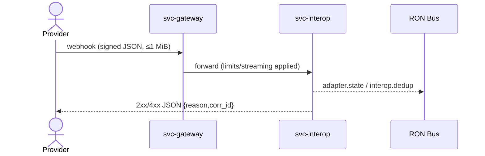
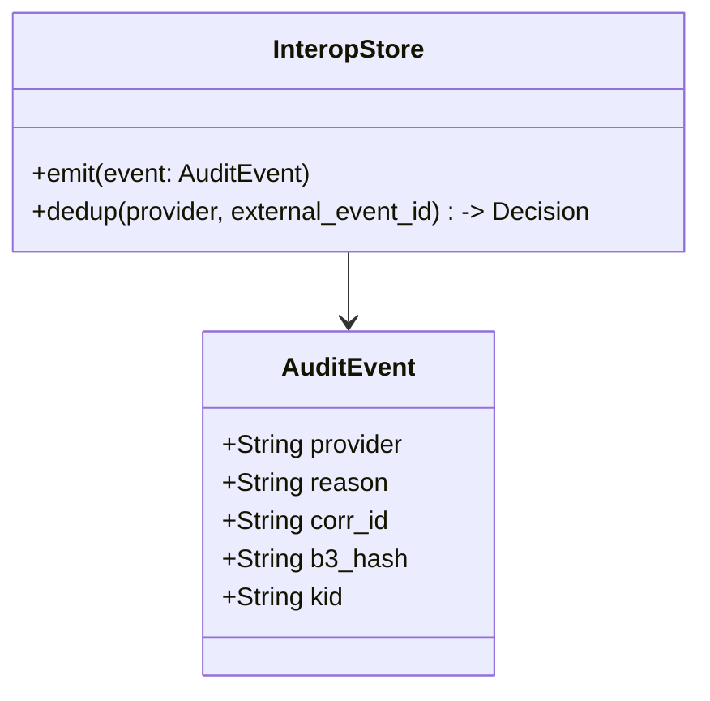
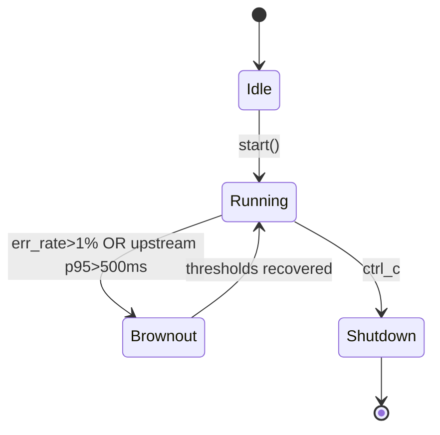

---

# svc-interop

> **Role:** service
> **Owner:** Stevan White
> **Status:** draft
> **MSRV:** 1.80.0
> **Last reviewed:** 2025-10-12

Badges (optional):
[]() []() []() []()

---

## 1) Overview

**What it is (one paragraph):**
`svc-interop` is the bridge between RustyOnions and external ecosystems (REST/JSON, provider webhooks, foreign SDKs). It verifies third-party signatures **at the edge**, translates them into short-lived, least-privilege capabilities, and emits internal events without importing ambient authority. Internally, it preserves content-addressing invariants (BLAKE3-256) and enforces strict limits, streaming, and denial of unknown fields to keep the core safe even during provider brownouts.

**How it fits (RustyOnions topology):**

* **Pillar:** 12 — Economics & Wallets (policy-gated external surfaces)
* **Upstream callers:** `svc-gateway`, external providers (GitHub/Stripe/Slack), app SDKs
* **Downstream deps:** `ron-auth`/`svc-passport`, `ron-kms`, `svc-index`, `svc-storage`, `svc-mailbox`
* **Data it touches:** network ingress → internal events; no ledger truth writes
* **Security boundary:** provider signature verification only at ingress; internal IDs remain BLAKE3-based

### 1.1 High-Level Architecture (Mermaid)

```mermaid
flowchart LR
  subgraph Edge
    A[Providers: GitHub/Stripe/Slack] -->|Webhook/REST (HMAC/TLS)| G[svc-gateway]
    G -->|Forward (caps & limits)| B(svc-interop)
  end

  subgraph Core
    B -->|Mint/verify caps| P[svc-passport / ron-auth]
    B -->|Key ops & KID| K[ron-kms]
    B -->|Index/lookup| I[svc-index]
    B -->|Blobs| S[svc-storage]
    B -->|Jobs/async| M[svc-mailbox]
    B -->|/metrics + Bus| E[[Prometheus + Bus]]
  end

  style B fill:#0b7285,stroke:#083344,color:#fff
```

---

## 2) Responsibilities & Boundaries

**MUST do:**

* [ ] Verify external signatures at edge (e.g., GitHub `X-Hub-Signature-256`, Stripe `Stripe-Signature`, Slack `X-Slack-Signature` + ts).
* [ ] Translate to short-TTL macaroons/capabilities before any action.
* [ ] Enforce 1 MiB request cap; stream larger payloads in ~64 KiB chunks.
* [ ] DTOs use `#[serde(deny_unknown_fields)]`; media type `application/json; charset=utf-8`.
* [ ] Internal hashes **BLAKE3-256**; SHA-256 only for provider verification at ingress.
* [ ] Emit stable reason-coded errors, audit events, and metrics; semver bus topics.

**MUST NOT do:**

* [ ] Trust third-party sessions/tokens as ambient authority.
* [ ] Write directly to ledger truth; emit events only.
* [ ] Persist or reuse SHA-256 digests internally.
* [ ] Implement overlay/DHT logic (belongs in `svc-dht`/`svc-overlay`).

**Acceptance Gates (PROOF):**

* [ ] Unit/prop tests for idempotency, reason codes, DTO strictness, hashing policy.
* [ ] Golden metrics exported with alerts; `/healthz` & `/readyz` reflect saturation/brownout.
* [ ] Perf gate: 500 rps/instance meets p95 ≤120 ms, p99 ≤250 ms under nominal load.
* [ ] Drift gates: `cargo public-api` clean; semver-safe changes only.

---

## 3) Public Interfaces

### 3.1 Rust API (library)

*Not applicable (service).*

### 3.2 Bus RPC / Events (service)

* **Events Emitted (subset):**

  * `adapter.state.v1` — adapter lifecycle changes
  * `security.rotation.v1` — key/secret rotation notices (includes `kid`)
  * `interop.dedup.v1` — dedup decisions for external event IDs



### 3.3 HTTP (service)

* **Base URL:** `http://<host>:8080/`
* **Media Types:** `application/json; charset=utf-8`
* **Endpoints (examples):**

  * `GET /healthz` → `200 OK {"status":"ok"}`
  * `GET /readyz` → readiness (writes shed first during brownout)
  * `GET /metrics` → Prometheus text exposition
  * `POST /webhooks/:provider` → signed ingest (1 MiB cap; stream beyond; strict DTOs)

### 3.4 CLI (dev/tooling)

```bash
cargo run -p svc-interop -- --config ./svc-interop.toml
```

---

## 4) Configuration

| Variable                   | Type   |          Default | Description                            |
| -------------------------- | ------ | ---------------: | -------------------------------------- |
| `SVC_INTEROP_BIND_ADDR`    | socket |   `0.0.0.0:8080` | HTTP ingress bind                      |
| `SVC_INTEROP_METRICS_ADDR` | socket | `127.0.0.1:9909` | Prometheus bind                        |
| `SVC_INTEROP_MAX_CONNS`    | int    |            `512` | Inflight cap                           |
| `SVC_INTEROP_MAX_RPS`      | int    |            `500` | Rate limit per node                    |
| `SVC_INTEROP_BURST_RPS`    | int    |            `250` | Short-term burst                       |
| `BODY_LIMIT_BYTES`         | int    |        `1048576` | 1 MiB HTTP cap                         |
| `DECOMP_RATIO_MAX`         | float  |           `10.0` | Decompression guard                    |
| `BROWNOUT_ERRRATE_5M`      | float  |           `0.01` | Brownout threshold (5m)                |
| `UPSTREAM_P95_MS`          | int    |            `500` | Brownout on slow upstream              |
| `PQ_HYBRID_ON`             | bool   |          `false` | Enable PQ-hybrid labels/flows (see §9) |
| `KMS_ACTIVE_KID`           | string |             `""` | Active KID for provider secret         |
| `KMS_NEXT_KID`             | string |             `""` | Staged KID for dual-verify rotation    |
| `ALLOWLIST_ORIGINS`        | list   |             `""` | Optional origin allow-list             |

**Feature flags (Cargo):** workspace pins apply (`axum 0.7.x`, `tokio-rustls 0.26.x`); do not bump locally.

---

## 5) Build, Run, Test

**Build**

```bash
cargo build -p svc-interop
```

**Run**

```bash
RUST_LOG=info \
SVC_INTEROP_BIND_ADDR=0.0.0.0:8080 \
SVC_INTEROP_METRICS_ADDR=127.0.0.1:9909 \
SVC_INTEROP_MAX_CONNS=512 \
SVC_INTEROP_MAX_RPS=500 \
SVC_INTEROP_BURST_RPS=250 \
cargo run -p svc-interop -- --config ./svc-interop.toml
```

**Tests**

```bash
cargo test -p svc-interop --all-features
cargo test -p svc-interop --doc
```

**Lint & format**

```bash
cargo fmt --all
cargo clippy -p svc-interop -- -D warnings
```

**Security & deps**

```bash
cargo deny check
```

**Drift & coverage**

```bash
cargo public-api -p svc-interop
cargo llvm-cov --lcov --output-path lcov.info
```

**Bench (if provided)**

```bash
cargo bench -p svc-interop
```

---

## 6) Observability

**Endpoints:** `/metrics`, `/healthz`, `/readyz`

**Canonical Metrics**

* `request_latency_seconds{method,route}` — histogram
* `errors_total{stage,kind}` — counter
* `rejected_total{reason}` — counter (413/429/503/401/403/etc.)
* `quota_exhaustions_total` — counter
* `pq_hybrid_enabled{service}` — gauge (0/1)
* `pq_handshakes_total{algo}` — counter (labels present even if PQ disabled)

**Tracing**

* Targets: `svc-interop=info,axum=warn,tower_http=warn`
* Span fields: `request_id`, `provider`, `route`, `kid`, `reason`, `status`

---

## 7) Performance & SLOs

| Metric         |               Target | Notes                                        |
| -------------- | -------------------: | -------------------------------------------- |
| Availability   | 99.9% bridging paths | Read paths ≥99.95% during provider incidents |
| P50 latency    |              ≤ 40 ms | 500 rps/instance, intra-region steady-state  |
| P95 latency    |             ≤ 120 ms | Nominal load                                 |
| P99 latency    |             ≤ 250 ms | Nominal load                                 |
| Start-to-ready |                < 1 s | Cold start                                   |

*Repro: perf harness with flamegraph; see TESTS.md §Perf.*

---

## 8) Data & Schema

**Model**

* Internal content IDs and audit hashes use **BLAKE3-256** (`b3:<hex>`).
* SHA-256 exists **only** at ingress for provider verification and is never persisted as an ID.



**Migrations**

* HTTP/Bus surfaces follow semver discipline; breaking changes are dual-published with deprecation windows.

---

## 9) Security, PQ & Privacy

* **Threat model (STRIDE):** spoofing/replay, disclosure, DoS, tampering at ingress.
* **Key handling:** KIDs managed via `ron-kms`; support **dual-verify** rotation windows (`KMS_ACTIVE_KID` + `KMS_NEXT_KID`).
* **PQ-hybrid readiness:** when `PQ_HYBRID_ON=true`, surface `pq_hybrid_enabled{service=svc-interop}=1` and record `pq_handshakes_total{algo=ml-kem|x25519|hybrid}` for downstreams that opt-in; interop remains algorithm-agnostic for provider signature verification (edge stays HMAC/SHA-256 as required by providers).
* **PII:** logs are redacted; amnesia mode honored (no disk spill).
* **Input validation:** length/time limits, deny-lists, media type checks, decompression guard.

---

## 10) Error Taxonomy

| Code/Variant             | When it happens                         | User hint                        | Retries |
| ------------------------ | --------------------------------------- | -------------------------------- | ------- |
| `BAD_ORIGIN`             | origin not on allow-list                | configure `ALLOWLIST_ORIGINS`    | no      |
| `UNAUTH`                 | missing/invalid signature               | fix provider signing secret/ts   | no      |
| `BODY_LIMIT`             | body exceeds 1 MiB cap                  | stream or reduce size            | no      |
| `DECOMP_LIMIT`           | decompression ratio/abs cap exceeded    | compress sanely                  | no      |
| `RATE_LIMIT`             | RPS limiter engaged                     | backoff                          | yes     |
| `BACKPRESSURE`           | saturation; brownout sheds writes first | retry later                      | yes     |
| `DOWNSTREAM_UNAVAILABLE` | dependency slow/down                    | try later                        | yes     |
| `POLICY_BLOCKED`         | violates local policy                   | adjust request                   | no      |
| `MALFORMED`              | DTO parse failed (deny unknowns)        | fix schema                       | no      |
| `CLOCK_SKEW`             | signature timestamp out of window       | sync clocks / adjust skew window | no      |

*All non-2xx JSON errors: `{ "error": "<CODE>", "reason": "<kebab-case>", "corr_id": "<uuid>" }`.*

---

## 11) Concurrency Model

* **Runtime:** tokio 1.x; cancel-safe tasks; bounded queues.
* **I/O:** explicit timeouts; streaming; zero-copy `bytes::Bytes` on hot paths.
* **Channels:** bounded mpsc for jobs; broadcast bus for events.
* **Rules:** never hold a lock across `.await` in supervisory paths.



---

## 12) Compatibility & Requirements

* **Rust:** MSRV 1.80.0
* **OS:** macOS 10.15+, Linux x86_64 (CI also exercises aarch64)
* **TLS:** `tokio_rustls 0.26.x`
* **HTTP:** `axum 0.7.x`, `tower-http 0.6.x`
* **DB:** none (stateless); uses bus/storage/index services

---

## 13) Examples

Health:

```bash
curl -sS http://127.0.0.1:8080/healthz | jq .
```

GitHub-style webhook (sketch):

```bash
curl -sS -H 'X-Hub-Signature-256: sha256=<hex>' \
     -H 'Content-Type: application/json; charset=utf-8' \
     -d '{"action":"opened","issue":{"id":123}}' \
     http://127.0.0.1:8080/webhooks/github
```

---

## 14) Troubleshooting

* **413 Body too large:** enable streaming or reduce size.
* **429 Rate limit:** lower RPS or scale out once perf gate verified.
* **503 Backpressure:** check `/readyz`, queue depth; brownout may be active.
* **401/403 Signature failures:** verify provider headers/secret, timestamp skew, and scheme.
* **PQ labels missing:** ensure `PQ_HYBRID_ON=true` and metrics scrape is active.

---

## 15) Development Notes

**Project conventions**

* Axum handlers end with `.into_response()`.
* DTOs are strict: `#[serde(deny_unknown_fields)]`.
* Reuse workspace pins; no local dep bumps.

**Pre-commit quickcheck**

```bash
cargo fmt --all
cargo clippy -- -D warnings
cargo test
cargo deny check
cargo public-api -p svc-interop
```

**Test matrix (CI hint)**

* Toolchains: stable, nightly (fuzz/loom)
* Targets: x86_64-unknown-linux-gnu, aarch64-unknown-linux-gnu
* Sanitizers (nightly): `-Zsanitizer=address,leak` (if feasible)
* Fuzz: cargo-fuzz targets for webhook parsers, dedup logic
* Concurrency: Loom models for state transitions in brownout/rotation

---

## 16) Mermaid Diagrams — Policy & Tooling

Every README includes:

1. Architecture flowchart (above)
2. Sequence diagram (above)
3. State diagram (above)

**Render locally (SVG)**

```bash
npm i -g @mermaid-js/mermaid-cli
mmdc -i docs/arch.mmd -o docs/arch.svg
```

**Render via Docker**

```bash
docker run --rm -v "$PWD":/data minlag/mermaid-cli mmdc -i docs/arch.mmd -o docs/arch.svg
```

---

## 17) Roadmap & TODO

* [ ] M1 — Edge verify + capability translation + reason-coded rejects
* [ ] M2 — Provider matrix pilot (GitHub/Stripe/Slack) with dedup topic; dual-secret rotation (KID active/next)
* [ ] M3 — PQ-hybrid toggles surfaced end-to-end; metrics labels + perf baselines captured
* [ ] Hardening — fuzz targets (webhook parsers), Loom models (brownout), chaos drills (downstream slowness)

---

## 18) Changelog

See [CHANGELOG.md](./CHANGELOG.md). Record hashing policy, provider matrix, Axum pin, and PQ toggle additions.

---

## 19) License

Dual-licensed under **MIT** or **Apache-2.0**. See [LICENSE-MIT](../LICENSE-MIT) and [LICENSE-APACHE](../LICENSE-APACHE).

---

## 20) Contributing

PRs welcome! Please run fmt/clippy/tests and include:

* Updated diagrams (if topology changed)
* Docs & examples
* Bench impact (if perf-sensitive)
* Public API diff (attach `cargo public-api` output)

> Also see: `docs/IDB.md`, `INTEROP.md`, `SECURITY.md`, `PERFORMANCE.md`, `QUANTUM.md`, and `TESTS.md` for deep details.

---
