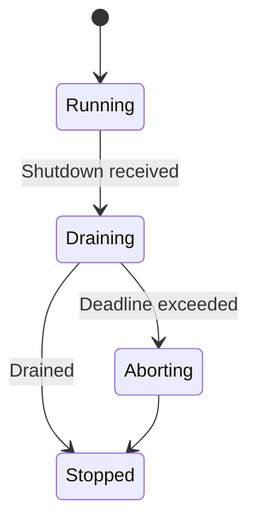
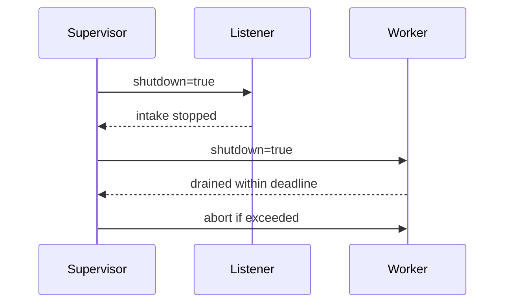

````markdown
---
title: Concurrency Model — svc-interop
crate: svc-interop
owner: Stevan White
last-reviewed: 2025-10-12
status: draft
template_version: 1.1
msrv: 1.80.0
tokio: "1.x (pinned at workspace root)"
loom: "0.7+ (dev-only)"
lite_mode: "For small library crates: fill §§1,3,4,5,10,11 and mark others N/A"
---

# Concurrency Model — svc-interop

This document makes the concurrency rules **explicit**: tasks, channels, locks, shutdown, timeouts,
and validation (property/loom/TLA+). It complements `docs/SECURITY.md`, `docs/CONFIG.md`,
and the crate’s `README.md` and `IDB.md`.

> **Golden rule:** never hold a lock across `.await` in supervisory or hot paths.

---

## 0) Lite Mode (for tiny lib crates)

N/A — `svc-interop` is a **service** crate with listeners, workers, and background tasks.

---

## 1) Invariants (MUST)

- [ ] **No lock across `.await`**. If unavoidable, split the critical section.
- [ ] **Single writer** per mutable resource; readers use snapshots or short read guards.
- [ ] **Bounded channels** only (mpsc/broadcast) with explicit overflow policy.
- [ ] **Explicit timeouts** on all I/O and RPCs; fail-fast with typed errors.
- [ ] **Cooperative cancellation**: every `.await` is cancel-safe or guarded by `select!`.
- [ ] **Graceful shutdown**: observe `Shutdown` signal; drain within deadline; abort stragglers.
- [ ] **No blocking syscalls** on the async runtime; use `spawn_blocking` if required.
- [ ] **No task leaks**: track joins; detach only with rationale.
- [ ] **Backpressure over buffering**: drop/reject with metrics; never grow unbounded queues.
- [ ] **Framing**: length-delimited/checked; handle split reads.

**Async Drop**
- [ ] Do **not** block in `Drop`. For teardown, expose an **async `close()`/`shutdown()`** API and call it before the value is dropped. `Drop` should only release cheap, non-blocking resources.

---

## 2) Runtime Topology

**Runtime:** Tokio multi-threaded runtime (worker threads = CPU cores by default; tuned at workspace root).

**Primary tasks (roles):**
- **Supervisor** — owns channel factories, spawns listeners/workers, exports `/readyz` state based on queues + SLO brownout.
- **HTTP Listener** — axum server handling:
  - public REST (`/put`, `/o/:addr`) and provider webhooks (`/webhooks/:provider`),
  - edge filters: capability translation, origin pinning, decompress/body caps, rate limiting.
  - pushes normalized jobs onto the **work queue** (bounded mpsc).
- **Worker Pool (N)** — pulls jobs from **work queue** and:
  - verifies provider signatures (edge) then computes **BLAKE3-256** for internal flows,
  - calls internal services (`svc-storage`, `svc-mailbox`, `svc-passport`) with timeouts,
  - emits **audit events** to the audit sink.
- **Metrics Exporter** — scrapes and serves Prometheus metrics on `metrics_addr`.
- **Brownout Sentinel** — samples error rate & upstream p95; toggles “bridge brownout” flag that affects `/readyz` (degrades bridging first).

**Supervision:** if a task panics, restart with exponential backoff (base 100ms, jitter, cap 5s). If >5 restarts/60s, escalate to fatal (crash-loop protection) — surfaced in `/healthz`.

```mermaid
flowchart TB
  subgraph Runtime
    SUP[Supervisor]
    L[HTTP Listener]
    W1[Worker 1]
    W2[Worker 2]
    MET[Metrics Exporter]
    BRN[Brownout Sentinel]
  end
  SUP -->|spawn| L
  SUP -->|spawn| W1
  SUP -->|spawn| W2
  SUP -->|watch Shutdown| L
  SUP -->|watch Shutdown| W1
  SUP -->|watch Shutdown| W2
  L -->|mpsc(work)| W1
  L -->|mpsc(work)| W2
  BRN -->|watch| SUP
  MET -->|serves| Prometheus
  style SUP fill:#0ea5e9,stroke:#0c4a6e,color:#fff
````

**Diagram (text):** Supervisor spawns one HTTP Listener and a pool of Workers; Listener feeds a bounded mpsc “work” queue consumed by Workers. A Brownout Sentinel updates readiness; Metrics Exporter serves Prometheus. All tasks observe a Shutdown watch channel.

---

## 3) Channels & Backpressure

**Inventory (all bounded unless noted):**

| Name          | Kind      | Capacity | Producers → Consumers      | Backpressure Policy                | Drop Semantics / Caller Effect            |
| ------------- | --------- | -------: | -------------------------- | ---------------------------------- | ----------------------------------------- |
| `events_tx`   | broadcast |     1024 | 1 → N                      | lag counter; drop oldest           | increment `bus_lagged_total`; warn        |
| `work_tx`     | mpsc      |      512 | N (Listener) → M (Workers) | `try_send` → `Busy`                | return 429/`Busy`; bump `busy_rejections` |
| `shutdown_rx` | watch     |        1 | 1 → N                      | last-write wins                    | N/A                                       |
| `audit_tx`    | mpsc      |      512 | N → 1 (sink task)*         | `try_send` → drop oldest w/ metric | increment `audit_drop_total`              |

* If `audit.sink="memory"` ring buffer is used, the sink task flushes to stdout/file only when policy allows (amnesia blocks file).

**Guidelines:**

* Prefer **`try_send` + typed Busy** over awaiting space.
* Emit `queue_depth{queue}` gauges and `queue_dropped_total{queue}` counters.
* Queue sizes track config defaults (`work=512`, `broadcast=1024`); tune via `docs/CONFIG.md`.

---

## 4) Locks & Shared State

**Allowed:**

* Short-lived `Mutex`/`RwLock` for **in-memory metadata** (policy snapshots, provider registry). No `.await` while holding guards.
* Read-mostly snapshots via `Arc<Snapshot>`; refresh snapshots using swap-on-update pattern.
* Per-connection/request state is **task-owned**; cross-task communication uses channels.

**Forbidden:**

* Holding any lock across `.await`.
* Nested locks without hierarchy.

**Hierarchy (if unavoidable):**

1. `policy_meta`
2. `routing_table`
3. `counters`

Acquire in order; release before any await point.

---

## 5) Timeouts, Retries, Deadlines

**I/O (from config defaults):** `read=5s`, `write=5s`, `idle=60s`.

**RPC to internal services:** total deadline per call; idempotent operations may retry with jittered backoff:

* backoff: 50–100 ms → 200–400 ms → 800–1600 ms (cap 2 s), max 3 tries, **only if idempotent**.
* **No** retries for non-idempotent side effects; queue to mailbox instead.

**Circuit breaker (optional):**

* Open on rolling error-rate breach; half-open with limited probes; close on success.

```mermaid
sequenceDiagram
  autonumber
  participant Client
  participant I as svc-interop
  Client->>I: Request (deadline=2s)
  I-->>Client: 202 Accepted or Busy/Timeout
  Note over I: Backpressure → Busy<br/>Deadline → typed Timeout
```

---

## 6) Cancellation & Shutdown

**Signal sources:** `KernelEvent::Shutdown`, `ctrl_c`, container stop.

**Propagation pattern:** all long-lived tasks use `tokio::select!` with `shutdown.changed()` and primary work future.

**Draining:**

* Stop new intake (Listener returns Busy/`503` for bridges during brownout/shutdown).
* Workers drain in-flight jobs within `drain_deadline` (1–5s configurable).
* After deadline, call `JoinHandle::abort()`; count `tasks_aborted_total{kind}`.



**Text:** On shutdown, service enters Draining; if deadline passes, remaining tasks are aborted; otherwise transitions to Stopped.

---

## 7) I/O & Framing

* HTTP body limits: 1 MiB hard cap; for >1 MiB, **streaming in 64 KiB chunks** with ≤2 chunks buffered.
* Decompression guard ≤10× expansion and absolute size cap; reject on overflow.
* Always call `.shutdown().await` for connection teardown.
* Verify provider signatures **at edge** (HMAC-SHA256) then compute **BLAKE3-256** for all internal addressing/audits.

---

## 8) Error Taxonomy (Concurrency-Relevant)

| Error          | When                         | Retry?     | Metric                                  | Notes                         |
| -------------- | ---------------------------- | ---------- | --------------------------------------- | ----------------------------- |
| `Busy`         | work queue full              | caller may | `busy_rejections_total{endpoint}`       | convey `Retry-After` if known |
| `Timeout`      | I/O or RPC deadline exceeded | maybe      | `io_timeouts_total{op}`                 | attach op and duration        |
| `Canceled`     | shutdown during await        | no         | `tasks_canceled_total{kind}`            | cooperative cancellation      |
| `Lagging`      | broadcast overflow           | no         | `bus_lagged_total`                      | drop oldest                   |
| `Backpressure` | brownout active              | caller may | `rejected_total{reason="BACKPRESSURE"}` | readiness degrades bridges    |

---

## 9) Metrics (Concurrency Health)

* `queue_depth{queue}` gauge; `queue_dropped_total{queue}` counter.
* `tasks_spawned_total{kind}`, `tasks_aborted_total{kind}`, `tasks_canceled_total{kind}`.
* `io_timeouts_total{op}` (`read`,`write`,`connect`).
* `backoff_retries_total{op}` with `result` labels.
* `busy_rejections_total{endpoint}`; `rejected_total{reason}`.
* `brownout_active{component="bridge"}` (0/1).

---

## 10) Validation Strategy

**Unit / Property**

* Backpressure: `try_send` → Busy, never await on full queues.
* Deadlines: per-endpoint timeout honored within tolerance.
* Lock discipline: pattern tests ensure **no awaits while holding guards** (lint + code search).

**Loom**

* Model: Producer (Listener) → bounded mpsc(work=2) → Consumer (Worker) with shutdown.
* Assertions: no deadlocks; no lost shutdown signal; at most 2 in-flight; worker eventually drains or gets canceled.

**Fuzz**

* HTTP framing & decompression fuzz (payload size, ratio, split reads).
* Provider signature base-string fuzz (Slack v0 format, GitHub sha256 prefix).

**Chaos**

* Fault injection: kill worker tasks mid-stream, slowloris on Listener, upstream 5xx bursts.
* `/readyz`: flips to brownout on sustained errors or upstream p95 breach; read paths remain available.

**TLA+ (if ordering matters)**

* Optional spec for webhook → mailbox → worker → audit; prove **safety** (no duplicate apply) and **liveness** (eventual drain under fair scheduler).

---

## 11) Code Patterns (Copy-Paste)

**Spawn + cooperative shutdown (worker skeleton)**

```rust
let (shutdown_tx, mut shutdown_rx) = tokio::sync::watch::channel(false);
let worker = tokio::spawn({
  let mut rx = work_rx;
  async move {
    loop {
      tokio::select! {
        _ = shutdown_rx.changed() => break,
        msg = rx.recv() => {
          let Some(job) = msg else { break };
          if let Err(e) = handle_job(job).await {
            tracing::warn!(error=%e, "job failed");
          }
        }
      }
    }
  }
});
// on shutdown: let _ = shutdown_tx.send(true); let _ = worker.await;
```

**Bounded mpsc with `try_send` (Busy on backpressure)**

```rust
match work_tx.try_send(job) {
  Ok(_) => {}
  Err(tokio::sync::mpsc::error::TrySendError::Full(_)) => {
    metrics::busy_rejections_total().inc();
    return Err(Error::Busy);
  }
  Err(e) => return Err(Error::from(e)),
}
```

**Deadline wrapper for RPC**

```rust
async fn with_deadline<T, F: std::future::Future<Output = T>>(
    dur: std::time::Duration, fut: F
) -> Result<T, Error> {
    tokio::time::timeout(dur, fut).await.map_err(|_| Error::Timeout)
}
```

**Lock then await (split critical section)**

```rust
let snapshot = {
  let state = state.read();           // cheap, short
  state.policy_snapshot()             // clone/Arc snapshot
}; // lock released here
apply_policy(snapshot).await;
```

**Async Drop pattern**

```rust
pub struct AuditSink { inner: Option<Handle> }

impl AuditSink {
  pub async fn close(&mut self) -> anyhow::Result<()> {
    if let Some(h) = self.inner.take() { h.shutdown().await?; }
    Ok(())
  }
}

impl Drop for AuditSink {
  fn drop(&mut self) {
    if self.inner.is_some() {
      tracing::debug!("AuditSink dropped without close(); resources reclaimed");
    }
  }
}
```

---

## 12) Configuration Hooks (Quick Reference)

* Queue capacities: `work=512`, `broadcast=1024`.
* Timeouts: `read/write=5s`, `idle=60s`.
* Brownout thresholds: error-rate 1% over 5m; upstream p95 ≥ 500ms.
* RPS limiter: `max_rps=500`, `burst=250`.
* Drain deadline: 1–5s (set in config/runbook).

Authoritative values live in `docs/CONFIG.md`.

---

## 13) Known Trade-offs / Nonstrict Areas

* **Drop-oldest vs reject-new:** For `audit_tx`, drop-oldest avoids stalling business paths; for `work_tx`, reject-new with Busy keeps latency predictable.
* **Broadcast lag:** Slow consumers may miss events; they must rely on polling state, not the broadcast channel, for truth.
* **Crash-loop escalation:** After repeated panics, we prefer **fail-fast** to flapping; relies on orchestrator to restart.

---

## 14) Mermaid Diagrams (REQUIRED)

### 14.1 Task & Queue Topology

```mermaid
flowchart LR
  IN[HTTP Listener] -->|mpsc:work(512)| W1[Worker A]
  IN -->|mpsc:work(512)| W2[Worker B]
  subgraph Control
    SHUT[Shutdown watch] --> W1
    SHUT --> W2
  end
```

**Text:** Listener feeds two workers via bounded mpsc(512); a Shutdown watch notifies both workers.

### 14.2 Shutdown Sequence



**Text:** Supervisor signals Listener to stop intake, Workers drain within deadline; stragglers are aborted.

---

## 15) CI & Lints (Enforcement)

**Clippy lints:**

* `-D clippy:await_holding_lock`
* `-D clippy:needless_collect`
* `-D clippy:useless_async`
* `-D warnings`

**GitHub Actions sketch:**

```yaml
name: concurrency-guardrails
on: [push, pull_request]
jobs:
  clippy:
    runs-on: ubuntu-latest
    steps:
      - uses: actions/checkout@v4
      - uses: dtolnay/rust-toolchain@stable
      - run: cargo clippy -p svc-interop -- -D warnings -W clippy::await_holding_lock

  loom:
    if: github.event_name == 'pull_request'
    runs-on: ubuntu-latest
    steps:
      - uses: actions/checkout@v4
      - uses: dtolnay/rust-toolchain@stable
      - run: RUSTFLAGS="--cfg loom" cargo test -p svc-interop --tests -- --ignored

  fuzz:
    runs-on: ubuntu-latest
    steps:
      - uses: actions/checkout@v4
      - uses: dtolnay/rust-toolchain@stable
      - run: cargo install cargo-fuzz
      - run: cargo fuzz build -p svc-interop
```

---

## 16) Schema Generation (Optional, Nice-to-Have)

* Use attributes/macros to annotate channels/locks and auto-emit a `docs/_generated/concurrency.mdfrag`.
* Alternatively, keep a `concurrency.rs` registry and a golden test that verifies this doc matches code.

---

## 17) Review & Maintenance

* Review this document **every 90 days** or whenever tasks/channels/locks change.
* Keep `owner`, `msrv`, `last-reviewed` current.
* PRs changing concurrency must update this file and associated Loom/property tests.

```

