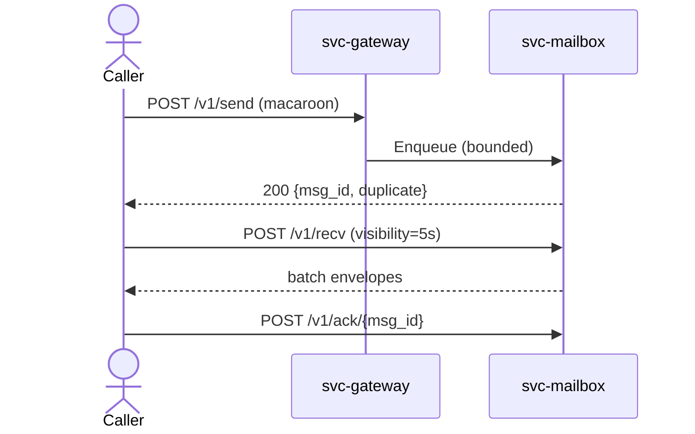
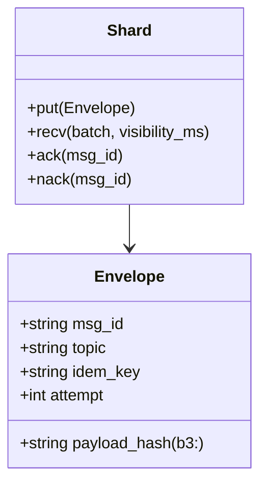
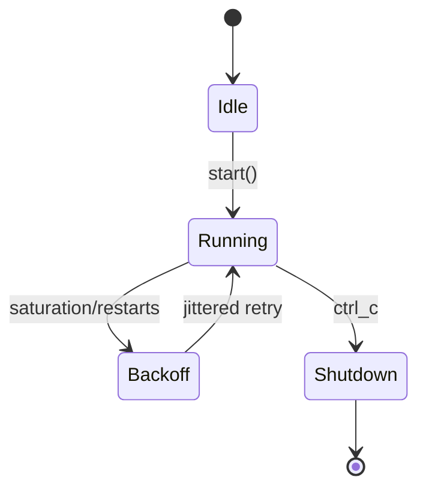

---

# svc-mailbox

> **Role:** service
> **Owner:** Stevan White
> **Status:** draft
> **MSRV:** 1.80.0
> **Last reviewed:** 2025-10-12

[](https://github.com/RustyOnions/rustyonions/actions/workflows/ci.yml)

[](#)


**Table of contents**

* [1) Overview](#1-overview)
* [2) Responsibilities & Boundaries](#2-responsibilities--boundaries)
* [3) Public Interfaces](#3-public-interfaces)
* [4) Configuration](#4-configuration)
* [5) Build, Run, Test](#5-build-run-test)
* [6) Observability](#6-observability)
* [7) Performance & SLOs](#7-performance--slos)
* [8) Data & Schema](#8-data--schema)
* [9) Security & Privacy](#9-security--privacy)
* [10) Error Taxonomy](#10-error-taxonomy)
* [11) Concurrency Model](#11-concurrency-model)
* [12) Compatibility & Requirements](#12-compatibility--requirements)
* [13) Examples](#13-examples)
* [14) Troubleshooting](#14-troubleshooting)
* [15) Development Notes](#15-development-notes)
* [16) Mermaid Diagrams — Policy & Tooling (REQUIRED)](#16-mermaid-diagrams--policy--tooling-required)
* [17) Roadmap & TODO](#17-roadmap--todo)
* [18) Changelog](#18-changelog)
* [19) License](#19-license)
* [20) Contributing](#20-contributing)

---

## 1) Overview

**What it is:**
`svc-mailbox` is the store-and-forward messaging plane for RustyOnions. It provides SEND/RECV/ACK with visibility timeouts, **at-least-once** delivery, idempotency via `(topic, idem_key, payload_hash)`, and a durable DLQ profile (Macronode). It exposes SLO-grade metrics, strict error taxonomy, and honors Global Amnesia Mode for Micronode.

**How it fits (RustyOnions topology):**

* **Pillar:** 11 — Messaging & Extensions
* **Upstream callers:** `svc-gateway` (Omnigate), SDKs; governance via `ron-policy`/`svc-registry`; auth via `svc-passport`/`ron-auth`
* **Downstream deps:** capability verifier, Prometheus scrape, optional DLQ store (Macronode)
* **Data it touches:** in-memory queues (Micronode), shard queues + DLQ (Macronode), network ingress/egress; BLAKE3 payload hash for integrity
* **Security boundary:** capability-only access; TLS 1.3; amnesia honored; no ambient authority

### 1.1 High-Level Architecture (Mermaid REQUIRED)

```mermaid
flowchart LR
  subgraph Client/Node
    A[Caller: gateway/SDK] -->|HTTP/gRPC| B(svc-mailbox)
  end

  B -->|policy/caps| C[ron-policy / svc-passport]
  B -->|DLQ (macro)| D[(dlq store)]
  B -->|Metrics| E[[Prometheus]]

  style B fill:#0b7285,stroke:#083344,color:#fff
```

*Ingress via HTTP/1.1+TLS (and gRPC/HTTP2); mailbox enqueues to per-topic shards; consumers RECV with visibility, ACK/NACK; DLQ on poison. OAP/1 invariants: frame ≤ 1 MiB; streaming chunk ≈ 64 KiB.*

---

## 2) Responsibilities & Boundaries

**MUST do (core responsibilities):**

* [ ] At-least-once delivery with visibility windows and cancel-safe ACKs
* [ ] Idempotency via `(topic, idem_key, payload_hash)`; duplicate SEND returns prior `msg_id`
* [ ] DLQ with `{reason, attempt, last_error}` and operator-guarded reprocess
* [ ] Bounded shard queues and backpressure (429/503 + Retry-After)
* [ ] Capability-only access (macaroons), strict DTOs (`deny_unknown_fields`)

**MUST NOT do (anti-scope / boundaries):**

* [ ] No ranking/business logic (lives in `svc-mod`/`svc-sandbox`)
* [ ] No DHT/overlay/storage semantics (stay Pillar-11 pure)
* [ ] No unbounded queues/retries/retention; no “exactly once” or global ordering claims

**Acceptance Gates (PROOF you did it):**

* [ ] Unit/prop tests on invariants; fuzz parsers; 24h soak zero FD leaks
* [ ] `mailbox_*`/`queue_depth`/`saturation` metrics exported; alerts wired
* [ ] `/healthz` & `/readyz` reflect real state; **writes shed first** under pressure
* [ ] Bench meets SLOs: enqueue/dequeue p95 < 35 ms intra-AZ; mixed ≥ 20k rps/node

*For full invariants and proofs, see `docs/IDB.md`, `docs/TESTS.md`, and `docs/PERFORMANCE.md`.*

---

## 3) Public Interfaces

> Keep only the subsections that apply to this crate.

### 3.2 Bus RPC / Events (service)

Mailbox emits kernel health/restart events and integrates with the broadcast bus per microkernel acceptance.



### 3.3 HTTP / gRPC (service)

* **Base URL:** `/v1`
* **Endpoints:**

  * `POST /send`
  * `POST /recv`
  * `POST /recv/stream` (NDJSON)
  * `POST /ack/{msg_id}`
  * `POST /nack/{msg_id}`
  * `POST /dlq/reprocess`
  * `GET /metrics`, `GET /healthz`, `GET /readyz`
* **Transport invariants:** OAP/1 `max_frame = 1 MiB`; streaming chunk ≈ 64 KiB; TLS via `tokio_rustls::rustls::ServerConfig`.

### 3.5 Interop quick map

* **Protocol:** HTTP/1.1 + TLS (axum 0.7); NDJSON stream for `/recv/stream`.
* **DTO invariants:** `deny_unknown_fields`; `payload_hash = b3:<hex>`.
* **OAP/1:** `max_frame = 1 MiB`; streaming chunk ≈ 64 KiB.
* **AuthZ:** macaroons (capabilities); **`KID`** header (Key ID) binds request to the active keyset.

---

## 4) Configuration

> Prefer environment variables first. Provide sane defaults.

| Variable         | Type   |              Default | Description                             |
| ---------------- | ------ | -------------------: | --------------------------------------- |
| `RON_CONFIG`     | string | `./svc-mailbox.toml` | Path to config file                     |
| `MAILBOX_LISTEN` | socket |     `127.0.0.1:9410` | Service bind                            |
| `METRICS_ADDR`   | socket |     `127.0.0.1:9600` | Prometheus/health bind                  |
| `AMNESIA`        | enum   |     `on` (Micronode) | RAM-only caches; zeroize; no disk spill |
| `VISIBILITY_MS`  | int    |               `5000` | Default visibility timeout per RECV     |
| `MAX_INFLIGHT`   | int    |               `1024` | Global inflight cap                     |

**Flags (CLI examples):**

```bash
--bind 0.0.0.0:9410
--config ./configs/svc-mailbox.toml
--max-inflight 2048
```

**Feature flags (Cargo):**

* `default = ["tokio", "serde"]`
* `tls` — enable TLS via tokio-rustls
* `otel` — optional OTEL export (traces/metrics)

---

## 5) Build, Run, Test

**Build**

```bash
cargo build -p svc-mailbox
```

**Run (service)**

```bash
RUST_LOG=info METRICS_ADDR=127.0.0.1:9600 cargo run -p svc-mailbox -- --config ./configs/svc-mailbox.toml
```

**Tests (unit/prop/docs)**

```bash
cargo test -p svc-mailbox --all-features
cargo test -p svc-mailbox --doc
```

**Lint & format**

```bash
cargo fmt --all
cargo clippy -p svc-mailbox -- -D warnings
```

**Security & deps**

```bash
cargo deny check
```

**Bench (if provided)**

```bash
cargo bench -p svc-mailbox
```

**Fuzz (examples)**

```bash
cargo fuzz run oap_frame_parser -- -max_total_time=1200
cargo fuzz run envelope_deser -- -max_total_time=900
```

**Soak / chaos**

```bash
testing/load/run_load.sh --rps 20000 --concurrency 512 --duration 1800 --p_send 0.4 --p_recv 0.2 --p_ack 0.4
RON_FAILPOINTS=recv::lease_expire=50% cargo run -p svc-mailbox -- --config ./configs/svc-mailbox.toml
```

---

## 6) Observability

**Endpoints (service):**

* `/metrics` — Prometheus exposition
* `/healthz` — liveness (fast, dependency-light)
* `/readyz` — readiness (checks critical deps; **sheds writes first** under pressure)

**Canonical Metrics (align with RustyOnions):**

* `queue_depth{queue,shard}` — backlog gauge
* `saturation{queue,shard}` — saturation gauge
* `mailbox_enqueued_total`, `mailbox_delivered_total`, `mailbox_redelivered_total`, `mailbox_visibility_timeout_total`, `mailbox_dlq_total{reason}` — counters
* `busy_rejections_total{endpoint}`, `integrity_fail_total{reason}` — counters
* `request_latency_seconds{method,route}` — histogram
* `service_restarts_total{service}` — counter
* `reorder_depth_max{shard}` — gauge (CI gate ≤ 32)

**Tracing**

* Targets: `svc_mailbox=info,axum=warn,tower_http=warn`
* Span fields: `request_id` (UUIDv7), `peer_addr`, `route`, `status`, `topic`, `shard`, `corr_id`

---

## 7) Performance & SLOs

| Metric            |                   Target | Notes                         |
| ----------------- | -----------------------: | ----------------------------- |
| Enqueue p95       |                   < 35ms | intra-region                  |
| Dequeue p95       |                   < 35ms | intra-region                  |
| Ack/Nack p95      |                   < 20ms | intra-region                  |
| Mixed throughput  |         ≥ 20k rps / node | 40% send / 20% recv / 40% ack |
| Fan-out p95 (sys) | < 2 s (10→10k followers) | mailbox share exposed         |

*Repro guidance:* payload sizes 1 KiB / 64 KiB / 512 KiB, concurrency 64–512, Poisson bursts; see `testing/load/`.

*For full targets and harness details, see `docs/PERFORMANCE.md`.*

---

## 8) Data & Schema (if applicable)

**Data model (summary)**

* Keys: `<topic>/<shard>/<msg_id>` (internal)
* Values: bincode-serialized `Envelope` with schema version and integrity fields



**Migrations**

* Version gate in header (reject older than `<min>`).
* `upgrade_vN_to_vN+1()` idempotent & reversible notes.
* DLQ reprocess is operator-gated; shard capacity and inflight ceilings are bounded (429/503 on spill).

---

## 9) Security & Privacy

* **Threat model (STRIDE):** TLS + macaroons (scoped caps); BLAKE3 payload hash/chain; deny-unknown-fields; quotas + backpressure; no ambient trust.
* **Key handling:** TLS via `tokio_rustls::rustls::ServerConfig`; **KID** (Key ID) on requests binds to the active keyset; secrets never logged.
* **PII:** avoid logging payloads/tokens; amnesia mode suppresses on-disk artifacts (Micronode).
* **AuthN/Z:** capabilities validated against `ron-policy`; tenants may enforce stricter limits (topic ACLs, shard ceilings).
* **Input validation:** length limits, timeouts, deny-lists; DTOs with `deny_unknown_fields`.
* **Supply chain:** pins to workspace deps; `cargo deny` clean.

**Post-Quantum posture (concise)**

| Milestone | Scope                                              | Default                | Telemetry                    |
| --------- | -------------------------------------------------- | ---------------------- | ---------------------------- |
| PQ-M0     | Observe peer PQ posture; expose `peer_pq{mode}`    | off                    | `peer_pq`, `downgrade_total` |
| PQ-M1     | Hybrid transport (X25519+ML-KEM) via workspace TLS | opt-in (`PQ_ONLY=off`) | `pq_handshakes_total`        |
| PQ-M2     | Hybrid signatures accept; emit verify latencies    | off                    | `sig_verify_seconds`         |
| PQ-M3     | `PQ_ONLY=on` (tenant/cluster gate)                 | opt-in                 | readiness includes PQ gating |

**Ops flags:** `PQ_ONLY={on|off}` (tenant/cluster), `PQ_TELEMETRY=on`.

---

## 10) Error Taxonomy

| Code/Variant         | When it happens                | User hint             | Retries |
| -------------------- | ------------------------------ | --------------------- | ------- |
| `AuthError::Denied`  | invalid/missing capability     | refresh token         | no      |
| `Busy::Saturated`    | shard/inflight cap reached     | backoff + Retry-After | yes     |
| `State::Conflict`    | double-ACK/NACK or stale lease | idempotent retry      | yes     |
| `Integrity::BadHash` | payload hash mismatch          | re-send               | no      |

---

## 11) Concurrency Model

* **Runtime:** tokio (1.x), cooperative tasks.
* **I/O:** `AsyncReadExt/AsyncWriteExt`, explicit timeouts.
* **Channels:** broadcast bus (cloneable), mpsc for work queues.
* **Rules:** never hold a lock across `.await` in supervisory paths; one receiver per task; single writer per connection.



---

## 12) Compatibility & Requirements

* **Rust:** MSRV 1.80.0
* **OS:** macOS 10.15+, Linux x86_64; Containers: yes
* **TLS:** `tokio_rustls::rustls::ServerConfig`
* **HTTP:** axum 0.7.x, tower-http 0.6.x
* **Protocol:** OAP/1 frame cap 1 MiB; stream chunk ≈ 64 KiB

---

## 13) Examples

**Service health:**

```bash
curl -sS http://127.0.0.1:9600/healthz
```

**Send:**

```bash
curl -sS -H "Authorization: Bearer <cap>" \
  -H "Content-Type: application/json" \
  -d '{"topic":"user:42:inbox","idem_key":"demo-1","payload_b64":"SGk="}' \
  http://127.0.0.1:9410/v1/send | jq .
```

**Recv (batch):**

```bash
curl -sS -H "Authorization: Bearer <cap>" \
  -d '{"topic":"user:42:inbox","batch":32,"visibility_ms":5000}' \
  http://127.0.0.1:9410/v1/recv | jq .
```

---

## 14) Troubleshooting

* **Port already in use:** change `--bind` or `MAILBOX_LISTEN`.
* **TLS errors:** ensure tokio-rustls config matches certs; don’t use `rustls::ServerConfig` directly.
* **Sled permission:** verify directory exists & writable (Macronode DLQ mode).
* **High latency:** check CPU throttling, `RUST_LOG` spam, or missing `--release`; inspect `saturation{}` and `busy_rejections_total`.
* **DLQ growth:** inspect `mailbox_dlq_total{reason}`; reprocess via guarded endpoint.

---

## 15) Development Notes

**Project conventions (RustyOnions):**

* Axum handlers end with `.into_response()`.
* Re-export crate surface in `lib.rs` where applicable: `Bus`, `KernelEvent`, `Metrics`, `HealthState`, `Config`, `wait_for_ctrl_c()`.
* Transport TLS uses `tokio_rustls::rustls::ServerConfig`.
* OAP constants are global: `max_frame = 1 MiB`, streaming chunk ≈ 64 KiB; BLAKE3 addressing.

**Pre-commit quickcheck**

```bash
cargo fmt --all
cargo clippy -- -D warnings
cargo test
cargo deny check
```

---

## 16) Mermaid Diagrams — Policy & Tooling (REQUIRED)

Every README must include at least:

1. One **architecture** (flowchart) diagram
2. One **sequence** diagram for a common path
3. One **state** diagram if the crate has lifecycle/actors

**Authoring tips**

* Prefer concise node labels (`crate::module`).
* Theme: default. Avoid color overload; highlight only the subject node.

**Render locally (SVG)**

```bash
npm i -g @mermaid-js/mermaid-cli
mmdc -i docs/arch.mmd -o docs/arch.svg
```

**Render via Docker (no Node install)**

```bash
docker run --rm -v "$PWD":/data minlag/mermaid-cli mmdc -i docs/arch.mmd -o docs/arch.svg
```

**CI (GitHub Actions snippet)**

```yaml
name: render-mermaid
on: [push, pull_request]
jobs:
  mmdc:
    runs-on: ubuntu-latest
    steps:
      - uses: actions/checkout@v4
      - run: npm i -g @mermaid-js/mermaid-cli
      - run: |
          mkdir -p docs
          for f in $(git ls-files '*.mmd'); do
            out="${f%.mmd}.svg"
            mmdc -i "$f" -o "$out"
          done
```

---

## 17) Roadmap & TODO

* [ ] Bronze → Silver → Gold acceptance (coverage/fuzz/chaos).
* [ ] PQ M1: posture telemetry + `PQ_ONLY` gate; M2: hybrid by default.
* [ ] Multi-AZ scaling & DLQ reprocess runbooks.

---

## 18) Changelog

See [CHANGELOG.md](./CHANGELOG.md). Follow SemVer; document breaking changes with migration notes.

---

## 19) License

Dual-licensed under **MIT** or **Apache-2.0**. See [LICENSE-MIT](../LICENSE-MIT) and [LICENSE-APACHE](../LICENSE-APACHE).

---

## 20) Contributing

PRs welcome! Please run fmt/clippy/tests and include:

* Updated diagrams (if topology changed)
* Docs & examples
* Bench impact (if perf-sensitive)
* Invariant proofs (tests/metrics/runbook) linked to I-rules

> Also see the crate docs in `docs/` (IDB, TESTS, CONFIG, OBSERVABILITY, SECURITY, INTEROP, PERFORMANCE, QUANTUM).

---
