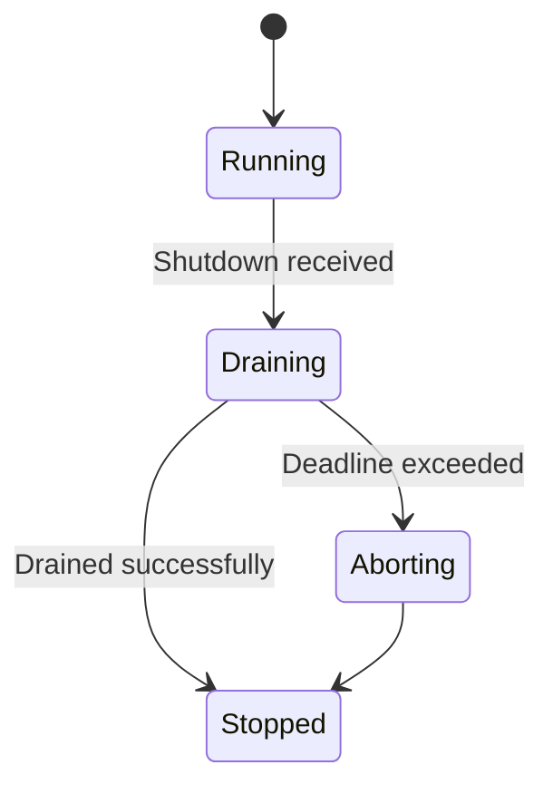
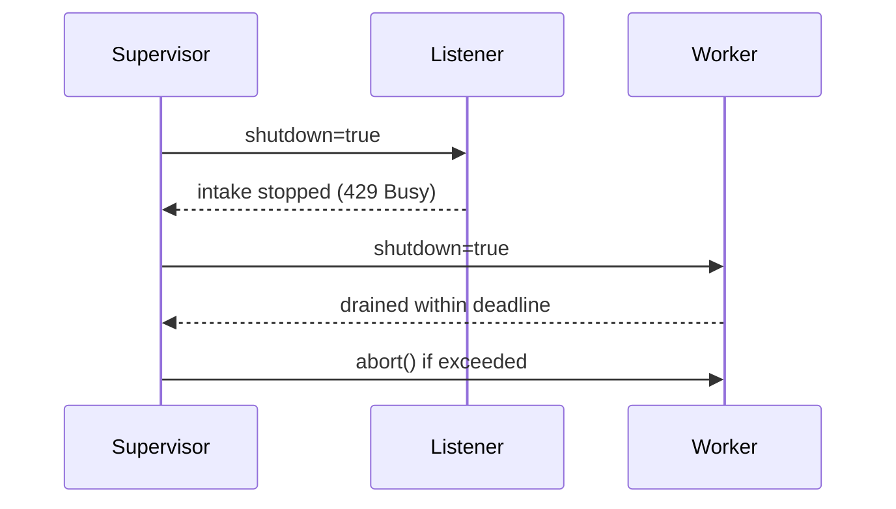

````markdown
---
title: Concurrency Model — svc-mailbox
crate: svc-mailbox
owner: Stevan White
last-reviewed: 2025-10-12
status: draft
template_version: 1.1
msrv: 1.80.0
tokio: "1.x (pinned at workspace root)"
loom: "0.7+ (dev-only)"
lite_mode: "N/A (service crate)"
---

# Concurrency Model — svc-mailbox

This document makes the concurrency rules **explicit**: tasks, channels, locks, shutdown, timeouts,
and validation (property/loom/TLA+). It complements `docs/SECURITY.md`, `docs/CONFIG.md`,
and the crate’s `README.md` and `IDB.md`.

> **Golden rule:** never hold a lock across `.await` in supervisory or hot paths.

---

## 0) Lite Mode (for tiny lib crates)

**N/A** — `svc-mailbox` is a service with background tasks.

---

## 1) Invariants (MUST)

- **No lock across `.await`.** Split critical sections; clone/snapshot state before awaiting.
- **Single writer per mutable resource.** Readers use snapshots or short-lived read guards.
- **Bounded channels only.** All mpsc/broadcast queues have explicit capacities & overflow policy.
- **Explicit timeouts/deadlines on all I/O.** Fail-fast with typed errors.
- **Cooperative cancellation.** Every `.await` is cancel-safe or guarded with `select!`.
- **Graceful shutdown.** Observe `Shutdown` signal; stop intake; drain within deadline; abort stragglers.
- **No blocking syscalls on async runtime.** Use `spawn_blocking` when unavoidable.
- **No task leaks.** Track join handles; detach only with rationale.
- **Backpressure over buffering.** Reject/drop with metrics; never grow unbounded queues.
- **Framing correctness.** Length-delimited, size-checked; handle split reads; verify checksums per IDB.
- **Async Drop discipline.** Don’t block in `Drop`; expose `async close()/shutdown()`.

---

## 2) Runtime Topology

**Runtime:** Tokio multi-threaded, worker threads = CPU cores (workspace default).

**Primary tasks (by responsibility):**
- **Supervisor** — boots listeners/workers; owns shutdown watch; monitors health; jittered backoff restarts.
- **HTTP Listener (Ingress)** — accepts `/v1/send`, `/v1/recv*`, `/ack`, `/nack`; pushes units to shard queues.
- **Shard Workers (pool M)** — per-shard task that dequeues, assigns visibility deadlines, emits envelopes.
- **Visibility Scanner** — requeues timed-out inflight messages using monotonic deadlines.
- **DLQ Reprocessor (optional)** — operator-triggered; moves DLQ → ready with policy/backoff.
- **Capability Cache Refresher** — trims/rotates macaroon verification cache on schedule or error spikes.
- **Metrics/Health Exporter** — serves `/metrics`, `/healthz`, `/readyz`.
- **Rebalancer (rare)** — on topology changes (e.g., shard count change), orchestrates drain + rebind.

```mermaid
flowchart TB
  subgraph Runtime
    SUP[Supervisor]
    L[HTTP Listener]
    VS[Visibility Scanner]
    DR[DLQ Reprocessor]
    M[Metrics/Health]
    CREF[Cap Cache Refresher]
    subgraph Shards
      W1[Worker Shard-0]
      W2[Worker Shard-1]
      WN[Worker Shard-N]
    end
  end
  SUP -->|spawn| L
  SUP -->|spawn| VS
  SUP -->|spawn| DR
  SUP -->|spawn| CREF
  SUP -->|spawn| M
  SUP -->|spawn| W1
  SUP -->|spawn| W2
  SUP -->|spawn| WN
  L -->|mpsc(work_tx)| Shards
  VS -->|mpsc(requeue)| Shards
  SUP -->|watch Shutdown| L & VS & DR & M & CREF & Shards
  style SUP fill:#0ea5e9,stroke:#0c4a6e,color:#fff
````

**Text alt:** Supervisor spawns Listener, Visibility Scanner, DLQ Reprocessor, Cap Cache Refresher, Metrics/Health, and per-shard Workers. Listener feeds bounded `work_tx` into shard workers. Scanner requeues expired inflight into the shard mpsc. All tasks subscribe to a shutdown watch channel.

---

## 3) Channels & Backpressure

**Inventory (all bounded):**

| Name                | Kind      |                     Capacity | Producers → Consumers | Backpressure Policy                    | Drop/Reject Semantics                               |
| ------------------- | --------- | ---------------------------: | --------------------- | -------------------------------------- | --------------------------------------------------- |
| `work_tx[shard]`    | mpsc      |     `mailbox.shard_capacity` | Listener,Requeue → W  | `try_send` else `Busy`                 | HTTP 429 + `Retry-After`; `busy_rejections_total++` |
| `requeue_tx[shard]` | mpsc      | `min(512, shard_capacity/4)` | Scanner → W           | `try_send`; if full, exponential retry | Scanner counts `requeue_backoff_total++`            |
| `events_tx`         | broadcast |                         1024 | W → N (obs/mod)       | Drop oldest; `bus_lagged_total++`      | Loss-tolerant (telemetry/async signals only)        |
| `shutdown_rx`       | watch     |                            1 | Supervisor → N        | Last-write-wins                        | N/A                                                 |
| `reproc_tx`         | mpsc      |                          256 | Operator → DR         | `try_send` → `Busy`                    | Operator-visible `reproc_queue_full` warning        |

**Guidelines**

* Prefer `try_send` + typed `Busy` over buffering.
* Maintain `queue_depth{queue,shard}` gauges and `queue_dropped_total{queue}` counters.
* Keep shard queues independent to avoid HOL blocking across shards.

---

## 4) Locks & Shared State

**Allowed**

* Short-lived `Mutex`/`RwLock` for small metadata (no `.await` while held).
* `DashMap` / `parking_lot` for hot-path maps (e.g., dedup table, inflight index), keeping operations non-async.
* Read-mostly snapshots: `Arc<StateSnapshot>` fanned into tasks.

**Forbidden**

* Holding any lock across `.await`.
* Nested locks without a documented hierarchy & justification.

**Hierarchy (if unavoidable)**

1. `state_meta` (config snapshot / mode flags)
2. `routing_table` (topic→shard mapping)
3. `counters` (rare, short-lived increments)

> **Inflight & Dedup:** Use non-async maps keyed by `(topic, idem_key)` and `msg_id` respectively; values store monotonic deadlines and small structs. All async I/O occurs **after** extracting needed values.

---

## 5) Timeouts, Retries, Deadlines

* **Ingress I/O:** `read=5s`, `write=5s`, `idle=60s` (overridable via config).
* **RECV deadline:** `visibility_ms ≥ visibility_ms_min` (default 5s, min 250ms).
* **Retries:** Only idempotent operations (e.g., SEND) retry with **full jitter** backoff:
  `sleep(rand(0, min(backoff_max, backoff_base*2^attempt)))` with defaults `base=200ms`, `max=60s`.
* **Scanner cadence:** scan buckets by nearest-deadline; wake interval adaptive (min 50ms, max 500ms).
* **Circuit breaker (optional):** open on `5xx`/timeout spike; half-open probes; never block shutdown.

```mermaid
sequenceDiagram
  autonumber
  participant Client
  participant MB as svc-mailbox
  Client->>MB: SEND (deadline=2s)
  MB-->>Client: 200 OK {msg_id, duplicate?}
  Client->>MB: RECV (visibility=5s)
  MB-->>Client: [Envelope...]
  Note over MB: On saturation → 429 Busy (Retry-After)
```

---

## 6) Cancellation & Shutdown

* **Trigger:** `KernelEvent::Shutdown` or `wait_for_ctrl_c()`.
* **Propagation:** `watch::channel<bool>` broadcasts `true`. Tasks pattern:

```rust
tokio::select! {
  _ = shutdown.changed() => break,                 // cooperative cancellation
  Some(job) = work_rx.recv() => { handle(job).await; }
}
```

* **Drain strategy:**

  1. Listener stops intake (429 Busy).
  2. Workers stop pulling new jobs, finish in-flight up to `drain_deadline` (configurable 1–5s).
  3. Scanner halts; DLQ reprocessor halts.
  4. After deadline, supervisor `abort()`s stragglers; count `tasks_aborted_total{kind}`.



---

## 7) I/O & Framing

* **HTTP:** OpenAPI 3.1 endpoints (`/v1/send`, `/v1/recv`, `/v1/recv/stream`, `/ack`, `/nack`); payloads base64; DTOs `#[serde(deny_unknown_fields)]`.
* **OAP/1 framed (gRPC/Proto):** Size-limited frames `≤ 1 MiB`; stream chunks ≈ 64 KiB; verify `payload_hash` & `hash_chain` on egress/ingress per IDB.
* **Async I/O discipline:** Use `AsyncReadExt/AsyncWriteExt`; always `.shutdown().await` sockets in success/error.

---

## 8) Error Taxonomy (Concurrency-Relevant)

| Error       | When                          | Retry?    | Metric                            | Notes                             |
| ----------- | ----------------------------- | --------- | --------------------------------- | --------------------------------- |
| `Busy`      | shard mpsc full               | yes (cap) | `busy_rejections_total{endpoint}` | include `Retry-After`             |
| `Timeout`   | read/write/visibility expired | maybe     | `io_timeouts_total{op}`           | attach op (`read`,`write`,`recv`) |
| `Canceled`  | shutdown during await         | no        | `tasks_canceled_total{kind}`      | cooperative                       |
| `Lagging`   | broadcast overflow            | no        | `bus_lagged_total`                | slow consumer only (non-critical) |
| `Integrity` | hash/check failure            | no        | `integrity_fail_total{reason}`    | push to DLQ after max_attempts    |

---

## 9) Metrics (Concurrency Health)

* **Queues:** `queue_depth{queue,shard}` (gauge), `queue_dropped_total{queue}` (counter).
* **Tasks:** `tasks_spawned_total{kind}`, `tasks_aborted_total{kind}`, `tasks_canceled_total{kind}`.
* **Backpressure:** `busy_rejections_total{endpoint}`, `saturation{queue,shard}` (0..1 gauge).
* **Timing:** `request_latency_seconds{op}` histograms; `scanner_wake_jitter_ms` summary.
* **Retries:** `backoff_retries_total{op}`; `requeue_backoff_total`.
* **Ordering:** `reorder_depth_max{shard}` gauge (asserted ≤ 32 in CI).

---

## 10) Validation Strategy

**Unit / Property**

* Backpressure: `try_send` → `Busy` with metrics.
* Deadlines: visibility expiry returns to ready within tolerance (±50ms drift).
* Idempotency under concurrency: multiple producers hitting same `(topic, idem_key)` → one effective delivery.

**Loom (dev-only)**

* Model: Producer → bounded mpsc → Worker; Shutdown watch races with recv/ack.
* Asserts: no deadlock; no missed shutdown; no double-ACK; reappearance after visibility expiry.

**Fuzz**

* Envelope decoder/encoder: boundary sizes; malformed attrs; oversize frames (expect 413/400).
* Integrity: random bit flips trigger `E_INTEGRITY` path.

**Chaos**

* Kill workers mid-RECV: message returns after visibility; no loss without DLQ trace.
* Saturation storm: Listener returns 429 with `Retry-After`; queues never exceed capacity.

**(Optional) TLA+**

* Safety: no lost messages (unless DLQ), at-least-once delivery invariant.
* Liveness: eventually delivered or DLQ’d under fair scheduling.

---

## 11) Code Patterns (Copy-Paste)

**Bounded mpsc with `try_send` + metrics**

```rust
match work_tx.try_send(job) {
  Ok(_) => {},
  Err(tokio::sync::mpsc::error::TrySendError::Full(_)) => {
    metrics::busy_rejections_total().with_label_values(&["/v1/send"]).inc();
    return Err(Error::Busy);
  }
  Err(e) => return Err(e.into()),
}
```

**Cancel-safe worker loop**

```rust
async fn worker(mut rx: mpsc::Receiver<Job>, mut shutdown: watch::Receiver<bool>) {
  loop {
    tokio::select! {
      _ = shutdown.changed() => break,
      maybe_job = rx.recv() => match maybe_job {
        None => break, // channel closed
        Some(job) => if let Err(err) = handle_job(job).await {
          tracing::warn!(%err, "job failed");
        }
      }
    }
  }
}
```

**No lock across `.await`**

```rust
// Acquire, compute, release before awaiting:
let (deadline, key) = {
  let s = state.lock();
  (s.next_deadline(), s.route_key.clone())
};
requeue_after(deadline, key).await;
```

**Timeout wrapper**

```rust
let frame = tokio::time::timeout(cfg.read_timeout, read_frame(&mut io)).await
  .map_err(|_| Error::Timeout("read"))??;
```

**Async Drop protocol**

```rust
pub struct MailboxClient { conn: Option<Conn> }

impl MailboxClient {
  pub async fn close(&mut self) -> anyhow::Result<()> {
    if let Some(mut c) = self.conn.take() { c.shutdown().await?; }
    Ok(())
  }
}
impl Drop for MailboxClient {
  fn drop(&mut self) {
    if self.conn.is_some() {
      tracing::debug!("MailboxClient dropped without close(); resources will be reclaimed");
    }
  }
}
```

---

## 12) Configuration Hooks (Quick Reference)

Core knobs affecting concurrency (see CONFIG.md):

* `mailbox.ready_shards`, `mailbox.shard_capacity`, `mailbox.global_inflight`
* `mailbox.visibility_ms_min`, `mailbox.default_visibility`
* `mailbox.t_replay`, `mailbox.max_attempts`
* `mailbox.backoff_base`, `mailbox.backoff_max`
* `max_conns`, `read_timeout`, `write_timeout`, `idle_timeout`
* `drain_deadline` (if exposed), `cap_cache_ttl`

---

## 13) Known Trade-offs / Nonstrict Areas

* **Drop vs Reject:** We **reject new** on shard queues (HTTP 429) rather than drop in-queue work. Broadcast telemetry drops oldest (loss-tolerant).
* **Ordering:** Best-effort FIFO **per shard**; failover may reorder; CI enforces bounded reorder depth (≤ 32).
* **Scanner Jitter:** To avoid thundering-herd wakeups, scanner cadence is jittered; may delay reappearance by ≤ 100ms under light load.

---

## 14) Mermaid Diagrams (REQUIRED)

### 14.1 Task & Queue Topology

```mermaid
flowchart LR
  IN[HTTP Ingress] -->|mpsc work(cap=shard_capacity)| W0[Worker S0]
  IN -->|mpsc work(cap=shard_capacity)| W1[Worker S1]
  IN -->|mpsc work(cap=shard_capacity)| WN[Worker SN]
  RQ[Visibility Scanner] -->|mpsc requeue| W0 & W1 & WN
  SH[Shutdown watch] --> W0 & W1 & WN & IN & RQ
```

**Alt text:** Ingress feeds multiple shard workers via bounded mpsc; Scanner requeues; Shutdown watch notifies all.

### 14.2 Shutdown Sequence



---

## 15) CI & Lints (Enforcement)

* **Clippy:** `-D warnings`, `-W clippy::await_holding_lock`, `-W clippy::useless_async`, `-W clippy::needless_collect`.
* **Tests:** Property tests for backpressure, visibility, idempotency; loom tests behind `--cfg loom` (marked `#[ignore]` by default).
* **Chaos job:** under load, kill a worker and assert at-least-once + reappearance.
* **Golden metric check:** ensure required gauges/counters exist (`queue_depth`, `busy_rejections_total`, `reorder_depth_max`).

**GitHub Actions (sketch):**

```yaml
- run: cargo clippy -p svc-mailbox -- -D warnings -W clippy::await_holding_lock
- run: RUSTFLAGS="--cfg loom" cargo test -p svc-mailbox --tests -- --ignored
- run: cargo fuzz build -p svc-mailbox
```

---

## 16) Schema Generation (Optional)

Annotate channels/locks for doc generation, or maintain a `concurrency.rs` registry verified by a golden unit test.

---

## 17) Review & Maintenance

* **Cadence:** review on any change to tasks/channels/locks or every 90 days.
* **Keep header fresh:** `owner`, `msrv`, `last-reviewed`.
* **PR checklist:** update this file + add/adjust property/loom tests whenever concurrency code changes.

```
```
