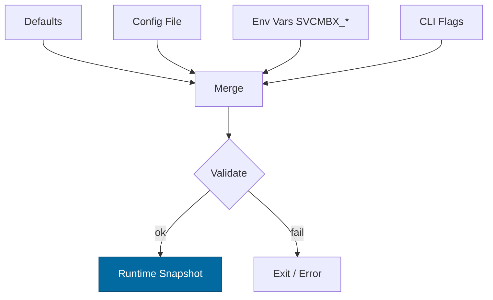

---

````markdown
---
title: Configuration — svc-mailbox
crate: svc-mailbox
owner: Stevan White
last-reviewed: 2025-10-12
status: draft
template_version: 1.0
---

# Configuration — svc-mailbox

This document defines **all configuration** for `svc-mailbox`, including sources,
precedence, schema (types/defaults), validation, feature flags, live-reload behavior,
and security implications. It complements `README.md`, `docs/IDB.md`, and `docs/SECURITY.md`.

> **Service crate:** all sections apply (network, readiness, observability, etc.).
>
> **Env prefix:** `SVCMBX_`

---

## 1) Sources & Precedence (Authoritative)

Configuration may come from multiple sources. **Precedence (highest wins):**

1. **Process flags** (CLI)  
2. **Environment variables** (`SVCMBX_*`)  
3. **Config file** (e.g., `Config.toml` beside the binary)  
4. **Built-in defaults** (hard-coded)

When reloading dynamically, the effective config is recomputed under the same precedence.

**Supported file formats:** TOML (preferred), JSON (optional).  
**Path resolution order for `--config` (if relative):** `./`, `$CWD`, crate dir.

---

## 2) Quickstart Examples

### 2.1 Minimal service start

```bash
RUST_LOG=info \
SVCMBX_BIND_ADDR=0.0.0.0:8080 \
SVCMBX_METRICS_ADDR=127.0.0.1:0 \
cargo run -p svc-mailbox
````

### 2.2 Config file (TOML)

```toml
# Config.toml
bind_addr     = "0.0.0.0:8080"
metrics_addr  = "127.0.0.1:9102"
max_conns     = 2048
read_timeout  = "5s"
write_timeout = "5s"
idle_timeout  = "60s"

[log]
format = "json"   # json|text
level  = "info"   # trace|debug|info|warn|error

[tls]
enabled   = false
# cert_path = "/etc/ron/cert.pem"
# key_path  = "/etc/ron/key.pem"

[limits]
max_body_bytes       = "1MiB"   # OAP/1 frame cap
decompress_ratio_cap = 10

[uds]
# path = "/run/svc-mailbox.sock"
# allow_uids = [1000, 1001]

[auth]
# macaroon_path = "/etc/ron/caps/mailbox.macaroon"

[mailbox]
profile            = "macronode"  # micronode|macronode
ready_shards       = 16
shard_capacity     = 4096
global_inflight    = 8192
visibility_ms_min  = "250ms"
default_visibility = "5s"
max_messages       = 32
max_bytes          = "512KiB"
t_replay           = "300s"
cap_cache_ttl      = "30s"
backoff_base       = "200ms"
backoff_max        = "60s"
max_attempts       = 5

[retention]
ready_seconds   = "7d"
inflight_factor = 10         # inflight window = visibility_ms * factor
dlq_seconds     = "14d"      # ignored in micronode (ephemeral)

[amnesia]
enabled = false              # if true: RAM-only feasible paths; ephemeral DLQ

[pq]
mode = "off"                 # off|hybrid
```

### 2.3 CLI flags (override file/env)

```bash
cargo run -p svc-mailbox -- \
  --bind 0.0.0.0:8080 \
  --metrics 127.0.0.1:9102 \
  --max-conns 4096 \
  --shards 32 \
  --shard-cap 8192 \
  --global-inflight 16384 \
  --default-visibility 5s \
  --backoff-max 60s
```

---

## 3) Schema (Typed, With Defaults)

> **Durations** accept `ms`, `s`, `m`, `h`, `d`. **Sizes** accept `B`, `KiB`, `MiB`.

| Key / Env Var                                                 | Type                          | Default       | Description                                                             | Security Notes                        |
| ------------------------------------------------------------- | ----------------------------- | ------------- | ----------------------------------------------------------------------- | ------------------------------------- |
| `bind_addr` / `SVCMBX_BIND_ADDR`                              | socket                        | `127.0.0.1:0` | HTTP/ingress bind address                                               | Public binds require threat review    |
| `metrics_addr` / `SVCMBX_METRICS_ADDR`                        | socket                        | `127.0.0.1:0` | Prometheus endpoint bind                                                | Prefer localhost; scrape via gateway  |
| `max_conns` / `SVCMBX_MAX_CONNS`                              | u32                           | `1024`        | Max concurrent connections                                              | Prevents FD exhaustion                |
| `read_timeout` / `SVCMBX_READ_TIMEOUT`                        | duration                      | `5s`          | Per-request read timeout                                                | DoS mitigation                        |
| `write_timeout` / `SVCMBX_WRITE_TIMEOUT`                      | duration                      | `5s`          | Per-request write timeout                                               | DoS mitigation                        |
| `idle_timeout` / `SVCMBX_IDLE_TIMEOUT`                        | duration                      | `60s`         | Keep-alive idle shutdown                                                | Resource hygiene                      |
| `log.format` / `SVCMBX_LOG_FORMAT`                            | enum(`json`,`text`)           | `json`        | Structured logs                                                         | JSON required in prod                 |
| `log.level` / `SVCMBX_LOG_LEVEL`                              | enum                          | `info`        | `trace`..`error`                                                        | Avoid `trace` in prod                 |
| `tls.enabled` / `SVCMBX_TLS_ENABLED`                          | bool                          | `false`       | Enable TLS                                                              | Use tokio-rustls only                 |
| `tls.cert_path` / `SVCMBX_TLS_CERT_PATH`                      | path                          | `""`          | PEM cert path                                                           | Secrets on disk; perms 0600           |
| `tls.key_path` / `SVCMBX_TLS_KEY_PATH`                        | path                          | `""`          | PEM key path                                                            | Zeroize in memory                     |
| `limits.max_body_bytes` / `SVCMBX_MAX_BODY_BYTES`             | size                          | `1MiB`        | Request payload cap (OAP/1 frame cap)                                   | Zip/DECOMP guard                      |
| `limits.decompress_ratio_cap` / `SVCMBX_DECOMPRESS_RATIO_CAP` | u32                           | `10`          | Max allowed decompression ratio                                         | Zip-bomb guard                        |
| `uds.path` / `SVCMBX_UDS_PATH`                                | path                          | `""`          | Unix Domain Socket path                                                 | Dir 0700, sock 0600                   |
| `uds.allow_uids` / `SVCMBX_UDS_ALLOW_UIDS`                    | list<u32>                     | `[]`          | PEERCRED allowlist                                                      | Strict production control             |
| `auth.macaroon_path` / `SVCMBX_MACAROON_PATH`                 | path                          | `""`          | Capability token file                                                   | Never log contents                    |
| `amnesia.enabled` / `SVCMBX_AMNESIA`                          | bool                          | `false`       | Amnesia mode (RAM-only where feasible)                                  | Disables disk persistence of DLQ/etc. |
| `pq.mode` / `SVCMBX_PQ_MODE`                                  | enum(`off`,`hybrid`)          | `off`         | PQ readiness toggle                                                     | Interop risk if peers differ          |
| `mailbox.profile` / `SVCMBX_PROFILE`                          | enum(`micronode`,`macronode`) | `macronode`   | Deployment profile                                                      | Controls DLQ durability semantics     |
| `mailbox.ready_shards` / `SVCMBX_SHARDS`                      | u16                           | `8`           | Number of ready-queue shards                                            | Scale-out knob                        |
| `mailbox.shard_capacity` / `SVCMBX_SHARD_CAP`                 | u32                           | `4096`        | Max messages in a ready shard                                           | Backpressure                          |
| `mailbox.global_inflight` / `SVCMBX_GLOBAL_INFLIGHT`          | u32                           | `8192`        | Global inflight cap                                                     | Backpressure                          |
| `mailbox.visibility_ms_min` / `SVCMBX_VISIBILITY_MS_MIN`      | duration                      | `250ms`       | Minimum allowed visibility timeout                                      | IDB invariant                         |
| `mailbox.default_visibility` / `SVCMBX_VISIBILITY_DEFAULT`    | duration                      | `5s`          | Default visibility timeout                                              | Used if client omission               |
| `mailbox.max_messages` / `SVCMBX_MAX_MESSAGES`                | u16                           | `32`          | Max envelopes returned per RECV                                         | Prevents huge pulls                   |
| `mailbox.max_bytes` / `SVCMBX_MAX_BYTES`                      | size                          | `512KiB`      | Soft cap on total bytes per RECV                                        | RECV batching safety                  |
| `mailbox.t_replay` / `SVCMBX_T_REPLAY`                        | duration                      | `300s`        | Idempotency replay window                                               | IDB [I-13]                            |
| `mailbox.cap_cache_ttl` / `SVCMBX_CAP_CACHE_TTL`              | duration                      | `30s`         | Capability verification cache TTL                                       | IDB [I-15]                            |
| `mailbox.backoff_base` / `SVCMBX_BACKOFF_BASE`                | duration                      | `200ms`       | Base for exponential backoff                                            | Jitter applied                        |
| `mailbox.backoff_max` / `SVCMBX_BACKOFF_MAX`                  | duration                      | `60s`         | Max backoff clamp                                                       | IDB [P-7]                             |
| `mailbox.max_attempts` / `SVCMBX_MAX_ATTEMPTS`                | u32                           | `5`           | Attempts before DLQ                                                     | DLQ policy                            |
| `retention.ready_seconds` / `SVCMBX_RET_READY`                | duration                      | `7d`          | Ready queue retention (upper guard; normally unbounded until delivered) | Avoids unbounded growth               |
| `retention.inflight_factor` / `SVCMBX_RET_INFLIGHT_FACTOR`    | u32                           | `10`          | Inflight retention multiplier (`visibility_ms * factor`)                | Leak guard                            |
| `retention.dlq_seconds` / `SVCMBX_RET_DLQ`                    | duration                      | `14d`         | DLQ retention (ignored in micronode)                                    | Durable profile only                  |

---

## 4) Validation Rules (Fail-Closed)

On startup or reload, apply **strict validation**:

* `bind_addr`, `metrics_addr` must parse; ports <1024 require privileges.
* If `tls.enabled=true`, both `cert_path` and `key_path` must exist, readable (0600), and non-empty.
* `max_conns > 0`, `limits.max_body_bytes ≥ 1 KiB`, `limits.decompress_ratio_cap ≥ 1`.
* `mailbox.ready_shards ≥ 1`, `mailbox.shard_capacity ≥ 1`, `mailbox.global_inflight ≥ mailbox.shard_capacity`.
* `mailbox.visibility_ms_min ≥ 1ms` and `mailbox.default_visibility ≥ mailbox.visibility_ms_min`.
* `mailbox.max_messages ∈ [1, 256]`; `mailbox.max_bytes ≤ limits.max_body_bytes`.
* **Replay window:** `mailbox.t_replay ≥ (2 * mailbox.default_visibility)`.
* **Backoff:** `mailbox.backoff_max ≥ mailbox.backoff_base`.
* **Attempts:** `mailbox.max_attempts ≥ 1`.
* **Amnesia vs. profile:**

  * If `amnesia.enabled=true` and `mailbox.profile="macronode"`, **warn** and force DLQ ephemeral mode.
* **PQ mode:** if `pq.mode="hybrid"`, ensure compatible peers or feature flags; else fail closed.

**On violation:** log structured error and **exit non-zero** (service).

---

## 5) Dynamic Reload (If Supported)

**Trigger:** SIGHUP **or** bus event `ConfigUpdated { version: u64 }`.
**Non-disruptive:** log level/format, timeouts, limits, backoff, visibility, retention, cap_cache_ttl.
**Disruptive (requires rebind/reinit):** `bind_addr`, `metrics_addr`, `tls.*`, `uds.*`, shard topology changes (`ready_shards`).
**Atomicity:** Build new snapshot; swap under a mutex (no `.await` while holding locks).
**Audit:** Emit event + redacted diff (never include secrets).

---

## 6) CLI Flags (Canonical)

```
--config <path>                 # Load Config.toml (low precedence)
--bind <ip:port>                # Override bind_addr
--metrics <ip:port>             # Override metrics_addr
--max-conns <num>

--shards <u16>                  # mailbox.ready_shards
--shard-cap <u32>               # mailbox.shard_capacity
--global-inflight <u32>         # mailbox.global_inflight
--visibility-min <dur>          # mailbox.visibility_ms_min
--default-visibility <dur>      # mailbox.default_visibility
--max-messages <u16>            # mailbox.max_messages
--max-bytes <size>              # mailbox.max_bytes
--t-replay <dur>                # mailbox.t_replay
--cap-cache-ttl <dur>           # mailbox.cap_cache_ttl
--backoff-base <dur>            # mailbox.backoff_base
--backoff-max <dur>             # mailbox.backoff_max
--max-attempts <u32>            # mailbox.max_attempts

--profile <micronode|macronode> # mailbox.profile
--amnesia                       # sets amnesia.enabled=true
--pq-mode <off|hybrid>          # pq.mode

--read-timeout <dur>
--write-timeout <dur>
--idle-timeout <dur>
--tls                           # tls.enabled=true
--tls-cert <path>
--tls-key <path>
--uds <path>

--log-format <json|text>
--log-level <trace|debug|info|warn|error>
```

---

## 7) Feature Flags (Cargo)

| Feature | Default | Effect                                                               |
| ------- | ------: | -------------------------------------------------------------------- |
| `tls`   |     off | Enables tokio-rustls plumbing and `tls.*` config keys                |
| `pq`    |     off | Enables PQ-hybrid telemetries and handshake hooks (`pq.mode=hybrid`) |
| `cli`   |      on | Enables CLI parsing for the flags above                              |
| `kameo` |     off | Optional actor integration                                           |

> Cross-crate consistency required; document if a feature changes schema.

---

## 8) Security Implications

* **Public binds:** set tight caps (timeouts, body size, RPS bounds via upstream gateway).
* **TLS:** use `tokio_rustls::rustls::ServerConfig` only; key material zeroized at rest and in RAM.
* **Macaroons:** never log token contents; rotate ≤ 30 days; `cap_cache_ttl` defaults to 30s (revocation ≤ TTL).
* **Amnesia mode:** disables durable artifacts (DLQ becomes ephemeral); suitable for Micronode/dev.
* **UDS:** enforce `SO_PEERCRED`; honor `uds.allow_uids`.
* **Replay/Idempotency:** `t_replay` too short increases duplicate delivery risk; too long increases RAM use (bounded by shard capacity).

See `docs/SECURITY.md` and `docs/IDB.md` for invariants and drills.

---

## 9) Compatibility & Migration

* **Additive changes:** introduce new keys with safe defaults.
* **Renames:** keep old env var alias for ≥1 minor; log a deprecation warning.
* **Breaking changes:** bump major version; include migration steps in `CHANGELOG.md`.

**Deprecation table (keep updated):**

| Old Key              | New Key                     | Removal Target | Notes                  |
| -------------------- | --------------------------- | -------------: | ---------------------- |
| `MAILBOX_SHARDS`     | `SVCMBX_SHARDS`             |         v2.0.0 | Prefix standardization |
| `VISIBILITY_DEFAULT` | `SVCMBX_VISIBILITY_DEFAULT` |         v2.0.0 | Env prefix change      |

---

## 10) Reference Implementation (Rust)

> Minimal struct capturing this schema. Keep comments; intended for `src/config.rs`.

```rust
use std::{net::SocketAddr, path::PathBuf, time::Duration};
use serde::{Deserialize, Serialize};

#[derive(Debug, Clone, Serialize, Deserialize)]
pub struct TlsCfg {
    pub enabled: bool,
    pub cert_path: Option<PathBuf>,
    pub key_path: Option<PathBuf>,
}

#[derive(Debug, Clone, Serialize, Deserialize)]
pub struct Limits {
    #[serde(default = "default_body_bytes")]
    pub max_body_bytes: u64, // bytes
    #[serde(default = "default_decompress_ratio")]
    pub decompress_ratio_cap: u32,
}

#[derive(Debug, Clone, Serialize, Deserialize)]
pub struct LogCfg {
    #[serde(default = "default_log_format")]
    pub format: String, // "json" | "text"
    #[serde(default = "default_log_level")]
    pub level: String,  // "info" etc.
}

#[derive(Debug, Clone, Serialize, Deserialize)]
pub struct UdsCfg {
    pub path: Option<PathBuf>,
    #[serde(default)]
    pub allow_uids: Vec<u32>,
}

#[derive(Debug, Clone, Serialize, Deserialize)]
pub struct AuthCfg {
    pub macaroon_path: Option<PathBuf>,
}

#[derive(Debug, Clone, Serialize, Deserialize)]
pub struct MailboxCfg {
    #[serde(default = "default_profile")]
    pub profile: String, // "micronode" | "macronode"

    #[serde(default = "default_shards")]
    pub ready_shards: u16,
    #[serde(default = "default_shard_cap")]
    pub shard_capacity: u32,
    #[serde(default = "default_global_inflight")]
    pub global_inflight: u32,

    #[serde(with = "humantime_serde", default = "default_visibility_min")]
    pub visibility_ms_min: Duration,
    #[serde(with = "humantime_serde", default = "default_visibility")]
    pub default_visibility: Duration,

    #[serde(default = "default_max_messages")]
    pub max_messages: u16,
    #[serde(default = "default_max_bytes")]
    pub max_bytes: u64, // bytes

    #[serde(with = "humantime_serde", default = "default_t_replay")]
    pub t_replay: Duration,
    #[serde(with = "humantime_serde", default = "default_cap_cache_ttl")]
    pub cap_cache_ttl: Duration,

    #[serde(with = "humantime_serde", default = "default_backoff_base")]
    pub backoff_base: Duration,
    #[serde(with = "humantime_serde", default = "default_backoff_max")]
    pub backoff_max: Duration,

    #[serde(default = "default_max_attempts")]
    pub max_attempts: u32,
}

#[derive(Debug, Clone, Serialize, Deserialize)]
pub struct RetentionCfg {
    #[serde(with = "humantime_serde", default = "default_ready_secs")]
    pub ready_seconds: Duration,
    #[serde(default = "default_inflight_factor")]
    pub inflight_factor: u32,
    #[serde(with = "humantime_serde", default = "default_dlq_secs")]
    pub dlq_seconds: Duration,
}

#[derive(Debug, Clone, Serialize, Deserialize)]
pub struct AmnesiaCfg {
    #[serde(default)]
    pub enabled: bool,
}

#[derive(Debug, Clone, Serialize, Deserialize)]
pub struct PQCfg {
    #[serde(default = "default_pq_mode")]
    pub mode: String, // "off" | "hybrid"
}

#[derive(Debug, Clone, Serialize, Deserialize)]
pub struct Config {
    pub bind_addr: Option<SocketAddr>,    // None -> 127.0.0.1:0
    pub metrics_addr: Option<SocketAddr>, // None -> 127.0.0.1:0
    #[serde(default = "default_max_conns")]
    pub max_conns: u32,

    #[serde(with = "humantime_serde", default = "d5s")]
    pub read_timeout: Duration,
    #[serde(with = "humantime_serde", default = "d5s")]
    pub write_timeout: Duration,
    #[serde(with = "humantime_serde", default = "d60s")]
    pub idle_timeout: Duration,

    #[serde(default)]
    pub log: LogCfg,
    #[serde(default)]
    pub tls: TlsCfg,
    #[serde(default)]
    pub limits: Limits,
    #[serde(default)]
    pub uds: UdsCfg,
    #[serde(default)]
    pub auth: AuthCfg,
    #[serde(default)]
    pub mailbox: MailboxCfg,
    #[serde(default)]
    pub retention: RetentionCfg,
    #[serde(default)]
    pub amnesia: AmnesiaCfg,
    #[serde(default)]
    pub pq: PQCfg,
}

fn default_body_bytes() -> u64 { 1 * 1024 * 1024 }
fn default_decompress_ratio() -> u32 { 10 }
fn default_log_format() -> String { "json".into() }
fn default_log_level() -> String { "info".into() }
fn default_profile() -> String { "macronode".into() }
fn default_shards() -> u16 { 8 }
fn default_shard_cap() -> u32 { 4096 }
fn default_global_inflight() -> u32 { 8192 }
fn default_visibility_min() -> Duration { Duration::from_millis(250) }
fn default_visibility() -> Duration { Duration::from_secs(5) }
fn default_max_messages() -> u16 { 32 }
fn default_max_bytes() -> u64 { 512 * 1024 }
fn default_t_replay() -> Duration { Duration::from_secs(300) }
fn default_cap_cache_ttl() -> Duration { Duration::from_secs(30) }
fn default_backoff_base() -> Duration { Duration::from_millis(200) }
fn default_backoff_max() -> Duration { Duration::from_secs(60) }
fn default_max_attempts() -> u32 { 5 }
fn default_ready_secs() -> Duration { Duration::from_secs(7 * 24 * 3600) }
fn default_inflight_factor() -> u32 { 10 }
fn default_dlq_secs() -> Duration { Duration::from_secs(14 * 24 * 3600) }
fn default_pq_mode() -> String { "off".into() }
fn default_max_conns() -> u32 { 1024 }
fn d5s() -> Duration { Duration::from_secs(5) }
fn d60s() -> Duration { Duration::from_secs(60) }

impl Default for TlsCfg { fn default() -> Self { Self { enabled: false, cert_path: None, key_path: None } } }
impl Default for Limits { fn default() -> Self { Self { max_body_bytes: default_body_bytes(), decompress_ratio_cap: default_decompress_ratio() } } }
impl Default for LogCfg { fn default() -> Self { Self { format: default_log_format(), level: default_log_level() } } }
impl Default for UdsCfg { fn default() -> Self { Self { path: None, allow_uids: vec![] } } }
impl Default for AuthCfg { fn default() -> Self { Self { macaroon_path: None } } }
impl Default for MailboxCfg { fn default() -> Self { Self {
    profile: default_profile(),
    ready_shards: default_shards(),
    shard_capacity: default_shard_cap(),
    global_inflight: default_global_inflight(),
    visibility_ms_min: default_visibility_min(),
    default_visibility: default_visibility(),
    max_messages: default_max_messages(),
    max_bytes: default_max_bytes(),
    t_replay: default_t_replay(),
    cap_cache_ttl: default_cap_cache_ttl(),
    backoff_base: default_backoff_base(),
    backoff_max: default_backoff_max(),
    max_attempts: default_max_attempts(),
} } }
impl Default for RetentionCfg { fn default() -> Self { Self {
    ready_seconds: default_ready_secs(),
    inflight_factor: default_inflight_factor(),
    dlq_seconds: default_dlq_secs(),
} } }
impl Default for AmnesiaCfg { fn default() -> Self { Self { enabled: false } } }
impl Default for PQCfg { fn default() -> Self { Self { mode: default_pq_mode() } } }

impl Config {
    pub fn validate(&self) -> anyhow::Result<()> {
        // Networking/timeouts
        if self.max_conns == 0 { anyhow::bail!("max_conns must be > 0"); }
        if self.limits.max_body_bytes < 1024 { anyhow::bail!("limits.max_body_bytes too small"); }
        if self.limits.decompress_ratio_cap == 0 { anyhow::bail!("limits.decompress_ratio_cap must be >= 1"); }

        // TLS
        if self.tls.enabled {
            match (&self.tls.cert_path, &self.tls.key_path) {
                (Some(c), Some(k)) if c.exists() && k.exists() => {},
                _ => anyhow::bail!("TLS enabled but cert/key missing or unreadable"),
            }
        }

        // Mailbox invariants (IDB-aligned)
        let m = &self.mailbox;
        if m.ready_shards == 0 { anyhow::bail!("mailbox.ready_shards must be >= 1"); }
        if m.shard_capacity == 0 { anyhow::bail!("mailbox.shard_capacity must be >= 1"); }
        if m.global_inflight < m.shard_capacity {
            anyhow::bail!("mailbox.global_inflight must be >= mailbox.shard_capacity");
        }
        if m.default_visibility < m.visibility_ms_min {
            anyhow::bail!("mailbox.default_visibility must be >= mailbox.visibility_ms_min");
        }
        if m.max_messages == 0 || m.max_messages > 256 {
            anyhow::bail!("mailbox.max_messages must be in 1..=256");
        }
        if m.max_bytes > self.limits.max_body_bytes {
            anyhow::bail!("mailbox.max_bytes cannot exceed limits.max_body_bytes");
        }
        if m.t_replay < m.default_visibility * 2 {
            anyhow::bail!("mailbox.t_replay must be >= 2 * mailbox.default_visibility");
        }
        if m.backoff_max < m.backoff_base {
            anyhow::bail!("mailbox.backoff_max must be >= mailbox.backoff_base");
        }
        if m.max_attempts < 1 {
            anyhow::bail!("mailbox.max_attempts must be >= 1");
        }

        // Profile vs Amnesia
        if self.amnesia.enabled && m.profile == "macronode" {
            tracing::warn!("amnesia.enabled=true with macronode profile; DLQ will be ephemeral per policy");
        }

        // PQ mode
        if self.pq.mode != "off" && self.pq.mode != "hybrid" {
            anyhow::bail!("pq.mode must be 'off' or 'hybrid'");
        }

        Ok(())
    }
}
```

---

## 11) Test Matrix

| Scenario                                  | Expected Outcome                                              |
| ----------------------------------------- | ------------------------------------------------------------- |
| Missing `Config.toml`                     | Start with defaults; log “no config file” at `info`           |
| Invalid `bind_addr`                       | Fail fast with explicit error                                 |
| TLS enabled but keys missing              | Fail fast                                                     |
| Body over `limits.max_body_bytes`         | `413 Payload Too Large` + metric                              |
| Decompress ratio exceeded                 | `400 Bad Request` + metric                                    |
| `t_replay < 2 * default_visibility`       | Startup validation fails                                      |
| `backoff_max < backoff_base`              | Startup validation fails                                      |
| SIGHUP                                    | Non-disruptive reload for safe keys                           |
| Change `bind_addr`/`tls.*`/`ready_shards` | Disruptive reload (rebind/reinit); audit event emitted        |
| Amnesia=ON + macronode                    | Warn; DLQ operates in ephemeral mode (surfaced in metrics/UI) |

---

## 12) Mermaid — Config Resolution Flow



---

## 13) Operational Notes

* Keep **prod config under version control** (private repo or secret store).
* For containers, prefer **env vars**; mount secrets read-only; never bake macaroons.
* Observe **default porting & firewall**: expose only through the gateway where possible.
* Include this file in PR reviews whenever config changes are introduced.

```
---
