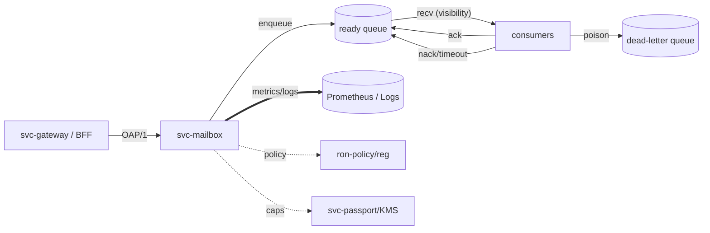

````markdown
title: RUNBOOK — svc-mailbox
owner: Stevan White
msrv: 1.80.0
last-reviewed: 2025-10-12
audience: operators, SRE, auditors

# 🛠️ RUNBOOK — svc-mailbox

## 0) Purpose
Operational manual for `svc-mailbox`: startup, health, diagnostics, failure modes, recovery, scaling, and security ops.  
This document satisfies **PERFECTION_GATES** K (Continuous Vigilance) and L (Black Swan Economics).

`svc-mailbox` provides store-and-forward messaging with **at-least-once delivery**, **idempotency keys**, **visibility timeouts**, and a **DLQ** (dead-letter queue). It is the backbone for notifications and feed fanout.

---

## 1) Overview
- **Name:** `svc-mailbox`
- **Role:** Messaging plane for app events & feed fanout (SEND/RECV/ACK with visibility); integrates with ranking/ETL services for feed hydration.
- **Criticality Tier:** **1** (critical service) — user-facing experiences depend on timely delivery.
- **Dependencies:**  
  `ron-kernel` (supervision, health, bus) · `ron-bus` (events) · `ron-metrics` (golden metrics) · `svc-gateway`/Omnigate (ingress) · `svc-mod` + `svc-sandbox` (ranking/ETL) · `svc-registry` + `ron-policy` (governance/quotas) · `svc-passport`/`ron-auth` (capabilities/KMS).
- **Ports Exposed (defaults):**
  - service listen (behind gateway/BFF): `127.0.0.1:9410`
  - metrics/health: `127.0.0.1:9600`
- **Data Flows:** OAP/1 envelopes in → enqueue → consumer RECV (visibility window) → ACK (commit) or NACK/timeout (requeue) → DLQ on poison; structured metrics/logs out.
- **Version Constraints:** Consumes the frozen APIs re-exported by `ron-kernel` (Bus, Metrics, Health). Keep DTOs strict (`deny_unknown_fields`). OAP/1 invariants: `max_frame=1 MiB`; streaming chunk ≈ 64 KiB.

---

## 2) Startup / Shutdown
### Startup
```bash
cargo run -p svc-mailbox -- --config ./configs/svc-mailbox.toml
# or
./target/release/svc-mailbox --config /etc/ron/svc-mailbox.toml
````

**Environment variables**

* `RON_CONFIG=/etc/ron/svc-mailbox.toml`
* `MAILBOX_LISTEN=127.0.0.1:9410`
* `METRICS_ADDR=127.0.0.1:9600`
* `AMNESIA=on|off` (Micronode default: on)

**Verification**

* Logs show `ready=1`.
* `curl -fsS http://127.0.0.1:9600/readyz` → `200 OK`.

### Shutdown

* `Ctrl-C` (SIGINT) → supervised, crash-only stop with jittered backoff for flapping children.
* Under drain: deny new writes first; allow in-flight visibility windows to settle; `/readyz` flips to *degraded/shed-writes* before termination.
* systemd: `systemctl stop svc-mailbox`

---

## 3) Health & Readiness

* **/healthz**: liveness (process up).
* **/readyz**: fully serving (config loaded, bus subscribed, listener bound; not in shed-writes).
* **Readiness target:** 2–5s under normal boot.
* If not ready after 10s:

  * Inspect bus for `ServiceCrashed{reason}`.
  * Check `rejected_total{reason}` and bus lag metrics.

### 3a) Golden Metrics (canonical names & labels)

Track these as **must-alert** (“golden four” + mailbox specifics):

* `requests_total{route,method,code}`
* `request_latency_seconds_bucket{route,method}` (derive p50/p95/p99)
* `inflight_requests{route}`
* `rejected_total{reason="quota|degraded|storage|auth"}`
* `queue_depth{queue,shard,kind="ready|vis|dlq"}`
* `requeued_total{queue,reason="visibility|nack|retry"}`
* `visibility_timeouts_total{queue}`
* `dlq_writes_total{queue}` / `dlq_depth{queue}`
* `bus_lagged_total{topic}` / `bus_overflow_dropped_total{topic}`
* `tls_handshake_failures_total` (if TLS at ingress)
* `integrity_fail_total{stage="ingress|egress"}`

---

## 4) Common Failure Modes

| Symptom                          | Likely Cause                         | Metric / Log Hint                                 | Resolution                                                         | Alert Threshold                                                   |          |
| -------------------------------- | ------------------------------------ | ------------------------------------------------- | ------------------------------------------------------------------ | ----------------------------------------------------------------- | -------- |
| 503 on SEND (writes)             | Quota hit or degraded readiness      | `rejected_total{reason="quota                     | degraded"}`                                                        | Increase limits or shed earlier at gateway; validate policy & DRR | >1% reqs |
| Slow RECV / high latency         | Bus lag or queue saturation          | `bus_overflow_dropped_total`, `queue_depth` ↑     | Scale consumers; add shards; tune parallelism; verify backpressure | p95 > 100ms                                                       |          |
| Duplicate deliveries             | Missing/weak idempotency key         | Repeated `idem_key` in app logs                   | Enforce idempotency at SDK and service                             | any                                                               |          |
| Messages reappear repeatedly     | Visibility timeout too short         | `requeued_total`, `visibility_timeouts_total` ↑   | Raise `visibility_ms` or reduce batch size                         | requeue > 5%                                                      |          |
| DLQ growth                       | Poison messages / permanent failures | `dlq_depth` ↑, `dlq_writes_total` ↑               | Quarantine; run DLQ reprocessor with policy                        | sustained 10m                                                     |          |
| 5xx in fanout/ranking path       | `svc-mod`/`svc-sandbox` issue        | mod/sandbox error counters; structured logs       | Trip circuit; rollback mods; sandbox resource caps                 | any                                                               |          |
| Disk-full (Macronode persistent) | Persistent queue volume full         | OS I/O alerts; `rejected_total{reason="storage"}` | Shed writes; purge DLQ per retention; add space; verify integrity  | any                                                               |          |

### 4a) Dependency Outage Matrix

| Dependency                  | What breaks               | Runbook action (quick)                                       | Fallback/Notes                             |
| --------------------------- | ------------------------- | ------------------------------------------------------------ | ------------------------------------------ |
| `svc-passport`              | New writes auth fails     | Fail-closed. Allow cached caps up to `cap_cache_ttl` (≤30s). | If TTL exhausted, shed writes with 503.    |
| `ron-bus`                   | Consumer lag / events     | Switch to degraded; pause fanout; drain writers.             | Restart bus; confirm `bus_lagged_total` ↓. |
| `svc-mod`                   | Fanout/ranking errors     | Trip circuit on mods; enqueue only; DLQ on poison.           | Roll back `svc-mod`, re-open circuit.      |
| Storage backend             | Persistent queues (macro) | Shed writes; purge DLQ per policy; provision space.          | Verify integrity gauges before re-admit.   |
| `svc-registry`/`ron-policy` | Quotas/policy reload      | Run cached policy; block reload ops; raise alert.            | Use “Emergency Policy” below.              |

---

## 5) Diagnostics

* **Logs** (structured JSON, corr_id):
  `journalctl -u svc-mailbox -f | grep corr_id=`
* **Metrics**:
  `curl -s http://127.0.0.1:9600/metrics | grep -E 'request_latency_seconds|rejected_total|dlq'`
* **Bus events**:
  `ronctl tail --topic mailbox`
* **Tracing**:
  `RUST_LOG=debug svc-mailbox`
* **Perf** (hot paths & queue ops):
  `cargo flamegraph -p svc-mailbox`

---

## 6) Recovery Procedures

1. **Quota/Policy Misfire**
   *Symptom:* bursts of 429/503.
   *Action:* confirm DRR/quotas; adjust policy; reload; verify `/readyz` stable and `rejected_total{reason="quota"}` returns to baseline in ≤2m.

2. **DLQ Surge**
   *Symptom:* `dlq_depth` rising.
   *Action:* temporarily stop writers; run DLQ reprocessor (cap-scoped); quarantine poison patterns; resume gradually.

3. **Consumer Lag**
   *Symptom:* high `requeued_total`, p95 RECV ↑.
   *Action:* scale consumers; increase shards; increase `visibility_ms`; confirm bus lag counters fall.

4. **Macronode Disk Pressure**
   *Symptom:* storage rejects; OS I/O errors.
   *Action:* drain writers; purge DLQ per retention; provision space; verify integrity gauges before re-admit.

5. **Crash Loops**
   *Symptom:* repeated restarts.
   *Action:* the kernel supervises with jitter; capture `ServiceCrashed{reason}`; widen backoff; bisect recent config; only re-admit traffic after `/readyz` steady ≥10m.

### 6a) Governance Ops (Policy & Quota lifecycle)

* **Hot reload policy**
  `ronctl policy check --svc mailbox`
  `ronctl policy reload --svc mailbox`
  Verify: `rejected_total{reason="quota"}` back to baseline within 2m.

* **Emergency Policy (brownout)**
  Apply preset “brownout-1” (temporary relaxed DRR) at ingress; note in RUNBOOK; open post-mortem task to retire within 24h.

* **Quarterly Audit (Gate K)**
  Export policy snapshot + metrics bundle to `ron-audit`. Verify cap rotation schedule and last successful rotate timestamp.

---

## 7) Backup / Restore

* **Micronode (amnesia ON):** No persistent state by default; verify zero on-disk artifacts periodically.
* **Macronode (persistent queues):** Snapshot datastore (e.g., sled dir) every 15m (hot copy).
  **Restore:** stop service → replace data dir → start service → allow re-queues/DLQ to settle → verify golden metrics.

---

## 8) Upgrades

* Drain writes (ingress sheds), allow in-flight RECV/ACK to quiesce.
* Roll one instance at a time; confirm `/readyz` = 200 and zero crash events for ≥10m.
* If DTO/envelope changes: roll SDK and service in lockstep (strict deserialization).

---

## 9) Chaos Testing

* Inject latency and consumer crashes:
  `ronctl chaos inject --target svc-mailbox --fault=latency`
  Expect: early write shedding; bounded re-queues; no DLQ explosion; alerts fire.

### 9a) Chaos Playbook (Quarterly, Gate J)

1. **Write shedding drill**
   `ronctl chaos inject --target svc-mailbox --fault=cpu --percent=60 --duration=5m`
   Expect `/readyz` → degraded; `rejected_total{reason="degraded"}` spike is brief; p95 < target+25%; recovery < 2m.

2. **Consumer crash storm**
   Kill N/2 consumers. Expect `requeued_total` ↑ but bounded (<5%/5m); `visibility_timeouts_total` not monotonic after recovery.

3. **Bus partition (Black-swan lite)**
   Drop bus for 60s. Expect steady enqueue; fanout paused; no data loss; no DLQ explosion; automatic resume.

Record all outcomes in **Review Log** (see end).

---

## 10) Scaling Notes

* **SLOs:**

  * Enqueue→dequeue **p95 < 50 ms (intra-AZ)**.
  * Feed fanout **p95 < 2 s** for 10→10k followers (mailbox + mods + gateway).
* **Vertical knobs:** `max_inflight`, worker parallelism, `visibility_ms`; keep queues bounded.
* **Horizontal:** shard by `{tenant,topic}`; add replicas; share bus; scale consumers independently.
* **Scale triggers:** `inflight_requests` > 80% capacity for ≥10m; `DLQ` > 0.5% of traffic sustained.

### 10a) Multi-AZ / Geo Guidance

* Cross-AZ budget: keep enqueue→dequeue p95 < 120 ms across two AZs; set `visibility_ms` ≥ 2× p99 processing time per region.
* Shard placement: co-locate hot shards with consumers; pin cold shards to cheaper nodes.
* Backpressure: enable shed-at-edge in gateway before mailbox hits 80% inflight.

---

## 11) Security Ops

* **Capabilities only** (macaroon-style); no ambient trust. Present caps at ingress; verify downstream as needed.
* **Log hygiene:** never log secrets; log **KID**/cap IDs only.
* **Amnesia mode:** on Micronode, RAM-only caches & timed purges; verify via metrics labeling and periodic audits.

### 11b) PQ / Crypto Ops Stub (forward-compat)

* Mailbox is crypto-neutral; capability verification path must tolerate KMS rotation and **PQ-hybrid** caps once `ron-kms` advertises ML-DSA/ML-KEM.
* Ops hook: when PQ-hybrid flag is set globally, confirm mailbox accepts dual-format caps and increments `integrity_fail_total{stage="ingress"}` for malformed PQ caps.
* Always log **KID** only; never log raw materials.

---

## 12) References

* CONFIG.md, SECURITY.md, OBSERVABILITY.md, CONCURRENCY.md, PERFORMANCE.md, API.md, INTEROP.md, IDB.md
* Blueprints: Hardening, Concurrency & Aliasing, Scaling, Omnigate, 12 Pillars, Complete Crate List

---

## ✅ Perfection Gates Checklist (ops)

* [ ] **Gate A (Metrics):** `latency_seconds`, `requests_total`, `rejected_total{reason}`, queue gauges green
* [ ] **Gate J (Chaos):** latency/kill drills pass; `/readyz` sheds writes early; recovery verified
* [ ] **Gate K (Vigilance):** alerts for DLQ growth, requeue spikes, quota rejects >1%, bus lag spikes
* [ ] **Gate N (ARM/Edge Perf):** Micronode (amnesia ON) meets local p95 SLOs
* [ ] **Gate O (Security):** caps only; amnesia honored; no plaintext secrets; KMS rotation policy enforced

---

## 13) Alert Rules (Prometheus, paste-ready)

```yaml
groups:
- name: svc-mailbox-golden
  rules:
  - alert: MailboxHighLatencyP95
    expr: histogram_quantile(0.95, sum(rate(request_latency_seconds_bucket{route="/enqueue"}[5m])) by (le)) > 0.050
    for: 10m
    labels: {severity: page}
    annotations: {summary: "svc-mailbox p95 >50ms for 10m", runbook: "RUNBOOK#10"}

  - alert: MailboxRequeueSpike
    expr: rate(requeued_total[5m]) > 0.05 * rate(requests_total{route="/recv"}[5m])
    for: 5m
    labels: {severity: page}
    annotations: {summary: "Requeue >5% sustained", runbook: "RUNBOOK#4"}

  - alert: MailboxDLQSurge
    expr: rate(dlq_writes_total[10m]) > 0.005 * rate(requests_total[10m])
    for: 10m
    labels: {severity: page}
    annotations: {summary: "DLQ >0.5% of traffic", runbook: "RUNBOOK#6"}

  - alert: MailboxQuotaRejects
    expr: rate(rejected_total{reason="quota"}[5m]) > 0.01 * rate(requests_total[5m])
    for: 10m
    labels: {severity: ticket}
    annotations: {summary: "Quota rejects >1%", runbook: "RUNBOOK#6a"}

  - alert: BusLagDetected
    expr: increase(bus_lagged_total[5m]) > 0
    for: 5m
    labels: {severity: ticket}
    annotations: {summary: "Bus lag events observed", runbook: "RUNBOOK#4"}
```

---

## 14) Architecture & Recovery Diagram (Mermaid)



---

## 15) Changelog & Review Log

**Changelog**

* **v1.1 (2025-10-12):** Add golden metrics, alert rules, dependency outage matrix, governance ops, chaos playbook, multi-AZ notes, PQ ops stub, diagram.
* **v1.0 (2025-10-12):** Initial runbook fill.

**Review Log (Gate K evidence)**

| Date (UTC) | Reviewer     | Changes                                                    | Result |
| ---------- | ------------ | ---------------------------------------------------------- | ------ |
| 2025-10-12 | Stevan White | v1.1 upgrades: alerts, chaos, governance, geo, PQ, diagram | ✅      |

```

