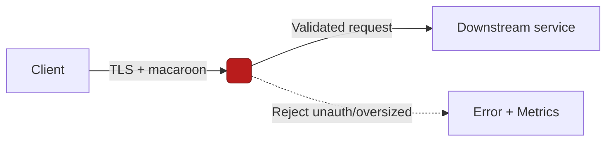

---
title: Security Notes — <CRATE_NAME>
crate: <CRATE_NAME>
owner: Stevan White
last-reviewed: YYYY-MM-DD
status: draft
---

# Security Documentation — <CRATE_NAME>

This document defines the **threat model**, **security boundaries**, and **hardening requirements** specific to `<CRATE_NAME>`.  
It complements the repo-wide [Hardening Blueprint](../../docs/Hardening_Blueprint.md) and [Interop Blueprint](../../docs/Interop_Blueprint.md).

---

## 1) Threat Model (STRIDE)

| Category | Threats | Relevant in `<CRATE_NAME>`? | Mitigation |
|----------|---------|-----------------------------|------------|
| **S**poofing | Fake identities, unauthenticated peers | Y/N | TLS (tokio-rustls), macaroon caps |
| **T**ampering | Mutated messages, DB corruption | Y/N | Content addressing (BLAKE3), checksums, CAS invariants |
| **R**epudiation | Missing/auditable logs | Y/N | Structured JSON logs, `corr_id` propagation |
| **I**nformation Disclosure | PII leakage, key exposure | Y/N | Amnesia mode, zeroize, no logs of secrets |
| **D**enial of Service | Flood, slow-loris, compression bombs | Y/N | Hard timeouts, rate limits, decompression caps:contentReference[oaicite:2]{index=2} |
| **E**levation of Privilege | Unauthorized ops | Y/N | Capability tokens (macaroons), role separation |

---

## 2) Security Boundaries

- **Inbound:** `<list API endpoints, bus topics, or CLI commands>`  
- **Outbound:** `<list downstream crates/services>`  
- **Trust Zone:** `<e.g., runs in same tenant, public-facing, or privileged>`  
- **Assumptions:**  
  - Kernel invariants hold (Bus, Metrics, Health, Config).  
  - Dependent services enforce their own `/readyz` + quotas.  
  - DB/file system is isolated per-service.  

---

## 3) Key & Credential Handling

- **Types of keys:** `<e.g., TLS certs, macaroon secrets, Ed25519 IDs>`  
- **Storage:**  
  - Sealed at rest (if applicable).  
  - In-memory only in **amnesia mode**.  
- **Rotation policy:** rotate ≤ 30 days, revocation via `<method>`:contentReference[oaicite:3]{index=3}.  
- **Zeroization:** All secrets wrapped in `zeroize::Zeroizing`.  

---

## 4) Hardening Checklist (from Blueprint)

- [ ] 5s timeout on all requests.  
- [ ] Concurrency cap: 512 inflight.  
- [ ] RPS cap: 500 (tune per service).  
- [ ] Request body cap: 1 MiB.  
- [ ] Decompression ratio ≤ 10×, absolute cap enforced.  
- [ ] UDS sockets: dir `0700`, socket `0600`, `SO_PEERCRED` allowlist.  
- [ ] No direct DB access from tools (route via service API).  
- [ ] Chaos test: restart under load; `/readyz` flips correctly.  

---

## 5) Observability for Security

- **Metrics:**  
  - `rejected_total{reason="unauth"|"decompress_cap"|"ratio_cap"}`  
  - `auth_failures_total{service="<CRATE_NAME>"}`  
  - `tls_handshake_failures_total`  
- **Logs:** Always structured (JSON); fields: `service`, `reason`, `corr_id`, `peer_addr`.  
- **Health gates:** `/readyz` fail-closed on degraded state:contentReference[oaicite:4]{index=4}.  

---

## 6) Dependencies & Supply Chain

- **External crates (security-sensitive):**  
  - `tokio-rustls` (TLS 1.3)  
  - `serde` (strict schema)  
  - `rmp-serde` (if MsgPack)  
- **Pinned versions:** workspace-root Cargo.toml.  
- **Supply chain controls:** `cargo-deny` enforced in CI.  
- **SBOM:** generated at release; stored in `/docs/sbom/`.  

---

## 7) Formal & Destructive Validation

- **Property tests:** rejection of malformed inputs.  
- **Fuzzing:** frame parsers (OAP/1) with corpus:contentReference[oaicite:5]{index=5}.  
- **Loom tests:** concurrency ordering (if applicable).  
- **Chaos tests:** kill/restart loops to assert health invariants.  
- **TLA+:** if crate is protocol-bearing, attach spec sketch.  

---

## 8) Security Contacts

- **Maintainer:** Stevan White  
- *  
- **Disclosure policy:** See repo root `SECURITY.md`.  

---

## 9) Migration & Upgrades

- **Breaking changes to auth or keys:** require a **major version bump** in CHANGELOG.md.  
- **Deprecations:** must include a migration path and explicit end-of-support window.  

---

## 10) Mermaid — Security Flow Diagram (REQUIRED)

---

