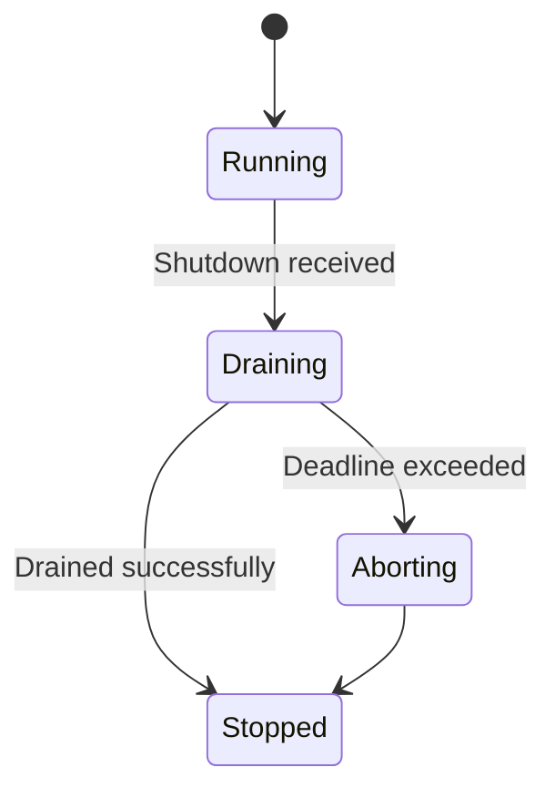
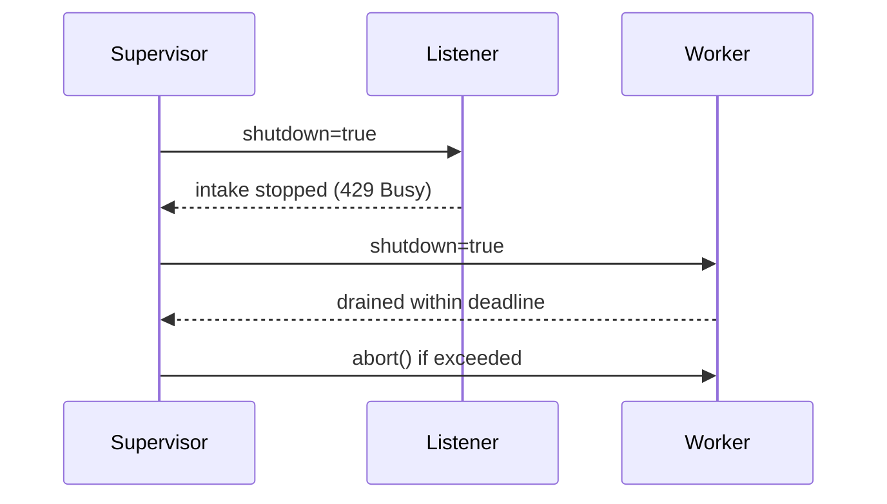
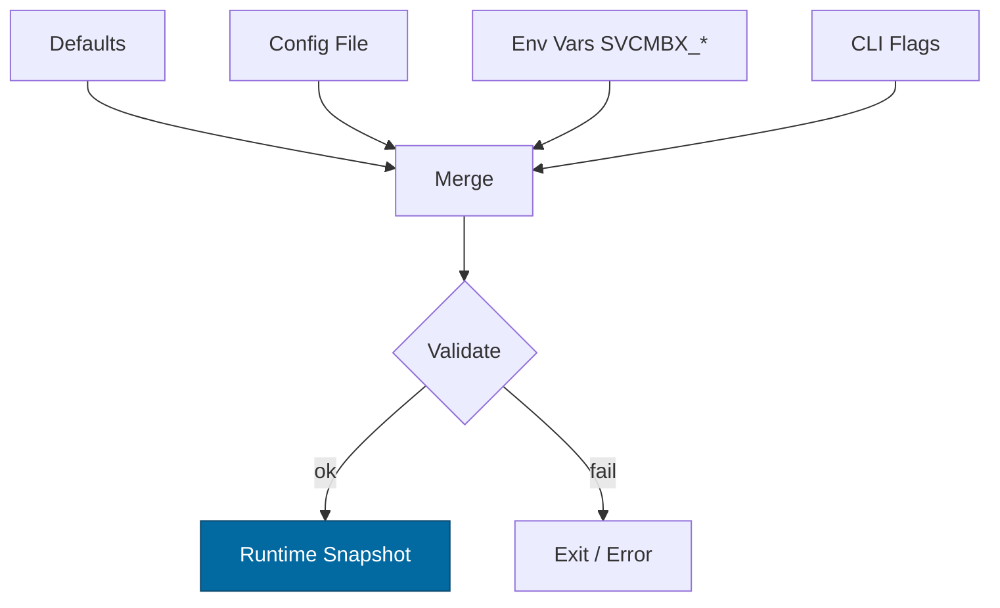
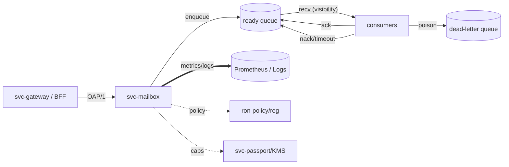

# Combined Markdown

_Source directory_: `crates/svc-mailbox/docs`  
_Files combined_: 12  
_Recursive_: 0

---

### Table of Contents

- API.MD
- CONCURRENCY.MD
- CONFIG.MD
- GOVERNANCE.MD
- IDB.md
- INTEROP.MD
- OBSERVABILITY.MD
- PERFORMANCE.MD
- QUANTUM.MD
- RUNBOOK.MD
- SECURITY.MD
- TESTS.MD

---

## API.MD
_File 1 of 12_

````markdown
---
title: API Surface & SemVer Reference — svc-mailbox
status: draft
msrv: 1.80.0
last-updated: 2025-10-12
audience: contributors, auditors, API consumers
---

# API.md — svc-mailbox

## 0. Purpose

This document is the **canonical spec** for the public API surface of `svc-mailbox`.

- Enumerates the **HTTP/REST** and **gRPC** endpoints (wire contracts).
- States **idempotency**, **auth**, **error taxonomy**, and **rate-limit/backpressure** semantics.
- Defines **SemVer** discipline for changes (what’s breaking vs. additive).
- CI-enforceable with `cargo public-api` (Rust symbol surface) and OpenAPI diff checks (wire surface).
- Aligns with `docs/IDB.md`, `docs/CONFIG.md`, and Observability/Hardening blueprints.

> `svc-mailbox` is a **service crate**. Its stable API is the **network surface**; the Rust symbol surface is deliberately minimal and **not** the primary integration target.

---

## 1. Public API Surface

### 1.1 Rust (symbol) surface — intentionally tiny

Produced by:

```bash
cargo public-api -p svc-mailbox --simplified --deny-changes
````

**Current snapshot (expected)**

```text
pub mod cfg            // configuration types (unstable)
pub fn main()          // binary entrypoint (not for embedding)
pub fn run(cfg: cfg::Config) -> Result<(), anyhow::Error>   // optional for tests
```

> Note: The Rust surface is **not** a stable SDK. Consumer integrations must use the **HTTP** or **gRPC** APIs below. If an official Rust SDK exists, it will live in a separate crate (`ron-mailbox-sdk`).

---

### 1.2 HTTP (REST) — canonical wire API

**Base URL:** `/v1`
**Auth:** `Authorization: Bearer <macaroon>` (scoped capabilities)
**Correlation:** Optional `X-Corr-Id: <uuidv7>` header; always echoed (generated if missing).
**Content Types:** `application/json` (requests and responses), `application/x-ndjson` for streaming.

#### Endpoints

1. **Enqueue (SEND)**
   `POST /v1/send`

**Request**

```json
{
  "topic": "user:42:inbox",
  "idem_key": "email-2025-10-12-01",
  "payload_b64": "eyJzdWJqZWN0IjoiSGkifQ==",
  "attrs": { "content-type": "application/json" }
}
```

**Response (default mode: 200 OK)**

```json
{ "msg_id": "01JAE6ZQX5...", "duplicate": false }
```

**Status codes**

* `200 OK` — enqueued (or duplicate acknowledged with `"duplicate": true`)
* `409 Conflict` — **optional compatibility mode** for duplicates (see header below)
* `400 Bad Request` — schema/unknown fields/invalid sizes
* `401/403` — auth/authz failure
* `413 Payload Too Large` — > 1 MiB frame
* `429 Too Many Requests` — saturation (see `Retry-After`)
* `503 Service Unavailable` — degraded

**Headers**

* `X-Corr-Id` — correlation id (request/response)
* `Retry-After` — seconds (429/503)
* `X-Idempotency-Mode` (optional request): `200-flag|409-conflict` (default `200-flag`)

2. **Receive (lease)**
   `POST /v1/recv`

**Request**

```json
{
  "topic": "user:42:inbox",
  "visibility_ms": 5000,
  "max_messages": 32,
  "max_bytes": 524288
}
```

**Response (200 OK)**

```json
{ "messages": [ { "msg_id":"01JAE6...", "topic":"user:42:inbox",
  "ts":"2025-10-12T18:02:41Z", "idem_key":"email-2025-10-12-01",
  "payload_hash":"b3:...", "attrs":{}, "corr_id":"018f1a2a-...",
  "shard":7, "attempt":1, "hash_chain":"b3:...", "sig":null } ] }
```

**Status**: `200 OK` (empty list if none), `401/403`, `429/503` on saturation/degrade.

3. **Receive (streaming)**
   `POST /v1/recv/stream` → `Content-Type: application/x-ndjson`
   Body identical to `/v1/recv` (visibility applies). Each line is a JSON `Envelope`. Ack via standard endpoints.

4. **Acknowledge**
   `POST /v1/ack/{msg_id}` → `{ "ok": true }`

* Idempotent. `404` if unknown/expired.

5. **Negative-ack (requeue with backoff)**
   `POST /v1/nack/{msg_id}` (optional JSON body `{ "reason": "transient_error" }`) → `{ "ok": true }`

6. **DLQ reprocess (operator)**
   `POST /v1/dlq/reprocess` (guarded scope)
   Body: `{ "topic": "user:42:inbox", "limit": 100 }` → moves DLQ→ready with policy.

7. **Health/Readiness/Metrics**

* `GET /healthz` → 200
* `GET /readyz` → 200 or 503 `{ "degraded": true, "missing": [...] }`
* `GET /metrics` → Prometheus exposition (usually localhost-bound)

#### Error model (JSON)

```json
{ "code": "E_SATURATED", "message": "work queue full", "corr_id": "018f1a2a-..." }
```

**Codes:** `E_SCHEMA`, `E_CAP_AUTH`, `E_CAP_SCOPE`, `E_DUPLICATE`, `E_FRAME_TOO_LARGE`, `E_SATURATED`, `E_UNAVAILABLE`, `E_INTEGRITY`.

---

### 1.3 gRPC (Proto) — efficiency path

**Service:** `ron.mailbox.v1.Mailbox`
**RPCs:**

* `Send(SendRequest) -> SendResponse`
* `Recv(RecvRequest) -> RecvResponse`
* `RecvStream(RecvRequest) -> stream Envelope`
* `Ack(AckRequest) -> AckResponse`
* `Nack(NackRequest) -> AckResponse`

**Envelope fields (subset):** `msg_id, topic, ts, idem_key, payload_hash (b3:<hex>), attrs, corr_id, shard, attempt, hash_chain, sig, payload?`

> Transport framing follows OAP/1 constraints: `max_frame=1 MiB`, chunks ≈ 64 KiB.

---

### 1.4 Authentication & Authorization

* **Bearer macaroon** with scoped caveats:

  * `op ∈ {send,recv,ack,nack,admin}`
  * `topic` or `topic_class` scope
  * `quota` (bytes/ops), `expiry`
* Revocation is honored within **`cap_cache_ttl` (default 30s)**. Fail-closed on errors.

---

### 1.5 Idempotency

* `idem_key` is **required** on `SEND`.
* Duplicate defined as **same** `(topic, idem_key, payload_hash)` within `T_replay` (default **300s**).
* Default behavior: `200 OK` with `"duplicate": true` and **same `msg_id`**.
  Compatibility mode (opt-in): `409 Conflict` + same body; signal via `X-Idempotency-Mode: 409-conflict`.

---

### 1.6 Backpressure & Rate Limits

* Ingress may respond `429 Too Many Requests` with `Retry-After` (seconds).
* `503` indicates degraded readiness; treat as retryable unless told otherwise.

---

### 1.7 Integrity

* Envelopes include `payload_hash = blake3_256(payload)` and `hash_chain = H(topic, ts, idem_key, payload_hash, attrs)`.
* Integrity failure yields **`422 Unprocessable Entity`** with `code="E_INTEGRITY"`, and the message enters DLQ after `max_attempts`.

---

### 1.8 Examples

**Enqueue (curl)**

```bash
curl -sS -X POST http://localhost:8080/v1/send \
  -H "Authorization: Bearer $MACAROON" \
  -H "Content-Type: application/json" \
  -H "X-Corr-Id: $(uuidgen)" \
  -d '{"topic":"user:42:inbox","idem_key":"email-2025-10-12-01","payload_b64":"eyJzdWJqZWN0IjoiSGkifQ=="}'
```

**Receive batch**

```bash
curl -sS -X POST http://localhost:8080/v1/recv \
  -H "Authorization: Bearer $MACAROON" \
  -H "Content-Type: application/json" \
  -d '{"topic":"user:42:inbox","visibility_ms":5000,"max_messages":32}'
```

**Ack**

```bash
curl -sS -X POST http://localhost:8080/v1/ack/01JAE6ZQX5... \
  -H "Authorization: Bearer $MACAROON"
```

**Streaming receive (NDJSON)**

```bash
curl -N -sS -X POST http://localhost:8080/v1/recv/stream \
  -H "Authorization: Bearer $MACAROON" \
  -H "Content-Type: application/json" \
  -d '{"topic":"user:42:inbox","visibility_ms":5000,"max_messages":32}'
```

---

## 2. SemVer Discipline

**Scope:** both **Rust symbol** surface and **wire** surface (HTTP/gRPC). We treat **HTTP paths, schemas, status codes**, and **gRPC service/field numbers** as the *public API*.

### 2.1 Additive (Minor / Non-Breaking)

* Adding **optional** request fields (with defaults) and **new response fields**.
* Adding **new endpoints** or **new gRPC RPCs**.
* Adding **new error codes** (with fallbacks).
* Extending enums/flags marked `#[non_exhaustive]`.
* Adding **headers** that do not change existing semantics.

### 2.2 Breaking (Major)

* Removing or renaming endpoints/fields/headers.
* Changing JSON shapes or field types; changing wire-level defaults.
* Altering status codes in a way that breaks existing clients’ logic.
* Changing gRPC field **numbers**, message names, or RPC signatures.
* Changing idempotency semantics (e.g., default 200→409) without opt-in header.

### 2.3 Patch-Level

* Documentation, examples, and observability naming (non-breaking).
* Performance improvements that don’t change external behavior.

---

## 3. Stability Guarantees

* **MSRV**: `1.80.0`.
* **Paths** prefixed with `/v1/` (major in the URL).
* **Error taxonomy** is versioned; new codes only **add**, not repurpose.
* **Unsafe Rust** not used unless documented.
* **No internal type leakage** in public Rust surface (service crate).

---

## 4. Invariants (API-facing)

* **At-least-once**: duplicates possible; **exactly-once is not promised**.
* **Best-effort FIFO per shard**; no global ordering.
* **Auth required** for all ops (no ambient trust).
* **Strict sizes**: frame ≤ **1 MiB**, deny unknown JSON fields.
* **Integrity** enforced/observable; failures yield `E_INTEGRITY`.
* **Backpressure** is explicit (`429/503` + `Retry-After`).

---

## 5. Tooling

* **Rust symbol surface**

  ```bash
  cargo public-api -p svc-mailbox --simplified --deny-changes
  ```
* **OpenAPI diff** (HTTP)

  * Source of truth: `api/openapi.yaml`
  * CI: run a spec diff (`oasdiff`, `schemathesis`) against previous release.
* **gRPC/Proto** diff

  * Source of truth: `proto/ron/mailbox/v1/mailbox.proto`
  * CI: `buf breaking` (if using Buf) or `protolock` equivalent.
* **Docs**

  * `cargo doc --no-deps -p svc-mailbox` (internal docs)
  * API snapshots in `/docs/api-history/svc-mailbox/{version}.txt`

---

## 6. CI & Gates

* PR pipeline must:

  * ✅ Run `cargo public-api` and fail on unacknowledged symbol changes.
  * ✅ Diff `api/openapi.yaml` vs previous tag; block breaking without major bump.
  * ✅ Diff `.proto` with Buf/Protolock; block breaking without major bump.
  * ✅ Ensure `CHANGELOG.md` contains an entry matching any API diff.
  * ✅ Run contract tests (Vectors in `docs/IDB.md` Appendix C).

---

## 7. Acceptance Checklist (DoD)

* [ ] **Current API snapshot** generated & stored in `/docs/api-history/svc-mailbox/<ver>.txt`.
* [ ] **OpenAPI** updated and passes CI diffs.
* [ ] **Proto** updated and passes Buf/Protolock.
* [ ] **CHANGELOG** includes surface or behavior changes.
* [ ] **Examples** (curl/SDK snippets) compile or run as part of doctests.
* [ ] **Observability** names match `OBSERVABILITY.md` (metrics/logs/spans).
* [ ] **Security**: error codes for auth/integrity present and documented.

---

## 8. Appendix

### 8.1 Error Codes (canonical)

| HTTP | Code                | Meaning                       | Client action                 |
| ---: | ------------------- | ----------------------------- | ----------------------------- |
|  400 | `E_SCHEMA`          | invalid JSON / unknown fields | fix request                   |
|  401 | `E_CAP_AUTH`        | invalid/expired token         | refresh token                 |
|  403 | `E_CAP_SCOPE`       | scope mismatch / forbidden op | request proper scope          |
|  409 | `E_DUPLICATE`       | duplicate (compat mode only)  | treat as success with same id |
|  413 | `E_FRAME_TOO_LARGE` | > 1 MiB                       | reduce payload                |
|  422 | `E_INTEGRITY`       | integrity check failed        | investigate/repair            |
|  429 | `E_SATURATED`       | backpressure                  | retry after `Retry-After`     |
|  503 | `E_UNAVAILABLE`     | degraded / not ready          | retry with backoff            |

### 8.2 Headers

* `Authorization: Bearer <macaroon>`
* `X-Corr-Id: <uuidv7>` (optional input; always output)
* `Retry-After: <seconds>` (429/503)
* `X-Idempotency-Mode: 200-flag|409-conflict` (optional request)

### 8.3 Field Shapes (summary)

**Envelope**:
`{ msg_id, topic, ts, idem_key, payload_hash, attrs, corr_id, shard, attempt, hash_chain, sig? }`

**SendRequest**:
`{ topic, idem_key, payload_b64, attrs? }`

**RecvRequest**:
`{ topic, visibility_ms, max_messages?, max_bytes? }`

---

### 8.4 References

* Rust SemVer: [https://doc.rust-lang.org/cargo/reference/semver.html](https://doc.rust-lang.org/cargo/reference/semver.html)
* cargo-public-api: [https://github.com/Enselic/cargo-public-api](https://github.com/Enselic/cargo-public-api)
* Buf (breaking checks): [https://buf.build/](https://buf.build/)

---

✅ With this API spec + CI gates, `svc-mailbox` maintains a **predictable, versioned** wire contract while allowing additive evolution without breaking existing clients.

```
```


---

## CONCURRENCY.MD
_File 2 of 12_

````markdown
---
title: Concurrency Model — svc-mailbox
crate: svc-mailbox
owner: Stevan White
last-reviewed: 2025-10-12
status: draft
template_version: 1.1
msrv: 1.80.0
tokio: "1.x (pinned at workspace root)"
loom: "0.7+ (dev-only)"
lite_mode: "N/A (service crate)"
---

# Concurrency Model — svc-mailbox

This document makes the concurrency rules **explicit**: tasks, channels, locks, shutdown, timeouts,
and validation (property/loom/TLA+). It complements `docs/SECURITY.md`, `docs/CONFIG.md`,
and the crate’s `README.md` and `IDB.md`.

> **Golden rule:** never hold a lock across `.await` in supervisory or hot paths.

---

## 0) Lite Mode (for tiny lib crates)

**N/A** — `svc-mailbox` is a service with background tasks.

---

## 1) Invariants (MUST)

- **No lock across `.await`.** Split critical sections; clone/snapshot state before awaiting.
- **Single writer per mutable resource.** Readers use snapshots or short-lived read guards.
- **Bounded channels only.** All mpsc/broadcast queues have explicit capacities & overflow policy.
- **Explicit timeouts/deadlines on all I/O.** Fail-fast with typed errors.
- **Cooperative cancellation.** Every `.await` is cancel-safe or guarded with `select!`.
- **Graceful shutdown.** Observe `Shutdown` signal; stop intake; drain within deadline; abort stragglers.
- **No blocking syscalls on async runtime.** Use `spawn_blocking` when unavoidable.
- **No task leaks.** Track join handles; detach only with rationale.
- **Backpressure over buffering.** Reject/drop with metrics; never grow unbounded queues.
- **Framing correctness.** Length-delimited, size-checked; handle split reads; verify checksums per IDB.
- **Async Drop discipline.** Don’t block in `Drop`; expose `async close()/shutdown()`.

---

## 2) Runtime Topology

**Runtime:** Tokio multi-threaded, worker threads = CPU cores (workspace default).

**Primary tasks (by responsibility):**
- **Supervisor** — boots listeners/workers; owns shutdown watch; monitors health; jittered backoff restarts.
- **HTTP Listener (Ingress)** — accepts `/v1/send`, `/v1/recv*`, `/ack`, `/nack`; pushes units to shard queues.
- **Shard Workers (pool M)** — per-shard task that dequeues, assigns visibility deadlines, emits envelopes.
- **Visibility Scanner** — requeues timed-out inflight messages using monotonic deadlines.
- **DLQ Reprocessor (optional)** — operator-triggered; moves DLQ → ready with policy/backoff.
- **Capability Cache Refresher** — trims/rotates macaroon verification cache on schedule or error spikes.
- **Metrics/Health Exporter** — serves `/metrics`, `/healthz`, `/readyz`.
- **Rebalancer (rare)** — on topology changes (e.g., shard count change), orchestrates drain + rebind.

```mermaid
flowchart TB
  subgraph Runtime
    SUP[Supervisor]
    L[HTTP Listener]
    VS[Visibility Scanner]
    DR[DLQ Reprocessor]
    M[Metrics/Health]
    CREF[Cap Cache Refresher]
    subgraph Shards
      W1[Worker Shard-0]
      W2[Worker Shard-1]
      WN[Worker Shard-N]
    end
  end
  SUP -->|spawn| L
  SUP -->|spawn| VS
  SUP -->|spawn| DR
  SUP -->|spawn| CREF
  SUP -->|spawn| M
  SUP -->|spawn| W1
  SUP -->|spawn| W2
  SUP -->|spawn| WN
  L -->|mpsc(work_tx)| Shards
  VS -->|mpsc(requeue)| Shards
  SUP -->|watch Shutdown| L & VS & DR & M & CREF & Shards
  style SUP fill:#0ea5e9,stroke:#0c4a6e,color:#fff
````

**Text alt:** Supervisor spawns Listener, Visibility Scanner, DLQ Reprocessor, Cap Cache Refresher, Metrics/Health, and per-shard Workers. Listener feeds bounded `work_tx` into shard workers. Scanner requeues expired inflight into the shard mpsc. All tasks subscribe to a shutdown watch channel.

---

## 3) Channels & Backpressure

**Inventory (all bounded):**

| Name                | Kind      |                     Capacity | Producers → Consumers | Backpressure Policy                    | Drop/Reject Semantics                               |
| ------------------- | --------- | ---------------------------: | --------------------- | -------------------------------------- | --------------------------------------------------- |
| `work_tx[shard]`    | mpsc      |     `mailbox.shard_capacity` | Listener,Requeue → W  | `try_send` else `Busy`                 | HTTP 429 + `Retry-After`; `busy_rejections_total++` |
| `requeue_tx[shard]` | mpsc      | `min(512, shard_capacity/4)` | Scanner → W           | `try_send`; if full, exponential retry | Scanner counts `requeue_backoff_total++`            |
| `events_tx`         | broadcast |                         1024 | W → N (obs/mod)       | Drop oldest; `bus_lagged_total++`      | Loss-tolerant (telemetry/async signals only)        |
| `shutdown_rx`       | watch     |                            1 | Supervisor → N        | Last-write-wins                        | N/A                                                 |
| `reproc_tx`         | mpsc      |                          256 | Operator → DR         | `try_send` → `Busy`                    | Operator-visible `reproc_queue_full` warning        |

**Guidelines**

* Prefer `try_send` + typed `Busy` over buffering.
* Maintain `queue_depth{queue,shard}` gauges and `queue_dropped_total{queue}` counters.
* Keep shard queues independent to avoid HOL blocking across shards.

---

## 4) Locks & Shared State

**Allowed**

* Short-lived `Mutex`/`RwLock` for small metadata (no `.await` while held).
* `DashMap` / `parking_lot` for hot-path maps (e.g., dedup table, inflight index), keeping operations non-async.
* Read-mostly snapshots: `Arc<StateSnapshot>` fanned into tasks.

**Forbidden**

* Holding any lock across `.await`.
* Nested locks without a documented hierarchy & justification.

**Hierarchy (if unavoidable)**

1. `state_meta` (config snapshot / mode flags)
2. `routing_table` (topic→shard mapping)
3. `counters` (rare, short-lived increments)

> **Inflight & Dedup:** Use non-async maps keyed by `(topic, idem_key)` and `msg_id` respectively; values store monotonic deadlines and small structs. All async I/O occurs **after** extracting needed values.

---

## 5) Timeouts, Retries, Deadlines

* **Ingress I/O:** `read=5s`, `write=5s`, `idle=60s` (overridable via config).
* **RECV deadline:** `visibility_ms ≥ visibility_ms_min` (default 5s, min 250ms).
* **Retries:** Only idempotent operations (e.g., SEND) retry with **full jitter** backoff:
  `sleep(rand(0, min(backoff_max, backoff_base*2^attempt)))` with defaults `base=200ms`, `max=60s`.
* **Scanner cadence:** scan buckets by nearest-deadline; wake interval adaptive (min 50ms, max 500ms).
* **Circuit breaker (optional):** open on `5xx`/timeout spike; half-open probes; never block shutdown.

```mermaid
sequenceDiagram
  autonumber
  participant Client
  participant MB as svc-mailbox
  Client->>MB: SEND (deadline=2s)
  MB-->>Client: 200 OK {msg_id, duplicate?}
  Client->>MB: RECV (visibility=5s)
  MB-->>Client: [Envelope...]
  Note over MB: On saturation → 429 Busy (Retry-After)
```

---

## 6) Cancellation & Shutdown

* **Trigger:** `KernelEvent::Shutdown` or `wait_for_ctrl_c()`.
* **Propagation:** `watch::channel<bool>` broadcasts `true`. Tasks pattern:

```rust
tokio::select! {
  _ = shutdown.changed() => break,                 // cooperative cancellation
  Some(job) = work_rx.recv() => { handle(job).await; }
}
```

* **Drain strategy:**

  1. Listener stops intake (429 Busy).
  2. Workers stop pulling new jobs, finish in-flight up to `drain_deadline` (configurable 1–5s).
  3. Scanner halts; DLQ reprocessor halts.
  4. After deadline, supervisor `abort()`s stragglers; count `tasks_aborted_total{kind}`.



---

## 7) I/O & Framing

* **HTTP:** OpenAPI 3.1 endpoints (`/v1/send`, `/v1/recv`, `/v1/recv/stream`, `/ack`, `/nack`); payloads base64; DTOs `#[serde(deny_unknown_fields)]`.
* **OAP/1 framed (gRPC/Proto):** Size-limited frames `≤ 1 MiB`; stream chunks ≈ 64 KiB; verify `payload_hash` & `hash_chain` on egress/ingress per IDB.
* **Async I/O discipline:** Use `AsyncReadExt/AsyncWriteExt`; always `.shutdown().await` sockets in success/error.

---

## 8) Error Taxonomy (Concurrency-Relevant)

| Error       | When                          | Retry?    | Metric                            | Notes                             |
| ----------- | ----------------------------- | --------- | --------------------------------- | --------------------------------- |
| `Busy`      | shard mpsc full               | yes (cap) | `busy_rejections_total{endpoint}` | include `Retry-After`             |
| `Timeout`   | read/write/visibility expired | maybe     | `io_timeouts_total{op}`           | attach op (`read`,`write`,`recv`) |
| `Canceled`  | shutdown during await         | no        | `tasks_canceled_total{kind}`      | cooperative                       |
| `Lagging`   | broadcast overflow            | no        | `bus_lagged_total`                | slow consumer only (non-critical) |
| `Integrity` | hash/check failure            | no        | `integrity_fail_total{reason}`    | push to DLQ after max_attempts    |

---

## 9) Metrics (Concurrency Health)

* **Queues:** `queue_depth{queue,shard}` (gauge), `queue_dropped_total{queue}` (counter).
* **Tasks:** `tasks_spawned_total{kind}`, `tasks_aborted_total{kind}`, `tasks_canceled_total{kind}`.
* **Backpressure:** `busy_rejections_total{endpoint}`, `saturation{queue,shard}` (0..1 gauge).
* **Timing:** `request_latency_seconds{op}` histograms; `scanner_wake_jitter_ms` summary.
* **Retries:** `backoff_retries_total{op}`; `requeue_backoff_total`.
* **Ordering:** `reorder_depth_max{shard}` gauge (asserted ≤ 32 in CI).

---

## 10) Validation Strategy

**Unit / Property**

* Backpressure: `try_send` → `Busy` with metrics.
* Deadlines: visibility expiry returns to ready within tolerance (±50ms drift).
* Idempotency under concurrency: multiple producers hitting same `(topic, idem_key)` → one effective delivery.

**Loom (dev-only)**

* Model: Producer → bounded mpsc → Worker; Shutdown watch races with recv/ack.
* Asserts: no deadlock; no missed shutdown; no double-ACK; reappearance after visibility expiry.

**Fuzz**

* Envelope decoder/encoder: boundary sizes; malformed attrs; oversize frames (expect 413/400).
* Integrity: random bit flips trigger `E_INTEGRITY` path.

**Chaos**

* Kill workers mid-RECV: message returns after visibility; no loss without DLQ trace.
* Saturation storm: Listener returns 429 with `Retry-After`; queues never exceed capacity.

**(Optional) TLA+**

* Safety: no lost messages (unless DLQ), at-least-once delivery invariant.
* Liveness: eventually delivered or DLQ’d under fair scheduling.

---

## 11) Code Patterns (Copy-Paste)

**Bounded mpsc with `try_send` + metrics**

```rust
match work_tx.try_send(job) {
  Ok(_) => {},
  Err(tokio::sync::mpsc::error::TrySendError::Full(_)) => {
    metrics::busy_rejections_total().with_label_values(&["/v1/send"]).inc();
    return Err(Error::Busy);
  }
  Err(e) => return Err(e.into()),
}
```

**Cancel-safe worker loop**

```rust
async fn worker(mut rx: mpsc::Receiver<Job>, mut shutdown: watch::Receiver<bool>) {
  loop {
    tokio::select! {
      _ = shutdown.changed() => break,
      maybe_job = rx.recv() => match maybe_job {
        None => break, // channel closed
        Some(job) => if let Err(err) = handle_job(job).await {
          tracing::warn!(%err, "job failed");
        }
      }
    }
  }
}
```

**No lock across `.await`**

```rust
// Acquire, compute, release before awaiting:
let (deadline, key) = {
  let s = state.lock();
  (s.next_deadline(), s.route_key.clone())
};
requeue_after(deadline, key).await;
```

**Timeout wrapper**

```rust
let frame = tokio::time::timeout(cfg.read_timeout, read_frame(&mut io)).await
  .map_err(|_| Error::Timeout("read"))??;
```

**Async Drop protocol**

```rust
pub struct MailboxClient { conn: Option<Conn> }

impl MailboxClient {
  pub async fn close(&mut self) -> anyhow::Result<()> {
    if let Some(mut c) = self.conn.take() { c.shutdown().await?; }
    Ok(())
  }
}
impl Drop for MailboxClient {
  fn drop(&mut self) {
    if self.conn.is_some() {
      tracing::debug!("MailboxClient dropped without close(); resources will be reclaimed");
    }
  }
}
```

---

## 12) Configuration Hooks (Quick Reference)

Core knobs affecting concurrency (see CONFIG.md):

* `mailbox.ready_shards`, `mailbox.shard_capacity`, `mailbox.global_inflight`
* `mailbox.visibility_ms_min`, `mailbox.default_visibility`
* `mailbox.t_replay`, `mailbox.max_attempts`
* `mailbox.backoff_base`, `mailbox.backoff_max`
* `max_conns`, `read_timeout`, `write_timeout`, `idle_timeout`
* `drain_deadline` (if exposed), `cap_cache_ttl`

---

## 13) Known Trade-offs / Nonstrict Areas

* **Drop vs Reject:** We **reject new** on shard queues (HTTP 429) rather than drop in-queue work. Broadcast telemetry drops oldest (loss-tolerant).
* **Ordering:** Best-effort FIFO **per shard**; failover may reorder; CI enforces bounded reorder depth (≤ 32).
* **Scanner Jitter:** To avoid thundering-herd wakeups, scanner cadence is jittered; may delay reappearance by ≤ 100ms under light load.

---

## 14) Mermaid Diagrams (REQUIRED)

### 14.1 Task & Queue Topology

```mermaid
flowchart LR
  IN[HTTP Ingress] -->|mpsc work(cap=shard_capacity)| W0[Worker S0]
  IN -->|mpsc work(cap=shard_capacity)| W1[Worker S1]
  IN -->|mpsc work(cap=shard_capacity)| WN[Worker SN]
  RQ[Visibility Scanner] -->|mpsc requeue| W0 & W1 & WN
  SH[Shutdown watch] --> W0 & W1 & WN & IN & RQ
```

**Alt text:** Ingress feeds multiple shard workers via bounded mpsc; Scanner requeues; Shutdown watch notifies all.

### 14.2 Shutdown Sequence



---

## 15) CI & Lints (Enforcement)

* **Clippy:** `-D warnings`, `-W clippy::await_holding_lock`, `-W clippy::useless_async`, `-W clippy::needless_collect`.
* **Tests:** Property tests for backpressure, visibility, idempotency; loom tests behind `--cfg loom` (marked `#[ignore]` by default).
* **Chaos job:** under load, kill a worker and assert at-least-once + reappearance.
* **Golden metric check:** ensure required gauges/counters exist (`queue_depth`, `busy_rejections_total`, `reorder_depth_max`).

**GitHub Actions (sketch):**

```yaml
- run: cargo clippy -p svc-mailbox -- -D warnings -W clippy::await_holding_lock
- run: RUSTFLAGS="--cfg loom" cargo test -p svc-mailbox --tests -- --ignored
- run: cargo fuzz build -p svc-mailbox
```

---

## 16) Schema Generation (Optional)

Annotate channels/locks for doc generation, or maintain a `concurrency.rs` registry verified by a golden unit test.

---

## 17) Review & Maintenance

* **Cadence:** review on any change to tasks/channels/locks or every 90 days.
* **Keep header fresh:** `owner`, `msrv`, `last-reviewed`.
* **PR checklist:** update this file + add/adjust property/loom tests whenever concurrency code changes.

```
```


---

## CONFIG.MD
_File 3 of 12_


---

````markdown
---
title: Configuration — svc-mailbox
crate: svc-mailbox
owner: Stevan White
last-reviewed: 2025-10-12
status: draft
template_version: 1.0
---

# Configuration — svc-mailbox

This document defines **all configuration** for `svc-mailbox`, including sources,
precedence, schema (types/defaults), validation, feature flags, live-reload behavior,
and security implications. It complements `README.md`, `docs/IDB.md`, and `docs/SECURITY.md`.

> **Service crate:** all sections apply (network, readiness, observability, etc.).
>
> **Env prefix:** `SVCMBX_`

---

## 1) Sources & Precedence (Authoritative)

Configuration may come from multiple sources. **Precedence (highest wins):**

1. **Process flags** (CLI)  
2. **Environment variables** (`SVCMBX_*`)  
3. **Config file** (e.g., `Config.toml` beside the binary)  
4. **Built-in defaults** (hard-coded)

When reloading dynamically, the effective config is recomputed under the same precedence.

**Supported file formats:** TOML (preferred), JSON (optional).  
**Path resolution order for `--config` (if relative):** `./`, `$CWD`, crate dir.

---

## 2) Quickstart Examples

### 2.1 Minimal service start

```bash
RUST_LOG=info \
SVCMBX_BIND_ADDR=0.0.0.0:8080 \
SVCMBX_METRICS_ADDR=127.0.0.1:0 \
cargo run -p svc-mailbox
````

### 2.2 Config file (TOML)

```toml
# Config.toml
bind_addr     = "0.0.0.0:8080"
metrics_addr  = "127.0.0.1:9102"
max_conns     = 2048
read_timeout  = "5s"
write_timeout = "5s"
idle_timeout  = "60s"

[log]
format = "json"   # json|text
level  = "info"   # trace|debug|info|warn|error

[tls]
enabled   = false
# cert_path = "/etc/ron/cert.pem"
# key_path  = "/etc/ron/key.pem"

[limits]
max_body_bytes       = "1MiB"   # OAP/1 frame cap
decompress_ratio_cap = 10

[uds]
# path = "/run/svc-mailbox.sock"
# allow_uids = [1000, 1001]

[auth]
# macaroon_path = "/etc/ron/caps/mailbox.macaroon"

[mailbox]
profile            = "macronode"  # micronode|macronode
ready_shards       = 16
shard_capacity     = 4096
global_inflight    = 8192
visibility_ms_min  = "250ms"
default_visibility = "5s"
max_messages       = 32
max_bytes          = "512KiB"
t_replay           = "300s"
cap_cache_ttl      = "30s"
backoff_base       = "200ms"
backoff_max        = "60s"
max_attempts       = 5

[retention]
ready_seconds   = "7d"
inflight_factor = 10         # inflight window = visibility_ms * factor
dlq_seconds     = "14d"      # ignored in micronode (ephemeral)

[amnesia]
enabled = false              # if true: RAM-only feasible paths; ephemeral DLQ

[pq]
mode = "off"                 # off|hybrid
```

### 2.3 CLI flags (override file/env)

```bash
cargo run -p svc-mailbox -- \
  --bind 0.0.0.0:8080 \
  --metrics 127.0.0.1:9102 \
  --max-conns 4096 \
  --shards 32 \
  --shard-cap 8192 \
  --global-inflight 16384 \
  --default-visibility 5s \
  --backoff-max 60s
```

---

## 3) Schema (Typed, With Defaults)

> **Durations** accept `ms`, `s`, `m`, `h`, `d`. **Sizes** accept `B`, `KiB`, `MiB`.

| Key / Env Var                                                 | Type                          | Default       | Description                                                             | Security Notes                        |
| ------------------------------------------------------------- | ----------------------------- | ------------- | ----------------------------------------------------------------------- | ------------------------------------- |
| `bind_addr` / `SVCMBX_BIND_ADDR`                              | socket                        | `127.0.0.1:0` | HTTP/ingress bind address                                               | Public binds require threat review    |
| `metrics_addr` / `SVCMBX_METRICS_ADDR`                        | socket                        | `127.0.0.1:0` | Prometheus endpoint bind                                                | Prefer localhost; scrape via gateway  |
| `max_conns` / `SVCMBX_MAX_CONNS`                              | u32                           | `1024`        | Max concurrent connections                                              | Prevents FD exhaustion                |
| `read_timeout` / `SVCMBX_READ_TIMEOUT`                        | duration                      | `5s`          | Per-request read timeout                                                | DoS mitigation                        |
| `write_timeout` / `SVCMBX_WRITE_TIMEOUT`                      | duration                      | `5s`          | Per-request write timeout                                               | DoS mitigation                        |
| `idle_timeout` / `SVCMBX_IDLE_TIMEOUT`                        | duration                      | `60s`         | Keep-alive idle shutdown                                                | Resource hygiene                      |
| `log.format` / `SVCMBX_LOG_FORMAT`                            | enum(`json`,`text`)           | `json`        | Structured logs                                                         | JSON required in prod                 |
| `log.level` / `SVCMBX_LOG_LEVEL`                              | enum                          | `info`        | `trace`..`error`                                                        | Avoid `trace` in prod                 |
| `tls.enabled` / `SVCMBX_TLS_ENABLED`                          | bool                          | `false`       | Enable TLS                                                              | Use tokio-rustls only                 |
| `tls.cert_path` / `SVCMBX_TLS_CERT_PATH`                      | path                          | `""`          | PEM cert path                                                           | Secrets on disk; perms 0600           |
| `tls.key_path` / `SVCMBX_TLS_KEY_PATH`                        | path                          | `""`          | PEM key path                                                            | Zeroize in memory                     |
| `limits.max_body_bytes` / `SVCMBX_MAX_BODY_BYTES`             | size                          | `1MiB`        | Request payload cap (OAP/1 frame cap)                                   | Zip/DECOMP guard                      |
| `limits.decompress_ratio_cap` / `SVCMBX_DECOMPRESS_RATIO_CAP` | u32                           | `10`          | Max allowed decompression ratio                                         | Zip-bomb guard                        |
| `uds.path` / `SVCMBX_UDS_PATH`                                | path                          | `""`          | Unix Domain Socket path                                                 | Dir 0700, sock 0600                   |
| `uds.allow_uids` / `SVCMBX_UDS_ALLOW_UIDS`                    | list<u32>                     | `[]`          | PEERCRED allowlist                                                      | Strict production control             |
| `auth.macaroon_path` / `SVCMBX_MACAROON_PATH`                 | path                          | `""`          | Capability token file                                                   | Never log contents                    |
| `amnesia.enabled` / `SVCMBX_AMNESIA`                          | bool                          | `false`       | Amnesia mode (RAM-only where feasible)                                  | Disables disk persistence of DLQ/etc. |
| `pq.mode` / `SVCMBX_PQ_MODE`                                  | enum(`off`,`hybrid`)          | `off`         | PQ readiness toggle                                                     | Interop risk if peers differ          |
| `mailbox.profile` / `SVCMBX_PROFILE`                          | enum(`micronode`,`macronode`) | `macronode`   | Deployment profile                                                      | Controls DLQ durability semantics     |
| `mailbox.ready_shards` / `SVCMBX_SHARDS`                      | u16                           | `8`           | Number of ready-queue shards                                            | Scale-out knob                        |
| `mailbox.shard_capacity` / `SVCMBX_SHARD_CAP`                 | u32                           | `4096`        | Max messages in a ready shard                                           | Backpressure                          |
| `mailbox.global_inflight` / `SVCMBX_GLOBAL_INFLIGHT`          | u32                           | `8192`        | Global inflight cap                                                     | Backpressure                          |
| `mailbox.visibility_ms_min` / `SVCMBX_VISIBILITY_MS_MIN`      | duration                      | `250ms`       | Minimum allowed visibility timeout                                      | IDB invariant                         |
| `mailbox.default_visibility` / `SVCMBX_VISIBILITY_DEFAULT`    | duration                      | `5s`          | Default visibility timeout                                              | Used if client omission               |
| `mailbox.max_messages` / `SVCMBX_MAX_MESSAGES`                | u16                           | `32`          | Max envelopes returned per RECV                                         | Prevents huge pulls                   |
| `mailbox.max_bytes` / `SVCMBX_MAX_BYTES`                      | size                          | `512KiB`      | Soft cap on total bytes per RECV                                        | RECV batching safety                  |
| `mailbox.t_replay` / `SVCMBX_T_REPLAY`                        | duration                      | `300s`        | Idempotency replay window                                               | IDB [I-13]                            |
| `mailbox.cap_cache_ttl` / `SVCMBX_CAP_CACHE_TTL`              | duration                      | `30s`         | Capability verification cache TTL                                       | IDB [I-15]                            |
| `mailbox.backoff_base` / `SVCMBX_BACKOFF_BASE`                | duration                      | `200ms`       | Base for exponential backoff                                            | Jitter applied                        |
| `mailbox.backoff_max` / `SVCMBX_BACKOFF_MAX`                  | duration                      | `60s`         | Max backoff clamp                                                       | IDB [P-7]                             |
| `mailbox.max_attempts` / `SVCMBX_MAX_ATTEMPTS`                | u32                           | `5`           | Attempts before DLQ                                                     | DLQ policy                            |
| `retention.ready_seconds` / `SVCMBX_RET_READY`                | duration                      | `7d`          | Ready queue retention (upper guard; normally unbounded until delivered) | Avoids unbounded growth               |
| `retention.inflight_factor` / `SVCMBX_RET_INFLIGHT_FACTOR`    | u32                           | `10`          | Inflight retention multiplier (`visibility_ms * factor`)                | Leak guard                            |
| `retention.dlq_seconds` / `SVCMBX_RET_DLQ`                    | duration                      | `14d`         | DLQ retention (ignored in micronode)                                    | Durable profile only                  |

---

## 4) Validation Rules (Fail-Closed)

On startup or reload, apply **strict validation**:

* `bind_addr`, `metrics_addr` must parse; ports <1024 require privileges.
* If `tls.enabled=true`, both `cert_path` and `key_path` must exist, readable (0600), and non-empty.
* `max_conns > 0`, `limits.max_body_bytes ≥ 1 KiB`, `limits.decompress_ratio_cap ≥ 1`.
* `mailbox.ready_shards ≥ 1`, `mailbox.shard_capacity ≥ 1`, `mailbox.global_inflight ≥ mailbox.shard_capacity`.
* `mailbox.visibility_ms_min ≥ 1ms` and `mailbox.default_visibility ≥ mailbox.visibility_ms_min`.
* `mailbox.max_messages ∈ [1, 256]`; `mailbox.max_bytes ≤ limits.max_body_bytes`.
* **Replay window:** `mailbox.t_replay ≥ (2 * mailbox.default_visibility)`.
* **Backoff:** `mailbox.backoff_max ≥ mailbox.backoff_base`.
* **Attempts:** `mailbox.max_attempts ≥ 1`.
* **Amnesia vs. profile:**

  * If `amnesia.enabled=true` and `mailbox.profile="macronode"`, **warn** and force DLQ ephemeral mode.
* **PQ mode:** if `pq.mode="hybrid"`, ensure compatible peers or feature flags; else fail closed.

**On violation:** log structured error and **exit non-zero** (service).

---

## 5) Dynamic Reload (If Supported)

**Trigger:** SIGHUP **or** bus event `ConfigUpdated { version: u64 }`.
**Non-disruptive:** log level/format, timeouts, limits, backoff, visibility, retention, cap_cache_ttl.
**Disruptive (requires rebind/reinit):** `bind_addr`, `metrics_addr`, `tls.*`, `uds.*`, shard topology changes (`ready_shards`).
**Atomicity:** Build new snapshot; swap under a mutex (no `.await` while holding locks).
**Audit:** Emit event + redacted diff (never include secrets).

---

## 6) CLI Flags (Canonical)

```
--config <path>                 # Load Config.toml (low precedence)
--bind <ip:port>                # Override bind_addr
--metrics <ip:port>             # Override metrics_addr
--max-conns <num>

--shards <u16>                  # mailbox.ready_shards
--shard-cap <u32>               # mailbox.shard_capacity
--global-inflight <u32>         # mailbox.global_inflight
--visibility-min <dur>          # mailbox.visibility_ms_min
--default-visibility <dur>      # mailbox.default_visibility
--max-messages <u16>            # mailbox.max_messages
--max-bytes <size>              # mailbox.max_bytes
--t-replay <dur>                # mailbox.t_replay
--cap-cache-ttl <dur>           # mailbox.cap_cache_ttl
--backoff-base <dur>            # mailbox.backoff_base
--backoff-max <dur>             # mailbox.backoff_max
--max-attempts <u32>            # mailbox.max_attempts

--profile <micronode|macronode> # mailbox.profile
--amnesia                       # sets amnesia.enabled=true
--pq-mode <off|hybrid>          # pq.mode

--read-timeout <dur>
--write-timeout <dur>
--idle-timeout <dur>
--tls                           # tls.enabled=true
--tls-cert <path>
--tls-key <path>
--uds <path>

--log-format <json|text>
--log-level <trace|debug|info|warn|error>
```

---

## 7) Feature Flags (Cargo)

| Feature | Default | Effect                                                               |
| ------- | ------: | -------------------------------------------------------------------- |
| `tls`   |     off | Enables tokio-rustls plumbing and `tls.*` config keys                |
| `pq`    |     off | Enables PQ-hybrid telemetries and handshake hooks (`pq.mode=hybrid`) |
| `cli`   |      on | Enables CLI parsing for the flags above                              |
| `kameo` |     off | Optional actor integration                                           |

> Cross-crate consistency required; document if a feature changes schema.

---

## 8) Security Implications

* **Public binds:** set tight caps (timeouts, body size, RPS bounds via upstream gateway).
* **TLS:** use `tokio_rustls::rustls::ServerConfig` only; key material zeroized at rest and in RAM.
* **Macaroons:** never log token contents; rotate ≤ 30 days; `cap_cache_ttl` defaults to 30s (revocation ≤ TTL).
* **Amnesia mode:** disables durable artifacts (DLQ becomes ephemeral); suitable for Micronode/dev.
* **UDS:** enforce `SO_PEERCRED`; honor `uds.allow_uids`.
* **Replay/Idempotency:** `t_replay` too short increases duplicate delivery risk; too long increases RAM use (bounded by shard capacity).

See `docs/SECURITY.md` and `docs/IDB.md` for invariants and drills.

---

## 9) Compatibility & Migration

* **Additive changes:** introduce new keys with safe defaults.
* **Renames:** keep old env var alias for ≥1 minor; log a deprecation warning.
* **Breaking changes:** bump major version; include migration steps in `CHANGELOG.md`.

**Deprecation table (keep updated):**

| Old Key              | New Key                     | Removal Target | Notes                  |
| -------------------- | --------------------------- | -------------: | ---------------------- |
| `MAILBOX_SHARDS`     | `SVCMBX_SHARDS`             |         v2.0.0 | Prefix standardization |
| `VISIBILITY_DEFAULT` | `SVCMBX_VISIBILITY_DEFAULT` |         v2.0.0 | Env prefix change      |

---

## 10) Reference Implementation (Rust)

> Minimal struct capturing this schema. Keep comments; intended for `src/config.rs`.

```rust
use std::{net::SocketAddr, path::PathBuf, time::Duration};
use serde::{Deserialize, Serialize};

#[derive(Debug, Clone, Serialize, Deserialize)]
pub struct TlsCfg {
    pub enabled: bool,
    pub cert_path: Option<PathBuf>,
    pub key_path: Option<PathBuf>,
}

#[derive(Debug, Clone, Serialize, Deserialize)]
pub struct Limits {
    #[serde(default = "default_body_bytes")]
    pub max_body_bytes: u64, // bytes
    #[serde(default = "default_decompress_ratio")]
    pub decompress_ratio_cap: u32,
}

#[derive(Debug, Clone, Serialize, Deserialize)]
pub struct LogCfg {
    #[serde(default = "default_log_format")]
    pub format: String, // "json" | "text"
    #[serde(default = "default_log_level")]
    pub level: String,  // "info" etc.
}

#[derive(Debug, Clone, Serialize, Deserialize)]
pub struct UdsCfg {
    pub path: Option<PathBuf>,
    #[serde(default)]
    pub allow_uids: Vec<u32>,
}

#[derive(Debug, Clone, Serialize, Deserialize)]
pub struct AuthCfg {
    pub macaroon_path: Option<PathBuf>,
}

#[derive(Debug, Clone, Serialize, Deserialize)]
pub struct MailboxCfg {
    #[serde(default = "default_profile")]
    pub profile: String, // "micronode" | "macronode"

    #[serde(default = "default_shards")]
    pub ready_shards: u16,
    #[serde(default = "default_shard_cap")]
    pub shard_capacity: u32,
    #[serde(default = "default_global_inflight")]
    pub global_inflight: u32,

    #[serde(with = "humantime_serde", default = "default_visibility_min")]
    pub visibility_ms_min: Duration,
    #[serde(with = "humantime_serde", default = "default_visibility")]
    pub default_visibility: Duration,

    #[serde(default = "default_max_messages")]
    pub max_messages: u16,
    #[serde(default = "default_max_bytes")]
    pub max_bytes: u64, // bytes

    #[serde(with = "humantime_serde", default = "default_t_replay")]
    pub t_replay: Duration,
    #[serde(with = "humantime_serde", default = "default_cap_cache_ttl")]
    pub cap_cache_ttl: Duration,

    #[serde(with = "humantime_serde", default = "default_backoff_base")]
    pub backoff_base: Duration,
    #[serde(with = "humantime_serde", default = "default_backoff_max")]
    pub backoff_max: Duration,

    #[serde(default = "default_max_attempts")]
    pub max_attempts: u32,
}

#[derive(Debug, Clone, Serialize, Deserialize)]
pub struct RetentionCfg {
    #[serde(with = "humantime_serde", default = "default_ready_secs")]
    pub ready_seconds: Duration,
    #[serde(default = "default_inflight_factor")]
    pub inflight_factor: u32,
    #[serde(with = "humantime_serde", default = "default_dlq_secs")]
    pub dlq_seconds: Duration,
}

#[derive(Debug, Clone, Serialize, Deserialize)]
pub struct AmnesiaCfg {
    #[serde(default)]
    pub enabled: bool,
}

#[derive(Debug, Clone, Serialize, Deserialize)]
pub struct PQCfg {
    #[serde(default = "default_pq_mode")]
    pub mode: String, // "off" | "hybrid"
}

#[derive(Debug, Clone, Serialize, Deserialize)]
pub struct Config {
    pub bind_addr: Option<SocketAddr>,    // None -> 127.0.0.1:0
    pub metrics_addr: Option<SocketAddr>, // None -> 127.0.0.1:0
    #[serde(default = "default_max_conns")]
    pub max_conns: u32,

    #[serde(with = "humantime_serde", default = "d5s")]
    pub read_timeout: Duration,
    #[serde(with = "humantime_serde", default = "d5s")]
    pub write_timeout: Duration,
    #[serde(with = "humantime_serde", default = "d60s")]
    pub idle_timeout: Duration,

    #[serde(default)]
    pub log: LogCfg,
    #[serde(default)]
    pub tls: TlsCfg,
    #[serde(default)]
    pub limits: Limits,
    #[serde(default)]
    pub uds: UdsCfg,
    #[serde(default)]
    pub auth: AuthCfg,
    #[serde(default)]
    pub mailbox: MailboxCfg,
    #[serde(default)]
    pub retention: RetentionCfg,
    #[serde(default)]
    pub amnesia: AmnesiaCfg,
    #[serde(default)]
    pub pq: PQCfg,
}

fn default_body_bytes() -> u64 { 1 * 1024 * 1024 }
fn default_decompress_ratio() -> u32 { 10 }
fn default_log_format() -> String { "json".into() }
fn default_log_level() -> String { "info".into() }
fn default_profile() -> String { "macronode".into() }
fn default_shards() -> u16 { 8 }
fn default_shard_cap() -> u32 { 4096 }
fn default_global_inflight() -> u32 { 8192 }
fn default_visibility_min() -> Duration { Duration::from_millis(250) }
fn default_visibility() -> Duration { Duration::from_secs(5) }
fn default_max_messages() -> u16 { 32 }
fn default_max_bytes() -> u64 { 512 * 1024 }
fn default_t_replay() -> Duration { Duration::from_secs(300) }
fn default_cap_cache_ttl() -> Duration { Duration::from_secs(30) }
fn default_backoff_base() -> Duration { Duration::from_millis(200) }
fn default_backoff_max() -> Duration { Duration::from_secs(60) }
fn default_max_attempts() -> u32 { 5 }
fn default_ready_secs() -> Duration { Duration::from_secs(7 * 24 * 3600) }
fn default_inflight_factor() -> u32 { 10 }
fn default_dlq_secs() -> Duration { Duration::from_secs(14 * 24 * 3600) }
fn default_pq_mode() -> String { "off".into() }
fn default_max_conns() -> u32 { 1024 }
fn d5s() -> Duration { Duration::from_secs(5) }
fn d60s() -> Duration { Duration::from_secs(60) }

impl Default for TlsCfg { fn default() -> Self { Self { enabled: false, cert_path: None, key_path: None } } }
impl Default for Limits { fn default() -> Self { Self { max_body_bytes: default_body_bytes(), decompress_ratio_cap: default_decompress_ratio() } } }
impl Default for LogCfg { fn default() -> Self { Self { format: default_log_format(), level: default_log_level() } } }
impl Default for UdsCfg { fn default() -> Self { Self { path: None, allow_uids: vec![] } } }
impl Default for AuthCfg { fn default() -> Self { Self { macaroon_path: None } } }
impl Default for MailboxCfg { fn default() -> Self { Self {
    profile: default_profile(),
    ready_shards: default_shards(),
    shard_capacity: default_shard_cap(),
    global_inflight: default_global_inflight(),
    visibility_ms_min: default_visibility_min(),
    default_visibility: default_visibility(),
    max_messages: default_max_messages(),
    max_bytes: default_max_bytes(),
    t_replay: default_t_replay(),
    cap_cache_ttl: default_cap_cache_ttl(),
    backoff_base: default_backoff_base(),
    backoff_max: default_backoff_max(),
    max_attempts: default_max_attempts(),
} } }
impl Default for RetentionCfg { fn default() -> Self { Self {
    ready_seconds: default_ready_secs(),
    inflight_factor: default_inflight_factor(),
    dlq_seconds: default_dlq_secs(),
} } }
impl Default for AmnesiaCfg { fn default() -> Self { Self { enabled: false } } }
impl Default for PQCfg { fn default() -> Self { Self { mode: default_pq_mode() } } }

impl Config {
    pub fn validate(&self) -> anyhow::Result<()> {
        // Networking/timeouts
        if self.max_conns == 0 { anyhow::bail!("max_conns must be > 0"); }
        if self.limits.max_body_bytes < 1024 { anyhow::bail!("limits.max_body_bytes too small"); }
        if self.limits.decompress_ratio_cap == 0 { anyhow::bail!("limits.decompress_ratio_cap must be >= 1"); }

        // TLS
        if self.tls.enabled {
            match (&self.tls.cert_path, &self.tls.key_path) {
                (Some(c), Some(k)) if c.exists() && k.exists() => {},
                _ => anyhow::bail!("TLS enabled but cert/key missing or unreadable"),
            }
        }

        // Mailbox invariants (IDB-aligned)
        let m = &self.mailbox;
        if m.ready_shards == 0 { anyhow::bail!("mailbox.ready_shards must be >= 1"); }
        if m.shard_capacity == 0 { anyhow::bail!("mailbox.shard_capacity must be >= 1"); }
        if m.global_inflight < m.shard_capacity {
            anyhow::bail!("mailbox.global_inflight must be >= mailbox.shard_capacity");
        }
        if m.default_visibility < m.visibility_ms_min {
            anyhow::bail!("mailbox.default_visibility must be >= mailbox.visibility_ms_min");
        }
        if m.max_messages == 0 || m.max_messages > 256 {
            anyhow::bail!("mailbox.max_messages must be in 1..=256");
        }
        if m.max_bytes > self.limits.max_body_bytes {
            anyhow::bail!("mailbox.max_bytes cannot exceed limits.max_body_bytes");
        }
        if m.t_replay < m.default_visibility * 2 {
            anyhow::bail!("mailbox.t_replay must be >= 2 * mailbox.default_visibility");
        }
        if m.backoff_max < m.backoff_base {
            anyhow::bail!("mailbox.backoff_max must be >= mailbox.backoff_base");
        }
        if m.max_attempts < 1 {
            anyhow::bail!("mailbox.max_attempts must be >= 1");
        }

        // Profile vs Amnesia
        if self.amnesia.enabled && m.profile == "macronode" {
            tracing::warn!("amnesia.enabled=true with macronode profile; DLQ will be ephemeral per policy");
        }

        // PQ mode
        if self.pq.mode != "off" && self.pq.mode != "hybrid" {
            anyhow::bail!("pq.mode must be 'off' or 'hybrid'");
        }

        Ok(())
    }
}
```

---

## 11) Test Matrix

| Scenario                                  | Expected Outcome                                              |
| ----------------------------------------- | ------------------------------------------------------------- |
| Missing `Config.toml`                     | Start with defaults; log “no config file” at `info`           |
| Invalid `bind_addr`                       | Fail fast with explicit error                                 |
| TLS enabled but keys missing              | Fail fast                                                     |
| Body over `limits.max_body_bytes`         | `413 Payload Too Large` + metric                              |
| Decompress ratio exceeded                 | `400 Bad Request` + metric                                    |
| `t_replay < 2 * default_visibility`       | Startup validation fails                                      |
| `backoff_max < backoff_base`              | Startup validation fails                                      |
| SIGHUP                                    | Non-disruptive reload for safe keys                           |
| Change `bind_addr`/`tls.*`/`ready_shards` | Disruptive reload (rebind/reinit); audit event emitted        |
| Amnesia=ON + macronode                    | Warn; DLQ operates in ephemeral mode (surfaced in metrics/UI) |

---

## 12) Mermaid — Config Resolution Flow



---

## 13) Operational Notes

* Keep **prod config under version control** (private repo or secret store).
* For containers, prefer **env vars**; mount secrets read-only; never bake macaroons.
* Observe **default porting & firewall**: expose only through the gateway where possible.
* Include this file in PR reviews whenever config changes are introduced.

```
---


---

## GOVERNANCE.MD
_File 4 of 12_

```markdown
# 🏛 GOVERNANCE.md — svc-mailbox

---
title: Governance & Economic Integrity
status: draft
msrv: 1.80.0
last-updated: 2025-10-12
audience: contributors, ops, auditors, stakeholders
crate-type: service (policy/econ overlay)
---

## 0. Purpose

This document defines the **rules of engagement** for `svc-mailbox`—the store-and-forward messaging plane that powers notifications and feed fan-out.  
It ensures:

- Transparent and auditable decision-making over throttles, quotas, retention, and moderation/fraud controls.  
- Enforcement of **economic invariants** (no doubles, bounded issuance of delivery capacity, fair share across tenants).  
- Clear **authority boundaries** and **appeal paths** for tenants and end users.  
- SLA-backed commitments to external consumers and operators.  

It ties into:  
- **Economic Integrity Blueprint** (no doubles, bounded issuance/fair share).  
- **Hardening Blueprint** (bounded authority, capability custody, amnesia mode).  
- **Perfection Gates A–O** (esp. Gate **I**: bounded invariants; Gate **K**: vigilance; Gate **M**: appeal paths; Gate **L**: black-swan readiness).  

---

## 1. Invariants (MUST)

Non-negotiable rules for `svc-mailbox`:

- **[I-M1] No silent drops.** Every rejected write is surfaced with a reason (`quota|degraded|auth|storage|integrity`) and counted.  
- **[I-M2] No double issuance of capacity.** Delivery capacity is a bounded resource; burst/steady tokens are conserved per tenant/topic.  
- **[I-M3] At-least-once without duplicate effects.** Duplicate deliveries are permitted by design but **must** be idempotent at API boundary (idempotency key required for mutating SEND).  
- **[I-M4] Bounded retention.** Ready, visibility, and DLQ queues have explicit TTLs/size caps; no unbounded growth.  
- **[I-M5] Governance changes are auditable.** All policy changes (quotas, retention, visibility, moderation toggles) are logged, versioned, and attributable.  
- **[I-M6] Authority is bounded.** No single actor can mint capacity, bypass quotas, or purge DLQ without multi-party controls.  
- **[I-M7] Privacy & least knowledge.** Operators see metadata (KID/cap ID, tenant, sizes), not message bodies (unless tenant grants redacted inspection under incident protocol).  
- **[I-M8] Protocol invariants.** DTOs are strict (`deny_unknown_fields`), OAP/1 frame limits enforced (max_frame=1 MiB), visibility_ms within configured bounds.  
- **[I-M9] Amnesia fidelity (Micronode).** Edge profile must not persist user content to disk; audits confirm zero on-disk artifacts.

---

## 2. Roles & Authority

### 2.1 Roles

- **Policy Owner (ron-policy maintainers):** Authors policy bundles (quotas, retention, moderation toggles), proposes governance changes.  
- **Service Owner (svc-mailbox maintainers):** Operates the service, implements governance mechanics, enforces invariants.  
- **Abuse/Trust Team:** Tunes moderation/anti-abuse levers (rate limits, blocklists), proposes content-level mitigations (hash lists), never reads content without tenant authorization.  
- **Tenant Owner (per tenant/app):** Receives fair-share allocation, may request quota changes and provide allowlists/blocklists under contract.  
- **Auditor (internal/external):** Read-only access to governance logs/metrics, verifies adherence to invariants and SLAs.  
- **SRE/On-Call:** Executes emergency levers (brownout, freeze) within pre-approved bounds; cannot change long-term policy unilaterally.  

### 2.2 Authority Boundaries

- **Policy Owner** can **propose** but not **enforce** runtime changes; proposals become effective only after quorum + signed publish.  
- **Service Owner/SRE** can **activate emergency presets** (brownout/freeze) within pre-approved envelopes and **must** file an incident + rollback plan.  
- **Abuse/Trust** can **enable pre-vetted rule sets** (e.g., anti-spam) but cannot bypass capability verification or expand storage/retention.  
- **Tenant Owners** cannot affect other tenants’ quotas or policy.  
- **All actors** must present **capability tokens (macaroons v1)** scoped to their role. No ambient/root authority.

---

## 3. Rules & SLAs

### 3.1 Service SLAs (public)

- **Delivery latency (intra-AZ):** p95 enqueue→dequeue < **50 ms**.  
- **Admission control:** shed-writes (503) must engage before internal queues exceed **80%** capacity.  
- **Audit availability:** governance change log entries emitted within **1 s** after commit.  
- **Auth correctness:** invalid/expired capabilities are rejected with **401/403**; false-accept rate = **0**.

### 3.2 Fair-Share Economics

- **Per-tenant token buckets:** `(rate, burst)` for SEND; independent limits for fan-out hop.  
- **DRR (Deficit Round Robin)** across hot topics prevents starvation.  
- **No off-books capacity.** All exceptions use named presets with expiry (e.g., `brownout-1`, `event-spike-48h`).

### 3.3 Moderation & Abuse Controls

- Rate limits, deny-lists (hashes/origins), and anomaly thresholds are **configuration**, not code.  
- Enforcement actions are **non-destructive** (reject/quarantine) and **audited**; original messages are retained per tenant retention rules or dropped in Micronode.

### 3.4 Overrides & Appeals (high-level)

- **Overrides** require **N-of-M multi-sig** approval (see §4) and expire automatically.  
- **Appeals**: tenants can dispute rejections or throttles; mailbox marks items `disputed=true` (metadata only) and maintains an appeal trail (see §7).

---

## 4. Governance Process

### 4.1 Proposal Lifecycle

1. **Draft** (PR + policy bundle diff)  
2. **Review** (automated checks + stakeholder sign-off)  
3. **Approve** (**N-of-M** multi-sig: `Policy Owner ×2`, `Service Owner ×1`, `Abuse/Trust ×1`)  
4. **Publish** (signed policy to config channel; version bump)  
5. **Execute** (hot reload)  
6. **Verify** (metrics + log assertion; rollback window)

- **Default reject** if quorum not met in **72 h**.  
- All steps emit governance events to a dedicated **bus topic: `governance.mailbox`**.

### 4.2 Emergency Powers

- **Brownout (pre-set):** raise rejection threshold, shed earlier. **Scope-limited** (duration ≤ 2 h, auto-revert). Requires SRE + Service Owner ack.  
- **Write Freeze:** pause new SEND for tenant/topic set. Requires **majority multi-sig** within **15 min** or auto-revert.  
- **Disclosure:** incident record in audit log within **24 h** with rationale, scope, and impact.

### 4.3 Parameter Changes (examples)

| Parameter            | Range/Rule                         | Requires |
|---------------------|------------------------------------|---------|
| `send.rate`         | 1–100k rps per tenant              | Proposal lifecycle |
| `send.burst`        | 1–1,000                            | Proposal lifecycle |
| `visibility_ms`     | 500–60,000                         | Proposal lifecycle |
| `retention.ready`   | 0–72 h (0 for Micronode)           | Proposal lifecycle |
| `retention.dlq`     | 0–30 d (0 for Micronode)           | Proposal lifecycle |
| `payload_max_bytes` | ≤ 1 MiB (protocol hard cap)        | Code + policy (cannot exceed protocol) |

---

## 5. Audit & Observability

### 5.1 Audit Log (append-only)

- Signed entries with: `timestamp`, `actor`, `cap_id`, `change_set`, `before/after`, `quorum_refs`, `expiry` (if preset).  
- Stored in **append-only** channel; verifiable via hash chain (daily anchor).

### 5.2 Governance Metrics

- `governance_policy_reload_total{result}`  
- `governance_proposals_total{status="draft|approved|rejected|expired"}`  
- `quota_overrides_active{tenant}`  
- `dlq_purges_total{reason="expiry|manual|policy"}`  
- `shed_writes_events_total{reason}`  
- `disputed_messages_total{tenant}`

### 5.3 Verifiability

- **Conservation proofs:** token-bucket accounting equals admitted + rejected + shed.  
- **Range checks:** parameter values remain within allowed envelopes; violations alert and auto-rollback.

---

## 6. Config & Custody

### 6.1 Config File MUST Declare

- **Quotas:** per-tenant SEND/FANOUT `(rate, burst)`; DRR weights.  
- **Retention:** `ready_ttl`, `visibility_ms`, `dlq_ttl`.  
- **Moderation:** rule-set IDs (hash lists, anomaly flags).  
- **SLA Targets:** latency, readiness, audit emission.  
- **Profiles:** `micronode|macronode` (amnesia toggle).

### 6.2 Key Custody

- Capability verification uses key material anchored in **ron-kms** or HSM; only **KID** stored/configured in mailbox.  
- **No private keys** in env/files.  
- **Rotation policy:** every **90 days** or after compromise; mailbox supports dual-KID grace to avoid downtime.

---

## 7. Appeal Path (Tenant-Facing)

1. **File Dispute** via governance API or email; include `corr_id`, timestamps, and rejection codes.  
2. **Mailbox Action:** mark `disputed=true` (metadata); preserve relevant counters; no content exposure required.  
3. **Review Board:** Policy Owner + Service Owner + Abuse/Trust triage within **2 business days**.  
4. **Outcome:**  
   - **Uphold:** rationale + pointers to policy doc; guidance provided.  
   - **Adjust:** issue a **time-boxed override** (preset) or **policy change proposal** (full lifecycle).  
5. **Disclosure:** anonymized dispute statistics published monthly.

**No silent rollbacks.** All decisions are logged and attributable.

---

## 8. Economic Integrity & Fairness

- **No tenant pre-emption.** DRR ensures hot tenants cannot starve others; audits compare allocated vs actual share.  
- **Bursty fairness.** Bursts are allowed within `burst` but charged against future fairness windows.  
- **No “pay-to-bypass.”** Higher tiers adjust **published** quotas, not enforcement rules.

---

## 9. Acceptance Checklist (Definition of Done)

- [ ] Invariants **[I-M1..I-M9]** encoded as tests/CI checks (see TESTS.md).  
- [ ] Roles & boundaries implemented (caps scoped per role, no ambient root).  
- [ ] Proposal lifecycle & quorum enforced; events on `governance.mailbox`.  
- [ ] Metrics & audit logs exported; daily anchor job green.  
- [ ] SLA thresholds monitored with alerts; brownout/freeze presets tested quarterly.  
- [ ] Appeal path validated in chaos/desk drills (Gate **M** evidence).  
- [ ] Key rotation dual-KID flow demonstrated in staging.

---

## 10. Black-Swan Playbook (Gate L)

- **Bus partition ≥ 5 min:** enter brownout; prefer enqueue admission correctness over latency; resume with backfill; publish incident.  
- **DLQ surge > 2% traffic:** auto-quarantine new poison patterns; enable sandboxed replay; cap DLQ growth; convene review board.  
- **Moderation false-positive wave:** freeze rule-set deltas; enable tenant opt-out flag for affected topics; escalate appeal handling.  
- **KMS outage:** accept only previously cached KIDs; shrink cap TTLs; rotate when KMS recovers; publish post-mortem.

---

## 11. Change Management & Windows

- **Normal window:** UTC Tue–Thu 14:00–20:00.  
- **Freeze window:** No production policy changes on Fri–Mon or before major events (tenant-declared).  
- **Rollback window:** 60 min after publish; automatic revert if golden metrics fail SLOs.

---

## 12. References

- RUNBOOK.md (ops procedures, scaling & chaos)  
- TESTS.md (governance tests, fuzz/property hooks)  
- CONFIG.md (declared parameters)  
- OBSERVABILITY.md (metrics & logs schema)  
- SECURITY.md (capabilities, KMS custody, amnesia)  
- Economic Integrity & Hardening Blueprints  
- Perfection Gates A–O (focus: I, K, L, M)

---

## 13. History (summarize major decisions)

| Date (UTC) | Change | By | Quorum | Notes |
|------------|--------|----|--------|-------|
| 2025-10-12 | Initial governance baseline | svc-mailbox owners | 3/4 | Establish invariants, roles, appeals |

```


---

## IDB.md
_File 5 of 12_


```
---
title: svc-mailbox — Store-and-Forward Messaging (IDB)
version: 1.0.1
status: reviewed
last-updated: 2025-10-12
audience: contributors, ops, auditors
pillar: 11 (Messaging & Extensions)
crate-type: service
owners: [RustyOnions Core]
msrv: 1.80.0
---
```

# svc-mailbox — Invariant-Driven Blueprint

## 1) Invariants (MUST)

* **[I-1] At-least-once delivery.** Every message is delivered ≥1× or lands in DLQ; there are no “fire-and-forget” paths.
* **[I-2] Idempotency keys.** Duplicate `SEND` with the same `(topic, idem_key, payload_hash)` yields one effective delivery; subsequent calls return the original `msg_id` with `duplicate=true`.
* **[I-3] Visibility timeout discipline.** `RECV` moves a message to `inflight(deadline=now+visibility_ms)`; on deadline expiry it reappears in `ready`; `ACK` is cancel-safe and final.
* **[I-4] DLQ correctness.** Poison/over-retried messages are quarantined with `{reason, attempt, last_error}`; reprocessing occurs only via explicit operator action or policy job.
* **[I-5] Boundedness & backpressure.** Per-topic shard capacity, a global inflight ceiling, and bounded dedup tables are enforced. When saturated, operations return `429/503` with `Retry-After`.
* **[I-6] OAP/1 constraints.** `max_frame = 1 MiB`; streaming chunk size ≈ 64 KiB; frame size and streaming chunk size are not conflated.
* **[I-7] Addressing & integrity hygiene.** Payload integrity is `payload_hash = blake3_256(payload)`; when surfaced, use the `b3:<hex>` form.
* **[I-8] Capability-only access.** All ops (SEND/RECV/ACK/NACK) require valid, scoped, time-bound macaroon-style capabilities; no ambient trust.
* **[I-9] Amnesia mode.** With `amnesia=ON`, persistence is RAM-only where feasible; transient material is zeroized; no disk spill.
* **[I-10] Golden observability.** Expose latency histograms (enqueue, dequeue, ack), `queue_depth{topic,shard}`, `inflight{topic,shard}`, `saturation{topic,shard}` (0–1), `rejected_total{reason}`, `dlq_total{topic,reason}`, and `/healthz` + `/readyz`.
* **[I-11] Feed neutrality.** Mailbox remains a “dumb pipe.” Fanout/ranking/modding lives in `svc-mod` under `svc-sandbox`.
* **[I-12] Tamper-evidence.** Envelopes carry `hash_chain = H(topic, ts, idem_key, payload_hash, attrs)` verifiable by consumers; integrity failures surface as `E_INTEGRITY`.
* **[I-13] Replay-resistance window.** For each `(topic, idem_key)`, duplicates are rejected for at least `T_replay`. **Default `T_replay = 300s`** (per-topic configurable). The dedup table’s eviction policy must not reduce the effective window below `T_replay`.
* **[I-14] Ordering stance (explicit).** Best-effort FIFO **per shard**; no cross-shard ordering. Under failover, order may degrade but **no message may be lost without a DLQ trace**.
* **[I-15] Capability rotation & revocation.** Expired or revoked caps fail closed (`401/403`) with structured reasons. In-flight ACKs issued before expiry remain valid; new ops fail. **Default `cap_cache_ttl = 30s`** (bounded 5–120s).
* **[I-16] DLQ durability by profile.**

  * *Micronode (amnesia=ON):* DLQ is in-memory and clears on restart; surface `dlq_profile="ephemeral"` in metrics/UI.
  * *Macronode:* DLQ is durable across restarts; reprocessing is explicit.
* **[I-17] Timebase tolerance.** Deadlines use monotonic clocks; the system tolerates at least ±2 minutes wall-clock skew. Wall clock is for telemetry only.

## 2) Design Principles (SHOULD)

* **[P-1] Shard to scale.** Use small, modular shards per topic to avoid head-of-line blocking; scale horizontally by shard count.
* **[P-2] Fail fast.** Verify capabilities, sizes, and quotas at ingress; `/readyz` degrades writes before reads.
* **[P-3] Zero-copy hot path.** Prefer `bytes::Bytes`/owned buffers; do not borrow transient buffers into responses.
* **[P-4] Keep economics out.** Accounting/ledger/rewards are external; mailbox remains pure transport.
* **[P-5] Ops clarity.** Emit structured errors and DLQ reasons; make “reprocess” flows first-class in runbooks and tooling.
* **[P-6] Shard keying.** Default shard key = stable hash of `topic` (or `(topic, partition)`); optionally support sticky keys (e.g., `user_id`) to improve locality while honoring [I-14].
* **[P-7] Backoff with jitter.** Use exponential backoff with full jitter on NACK/retries; **default `backoff_max = 60s`**; formula `rand(0, min(backoff_max, base*2^attempt))`.
* **[P-8] Correlation IDs.** Every envelope includes a stable `corr_id` (UUIDv7) propagated to logs/metrics for end-to-end traces.
* **[P-9] Retention policy.** Per-topic retention windows for `ready/inflight/dlq` in seconds and/or count are explicit and surfaced via config + metrics; never “infinite”. **Defaults:** `ready=7d`, `inflight=visibility_ms*10`, `dlq=14d (macronode) / ephemeral (micronode)`.

## 3) Implementation (HOW)

* **[C-1] Logical API surface.**
  `SEND(topic, bytes, idem_key, attrs?) -> { msg_id, duplicate }`
  `RECV(topic, visibility_ms, max_bytes?, max_messages?) -> [Envelope]`
  `ACK(msg_id) -> { ok:true }`
  `NACK(msg_id, reason?) -> { ok:true }`
  All operations are capability-gated.
* **[C-2] Idempotency guard.** Maintain a bounded `(topic, idem_key) -> {msg_id, payload_hash, ts}` map with TTL ≥ `T_replay` (default 300s).
* **[C-3] Visibility & scanner.** `RECV` moves messages to `inflight(deadline)`; a background scanner requeues overdue `inflight` using `tokio::time::Instant` for deadlines (monotonic).
* **[C-4] DLQ policy & reprocess.** After `attempt > max_attempts` or fatal parse/integrity errors, move to `dlq/<topic>`; emit `dlq_total{topic,reason}`; expose a `dlq:reprocess` operator/job path.
* **[C-5] Backpressure & metrics.** Enforce per-shard capacity and a global inflight ceiling; reject on saturation with `429/503` + `Retry-After`. Expose `queue_depth{topic,shard}`, `inflight{topic,shard}`, `saturation{topic,shard}`, and a **`reorder_depth_max{shard}`** gauge recorded during failover tests.
* **[C-6] Security & capability cache.** Macaroon caps include scoped caveats (topics, ops, quotas, expiry). Cache verifications with TTL `cap_cache_ttl` (default 30s); on `401/403` spikes, purge cache and re-validate; in-flight ACKs permitted until issued cap expiry.
* **[C-7] Deployment profiles.**

  * *Micronode:* single binary; RAM-first shards; `amnesia=ON` by default; ephemeral DLQ as per [I-16].
  * *Macronode:* multi-service fanout via `svc-mod` workers; durable DLQ and larger shard counts.
* **[C-8] Serde & interop guards.** DTOs use `#[serde(deny_unknown_fields)]`; strict types for metrics; OAP/1 framing constants enforced at ingress.
* **[C-9] Envelope schema (concise).**

  ```json
  {
    "msg_id":"ulid|snowflake",
    "topic":"string",
    "ts":"rfc3339",
    "idem_key":"string",
    "payload_hash":"b3:<hex32>",
    "attrs":{"k":"v"},
    "corr_id":"uuidv7",
    "shard":123,
    "attempt":1,
    "hash_chain":"b3:<hex32>",
    "sig":"optional: detached signature"
  }
  ```
* **[C-10] Error taxonomy.**
  `400 E_SCHEMA`, `401 E_CAP_AUTH`, `403 E_CAP_SCOPE`, `409 E_DUPLICATE`, `413 E_FRAME_TOO_LARGE`, `429 E_SATURATED`, `503 E_UNAVAILABLE`, `422 E_INTEGRITY`.
* **[C-11] Timer sources.** Use monotonic time (`tokio::time::Instant`) for deadlines; wall-clock only for telemetry.
* **[C-12] Defaults surfaced.** `T_replay=300s`, `cap_cache_ttl=30s`, `backoff_max=60s`, `visibility_ms_min=250`, retention defaults per [P-9].

## 4) Acceptance Gates (PROOF)

* **[G-1] Crash/at-least-once property tests.** Inject panics mid-flow; assert eventual reappearance or DLQ entry (no silent loss).
* **[G-2] Idempotency tests.** N duplicate `SEND`s with identical `(topic, idem_key, payload_hash)` yield one effective delivery; duplicates return the same `msg_id` with `duplicate=true`.
* **[G-3] Visibility tests.** Un-ACKed messages reappear after `visibility_ms`; `ACK` is final; Loom/TSan race checks pass around `RECV/ACK` boundaries.
* **[G-4] Hardening suite.** 413 on frames >1 MiB; 429/503 under saturation with `Retry-After`; Serde denies unknown fields; quotas enforced.
* **[G-5] Observability SLOs.** Metrics exposed as per [I-10]. Dashboards show **p95 enqueue+dequeue < 50 ms** intra-region; fanout p95 < **2 s** for 10→10k follower pushes (work performed by `svc-mod`).
* **[G-6] Amnesia matrix.** With `amnesia=ON`, no on-disk artifacts after soak; with `amnesia=OFF`, DLQ durability verified across restart.
* **[G-7] Integrity proof.** Bit-flip fault injection causes `E_INTEGRITY`; otherwise `payload_hash` and `hash_chain` verification succeeds end-to-end.
* **[G-8] Replay window tests.** Across `T_replay` (default 300s), duplicates are rejected; after `T_replay + ε`, the key becomes eligible again.
* **[G-9] Ordering tests.** Within a single shard, FIFO holds under normal load; under induced failover, **no loss + bounded reorder** with **`reorder_depth_max{shard} ≤ 32`** (CI fails if exceeded).
* **[G-10] Revocation drills.** Rotate/revoke caps during live traffic; new SEND/RECV fail within `cap_cache_ttl` (default 30s); operations resume with new caps; in-flight ACKs are honored until expiry; no stranded messages.

## 5) Anti-Scope (Forbidden)

* No unbounded queues, retries, or retention windows.
* No ambient authentication or implicit trust at mailbox boundaries.
* No feed ranking/business logic inside mailbox (lives in `svc-mod` + `svc-sandbox`).
* No DHT/overlay/storage semantics creeping in—stay Pillar-11 pure.
* **No “exactly-once” claims.** The system is at-least-once with idempotency.
* **No global ordering promises.** Ordering is best-effort per shard only.
* No silent DLQ loss (except Micronode amnesia by explicit design, surfaced in metrics/UI).

## 6) References

* RustyOnions Pillars (P11), Concurrency & Aliasing, Hardening, Scaling, App Integration blueprints.
* OAP/1 framing constants; BLAKE3 addressing norms; macaroon capability model.
* Internal runbooks: DLQ reprocessing, saturation triage, revocation rotation.

---

**Note:** The HTTP/OpenAPI and Protobuf surfaces (including an NDJSON streaming `recv` and a gRPC `RecvStream`) are provided alongside this IDB as canonical specs; they enforce these invariants on the wire and are validated by the CI test vectors referenced in [G-1]..[G-10].


---

## INTEROP.MD
_File 6 of 12_

````markdown
# 🔗 INTEROP.md — svc-mailbox

*Audience: developers, auditors, external SDK authors*  
*msrv: 1.80.0*

---

## 0) Purpose

Define the **interop surface** of `svc-mailbox`:

* Wire protocols & message formats (HTTP/1.1 + TLS, OAP/1 framed gRPC).
* DTOs & schemas (Envelope, Send/Recv/Ack requests).
* Bus topics and events.
* Canonical test vectors.

This ensures all inter-crate and external integrations remain consistent with **GMI-1.6 Omni-Gate** and the `IDB` invariants (at-least-once, bounded queues, visibility, idempotency, tamper-evidence).

---

## 1) Protocols & Endpoints

### 1.1 Ingress Protocols

- **HTTP/1.1 + TLS 1.3** (tokio-rustls). JSON request/response.  
- **HTTP/1.1 + NDJSON** (`/v1/recv/stream`) for server-sent streaming.  
- **gRPC** over HTTP/2 (OAP/1 framed). Proto package: `ron.mailbox.v1`.  
- **UDS** (optional): identical HTTP surface via Unix socket (peer cred enforced).

> **Transport Invariants**
>
> - `max_frame = 1 MiB` (OAP/1 hard cap)  
> - **Streaming chunk** (gRPC HTTP/2): ≈ **64 KiB** target  
> - TLS uses **`tokio_rustls::rustls::ServerConfig`** only  
> - All DTOs use strict JSON with `deny_unknown_fields`

### 1.2 Exposed Endpoints (HTTP)

Base path: `/v1`

| Method | Path               | Purpose                         | Auth (cap scope) |
|-------:|--------------------|----------------------------------|------------------|
| POST   | `/send`            | Enqueue message (idempotent)     | `send` + topic   |
| POST   | `/recv`            | Batch receive with visibility    | `recv` + topic   |
| POST   | `/recv/stream`     | NDJSON stream of envelopes       | `recv` + topic   |
| POST   | `/ack/{msg_id}`    | Acknowledge (finalize)           | `ack`            |
| POST   | `/nack/{msg_id}`   | Negative-ack (requeue/backoff)   | `nack`           |
| POST   | `/dlq/reprocess`   | Operator reprocess from DLQ      | `admin`          |
| GET    | `/metrics`         | Prometheus exposition            | local/gateway    |
| GET    | `/healthz`         | Liveness                         | open (read-only) |
| GET    | `/readyz`          | Readiness                        | open (read-only) |

**Canonical Headers**

- `Authorization: Bearer <macaroon>`  
- `X-Corr-Id: <uuidv7>` (optional input; always output)  
- `Retry-After: <seconds>` (429/503)  
- `X-Idempotency-Mode: 200-flag|409-conflict` (optional; default `200-flag`)

### 1.3 gRPC Service

```proto
service Mailbox {
  rpc Send       (SendRequest) returns (SendResponse);
  rpc Recv       (RecvRequest) returns (RecvResponse);
  rpc RecvStream (RecvRequest) returns (stream Envelope);
  rpc Ack        (AckRequest)  returns (AckResponse);
  rpc Nack       (NackRequest) returns (AckResponse);
}
````

* **Framing:** OAP/1; per-message frame ≤ 1 MiB.
* **Backpressure:** retry with jitter on `UNAVAILABLE` / `RESOURCE_EXHAUSTED`.

---

## 2) DTOs / Schemas

### 2.1 Envelope (wire-level, JSON / Proto)

```json
{
  "msg_id": "ulid|snowflake",
  "topic": "string",
  "ts": "rfc3339",
  "idem_key": "string",
  "payload_hash": "b3:<hex64>",
  "attrs": { "k": "v" },
  "corr_id": "uuidv7",
  "shard": 123,
  "attempt": 1,
  "hash_chain": "b3:<hex64>",
  "sig": null
}
```

* **Integrity:** `payload_hash = blake3_256(payload)`;
  `hash_chain = H(topic || ts || idem_key || payload_hash || attrs)`.
* **Ordering:** best-effort FIFO **per shard**; no cross-shard ordering guarantees.

### 2.2 HTTP DTOs

**SendRequest**

```json
{ "topic":"user:42:inbox", "idem_key":"email-2025-10-12-01", "payload_b64":"<base64>", "attrs":{ } }
```

**SendResponse**

```json
{ "msg_id":"01JAE6...", "duplicate":false }
```

**RecvRequest**

```json
{ "topic":"user:42:inbox", "visibility_ms":5000, "max_messages":32, "max_bytes":524288 }
```

**RecvResponse**

```json
{ "messages":[ <Envelope> ... ] }
```

**Ack/Nack**

```json
{ "ok": true }
```

**Error (canonical)**

```json
{ "code":"E_SATURATED", "message":"work queue full", "corr_id":"018f..." }
```

### 2.3 gRPC Messages (summary)

* `Envelope` (fields above; plus optional `bytes payload` for gRPC path)
* `SendRequest { string topic; string idem_key; map<string,string> attrs; bytes payload; }`
* `RecvRequest { string topic; uint32 visibility_ms; uint32 max_messages; uint32 max_bytes; }`
* `AckRequest { string msg_id; }` / `NackRequest { string msg_id; string reason; }`

### 2.4 Validation Rules (interop-critical)

* JSON: **deny unknown fields** (serde).
* `payload_b64` must decode ≤ **1 MiB**.
* `visibility_ms ≥ 250` (configurable min).
* Duplicate `SEND` (same `(topic, idem_key, payload_hash)` within `T_replay`) returns same `msg_id`.
* Integrity mismatch → `422 E_INTEGRITY` and eventual DLQ after attempts.

---

## 3) Bus Topics

> The mailbox is a **transport**; it emits operational events for observability and control. No feed/ranking semantics appear here (see `svc-mod`).

### 3.1 Events Published

* `mailbox.health`

  ```json
  { "service":"svc-mailbox", "ok":true, "profile":"macronode", "ts":"..." }
  ```
* `mailbox.readyz`

  ```json
  { "ready":true, "missing":[],"ts":"..." }
  ```
* `mailbox.dlq.moved`

  ```json
  { "topic_class":"user_inbox","reason":"parse_error","count":42,"ts":"..." }
  ```
* `mailbox.auth.revoked` (burst when auth failures spike)

  ```json
  { "scope":"send","samples":17,"window_s":30,"ts":"..." }
  ```
* `mailbox.scanner.requeue` (rate-limited)

  ```json
  { "shard":7,"count":128,"ts":"..." }
  ```

### 3.2 Events Subscribed

* `config.updated` → refresh runtime config snapshot.
* `bus.shutdown` → initiate graceful shutdown.
* (Optional) `caps.rotate` → purge capability cache immediately.

> **Topics are versionless operational channels.** Payloads use stable JSON keys, `deny_unknown_fields`.

---

## 4) Canonical Test Vectors

> Stored under `/tests/vectors/mailbox/` and referenced by CI contract tests.

### 4.1 Idempotent Enqueue (duplicate recognized)

* **SendRequest A**

  ```json
  {"topic":"user:42:inbox","idem_key":"email-2025-10-12-01","payload_b64":"eyJzIjoiaGkifQ=="}
  ```
* **Response A** → `{"msg_id":"01JAE6...","duplicate":false}`
* **SendRequest B (same as A)**
* **Response B** → `{"msg_id":"01JAE6...","duplicate":true}`

**Assertions**

* `msg_id` equal; second call does not create a second delivery.
* `mailbox_enqueued_total` increments once; `E_DUPLICATE` not emitted in `200-flag` mode.

### 4.2 Visibility Expiry & Reappear

* **Recv** with `visibility_ms=1000`, do not ACK.
* Sleep 1200 ms.
* **Recv** again → same `msg_id`, `attempt >= 2`.

**Assertions**

* `mailbox_visibility_timeout_total` increments; `requeue` path used.

### 4.3 DLQ on Poison

* Consumer fails parse **5×** (`max_attempts=5`).
* Message moves to `dlq/user:42:inbox` with `reason="E_PARSE"`.

**Assertions**

* `mailbox_dlq_total{reason="E_PARSE"}` increments.
* Reprocess endpoint returns to ready with `attempt` reset or policy-defined.

### 4.4 Integrity Failure

* Flip one byte in stored payload before RECV.
* Consumer recomputes BLAKE3 → mismatch.
* Server surfaces `422 E_INTEGRITY` path & DLQ after policy.

**Assertions**

* `integrity_fail_total{reason="hash_chain" | "payload_hash"}` increments.

### 4.5 Replay Window

* Flood N `SEND` within `T_replay=300s` with same `(topic, idem_key, payload_hash)` → single effective delivery.
* After `>T_replay`, key accepted again.

---

## 5) Error Taxonomy (wire contract)

| HTTP | Code                | Semantics                       | gRPC mapping          |
| ---: | ------------------- | ------------------------------- | --------------------- |
|  400 | `E_SCHEMA`          | invalid JSON / unknown fields   | `INVALID_ARGUMENT`    |
|  401 | `E_CAP_AUTH`        | invalid/expired token           | `UNAUTHENTICATED`     |
|  403 | `E_CAP_SCOPE`       | scope mismatch                  | `PERMISSION_DENIED`   |
|  409 | `E_DUPLICATE`       | duplicate (compat mode)         | `ALREADY_EXISTS`      |
|  413 | `E_FRAME_TOO_LARGE` | > 1 MiB                         | `RESOURCE_EXHAUSTED`  |
|  422 | `E_INTEGRITY`       | hash/hash_chain/signature fails | `FAILED_PRECONDITION` |
|  429 | `E_SATURATED`       | backpressure                    | `RESOURCE_EXHAUSTED`  |
|  503 | `E_UNAVAILABLE`     | not ready / degraded            | `UNAVAILABLE`         |

* All error bodies include `corr_id`.
* `Retry-After` advertised on 429/503 (seconds).

---

## 6) Interop Guarantees

* **No Kernel Drift:** mailbox kernel hooks (metrics/health/config) use stable names; updates are additive.
* **SemVer Discipline:** Any **breaking** schema or behavior change (HTTP, gRPC, error codes, defaults) → **major version** bump and `/vN/` path.
* **Backward Compatibility:**

  * JSON: unknown **input** fields rejected (secure strictness).
  * JSON: **output** may add fields (clients must ignore extras).
  * gRPC: new fields use **new field numbers**; existing numbers never repurposed.
* **Auth Consistency:** All ops require macaroon capability; no ambient trust.
* **Auditability:** Canonical vectors live under `/tests/vectors/` and are exercised in CI on every PR.

---

## 7) References

* **Interop Blueprint GMI-1.6** — `docs/Interop_Blueprint.md`
* **OAP/1 Spec** — `docs/specs/OAP-1.md`
* **OpenAPI** — `api/openapi.yaml` (HTTP contract)
* **Proto** — `proto/ron/mailbox/v1/mailbox.proto` (gRPC contract)
* **IDB** — `docs/IDB.md` (invariants → gates mapping)
* **OBSERVABILITY** — `docs/OBSERVABILITY.md` (corr_id, metrics)
* **CONCURRENCY** — `docs/CONCURRENCY.md` (readiness semantics)

---

✅ With this document, `svc-mailbox` declares a **precise wire-level contract**: protocols, DTOs, events, vectors, and errors. SDKs and sibling services can integrate confidently without drift, and CI keeps the contract stable over time.

```
```


---

## OBSERVABILITY.MD
_File 7 of 12_

````markdown
# 📈 OBSERVABILITY.md — svc-mailbox

*Audience: developers, operators, auditors*  
*msrv: 1.80.0 (Tokio/loom compatible)*

---

## 0) Purpose

Define **what is observable**, **how we expose it**, and **how it’s used** for:

- Metrics (Prometheus/OTEL)
- Health & readiness semantics
- Logs (JSON schema, fields)
- Tracing spans & correlation
- Alerts & SLOs

Everything here maps 1:1 to the IDB: at-least-once delivery, bounded queues, integrity checks, capability gating, replay window, visibility timers, and DLQ policy.

---

## 1) Metrics (Prometheus-style)

> **Label policy (critical):** keep **low cardinality**. Allowed labels: `route`, `method`, `status`, `queue`, `shard`, `endpoint`, `reason`, `op`, `topic_class` (coarse bucket like `user_inbox`, **not** raw topic), `profile` (`micronode|macronode`). Never put `msg_id`, `idem_key`, `corr_id`, or raw `topic` in labels.

### 1.1 Golden Metrics (every service)

- `http_requests_total{route,method,status}` (Counter)
- `request_latency_seconds_bucket{route,method,le}` (Histogram + `_sum`, `_count`)
- `inflight_requests{route}` (Gauge)
- `service_restarts_total` (Counter) — supervisor restarts
- `rejected_total{reason}` (Counter) — `unauth|oversize|ratio_cap|saturated|schema|integrity`
- `bus_lagged_total` (Counter) — broadcast backlog dropped (loss-tolerant control bus)

### 1.2 Mailbox-Specific

**Queues & Backpressure**
- `queue_depth{queue,shard}` (Gauge) — `queue ∈ {work,requeue}`
- `saturation{queue,shard}` (Gauge 0..1)
- `busy_rejections_total{endpoint}` (Counter) — 429s at ingress
- `queue_dropped_total{queue}` (Counter) — if any internal shed happens (should be rare/never on work)

**Delivery & Visibility**
- `mailbox_enqueued_total{topic_class}` (Counter)
- `mailbox_delivered_total{topic_class}` (Counter) — successful ACKs
- `mailbox_redelivered_total{topic_class}` (Counter) — post-visibility reappearances (attempt > 1)
- `mailbox_visibility_timeout_total{topic_class}` (Counter)
- `mailbox_attempts_histogram{topic_class}` (Histogram, integer buckets 1..N)

**Latency**
- `enqueue_latency_seconds` (Histogram) — accept → persisted/ready
- `dequeue_latency_seconds` (Histogram) — RECV request → first envelope emitted
- `ack_commit_latency_seconds` (Histogram) — ACK call → removal from inflight

**Integrity & DLQ**
- `integrity_fail_total{reason}` (Counter) — `payload_hash|hash_chain|sig`
- `mailbox_dlq_total{topic_class,reason}` (Counter)
- `mailbox_dlq_reprocess_total{topic_class}` (Counter)

**Auth & Capabilities**
- `auth_failures_total{scope}` (Counter) — `scope` like `send|recv|ack|nack|admin`
- `cap_cache_entries` (Gauge)
- `cap_cache_evictions_total{reason}` (Counter) — `expired|revoked|error`

**Ordering (Acceptance Gate)**
- `reorder_depth_max{shard}` (Gauge) — CI asserts `≤ 32`

**Scanner & Housekeeping**
- `scanner_wake_total` (Counter)
- `scanner_wake_jitter_ms` (Summary)
- `requeue_backoff_total` (Counter)

**Example registration discipline**
- All metrics constructed once in `Metrics::new()` and **cloned** into tasks; CI test greps for a single constructor path to prevent duplicate registration.

### 1.3 PromQL Snippets

- **Backpressure headroom**
  ```promql
  avg_over_time(1 - saturation{queue="work"}[5m]) * 100
````

* **Visibility health**

  ```promql
  rate(mailbox_visibility_timeout_total[5m]) / rate(mailbox_enqueued_total[5m])
  ```
* **Integrity incidents**

  ```promql
  sum(integrity_fail_total) by (reason)
  ```
* **DLQ rate**

  ```promql
  rate(mailbox_dlq_total[15m]) > 0
  ```

---

## 2) Health & Readiness

### 2.1 Endpoints

* `GET /healthz` — **liveness** only; returns `200 OK` if process is responsive.
* `GET /readyz` — **readiness**; returns `200 OK` only when all keys are good; otherwise `503`.

### 2.2 Readiness Keys (mailbox-specific)

* `config_loaded`
* `listeners_bound` (HTTP/UDS)
* `metrics_ready`
* `cap_authority_ok` (capability validator reachable, cache warmed)
* `profile_ok` (DLQ backend matches profile: durable for macronode, ephemeral for micronode)
* `scanner_ok` (scanner loop ticker alive)
* `clock_skew_ok` (monotonic + wall-clock sanity within ±2m window)
* `shards_ready` (all shard workers running; mpsc capacity initialized)

### 2.3 Failure Semantics

* **Degraded mode**: **fail-open reads; fail-closed writes** (IDB).
  `/readyz` returns `503` and body:

  ```json
  { "degraded": true, "missing": ["cap_authority_ok","shards_ready"], "retry_after": 30 }
  ```
* Write endpoints (`/v1/send`) return `429/503` with `Retry-After` when saturation or a readiness key fails. Read endpoints may continue if safe.

---

## 3) Logs

### 3.1 Format

* JSON lines (`application/jsonl`), one event per line.
* **Required fields**

  * `ts` (RFC3339 with millis)
  * `level` (`TRACE|DEBUG|INFO|WARN|ERROR`)
  * `service` (`svc-mailbox`)
  * `event` (`send.accepted`, `recv.batch`, `ack.ok`, `ack.unknown`, `dlq.move`, `auth.denied`, `scanner.requeue`, `integrity.fail`, `readyz.state`)
  * `reason` (aligned with `rejected_total{reason}`)
  * `corr_id` (UUIDv7; generated or propagated)
  * `latency_ms` (when applicable)
  * `shard` (integer)
  * `topic_class` (coarse bucket — never raw topic)
  * `remote_addr`
  * `profile` (`micronode|macronode`)
* **Never log**: macaroon contents, payloads, keys, raw `topic`, `msg_id`, `idem_key`. Emit them only as **hashed/truncated** debug under a feature flag if absolutely necessary.

**Examples**

* Successful enqueue:

  ```json
  {"ts":"2025-10-12T18:00:01.234Z","level":"INFO","service":"svc-mailbox","event":"send.accepted","corr_id":"018f1a2a-6b45-7c7c-b80e-9ef2a5b1f22a","latency_ms":3,"topic_class":"user_inbox","shard":12,"profile":"macronode","remote_addr":"203.0.113.10:53211"}
  ```
* Rejection (saturated):

  ```json
  {"ts":"2025-10-12T18:00:06.011Z","level":"WARN","service":"svc-mailbox","event":"send.rejected","reason":"saturated","corr_id":"018f1a2a-6b45-7c7c-b80e-9ef2a5b1f22a","saturation":0.94,"queue":"work","shard":3}
  ```
* Integrity failure:

  ```json
  {"ts":"2025-10-12T18:00:10.500Z","level":"ERROR","service":"svc-mailbox","event":"integrity.fail","reason":"hash_chain","corr_id":"018f1a2a-6b45-7c7c-b80e-9ef2a5b1f22a","shard":7,"topic_class":"user_inbox"}
  ```

### 3.2 Redaction & Secrets

* Payload bytes are **never** logged.
* Cap tokens/keys are never logged. Errors reference capability **scope** only.
* Config diffs in readiness/rotate logs redact secret values and paths.

---

## 4) Tracing & Correlation

* Use `tracing` + `tracing-subscriber` (JSON) with optional OTEL exporter (feature `otel`).
* **Span naming**

  * `svc.mailbox.send`
  * `svc.mailbox.recv`
  * `svc.mailbox.ack`
  * `svc.mailbox.nack`
  * `svc.mailbox.scanner`
  * `svc.mailbox.dlq.reprocess`
* **Span attributes (stable keys)**

  * `corr_id`, `shard`, `topic_class`, `attempt`, `visibility_ms`, `profile`
  * `auth.scope` (`send|recv|ack|nack|admin`), `auth.result`
* **Correlation IDs**

  * Ingress: accept `X-Corr-Id` or generate UUIDv7; always emit & propagate in responses/logs.
  * Propagate across mailbox → downstream (e.g., cap authority) via header or metadata.

---

## 5) Alerts & SLOs

### 5.1 SLOs (Mailbox)

* **Local latency**: `p95(enqueue_latency_seconds) < 50ms` and `p95(dequeue_latency_seconds) < 50ms` (intra-region).
* **Fanout budget** (via svc-mod): `p95 < 2s` for 10→10k follower push.
* **Durability**: `mailbox_visibility_timeout_total / mailbox_enqueued_total < 0.01` (steady-state).
* **Error budget**

  * 5xx rate `< 0.1%`
  * 429/503 `< 1%` sustained
  * `integrity_fail_total` **= 0** (any occurrence is critical)

### 5.2 Alert Rules (PromQL examples)

* **Sustained saturation**

  ```promql
  avg_over_time(saturation{queue="work"}[10m]) > 0.75
  ```

  *Warn at 0.75 for 10m; Critical at 0.9 for 5m.*

* **Visibility leak**

  ```promql
  rate(mailbox_visibility_timeout_total[15m]) / ignoring(reason) rate(mailbox_enqueued_total[15m]) > 0.02
  ```

* **DLQ spike**

  ```promql
  increase(mailbox_dlq_total[10m]) > 100
  ```

* **Auth failures**

  ```promql
  rate(auth_failures_total[5m]) > 5
  ```

* **Integrity failure**

  ```promql
  increase(integrity_fail_total[5m]) > 0
  ```

  *Immediate critical page.*

* **Readiness flapping**

  ```promql
  changes(up{job="svc-mailbox"}[10m]) > 2
  ```

### 5.3 Runbooks (link placeholders)

* **Saturation** → scale shards / raise capacity / check downstream; see `RUNBOOK.md#saturation`.
* **Visibility leak** → inspect scanner logs; verify monotonic clock; check long GC pauses.
* **DLQ spike** → identify `reason` breakdown; triage consumer parse errors; consider reprocess run.
* **Auth failures** → check cap authority reachability; verify rotation; `cap_cache_ttl` behavior.

---

## 6) CI / Enforcement

* Unit test ensures `/metrics`, `/healthz`, `/readyz` are registered.
* Golden-metrics test: verify presence of:

  * `queue_depth`, `saturation`, `busy_rejections_total`, `mailbox_*`, `integrity_fail_total`, `reorder_depth_max`.
* No duplicate metric registration (grep-based CI).
* Lints: `await_holding_lock` warn; readiness won’t rely on `sleep`.
* Docs refresh check (commit hook) every 90 days.

---

## 7) Example `/metrics` Exposition (truncated)

```
# HELP queue_depth Current queue depth
# TYPE queue_depth gauge
queue_depth{queue="work",shard="0"} 12
queue_depth{queue="requeue",shard="0"} 0

# HELP saturation Queue saturation (0..1)
# TYPE saturation gauge
saturation{queue="work",shard="0"} 0.38

# HELP mailbox_dlq_total Messages quarantined into DLQ
# TYPE mailbox_dlq_total counter
mailbox_dlq_total{topic_class="user_inbox",reason="parse_error"} 42

# HELP integrity_fail_total Integrity verification failures
# TYPE integrity_fail_total counter
integrity_fail_total{reason="hash_chain"} 1
```

---

## 8) Dashboards (suggested panels)

1. **Traffic & Errors**

   * `http_requests_total` by `route,status`
   * 5xx %, 429/503 %
2. **Latency**

   * `request_latency_seconds` p50/p95 by route
   * `enqueue_latency_seconds` & `dequeue_latency_seconds` p95
3. **Queues**

   * `queue_depth{queue,shard}`
   * `saturation{queue,shard}` with thresholds
4. **Delivery Health**

   * `mailbox_delivered_total` vs `mailbox_enqueued_total`
   * `mailbox_visibility_timeout_total` rate
   * `mailbox_redelivered_total` (watch for regressions)
5. **Integrity & DLQ**

   * `integrity_fail_total` (singlestat)
   * `mailbox_dlq_total` by `reason`
6. **Auth**

   * `auth_failures_total` by `scope`
   * `cap_cache_entries`, `cap_cache_evictions_total`

---

## 9) OTEL (optional)

* Feature `otel` enables:

  * Trace export (OTLP/gRPC) to collector; map `corr_id` to `trace_id` when provided.
  * Metric export for histograms as OTel exponential histograms (experimental).
* Resource attributes: `service.name=svc-mailbox`, `service.version`, `service.instance.id`.

---

## 10) Field Reference (stable names)

| Domain    | Name                              | Type         | Notes                                           |
| --------- | --------------------------------- | ------------ | ----------------------------------------------- |
| Log       | `event`                           | string       | canonical set listed above                      |
| Log/Trace | `corr_id`                         | string       | UUIDv7                                          |
| Log/Trace | `topic_class`                     | string       | coarse bucket only                              |
| Log/Trace | `shard`                           | int          |                                                 |
| Metric    | `queue_depth{queue,shard}`        | gauge        |                                                 |
| Metric    | `saturation{queue,shard}`         | gauge        | 0..1                                            |
| Metric    | `busy_rejections_total{endpoint}` | counter      |                                                 |
| Metric    | `mailbox_*`                       | counter/hist | enqueued/delivered/redelivered/dlq/visibility/… |
| Metric    | `integrity_fail_total{reason}`    | counter      |                                                 |
| Metric    | `reorder_depth_max{shard}`        | gauge        | CI checks ≤ 32                                  |

---

## 11) Red/Yellow/Green (quick triage)

* **Green:** saturation < 0.5; p95 enqueue/dequeue < 40ms; 5xx < 0.05%; DLQ flat; integrity=0
* **Yellow:** saturation 0.5–0.75; visibility timeouts rising; small DLQ growth; 429s > 0.5%
* **Red:** saturation > 0.9 (≥ 5m); integrity > 0; DLQ spikes; 5xx > 0.5%; readiness flapping

---

✅ With this spec, `svc-mailbox` emits **consistent, low-cardinality, SLO-grade** telemetry. It is directly mappable to Grafana dashboards and CI assertions, and it provides auditors the end-to-end proof chain from invariant → metric → alert → runbook.

```
```


---

## PERFORMANCE.MD
_File 8 of 12_

````markdown
---
title: Performance & Scaling — svc-mailbox
status: draft
msrv: 1.80.0
crate_type: service
last-updated: 2025-10-12
audience: contributors, ops, perf testers
---

# ⚡ PERFORMANCE.md — svc-mailbox

## 0. Purpose

This document defines the **performance profile** of `svc-mailbox`:

- SLOs (latency/throughput/error budget) and capacity formulas.
- Benchmarks & repeatable workloads it **must** sustain.
- Perf harness & profiling tools (how to run, what to look for).
- Scaling knobs, expected bottlenecks, and triage steps.
- CI regression gates to prevent silent perf drift.

Tied to:
- **Scaling Blueprint v1.3.1** (roles, SLOs, runbooks).
- **Omnigate Build Plan** milestones (Bronze→Gold).
- **Perfection Gates**: F (no perf regressions), L (scaling chaos-tested).

---

## 1. SLOs / Targets

> Scope: single node, intra-region; 8 vCPU / 16 GiB RAM baseline unless specified. All SLOs exclude downstream fanout (that work is in `svc-mod`).

### 1.1 Latency (intra-region)

- **Enqueue (POST /v1/send):** p95 < **35 ms**, p99 < **75 ms**  
- **Dequeue (POST /v1/recv):** p95 < **35 ms**, p99 < **75 ms**  
- **Ack/Nack:** p95 < **20 ms**  
- **Health/Ready:** p95 < **10 ms**

### 1.2 Throughput (per node, sustained ≥15 min)

- **SEND**: ≥ **8,000 req/s**  
- **RECV (batch=32, visibility=5s)**: ≥ **12,000 req/s** (responses may be empty)  
- **ACK/NACK**: ≥ **15,000 req/s**  
- **Combined mixed workload** (40% send, 20% recv, 40% ack): ≥ **20,000 req/s**

> **Note:** RECV throughput is demand-driven and constrained by available ready messages and client leases. Numbers above assume hot queues.

### 1.3 Error Budget (steady state)

- 5xx **< 0.1%**  
- 429/503 backpressure **< 1%** (sustained)  
- Visibility timeouts (`mailbox_visibility_timeout_total / mailbox_enqueued_total`) **< 1%**  
- Integrity failures **= 0** (critical if > 0)

### 1.4 Resource Ceilings (at target load)

- **CPU**: < **70%** total across cores  
- **Memory**: < **1.5 GiB** RSS steady state (macronode profile)  
- **FDs**: < **40%** of system limit  
- **Allocations/op** (SEND): median ≤ **3** small allocs (payload buffers excluded; we use `bytes::Bytes`)

### 1.5 Milestones (gating)

- **Bronze**: Meets latency SLOs at 5k req/s mixed; no 5xx spikes during chaos restart.  
- **Silver**: Meets targets above; saturated behavior = graceful 429/Retry-After; scanner jitter < 100 ms.  
- **Gold**: 1.3× targets (26k mixed req/s) with p95s within +20% of SLO; 24h soak, zero integrity failures.

---

## 2. Benchmarks & Harness

### 2.1 Micro-bench (Criterion)

- **Hot paths**:
  - Idempotency table operations (insert/lookup TTL).
  - Inflight map update (monotonic deadline math).
  - Envelope (de)serialization (`serde_json` and protobuf).
  - BLAKE3 hashing of typical payload sizes (2 KiB, 8 KiB, 64 KiB).
- **Run**
  ```bash
  cargo bench -p svc-mailbox
````

### 2.2 Integration Load (wrk/bombardier)

* **Send flood** (idempotent mix):

  ```bash
  bombardier -c 400 -d 5m -l -m POST \
    -H "Authorization: Bearer $MAC" \
    -H "Content-Type: application/json" \
    -H "X-Corr-Id: test" \
    -f testing/performance/payloads/send.json \
    http://$HOST:8080/v1/send
  ```
* **Recv loop (NDJSON)**:

  ```bash
  curl -N -sS -X POST http://$HOST:8080/v1/recv/stream \
    -H "Authorization: Bearer $MAC" \
    -H "Content-Type: application/json" \
    -d '{"topic":"user:42:inbox","visibility_ms":5000,"max_messages":32}'
  ```
* **Mixed rig**: `testing/performance/mixed.lua` (wrk script) with 40/20/40 split.

### 2.3 Profiling

* **CPU flamegraph**

  ```bash
  cargo flamegraph -p svc-mailbox --bin svc-mailbox -- --bind 0.0.0.0:8080
  ```
* **Async stalls** (`tokio-console`)

  ```bash
  RUSTFLAGS="--cfg tokio_unstable" RUST_LOG=info \
  TOKIO_CONSOLE_BIND=127.0.0.1:6669 \
  cargo run -p svc-mailbox
  # open console: http://127.0.0.1:6669
  ```
* **Heap/allocs**

  ```bash
  sudo perf record -g -- cargo run -p svc-mailbox
  cargo install dhat; # or use heaptrack / valgrind on debug builds
  ```

### 2.4 Chaos/Perf Blend

* Introduce restart during load (`SIGTERM`; expect p95 blip < 500 ms, no 5xx burst > 1%).
* Inject 2× decompression bombs to confirm 413 and ratio caps.
* Simulate capability revocation surge; verify ≤ `cap_cache_ttl` (30s) to steady state.

### 2.5 CI Integration (nightly)

* Nightly GitHub Action runs `testing/performance/ci_mix.sh` for 3 minutes per node size; diffs against baselines; adds flamegraph artifact on regression.

---

## 3. Scaling Knobs

> Most knobs are defined in `CONFIG.md` under `[mailbox]`; they map directly to performance characteristics.

* **Shards (`ready_shards`)**
  Parallelism unit. Increase to scale dequeue concurrency; avoid HOL blocking across topics.
* **Shard capacity (`shard_capacity`)**
  Backpressure threshold. Too low → 429s; too high → memory bloat. Start: 4,096; increase linearly with traffic.
* **Global inflight cap (`global_inflight`)**
  Safety ceiling for leased messages. Must be ≥ one shard capacity; typical = 2× total shard cap / avg batch size.
* **Visibility (`default_visibility`, `visibility_ms_min`)**
  Lease duration; shorter increases redelivery churn; longer delays retries. Default 5s; do not go below 250 ms.
* **Batching (`max_messages`, `max_bytes`)**
  Throughput lever for RECV; sweet spot: 16–64 messages, bytes ≤ 512 KiB.
* **Replay window (`t_replay`)**
  Dedup memory/time trade-off (default 300 s). Larger windows reduce dup traffic, increase RAM.
* **Backoff (`backoff_base`, `backoff_max`)**
  NACK/consumer retry pressure valve; base=200 ms, max=60 s.
* **Profile (`micronode|macronode`)**
  Controls DLQ durability and memory profile.

**Transport/IO**

* JSON vs gRPC: gRPC yields ~20–30% lower CPU at high QPS due to binary encoding and streaming.
* **Zero-copy**: ensure payload handling uses `bytes::Bytes`; avoid string copies.

---

## 4. Bottlenecks & Known Limits

* **Content hashing (BLAKE3)**: CPU-bound at large payloads. Mitigation: parallel hash enabled by default; keep payload ≤ 1 MiB (hard cap).
* **JSON encode/decode**: Use gRPC for heavy consumers; for HTTP, keep `attrs` small and stable.
* **Idempotency map**: High churn with tiny `t_replay` and high QPS can cause cache thrash; ensure map size/TTL tuned (default OK up to ~50k rps cluster-wide).
* **Visibility scanner**: Excessively small visibility windows (< 500 ms) cause requeue storms; keep ≥ 1× RTT + processing time; default 5 s.
* **TLS handshakes**: Prefer keep-alive; gateway side terminates where possible; ensure session resumption.
* **Disk (macronode DLQ)**: If backed by disk/object store, reprocess burst can spike IO; throttle reprocess (`limit`) and stagger.

**Acceptable vs Must-fix**

* Minor reorder within shard under failover (bounded ≤ 32) — acceptable (per IDB).
* Sustained integrity failures — **must-fix immediately**.
* 429 > 1% in steady state — **tune or scale**.

---

## 5. Regression Gates

> CI fails the PR if any of the following exceed thresholds versus the **previous baseline** (stored under `testing/performance/baselines/`):

* p95 **request_latency_seconds** ↑ > **10%** (per route)
* Throughput (mixed workload) ↓ > **10%**
* CPU or memory at target load ↑ > **15%**
* `mailbox_visibility_timeout_total / mailbox_enqueued_total` ↑ > **0.5 pp**
* Any `integrity_fail_total` > 0

**How enforced**

```bash
# Generate new run artifacts
testing/performance/ci_mix.sh --host 127.0.0.1:8080 --out artifacts/
# Compare with baseline JSON
testing/performance/compare.py artifacts/ baselines/latest.json --fail-threshold 0.10
```

> Waivers require linking a root cause (e.g., dependency upgrade) and a planned fix window.

---

## 6. Capacity Model (Rules of Thumb)

Let:

* `S` = number of shards (`ready_shards`)
* `C` = per-shard capacity (`shard_capacity`)
* `V` = `default_visibility` (seconds)
* `μ_send` = mean processing time for SEND (ms)
* `μ_recv` = mean processing time for RECV (ms)
* `B` = `max_messages` per RECV
* `λ_send_max` ≈ `S * min( 1000/μ_send , C/V )`
* `λ_recv_max` ≈ `S * min( (B * 1000)/μ_recv , C/V )`

Interpretation:

* Each shard can **emit at most** `C/V` messages/sec without starving capacity (leases consume inflight budget for `V` seconds).
* If CPU/path cost dominates (μ), CPU caps the rate; otherwise leasing math does.

**Example** (defaults: `S=8`, `C=4096`, `V=5s`, `μ_send=0.20ms`, `μ_recv=0.35ms`, `B=32`):

* `C/V = 819.2 msg/s/shard` → `~6.5k msg/s` cluster limit by inflight if fully leased.
* CPU path allows `5k req/s/shard` for send (but inflight caps lower).
* Increase `S` to 16 or reduce `V` to 3s (if consumer is fast) to raise ceiling — monitor visibility timeouts.

---

## 7. Perf Runbook (Triage)

1. **Confirm SLO breach**: Grafana panels (latency p95, saturation, visibility timeouts).
2. **Identify limiter**:

   * If `saturation{work}` > 0.8 and CPU < 70% → inflight/lease limited → raise `S` or adjust `V/B`.
   * If CPU > 85% with low saturation → optimize CPU path or switch heavy consumers to gRPC.
   * If visibility timeouts rising → increase `V` or reduce client batch/processing time.
3. **Profile**:

   * Flamegraph for SEND/RECV endpoints during breach. Look for `blake3`, `serde_json`, map contention.
   * `tokio-console`: long polls, blocked tasks.
4. **Tune knobs** (in order):

   * Increase `ready_shards` by 2×; keep `global_inflight` ≥ `S*C/2`.
   * Raise `max_messages` from 32 → 64 (keep `max_bytes ≤ 512 KiB`).
   * Adjust `default_visibility` toward 3–7 s window guided by consumer RTT.
   * For HTTP heavy traffic, move hot paths to gRPC.
5. **Re-test** at 1.2× target; verify 429 rate and p95s.
6. **If still failing**:

   * Pinpoint payload sizes (are clients hitting 1 MiB often?).
   * Check TLS termination (offload to gateway).
   * Verify kernel params: file descriptor limits, TCP backlog, reuseport.

---

## 8. Acceptance Checklist (DoD)

* [ ] SLOs concretely defined & recorded in dashboards.
* [ ] Micro + integration harness implemented and runnable locally & in CI.
* [ ] Flamegraph and `tokio-console` traces captured at least once per milestone.
* [ ] Scaling knobs documented & wired to config (see `CONFIG.md`).
* [ ] Regression gates active in CI with baselines.
* [ ] Perf runbook validated via a dry run.
* [ ] Bronze→Gold milestone evidence stored under `testing/performance/reports/`.

---

## 9. Appendix

### 9.1 Reference Workloads

* **Hot Inbox**: 5 producer clients push 8 KiB payloads @ 6k rps total; 20 consumer clients recv(32)@5s, ack immediately.
* **Spiky Producer**: 30s burst to 2× sustained rps; expect graceful 429/Retry-After (no 5xx burst).
* **Poison Mix**: 0.1% malformed payloads; expect DLQ growth with `reason="parse_error"`, zero 5xx.
* **Replay Storm**: 5% duplicate SENDs (same idem/payload); server must return `{duplicate:true}` quickly.

### 9.2 Tooling Quick Ref

```bash
# Local node with tuned knobs (example)
SVCMBX_BIND_ADDR=0.0.0.0:8080 \
SVCMBX_SHARDS=16 \
SVCMBX_SHARD_CAP=8192 \
SVCMBX_GLOBAL_INFLIGHT=16384 \
SVCMBX_VISIBILITY_DEFAULT=5s \
SVCMBX_MAX_MESSAGES=32 \
SVCMBX_MAX_BYTES=512KiB \
SVCMBX_T_REPLAY=300s \
RUST_LOG=info \
cargo run -p svc-mailbox
```

### 9.3 Perfection Gates

* **Gate F (no regressions)**: CI blocks >10% degradation in p95/throughput, >15% CPU/mem.
* **Gate L (scaling)**: Demonstrate 1.3× target under chaos; attach traces and metrics.

### 9.4 History (fill as we iterate)

* `2025-10-12`: Initial SLOs + capacity model; Bronze targets achieved on 8 vCPU node.

---

```
```


---

## QUANTUM.MD
_File 9 of 12_

````markdown
---
title: Post-Quantum (PQ) Readiness & Quantum Proofing
status: draft
msrv: 1.80.0
last-updated: 2025-10-12
audience: contributors, security auditors, ops
crate: svc-mailbox
crate-type: service
pillar: 11              # Feed & Messaging
owners: [Stevan White]
---

# QUANTUM.md — svc-mailbox

## 0) Purpose
Describe how `svc-mailbox` resists **quantum attacks** and how we migrate to **post-quantum (PQ)** crypto without breaking interop, SLOs, or ops.  
Scope: transport handshakes, capability verification, where keys live, amnesia vs persistent profiles, runtime knobs, telemetry, tests, rollout plan, and **harvest-now-decrypt-later (HNDL)** exposure.

---

## 1) Exposure Assessment (What’s at risk?)

**Role:** store-and-forward messaging (SEND/RECV/ACK with visibility + DLQ). Mailbox is **crypto-neutral** by design, but it sits on crypto-bearing edges (transport, capability auth).

### Public-key usage (Shor-breakable)
- **Transport KEX:** TLS 1.3 (rustls) with **X25519** today (ingress behind gateway or direct in dev).  
- **Signatures (tokens):** capabilities issued/verified via **Ed25519** (svc-passport/ron-auth). Mailbox consumes KID & verifies via trusted path; it should not hold private keys.

### Symmetric/Hash (Grover-affected only)
- **AEAD:** AES-256-GCM and/or ChaCha20-Poly1305 (symmetric safe at 256-bit level).  
- **Hashing:** BLAKE3-256 (collision/PRF usage; fine under Grover with 256-bit security).

### Data at rest / long-lived artifacts
- **Micronode (amnesia):** RAM-only queues → **HNDL risk: Low** (no long-term ciphertext to harvest).  
- **Macronode (persistent queues/DLQ, optional):** message bodies/metadata may persist per retention/TTL → **HNDL risk: Medium** (if captured now over classical KEX, future decryption of sessions could reveal transit; at rest is symmetric—OK if DEKs remain secret).  
- **Caps/Manifests:** short-lived JWT/macaroons-style tokens (minutes to hours) → **Low HNDL** if not logged.

### Transport/session lifetime
- Typical sessions: seconds–minutes; short lifetime reduces HNDL value (but still upgrade).

### Worst-case blast radius if classical PKI breaks
- An on-path adversary could **retro-decrypt recorded TLS traffic** (ingress payloads) and **forge capabilities** if they obtain issuer SKs (outside mailbox). Idempotency + audit trails bound economic damage, but **confidentiality** of message bodies in transit is at risk.

> **HNDL = Harvest-Now, Decrypt-Later**: record ciphertext today, decrypt after PQ computers arrive.

---

## 2) Current Crypto Profile (Today)

- **Algorithms in use**
  - **KEX/Transport:** TLS 1.3 with **X25519**.
  - **Signatures (caps):** **Ed25519** (issued by svc-passport/ron-auth; mailbox verifies via KID path).
  - **Symmetric/Hash:** **AES-256-GCM** / **ChaCha20-Poly1305**, **BLAKE3-256**.

- **Libraries**
  - **tokio-rustls/rustls**, **ed25519-dalek** (via auth path), standard Rust crypto crates.
  - Mailbox avoids bespoke crypto; it depends on upstream identity/transport crates.

- **Key custody**
  - **ron-kms/HSM** custody for signing and KEK material; mailbox holds **no private keys**. It caches **KID → verifier** and policy. Rotation ≤ **90 days** (target).

- **Interfaces carrying crypto**
  - TLS endpoints (ingress), capability headers on API calls, governance signatures (indirect).

---

## 3) Target PQ Posture (Where we’re going)

- **Transport (KEX/Enc):** **Hybrid** TLS handshakes: **X25519 + ML-KEM (Kyber)** when `pq_hybrid = true`.  
- **Signatures:** Capability and governance signatures support **ML-DSA (Dilithium)** (primary) with **SLH-DSA/SPHINCS+** as conservative fallback (latency/size trade).  
- **Tokens/Capabilities:** Dual-sig support (Ed25519 || ML-DSA) during transition; mailbox accepts either per policy.  
- **Back-compat:** Classical remains supported through **M2 (Silver)**; **M3 (Gold)** defaults to **hybrid** at edges under policy.  
- **At Rest (Macronode):** Optional PQ-ready envelope for persistent payloads: DEK = XChaCha20-Poly1305/AES-256; **DEK wrapped** with **ML-KEM** (plus legacy KEK) for re-encryption without re-ingest.

---

## 4) Feature Flags & Config (How to turn it on)

### Cargo features (mailbox surface; transport/auth crates implement heavy lifting)
```toml
[features]
pq = []                # enable PQ labels/types plumbing
pq-hybrid = ["pq"]     # prefer Hybrid KEX (X25519 + ML-KEM) when peer supports
pq-sign = ["pq"]       # accept PQ-signed capabilities (ML-DSA/Sphincs+)
pq-only = []           # refuse classical peers/tokens (ops gate, M3+ selective)
````

### Config knobs (svc-mailbox Config)

```ini
# Post-Quantum posture
pq_hybrid = false          # M2: opt-in; M3: default true (edges only if supported)
pq_sign_algo = "ml-dsa"    # "ml-dsa" | "slh-dsa" | "off" (accept classical only)
pq_only = false            # if true, reject classical transport/tokens
pq_metrics = true          # always emit algorithm-labelled metrics

# Custody/rotation expectations (enforced via ron-kms)
key_rotation_days = 90
cap_dual_kid_grace_days = 14
```

**Interoperability:**

* If peer lacks PQ: **negotiate down** unless `pq_only=true` (then clear error + metrics).
* PQ labels are emitted even when disabled (value 0) to ease rollout visibility.

---

## 5) Migration Plan (Milestones)

**M1 — Bronze (Hooks & Inventory)**

* Add `pq` features + config stubs; no behavior change.
* Inventory HNDL exposure by profile (amnesia vs persistent).
* Baseline perf: TLS handshake & cap verify cost on target SKUs.
* CI matrix builds with `--features pq,pq-hybrid,pq-sign`.

**M2 — Silver (Hybrid Enablement)**

* Enable **Hybrid KEX** in gateway/transport; mailbox honors policy & metrics.
* Accept **PQ-signed** capabilities (dual-format), with verifier lookup via **KID**.
* Interop tests: classical↔classical, hybrid↔hybrid, hybrid↔classical.
* Record perf deltas; aim < **10–20%** handshake overhead.

**M3 — Gold (Default Hybrid & Ops)**

* Default `pq_hybrid=true` where upstream supports; keep per-tenant overrides.
* Enforce `pq_only` selectively for sensitive tenants/paths.
* Optional at-rest DEK-wrap (Macronode) for long-lived queues/DLQ; validate re-encrypt-in-place tooling.
* Runbook updated with enable/rollback; dashboards live.

**Post-M3 — Sunsetting Classical**

* Begin deprecating pure-classical edges; publish schedule.
* Annual PQ re-evaluation; bump library versions; refresh test vectors.

---

## 6) Invariants (MUST)

* **[PQ-I1]** No security-critical path remains **pure classical** once `pq_hybrid=true`.
* **[PQ-I2]** Symmetric strength ≥ **256-bit**; hashes ≥ **256-bit**.
* **[PQ-I3]** If `pq_only=true`, classical handshakes/tokens are **refused with explicit error** and metrics.
* **[PQ-I4]** Dual-KID rotation: mailbox must verify **either** of (legacy, PQ) during grace; no silent downgrade.
* **[PQ-I5]** Persistent data (Macronode) is **re-encryptable** with PQ-wrapped DEKs without body re-hydration.
* **[PQ-I6]** PQ builds pass unit/integration/property/fuzz; interop parity proven.

---

## 7) Observability (Metrics, Logs, Readiness)

Expose algo-labelled counters/histograms:

* `pq_handshake_total{algo="x25519|ml-kem|hybrid", result}`
* `pq_signature_verify_total{algo="ed25519|ml-dsa|slh-dsa", result}`
* `crypto_latency_seconds_bucket{op="kex|sign|verify", algo}`
* `pq_sessions_downgraded_total{peer="name", reason}`
* `pq_only_refusals_total{surface="transport|token"}`

**Readiness policy:**

* `/readyz` fails if policy mandates `pq_only` and peers cannot negotiate PQ.
* Structured logs always include: `pq_mode={off|hybrid|pq-only}`, `algos={...}`, `peer_mode={...}`, `kid={...}` (no secrets).

---

## 8) Testing & Verification

* **Unit/Property:** DTO strictness unaffected by PQ; negotiation state machine (classical↔hybrid↔pq-only) is total & idempotent.
* **Interop:** matrix across client/server with {classical, hybrid, pq-only}; negative tests for mismatch & downgrade attempts.
* **Fuzz:** token/parsers & negotiation branches; malformed PQ caps must count to `integrity_fail_total`.
* **Load:** handshake/sec and verify/sec at realistic concurrencies; ARM/edge profiles for Micronode.
* **Security drills:** simulate “classical break” → flip `pq_only=true`; ensure safe refusal, correct alerting, and documented rollback.

---

## 9) Risks & Mitigations

| Risk                              | Impact                        | Mitigation                                                                                |
| --------------------------------- | ----------------------------- | ----------------------------------------------------------------------------------------- |
| Handshake perf & larger certs     | Elevated p95 on cold paths    | Session resumption; keep-alive; pre-warm pools; quantify deltas; autoscale thresholds     |
| Library churn & CVEs in PQ stacks | Stability & supply chain      | Adapter traits; version pinning at workspace; SBOM + cargo-deny; staged rollouts          |
| Downgrade attacks                 | Loss of PQ guarantees         | Strict policy gates; `pq_only` where mandated; emit `pq_sessions_downgraded_total` alerts |
| Ecosystem partial support         | Interop failures              | Tenant/edge allowlists; gradual enablement; detailed errors & fallbacks                   |
| Operator error (misconfig)        | Accidental classical fallback | Config lint + `/readyz` policy check; CI policy tests; canary environments                |

---

## 10) Acceptance Checklist (DoD)

* [ ] HNDL exposure labeled **(Micronode: Low / Macronode: Medium)**.
* [ ] `pq`, `pq-hybrid`, `pq-sign` compile & are exercised in CI.
* [ ] Interop suite passes for classical/hybrid; clear refusal on `pq_only=true`.
* [ ] PQ metrics live; dashboards & alerts wired.
* [ ] Runbook updated with enable/rollback, failure modes.
* [ ] Perf deltas recorded (handshake, verify, memory/CPU) on reference nodes.
* [ ] SECURITY.md cross-links updated; owners ACK.

---

## 11) Role Presets (cross-crate alignment)

* **Transport (`ron-transport`, edge/gateway):** implement **Hybrid KEX**, negotiation, and `pq_only` enforcement.
* **Identity/Policy/KMS (`ron-kms`, `svc-passport`, `ron-auth`, `ron-policy`):** issue/verify **ML-DSA** caps; dual-KID rotation; audit trails.
* **svc-mailbox (this crate):** enforce posture via config; verify tokens via KID with PQ support; expose PQ telemetry; at-rest DEK-wrap hooks for Macronode.
* **Micronode/Macronode:** amnesia ON (no at rest); Macronode optional PQ DEK-wrap + re-encrypt-in-place tools.

---

## 12) Appendix (fill as we adopt)

**Algorithms (initial picks):**

* **KEX:** Hybrid X25519 + **ML-KEM (Kyber)**
* **SIG:** **ML-DSA (Dilithium)** primary; **SLH-DSA (SPHINCS+)** optional conservative profile
* **AEAD/Hash:** AES-256-GCM / ChaCha20-Poly1305; BLAKE3-256

**Libraries (subject to pinning):**

* `tokio-rustls` (hybrid ciphersuites via upstream once stabilized)
* PQ adapters (e.g., liboqs-backed or equivalent) hidden behind traits in transport/auth crates

**Interop Notes:**

* Peers advertise PQ via ALPN/extension; mailbox logs peer posture and decisions.
* Tenants may opt-in to `pq_only` once their SDKs are upgraded.

**Change Log (QUANTUM posture):**

* 2025-10-12: Baseline QUANTUM.md; M1 hooks defined.

```
```


---

## RUNBOOK.MD
_File 10 of 12_


````markdown
title: RUNBOOK — svc-mailbox
owner: Stevan White
msrv: 1.80.0
last-reviewed: 2025-10-12
audience: operators, SRE, auditors

# 🛠️ RUNBOOK — svc-mailbox

## 0) Purpose
Operational manual for `svc-mailbox`: startup, health, diagnostics, failure modes, recovery, scaling, and security ops.  
This document satisfies **PERFECTION_GATES** K (Continuous Vigilance) and L (Black Swan Economics).

`svc-mailbox` provides store-and-forward messaging with **at-least-once delivery**, **idempotency keys**, **visibility timeouts**, and a **DLQ** (dead-letter queue). It is the backbone for notifications and feed fanout.

---

## 1) Overview
- **Name:** `svc-mailbox`
- **Role:** Messaging plane for app events & feed fanout (SEND/RECV/ACK with visibility); integrates with ranking/ETL services for feed hydration.
- **Criticality Tier:** **1** (critical service) — user-facing experiences depend on timely delivery.
- **Dependencies:**  
  `ron-kernel` (supervision, health, bus) · `ron-bus` (events) · `ron-metrics` (golden metrics) · `svc-gateway`/Omnigate (ingress) · `svc-mod` + `svc-sandbox` (ranking/ETL) · `svc-registry` + `ron-policy` (governance/quotas) · `svc-passport`/`ron-auth` (capabilities/KMS).
- **Ports Exposed (defaults):**
  - service listen (behind gateway/BFF): `127.0.0.1:9410`
  - metrics/health: `127.0.0.1:9600`
- **Data Flows:** OAP/1 envelopes in → enqueue → consumer RECV (visibility window) → ACK (commit) or NACK/timeout (requeue) → DLQ on poison; structured metrics/logs out.
- **Version Constraints:** Consumes the frozen APIs re-exported by `ron-kernel` (Bus, Metrics, Health). Keep DTOs strict (`deny_unknown_fields`). OAP/1 invariants: `max_frame=1 MiB`; streaming chunk ≈ 64 KiB.

---

## 2) Startup / Shutdown
### Startup
```bash
cargo run -p svc-mailbox -- --config ./configs/svc-mailbox.toml
# or
./target/release/svc-mailbox --config /etc/ron/svc-mailbox.toml
````

**Environment variables**

* `RON_CONFIG=/etc/ron/svc-mailbox.toml`
* `MAILBOX_LISTEN=127.0.0.1:9410`
* `METRICS_ADDR=127.0.0.1:9600`
* `AMNESIA=on|off` (Micronode default: on)

**Verification**

* Logs show `ready=1`.
* `curl -fsS http://127.0.0.1:9600/readyz` → `200 OK`.

### Shutdown

* `Ctrl-C` (SIGINT) → supervised, crash-only stop with jittered backoff for flapping children.
* Under drain: deny new writes first; allow in-flight visibility windows to settle; `/readyz` flips to *degraded/shed-writes* before termination.
* systemd: `systemctl stop svc-mailbox`

---

## 3) Health & Readiness

* **/healthz**: liveness (process up).
* **/readyz**: fully serving (config loaded, bus subscribed, listener bound; not in shed-writes).
* **Readiness target:** 2–5s under normal boot.
* If not ready after 10s:

  * Inspect bus for `ServiceCrashed{reason}`.
  * Check `rejected_total{reason}` and bus lag metrics.

### 3a) Golden Metrics (canonical names & labels)

Track these as **must-alert** (“golden four” + mailbox specifics):

* `requests_total{route,method,code}`
* `request_latency_seconds_bucket{route,method}` (derive p50/p95/p99)
* `inflight_requests{route}`
* `rejected_total{reason="quota|degraded|storage|auth"}`
* `queue_depth{queue,shard,kind="ready|vis|dlq"}`
* `requeued_total{queue,reason="visibility|nack|retry"}`
* `visibility_timeouts_total{queue}`
* `dlq_writes_total{queue}` / `dlq_depth{queue}`
* `bus_lagged_total{topic}` / `bus_overflow_dropped_total{topic}`
* `tls_handshake_failures_total` (if TLS at ingress)
* `integrity_fail_total{stage="ingress|egress"}`

---

## 4) Common Failure Modes

| Symptom                          | Likely Cause                         | Metric / Log Hint                                 | Resolution                                                         | Alert Threshold                                                   |          |
| -------------------------------- | ------------------------------------ | ------------------------------------------------- | ------------------------------------------------------------------ | ----------------------------------------------------------------- | -------- |
| 503 on SEND (writes)             | Quota hit or degraded readiness      | `rejected_total{reason="quota                     | degraded"}`                                                        | Increase limits or shed earlier at gateway; validate policy & DRR | >1% reqs |
| Slow RECV / high latency         | Bus lag or queue saturation          | `bus_overflow_dropped_total`, `queue_depth` ↑     | Scale consumers; add shards; tune parallelism; verify backpressure | p95 > 100ms                                                       |          |
| Duplicate deliveries             | Missing/weak idempotency key         | Repeated `idem_key` in app logs                   | Enforce idempotency at SDK and service                             | any                                                               |          |
| Messages reappear repeatedly     | Visibility timeout too short         | `requeued_total`, `visibility_timeouts_total` ↑   | Raise `visibility_ms` or reduce batch size                         | requeue > 5%                                                      |          |
| DLQ growth                       | Poison messages / permanent failures | `dlq_depth` ↑, `dlq_writes_total` ↑               | Quarantine; run DLQ reprocessor with policy                        | sustained 10m                                                     |          |
| 5xx in fanout/ranking path       | `svc-mod`/`svc-sandbox` issue        | mod/sandbox error counters; structured logs       | Trip circuit; rollback mods; sandbox resource caps                 | any                                                               |          |
| Disk-full (Macronode persistent) | Persistent queue volume full         | OS I/O alerts; `rejected_total{reason="storage"}` | Shed writes; purge DLQ per retention; add space; verify integrity  | any                                                               |          |

### 4a) Dependency Outage Matrix

| Dependency                  | What breaks               | Runbook action (quick)                                       | Fallback/Notes                             |
| --------------------------- | ------------------------- | ------------------------------------------------------------ | ------------------------------------------ |
| `svc-passport`              | New writes auth fails     | Fail-closed. Allow cached caps up to `cap_cache_ttl` (≤30s). | If TTL exhausted, shed writes with 503.    |
| `ron-bus`                   | Consumer lag / events     | Switch to degraded; pause fanout; drain writers.             | Restart bus; confirm `bus_lagged_total` ↓. |
| `svc-mod`                   | Fanout/ranking errors     | Trip circuit on mods; enqueue only; DLQ on poison.           | Roll back `svc-mod`, re-open circuit.      |
| Storage backend             | Persistent queues (macro) | Shed writes; purge DLQ per policy; provision space.          | Verify integrity gauges before re-admit.   |
| `svc-registry`/`ron-policy` | Quotas/policy reload      | Run cached policy; block reload ops; raise alert.            | Use “Emergency Policy” below.              |

---

## 5) Diagnostics

* **Logs** (structured JSON, corr_id):
  `journalctl -u svc-mailbox -f | grep corr_id=`
* **Metrics**:
  `curl -s http://127.0.0.1:9600/metrics | grep -E 'request_latency_seconds|rejected_total|dlq'`
* **Bus events**:
  `ronctl tail --topic mailbox`
* **Tracing**:
  `RUST_LOG=debug svc-mailbox`
* **Perf** (hot paths & queue ops):
  `cargo flamegraph -p svc-mailbox`

---

## 6) Recovery Procedures

1. **Quota/Policy Misfire**
   *Symptom:* bursts of 429/503.
   *Action:* confirm DRR/quotas; adjust policy; reload; verify `/readyz` stable and `rejected_total{reason="quota"}` returns to baseline in ≤2m.

2. **DLQ Surge**
   *Symptom:* `dlq_depth` rising.
   *Action:* temporarily stop writers; run DLQ reprocessor (cap-scoped); quarantine poison patterns; resume gradually.

3. **Consumer Lag**
   *Symptom:* high `requeued_total`, p95 RECV ↑.
   *Action:* scale consumers; increase shards; increase `visibility_ms`; confirm bus lag counters fall.

4. **Macronode Disk Pressure**
   *Symptom:* storage rejects; OS I/O errors.
   *Action:* drain writers; purge DLQ per retention; provision space; verify integrity gauges before re-admit.

5. **Crash Loops**
   *Symptom:* repeated restarts.
   *Action:* the kernel supervises with jitter; capture `ServiceCrashed{reason}`; widen backoff; bisect recent config; only re-admit traffic after `/readyz` steady ≥10m.

### 6a) Governance Ops (Policy & Quota lifecycle)

* **Hot reload policy**
  `ronctl policy check --svc mailbox`
  `ronctl policy reload --svc mailbox`
  Verify: `rejected_total{reason="quota"}` back to baseline within 2m.

* **Emergency Policy (brownout)**
  Apply preset “brownout-1” (temporary relaxed DRR) at ingress; note in RUNBOOK; open post-mortem task to retire within 24h.

* **Quarterly Audit (Gate K)**
  Export policy snapshot + metrics bundle to `ron-audit`. Verify cap rotation schedule and last successful rotate timestamp.

---

## 7) Backup / Restore

* **Micronode (amnesia ON):** No persistent state by default; verify zero on-disk artifacts periodically.
* **Macronode (persistent queues):** Snapshot datastore (e.g., sled dir) every 15m (hot copy).
  **Restore:** stop service → replace data dir → start service → allow re-queues/DLQ to settle → verify golden metrics.

---

## 8) Upgrades

* Drain writes (ingress sheds), allow in-flight RECV/ACK to quiesce.
* Roll one instance at a time; confirm `/readyz` = 200 and zero crash events for ≥10m.
* If DTO/envelope changes: roll SDK and service in lockstep (strict deserialization).

---

## 9) Chaos Testing

* Inject latency and consumer crashes:
  `ronctl chaos inject --target svc-mailbox --fault=latency`
  Expect: early write shedding; bounded re-queues; no DLQ explosion; alerts fire.

### 9a) Chaos Playbook (Quarterly, Gate J)

1. **Write shedding drill**
   `ronctl chaos inject --target svc-mailbox --fault=cpu --percent=60 --duration=5m`
   Expect `/readyz` → degraded; `rejected_total{reason="degraded"}` spike is brief; p95 < target+25%; recovery < 2m.

2. **Consumer crash storm**
   Kill N/2 consumers. Expect `requeued_total` ↑ but bounded (<5%/5m); `visibility_timeouts_total` not monotonic after recovery.

3. **Bus partition (Black-swan lite)**
   Drop bus for 60s. Expect steady enqueue; fanout paused; no data loss; no DLQ explosion; automatic resume.

Record all outcomes in **Review Log** (see end).

---

## 10) Scaling Notes

* **SLOs:**

  * Enqueue→dequeue **p95 < 50 ms (intra-AZ)**.
  * Feed fanout **p95 < 2 s** for 10→10k followers (mailbox + mods + gateway).
* **Vertical knobs:** `max_inflight`, worker parallelism, `visibility_ms`; keep queues bounded.
* **Horizontal:** shard by `{tenant,topic}`; add replicas; share bus; scale consumers independently.
* **Scale triggers:** `inflight_requests` > 80% capacity for ≥10m; `DLQ` > 0.5% of traffic sustained.

### 10a) Multi-AZ / Geo Guidance

* Cross-AZ budget: keep enqueue→dequeue p95 < 120 ms across two AZs; set `visibility_ms` ≥ 2× p99 processing time per region.
* Shard placement: co-locate hot shards with consumers; pin cold shards to cheaper nodes.
* Backpressure: enable shed-at-edge in gateway before mailbox hits 80% inflight.

---

## 11) Security Ops

* **Capabilities only** (macaroon-style); no ambient trust. Present caps at ingress; verify downstream as needed.
* **Log hygiene:** never log secrets; log **KID**/cap IDs only.
* **Amnesia mode:** on Micronode, RAM-only caches & timed purges; verify via metrics labeling and periodic audits.

### 11b) PQ / Crypto Ops Stub (forward-compat)

* Mailbox is crypto-neutral; capability verification path must tolerate KMS rotation and **PQ-hybrid** caps once `ron-kms` advertises ML-DSA/ML-KEM.
* Ops hook: when PQ-hybrid flag is set globally, confirm mailbox accepts dual-format caps and increments `integrity_fail_total{stage="ingress"}` for malformed PQ caps.
* Always log **KID** only; never log raw materials.

---

## 12) References

* CONFIG.md, SECURITY.md, OBSERVABILITY.md, CONCURRENCY.md, PERFORMANCE.md, API.md, INTEROP.md, IDB.md
* Blueprints: Hardening, Concurrency & Aliasing, Scaling, Omnigate, 12 Pillars, Complete Crate List

---

## ✅ Perfection Gates Checklist (ops)

* [ ] **Gate A (Metrics):** `latency_seconds`, `requests_total`, `rejected_total{reason}`, queue gauges green
* [ ] **Gate J (Chaos):** latency/kill drills pass; `/readyz` sheds writes early; recovery verified
* [ ] **Gate K (Vigilance):** alerts for DLQ growth, requeue spikes, quota rejects >1%, bus lag spikes
* [ ] **Gate N (ARM/Edge Perf):** Micronode (amnesia ON) meets local p95 SLOs
* [ ] **Gate O (Security):** caps only; amnesia honored; no plaintext secrets; KMS rotation policy enforced

---

## 13) Alert Rules (Prometheus, paste-ready)

```yaml
groups:
- name: svc-mailbox-golden
  rules:
  - alert: MailboxHighLatencyP95
    expr: histogram_quantile(0.95, sum(rate(request_latency_seconds_bucket{route="/enqueue"}[5m])) by (le)) > 0.050
    for: 10m
    labels: {severity: page}
    annotations: {summary: "svc-mailbox p95 >50ms for 10m", runbook: "RUNBOOK#10"}

  - alert: MailboxRequeueSpike
    expr: rate(requeued_total[5m]) > 0.05 * rate(requests_total{route="/recv"}[5m])
    for: 5m
    labels: {severity: page}
    annotations: {summary: "Requeue >5% sustained", runbook: "RUNBOOK#4"}

  - alert: MailboxDLQSurge
    expr: rate(dlq_writes_total[10m]) > 0.005 * rate(requests_total[10m])
    for: 10m
    labels: {severity: page}
    annotations: {summary: "DLQ >0.5% of traffic", runbook: "RUNBOOK#6"}

  - alert: MailboxQuotaRejects
    expr: rate(rejected_total{reason="quota"}[5m]) > 0.01 * rate(requests_total[5m])
    for: 10m
    labels: {severity: ticket}
    annotations: {summary: "Quota rejects >1%", runbook: "RUNBOOK#6a"}

  - alert: BusLagDetected
    expr: increase(bus_lagged_total[5m]) > 0
    for: 5m
    labels: {severity: ticket}
    annotations: {summary: "Bus lag events observed", runbook: "RUNBOOK#4"}
```

---

## 14) Architecture & Recovery Diagram (Mermaid)



---

## 15) Changelog & Review Log

**Changelog**

* **v1.1 (2025-10-12):** Add golden metrics, alert rules, dependency outage matrix, governance ops, chaos playbook, multi-AZ notes, PQ ops stub, diagram.
* **v1.0 (2025-10-12):** Initial runbook fill.

**Review Log (Gate K evidence)**

| Date (UTC) | Reviewer     | Changes                                                    | Result |
| ---------- | ------------ | ---------------------------------------------------------- | ------ |
| 2025-10-12 | Stevan White | v1.1 upgrades: alerts, chaos, governance, geo, PQ, diagram | ✅      |

```


---

## SECURITY.MD
_File 11 of 12_

````markdown
---
title: Security Notes — svc-mailbox
crate: svc-mailbox
owner: Stevan White
last-reviewed: 2025-10-12
status: draft
---

# Security Documentation — svc-mailbox

This document defines the **threat model**, **security boundaries**, and **hardening requirements** for `svc-mailbox`.  
It complements the repo-wide Hardening, Interop, and IDB blueprints.

---

## 1) Threat Model (STRIDE)

| Category | Threats (examples) | Relevant in `svc-mailbox`? | Primary Mitigations |
|---|---|---:|---|
| **S**poofing | Client or peer impersonation; stolen tokens | **Yes** | TLS 1.3 (tokio-rustls); **macaroon capabilities** with scoped caveats (topic/op/quotas/expiry); `cap_cache_ttl=30s` with fast revocation; optional UDS + `SO_PEERCRED` allowlist |
| **T**ampering | Payload/message alteration, replay, or corrupt persistence | **Yes** | **BLAKE3** `payload_hash` + `hash_chain` (I-12); idempotency key + `T_replay=300s`; deny-unknown-fields; OAP/1 frame caps; DLQ quarantine with reason/counters |
| **R**epudiation | Untraceable operations or lack of audit | **Yes** | Structured JSON logs; **`corr_id` (UUIDv7)** propagation; immutable `msg_id`; stable error taxonomy; time-synced (tolerant) telemetry |
| **I**nformation Disclosure | PII in logs; secret/key exposure | **Yes** | **Amnesia mode** (RAM-first, zeroize); never log macaroon contents; TLS key perms 0600; minimal telemetry; per-topic retention caps |
| **D**enial of Service | Flood, slow-loris, decompression bombs, queue exhaustion | **Yes** | 5s I/O timeouts; request body cap **1 MiB**; **decompress ratio ≤10×**; bounded shard queues + global inflight cap; `429/503` with `Retry-After`; jittered backoff; `/readyz` degrades writes first |
| **E**levation of Privilege | Use of broader-than-intended rights | **Yes** | Capabilities **must** scope topic/ops/quotas/expiry; rotation & revocation drills; no ambient trust; least-privilege defaults; feature-gated admin endpoints |

---

## 2) Security Boundaries

- **Inbound (public/service API):**  
  - `POST /v1/send` (enqueue; capability required)  
  - `POST /v1/recv` and `POST /v1/recv/stream` (lease/visibility)  
  - `POST /v1/ack/{msg_id}`, `POST /v1/nack/{msg_id}`  
  - `GET /metrics` (usually **localhost** or via gateway), `GET /healthz`, `GET /readyz`
- **Inbound (admin/operator):**  
  - `POST /v1/dlq/reprocess` (guarded; role-scoped capability)  
- **Outbound (downstream calls):**  
  - Capability authority/validator (macaroon root or verifier)  
  - Metrics collector (Prometheus scrape)  
  - Optional: audit/event bus (append-only), object store if enabled for durable DLQ (macronode)
- **Trust Zone:**  
  - Runs as a **networked service**; can be Internet-facing behind a gateway. Metrics ideally loopback-only.  
  - **Micronode**: single-tenant dev/test; ephemeral DLQ by design.  
  - **Macronode**: multi-tenant cluster profile; durable DLQ; stricter network policy.
- **Assumptions:**  
  - Upstream gateway terminates TLS if mailbox is behind it; otherwise mailbox terminates TLS.  
  - Capability service clocks are within ±2 minutes (IDB I-17).  
  - Host/container FS permissions isolate service user; data path ownership is correct.  

---

## 3) Key & Credential Handling

- **Key/Secret Types:**  
  - **TLS**: certificate + private key (PEM)  
  - **Macaroon**: root/verification keys (or shared verifier secret)  
  - Optional **signing key** for envelope authenticity (`sig` field; future use)
- **Storage:**  
  - **Macronode**: secrets mounted read-only; mode **0600**; owned by service user.  
  - **Micronode / Amnesia=ON**: secrets only in memory where feasible; **no disk spill**.  
- **Rotation & Revocation:**  
  - TLS certs via standard secret rotation.  
  - **Macaroons:** rotate ≤ 30 days; **revocation** honored within `cap_cache_ttl` (default **30s**). Cache purge on auth-failure spikes.  
- **Zeroization:**  
  - Wrap sensitive material with `zeroize::Zeroizing`; clear buffers after use.  
  - Avoid cloning secret bytes; pass `Arc<[u8]>`/views only when necessary.
- **Access Controls:**  
  - Configurable **role separation**: producer-only, consumer-only, admin.  
  - Admin endpoints require distinct capabilities (no wildcard caps).

---

## 4) Hardening Checklist (Mailbox-Specific)

- [ ] **I/O timeouts**: read=5s, write=5s, idle=60s (configurable).  
- [ ] **Body cap**: **1 MiB** (OAP/1 frame); **decompress ratio cap**: 10×; reject on exceed.  
- [ ] **Bounded queues**: per-shard capacity (`shard_capacity`), global inflight cap (`global_inflight`).  
- [ ] **Backpressure**: `429/503` with `Retry-After`; never buffer unbounded.  
- [ ] **Idempotency window**: `T_replay=300s` (≥ 2× visibility); dedup table bounded.  
- [ ] **Visibility**: monotonic deadlines; reappearance after expiry; races pass property tests.  
- [ ] **Integrity**: verify `payload_hash` and `hash_chain`; `E_INTEGRITY` on mismatch → DLQ after policy.  
- [ ] **Auth**: all ops require scoped macaroon; **no ambient** auth; `/metrics` not public.  
- [ ] **Logs**: JSON only; redact secrets; include `corr_id`, `peer_addr`, decision reason.  
- [ ] **UDS**: dir `0700`, sock `0600`, enforce `allow_uids`, verify `SO_PEERCRED`.  
- [ ] **/readyz**: fail-closed under saturation (degrade **writes** first).  
- [ ] **Chaos**: restart under load; messages are at-least-once or DLQ’d; no silent loss.

---

## 5) Observability for Security

- **Metrics (minimum set):**  
  - `rejected_total{reason="unauth"|"oversize"|"ratio_cap"|"saturated"}`  
  - `auth_failures_total{scope}` (cap validation failures)  
  - `tls_handshake_failures_total`  
  - `dlq_total{topic,reason}` and `dlq_reprocess_total{topic}`  
  - `integrity_fail_total{reason}`  
  - `busy_rejections_total{endpoint}`  
  - `queue_depth{queue,shard}`, `saturation{queue,shard}`
- **Logs:**  
  - Always structured JSON; include `service`, `corr_id`, `peer_addr`, `cap_scope`, `decision`, and `reason`.  
  - Emit **security decision logs** for authz failures, integrity failures, and DLQ moves.  
- **Health gates:**  
  - `/healthz`: liveness only.  
  - `/readyz`: returns **503** if saturation thresholds or auth backends are unhealthy; prefer **degrading writes first**.

---

## 6) Dependencies & Supply Chain

- **Security-sensitive crates:**  
  - `tokio-rustls` (TLS 1.3), `rustls-pemfile`  
  - `blake3` (hashing), `zeroize` (secret memory hygiene)  
  - `serde` + `serde_json` (strict DTOs with `deny_unknown_fields`)  
  - `bytes`, `tokio`, `hyper`/`axum` or `tower` stack (transport)  
  - Macaroon/capability library (internal or vetted external)  
- **Controls:**  
  - **Pinned** via workspace Cargo.toml; **`cargo-deny`** in CI (advisories/licenses/bans).  
  - **SBOM** generated at release and stored under `docs/sbom/`.  
  - Reproducible builds and supply chain attestation (if configured org-wide).

---

## 7) Formal & Destructive Validation

- **Property tests:** malformed frames → 400/413; oversize/compression → 413; duplicate SEND → 409 with same `msg_id`.  
- **Fuzzing:** OAP/1 frame decoders, JSON envelopes (`payload_hash`, `hash_chain`, attrs); corpus includes boundary sizes and random bit flips.  
- **Loom (dev-only):** RECV/ACK races under shutdown and visibility expiry; assert no deadlocks, no double-ACK.  
- **Chaos drills:** kill shard workers under load; verify **at-least-once** (reappearance or DLQ); revoke caps mid-traffic; verify fail-closed ≤ `cap_cache_ttl`.  
- **(Optional) TLA+ sketch:** model at-least-once + visibility timers; verify safety (no loss without DLQ) and liveness (eventual delivery/ quarantine).

---

## 8) Security Contacts

- **Maintainer:** Stevan White  
- **Backup:** RustyOnions Core Team (security@project.local)  
- **Disclosure policy:** see repo root `SECURITY.md` (coordinated disclosure; 90-day SLA).

---

## 9) Migration & Upgrades

- **Auth/capability format changes** → **major version** bump with dual-accept window and clear rollback.  
- **Key rotation changes** (e.g., macaroon root rollover) → publish schedule + overlap period; CI tests for mixed-mode.  
- **Deprecations** → announce in `CHANGELOG.md` with EoS date and config migration table.

---

## 10) Mermaid — Security Flow Diagram (REQUIRED)

```mermaid
flowchart LR
  A[Client] -->|TLS 1.3 + macaroon| B(svc-mailbox)
  B -->|verify cap + size + integrity| B
  B -->|Validated request| C[Downstream (cap authority / svc-mod)]
  B -.->|Reject unauth / oversize / saturated / integrity| D[Error + Security Metrics]
  style B fill:#b91c1c,stroke:#7f1d1d,color:#fff
````

**Alt text:** Client connects to `svc-mailbox` using TLS and macaroon capability. Mailbox validates capability, size, and integrity before processing. Unauthorized/oversized/integrity failures are rejected with metrics; valid requests proceed to internal processing or downstream services.

---

```
```


---

## TESTS.MD
_File 12 of 12_


````markdown
# 🧪 TESTS.md — svc-mailbox

*Audience: developers, auditors, CI maintainers*  
*msrv: 1.80.0 (Tokio/loom compatible)*

---

## 0) Purpose

Define the **test contract** for `svc-mailbox`:

* Unit, integration, property, fuzz, chaos/soak, and performance tests.
* Explicit coverage goals & Bronze→Silver→Gold acceptance gates.
* Canonical invocation commands for devs & CI.
* Micronode (amnesia) vs Macronode (persistent) test matrix.

**Service invariants under test (authoritative):**
1) **At-least-once delivery** with **idempotency keys** enforced at API boundary.  
2) **Visibility timeouts**: un-ACKed messages re-appear after `visibility_ms`.  
3) **DLQ**: poison messages are quarantined after bounded retries.  
4) **Backpressure & shed-writes**: `/readyz` flips to degraded before collapse.  
5) **Capability auth**: requests without valid capability are rejected and never enqueued.  
6) **Strict DTOs** (`deny_unknown_fields`) and OAP/1 frame limits (max_frame = 1 MiB).

---

## 1) Test Taxonomy

### 1.1 Unit Tests (fast, <100ms each)

**Scope:** Pure functions & small modules in `src/**`.

**Required units (examples):**
- `envelope::validate(dto)` — rejects unknown fields; checks size bounds & idem key presence.
- `idempotency::key_from(headers, body)` — stable key, collision tests.
- `retry::policy(next_retry)` — bounded retries → DLQ decision; jitter correctness.
- `visibility::extend(now, ttl)` — monotonicity & overflow guards.
- `quota::drr_bucket(rate, burst)` — token math; no negative under concurrency.
- `metrics::labels(route...)` — label cardinality bounded; sanitization.

**Location:** inline `#[cfg(test)]` blocks near the code.

**Run:**
```bash
cargo test -p svc-mailbox --lib -- --nocapture
````

---

### 1.2 Integration Tests (crate surface, end-to-end)

**Scope:** `tests/*.rs`, black-box via HTTP/OAP harness + in-proc kernel.

**Mandatory scenarios:**

* **Happy path:** `SEND -> RECV -> ACK` preserves payload & metadata.
* **Idempotency:** duplicate `SEND` with same `idem_key` is not double-enqueued.
* **Visibility timeout:** `RECV` without `ACK` → item reappears after `visibility_ms`.
* **NACK behavior:** explicit NACK requeues immediately; counter increments.
* **DLQ path:** poison handler → message hits `DLQ` after `N` bounded retries.
* **Degraded readiness:** induced CPU/IO pressure flips `/readyz`; writes are shed (503) while liveness remains 200.
* **Config reload:** SIGHUP or control API changes `visibility_ms`/limits at runtime without losing in-flight messages.
* **Capability auth:** valid capability → 2xx; expired/invalid → 401/403 and not enqueued.
* **Quota enforcement:** sustained over-rate → `rejected_total{reason="quota"}` rises; no internal queue growth.

**Run:**

```bash
cargo test -p svc-mailbox --test '*'
```

---

### 1.3 Property-Based Tests (model invariants)

**Tooling:** `proptest` (preferred) or `quickcheck`.

**Invariants & models:**

* **Round-trip:** `encode(envelope)` then `decode(...) == envelope` (modulo canonicalization).
* **State machine (delivery):** sequences over {SEND, RECV, ACK, NACK, TICK(dt)} preserve:

  * No negative queue sizes.
  * At-least-once: any `RECV`ed message will be either `ACK`ed once or returned to ready after `TICK(>=visibility_ms)`.
  * Idempotency: for any `(idem_key, payload)`, `total_enqueued(idem_key) ∈ {0,1}`.
* **Backpressure:** generated arrival processes (Poisson bursts) never violate shed-writes rule: if `inflight > capacity`, `accept == false`.

**Run:**

```bash
cargo test -p svc-mailbox --features proptest -- --ignored proptest-regressions
```

---

### 1.4 Fuzz Tests (wire-facing & parsers)

**Tooling:** `cargo fuzz` (libFuzzer).

**Targets (must-have):**

* `fuzz_targets/oap_frame_parser.rs` — OAP/1 framing, length prefixes, chunk caps.
* `fuzz_targets/envelope_json.rs` — strict DTOs; unknown-field rejection.
* `fuzz_targets/cap_decode.rs` — capability header parsing/validation (structure only, no secrets).
* `fuzz_targets/policy_doc.rs` — policy reload document parsing.

**Corpus:**

* Seed with minimized samples from integration tests (valid & invalid).
* Keep crashers & “interesting” inputs under `fuzz/corpus/<target>`; CI syncs artifacts.

**Acceptance:**

* CI quick run **≥ 60s** per target; Nightly soak **≥ 4h** aggregate; **zero** crashes/asserts/UB.

**Run:**

```bash
cargo fuzz run oap_frame_parser -- -max_total_time=60
cargo fuzz run envelope_json -- -max_total_time=60
```

---

### 1.5 Chaos / Soak Tests (service behavior over time)

**Scope:** `testing/chaos/*` harness driving a real binary (dev profile) with fault injection.

**Faults injected:**

* Process crashes of consumers; supervised restart loops must stabilize (no message loss).
* Bus lag & drops; no deadlocks; requeues bounded; forward progress resumes.
* Disk full & slow I/O (Macronode profile only); shed-writes engages before collapse.
* CPU 60% saturation for 5–10 min; `/readyz` degrades early; p95 stays bounded.

**Acceptance:**

* **24h** soak: zero FD leaks, zero unbounded RSS growth (RSS slope ≤ 5%/24h under steady load).
* Golden metrics steady: no monotonic `dlq_depth` increase under healthy traffic.

**Run (examples):**

```bash
testing/chaos/inject.sh --target svc-mailbox --fault cpu --percent 60 --duration 600
testing/soak/run_24h.sh --profile micronode
```

---

### 1.6 Performance / Load Tests

**SLOs under test (from RUNBOOK/PERF):**

* Enqueue→dequeue **p95 < 50 ms (intra-AZ)**; **p95 < 120 ms (cross-AZ)**.
* Fanout path (mailbox + mods + gateway) **p95 < 2 s** for 10→10k followers (measured in system tests; mailbox exposes its share).

**Workloads:**

* Payload sizes: 1 KiB (small), 64 KiB (typical), 512 KiB (near max frame headroom).
* Concurrency: 64, 128, 256, 512 clients.
* Arrival: Poisson bursts + periodic spikes to exercise shed-writes.

**Tools & harness:**

* **Criterion** microbench for hot functions (idempotency keying, DTO validation).
* **Custom load harness** in `testing/load/` (Rust + reqwest) for realistic latency histograms (Prom-exposed).
* Optional CLI spot-checks: `hyperfine` for sanity.

**Run:**

```bash
cargo bench -p svc-mailbox
testing/load/run_load.sh --concurrency 256 --size 64KiB --duration 600
```

---

## 2) Coverage & Acceptance Gates

We track **line**, **branch**, and **path** coverage (excluding generated code).

### Bronze (MVP)

* Unit + integration tests pass.
* Coverage (lines) **≥ 70%**.
* Fuzz harness builds (no run required on PR).
* One property test module present.

### Silver (Useful Substrate)

* Property tests active; at least one state-machine model.
* Fuzz run in CI **≥ 1h** aggregate (parallel across targets).
* Coverage **≥ 85%** lines, **≥ 70%** branches.
* Chaos scripts exist and run locally (10–15 min).

### Gold (Ops-Ready)

* Nightly fuzz **≥ 4h** aggregate; zero new crashers for 14 consecutive nights.
* Chaos/soak **24h** weekly job green; no FD/mem leaks.
* Coverage **≥ 90%** lines, **≥ 80%** branches; critical modules (enqueue path) **≥ 95%** lines.
* Performance regression dashboard: no p95 degradation > 10% vs last release.

**Release block rules:** Any regression of SLOs, chaos failures, or new fuzz crashers **blocks** release until triaged & waived by owners.

---

## 3) Invocation Examples

### All Tests (fast path)

```bash
cargo test -p svc-mailbox --all-targets -- --nocapture
```

### Focus integration

```bash
cargo test -p svc-mailbox --test send_recv_ack -- --nocapture
```

### Fuzz target (local quick)

```bash
cargo fuzz run oap_frame_parser -- -max_total_time=60
```

### Loom (concurrency model checks)

```bash
RUSTFLAGS="--cfg loom" cargo test -p svc-mailbox --test loom_*
```

### Benchmarks

```bash
cargo bench -p svc-mailbox
```

---

## 4) Observability Hooks (for tests)

* Test harness sets `RUST_LOG=json,svc_mailbox=debug` and injects a **corr_id** per test case.
* Failures must dump:

  * Last 100 structured logs (filtered by corr_id).
  * Snapshot of key metrics (selected Prom exposition lines).
  * For integration/chaos: topology info (readyz/healthz states).
* Property/fuzz tests write **regression artifacts** to `target/test-artifacts/` (captured by CI).

---

## 5) CI Enforcement

**Jobs (GitHub Actions):**

1. **Test (PR):**

   * `cargo test --workspace --all-targets --locked`
   * `cargo fmt --all -- --check`
   * `cargo clippy --workspace -- -D warnings`
2. **Security & supply chain:**

   * `cargo deny check advisories bans sources licenses`
3. **Coverage (push to main):**

   * `grcov` or `tarpaulin` → upload to artifact + badge
4. **Fuzz (nightly):**

   * Run each target `-max_total_time=1200` (20 min) → aggregate ≥ 4h
   * Upload new corpus & minimized crashers
5. **Chaos/Soak (weekly):**

   * `testing/soak/run_24h.sh --profile micronode`
   * Publish metrics panel snapshot & RSS/FD trends
6. **Perf (release-candidate):**

   * Run `testing/load/run_load.sh` at 64/256/512 concurrency
   * Compare to baseline; fail if p95 regression > 10%

**Flake management:**

* Quarantine list for known flaky tests lives in `testing/flaky.yml`; entries expire in ≤14 days with owner & issue link.

---

## 6) Test Matrix (Micronode vs Macronode)

| Profile   | Storage | Must-pass suites                               | Extra checks                                  |
| --------- | ------- | ---------------------------------------------- | --------------------------------------------- |
| Micronode | RAM     | Unit, Integration, Property, Fuzz quick, Chaos | No on-disk artifacts; amnesia metrics present |
| Macronode | Disk    | All above + Disk fault tests                   | Disk-full/slow-IO; backup/restore round-trip  |

---

## 7) Loom Scenarios (Concurrency Model)

**Files:** `tests/loom_queue.rs`, `tests/loom_visibility.rs`

**Scenarios:**

* **Queue push/pop under contention** (N producers, M consumers): no lost or duplicated indices; no deadlocks.
* **Visibility window race:** `RECV` → `TICK(≈visibility_ms)` → concurrent `ACK` vs requeue: commits exactly once.
* **Shutdown path:** no locks held across `.await`; shutdown cancels tasks & drains channels deterministically.

**Pass criteria:** All loom tests pass with bounded state space (set via `LOOM_MAX_PREEMPTIONS`); no deadlocks or panics.

---

## 8) Mandatory Fuzz Targets & Acceptance

* `oap_frame_parser` (framing/lengths)
* `envelope_json` (strict DTOs)
* `cap_decode` (capability header structure)
* `policy_doc` (policy reload document)

**Acceptance (per release):**

* Each target runs **≥ 30 min** in CI on RC branch.
* **Zero** new crashers; any historical reproducer must be fixed or explicitly waived.

---

## 9) Performance SLO Measurements

* **Intra-AZ:** enqueue→dequeue p95 < 50 ms at 256 concurrency, 64 KiB payload, 4c/8GB node.
* **Cross-AZ:** p95 < 120 ms at 128 concurrency (simulate 3–5 ms RTT delta).
* **Throughput target:** ~500 rps stable at 4c/8GB with p95 SLOs respected.
* **Degraded mode:** under CPU 60% saturation, shed-writes activates within 5s and p95 remains < (+25% of baseline).

Artifacts: latency histograms (Prom), percentile tables (CSV), compare vs last release.

---

## 10) Artifacts & Layout

```
testing/
  chaos/
    inject.sh
    faults/*.json
    scenarios/*.md
  load/
    run_load.sh
    scenarios/*.toml
  soak/
    run_24h.sh
fuzz/
  fuzz_targets/*.rs
  corpus/<target>/*
  artifacts/<date>/*
tests/
  *.rs                    # integration
  loom_*.rs               # loom
benches/
  *.rs                    # criterion
target/test-artifacts/    # logs, metrics snapshots, reproducers
```

---

## 11) Open Questions (Resolved for svc-mailbox)

**Which invariants are loom-checked?**

* Queue index consistency; no lost/dup under N:M; shutdown drain; visibility vs ACK race.

**Which fuzz targets are mandatory?**

* `oap_frame_parser`, `envelope_json`, `cap_decode`, `policy_doc` (see §8).

**What SLOs are measured in perf tests?**

* Enqueue→dequeue p95 intra-AZ (<50 ms), cross-AZ (<120 ms); throughput (~500 rps on 4c/8GB); degraded-mode stabilization.

---

## 12) Developer Quickstart

Common one-liners for local iteration:

```bash
# Fast inner loop
cargo test -p svc-mailbox --lib -- --nocapture

# Focus a single integration test
cargo test -p svc-mailbox --test send_recv_ack -- --ignored --nocapture

# Property tests with more cases
PROPTEST_CASES=10000 cargo test -p svc-mailbox --features proptest -- --ignored

# Quick fuzz sanity
cargo fuzz run envelope_json -- -max_total_time=30

# Run criterion benches (compare before/after)
cargo bench -p svc-mailbox
```

---

✅ With this contract, `svc-mailbox` maintains reproducible quality: no silent drift in delivery guarantees, strict DTOs, predictable backpressure, and ops-ready performance.

```
```

