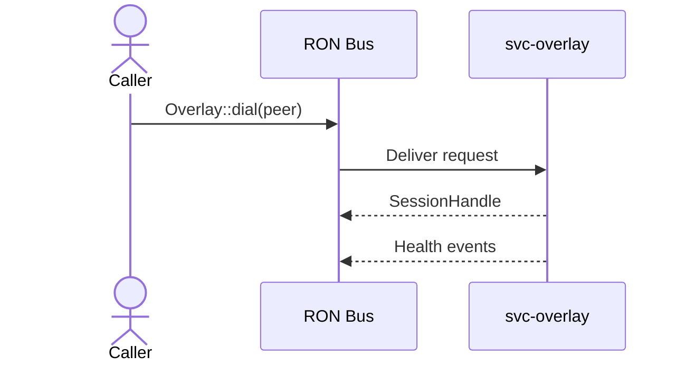
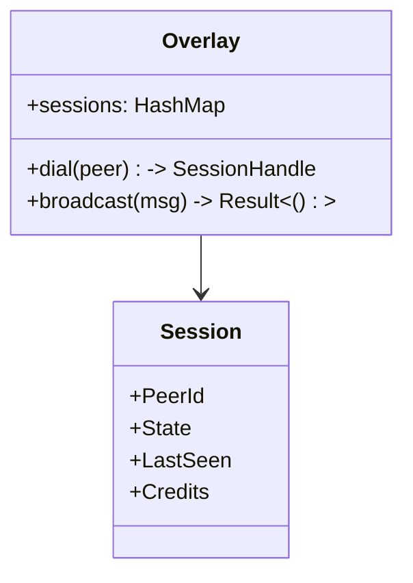
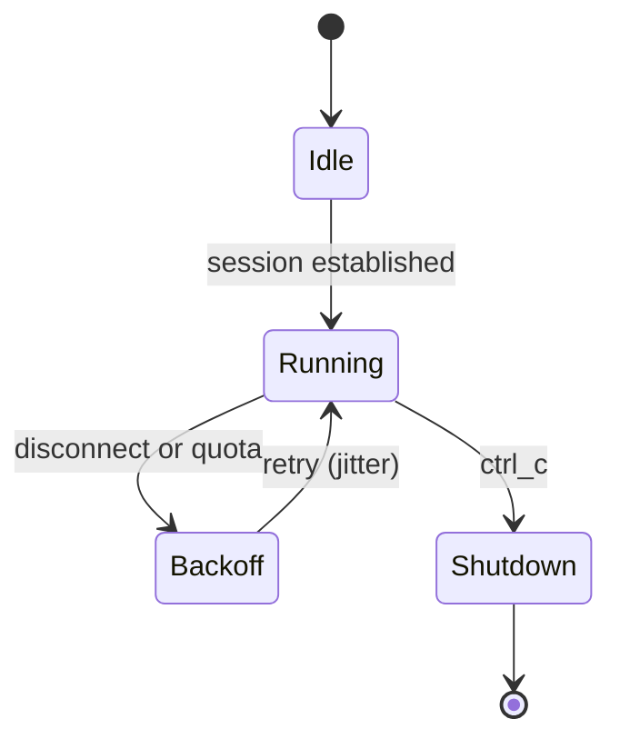

# svc-overlay

> **Role:** service (sessions & gossip; **no DHT**)
> **Owner:** Stevan White
> **Status:** draft
> **MSRV:** 1.80.0
> **Last reviewed:** 2025-10-03

[]() []() []() []()

---

## 1) Overview

**What it is (one paragraph):**
`svc-overlay` runs the **overlay/session mesh** for RustyOnions: establishing authenticated peer sessions, disseminating **gossip/state**, and managing connection lifecycles with strict backpressure. It is intentionally **thin** and **stateless** (ephemeral tables), and **does not** implement DHT routing or k-bucket logic—that’s `svc-dht`.

**How it fits (RustyOnions topology):**

* **Pillar:** 10 — Overlay, Transport & Discovery
* **Upstream callers:** `svc-index` (Graph/Search facets), `svc-storage`, `svc-mailbox`, `omnigate` hydration paths
* **Downstream deps:** `ron-transport` (TCP/TLS/Tor via `arti` feature), `svc-dht` (provider/discovery)
* **Data it touches:** in-memory session tables, transient metrics; micronode runs **amnesia by default**
* **Security boundary:** capability tokens (via `svc-passport`/`ron-auth`) enforced at session use; no PII retained

### 1.1 High-Level Architecture (Mermaid)

```mermaid
flowchart LR
  subgraph Node
    A[svc-index / svc-storage / svc-mailbox / omnigate] -->|Bus/RPC| B(svc-overlay)
  end

  B -->|Transport (TLS/Tor)| C[ron-transport]
  B -->|Discovery| D[svc-dht]
  B -->|/metrics| E[[ron-metrics]]

  style B fill:#0b7285,stroke:#083344,color:#fff
```

---

## 2) Responsibilities & Boundaries

**Invariants (MUST):**

* [I-1] Maintain authenticated **peer sessions** with **bounded** inflight queues; one writer per connection.
* [I-2] Enforce **OAP/1** limits for envelope handling in the path: `max_frame = 1 MiB`.
* [I-3] **Backpressure first**: quotas and per-peer ceilings applied **before** expensive work.
* [I-4] **Amnesia mode honored**: no persistent peer state; ephemeral logs; zeroization on teardown.

**Design Principles (SHOULD):**

* [P-1] Delegate **discovery and routing** to `svc-dht`; overlay is sessions + gossip only.
* [P-2] Prefer **owned bytes** (`bytes::Bytes`) on hot paths; never hold a lock across `.await`.
* [P-3] Observability as contract: `/healthz`, `/readyz`, **golden metrics** exported.

**Acceptance Gates (PROOF):**

* [G-1] **Chaos & churn:** sustain 60s peer churn at α=3 without deadlock; `/readyz` degrades under saturation and recovers.
* [G-2] **Perf:** p95 gossip dissemination **< 150 ms intra-AZ**; p99 < 300 ms with fanout bounded.
* [G-3] **CI teeth:** loom interleavings pass; fuzz (frame/gossip) ≥ 1h with 0 crashes; coverage ≥ 85%; 24h soak with **0 FD leaks**.
* [G-4] **Interop:** OAP/1 test vectors pass; polyglot SDK round-trip (Rust/TS/Python) green.

**MUST NOT do (anti-scope):**

* [F-1] **No DHT logic** (FIND_NODE/STORE/buckets) — owned by `svc-dht`.
* [F-2] **No durable storage** of peer state.
* [F-3] **No app semantics** (storage/mailbox/ledger/policy).

---

## 3) Public Interfaces

### 3.1 Bus RPC / Events (service)

* **RPC:**

  * `Overlay::dial(peer_id: PeerId) -> SessionHandle`
  * `Overlay::broadcast(msg: GossipMsg) -> Result<()>`
* **Events Emitted:**

  * `KernelEvent::Health{ service="svc-overlay", ok }`
  * `KernelEvent::ServiceCrashed{ service="svc-overlay" }`



### 3.2 HTTP (service)

* `GET /healthz` → `200 OK`
* `GET /readyz` → `200 OK` when all deps healthy and backpressure below thresholds
* `GET /metrics` → Prometheus text

---

## 4) Configuration

| Variable            | Type   | Default          | Description                      |
| ------------------- | ------ | ---------------- | -------------------------------- |
| `OVERLAY_BIND`      | socket | 127.0.0.1:9415   | Listen addr                      |
| `OVERLAY_MAX_CONNS` | int    | 1024             | Max concurrent sessions          |
| `OVERLAY_IDLE_MS`   | int    | 15000            | Transport idle timeout           |
| `OVERLAY_READ_MS`   | int    | 5000             | Read timeout                     |
| `OVERLAY_WRITE_MS`  | int    | 5000             | Write timeout                    |
| `METRICS_ADDR`      | socket | 127.0.0.1:0      | Prometheus exporter bind         |
| `LOG_LEVEL`         | string | info             | tracing level (`trace`..`error`) |
| `AMNESIA`           | bool   | true (micronode) | RAM-only / ephemeral mode        |

**Flags:**

```
--bind 0.0.0.0:9415
--max-conns 2048
--config ./Overlay.toml
```

**Feature flags (Cargo):**

* `arti` — enable Tor/Arti in `ron-transport`

---

## 5) Build, Run, Test

**Build**

```
cargo build -p svc-overlay
```

**Run**

```
RUST_LOG=info OVERLAY_BIND=127.0.0.1:9415 cargo run -p svc-overlay
```

**Tests & docs**

```
cargo test -p svc-overlay --all-features
cargo test -p svc-overlay --doc
```

**Lint, security, deps**

```
cargo fmt --all
cargo clippy -p svc-overlay -- -D warnings
cargo deny check
```

**Fuzz & loom (CI excerpts)**

```
cargo fuzz run oap_frame_parse_fuzz -- -max_total_time=3600
RUSTFLAGS="--cfg loom" cargo test -p svc-overlay --test loom_overlay
```

**Bench (if provided)**

```
cargo bench -p svc-overlay
```

---

## 6) Observability

**Endpoints:** `/metrics`, `/healthz`, `/readyz` (readiness **degrades early** under saturation).

**Canonical Metrics:**

* `overlay_sessions_active{service}` — gauge
* `overlay_gossip_latency_seconds{stage}` — histogram
* `bus_queue_depth{service}` — gauge
* `service_restarts_total{service}` — counter
* `errors_total{stage,kind}` — counter
* `rejected_total{reason}` — counter (e.g., quota, degraded)

**Tracing:** `svc-overlay=info,ron-transport=warn,tower_http=warn` with spans: `request_id`, `peer_id`, `route`, `status`.

---

## 7) Performance & SLOs

| Metric                   | Target         | Notes                            |
| ------------------------ | -------------- | -------------------------------- |
| p50 gossip latency       | < 60 ms        | steady-state intra-AZ            |
| p95 gossip latency       | < 150 ms       | intra-AZ                         |
| p99 gossip fanout jitter | < 300 ms       | bounded α/β                      |
| Start-to-ready           | < 1 s          | cold start                       |
| Max sessions             | 1024 (default) | per instance; scale horizontally |

> Reproduce: run `testing/perf/overlay_bench` with α, β fanout settings; capture `overlay_gossip_latency_seconds` histograms.

---

## 8) Data & Schema (if applicable)

**Model:** *ephemeral* session table only; no sled/db persistence.



---

## 9) Security & Privacy

* **Threat model (STRIDE):** spoofing (fake peers), tampering (mutated gossip), DoS (session floods), info disclosure (metadata).
* **Mitigations:** capability tokens; TLS via `ron-transport`; quotas & per-peer ceilings; structured rejects.
* **PII:** none retained.
* **PQ readiness:** **Hybrid KEM** (X25519+Kyber) is transport-level; overlay passes flags through; rotation ≤ 30d.
* **Amnesia:** RAM-only caches; ephemeral logs; timed purge on shutdown.

---

## 10) Error Taxonomy

| Code/Variant            | When it happens    | User hint          | Retries     |
| ----------------------- | ------------------ | ------------------ | ----------- |
| `OverlayError::Timeout` | Peer unresponsive  | retry with jitter  | yes         |
| `OverlayError::Refused` | Quota exceeded     | back off or reduce | yes         |
| `OverlayError::Crypto`  | TLS/PQ handshake   | rotate keys        | no          |
| `OverlayError::Busy`    | Degraded readiness | check `/readyz`    | yes (later) |

---

## 11) Concurrency Model

* **Runtime:** tokio; cooperative tasks; **one writer per socket**.
* **Discipline:** **never** hold a lock across `.await`; cancel-safe tasks; crash-only restart with jitter; bounded channels/bus.



---

## 12) Compatibility & Requirements

* **Rust:** 1.80.0+
* **OS:** Linux x86_64, macOS 10.15+; containers OK
* **TLS:** `tokio_rustls 0.26.x` via `ron-transport`
* **Protocol:** **OAP/1** envelopes (`max_frame = 1 MiB`) — interop tests required
* **DHT:** **none in overlay**; use `svc-dht` for discovery

---

## 13) Examples

Minimal rustdoc example (tests in `cargo test --doc`):

````rust
/// ```no_run
/// use svc_overlay::Overlay;
/// #[tokio::main]
/// async fn main() -> anyhow::Result<()> {
///   let ov = Overlay::bind("127.0.0.1:9415").await?;
///   ov.dial("peer:abc123").await?;
///   ov.broadcast(b"gossip-hello".to_vec()).await?;
///   Ok(())
/// }
/// ```
````

Service curl:

```
curl -sS http://127.0.0.1:9415/healthz
```

---

## 14) Troubleshooting

* **High gossip latency:** check `overlay_sessions_active`, quotas, α/β; verify `ron-transport` timeouts.
* **Frequent degraded `/readyz`:** saturation or restart storm—inspect `rejected_total{reason="degraded"}`.
* **TLS/PQ errors:** ensure `ron-transport` certs and PQ flags align on both ends.

---

## 15) Development Notes

* Axum handlers end with `.into_response()`.
* Clippy walls: deny `unwrap/expect`, `await_holding_lock`, `mutex_atomic`.
* **CI enforcement:**

  * Loom interleavings on session/gossip hot paths.
  * `cargo fuzz` on frame/gossip parse ≥ 1h.
  * Coverage (grcov) **≥ 85%**.
  * Soak 24h: zero FD leaks; steady `/readyz`.
* **Inter-crate:** explicitly integrate with `svc-dht` for discovery; **no** DHT logic here.

---

## 16) Mermaid Diagrams — Policy & Tooling (REQUIRED)

**Authoring tips:** concise labels; highlight subject node.

**Render locally (SVG)**

```
npm i -g @mermaid-js/mermaid-cli
mmdc -i docs/arch.mmd -o docs/arch.svg
```

**Render via Docker**

```
docker run --rm -v "$PWD":/data minlag/mermaid-cli mmdc -i docs/arch.mmd -o docs/arch.svg
```

**CI snippet**

```yaml
name: render-mermaid
on: [push, pull_request]
jobs:
  mmdc:
    runs-on: ubuntu-latest
    steps:
      - uses: actions/checkout@v4
      - run: npm i -g @mermaid-js/mermaid-cli
      - run: |
          mkdir -p docs
          for f in $(git ls-files '*.mmd'); do
            mmdc -i "$f" -o "${f%.mmd}.svg"
          done
```

---

## 17) Roadmap & TODO

* [ ] M1 — Stable session handshakes + gossip baseline; α/β fanout controls.
* [ ] M2 — **PQ hybrid** handshake flags plumbed end-to-end (X25519+Kyber via `ron-transport`).
* [ ] M3 — Chaos resilience under churn; 24h soak and fail-open reads.
* [ ] M4 — Facet hooks: Graph/Search pressure tests with `svc-index` (p95 neighbors ≤ 50 ms intra-AZ).

---

## 18) Changelog

See [CHANGELOG.md](./CHANGELOG.md).

---

## 19) License

Dual-licensed under **MIT** or **Apache-2.0**.

---

## 20) Contributing

PRs welcome! Include:

* Updated diagrams (commit `.mmd` sources; CI renders SVGs)
* Tests (unit, loom, fuzz), perf deltas, and metrics impact
* Interop proof (OAP vectors, polyglot SDK round-trip)

> Also see: `docs/IDB.md`, `SIX_CONCERNS.md`, `FULL_PROJECT_BLUEPRINT.md` (Pillar-10 checks).

---

