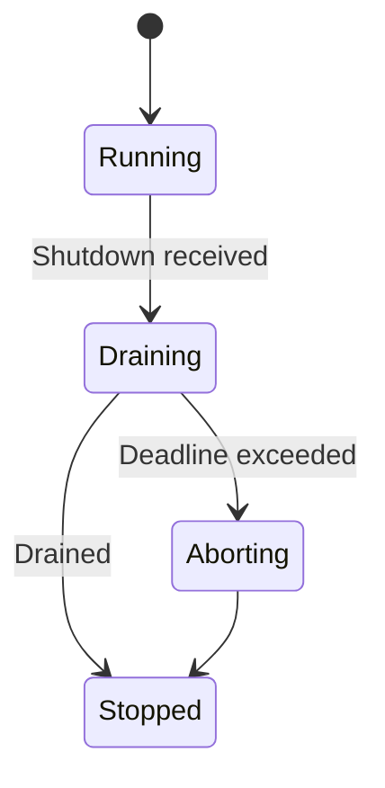
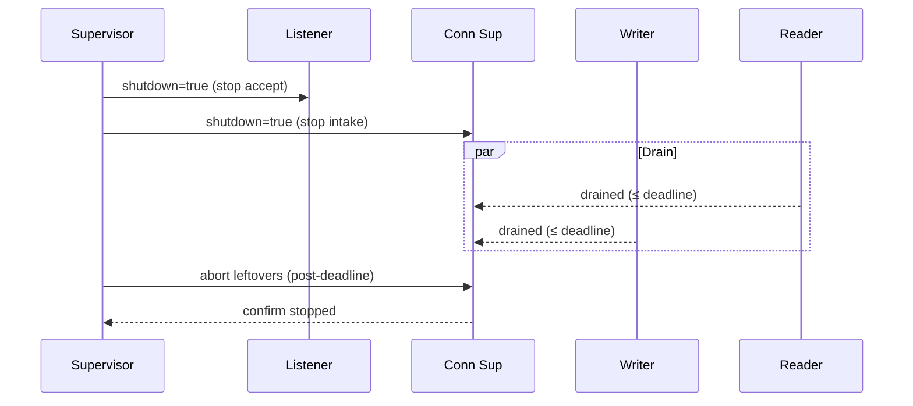

````markdown
---
title: Concurrency Model — svc-overlay
crate: svc-overlay
owner: Stevan White
last-reviewed: 2025-10-03
status: draft
template_version: 1.1
msrv: 1.80.0
tokio: "1.x (pinned at workspace root)"
loom: "0.7+ (dev-only)"
lite_mode: "N/A (service crate)"
---

# Concurrency Model — svc-overlay

This document makes the concurrency rules **explicit**: tasks, channels, locks, shutdown, timeouts,
and validation (property/loom/TLA+). It complements `docs/SECURITY.md`, `docs/CONFIG.md`,
and the crate’s `README.md` and `IDB.md`.

> **Golden rule:** never hold a lock across `.await` in supervisory or hot paths.

> **Role recap:** `svc-overlay` owns **session & gossip plane** (OAP/1 framing, backpressure, fairness).
> It **does not** implement DHT or discovery. Transport is provided by `ron-transport`.

---

## 0) Lite Mode (for tiny lib crates)

N/A — this is a service crate with multiple background tasks.

---

## 1) Invariants (MUST)

- [I-1] **No lock across `.await`.** Split critical sections; move owned data out of guards.
- [I-2] **Single writer per connection.** Exactly one task owns the writer half; readers never write.
- [I-3] **Bounded channels only.** All mpsc/broadcast are bounded; overflow → reject/drop w/ metrics.
- [I-4] **Explicit timeouts.** `read=5s`, `write=5s`, `idle=15..30s` (configurable) on all I/O.
- [I-5] **Cooperative cancellation.** Every `.await` is cancel-safe or guarded via `select!`.
- [I-6] **Graceful shutdown.** Intake stops, inflight drains within deadline; then abort stragglers.
- [I-7] **No blocking on runtime.** Use `spawn_blocking` for filesystem/CPU-bound tasks if needed.
- [I-8] **No task leaks.** Every spawned task is tracked and `JoinHandle` awaited (or intentionally detached with rationale).
- [I-9] **Backpressure over buffering.** Prefer fair-shed (typed `Busy`) to unbounded queues.
- [I-10] **Framing discipline.** OAP/1 length-checked; `max_frame=1MiB`, application chunks ~`64KiB`.
- [I-11] **Amnesia aware.** When `amnesia=true`, no persistent teardown work in `Drop`/shutdown paths.
- [I-12] **Readiness truthfulness.** Under pressure/degraded deps, writes fail first and `/readyz` flips.

**Async Drop**
- [I-13] Do **not** block in `Drop`. Provide `async shutdown(&self)`/`close()`; `Drop` is best-effort.

---

## 2) Runtime Topology

**Runtime:** Tokio **multi-threaded** (worker threads = CPU cores or value from workspace profile).

**Primary tasks and responsibilities:**

- **Supervisor** (1): builds config snapshot, owns **Shutdown** watch, spawns and monitors all children with jittered backoff.
- **Listener** (1 per bound socket): accepts connections, registers them with **Conn Supervisor**.
- **Conn Supervisor** (N): per-connection orchestrator that **splits** stream into **Reader** and **Writer** tasks; manages backpressure semaphores & per-peer budgets.
- **Gossip Engine** (pool): fans in/out gossip frames using bounded lanes; enforces relay fanout & burst budgets.
- **Metrics/Health** (1): exposes `/metrics`, `/healthz`, `/readyz`, `/version`.
- **Config Watcher** (0/1): optional SIGHUP/bus subscription; rebuilds runtime snapshot atomically.

```mermaid
flowchart TB
  subgraph Runtime (Tokio)
    SUP[Supervisor] -->|spawn| LIS[Listener]
    SUP -->|spawn| GPO[Gossip Engine Pool]
    SUP -->|spawn| MET[Metrics/Health]
    SUP -->|watch Shutdown| LIS
    SUP -->|watch Shutdown| GPO
    LIS -->|accept stream| CS[Conn Supervisor (per-conn)]
    CS -->|spawn| RD[Reader task]
    CS -->|spawn| WR[Writer task (single owner)]
    RD -->|mpsc:gossip_rx (bounded)| GPO
    GPO -->|mpsc:egress (bounded)| WR
  end
  style SUP fill:#0ea5e9,stroke:#0c4a6e,color:#fff
  style WR fill:#10b981,stroke:#065f46,color:#fff
  style RD fill:#9333ea,stroke:#4c1d95,color:#fff
  style GPO fill:#f59e0b,stroke:#92400e,color:#fff
````

**Text description:** Supervisor spawns Listener, Gossip Engine pool, and Metrics. Each new TCP/TLS session gets a Conn Supervisor that spawns exactly one Reader and one Writer. Reader forwards inbound frames to Gossip Engine via bounded mpsc; Gossip Engine schedules outbound frames to the single Writer via another bounded mpsc. All tasks subscribe to a Shutdown watch channel.

**Supervision policy:** Exponential backoff with jitter (100ms → 2s, max 5 retries) on child panic; after threshold, escalate to service-fatal (fail closed).

---

## 3) Channels & Backpressure

**Inventory (all bounded):**

| Name                      | Kind       | Capacity | Producers → Consumers | Backpressure Policy                | Drop Semantics & Metrics                           |
| ------------------------- | ---------- | -------: | --------------------- | ---------------------------------- | -------------------------------------------------- |
| `ingress_work_tx`         | mpsc       |      512 | Listener → Worker(s)  | `try_send` → `Busy`                | `busy_rejections_total{queue="ingress"}`           |
| `gossip_ingress_tx`       | mpsc       |      512 | Reader → GossipPool   | `try_send` → `Busy`                | increment + warn; caller receives typed `Busy`     |
| `gossip_egress_tx`        | mpsc       |      512 | GossipPool → Writer   | await permit (semaphore) then send | if queue full: shed oldest (configurable) + metric |
| `events_tx`               | broadcast  |     1024 | 1 → N                 | lag counter; slow subs drop oldest | `bus_lagged_total`; log once/interval              |
| `shutdown_rx`             | watch      |        1 | 1 → N                 | last-write-wins                    | N/A                                                |
| `config_updates_rx` (opt) | watch/mpsc |       16 | 1 → 1                 | last-write-wins / `try_recv`       | `config_update_total`                              |

**General rules:**

* Prefer **`try_send`** + typed `Error::Busy` to avoid head-of-line blocking.
* Every queue has **depth gauges** (`queue_depth{queue}`) and **drop counters** (`queue_dropped_total{queue}`).
* Egress uses a **token/permit** (semaphore) prior to enqueuing frames to Writer to bound in-flight per-peer.

---

## 4) Locks & Shared State

**Allowed**

* Short-lived `Mutex`/`RwLock` for control-plane metadata (e.g., config snapshot pointer, small maps). **No `.await` under guard.**
* Read-mostly shared data as **immutable snapshots** (`Arc<StateSnapshot>`).
* Per-connection hot state owned by the **Conn Supervisor**; cross-task via channels only.

**Forbidden**

* Holding any lock across `.await`.
* Nested locks without a documented **total order**.
* Sharing a single `broadcast::Receiver` across tasks (each task must own its receiver).

**Lock hierarchy (if unavoidable)**

1. `cfg_snapshot` (fast read)
2. `peer_index` (short write)
3. `metrics_buffer` (short write)

> If you need more than one lock: **take in order, release before `.await`**, or refactor.

---

## 5) Timeouts, Retries, Deadlines

**Transport I/O (from config):**
`read_timeout=5s`, `write_timeout=5s`, `idle_timeout=15s (Micronode) / 30s (Macronode)`.

**Handshake:** `handshake_timeout=3s`.

**Retries:** Only for **idempotent** internal ops (e.g., control-plane fetch), with jittered backoff (50–100ms, x2 up to 2s, max 3), **never** for socket write of user frames.

**Deadline propagation:** APIs accept `&Deadline`/`Duration` and surface `Timeout` errors with the operation label.

```mermaid
sequenceDiagram
  autonumber
  participant Peer
  participant CS as Conn Supervisor
  participant WR as Writer
  Peer->>CS: Frame
  CS->>WR: enqueue (permit) [≤5s]
  WR-->>CS: ack/err
  Note over CS,WR: Timeout ⇒ typed error; queue sheds fair when saturated
```

---

## 6) Cancellation & Shutdown

* **Signal:** `KernelEvent::Shutdown` or `ctrl_c()`.
* **Propagation:** every task holds a `watch::Receiver<bool>`; tasks use `select!` to react promptly.
* **Order:**

  1. Supervisor flips `/readyz` → **not ready**; stop intake (Listener closes).
  2. Gossip Engine stops accepting new work; continues to drain egress.
  3. Conn Supervisors stop accepting new frames; **drain deadline** (configurable, 1–5s).
  4. After deadline, **abort** remaining Conn tasks; count `tasks_aborted_total{kind}`.
  5. Writer tasks perform `shutdown().await` on streams best-effort.



---

## 7) I/O & Framing

* OAP/1 **length-delimited** frames, **cap=1MiB** (hard error if exceeded).
* Application-level streaming uses **~64KiB** chunks; Writer serializes into OAP frames.
* Always handle **partial reads**; treat `0` as EOF; verify checksums if enabled.
* Exactly **one Writer** per connection; **never** clone or share the writer across tasks.

---

## 8) Error Taxonomy (Concurrency-Relevant)

| Error           | When                                | Retry?    | Metric                            | Notes                        |
| --------------- | ----------------------------------- | --------- | --------------------------------- | ---------------------------- |
| `Busy`          | mpsc full / no permit               | caller no | `busy_rejections_total{queue}`    | Fair-shed visible to callers |
| `Timeout`       | read/write/handshake exceeded       | maybe     | `io_timeouts_total{op}`           | Attach op label              |
| `Canceled`      | shutdown triggered                  | no        | `tasks_canceled_total{kind}`      | Cooperative                  |
| `Lagging`       | broadcast receiver overflow         | no        | `bus_lagged_total`                | Slow consumer detection      |
| `FrameTooLarge` | >1MiB                               | no        | `frame_reject_total{reason=size}` | Protocol invariant           |
| `Backpressure`  | semaphore acquire deadline exceeded | maybe     | `backpressure_events_total{peer}` | Signals saturation           |

---

## 9) Metrics (Concurrency Health)

* `queue_depth{queue}` (gauge), `queue_dropped_total{queue}` (counter)
* `tasks_spawned_total{kind}`, `tasks_aborted_total{kind}`, `tasks_canceled_total{kind}`
* `io_timeouts_total{op}`, `handshake_timeouts_total`
* `busy_rejections_total{endpoint}`, `backpressure_events_total{peer}`
* `session_open_total`, `session_close_total`
* `gossip_frames_total{dir=tx|rx}`

---

## 10) Validation Strategy

**Unit / Property**

* Bounded queue **rejects** w/ `Busy`; no unbounded growth.
* Frame size property: any frame > 1MiB → error; ≤ cap passes round-trip.
* Writer **single-ownership**: compile-time structure + runtime assertion on duplicate writes.

**Loom (dev-only)**

* Model: 2 producers → bounded mpsc → 1 consumer; shutdown interrupt; assert:

  * no deadlock
  * no lost shutdown signal
  * no send-after-shutdown without error

**Fuzz**

* Frame parser/assembler (length mutations, truncation, split-boundaries).
* Gossip lane scheduler (random enqueue/dequeue under cap).

**Chaos / Integration**

* Kill Reader tasks mid-stream: Writer shuts down cleanly; `/readyz` flips under pressure.
* Saturate ingress to trigger **fair-shed**; verify metrics & **no memory growth**.

**(Optional) TLA+ sketch**

* Model lane tokens; prove **safety** (never > cap) and **liveness** (eventual drain) under finite producers.

---

## 11) Code Patterns (Copy-Paste)

**Per-connection split with single Writer & bounded egress**

```rust
use tokio::{io::{AsyncReadExt, AsyncWriteExt}, net::TcpStream, select, sync::{mpsc, Semaphore}};
use bytes::Bytes;
use std::sync::Arc;

pub struct ConnCtx {
    pub shutdown: tokio::sync::watch::Receiver<bool>,
    pub egress_permits: Arc<Semaphore>, // caps in-flight frames
}

pub async fn run_conn(stream: TcpStream, ctx: ConnCtx, mut gossip_ingress: mpsc::Sender<Bytes>) -> anyhow::Result<()> {
    let (mut rd, mut wr) = tokio::io::split(stream);

    // ---- Reader (owns no writable handle) ----
    let mut rd_shutdown = ctx.shutdown.clone();
    let reader = tokio::spawn(async move {
        let mut buf = vec![0u8; 64 * 1024];
        loop {
            select! {
                _ = rd_shutdown.changed() => break,
                res = rd.read(&mut buf) => {
                    let n = res?;
                    if n == 0 { break; }
                    // parse OAP/1 frames here (≤ 1MiB invariant)
                    // forward payload up to gossip engine
                    if let Err(mpsc::error::TrySendError::Full(_)) = gossip_ingress.try_send(Bytes::copy_from_slice(&buf[..n])) {
                        metrics::busy_rejections_total().with_label_values(&["gossip_ingress"]).inc();
                        // shed fairly: drop newest (caller-visible Busy)
                    }
                }
            }
        }
        anyhow::Ok(())
    });

    // ---- Writer (single owner) ----
    let (egress_tx, mut egress_rx) = mpsc::channel::<Bytes>(512);
    let mut wr_shutdown = ctx.shutdown.clone();
    let writer = tokio::spawn(async move {
        loop {
            select! {
                _ = wr_shutdown.changed() => break,
                maybe = egress_rx.recv() => {
                    let Some(frame) = maybe else { break; };
                    // acquire permit to bound inflight
                    let _permit = ctx.egress_permits.acquire().await?;
                    tokio::time::timeout(std::time::Duration::from_secs(5), wr.write_all(&frame)).await??;
                }
            }
        }
        let _ = wr.shutdown().await;
        anyhow::Ok::<_, anyhow::Error>(())
    });

    // application enqueues to egress_tx (bounded, via try_send) ...
    // join both sides
    let _ = reader.await??;
    let _ = writer.await??;
    Ok(())
}
```

**Bounded send with typed Busy**

```rust
pub fn enqueue_egress(tx: &tokio::sync::mpsc::Sender<bytes::Bytes>, frame: bytes::Bytes) -> Result<(), Error> {
    use tokio::sync::mpsc::error::TrySendError::*;
    match tx.try_send(frame) {
        Ok(_) => Ok(()),
        Err(Full(_)) => { metrics::busy_rejections_total().with_label_values(&["egress"]).inc(); Err(Error::Busy) }
        Err(Closed(_)) => Err(Error::Canceled),
    }
}
```

**Cooperative shutdown**

```rust
tokio::select! {
  _ = shutdown.changed() => { /* stop intake, drain */ }
  res = do_work() => { /* handle */ }
}
```

**No lock across `.await`**

```rust
let snapshot = {
  let g = state.lock();  // short critical section
  g.snapshot()           // move owned data out
}; // guard dropped here
do_async(snapshot).await;
```

**Async Drop pattern**

```rust
pub struct Client { inner: Option<Stream> }

impl Client {
  pub async fn close(&mut self) -> anyhow::Result<()> {
    if let Some(mut s) = self.inner.take() { s.shutdown().await.ok(); }
    Ok(())
  }
}
impl Drop for Client {
  fn drop(&mut self) {
    if self.inner.is_some() {
      tracing::debug!("Client dropped without close(); best-effort cleanup only");
    }
  }
}
```

---

## 12) Configuration Hooks (Quick Reference)

Concurrency-affecting config keys (see `docs/CONFIG.md` for full schema):

* `overlay.peer.inflight_frames`, `overlay.peer.max_rps`
* `overlay.gossip.relay_fanout`, `overlay.gossip.burst_budget_frames`
* `overlay.gossip.chunk_bytes`, `overlay.gossip.max_frame_bytes`
* `timeouts.read|write|idle`, `overlay.handshake_timeout`
* `transport.max_conns`
* `drain_deadline` (if present; default 3s)
* Feature gates affecting topology: `pq`, `arti`, `quic`

---

## 13) Known Trade-offs / Nonstrict Areas

* **Drop-newest vs drop-oldest**: egress queue defaults to **drop-newest** (reject via `Busy`) to preserve latency; can switch to drop-oldest for throughput bias — document per deployment.
* **Broadcast lag handling**: slow subscribers drop; consumers must tolerate missed non-critical events (telemetry).
* **Semaphore granularity**: per-peer permits bound inflight but may slightly underutilize link under high RTT variance.

---

## 14) Mermaid Diagrams (REQUIRED)

### 14.1 Task & Queue Topology

```mermaid
flowchart LR
  IN[Listener] -->|mpsc:ingress(512)| CS[Conn Supervisor]
  CS -->|spawn| RD[Reader]
  CS -->|spawn| WR[Writer (single)]
  RD -->|mpsc:gossip_ingress(512)| G1[Gossip Engine A]
  RD -->|mpsc:gossip_ingress(512)| G2[Gossip Engine B]
  G1 -->|mpsc:egress(512)| WR
  G2 -->|mpsc:egress(512)| WR
  SH[Shutdown watch] --> RD
  SH --> WR
  SH --> G1
  SH --> G2
```

**Text description:** Listener feeds Conn Supervisor; per-conn Reader forwards inbound frames to a bounded queue consumed by one of the Gossip Engine workers; outbound frames flow back through a bounded egress queue to the single Writer.

### 14.2 Shutdown Sequence



---

## 15) CI & Lints (Enforcement)

**Clippy / deny-by-default**

* `-D clippy::await_holding_lock`
* `-D clippy::mutex_atomic`
* `-D clippy::needless_collect`
* `-D clippy::useless_async`
* `-D warnings`

**Suggested GitHub Actions**

```yaml
name: concurrency-guardrails
on: [push, pull_request]
jobs:
  clippy:
    runs-on: ubuntu-latest
    steps:
      - uses: actions/checkout@v4
      - uses: dtolnay/rust-toolchain@stable
      - run: cargo clippy -p svc-overlay -- -D warnings -D clippy::await_holding_lock

  loom:
    if: github.event_name == 'pull_request'
    runs-on: ubuntu-latest
    steps:
      - uses: actions/checkout@v4
      - uses: dtolnay/rust-toolchain@stable
      - run: RUSTFLAGS="--cfg loom" cargo test -p svc-overlay --tests -- --ignored loom

  fuzz:
    runs-on: ubuntu-latest
    steps:
      - uses: actions/checkout@v4
      - uses: dtolnay/rust-toolchain@stable
      - run: cargo install cargo-fuzz
      - run: cargo fuzz build -p svc-overlay
```

---

## 16) Schema Generation (Optional, Nice-to-Have)

Automate **Channels/Locks tables** from code:

* Annotate sites with attributes or macros (e.g., `#[doc_channel(name="egress", kind="mpsc", cap=512, policy="try_send")]`).
* A `build.rs` or proc-macro can emit `docs/_generated/concurrency.mdfrag` to include here.
* Add a **golden test** that asserts the live channel registry equals the doc table.

---

## 17) Review & Maintenance

* **Review cadence:** every 90 days **or** on any change to tasks/channels/locks/timeouts.
* Keep **`owner`, `msrv`, `last-reviewed`** current.
* **PR checklist:** when touching concurrency:

  * [ ] Update this file
  * [ ] Add/adjust loom/property tests
  * [ ] Validate `/readyz` behavior under saturation
  * [ ] Confirm metrics for shed/drops/aborts are emitted

```
```
