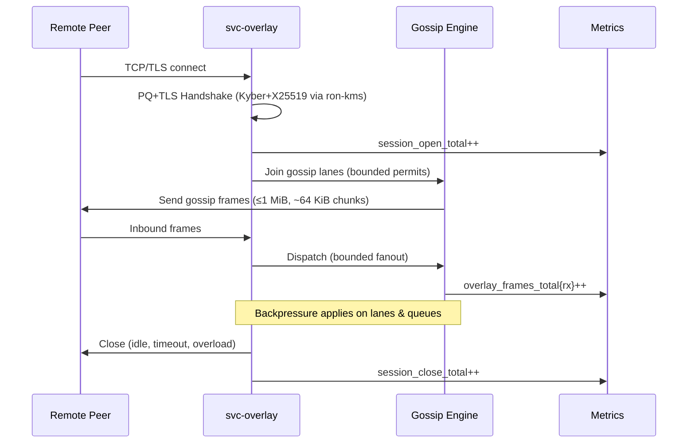
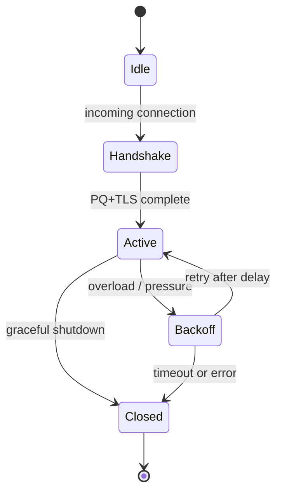

---

````markdown
---
title: svc-overlay — Invariant-Driven Blueprint (IDB)
version: 1.0.1
status: draft
last-updated: 2025-10-03
audience: contributors, ops, auditors
---

# svc-overlay — IDB

> **Role (canon):** The overlay is the **session & gossip plane** of RustyOnions.  
> It enforces **OAP/1 framing**, **bounded gossip fanout**, and **session lifecycle rules**, but does **not** contain DHT or routing logic.  
> Transport primitives (TLS/Tor/QUIC) come from `ron-transport`.  
> Objects are addressed by **BLAKE3** digests.  
> Overlay is Pillar **10** (Overlay, Transport & Discovery).  

---

## 1. Invariants (MUST)

- **[I-1] Overlay ≠ DHT.** No routing tables, Kademlia RPCs, or peer discovery logic in this crate. Those live in `svc-dht`.  
- **[I-2] Transport discipline.** One writer per connection; reader/writer tasks separated; **read/write/idle timeouts** enforced from `ron-transport::TransportConfig`.  
- **[I-3] OAP/1 frame bounds.** `max_frame = 1 MiB`; stream payloads in ~**64 KiB** application chunks.  
- **[I-4] Address integrity.** All objects referenced must be `"b3:<hex>"` (BLAKE3-256) and fully verified before serving.  
- **[I-5] Backpressure mandatory.** All per-peer queues, gossip lanes, and admission paths are bounded; overflow → structured error (429/503) and metric increment.  
- **[I-6] Truthful readiness.** `/readyz` returns `200` only when listeners, bus, config, and transport are up; under pressure, **writes fail first** and `/readyz` flips.  
- **[I-7] Concurrency hygiene.** Never hold a lock across `.await`; one broadcast receiver per task; owned bytes (`bytes::Bytes`) used on hot paths.  
- **[I-8] Amnesia compliance.** When `amnesia=true`, no persistence (RAM-only caches, ephemeral logs, timed purge). Metrics label `amnesia="on"`.  
- **[I-9] Hardening limits.** Default caps: timeout ≈ **5s**, inflight ≤ **512**, RPS ≤ **500**, body cap **1 MiB**, decompression ≤ **10×** absolute cap.  
- **[I-10] Observability canon.** Expose golden metrics (`request_latency_seconds`, `overlay_inflight`, `overlay_rejected_total{reason}`), plus `/metrics`, `/healthz`, `/readyz`, `/version`.  
- **[I-11] PQ handshake readiness.** Peer handshakes MUST support hybrid KEX (Kyber + X25519) once exposed via `ron-kms`.  

---

## 2. Design Principles (SHOULD)

- **[P-1] Session-first minimalism.** Focus on connection lifecycle, gossip fanout, and flow control. Avoid scope creep into discovery/routing.  
- **[P-2] Fail early, shed fair.** Apply ceilings before expensive work; degrade predictably and visibly.  
- **[P-3] Profile parity.** Same API/semantics on Micronode (`amnesia=on`) and Macronode; only scaling knobs differ.  
- **[P-4] Zero ambient trust.** All ingress must validate capability tokens; no unauthenticated ambient control flows.  
- **[P-5] Bounded fanout.** Gossip lanes use token-bucket or DRR with per-peer ceilings.  
- **[P-6] Facet neutrality.** Overlay gossip carries opaque blobs; it must not interpret, rank, or process higher-order facets like Feed/Graph.  

---

## 3. Implementation (HOW)

### [C-1] Transport split-task pattern (single writer)

```rust
use tokio::{io::{AsyncReadExt, AsyncWriteExt}, net::TcpStream};
use bytes::Bytes;

async fn run_conn(stream: TcpStream) -> anyhow::Result<()> {
    let (mut rd, mut wr) = tokio::io::split(stream);

    // Reader task: no locks across .await
    let reader = tokio::spawn(async move {
        let mut buf = vec![0u8; 64 * 1024]; // ~64 KiB
        loop {
            let n = rd.read(&mut buf).await?;
            if n == 0 { break; }
            // parse OAP/1 frame (≤1 MiB) → dispatch gossip/session events
        }
        Ok::<_, anyhow::Error>(())
    });

    // Writer: single-owner; backpressure via bounded semaphore
    let frame: Bytes = build_oap_frame()?; // ≤1 MiB
    wr.write_all(&frame).await?;
    wr.shutdown().await?;
    reader.await??;
    Ok(())
}
````

---

### [C-2] Session Lifecycle (Mermaid Sequence)



---

### [C-3] Overlay Session State Machine (Mermaid State)



---

### [C-4] Bounded gossip lanes (Semaphore pattern)

```rust
use tokio::sync::Semaphore;
use std::sync::Arc;

pub struct PeerLane {
    permits: Arc<Semaphore>,
}

impl PeerLane {
    pub async fn send(&self, frame: bytes::Bytes, wr: &mut (impl tokio::io::AsyncWrite + Unpin)) -> anyhow::Result<()> {
        let _p = self.permits.acquire().await?;
        wr.write_all(&frame).await?;
        Ok(())
    }
}
```

---

### [C-5] Metrics Taxonomy

* `overlay_inflight{peer}` (gauge)
* `overlay_rejected_total{reason}` (counter: `quota|timeout|overflow|degraded`)
* `overlay_gossip_frames_total{dir=tx|rx}` (counter)
* `request_latency_seconds{route}` (histogram)
* `session_open_total`, `session_close_total`

---

### [C-6] Config Sketch (Micronode Defaults)

```toml
[overlay]
listen        = "127.0.0.1:9500"
per_peer_inflight = 32
per_peer_rps      = 200
idle_timeout_ms   = 15000
read_timeout_ms   = 5000
write_timeout_ms  = 5000
amnesia           = true   # enforced for Micronode

[observability]
metrics = "127.0.0.1:9600"
```

---

## 4. Acceptance Gates (PROOF)

* **[G-1] Frame bounds.** Property tests reject >1 MiB OAP frames; fuzz ensures ~64 KiB chunking survives reorder/drop.
* **[G-2] Concurrency discipline.** CI forbids `await_holding_lock`, `unwrap`, `expect`. Tests assert single writer per socket.
* **[G-3] Readiness.** Integration tests flip `/readyz` before collapse and shed writes first.
* **[G-4] Scaling stability.** 10k concurrent sessions: no unbounded memory; inflight gauges plateau; rejects <1% steady-state.
* **[G-5] Profile parity.** Test suite must pass on Micronode (`amnesia=on`) and Macronode.
* **[G-6] Limits.** 2 MiB send → `413`; decompression bomb blocked at ≤10×; RPS cap → `429`.
* **[G-7] Amnesia hygiene.** With amnesia on, no disk artifacts detected by harness.
* **[G-8] Metrics.** `/metrics` scrape shows golden set; `/version` responds.
* **[G-9] Sanitizers.** ThreadSanitizer + Loom concurrency tests pass.
* **[G-10] PQ handshake.** Integration test negotiates Kyber+X25519 hybrid via `ron-kms`.

---

## 5. Anti-Scope (Forbidden)

* ❌ DHT logic (routing, Kademlia, peer discovery).
* ❌ Custom transport loops (must use ron-transport).
* ❌ Unbounded queues or multi-writer sockets.
* ❌ Ambient trust / unauthenticated control flows.
* ❌ Persistence when `amnesia=on`.
* ❌ Crypto primitives beyond ron-kms (no homebrew PQ/AEAD).

---

## 6. References

* **Complete Crate List** — svc-overlay role = session/gossip plane.
* **12 Pillars (Pillar 10)** — Overlay separated from DHT.
* **Scaling Blueprint v1.4** — inflight ceilings, backpressure.
* **Concurrency & Aliasing v1.3** — single-writer discipline.
* **Hardening Blueprint v2.0** — timeouts, decompression caps, reject codes.
* **Omnigate Blueprint v1.6** — OAP/1 framing, BLAKE3 addresses.
* **Ron-KMS** — PQ hybrid KEX enforcement.
* **App Integration Blueprint** — Overlay as SDK-visible session plane.

---

### Concern Mapping

* **Concerns:** SEC, RES, PERF
* **Pillar:** 10 (Overlay/Transport/Discovery)
* **CI Labels:** `concern:SEC`, `concern:RES`, `concern:PERF`, `pillar:10`

---

```

---

✅ This version includes:  
- All invariants + PQ invariant.  
- Design principles with **facet neutrality**.  
- Rust + TOML code snippets.  
- **Two Mermaid diagrams** (sequence + state machine).  
- Expanded acceptance gates with PQ handshake test.  
- Explicit anti-scope for crypto beyond `ron-kms`.  

