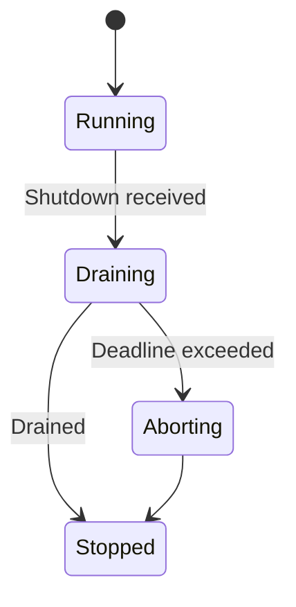
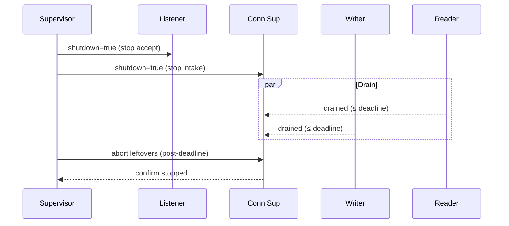
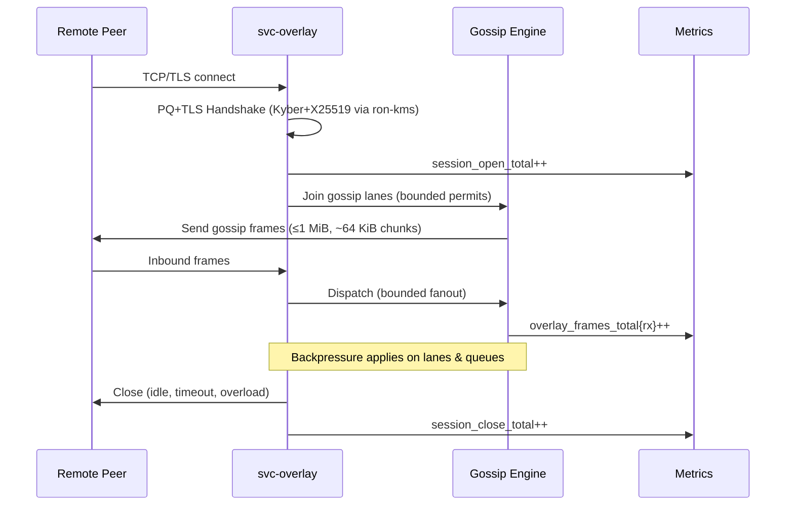
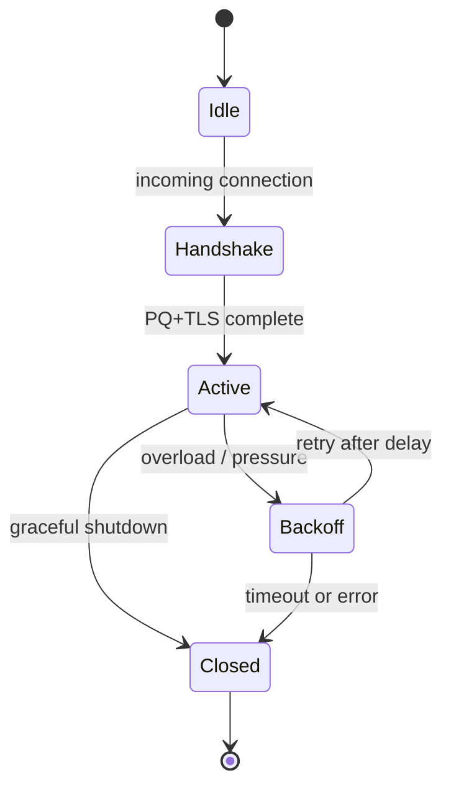

# Combined Markdown

_Source directory_: `crates/svc-overlay/docs`  
_Files combined_: 13  
_Recursive_: 0

---

### Table of Contents

- API.MD
- CONCURRENCY.MD
- CONFIG.MD
- GOVERNANCE.MD
- IDB.md
- INTEROP.MD
- OBSERVABILITY.MD
- OLD_README.md
- PERFORMANCE.MD
- QUANTUM.MD
- RUNBOOK.MD
- SECURITY.MD
- TESTS.MD

---

## API.MD
_File 1 of 13_

````markdown
---
title: API Surface & SemVer Reference — svc-overlay
status: draft
msrv: 1.80.0
last-updated: 2025-10-03
audience: contributors, auditors, API consumers
---

# API.md — svc-overlay

## 0) Purpose

This document captures the **public API surface** of `svc-overlay`, including the **binary/CLI**, **admin HTTP endpoints**, **metrics & labels**, and (optional) **Rust library surface** gated by features. It defines **SemVer discipline** for each surface, provides **CI-enforceable** checks, and acts as the contract for external consumers.

> Role recap: `svc-overlay` is a **service crate** for the session/gossip plane (OAP/1). It deliberately **does not** expose broad Rust APIs by default.

---

## 1) Public API Surface

### 1.1 Binary / CLI surface (stable)

**Executable name:** `svc-overlay`

**Synopsis**
```bash
svc-overlay [FLAGS] [--config <path>]
````

**Flags & options (contract)**

```text
--config <path>            Load Config.toml/Config.json (low precedence)
--bind <ip:port>           Bind address for overlay listener (overlay.listen)
--advertise <host:port>    Advertised address (overlay.advertise_addr)
--metrics <ip:port>        Admin/metrics bind (observability.metrics_addr)
--max-conns <num>          Transport connection ceiling (transport.max_conns)
--read-timeout <dur>       Read timeout, e.g., 5s, 250ms (timeouts.read)
--write-timeout <dur>      Write timeout (timeouts.write)
--idle-timeout <dur>       Idle timeout (timeouts.idle)
--fanout <n>               Gossip relay fanout (overlay.gossip.relay_fanout)
--burst <n>                Gossip burst budget (overlay.gossip.burst_budget_frames)
--chunk-bytes <size>       Chunk size (overlay.gossip.chunk_bytes)
--pq <off|hybrid>          PQ mode (overlay.pq_mode)
--amnesia <true|false>     Amnesia mode (overlay.amnesia)
--tls                      Shorthand for tls.enabled=true
--tls-cert <path>          TLS certificate path (tls.cert_path)
--tls-key <path>           TLS key path (tls.key_path)
--uds <path>               UDS control socket (uds.path)
--version                  Print version (semver + git hash) and exit
--help                     Print help and exit
```

> **SemVer note:** Renaming, removing, or changing the meaning of any **existing** flag is **breaking** (major). Adding new flags is **additive** (minor). Default changes that alter behavior are **breaking** unless opt-in.

---

### 1.2 Admin HTTP surface (stable)

**Base path:** local admin interface (bind via `--metrics`), serving: `/healthz`, `/readyz`, `/metrics`, `/version`.

**Endpoints**

1. `GET /healthz` — **liveness**

```http
200 OK
Content-Type: application/json
{"alive": true}
```

2. `GET /readyz` — **readiness truth**

* **200 OK**

  ```json
  {"ready": true}
  ```
* **503 Service Unavailable**

  ```json
  {"ready": false, "degraded": true, "missing": ["<keys>"], "retry_after": 5}
  ```

3. `GET /metrics` — **Prometheus exposition**

* Content type: `text/plain; version=0.0.4`
* Stable **metric names** & **label sets** defined in §1.3.

4. `GET /version` — semantic version and build info

```json
{"version":"vX.Y.Z","git":"<shortsha>","build":"<timestamp>","features":["tls","pq?","arti?","quic?"]}
```

> **SemVer note:** Adding **new** endpoints is **minor**. Changing response **schema** or semantics of existing endpoints is **breaking**. Adding **optional** fields is **minor** if old clients continue to parse.

---

### 1.3 Metrics API (stable names & labels)

> **Metrics are part of the public contract.** Names and **label keys** are stable. Value ranges & units are documented.

**Golden set (every service)**

* `http_requests_total{route,method,status}` (Counter)
* `request_latency_seconds{route,method}` (Histogram; buckets: `0.005..5.0,+Inf`)
* `inflight_requests{route}` (Gauge)
* `service_restarts_total` (Counter)
* `bus_lagged_total` (Counter)
* `rejected_total{reason}` (Counter) — `reason ∈ {unauth, oversize, ratio_cap, timeout, busy, handshake_ratelimit}`

**Overlay-specific**

* `overlay_sessions_active` (Gauge)
* `overlay_sessions_open_total` (Counter)
* `overlay_handshake_attempts_total` (Counter)
* `overlay_handshake_failures_total{reason}` (Counter) — `reason ∈ {timeout, tls, mtls, pq_neg_fail, ratelimit, proto}`
* `overlay_frames_total{dir,kind}` (Counter) — `dir ∈ {rx, tx}`, `kind ∈ {gossip, ctrl, other}`
* `overlay_bytes_total{dir}` (Counter) — `dir ∈ {rx, tx}`
* `overlay_frame_size_bytes{dir}` (Histogram; up to 1 MiB) — `dir ∈ {rx, tx}`
* `overlay_queue_depth{queue}` (Gauge) — `queue ∈ {ingress, gossip_ingress, egress}`
* `overlay_queue_dropped_total{queue,reason}` (Counter) — `reason ∈ {full, timeout, shed}`
* `overlay_backpressure_events_total{peer_bucket}` (Counter) — `peer_bucket ∈ {tiny, small, med, large}`
* `auth_failures_total{reason}` (Counter) — `reason ∈ {unauth, expired, invalid_caveat}`
* `tls_handshake_failures_total{reason}` (Counter) — `reason ∈ {cert, version, cipher, alpn}`
* `overlay_pq_negotiations_total{mode,outcome}` (Counter) — `mode ∈ {off, hybrid}`, `outcome ∈ {ok, fail, incompatible}`
* `readyz_state` (Gauge) — `0=down,1=ready,2=degraded`

> **SemVer note:** Renaming a metric, removing a label key, or changing units is **breaking**. Adding a **new** metric or a **new label value** is **minor** if existing dashboards/alerts remain valid.

---

### 1.4 Environment & Config keys (operational API)

* **Env prefix:** `SVC_OVERLAY_` (stable)
* **Nested env mapping:** `__` separator (stable)
* Selected **stable keys** (full list in `CONFIG.md`):

  * `overlay.listen`, `overlay.advertise_addr`, `overlay.amnesia`, `overlay.pq_mode`
  * `overlay.peer.inflight_frames`, `overlay.peer.max_rps`
  * `overlay.gossip.max_frame_bytes` (fixed to 1 MiB), `overlay.gossip.chunk_bytes`, `overlay.gossip.relay_fanout`
  * `timeouts.read|write|idle`, `observability.metrics_addr`
  * `tls.enabled|cert_path|key_path`, `uds.path|allow_uids`

> **SemVer note:** Renaming or removing a **key** is **breaking**. Adding keys with safe defaults is **minor**. Tightening validation that causes previously-valid configs to fail is **breaking** unless opt-in.

---

### 1.5 Rust library surface (feature-gated, optional)

By default, `svc-overlay` is a **binary-only** crate. For **embedders**, we provide an **opt-in** `libapi` feature exposing a minimal, stable Rust API.

**Feature:** `libapi` (off by default)

**Intended surface (stable while `libapi` exists)**

```text
pub mod api {
    pub struct OverlayConfig;          // re-export of validated Config snapshot (subset)
    pub struct OverlayHandle;          // shutdown & join handle
    pub fn spawn(cfg: OverlayConfig) -> anyhow::Result<OverlayHandle>;
}
```

> This is intentionally tiny. The full `Config` type and internals remain crate-private to allow evolution.

**Current `cargo public-api --simplified` (with `--features libapi`)**

```text
pub mod api
pub struct api::OverlayConfig
pub struct api::OverlayHandle
pub fn api::spawn(cfg: api::OverlayConfig) -> Result<api::OverlayHandle, anyhow::Error>
```

> **SemVer note:** Any change to the above **is breaking** unless purely additive (e.g., new `api::OverlayHandle` methods with default semantics).

---

## 2) SemVer Discipline

### 2.1 Surfaces & what counts as breaking

| Surface          | Examples                                      | Breaking (major)                                                                    | Additive (minor)                              |
| ---------------- | --------------------------------------------- | ----------------------------------------------------------------------------------- | --------------------------------------------- |
| **CLI**          | flags/options                                 | rename/remove/repurpose existing flag; change default in a way that alters behavior | add new flags; add aliases                    |
| **HTTP**         | `/healthz`, `/readyz`, `/metrics`, `/version` | change schema/meaning; remove endpoint                                              | add optional fields or new endpoints          |
| **Metrics**      | names, labels, units                          | rename metric; remove label key; change units/buckets materially                    | add new metric; add new label **value**       |
| **Config**       | TOML/env keys                                 | rename/remove keys; tighten validation breaking old configs                         | add new keys with safe defaults               |
| **Lib (libapi)** | `api::*`                                      | change signatures/types; remove items                                               | add new items; mark enums `#[non_exhaustive]` |

> **Patch**: doc fixes, performance improvements, and internal refactors with no surface change.

---

## 3) Stability Guarantees

* **MSRV**: `1.80.0`.
* **Unsafe**: forbidden unless explicitly justified and audited.
* **Privacy**: internal types and Tokio primitives are **not** exposed.
* **Feature flags**: `tls`, `pq`, `arti`, `quic`, `cli`, `libapi` — adding a new feature is **minor**; changing feature behavior that breaks default users is **breaking**.

---

## 4) Invariants (API-level)

* **Service-first**: Default build exposes only **CLI + Admin HTTP + Metrics**. Rust API is **opt-in** (`libapi`).
* **Metrics are API**: Names & label **keys** are stable. Avoid high-cardinality labels by policy.
* **Config is API**: Keys & env mappings are stable; validation is fail-closed and versioned.
* **Ready truthfulness**: `/readyz` reflects ability to accept **writes**; flipping semantics is **breaking**.
* **Public docs**: Every public item & endpoint is documented; `#![deny(missing_docs)]` for `libapi`.

---

## 5) Tooling

* `cargo public-api` — detect Rust surface diffs (with/without `--features libapi`).
* `cargo semver-checks` — optional semantic checking.
* **Golden files**:

  * Rust symbols → `docs/api-history/svc-overlay/<version>-libapi.txt`
  * Metrics list → `docs/api-history/svc-overlay/<version>-metrics.txt`
  * CLI flags help text → `docs/api-history/svc-overlay/<version>-cli.txt`
  * Admin schemas (examples) → `docs/api-history/svc-overlay/<version>-http.json`

**Commands**

```bash
cargo public-api --simplified --deny-changes
cargo public-api --simplified --features libapi --deny-changes
```

---

## 6) CI & Gates

* **Rust surface gate**

  * Run `cargo public-api` (both default and `--features libapi`).
  * If diff detected → PR must include CHANGELOG entry + API.md update.

* **Metrics contract gate**

  * Export once under synthetic load; parse names/labels.
  * Compare to `docs/api-history/...-metrics.txt` (whitelist changes explicitly).

* **HTTP contract gate**

  * Contract tests for `/healthz`, `/readyz`, `/version` schemas.
  * Prometheus `promtool` scrape test for `/metrics`.

* **Config contract gate**

  * Validate that legacy configs from `docs/api-history/...-config/` still start (unless major).

**GitHub Actions sketch**

```yaml
- run: cargo install cargo-public-api
- run: cargo public-api --simplified --deny-changes -p svc-overlay
- run: cargo public-api --simplified --features libapi --deny-changes -p svc-overlay
- run: cargo test -p svc-overlay --test http_contract
- run: promtool check metrics http://127.0.0.1:9600/metrics
```

---

## 7) Acceptance Checklist (Definition of Done)

* [ ] Current API snapshots generated & stored under `docs/api-history/svc-overlay/`.
* [ ] `cargo public-api` passes (default + `libapi`).
* [ ] Metrics & HTTP contract tests pass; `promtool` scrape OK.
* [ ] CHANGELOG updated for any surface changes (and SemVer bump chosen).
* [ ] `API.md` updated (this file).
* [ ] For new/changed endpoints: runbooks & dashboards updated.

---

## 8) Appendix

### 8.1 References

* Rust SemVer: [https://doc.rust-lang.org/cargo/reference/semver.html](https://doc.rust-lang.org/cargo/reference/semver.html)
* cargo-public-api: [https://github.com/Enselic/cargo-public-api](https://github.com/Enselic/cargo-public-api)
* cargo-semver-checks: [https://github.com/obi1kenobi/cargo-semver-checks](https://github.com/obi1kenobi/cargo-semver-checks)

### 8.2 Perfection Gates tie-in

* **Gate G:** No undocumented public surface (Rust, HTTP, metrics, config).
* **Gate H:** Breaking changes require **major** version bump.
* **Gate J:** CHANGELOG alignment enforced by CI.

### 8.3 History (example placeholders; update per release)

```
v0.7.0
- Added metric overlay_pq_negotiations_total{mode,outcome} (minor)
- Added CLI flag --advertise (minor)
- /readyz schema gained "retry_after" (minor, optional field)

v0.6.0 (breaking)
- Renamed --egress-window -> --burst (breaking CLI)
- Changed /version schema field "hash" -> "git" (breaking HTTP)
```

---

### 8.4 Current Rust Surface (as of this doc)

> Default build (binary only): no public Rust items beyond `main` in the bin target.
> With `--features libapi`:

```text
pub mod api
pub struct api::OverlayConfig
pub struct api::OverlayHandle
pub fn api::spawn(cfg: api::OverlayConfig) -> Result<api::OverlayHandle, anyhow::Error>
```

```
```


---

## CONCURRENCY.MD
_File 2 of 13_

````markdown
---
title: Concurrency Model — svc-overlay
crate: svc-overlay
owner: Stevan White
last-reviewed: 2025-10-03
status: draft
template_version: 1.1
msrv: 1.80.0
tokio: "1.x (pinned at workspace root)"
loom: "0.7+ (dev-only)"
lite_mode: "N/A (service crate)"
---

# Concurrency Model — svc-overlay

This document makes the concurrency rules **explicit**: tasks, channels, locks, shutdown, timeouts,
and validation (property/loom/TLA+). It complements `docs/SECURITY.md`, `docs/CONFIG.md`,
and the crate’s `README.md` and `IDB.md`.

> **Golden rule:** never hold a lock across `.await` in supervisory or hot paths.

> **Role recap:** `svc-overlay` owns **session & gossip plane** (OAP/1 framing, backpressure, fairness).
> It **does not** implement DHT or discovery. Transport is provided by `ron-transport`.

---

## 0) Lite Mode (for tiny lib crates)

N/A — this is a service crate with multiple background tasks.

---

## 1) Invariants (MUST)

- [I-1] **No lock across `.await`.** Split critical sections; move owned data out of guards.
- [I-2] **Single writer per connection.** Exactly one task owns the writer half; readers never write.
- [I-3] **Bounded channels only.** All mpsc/broadcast are bounded; overflow → reject/drop w/ metrics.
- [I-4] **Explicit timeouts.** `read=5s`, `write=5s`, `idle=15..30s` (configurable) on all I/O.
- [I-5] **Cooperative cancellation.** Every `.await` is cancel-safe or guarded via `select!`.
- [I-6] **Graceful shutdown.** Intake stops, inflight drains within deadline; then abort stragglers.
- [I-7] **No blocking on runtime.** Use `spawn_blocking` for filesystem/CPU-bound tasks if needed.
- [I-8] **No task leaks.** Every spawned task is tracked and `JoinHandle` awaited (or intentionally detached with rationale).
- [I-9] **Backpressure over buffering.** Prefer fair-shed (typed `Busy`) to unbounded queues.
- [I-10] **Framing discipline.** OAP/1 length-checked; `max_frame=1MiB`, application chunks ~`64KiB`.
- [I-11] **Amnesia aware.** When `amnesia=true`, no persistent teardown work in `Drop`/shutdown paths.
- [I-12] **Readiness truthfulness.** Under pressure/degraded deps, writes fail first and `/readyz` flips.

**Async Drop**
- [I-13] Do **not** block in `Drop`. Provide `async shutdown(&self)`/`close()`; `Drop` is best-effort.

---

## 2) Runtime Topology

**Runtime:** Tokio **multi-threaded** (worker threads = CPU cores or value from workspace profile).

**Primary tasks and responsibilities:**

- **Supervisor** (1): builds config snapshot, owns **Shutdown** watch, spawns and monitors all children with jittered backoff.
- **Listener** (1 per bound socket): accepts connections, registers them with **Conn Supervisor**.
- **Conn Supervisor** (N): per-connection orchestrator that **splits** stream into **Reader** and **Writer** tasks; manages backpressure semaphores & per-peer budgets.
- **Gossip Engine** (pool): fans in/out gossip frames using bounded lanes; enforces relay fanout & burst budgets.
- **Metrics/Health** (1): exposes `/metrics`, `/healthz`, `/readyz`, `/version`.
- **Config Watcher** (0/1): optional SIGHUP/bus subscription; rebuilds runtime snapshot atomically.

```mermaid
flowchart TB
  subgraph Runtime (Tokio)
    SUP[Supervisor] -->|spawn| LIS[Listener]
    SUP -->|spawn| GPO[Gossip Engine Pool]
    SUP -->|spawn| MET[Metrics/Health]
    SUP -->|watch Shutdown| LIS
    SUP -->|watch Shutdown| GPO
    LIS -->|accept stream| CS[Conn Supervisor (per-conn)]
    CS -->|spawn| RD[Reader task]
    CS -->|spawn| WR[Writer task (single owner)]
    RD -->|mpsc:gossip_rx (bounded)| GPO
    GPO -->|mpsc:egress (bounded)| WR
  end
  style SUP fill:#0ea5e9,stroke:#0c4a6e,color:#fff
  style WR fill:#10b981,stroke:#065f46,color:#fff
  style RD fill:#9333ea,stroke:#4c1d95,color:#fff
  style GPO fill:#f59e0b,stroke:#92400e,color:#fff
````

**Text description:** Supervisor spawns Listener, Gossip Engine pool, and Metrics. Each new TCP/TLS session gets a Conn Supervisor that spawns exactly one Reader and one Writer. Reader forwards inbound frames to Gossip Engine via bounded mpsc; Gossip Engine schedules outbound frames to the single Writer via another bounded mpsc. All tasks subscribe to a Shutdown watch channel.

**Supervision policy:** Exponential backoff with jitter (100ms → 2s, max 5 retries) on child panic; after threshold, escalate to service-fatal (fail closed).

---

## 3) Channels & Backpressure

**Inventory (all bounded):**

| Name                      | Kind       | Capacity | Producers → Consumers | Backpressure Policy                | Drop Semantics & Metrics                           |
| ------------------------- | ---------- | -------: | --------------------- | ---------------------------------- | -------------------------------------------------- |
| `ingress_work_tx`         | mpsc       |      512 | Listener → Worker(s)  | `try_send` → `Busy`                | `busy_rejections_total{queue="ingress"}`           |
| `gossip_ingress_tx`       | mpsc       |      512 | Reader → GossipPool   | `try_send` → `Busy`                | increment + warn; caller receives typed `Busy`     |
| `gossip_egress_tx`        | mpsc       |      512 | GossipPool → Writer   | await permit (semaphore) then send | if queue full: shed oldest (configurable) + metric |
| `events_tx`               | broadcast  |     1024 | 1 → N                 | lag counter; slow subs drop oldest | `bus_lagged_total`; log once/interval              |
| `shutdown_rx`             | watch      |        1 | 1 → N                 | last-write-wins                    | N/A                                                |
| `config_updates_rx` (opt) | watch/mpsc |       16 | 1 → 1                 | last-write-wins / `try_recv`       | `config_update_total`                              |

**General rules:**

* Prefer **`try_send`** + typed `Error::Busy` to avoid head-of-line blocking.
* Every queue has **depth gauges** (`queue_depth{queue}`) and **drop counters** (`queue_dropped_total{queue}`).
* Egress uses a **token/permit** (semaphore) prior to enqueuing frames to Writer to bound in-flight per-peer.

---

## 4) Locks & Shared State

**Allowed**

* Short-lived `Mutex`/`RwLock` for control-plane metadata (e.g., config snapshot pointer, small maps). **No `.await` under guard.**
* Read-mostly shared data as **immutable snapshots** (`Arc<StateSnapshot>`).
* Per-connection hot state owned by the **Conn Supervisor**; cross-task via channels only.

**Forbidden**

* Holding any lock across `.await`.
* Nested locks without a documented **total order**.
* Sharing a single `broadcast::Receiver` across tasks (each task must own its receiver).

**Lock hierarchy (if unavoidable)**

1. `cfg_snapshot` (fast read)
2. `peer_index` (short write)
3. `metrics_buffer` (short write)

> If you need more than one lock: **take in order, release before `.await`**, or refactor.

---

## 5) Timeouts, Retries, Deadlines

**Transport I/O (from config):**
`read_timeout=5s`, `write_timeout=5s`, `idle_timeout=15s (Micronode) / 30s (Macronode)`.

**Handshake:** `handshake_timeout=3s`.

**Retries:** Only for **idempotent** internal ops (e.g., control-plane fetch), with jittered backoff (50–100ms, x2 up to 2s, max 3), **never** for socket write of user frames.

**Deadline propagation:** APIs accept `&Deadline`/`Duration` and surface `Timeout` errors with the operation label.

```mermaid
sequenceDiagram
  autonumber
  participant Peer
  participant CS as Conn Supervisor
  participant WR as Writer
  Peer->>CS: Frame
  CS->>WR: enqueue (permit) [≤5s]
  WR-->>CS: ack/err
  Note over CS,WR: Timeout ⇒ typed error; queue sheds fair when saturated
```

---

## 6) Cancellation & Shutdown

* **Signal:** `KernelEvent::Shutdown` or `ctrl_c()`.
* **Propagation:** every task holds a `watch::Receiver<bool>`; tasks use `select!` to react promptly.
* **Order:**

  1. Supervisor flips `/readyz` → **not ready**; stop intake (Listener closes).
  2. Gossip Engine stops accepting new work; continues to drain egress.
  3. Conn Supervisors stop accepting new frames; **drain deadline** (configurable, 1–5s).
  4. After deadline, **abort** remaining Conn tasks; count `tasks_aborted_total{kind}`.
  5. Writer tasks perform `shutdown().await` on streams best-effort.



---

## 7) I/O & Framing

* OAP/1 **length-delimited** frames, **cap=1MiB** (hard error if exceeded).
* Application-level streaming uses **~64KiB** chunks; Writer serializes into OAP frames.
* Always handle **partial reads**; treat `0` as EOF; verify checksums if enabled.
* Exactly **one Writer** per connection; **never** clone or share the writer across tasks.

---

## 8) Error Taxonomy (Concurrency-Relevant)

| Error           | When                                | Retry?    | Metric                            | Notes                        |
| --------------- | ----------------------------------- | --------- | --------------------------------- | ---------------------------- |
| `Busy`          | mpsc full / no permit               | caller no | `busy_rejections_total{queue}`    | Fair-shed visible to callers |
| `Timeout`       | read/write/handshake exceeded       | maybe     | `io_timeouts_total{op}`           | Attach op label              |
| `Canceled`      | shutdown triggered                  | no        | `tasks_canceled_total{kind}`      | Cooperative                  |
| `Lagging`       | broadcast receiver overflow         | no        | `bus_lagged_total`                | Slow consumer detection      |
| `FrameTooLarge` | >1MiB                               | no        | `frame_reject_total{reason=size}` | Protocol invariant           |
| `Backpressure`  | semaphore acquire deadline exceeded | maybe     | `backpressure_events_total{peer}` | Signals saturation           |

---

## 9) Metrics (Concurrency Health)

* `queue_depth{queue}` (gauge), `queue_dropped_total{queue}` (counter)
* `tasks_spawned_total{kind}`, `tasks_aborted_total{kind}`, `tasks_canceled_total{kind}`
* `io_timeouts_total{op}`, `handshake_timeouts_total`
* `busy_rejections_total{endpoint}`, `backpressure_events_total{peer}`
* `session_open_total`, `session_close_total`
* `gossip_frames_total{dir=tx|rx}`

---

## 10) Validation Strategy

**Unit / Property**

* Bounded queue **rejects** w/ `Busy`; no unbounded growth.
* Frame size property: any frame > 1MiB → error; ≤ cap passes round-trip.
* Writer **single-ownership**: compile-time structure + runtime assertion on duplicate writes.

**Loom (dev-only)**

* Model: 2 producers → bounded mpsc → 1 consumer; shutdown interrupt; assert:

  * no deadlock
  * no lost shutdown signal
  * no send-after-shutdown without error

**Fuzz**

* Frame parser/assembler (length mutations, truncation, split-boundaries).
* Gossip lane scheduler (random enqueue/dequeue under cap).

**Chaos / Integration**

* Kill Reader tasks mid-stream: Writer shuts down cleanly; `/readyz` flips under pressure.
* Saturate ingress to trigger **fair-shed**; verify metrics & **no memory growth**.

**(Optional) TLA+ sketch**

* Model lane tokens; prove **safety** (never > cap) and **liveness** (eventual drain) under finite producers.

---

## 11) Code Patterns (Copy-Paste)

**Per-connection split with single Writer & bounded egress**

```rust
use tokio::{io::{AsyncReadExt, AsyncWriteExt}, net::TcpStream, select, sync::{mpsc, Semaphore}};
use bytes::Bytes;
use std::sync::Arc;

pub struct ConnCtx {
    pub shutdown: tokio::sync::watch::Receiver<bool>,
    pub egress_permits: Arc<Semaphore>, // caps in-flight frames
}

pub async fn run_conn(stream: TcpStream, ctx: ConnCtx, mut gossip_ingress: mpsc::Sender<Bytes>) -> anyhow::Result<()> {
    let (mut rd, mut wr) = tokio::io::split(stream);

    // ---- Reader (owns no writable handle) ----
    let mut rd_shutdown = ctx.shutdown.clone();
    let reader = tokio::spawn(async move {
        let mut buf = vec![0u8; 64 * 1024];
        loop {
            select! {
                _ = rd_shutdown.changed() => break,
                res = rd.read(&mut buf) => {
                    let n = res?;
                    if n == 0 { break; }
                    // parse OAP/1 frames here (≤ 1MiB invariant)
                    // forward payload up to gossip engine
                    if let Err(mpsc::error::TrySendError::Full(_)) = gossip_ingress.try_send(Bytes::copy_from_slice(&buf[..n])) {
                        metrics::busy_rejections_total().with_label_values(&["gossip_ingress"]).inc();
                        // shed fairly: drop newest (caller-visible Busy)
                    }
                }
            }
        }
        anyhow::Ok(())
    });

    // ---- Writer (single owner) ----
    let (egress_tx, mut egress_rx) = mpsc::channel::<Bytes>(512);
    let mut wr_shutdown = ctx.shutdown.clone();
    let writer = tokio::spawn(async move {
        loop {
            select! {
                _ = wr_shutdown.changed() => break,
                maybe = egress_rx.recv() => {
                    let Some(frame) = maybe else { break; };
                    // acquire permit to bound inflight
                    let _permit = ctx.egress_permits.acquire().await?;
                    tokio::time::timeout(std::time::Duration::from_secs(5), wr.write_all(&frame)).await??;
                }
            }
        }
        let _ = wr.shutdown().await;
        anyhow::Ok::<_, anyhow::Error>(())
    });

    // application enqueues to egress_tx (bounded, via try_send) ...
    // join both sides
    let _ = reader.await??;
    let _ = writer.await??;
    Ok(())
}
```

**Bounded send with typed Busy**

```rust
pub fn enqueue_egress(tx: &tokio::sync::mpsc::Sender<bytes::Bytes>, frame: bytes::Bytes) -> Result<(), Error> {
    use tokio::sync::mpsc::error::TrySendError::*;
    match tx.try_send(frame) {
        Ok(_) => Ok(()),
        Err(Full(_)) => { metrics::busy_rejections_total().with_label_values(&["egress"]).inc(); Err(Error::Busy) }
        Err(Closed(_)) => Err(Error::Canceled),
    }
}
```

**Cooperative shutdown**

```rust
tokio::select! {
  _ = shutdown.changed() => { /* stop intake, drain */ }
  res = do_work() => { /* handle */ }
}
```

**No lock across `.await`**

```rust
let snapshot = {
  let g = state.lock();  // short critical section
  g.snapshot()           // move owned data out
}; // guard dropped here
do_async(snapshot).await;
```

**Async Drop pattern**

```rust
pub struct Client { inner: Option<Stream> }

impl Client {
  pub async fn close(&mut self) -> anyhow::Result<()> {
    if let Some(mut s) = self.inner.take() { s.shutdown().await.ok(); }
    Ok(())
  }
}
impl Drop for Client {
  fn drop(&mut self) {
    if self.inner.is_some() {
      tracing::debug!("Client dropped without close(); best-effort cleanup only");
    }
  }
}
```

---

## 12) Configuration Hooks (Quick Reference)

Concurrency-affecting config keys (see `docs/CONFIG.md` for full schema):

* `overlay.peer.inflight_frames`, `overlay.peer.max_rps`
* `overlay.gossip.relay_fanout`, `overlay.gossip.burst_budget_frames`
* `overlay.gossip.chunk_bytes`, `overlay.gossip.max_frame_bytes`
* `timeouts.read|write|idle`, `overlay.handshake_timeout`
* `transport.max_conns`
* `drain_deadline` (if present; default 3s)
* Feature gates affecting topology: `pq`, `arti`, `quic`

---

## 13) Known Trade-offs / Nonstrict Areas

* **Drop-newest vs drop-oldest**: egress queue defaults to **drop-newest** (reject via `Busy`) to preserve latency; can switch to drop-oldest for throughput bias — document per deployment.
* **Broadcast lag handling**: slow subscribers drop; consumers must tolerate missed non-critical events (telemetry).
* **Semaphore granularity**: per-peer permits bound inflight but may slightly underutilize link under high RTT variance.

---

## 14) Mermaid Diagrams (REQUIRED)

### 14.1 Task & Queue Topology

```mermaid
flowchart LR
  IN[Listener] -->|mpsc:ingress(512)| CS[Conn Supervisor]
  CS -->|spawn| RD[Reader]
  CS -->|spawn| WR[Writer (single)]
  RD -->|mpsc:gossip_ingress(512)| G1[Gossip Engine A]
  RD -->|mpsc:gossip_ingress(512)| G2[Gossip Engine B]
  G1 -->|mpsc:egress(512)| WR
  G2 -->|mpsc:egress(512)| WR
  SH[Shutdown watch] --> RD
  SH --> WR
  SH --> G1
  SH --> G2
```

**Text description:** Listener feeds Conn Supervisor; per-conn Reader forwards inbound frames to a bounded queue consumed by one of the Gossip Engine workers; outbound frames flow back through a bounded egress queue to the single Writer.

### 14.2 Shutdown Sequence



---

## 15) CI & Lints (Enforcement)

**Clippy / deny-by-default**

* `-D clippy::await_holding_lock`
* `-D clippy::mutex_atomic`
* `-D clippy::needless_collect`
* `-D clippy::useless_async`
* `-D warnings`

**Suggested GitHub Actions**

```yaml
name: concurrency-guardrails
on: [push, pull_request]
jobs:
  clippy:
    runs-on: ubuntu-latest
    steps:
      - uses: actions/checkout@v4
      - uses: dtolnay/rust-toolchain@stable
      - run: cargo clippy -p svc-overlay -- -D warnings -D clippy::await_holding_lock

  loom:
    if: github.event_name == 'pull_request'
    runs-on: ubuntu-latest
    steps:
      - uses: actions/checkout@v4
      - uses: dtolnay/rust-toolchain@stable
      - run: RUSTFLAGS="--cfg loom" cargo test -p svc-overlay --tests -- --ignored loom

  fuzz:
    runs-on: ubuntu-latest
    steps:
      - uses: actions/checkout@v4
      - uses: dtolnay/rust-toolchain@stable
      - run: cargo install cargo-fuzz
      - run: cargo fuzz build -p svc-overlay
```

---

## 16) Schema Generation (Optional, Nice-to-Have)

Automate **Channels/Locks tables** from code:

* Annotate sites with attributes or macros (e.g., `#[doc_channel(name="egress", kind="mpsc", cap=512, policy="try_send")]`).
* A `build.rs` or proc-macro can emit `docs/_generated/concurrency.mdfrag` to include here.
* Add a **golden test** that asserts the live channel registry equals the doc table.

---

## 17) Review & Maintenance

* **Review cadence:** every 90 days **or** on any change to tasks/channels/locks/timeouts.
* Keep **`owner`, `msrv`, `last-reviewed`** current.
* **PR checklist:** when touching concurrency:

  * [ ] Update this file
  * [ ] Add/adjust loom/property tests
  * [ ] Validate `/readyz` behavior under saturation
  * [ ] Confirm metrics for shed/drops/aborts are emitted

```
```


---

## CONFIG.MD
_File 3 of 13_


---

````markdown
---
title: Configuration — svc-overlay
crate: svc-overlay
owner: Stevan White
last-reviewed: 2025-10-03
status: draft
template_version: 1.1
---

# Configuration — svc-overlay

This document defines **all configuration** for `svc-overlay`, including sources,
precedence, schema (types/defaults), validation, feature flags, live-reload behavior,
and security implications. It complements `README.md`, `IDB.md`, and `docs/SECURITY.md`.

> **Tiering:**  
> **Service crate.** All sections apply (network, readiness, observability, etc.).

---

## 1) Sources & Precedence (Authoritative)

Configuration may come from multiple sources. **Precedence (highest wins):**

1. **Process flags** (CLI)  
2. **Environment variables**  
3. **Config file** (e.g., `Config.toml` beside the binary or passed via `--config`)  
4. **Built-in defaults** (hard-coded)

On dynamic reload, the effective config is recomputed under the same precedence.

**Supported file formats:** TOML (preferred), JSON (optional).  
**Path resolution order for `--config` (if relative):** `./`, `$CWD`, crate dir.

**Environment prefix:** `SVC_OVERLAY_`.

**Env nesting convention:** use `__` (double underscore) to map nested keys  
(e.g., `SVC_OVERLAY_OVERLAY__GOSSIP__CHUNK_BYTES=64KiB`).  
**Flat aliases** are also supported for common keys (see schema table).

---

## 2) Quickstart Examples

### 2.1 Minimal service start (localhost, ephemeral metrics)
```bash
export RUST_LOG=info
export SVC_OVERLAY_BIND_ADDR=127.0.0.1:9500
export SVC_OVERLAY_METRICS_ADDR=127.0.0.1:0
cargo run -p svc-overlay -- --bind 127.0.0.1:9500
````

### 2.2 Config file (TOML) — Micronode-style defaults

```toml
# Config.toml (Micronode profile)
[overlay]
listen              = "127.0.0.1:9500"
advertise_addr      = "127.0.0.1:9500"   # optional (peer hint)
amnesia             = true
pq_mode             = "off"              # "off" | "hybrid"
handshake_timeout   = "3s"

[overlay.peer]
inflight_frames     = 32
max_rps             = 200
send_window_frames  = 16
recv_window_frames  = 16

[overlay.gossip]
max_frame_bytes     = "1MiB"
chunk_bytes         = "64KiB"
relay_fanout        = 8
burst_budget_frames = 8

[limits]
max_body_bytes         = "1MiB"
decompress_ratio_cap   = 10

[timeouts]
read   = "5s"
write  = "5s"
idle   = "15s"

[observability]
metrics_addr = "127.0.0.1:9600"

[tls]
enabled   = false
# cert_path = "/etc/ron/cert.pem"
# key_path  = "/etc/ron/key.pem"

[auth]
macaroon_path = ""        # optional

[uds]
path       = ""           # optional
allow_uids = []           # optional

[transport]
name          = "overlay"
max_conns     = 1024
read_timeout  = "5s"
write_timeout = "5s"
idle_timeout  = "15s"

[transport.tor]
enabled  = false
socks    = ""             # optional SOCKS proxy

[transport.quic]
enabled  = false
```

### 2.3 Config file (TOML) — Macronode-style (public bind, hybrid PQ)

```toml
# Config.toml (Macronode profile)
[overlay]
listen              = "0.0.0.0:9500"
advertise_addr      = "node.example.com:9500"
amnesia             = false
pq_mode             = "hybrid"
handshake_timeout   = "3s"

[overlay.peer]
inflight_frames     = 128
max_rps             = 500
send_window_frames  = 32
recv_window_frames  = 32

[overlay.gossip]
max_frame_bytes     = "1MiB"
chunk_bytes         = "64KiB"
relay_fanout        = 16
burst_budget_frames = 16

[limits]
max_body_bytes         = "1MiB"
decompress_ratio_cap   = 10

[timeouts]
read   = "5s"
write  = "5s"
idle   = "30s"

[observability]
metrics_addr = "0.0.0.0:9600"

[tls]
enabled   = true
cert_path = "/etc/ron/tls/cert.pem"
key_path  = "/etc/ron/tls/key.pem"

[auth]
macaroon_path = "/etc/ron/overlay.macaroon"

[transport]
name          = "overlay"
max_conns     = 5000
read_timeout  = "5s"
write_timeout = "5s"
idle_timeout  = "30s"
```

### 2.4 CLI flags override file/env

```bash
cargo run -p svc-overlay -- \
  --bind 0.0.0.0:9500 \
  --metrics 127.0.0.1:9600 \
  --max-conns 2048 \
  --pq hybrid \
  --amnesia=false
```

### 2.5 Container quickstart

```bash
docker run --rm -p 9500:9500 -p 9600:9600 \
  -e SVC_OVERLAY_BIND_ADDR=0.0.0.0:9500 \
  -e SVC_OVERLAY_METRICS_ADDR=0.0.0.0:9600 \
  -e SVC_OVERLAY_AMNESIA=false \
  ghcr.io/yourorg/svc-overlay:latest
```

---

## 3) Schema (Typed, With Defaults)

> **Durations** accept `ms`, `s`, `m`, `h`.
> **Sizes** accept `B`, `KiB`, `MiB`, `GiB` (binary units preferred).
> **Env nesting:** `SVC_OVERLAY_OVERLAY__GOSSIP__CHUNK_BYTES=64KiB`
> **Flat aliases** (ops-friendly) are listed in the Env Var column.

| Key (TOML dotted)                    | Env Var (alias, if any)            | Type                      | Default       | Description                                      | Security Notes                     |
| ------------------------------------ | ---------------------------------- | ------------------------- | ------------- | ------------------------------------------------ | ---------------------------------- |
| `overlay.listen`                     | `SVC_OVERLAY_BIND_ADDR`            | socket                    | `127.0.0.1:0` | Overlay listener (OAP/1 sessions)                | Public binds require threat review |
| `overlay.advertise_addr`             | `SVC_OVERLAY_ADVERTISE_ADDR`       | socket/host:port (string) | `""`          | Optional address advertised to peers             | Avoid leaking internal IPs         |
| `overlay.amnesia`                    | `SVC_OVERLAY_AMNESIA`              | bool                      | `false`       | RAM-only mode; no persistence                    | Disable disk writes                |
| `overlay.pq_mode`                    | `SVC_OVERLAY_PQ_MODE`              | enum(`off`,`hybrid`)      | `off`         | PQ readiness toggle (X25519+Kyber when `hybrid`) | Interop gate; staged rollout       |
| `overlay.handshake_timeout`          | `SVC_OVERLAY_HANDSHAKE_TIMEOUT`    | duration                  | `3s`          | Peer handshake timeout                           | DoS guard                          |
| `overlay.peer.inflight_frames`       | `SVC_OVERLAY_PEER_INFLIGHT`        | u32                       | `32`          | Bounded per-peer in-flight send queue (frames)   | Backpressure invariant             |
| `overlay.peer.max_rps`               | `SVC_OVERLAY_PEER_MAX_RPS`         | u32                       | `200`         | Per-peer rate limit                              | Fair shedding                      |
| `overlay.peer.send_window_frames`    | `SVC_OVERLAY_SEND_WINDOW`          | u32                       | `16`          | Sender sliding window                            | Fairness                           |
| `overlay.peer.recv_window_frames`    | `SVC_OVERLAY_RECV_WINDOW`          | u32                       | `16`          | Receiver window                                  | Fairness                           |
| `overlay.gossip.max_frame_bytes`     | `SVC_OVERLAY_MAX_FRAME_BYTES`      | size                      | `1MiB`        | OAP/1 hard cap                                   | Must equal protocol cap            |
| `overlay.gossip.chunk_bytes`         | `SVC_OVERLAY_CHUNK_BYTES`          | size                      | `64KiB`       | Application streaming chunk size                 | Perf/latency tradeoff              |
| `overlay.gossip.relay_fanout`        | `SVC_OVERLAY_FANOUT`               | u32                       | `8`           | Gossip fanout bound                              | Prevents storms                    |
| `overlay.gossip.burst_budget_frames` | `SVC_OVERLAY_BURST_BUDGET`         | u32                       | `8`           | Token bucket burst size                          | Burst control                      |
| `timeouts.read`                      | `SVC_OVERLAY_READ_TIMEOUT`         | duration                  | `5s`          | Read timeout                                     | DoS mitigation                     |
| `timeouts.write`                     | `SVC_OVERLAY_WRITE_TIMEOUT`        | duration                  | `5s`          | Write timeout                                    | DoS mitigation                     |
| `timeouts.idle`                      | `SVC_OVERLAY_IDLE_TIMEOUT`         | duration                  | `15s`         | Idle connection shutdown                         | Hygiene                            |
| `limits.max_body_bytes`              | `SVC_OVERLAY_MAX_BODY_BYTES`       | size                      | `1MiB`        | Request payload cap (admin/metrics if any)       | Zip-bomb guard                     |
| `limits.decompress_ratio_cap`        | `SVC_OVERLAY_DECOMPRESS_RATIO_CAP` | u32                       | `10`          | Max allowed decompression ratio                  | Zip-bomb guard                     |
| `observability.metrics_addr`         | `SVC_OVERLAY_METRICS_ADDR`         | socket                    | `127.0.0.1:0` | Prometheus metrics/health endpoints              | Prefer localhost scrape            |
| `tls.enabled`                        | `SVC_OVERLAY_TLS_ENABLED`          | bool                      | `false`       | Enable TLS (ron-transport path)                  | Use tokio-rustls only              |
| `tls.cert_path`                      | `SVC_OVERLAY_TLS_CERT_PATH`        | path                      | `""`          | PEM cert path                                    | 0600 perms                         |
| `tls.key_path`                       | `SVC_OVERLAY_TLS_KEY_PATH`         | path                      | `""`          | PEM key path                                     | Zeroize in memory; 0600 perms      |
| `auth.macaroon_path`                 | `SVC_OVERLAY_MACAROON_PATH`        | path                      | `""`          | Capability token file                            | Never log contents; 0600 perms     |
| `uds.path`                           | `SVC_OVERLAY_UDS_PATH`             | path                      | `""`          | Optional Unix Domain Socket                      | Dir 0700, sock 0600                |
| `uds.allow_uids`                     | `SVC_OVERLAY_UDS_ALLOW_UIDS`       | list<u32>                 | `[]`          | PEERCRED allowlist                               | Strict allowlist                   |
| `transport.name`                     | `SVC_OVERLAY_TRANSPORT_NAME`       | string                    | `"overlay"`   | Label for metrics/trace                          | —                                  |
| `transport.max_conns`                | `SVC_OVERLAY_MAX_CONNS`            | u32                       | `1024`        | Max concurrent connections (FD cap)              | Prevents exhaustion                |
| `transport.read_timeout`             | `SVC_OVERLAY_TRAN_READ_TIMEOUT`    | duration                  | `5s`          | Transport read timeout                           | —                                  |
| `transport.write_timeout`            | `SVC_OVERLAY_TRAN_WRITE_TIMEOUT`   | duration                  | `5s`          | Transport write timeout                          | —                                  |
| `transport.idle_timeout`             | `SVC_OVERLAY_TRAN_IDLE_TIMEOUT`    | duration                  | `15s`         | Transport idle timeout                           | —                                  |
| `transport.tor.enabled`              | `SVC_OVERLAY_TOR_ENABLED`          | bool                      | `false`       | Enable Tor/Arti path (if compiled)               | Latency/exit policy                |
| `transport.tor.socks`                | `SVC_OVERLAY_TOR_SOCKS`            | socket/string             | `""`          | External SOCKS proxy (if not embedding)          | Trust boundary                     |
| `transport.quic.enabled`             | `SVC_OVERLAY_QUIC_ENABLED`         | bool                      | `false`       | Enable QUIC path (if compiled)                   | MTU/UDP tuning                     |
| `economics.zk_proof_mode` (optional) | `SVC_OVERLAY_ZK_PROOF_MODE`        | enum(`off`,`phase1`)      | `off`         | Future ZK hooks for value-bearing gossip         | Off by default                     |

> Add new keys with safe defaults and list them here when introduced.

---

## 4) Validation Rules (Fail-Closed)

On startup or reload, apply the following **strict validation**:

* `overlay.listen` must parse to socket; ports <1024 require privileges.
* `overlay.gossip.max_frame_bytes` **must equal** protocol cap (1 MiB). If higher/lower: **error**.
* `overlay.gossip.chunk_bytes` ∈ [4KiB, 1MiB] and ≤ `max_frame_bytes`.
* `overlay.peer.inflight_frames` > 0; `send_window_frames` > 0; `recv_window_frames` > 0.
* `limits.max_body_bytes` ≥ 1 KiB; `decompress_ratio_cap` ≥ 1.
* **TLS**: if `tls.enabled=true`, `cert_path` and `key_path` must exist, not world-readable; on Unix, **0600** perms enforced (see reference code).
* **Macaroon**: if `auth.macaroon_path` set, file must exist and on Unix be **0600**; contents must be non-empty.
* **UDS**: if `uds.path` set, parent dir exists; dir mode `0700`, socket `0600`; if `allow_uids` non-empty, enforce PEERCRED.
* **PQ**: if `overlay.pq_mode="hybrid"`, require build with `pq` feature and runtime KMS support (fail otherwise).
* `transport.max_conns` > 0.

**On violation:** log structured error, **exit non-zero** (service). No partial boots.

---

## 5) Dynamic Reload (If Supported)

**Triggers:** SIGHUP **or** kernel bus event `ConfigUpdated { version: u64 }`.

**Reload semantics:**

* **Non-disruptive:** timeouts, limits, fanout, rate limits, log level.
* **Disruptive (rebind):** `overlay.listen`, `tls.*`, `uds.*`, `observability.metrics_addr`.

**Atomicity:** compute a new config snapshot; swap under a mutex **without** holding `.await`.
**Audit:** emit `KernelEvent::ConfigUpdated { version }` and a redacted diff (no secrets).

---

## 6) CLI Flags (Canonical)

```
--config <path>                # Load Config.toml (merged at low precedence)
--bind <ip:port>               # overlay.listen
--advertise <host:port>        # overlay.advertise_addr
--metrics <ip:port>            # observability.metrics_addr
--max-conns <num>              # transport.max_conns
--read-timeout <dur>           # timeouts.read
--write-timeout <dur>          # timeouts.write
--idle-timeout <dur>           # timeouts.idle
--fanout <n>                   # overlay.gossip.relay_fanout
--burst <n>                    # overlay.gossip.burst_budget_frames
--chunk-bytes <size>           # overlay.gossip.chunk_bytes
--pq <off|hybrid>              # overlay.pq_mode
--amnesia <true|false>         # overlay.amnesia
--tls                          # tls.enabled=true
--tls-cert <path>              # tls.cert_path
--tls-key <path>               # tls.key_path
--uds <path>                   # uds.path
```

---

## 7) Feature Flags (Cargo)

| Feature | Default | Effect                                                       |
| ------- | ------: | ------------------------------------------------------------ |
| `tls`   |     off | Enables TLS path via `tokio-rustls` and `tls.*` keys         |
| `pq`    |     off | Enables PQ hybrid handshake; honors `overlay.pq_mode=hybrid` |
| `arti`  |     off | Enables Tor/Arti integration under `transport.tor.*`         |
| `quic`  |     off | Enables QUIC transport under `transport.quic.*`              |
| `kameo` |     off | Optional actor integration                                   |
| `cli`   |      on | Enables CLI arg parsing layer                                |

> If a feature changes schema, note it here and in `CHANGELOG.md`.

---

## 8) Security Implications

* **Public binds (`0.0.0.0`)** require caps (timeouts, RPS, inflight) and active monitoring.
* **TLS:** only `tokio_rustls::rustls::ServerConfig` (NEVER `rustls::ServerConfig` directly).
* **Macaroons:** never log tokens; rotate ≤ 30 days; ensure keyfile perms (0600).
* **Amnesia:** disables any secret persistence; ensure disk paths are not written inadvertently.
* **UDS:** enforce PEERCRED and `allow_uids` for least privilege.
* **PQ hybrid:** ensure staged rollout; mixed clusters must negotiate safely or fail closed.
* **ZK (future):** if value-bearing gossip is introduced, enable `economics.zk_proof_mode` only with an approved circuit version.

---

## 9) Compatibility & Migration

* **Backwards compatibility:** introduce new keys with safe defaults; avoid changing meanings.
* **Renames:** maintain env var aliases for ≥1 minor; log deprecation warning when used.
* **Breaking changes:** require a **major** bump; provide migration steps in `CHANGELOG.md`.

**Deprecation table (maintained):**

| Old Key | New Key | Removal Target | Notes |
| ------: | :------ | -------------: | :---- |
|  (none) | —       |              — | —     |

---

## 10) Reference Implementation (Rust)

> Example `Config` with serde + figment merge (defaults + file + env), including **Unix permission checks** for TLS and macaroons.

```rust
use std::{net::SocketAddr, path::PathBuf, time::Duration, fs};
use serde::{Deserialize, Serialize};

#[derive(Debug, Clone, Serialize, Deserialize)]
pub struct GossipCfg {
    #[serde(default = "default_max_frame_bytes", deserialize_with = "de_size")]
    pub max_frame_bytes: u64, // bytes
    #[serde(default = "default_chunk_bytes", deserialize_with = "de_size")]
    pub chunk_bytes: u64,     // bytes
    #[serde(default = "default_u32_8")]
    pub relay_fanout: u32,
    #[serde(default = "default_u32_8")]
    pub burst_budget_frames: u32,
}

#[derive(Debug, Clone, Serialize, Deserialize)]
pub struct PeerCfg {
    #[serde(default = "default_u32_32")]
    pub inflight_frames: u32,
    #[serde(default = "default_u32_200")]
    pub max_rps: u32,
    #[serde(default = "default_u32_16")]
    pub send_window_frames: u32,
    #[serde(default = "default_u32_16")]
    pub recv_window_frames: u32,
}

#[derive(Debug, Clone, Serialize, Deserialize)]
pub struct OverlayCfg {
    #[serde(default)]
    pub listen: Option<SocketAddr>,           // None => 127.0.0.1:0
    #[serde(default)]
    pub advertise_addr: Option<String>,
    #[serde(default)]
    pub amnesia: bool,
    #[serde(default = "default_pq_mode")]
    pub pq_mode: String,                      // "off" | "hybrid"
    #[serde(with = "humantime_serde", default = "default_3s")]
    pub handshake_timeout: Duration,
    #[serde(default)]
    pub peer: PeerCfg,
    #[serde(default)]
    pub gossip: GossipCfg,
}

#[derive(Debug, Clone, Serialize, Deserialize)]
pub struct LimitsCfg {
    #[serde(default = "default_max_frame_bytes", deserialize_with = "de_size")]
    pub max_body_bytes: u64,
    #[serde(default = "default_u32_10")]
    pub decompress_ratio_cap: u32,
}

#[derive(Debug, Clone, Serialize, Deserialize)]
pub struct TimeoutsCfg {
    #[serde(with = "humantime_serde", default = "default_5s")]
    pub read: Duration,
    #[serde(with = "humantime_serde", default = "default_5s")]
    pub write: Duration,
    #[serde(with = "humantime_serde", default = "default_15s")]
    pub idle: Duration,
}

#[derive(Debug, Clone, Serialize, Deserialize, Default)]
pub struct TlsCfg {
    #[serde(default)]
    pub enabled: bool,
    pub cert_path: Option<PathBuf>,
    pub key_path: Option<PathBuf>,
}

#[derive(Debug, Clone, Serialize, Deserialize, Default)]
pub struct UdsCfg {
    pub path: Option<PathBuf>,
    #[serde(default)]
    pub allow_uids: Vec<u32>,
}

#[derive(Debug, Clone, Serialize, Deserialize, Default)]
pub struct AuthCfg {
    pub macaroon_path: Option<PathBuf>,
}

#[derive(Debug, Clone, Serialize, Deserialize)]
pub struct ObservabilityCfg {
    #[serde(default)]
    pub metrics_addr: Option<SocketAddr>, // None => 127.0.0.1:0
}

#[derive(Debug, Clone, Serialize, Deserialize, Default)]
pub struct TorCfg {
    pub enabled: bool,
    pub socks: Option<String>,
}

#[derive(Debug, Clone, Serialize, Deserialize, Default)]
pub struct QuicCfg {
    pub enabled: bool,
}

#[derive(Debug, Clone, Serialize, Deserialize)]
pub struct TransportCfg {
    #[serde(default = "default_name")]
    pub name: String,
    #[serde(default = "default_u32_1024")]
    pub max_conns: u32,
    #[serde(with = "humantime_serde", default = "default_5s")]
    pub read_timeout: Duration,
    #[serde(with = "humantime_serde", default = "default_5s")]
    pub write_timeout: Duration,
    #[serde(with = "humantime_serde", default = "default_15s")]
    pub idle_timeout: Duration,
    #[serde(default)]
    pub tor: TorCfg,
    #[serde(default)]
    pub quic: QuicCfg,
}

#[derive(Debug, Clone, Serialize, Deserialize)]
pub struct Config {
    #[serde(default)]
    pub overlay: OverlayCfg,
    #[serde(default)]
    pub limits: LimitsCfg,
    #[serde(default)]
    pub timeouts: TimeoutsCfg,
    #[serde(default)]
    pub tls: TlsCfg,
    #[serde(default)]
    pub uds: UdsCfg,
    #[serde(default)]
    pub auth: AuthCfg,
    #[serde(default)]
    pub observability: ObservabilityCfg,
    #[serde(default)]
    pub transport: TransportCfg,

    // Optional economics/zk hooks (off by default)
    #[serde(default)]
    pub economics: EconCfg,
}

#[derive(Debug, Clone, Serialize, Deserialize, Default)]
pub struct EconCfg {
    #[serde(default = "default_zk_mode")]
    pub zk_proof_mode: String, // "off" | "phase1" (future)
}

impl Default for Config {
    fn default() -> Self {
        Self {
            overlay: OverlayCfg {
                listen: None,
                advertise_addr: None,
                amnesia: false,
                pq_mode: default_pq_mode(),
                handshake_timeout: default_3s(),
                peer: PeerCfg {
                    inflight_frames: default_u32_32(),
                    max_rps: default_u32_200(),
                    send_window_frames: default_u32_16(),
                    recv_window_frames: default_u32_16(),
                },
                gossip: GossipCfg {
                    max_frame_bytes: default_max_frame_bytes(),
                    chunk_bytes: default_chunk_bytes(),
                    relay_fanout: default_u32_8(),
                    burst_budget_frames: default_u32_8(),
                },
            },
            limits: LimitsCfg {
                max_body_bytes: default_max_frame_bytes(),
                decompress_ratio_cap: default_u32_10(),
            },
            timeouts: TimeoutsCfg {
                read: default_5s(),
                write: default_5s(),
                idle: default_15s(),
            },
            tls: TlsCfg::default(),
            uds: UdsCfg::default(),
            auth: AuthCfg::default(),
            observability: ObservabilityCfg { metrics_addr: None },
            transport: TransportCfg {
                name: default_name(),
                max_conns: default_u32_1024(),
                read_timeout: default_5s(),
                write_timeout: default_5s(),
                idle_timeout: default_15s(),
                tor: TorCfg::default(),
                quic: QuicCfg::default(),
            },
            economics: EconCfg::default(),
        }
    }
}

impl Config {
    pub fn validate(&self) -> anyhow::Result<()> {
        // Protocol cap guard
        if self.overlay.gossip.max_frame_bytes != default_max_frame_bytes() {
            anyhow::bail!("overlay.gossip.max_frame_bytes must equal 1MiB (protocol cap)");
        }
        if self.overlay.gossip.chunk_bytes == 0 ||
           self.overlay.gossip.chunk_bytes > self.overlay.gossip.max_frame_bytes ||
           self.overlay.gossip.chunk_bytes < 4 * 1024 {
            anyhow::bail!("overlay.gossip.chunk_bytes invalid (must be 4KiB..=max_frame_bytes)");
        }
        if self.transport.max_conns == 0 {
            anyhow::bail!("transport.max_conns must be > 0");
        }

        // TLS checks
        if self.tls.enabled {
            let (c, k) = match (&self.tls.cert_path, &self.tls.key_path) {
                (Some(c), Some(k)) => (c, k),
                _ => anyhow::bail!("tls.enabled=true but cert/key not provided"),
            };
            if !c.exists() || !k.exists() {
                anyhow::bail!("TLS cert/key path does not exist");
            }
            // Unix permission checks (0600)
            #[cfg(unix)]
            {
                use std::os::unix::fs::PermissionsExt;
                let ck = fs::metadata(k)?;
                let cc = fs::metadata(c)?;
                let k_mode = ck.permissions().mode() & 0o777;
                let c_mode = cc.permissions().mode() & 0o777;
                if k_mode & 0o077 != 0 {
                    anyhow::bail!("TLS key file must be mode 0600 (found {:o})", k_mode);
                }
                if c_mode & 0o007 != 0 {
                    // Allow 0640 or 0644 certs if desired; here we enforce 0600/0640 strictness
                    // Tighten as policy: cert readable by owner (and group optionally).
                }
            }
        }

        // Macaroon checks
        if let Some(ref p) = self.auth.macaroon_path {
            if !p.exists() {
                anyhow::bail!("auth.macaroon_path does not exist");
            }
            #[cfg(unix)]
            {
                use std::os::unix::fs::PermissionsExt;
                let md = fs::metadata(p)?;
                let mode = md.permissions().mode() & 0o777;
                if mode & 0o077 != 0 {
                    anyhow::bail!("macaroon file must be mode 0600 (found {:o})", mode);
                }
            }
            // Optionally: ensure non-empty file
            if fs::metadata(p)?.len() == 0 {
                anyhow::bail!("macaroon file is empty");
            }
        }

        // PQ mode requires feature/runtime support
        if self.overlay.pq_mode == "hybrid" {
            // If you gate at compile-time, keep this runtime hint for ops clarity
            #[cfg(not(feature = "pq"))]
            anyhow::bail!("overlay.pq_mode=hybrid requires the 'pq' feature at build time");
        }

        Ok(())
    }
}

// ---------- helpers ----------
fn default_max_frame_bytes() -> u64 { 1 * 1024 * 1024 }
fn default_chunk_bytes() -> u64 { 64 * 1024 }
fn default_u32_8() -> u32 { 8 }
fn default_u32_10() -> u32 { 10 }
fn default_u32_16() -> u32 { 16 }
fn default_u32_32() -> u32 { 32 }
fn default_u32_200() -> u32 { 200 }
fn default_u32_1024() -> u32 { 1024 }
fn default_3s() -> std::time::Duration { std::time::Duration::from_secs(3) }
fn default_5s() -> std::time::Duration { std::time::Duration::from_secs(5) }
fn default_15s() -> std::time::Duration { std::time::Duration::from_secs(15) }
fn default_name() -> String { "overlay".to_string() }
fn default_pq_mode() -> String { "off".to_string() }
fn default_zk_mode() -> String { "off".to_string() }

// Parse sizes like "64KiB", "1MiB"
fn de_size<'de, D>(deserializer: D) -> Result<u64, D::Error>
where
    D: serde::Deserializer<'de>,
{
    use std::str::FromStr;
    let s = String::deserialize(deserializer)?;
    byte_unit::Byte::from_str(&s)
        .map_err(serde::de::Error::custom)
        .map(|b| b.get_bytes() as u64)
}
```

> **Crates in example:** `serde`, `humantime-serde`, `byte_unit`, `anyhow`, `figment` (loader).
> **Loader (figment) sketch:**

```rust
use figment::{Figment, providers::{Serialized, Env, Format, Toml, Json}};
let figment = Figment::new()
    .merge(Serialized::defaults(Config::default()))
    .merge(Toml::file("Config.toml").nested())
    .merge(Json::file("Config.json").nested())
    .merge(Env::prefixed("SVC_OVERLAY_").split("__")); // supports nested keys
let mut cfg: Config = figment.extract()?;
cfg.validate()?;
```

---

## 11) Test Matrix

| Scenario                              | Expected Outcome                                            |
| ------------------------------------- | ----------------------------------------------------------- |
| Missing `Config.toml`                 | Start with defaults; log info                               |
| Invalid `overlay.listen`              | Fail fast with explicit error                               |
| `max_frame_bytes` ≠ 1MiB              | Fail fast (protocol cap guard)                              |
| `chunk_bytes` > `max_frame_bytes`     | Fail fast                                                   |
| TLS enabled but missing keys          | Fail fast                                                   |
| **Unix**: TLS key/cert not 0600       | Fail fast with mode hint                                    |
| Macaroon file missing or mode != 0600 | Fail fast                                                   |
| Body over `limits.max_body_bytes`     | `413 Payload Too Large` (admin endpoints)                   |
| Ratio > `decompress_ratio_cap`        | `400 Bad Request` + metric                                  |
| SIGHUP                                | Non-disruptive reload for safe keys; disruptive ones rebind |
| `pq_mode=hybrid` without `pq` feature | Fail fast                                                   |
| UDS path with wrong perms             | Fail fast                                                   |

---

## 12) Mermaid — Config Resolution Flow

```mermaid
flowchart TB
  A[Defaults] --> D[Merge]
  B[Config File (TOML/JSON)] --> D
  C[Env Vars (SVC_OVERLAY_ / __ nesting)] --> D
  E[CLI Flags] --> D

  D --> V{Validate}
  V -- ok --> R[Runtime Snapshot]
  V -- tls perms fail --> X1[Exit: TLS key/cert perms invalid]
  V -- pq feature fail --> X2[Exit: PQ mode without feature]
  V -- schema fail --> X3[Exit: Invalid schema or cap violation]

  style R fill:#0369a1,stroke:#0c4a6e,color:#fff
  style X1 fill:#7f1d1d,stroke:#450a0a,color:#fff
  style X2 fill:#7f1d1d,stroke:#450a0a,color:#fff
  style X3 fill:#7f1d1d,stroke:#450a0a,color:#fff
```

---

## 13) Operational Notes

* Keep **production configs in version control** (private), or a secret store.
* For containers, prefer **env vars**; mount secrets read-only; verify file perms inside the container.
* Document **default ports** and firewall rules near `overlay.listen`.
* Any change to caps (timeouts, inflight, RPS) should be accompanied by **perf tests**.
* Include this file in PRs that alter configuration; reviewers must check **validation** and **defaults**.
* Plan staged rollout for **PQ hybrid** across the cluster; add canary nodes first.

```
---


---

## GOVERNANCE.MD
_File 4 of 13_


---

# 🏛 GOVERNANCE.md — `svc-overlay`

---

title: Governance & Economic Integrity — svc-overlay
status: draft (facet-aware)
msrv: 1.80.0
last-updated: 2025-10-03
audience: contributors, ops, auditors, stakeholders
crate-type: service (policy-enforcement)
----------------------------------------

## 0. Purpose

`svc-overlay` provides the **session & gossip plane** and enforces ingress **policy**, but it **does not** mint, settle, or hold economic state. This document defines the **rules of engagement** for how `svc-overlay` applies policy (capabilities, quotas, deny/allow, PQ posture) in a **transparent, auditable, and bounded** manner.

It ensures:

* Clear **authority boundaries** (overlay enforces; policy/ledger decide & settle).
* Enforced **economic-adjacent invariants** (no doubles by enforcement; no silent overrides).
* **Appeal paths** with SLAs.
* Verifiable, **append-only audit** of governance-relevant actions.

**Ties into:** Economic Integrity Blueprint (no doubles, bounded issuance), Hardening Blueprint (bounded authority, custody), **Perfection Gates** (Gate **I**: bounded economic invariants, Gate **M**: appeal paths, Gate **K**: continuous vigilance).

---

## 1. Invariants (MUST)

> Non-negotiable, testable rules. Violations require immediate freeze + incident.

* **[G-OL1 Non-custody]** `svc-overlay` holds **no economic state**; it cannot mint, burn, or settle.
* **[G-OL2 Capability Required]** All **mutating or privileged** operations require a valid **capability token** (macaroon v1) chained to the current **policy root**; overlay never self-issues caps.
* **[G-OL3 Bounded Enforcement]** Rate limits, quotas, and deny/allow lists are **scope- and time-bounded** (TTL required). No **unbounded admin override** exists.

  * **[G-OL3.1 Facet-Bounded]** Facet-specific enforcement (e.g., Graph/Search via `svc-index`, Feed/Media via `svc-mailbox`) **inherits** these TTL/scope bounds; **no facet-specific overrides** without a signed policy bundle.
* **[G-OL4 Truthful Readiness]** `/readyz` reflects policy health (e.g., policy fetch/verify failure flips **not-ready**). No masking under load.
* **[G-OL5 Append-Only Audit]** Every governance-relevant action (policy apply, deny/allow change, quota change, PQ toggle, emergency freeze) produces a **signed, append-only** audit record.
* **[G-OL6 No Doubles by Enforcement]** Overlay must **not** cause economic doubles (e.g., double PUT credit) via retries: idempotency keys required; replay windows bounded.

  * **[G-OL6.1 ZK Phase]** Future ZK commitments/proofs are **ledger-side**; overlay never verifies or carries secret material beyond capability enforcement.
* **[G-OL7 Cryptographic Posture Changes]** PQ↔classical toggle requires a recorded **governance event**; cannot be silent.
* **[G-OL8 Fairness & No Starvation]** Backpressure and shedding **must be fair**; long-lived peers cannot starve others of the same class.

---

## 2. Roles & Authority

### Roles

* **Policy Owner (`ron-policy`)**: Defines policy (caps, quotas, lists, PQ posture).
* **Ledger Keeper (`ron-ledger`)**: Settles accounts & conserves value (authoritative).
* **Rewarder (`svc-rewarder`)**: Distributes rewards **within ledger caps**; no mint.
* **Audit (`ron-audit`)**: Append-only registrar of governance events.
* **Service Owner (overlay maintainers)**: Operate/enforce policy; cannot alter policy roots.
* **SRE / On-Call**: Executes approved operations; cannot bypass policy cryptography.
* **External Auditor**: Read-only access to logs/metrics/proofs.
* **ARM/Edge Note**: Amnesia mode governance follows general policy; **no persistent state overrides** on edge nodes.

### Authority Boundaries

* Overlay may **enforce** (rate limits, deny/allow, quotas, PQ posture **only if** a signed policy allows).
* Overlay may **not**: mint caps, settle ledger, or permanently ban without **multi-sig** policy instruction.
* Ledger may **reject** requests inconsistent with conservation; overlay surfaces the error transparently.
* Rewarder cannot mint; overlay cannot instruct rewarder—only carry frames.
* All sensitive operations require **capabilities** derived from the **current** policy root (checked at runtime).

---

## 3. Rules & SLAs

### Enforcement & Admission

* **Capabilities**: Verified macaroons; caveats include **scopes**, **quotas**, **expiry**, **peer class**.
* **Quotas/Rate Limits**: Applied per **cap**, **peer**, **tenant**, **IP class**; fairness enforced (WFQ/FQ).
* **Deny/Allow Lists**: Must include **reason**, **TTL**, **scope**; default **deny TTL ≤ 24h** unless extended via multi-sig governance.
* **Facet Appeals**: Graph/Feed/Search denials follow the general appeal path; facet evidence may include **ingest-lag** or **index staleness** proofs from `svc-index`/`svc-mailbox`.

### Service SLAs (governance-relevant)

* **Policy apply latency**: new signed policy bundle applied within **30s** (p95).
* **Audit latency**: governance events visible in `ron-audit` within **1s** after apply.
* **Appeal acknowledgment**: within **4h**; resolution within **72h** barring multi-sig delay.
* **Freeze scope**: **narrowest possible** (cap/peer/tenant); global freeze requires **N-of-M** signers and **explicit expiry**.

### Economic Integrity Adjacent

* **Idempotency**: Overlay must require/request idempotency keys for billable ops; duplicates with same key **must** be coalesced.
* **Retry policy**: Exponential backoff with jitter; max retries capped to avoid accidental doubles downstream.

---

## 4. Governance Process

### Policy / Parameter Changes

* **Change types**: quotas, rate classes, deny/allow TTL defaults, PQ posture, allowed cipher suites, readiness policies.
* **Lifecycle**: Draft → Review → **Approve (N-of-M)** → **Canary** → Execute → Audit.
* **N-of-M thresholds** (policy-configurable in `ron-policy`):

  * **Standard changes** (quotas, lists, posture): **3-of-5**
  * **Emergency/global freeze**: **4-of-6**
* **Time-boxed**: If quorum not reached in **T = 24h**, default **reject**.
* **Canary**: Apply to ≤10% of overlay replicas; monitor metrics for **15m** before fleet rollout.
* **Backout**: Prior version retained; backout available within **1m**.

### Emergency Powers

* **Freeze**: SRE may issue **temporary freeze (≤2h)** on scope (cap/peer/tenant) with auto-expiry; requires **immediate audit record** + paging policy owner.
* **Global Freeze**: Only via **multi-sig**; must be logged and disclosed within **24h**.

---

## 5. Audit & Observability

### Audit (append-only, signed)

* `governance_event{type,scope,issuer,reason,ttl,prev_hash,bundle_hash}`
  Types: `policy_apply`, `deny_add`, `deny_remove`, `quota_change`, `pq_toggle`, `emergency_freeze`, `freeze_expire`.

### Metrics (minimum)

* `governance_proposals_total{status}`
* `policy_apply_total{result}` and `policy_apply_latency_seconds`
* `capability_validation_failures_total{reason}`
* `quota_exhaustions_total{scope}`
* `denied_requests_total{reason}`
* `pq_posture{mode="classical|hybrid"}` (gauge)

### Verifiability

* **Proofs**: policy bundles use **detached signatures**; overlay logs the **bundle hash** it enforced.
* **Range checks**: deny/allow TTLs checked against max; quota deltas within policy bounds.
* **CI Proof**: unit/integration tests assert audit events are emitted on policy applies/toggles; fail CI if missing.

### Red-Team Drills (Quarterly)

* Simulate **rogue admin** without cap → overlay must **reject & audit**.
* Attempt **silent PQ toggle** → overlay refuses & audits attempt.
* Inject **invalid policy signature** → overlay refuses apply; `/readyz` flips.

---

## 6. Config & Custody

* **Config declares**: policy endpoint(s), **policy root key ID**, quota classes, deny/allow TTL defaults, PQ posture policy, SLA targets.

* **Custody**:

  * Keys live in **ron-kms** or HSM; overlay uses **verification** keys only.
  * No raw private keys on disk/env.
  * **Rotation**: policy roots **90d**; capability roots **30d**; TLS keys per org policy.
  * **Tor/Onion** keys (if used) stored via KMS file provider; rotations auditable.

* **Startup checks** (must pass): reachable policy endpoint, valid **signature chain**, policy freshness within **max_age**.

---

## 7. Appeal Path

1. **File dispute**: client/tenant submits **corr_id**, capability ID, timestamps, and evidence.
2. **Overlay response**: acknowledge within **4h**; lock conflicting deny/quota until review; produce audit trail.
3. **Governance review**: policy owner investigates; may propose **override** (N-of-M).
4. **Outcome**:

   * **Override accepted** → policy bundle updates; audit entries for change & rationale.
   * **Override rejected** → dispute remains logged (`disputed=true`); no silent rollback.
5. **Disclosure**: material incidents disclosed in release notes / public audit log as policy dictates.

---

## 8. Acceptance Checklist (DoD)

* [ ] **[G-OL1..G-OL8]** invariants encoded as tests/CI checks.
* [ ] Roles & **authority boundaries** documented in code + ops runbooks.
* [ ] **Policy apply** pipeline enforces signature + freshness; canary + backout in place.
* [ ] **Audit events** emitted for all governance-relevant actions; retained & queryable.
* [ ] **Metrics** above exported; alerts tied to thresholds (e.g., validation failures spike).
* [ ] **Appeal path** tested in chaos drill (freeze/appeal/override).
* [ ] **Custody model** validated; no private keys on overlay hosts.
* [ ] **ZK/facet governance hooks** validated (phased hand-off; no facet overrides on overlay).
* [ ] Perfection Gates **I** (bounded economic invariants) and **M** (appeals) marked **green**.

---

## 9. Change-Impact Matrix (who can change what)

| Parameter / Action              | Level | Control                              | Requires              | TTL / Scope                    |
| ------------------------------- | ----- | ------------------------------------ | --------------------- | ------------------------------ |
| Quota class weights             | Std   | Policy bundle                        | **3-of-5**            | Persistent until next change   |
| Denylist add/remove             | Std   | Policy bundle / Emergency (SRE temp) | **3-of-5** / SRE temp | Temp ≤ 24h (SRE) / policy sets |
| PQ posture (classical ↔ hybrid) | Std   | Policy bundle                        | **3-of-5**            | Persistent; audited            |
| Global freeze                   | Emer  | Governance proposal                  | **4-of-6**            | Explicit expiry required       |
| Policy root rotation            | Std   | KMS/Policy                           | **3-of-5** + rollout  | Per rotation schedule          |

---

## 10. References

* **Blueprints**: Economic Integrity (no doubles, bounded emission); Hardening (bounded authority, custody); Scaling/Omnigate; Perfection Gates **I**, **M**, **K**.
* **Docs**: `SECURITY.md`, `CONFIG.md`, `OBSERVABILITY.md`, `PERFORMANCE.md`, `INTEROP.md`, `RUNBOOK.md`.
* **Standards**: Macaroons v1 (capabilities), Signed policy bundles, PQ posture policy.
* **Spec**: governance schema (see `/docs/spec/governance.md`).

---

## 11. History

Record governance incidents (disputes, overrides, freezes), decisions, rationale, links to audit records and PRs.

* `2025-10-03` — Initial governance charter for `svc-overlay` adopted (facet-aware revision).

---

### Why this works

* **Non-custodial clarity**: overlay enforces without owning value.
* **Bounded power**: TTLs, scopes, explicit N-of-M, canary/backout.
* **Provability**: signed policy bundles + append-only audits + CI checks.
* **Resilience**: truthful readiness; appeal SLA; facet hooks without scope creep.

---


---

## IDB.md
_File 5 of 13_


---

````markdown
---
title: svc-overlay — Invariant-Driven Blueprint (IDB)
version: 1.0.1
status: draft
last-updated: 2025-10-03
audience: contributors, ops, auditors
---

# svc-overlay — IDB

> **Role (canon):** The overlay is the **session & gossip plane** of RustyOnions.  
> It enforces **OAP/1 framing**, **bounded gossip fanout**, and **session lifecycle rules**, but does **not** contain DHT or routing logic.  
> Transport primitives (TLS/Tor/QUIC) come from `ron-transport`.  
> Objects are addressed by **BLAKE3** digests.  
> Overlay is Pillar **10** (Overlay, Transport & Discovery).  

---

## 1. Invariants (MUST)

- **[I-1] Overlay ≠ DHT.** No routing tables, Kademlia RPCs, or peer discovery logic in this crate. Those live in `svc-dht`.  
- **[I-2] Transport discipline.** One writer per connection; reader/writer tasks separated; **read/write/idle timeouts** enforced from `ron-transport::TransportConfig`.  
- **[I-3] OAP/1 frame bounds.** `max_frame = 1 MiB`; stream payloads in ~**64 KiB** application chunks.  
- **[I-4] Address integrity.** All objects referenced must be `"b3:<hex>"` (BLAKE3-256) and fully verified before serving.  
- **[I-5] Backpressure mandatory.** All per-peer queues, gossip lanes, and admission paths are bounded; overflow → structured error (429/503) and metric increment.  
- **[I-6] Truthful readiness.** `/readyz` returns `200` only when listeners, bus, config, and transport are up; under pressure, **writes fail first** and `/readyz` flips.  
- **[I-7] Concurrency hygiene.** Never hold a lock across `.await`; one broadcast receiver per task; owned bytes (`bytes::Bytes`) used on hot paths.  
- **[I-8] Amnesia compliance.** When `amnesia=true`, no persistence (RAM-only caches, ephemeral logs, timed purge). Metrics label `amnesia="on"`.  
- **[I-9] Hardening limits.** Default caps: timeout ≈ **5s**, inflight ≤ **512**, RPS ≤ **500**, body cap **1 MiB**, decompression ≤ **10×** absolute cap.  
- **[I-10] Observability canon.** Expose golden metrics (`request_latency_seconds`, `overlay_inflight`, `overlay_rejected_total{reason}`), plus `/metrics`, `/healthz`, `/readyz`, `/version`.  
- **[I-11] PQ handshake readiness.** Peer handshakes MUST support hybrid KEX (Kyber + X25519) once exposed via `ron-kms`.  

---

## 2. Design Principles (SHOULD)

- **[P-1] Session-first minimalism.** Focus on connection lifecycle, gossip fanout, and flow control. Avoid scope creep into discovery/routing.  
- **[P-2] Fail early, shed fair.** Apply ceilings before expensive work; degrade predictably and visibly.  
- **[P-3] Profile parity.** Same API/semantics on Micronode (`amnesia=on`) and Macronode; only scaling knobs differ.  
- **[P-4] Zero ambient trust.** All ingress must validate capability tokens; no unauthenticated ambient control flows.  
- **[P-5] Bounded fanout.** Gossip lanes use token-bucket or DRR with per-peer ceilings.  
- **[P-6] Facet neutrality.** Overlay gossip carries opaque blobs; it must not interpret, rank, or process higher-order facets like Feed/Graph.  

---

## 3. Implementation (HOW)

### [C-1] Transport split-task pattern (single writer)

```rust
use tokio::{io::{AsyncReadExt, AsyncWriteExt}, net::TcpStream};
use bytes::Bytes;

async fn run_conn(stream: TcpStream) -> anyhow::Result<()> {
    let (mut rd, mut wr) = tokio::io::split(stream);

    // Reader task: no locks across .await
    let reader = tokio::spawn(async move {
        let mut buf = vec![0u8; 64 * 1024]; // ~64 KiB
        loop {
            let n = rd.read(&mut buf).await?;
            if n == 0 { break; }
            // parse OAP/1 frame (≤1 MiB) → dispatch gossip/session events
        }
        Ok::<_, anyhow::Error>(())
    });

    // Writer: single-owner; backpressure via bounded semaphore
    let frame: Bytes = build_oap_frame()?; // ≤1 MiB
    wr.write_all(&frame).await?;
    wr.shutdown().await?;
    reader.await??;
    Ok(())
}
````

---

### [C-2] Session Lifecycle (Mermaid Sequence)



---

### [C-3] Overlay Session State Machine (Mermaid State)



---

### [C-4] Bounded gossip lanes (Semaphore pattern)

```rust
use tokio::sync::Semaphore;
use std::sync::Arc;

pub struct PeerLane {
    permits: Arc<Semaphore>,
}

impl PeerLane {
    pub async fn send(&self, frame: bytes::Bytes, wr: &mut (impl tokio::io::AsyncWrite + Unpin)) -> anyhow::Result<()> {
        let _p = self.permits.acquire().await?;
        wr.write_all(&frame).await?;
        Ok(())
    }
}
```

---

### [C-5] Metrics Taxonomy

* `overlay_inflight{peer}` (gauge)
* `overlay_rejected_total{reason}` (counter: `quota|timeout|overflow|degraded`)
* `overlay_gossip_frames_total{dir=tx|rx}` (counter)
* `request_latency_seconds{route}` (histogram)
* `session_open_total`, `session_close_total`

---

### [C-6] Config Sketch (Micronode Defaults)

```toml
[overlay]
listen        = "127.0.0.1:9500"
per_peer_inflight = 32
per_peer_rps      = 200
idle_timeout_ms   = 15000
read_timeout_ms   = 5000
write_timeout_ms  = 5000
amnesia           = true   # enforced for Micronode

[observability]
metrics = "127.0.0.1:9600"
```

---

## 4. Acceptance Gates (PROOF)

* **[G-1] Frame bounds.** Property tests reject >1 MiB OAP frames; fuzz ensures ~64 KiB chunking survives reorder/drop.
* **[G-2] Concurrency discipline.** CI forbids `await_holding_lock`, `unwrap`, `expect`. Tests assert single writer per socket.
* **[G-3] Readiness.** Integration tests flip `/readyz` before collapse and shed writes first.
* **[G-4] Scaling stability.** 10k concurrent sessions: no unbounded memory; inflight gauges plateau; rejects <1% steady-state.
* **[G-5] Profile parity.** Test suite must pass on Micronode (`amnesia=on`) and Macronode.
* **[G-6] Limits.** 2 MiB send → `413`; decompression bomb blocked at ≤10×; RPS cap → `429`.
* **[G-7] Amnesia hygiene.** With amnesia on, no disk artifacts detected by harness.
* **[G-8] Metrics.** `/metrics` scrape shows golden set; `/version` responds.
* **[G-9] Sanitizers.** ThreadSanitizer + Loom concurrency tests pass.
* **[G-10] PQ handshake.** Integration test negotiates Kyber+X25519 hybrid via `ron-kms`.

---

## 5. Anti-Scope (Forbidden)

* ❌ DHT logic (routing, Kademlia, peer discovery).
* ❌ Custom transport loops (must use ron-transport).
* ❌ Unbounded queues or multi-writer sockets.
* ❌ Ambient trust / unauthenticated control flows.
* ❌ Persistence when `amnesia=on`.
* ❌ Crypto primitives beyond ron-kms (no homebrew PQ/AEAD).

---

## 6. References

* **Complete Crate List** — svc-overlay role = session/gossip plane.
* **12 Pillars (Pillar 10)** — Overlay separated from DHT.
* **Scaling Blueprint v1.4** — inflight ceilings, backpressure.
* **Concurrency & Aliasing v1.3** — single-writer discipline.
* **Hardening Blueprint v2.0** — timeouts, decompression caps, reject codes.
* **Omnigate Blueprint v1.6** — OAP/1 framing, BLAKE3 addresses.
* **Ron-KMS** — PQ hybrid KEX enforcement.
* **App Integration Blueprint** — Overlay as SDK-visible session plane.

---

### Concern Mapping

* **Concerns:** SEC, RES, PERF
* **Pillar:** 10 (Overlay/Transport/Discovery)
* **CI Labels:** `concern:SEC`, `concern:RES`, `concern:PERF`, `pillar:10`

---

```

---

✅ This version includes:  
- All invariants + PQ invariant.  
- Design principles with **facet neutrality**.  
- Rust + TOML code snippets.  
- **Two Mermaid diagrams** (sequence + state machine).  
- Expanded acceptance gates with PQ handshake test.  
- Explicit anti-scope for crypto beyond `ron-kms`.  


---

## INTEROP.MD
_File 6 of 13_

````markdown
# 🔗 INTEROP.md — svc-overlay

*Audience: developers, auditors, external SDK authors*  
*msrv: 1.80.0*

---

## 0) Purpose

Define the **interop surface** of `svc-overlay` so independently implemented peers/SDKs and sibling crates compose safely:

- **Wire**: OAP/1 framed session protocol over TLS/QUIC (optionally Tor via `ron-transport`), admin HTTP.
- **Messages**: envelope, control/gossip payloads, handshakes, errors.
- **Schemas/DTOs**: canonical types, encodings, and **deterministic** serialization rules.
- **Bus topics**: events published/subscribed.
- **Vectors**: golden examples for conformance.

This aligns with **GMI-1.6 Omni-Gate** and the project’s IDB invariants (max frame size, readiness truth, zero-trust, amnesia).

---

## 1) Protocols & Endpoints

### 1.1 Transport stack (ingress)

- **Primary**: **OAP/1** (Overlay Application Protocol v1) over **TLS 1.3** (rustls).
- **Optional**: OAP/1 over **QUIC** (`quinn`) using a **single bidirectional stream** per session.  
  *Anti-amplification MUST be enforced; 0-RTT is DISABLED unless explicitly enabled and tested.*
- **Optional**: OAP/1 over **Tor** (`arti`) for onion services.  
  *Do not trust source IP; rate/quotas MUST key on identity/capability, not address.*

**Transport invariants**
- **Endianness**: **Big-endian** network order for numeric fields.
- **`max_frame`** = **1 MiB** (hard cap, post-decompression).  
- **`chunk_bytes`** ≈ **64 KiB** application payload chunks (recommended).
- **TLS**: `tokio_rustls::rustls::ServerConfig` only; **ALPN = `ron/oap1`** required.  
- **mTLS (optional, cluster)**: SAN pinning; wildcard CAs forbidden in prod.
- **PQ**: Hybrid KEX via `ron-kms` when `pq_mode=hybrid` (opt-in, interop-gated).

### 1.2 Admin HTTP (local / behind gateway)

- `GET /healthz` → liveness (200 if process running).
- `GET /readyz` → readiness truth (200 when safe to accept **writes**; else 503 with JSON body).
- `GET /metrics` → Prometheus exposition.
- `GET /version` → semver + build info.

> Admin surface is **stable API** (see `API.md` for SemVer rules).

---

## 2) Wire Envelope & Messages

### 2.1 OAP/1 Envelope

| Field         | Type  | Size | Description                                                        |
|---------------|-------|-----:|--------------------------------------------------------------------|
| `len`         | u32   |    4 | **Remaining length** (all bytes after this field)                  |
| `ver`         | u8    |    1 | Protocol version (**1**)                                           |
| `flags`       | u16   |    2 | Bitfield: `REQ(0) RESP(1) EVENT(2) COMP(3) ACKREQ(4)` … reserved  |
| `tenant_id`   | u128  |   16 | ULID/UUID; **0** if unused                                         |
| `corr_id`     | u64   |    8 | Correlation ID (see §4); `0` if none                               |
| `payload`     | bytes |   N  | Application-opaque; CBOR/MsgPack/JSON; may be **COMP** (Zstd)      |

**Rules**
- A frame is **valid** iff `len == 1+2+16+8 + payload.len()` and the total on-wire size is `4 + len`.
- If the **COMP** flag is set, `payload` is **Zstd** compressed; post-decompression size MUST NOT exceed **1 MiB** and ratio MUST NOT exceed **10×**.
- Unknown **flags** MUST be **ignored** by receivers (mask off reserved bits).
- Fields are **fixed width**; there is **no** varint packing.

### 2.2 Payload Kinds (CBOR-first)

Payload is a **typed message** in one of the supported encodings; **DAG-CBOR (deterministic)** is RECOMMENDED. Each message carries a top-level field `"kind"`.

Common kinds:

```cbor-diag
{
  "kind": "hello",
  "versions": [1],
  "features": {"pq":"off|hybrid","comp":["zstd"]},
  "max_frame": 1048576,
  "token": "macaroon:BASE64..."  ; optional, capability auth
}
````

```cbor-diag
{
  "kind": "hello_ack",
  "chosen": {"ver":1,"pq":"off|hybrid","comp":"zstd"},
  "limits": {"max_frame":1048576,"chunk":65536}
}
```

```cbor-diag
{
  "kind": "gossip",
  "topic": "overlay/feed/v1",
  "ts": 1730592000,
  "fanout": 3,
  "data": h'…'               ; opaque user bytes (already chunked/encoded upstream)
}
```

```cbor-diag
{
  "kind": "ack",
  "for":  1234567890,        ; corr_id of request
  "ok":   true
}
```

```cbor-diag
{
  "kind": "error",
  "code": "FrameTooLarge|BadVersion|QuotaExceeded|NotReady|Unauth|Timeout",
  "msg":  "human-compatible detail"
}
```

**Encoding rules (determinism)**

* **Map keys sorted** lexicographically.
* No float NaNs/Inf; use integers/strings for codes.
* **Unknown fields ignored** on read and **preserved only** if acting as a pass-through (not typical here).

### 2.3 Handshake

1. Client sends **`hello`** (`REQ` flag).
2. Server replies **`hello_ack`** (`RESP` flag) or `error`.

Negotiation fields:

* `versions`: list including **1**.
* `features`: `pq ∈ {"off","hybrid"}`, `comp ⊇ ["zstd"]?`.
* `max_frame`: MUST be **≤ 1 MiB**.
* `token`: macaroon capability (optional; else send later with first `REQ`).

Receivers MUST:

* Choose **lowest compatible risk** (e.g., `pq=off` if `hybrid` unsupported).
* Reject unknown **mandatory** features (if any) with `error{code="BadVersion"}`.

---

## 3) DTOs / Schemas

### 3.1 Capability Token (Macaroon)

```json
{
  "typ": "macaroon",
  "v": 1,
  "caveats": ["ttl=60s","allow=topic:overlay/feed/*","rate<=500rps"],
  "sig": "BASE64URL(...)"
}
```

* **Transport**: carried in `hello.token` or per-message as a CBOR field `"cap"`.
* **Verification**: server validates caveats; tokens are **never** logged; only `cap_id` or fingerprint appears in logs.

### 3.2 GossipEnvelope (CBOR schema)

```cbor-diag
{
  "kind":"gossip",
  "topic": tstr,
  "ts": uint,               ; seconds since epoch
  "fanout": uint,           ; suggested relay fanout (bounded by server)
  "data": bstr              ; application bytes
}
```

### 3.3 Error (CBOR schema)

```cbor-diag
{
  "kind":"error",
  "code": "BadVersion|FrameTooLarge|QuotaExceeded|NotReady|Unauth|Timeout",
  "msg": tstr
}
```

---

## 4) Correlation & Tracing

* **`corr_id (u64)`** in the OAP envelope propagates request lineage.

  * If an external HTTP ingress provides `X-Corr-ID` (UUID/ULID), the gateway SHOULD derive `corr_id` by hashing (e.g., xxhash64 of the 128-bit value).
  * Within overlay, services generate **random 64-bit** IDs when absent.
* The full higher-entropy ID MAY still appear in **logs** (not on wire).

---

## 5) Bus Topics

### 5.1 Published (outbound)

* `overlay.session.opened`

  ```rust
  struct SessOpened { peer: String, pq: &'static str, comp: &'static str }
  ```
* `overlay.session.closed`

  ```rust
  struct SessClosed { peer: String, reason: String, dur_ms: u64 }
  ```
* `overlay.ready.changed`

  ```rust
  struct ReadyChanged { ready: bool, degraded: bool, missing: Vec<String> }
  ```
* `overlay.security.auth_fail`

  ```rust
  struct AuthFail { reason: String, cap_id: Option<String> }
  ```
* `overlay.gossip.rx`, `overlay.gossip.tx` (low-cardinality summaries)

  ```rust
  struct GossipEvt { topic: String, bytes: u32, fanout: u8 }
  ```

### 5.2 Subscribed (inbound)

* `config.updated` → swap validated snapshot; emit `ready.changed`.
* `bus.shutdown` → graceful drain (see `CONCURRENCY.md`).

> **No Kernel Drift**: topic names are stable; payloads use `#[non_exhaustive]` structs to allow additive evolution.

---

## 6) Canonical Test Vectors

> Golden files live in `tests/vectors/` and are used by CI interop tests. The inline examples below are normative.

### 6.1 OAP/1 “hello” frame (header example)

For payload `b"hi"` with:

* `ver=1`
* `flags=0x0001` (`REQ`)
* `tenant_id=0`
* `corr_id=0x1122334455667788`

**Hex (big-endian):**

```
0000001d 01 0001 00000000000000000000000000000000 1122334455667788 6869
└len=0x1d┘ └v┘ └f┘ └────────────tenant_id (16B)────────────┘ └corr┘ └hi┘
```

### 6.2 Handshake (CBOR diagnostic)

Client `hello` (DAG-CBOR, deterministic):

```cbor-diag
{"features":{"comp":["zstd"],"pq":"off"},"kind":"hello","max_frame":1048576,"token":"macaroon:BASE64...","versions":[1]}
```

Server `hello_ack`:

```cbor-diag
{"chosen":{"comp":"zstd","pq":"off","ver":1},"kind":"hello_ack","limits":{"chunk":65536,"max_frame":1048576}}
```

### 6.3 Error on oversize

Frame with `payload.len() = 1_048_577` → receiver MUST reply:

```cbor-diag
{"code":"FrameTooLarge","kind":"error","msg":"payload exceeds 1 MiB"}
```

…and increment `rejected_total{reason="oversize"}`.

### 6.4 Capability example (macaroon)

```json
{
  "typ":"macaroon",
  "v":1,
  "caveats":["ttl=60s","allow=topic:overlay/feed/*"],
  "sig":"BASE64URL(...)"
}
```

> **Digest vectors** (content addressing via BLAKE3) are provided in `tests/vectors/digests.json` with `{"input":"…","b3":"b3:<hex32|64>"}`; SDKs MUST match exactly.

---

## 7) Error Taxonomy & Mapping

### 7.1 OAP/1 Codes (CBOR `error.code`)

| Code            | Meaning                            | Typical HTTP mapping      |
| --------------- | ---------------------------------- | ------------------------- |
| `BadVersion`    | Unsupported protocol/features      | `400 Bad Request`         |
| `FrameTooLarge` | Payload > 1 MiB post-decompress    | `413 Payload Too Large`   |
| `RatioCap`      | Decompression ratio exceeded (10×) | `400 Bad Request`         |
| `QuotaExceeded` | Per-peer/tenant quota exceeded     | `429 Too Many Requests`   |
| `NotReady`      | Readiness gate failed              | `503 Service Unavailable` |
| `Unauth`        | Missing/invalid capability         | `401/403`                 |
| `Timeout`       | Operation deadline exceeded        | `504 Gateway Timeout`     |

**Rules**

* Errors are **responses** (`RESP` flag) to `REQ` frames with same `corr_id` (if non-zero).
* **EVENT** frames (unsolicited) MUST NOT carry `RESP`.

---

## 8) Interop Guarantees

* **Versioning**

  * **OAP/1** is fixed; future changes use `ver=2+` and/or **new payload kinds**.
  * Payload schemas are **additively extensible**: unknown fields ignored; **never** repurpose keys.
* **Compression**

  * If `COMP` set, compression MUST be **Zstd** with standard dictionaryless stream. Receivers MUST enforce **ratio** and **absolute** caps.
* **Security**

  * Capability tokens are optional in `hello` but MUST be honored when present. A missing capability on subsequent REQ MUST yield `Unauth`.
* **Readiness**

  * When not ready, peers MUST **fail closed**: send `NotReady`, flip `/readyz` to 503.
* **Bus**

  * Topic names are stable; event payloads may gain optional fields over time.

---

## 9) Conformance Checklist (for SDKs & peers)

* [ ] Emit/parse OAP/1 envelope with **big-endian** fields; respect `max_frame=1 MiB`.
* [ ] Support **REQ/RESP/EVENT** flags; ignore unknown bits; enforce `COMP` → Zstd.
* [ ] Implement **hello/hello_ack** negotiation; down-negotiate **pq** and **comp** sanely.
* [ ] Propagate/echo `corr_id`; generate when absent.
* [ ] Enforce decompression **ratio ≤ 10×** and **absolute cap** post-inflate.
* [ ] Handle errors per §7 and mirror `corr_id`.
* [ ] Avoid high-cardinality labels/IDs on your metrics/logs.
* [ ] Pass golden vectors in `tests/vectors/`.

---

## 10) References

* `docs/specs/OAP-1.md` (wire format details, ABNF/BNF).
* `docs/Interop_Blueprint.md` (GMI-1.6 Omni-Gate).
* `OBSERVABILITY.md` (correlation IDs, metrics).
* `CONCURRENCY.md` (readiness, backpressure & single-writer invariant).
* `SECURITY.md` (capabilities, TLS/mTLS, PQ hybrid).

---

### Appendix A — Flag Bits (reference)

```
bit 0: REQ
bit 1: RESP
bit 2: EVENT
bit 3: COMP (payload is zstd)
bit 4: ACKREQ (sender requests ack)
bits 5..15: reserved (ignore if unset, drop if set unless negotiated)
```

### Appendix B — QUIC mapping (if enabled)

* One **bidirectional stream** per session; stream ID negotiated implicitly on accept.
* **Keepalive** via OAP `EVENT {kind:"keep"}` every ≤30s.
* Disable **0-RTT** by default; only enable with explicit feature + interop test.
* Enforce QUIC **anti-amplification** (3× rule) and path MTU discovery.

---

✅ With this spec, `svc-overlay`’s **wire contract is explicit**: envelope shape, negotiation, errors, and events are stable and testable. Independent SDKs can implement once and interoperate indefinitely without guessing.

```
```


---

## OBSERVABILITY.MD
_File 7 of 13_

````markdown
# 📈 OBSERVABILITY.md — svc-overlay

*Audience: developers, operators, auditors*  
*msrv: 1.80.0 (Tokio/loom compatible)*

---

## 0) Purpose

Define **what is observable**, **how we expose it**, and **how it’s used** for:

- **Metrics** (Prometheus via `metrics` facade or `prometheus` registry)
- **Health & readiness** truth semantics
- **Logs** (structured JSON fields & redaction)
- **Tracing** (spans, correlation)
- **Alerts & SLOs** (actionable, runbook-linked)

> Overlay role reminder: `svc-overlay` is the **session & gossip plane** (OAP/1 framing, backpressure, fairness). It is **not** DHT/discovery.

---

## 1) Metrics (Prometheus-style)

> **Library**: prefer the `metrics` facade (`metrics`, `metrics-exporter-prometheus`) so we can swap backends; alt path: `prometheus` crate with a `Registry`.  
> **Registration**: define names **once** in a module (e.g., `observe.rs`) and re-use via functions/macros; never register per-request.

### 1.1 Golden Metrics (every service)

| Name & Labels | Type | Notes |
|---|---|---|
| `http_requests_total{route,method,status}` | Counter | Admin plane (metrics/health/ready/version) |
| `request_latency_seconds{route,method}` | Histogram | Use explicit buckets (e.g., 5ms…5s, +∞) |
| `inflight_requests{route}` | Gauge | Or infer from concurrency limiter |
| `service_restarts_total` | Counter | Supervision restarts (reason in logs) |
| `bus_lagged_total` | Counter | Broadcast drops due to lag |
| `rejected_total{reason}` | Counter | Canonical reject reasons (see §5) |

> **Buckets**: aim for latency buckets: `0.005, 0.01, 0.02, 0.05, 0.1, 0.2, 0.5, 1, 2, 5, +Inf`.

### 1.2 Overlay-Specific Metrics

**Sessions & handshakes**
- `overlay_sessions_active` (Gauge)
- `overlay_sessions_open_total` (Counter)
- `overlay_handshake_attempts_total` (Counter)
- `overlay_handshake_failures_total{reason}` (Counter)  
  *reasons*: `timeout|tls|mtls|pq_neg_fail|ratelimit|proto`

**Frames, bytes & flow**
- `overlay_frames_total{dir,kind}` (Counter) — `dir=rx|tx`, `kind=gossip|ctrl|other`
- `overlay_bytes_total{dir}` (Counter)
- `overlay_frame_size_bytes{dir}` (Histogram) — ensure cap at **1 MiB**; bucket up to 1 MiB
- `overlay_chunk_bytes{dir}` (Histogram) — application chunk (~64 KiB typical)
- `overlay_backpressure_events_total{peer_bucket}` (Counter) — bucket peer by coarse class: `tiny|small|med|large` (avoid per-peer cardinality)

**Queues & fairness**
- `overlay_queue_depth{queue}` (Gauge) — `queue=ingress|gossip_ingress|egress`
- `overlay_queue_dropped_total{queue,reason}` (Counter) — `reason=full|timeout|shed`
- `overlay_egress_permits{state}` (Gauge) — `state=available|in_use`
- `overlay_fanout_current` (Gauge) — instantaneous gossip fanout

**Security & PQ**
- `auth_failures_total{reason}` (Counter) — `unauth|expired|invalid_caveat`
- `tls_handshake_failures_total{reason}` (Counter) — `cert|version|cipher|alpn`
- `overlay_pq_negotiations_total{mode,outcome}` (Counter) — `mode=off|hybrid`, `outcome=ok|fail|incompatible`

**Paths (optional features)**
- `overlay_tor_bootstrap_seconds` (Histogram) — if `arti` enabled
- `overlay_quic_path_events_total{event}` (Counter) — `amplification|mtu_change|path_migrate`

### 1.3 Cardinality & Discipline

- **Never** label with raw `peer_id` or `addr`. Use **bucketed** or **hashed-prefix** labels only where needed.
- Define metrics in a single **inventory** (e.g., `observe::inventory()`), and expose helper fns:
  ```rust
  // facade examples
  metrics::increment_counter!("overlay_handshake_attempts_total");
  metrics::histogram!("overlay_frame_size_bytes", len as f64, "dir" => "rx");
  metrics::gauge!("overlay_queue_depth", depth as f64, "queue" => "egress");
````

* **CI**: a grep test ensures no dynamic metric names; labels restricted to whitelisted sets.

---

## 2) Health & Readiness

### 2.1 Endpoints

* `GET /healthz` — **liveness**: returns `200 OK` if process event loop ticks.
* `GET /readyz` — **readiness truth**: `200 OK` only when safe to accept **writes**.

### 2.2 Readiness Check Matrix

| Key               | Meaning                                     | Source                  |
| ----------------- | ------------------------------------------- | ----------------------- |
| `listeners_bound` | sockets bound & accepting                   | listener task heartbeat |
| `metrics_bound`   | metrics server bound                        | admin server            |
| `cfg_loaded`      | config validated, snapshot swapped          | config watcher          |
| `pq_ready`        | if `pq_mode=hybrid`: KMS path available     | KMS client              |
| `tor_bootstrap`   | if `arti`: circuit ready                    | arti client             |
| `queues_ok`       | sustained depth < 90% over 30s              | queue sampler           |
| `shed_rate_ok`    | `rejected_total{reason="busy"}` < threshold | rate window             |
| `fd_headroom`     | file descriptors > reserve                  | proc sampler            |

### 2.3 Failure Semantics

* **Writes fail first** under pressure (fair shedding); `/readyz` flips **degraded** when:

  * `queues_ok=false` OR `shed_rate_ok=false` (sustained 30s), OR any **required** capability (e.g., `pq_ready` when configured) is missing.
* **Responses**:

  * `200 OK` → `{ "ready": true }`
  * `503 Service Unavailable` →

    ```json
    {
      "ready": false,
      "degraded": true,
      "missing": ["pq_ready","queues_ok"],
      "retry_after": 5
    }
    ```
* **Metric**: `readyz_state` gauge (`0=down`, `1=ready`, `2=degraded`).

---

## 3) Logs

### 3.1 Format (JSON lines)

Required fields per event:

| Field        | Example                    | Notes                                                |                  |                      |                                                 |        |
| ------------ | -------------------------- | ---------------------------------------------------- | ---------------- | -------------------- | ----------------------------------------------- | ------ |
| `ts`         | `2025-10-03T20:13:58.123Z` | RFC3339/ISO8601                                      |                  |                      |                                                 |        |
| `level`      | `INFO`                     | `INFO                                                | WARN             | ERROR                | DEBUG                                           | TRACE` |
| `service`    | `svc-overlay`              | constant                                             |                  |                      |                                                 |        |
| `event`      | `handshake_fail`           | enum-like (`accept`, `handshake_start                | ok               | fail`, `oap_frame_rx | tx`, `reject`, `readyz_change`, `shutdown_begin | end`)  |
| `reason`     | `timeout`                  | aligns with metrics label values                     |                  |                      |                                                 |        |
| `corr_id`    | ULID/UUID                  | injected/propagated                                  |                  |                      |                                                 |        |
| `peer_addr`  | `1.2.3.4:443`              | omit for UDS; do not log for Tor if policy disallows |                  |                      |                                                 |        |
| `peer_id`    | `ed25519:…`                | **optional**, only if policy allows                  |                  |                      |                                                 |        |
| `cap_id`     | `cap:feed:write`           | capability class, not token                          |                  |                      |                                                 |        |
| `latency_ms` | `12`                       | for operations                                       |                  |                      |                                                 |        |
| `bytes`      | `65536`                    | for frame events                                     |                  |                      |                                                 |        |
| `dir`        | `rx                        | tx`                                                  | for frame events |                      |                                                 |        |

### 3.2 Redaction & Sampling

* Never log **tokens**, **keys**, or raw payloads.
* Redact/omit `peer_addr` if Tor policy dictates.
* Sample repetitive errors (e.g., handshake floods) to **1:N** with counters still incrementing.
* Config diffs logged with **secrets redacted**.

---

## 4) Tracing & Correlation

* **Crates**: `tracing`, `tracing-subscriber` (JSON), optional `tracing-opentelemetry` under `otel` feature.
* **Span naming** (hierarchical):

  * `svc.overlay.accept`
  * `svc.overlay.handshake`
  * `svc.overlay.session`
  * `svc.overlay.gossip.ingress`
  * `svc.overlay.gossip.egress`
* **Fields**: `corr_id`, `peer_id?`, `dir`, `frame_bytes`, `fanout`, `pq_mode`.
* **Correlation IDs**:

  * Inject on ingress (HTTP admin: `X-Corr-ID`; overlay path: generate if absent).
  * Propagate via bus events and span fields.
* **Example**:

  ```rust
  #[tracing::instrument(name = "svc.overlay.handshake", skip(stream), fields(corr_id=%cid, pq_mode=%pq_mode))]
  async fn do_handshake(stream: &mut TlsStream) -> Result<()> { /* … */ }
  ```

---

## 5) Alerts & SLOs

### 5.1 SLOs (overlay-specific, tune per env)

* **Handshake p95** `< 50ms` intra-cluster; `< 150ms` inter-region.
* **Frame reject rate** (`rejected_total{reason=~"oversize|ratio_cap"}` / `overlay_frames_total{dir="rx"}`) `< 0.5%`.
* **Busy/Shedding rate** (`rejected_total{reason="busy"}` / requests) `< 1%` sustained.
* **Readiness availability** (`readyz_state==1`) `≥ 99.9%` monthly.

### 5.2 Alert Rules (PromQL sketches)

* **Handshake flood (warning)**

  ```
  rate(overlay_handshake_attempts_total[1m]) > 500
    and on() rate(overlay_handshake_failures_total{reason="ratelimit"}[1m]) / rate(overlay_handshake_attempts_total[1m]) > 0.2
  ```
* **Sustained shedding (critical)**

  ```
  rate(rejected_total{reason="busy"}[5m]) > 50
    and (avg_over_time(overlay_queue_depth{queue="egress"}[5m]) / QUEUE_CAP) > 0.9
  ```
* **Oversize/ratio cap hits (warning)**

  ```
  rate(rejected_total{reason=~"oversize|ratio_cap"}[10m]) > 0
  ```
* **Ready degraded (critical)**

  ```
  max_over_time(readyz_state[2m]) == 2
  ```

> **Runbooks**: each alert links to `RUNBOOK.md#<anchor>` with triage (which dashboards to check, how to adjust caps safely, how to drain).

---

## 6) CI / Enforcement

* **Interface checks**:

  * `/metrics`, `/healthz`, `/readyz` endpoints exist and respond.
  * `/readyz` flips to **503** under induced queue saturation in an integration test.
* **Metrics schema golden test**:

  * Assert emission of required counters/histograms on synthetic traffic.
  * Grep for dynamic metric names; enforce **label allowlist**.
* **Logging**:

  * Redaction unit tests (no secret tokens/keys appear).
  * Size caps verified (truncate large error chains).
* **Lint gates**:

  * `clippy::await_holding_lock` denied.
  * Backpressure paths tested (drop vs reject) with metrics assertions.
* **Docs**:

  * This file reviewed every **90 days**; PRs altering observability must update it.

---

## 7) Implementation Notes (copy-paste)

**Prometheus exporter (metrics facade)**

```rust
// Cargo.toml
// metrics = "0.24"
// metrics-exporter-prometheus = "0.15"
// tracing = "0.1", tracing-subscriber = { version="0.3", features=["json"] }

use metrics_exporter_prometheus::PrometheusBuilder;
use std::net::SocketAddr;

pub fn start_metrics(addr: SocketAddr) -> anyhow::Result<()> {
    let builder = PrometheusBuilder::new()
        .with_http_listener(addr)
        .set_buckets_for_metric(vec![
            ("request_latency_seconds", vec![0.005,0.01,0.02,0.05,0.1,0.2,0.5,1.0,2.0,5.0]),
            ("overlay_frame_size_bytes", vec![512.0, 1024.0, 4096.0, 16384.0, 65536.0, 262144.0, 524288.0, 1048576.0]),
        ])?;
    builder.install()?;
    Ok(())
}
```

**Emit examples**

```rust
// Handshake:
metrics::increment_counter!("overlay_handshake_attempts_total");
let _t = std::time::Instant::now();
// ...
metrics::histogram!("request_latency_seconds", _t.elapsed().as_secs_f64(), "route" => "handshake", "method" => "tcp");

// Frame RX:
metrics::increment_counter!("overlay_frames_total", "dir" => "rx", "kind" => "gossip");
metrics::histogram!("overlay_frame_size_bytes", frame_len as f64, "dir" => "rx");

// Queue depth (sampled):
metrics::gauge!("overlay_queue_depth", depth as f64, "queue" => "egress");
```

**Readiness aggregator sketch**

```rust
#[derive(Default)]
struct Ready {
    listeners_bound: bool,
    metrics_bound: bool,
    cfg_loaded: bool,
    pq_ready: Option<bool>,     // None if pq off
    tor_bootstrap: Option<bool>,// None if arti off
    queues_ok: bool,
    shed_rate_ok: bool,
    fd_headroom: bool,
}

impl Ready {
    fn state(&self) -> (u16, serde_json::Value) {
        let mut missing = vec![];
        let mut degraded = false;

        macro_rules! need { ($k:ident) => { if !self.$k { missing.push(stringify!($k)); degraded = true; } } }
        need!(listeners_bound);
        need!(metrics_bound);
        need!(cfg_loaded);
        need!(queues_ok);
        need!(shed_rate_ok);
        need!(fd_headroom);
        if let Some(false) = self.pq_ready { missing.push("pq_ready"); degraded = true; }
        if let Some(false) = self.tor_bootstrap { missing.push("tor_bootstrap"); degraded = true; }

        if degraded {
            (503, serde_json::json!({"ready": false, "degraded": true, "missing": missing, "retry_after": 5}))
        } else { (200, serde_json::json!({"ready": true})) }
    }
}
```

**Tracing subscriber (JSON)**

```rust
use tracing_subscriber::{fmt, EnvFilter};

pub fn init_tracing() {
    let filter = EnvFilter::from_default_env()
        .add_directive("svc_overlay=info".parse().unwrap());
    fmt()
        .with_env_filter(filter)
        .json()
        .with_current_span(true)
        .with_span_list(true)
        .flatten_event(true)
        .init();
}
```

---

## 8) Dashboards (starter pack)

* **Overview**: `readyz_state`, `overlay_sessions_active`, `overlay_frames_total{dir}`, `overlay_bytes_total{dir}`, `overlay_queue_depth{queue}`.
* **Saturation**: `rejected_total{reason}`, `overlay_backpressure_events_total`, `overlay_egress_permits{state}`.
* **Security**: `auth_failures_total{reason}`, `tls_handshake_failures_total{reason}`, `overlay_pq_negotiations_total{outcome}`.
* **Latency**: `request_latency_seconds{route}`, `overlay_frame_size_bytes{dir}` (CDF), handshake p95.

---

## 9) Policy & Hygiene

* **No high-cardinality labels**; any proposal adding `peer_id`/`addr` to labels must be reviewed by owner + ops.
* **Metric names are API**: any rename → alias for ≥1 minor + CHANGELOG note.
* **Logs are evidence**: if it didn’t happen in logs/metrics, assume it didn’t happen.
* **Truth over comfort**: `/readyz` must reflect reality; **never** keep it green to “avoid flapping.”

---

✅ With this plan, `svc-overlay` emits **consistent, low-cardinality, decision-ready** signals. You can watch frame flow, fairness, saturation, and security posture in real time—and you can prove behavior under chaos without guessing.

```
```


---

## OLD_README.md
_File 8 of 13_

# svc-overlay

## 1. Overview
- **What it is:** A microservice that provides the overlay layer for RustyOnions. It resolves bundle addresses through `svc-index` and then fetches the corresponding files from `svc-storage`.  
- **Role in RustyOnions:** Acts as the intermediary between the HTTP-facing `gateway` and the lower-level services (`svc-index` + `svc-storage`). It enforces the microkernel boundary by ensuring that `gateway` never talks to storage or index directly.

---

## 2. Responsibilities
- **What this crate does:**
  - [x] Accepts RPC requests for bundle files.  
  - [x] Uses `svc-index` to resolve address → directory.  
  - [x] Uses `svc-storage` to fetch file bytes.  
  - [x] Provides health checks for supervision by `ron-kernel`.  

- **What this crate does *not* do:**
  - [x] Does not serve HTTP (that’s `gateway`).  
  - [x] Does not access the filesystem directly (delegates to `svc-storage`).  
  - [x] Does not enforce payments or read manifests.  

---

## 3. APIs / Interfaces
- **Bus RPC methods:**
  - `v1.health` → `OverlayResp::HealthOk`  
  - `v1.get { addr, rel }` → `OverlayResp::Bytes { data } | NotFound | Err { err }`  

---

## 5. Configuration
- **Environment variables:**  
  - `RON_OVERLAY_SOCK` — Path to the service’s UDS (default: `/tmp/ron/svc-overlay.sock`).  
  - `RON_INDEX_SOCK` — Path to `svc-index` UDS (default: `/tmp/ron/svc-index.sock`).  
  - `RON_STORAGE_SOCK` — Path to `svc-storage` UDS (default: `/tmp/ron/svc-storage.sock`).  

---

## 8. Integration
- **Upstream (who calls this):**  
  - `gateway` (all HTTP requests to `/o/:addr/*tail` are delegated here).  

- **Downstream (what it depends on):**  
  - `svc-index` (for resolving the address → directory).  
  - `svc-storage` (for fetching file bytes).  

- **Flow:**  
  ```text
  client → gateway (HTTP) → svc-overlay (bus RPC)
                           ↘ svc-index (resolve addr → dir)
                           ↘ svc-storage (read file bytes)
```

---

## PERFORMANCE.MD
_File 9 of 13_


---

# ⚡ PERFORMANCE.md — svc-overlay

---

title: Performance & Scaling — svc-overlay
status: draft
msrv: 1.80.0 (PQ benchmarks require rustls+Kyber feature)
crate_type: service
last-updated: 2025-10-03
audience: contributors, ops, perf testers
-----------------------------------------

# PERFORMANCE.md

## 0. Purpose

Defines the **performance profile** for `svc-overlay`, RustyOnions’ **session & gossip plane** (OAP/1 over TLS/QUIC/Tor via `ron-transport`) that enforces **OAP/1 framing**, bounded fanout, and truthful readiness (overlay ≠ DHT/routing).

This document sets:

* **SLOs** for session handshake, object fetch via overlay RPC, and gossip paths.
* **Bench workloads** and **perf harness**.
* **Scaling knobs** (timeouts, queues, windows).
* **Bottlenecks & triage**.
* **Regression gates** to prevent silent perf drift.

It ties into: **Scaling Blueprint v1.3.1** (roles/SLOs), **Omnigate Build Plan** (Bronze→Gold), and **Perfection Gates** (F/L).

---

## 1. SLOs / Targets

### 1.1 Control-plane (sessions/handshake)

* **Handshake latency (p95)**

  * **Intra-cluster:** < **50 ms**
  * **Inter-region:** < **150 ms**
  * **PQ-hybrid (Kyber/X25519)**: < **75 ms** intra; overhead ≤ **30%** vs classical.

* **Truthful readiness availability:** `readyz_state==1` ≥ **99.9%** monthly.

* **Frame reject rate:** oversize/ratio-cap < **0.5%** of RX frames.

### 1.2 Data-plane (overlay RPC fetch path)

* **Latency (p95, warm path, single hop gateway→overlay)**

  * **≤256 KiB object:** intra < **80 ms**; inter < **200 ms**.
  * **≈1 MiB object (1 frame):** intra < **120 ms**; inter < **300 ms**.

* **Throughput (sustained)**

  * **Bronze baseline:** ≥ **500 req/s** per node on **4 vCPU / 8 GiB**.
  * **Silver target:** ≥ **1k req/s** per node on **8 vCPU / 16 GiB**.
  * **Gold target:** linear horizontal scaling; graceful shedding when saturated (no tail collapse).

* **Error budget**

  * Failures < **0.1%**
  * Quota 429/503 shed < **1%**
  * Bus overflow < **0.01%**

### 1.3 Resource ceilings

* CPU < **70%** per core.
* Memory < **512 MiB** steady state.
* FD usage < **40%** of system limit.
* Timeouts: read/write ≈ **5 s**, idle ≈ **15–30 s**.

### 1.4 Edge / Micronode profile

* Cold start < **300 ms** to accepting sessions.
* Prefer **amnesia=true** (RAM-only) for perf & privacy.

---

## 2. Benchmarks & Harness

### 2.1 Micro-bench (Criterion)

* **OAP/1 encode/decode** (1 KiB control, 64 KiB & 1 MiB data frames).
* **Zstd COMP flag** on/off at 64 KiB.
* **Handshake (HELLO→READY)** under timeout caps.
* **PQ variant**: hybrid handshake (Kyber/X25519); assert ≤30% overhead.

Run:

```
cargo bench -p svc-overlay
```

### 2.2 Integration load

* **overlay-smoke (custom):**

  * S-class: 1 KiB @ 1–5k rps, fanout 1:3.
  * M-class: 64 KiB @ 500–1k rps.
  * L-class: 1 MiB @ 100–300 rps.
* Emulate **gateway→overlay GET loop** with stubs for downstream.
* Soak: **24 h** at Bronze rate; no memory growth or latency drift.
* **Polyglot interop:** include Rust + TS SDK clients; p95 latencies within **10%** of each other.

### 2.3 Profiling & observability

* `cargo flamegraph` for hotspots.
* `tokio-console` for async stalls.
* `hyperfine 'curl -s localhost:9600/readyz'` for admin latency.
* `perf` / `coz` for causal profiling.

### 2.4 CI perf

* Nightly perf job compares to baselines.
* Fail if regression gates (§5) are tripped.

---

## 3. Scaling Knobs

* **Concurrency:** Tokio worker count, per-route semaphores, fair-queue layers.
* **Memory/I/O:** prefer streaming + `bytes::Bytes`; avoid full buffering.
* **Transport caps:**

  * `handshake_timeout = 3s`, `read/write/idle` timeouts.
  * `peer.inflight_frames`, `peer.max_rps`, `peer.send_window_frames`.
  * **max_frame = 1 MiB**, **chunk_bytes ≈64 KiB**.
* **Horizontal:** stateless — add replicas behind gateway.
* **Edge:** lower `chunk_bytes`, disable compression, keep `amnesia=true`.

---

## 4. Bottlenecks & Known Limits

* TLS handshake cost at churn; prefer reuse; QUIC 0-RTT off unless gated.
* Oversize/ratio-cap rejections; monitor `rejected_total{reason}`.
* Downstream latency dominates GETs; overlay must preserve backpressure.
* Copy amplification if not using `Bytes`.
* Admin plane (HTTP) must remain fast under load.

---

## 5. Regression Gates

Fail CI perf job if:

* p95 latency ↑ > **10%**.
* Throughput ↓ > **10%**.
* CPU/mem ↑ > **15%** at same load.

**Policy:** If regression, PR must include a **CHANGELOG entry** with root cause + baseline artifact link.
Waivers only if traced to upstream dep.

---

## 6. Perf Runbook (Triage)

1. Flamegraph → TLS, serialization, zstd.
2. Tokio-console → stalled tasks, `.await` misuse.
3. Metrics → `request_latency_seconds`, `rejected_total{reason=*}`, `bus_lagged_total`.
4. Stress knobs → adjust inflight, window, max_rps.
5. Chaos toggles → disable compression, inject latency, re-profile.
6. Edge cases → ARM/micronode with amnesia=true.

---

## 7. Acceptance Checklist (DoD)

* [ ] SLOs defined (handshake, GET, gossip).
* [ ] PQ-hybrid and SDK-parity benchmarks run.
* [ ] Bench harness in CI.
* [ ] Flamegraph + tokio-console traces captured.
* [ ] Scaling knobs documented in CONFIG.
* [ ] Regression gates enforced nightly.
* [ ] CHANGELOG entries for regressions.
* [ ] Runbook exercised with chaos tests.

---

## 8. Appendix

* **OAP/1 invariants:** `max_frame = 1 MiB`, `chunk_bytes ≈64 KiB`.
* **Admin endpoints:** `/metrics`, `/healthz`, `/readyz`, `/version`.
* **Reference SLOs:** intra GET <80 ms; inter GET <200 ms.
* **Interop SLO:** Rust vs TS SDK latencies within 10%.
* **Profiles:** Micronode (amnesia-first), Macronode (multi-service).
* **History:** append regressions/fixes + root causes.

---


---

## QUANTUM.MD
_File 10 of 13_


---

# QUANTUM.md — `svc-overlay`

---

title: Post-Quantum (PQ) Readiness & Quantum Proofing
status: draft
msrv: 1.80.0
last-updated: 2025-10-03
audience: contributors, security auditors, ops
crate: svc-overlay
crate-type: service
pillar: 10              # Overlay / Transport / Discovery
owners: [Stevan White]
----------------------

## 0) Purpose

Describe how `svc-overlay` resists **quantum attacks** and how we migrate to **post-quantum (PQ)** crypto without breaking interop or ops. Scope covers: algorithms in use, where keys live, runtime knobs, telemetry, tests, rollout plan, and **harvest-now-decrypt-later (HNDL)** exposure. `svc-overlay` is **non-custodial** (no mint/settle/state), but it is a **transport/session fabric**; transcripts of overlay traffic are the primary HNDL concern.

---

## 1) Exposure Assessment (What’s at risk?)

* **Public-key usage (Shor-breakable):**

  * **Key exchange:** TLS 1.3 ECDHE (**X25519**) on TCP; optional QUIC ECDH on stream setup.
  * **Signatures:** **Ed25519** for service identity and capability envelopes (verification in overlay; private signing keys live outside overlay).

* **Symmetric/Hash (Grover-affected only):**

  * **AEAD:** AES-256-GCM and/or ChaCha20-Poly1305.
  * **Hash:** BLAKE3-256 (and SHA-256 when required by dependencies).
  * ⮕ Using 256-bit primitives keeps effective security ≥128-bit under Grover.

* **Data at rest / long-lived artifacts (overlay is stateless):**

  * Overlay stores **no customer payloads**. Retained artifacts: logs/metrics, optional onion host keys, transient TLS tickets (if enabled).
  * **Retention:** logs ≤ 30–90d (operator policy); TLS tickets disabled or ≤ 24h; onion keys in KMS.
  * **HNDL risk:** **Low** at rest (stateless) / **Medium** in transit (captured TLS/QUIC can be decrypted later if ECDH is broken).

* **Transport/Session lifetime:** seconds→minutes (idle timeout ~15–30s; connections reused). Short lifetimes reduce HNDL, but do not eliminate it.

* **Worst-case blast radius if classical PKI breaks:** An adversary recording overlay traffic today could decrypt it later; active attacks could **impersonate peers** if Ed25519 is broken. Economic custody remains unaffected (overlay is enforcement-only), but **policy enforcement and confidentiality** would be compromised.

---

## 2) Current Crypto Profile (Today)

* **Algorithms:**

  * **KEX:** X25519 (TLS 1.3 / QUIC ECDH).
  * **Signatures:** Ed25519 for node/service identity and signed capability envelopes (verification by overlay).
  * **AEAD/Hash:** AES-256-GCM or ChaCha20-Poly1305; BLAKE3-256 (and SHA-256 as needed).

* **Libraries:** `rustls` (TLS 1.3), QUIC stack (feature-gated), `ed25519-dalek` v2 for verification, `ring`/`orion`/`blake3` for primitives (as wired by workspace).

* **Key custody:**

  * **Verification keys only** on overlay hosts.
  * Signing keys and TLS private keys live in **ron-kms/HSM**; rotation **≤90d**.
  * Onion/Tor keys (if enabled) via KMS file-provider; rotation auditable.

* **Interfaces carrying crypto:**

  * OAP/1 frames over TLS/QUIC; admin plane (loopback HTTP) is non-TLS by default; **no secrets** on admin endpoints.

---

## 3) Target PQ Posture (Where we’re going)

* **Key exchange / encryption:** **Hybrid KEX** = X25519 **+** **ML-KEM-768 (Kyber-768)**; QUIC/TLS adapters negotiate hybrid when `pq_hybrid=true`.
* **Signatures:** Keep **Ed25519** for now; add optional **ML-DSA-2 (Dilithium-2)** for capability envelopes and service identity as upstreams adopt.
* **Transport TLS/QUIC:** classical now; hybrid by default in **M3** for app-facing planes.
* **Tokens / capabilities:** macaroon-style cap envelopes gain a **PQ signature option**; negotiation/policy per tenant.
* **Backwards compatibility:** classical supported through **M3**; then **default = hybrid**; classical can be refused via `pq_only=true`.

---

## 4) Feature Flags & Config (How to turn it on)

```toml
# Cargo features (svc-overlay)
[features]
pq = []               # enable PQ plumbing in this crate
pq-hybrid = ["pq"]    # negotiate Hybrid KEX (X25519 + ML-KEM)
pq-sign = ["pq"]      # accept/verify PQ signatures for envelopes
pq-only = []          # (optional) refuse classical peers at build/runtime
quic = []             # QUIC transport (0-RTT remains disabled)
```

```ini
# overlay config (excerpt)
pq_hybrid = false          # M1 default; M3 default=true
pq_sign_algo = "ml-dsa"    # "ml-dsa" (Dilithium) | "slh-dsa" (SPHINCS+)
pq_only = false            # if true, refuse classical handshakes
key_rotation_days = 90
session_tickets = "off"    # avoid HNDL surface; if "on", ttl<=24h
```

* **Interoperability:** If a peer lacks PQ: **negotiate classical** unless `pq_only=true` (then refuse with a clear error).
* **Metrics:** Emit PQ labels **always** (value=0 when disabled) for adoption tracking.

---

## 5) Migration Plan (Milestones)

**M1 (Bronze) — Hooks & Assessment**

* Add `pq` features and config stubs (no behavior change).
* Document exposure; baseline perf for classical handshake and data path.
* Ensure unit/integration tests **build with PQ features** (mock where needed).

**M2 (Silver) — Hybrid Enablement**

* Enable **Hybrid KEX** in `ron-transport` (TCP/TLS) and QUIC (feature-gated).
* Optional: **PQ signatures** in `ron-auth`/`svc-passport` (overlay verifies).
* Interop matrix: classical↔classical, hybrid↔hybrid, hybrid↔classical (when allowed).
* Perf budget: **≤30%** handshake overhead (track actuals; see PERFORMANCE.md).

**M3 (Gold) — Default Hybrid + Ops**

* **Default `pq_hybrid=true`** for app-facing planes.
* PQ signatures optional per-tenant policy (cap envelopes).
* Runbooks for incident handling and rollback (`pq_only=false` flip if needed).
* QUANTUM.md finalized; SECURITY.md updated; dashboards live.

**Post-M3 — De-risking & Deprecation**

* Introduce **`pq_only=true`** on regulated edges; sunset pure classical externally.
* Re-audit PQ libs annually; refresh NIST selections as upstreams stabilize.

---

## 6) Invariants (MUST)

* **[PQ-I1]** No security-critical path runs **pure ECC/RSA** unless wrapped in **hybrid PQ** when policy requires PQ.
* **[PQ-I2]** Symmetric keys **≥256-bit**; hashes **≥256-bit**.
* **[PQ-I3]** Long-lived artifacts we touch (tickets/keys) have **rotation ≤24h/90d** as appropriate and are re-encryptable under PQ keys when available.
* **[PQ-I4]** If `pq_only=true`, classical peers **must be refused** with explicit error + audit.
* **[PQ-I5]** Key rotation procedures **upgrade algorithms** without silent fallback.
* **[PQ-I6]** PQ feature builds pass CI; **interop parity** with classical proven in tests.

---

## 7) Observability (Metrics, Logs, Readiness)

Expose per-op metrics **with algo labels**:

* `pq_handshake_total{algo="x25519|ml-kem|hybrid", role}`
* `pq_signature_total{algo}`, `pq_signature_failures_total{reason}`
* `crypto_latency_seconds{op="kex|sign|verify", algo}` (histogram)
* `pq_mode{mode="off|hybrid|pq-only"}` (gauge)
* **Readiness:** `/readyz` **fails** if policy mandates PQ and negotiation fails or PQ stack is unavailable.
* **Logs:** structured fields `pq_mode`, `kex_algo`, `sig_algo`, `peer_mode`, `downgrade_detected=true|false`.

---

## 8) Testing & Verification

* **Unit / property:** codec boundaries, token/envelope verification under classical + PQ; negotiation state machine (no panic on unknown algs).
* **Interop:** classical↔classical, hybrid↔hybrid, hybrid↔classical (policy-driven); **SDK parity** (Rust vs TS) with PQ on/off.
* **Fuzz:** PQ decoders & negotiation paths; malformed KEM ciphertexts; downgrade vectors.
* **Load:** handshake/sec with and without PQ; measure **CPU/RAM** delta; ARM/edge profiles included.
* **Security drills:** simulate “classical break” → set `pq_only=true`; verify safe refusal and clear errors; attempt silent PQ toggle → must **audit**.

---

## 9) Risks & Mitigations

* **Perf/footprint:** Larger keys/ciphertexts; handshake slower. ⮕ Mitigate via **connection reuse**, keep-alive, and **hybrid only on session setup**.
* **Library churn:** PQ libraries evolve. ⮕ Hide behind **transport/adaptor traits**; pin versions workspace-wide; vendor patches if needed.
* **Downgrade abuse:** Attackers force classical. ⮕ Enforce policy (`pq_only`), **log+alert** on downgrade; expose `downgrade_detected` counter.
* **Ticket resumption risk:** Recorded tickets could aid decryption. ⮕ **Disable session tickets** by default; if enabled, **ttl≤24h** and bind to client properties.

---

## 10) Acceptance Checklist (DoD)

* [ ] Exposure assessed; HNDL labeled (**Medium** transit / **Low** at rest).
* [ ] `pq` feature matrix compiles: `pq`, `pq-hybrid`, `pq-sign`, `pq-only`.
* [ ] Hybrid KEX interop passes; downgrade behavior clear and audited.
* [ ] PQ metrics emitted; dashboards/alerts live.
* [ ] Runbook updated (enable/rollback, `pq_only` safety).
* [ ] Perf numbers recorded (handshake overhead, CPU/RAM).
* [ ] SECURITY.md cross-links updated; owners ack.

---

## 11) Role Presets (svc-overlay focus)

* **transport / overlay (`svc-overlay`, `ron-transport`, `svc-arti-transport`):**

  * **Primary:** **Hybrid KEX** first; PQ posture metrics; policy-driven negotiation.
  * **Defaults:** `pq_hybrid=false (M1) → true (M3)`; `pq_only=false` unless mandated.
  * **Notes:** QUIC **0-RTT stays disabled**; resumption tickets **off** by default.

* **identity/policy/kms (`ron-kms`, `ron-auth`, `svc-passport`, `ron-policy`, `ron-audit`):**

  * PQ signatures optional; custody/rotation; append-only audit of posture changes.

* **gateway/nodes (`svc-gateway`, `macronode`, `micronode`):**

  * Policy-driven PQ negotiation; `/readyz` reflects PQ requirements; rollback path documented.

* **econ (`ron-ledger`, `svc-rewarder`) & storage/index/mailbox:**

  * Overlay **does not** verify ZK/ledger proofs; defer to owners. Ensure HNDL mitigations for long-lived data at rest.

---

## 12) Appendix

**Algorithms (target):**

* **KEX:** **Hybrid** (X25519 + **ML-KEM-768**).
* **Signatures:** Ed25519 today; **ML-DSA-2** (Dilithium-2) as optional envelope signature.
* **Symmetric/Hash:** AES-256-GCM / ChaCha20-Poly1305; BLAKE3-256.

**Libraries (indicative):**

* `rustls` (TLS 1.3 adapters for hybrid KEX), QUIC stack with KEM extension once upstreamed, `ed25519-dalek` v2, PQ libs via feature-gated adapters.

**Interop notes:**

* Peers without PQ → negotiate classical unless `pq_only=true`.
* Metrics record mode/algos even when PQ is off to ease fleet rollout.

**Change log (to update as we roll):**

* 2025-10-03: QUANTUM.md introduced; features & knobs stubbed; perf budget set (≤30% handshake overhead).
* M2: Enable hybrid in staging; add PQ metrics panels.
* M3: Default hybrid on app-facing planes; consider `pq_only=true` on regulated edges.

---

**TL;DR:** `svc-overlay` goes **Hybrid KEX** (X25519+ML-KEM), optional **PQ signatures** for envelopes, with knobs, metrics, tests, and clear rollback. It minimizes **HNDL** exposure for transit, keeps **admin/local** plane simple, and remains **non-custodial** with auditable posture changes.


---

## RUNBOOK.MD
_File 11 of 13_


---

# 🛠️ RUNBOOK — svc-overlay

---

title: RUNBOOK — svc-overlay
owner: Stevan White (with ECON note from Pillar 12)
msrv: 1.80.0
last-reviewed: 2025-10-03
audience: operators, SRE, auditors
----------------------------------

## 0) Purpose

Operational manual for **svc-overlay**: startup, health, diagnostics, failure modes, recovery, scaling, and security ops.
Satisfies **PERFECTION_GATES**: **K** (Continuous Vigilance) and **L** (Black Swan Economics).

---

## 1) Overview

* **Name:** `svc-overlay`
* **Role:** Overlay session & gossip plane (OAP/1 over TLS/QUIC/Tor via `ron-transport`). Not a DHT, not a router.
* **Criticality Tier:** **1 — critical service** (ingress assist & session fabric)
* **Dependencies (runtime):**

  * `ron-bus` (internal broadcast bus)
  * `ron-transport` (TLS/TCP, optional QUIC/Tor)
  * `svc-index` (object address → location lookups) — read-only assist
  * `svc-storage` (blob fetch/stream) — downstream dependency
  * `svc-gateway` (upstream ingress)
  * **Facet assists:** `svc-index` (Graph/Search), `svc-mailbox` (Feed/Media) — integration latency **monitored** but **not owned**
  * **Audit/Econ:** `ron-audit` for quota/cap events; **no economic custody** in overlay (ledger/state belongs to `ron-ledger`)
* **Ports Exposed (defaults):**

  * `oap_addr = 0.0.0.0:9444` (OAP/1 framed)
  * `admin_addr = 127.0.0.1:9600` (HTTP admin: /metrics, /healthz, /readyz, /version)
* **Data Flows:** OAP/1 frames in/out; admin HTTP for health/metrics; bus events for health/config/crash signals.
* **Version Constraints:** requires `ron-kernel` public API (Bus + KernelEvent) compatible with this release; `axum 0.7` admin plane.

**Normative invariants (must hold):**

* `OAP/1 max_frame = 1 MiB`
* **Streaming chunk size ≈ 64 KiB** (no full buffering)
* **Truthful readiness:** `/readyz` flips to not ready under overload/dependency failure
* **QUIC 0-RTT disabled** in prod unless explicitly gated & tested

---

## 2) Startup / Shutdown

### Startup

```bash
# Local dev
cargo run -p svc-overlay -- --config ./configs/svc-overlay.toml

# Release binary
./target/release/svc-overlay --config /etc/ron/svc-overlay.toml

# Example env override
RON_CONFIG=/etc/ron/svc-overlay.toml ./svc-overlay
```

**Key env/flags (examples):**

* `RON_CONFIG` — absolute path to config (wins over `--config`)
* `OVERLAY_OAP_ADDR`, `OVERLAY_ADMIN_ADDR` — override listen sockets
* `OVERLAY_PQ_MODE=classical|hybrid` — handshake mode (perf doc)
* `--tor` (if built with Tor feature) — bind onion service
* `--quic` — enable QUIC listener (0-RTT off by default)

**Verification checklist (must pass to consider “up”):**

* Logs show `ready=1` with bound sockets and bus subscription
* `curl -sf http://127.0.0.1:9600/healthz` → `200 OK`
* `curl -sf http://127.0.0.1:9600/readyz` → `200 OK` (within 2–5s warm-up)
* `curl -sf http://127.0.0.1:9600/version` returns git/tag

### Shutdown

* Foreground: `Ctrl-C` (SIGINT) → clean **KernelEvent::Shutdown** published; graceful drain
* systemd: `systemctl stop svc-overlay` → expect `/readyz` to drop first, then exit
* Docker: `docker stop --time=15 svc-overlay` (graceful)

---

## 3) Health & Readiness

**Admin endpoints (HTTP on `admin_addr`):**

* `/healthz` → process alive (always cheap)
* `/readyz` → **truthful readiness** (bus subscribed, transport bound, backpressure below thresholds, downstream pings OK)
* `/metrics` → Prometheus exposition (latency histograms, counters)

**Expected behavior:**

* Initial ready within **2–5s** (micronode cold-start target <300 ms in ideal dev)
* `/readyz` MUST flip to **503** on:

  * bus overflow or lag beyond cap
  * inflight frames ≥ critical threshold
  * downstream dependency hard-down (if configured as required)

**If not ready after 10s:**

1. `journalctl -u svc-overlay -n 200 | less` — look for bind errors or crash loops
2. `curl -s localhost:9600/metrics | grep -E 'rejected_total|bus_overflow|readyz'`
3. `ronctl bus tail --topic kernel` — watch for `ServiceCrashed` / `Health{ok:false}`

---

## 4) Common Failure Modes

| Symptom                        | Likely Cause                                                                      | Metric / Log                                     | Resolution                                                                | Alert Threshold       |
| ------------------------------ | --------------------------------------------------------------------------------- | ------------------------------------------------ | ------------------------------------------------------------------------- | --------------------- |
| 503 spikes on `/readyz`        | Backpressure guard engaged                                                        | `overlay_inflight_frames{state="high"}`          | Scale out; raise window caps cautiously; verify downstream latency        | >5% of checks over 5m |
| 429/503 on ingress via gateway | Quota/rate exceeded                                                               | `quota_exhaustions_total`                        | Increase quotas or reduce client RPS; enable fair-queue layer             | >10/min               |
| p95 GET latency > targets      | Downstream slow (index/storage); copy amp; **facet assist** pressure (Graph/Feed) | `request_latency_seconds_bucket` distribution    | Ensure streaming; use `bytes::Bytes`; verify **svc-index/mailbox** health | p95 > target for 10m  |
| Frequent frame rejections      | Oversize/ratio-cap or malformed frames                                            | `rejected_total{reason=*}`                       | Confirm `max_frame=1MiB`; reject bad peers; audit client SDK version      | >0.5% of RX frames    |
| TLS/QUIC handshake CPU spikes  | High churn; PQ-hybrid overhead                                                    | `handshake_total`, CPU profiler flamegraph       | Enable connection reuse; consider classical mode; add cores               | CPU >80% for 5m       |
| Bus lag / drops                | Event storm; slow consumer                                                        | `bus_lagged_total`, `bus_overflow_dropped_total` | Increase bus buffer; reduce emit frequency; investigate slow tasks        | any overflow          |
| Crash loop on start            | Bad config; port in use; missing feature gate                                     | `ServiceCrashed{service="svc-overlay"}` in logs  | `ronctl config check`; free port; rebuild with correct features           | >3 restarts in 5m     |
| Admin plane slow               | Heavy GC/allocs; lock held across `.await`                                        | `/metrics` latency; tokio-console stalls         | Remove blocking in async paths; optimize allocations; review spans        | p95 admin >200ms      |

---

## 5) Diagnostics

**Logs (with correlation):**

```bash
journalctl -u svc-overlay -f | grep -E 'corr_id=|ERROR|WARN'
```

**Metrics (quick picks):**

```bash
curl -s localhost:9600/metrics | grep -E 'readyz|request_latency_seconds|rejected_total|bus_(lagged|overflow)'
```

**Bus events (kernel/control):**

```bash
ronctl bus tail --topic kernel
ronctl bus tail --topic overlay
```

**Polyglot SDK tracing (interop latency from client → overlay):**

```bash
ronctl trace client --sdk rust --corr_id <ID>
ronctl trace client --sdk ts   --corr_id <ID>
```

**Tracing / Verbosity:**

```bash
RUST_LOG=info,svc_overlay=debug ./svc-overlay --config /etc/ron/svc-overlay.toml
```

**Async stalls (tokio-console):**

```bash
RUSTFLAGS="--cfg tokio_unstable" tokio-console
```

**Perf hotspots:**

```bash
cargo flamegraph -p svc-overlay
```

**QUIC/TLS sanity (if enabled):**

```bash
ss -ltpn | grep -E '9444|9600'
openssl s_client -connect 127.0.0.1:9444 -tls1_3 </dev/null 2>/dev/null | head -n 3
```

---

## 6) Recovery Procedures

1. **Config Drift / Bad Deploy**
   *Symptom:* rejects valid frames, readiness flaps.
   *Action:* `ronctl config check`; compare to golden; restart with known-good.
   *Verification:* `/readyz` stable 10m; `rejected_total` flat.

2. **Backpressure / Overload**
   *Symptom:* 429/503, inflight near cap.
   *Action:* Temporarily lower ingress RPS at gateway; scale replicas; raise `peer.send_window_frames` cautiously; ensure streaming path.
   *Verification:* p95 recovers; `/readyz` steady.

3. **Downstream Failure (index/storage & facets)**
   *Symptom:* elevated p95, 5xx on fetch.
   *Action:* Mark `/readyz` degraded (auto); fail open/closed per policy; escalate to owning service; consider circuit breaker.
   *Facet check:* verify **svc-index** latency, **svc-mailbox** ingest lag <5s (see PERFORMANCE.md).
   *Verification:* Error budget burn halts; dependency restored.

4. **Handshake Path Degradation (PQ)**
   *Symptom:* CPU spikes, connect latency ↑.
   *Action:* Switch `OVERLAY_PQ_MODE=classical` temporarily if policy allows; add cores; enable keep-alive.
   *Verification:* p95 handshake back under SLO.

5. **Crash Loop**
   *Symptom:* >3 restarts/5m; **escalate to on-call**.
   *Action:* Capture core/logs; roll back to previous tag; open incident & add CHANGELOG entry with root cause.

6. **Tor/Onion Key Loss (optional)**
   *Symptom:* .onion clients can’t connect.
   *Action:* Restore HS key from secure backup; or rotate HS; update config and restart.

---

## 7) Backup / Restore

* **State:** `svc-overlay` is **stateless**. No data backup required beyond configs and optional Tor HS keys.
* **Config backup:** version control `/etc/ron/svc-overlay.toml`; store secrets in vault.
* **Restore:** deploy binary of chosen tag; restore config; start; verify health.

---

## 8) Upgrades

1. Announce drain; set gateway to reduce new sessions.
2. `systemctl stop --no-block svc-overlay` (graceful)
3. Deploy new binary/config; run `ronctl config check`.
4. Start service; verify:

   * `/readyz` stable for 10m
   * No `ServiceCrashed` events
   * Perf canary within ±10% baseline
5. Update **CHANGELOG.md** with perf deltas (if any) and migration notes.

---

## 9) Chaos Testing

**Quarterly (Gate J), per Blueprints: Hardening v1.1; Scaling v1.3.1**

```bash
ronctl chaos inject --target svc-overlay --fault latency  --ms 150 --duration 5m
ronctl chaos inject --target svc-overlay --fault slowloris --conns 50 --duration 10m
```

**Pass criteria:**

* `/readyz` flips appropriately and recovers
* No memory growth post-soak
* Alerts fire within 2m; auto-suppress on recovery

---

## 10) Scaling Notes

* **Vertical:** increase cores for handshake/compression; pin allocator if needed.
* **Horizontal:** add replicas; stateless service—just ensure consistent config & discovery.
* **Knobs:** `peer.inflight_frames`, `peer.send_window_frames`, `peer.max_rps`, `handshake_timeout`, read/write/idle timeouts.
* **When to scale:**

  * `overlay_inflight_frames` > 80% for 10m
  * p95 GET approaching target +10%
  * admin `/metrics` latency >200ms
* **Reference capacity (baseline):** ~**500 rps** per node @ **4 vCPU / 8 GiB** (mixed 64 KiB–1 MiB).

---

## 11) Security Ops

* **Secrets hygiene:** no plaintext secrets in logs; redact by default.
* **Capability rotation:** `ronctl cap rotate --service svc-overlay` (propagate to gateway).
* **TLS/QUIC:** TLS 1.3 only; QUIC 0-RTT **off** unless explicitly approved.
* **PQ mode:** `OVERLAY_PQ_MODE=hybrid` supported; expect ≤30% handshake overhead; document in CHANGELOG when toggled.
* **ECON note:** Overlay holds **no economic state**; quota exhaustions are **audited** via `ron-audit`/`ron-ledger`.
* **Audit trail:** ensure capability mint/revoke events land in `ron-audit`.
* **Amnesia mode (edge):** prefer `amnesia=true` for RAM-only caches; purge timers active.

---

## 12) References

* `CONFIG.md` — knobs, defaults, envs
* `SECURITY.md` — caps, PQ posture, threat model
* `OBSERVABILITY.md` — metrics catalog & dashboards
* `CONCURRENCY.md` — task model, bounded queues
* `PERFORMANCE.md` — SLOs, gates, harness
* `INTEROP.md` — OAP/1 invariants, endpoints
* **Blueprints:** Full Project v2.0 (Perfection Gates), Hardening v1.1, Concurrency & Aliasing, Omnigate, Scaling v1.3.1

---

## ✅ Perfection Gates Checklist

* [ ] **Gate A:** Metrics green (`request_latency_seconds`, `rejected_total`, `bus_*`)
* [ ] **Gate J:** Chaos drill passed (latency & slowloris)
* [ ] **Gate K:** Continuous vigilance (alerts → oncall; log correlation live)
* [ ] **Gate L:** Black swan validated (burst tests, dependency brownouts)
* [ ] **Gate F:** Perf regressions barred (CI baselines within ±10%)
* [ ] **Gate N:** ARM/edge profiled; amnesia mode verified
* [ ] **Gate S:** Security posture verified (TLS1.3, PQ mode noted, caps rotated)

---


---

## SECURITY.MD
_File 12 of 13_


---

## 🔐 Updated file (drop-in)

````markdown
---
title: Security Notes — svc-overlay
crate: svc-overlay
owner: Stevan White
last-reviewed: 2025-10-03
status: draft
---

# Security Documentation — svc-overlay

This document defines the **threat model**, **security boundaries**, and **hardening requirements** specific to `svc-overlay`.  
It complements the repo-wide Hardening, Interop, IDB, and Config blueprints.

> **Security creed**
> - **Zero ambient trust** — all effects are capability-gated; IP ≠ identity.
> - **Fail closed** — uncertainty → reject loudly with typed reasons + metrics.
> - **Amnesia-ready** — with `amnesia=true`, no secrets touch disk.
> - **Small surface** — overlay ≠ DHT; no routing/discovery here.

---

## 1) Threat Model (STRIDE)

| Category | Example threats | Relevant? | Primary mitigations |
|---|---|---:|---|
| **S**poofing | Fake peers, source-IP trust, gateway confusion | **Yes** | TLS 1.3 (rustls) + **ALPN=ron/oap1**; optional **mTLS** (cluster); **capability tokens (macaroons)**; deny IP trust |
| **T**ampering | Mutated frames, downgrade, on-path edits | **Yes** | OAP/1 **length bounds**; **BLAKE3 content addressing** before serve; TLS1.3 only; PQ **hybrid KEX** when enabled |
| **R**epudiation | Unattributed actions | **Yes** | Structured JSON logs (`corr_id`, `peer_id`, `cap_id`), immutable counters |
| **I**nfo Disclosure | Token/key leaks; over-logging; cert theft | **Yes** | **0600** key files; **zeroize/secrecy**; amnesia; log scrubbers; metrics/health on localhost or gated |
| **D**oS | Slowloris, handshake floods, oversize frames, decompression bombs, queue exhaustion, QUIC amplification | **Yes** | **Accept/handshake rate-limits**, **1 MiB** cap, **≤10×** decompression, per-peer **RPS** + inflight, **timeouts** (handshake/read/write/idle), **bounded queues** + fair-shed, QUIC anti-amplification |
| **E**levation of Privilege | Bypassing authz, wildcard CAs, weak SAN checks | **Yes** | Macaroons (caveats), **mTLS SAN pinning** (cluster), CA pinsets, forbid wildcard CAs |

**Out-of-scope here (belongs elsewhere):**
- DHT/routing security (lives in `svc-dht`).
- Persistent database security (overlay should not persist state with amnesia).

---

## 2) Security Boundaries

**Inbound (attack surface)**
- **Overlay listener(s)**: TCP/TLS(/QUIC) speaking OAP/1; handshake RPS limiting at accept-loop.
- **Admin/metrics**: `/metrics`, `/healthz`, `/readyz`, `/version` (localhost or gateway only).
- **UDS (optional)**: local control; `SO_PEERCRED` + UID allowlist.
- **Config inputs**: file/env/CLI (validated; no secrets in logs).

**Outbound**
- **ron-transport** to peers (TLS/QUIC/Tor).  
- **Kernel/Bus** events (shutdown, config updated).  
- **ron-kms** for PQ hybrid (when available).

**Trust zones**
- Public internet (**untrusted**).
- In-cluster peers with mTLS (**minimally trusted**, capabilities still required).
- Local admin plane (**least privilege**).

**Assumptions**
- Kernel provides good time/entropy.
- Downstream services expose `/readyz` & enforce their own quotas.
- Isolated FS namespaces; no shared writable dirs with other tenants.

---

## 3) Key & Credential Handling

**Types**
- TLS server key/cert (PEM); optional client certs for mTLS.
- Macaroon capability tokens.
- Optional node identity (Ed25519) if used for peer identity.
- PQ material via `ron-kms` (Kyber + X25519) when `pq_mode=hybrid`.

**Storage & lifecycle**
- At rest: keys/tokens **0600**, parent **0700**, read-only mounts.
- In memory: `zeroize::Zeroizing` or `secrecy::Secret`.
- Amnesia: prohibits writing secrets to disk; ephemeral creds only.

**Rotation & revocation**
- TLS rotation ≤ **30d** (SIGHUP reload; rebind if needed).
- Macaroon rotation via secret roll; tiny cache TTLs (≤5m); caveat expiry; blacklist support.
- PQ rollout: canary first; fail-closed with incompatible peers.

**TLS/mTLS policy**
- TLS **1.3 only**; **cipher allowlist**: `TLS_AES_128_GCM_SHA256`, `TLS_CHACHA20_POLY1305_SHA256`.
- **ALPN**: `ron/oap1` required.
- Session tickets: **rotated** frequently or **disabled** per policy.
- mTLS: pin CA bundle; verify SAN against allowed patterns or exact IDs.

---

## 4) Hardening Checklist (overlay-specific)

- [ ] Handshake **rate-limit** at accept-loop (per-ip/peer-id bucket; burst & sustained).  
- [ ] Timeouts: handshake=3s; read=5s; write=5s; idle=15–30s.  
- [ ] Concurrency cap: ≤ **512** inflight; per-peer inflight ≤ 32/128 (micro/macro).  
- [ ] RPS cap per-peer: 200/500 (micro/macro).  
- [ ] Body/frame caps: **1 MiB**; decompression ratio ≤ **10×** + absolute post-size cap.  
- [ ] Bounded channels; `try_send` + typed `Busy`; drop metrics.  
- [ ] TLS: key/cert **0600**; TLS1.3 only; ALPN required; cipher allowlist.  
- [ ] mTLS (cluster): SAN pinning; no wildcard CAs; CA pinset versioned.  
- [ ] UDS: dir **0700**, socket **0600**, enforce `SO_PEERCRED` + UID allowlist.  
- [ ] Amnesia: no persistent writes; assert at boot (fail fast).  
- [ ] QUIC: anti-amplification limits; validate path MTU; disable 0-RTT unless explicitly allowed.  
- [ ] Chaos: restart under load; `/readyz` flips; writes fail first.  
- [ ] Metrics/admin bound to localhost or gated behind an ingress proxy.

---

## 5) Observability for Security

**Metrics**
- `auth_failures_total{reason="unauth|expired|invalid_caveat"}`
- `rejected_total{reason="oversize|ratio_cap|timeout|busy|unauth|handshake_ratelimit"}`
- `tls_handshake_failures_total{reason}`
- `handshake_attempts_total`, `handshake_ratelimited_total`
- `backpressure_events_total{peer}`, `queue_dropped_total{queue}`
- `readyz_state` (gauge: 0=down,1=ready,2=degraded)

**Logs (JSON)**
- Fields: `service="svc-overlay"`, `ts`, `level`, `corr_id`, `peer_addr`, `peer_id?`, `cap_id?`, `reason`, `error_code`.
- Scrubbers: redact tokens/keys; size caps; rate-limit repetitive errors to avoid amplification.
- Never log full certificates or private keys; fingerprint only.

**Health gates**
- `/readyz` returns **503** on degraded security posture (e.g., KMS needed for PQ but unavailable, key perms invalid, overload); **200** only when safe to accept **writes**.

---

## 6) Dependencies & Supply Chain

**Sensitive crates**: `tokio-rustls/rustls`, `zeroize`, `secrecy`, `blake3`, `serde`/`serde_json`, `bytes`, `humantime-serde`, `byte_unit`, optional `arti`, `quinn`.

**Controls**
- `cargo-deny` (advisories/bans/licenses) **required** in CI.
- `cargo-audit` **required**; block known vulns.
- `cargo-vet` **required**; policy checked-in; third-party audits recorded.
- Lockfile committed; pin critical deps at workspace root.
- **SBOM** (CycloneDX) generated on release and stored under `/docs/sbom/`.
- **Provenance** (SLSA-style) attestation emitted by CI for release artifacts.

---

## 7) Formal & Destructive Validation

**Property tests**
- Frames >1 MiB → **FrameTooLarge**; decompression > caps → `400` + metric.
- Handshake burst beyond limiter → `rejected_total{reason="handshake_ratelimit"}` increments.
- Log scrubber never emits `macaroon`, `private_key`, or raw token bytes.

**Fuzz**
- OAP/1 parser (length truncation, split boundaries, mutation corpus).
- Token/cap parser with corrupted caveats → unauth path.

**Loom**
- Producers → bounded egress → Writer + shutdown; assert **no deadlock**, **no lost shutdown**, **no send-after-close**.
- (PQ path) simulate hybrid material hand-off signal to ensure no use-before-ready interleavings.

**Chaos**
- Slowloris peers; handshake floods; Tor egress churn; verify `/readyz` flips, **no memory growth**, fair-shed engages.

**Interoperability**
- Mixed cluster PQ (off/on); fail-closed when unsupported; negotiate cleanly when available.

---

## 8) Security Contacts

- **Maintainer:** Stevan White  
- * 
- **Disclosure:** see repo `SECURITY.md` (coordinated disclosure; 90-day max).

---

## 9) Migration & Upgrades

- Crypto/auth changes (e.g., making **mTLS mandatory**, enabling **PQ hybrid** by default) require a **major version** and a **canary rollout** plan.  
- Key rotation plans include rollback material for one cycle.  
- Deprecations ship with env/flag aliases (≥1 minor), deprecation logs, and **CHANGELOG.md** steps.

---

## 10) Mermaid — Security Flow Diagram (REQUIRED)

```mermaid
flowchart LR
  A[Remote Peer] -->|TLS 1.3 (+ mTLS optional) + ALPN ron/oap1| B(svc-overlay)
  A -.->|Macaroon (capability)| B
  B --> C{Checks}
  C -->|OK| D[Gossip/Session Handling]
  C -->|unauth| R1[[Reject: unauth]]:::rej
  C -->|oversize| R2[[Reject: oversize]]:::rej
  C -->|ratio_cap| R3[[Reject: ratio_cap]]:::rej
  C -->|timeout| R4[[Reject: timeout]]:::rej
  C -->|handshake_ratelimit| R5[[Reject: handshake_ratelimit]]:::rej
  D --> E[Downstream (bus/transport)]
  classDef rej fill:#7f1d1d,stroke:#450a0a,color:#fff
  style B fill:#b91c1c,stroke:#7f1d1d,color:#fff
````

**Text:** Peer connects over TLS1.3 (optional mTLS). Overlay validates capability, size/ratio/time, and handshake rate limits. Allowed traffic flows to session/gossip; rejections emit metrics/logs with granular `reason`.

---

## 11) Implementation Notes (ties to code/config)

* **Config keys:** `tls.*`, `auth.macaroon_path`, `overlay.pq_mode`, `limits.*`, `timeouts.*`, `overlay.peer.*`, `overlay.gossip.*`, `uds.*`; (handshake limiter shares `overlay.peer.max_rps` bucket or a dedicated `handshake_rps` knob if added later).
* **Boot guards:** fail start if TLS/macaroons missing or perms > **0600**; if `amnesia=true`, assert no writable secret paths.
* **Runtime guards:** if PQ is configured but KMS unavailable/incompatible → `/readyz` **degraded** and **writes shed first**.
* **Tor note:** never tie quotas to IP; key by **peer identity**/capability when onion-routed.
* **QUIC note:** disable 0-RTT unless explicitly allowed and audited; enforce anti-amplification budget.

---

## 12) Forbidden / Anti-Scope (security edition)

* ❌ Implementing DHT/routing or accepting unauthenticated control here.
* ❌ Logging secrets or raw tokens; stack traces on hot paths.
* ❌ Custom crypto; only rustls/ron-kms/blake3.
* ❌ Unbounded queues; IP-based trust; wildcard CAs; enabling TLS<1.3.

```
```


---

## TESTS.MD
_File 13 of 13_


---

# 🧪 TESTS.md — `svc-overlay`

*Audience: developers, auditors, CI maintainers*
*msrv: 1.80.0 (Tokio/loom compatible)*

---

## 0) Purpose

Define the **testing contract** for `svc-overlay`:

* Unit, integration, property, fuzz, chaos, loom, performance.
* Explicit coverage goals & **Bronze → Silver → Gold** acceptance gates.
* Copy-paste invocations for devs & CI.

**Scope reminders (normative):**

* **OAP/1** framing: `max_frame = 1 MiB`; stream in **~64 KiB** chunks; no full-buffering.
* **Truthful readiness**: `/readyz` must flip under overload/dependency failure.
* **QUIC 0-RTT disabled** by default; PQ-hybrid handshake may add ≤30% overhead.

---

## 1) Test Taxonomy

### 1.1 Unit Tests (fast, <100ms)

**Scope:** pure logic, guards, small I/O shims.
**Location:** `src/**`, `#[cfg(test)]`.

**Must-cover units:**

* Frame sizing & caps: `max_frame` (1 MiB), `ratio_cap`, `content_type` guards.
* Window/backpressure calculators (`peer.send_window_frames`, `inflight_frames`).
* Timeout selection (read/write/idle, handshake).
* Admin handlers return cheap/constant-time responses for `/healthz`, `/readyz`, `/version`.
* Config parse/merge/defaults; env override precedence.
* Feature flags toggles (tor/quic enabled/disabled wiring).

Run:

```bash
cargo test -p svc-overlay --lib
```

### 1.2 Integration Tests (E2E, `tests/*.rs`)

**Scope:** crate surface via public API/admin; one-node & multi-node paths.

**Mandatory suites:**

* **Admin Roundtrip:** `/healthz`, `/readyz`, `/version`, `/metrics` (status codes, latency < 30ms locally).
* **OAP Session Handshake:** HELLO→READY success; failure cases (oversize, bad magic, timeout).
* **OAP Data Path:** 1 KiB control, 64 KiB, 1 MiB frames—verify streaming (no >64 KiB buffer growth), checksum, and backpressure behavior.
* **Config Reload:** `SIGHUP` or watcher stub → config version increments; invariants preserved (timeouts/windows capped).
* **Concurrency Semantics:** graceful shutdown drains in-flight; no new sessions after drain signal.
* **Readiness Truthfulness:** drive overload → `/readyz` flips to 503; recover → 200 OK.
* **Gateway→Overlay Path:** stub gateway issues GET; overlay returns framed object; logs/metrics include `corr_id`.
* **PQ Mode Toggle:** `OVERLAY_PQ_MODE=hybrid` vs `classical`; assert p95 handshake delta ≤ 30% on local runner.
* **QUIC Listener (feature-gated):** start QUIC listener; 0-RTT disabled; handshake succeeds; anti-amplification respected.

Run:

```bash
cargo test -p svc-overlay --test '*'
```

### 1.3 Property-Based Tests

**Tooling:** `proptest` (preferred) or `quickcheck`.
**Targets & invariants:**

* **OAP/1 Codec RT:** `decode(encode(frame)) == frame` for legal frames across sizes (1 B .. 1 MiB).
* **Rejection Monotonicity:** any byte flip that violates caps must yield a rejection (never a panic).
* **Idempotent State Transitions:** applying READY again is a no-op; window updates don’t exceed caps.
* **Timeout Algebra:** derived timeouts never < 0; `idle >= read/write`.

Hints:

* Strategy for frames: random header fields within legal ranges; random payloads with size classes S/M/L.
* Shrinking must preserve invalidity for negative tests.

Run (example module):

```bash
cargo test -p svc-overlay --test props_oap
```

### 1.4 Fuzz Tests

**Tooling:** `cargo fuzz` with `libFuzzer` targets.

**Mandatory fuzz targets:**

* `oap_frame_parse_fuzz`: random bytes → frame parser (expect decode or structured rejection; never UB/panic).
* `oap_header_decode_fuzz`: header-only decoder (bit flips on flags/sizes).
* `admin_path_fuzz`: HTTP admin path parser (reject directory traversal, bad headers).
* (if QUIC enabled) `quic_stream_fuzz`: stream open/close/order anomalies (feature-gated).

**Corpus:**

* Seed from **proptest failure artifacts**, CI regressions, and red-team captures.
* Keep under `fuzz/corpus/<target>/*`; minimize on PR.

**Acceptance:** **4h** fuzz (nightly) → **zero crashes**, **zero OOM**.

Dev runs:

```bash
cargo fuzz run oap_frame_parse_fuzz -- -max_total_time=60
cargo fuzz run oap_header_decode_fuzz -- -max_total_time=60
```

### 1.5 Chaos / Soak Tests (service level)

**Harness:** `testing/overlay-smoke` (custom), optional `ronctl chaos`.

Inject:

* **Process crash** at random (supervisor/pod restarts) → ready within 5s; no partial readiness.
* **Bus lag/drops** → no deadlock; events recovered; `bus_overflow_dropped_total == 0` (or below budget).
* **Slowloris peers** on OAP → backpressure engages; no memory growth.
* **Disk slow/full** (if any temp spill configured) → reject gracefully; no hangs.

**Acceptance:** **24h** soak at **Bronze** rate (see PERFORMANCE.md) → **zero FD leaks**, **stable RSS**, **no latency drift**.

Run (examples):

```bash
ronctl chaos inject --target svc-overlay --fault latency --ms 150 --duration 5m
ronctl chaos inject --target svc-overlay --fault slowloris --conns 50 --duration 10m
testing/overlay-smoke --rate bronze --duration 24h
```

### 1.6 Performance / Load Tests

**Tools:** `criterion` (micro), `testing/overlay-smoke` (integration), `hyperfine` for admin.

**Measures:**

* **Handshake p95:** intra-node < 50 ms; PQ-hybrid < 75 ms.
* **Data p95:** ≤256 KiB intra < 80 ms; 1 MiB intra < 120 ms.
* **Throughput:** Bronze ≥ 500 rps @ 4 vCPU / 8 GiB; Silver ≥ 1k rps @ 8 vCPU / 16 GiB.
* **SDK parity:** Rust vs TS client p95 within **10%** (intra-region).

Run:

```bash
cargo bench -p svc-overlay
testing/overlay-smoke --mix S=50,M=40,L=10 --conn-reuse --duration 15m
hyperfine 'curl -s localhost:9600/readyz'
```

### 1.7 Concurrency Model (Loom)

**Tooling:** `loom` feature.
**Targets:**

* **Graceful Shutdown:** no lost wakeups; channels drain; no deadlock.
* **Backpressure Path:** window & inflight counters never underflow/overflow across interleavings.
* **Config Watcher:** single atomic swap; readers never see torn config.

Run:

```bash
RUSTFLAGS="--cfg loom" cargo test -p svc-overlay --test loom_*
```

---

## 2) Coverage & Gates

### 2.1 Bronze (MVP)

* Unit + integration tests passing locally and in CI.
* **Coverage ≥ 70%** (lines) via grcov or tarpaulin.
* Fuzz harness builds and runs for ≥60s (smoke).

### 2.2 Silver (Useful Substrate)

* Property tests present for codecs/state.
* CI fuzz run **≥ 1h** with zero crashes.
* Chaos scripts land in repo and run for **≥ 30m**.
* **Coverage ≥ 85%**.
* Loom suite covers shutdown, backpressure, config swap.

### 2.3 Gold (Ops-Ready)

* Nightly fuzz **≥ 4h**, zero crashes.
* **24h soak** at Bronze rate; no leaks/drift; `/readyz` truth verified.
* **Coverage ≥ 90%** and enforced as a PR status check.
* Perf regressions gated (±10% thresholds vs baselines).
* SDK parity check (Rust vs TS) enforced (≤10% delta).

---

## 3) Invocation Examples

### 3.1 All tests

```bash
cargo test -p svc-overlay --all-targets -- --nocapture
```

### 3.2 Specific integration suite

```bash
cargo test -p svc-overlay --test overlay_admin_roundtrip
cargo test -p svc-overlay --test oap_session_handshake
cargo test -p svc-overlay --test oap_streaming_datapath
```

### 3.3 Fuzz targets (short smoke)

```bash
cargo fuzz run oap_frame_parse_fuzz -- -max_total_time=60
cargo fuzz run oap_header_decode_fuzz -- -max_total_time=60
```

### 3.4 Loom (model)

```bash
RUSTFLAGS="--cfg loom" cargo test -p svc-overlay --test loom_shutdown
RUSTFLAGS="--cfg loom" cargo test -p svc-overlay --test loom_backpressure
RUSTFLAGS="--cfg loom" cargo test -p svc-overlay --test loom_config_swap
```

### 3.5 Benchmarks

```bash
cargo bench -p svc-overlay
testing/overlay-smoke --rate bronze --duration 15m
```

---

## 4) Observability Hooks

* All tests emit **structured JSON logs** on failure (include `corr_id`, `peer_id`, `frame_class`).
* Prometheus scrape enabled on test admin port; store `.prom` snapshots in `testing/artifacts/metrics/`.
* Integration tests **propagate corr_ids** across gateway→overlay so traces line up.
* Failures must attach:

  * last 200 lines of logs (`testing/artifacts/logs/*.log`)
  * flamegraph SVG for perf failures (`testing/artifacts/flamegraphs/*.svg`)
  * fuzz reproducers (`fuzz/artifacts/<target>/*`)

---

## 5) CI Enforcement

**GitHub Actions jobs (minimum):**

* `test`:

  * `cargo test --workspace --all-targets --locked`
  * `cargo fmt -- --check`
  * `cargo clippy --workspace -- -D warnings`
* `security`:

  * `cargo deny check advisories bans sources licenses`
* `coverage`:

  * `cargo build --tests`
  * grcov/tarpaulin job → artifact + PR comment; **fail if < gate**
* `fuzz-nightly`:

  * each target ≥ 1h (Bronze) / 4h (Gold) with corpus persist/minimize
* `perf-baseline-nightly`:

  * run `testing/overlay-smoke` and `cargo bench`
  * compare to `testing/performance/baselines/`; **fail on ±10% breach**
* `loom`:

  * run `RUSTFLAGS="--cfg loom" cargo test -p svc-overlay --test 'loom_*'`

Artifacts uploaded to:

* `testing/artifacts/logs/`, `testing/artifacts/flamegraphs/`, `testing/performance/reports/`, `fuzz/artifacts/`

---

## 6) Open Questions (crate-specific to finalize)

* **Loom scope:** which additional critical paths (e.g., bus publisher/consumer) warrant loom modeling?
* **Fuzz targets:** add `oap_length_prefixed_fuzz` (length-prefix corner cases)? QUIC stream reorderer under feature?
* **Perf SLOs:** any AZ/region-specific SLO deviations for edge/micronode profiles?
* **Compression:** zstd on/off matrix per size class—keep or drop from nightly due to cost?
* **Backpressure policy:** formal property (no starvation) as a prop-test?

---

## 7) Traceability Matrix (what proves what)

| Requirement / Invariant                     | Proof Artifact                                 |
| ------------------------------------------- | ---------------------------------------------- |
| OAP `max_frame=1MiB`, 64 KiB streaming      | `oap_streaming_datapath` integration + props   |
| Truthful `/readyz` under overload/deps      | `overlay_admin_roundtrip` + chaos latency test |
| Graceful shutdown drains in-flight          | `loom_shutdown` + integration `shutdown_drain` |
| Backpressure bounded; no overflow/underflow | `loom_backpressure` + unit window calc tests   |
| PQ-hybrid overhead ≤ 30%                    | perf report + bench `handshake_pq_hybrid`      |
| SDK parity ≤ 10% (Rust vs TS)               | `overlay-smoke` report (polyglot mode)         |
| Zero panics on arbitrary wire input         | fuzz targets (`oap_*_fuzz`) nightly            |
| No leaks / stable RSS over 24h              | soak report + /metrics snapshots               |

---

With this test plan in place, `svc-overlay` has a **clear, auditable, CI-enforced testing contract** that anchors your invariants, validates scaling knobs, and keeps ops-critical guarantees from drifting.

