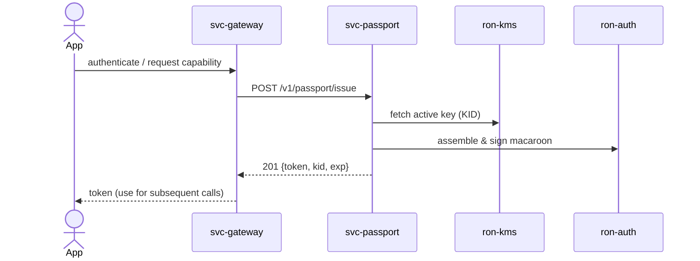
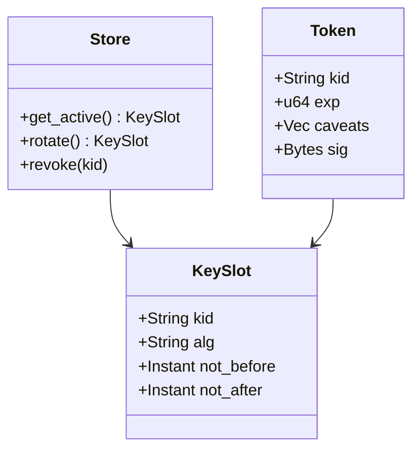
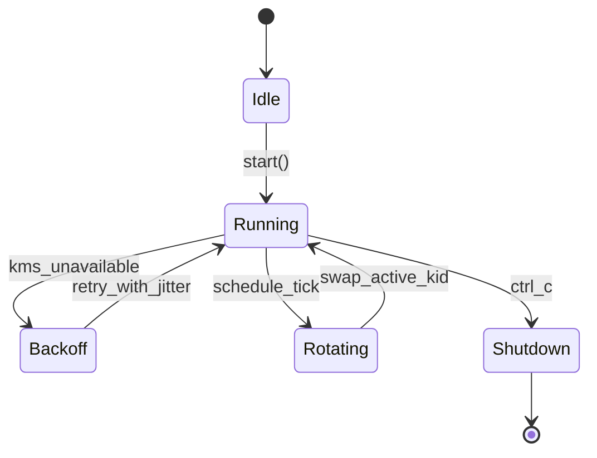

# svc-passport

> **Role:** service (identity & credential issuance)
> **Owner:** Stevan White (maintainer)
> **Status:** draft → beta (when acceptance gates pass)
> **MSRV:** 1.80.0
> **Last reviewed:** 2025-10-10

Badges (optional):
[]() []()

---

## 1) Overview

**What it is (one paragraph):**
`svc-passport` is RustyOnions’ identity and credentialing service. It issues short-lived, capability-bearing **passports** (macaroon-style tokens) that callers present to other services. It integrates with `ron-auth` (verification/preflight decode) and `ron-kms` (key custody/rotation; PQ-hybrid readiness), honors **Amnesia Mode** (RAM-first, minimal persistence), and avoids PII accumulation by design. Tokens are scoped, attenuatable, and revocable, enabling least-privilege access across the substrate.

**How it fits (RustyOnions topology):**

* **Pillar:** 3 — Identity & Key Management
* **Upstream callers:** `svc-gateway` (ingress issuance), `omnigate`, apps via `ron-app-sdk`
* **Downstream deps:** `ron-kms` (key material & rotation), `ron-auth` (verify/preflight), `ron-metrics`, `ron-policy` (optional rules), `svc-registry` (signed topology)
* **Data it touches:** in-memory key slots, optional sealed keystore, network
* **Security boundary:** trust zone for key custody and token minting; **no user PII stored** beyond minimal non-identifying audit fields (time/issuer/KID)

### 1.1 High-Level Architecture

```mermaid
flowchart LR
  subgraph ClientNode
    A[Caller or SDK] -->|authn| B(svc-passport)
  end

  B -->|verify & attenuate| C[ron-auth]
  B -->|keys & rotation| D[ron-kms]
  B -->|policy (optional)| F[ron-policy]
  B -->|metrics/health| E[ron-metrics]

  style B fill:#0b7285,stroke:#083344,color:#ffffff
```

---

## 2) Responsibilities & Boundaries

**MUST do (core responsibilities):**

* [ ] Mint **short-TTL** capability tokens (macaroon-style) with audience binding and caveat attenuation.
* [ ] Maintain **rotation** and **KID** mapping; publish revocation hints.
* [ ] Expose health/readiness/metrics; log **key IDs only** (no secrets, no PII).
* [ ] Honor **Amnesia Mode** (RAM-first caches; sealed storage optional; zeroization).

**MUST NOT do (anti-scope / boundaries):**

* [ ] No durable user profile/PII store; no identity graph.
* [ ] No ingress policy enforcement (quotas/DRR belong in `svc-gateway`).
* [ ] No verification monopoly — authoritative verification is `ron-auth` (service/library). `/verify` here is **preflight** only.

**Acceptance Gates (PROOF you did it):**

* [ ] Unit/prop tests for issuance, attenuation, expiry, revocation (see `docs/TESTS.md`).
* [ ] `request_latency_seconds{route="/v1/passport/issue"}` histogram exported; SLO alarms wired.
* [ ] `/readyz` blocks mint when keys unavailable; reflects config reload transitions.
* [ ] Bench p95 **≤ 25 ms** for `/issue` locally under nominal load.
* [ ] Concurrency invariants proven in `docs/CONCURRENCY.md` loom tests.
* [ ] PQ-hybrid negotiation covered in `docs/QUANTUM.md` (accept_algs/proof).
* [ ] API invariants match `docs/API.md` (CI public API diff clean).

---

## 3) Public Interfaces

### 3.2 Bus RPC / Events (service)

* **RPC:** `mint_cap(MintRequest) -> MintResponse` (topic: `ron://passport/mint`) — **experimental/off by default**; HTTP is canonical.
* **Events Emitted:**

  * `KernelEvent::Health { service:"svc-passport", ok }`
  * `KernelEvent::ConfigUpdated { version }` on rotation/config reload
  * `PassportRevoked { kid, reason }` (typed event)
* **Subscribed Topics:** `PolicyUpdated`, `RegistryUpdated`

> Feature gate: `--features bus-rpc`. Default: off. HTTP remains canonical per `docs/INTEROP.md`.



### 3.3 HTTP (service)

**Base URL:** `http://<host>:<port>/v1/`

**Endpoints:**

* `POST /v1/passport/issue` → `201 Created { token, kid, alg, exp, caveats[] }`
  **Request (JSON):**

  ```json
  {
    "subject_ref": "opaque-user-or-service-handle",
    "audience": "svc-mailbox",
    "ttl_s": 900,
    "caveats": [
      "svc=svc-mailbox",
      "route=/mailbox/send",
      "budget.bytes=1048576",
      "rate.rps=5"
    ],
    "accept_algs": ["ed25519+ml-dsa", "ed25519"],
    "proof": null
  }
  ```

* `POST /v1/passport/verify` → `200 OK { ok, parsed:{ alg, kid, exp, caveats[] }, warnings[] }`
  *(non-authoritative preflight decode; authoritative verify is `ron-auth`)*

* `POST /v1/passport/revoke` → `202 Accepted { current_epoch }`
  **Request (one of):**

  ```json
  {"token_ref": "opaque-ref", "reason": "compromise"}
  ```

  ```json
  {"kid": "issuer-v2", "reason": "rotation"}
  ```

* `GET /healthz` → `200 OK {status:"ok"}`

* `GET /readyz` → `200 OK {ready:true}` or `503` with `Retry-After`

* `GET /metrics` → Prometheus text

> Canonical examples and error envelopes: see [`docs/API.md`](./docs/API.md) and [`docs/INTEROP.md`](./docs/INTEROP.md).

### Supported Caveats (whitelist)

| Caveat         | Type   | Example                | Effect / Notes                           |
| -------------- | ------ | ---------------------- | ---------------------------------------- |
| `svc`          | string | `svc=svc-mailbox`      | Audience service binding                 |
| `route`        | string | `route=/mailbox/send`  | Path scoping within the audience         |
| `scope`        | string | `scope=read:name`      | Fine-grained capability label            |
| `region`       | string | `region=us-east-1`     | Geographic limit                         |
| `budget.bytes` | int    | `budget.bytes=1048576` | Payload/egress budget                    |
| `rate.rps`     | number | `rate.rps=5`           | Client-side rate cap                     |
| `exp`          | int ts | `exp=1736200000`       | Upper-bound expiry (must be ≤ token exp) |

> Requests containing non-whitelisted caveats yield `MintError::BadCaveat`.

---

## 4) Configuration

> Prefer environment variables first. Provide sane defaults. Hot-reload via `config::spawn_config_watcher()`; `/readyz` reflects transitioning states.

| Variable            | Type   | Default       | Description                                    |
| ------------------- | ------ | ------------- | ---------------------------------------------- |
| `BIND`              | socket | `127.0.0.1:0` | Service bind address                           |
| `ISSUER`            | string | `ron://id`    | Issuer URI embedded in tokens                  |
| `DEFAULT_TTL_SECS`  | int    | `900`         | Default token lifetime                         |
| `MAX_TTL_SECS`      | int    | `3600`        | Upper bound on TTL                             |
| `ROTATION_PERIOD_S` | int    | `86400`       | Key rotation cadence                           |
| `ALLOW_ATTENUATION` | bool   | `true`        | Allow adding caveats to reduce authority       |
| `AMNESIA`           | bool   | `true`        | RAM-first behavior; suppress on-disk artifacts |
| `METRICS_ADDR`      | socket | `127.0.0.1:0` | Prometheus exporter bind                       |
| `LOG_LEVEL`         | string | `info`        | tracing level (`trace`..`error`)               |

**Flags (if any):**

```
--bind 0.0.0.0:9085
--ttl 900
--max-ttl 3600
--rotation 86400
--issuer ron://passport.default
--amnesia on
```

**Feature flags (Cargo):**

* `default = ["tokio", "serde"]`
* `pq-hybrid` — prepare KEM/SIG hybrid KIDs via `ron-kms`
* `arti` — enable Tor transport (test harness via `ron-transport`)

---

## 5) Build, Run, Test

**Build**

```
cargo build -p svc-passport
```

**Run (service)**

```
RUST_LOG=info BIND=127.0.0.1:9085 METRICS_ADDR=127.0.0.1:9605 cargo run -p svc-passport
```

**Tests (unit/prop/docs)**

```
cargo test -p svc-passport --all-features
cargo test -p svc-passport --doc
```

**Fuzz (Gold gate targets)**

```
cargo fuzz run envelope_parse
cargo fuzz run caveat_mutation
```

**Loom (concurrency invariants)**

```
RUSTFLAGS="--cfg loom" cargo test -p svc-passport --test loom_rotation -- --nocapture
```

**Mutation testing**

```
cargo mutants -p svc-passport --timeout 30
```

**Chaos (weekly)**

```
./testing/chaos/inject_kms_latency.sh 150ms   # adds jitter to KMS calls
./testing/chaos/rotate_under_load.sh          # rotates KID while issuing tokens
```

**Performance profiles**

```
cargo run -p svc-passport --release -- --bind 127.0.0.1:9085 &
./testing/load/issue_profile.sh testing/profiles/issue_80_20_local.json
```

**Coverage & gates**

```
cargo llvm-cov --workspace --fail-under-lines 90
```

**Lint & format**

```
cargo fmt --all
cargo clippy -p svc-passport -- -D warnings
```

**Security & deps**

```
cargo deny check
```

**Bench (if provided)**

```
cargo bench -p svc-passport
```

---

## 6) Observability

**Endpoints (service):**

* `/metrics` — Prometheus exposition
* `/healthz` — liveness (fast, dependency-light)
* `/readyz` — readiness (keys loaded, rotation healthy, policy cache OK)

**Canonical Metrics (align with RustyOnions):**

* `requests_total{route,method}` — counter
* `request_latency_seconds{route,method}` — histogram
* `mint_issued_total{kid}` — counter
* `revoke_total{reason}` — counter
* `key_rotation_total{kid}` — counter
* `errors_total{stage,kind}` — counter
* `service_restarts_total{service="svc-passport"}` — counter
* `bus_lagged_total{service="svc-passport"}` — gauge/counter

**Tracing**
Targets: `svc-passport=info,axum=warn,tower_http=warn`
Span fields: `request_id`, `peer_addr`, `route`, `kid`, `ttl`, `status`

**PromQL quick checks**

```promql
sum by (route) (rate(requests_total{route="/v1/passport/issue"}[5m]))
histogram_quantile(0.95, sum(rate(request_latency_seconds_bucket{route="/v1/passport/issue"}[5m])) by (le))
increase(key_rotation_total[1d])
```

**SLO burn (example 99% latency SLO)**

```promql
histogram_quantile(0.99, sum(rate(request_latency_seconds_bucket{route="/v1/passport/issue"}[5m])) by (le)) > 0.025
```

**CI SLO enforcement**

* P95 `/v1/passport/issue` ≤ 25ms (regression >10% fails CI).
* Revocation propagate p99 ≤ 5s in chaos profile.
* PromQL checks run in CI via canary harness (see `.github/workflows/obs.yml`).

---

## 7) Performance & SLOs

| Metric                   | Target  | Notes                                                   |
| ------------------------ | ------- | ------------------------------------------------------- |
| P50 mint                 | ≤ 8 ms  | in-AZ, warm keys                                        |
| P95 mint                 | ≤ 25 ms | includes policy/caveat assembly                         |
| Start-to-ready           | < 1 s   | cold start                                              |
| Verify latency           | parity  | `ron-auth` parity via doc/integration tests             |
| Revocation propagate p99 | ≤ 5 s   | epoch/deny-list visibility across verifiers (chaos SLO) |

> Reproduce on dev metal with `--release`, default TTL, and in-AZ `ron-kms`.
> CI gate: fail PR if p95 revocation propagation exceeds 5 s in chaos profile.

---

## 8) Data & Schema

**Data model (summary)**

* **KID registry:** in-memory map `KID -> KeySlot` (sealed storage optional).
* **Token envelope:** macaroon with caveats `{aud, exp, scope[], region?, budget?, rate?}` signed by active KID.
* **Audit record (minimal, non-identifying):** `{time, kid, op: issue|attenuate|revoke, audience_hash}` — audience label is salted+hashed if logged.



**Migrations**

* Rotation is additive; older KIDs accepted for verify until grace expires.
* Revocation is immediate for issuance; consumers refresh deny-list cache (short TTL).

---

## 9) Security & Privacy

* **Threat model (STRIDE summary):**

  * *Spoofing:* tokens signed by active KID; audience and issuer enforced.
  * *Tampering:* signatures cover caveats; attenuation produces a new token.
  * *Repudiation:* minimal, append-only audit (no PII), time-boxed retention.
  * *Disclosure:* secrets never logged; only KIDs; audience labels hashed (salted).
  * *DoS:* quotas in gateway; bounded semaphores; timeouts; backpressure.
  * *EoP:* attenuation only reduces authority; scope whitelist.

* **Key handling:** via `ron-kms`; zeroization on drop; sealed storage optional; rotation ≤ 30d; PQ-hybrid (feature-gated).

* **PII:** None stored.

* **AuthN/Z:** Issuance requires prior auth; capabilities minted with least privilege.

* **Input validation:** length limits, TTL bounds, caveat whitelist, explicit timeouts.

* **Supply chain:** workspace pins; `cargo deny`/`cargo audit` clean.

---

## 10) Error Taxonomy

| Code/Variant              | When it happens                | User hint                   | Retries        |
| ------------------------- | ------------------------------ | --------------------------- | -------------- |
| `ConfigError::MissingVar` | required env absent            | set the variable            | no             |
| `KeyError::Unavailable`   | KMS not ready or no active key | try later                   | yes (jittered) |
| `MintError::BadCaveat`    | caveat not allowed/too large   | remove/adjust caveat        | no             |
| `MintError::TTLExceeded`  | ttl > max or negative          | lower TTL                   | no             |
| `StateError::Revoked`     | KID or token ref revoked       | re-auth & issue a new token | no             |

---

## 11) Concurrency Model

* **Runtime:** tokio (1.x), cooperative tasks.
* **I/O:** explicit timeouts; single-writer discipline where applicable.
* **Channels:** bounded queues for mint path; broadcast bus for events.
* **Rules:** never hold a lock across `.await` in supervisory paths; rotation is atomic (swap active key slot).



---

## 12) Compatibility & Requirements

* **Rust:** MSRV 1.80.0
* **OS:** macOS 10.15+, Linux x86_64; containers OK
* **TLS:** `tokio_rustls 0.26.x`
* **HTTP:** `axum 0.7.x`, `tower-http 0.6.x`
* **DB:** none required; sealed keystore optional

---

## 13) Examples

**Issue**

```
curl -sS -X POST http://127.0.0.1:9085/v1/passport/issue \
  -H 'content-type: application/json' \
  -d '{
    "subject_ref":"cli-test",
    "audience":"svc-mailbox",
    "ttl_s":900,
    "caveats":["svc=svc-mailbox","route=/mailbox/send","rate.rps=5"],
    "accept_algs":["ed25519+ml-dsa","ed25519"],
    "proof": null
  }' | jq .
```

**Verify (preflight)**

```
curl -sS -X POST http://127.0.0.1:9085/v1/passport/verify \
  -H 'content-type: application/json' \
  -d '{"token":"<paste-token>"}' | jq .
```

**Revoke (by KID)**

```
curl -sS -X POST http://127.0.0.1:9085/v1/passport/revoke \
  -H 'content-type: application/json' \
  -d '{"kid":"issuer-v2","reason":"rotation"}' | jq .
```

---

## 14) Troubleshooting

* **`/readyz` 503:** KMS not ready or rotation in progress — check `key_rotation_total` and logs.
* **TTL rejected:** `ttl_s` > `MAX_TTL_SECS`; lower it.
* **High latency:** check CPU throttling, excessive tracing; run with `--release`.
* **Revocation not visible:** allow a short propagation window; verify consumers refreshed deny-list.

---

## 15) Development Notes

**Project conventions (RustyOnions):**

* Axum handlers end with `.into_response()`.
* Capability tokens (macaroons), not JWTs.
* Preflight `/verify` is **non-authoritative**; authoritative verify is `ron-auth`.
* Transport TLS uses `tokio_rustls::rustls::ServerConfig`.

**Pre-commit quickcheck**

```
cargo fmt --all
cargo clippy -- -D warnings
cargo test
cargo deny check
```

---

## 16) Mermaid Diagrams — Policy & Tooling (REQUIRED)

Every README must include at least:

1. Architecture (flowchart) — §1.1
2. Sequence — §3.2
3. State — §11

**Render locally (SVG)**

```
npm i -g @mermaid-js/mermaid-cli
mmdc -i docs/arch.mmd -o docs/arch.svg
```

**Render via Docker**

```
docker run --rm -v "$PWD":/data minlag/mermaid-cli mmdc -i docs/arch.mmd -o docs/arch.svg
```

**CI (GitHub Actions snippet)**

```yaml
name: render-mermaid
on: [push, pull_request]
jobs:
  mmdc:
    runs-on: ubuntu-latest
    steps:
      - uses: actions/checkout@v4
      - run: npm i -g @mermaid-js/mermaid-cli
      - run: |
          mkdir -p docs
          for f in $(git ls-files '*.mmd'); do
            out="${f%.mmd}.svg"
            mmdc -i "$f" -o "$out"
```

---

## 17) Roadmap & TODO

* [ ] **M1 — Bronze:** `/issue` + rotation + metrics + `/readyz`; amnesia ON verified.
* [ ] **M2 — Silver:** attenuation & revoke; deny-list cache for verifiers; PQ-hybrid KIDs behind feature flag.
* [ ] **M3 — Gold:** multi-region issuers; signed issuer registry; chaos tests (rotation under load).

---

## 18) Changelog

See [CHANGELOG.md](./CHANGELOG.md). Follow SemVer; document breaking changes with migration notes.

---

## 19) License

Dual-licensed under **MIT** or **Apache-2.0**. See [LICENSE-MIT](../LICENSE-MIT) and [LICENSE-APACHE](../LICENSE-APACHE).

---

## 20) Contributing

PRs welcome! Please run fmt/clippy/tests and include:

* Updated diagrams (if topology changed)
* Docs & examples
* Bench impact (if perf-sensitive)

> Also see: `docs/IDB.md` (Invariant-Driven Blueprint), `docs/QUANTUM.md`, `docs/CONCURRENCY.md`, `docs/TESTS.md`, `docs/INTEROP.md`, `docs/API.md`.
